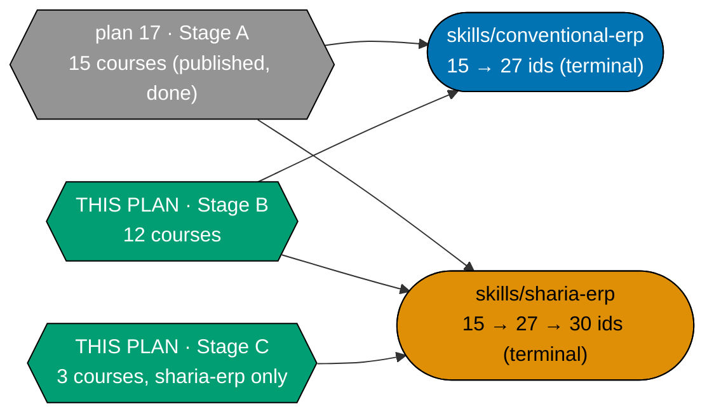

# Plan: Skills Path — ERP Enterprise Depth (Stage B + Stage C)

## Overview

Authors **Stage B — Conventional Enterprise Depth** (12 courses: `#13-16, 18-21, 24-27`) **and Stage
C — Sharia-Compliant Design** (3 courses, `sharia-erp` only: `#28-30`) — the remaining 15 of the
30-course ERP corpus. Grows both `skills/` ERP path manifests —
**`skills/conventional-erp`** and **`skills/sharia-erp`** — from the 15 ids
[`ayokoding-learning-path-17-skills-erp-foundations`](../ayokoding-learning-path-17-skills-erp-foundations/README.md)
publishes to their **terminal** state: **27 ids** for `conventional-erp`, **30 ids** for `sharia-erp`.
This is the second of a two-plan split of the retired single-plan design
`ayokoding-learning-path-07-skills-erp`. `blockedBy` plan 17 (hard).

## Why this plan exists (the split)

The retired source plan `ayokoding-learning-path-07-skills-erp` grew both manifests across three
authoring stages inside one plan. Splitting it lets Stage A (no accounting precondition) ship
independently while this plan carries the two stages that genuinely **do** wait on external work — the
accounting-split programme. See
[`ayokoding-learning-path-17-skills-erp-foundations/tech-docs.md` §Why split at the Stage A/B
boundary](../ayokoding-learning-path-17-skills-erp-foundations/tech-docs.md#why-split-at-the-stage-ab-boundary)
for the full reasoning, carried forward here without change.

## Scope

**In scope**: growing both ERP path manifests from 15 to their terminal 27/30 ids, 15 additional
course bodies (12 Stage B — 9 By Example, 3 Annotated-concept; 3 Stage C — 1 By Example, 2
Annotated-concept), 15 additional syllabus specs, the Sharia-specific licensing sub-section (Stage C),
and the full-corpus final verification, retest, and archival that closes out both `skills/` ERP paths
end to end.

**Out of scope (ownership)**: this plan never edits an accounting file, a careers manifest, a
component, a design asset, or a structural `_index.md`. It never re-authors any of plan 17's 15
Stage-A course bodies or syllabus files — it only **reads** plan 17's corpus for the cross-plan
prerequisite edges below.

## Cross-plan prerequisite edges into plan 17 (cite by specific id, not "Stage A must exist")

| This plan's course                                 | Depends on plan 17's course(s), by id                                                      |
| -------------------------------------------------- | ------------------------------------------------------------------------------------------ |
| `record-to-report-systems` (13)                    | `erp-subledger-to-gl-architecture` (6), `erp-fiscal-calendar-and-period-close` (7)         |
| `inventory-and-warehouse-management` (14)          | `erp-subledger-to-gl-architecture` (6)                                                     |
| `production-planning-and-mrp` (18)                 | `erp-bom-and-routing-architecture` (17)                                                    |
| `quality-management-and-inspection` (21)           | `erp-procurement-and-fulfillment-exceptions` (12), `erp-bom-and-routing-architecture` (17) |
| `human-capital-management-and-hire-to-retire` (24) | `erp-module-map-and-architecture` (3)                                                      |
| `erp-security-and-controls` (26)                   | `erp-module-map-and-architecture` (3)                                                      |
| `islamic-contract-based-transaction-flows` (29)    | `procure-to-pay-systems` (10), `order-to-cash-systems` (11)                                |

These seven edges are stated by specific course id, per this plan's own authoring instruction, rather
than a blanket "Stage A must be merged" — the blanket `blockedBy` on plan 17 (below) already guarantees
all 15 Stage-A ids exist; this table is the human/audit-readable record of **which** Stage-A ids each
of this plan's courses actually cites in its own frontmatter `prerequisites`.

## Accounting-split gates (re-pointed from the retired source plan's design)

The retired source plan's `ACCT_GATE_B`/`ACCT_GATE_C` course-id arrays are carried forward **unchanged
at the course-id level** — only the **plan each gate's `blockedBy` target names** is re-pointed, since
the accounting programme was itself split into three new plans by a sibling agent:
`ayokoding-learning-path-14-skills-accounting-foundations` (accounting courses `#1-11`),
`ayokoding-learning-path-15-skills-accounting-enterprise-reporting` (accounting courses `#12-19`,
`conventional-accounting` terminates here, `blockedBy` plan 14), and
`ayokoding-learning-path-16-skills-accounting-sharia-extension` (accounting courses `#20-24`,
`sharia-accounting` terminates here, `blockedBy` plan 15).

- **`ACCT_GATE_B`** (`financial-statements-and-close-cycle`, `inventory-and-cogs-accounting`,
  `payroll-and-tax-accounting-essentials`, `consolidation-and-multi-entity-accounting`,
  `audit-controls-and-compliance`) — the first two are accounting courses `#3` and `#10`, both inside
  plan 14; the remaining three are accounting courses `#16`, `#13`, `#15`, all inside plan 15. **This
  plan's real `blockedBy` target for `ACCT_GATE_B` is plan 15 fully merged** — plan 15 is itself
  `blockedBy` plan 14, so plan 15's completion transitively guarantees plan 14's courses exist too;
  naming both plans as separate `blockedBy` targets would be redundant. See
  [tech-docs.md §Accounting-split gates, re-pointed](./tech-docs.md#accounting-split-gates-re-pointed).
- **`ACCT_GATE_C`** (`islamic-contract-modeling-for-systems`, `sharia-accounting-and-aaoifi-standards`)
  — accounting courses `#21` and `#20`, both inside plan 16. **This plan's `blockedBy` target for
  `ACCT_GATE_C` is plan 16 fully merged** — plan 16 is itself `blockedBy` plan 15, so this plan's
  internal phase order (Stage B, `blockedBy` plan 15 → Stage C, `blockedBy` plan 16, itself `blockedBy`
  plan 15) is naturally sequential and non-circular.

**Caveat, carried forward verbatim and re-pointed**: if the accounting-split plans (14/15/16) rename or
restructure any of these seven ids before this plan executes, the `ACCT_GATE_*` arrays in
[delivery.md](./delivery.md) must be updated to match before Stage B/C authoring starts.

## Dependencies

- **`blockedBy` (hard)**: `ayokoding-learning-path-17-skills-erp-foundations` — this plan's own start
  precondition; grows the manifests plan 17 publishes.
- **`blockedBy` (hard, transitive via plan 17)**: `ayokoding-learning-path-01-url-restructure`,
  `ayokoding-learning-path-02-schema-and-prerequisite-dag`, `ayokoding-learning-path-03-navigation-ui`,
  and `vercel-function-cost-reduction` — re-verified independently at this plan's own Phase 0 rather
  than assumed transitively, per this repo's general practice.
- **`blockedBy` (hard, staged)**: `ayokoding-learning-path-15-skills-accounting-enterprise-reporting`
  before Stage B authoring (Phase 2); `ayokoding-learning-path-16-skills-accounting-sharia-extension`
  before Stage C authoring (Phase 3).
- **No edge to any careers/course-authoring plan** — confirmed, matching plan 17's own finding.

## Course count and stage structure (this plan's slice)

| Stage                                           | Courses | Accounting precondition                      | Boundary reached                                                                         |
| ----------------------------------------------- | ------: | -------------------------------------------- | ---------------------------------------------------------------------------------------- |
| B — Conventional Enterprise Depth               |      12 | plan 15 (`conventional-accounting` complete) | Dangerous 2 (course 16 of 27/30), Dangerous 3 (course 27 — `conventional-erp` ENDS HERE) |
| C — Sharia-Compliant Design (`sharia-erp` only) |       3 | plan 16 (`sharia-accounting` complete)       | Dangerous 4 (course 30 — `sharia-erp` ENDS HERE)                                         |

**Total this plan authors**: 15 courses (10 By Example, 5 Annotated-concept). Combined with plan 17's
15 (8 By Example, 7 Annotated-concept), the full 30-course corpus (18 By Example, 12
Annotated-concept) is complete once this plan merges.

## Manifest growth this plan performs

`<CONVMAN>` (15 → 27, terminal) and `<SHARMAN>` (15 → 27 → 30, terminal) — see
[tech-docs.md §courseOrder arrays at each growth boundary](./tech-docs.md#courseorder-arrays-at-each-growth-boundary)
for the exact insertion positions, carried forward verbatim from the retired source plan.

## Licensing (A8)

General ERP licensing posture is **inherited by consumer echo** from plan 17 (this plan's Stage B
courses cite the same per-project licence table; see
[tech-docs.md §Corpus Custody](./tech-docs.md#corpus-custody)). This plan's **own** first-class
addition is the **Sharia-specific licensing sub-section** for Stage C — the AAOIFI FAS
verbatim-reproduction rule and the PSAK-numbering carry-forward. See
[tech-docs.md §Licensing and IP Compliance — Stage C addendum](./tech-docs.md#licensing-and-ip-compliance--stage-c-addendum-a8).

## Rule-15 retest decision

This plan runs its **own** three-tester Rule-15 retest at its own terminal checkpoint (both manifests
at their final 27/30-id state) — this is **not** redundant with plan 17's own Stage A retest, since
each verifies a distinct, independently-shipped state of the same two landings. See plan 17's
[tech-docs.md §Rule-15 retest split decision](../ayokoding-learning-path-17-skills-erp-foundations/tech-docs.md#rule-15-retest-split-decision)
for the shared reasoning.

## Delivery Mode

`worktree-to-pr` — see [delivery.md](./delivery.md#delivery-mode-worktree-to-pr). No `[HUMAN]` merge
gate is declared; `[AI]` merges every delivery unit once the PR-Review Maker→Fixer Cycle and CI are
green. Phase 0 opens no PR; the earliest PR is Phase 1's.

## Related documents

- [brd.md](./brd.md) — business rationale, risks.
- [prd.md](./prd.md) — product spec, personas, Gherkin scenarios.
- [tech-docs.md](./tech-docs.md) — the 15-course slice, the accounting-gate re-pointing, prerequisite
  graph, licensing addendum, and every Design Decision.
- [delivery.md](./delivery.md) — the phased execution checklist.
- [syllabus/](./syllabus/README.md) — this plan's own 15 per-course syllabus specs and two
  path-manifest mirrors (full 27/30-id orderings; the first 15 ids in each are references into plan
  17's corpus, not copies).

## Predecessor plan

[`ayokoding-learning-path-17-skills-erp-foundations`](../ayokoding-learning-path-17-skills-erp-foundations/README.md)
— Stage A (15 courses), `blockedBy` nothing accounting-related, already published both manifests at
15 ids before this plan starts.
