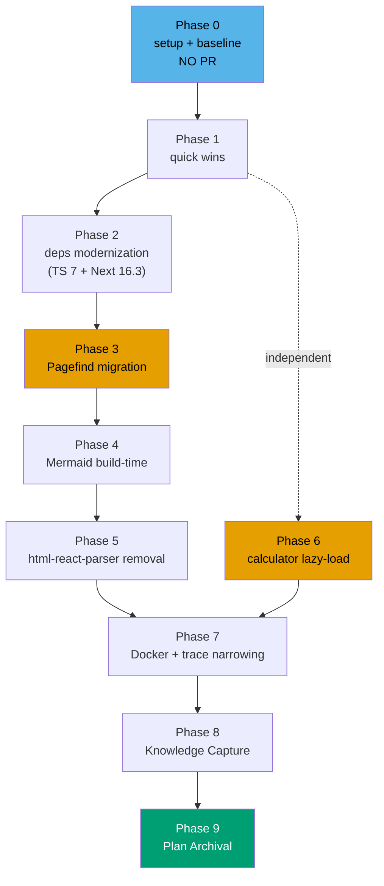

# ayokoding-www Cost Reduction

A runtime-and-hosting cost reduction pass for [`apps/ayokoding-www`](../../../apps/ayokoding-www/) (the
AyoKoding educational content platform at [ayokoding.com](https://ayokoding.com)) — bundled with a
dependency modernization sweep that respects the repo's [Dependency Bump Stability & Safety Policy](../../../repo-governance/development/workflow/dependency-bump-policy.md)
(three-path: LTS / 60-day soak / security waiver, exact pins, CVE-clean).

The plan cuts four cost lines the app currently spends:

- **Build minutes** — full SSG over 2,008 markdown routes plus two prebuild generators
  (`generate-indexes`, `generate-search-data`) on every build, plus a non-reproducible
  `npx oxlint@latest` lint invocation that pays a network round-trip per CI run.
- **Image size & cold start** — the Dockerfile copies **97 MB of `content/`** into the runtime image
  for runtime `fs.readFile`, plus a **3 MB `generated/search-data.json`** shipped via
  `outputFileTracingIncludes: { "/**": ["./content/**/*", "./generated/**/*"] }` — a glob pattern
  Next.js's own docs warn against.
- **Client bundle weight** — `flexsearch@0.7.43` (stale major) ships a 3 MB search index baked into
  the client bundle; `mermaid@11` ships ~700 KB to the client for diagram rendering;
  `cities.ts` (79 KB) + `roles.ts` (76 KB) of hand-curated calculator data ship on the calculator
  route's initial bundle.
- **Maintenance / security debt** — `html-react-parser` is explicitly **not XSS-safe** per its own
  README, used to render content HTML at runtime; `TypeScript 5.8.3` is pinned while TS 7.0
  (Go-native, 8–12× faster `tsc`) is GA and supported by Next.js 16.3+; the README's source-layout
  table omits the `cost-of-living-calculator` feature; the `vitest.config.ts` `lines: 80` and
  `project.json` `--coverage.thresholds.lines=82` mismatch;

## Context

Solo-maintainer polyglot Nx monorepo (see [AGENTS.md](../../../AGENTS.md)). The repo already runs one
hand-curated static-data tool — `cost-of-living-calculator` — and is mid-way through an active
content programme ([`ayokoding-learning-path-04`](../../done/2026-08-02__ayokoding-learning-path-04-course-authoring/README.md))
that is shipping roughly one course per week, plus the now-completed
[`ayokoding-www-tools-ai-benchmark`](../../done/2026-07-30__ayokoding-www-tools-ai-benchmark/README.md), which
shipped the same calculator-style surface. **Concurrent sessions are likely** during plan execution, so every
unit binds one worktree → one branch → one PR per the `worktree-to-pr` default.

Research cited in [`tech-docs.md`](./tech-docs.md) §Appendix A was gathered by `web-researcher` on
2026-07-28 against Vercel KB, Next.js docs, Pagefind, flexsearch, rehype-pretty-code, shiki,
rehype-mermaid, oxlint, Microsoft TS 7.0 announcement, webpack SplitChunks, and the
html-react-parser README.

## Scope

**In scope**

- Five quick-win config/docs fixes (one delivery unit) — see [`prd.md`](./prd.md) §Product scope F-1…F-5.
- A dependency modernization pass: TypeScript 7 side-by-side alias (Go-native `tsc`), Next.js
  patch-bump to 16.3+ as the TS-7 floor, React 19 patch, Zod patch, shiki patch, exact pinning of
  currently caret-pinned `@trpc/*` minors — each bump classified under the repo's Path A / Path B /
  Path C.
- The **Pagefind migration**: drop `flexsearch` and `serverExternalPackages` carve-out; rewrite
  `src/features/search/` to load Pagefind's auto-generated, CDN-serveable static index; remove the
  `generate-search-data` Nx target and its duplicated invocation in `vercel.json`.
- The **Mermaid build-time migration**: drop client `mermaid@11`; add `rehype-mermaid` with
  `strategy: "inline-svg"` and one shared Playwright/Chromium browser per build.
- The **`html-react-parser` audit and removal**: replace any runtime content-HTML parsing with
  build-time `rehype-react` in the rehype pipeline; drop the dep entirely.
- The **calculator data lazy-load**: split `cities.ts` + `roles.ts` into chunks loaded via dynamic
  `import()` on calculator route entry — ~155 KB off the initial bundle.
- The **Docker base + trace narrowing**: switch base `node:24-alpine` → `node:24-slim` (per Next.js
  with-docker example); narrow `outputFileTracingIncludes` from `"/**"` to selective per-route
  globs; audit `generated/**` for what is truly needed at runtime.
- Companion `specs/apps/ayokoding/behavior/ayokoding-www/gherkin/tools/cost-reduction` scenarios for
  the behavior-changing phases (search, mermaid rendering, calculator lazy-load), bound by
  `vitest-cucumber` unit steps and `playwright-bdd` e2e steps.

**Out of scope (named, not silently dropped)**

- The `id` locale's 124-file stub versus `en`'s 1,884 — the bilingual claim is mostly nominal but
  fixing (or honestly downgrading) it warrants its own plan. Recorded as known debt.
- ISR migration for the catch-all content route — research verified ISR drops build minute near
  linearly with the pre-build route count, but the plan keeps **full SSG for every route whose render
  is compatible** (every statically enumerable content page, every hub/category/arc/landing that does
  not depend on `AYOKODING_WEB_MANIFESTS_DIR` runtime data). The catch-all
  `[locale]/(content)/[...slug]/page.tsx` therefore keeps its existing `generateStaticParams`
  enumerating all 1,884 content slugs and its `dynamicParams = true` flag covering only the
  `learn/paths/**` on-demand namespace (the manifest-driven routes that cannot be statically baked at
  build time). This preserves the **0 ms first-visit, 0 ISR-metering** properties of full SSG. The
  ~3–12 min weekly build-minute cost an ISR migration would remove is acknowledged but deferred
  until a future plan measures actual build pressure; the runtime cost lines this plan targets —
  bundle, image, security debt — are orthogonal to build-minute tiering.
- Internalizing the 97 MB `content/` into the build (build-time ingestion) — would eliminate
  `fs.readFile` at runtime and drop `content/` out of the standalone trace entirely, but it is a
  bigger content-pipeline re-architecture than this plan's scope tier permits. Status quo: runtime
  `fs.readFile`, with narrowed trace patterns only.
- The mechanical-manual workspace hoisting in `Dockerfile:18-21` — proper `npm ls`-visible
  workspace link instead of `cp -r libs/web-ui/src/` would fix the brittleness but requires a
  standalone-output layout fix that rivals the trace-narrowing surface area.
- The `cost-of-living-calculator` route's two `jsx-a11y` suppressions (`calculator-content.tsx:285`
  `onClick` on a `
`, `min-role.tsx:455` `label-has-associated-control`) — flagged as known A11y
  debt, deferred to a focused A11y plan rather than bundled here.
- Replacing the misfiled `src/features/cost-of-living-calculator/shell/next-config-security.unit.test.ts`
  with a proper home — small but unrelated debt.
- The two `eslint-disable react-hooks/exhaustive-deps` suppressions in `calculator-content.tsx:57`
  — intentional, not in scope.

## Approach summary

The serial spine (Phases 1 → 2 → 3 → 4 → 5 → 7) is forced by shared files — `package.json`,
`next.config.ts`, `project.json`, `vercel.json` — which the
[Delivery Checklists Express a DAG HARD RULE](../../../repo-governance/conventions/structure/plans.md#delivery-checklists-express-a-dag-hard-rule)
treats as dependency edges. Phase 6 (calculator lazy-load) touches only `cost-of-living-calculator/`
shell files and is the sole genuinely independent producing node — it MAY run in parallel with
Phases 3, 4, or 5. The full `### Delivery Boundaries` table and the per-phase worktree paths live in
[`delivery.md`](./delivery.md).

## Documents

| Document                         | Contains                                                                                                            |
| -------------------------------- | ------------------------------------------------------------------------------------------------------------------- |
| [`brd.md`](./brd.md)             | Why this plan exists, who it serves, business risks, success signals                                                |
| [`prd.md`](./prd.md)             | Personas, user stories, the full product scope table, Gherkin acceptance criteria                                   |
| [`tech-docs.md`](./tech-docs.md) | Architecture, design decisions `DD-1`…`DD-N`, file-impact analysis, deps-policy binding, verified research appendix |
| [`delivery.md`](./delivery.md)   | Phased, TDD-shaped delivery checklist with phase gates, delivery boundaries table, and the parallelization model    |
| [`learnings.md`](./learnings.md) | Knowledge Capture running log, triaged before archival                                                              |

## Delivery at a glance

- **Delivery Mode**: `worktree-to-pr` (the repo default) — see
  [`delivery.md`](./delivery.md#delivery-mode-worktree-to-pr).
- **Worktree**: one per delivery unit — `worktrees/ayokoding-www-cost-reduction-<unit-slug>/`. See
  [`delivery.md`](./delivery.md#worktree) and its Delivery Boundaries table.
- **Phases**: 10 (Phase 0 setup through Phase 9 archival), grouped into 8 delivery units plus the
  terminal capture-archival unit.
- **Target app**: `apps/ayokoding-www` (port 3101, prod branch `prod-ayokoding-www`).
- **Surface gates**: UI-affecting at runtime, **not** UI-bearing (adds no new screens). Phases
  3 / 4 / 5 / 6 / 7 exercise reachable behavior and therefore run the
  [`ui/ui-quality-gate.md`](../../../repo-governance/workflows/ui/ui-quality-gate.md) static check
  plus the [`web/web-ux-test-fixing-planning.md`](../../../repo-governance/workflows/web/web-ux-test-fixing-planning.md)
  live-site triad (EWT/UWT/DWT) before archival — see [`delivery.md`](./delivery.md) Phase 8.

## Related

- [Dependency Bump Stability & Safety Policy](../../../repo-governance/development/workflow/dependency-bump-policy.md)
  — Path A / Path B / Path C decision tree the dep-modernization phase binds to.
- [`ayokoding-www-tools-ai-benchmark`](../../done/2026-07-30__ayokoding-www-tools-ai-benchmark/README.md) — the
  now-completed sibling plan that copied the `cost-of-living-calculator` FCIS pattern; their
  file-impact surfaces overlapped on `libs/web-ui-token/src/ayokoding.css` only.
- [`apps/ayokoding-www/README.md`](../../../apps/ayokoding-www/README.md) — the app README whose
  feature table this plan fixes (Phase 1) and whose source-layout convention this plan preserves.
