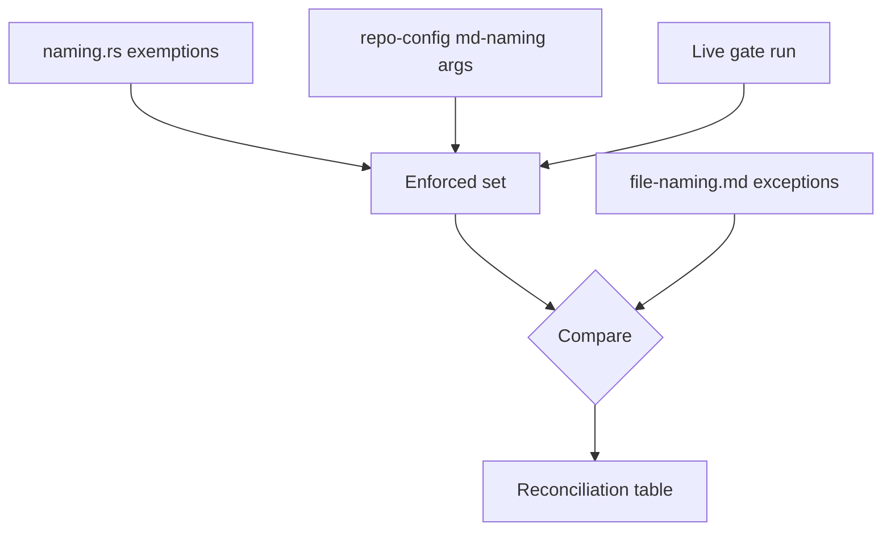

# Technical Documentation — File Naming Convention Rework

## 1. Derivation Method

Every claim this plan makes about "what is enforced" is derived from three sources, in this order —
never from reading the convention:

1. `apps/rhino-cli/src/application/docs/naming.rs` — the hard-coded exemption set and the extension
   filter.
2. `repo-config.yml` → the `md-naming` gate entry — `args.exempt` globs.
3. A live run of the gate against the real tree.

The convention is the **subject** of the audit, not an input to it. This is the method that produced
the defect list in `repo-rules-sweep/learnings.md` entry 6; reversing it would re-derive the drift.



## 2. WS-B1 — Reconcile `file-naming.md`

### The enforced set, as of the `repo-rules-sweep` audit

| Source        | Exemption                                                                                                                             |
| ------------- | ------------------------------------------------------------------------------------------------------------------------------------- |
| `naming.rs`   | `README.md`, `SKILL.md`, `AGENTS.md`, `CLAUDE.md`, `_index.md`, `CONTRIBUTING.md`, `LICENSING-NOTICE.md`, `ROADMAP.md`, `SECURITY.md` |
| gate registry | `*__linkedin__*.md`, `CONTRIBUTING.md` (redundant — already hard-coded)                                                               |
| convention    | `README.md`, `SKILL.md`                                                                                                               |

Re-derive this table at execution time; it is a snapshot, not a specification.

### Design

**State an admission criterion, not only a list.** Every exemption in the enforced set shares one
property: the filename is **mandated by something outside this repository** — GitHub's directory
index and contributing-guide conventions, the `agents.md` standard, the Claude Code Agent Skills spec
and root-instruction shim, Hugo's section file, GitHub's security and roadmap conventions. Stating the
criterion turns a list that grows by accretion into one that grows by judgment.

`*__linkedin__*.md` does **not** meet that criterion — it is this repository's own social-post naming
scheme, and it uses the double underscore the rule forbids. It needs either a stated
repository-internal exception with its own reason, or a rename of the scheme. That is a decision this
plan must make, not inherit.

**Replace the scope clause.** "and similar locations" becomes the evaluable statement: every tracked
`.md` file, minus the exemption set. If the intent is narrower than that, the narrower path set is
stated explicitly — but it must then match what the gate walks.

**Separate governed from enforced extensions.** The rule may still say what a `.svg` should be named;
it must say that only `.md` is gated.

### Word-budget consequence

`file-naming.md` is at 487 words in `ose-private` and comparable in `ose-public`, against a 500-word
FAIL threshold. The added content will not fit. Plan a child shard —
`file-naming/exemptions.md` — from the start, indexed from the parent's Children section so
`governance-readme-index` stays green.

## 3. WS-B2 — Repair the ordinal convention's self-contradiction

The table row:

| Filename                               | Current verdict                                                                                                                                  |
| -------------------------------------- | ------------------------------------------------------------------------------------------------------------------------------------------------ |
| `02-step-1-and-2-maker-and-checker.md` | "**Fails** — ordinal 02 labels steps 1–2, so the systems disagree → `02-maker-and-checker.md`, keeping the ordinal because the file _is_ a step" |

The verdict says "Fails" and then keeps the ordinal. The reconciling rule — for a step **range**, the
ordinal equals the first step — appears **below** the table and is never applied to this row.

By that rule the row is not a failure at all on question 2: ordinal 02 does not equal first step 1, so
this specific file **does** disagree, and the honest verdict is either "the ordinal is wrong and
becomes `01-`" or "range ordinals are positional, not first-step". Those are different rules and the
document currently implies both.

### Design

1. Decide which rule is intended. Evaluate each candidate against the real tree and state how many
   files each would rename.
2. Move the range clause **above** the table, so no row depends on text the reader has not reached.
3. Rewrite the row's verdict to match the chosen rule, using "Fails"/"Passes" consistently with what
   the row then does.
4. Re-run each repository's published non-vacuity command and confirm its result still matches that
   copy's claim — `ose-public` claims the keep-clause is non-vacuous, `ose-private` claims it is
   vacuous there. Both claims must survive the rule change or be restated.

## 4. WS-B3 — Truncated-stem collisions

### The instance

`ose-private` holds 18 groups (40 files) shaped like:

```text
04-anti-pattern-10-<...truncated...>-tha.md
05-anti-pattern-10-<...truncated...>-tha.md
```

Identical stems, different ordinals, produced by a word-budget split that truncated titles to a fixed
basename width. `ose-public` has zero instances, which is why WS-A never encountered the case.

### The rule gap

Both convention questions return the wrong answer:

- Question 1 (is it a step?) → **no**, so the keep-clause does not apply.
- Strip-clause → produces two identical filenames, so it cannot be applied either.

### Design

**The convention states a verdict.** The recommended shape, to be confirmed during execution: an
ordinal that is the **sole disambiguator** of otherwise-identical basenames is a symptom, not a
naming decision. The correct fix is distinct stems; the ordinal is retained only until they exist,
and the file is recorded as carrying a naming defect rather than as a compliant exception.

**The emitter refuses to create new instances.** The word-budget remediation tool that performs
splits gains a pre-write check: if two candidate basenames are equal after stripping their ordinals,
fail with both names in the message and write nothing. This is the only code change in the plan and
carries the usual TDD cycle, companion Gherkin, and four-repo parity obligation.

### Explicitly deferred

Renaming the 40 files. The verdict must exist first, and the rename is a sweep with its own risk
profile — the same shape as `repo-rules-sweep` WS-A, not a footnote to a convention edit.

## 5. Propagation

Both rules are restated across the rules machinery. Per Iron Rule 3, enumerate **every** site stating
either rule, per repository, with an auditable per-file verdict, before editing any of them:

- `.claude/agents/repo-rules/{checker,fixer,maker}.md` and their `.opencode/`, `.cursor/`,
  `.amazonq/` mirrors (regenerated, never hand-edited).
- `.claude/skills/repo-validating-governance-rules/` and `repo-rules-fixing/` reference modules.
- `repo-governance/workflows/repo/repo-rules-quality-gate/` shards.
- `governance-word-budget-remediation.md`, which tells authors how to name shards.

## 6. Testing Strategy

| Level                | What it covers                                                                          |
| -------------------- | --------------------------------------------------------------------------------------- |
| Reconciliation check | Enforced exemption set versus convention-stated set, both directions, run as a command. |
| Rust unit            | WS-B3's collision refusal, including the near-miss that must still be allowed.          |
| Cucumber (`specs/`)  | The `prd.md` scenarios for the emitter.                                                 |
| Governance gates     | `word-budget`, `readme-index`, `md links`, `vendor validate` — after every prose edit.  |

## 7. Related

- [`repo-rules-sweep`](../../in-progress/repo-rules-sweep/README.md) — declares WS-B; its
  `learnings.md` entries 6–8 are this plan's specification input.
- [`rhino-cli-governance-tooling-defects`](../rhino-cli-governance-tooling-defects/README.md) — the
  sibling follow-up. No execution dependency in either direction.
- [Governance Word-Budget Remediation](../../../repo-governance/conventions/structure/governance-word-budget-remediation.md) —
  the emitter WS-B3 changes.
