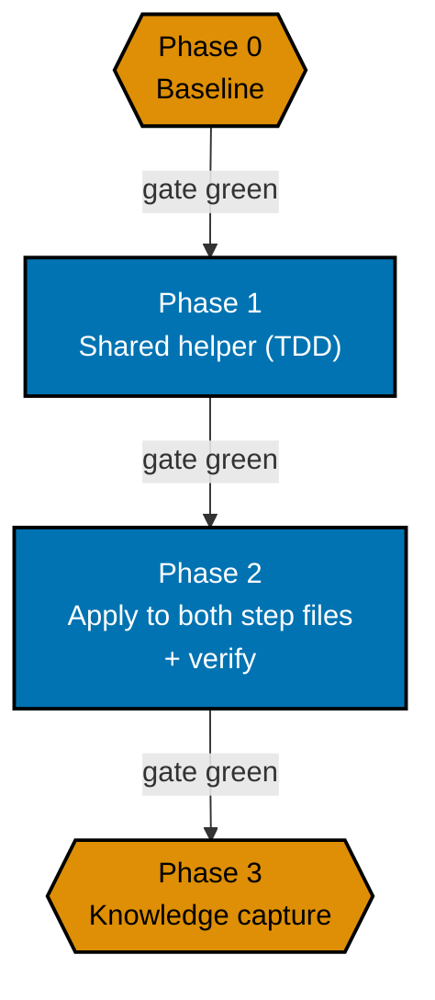

# Delivery Checklist: Harden `ayokoding-www-fe-e2e` Bulk-Link-Check Concurrency

**Delivery Mode**: `worktree-to-pr` (the repo default). One delivery unit, one PR — see
[Delivery Boundaries](#delivery-boundaries) below.

> **Legend** — `[AI]`: an agent performs the step (the default; unmarked steps are `[AI]`).
> `[HUMAN]`: only a human can do it (physical action, out-of-band approval, real-secret or
> privileged-credential handling). `[AI+HUMAN]`: agent prepares, human approves or finishes.
> Git-mechanical steps (worktree create/remove, branch, push, merge) are `[AI]`.
>
> **Phase Gate** — every phase ends with a `### Phase N Gate` (must-pass verification) plus a
> `> **Pause Safety**:` note (safe-to-stop state + resume command). Only the gate that closes this
> plan's single delivery unit (Phase 3 — see [Delivery Boundaries](#delivery-boundaries)) also covers
> integration (draft PR opened, 3-cycle PR-Review, CI green, `[AI]` merge); Phases 0-2 commit to the
> same branch and stay unopened for review until that boundary. A phase is not complete until every
> gate check is green.

## Worktree

Worktree path: `worktrees/harden-ayokoding-www-fe-e2e-bulk-link-concurrency/`

Optional manual pre-provisioning (run from repo root):

```bash
claude --worktree harden-ayokoding-www-fe-e2e-bulk-link-concurrency
```

See [Worktree Path Convention](../../../repo-governance/conventions/structure/worktree-path.md) and
[Plans Organization Convention §Worktree Specification](../../../repo-governance/conventions/structure/plans.md#worktree-specification).

## Parallelization Model

**Cap**: honor the in-force subagent/PR-review concurrency cap (parallel-by-default, background
subagents capped per the orchestration convention). The main thread self-promotes nothing.

Every phase in this plan is **serial** — Phase 1 builds the shared helper Phase 2 applies to both
step files, and Phase 3's knowledge capture closes out only once Phase 2's evidence is recorded.
There is no independent fan-out inside this small, single-delivery-unit plan.



**Accessibility note.** Phase kind is carried by node **shape** (hexagon = setup/verify, rectangle =
feature code) and by each node's own label; every edge carries a text condition, so nothing depends
on distinguishing the fills.

### Delivery Boundaries

| Phase(s) | Delivery unit                                                                       | Worktree / branch                                              | PR opens         |
| -------- | ----------------------------------------------------------------------------------- | -------------------------------------------------------------- | ---------------- |
| 0        | — (baseline)                                                                        | —                                                              | no               |
| 1-3      | Shared concurrency-bounded helper, applied to both step files, verified, and closed | `worktrees/harden-ayokoding-www-fe-e2e-bulk-link-concurrency/` | yes — at Phase 3 |

Phase 0 opens no PR — setup and baseline only, per
[§Phase 0 Opens No PR](../../../repo-governance/conventions/structure/plans.md#phase-0-opens-no-pr--the-earliest-pr-is-phase-1-hard-rule).
Phases 1-3 form this plan's single delivery unit: Phase 1 builds the shared helper but ships no
reachable change on its own (nothing calls it yet); Phase 2 wires it into both step files and is the
actual behavior change, but this plan is not "done" per its own Knowledge Capture requirement until
Phase 3 triages `learnings.md`; Phase 3's plan-folder move to `plans/done/` is the true final
change-producing step. All three only become one coherent, green, reviewable increment together, at
Phase 3.

## Phase 0: Baseline

- [ ] [AI] Confirm the two named step files still contain the unbounded-`Promise.all` pattern
      described in `tech-docs.md` (re-verify — this backlog item may sit unexecuted for a while and
      the pattern may have already changed) — acceptance: pattern confirmed present, or this plan is
      closed as moot if it's already been fixed by other means.
- [ ] [AI] Run `npx nx run ayokoding-www-fe-e2e:test:e2e` 2-3 times to re-baseline the observed flake
      rate before making any change — acceptance: baseline recorded (pass/fail per run).

### Phase 0 Gate

- [ ] [AI] Baseline recorded; pattern confirmed present or plan closed as moot.

> **Pause Safety**: only the pattern was confirmed and the flake rate baseline recorded — no code
> changed yet. Safe to stop indefinitely. To resume: re-run
> `npx nx run ayokoding-www-fe-e2e:test:e2e` 2-3 times and confirm the baseline still holds.

---

## Phase 1: Shared Concurrency-Bounded Link-Check Helper (TDD)

- [ ] [AI] **RED**: `apps/ayokoding-www-fe-e2e/src/steps/support/check-links-resolve.test.ts` —
      assert that, given more hrefs than the configured batch size and fake slow-responding request
      fn, in-flight requests never exceed the batch size — acceptance: fails (helper doesn't exist
      yet).
- [ ] [AI] **GREEN**: implement `checkLinksResolve(requestFn, hrefs, opts)` in
      `check-links-resolve.ts` — batches requests at a fixed concurrency limit, retries a single
      transport-layer failure once (see tech-docs.md Open Decisions for batch size resolution) —
      acceptance: RED test passes.
- [ ] [AI] **REFACTOR**: extract the retry-classification logic (which errors are
      transport-layer vs. assertion failures) into its own named predicate for clarity — acceptance:
      tests still pass, no behavior change.
- [ ] [AI] Companion Gherkin: add or extend
      `specs/apps/ayokoding/behavior/ayokoding-www/gherkin/navigation/` scenarios per
      `prd.md`'s three acceptance-criteria scenarios (per the Specs & Gherkin Completeness rule) —
      acceptance: `specs:behavior:coverage` covers the new scenarios.

### Phase 1 Gate

- [ ] [AI] `checkLinksResolve` implemented, unit-tested, Gherkin-covered.
- [ ] [AI] `typecheck`, `lint`, `test:quick`, `test:unit` exit 0 for `ayokoding-www-fe-e2e`.

> **Pause Safety**: the shared helper exists, is unit-tested, and is Gherkin-covered, but nothing
> calls it yet — both step files still use the old unbounded `Promise.all`, so no behavior has
> changed. Safe to stop indefinitely. To resume: re-run
> `npx nx run ayokoding-www-fe-e2e:test:unit` and confirm it is still green before starting Phase 2.

---

## Phase 2: Apply to Both Step Files and Verify

- [ ] [AI] Replace the `Promise.all` block in `ia-navigation-revamp.steps.ts` (both call sites) with
      `checkLinksResolve` — acceptance: same assertions, same messages, no behavior change to what
      counts as pass/fail.
- [ ] [AI] Replace the `Promise.all` block in `course-rehome-redirects.steps.ts` with
      `checkLinksResolve` — acceptance: same as above.
- [ ] [AI] Run `npx nx run ayokoding-www-fe-e2e:test:e2e` at least 5 times in a row (ideally
      alongside other concurrent `nx affected` load, matching the conditions that originally
      surfaced the flake) — acceptance: 5/5 clean passes with the same 578/759 (or current) pass
      count; zero network-layer failures.
- [ ] [AI] Re-run the two-file diff against `git diff --stat` to confirm no other files changed —
      acceptance: only the three files above (`check-links-resolve.ts` + its test +
      the two step files) changed.

### Phase 2 Gate

- [ ] [AI] 5/5 clean runs recorded as evidence in this section.
- [ ] [AI] Full affected suite (`typecheck lint test:quick test:unit test:integration test:e2e
specs:behavior:coverage`) exits 0.
- [ ] [AI] **No PR opens at this gate** — per [Delivery Boundaries](#delivery-boundaries), Phases 0-3
      are one delivery unit; this phase's commits stay on the same branch and continue directly into
      Phase 3, where the draft PR opens, runs its 3-cycle PR-Review, and merges.

> **Pause Safety**: both step files now call the shared helper and 5/5 clean e2e runs are recorded,
> but nothing is pushed for review yet — Phases 0-2 stay as local commits on the same branch until
> Phase 3's boundary. Safe to stop indefinitely. To resume: re-run the full affected suite and
> confirm it is still green before starting Phase 3.

---

## Phase 3: Knowledge Capture

- [ ] [AI] Triage `learnings.md` per the
      [Knowledge Capture Convention](../../../repo-governance/development/quality/knowledge-capture.md)
      — route or discard every entry, or record the explicit "none" escape.

### Phase 3 Gate

- [ ] [AI] Every `learnings.md` entry terminal.
- [ ] [AI] Plan folder moved to `plans/done/YYYY-MM-DD__harden-ayokoding-www-fe-e2e-bulk-link-concurrency/`.
- [ ] [AI] Draft PR opened (covers Phases 0-3 commits), 3-cycle PR-Review Maker→Fixer loop run, all 5
      hardened merge preconditions hold, `[AI]`-merged to `main`.

> **Pause Safety**: `learnings.md` is fully triaged and the plan folder is moved to `plans/done/`.
> Safe to stop indefinitely before the PR opens — nothing else depends on this plan. To resume (if
> interrupted after the PR opened but before it merged): check the PR's review-cycle and CI status,
> then finish the merge.
