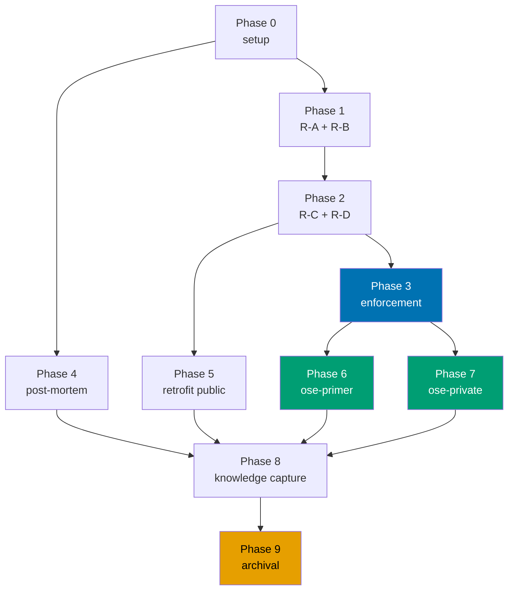

# Delivery: Plan Decision-Integrity Hardening

> **Legend** — `[AI]`: an agent performs the step (the default; unmarked steps are `[AI]`).
> `[HUMAN]`: only a human can do it (physical action, out-of-band approval, real-secret or
> privileged-credential handling). `[AI+HUMAN]`: agent prepares, human approves or finishes.

## Worktree

Worktree path: `worktrees/plan-decision-integrity-hardening-<unit-slug>/` — one per delivery unit,
per the [Delivery Boundaries](#delivery-boundaries) table below. The unit slugs are `rules`,
`enforcement`, `postmortem`, `retrofit-public`, and `archival` in `ose-public`; the two sibling repos
each use the single slug `propagation` in their own repo root.

Optional manual pre-provisioning (run from the relevant repo root):

```bash
claude --worktree plan-decision-integrity-hardening-rules
```

The plan-execution Step 0 gate enters the declared worktree by default: it auto-provisions from the
latest `origin/main` when missing, syncs with `origin/main` before implementing, and prompts before
deleting the worktree after the plan is archived and pushed.

**Plan-doc carve-out**: this plan's own five documents were authored, gated, and pushed directly on
`main` under the plan-docs-only carve-out. Every step below runs in a worktree.

## Delivery Mode: `worktree-to-pr`

Each delivery unit lands as its own branch and PR against that repo's `main`, opened at the unit's
boundary phase and merged once the hardened merge preconditions hold. Merges are `[AI]`.

## Parallelization Model

**Chosen N**: 3 (one main thread plus up to three background agents), the default. No reason to
deviate — the concurrent nodes here are three at most.

**Serial spine**: Phase 0 precedes everything. Phases 1-2 write the rule text that Phase 3's clause
list quotes, so Phase 3 is blocked by Phase 2. Phases 6 and 7 port the Phase 1-3 diff, so both are
blocked by Phase 3.

**Concurrent nodes**:

- Phase 4 (post-mortem) reads only `plans/done/` and is independent of Phases 1-3; it may run
  alongside them.
- Phases 6 and 7 target different repositories with no shared file and are independent of each
  other; they run in parallel.
- Phase 5 is blocked by Phase 2 (it audits against the rules) and touches only `ose-public` plan
  folders, so it may run alongside Phases 6 and 7.

Two nodes are independent only when neither reads what the other writes. Phases 6 and 7 both read
the Phase 3 output but write to disjoint repositories, so they qualify.

**Cleanup as terminal node**: Phase 9 (archival) depends on every other phase; no worktree is removed
until it runs.



### Delivery Boundaries

| Phase(s) | Delivery unit                   | Repo          | Worktree / branch                                             | PR opens         |
| -------- | ------------------------------- | ------------- | ------------------------------------------------------------- | ---------------- |
| 0        | — (setup and baseline)          | `ose-public`  | —                                                             | no               |
| 1-2      | Rule text (R-A, R-B, R-C, R-D)  | `ose-public`  | `worktrees/plan-decision-integrity-hardening-rules`           | yes — at Phase 2 |
| 3        | Enforcement wiring + bindings   | `ose-public`  | `worktrees/plan-decision-integrity-hardening-enforcement`     | yes — at Phase 3 |
| 4        | Post-mortem record              | `ose-public`  | `worktrees/plan-decision-integrity-hardening-postmortem`      | yes — at Phase 4 |
| 5        | `ose-public` open-plan retrofit | `ose-public`  | `worktrees/plan-decision-integrity-hardening-retrofit-public` | yes — at Phase 5 |
| 6        | `ose-primer` propagation        | `ose-primer`  | `worktrees/plan-decision-integrity-hardening-propagation`     | yes — at Phase 6 |
| 7        | `ose-private` propagation       | `ose-private` | `worktrees/plan-decision-integrity-hardening-propagation`     | yes — at Phase 7 |
| 8-9      | Knowledge capture and archival  | `ose-public`  | `worktrees/plan-decision-integrity-hardening-archival`        | yes — at Phase 9 |

Every change-producing phase appears in exactly one row.

## Phase 0: Environment Setup and Baseline

Phase 0 opens no PR, pushes no branch, and merges nothing. Its gate is the recorded clean baseline.

- [ ] [AI] Run `npm install` in `/Users/wkf/ose-projects/ose-public` — acceptance: exits 0 with no
      unmet peer-dependency error.
- [ ] [AI] Run `npm run doctor` in `/Users/wkf/ose-projects/ose-public` — acceptance: exits 0, or
      every reported drift is resolved before the gate.
- [ ] [AI] Run `npm run lint:md` and record the exit code and the finding count in
      `evidence/phase-0-baseline.txt` — acceptance: the file exists and states the pre-change baseline.
- [ ] [AI] Run `npm run format:md:check` and append its result to `evidence/phase-0-baseline.txt` —
      acceptance: the baseline records whether the tree is prettier-clean before any edit.
- [ ] [AI] Run `npm run validate:config` and append its result to `evidence/phase-0-baseline.txt` —
      acceptance: the binding-parity baseline is recorded before any `.claude/` edit.
- [ ] [AI] For each of `/Users/wkf/ose-projects/ose-primer` and `/Users/wkf/ose-projects/ose-private`,
      run `git -C <path> rev-parse --is-bare-repository` and `git -C <path> status --porcelain`, and
      append both results to `evidence/phase-0-baseline.txt` — acceptance: the file records each
      sibling's bareness and working-tree cleanliness, confirming deviation-matrix row 6.
- [ ] [AI] Re-run the C4 parity grep from `brd.md` across all three repos and append the fifteen-cell
      result table to `evidence/phase-0-baseline.txt` — acceptance: the recorded table matches the one
      in `brd.md`, or the discrepancy is investigated before proceeding.

### Phase 0 Gate

> All checks below must pass before starting Phase 1. If any check fails, fix it in Phase 0 before
> proceeding.

- [ ] [AI] `test -s plans/in-progress/plan-decision-integrity-hardening/evidence/phase-0-baseline.txt`
      — the baseline file exists and is non-empty.
- [ ] [AI] `npm run lint:md` — exits with the same status recorded in the baseline (no new findings
      introduced by setup).
- [ ] [AI] `git status --porcelain` in each of the three repos — no unexpected modifications beyond
      the baseline evidence file.

> **Pause Safety**: only `evidence/phase-0-baseline.txt` has been written; no convention, agent,
> skill, or plan document has changed in any repo. Safe to stop. To resume:
> `cat plans/in-progress/plan-decision-integrity-hardening/evidence/phase-0-baseline.txt`.

## Phase 1: R-A and R-B in the diagrams convention

Worktree: `worktrees/plan-decision-integrity-hardening-rules`. Not a delivery boundary — Phase 2 is.

- [ ] [AI] Create the worktree: `git worktree add -b plan-decision-integrity-hardening-rules worktrees/plan-decision-integrity-hardening-rules origin/main`
      — acceptance: `git worktree list` shows the new entry.
- [ ] [AI] In the worktree, edit `repo-governance/conventions/formatting/diagrams.md`: insert a new
      `### Primary Job Criterion (R-A)` subsection immediately after the four-stage funnel table in
      §Design Funnel (R6), using the five numbered clauses quoted verbatim from
      [`tech-docs.md` §R-A](./tech-docs.md#r-a--primary-job-criterion) — acceptance:
      `grep -c "Primary Job Criterion" repo-governance/conventions/formatting/diagrams.md` returns a
      non-zero count and the section contains all five clauses.
- [ ] [AI] In the same file, extend the §Design Funnel four-stage table's row 4 (`Justify`) so its
      "What lands in the plan" cell names the Primary Job Criterion row as required content —
      acceptance: the Justify row text mentions the Primary Job Criterion.
- [ ] [AI] In the same file, insert a new `### Elimination-Grade Evidence (R-B)` subsection after the
      new R-A subsection, using the four numbered clauses quoted verbatim from
      [`tech-docs.md` §R-B](./tech-docs.md#r-b--elimination-grade-evidence) — acceptance:
      `grep -c "Elimination-Grade Evidence" repo-governance/conventions/formatting/diagrams.md`
      returns a non-zero count.
- [ ] [AI] In the same file's §Responsive Design section, amend the low-fidelity bullet that reads
      "provide an ASCII wireframe (or an inline note)" so it states that the inline-note allowance
      applies to options carried forward and never to a drop reason, cross-linking the new R-B
      subsection — acceptance: the bullet contains a link to the R-B anchor and the word "drop".
- [ ] [AI] Add both new subsections to the file's §Related Documentation or in-page navigation if one
      lists the section's subsections — acceptance: no new subsection is unreachable from the section's
      own structure.
- [ ] [AI] Run `npm run format:md` then `npm run lint:md` — acceptance: both exit 0.
- [ ] [AI] Commit with `docs(governance): add Primary Job Criterion and Elimination-Grade Evidence rules to the design funnel`
      — acceptance: `git log -1 --format=%s` matches.

### Phase 1 Gate

> All checks below must pass before starting Phase 2. If any check fails, fix it in Phase 1 before
> proceeding.

- [ ] [AI] `grep -c "Primary Job Criterion" repo-governance/conventions/formatting/diagrams.md` —
      returns a count of at least 3 (the subsection heading, the Justify-row mention, and the
      override-record clause).
- [ ] [AI] `grep -c "carried forward" repo-governance/conventions/formatting/diagrams.md` — returns a
      non-zero count, proving the responsive-bullet amendment landed.
- [ ] [AI] `npm run lint:md` — exits 0.
- [ ] [AI] `npm run format:md:check` — exits 0.

> **Pause Safety**: `diagrams.md` now states R-A and R-B; nothing enforces them yet, so no existing
> plan is newly failing any gate. Safe to stop. To resume:
> `git -C worktrees/plan-decision-integrity-hardening-rules log --oneline -1`.

## Phase 2: R-C and R-D, and the Unit 1 PR

Same worktree as Phase 1. **Delivery boundary — Unit 1 PR opens here.**

- [ ] [AI] Edit `repo-governance/conventions/structure/plans.md`: in the `tech-docs.md` bullet of the
      Multi-File Structure file-purposes list, add the conditional `## Prior-Decision Reversal Record`
      requirement, cross-linking the new section below — acceptance: the `tech-docs.md` bullet names
      the record.
- [ ] [AI] In the same file, add a new `### Prior-Decision Reversal Record` subsection after
      `### Delivery Mode`, carrying the four numbered clauses and the four-row disposition table quoted
      verbatim from [`tech-docs.md` §R-C](./tech-docs.md#r-c--prior-decision-reversal-record) —
      acceptance: `grep -c "changed-constraint" repo-governance/conventions/structure/plans.md`
      returns a non-zero count.
- [ ] [AI] Edit `repo-governance/development/quality/user-facing-delivery-hardening.md`: append
      **Rule 17** to the numbered rule list, using the four numbered clauses quoted verbatim from
      [`tech-docs.md` §R-D](./tech-docs.md#r-d--enumerated-vocabulary-consistency) — acceptance:
      `grep -c "Enumerated-Vocabulary Record" repo-governance/development/quality/user-facing-delivery-hardening.md`
      returns a non-zero count.
- [ ] [AI] In the same file, change the section heading `## The Sixteen Rules` to
      `## The Seventeen Rules`, and update the sentence beneath it that describes which rules map to
      incident lessons so it accounts for Rule 17 — acceptance:
      `grep -c "The Sixteen Rules" repo-governance/development/quality/user-facing-delivery-hardening.md`
      returns 0.
- [ ] [AI] Grep all three of `repo-governance/`, `.claude/agents/`, and `.claude/skills/` for the
      literal string `Sixteen Rules` and update every remaining reference — acceptance:
      `grep -ri "sixteen rules" repo-governance .claude` returns no matches.
- [ ] [AI] Add a cross-reference from `repo-governance/conventions/formatting/diagrams.md`'s new R-B
      subsection to the `plans.md` Prior-Decision Reversal Record section — acceptance: the link
      resolves to an existing heading anchor.
- [ ] [AI] Run `npm run format:md` then `npm run lint:md` — acceptance: both exit 0.
- [ ] [AI] Commit with `docs(governance): add prior-decision reversal record and enumerated-vocabulary rule`
      — acceptance: `git log -1 --format=%s` matches.
- [ ] [AI] Push the branch: `git push -u origin plan-decision-integrity-hardening-rules` —
      acceptance: the remote branch exists.
- [ ] [AI] Open the PR: `gh pr create --title "docs(governance): plan decision-integrity rules (R-A..R-D)" --body-file <generated>`
      — acceptance: `gh pr view --json number` returns a number.
- [ ] [AI] Run the PR-Review Maker→Fixer Cycle per
      `repo-governance/workflows/pr/pr-review-quality-gate.md` — acceptance: the cycle exits with
      0 CRITICAL and 0 HIGH outstanding.
- [ ] [AI] Merge the PR once all five hardened merge preconditions hold — acceptance:
      `gh pr view --json state` returns `MERGED`.

### Phase 2 Gate

> All checks below must pass before starting Phase 3. If any check fails, fix it in Phase 2 before
> proceeding.

- [ ] [AI] `grep -ri "sixteen rules" repo-governance .claude` — returns no matches.
- [ ] [AI] `grep -c "Prior-Decision Reversal Record" repo-governance/conventions/structure/plans.md`
      — returns a count of at least 2.
- [ ] [AI] `npm run lint:md` and `npm run format:md:check` — both exit 0.
- [ ] [AI] `gh pr view <PR#> --json state --jq .state` — returns `MERGED`.
- [ ] [AI] `git fetch origin && git merge --ff-only origin/main` in the primary checkout —
      local `main` matches `origin/main`.

> **Pause Safety**: all four rule texts are on `main`. No checker enforces them, so every existing
> plan remains passing. This is a coherent, defensible stopping point — the conventions read
> correctly and describe rules an author can follow manually. Safe to stop. To resume:
> `git log --oneline -3 origin/main`.

## Phase 3: Enforcement wiring and the non-vacuity proof

Worktree: `worktrees/plan-decision-integrity-hardening-enforcement`. **Delivery boundary — Unit 2 PR
opens here.** Blocked by Phase 2.

- [ ] [AI] Create the worktree: `git worktree add -b plan-decision-integrity-hardening-enforcement worktrees/plan-decision-integrity-hardening-enforcement origin/main`
      — acceptance: `git worktree list` shows the entry and the branch tip contains the Phase 2 merge.
- [ ] [AI] Edit `.claude/agents/plan-checker.md`: add `### 21. Successor-Plan Debt Scan (Step 5o — CONDITIONAL)`
      immediately after section 20, carrying the applicability paragraph and all seven clause rows from
      [`tech-docs.md` §Step 5o](./tech-docs.md#plan-checker-step-5o-specification) — acceptance:
      `grep -c "Step 5o" .claude/agents/plan-checker.md` returns a non-zero count.
- [ ] [AI] In the same file, add a Step 5o bullet to the top-of-file validation-scope list that
      currently names the UI-design-funnel completeness check — acceptance: the scope list mentions
      the Successor-Plan Debt Scan.
- [ ] [AI] In the same file, add each clause's severity to the file's findings-severity summary if one
      exists — acceptance: no Step 5o clause severity is stated in only one place.
- [ ] [AI] Edit `.claude/agents/plan-maker.md`: in §UI-Bearing Plans — Mandatory Design Funnel, add
      the Primary Job Criterion row and the drop-reason artefact requirement to the Required Funnel
      Artefacts list — acceptance: `grep -c "Primary Job Criterion" .claude/agents/plan-maker.md`
      returns a non-zero count.
- [ ] [AI] In the same file, add the PJC grill question to the pre-write grill list, phrased per the
      Grilling-With-Options Convention (2-4 substantive options, one Recommended, plus the chat
      option) and triggered when the PJC winner differs from the intended selection — acceptance: the
      grill list contains the question and names its trigger condition.
- [ ] [AI] In the same file, add the conditional `## Prior-Decision Reversal Record` and
      Enumerated-Vocabulary Record emissions to the `tech-docs.md` authoring instructions —
      acceptance: both section names appear in `plan-maker.md`.
- [ ] [AI] Edit `.claude/agents/plan-fixer.md`: add one scaffold per Step 5o clause row, matching the
      "`plan-fixer` scaffold" column of the Step 5o table, including the explicit prohibition on
      inventing a Primary Job Criterion value — acceptance: `grep -c "Step 5o" .claude/agents/plan-fixer.md`
      returns a non-zero count and seven scaffolds are listed.
- [ ] [AI] Edit `.claude/skills/plan-creating-project-plans/SKILL.md`: mirror the four rules and the
      PJC grill question in its UI-design-funnel section — acceptance: the skill names all four rules.
- [ ] [AI] Edit `repo-governance/workflows/plan/plan-quality-gate.md` if it enumerates `plan-checker`
      steps: add Step 5o to that enumeration — acceptance: either the file lists Step 5o, or a grep
      confirms the file enumerates no steps and no edit was needed.
- [ ] [AI] Author the non-compliance fixture at
      `plans/in-progress/plan-decision-integrity-hardening/assets/step-5o-fixture/` as a minimal plan
      folder violating all seven clause rows — acceptance: the folder contains `README.md`, `brd.md`,
      `prd.md`, and `tech-docs.md`, and each intended violation is annotated with the clause it targets.
- [ ] [AI] Run `plan-checker` against the fixture path and save its report to
      `evidence/phase-3-step-5o-fixture-report.md` — acceptance: the report contains one finding per
      clause row at the severity stated in the Step 5o table.
- [ ] [AI] Run `npm run generate:bindings` — acceptance: exits 0.
- [ ] [AI] Run `npm run validate:config` — acceptance: exits 0.
- [ ] [AI] Run `npm run format:md` then `npm run lint:md` — acceptance: both exit 0.
- [ ] [AI] Commit with `feat(agents): add plan-checker Step 5o successor-plan debt scan` —
      acceptance: `git log -1 --format=%s` matches.
- [ ] [AI] Push the branch and open the Unit 2 PR — acceptance: `gh pr view --json number` returns a
      number.
- [ ] [AI] Run the PR-Review Maker→Fixer Cycle — acceptance: 0 CRITICAL and 0 HIGH outstanding.
- [ ] [AI] Merge the PR — acceptance: `gh pr view --json state` returns `MERGED`.

### Phase 3 Gate

> All checks below must pass before starting Phases 5, 6, or 7. If any check fails, fix it in Phase 3
> before proceeding.

- [ ] [AI] `test -s plans/in-progress/plan-decision-integrity-hardening/evidence/phase-3-step-5o-fixture-report.md`
      — the fixture report exists and is non-empty.
- [ ] [AI] Confirm the fixture report contains a finding for every one of the seven clause rows — a
      row producing no finding blocks this gate.
- [ ] [AI] `npm run generate:bindings && git status --porcelain` — the second run leaves the tree
      clean, proving the committed bindings are current.
- [ ] [AI] `npm run validate:config` — exits 0.
- [ ] [AI] Diff the Step 5o clause list in `.claude/agents/plan-checker.md` against the rule clauses
      in `repo-governance/conventions/formatting/diagrams.md`,
      `repo-governance/conventions/structure/plans.md`, and
      `repo-governance/development/quality/user-facing-delivery-hardening.md` — every clause enforces
      a rule that exists, and every rule has an enforcing clause.
- [ ] [AI] `gh pr view <PR#> --json state --jq .state` — returns `MERGED`.

> **Pause Safety**: the rules are stated and mechanically enforced in `ose-public`, and the enforcement
> is proven non-vacuous against a committed fixture report. The sibling repos still carry neither the
> rules nor the five orphaned routings, and existing plans have not yet been retrofitted — both are
> pre-existing states, not breakage. Safe to stop. To resume:
> `cat plans/in-progress/plan-decision-integrity-hardening/evidence/phase-3-step-5o-fixture-report.md`.

## Phase 4: The post-mortem record

Worktree: `worktrees/plan-decision-integrity-hardening-postmortem`. **Delivery boundary — Unit 3 PR
opens here.** Independent of Phases 1-3; may run concurrently.

- [ ] [AI] Create the worktree: `git worktree add -b plan-decision-integrity-hardening-postmortem worktrees/plan-decision-integrity-hardening-postmortem origin/main`
      — acceptance: `git worktree list` shows the entry.
- [ ] [AI] Read `repo-governance/conventions/structure/post-mortems.md` §Mandatory Sections and record
      the required section list and order in the working notes — acceptance: the list is captured
      before drafting, not inferred afterward.
- [ ] [AI] Read `docs/explanation/post-mortems/2026-06-19-ui-design-parity-shipped-past-green-gates.md`
      as the structural exemplar — acceptance: its frontmatter shape and section order are matched by
      the new document.
- [ ] [AI] Write `docs/explanation/post-mortems/2026-08-01-ai-benchmark-three-plan-split.md` with all
      mandatory sections in order, using the incident date `2026-08-01` in the filename — acceptance:
      every mandatory section from the convention is present in the required order.
- [ ] [AI] In its timeline section, cite each of the three plans by folder path and each contributing
      factor by the file and line reference given in [`brd.md` §Measured evidence](./brd.md#measured-evidence)
      — acceptance: every factual claim carries a path-and-line citation.
- [ ] [AI] Apply the blameless standard: contributing factors name system conditions (a convention's
      escape hatch, a criterion with no admissibility rule), never a decision-maker — acceptance: no
      sentence attributes the outcome to a person or an agent's judgment.
- [ ] [AI] In its action-item table, link each action to the rule that implements it (R-A, R-B, R-D)
      and to this plan's folder — acceptance: every action item has an owner surface and a link.
- [ ] [AI] Add the index entry to `docs/explanation/post-mortems/README.md` in the file's existing
      ordering — acceptance: the new entry appears and the ordering convention already used in that
      file is preserved.
- [ ] [AI] Run `npm run format:md` then `npm run lint:md` — acceptance: both exit 0.
- [ ] [AI] Commit with `docs(post-mortem): record the ai-benchmark three-plan split` — acceptance:
      `git log -1 --format=%s` matches.
- [ ] [AI] Push the branch, open the Unit 3 PR, run the PR-Review Maker→Fixer Cycle, and merge —
      acceptance: `gh pr view --json state` returns `MERGED`.

### Phase 4 Gate

> All checks below must pass before this unit is considered delivered.

- [ ] [AI] `test -f docs/explanation/post-mortems/2026-08-01-ai-benchmark-three-plan-split.md` —
      the file exists.
- [ ] [AI] `grep -c "2026-08-01-ai-benchmark-three-plan-split" docs/explanation/post-mortems/README.md`
      — returns a non-zero count.
- [ ] [AI] Verify every mandatory section named in `post-mortems.md` appears in the new document, in
      order — a missing or out-of-order section blocks this gate.
- [ ] [AI] `npm run lint:md` and `npm run format:md:check` — both exit 0.

> **Pause Safety**: the narrative record exists and is indexed. It changes no rule and no agent, so
> nothing else depends on it. Safe to stop. To resume:
> `head -40 docs/explanation/post-mortems/2026-08-01-ai-benchmark-three-plan-split.md`.

## Phase 5: Retrofit the `ose-public` open plans

Worktree: `worktrees/plan-decision-integrity-hardening-retrofit-public`. **Delivery boundary — Unit 4
PR opens here.** Blocked by Phase 2.

- [ ] [AI] Create the worktree: `git worktree add -b plan-decision-integrity-hardening-retrofit-public worktrees/plan-decision-integrity-hardening-retrofit-public origin/main`
      — acceptance: `git worktree list` shows the entry.
- [ ] [AI] Enumerate every folder under `plans/in-progress/` and `plans/backlog/` excluding
      `README.md`, and write the list to `evidence/phase-5-public-plan-inventory.txt` — acceptance:
      the file lists every folder, and its count matches `ls -1 | grep -v README | wc -l` for both
      directories.
- [ ] [AI] For each enumerated plan, classify it as UI-bearing or not by checking whether its scope
      names a user-facing screen or component under `apps/` or `libs/`, and record the verdict and its
      basis in `evidence/phase-5-public-audit.md` — acceptance: every folder has one classification
      with a stated basis.
- [ ] [AI] For each plan classified UI-bearing, run `plan-checker` Step 5o against it and record every
      finding in `evidence/phase-5-public-audit.md` under that plan's row — acceptance: every
      UI-bearing plan has either findings listed or an explicit "no findings" line.
- [ ] [AI] For each Step 5o finding on a UI-bearing plan, apply the fix in that plan's own documents —
      a Primary Job Criterion row, a drop-reason artefact or a restored option, a reversal record, or
      a vocabulary record as the clause requires — acceptance: re-running Step 5o against that plan
      reports zero findings.
- [ ] [AI] For each plan classified not UI-bearing, run Step 5o clauses 5 and 6 only (which bind every
      plan) and apply any fix — acceptance: every non-UI plan has a recorded clause-5 and clause-6
      verdict.
- [ ] [AI] Where a finding cannot be fixed without re-deciding a design the plan's author already
      settled, record an explicit override or exemption in that plan rather than editing the decision
      — acceptance: no retrofit edit silently changes another plan's selected design.
- [ ] [AI] Confirm no `delivery.md` checkbox state was modified in any retrofitted plan:
      `git diff --stat -- '*/delivery.md'` — acceptance: returns no output, or every hunk is verified
      not to touch a `- [ ]`/`- [x]` marker.
- [ ] [AI] Write the completed per-plan verdict table into this plan's `tech-docs.md` under a new
      `## Open-plan retrofit audit` section — acceptance: the table has one row per enumerated folder
      with a verdict of compliant, fixed, or exempt-with-reason.
- [ ] [AI] Run `npm run format:md` then `npm run lint:md` — acceptance: both exit 0.
- [ ] [AI] Commit, push, open the Unit 4 PR, run the PR-Review Maker→Fixer Cycle, and merge —
      acceptance: `gh pr view --json state` returns `MERGED`.

### Phase 5 Gate

> All checks below must pass before this unit is considered delivered.

- [ ] [AI] Every folder in `evidence/phase-5-public-plan-inventory.txt` appears as a row in the
      `## Open-plan retrofit audit` table — a missing row blocks this gate.
- [ ] [AI] Re-run Step 5o against every UI-bearing plan in the inventory — zero findings remain, or
      each remaining finding has a written override recorded in that plan.
- [ ] [AI] `npm run lint:md` and `npm run format:md:check` — both exit 0.
- [ ] [AI] `gh pr view <PR#> --json state --jq .state` — returns `MERGED`.

> **Pause Safety**: every `ose-public` open plan is either compliant, fixed, or exempt with a written
> reason, and the verdicts are committed. The sibling repos are untouched. Safe to stop. To resume:
> `grep -A5 "Open-plan retrofit audit" plans/in-progress/plan-decision-integrity-hardening/tech-docs.md`.

## Phase 6: Propagate to `ose-primer`

Repo: `/Users/wkf/ose-projects/ose-primer`. Worktree:
`worktrees/plan-decision-integrity-hardening-propagation` **in that repo**. **Delivery boundary —
Unit 5 PR opens here.** Blocked by Phase 3; independent of Phase 7.

- [ ] [AI] Create the worktree: `git -C /Users/wkf/ose-projects/ose-primer worktree add -b plan-decision-integrity-hardening-propagation worktrees/plan-decision-integrity-hardening-propagation origin/main`
      — acceptance: `git -C /Users/wkf/ose-projects/ose-primer worktree list` shows the entry.
- [ ] [AI] Port the Phase 1-2 rule-text diff into the same four files in this repo:
      `repo-governance/conventions/formatting/diagrams.md`,
      `repo-governance/conventions/structure/plans.md`,
      `repo-governance/development/quality/user-facing-delivery-hardening.md` — acceptance: each file
      contains the same rule headings as its `ose-public` counterpart.
- [ ] [AI] Port the Phase 3 enforcement diff into `.claude/agents/plan-checker.md`,
      `.claude/agents/plan-maker.md`, `.claude/agents/plan-fixer.md`, and
      `.claude/skills/plan-creating-project-plans/SKILL.md` — acceptance: `grep -c "Step 5o"` returns
      a non-zero count in `plan-checker.md`, `plan-fixer.md`, and the skill.
- [ ] [AI] Backfill parity routing 1: add the Identical-DOM design-review heuristic to
      `repo-governance/conventions/formatting/diagrams.md`, copying the `ose-public` text —
      acceptance: `grep -c "Identical DOM at Every Breakpoint"` returns a non-zero count.
- [ ] [AI] Backfill parity routing 2: add the breakpoint-legibility sub-bullet to
      `repo-governance/development/quality/manual-behavioral-verification.md` — acceptance:
      `grep -ci "legib"` returns a non-zero count.
- [ ] [AI] Backfill parity routing 3: add the progressive-disclosure density caution to
      `repo-governance/development/quality/user-facing-delivery-hardening.md` — acceptance:
      `grep -ci "Progressive-disclosure density"` returns a non-zero count.
- [ ] [AI] Backfill parity routing 4: add Rule 7 to
      `repo-governance/conventions/writing/dynamic-collection-references.md` — acceptance:
      `grep -ci "Amendment's Numeric Sweep"` returns a non-zero count.
- [ ] [AI] Backfill parity routing 5: add the capped-query undercount subsection to
      `repo-governance/development/quality/plan-anti-hallucination.md` — acceptance:
      `grep -ci "capped query silently under-counts"` returns a non-zero count.
- [ ] [AI] Retrofit this repo's open plans: enumerate every folder under `plans/in-progress/` and
      `plans/backlog/`, classify, run Step 5o, fix, and record the verdicts in
      `evidence/phase-6-primer-audit.md` in the `ose-public` plan folder — acceptance: every folder has
      a verdict row.
- [ ] [AI] Run `npm run generate:bindings` in this repo — acceptance: exits 0.
- [ ] [AI] Run `npm run validate:config` in this repo — acceptance: exits 0.
- [ ] [AI] Run `npm run format:md` then `npm run lint:md` in this repo — acceptance: both exit 0.
- [ ] [AI] Commit, push, open the Unit 5 PR in `ose-primer`, run the PR-Review Maker→Fixer Cycle, and
      merge — acceptance: `gh pr view --json state` returns `MERGED`.

### Phase 6 Gate

> All checks below must pass before this unit is considered delivered.

- [ ] [AI] Re-run the five-routing parity grep for `ose-primer` — all five report present.
- [ ] [AI] Re-run the four-rule presence grep for `ose-primer` — all four report present.
- [ ] [AI] `npm run generate:bindings && git status --porcelain` in `ose-primer` — the tree is clean.
- [ ] [AI] Every folder in this repo's plan inventory appears in `evidence/phase-6-primer-audit.md`.
- [ ] [AI] `gh pr view <PR#> --json state --jq .state` — returns `MERGED`.

> **Pause Safety**: `ose-primer` now carries the same rules, enforcement, and five routings as
> `ose-public`, and its open plans are retrofitted. `ose-private` is unchanged. Safe to stop. To
> resume: re-run the parity grep table across all three repos.

## Phase 7: Propagate to `ose-private`

Repo: `/Users/wkf/ose-projects/ose-private`. **Delivery boundary — Unit 6 PR opens here.** Blocked by
Phase 3; independent of Phase 6 and safe to run concurrently with it.

- [ ] [AI] Create the worktree: `git -C /Users/wkf/ose-projects/ose-private worktree add -b plan-decision-integrity-hardening-propagation worktrees/plan-decision-integrity-hardening-propagation origin/main`
      — acceptance: `git -C /Users/wkf/ose-projects/ose-private worktree list` shows the entry.
- [ ] [AI] Port the Phase 1-2 rule-text diff into the same three convention files in this repo —
      acceptance: each file contains the same rule headings as its `ose-public` counterpart.
- [ ] [AI] Port the Phase 3 enforcement diff into the three agents and the skill — acceptance:
      `grep -c "Step 5o"` returns a non-zero count in each.
- [ ] [AI] Backfill all five parity routings into the same five files named in Phase 6 — acceptance:
      each of the five greps returns a non-zero count.
- [ ] [AI] Retrofit this repo's open plans: enumerate, classify, run Step 5o, fix, and record the
      verdicts in `evidence/phase-7-private-audit.md` in the `ose-public` plan folder — acceptance:
      every folder has a verdict row, including an explicit `exempt — not UI-bearing` where that is the
      finding.
- [ ] [AI] Run `npm run generate:bindings` in this repo — acceptance: exits 0.
- [ ] [AI] Run `npm run validate:config` in this repo — acceptance: exits 0.
- [ ] [AI] Run `npm run format:md` then `npm run lint:md` in this repo — acceptance: both exit 0.
- [ ] [AI] Commit, push, open the Unit 6 PR in `ose-private`, run the PR-Review Maker→Fixer Cycle, and
      merge — acceptance: `gh pr view --json state` returns `MERGED`.

### Phase 7 Gate

> All checks below must pass before starting Phase 8.

- [ ] [AI] Re-run the five-routing parity grep for `ose-private` — all five report present.
- [ ] [AI] Re-run the four-rule presence grep for `ose-private` — all four report present.
- [ ] [AI] Re-run the full fifteen-cell parity table from `brd.md` across all three repos — every cell
      reports present. A single absent cell blocks this gate.
- [ ] [AI] `npm run generate:bindings && git status --porcelain` in `ose-private` — the tree is clean.
- [ ] [AI] `gh pr view <PR#> --json state --jq .state` — returns `MERGED`.

> **Pause Safety**: all three repos carry the identical rule set, enforcement, and routings, and every
> open plan in all three is retrofitted. This is the plan's substantive end state. Safe to stop. To
> resume: re-run the fifteen-cell parity table.

## Phase 8: Knowledge Capture

Worktree: `worktrees/plan-decision-integrity-hardening-archival`. Not a delivery boundary — Phase 9
is. Blocked by Phases 4, 5, 6, and 7.

- [ ] [AI] Create the worktree: `git worktree add -b plan-decision-integrity-hardening-archival worktrees/plan-decision-integrity-hardening-archival origin/main`
      — acceptance: `git worktree list` shows the entry.
- [ ] [AI] Read `plans/in-progress/plan-decision-integrity-hardening/learnings.md` and list every
      entry — acceptance: the count of entries is recorded before triage begins.
- [ ] [AI] Run the secret/sensitivity gate on every entry per the Knowledge Capture Convention —
      acceptance: each entry is marked pass or is sanitized.
- [ ] [AI] Run the repo-relevance gate on every entry — acceptance: each entry is marked
      public-safe or is routed to the private repo instead.
- [ ] [AI] Route each surviving entry to exactly one durable home per the Knowledge Capture routing
      matrix, landing small non-code routings inline in this phase's commit and filing large or
      code-homed routings as `plans/backlog/<slug>/` — acceptance: every entry has a recorded terminal
      state.
- [ ] [AI] If `learnings.md` has no entries, replace its body with the explicit escape line
      `No generalizable learnings — <one-line reason>` — acceptance: the file carries either triaged
      entries or the escape line, never an empty body.
- [ ] [AI] Verify every routing that landed in `ose-public` also landed in `ose-primer` and
      `ose-private`, or carries a written reason why it is `ose-public`-only — acceptance: no routing
      repeats the C4 drift this plan exists to fix.
- [ ] [AI] Run `npm run format:md` then `npm run lint:md` — acceptance: both exit 0.
- [ ] [AI] Commit with `docs(plans): triage plan-decision-integrity-hardening learnings` —
      acceptance: `git log -1 --format=%s` matches.

### Phase 8 Gate

> All checks below must pass before starting Phase 9.

- [ ] [AI] Every `learnings.md` entry has a terminal state, or the file carries the explicit
      no-learnings escape line — an untriaged entry blocks archival.
- [ ] [AI] Every inline routing that landed in `ose-public` is present in both sibling repos or has a
      written `ose-public`-only reason.
- [ ] [AI] `npm run lint:md` and `npm run format:md:check` — both exit 0.

> **Pause Safety**: every learning has a durable home and the plan folder is ready to move. Nothing is
> archived yet, so the plan is still discoverable at its `in-progress` path. Safe to stop. To resume:
> `cat plans/in-progress/plan-decision-integrity-hardening/learnings.md`.

## Phase 9: Plan Archival

Same worktree as Phase 8. **Delivery boundary — Unit 7 PR opens here.** Blocked by Phase 8.

- [ ] [AI] Move the plan folder:
      `git mv plans/in-progress/plan-decision-integrity-hardening plans/done/<completion-date>__plan-decision-integrity-hardening`
      using the actual completion date, not the authoring date — acceptance:
      `git status --porcelain` shows the moves as renames with no content change.
- [ ] [AI] Remove the plan's entry from `plans/in-progress/README.md` — acceptance:
      `grep -c "plan-decision-integrity-hardening" plans/in-progress/README.md` returns 0.
- [ ] [AI] Add the plan's entry to `plans/done/README.md` following that file's existing
      newest-first ordering — acceptance: the new entry is the first list item and the ordering
      convention already used in the file is preserved.
- [ ] [AI] Sweep every `README.md` in the repo for links to the old `in-progress` path and update
      them: `grep -rl "in-progress/plan-decision-integrity-hardening" --include="README.md" .` —
      acceptance: the grep returns no matches afterward. This plan's own `delivery.md` historical
      references are deliberately excluded from the sweep.
- [ ] [AI] Run `npm run format:md` then `npm run lint:md` — acceptance: both exit 0.
- [ ] [AI] Commit with `chore(plans): move plan-decision-integrity-hardening to done` in a dedicated
      archival-only commit — acceptance: the commit contains only renames and README edits.
- [ ] [AI] Push, open the Unit 7 PR, run the PR-Review Maker→Fixer Cycle, and merge — acceptance:
      `gh pr view --json state` returns `MERGED`.
- [ ] [AI] Fast-forward local `main` in the primary checkout: `git fetch origin && git merge --ff-only origin/main`
      — acceptance: `git rev-parse main` equals `git rev-parse origin/main`.
- [ ] [AI] Verify each worktree used by this plan is clean, then remove it with
      `git worktree remove <path>` after prompting the user inline — acceptance:
      `git worktree list` shows no `plan-decision-integrity-hardening-*` entries in any of the three
      repos.

### Phase 9 Gate

> All checks below must pass for the plan to be complete.

- [ ] [AI] `test -d plans/done/<completion-date>__plan-decision-integrity-hardening` — the archived
      folder exists with all six documents plus `assets/` and `evidence/`.
- [ ] [AI] `grep -rc "in-progress/plan-decision-integrity-hardening" --include="README.md" .` —
      returns no matches.
- [ ] [AI] `git rev-parse main` equals `git rev-parse origin/main` in all three repos.
- [ ] [AI] `git worktree list` in all three repos — no `plan-decision-integrity-hardening-*` entries
      remain.
- [ ] [AI] Re-run the fifteen-cell parity table one final time — every cell reports present.

> **Pause Safety**: the plan is archived, every unit is merged, local `main` matches `origin/main` in
> all three repos, and every worktree is removed. This is the terminal state. To re-verify:
> re-run the fifteen-cell parity table across the three repos.

## Quality gates

Applied at every phase gate that touches the corresponding surface.

| Gate                             | Command                                      | Applies to                    |
| -------------------------------- | -------------------------------------------- | ----------------------------- |
| Markdown lint                    | `npm run lint:md`                            | Every phase                   |
| Markdown formatting              | `npm run format:md:check`                    | Every phase                   |
| Harness binding parity           | `npm run validate:config`                    | Phases 3, 6, 7                |
| Binding regeneration idempotence | `npm run generate:bindings` twice            | Phases 3, 6, 7                |
| PR-Review Maker→Fixer Cycle      | per `workflows/pr/pr-review-quality-gate.md` | Every delivery-boundary phase |

`test:unit`, `test:coverage`, `test:e2e`, `build`, and `typecheck` are **not** cited as gates for this
plan: it changes no source under `apps/` or `libs/`, so those targets have nothing of this plan's to
exercise. Nx will still run them on affected projects in CI; they are not this plan's acceptance
signal.
