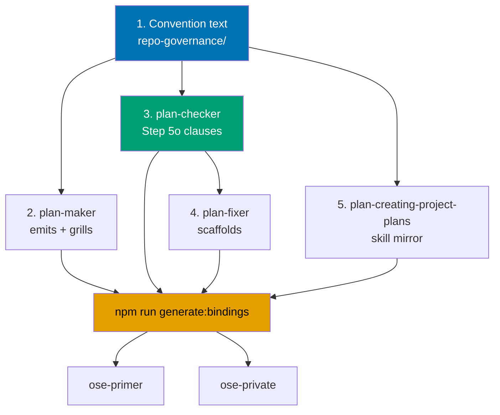

# Tech Docs: Plan Decision-Integrity Hardening

## Architecture

Nothing executable changes. The plan edits five kinds of surface, in a fixed dependency order:

The order is load-bearing: `plan-fixer` scaffolds what `plan-checker` flags, so its scaffold list
cannot be written before the clause list exists. Everything else after step 1 is independent.

## Deviation matrix

Every cross-repo and scope dimension surfaced during planning, with the recorded decision. No row is
undecided.

| #   | Dimension                  | State per repo / options                                                      | Decision                                                              | Justification                                                                                                                            |
| --- | -------------------------- | ----------------------------------------------------------------------------- | --------------------------------------------------------------------- | ---------------------------------------------------------------------------------------------------------------------------------------- |
| 1   | Plan topology              | one plan + propagation phases / three sibling plans / public-only + backlog   | **One `ose-public` plan with propagation phases**                     | The rule text is byte-identical across repos; three plan folders would triplicate the authoring and gating cost of identical content     |
| 2   | Enforcement depth          | rules only / rules + checker step / rules + checker + deterministic validator | **Rules + a new `plan-checker` Step 5o**                              | Prose-only rules are why the pattern repeated three times; a validator adds a code surface to an otherwise governance-only plan          |
| 3   | Rule breadth               | UI-bearing plans / any option table anywhere                                  | **UI-bearing plans only**                                             | The evidence is entirely from the UI design funnel; see [DD-3](#dd-3--why-r-a-and-r-b-bind-ui-bearing-plans-only)                        |
| 4   | Existing open plans        | forward-only / forward-only + audit / retrofit every open plan                | **Retrofit every open plan**                                          | User decision. A currently-open UI plan would otherwise ship the exact defect the week the rules land                                    |
| 5   | External research          | none / prior-art round                                                        | **None**                                                              | Every claim derives from files committed under `plans/done/`; no vendor, library, or harness behaviour is asserted                       |
| 6   | Repo topology              | `ose-primer` and `ose-private` previously recorded as bare                    | **Both are normal checkouts on `main`** — re-verified during planning | `git -C <repo> rev-parse --is-bare-repository` returned `false` for both; the `main-to-*` delivery modes are therefore available to them |
| 7   | Sibling repo delivery mode | draft PR / direct push to `main`                                              | **`worktree-to-pr` in all three**                                     | No repo is bare, so no repo needs the bare-repo landing method; the repo-wide default applies uniformly and no deviation is required     |
| 8   | Parity backfill inclusion  | fold into this plan / file separately                                         | **Fold in**                                                           | The orphaned routings are the same propagation defect this plan exists to fix; deferring them would demonstrate the failure it describes |
| 9   | Post-mortem                | write it / skip it                                                            | **Write it**, at `docs/explanation/post-mortems/`                     | The Post-Mortems Convention already governs this shape, and the prior UI-parity post-mortem is its direct sibling                        |
| 10  | Rationale-doc location     | `docs/explanation/` / inside the plan folder                                  | **`docs/explanation/post-mortems/`, `ose-public` only**               | The narrative is about a `ose-public` app's plan chain; the sibling repos receive the rules, not the incident history                    |
| 11  | Vocabulary rule home       | new convention / new UFDH rule                                                | **UFDH Rule 17**                                                      | It is an authoring-phase user-facing-delivery rule in the exact shape of the existing sixteen; a new convention would fragment the set   |
| 12  | Reversal-record home       | UFDH rule / `plans.md` `tech-docs.md` contents                                | **`plans.md`**                                                        | It governs which sections a plan document must contain, which is `plans.md`'s subject; see [DD-6](#dd-6--why-r-c-lives-in-plansmd)       |

Deviation count: **zero per-repo deviations recorded** — all three repos receive the identical rule
set. Rows 6 and 7 are the dimensions that could have forced a deviation and, on verification, did
not.

## The four rules — authoritative text

The text below is what lands in the convention files. It is quoted here so the plan and the
convention cannot drift during execution.

### R-A — Primary Job Criterion

> Lands in `repo-governance/conventions/formatting/diagrams.md`, as a new subsection under
> §Design Funnel (R6), immediately after the four-stage table.

**Gap it closes.** A Justify table can score every finalist, name a winner, and still record — in its
own cells — that the winner loses the thing the page exists to do. Nothing in the funnel required the
job to be one of the criteria, and nothing forbade scoring the options against the requester's own
description of a candidate solution.

**The rule.**

1. Every Stage-4 Justify table MUST mark exactly one criterion row as the **Primary Job Criterion**
   (PJC) — the job the screen exists to do for its reader, stated as an outcome for that reader.
2. The PJC row MUST cite the anchor in the plan's own `brd.md` where that job is stated as a problem.
   A criterion that exists only in the Justify table is not a job; it is a preference.
3. **Fidelity to the requester's phrasing is not an admissible criterion.** Rows of the form "matches
   the stated requirement", "as requested", "literal match to the brief", or any equivalent that
   scores an option against the requester's own description of a candidate solution are forbidden.
   The requester describes a candidate solution; the funnel exists to test candidate solutions, and a
   criterion that rewards resemblance to the request cannot do that.
4. If the option that wins the PJC row is not the Selected option, the plan MUST carry a **Primary
   Job Criterion Override Record** immediately below the Justify table, naming (a) the option that
   won the PJC, (b) why the selection differs anyway, and (c) the user decision that approved it,
   recorded as the grill question asked and the answer given.
5. An override record is a legitimate outcome, not a failure. What is forbidden is the silent case:
   a table that records the winner losing the job, with no acknowledgement that it did.

### R-B — Elimination-Grade Evidence

> Lands in `repo-governance/conventions/formatting/diagrams.md`, extending §Responsive Design and
> §Design Funnel (R6).

**Gap it closes.** The Responsive Design section permits "an ASCII wireframe (or an inline note)" for
a layout. That allowance was written for describing an option, and was used instead to eliminate one:
a prose sentence asserting an option collapses below a breakpoint, with no artefact at that
breakpoint, removed the option from consideration. An untested claim narrowed the design space.

**The rule.**

1. The inline-note allowance applies to an option that is **carried forward**. It does not apply to
   a **drop reason**.
2. An option MAY NOT be eliminated — at the Narrow stage or in the Stage-4 rationale — on a
   responsive, legibility, density, or performance claim unless the plan carries, for **that option**,
   either (a) a low-fidelity wireframe at the width or breakpoint the claim names, or (b) a cited
   measurement of the rendered result at that width.
3. A drop reason of the form "degenerates at", "collapses below", "cannot survive", or "does not work
   at" a named width, with no artefact for that option at that width, is inadmissible. The option
   returns to the Narrow stage until the artefact exists.
4. This is deliberately asymmetric: describing an option cheaply is fine, but **eliminating** one is
   the expensive, irreversible act in a funnel, and it is the act that must be paid for with evidence.

### R-C — Prior-Decision Reversal Record

> Lands in `repo-governance/conventions/structure/plans.md`, in the `tech-docs.md` content
> requirements, with a cross-reference from the Design Funnel section of `diagrams.md`.

**Gap it closes.** Nothing required a plan to disclose that its selected design is a predecessor's
rejected option, or that it reverses a predecessor's recorded design decision. Both happened twice in
the benchmark chain. Both plans happened to disclose it well — voluntarily. A rule makes the good
practice reproducible instead of incidental.

**The rule.**

1. A plan MUST carry a `## Prior-Decision Reversal Record` in its `tech-docs.md` when either holds:
   (a) its selected design equals or subsumes an option that a named predecessor plan explicitly
   rejected, or (b) it reverses, amends, or supersedes a design decision that a predecessor plan
   recorded.
2. The record MUST name the predecessor plan path, quote the original decision or drop reason, and
   assign exactly one **disposition** to it:

   | Disposition          | Meaning                                                                      |
   | -------------------- | ---------------------------------------------------------------------------- |
   | `obsolete`           | The original reason was sound and is no longer true — the constraint changed |
   | `never-measured`     | The original reason was an assertion that was never tested                   |
   | `wrong-at-the-time`  | The original reason was testable, was tested, and was wrong                  |
   | `changed-constraint` | The reason still holds, but a requirement it traded against has changed rank |

3. A disposition of `never-measured` MUST additionally cite the measurement that settles the original
   claim. Reversing an untested assertion with a second untested assertion is not a decision.
4. A `never-measured` disposition is also a signal about the predecessor: it means the predecessor's
   funnel eliminated on an unmeasured claim, which R-B now forbids. Record it as such.

### R-D — Enumerated-Vocabulary Consistency

> Lands in `repo-governance/development/quality/user-facing-delivery-hardening.md` as **Rule 17
> (Authoring)**. The section heading "The Sixteen Rules" becomes "The Seventeen Rules".

**Gap it closes.** A closed set of user-visible identifiers was defined with two members named after
proper nouns and one after an adjective. The inconsistency was readable off the schema on day one and
was corrected two plans later, by which time the identifier had reached six binding surfaces and the
rename's own review cycle found seven missed sites.

**The rule.**

1. **(Authoring) A plan that introduces or changes a closed set of user-visible identifiers reaching
   more than one binding surface MUST carry an Enumerated-Vocabulary Record.** Binding surfaces
   include: a language-level type or enum, a URL path segment or query value, a CSS custom property
   or design token, an i18n message key, a spec or step-binding identifier, a filename, and a
   persisted data value.
2. The record states the **naming rule** the set follows in one sentence, then lists every member
   against it in a table with a per-member verdict. A set whose members follow different naming kinds
   — proper nouns beside descriptive adjectives, singular beside plural, domain terms beside
   implementation terms — fails its own record.
3. The record names every binding surface the identifiers will reach. This is the cost statement: a
   rename after delivery costs one sweep per surface plus the sites the sweep misses, and it is
   cheapest while the set exists in exactly one file.
4. Sets reaching exactly one surface are exempt — the rename is a single edit and the ceremony is not
   worth its cost.

## `plan-checker` Step 5o specification

Added as section 21, `### 21. Successor-Plan Debt Scan (Step 5o — CONDITIONAL)`, after the existing
section 20 (Step 5n).

**Applicability**: clauses 1-4 run on UI-bearing plans only, using the same UI-bearing test as Step
5k. Clause 5 runs on every plan. Clause 6 runs on every plan. Plans under `plans/done/` are exempt as
an immutable archive.

| Clause | Detects                                                                                           | Severity | `plan-fixer` scaffold                                                             |
| ------ | ------------------------------------------------------------------------------------------------- | -------- | --------------------------------------------------------------------------------- |
| 1      | Justify table with zero, or more than one, Primary Job Criterion row                              | HIGH     | Inserts a marked PJC row with a `TODO` anchor; never invents the criterion        |
| 2      | PJC row citing no `brd.md` anchor                                                                 | MEDIUM   | Inserts the anchor placeholder beside the row                                     |
| 3      | Criterion row text matching a requester-phrasing pattern                                          | MEDIUM   | Comments the row for author removal; quotes the matched phrase                    |
| 4a     | Selected option not winning the PJC row, with no override record                                  | HIGH     | Inserts a `## Primary Job Criterion Override Record` skeleton                     |
| 4b     | Drop reason naming a width or breakpoint with no artefact for that option at that width           | HIGH     | Inserts a `TODO` wireframe stub for that option at that width                     |
| 5      | Predecessor plan named in the plan, selection matching its rejected option, no reversal record    | HIGH     | Inserts a `## Prior-Decision Reversal Record` skeleton with the four dispositions |
| 6      | Closed identifier set reaching more than one binding surface with no Enumerated-Vocabulary Record | MEDIUM   | Inserts the record table skeleton listing the detected surfaces                   |

Clause 4 is split into 4a and 4b because they share a severity and a phase but detect independent
defects; the table keeps six logical clauses across seven rows so each finding names one cause.

**Non-vacuity proof.** A fixture plan violating all seven rows is authored under the plan's own
`assets/` folder and run through `plan-checker` at the Phase 3 gate. Every row must produce its stated
finding at its stated severity. A row producing nothing blocks the gate. This exists because a check
that never fires is indistinguishable from a check that passes — the exact failure mode a prior plan
hit when a regression test sat outside every configured test-runner glob.

## Design decisions

### DD-1 — One plan with propagation phases, not three sibling plans

The multi-repo parity workflow's default is one plan per repo, which is right when each repo needs a
different implementation path. Here the diff is byte-identical: the same four rule texts, the same
Step 5o, the same skill mirror. Three plan folders would triple the authoring, gating, and review
cost of identical content, and would create three places for the rule text to drift — which is the
defect the plan is fixing. The propagation phases carry their own gates, so the parity guarantee is
not weaker; it is just not duplicated.

### DD-2 — The three-repo grep table is the parity gate, not a checklist tick

Phases 6 and 7 close on re-running the same grep that detected the original drift, expecting a
non-zero count in every cell. A tick asserting "propagated" is what the five orphaned routings had.

### DD-3 — Why R-A and R-B bind UI-bearing plans only

The same failure — a winner that loses the stated purpose, an option eliminated on an untested claim
— is possible in an architecture-choice or tooling-choice table. Binding the rules there anyway would
apply them to a shape the evidence never covered, and would require `plan-checker` to recognise
option tables generically rather than the funnel's known four-stage structure, which is where the
false-positive risk lives. The rules bind where the funnel is; the possibility elsewhere is recorded
here rather than legislated on speculation.

### DD-4 — Why enforcement stops at `plan-checker`

A deterministic validator in `apps/rhino-cli` or a CI markdown gate would run the clauses on every
push rather than on every `plan-checker` invocation. It would also add a Rust or TypeScript surface,
its own unit tests, and a coverage obligation to a plan that otherwise touches no source. The clauses
are text-shape checks over plan documents, and `plan-checker` already runs on every plan through the
plan quality gate — the marginal coverage a validator buys does not pay for the surface it adds.
Recorded as a deliberate stopping point, not an oversight.

### DD-5 — Retrofit rather than forward-only

Grandfathering is the convention's own default for the executor-tag and phase-gate rules, and it is
defensible there: those rules are mechanical and get applied as phases are touched. These rules are
not mechanical — a plan cannot acquire a Primary Job Criterion by being executed. A UI plan currently
open in `plans/in-progress/` would carry the defect all the way to delivery. The retrofit is bounded:
25 plan folders at authoring time, of which only the UI-bearing ones can violate clauses 1-4b.

### DD-6 — Why R-C lives in `plans.md`

R-C governs which sections a plan document must contain under a stated condition. That is exactly
`plans.md`'s subject — it is where the `tech-docs.md` content list already lives, alongside the
`## Corpus Disposition` requirement for learning-bearing plans, which has the identical shape
(conditional required section in a named file). Putting it in the delivery-hardening convention
instead would separate it from the list a `plan-maker` reads when deciding what to emit.

### DD-7 — Severity split between structural and pattern-matched clauses

Clauses 1, 4a, 4b and 5 detect a **missing structure** — a row that is absent, a record that does not
exist. Those are unambiguous and are HIGH. Clauses 2, 3 and 6 depend on matching text or inferring a
binding-surface count, and can misread unusual but legitimate wording. Those are MEDIUM, and every
finding quotes the text it matched so a false positive costs one read to dismiss. Making all seven
HIGH would make the step's first false positive a gate blocker and the step itself a target for
suppression.

## File impact

### `ose-public`

| File                                                                        | Change                                                                            |
| --------------------------------------------------------------------------- | --------------------------------------------------------------------------------- |
| `repo-governance/conventions/formatting/diagrams.md`                        | New R-A subsection and R-B extensions under §Design Funnel and §Responsive Design |
| `repo-governance/conventions/structure/plans.md`                            | R-C added to the `tech-docs.md` content requirements                              |
| `repo-governance/development/quality/user-facing-delivery-hardening.md`     | New Rule 17 (R-D); section heading count updated                                  |
| `.claude/agents/plan-checker.md`                                            | New section 21, Step 5o, seven clause rows                                        |
| `.claude/agents/plan-maker.md`                                              | Emission of the new sections; the PJC grill question                              |
| `.claude/agents/plan-fixer.md`                                              | Seven scaffolds, one per clause row                                               |
| `.claude/skills/plan-creating-project-plans/SKILL.md`                       | Mirrored statement of the four rules and the grill question                       |
| `repo-governance/workflows/plan/plan-quality-gate.md`                       | Step 5o added to the enumerated checker steps, if that file enumerates them       |
| `docs/explanation/post-mortems/2026-08-01-ai-benchmark-three-plan-split.md` | New — the narrative record                                                        |
| `docs/explanation/post-mortems/README.md`                                   | Index entry for the new post-mortem                                               |
| `.opencode/`, `.codex/`, `.cursor/`, `.amazonq/`, `.gemini/` bindings       | Regenerated by `npm run generate:bindings`                                        |
| Open plan folders under `plans/in-progress/` and `plans/backlog/`           | Retrofit edits to `prd.md` funnel tables and `tech-docs.md` records where flagged |

### `ose-primer` and `ose-private`

The same rows as above, minus the post-mortem and its index entry, plus the five parity-backfill
routings into `manual-behavioral-verification.md`, `user-facing-delivery-hardening.md`,
`dynamic-collection-references.md`, `plan-anti-hallucination.md`, and `diagrams.md`.

## Rollback

Every change is a text edit under version control with no runtime dependency, so rollback is a
revert. Two ordering constraints:

1. Revert the agent-definition edits and re-run `npm run generate:bindings` in the same commit —
   reverting `.claude/` without regenerating leaves the vendor bindings stale, and the parity guard
   will fail on the next push.
2. Reverting the convention text without reverting Step 5o leaves `plan-checker` flagging plans
   against a rule that no longer exists. Revert in the reverse of the authoring order shown in the
   Architecture diagram: bindings, then skill and agents, then convention text.

The retrofit edits to other plans' documents are independently revertible per plan and carry no
dependency on the rule text surviving.

## Risks

| Risk                                                                                                   | Mitigation                                                                                                                                                                                |
| ------------------------------------------------------------------------------------------------------ | ----------------------------------------------------------------------------------------------------------------------------------------------------------------------------------------- |
| Step 5o's clause list drifts from the convention text during execution                                 | The rule text is quoted verbatim in this document, and the Phase 3 gate diffs the clause list against these sections                                                                      |
| The bindings parity guard fails mid-phase because a `.claude/` edit was committed without a regenerate | Every phase touching `.claude/` ends its gate with a regenerate-and-verify-clean step, per AC-20                                                                                          |
| A retrofit edit conflicts with concurrent work in another session's worktree                           | Retrofit phases run per repo and touch only plan documents; no `delivery.md` checkbox state is modified                                                                                   |
| The post-mortem reads as blame rather than as system analysis                                          | The Post-Mortems Convention's blameless standard is applied explicitly; contributing factors name conditions, and the plan documents examined are cited by line rather than characterised |
| `ose-private` has no UI-bearing open plans, making its retrofit phase look vacuous                     | The audit table records an explicit `exempt — no UI-bearing plan` verdict per folder, so an empty result is evidenced rather than assumed                                                 |
