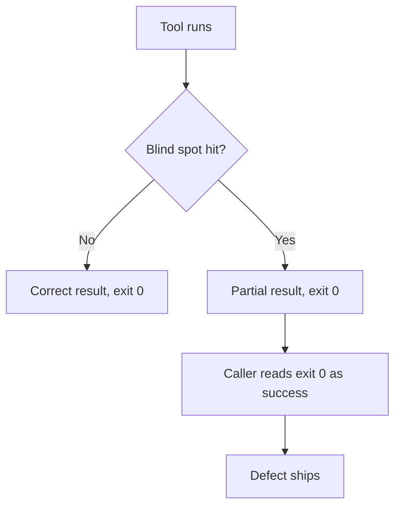
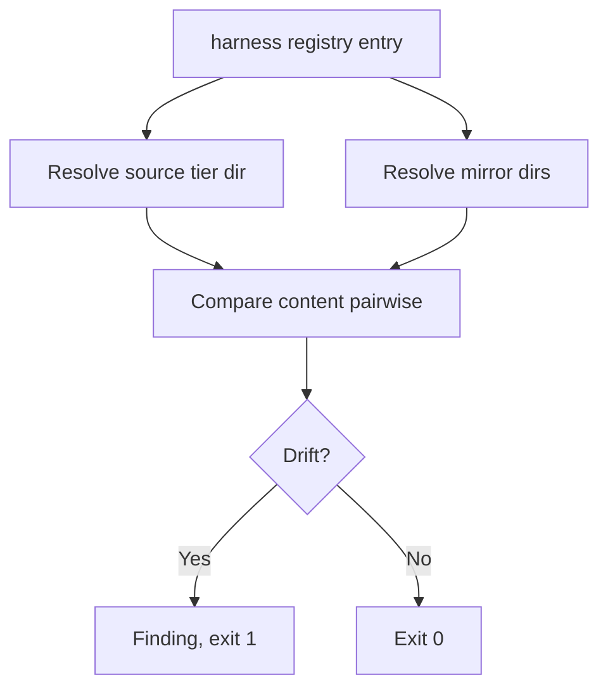

# Technical Documentation — rhino-cli Governance Tooling Defects

## 1. Shared Shape



Every fix below turns one `D → E` edge into either a correct result or a loud failure. Widening the
blind spot without adding the signal would leave the same trap one edge case further out.

## 2. WS-1 — Vendor audit inline-span pairing

### Current behaviour

`strip_non_prose` removes inline code spans with a per-line regex (`inline_code_re`). The stripper is
called once per line and holds no state between lines, so backtick pairing restarts at every newline.

For a span opened on line _n_ and closed on line _n+1_:

- Line _n_ has one unmatched backtick → the regex matches nothing → the span's text is treated as
  prose.
- Line _n+1_ starts with the **closing** backtick, which the regex reads as an **opening** one. Every
  subsequent pair on that line is off by one, so a genuinely-fenced term reads as bare prose.

### Fix design

Strip at **document** level, not line level, carrying an open-span flag across the newline:

1. Extract fenced blocks first (already done) so their contents never enter the inline pass.
2. Scan the remaining text as one buffer, tracking backtick-run length, so a single-backtick and a
   double-backtick delimiter pair correctly (CommonMark: a run closes only on a run of equal length).
3. Replace each span with a same-length placeholder so byte offsets — and therefore reported line
   numbers — do not shift.

Step 3 is what keeps the change invisible to every existing finding's location.

### Verification strategy

Golden-master the current finding set over the whole `repo-governance/` corpus **before** the change.
After the change, diff. The expected delta is: findings that only a mis-pair could have produced,
disappearing. Any other delta is a defect in the fix, not an improvement.

## 3. WS-2 — Registry-derived agent directories

### Current behaviour

`harness bindings validate` resolves the primary source tier by string-literal `.claude/agents` and
each mirror by literal path. `repo-config.yml`'s `harness:` registry — which already declares every
harness, its tier, and its instruction files — is not consulted for directories.

### Fix design



The registry entry needs an explicit directory field rather than a derived one — deriving
`.<name>/agents` from the harness name is the convention-over-configuration shape this repository
deliberately avoids. Any new field is added to **both** repositories' `repo-config.yml` and to the
config schema validator in the same commit.

### Invariant to assert before shipping

For this repository's real layout, the registry-resolved directory set must equal today's hard-coded
set exactly. A test asserts set equality, not merely that validation still passes — a superset would
also pass while silently widening the gate.

## 4. WS-3 — Path-keyed rewriting and non-markdown reach

### Current behaviour

```rust
// rewrite_one_target, paraphrased
let basename = target.rsplit('/').next();
if let Some(new) = map.get(basename) { /* replace */ }
```

Two consequences:

| Input                                    | Today                       | Wanted                            |
| ---------------------------------------- | --------------------------- | --------------------------------- |
| Map row `docs/a/01-x.md` → `docs/a/x.md` | No match (key is a path)    | Match                             |
| Two `leaf.md` files, only one in the map | Both rewritten              | Only the mapped one               |
| Directory row `a/01-x/` → `a/x/`         | Unreachable                 | Match, leaf preserved             |
| Map matching nothing at all              | `0 file(s) updated`, exit 0 | Non-zero exit, count of dead rows |

### Fix design

1. **Key by repo-relative path.** Resolve each link target against the containing file's directory,
   normalize `..`/`.`, and look the normalized path up in the map. Keep a basename fallback **only**
   behind an explicit `--allow-basename-match` flag, so the lossy mode is opt-in and named.
2. **Directory rows.** A map row whose old and new both end in `/` is a prefix rewrite: any target
   starting with the old prefix has that prefix replaced, leaf untouched.
3. **Dead-row reporting.** Count map rows that matched zero targets. Exit non-zero when **every** row
   is dead (the typo case) and report the count either way. An empty map is not an error — that is
   the no-op-by-construction case, distinct from a map that intended something and achieved nothing.
4. **Non-markdown reach.** Behind `--include-non-markdown`, walk tracked files, skip anything
   containing a NUL byte in its first 8 KiB, and apply the same path substitution to plain-text
   matches. This is deliberately a **substring** rewrite, not a link rewrite: a `.gitignore` comment
   has no link syntax to parse.

### Why the flags are opt-in

Both new behaviours change what a caller's existing invocation touches. Opt-in keeps this plan's
change to `rewrite-paths` additive for any caller, and makes the sweep procedure state which modes it
used — a sweep's own record of what it swept.

## 5. Cross-Repository Obligation

Every commit touching `apps/rhino-cli` regenerates and stages the parity checksum manifest in the
**same** commit. `parity manifest generate` refuses while a covered file differs from the git index,
so staging precedes generation. The parity gate runs as a phase gate, not only at the end.

## 6. Testing Strategy

| Level                      | What it covers                                                                   |
| -------------------------- | -------------------------------------------------------------------------------- |
| Rust unit                  | Span pairing, path normalization, prefix rewriting, dead-row counting.           |
| Golden master              | The vendor audit's full finding set over the real corpus, before and after WS-1. |
| Synthetic-repo integration | WS-2's non-`.claude` source tier, in both the clean and the drifted state.       |
| Cucumber (`specs/`)        | The scenarios in `prd.md`, wired into `rhino-cli:test:integration`.              |

The synthetic-repo fixture already exists — it is what exposed WS-2 during `repo-rules-sweep` Phase 3
and must be recreated, since it was a throwaway at the time.

## 7. Related

- [`repo-rules-sweep` learnings](../../done/2026-08-18__repo-rules-sweep/learnings.md) — entries 2–5, the
  origin of every defect here.
- [Knowledge Capture Convention](../../../repo-governance/development/quality/knowledge-capture.md) —
  why these are a separate plan rather than inline fixes.
- [`file-naming-convention-rework`](../file-naming-convention-rework/README.md) — the sibling
  follow-up; no execution dependency in either direction.
