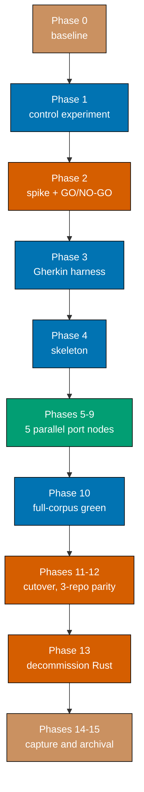

# Delivery — rhino-cli OCaml Rewrite

> **Legend** — `[AI]`: an agent performs the step (the default; unmarked steps are `[AI]`).
> `[HUMAN]`: only a human can do it (physical action, out-of-band approval, real-secret or
> privileged-credential handling). `[AI+HUMAN]`: agent prepares, human approves or finishes.

## Worktree

Worktree path: `worktrees/rhino-cli-ocaml-rewrite/`

Optional manual pre-provisioning (run from repo root):

```bash
claude --worktree rhino-cli-ocaml-rewrite
```

The plan-execution Step 0 gate enters this worktree by default: it auto-provisions from the latest
`origin/main` when missing, syncs with `origin/main` before implementing, and prompts before
deleting the worktree after the plan is archived and pushed.

Phases 5-9 are independent DAG nodes and each takes **its own** worktree and branch, named
`worktrees/rhino-cli-ocaml-<group>/`. The path above is the plan's serial-spine worktree.

## Delivery Mode: worktree-to-pr

Repo default. Each delivery boundary below opens exactly one PR and runs the
[PR-Review Maker→Fixer Cycle](../../../repo-governance/workflows/pr/pr-review-quality-gate.md)
before merging. `[AI]` merges once the five hardened preconditions hold, **except** the Phase 2
go/no-go decision, which is an explicit `[HUMAN]` gate — a language rewrite across three
repositories is exactly the irreversible, blast-radius decision the convention reserves human
judgment for.

## Blocking prerequisites

This plan **cannot start** until both hold. Phase 0 verifies them.

| Prerequisite                                                                       | Why                                                                                                       |
| ---------------------------------------------------------------------------------- | --------------------------------------------------------------------------------------------------------- |
| `plans/in-progress/sdlc-gate-registry-enforcement` is archived to `plans/done/`    | It is actively rewriting `repo-config.yml`, the three Husky shims, and the gate surface in all four repos |
| No other in-progress plan edits `apps/rhino-cli/`, `repo-config.yml`, or `.husky/` | Rewriting the binary underneath a live gate-registry migration collides on every load-bearing file        |

## Parallelization Model

**N = 3** (repo default; the N+1 model — 1 main thread + 3 background agents). No reason to differ:
the parallel window is Phases 5-9, which is exactly five nodes, and each carries a full port-plus-
shadow-diff cycle that saturates an agent.

**Serial spine** — each of these builds the source of truth the next one needs:

`Phase 0 → Phase 1 → Phase 2 (gate) → Phase 3 → Phase 4 → {5,6,7,8,9} → Phase 10 → Phase 11 → Phase 12 → Phase 13 → Phase 14 → Phase 15`

**Parallel fan-out** — Phases 5-9 are mutually independent. Each ports a disjoint set of command
groups into disjoint files under `apps/rhino-cli/lib/commands/` and `lib/application/`, reads only
Phase 4's frozen skeleton, and writes only its own group's modules and tests. No two of them write
the same file.

**Not independent, despite looking it:**

- Phase 3 (harness) and Phases 5-9 — every port phase's tests import the harness. Serial.
- Phase 4 (skeleton) and Phases 5-9 — every group registers into `bin/main.ml`'s `Cmd.group`. The
  skeleton lands the registration table with all 14 groups stubbed, so the port phases each edit
  **one** stub line rather than racing on the file. This is a deliberate design choice to make the
  fan-out safe, and it is why Phase 4 cannot be merged into Phase 5.
- Phase 11 (cutover) and Phase 12 (cross-repo) — the parity manifest binds all three repos; they
  must land together or the parity gate breaks unrelated sibling-repo work.

**Cleanup is the terminal node.** Phase 15 depends on every delivery node. No worktree, branch, or
frozen-binary artefact is removed while any node still reads it — in particular
`local-temp/rhino-rust-frozen` survives until Phase 13's gate passes.



The five port nodes are collapsed into one box above for legibility; they are enumerated
individually in the Delivery Boundaries table below, and each is its own worktree, branch, and PR.

### Delivery Boundaries

| Phase(s) | Delivery unit                                                   | Worktree / branch                      | PR opens          |
| -------- | --------------------------------------------------------------- | -------------------------------------- | ----------------- |
| 0        | — (setup and baseline)                                          | `worktrees/rhino-cli-ocaml-rewrite`    | no                |
| 1        | Rust cost-relief control experiment                             | `worktrees/rhino-cli-ocaml-rewrite`    | yes — at Phase 1  |
| 2        | OCaml feasibility spike + gap closures                          | `worktrees/rhino-cli-ocaml-spike`      | yes — at Phase 2  |
| 3        | `libs/ocaml-rhino-gherkin` harness                              | `worktrees/rhino-cli-ocaml-gherkin`    | yes — at Phase 3  |
| 4        | OCaml project skeleton + global flags                           | `worktrees/rhino-cli-ocaml-skeleton`   | yes — at Phase 4  |
| 5        | `md` + `convention` groups                                      | `worktrees/rhino-cli-ocaml-md`         | yes — at Phase 5  |
| 6        | `specs` group                                                   | `worktrees/rhino-cli-ocaml-specs`      | yes — at Phase 6  |
| 7        | `harness` + `repo-governance` groups                            | `worktrees/rhino-cli-ocaml-governance` | yes — at Phase 7  |
| 8        | `test-coverage` + `env` groups                                  | `worktrees/rhino-cli-ocaml-coverage`   | yes — at Phase 8  |
| 9        | `gate`, `repo-config`, `git`, `parity`, `doctor`, `lang` groups | `worktrees/rhino-cli-ocaml-gate`       | yes — at Phase 9  |
| 10       | Full-corpus green + coverage gate                               | `worktrees/rhino-cli-ocaml-rewrite`    | yes — at Phase 10 |
| 11-12    | Cutover across all three bound repos                            | `worktrees/rhino-cli-ocaml-cutover`    | yes — at Phase 12 |
| 13       | Rust crate decommission                                         | `worktrees/rhino-cli-ocaml-rewrite`    | yes — at Phase 13 |
| 14-15    | Knowledge capture and archival                                  | `worktrees/rhino-cli-ocaml-rewrite`    | yes — at Phase 15 |

Phases 11 and 12 are **one** delivery unit: the parity manifest binds `ose-public`, `ose-primer`,
and `ose-private`, so a cutover that lands in one repo without the others fails the parity gate in
all three. Phase 11 commits to the branch; Phase 12 opens the PR set.

---

## Phase 0: Environment Setup and Baseline

> Phase 0 opens no PR, pushes no branch, and runs no review cycle. Its gate is the recorded clean
> baseline and nothing more. Its evidence files ride Phase 1's PR.

- [ ] [AI] Run `npm install` from the repo root — acceptance: exits 0 and the postinstall doctor
      reports no missing tools.
- [ ] [AI] Run `npm run doctor -- --fix` — acceptance: exits 0; every required tool reports present
      and at the pinned version.
- [ ] [AI] Verify the blocking prerequisite: run
      `ls plans/in-progress/` and confirm `sdlc-gate-registry-enforcement` is **absent** —
      acceptance: the directory listing does not contain it. If present, **stop** and report that
      this plan is blocked.
- [ ] [AI] Enumerate every other in-flight consumer: run
      `grep -rIl 'rhino-cli\|repo-config.yml' plans/in-progress/ > evidence/phase-0-inflight.txt` —
      acceptance: the file exists; if it lists any plan other than this one, **stop** and report.
- [ ] [AI] Record the consuming-project ledger: run
      `grep -rIl 'rhino-cli' --include=project.json apps libs specs > evidence/phase-0-consumers.txt`
      — acceptance: the file exists and is non-empty. This file, not `tech-docs.md`, is the ledger
      Phase 11 reconciles against.
- [ ] [AI] Capture the gate surface: run
      `for s in pre-commit pre-push commit-msg ci; do echo "== $s"; cargo run --release --quiet --manifest-path apps/rhino-cli/Cargo.toml -- gate list --surface=$s --format=text; done > evidence/phase-0-gate-list.txt`
      — acceptance: the file records 28 pre-commit and 14 pre-push gate rows.
- [ ] [AI] Record the pre-tuning cost baseline into `evidence/phase-0-baseline.txt`, capturing each
      of: `du -sh ~/.rustup ~/.cargo ~/.cache/ose-cargo-target`;
      `rustup toolchain list`; `grep -c '^\[\[package\]\]' apps/rhino-cli/Cargo.lock`;
      `/usr/bin/time -p cargo build --release --manifest-path apps/rhino-cli/Cargo.toml` after
      `touch apps/rhino-cli/src/lib.rs` — acceptance: the file contains all four measurements with
      their commands.
- [ ] [AI] Run the full baseline test suite: `npx nx run rhino-cli:test:quick` — acceptance: exits 0.
      If it fails, resolve the preexisting failure before continuing (Phase 0's whole purpose).
- [ ] [AI] Run `npx nx run rhino-cli:test:integration` — acceptance: exits 0; all 441 scenarios pass.

### Phase 0 Gate

> All checks below must pass before starting Phase 1. If any check fails, fix it in Phase 0 before
> proceeding.

- [ ] [AI] `npx nx run rhino-cli:test:quick` — exits 0.
- [ ] [AI] `npx nx run rhino-cli:test:integration` — exits 0.
- [ ] [AI] `ls evidence/` lists `phase-0-baseline.txt`, `phase-0-gate-list.txt`,
      `phase-0-consumers.txt`, and `phase-0-inflight.txt` — all four present and non-empty.
- [ ] [AI] `git status --short` shows only files on this plan's touch ledger.

> **Pause Safety**: nothing has changed in `apps/rhino-cli/` or any consumer. Only untracked
> evidence files were written under the plan folder. Safe to stop. To resume:
> `npx nx run rhino-cli:test:quick`.

---

## Phase 1: Control Experiment — Rust Cost Relief

The measured question this phase answers: **how much of the 68.4 s rebuild and the 16 GB footprint
survives ordinary tuning?** Whatever survives is the real size of the problem the rewrite must beat.

- [ ] [AI] Read `rust-toolchain.toml` and record the pinned channel — acceptance: the value is
      recorded in `evidence/phase-1-retuned-baseline.txt` (expected `1.95.0`).
- [ ] [AI+HUMAN] Uninstall every rustup toolchain that is neither the pinned channel nor `stable`:
      for each of `1.80`, `1.88`, `1.94`, `1.96.0`, run
      `rustup toolchain uninstall <channel>`. Confirm with the maintainer before the first
      uninstall, since a sibling repo may pin one — acceptance: `rustup toolchain list` shows only
      the pinned channel and `stable`; `du -sh ~/.rustup` is recorded before and after.
- [ ] [AI] Reclaim stale sibling-repo build caches: run
      `du -sh ~/.cache/ose-cargo-target/*/*/` and record it, then remove only directories belonging
      to repos with no live worktree — acceptance: the reclaimed byte count is recorded; no
      directory belonging to a repo with a live worktree was touched.
- [ ] [AI] Remove the three dead dependencies from `apps/rhino-cli/Cargo.toml`: delete the
      `tree-sitter`, `pulldown-cmark`, and `ignore` lines — acceptance: the three lines are gone.
- [ ] [AI] Regenerate the lockfile with `cargo update --manifest-path apps/rhino-cli/Cargo.toml
--workspace` — acceptance: `grep -c '^\[\[package\]\]' apps/rhino-cli/Cargo.lock` returns
      fewer than 183.
- [ ] [AI] Verify nothing referenced them: run `npx nx run rhino-cli:typecheck` — acceptance:
      exits 0.
- [ ] [AI] Add the fast development profile shown below to `apps/rhino-cli/Cargo.toml` — acceptance:
      `cargo build --profile dev-fast --manifest-path apps/rhino-cli/Cargo.toml` exits 0.

The profile to add, verbatim:

```toml
[profile.dev-fast]
inherits = "dev"
opt-level = 1
debug = 0
incremental = true
```

- [ ] [AI] Retarget the validator Nx targets in `apps/rhino-cli/project.json` from
      `cargo run --release` to `cargo run --profile dev-fast` for
      `specs:behavior:coverage`, `specs:structure-validation`,
      `specs:gherkin-cardinality-validation`, `naming:harness-validation`,
      `naming:workflows-validation`, `governance:vendor-audit-validation`,
      `instruction-size:validation`, and `env:validation` — acceptance: `grep -c 'cargo run --release'
apps/rhino-cli/project.json` returns 0.
- [ ] [AI] Verify the gate registry still resolves: run
      `cargo run --profile dev-fast --manifest-path apps/rhino-cli/Cargo.toml -- gate validate` —
      acceptance: exits 0.
- [ ] [AI] Re-measure the incremental loop identically to the baseline:
      `touch apps/rhino-cli/src/lib.rs && /usr/bin/time -p cargo build --profile dev-fast
--manifest-path apps/rhino-cli/Cargo.toml` — acceptance: the wall-clock figure is appended to
      `evidence/phase-1-retuned-baseline.txt` beside the 68.4 s pre-tuning value.
- [ ] [AI] Re-measure the footprint: `du -sh ~/.rustup ~/.cargo ~/.cache/ose-cargo-target` —
      acceptance: the three figures are appended beside their pre-tuning values, with the total.
- [ ] [AI] Write the comparison summary into `evidence/phase-1-retuned-baseline.txt`: a table of
      pre-tuning versus post-tuning for the incremental rebuild and the total footprint —
      acceptance: the table has both rows and both columns populated with measured values, per
      **AC-1**.
- [ ] [AI] Commit and push to `origin rhino-cli-ocaml-rewrite`.
- [ ] [AI] Open the PR with `gh pr create --draft` — acceptance: the PR exists and its body links
      `evidence/phase-1-retuned-baseline.txt`.
- [ ] [AI] Run the PR-Review Maker→Fixer Cycle to completion — acceptance: 0 CRITICAL and 0 HIGH
      findings outstanding.
- [ ] [AI] Merge the PR once all five hardened preconditions hold.

### Phase 1 Gate

> All checks below must pass before starting Phase 2. If any check fails, fix it in Phase 1 before
> proceeding.

- [ ] [AI] `npx nx run rhino-cli:test:quick` — exits 0.
- [ ] [AI] `npx nx run rhino-cli:test:integration` — exits 0; all 441 scenarios pass.
- [ ] [AI] `cargo run --profile dev-fast --manifest-path apps/rhino-cli/Cargo.toml -- gate validate`
      — exits 0.
- [ ] [AI] `grep -F 'tree-sitter' apps/rhino-cli/Cargo.toml` — returns no match (exit 1), per
      **AC-2**.
- [ ] [AI] `evidence/phase-1-retuned-baseline.txt` contains both a post-tuning incremental-rebuild
      figure and a post-tuning total-footprint figure, each beside its pre-tuning counterpart.
- [ ] [AI] The Phase 1 PR is merged into `main`.

> **Pause Safety**: `rhino-cli` is still the Rust binary, still passes every gate, and now builds
> through a fast dev profile with three dead dependencies removed. This state is independently
> valuable and correct whether or not the rewrite proceeds. Safe to stop. To resume:
> `npx nx run rhino-cli:test:quick`.

---

## Phase 2: OCaml Feasibility Spike and Go/No-Go

Bounded spike. Nothing here ships into the production binary. Its output is a measured comparison
and five resolved tooling gaps — or a documented no-go.

### 2a — Toolchain

- [ ] [AI] Install opam and a **single shared global switch**:
      `brew install opam && opam init --bare --disable-sandboxing && opam switch create rhino-ocaml 5.3.0`
      — acceptance: `opam switch list` shows `rhino-ocaml`; **no** local `_opam/` directory is
      created anywhere in the repo.
- [ ] [AI] Record the switch footprint: `du -sh ~/.opam` — acceptance: the figure is written to
      `evidence/phase-2-ocaml-spike.txt`, resolving the unverified 800 MB - 2 GB estimate in
      `tech-docs.md`.
- [ ] [AI] Install the candidate library set:
      `opam install dune cmdliner yojson ppx_yojson_conv yaml re xmlm timedesc digestif bos fpath logs fmt alcotest bisect_ppx ocamlformat zanuda`
      — acceptance: exits 0; `opam list | wc -l` is recorded as the transitive package count against
      the 60-90 estimate.
- [ ] [AI] Re-record `du -sh ~/.opam` after installing dependencies — acceptance: the delta is
      recorded.

### 2b — Vertical slices (the three hardest, chosen to fail fast)

- [ ] [AI] Create the spike project at `local-temp/rhino-ocaml-spike/` with a `dune-project`
      declaring `(lang dune 3.24)` — acceptance: `dune build` exits 0 in that directory.
- [ ] [AI] **Slice 1 — `cmdliner` help-text parity, the highest-risk unknown (P1/T1).** Reimplement
      the `specs` command group's argument surface (14 subcommands) in `cmdliner` and diff its
      `--help` output against
      `apps/rhino-cli/tests/golden-master/specs-help.stderr` — acceptance: the diff is recorded in
      `evidence/phase-2-ocaml-spike.txt` as either "byte-identical" or a precise character-level
      description of every difference.
- [ ] [AI] **Slice 2 — YAML fidelity (T2).** Round-trip all four repos' `repo-config.yml` through
      `ocaml-yaml`'s parse-then-emit and byte-compare against the input — acceptance: the result for
      each of the four files is recorded as identical or as a precise diff.
- [ ] [AI] **Slice 3 — build cost at scale.** Generate a synthetic OCaml module set of comparable
      size to the estimated 40,000 LOC port (or port `lib/application/testcoverage/`, whichever the
      executor judges more faithful, recording which was chosen and why), then measure
      `/usr/bin/time -p dune build --profile release` cold, no-op, and after touching one module —
      acceptance: all three figures are recorded beside the Rust 63.2 s / 0.25 s / 68.4 s values.
- [ ] [AI] Measure the spike binary: `ls -l` on the produced executable, and 10 timed `--help`
      invocations — acceptance: binary size and mean per-invocation startup are recorded, resolving
      **AC-14**'s threshold check.
- [ ] [AI] Measure `du -sh _build` after a full build — acceptance: recorded against the Rust
      221 MB `target/release` value.

### 2c — Close the five tooling gaps

- [ ] [AI] **G1 (Gherkin)** — write a throwaway 200-line Gherkin parser in the spike and run it over
      all 67 files in `specs/apps/rhino/behavior/rhino-cli/gherkin/` — acceptance: it reports
      exactly 67 features and 441 scenarios, matching the Phase 0 capture. This proves the Phase 3
      harness is tractable before Phase 3 is funded.
- [ ] [AI] **G2 (lint)** — write `zanuda.json` plus an `(env (dev (flags ...)))` warning set that
      makes unused values, non-exhaustive matches, and shadowing hard errors — acceptance:
      `dune build @check` fails on a deliberately-introduced non-exhaustive match and passes when
      it is fixed.
- [ ] [AI] **G3 (dependency audit)** — determine whether any tool consumes
      `ocaml/security-advisories` for an opam dependency tree; if none exists, write a minimal
      checker that resolves `opam list --columns=name,version` against the advisory repo's OSV
      files — acceptance: either a working audit command exists, or a written waiver naming the
      accepted risk is recorded in `evidence/phase-2-ocaml-spike.txt` for the go/no-go gate.
- [ ] [AI] **G4 (coverage)** — instrument the spike with `bisect_ppx`, emit
      `bisect-ppx-report cobertura`, and confirm `rhino-cli test-coverage validate` can read the
      result — acceptance: the existing Rust `rhino-cli` parses the OCaml-produced Cobertura file
      and reports a line-coverage percentage. This is the shim path: the tool already parses
      Cobertura, so no new format work is needed.
- [ ] [AI] **G4b** — wrap the report in a threshold check that exits non-zero below 90% —
      acceptance: the wrapper exits non-zero on a deliberately under-covered build and 0 above it,
      per **AC-12**.
- [ ] [AI] **G5 (lockfile)** — produce `opam.locked` via `opam lock` against a pinned
      opam-repository commit, then resolve it in a clean container — acceptance: the resolved
      package set matches the lock file exactly, per **AC-13**.
- [ ] [AI] Write the gap-closure summary into `evidence/phase-2-ocaml-spike.txt`: one row per gap
      G1-G5 with **closed** / **waived (reason)** — acceptance: all five rows present, per **AC-3**.

### 2d — The decision

- [ ] [AI] Write `evidence/phase-2-decision-brief.md`: a single table placing the Phase 1
      post-tuning Rust numbers beside the Phase 2 measured OCaml numbers for incremental rebuild,
      cold build, total resident disk, binary size, startup, and dependency count; followed by the
      G1-G5 status rows and the Slice 1 help-text verdict — acceptance: every cell is a measured
      value or an explicit "not measurable, reason".
- [ ] [AI] Commit and push to `origin rhino-cli-ocaml-spike`, open the PR, run the review cycle to
      0 CRITICAL / 0 HIGH, and merge — acceptance: the spike evidence is on `main`.

### Phase 2 Gate

> All checks below must pass before starting Phase 3. If any check fails, fix it in Phase 2 before
> proceeding. **This gate can legitimately terminate the plan.**

- [ ] [AI] `evidence/phase-2-ocaml-spike.txt` records a measured value for every row in the
      hypothetical-profile table in `tech-docs.md`.
- [ ] [AI] All five gaps G1-G5 are marked **closed** or carry a written waiver with its reason.
- [ ] [AI] The Slice 1 help-text verdict is recorded, and if it is not byte-identical, the proposed
      golden-master corpus update is described.
- [ ] [AI] `evidence/phase-2-decision-brief.md` exists with every cell populated.
- [ ] [HUMAN] **Go/no-go.** Read `evidence/phase-2-decision-brief.md` and decide whether the
      measured OCaml numbers beat the Phase 1 post-tuning Rust baseline by a margin worth ~59,000
      lines of reimplementation across three repositories. Record the decision and its rationale
      inline in this checklist item — acceptance: a **GO** or **NO-GO** verdict with a written
      reason is recorded here, per **AC-4**.
- [ ] [AI] If **NO-GO**: skip to Phase 14, record the outcome as _delivered-as-descoped_ — the
      Phase 1 improvements shipped and the question is answered with data. Do not proceed to
      Phase 3.

> **Pause Safety**: `rhino-cli` is still the Rust binary and every gate still passes. Only spike
> artefacts under `local-temp/` and evidence files under the plan folder were produced; the spike
> project is disposable. Safe to stop, and a **NO-GO here is a complete, successful outcome**.
> To resume: `cat plans/backlog/rhino-cli-ocaml-rewrite/evidence/phase-2-decision-brief.md`.

---

## Phase 3: The `ocaml-rhino-gherkin` Harness

Only reached on a **GO**. Ports the Gherkin execution layer that OCaml does not have.

- [ ] [AI] Scaffold `libs/ocaml-rhino-gherkin/` with `dune-project`, `ocaml-rhino-gherkin.opam`,
      `lib/dune`, `test/dune`, `project.json`, `README.md`, and `LICENSE` — acceptance:
      `dune build` exits 0 from the repo root.
- [ ] [AI] Author `specs/libs/ocaml-rhino-gherkin/behavior/gherkin/parser.feature` covering the
      constructs enumerated in `tech-docs.md` §"Measured grammar subset actually used" — acceptance:
      the file declares one scenario per construct in **AC-10**'s Examples table.
- [ ] [AI] Author `specs/libs/ocaml-rhino-gherkin/behavior/gherkin/registry.feature` covering
      step registration, regex matching, cucumber-expression matching, and argument capture —
      acceptance: the file exists with at least one scenario per behaviour.

### 3a — Parser (TDD)

- [ ] [AI] **RED** — write `test/parser_test.ml` asserting that parsing a `Feature:` with one
      `Scenario:` and three steps yields an AST with one feature, one scenario, and three steps.
      **Gherkin (binds) →** "The parser accepts every construct present in the repository's spec
      corpus" (reproduced verbatim below). Run `dune runtest libs/ocaml-rhino-gherkin` —
      acceptance: the test fails to compile or fails its assertion (RED).

```gherkin
Scenario Outline: The parser accepts every construct present in the repository's spec corpus
  Given a feature file using the "<construct>" construct
  When the harness parses it
  Then parsing succeeds
  And the resulting AST exposes the construct
```

- [ ] [AI] **GREEN** — implement `lib/ast.ml` and `lib/parser.ml` as a recursive-descent parser over
      the measured subset — acceptance: `dune runtest libs/ocaml-rhino-gherkin` exits 0.
- [ ] [AI] **REFACTOR** — extract line-classification into a `lib/lexer.ml` and re-run
      `dune runtest libs/ocaml-rhino-gherkin` — acceptance: still exits 0; `dune build @fmt` exits 0.
- [ ] [AI] Extend the parser to `Rule:`, `Background:`, `Scenario Outline:` + `Examples:`, data
      tables, and tags, each as its own RED→GREEN→REFACTOR cycle bound to the corresponding row of
      **AC-10** — acceptance: one passing test per construct.
- [ ] [AI] Explicitly **do not** implement doc strings (`"""`); record the omission and its
      justification (zero occurrences across the whole `specs/` tree) in
      `libs/ocaml-rhino-gherkin/README.md` — acceptance: the README states the exclusion.

### 3b — Step registry and cucumber expressions

- [ ] [AI] **RED** — write `test/registry_test.ml` asserting that a step registered with the
      cucumber expression `a repository with a valid {word}` matches
      `Given a repository with a valid repo-config.yml` and captures `repo-config.yml` —
      acceptance: fails (RED).
- [ ] [AI] **GREEN** — port `apps/rhino-cli/src/application/speccoverage/cucumber_expr.rs` to
      `lib/cucumber_expr.ml`, preserving its parameter-type semantics exactly, and implement
      `lib/registry.ml` over `Re` — acceptance: `dune runtest` exits 0, satisfying **AC-9**.
- [ ] [AI] **REFACTOR** — separate pattern compilation from lookup so patterns compile once at
      registration — acceptance: tests still pass; `dune build @fmt` exits 0.

### 3c — Runner, reporter, self-gating

- [ ] [AI] Implement `lib/runner.ml` threading a caller-supplied world record through
      `Background` then each `Scenario`'s steps, with tag filtering — acceptance: a fixture feature
      with `@unit` and `@integration` scenarios runs only the `@unit` set when filtered.
- [ ] [AI] Implement `lib/reporter.ml` with plain and JUnit-XML output — acceptance: the XML
      validates against the JUnit schema the CI test reporter already consumes.
- [ ] [AI] Wire `libs/ocaml-rhino-gherkin/project.json` with `build`, `lint`, `typecheck`,
      `test:unit`, `test:integration`, `test:e2e`, `test:quick`, and `test:coverage` targets per
      [nx-targets.md](../../../repo-governance/development/infra/nx-targets.md) — acceptance:
      `npx nx run ocaml-rhino-gherkin:test:quick` exits 0.
- [ ] [AI] Run
      `cargo run --profile dev-fast --manifest-path apps/rhino-cli/Cargo.toml -- specs behavior-coverage validate --shared-steps specs/libs/ocaml-rhino-gherkin/behavior/gherkin libs/ocaml-rhino-gherkin`
      — acceptance: exits 0, satisfying **AC-11**.
- [ ] [AI] Smoke-test against the real corpus: run the harness's parser over all 67 files in
      `specs/apps/rhino/behavior/rhino-cli/gherkin/` — acceptance: it reports exactly 67 features
      and 441 scenarios with zero parse errors.
- [ ] [AI] Commit and push to `origin rhino-cli-ocaml-gherkin`, open the PR, run the review cycle to
      0 CRITICAL / 0 HIGH, and merge.

### Phase 3 Gate

> All checks below must pass before starting Phase 4. If any check fails, fix it in Phase 3 before
> proceeding.

- [ ] [AI] `npx nx run ocaml-rhino-gherkin:test:quick` — exits 0.
- [ ] [AI] The harness parses all 67 rhino feature files reporting 441 scenarios — matches the
      Phase 0 capture exactly.
- [ ] [AI] `rhino-cli specs behavior-coverage validate` on the harness's own corpus — exits 0.
- [ ] [AI] `npx nx run rhino-cli:test:quick` — exits 0 (the Rust binary is untouched).
- [ ] [AI] The Phase 3 PR is merged into `main`.

> **Pause Safety**: a new, self-gated library exists at `libs/ocaml-rhino-gherkin/`. `rhino-cli` is
> still the Rust binary and nothing depends on the harness yet. Safe to stop. To resume:
> `npx nx run ocaml-rhino-gherkin:test:quick`.

---

## Phase 4: OCaml Project Skeleton and Global Flags

Lands the structure every port phase writes into, so Phases 5-9 never race on a shared file.

- [ ] [AI] Freeze the differential oracle: run
      `cargo build --release --manifest-path apps/rhino-cli/Cargo.toml && cp apps/rhino-cli/target/release/rhino-cli local-temp/rhino-rust-frozen` —
      acceptance: the file exists and `local-temp/rhino-rust-frozen --version` matches the current
      crate version. **Do not delete this file before Phase 13's gate.**
- [ ] [AI] Add `apps/rhino-cli/dune-project`, `rhino-cli.opam`, `.ocamlformat` (version-pinned to
      the installed `ocamlformat`), `zanuda.json`, and `opam.locked` from the Phase 2 artefacts —
      acceptance: `dune build` exits 0 from the repo root.
- [ ] [AI] Create `lib/domain/cliout.ml` porting `src/domain/cliout.rs` — the `text | json | markdown`
      output-format type and its rejection of invalid values — acceptance: an `alcotest` case
      asserts `--output xml` is rejected.
- [ ] [AI] Create `lib/domain/severity.ml` porting `src/application/severity.rs` — acceptance: unit
      tests cover every severity level.
- [ ] [AI] Create `lib/infrastructure/fs.ml` over `Bos` + `Fpath`, providing the recursive-walk
      primitive that replaces `walkdir` — acceptance: a test walks a `Bos.OS.Dir.with_tmp` fixture
      tree and returns the expected file set.
- [ ] [AI] Create `lib/infrastructure/git.ml` wrapping git subprocess invocation, porting
      `src/infrastructure/git/root.rs` — acceptance: a test in a temporary git fixture resolves the
      repository root.
- [ ] [AI] Create `bin/main.ml` with a `Cmd.group` registering **all 14** top-level groups, each
      bound to a stub that exits 2 with `not yet ported` — acceptance:
      `dune exec rhino-cli -- --help` lists all 14 groups in the same order as
      `local-temp/rhino-rust-frozen --help`.
- [ ] [AI] Implement the six global flags (`--verbose`, `--quiet`, `--output`, `--no-color`,
      `--say`, `--help`) — acceptance:
      `diff <(dune exec rhino-cli -- --help) <(local-temp/rhino-rust-frozen --help)` reports no
      differences, or every difference is recorded and accepted per the Phase 2 Slice 1 verdict.
- [ ] [AI] Retarget `apps/rhino-cli/scripts/shadow-diff.sh` to accept two binary paths as arguments
      and diff their stdout, stderr, and exit codes across the golden-master corpus — acceptance:
      running it with the frozen binary as **both** arguments exits 0 (self-consistency check).
- [ ] [AI] Add a `build:ocaml` target to `apps/rhino-cli/project.json` running
      `dune build --profile release apps/rhino-cli` — acceptance: `npx nx run rhino-cli:build:ocaml`
      exits 0. The existing `build` target still produces the Rust binary; the swap happens at
      Phase 11.
- [ ] [AI] Commit and push to `origin rhino-cli-ocaml-skeleton`, open the PR, run the review cycle to
      0 CRITICAL / 0 HIGH, and merge.

### Phase 4 Gate

> All checks below must pass before starting Phases 5-9. If any check fails, fix it in Phase 4
> before proceeding.

- [ ] [AI] `npx nx run rhino-cli:build:ocaml` — exits 0.
- [ ] [AI] `dune exec rhino-cli -- --help` lists all 14 command groups.
- [ ] [AI] `bash apps/rhino-cli/scripts/shadow-diff.sh local-temp/rhino-rust-frozen local-temp/rhino-rust-frozen`
      — exits 0.
- [ ] [AI] `npx nx run rhino-cli:test:quick` — exits 0 (the Rust build is still the shipped one).
- [ ] [AI] `ls -l local-temp/rhino-rust-frozen` — the frozen oracle exists.
- [ ] [AI] The Phase 4 PR is merged into `main`.

> **Pause Safety**: an OCaml skeleton builds alongside the Rust crate and answers `--help`
> identically; every real command still runs through Rust. Nothing consuming `rhino-cli` has
> changed. Safe to stop. To resume: `npx nx run rhino-cli:build:ocaml`.

---

## Phases 5-9: Port the Command Groups (parallel fan-out, N = 3)

These five phases are mutually independent and each is its own delivery unit, worktree, branch, and
PR. Run up to three concurrently.

**Every one of these phases follows the identical shape.** It is stated once here and referenced by
each phase rather than repeated five times:

1. **Expand the checklist.** The phase's first step is to expand itself into one
   RED→GREEN→REFACTOR cycle per Gherkin scenario in its groups' feature files, each cycle carrying
   a `**Gherkin (binds) →** "<title>"` tag line and that scenario's full `Given/When/Then` copied
   verbatim as a fenced ` ```gherkin ` block, per
   [Gherkin-Tagged Delivery Steps](../../../repo-governance/development/workflow/test-driven-development.md#gherkin-tagged-delivery-steps).
   The expansion is written into this file before any code is written.

   > **Known deviation, stated deliberately.** This plan does not pre-author all 441 inline Gherkin
   > blocks at backlog time. Doing so would inline the entire spec corpus into a plan document and
   > would go stale the moment any feature file changed. The expansion step above is the substitute:
   > it is a concrete, verifiable action producing exactly the required structure at execution time,
   > from the live corpus rather than a snapshot. `plan-checker` should read this note before
   > flagging the porting phases.

2. **Port module by module** under `apps/rhino-cli/lib/application/<area>/` and
   `lib/commands/<group>/`, one scenario per cycle.
3. **Register the group** by replacing its stub line in `bin/main.ml` — the one line each phase is
   permitted to touch in that shared file.
4. **Shadow-diff the group** against the frozen binary.
5. **Gate, PR, review cycle, merge.**

| Phase | Groups ported                                            | Rust source ported from                                                                                                                                                                                | Feature files                                                               |
| ----- | -------------------------------------------------------- | ------------------------------------------------------------------------------------------------------------------------------------------------------------------------------------------------------ | --------------------------------------------------------------------------- |
| **5** | `md`, `convention`                                       | `application/docs/`, `application/repo_governance/{emoji,license,frontmatter}_audit.rs`, `commands/md_*.rs`, `commands/convention_*.rs`                                                                | `gherkin/md/`, `gherkin/convention/`                                        |
| **6** | `specs`                                                  | `application/{specs,speccoverage,behavior_coverage,domain_coverage,e2e_coverage,bcregistry,glossary}/`, `commands/specs_*.rs`                                                                          | `gherkin/specs/`, `gherkin/ddd/`                                            |
| **7** | `harness`, `repo-governance`                             | `application/agents/`, `application/repo_governance/`, `application/naming/`, `commands/harness_*.rs`, `commands/governance_*.rs`, `commands/workflows_validate_naming.rs`                             | `gherkin/harness/`                                                          |
| **8** | `test-coverage`, `env`                                   | `application/testcoverage/`, `application/env/`, `commands/test_coverage_validate.rs`, `commands/env_*.rs`                                                                                             | `gherkin/env/`, `gherkin/env-contract/`                                     |
| **9** | `gate`, `repo-config`, `git`, `parity`, `doctor`, `lang` | `application/repo_config/`, `application/parity.rs`, `application/doctor/`, `internal/java/`, `commands/gate/`, `commands/git/`, `commands/parity.rs`, `commands/doctor.rs`, `commands/lang_java_*.rs` | `gherkin/gate/`, `gherkin/git/`, `gherkin/repo-config*/`, `gherkin/system/` |

### Worked example — Phase 9's first cycle

Included in full so the required shape is unambiguous. The remaining cycles follow it.

- [ ] [AI] **RED** — add to `apps/rhino-cli/test/gate_test.ml` a step-bound scenario asserting
      `gate list --surface=commit-msg --format=json` exits 0 and prints `[]`.
      **Gherkin (binds) →** "A surface with no declared gates yields an empty array, not an error"
      (reproduced verbatim below from
      `specs/apps/rhino/behavior/rhino-cli/gherkin/gate/gate-enumeration.feature`). Run
      `dune runtest apps/rhino-cli` — acceptance: the test fails (RED).

```gherkin
Scenario: A surface with no declared gates yields an empty array, not an error
  Given no gate declares surface "commit-msg"
  When "rhino-cli gate list --surface=commit-msg --format=json" runs
  Then it exits zero
  And the output is an empty JSON array
```

- [ ] [AI] **GREEN** — implement `lib/commands/gate/list.ml` so the scenario passes — acceptance:
      `dune runtest apps/rhino-cli` exits 0.
- [ ] [AI] **REFACTOR** — extract surface-name validation into `lib/application/repo_config/surface.ml`
      and re-run `dune runtest apps/rhino-cli` — acceptance: still exits 0; `dune build @fmt` exits 0.

### Phase N Gate (identical for N ∈ {5, 6, 7, 8, 9})

> All checks below must pass before this phase's PR merges. If any check fails, fix it in this phase
> before proceeding.

- [ ] [AI] `dune runtest apps/rhino-cli` — exits 0; every scenario in this phase's feature files
      passes, per **AC-5**.
- [ ] [AI] `bash apps/rhino-cli/scripts/shadow-diff.sh local-temp/rhino-rust-frozen $(dune exec --
--print-path rhino-cli) --only <group>` — exits 0 with zero differing bytes, per **AC-6**.
- [ ] [AI] `dune build @check @fmt` — exits 0 with the Phase 2 G2 warning set active.
- [ ] [AI] `grep -c 'not yet ported' apps/rhino-cli/bin/main.ml` — decreased by exactly the number
      of groups this phase ported.
- [ ] [AI] `npx nx run rhino-cli:test:quick` — exits 0 (the Rust binary is still shipped).
- [ ] [AI] This phase's PR is merged into `main`.

> **Pause Safety**: this group is ported, byte-verified against the frozen Rust binary, and dark —
> the shipped binary is still Rust and every gate still runs through it. Unported groups still
> answer `not yet ported`. Safe to stop. To resume: `dune runtest apps/rhino-cli`.

---

## Phase 10: Full-Corpus Green

- [ ] [AI] Verify no stubs remain: `grep -c 'not yet ported' apps/rhino-cli/bin/main.ml` —
      acceptance: returns 0.
- [ ] [AI] Run the complete Gherkin corpus against the OCaml binary — acceptance: 441 scenarios
      pass, matching the Phase 0 count exactly, per **AC-5**.
- [ ] [AI] Verify the corpus was not edited: `git diff --stat origin/main -- specs/apps/rhino/` —
      acceptance: reports no changes, per **AC-5**.
- [ ] [AI] Run the full shadow diff with no group filter:
      `bash apps/rhino-cli/scripts/shadow-diff.sh local-temp/rhino-rust-frozen <ocaml-binary>` —
      acceptance: exits 0 across the whole ~120-fixture golden-master corpus, per **AC-6**.
- [ ] [AI] Wire the Phase 2 G4/G4b coverage pipeline into a `test:coverage` target on the OCaml
      build — acceptance: `npx nx run rhino-cli:test:coverage` exits 0 and reports ≥ 90% line
      coverage, per **AC-12**.
- [ ] [AI] Measure the production numbers on the real port — incremental rebuild after touching one
      module, cold build, `_build` size, binary size, and startup over 10 `--help` runs — acceptance:
      all five are written to `evidence/phase-10-production-measurements.txt` beside their Phase 2
      spike estimates and the Rust baseline.
- [ ] [AI] Commit and push, open the PR, run the review cycle to 0 CRITICAL / 0 HIGH, and merge.

### Phase 10 Gate

> All checks below must pass before starting Phase 11. If any check fails, fix it in Phase 10 before
> proceeding.

- [ ] [AI] All 441 scenarios pass against the OCaml binary.
- [ ] [AI] Full-corpus shadow diff exits 0.
- [ ] [AI] `npx nx run rhino-cli:test:coverage` exits 0 at ≥ 90% lines.
- [ ] [AI] `git diff --stat origin/main -- specs/apps/rhino/` reports no changes.
- [ ] [AI] `evidence/phase-10-production-measurements.txt` records all five production figures.
- [ ] [AI] The Phase 10 PR is merged into `main`.

> **Pause Safety**: the OCaml binary is complete and provably byte-identical to the frozen Rust
> binary, but **nothing consumes it yet** — hooks, Nx targets, and CI all still run Rust. This is
> the last fully-reversible state. Safe to stop. To resume: `npx nx run rhino-cli:test:coverage`.

---

## Phases 11-12: Cutover (one delivery unit across three repos)

Phase 11 commits to the cutover branch; Phase 12 opens the PR set. They are one delivery unit
because the parity manifest binds the three repos and a partial landing fails the gate in all three.

### Phase 11 — `ose-public`

- [ ] [AI] Point `apps/rhino-cli/project.json`'s `build` target at `dune build --profile release`
      and remove `build:ocaml` — acceptance: `npx nx run rhino-cli:build` produces
      `apps/rhino-cli/dist/rhino-cli` from the OCaml sources.
- [ ] [AI] Retarget every remaining `cargo`-invoking target in `apps/rhino-cli/project.json`
      (`lint`, `typecheck`, `test:unit`, `test:integration`, `test:coverage`, `run`, `install`,
      `deps:audit`, `compat:min-version`, and the eight validator targets) to their dune equivalents
      — acceptance: `grep -c cargo apps/rhino-cli/project.json` returns 0.
- [ ] [AI] Retarget every consuming `project.json` listed in `evidence/phase-0-consumers.txt`,
      reconciling that file against a fresh
      `grep -rIl 'rhino-cli' --include=project.json apps libs specs` first — acceptance: the fresh
      list and the retargeted set match exactly; any new consumer that appeared since Phase 0 is
      added to the ledger.
- [ ] [AI] Update `repo-config.yml` so every gate whose command is a `rhino-cli` subcommand resolves
      to the dune-built binary — acceptance:
      `npx nx run rhino-cli:build && ./apps/rhino-cli/dist/rhino-cli gate validate` exits 0.
- [ ] [AI] Regenerate the Husky shims from the registry — acceptance:
      `./apps/rhino-cli/dist/rhino-cli gate validate` reports shim, generated-artifact, and CI
      conformance.
- [ ] [AI] Verify the gate surface is unchanged: capture
      `gate list` for all four surfaces and `diff` against `evidence/phase-0-gate-list.txt` —
      acceptance: byte-identical, per **AC-7**.
- [ ] [AI] Add `.github/actions/setup-ocaml/action.yml` provisioning the shared switch with opam and
      dune caching — acceptance: it is referenced by the six workflows that previously used
      `setup-rust` for `rhino-cli`.
- [ ] [AI] Update the six workflows in `.github/workflows/` — acceptance: `actionlint` exits 0 on
      each.
- [ ] [AI] Leave `.github/actions/setup-rust/action.yml` in place for `rust-commons`,
      `ayokoding-cli`, and `ose-cli` — acceptance: those projects' workflows still reference it.
- [ ] [AI] Add opam and dune to `Brewfile` and to the `doctor` tool registry — acceptance:
      `npm run doctor -- --fix` in a fresh worktree provisions the OCaml toolchain and exits 0.
- [ ] [AI] Update the governance docs listed in the file-impact tree: add the OCaml row to
      `cross-language-lint-strictness.md`, and update `nx-targets.md`,
      `native-first-toolchain.md`, `worktree-setup.md`, `hexagonal-architecture-cli.md`,
      `monorepo-structure.md`, `platform-bindings.md`, and `apps/rhino-cli/README.md` — acceptance:
      `npm run lint:md:fix` exits 0 and no doc still describes `rhino-cli` as a Rust crate.
- [ ] [AI] Regenerate `apps/rhino-cli/parity-manifest.sha256` over the OCaml file set — acceptance:
      `./apps/rhino-cli/dist/rhino-cli parity verify` exits 0.

### Phase 12 — `ose-primer`, `ose-private`, `beaver-nest`

- [ ] [AI] Apply the identical change set to `ose-primer` following the
      [multi-repo parity workflow](../../../repo-governance/workflows/plan/plan-multi-repo-parity-planning-and-execution.md)
      — acceptance: `rhino-cli parity verify` exits 0 there.
- [ ] [AI] Apply the identical change set to `ose-private` — acceptance: `rhino-cli parity verify`
      exits 0 there.
- [ ] [AI] Confirm all three manifests agree: compare the three
      `apps/rhino-cli/parity-manifest.sha256` files — acceptance: byte-identical across the three
      repos, per **AC-8**.
- [ ] [AI] Re-base `beaver-nest`'s `rhino-cli` fork onto the OCaml implementation, carrying its
      fork-specific deltas forward — acceptance: `beaver-nest`'s own `rhino-cli` test suite exits 0.
      `beaver-nest` is **not** manifest-bound; it is re-based, not byte-matched.
- [ ] [AI] Open the PR in each of the four repositories, run each review cycle to 0 CRITICAL /
      0 HIGH, and merge all four — acceptance: the `rhino-cli-parity-audit.yml` workflow passes in
      each of the three bound repos, per **AC-8**.

### Phases 11-12 Gate

> All checks below must pass before starting Phase 13. If any check fails, fix it before proceeding.

- [ ] [AI] `grep -c cargo apps/rhino-cli/project.json` — returns 0 in all three bound repos.
- [ ] [AI] `gate list` output for all four surfaces is byte-identical to
      `evidence/phase-0-gate-list.txt`, per **AC-7**.
- [ ] [AI] `rhino-cli gate validate` exits 0 in all four repos.
- [ ] [AI] `rhino-cli parity verify` exits 0 in all three bound repos, per **AC-8**.
- [ ] [AI] `rhino-cli-parity-audit.yml` passes in all three bound repos.
- [ ] [AI] A real commit-and-push cycle in each repo runs all 21 hook gates and blocks on the same
      inputs as before, per **AC-7**.
- [ ] [AI] All four PRs are merged.

> **Pause Safety**: `rhino-cli` is now the OCaml binary everywhere, byte-identical across the three
> bound repos, with every gate running. The Rust crate is still present and still builds, so
> reverting the cutover commits restores it. This is the **last cheap rollback point**. Safe to stop.
> To resume: `rhino-cli parity verify`.

---

## Phase 13: Decommission the Rust Crate

- [ ] [AI] Delete `apps/rhino-cli/src/`, `apps/rhino-cli/tests/*.rs`, `Cargo.toml`, `Cargo.lock`,
      `deny.toml`, `rust-toolchain.toml`, and `scripts/deny-check.sh` in all three bound repos —
      acceptance: `find apps/rhino-cli -name '*.rs' | wc -l` returns 0 in each.
- [ ] [AI] **Retain** `apps/rhino-cli/tests/golden-master/` — it is the OCaml build's fixture corpus
      — acceptance: the directory still holds its ~120 fixtures.
- [ ] [AI] Regenerate the parity manifest in all three repos — acceptance: `parity verify` exits 0
      in each.
- [ ] [AI] Remove `apps/rhino-cli` from any Rust-specific CI matrix while leaving the other Rust
      projects in place — acceptance: `actionlint` exits 0 and the remaining Rust projects still
      build in CI.
- [ ] [AI] Re-measure the final footprint: `du -sh ~/.rustup ~/.cargo ~/.cache/ose-cargo-target ~/.opam`
      — acceptance: written to `evidence/phase-13-final-footprint.txt` beside the Phase 0 16 GB
      baseline and the Phase 1 post-tuning figure, closing out **M5**.
- [ ] [AI] Delete `local-temp/rhino-rust-frozen` — acceptance: the file is gone. Do this **last**;
      it is the differential oracle.
- [ ] [AI] Commit and push, open the PR, run the review cycle to 0 CRITICAL / 0 HIGH, and merge in
      all three repos.

### Phase 13 Gate

> All checks below must pass before starting Phase 14. If any check fails, fix it in Phase 13 before
> proceeding.

- [ ] [AI] `npx nx run rhino-cli:test:quick` — exits 0 in all three bound repos.
- [ ] [AI] `npx nx run rhino-cli:test:integration` — exits 0; 441 scenarios pass.
- [ ] [AI] `rhino-cli parity verify` — exits 0 in all three bound repos.
- [ ] [AI] `find apps/rhino-cli -name '*.rs'` — returns nothing.
- [ ] [AI] `evidence/phase-13-final-footprint.txt` records the final measured footprint against both
      earlier baselines.
- [ ] [AI] The Phase 13 PRs are merged in all three repos.

> **Pause Safety**: the Rust implementation is gone; OCaml is the sole implementation. Rollback from
> here is a `git revert` of the deletion commits rather than a config flip. Safe to stop. To resume:
> `npx nx run rhino-cli:test:quick`.

---

## Phase 14: Knowledge Capture

- [ ] [AI] Read every entry in `learnings.md` — acceptance: each entry has an explicit disposition
      recorded beside it.
- [ ] [AI] Run the secret/sensitivity safety gate on every surviving entry per the
      [Knowledge Capture Convention](../../../repo-governance/development/quality/knowledge-capture.md)
      — acceptance: no entry names a secret value.
- [ ] [AI] Run the repo-relevance safety gate on every surviving entry — acceptance: each entry is
      marked repo-relevant or discarded with a one-line reason.
- [ ] [AI] Route each surviving entry to exactly one durable home — a convention, a doc, an agent, a
      skill, code, a test, or a post-mortem. Small non-code routings land inline in this plan's
      commits; large non-code routings and **all** code routings become a `plans/backlog/` follow-up
      plan — acceptance: every entry reaches a terminal state.
- [ ] [AI] Specifically consider these four candidates, each of which surfaced during planning:
      (a) the dead-dependency detection method (grep for `crate::` paths, not just `use` lines);
      (b) the shared-`target/`-symlink measurement trap that made a warm build look cold;
      (c) the release-profile-in-the-dev-loop anti-pattern; (d) whether an OCaml ruleset belongs in
      `swe-code-checker` and an OCaml lens in `pr-review-types-maker` — acceptance: each has a
      recorded routing or a one-line discard reason.
- [ ] [AI] Confirm every `learnings.md` entry is routed, filed, or discarded — acceptance: no entry
      lacks a terminal state. Archival is blocked otherwise.

### Phase 14 Gate

> All checks below must pass before starting Phase 15.

- [ ] [AI] Every `learnings.md` entry has a terminal state, or the plan carries the explicit
      `No generalizable learnings — <reason>` escape.
- [ ] [AI] Every follow-up plan created by routing exists under `plans/backlog/`.
- [ ] [AI] `npm run lint:md:fix` — exits 0.

> **Pause Safety**: all durable knowledge is routed out of the transient log. The repository is in
> its final post-rewrite state. Safe to stop. To resume: `cat plans/in-progress/rhino-cli-ocaml-rewrite/learnings.md`.

---

## Phase 15: Plan Archival and Cleanup

- [ ] [AI] Move the plan folder to `plans/done/YYYY-MM-DD__rhino-cli-ocaml-rewrite/` using the
      actual completion date — acceptance: the folder exists under `done/` with the date prefix.
- [ ] [AI] Update `plans/backlog/README.md` and `plans/done/README.md` — acceptance: the plan is
      listed under done and absent from backlog.
- [ ] [AI] Commit and push the archival, then merge.
- [ ] [AI] Verify nothing is uncommitted or unpushed in every worktree this plan created —
      acceptance: `git status --short` is clean and `git log origin/<branch>..HEAD` is empty in each.
- [ ] [AI] Prompt the maintainer, then remove every worktree this plan created:
      `rhino-cli-ocaml-rewrite`, `-spike`, `-gherkin`, `-skeleton`, `-md`, `-specs`, `-governance`,
      `-coverage`, `-gate`, `-cutover` — acceptance: `git worktree list` shows none of them.
- [ ] [AI] Remove any residual `local-temp/rhino-ocaml-spike/` artefacts — acceptance: the directory
      is gone.

### Phase 15 Gate

> Terminal gate. Depends on every delivery node.

- [ ] [AI] The plan folder is under `plans/done/` with a completion-date prefix.
- [ ] [AI] `git worktree list` shows no worktree created by this plan.
- [ ] [AI] `npx nx run rhino-cli:test:quick` — exits 0 in all three bound repos.
- [ ] [AI] `rhino-cli parity verify` — exits 0 in all three bound repos.

> **Pause Safety**: the plan is complete and archived. `rhino-cli` is OCaml in all three bound repos
> with byte-identical behaviour to the Rust implementation it replaced, and `beaver-nest`'s fork is
> re-based. Safe to stop — this is the terminal state.

## Quality gates

| Gate                                    | Command                                             | Applies from |
| --------------------------------------- | --------------------------------------------------- | ------------ |
| Unit + lint + coverage + specs          | `npx nx run rhino-cli:test:quick`                   | Phase 0      |
| Full Gherkin corpus                     | `npx nx run rhino-cli:test:integration`             | Phase 0      |
| Byte-identity against the frozen binary | `bash apps/rhino-cli/scripts/shadow-diff.sh …`      | Phase 4      |
| Gate-registry conformance               | `rhino-cli gate validate`                           | Phase 0      |
| Three-repo byte-identity                | `rhino-cli parity verify`                           | Phase 11     |
| Harness self-gating                     | `npx nx run ocaml-rhino-gherkin:test:quick`         | Phase 3      |
| OCaml format + warnings                 | `dune build @fmt @check`                            | Phase 4      |
| Markdown                                | `npm run lint:md:fix`                               | Phase 0      |
| CI                                      | `pr-quality-gate.yml`, `rhino-cli-parity-audit.yml` | Phase 1      |

## Verification

The plan is done when, in all three bound repositories:

1. `find apps/rhino-cli -name '*.rs'` returns nothing.
2. `npx nx run rhino-cli:test:integration` passes all 441 scenarios.
3. `rhino-cli gate list` output for all four surfaces is byte-identical to
   `evidence/phase-0-gate-list.txt`.
4. `rhino-cli parity verify` exits 0.
5. `evidence/phase-13-final-footprint.txt` records the final measured footprint against the Phase 0
   16 GB baseline and the Phase 1 post-tuning figure.

Or — equally valid — the plan is done at the **Phase 2 NO-GO gate**, with the Phase 1 improvements
merged and `evidence/phase-2-decision-brief.md` on `main` recording why the rewrite was not worth
its cost. That outcome is archived as _delivered-as-descoped_, not as a failure.
