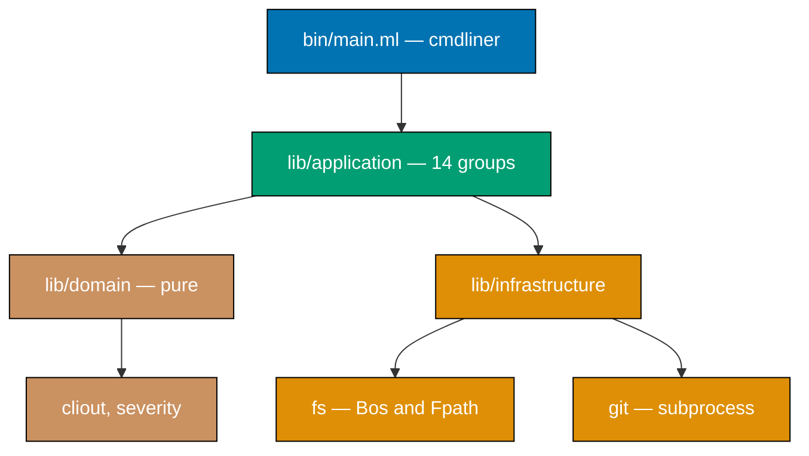

# Tech Docs — rhino-cli OCaml Rewrite

## What is being replaced

| Property             | Value                                                                                              |
| -------------------- | -------------------------------------------------------------------------------------------------- |
| Source               | 195 `.rs` files, **58,617 LOC** under `apps/rhino-cli/src/`                                        |
| Tests                | 29 `.rs` files, **18,461 LOC** under `apps/rhino-cli/tests/`                                       |
| Total                | **77,078 LOC**                                                                                     |
| Dependency graph     | **183** packages in `Cargo.lock`; 82 rlibs compiled for a release build; 16 direct + 5 dev-deps    |
| CLI surface          | 14 top-level command groups, **49** `#[derive(Subcommand)]` enums                                  |
| Unit tests           | **1,351** `#[cfg(test)]` tests in `--lib`                                                          |
| Cucumber harnesses   | 22 `World` implementations; **451** `#[given]`, **196** `#[when]`, **477** `#[then]` step bindings |
| Gherkin corpus       | 67 `.feature` files, **441** scenarios under `specs/apps/rhino/behavior/rhino-cli/gherkin/`        |
| Golden-master corpus | ~120 `.stdout` / `.stderr` fixtures under `apps/rhino-cli/tests/golden-master/`                    |
| Cross-repo binding   | **658** files under `apps/rhino-cli/parity-manifest.sha256`, byte-identical in 3 repos             |
| Architecture         | `domain/` → `application/` → `infrastructure/` + `commands/` (hexagonal CLI)                       |

### Integration blast radius

Excluding `plans/`, `worktrees/`, and `apps/rhino-cli/` itself, **1,268** tracked files reference
`rhino-cli`. The load-bearing, non-markdown ones:

| Surface                | Count      | Detail                                                                                  |
| ---------------------- | ---------- | --------------------------------------------------------------------------------------- |
| Nx `project.json`      | ~30        | Every app and lib that runs a `specs:*` / `env:*` / coverage gate                       |
| Husky hooks            | 3          | `.husky/pre-commit`, `pre-push`, `commit-msg` — registry shims over `repo-config.yml`   |
| Gate registry          | 1          | `repo-config.yml` — the authoritative gate declaration                                  |
| GitHub Actions         | 6          | incl. `rhino-cli-parity-audit.yml`, `pr-quality-gate.yml`, `.github/actions/setup-rust` |
| Toolchain provisioning | 2          | `Brewfile`, root `package.json`                                                         |
| Governance docs        | ~150 `.md` | conventions, workflows, agent definitions                                               |

**Gate invocations per commit-and-push cycle** (from `rhino-cli gate list`):

| Surface      | Total gates | Of which are `rhino-cli` subcommands |
| ------------ | ----------- | ------------------------------------ |
| `pre-commit` | 28          | **10**                               |
| `pre-push`   | 14          | **11**                               |
| `commit-msg` | 1           | 0                                    |

**21 process launches per cycle.** At the measured 4.4 ms startup that is ~92 ms of pure process
overhead. This number is the reason runtime startup time is a hard constraint on the language choice
and not a footnote — see the F# column below.

## Three dead dependencies (verified finding)

`Cargo.toml` declares three crates with **zero** references anywhere in `src/` or `tests/`:

| Crate            | Declared version | References found | OCaml-side consequence                                      |
| ---------------- | ---------------- | ---------------- | ----------------------------------------------------------- |
| `tree-sitter`    | 0.26.9           | **0**            | The single hardest OCaml gap does not apply                 |
| `pulldown-cmark` | 0.13.4           | **0**            | `cmarkit` not needed; markdown is handled with `regex`      |
| `ignore`         | 0.4.25           | **0**            | The "no gitignore-aware walker in OCaml" gap does not apply |

Actual crate usage by reference count in `src/`: `anyhow` 105, `clap` 54, `serde_json` 185 paths,
`serde` 37, `regex` 21, `walkdir` 17, `rustix` 10, `serde_norway` 7, `sha2` 3, `chrono` 3,
`quick_xml` 2, `glob` 2.

Removing the three dead declarations is a Phase 1 item independent of the rewrite decision.

## Four-way language comparison

The maintainer asked for Rust, Go, OCaml, and F# to be compared. Cells are marked **M** (measured on
this machine, 2026-08-07), **C** (cited — source in the References section), or **E** (estimate with
stated basis; no authoritative figure exists).

### Build and dev-loop cost

| Dimension                       | Rust (current)                              | Go                                                                         | OCaml                                                                                 | F# / .NET                                                                                                                   |
| ------------------------------- | ------------------------------------------- | -------------------------------------------------------------------------- | ------------------------------------------------------------------------------------- | --------------------------------------------------------------------------------------------------------------------------- |
| Cold build, this tool's scale   | **63.2 s** (M)                              | seconds (C)                                                                | Phase 2 spike resolves (E)                                                            | **7.1 s** at 3,730 LOC (M) — see caveat                                                                                     |
| Incremental after 1-line change | **68.4 s** (M)                              | ~1 s (C)                                                                   | Phase 2 spike resolves (E)                                                            | **2.9 s** at 3,730 LOC (M)                                                                                                  |
| No-op rebuild                   | 0.25 s (M)                                  | sub-second (C)                                                             | "a couple of seconds" on big workspaces (C)                                           | **1.05 s** (M)                                                                                                              |
| Compiler architecture driver    | monomorphization + LLVM + trait solving (C) | SSA backend tuned for compile throughput; package-level incrementality (C) | dune incremental; flambda is opt-in _because_ it slows builds (C)                     | historically single-threaded, file-order-dependent; F# 10 graph-based parallel type-check is `LangVersion=Preview` only (C) |
| Linter                          | clippy, 700+ lints, first-party (C)         | golangci-lint, 50+ linters (C)                                             | **no clippy-class linter**; `zanuda` 2.1.0 is a small single-maintainer catalogue (C) | G-Research analyzers + FSharpLint, already CI-gated here (M)                                                                |

**F# caveat, stated plainly.** The 7.1 s / 2.9 s / 1.05 s figures are measured against
`apps/crane-cli` — a real, in-repo F# CLI, but **3,730 LOC against rhino-cli's 58,617**, a 15.7×
difference. F# compile time is documented to degrade with project size and file-order dependency,
so these numbers must **not** be extrapolated linearly. They establish that a small F# CLI has a
fast loop; they do not establish that a large one does.

### Disk footprint

| Dimension                | Rust (current)                                    | Go                                                | OCaml                                                                                     | F# / .NET                                                                 |
| ------------------------ | ------------------------------------------------- | ------------------------------------------------- | ----------------------------------------------------------------------------------------- | ------------------------------------------------------------------------- |
| Toolchain, resident      | **7.2 GB, 6 toolchains** (M) — ~1 GB each         | single toolchain, no per-version accumulation (C) | one switch ≈ compiler + deps (E)                                                          | **already installed: 1.3 GB Cellar + 1.5 GB `~/.dotnet`** (M)             |
| Package cache            | `~/.cargo` **434 MB** (M)                         | `$GOPATH/pkg/mod`, global, no eviction (C)        | `~/.opam` global (E)                                                                      | `~/.nuget/packages` **2.2 GB** (M)                                        |
| Build cache              | **8.2 GB** shared target cache across 4 repos (M) | `$GOCACHE`, global and shared (C)                 | `_build/` per project; **`_opam/` local switches duplicate the compiler per project** (C) | `obj/`+`bin/` **59 MB** for crane-cli (M)                                 |
| **Total resident today** | **~16 GB** (M)                                    | —                                                 | —                                                                                         | **~5.0 GB, already paid** (M)                                             |
| Release binary           | **3.88 MiB** (M)                                  | ~2 MB hello-world (C)                             | small, comparable to Go (E, uncited)                                                      | 124 KB apphost + ~21.5 MB DLL payload (M); AOT 1.2-2.7 MB hello-world (C) |

**The OCaml switch model is the risk here, and it cuts against the plan's own goal.** opam's modern
idiom is a per-project local `_opam/` switch containing a full compiler build plus every dependency.
With four repos and live worktrees, that multiplies rather than divides. The plan therefore
**mandates a single shared global switch** and makes measuring `du -sh` on it a Phase 2 gate item.

**Rust does not leave the machine.** `libs/rust-commons`, `apps/ayokoding-cli`, `apps/ose-cli`, and
`ose-primer`'s Rust demo apps all remain. The ~7.2 GB rustup footprint therefore survives the
rewrite; only the ~300 MB `ose-public/rhino-cli` target and its share of the sibling repos' caches
go away, and an opam switch is **added**. This is the single strongest argument against the disk
rationale, and Phase 1's toolchain reclamation addresses far more of the footprint than the rewrite
can.

### Runtime

| Dimension                          | Rust           | Go            | OCaml             | F# / .NET                                           |
| ---------------------------------- | -------------- | ------------- | ----------------- | --------------------------------------------------- |
| Startup, per invocation            | **4.4 ms** (M) | native, ~same | native, ~same (E) | **164 ms** (M, JIT); sub-100 ms with Native AOT (C) |
| Cost per commit+push (21 launches) | **~92 ms** (M) | ~100 ms (E)   | ~100 ms (E)       | **~3.4 s** (M, JIT) — disqualifying without AOT     |

F# is only viable here with `PublishAot=true`, which brings its own constraints: reflection-heavy
paths trim out, type providers are incompatible, and `printf`/`%A` behaviour under AOT could not be
confirmed from any primary source.

### Type safety

| Property                                | Rust                         | Go                                          | OCaml                                                                                                      | F#                                                                          |
| --------------------------------------- | ---------------------------- | ------------------------------------------- | ---------------------------------------------------------------------------------------------------------- | --------------------------------------------------------------------------- |
| Sum types / ADTs                        | `enum` — yes                 | **no**                                      | variants — yes, plus **polymorphic variants**                                                              | discriminated unions — yes                                                  |
| Exhaustiveness checking                 | compiler error               | **none** (bolted on via `go-check-sumtype`) | compiler warning; conservative (false positives, no false negatives)                                       | warning FS0025 — **an error here**, because CI sets `TreatWarningsAsErrors` |
| Null safety                             | no null                      | **nil everywhere**, incl. nil interfaces    | no null (`option`)                                                                                         | `option`; F# 9 added opt-in NRT for BCL interop                             |
| Error handling                          | `Result` + `#[must_use]`     | `error` value, **silently discardable**     | `result` **by convention only**                                                                            | `Result` + computation expressions                                          |
| Unchecked exceptions in the type system | n/a (panics are exceptional) | n/a                                         | **weak spot** — `exn` is an open type, never exhaustively matchable; stdlib `List.find`/`String.sub` raise | .NET exceptions, also untracked                                             |
| Escape hatch                            | `unsafe` (forbidden here)    | `interface{}` / `any`                       | `Obj.magic` (rare)                                                                                         | `obj` / reflection                                                          |
| Immutability default                    | yes                          | **no**                                      | yes                                                                                                        | yes                                                                         |
| Module system                           | traits + generics            | interfaces                                  | **first-class modules and functors** — no Rust equivalent                                                  | modules, no functors                                                        |
| Memory safety without GC                | **yes** (borrow checker)     | GC                                          | GC                                                                                                         | GC                                                                          |

**Reading of this table for this specific tool.** Rust and OCaml are peers, with different edges:
Rust wins on enforced error handling and memory safety without a GC; OCaml wins on functors and
polymorphic variants. Neither edge is load-bearing for a single-threaded, I/O-bound file walker.
OCaml's untracked-exception weakness _is_ load-bearing, because the tool has a 90% line-coverage
gate and a `panic = "deny"` / `unwrap_used = "deny"` clippy policy today that OCaml cannot express.

Go is a clear regression on every row that matters and would undo the Go→Rust port completed
2026-05-23. **Go is not recommended and is documented here only because it was asked for.**

F# is the strongest non-Rust option on paper for _this repository specifically_ — the toolchain is
already installed and CI-gated, exhaustiveness is already an error via `TreatWarningsAsErrors`, and
`apps/crane-cli` is a working in-repo precedent using `Argu`. Its blockers are the 164 ms JIT
startup against 21 invocations per cycle (needs Native AOT, unverified for F# `printf` behaviour)
and a genuinely bad Gherkin story: SpecFlow reached end-of-life 2024-12-31, Reqnroll requires a
C#/VB host project to hold `.feature` files, and TickSpec is a 146-commit, 5-star project.

### Ecosystem

| Dimension               | Rust                                            | Go                                 | OCaml                                                                                    | F# / .NET                                                                                |
| ----------------------- | ----------------------------------------------- | ---------------------------------- | ---------------------------------------------------------------------------------------- | ---------------------------------------------------------------------------------------- |
| Package index size      | ~303,000 crates (C)                             | very large, no single registry (C) | **~4,500 opam packages** (C)                                                             | NuGet, very large (C)                                                                    |
| Gherkin/BDD             | `cucumber` 0.23 (in use)                        | `godog` (C)                        | **none — must be built**                                                                 | official `Gherkin` parser NuGet 42.0.1 is maintained; frameworks are not F#-friendly (C) |
| Dependency audit        | `cargo-deny` + `deny.toml` (in use)             | `govulncheck` (C)                  | **none**; `ocaml/security-advisories` is self-described WIP (C)                          | `dotnet list package --vulnerable`                                                       |
| Coverage with threshold | `cargo llvm-cov --fail-under-lines 90` (in use) | `go test -cover` (C)               | **`bisect_ppx` last released 2023-07-21, no lcov output, no threshold flag** (C)         | coverlet (C)                                                                             |
| Lockfile                | `Cargo.lock` (in use)                           | `go.sum` (C)                       | **`dune pkg lock` still experimental in 2026** (C)                                       | `packages.lock.json` (C)                                                                 |
| Industrial signal       | ubiquitous                                      | ubiquitous                         | Jane Street's OCaml 5 production migration + OxCaml; Docker Desktop migrating to Eio (C) | .NET 10 LTS to 2028-11-10 (C)                                                            |

## The five OCaml tooling gaps

These are the reasons the plan gates rather than commits. Each is a capability this repository's own
governance already requires of every language it ships.

| #   | Gap                           | What exists in Rust today                                                      | OCaml state                                                                                                      | Required Phase 2 outcome                                                                                                       |
| --- | ----------------------------- | ------------------------------------------------------------------------------ | ---------------------------------------------------------------------------------------------------------------- | ------------------------------------------------------------------------------------------------------------------------------ |
| G1  | Gherkin/Cucumber harness      | `cucumber` 0.23.0, 22 `World`s, 1,124 step bindings                            | **Nothing maintained exists**                                                                                    | `libs/ocaml-rhino-gherkin` built and executing all 441 scenarios                                                               |
| G2  | Idiom/correctness linter      | clippy pedantic + `unwrap_used`/`panic`/`undocumented_unsafe_blocks` = deny    | `zanuda` 2.1.0 is a small fixed catalogue; compiler `-w`/`-warn-error` is the real workhorse                     | A documented warning set + `zanuda` config that a `swe-code-checker` OCaml ruleset can gate on                                 |
| G3  | Dependency/supply-chain audit | `cargo-deny` + `deny.toml`, wired to `deps:audit` Nx target                    | No tool consumes `ocaml/security-advisories`; no license allowlist                                               | A working `deps:audit` replacement, or an explicit, argued waiver the maintainer accepts                                       |
| G4  | Coverage with threshold       | `cargo llvm-cov --lcov --fail-under-lines 90`                                  | `bisect_ppx` unmaintained since 2023-07; emits html/cobertura/coveralls — **not lcov**; no threshold flag        | A cobertura→lcov shim plus a threshold wrapper. Note `rhino-cli` **itself** parses lcov and cobertura, so it can host the shim |
| G5  | Reproducible lockfile         | `Cargo.lock`, exact pins, mandated by the reproducible-environments convention | `dune pkg lock` is experimental and opt-in; `opam.locked` against a pinned repo commit is the battle-tested path | A committed lock artefact + a CI check that a clean machine resolves identically                                               |

## The home-grown Gherkin harness

The maintainer's direction: if no maintained OCaml Gherkin library exists, build one compatible with
the current implementation. Research confirms none exists. The corpus makes this tractable.

### Measured grammar subset actually used

Across the whole of `specs/` (1,112 scenarios, not just rhino's 441):

| Construct           | `specs/apps/rhino` | Whole `specs/` tree | Harness must support |
| ------------------- | ------------------ | ------------------- | -------------------- |
| `Feature:`          | 67                 | —                   | yes                  |
| `Rule:`             | 4                  | 5                   | yes                  |
| `Background:`       | 2                  | 50                  | yes                  |
| `Scenario:`         | 441                | 1,112               | yes                  |
| `Scenario Outline:` | **0**              | 20                  | yes (whole-tree)     |
| `Examples:`         | **0**              | 20                  | yes (whole-tree)     |
| Data tables (`\|`)  | **0**              | 90 rows             | yes (whole-tree)     |
| Doc strings (`"""`) | **0**              | **0**               | **no**               |
| `Given`             | 441                | —                   | yes                  |
| `When`              | 441                | —                   | yes                  |
| `Then`              | 441                | —                   | yes                  |
| `And`               | 486                | —                   | yes                  |
| `But`               | 3                  | —                   | yes                  |
| Tags (`@…`)         | ~90 distinct       | —                   | yes, with filtering  |

The rhino corpus itself uses **no** outlines, **no** data tables, and **no** doc strings — a
consequence of the repository's
[step-keyword cardinality rule](../../../repo-governance/development/infra/acceptance-criteria.md).
The harness must nonetheless cover outlines and data tables to be reusable for the rest of `specs/`,
but doc strings can be omitted until something needs them.

### Harness design

- **Parser**: hand-written recursive-descent over the official
  [Gherkin 6 grammar](https://cucumber.io/docs/gherkin/reference/) subset above. No dependency.
- **Step registry**: a mutable association list from a compiled `Re` pattern to a handler
  `world -> string list -> unit`, populated by `Given`/`When`/`Then` registration functions.
  cucumber-rs's `#[given(regex = "…")]` maps directly.
- **World**: a first-class module parameter. Each of the 22 current `World` structs becomes an OCaml
  record threaded through the run — no attribute macros needed.
- **Cucumber-expression compatibility**: cucumber-rs supports both regex and cucumber-expression
  step patterns. `rhino-cli` already contains a cucumber-expression parser at
  `src/application/speccoverage/cucumber_expr.rs`, which is the reference implementation to port.
- **Reporter**: plain and JUnit-XML output, so CI ingestion is unchanged.
- **Self-gating**: the harness ships its own `.feature` corpus and is validated by
  `rhino-cli specs behavior-coverage validate`, exactly as every other consumer is.

The compatibility target is **the existing corpus and the existing step semantics**, not the full
Cucumber specification. Anything the corpus does not use is out of scope until it is needed.

## Hypothetical OCaml project profile

The maintainer asked for projected build size, dependency count, and build time. No authoritative
OCaml benchmark exists at this project's scale, so every figure below is an estimate with its basis
stated, and **Phase 2 replaces each one with a measurement**. None of these is a target.

| Dimension                    | Rust — measured           | OCaml — estimate           | Basis of estimate                                                                                                                 |
| ---------------------------- | ------------------------- | -------------------------- | --------------------------------------------------------------------------------------------------------------------------------- |
| Source LOC                   | 58,617                    | **38,000-47,000**          | 0.65-0.8× — no lifetime annotations, no explicit error-type plumbing when using `result` + `let*`. _Judgment call._               |
| Test LOC                     | 18,461                    | **20,000-24,000**          | Slightly higher: the Gherkin harness's own suite is new code the Rust side gets from a crate                                      |
| New library LOC              | 0                         | **3,000-5,000**            | `libs/ocaml-rhino-gherkin` — parser + registry + reporter + cucumber-expression port                                              |
| Direct dependencies          | 16 + 5 dev                | **12-16**                  | cmdliner, yojson, ppx_yojson_conv, yaml, re, digestif, timedesc, xmlm, bos, fpath, logs, fmt, rresult, astring                    |
| Transitive packages          | **183**                   | **60-90**                  | opam's dependency graphs are flatter; three Rust deps are dead and drop out entirely                                              |
| Units compiled               | 82 rlibs                  | **not comparable**         | dune compiles per-module, not per-package                                                                                         |
| Cold build                   | **63.2 s**                | **unknown**                | No authoritative benchmark at 40k LOC. **Phase 2 spike measures this — it is the single most decision-relevant unknown.**         |
| Incremental after 1 line     | **68.4 s**                | **unknown**                | dune is designed for incrementality, but "a couple of seconds" no-op on large workspaces is a cited caveat                        |
| Release binary               | **3.88 MiB**              | **3-10 MB**                | ocamlopt native + a lighter runtime than Go's; **uncited** — no benchmark found. Note dune's `release` profile does **not** strip |
| Build cache after full build | 221 MB (`target/release`) | **150-400 MB** (`_build/`) | Order-of-magnitude guess from comparable dune projects; **unverified**                                                            |
| Shared opam switch on disk   | n/a                       | **800 MB - 2 GB**          | Compiler + ~80 packages. **Unverified** — no authoritative 2026 figure exists. `du -sh` in Phase 2 settles it                     |

### The comparison that actually decides this

| Scenario                                          | Incremental loop | Total resident disk                            | Status                    |
| ------------------------------------------------- | ---------------- | ---------------------------------------------- | ------------------------- |
| Rust today                                        | **68.4 s** (M)   | **~16 GB** (M)                                 | measured                  |
| Rust after Phase 1 tuning + toolchain reclamation | ?                | ≈ 3-4 GB projected                             | **Phase 1 measures this** |
| OCaml after rewrite                               | ?                | opam switch **+** the surviving Rust toolchain | **Phase 2 measures this** |

The middle row is the control the decision needs and does not have yet. Phase 1 produces it.

## OCaml library map

| Rust crate                                     | Usage in `rhino-cli`      | OCaml replacement                                   | Status                                                                                                                                                    |
| ---------------------------------------------- | ------------------------- | --------------------------------------------------- | --------------------------------------------------------------------------------------------------------------------------------------------------------- |
| `clap` 4.6 (derive)                            | 54 refs, 49 subcommands   | `cmdliner` 2.1.1                                    | Mature, canonical. **Combinator-based, not derive** — the 49 subcommand enums become explicit `Cmd.group` composition. Largest mechanical rewrite surface |
| `serde` + `serde_json`                         | 185 paths                 | `yojson` 3.0.0 + `ppx_yojson_conv`                  | `` `Assoc of (string * json) list `` preserves key order natively — matches the `preserve_order` feature in use                                           |
| `serde_norway` (YAML)                          | 7 refs                    | `yaml` (ocaml-yaml) 3.2.0                           | **Risk** — last release 2023-11; libyaml is YAML 1.1-oriented. Order preserved (assoc list). Comment preservation absent in both, so no regression        |
| `walkdir` 2.5                                  | 17 refs                   | `Bos.OS.Dir.fold_contents` + `Fpath`                | Plain recursive walk — no gitignore semantics needed                                                                                                      |
| `regex` 1.12                                   | 21 refs                   | `re` 1.14.0                                         | Linear-time like Rust's. No lookaround in either — parity. **Verify** `\p{…}` Unicode classes against the actual pattern set                              |
| `quick-xml` + serde                            | 2 refs (Cobertura/JaCoCo) | `xmlm` 1.4.0                                        | Streaming codec; **no derive** — the two XML readers become hand-written. Last release 2022                                                               |
| `chrono`                                       | 3 refs                    | `timedesc` 3.1.2                                    | Actively maintained (2026-06)                                                                                                                             |
| `sha2`                                         | 3 refs (parity manifest)  | `digestif` 1.3.1                                    | Maintained 2026-07                                                                                                                                        |
| `glob`                                         | 2 refs                    | `Re.Glob` (bundled with `re`)                       | No extra package                                                                                                                                          |
| `rustix` (unix fs)                             | 10 refs                   | `bos` 0.3.0 + `Unix` stdlib                         | `bos` released 2026-04                                                                                                                                    |
| `anyhow`                                       | 105 refs                  | `result` + `rresult`                                | **Discipline gap** — nothing enforces `result`-everywhere; stdlib raises. A Phase 2 lint rule must cover this                                             |
| `cucumber` 0.23 (dev)                          | 22 worlds, 1,124 steps    | **`libs/ocaml-rhino-gherkin` (new)**                | Gap G1                                                                                                                                                    |
| `assert_cmd` + `predicates` + `tempfile` (dev) | golden-master             | dune **cram tests** + `bos` + `Bos.OS.Dir.with_tmp` | Cram is dune's first-class CLI golden-master mechanism; dune uses it for its own suite                                                                    |
| `tree-sitter`                                  | **unused**                | —                                                   | Dropped                                                                                                                                                   |
| `pulldown-cmark`                               | **unused**                | —                                                   | Dropped                                                                                                                                                   |
| `ignore`                                       | **unused**                | —                                                   | Dropped                                                                                                                                                   |

## Architecture

The hexagonal layering survives the port unchanged — it is the part of the design that transfers
best, because OCaml modules express it more directly than Rust's module system does.



The four layers are unchanged from the Rust crate: `bin/main.ml` (adapters, `cmdliner`) depends on
`lib/application/` (the 14 command groups' use cases), which depends on `lib/domain/` (pure — output
formatting and severity) and `lib/infrastructure/` (effects — filesystem via `Bos`/`Fpath`, git via
subprocess). Nothing in `domain` depends on anything above it.

### Byte-identity strategy

Behaviour parity is not asserted; it is diffed. The existing
`apps/rhino-cli/scripts/shadow-diff.sh` and the ~120-fixture golden-master corpus are the mechanism —
both were built for the Go→Rust port and are reused verbatim.

1. Phase 3 freezes the current Rust release binary to `local-temp/rhino-rust-frozen`.
2. Every command-group PR runs the OCaml binary and the frozen binary over the same corpus.
3. A non-empty diff on stdout, stderr, or exit code blocks the merge. No exceptions, no "cosmetic
   difference" carve-outs — the corpus is the contract.

## File-Impact Analysis

```text
.
├── apps/rhino-cli/
│   ├── Cargo.toml [D] — after cutover; Phase 1 first removes the 3 dead deps
│   ├── Cargo.lock [D]
│   ├── deny.toml [D] — no OCaml equivalent; G3 must replace or waive it
│   ├── rust-toolchain.toml [D]
│   ├── src/**/*.rs [D] — 195 files, 58,617 LOC, removed only at Phase 12
│   ├── tests/**/*.rs [D] — 29 files; tests/golden-master/** [E] is RETAINED
│   ├── dune-project [N] — dune 3.24 project stanza, release profile flags
│   ├── rhino-cli.opam [N] — dependency declaration
│   ├── opam.locked [N] — G5 reproducible lock artefact
│   ├── .ocamlformat [N] — version-pinned formatter config
│   ├── zanuda.json [N] — G2 lint configuration
│   ├── bin/dune [N], bin/main.ml [N] — cmdliner entry point
│   ├── lib/dune [N]
│   ├── lib/domain/*.ml [N] — cliout, severity
│   ├── lib/infrastructure/*.ml [N] — fs, git
│   ├── lib/application/**/*.ml [N] — one directory per current application module
│   ├── lib/commands/**/*.ml [N] — one module per current commands/ file
│   ├── test/dune [N], test/**/*.ml [N] — alcotest units + Gherkin bindings
│   ├── test/cram/**/*.t [N] — CLI golden-master via dune cram
│   ├── scripts/deny-check.sh [D] — superseded by the G3 outcome
│   ├── scripts/shadow-diff.sh [E] — retargeted at the OCaml binary
│   ├── project.json [E] — every target retargeted from cargo to dune
│   ├── parity-manifest.sha256 [G] — regenerated over the OCaml file set
│   └── README.md [E]
├── libs/ocaml-rhino-gherkin/ [N] — the home-grown harness
│   ├── dune-project [N], ocaml-rhino-gherkin.opam [N], project.json [N]
│   ├── lib/{parser,ast,registry,runner,reporter,cucumber_expr}.ml [N]
│   ├── test/**/*.ml [N]
│   └── README.md [N]
├── specs/
│   ├── apps/rhino/behavior/rhino-cli/gherkin/**/*.feature [E] — re-bound, NOT re-authored
│   └── libs/ocaml-rhino-gherkin/behavior/**/*.feature [N] — the harness's own contract
├── repo-config.yml [E] — gate registry: rhino gate commands re-pointed at the dune binary
├── .husky/{pre-commit,pre-push,commit-msg} [G] — regenerated from repo-config.yml
├── .github/
│   ├── actions/setup-rust/action.yml [E] — still needed by the other Rust projects
│   ├── actions/setup-ocaml/action.yml [N] — opam switch + dune cache
│   └── workflows/*.yml [E] — 6 files: parity audit, PR gate, reusable app/www, validate-env
├── apps/*/project.json [E] — ~30 files invoking rhino gates; discovered by
│                             `grep -rIl rhino-cli --include=project.json apps libs specs`
├── libs/*/project.json [E] — rust-commons, web-ui, web-ui-token, fsharp-crane-core
├── Brewfile [E] — add opam; keep rust for the remaining Rust projects
├── package.json [E] — doctor/bindings scripts
├── docs/reference/monorepo-structure.md [E]
├── docs/reference/platform-bindings.md [E]
└── repo-governance/
    ├── development/quality/cross-language-lint-strictness.md [E] — add the OCaml row
    ├── development/infra/nx-targets.md [E]
    ├── development/workflow/native-first-toolchain.md [E]
    ├── development/workflow/worktree-setup.md [E]
    └── development/pattern/hexagonal-architecture-cli.md [E]
```

### More Detail

**The ~30 consuming `project.json` files are discovered, not listed.** The exact set is enumerated
in Phase 0 with
`grep -rIl 'rhino-cli' --include=project.json apps libs specs` and recorded to
`evidence/phase-0-consumers.txt`. That recorded list — not this tree — is the ledger the cutover
phase reconciles against, because the set changes as other plans land.

**Rust deletion is deferred to Phase 12 on purpose.** Every earlier phase keeps the Rust crate
building and passing, because the frozen binary is the differential oracle. Deleting it earlier
would remove the only thing proving the OCaml port correct.

**The three sibling repos are not edited from here.** `ose-primer` and `ose-private` receive the
identical change through the
[multi-repo parity workflow](../../../repo-governance/workflows/plan/plan-multi-repo-parity-planning-and-execution.md),
in the same delivery unit as the `ose-public` cutover, because the parity manifest gate fails the
moment the three diverge. `beaver-nest`'s fork is re-based separately and is not manifest-bound.

**`.github/actions/setup-rust` survives.** It is still needed by `rust-commons`, `ayokoding-cli`, and
`ose-cli`. Only `rhino-cli`'s use of it goes away.

## Dependencies on other work

| Dependency                                               | Nature                                                                                                                                                                                                             |
| -------------------------------------------------------- | ------------------------------------------------------------------------------------------------------------------------------------------------------------------------------------------------------------------ |
| `plans/in-progress/sdlc-gate-registry-enforcement`       | **Blocking** — it is actively rewriting `repo-config.yml`, the Husky shims, and the gate surface across all four repos. Rewriting the binary underneath a live gate-registry migration would collide on every file |
| `plans/in-progress/repository-onboarding-readme-refresh` | Non-blocking; docs-only overlap                                                                                                                                                                                    |
| Any future plan touching `apps/rhino-cli/`               | Must be drained first — Phase 0 enumerates and records the set                                                                                                                                                     |

## Risks and mitigations

| #   | Risk                                                                                           | Severity | Mitigation                                                                                                                                                                                                                            |
| --- | ---------------------------------------------------------------------------------------------- | -------- | ------------------------------------------------------------------------------------------------------------------------------------------------------------------------------------------------------------------------------------- |
| T1  | `cmdliner`'s combinator model cannot reproduce clap's exact `--help` text byte-for-byte        | HIGH     | Help output is in the golden-master corpus. Phase 2 spikes the **hardest** group (`specs`, 14 subcommands) first. If bytes cannot match, the fallback is a documented, corpus-updating help-text change approved at the go/no-go gate |
| T2  | `ocaml-yaml` (last release 2023-11) mis-parses a `repo-config.yml` construct                   | HIGH     | Phase 2 round-trips all four repos' `repo-config.yml` through it and byte-compares                                                                                                                                                    |
| T3  | G4 unresolved — coverage silently stops being enforced                                         | HIGH     | The Phase 2 gate fails on an unresolved G-item. `rhino-cli` already parses lcov and cobertura, so it can host the shim itself                                                                                                         |
| T4  | `bisect_ppx` instrumentation distorts the golden-master byte output                            | MEDIUM   | Coverage runs in a separate dune profile from the shadow-diff runs                                                                                                                                                                    |
| T5  | opam local switches balloon disk across 4 repos × N worktrees                                  | MEDIUM   | Single shared global switch is mandated; `du -sh` is a Phase 2 gate item                                                                                                                                                              |
| T6  | The Gherkin harness diverges from cucumber-rs's step-matching semantics                        | MEDIUM   | Port `cucumber_expr.rs` directly rather than reimplementing; all 441 scenarios must pass unchanged                                                                                                                                    |
| T7  | `xmlm` has no derive, so the Cobertura/JaCoCo readers are hand-written and drift               | MEDIUM   | Both have golden-master fixtures; property-test against the existing Rust parser's output                                                                                                                                             |
| T8  | 3-repo parity breaks mid-cutover                                                               | HIGH     | Cutover is one atomic delivery unit; the parity manifest regenerates in the same commit                                                                                                                                               |
| T9  | Phase 1's control experiment shows tuning solves the problem, and the plan's premise dissolves | MEDIUM   | This is a **success**, not a failure. The go/no-go gate exists to make that outcome cheap to act on                                                                                                                                   |

## Rollback

| Point of failure                | Rollback                                                                                                             |
| ------------------------------- | -------------------------------------------------------------------------------------------------------------------- |
| Phase 1                         | Revert the profile and toolchain changes. Independent of the rewrite either way                                      |
| Phase 2 (spike)                 | Delete the spike worktree. Nothing shipped. Phase 1's improvements stand on their own                                |
| Phases 3-11 (per command group) | Revert that group's PR. The Rust crate is still the shipped binary throughout — the OCaml tree is dark until cutover |
| Phase 12 (cutover)              | Revert the cutover commit in all three repos. The Rust crate is still present and building until Phase 13            |
| Post-Phase 13 (Rust deleted)    | `git revert` the deletion commit. This is the last point with a cheap rollback — hence the deferral                  |

## References

Sources are cited where a claim depends on them. Accessed 2026-08-07 unless noted.

**Measured on this machine, 2026-08-07** — every value marked (M): the Rust figures from
`cargo build/check/clippy/test` with `/usr/bin/time -p` and an empty `CARGO_TARGET_DIR`; the disk
figures from `du -sh` on `~/.rustup`, `~/.cargo`, `~/.cache/ose-cargo-target`, `~/.dotnet`,
`~/.nuget/packages`, and `/opt/homebrew/Cellar/dotnet`; the F# figures from
`dotnet publish/build` on `apps/crane-cli` after `dotnet clean` and `obj/`+`bin/` removal.
The machine was under concurrent agent load throughout.

**OCaml libraries** — [cmdliner 2.1.1](https://ocaml.org/p/cmdliner/latest) (2026-04-22);
[yojson 3.0.0](https://opam.ocaml.org/packages/yojson/) (2025-06-02);
[ocaml-yaml 3.2.0](https://opam.ocaml.org/packages/yaml/) (2023-11-06);
[re 1.14.0](https://opam.ocaml.org/packages/re/) (2025-09-22);
[xmlm 1.4.0](https://opam.ocaml.org/packages/xmlm/) (2022-02-09);
[timedesc 3.1.2](https://opam.ocaml.org/packages/timedesc/) (2026-06-11);
[digestif 1.3.1](https://opam.ocaml.org/packages/digestif/) (2026-07-14);
[bos 0.3.0](https://opam.ocaml.org/packages/bos/) (2026-04-23).

**OCaml tooling** — [dune 3.24.2](https://ocaml.org/p/dune/latest);
[dune package management is experimental](https://dune.readthedocs.io/en/stable/explanation/package-management.html);
[dune cram tests](https://dune.readthedocs.io/en/latest/reference/cram.html);
[ocamlformat 0.29.0](https://ocaml.org/p/ocamlformat/latest);
[zanuda 2.1.0](https://opam.ocaml.org/packages/zanuda/) (2026-07-05);
[bisect_ppx 2.8.3](https://opam.ocaml.org/packages/bisect_ppx/) (last release 2023-07-21; report
formats are html/cobertura/coveralls/summary/merge/send-to — no lcov);
[ocaml/security-advisories](https://github.com/ocaml/security-advisories) (self-described WIP);
[OCaml Flambda is opt-in because it slows builds](https://ocaml.org/manual/5.4/flambda.html);
[opam local switches duplicate the compiler per project](https://ocaml.org/docs/opam-switch-introduction).

**Ecosystem size** — [Lib.rs stats: ~303,000 crates](https://lib.rs/stats);
[opam: "over 4,500 packages"](https://opam.ocaml.org/).

**OCaml industrial signal** —
[Jane Street's OxCaml branch](https://tarides.com/blog/2025-07-09-introducing-jane-street-s-oxcaml-branch/);
[Docker Desktop moving to Eio on OCaml 5](https://anil.recoil.org/notes/icfp25-ocaml5-js-docker).

**Go** — [Go SSA backend prioritises compile throughput](https://go.dev/src/cmd/compile/internal/ssa/README);
[go-check-sumtype exists because Go has no exhaustiveness checking](https://github.com/alecthomas/go-check-sumtype);
[golang/go#29561 — GOCACHE has no size limit](https://github.com/golang/go/issues/29561).

**F# / .NET** — [SpecFlow end-of-life 2024-12-31](https://reqnroll.net/news/2025/01/specflow-end-of-life-has-been-announced/);
[Reqnroll requires a C#/VB host project for `.feature` files](https://docs.reqnroll.net/latest/integrations/fsharp.html);
[official Gherkin parser NuGet 42.0.1](https://www.nuget.org/packages/gherkin/) (2026-08-05);
[Introducing F# 10 — parallel type-checking under `LangVersion=Preview`](https://devblogs.microsoft.com/dotnet/introducing-fsharp-10/);
[G-Research: graph-based type-checking, ~15% faster](https://www.gresearch.com/news/going-15-percent-faster-with-graph-based-type-checking-part-one/);
[.NET Native AOT deployment](https://learn.microsoft.com/en-us/dotnet/core/deploying/native-aot/);
[FS0025 incomplete-match is a warning by default](https://learn.microsoft.com/en-us/dotnet/fsharp/language-reference/compiler-messages/fs0025);
[.NET 10 LTS through 2028-11-10](https://github.com/dotnet/core/blob/main/release-notes/10.0/README.md).

**Rust** — [why Rust compiles slowly: monomorphization + LLVM](https://www.pingcap.com/blog/reasons-rust-compiles-slowly/);
[rustup toolchains are 500 MB-1 GB each](https://users.rust-lang.org/t/how-to-reduce-the-size-of-rustup-dependencies/128196).
