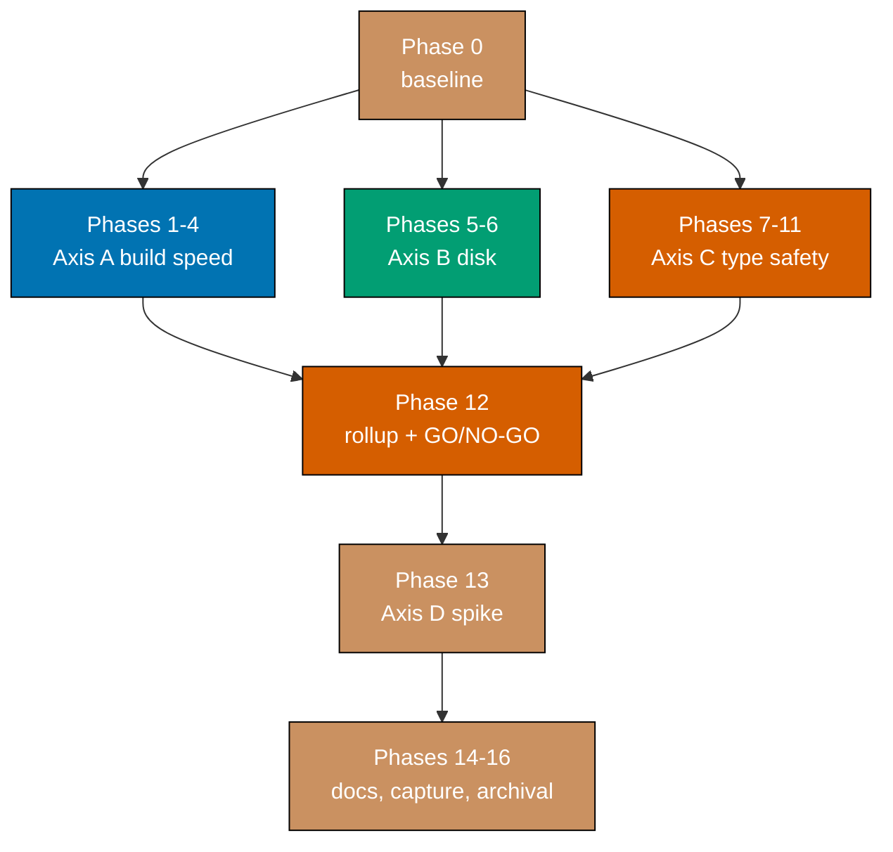

# Delivery — rhino-cli Optimization

> **Legend** — `[AI]`: an agent performs the step (the default; unmarked steps are `[AI]`).
> `[HUMAN]`: only a human can do it (physical action, out-of-band approval, real-secret or
> privileged-credential handling). `[AI+HUMAN]`: agent prepares, human approves or finishes.

## Worktree

Worktree path: `worktrees/rhino-cli-optimization/`

Optional manual pre-provisioning (run from repo root):

```bash
claude --worktree rhino-cli-optimization
```

The plan-execution Step 0 gate enters this worktree by default: it auto-provisions from the latest
`origin/main` when missing, syncs with `origin/main` before implementing, and prompts before
deleting the worktree after the plan is archived and pushed.

The three axes are independent DAG nodes and each takes **its own** worktree and branch —
`worktrees/rhino-cli-opt-build/`, `worktrees/rhino-cli-opt-disk/`,
`worktrees/rhino-cli-opt-types/`. The path above is the plan's serial-spine worktree.

**No git-capable agent runs in the primary checkout while this plan has uncommitted work.** During
authoring, a concurrent agent operating in the primary tree ran `git reset` and destroyed this
plan's entire uncommitted document set. Every implementation step below runs in a worktree.

## Delivery Mode: worktree-to-pr

Repo default. Each delivery boundary below opens exactly one PR and runs the
[PR-Review Maker→Fixer Cycle](../../../repo-governance/workflows/pr/pr-review-quality-gate.md)
before merging. `[AI]` merges once the five hardened preconditions hold, **except** the Phase 12
Axis D go/no-go, which is an explicit `[HUMAN]` gate.

## Sequencing position

This plan is the **middle of three**, executed in this order:

```text
sdlc-gate-registry-enforcement  →  rhino-cli-optimization  →  beaver-nest-repo-consolidation
```

All three touch `apps/rhino-cli`, so the ordering carries obligations in both directions.

### Upstream — what this plan inherits

[`sdlc-gate-registry-enforcement`](../../in-progress/sdlc-gate-registry-enforcement/README.md) makes
`repo-config.yml` the authoritative gate registry and `rhino-cli gate run` the dispatch behind the
three generated Husky shims, with per-entry `rhino-cli` / `external` / `nx` invocation types. Its
scope was narrowed on 2026-08-07 to `ose-public` and `ose-private` — the same two repos as this
plan's enforced parity boundary.

The consequence: **the gate registry already is the single indirection for hook-invoked gates.**
Axis A does not build a competing wrapper for that surface. Its work splits in two:

| Surface                                 | Sites | Who owns the indirection after sequencing                                                       |
| --------------------------------------- | ----- | ----------------------------------------------------------------------------------------------- |
| Husky shims                             | 3     | `repo-config.yml` — already central; Axis A changes only how its `rhino-cli`-type entries build |
| `.github/workflows/pr-quality-gate.yml` | 5     | Same registry, via `gate run`                                                                   |
| `project.json` across the monorepo      | 53    | **Unowned** — Axis A's actual indirection work is here                                          |

If this plan is somehow executed _before_ the registry plan completes, Axis A must be re-planned:
the Husky and CI surfaces would then need their own indirection, duplicating work the registry plan
is already doing. Phase 0 verifies the sequencing before any change-producing phase runs.

### Downstream hand-off — what this plan owes the next one

[`beaver-nest-repo-consolidation`](../beaver-nest-repo-consolidation/README.md) folds `beaver-nest`
into `ose-public`, retires the fourth repository, and **discards** `beaver-nest`'s already-diverged
`rhino-cli` fork rather than reconciling it. Nothing in this plan propagates to that fork.

But that plan edits `apps/rhino-cli` directly and cites artefacts this plan removes. Each citation
below goes stale the moment the named phase lands, and **repairing them is this plan's
responsibility, not the next plan's**:

| Artefact the downstream plan cites                                             | Removed by | Repair                                                                                                             |
| ------------------------------------------------------------------------------ | ---------- | ------------------------------------------------------------------------------------------------------------------ |
| `apps/rhino-cli/tests/gate_specs.rs` — the parity-message assertion target     | Phase 3    | Re-point at the consolidated binary's corresponding module                                                         |
| `cargo run --release --quiet --manifest-path apps/rhino-cli/Cargo.toml -- ...` | Phase 2    | Re-point at the resolver; 4 such steps, including `repo-config validate` and `parity manifest generate`/`validate` |
| `docs/reference/sdlc-gate-standard.md` invocation-form references              | Phase 2    | Both plans edit this file for different reasons; this plan lands first                                             |

One nuance to preserve rather than "fix": the downstream plan speaks of a **three-repo** parity
message (`ose-public`, `ose-primer`, `ose-private`) because that is what `parity.rs` will assert
after it removes the four-repo claim. That is not in conflict with this plan's **two-repo
continuously-enforced** boundary — `ose-primer` is named in the message and synced periodically,
but sits outside continuous enforcement per commit `a0383faed`. Do not collapse the two concepts.

Phase 12 verifies every row above before this plan closes.

### Repo scope — exactly two

**This plan deals with `ose-public` and `ose-private`, and no other repository.** The two other
family members are excluded for different reasons, and neither exclusion is a deferral:

- **`beaver-nest`** is folded into `ose-public` and archived by the downstream plan. Its `rhino-cli`
  fork is discarded, not reconciled. Propagating anything into it would be work thrown away days
  later.
- **`ose-primer`** left continuous byte-identity enforcement at commit `a0383faed` and is now
  synced **manually and on a delay**. A delayed-sync repo must not be a blocking participant in a
  delivery unit — that is the whole point of it leaving enforcement. It receives this plan's changes
  whenever its next manual sync runs, on its own schedule, and nothing here waits for it.

`apps/rhino-cli` is byte-identical with `ose-private` under
[`parity-manifest.sha256`](../../../apps/rhino-cli/parity-manifest.sha256). **Every PR in this plan
that touches a manifest-covered file lands in both repos as one delivery unit**, with the manifest
regenerated in the same commit.

One deliberate exception, stated so it is not mistaken for scope creep: Axis B reclaims
`ose-primer`'s **stale gitignored build cache** on this machine — 7.5 GB of the 8.2 GB shared target
directory. That is a machine-level disk action touching no file in that repository, tracked or
otherwise. If the cache is absent when Phase 6 runs, the reclamation is skipped and M7's target is
recomputed against what is actually present.

## The POC-first rule

**Every substantive phase opens with a bounded POC before any tracked file changes.** A POC:

1. Runs in the scratchpad or a throwaway `CARGO_TARGET_DIR`, never in the repo working tree.
2. Measures **one** number that decides whether the phase's main work is worth doing.
3. States an explicit **abandon-if** threshold _before_ it runs.
4. Records its result in [`learnings.md`](./learnings.md) whether it passes or fails.

This is not ceremony. During plan authoring, local measurement disqualified four separately
well-cited interventions — linker replacement, `sccache`, `cargo-sweep`, and workspace splitting —
each of which ranks highly in general Rust build advice and none of which helps this workload on
this platform. A phase that skipped its POC would have shipped them.

## Blocking prerequisites

Phase 0 verifies both before any change-producing phase runs.

| Prerequisite                                                                       | Why                                                                                                                      |
| ---------------------------------------------------------------------------------- | ------------------------------------------------------------------------------------------------------------------------ |
| `sdlc-gate-registry-enforcement` is archived to `plans/done/`                      | Per the sequencing position above — it owns `repo-config.yml`, the Husky shims, and the CI gate surface Axis A builds on |
| No other in-progress plan edits `apps/rhino-cli/`, `repo-config.yml`, or `.husky/` | Concurrent edits to the gate registry collide on every load-bearing file and break the parity manifest                   |

## Parallelization Model

**N = 3** (repo default; the N+1 model — 1 main thread + 3 background agents). The parallel window
is Axes A, B, and C, which is exactly three nodes.

**Serial spine** — `Phase 0 → {Axis A, Axis B, Axis C} → Phase 12 → Phase 13 → Phases 14-16`

**Parallel fan-out** — the three axes are mutually independent:

- Axis A edits `Cargo.toml`'s `[profile.*]` and `[[test]]` stanzas, `project.json` files,
  `repo-config.yml`, and the Nx configuration. It does not touch `src/`.
- Axis B edits governance docs and the doctor/sweeper surface. It touches no Rust source at all.
- Axis C edits `Cargo.toml`'s `[lints.clippy]` stanza and `src/**/*.rs`. It touches no target or
  gate configuration.

`Cargo.toml` is the one shared file. Axes A and C write **disjoint stanzas** of it — `[profile]`
and `[[test]]` versus `[lints.clippy]` — so a merge conflict is a textual adjacency problem, not a
semantic one. Whichever axis merges second rebases; the plan does not serialize them for this.

**Serial within each axis.** Every axis's phases build on their predecessor: the POC decides the
approach, the first landing phase creates the mechanism, later phases use it.

**Not independent, despite looking it:**

- Phase 2 (fast profile) and Phase 3 (test consolidation) — Phase 3 removes the `[[test]]` stanzas
  Phase 2's measurement baseline was taken against. Serial.
- Phase 9 (`indexing_slicing`) and Phase 10 (`arithmetic_side_effects`) — both rewrite statements
  in the same 195 files. Running them concurrently guarantees a conflict in every file. Serial.
- Phase 12 (measurement rollup) and everything — it reads all three axes' post-state, and verifies
  the downstream hand-off.

**Cleanup is the terminal node.** Phase 16 depends on every delivery node. The frozen baseline
binary at `local-temp/rhino-frozen` survives until Phase 12's shadow diff passes.



Each axis is collapsed into one box for legibility; its phases are enumerated individually in the
Delivery Boundaries table below.

### Delivery Boundaries

| Phase(s) | Delivery unit                                              | Worktree / branch                  | PR opens          |
| -------- | ---------------------------------------------------------- | ---------------------------------- | ----------------- |
| 0        | — (setup and baseline)                                     | `worktrees/rhino-cli-optimization` | no                |
| 1        | — (throwaway POC, scratchpad only)                         | `worktrees/rhino-cli-opt-build`    | no                |
| 2        | Fast profile + project.json indirection + dead-dep removal | `worktrees/rhino-cli-opt-build`    | yes — at Phase 2  |
| 3        | Test-binary consolidation + nextest                        | `worktrees/rhino-cli-opt-build`    | yes — at Phase 3  |
| 4        | `nx affected` detection fix                                | `worktrees/rhino-cli-opt-build`    | yes — at Phase 4  |
| 5        | — (throwaway POC, machine-level only)                      | `worktrees/rhino-cli-opt-disk`     | no                |
| 6        | Toolchain reclamation + hygiene automation                 | `worktrees/rhino-cli-opt-disk`     | yes — at Phase 6  |
| 7        | — (throwaway POC, one module, reverted)                    | `worktrees/rhino-cli-opt-types`    | no                |
| 8        | Cheap lint adjacents                                       | `worktrees/rhino-cli-opt-types`    | yes — at Phase 8  |
| 9        | `indexing_slicing` crate-wide                              | `worktrees/rhino-cli-opt-types`    | yes — at Phase 9  |
| 10       | `arithmetic_side_effects` crate-wide                       | `worktrees/rhino-cli-opt-types`    | yes — at Phase 10 |
| 11       | Malformed-input robustness tests                           | `worktrees/rhino-cli-opt-types`    | yes — at Phase 11 |
| 12       | Measurement rollup + downstream hand-off + `[HUMAN]` gate  | `worktrees/rhino-cli-optimization` | yes — at Phase 12 |
| 13       | Axis D spike (**conditional** — skipped if targets met)    | `worktrees/rhino-cli-opt-lang`     | yes — if entered  |
| 14       | Documentation propagation across both repos                | `worktrees/rhino-cli-opt-docs`     | yes — at Phase 14 |
| 15-16    | Knowledge capture and archival                             | `worktrees/rhino-cli-optimization` | yes — at Phase 16 |

Phase 0 opens no PR; its evidence rides Phase 2's. Phases 1, 5, and 7 are POCs producing no tracked
change and therefore open no PR — their findings ride the next phase's PR via `learnings.md`.

---

## Phase 0 — Baseline and prerequisites

No PR. Establishes the numbers every later gate is falsified against.

- [ ] Verify the sequencing assumption: `plans/done/` contains the archived
      `sdlc-gate-registry-enforcement`. If it is still in progress, **stop** and report — Axis A's
      design depends on the registry existing.
- [ ] Read `repo-config.yml`'s post-registry shape and record how a `rhino-cli`-type gate entry
      declares its invocation. Axis A edits that declaration, not the shims.
- [ ] Re-derive the downstream hand-off table in §Sequencing position against the current
      `beaver-nest-repo-consolidation` delivery checklist. That plan is still in backlog and may
      have gained or lost citations since this table was written.
- [ ] Confirm no in-flight foreign work on the shared surface:
      `git log --oneline -20 -- apps/rhino-cli repo-config.yml .husky`.
- [ ] Run `npm install` and `npm run doctor -- --fix` in the worktree.
- [ ] Confirm git identity is the developer's own, **not** a stray `Test <test@test.com>` override:
      `git config --get user.email` must match `~/.gitconfig`. Do not set or modify it at any
      scope — if it is wrong, stop and report; this is a `[HUMAN]` fix.
- [ ] Freeze the current binary as the shadow-diff baseline:

```bash
cargo build --release --manifest-path apps/rhino-cli/Cargo.toml
mkdir -p local-temp && cp apps/rhino-cli/target/release/rhino-cli local-temp/rhino-frozen
```

- [ ] Record the build-time baseline against an **explicitly empty** `CARGO_TARGET_DIR`. Do not use
      `du -sh apps/rhino-cli/target` to check emptiness — that path is a symlink and reports `0B`
      regardless, which silently turns a warm build into a fake cold measurement
      ([`learnings.md`](./learnings.md) L1).
- [ ] Capture `cargo build --timings` for both `cargo build --release` and
      `cargo check --all-targets`; archive both HTML reports under `local-temp/`.
- [ ] Run `cargo tree -d --manifest-path apps/rhino-cli/Cargo.toml` and record every duplicate
      dependency version. This is an input to Phase 2, not a deliverable.
- [ ] Record the disk baseline per component: `~/.rustup` per toolchain, the shared target cache
      per repo, `~/.cargo/registry`.
- [ ] Record the type-safety baseline counts — index/slice sites, `.expect(`, reasonless
      `#[allow(`, `as` casts — with the **exact commands used**, so Phase 12 can re-run them
      verbatim rather than approximating them.
- [ ] Enumerate every `cargo run --release` site targeting `apps/rhino-cli/Cargo.toml`, per file.

**Phase 0 Gate** — every baseline figure in [`brd.md`](./brd.md) is either reproduced or corrected
in place, `local-temp/rhino-frozen` exists and runs, the registry's post-sequencing shape is
recorded, the downstream hand-off table is re-derived, and the invocation-site count is recorded per
file. Report the delta if any figure moved since 2026-08-07.

> **Pause Safety** — nothing is committed. Resuming re-runs the measurements; they are idempotent.

---

## Axis A — Build speed

### Phase 1 — POC: does a fast profile make the _gate_ faster?

Throwaway. Scratchpad only. No tracked file changes, no PR.

The risk this POC exists to kill: a faster build could produce a binary slow enough at runtime that
21 gate invocations per commit-plus-push erase the win. Compile time is not the metric that
matters — **end-to-end gate wall clock** is.

- [ ] In the scratchpad, build `rhino-cli` under three configurations against three separate empty
      target dirs: current `release`; `release` with `codegen-units=16`, `lto=off`, `debug=0`; and
      `dev` with `debug=0`.
- [ ] For each, measure the one-line-edit rebuild time (touch `src/lib.rs`, rebuild).
- [ ] For each, measure the **runtime** of a full simulated gate cycle — every validator command
      the registry's gate entries invoke, run against this working tree, timed end to end.
- [ ] Measure the fixed overhead of `cargo run`'s freshness check versus invoking the prebuilt
      binary directly, across 21 sequential invocations.
- [ ] Confirm whether backtraces from a deliberately failing test still identify the failing source
      line under `debug = 0`. If not, re-measure with `debug = "line-tables-only"` and prefer it.
- [ ] Record all measurement sets in [`learnings.md`](./learnings.md).

**Abandon-if** — if the fastest-building configuration's **end-to-end gate wall clock** is worse
than the current `release` configuration's, the profile lever is rejected and Phase 2 is rewritten
around the freshness-check overhead alone. Record the decision either way.

**Phase 1 Gate** — three rebuild figures and three gate wall-clock figures recorded, the
freshness-check overhead quantified, backtrace fidelity settled, and an explicit adopt-or-abandon
decision written down.

> **Pause Safety** — scratchpad only. Resuming re-runs the POC from scratch.

### Phase 2 — Fast profile, project.json indirection, dead dependencies

Worktree `worktrees/rhino-cli-opt-build`. Opens a PR. Lands in `ose-private` in the same unit.

**RED**

- [ ] Add a failing acceptance check asserting that zero `cargo run --release` sites targeting
      `apps/rhino-cli/Cargo.toml` remain in `project.json` files. Use `grep -rF` for the literal —
      the string contains no regex metacharacters worth interpreting, and `-F` avoids surprises.
      Accumulate wrapped lines before matching so a multi-line JSON command string is not missed.

```bash
grep -rF 'cargo run --release --quiet --manifest-path apps/rhino-cli/Cargo.toml' \
  --include='project.json' apps/ libs/ | wc -l
```

Acceptance criterion: this prints `53` before the change and `0` after. **Both directions are
asserted.** A check confirming only the post-state would pass vacuously against a repo with no
`project.json` files at all.

**GREEN**

- [ ] Add the fast profile to `apps/rhino-cli/Cargo.toml`, using the values Phase 1 selected:

```toml
[profile.gate]
inherits = "dev"
debug = 0
opt-level = 1
incremental = true
```

- [ ] Set `codegen-units = 16` on `[profile.release]`, keeping `lto = "thin"`. This is worth doing
      on its own merits and does **not** substitute for the profile above — it reached 11.6 s in
      measurement, which misses the 10 s target.
- [ ] Leave `split-debuginfo` unset. macOS already defaults to `"unpacked"`, which is correct;
      setting `"packed"` runs `dsymutil` and keeps the debug info embedded as well, paying twice.
- [ ] Point the registry's `rhino-cli`-type gate entries in `repo-config.yml` at the fast profile.
      The three Husky shims are **generated** — never hand-edit them. Verify with
      `cargo run --quiet --manifest-path apps/rhino-cli/Cargo.toml -- gate validate`.
- [ ] Create the single resolver for the 53 `project.json` sites — the surface the gate registry
      does not cover. If Phase 1 showed the freshness check is material, the resolver invokes the
      prebuilt binary directly and rebuilds only when stale.
- [ ] Repoint all 53 sites across 27 files at the resolver.
- [ ] Remove `tree-sitter`, `pulldown-cmark`, and `ignore` from `[dependencies]`.
- [ ] Resolve or explicitly document every duplicate dependency version Phase 0 recorded.
- [ ] **Downstream hand-off** — update the four steps in
      `plans/backlog/beaver-nest-repo-consolidation/delivery.md` that invoke
      `cargo run --release --quiet --manifest-path apps/rhino-cli/Cargo.toml`, including
      `repo-config validate` and `parity manifest generate`/`validate`, to use the resolver.
- [ ] Run the full shadow diff against `local-temp/rhino-frozen`: every subcommand's stdout,
      stderr, and exit code, byte for byte.

**REFACTOR**

- [ ] Regenerate `apps/rhino-cli/parity-manifest.sha256` in the same commit.
- [ ] Update `docs/reference/sdlc-gate-standard.md`, whose 17 references describe the invocation
      form being replaced.
- [ ] Run `npm run generate:bindings` and `npm run validate:sync`; the regenerated mirrors go in
      the **same commit**, never a follow-up sync commit.

**Phase 2 Gate**

- [ ] The invocation-site count is `0`, confirmed by the RED command, having been `53` before.
- [ ] A one-line edit to `src/lib.rs` followed by a gate-binary rebuild completes in **under 10 s**.
- [ ] End-to-end simulated gate wall clock is no worse than the Phase 0 baseline.
- [ ] `gate validate` passes — shim, generated-artifact, and CI conformance intact.
- [ ] Shadow diff is byte-identical for every subcommand.
- [ ] `nx run rhino-cli:test:quick` and `cargo clippy` pass.
- [ ] No step in `beaver-nest-repo-consolidation/delivery.md` still cites the removed form.
- [ ] `ose-private` carries the identical change and its parity manifest matches.
- [ ] CI green on the PR, three review cycles complete.

> **Pause Safety** — if paused after the profile lands but before the sites are repointed, the repo
> is in a working state: the new profile is unused and the old sites still function. Do **not**
> leave a partial site sweep — a mixed state builds the crate under two profiles in one gate cycle
> and does strictly more work than before the change.

### Phase 3 — Consolidate the test binaries

Worktree `worktrees/rhino-cli-opt-build`. Opens a PR.

**RED**

- [ ] Capture the current executed-test-name set as the invariant:

```bash
cargo test --manifest-path apps/rhino-cli/Cargo.toml -- --list > local-temp/tests-before.txt
```

Acceptance criterion: the post-consolidation list, sorted, is byte-identical to
`local-temp/tests-before.txt` sorted. A count-only check is insufficient — it would pass if one
test were renamed away and another added.

**GREEN**

- [ ] Consolidate the 28 files under `apps/rhino-cli/tests/` into a single binary with one module
      per current file. The `harness = false` custom runners become internal functions dispatched
      from one `main`.
- [ ] Reduce the 22 `[[test]]` stanzas in `Cargo.toml` to one.
- [ ] Adopt `cargo-nextest` for the suite and wire it into the relevant Nx target.
- [ ] **Downstream hand-off** — `beaver-nest-repo-consolidation`'s parity-message TDD cycle names
      `apps/rhino-cli/tests/gate_specs.rs` as its RED target and runs
      `cargo test --manifest-path apps/rhino-cli/Cargo.toml --test gate_specs`. Re-point both at
      the consolidated binary's corresponding module and its new invocation.

**REFACTOR**

- [ ] Regenerate the parity manifest; propagate to `ose-private`.

**Phase 3 Gate**

- [ ] Sorted test-name lists match byte for byte before and after.
- [ ] Exactly one integration-test binary is produced.
- [ ] `cargo check --all-targets` and `cargo test --lib` are both faster than the Phase 0 baseline;
      record both figures rather than asserting "faster" without one.
- [ ] `grep -rn 'gate_specs' plans/backlog/beaver-nest-repo-consolidation/` returns only citations
      that resolve against the post-consolidation layout.
- [ ] CI green, three review cycles complete.

> **Pause Safety** — consolidation is all-or-nothing per file. A half-moved module leaves the suite
> uncompilable. If paused mid-move, either finish the current file's move or revert it.

### Phase 4 — Root-cause the `nx affected` detection gap

Worktree `worktrees/rhino-cli-opt-build`. Opens a PR. Absorbs the
`ose-public-nx-affected-rhino-cli-gap` idea two-pager.

A gate that is silently skipped is not improved by being made faster. In `ose-public` only, a
commit whose sole change is under `apps/rhino-cli/src/` is not detected by `nx affected`, so
`.husky/pre-push`'s affected invocation runs nothing. `ose-private` detects it correctly. The
missing `root` key in `project.json` is already **ruled out** — it is absent identically in both
repos and so cannot explain a one-repo divergence.

**RED**

- [ ] Construct the reproducing case: a commit touching only
      `apps/rhino-cli/src/application/docs/naming.rs`. Assert that
      `npx nx show projects --affected --base=HEAD~1` does **not** list `rhino-cli` today, and does
      list it after the fix.

**GREEN**

- [ ] Diff the Nx surface between `ose-public` and `ose-private`: `nx.json` `namedInputs`,
      `implicitDependencies`, plugin configuration, `.nxignore` presence, `workspaceLayout`, and
      the installed `nx` / `@nx/*` versions via lockfile diff.
- [ ] Dump `nx graph --file=graph.json` in both repos and compare the `rhino-cli` node directly.
- [ ] Fix the identified divergence in `ose-public` alone. If the root cause proves to be an
      upstream Nx defect with no local fix, replace the pre-push mechanism with a
      detection-independent invocation and record why.

**REFACTOR**

- [ ] Spot-check affected-detection against at least three recent multi-project commits to confirm
      no other project's detection regressed.

**Phase 4 Gate**

- [ ] The reproducing commit is listed by `nx show projects --affected`.
- [ ] The pre-push gate runs `rhino-cli:test:quick` for that commit with no manual override.
- [ ] No other project's affected-detection changed, verified against the three spot-check commits.
- [ ] CI green, three review cycles complete.

> **Pause Safety** — investigation only until the fix lands; nothing is left half-applied. If the
> root cause is not found, do **not** guess a config change — record the eliminated candidates in
> `learnings.md` and take the detection-independent fallback.

---

## Axis B — Disk footprint

### Phase 5 — POC: prove reclamation is safe and re-fetch works

Throwaway. Machine-level only. No tracked file changes, no PR.

- [ ] Enumerate every installed rustup toolchain, and every `rust-toolchain.toml` across all four
      OSE repos. Build the pinned set; anything outside it is a candidate.
- [ ] Uninstall **one** candidate toolchain. Measure the reclaimed bytes.
- [ ] Build one project in each sibling repo and confirm nothing broke.
- [ ] Reinstall that toolchain and confirm `rustup` re-fetches it cleanly from a pin.
- [ ] Identify the stale per-repo target caches and measure each with a dry run
      (`cargo-clean-all --dry-run` — **not** `cargo-sweep`, which its own README declares
      unmaintained).
- [ ] Record every figure in [`learnings.md`](./learnings.md).

**Abandon-if** — if the single-toolchain uninstall breaks any sibling repo's build, or if `rustup`
does not cleanly re-fetch from a pin, the machine-wide scope is abandoned and Axis B narrows to the
profile-level disk tuning already delivered in Axis A. Record the decision either way.

**Phase 5 Gate** — the pinned set is enumerated per repo, one uninstall-and-restore round trip has
completed cleanly, and the total reclaimable figure is measured rather than estimated.

> **Pause Safety** — if paused between the uninstall and the reinstall, a toolchain is missing.
> `rustup toolchain install <version>` restores it; no repo state is affected.

### Phase 6 — Reclaim, then encode the hygiene

Worktree `worktrees/rhino-cli-opt-disk`. Opens a PR.

The reclamation itself is a machine action producing no diff. The PR is the **automation** that
stops the footprint regrowing — which is the actual deliverable, since `rustup` has no built-in GC
and the upstream request for one is still open.

**RED**

- [ ] Add a failing check: `npm run doctor` does not currently mention unpinned toolchains. Assert
      it says nothing about them today, and lists each one after the change.

**GREEN**

- [ ] Uninstall every toolchain outside the pinned set computed in Phase 5.
- [ ] Prune the stale per-repo target caches identified in Phase 5.
- [ ] Clear the regenerable registry caches:
      `rm -rf ~/.cargo/registry/{cache,src} ~/.cargo/git/checkouts`. Leave `registry/index` and
      `git/db` — deleting those forces a full re-clone for no additional gain.
- [ ] Extend `repo-governance/development/infra/build-artifact-sweeper.md` so the sweeper's remit
      covers unpinned rustup toolchains and stale per-repo target caches, with an explicit
      never-touch rule for any toolchain pinned by any `rust-toolchain.toml`.
- [ ] Add the unpinned-toolchain warning to `npm run doctor`. It **warns**; it does not remove
      anything without an explicit fix invocation.

**REFACTOR**

- [ ] Document the reclamation runbook so the machine action is reproducible without re-deriving
      the pinned set by hand.

**Phase 6 Gate**

- [ ] Zero installed toolchains fall outside the pinned set.
- [ ] Total Rust footprint across `~/.rustup`, `~/.cargo`, and the shared target cache is
      **under 6 GB**, measured the same way as the Phase 0 baseline.
- [ ] Every sibling repo builds without a manual toolchain reinstall.
- [ ] `npm run doctor` warns on a deliberately installed unpinned toolchain, and stays silent once
      it is removed. Both directions asserted.
- [ ] CI green, three review cycles complete.

> **Pause Safety** — reclamation is destructive but fully recoverable: every removed artefact is
> regenerable by `rustup toolchain install` or a rebuild. Never remove a toolchain without first
> re-deriving the pinned set — that set is a function of four repos' current state, not a constant.

---

## Axis C — Type safety

This is the largest and riskiest axis. 1,983 index sites is a very large mechanical refactor with
real regression risk, which is why it is staged behind a POC and split across three landing phases
rather than swept in one.

### Phase 7 — POC: measure the real diagnostic count on one module

Throwaway. The change is applied and then reverted. No PR.

- [ ] Pick one representative module under `src/application/` that parses external input.
- [ ] Enable `indexing_slicing`, `arithmetic_side_effects`, and `string_slice` at deny for **that
      module only**, via module-level attributes. `string_slice` matters here: `indexing_slicing`
      does not cover string slicing, so the UTF-8 byte-boundary panic class stays open without it.
- [ ] Run `cargo clippy` and record the exact diagnostic count, split by lint.
- [ ] Fix them all. Record the wall-clock effort and the resulting diff size in lines.
- [ ] Run the shadow diff for the affected subcommands against `local-temp/rhino-frozen`.
- [ ] Extrapolate: diagnostics per 1,000 lines, and lines-of-diff per diagnostic. Use these to
      order the crate-wide sweep from cheapest module to most expensive.
- [ ] `git checkout` the module. The POC leaves no trace.
- [ ] Record everything in [`learnings.md`](./learnings.md), including the module ordering.

**Abandon-if** — if fixing one module changes observable behaviour in the shadow diff, or if the
extrapolated crate-wide diff exceeds what can be reviewed module by module, the crate-wide sweep is
abandoned in favour of a parser-modules-only scope, and the decision is escalated to the maintainer
**with the measured numbers**. Record it either way.

**Phase 7 Gate** — a real per-lint diagnostic count, a measured diff size, a clean shadow diff for
the module, and a written module ordering for Phases 9 and 10.

> **Pause Safety** — the POC is reverted by design. If paused mid-fix, `git checkout` the module;
> nothing else is touched.

### Phase 8 — Cheap lint adjacents

Worktree `worktrees/rhino-cli-opt-types`. Opens a PR. Bounded, mechanical, and independent of the
big sweep — landing it first proves the lint-tightening machinery works before the risky part.

**RED**

- [ ] Set `allow_attributes_without_reason`, `expect_used`, `as_conversions`, `todo`,
      `unimplemented`, and `string_slice` to deny in `[lints.clippy]`. Run `cargo clippy` and
      record the failing diagnostic count per lint. It must be non-zero for at least
      `allow_attributes_without_reason` (189 expected) and `expect_used` (241 expected).

**GREEN**

- [ ] Add a `reason` to all 190 `#[allow(...)]` attributes. A reason states why the lint does not
      apply — not that it was inconvenient.
- [ ] Convert each `.expect(` on a fallible path to a propagated error. Where a state is genuinely
      impossible, keep `.expect(` behind a reasoned allow that says why it is impossible.
- [ ] Replace each of the 49 `as` casts with a checked conversion, or a reasoned allow.
- [ ] Add `clone_on_ref_ptr` if `Rc`/`Arc` appear in the crate; skip it if they do not.
- [ ] Shadow-diff every subcommand against `local-temp/rhino-frozen`.

**REFACTOR**

- [ ] Regenerate the parity manifest; propagate to `ose-private`.

**Phase 8 Gate**

- [ ] `cargo clippy` reports zero diagnostics for every newly denied lint.
- [ ] Reasonless `#[allow(...)]` count is `0`, down from 189.
- [ ] Shadow diff byte-identical for every subcommand — **including stderr**, since error-message
      text is part of the observable contract.
- [ ] CI green, three review cycles complete.

> **Pause Safety** — the lints are denied all at once in RED, so a pause mid-GREEN leaves the crate
> failing clippy. That is intentional and loud, not silent. Either finish that lint's diagnostics
> or revert its line in `Cargo.toml` before pausing.

### Phase 9 — `indexing_slicing` crate-wide

Worktree `worktrees/rhino-cli-opt-types`. Opens a PR. The single largest change in the plan.

**RED**

- [ ] Set `clippy::indexing_slicing = "deny"` in `[lints.clippy]`, replacing the current `"allow"`.
      Run `cargo clippy` and record the total diagnostic count. Expected order of magnitude: 1,983.

**GREEN**

Work module by module in the order Phase 7 established, cheapest first.

- [ ] For each module group: convert every unchecked index to a checked access — `.get()`,
      `.first()`, `.get(..n)` — propagating an error, or keep the index behind an allow whose
      reason states the bound that makes it safe.
- [ ] After each module group, run the full test suite and shadow-diff the affected subcommands.
      Do **not** batch the verification — a regression found after ten modules is ten times harder
      to localize than one found after one.
- [ ] Commit per module group, so the reviewable unit stays small even though the PR is large.

**REFACTOR**

- [ ] Remove the now-obsolete deferral rationale comment from `Cargo.toml`.
- [ ] Regenerate the parity manifest; propagate to `ose-private`.

**Phase 9 Gate**

- [ ] `cargo clippy` reports zero `indexing_slicing` diagnostics at deny.
- [ ] Every remaining index site is either checked or carries an allow with a stated bound.
- [ ] Full shadow diff byte-identical across every subcommand.
- [ ] `cargo test` passes with the same test-name set Phase 3 recorded.
- [ ] CI green, three review cycles complete.

> **Pause Safety** — the per-module-group commits are the pause points. Pausing between groups is
> safe: clippy fails on the remaining groups, which is loud and expected. Never pause mid-group
> with a partially-converted file.

### Phase 10 — `arithmetic_side_effects` crate-wide

Worktree `worktrees/rhino-cli-opt-types`. Opens a PR. Serial after Phase 9 — both rewrite
statements in the same 195 files.

**RED**

- [ ] Set `clippy::arithmetic_side_effects = "deny"`. Run `cargo clippy`; record the count.

**GREEN**

- [ ] Configure the built-in type-pair allow-list
      (`arithmetic-side-effects-allowed-binary` / `-unary`) for internal counter types whose bound
      is structural — a file count cannot exceed the filesystem. This is the lint's intended
      mechanism, not a workaround, and it removes most of the churn in one config edit.
- [ ] Convert every remaining site to a checked or saturating operation.
- [ ] Do **not** allow-list a type pair where the computation is genuinely unbounded. Each
      allow-list entry states its bound.
- [ ] Shadow-diff after each module group, as in Phase 9.

**REFACTOR**

- [ ] Regenerate the parity manifest; propagate to `ose-private`.

**Phase 10 Gate**

- [ ] `cargo clippy` reports zero `arithmetic_side_effects` diagnostics at deny.
- [ ] Every allow-listed type pair carries a written bound.
- [ ] Full shadow diff byte-identical.
- [ ] CI green, three review cycles complete.

> **Pause Safety** — identical to Phase 9. Commit per module group.

### Phase 11 — Malformed-input robustness

Worktree `worktrees/rhino-cli-opt-types`. Opens a PR. This is the one phase that adds observable
behaviour, so it is the one phase carrying a Gherkin obligation — everything else in this plan is a
pure refactor and is exempt.

**RED**

- [ ] Write the Gherkin scenario from [`prd.md`](./prd.md) — a truncated Markdown fixture must
      produce a documented non-zero exit code, not a panic — into
      `specs/apps/rhino/behavior/rhino-cli/gherkin/`. Implement the step definitions. The test must
      fail against the pre-Phase-9 binary and pass against the current one.

**GREEN**

- [ ] Add `proptest` strategies for each parsed format — Markdown, YAML, LCOV, Cobertura, Gherkin —
      generating realistic-but-malformed inputs.
- [ ] Wire `cargo-mutants --in-diff` as a gate over the parser and validator core. Record the
      full-sweep runtime once, then use `--in-diff` for the per-PR gate; `--shard` if the full
      sweep is too slow to schedule.
- [ ] Fix every genuine defect the property tests and mutation testing surface. A surviving mutant
      in a parser means a test asserting "it did not crash" rather than "it produced the right
      structure".

**REFACTOR**

- [ ] Run `nx run rhino-cli:specs:behavior:coverage` and confirm the new scenarios are consumed.
- [ ] Regenerate the parity manifest; propagate to `ose-private`.

**Phase 11 Gate**

- [ ] The malformed-input scenario passes, and demonstrably failed before Phase 9.
- [ ] Property tests pass for all five parsed formats.
- [ ] `cargo-mutants --in-diff` reports no surviving mutants in the changed parser code.
- [ ] Coverage stays at or above the crate's existing 90% line threshold.
- [ ] CI green, three review cycles complete.

> **Pause Safety** — additive only. A partial property-test suite is a smaller suite, not a broken
> one. Safe to pause anywhere.

---

## Phase 12 — Measurement rollup, downstream hand-off, and the Axis D go/no-go

Worktree `worktrees/rhino-cli-optimization`. Opens a PR. `[HUMAN]` gate.

- [ ] Re-run every Phase 0 measurement command **verbatim** against the post-Axis state.
- [ ] Produce the before/after table for M1 through M15 from [`brd.md`](./brd.md), marking each met
      or unmet with its measured figure.
- [ ] Run the full shadow diff one final time across every subcommand against
      `local-temp/rhino-frozen`. This is M14, the constraint every other metric is subordinate to.
- [ ] Verify `apps/rhino-cli` byte-identity with `ose-private` under the parity manifest.
- [ ] **Downstream hand-off verification** — walk
      `plans/backlog/beaver-nest-repo-consolidation/delivery.md` end to end and confirm every
      command it names still resolves and every file path it cites still exists. Every row of the
      hand-off table in §Sequencing position must be closed.
- [ ] For each unmet target, state whether the gap is attributable to the language or to a lever
      not yet applied. **Only a language-attributable gap justifies Axis D.**
- [ ] `[HUMAN]` — record an explicit **GO** or **NO-GO** on Axis D, with rationale, in
      [`learnings.md`](./learnings.md).

**Phase 12 Gate** — every metric has a measured post-value, the shadow diff is byte-identical,
parity holds, no downstream citation is broken, and a human has recorded the Axis D decision. A
NO-GO closes the language question; the plan proceeds directly to Phase 14.

> **Pause Safety** — measurement only until the human decision. Safe to pause anywhere before it.

---

## Phase 13 — Axis D language spike (conditional)

**Skipped entirely on a NO-GO at Phase 12.** Worktree `worktrees/rhino-cli-opt-lang`. Opens a PR
only if entered.

If entered, this phase answers the four figures no public source provides — OCaml cold-build time
at ~40k LOC, a 2026 opam switch's disk size, a stripped OCaml CLI binary size for a real tool, and
F# compile time at 59k LOC — by measurement, not research. Three research passes each independently
flagged these as uncitable, so a longer research pass is not the answer.

Note that entering Axis D immediately before `beaver-nest-repo-consolidation` maximizes churn on
exactly the surface that plan is trying to simplify — a rewrite would land just as a diverged fork
of the same CLI is being absorbed. That is not a veto, but it belongs in the human's rationale.

- [ ] Port three representative vertical slices to the candidate language chosen at Phase 12.
- [ ] Measure cold build, incremental rebuild, stripped binary size, switch/SDK disk size, and
      per-invocation startup across 21 sequential invocations — the last being the figure that
      decides against a non-AOT target regardless of compile time.
- [ ] Assess each of the five tooling gaps recorded in [`tech-docs.md`](./tech-docs.md): a
      clippy-class linter, a `cargo-deny` equivalent, lcov-emitting coverage with a threshold, a
      production lockfile, and a maintained Gherkin harness.
- [ ] Compare against the **post-optimization** baseline from Phase 12, never the original one.
- [ ] `[HUMAN]` — record the rewrite decision with rationale.

**Phase 13 Gate** — measured figures for all five dimensions, an explicit verdict on each of the
five tooling gaps, and a recorded human decision. A rewrite, if approved, is a **new plan**, not a
continuation of this one, and its sequencing against `beaver-nest-repo-consolidation` is that new
plan's first design question.

> **Pause Safety** — the spike is throwaway. Nothing it produces is load-bearing for Axes A-C.

---

## Phase 14 — Documentation propagation

Worktree `worktrees/rhino-cli-opt-docs`. Opens a PR. Lands in `ose-public` and `ose-private`.

This plan changes facts that are stated in prose all over both repositories: how the gate binary is
invoked, how many test binaries exist, which lints are denied, what the toolchain footprint is, and
which repos are bound. Every earlier phase fixed the documents it directly broke; this phase
catches everything else, and it runs as **two distinct passes** because the two classes of document
have different owners and different failure modes.

### Pass 1 — governance surface, via `repo-rules-maker`

Governance rules do not live in one file. A rule change has to sweep its register, its checker, its
indexes, and every doc restating it — fixing only the obvious file is the recorded failure mode that
has previously taken three passes to correct. Use the agent; do not hand-edit a subset.

- [ ] Invoke `repo-rules-maker` for each governance rule this plan established or changed:
  - Gate and validator Nx targets use a fast profile; release builds are reserved for `build`
    (from Axis A).
  - The build-artifact sweeper's remit now includes unpinned rustup toolchains and stale per-repo
    target caches (from Axis B).
  - `indexing_slicing` and `arithmetic_side_effects` are denied crate-wide for Rust crates in this
    repo, and every `#[allow(...)]` carries a `reason` (from Axis C).
- [ ] For each, confirm the agent swept **all** surfaces: the convention or practice doc, its
      register entry, the corresponding checker agent's rule list, and every index that names it.
- [ ] Run `npm run generate:bindings` and `npm run validate:sync`. Regenerated `.opencode/`,
      `.cursor/`, and `.amazonq/` mirrors land in the **same commit** as their `.claude/` source.
- [ ] Run `repo-rules-checker` and resolve every finding it raises, or record why a finding is a
      false positive.

### Pass 2 — everything else, by direct edit

The agent's remit is `repo-governance/`. These files are outside it and must be swept by hand,
driven by a grep for each stale fact rather than by memory of which files were touched.

- [ ] `AGENTS.md` and `CLAUDE.md` — the `cargo run --release` invocation example, and any statement
      about `rhino-cli`'s build or gate mechanics.
- [ ] `docs/reference/sdlc-gate-standard.md` — 17 invocation-form references (Phase 2 fixed the
      ones it broke; re-verify the whole file).
- [ ] `docs/reference/related-repositories.md` — the byte-identity boundary membership, stated
      accurately as `ose-public` + `ose-private` enforced, `ose-primer` delayed manual sync.
- [ ] `docs/reference/monorepo-structure.md`, `docs/reference/platform-bindings.md`, and
      `docs/how-to/setup-development-environment.md` — toolchain and build-command references.
- [ ] `apps/rhino-cli/README.md` — build commands, test layout, lint contract.
- [ ] Every other `apps/*/README.md` whose commands invoke a rhino-cli validator.
- [ ] `.claude/agents/*.md` and `.claude/skills/*/SKILL.md` that name the invocation form — the
      harness-compatibility checker and fixer each carry six such references.
- [ ] For each stale fact, run the grep **before and after**, and record both counts. A sweep that
      reports only its post-state cannot distinguish "fixed" from "never present".

### Both passes

- [ ] Apply the identical documentation change set to `ose-private`.
- [ ] Run the full markdown gate: Prettier, markdownlint-cli2, and rhino-cli's
      `md mermaid validate`, `md links validate`, and `md heading-hierarchy validate`.

**Phase 14 Gate**

- [ ] Zero occurrences remain of any invocation form, file path, test-binary count, or repo-boundary
      claim this plan invalidated — verified by the same greps that produced non-zero counts before.
- [ ] `repo-rules-checker` reports no unresolved findings.
- [ ] `npm run validate:sync` passes; no mirror was hand-edited.
- [ ] The full markdown gate passes with zero errors.
- [ ] `ose-private` carries the identical documentation change set.
- [ ] CI green, three review cycles complete.

> **Pause Safety** — documentation only, and every edit is independent. Safe to pause between
> files. Do not pause between a governance rule's register entry and its checker rule, though — a
> register entry with no enforcing rule reads as an enforced rule that silently does nothing.

## Phase 15 — Knowledge capture

Worktree `worktrees/rhino-cli-optimization`.

- [ ] Triage every [`learnings.md`](./learnings.md) entry to a durable home or discard it
      explicitly. Candidates already identified:
  - The symlinked-`target` measurement trap → a measurement-hygiene note in the plan
    anti-hallucination convention.
  - Validator Nx targets invoking a release profile → `nx-targets.md` or `anti-patterns.md`, as a
    repo-wide rule that gate targets use a fast profile.
  - Declared-but-unreferenced manifest dependencies → a candidate `swe-code-checker` rule.
  - rustup toolchain pruning → `build-artifact-sweeper.md`, now implemented by Phase 6.
  - Published tooling rankings that fail locally → the plan-planning workflow, as the rationale for
    the POC-first rule.
  - A git-capable agent in the primary checkout destroying uncommitted plan work → the existing
    no-git-agents-in-the-main-tree guidance, which this plan's authoring violated in practice.
- [ ] Confirm the two absorbed two-pagers are still absent and still de-indexed. Both
      `q1-urgent-important/rhino-cli-language-rewrite-tradeoffs.md` and
      `q2-not-urgent-important/ose-public-nx-affected-rhino-cli-gap.md` were deleted and removed
      from `plans/ideas/README.md` when this plan was promoted, not at execution time — this step
      guards against either being re-filed by a grooming pass in the interim.

**Phase 15 Gate** — every learning has a recorded destination, neither absorbed two-pager has
reappeared, and `learnings.md` states which entries were discarded and why.

> **Pause Safety** — documentation only.

## Phase 16 — Archival and cleanup

- [ ] Move the plan folder to `plans/done/YYYY-MM-DD__rhino-cli-optimization/`.
- [ ] Update `plans/backlog/README.md` and `plans/done/README.md`.
- [ ] Update `plans/backlog/beaver-nest-repo-consolidation/README.md` so its stated predecessor
      points at the archived location rather than the backlog one.
- [ ] Remove `local-temp/rhino-frozen` and the archived `cargo build --timings` reports.
- [ ] Remove every worktree this plan created, after confirming each has no uncommitted changes. A
      merged PR is **not** proof of an empty working tree — read the dirty diff first and recover
      anything real to `main` before removing.
- [ ] Fast-forward local `main` to `origin/main`. Side-worktree pushes advance the remote without
      advancing local `main`, which otherwise diverges silently.

**Phase 16 Gate** — the plan is archived, all three indexes updated, every worktree removed
cleanly, `local-temp/` holds no plan artefacts, and local `main` matches `origin/main`.

> **Pause Safety** — cleanup is the terminal node. Nothing depends on it, so pausing costs only
> leftover worktrees. Never remove a worktree with an unread dirty diff.
