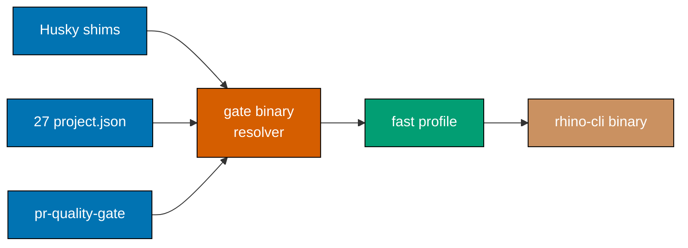

# Technical Documentation — rhino-cli Optimization

## How to read this document

Every lever below carries a **verdict**, and roughly half the verdicts are negative. That is the
point. Three independent `web-researcher` passes produced a ranked list of build, disk, and
type-safety interventions; local measurement then contradicted the general ranking on several of
them, because this workload is a single large crate on aarch64-apple-darwin in 2026 and most
published Rust build advice is written for multi-crate workspaces on Linux. The disqualified levers
are documented at the same depth as the adopted ones so that nobody re-proposes them.

## Axis A — build time

### Cost model

```text
T_edit = (units recompiled) × (optimization work per unit) + (link work) × (number of binaries)
```

### The measured decomposition

| Configuration                                         | Cold   | One-line-edit rebuild | `target/` |
| ----------------------------------------------------- | ------ | --------------------- | --------- |
| `release` as shipped (`lto="thin"`, `cgu=1`, `opt=3`) | 57.1 s | **68.4 s**            | 223 MB    |
| `release` + `cgu=16`, `lto=off`, `debug=0`            | —      | 11.6 s                | 208 MB    |
| `dev` as-is (`debug=2`)                               | 16.8 s | —                     | 615 MB    |
| **`dev` + `debug=0`**                                 | 14.4 s | **1.83 s**            | 360 MB    |
| `cargo check --all-targets`                           | 18.5 s | —                     | 414 MB    |
| `cargo clippy`                                        | 12.3 s | —                     | —         |

Binary size under the `cgu=16`/`lto=off`/`debug=0` release variant is 4,296,064 bytes versus
3.9 MB for the shipped release profile — a ~10% size cost for a 5.9× rebuild win, on a binary that
is never distributed to end users.

The decisive row is `dev` + `debug=0` at **1.83 s**. It beats the 10 s target by 5.5×, which means
Axis A's headline metric is achievable by a profile change and an invocation-site change alone,
with the structural work (test-binary consolidation) as a second-order win rather than a
prerequisite.

### Why release settings reach the inner loop

`rhino-cli` is not built once and run; it is _rebuilt on every gate invocation_ because every call
site is `cargo run --release`, which performs a freshness check and rebuilds if anything changed.
The call sites:

| Surface                                       | Sites | Detail                                                               |
| --------------------------------------------- | ----- | -------------------------------------------------------------------- |
| `project.json` across the monorepo            | 53    | Spread over **27** files — every app that runs a rhino-cli validator |
| `.husky/pre-commit`, `pre-push`, `commit-msg` | 3     | The generated shims over the `repo-config.yml` gate registry         |
| `.github/workflows/pr-quality-gate.yml`       | 5     | CI's own gate invocations                                            |

The design response is a **single indirection**: one resolver, invoked by every site. This is not
merely tidier — it converts "change how the gate binary is built" from a 53-file, two-repo edit into
a one-file edit, and it is the prerequisite that makes the profile choice maintainable rather than a
one-off.

Because this plan is sequenced **after** `sdlc-gate-registry-enforcement`, the Husky and CI surfaces
already route through `repo-config.yml` and `rhino-cli gate run`. Axis A therefore changes only how
the registry's `rhino-cli`-type entries build, and its own indirection work narrows to the 53
`project.json` sites the registry does not cover.

A second-order win is available at the same time: the resolver can invoke the **prebuilt binary
directly** and rebuild only when stale, rather than paying `cargo`'s freshness check on each of the
21 gate invocations per commit-plus-push cycle. The POC measures whether that check is material
before the plan commits to the added complexity.

### Adopted levers

| Lever                                                             | Expected effect                         | Basis                                     |
| ----------------------------------------------------------------- | --------------------------------------- | ----------------------------------------- |
| A dedicated fast profile (`debug = 0`, low `opt-level`) for gates | 68.4 s → **1.83 s** measured            | Local measurement                         |
| Single indirection over all 53 invocation sites                   | Enables the above; permanent leverage   | Structural                                |
| Consolidate 22 `harness = false` binaries into one                | Cited 3× compile / 5× disk on Cargo     | matklad, _Delete Cargo Integration Tests_ |
| Remove the 3 dead dependencies                                    | Smaller graph, fewer units              | Local audit (two-grep confirmation)       |
| `cargo tree -d` duplicate-version sweep                           | Unknown until measured; often material  | Research recommendation, unmeasured here  |
| `cargo build --timings` as the diagnostic of record               | Diagnostic, not a win                   | Official Cargo tooling                    |
| `cargo-nextest` for the test suite                                | Cited 1.39×–3.38× depending on shape    | nextest's own published benchmarks        |
| `[profile.dev] debug = "line-tables-only"` if backtraces suffer   | Middle ground, keeps panic line numbers | Cargo profile reference                   |

`codegen-units = 1 → 16` on the release profile is worth doing on its own merits (a cited ~38%
release-build win, corroborated locally by the 11.6 s row), but it is **not** the lever that meets
M1 and must not be mistaken for it.

### Disqualified levers — Axis A

| Lever                                | Verdict                                                                                                                                                                                                                                                |
| ------------------------------------ | ------------------------------------------------------------------------------------------------------------------------------------------------------------------------------------------------------------------------------------------------------ |
| `mold` linker                        | **No open-source macOS support.** The maintainer describes macOS support as pre-alpha; a commercial fork exists                                                                                                                                        |
| `wild` linker                        | Mach-O backend is pre-production even at 0.10 — "can link some very simple programs", no dylib support                                                                                                                                                 |
| `zld`                                | Dead. Deprecated by its own maintainer once Apple's linker overtook it                                                                                                                                                                                 |
| `rust-lld` / `ld64.lld` on macOS     | The 2022-era advice is **stale**. Apple's rewritten linker has been the default since Xcode 15 and is now competitive with or faster than lld on Apple Silicon                                                                                         |
| `sccache`                            | **Actively conflicts with the goal.** It cannot cache incrementally-compiled crates — using it requires `CARGO_INCREMENTAL=0`, removing Rust's own incremental caching. It also cannot cache anything invoking the linker, including proc-macro crates |
| Splitting into a Cargo workspace     | **Likely negative here.** Compile time grows with the shared-foundational-crate surface, and the measured pain point _is_ `src/lib.rs` — the crate root. A split adds per-crate-boundary overhead without buying isolation for exactly this edit       |
| Cranelift backend                    | Nightly-only in 2026. Genuinely fast (10–60%, often ~40%) and `aarch64-apple-darwin` is supported, but it defaults to `panic = "abort"` and has no SIMD — real behavioural risk for a cucumber-adjacent test suite. Spike-worthy, never a default      |
| `-Zthreads=N` parallel frontend      | Nightly-only in 2026 despite a stated 2024 stabilization intent. Up to ~50% on check-heavy work, but contradicts the repo's stable-toolchain pin                                                                                                       |
| `clap` builder API instead of derive | **Folklore.** clap's own maintainers state derive simply generates builder calls; no benchmark shows a meaningful delta                                                                                                                                |
| Replacing `serde` with `miniserde`   | Impractical — `syn`/`quote`/`serde_derive` arrive transitively regardless, so removing local derive usage does not remove the compile cost                                                                                                             |

## Axis B — disk footprint

### Cost model

```text
D = (toolchains × size) + (target dirs × size) + (debug-info share) + (registry) + (incr. caches)
```

### The measured decomposition

| Component                            | Size    | Share | Owner today                            |
| ------------------------------------ | ------- | ----- | -------------------------------------- |
| `~/.rustup` — 6 toolchains, 1 pinned | 7.2 GB  | 45%   | **Nobody** — rustup has no built-in GC |
| Shared cargo target cache            | 8.2 GB  | 51%   | The ambient build-artifact sweeper     |
| └─ attributable to `ose-primer`      | 7.5 GB  | 47%   | A repo outside this plan's boundary    |
| └─ attributable to `ose-public`      | ~0.3 GB | 2%    | This repo                              |
| `~/.cargo/registry`                  | 0.31 GB | 2%    | Cargo's `cache.auto-clean-frequency`   |

Within a single `target/` directory, debug info is the dominant tunable: the dev profile's 615 MB
drops to 360 MB at `debug = 0`, so **255 MB (41%) is debug info**. The incremental cache is a
further 89 MB.

### Adopted levers

| Lever                                                      | Reclaims       | Risk                                     |
| ---------------------------------------------------------- | -------------- | ---------------------------------------- |
| `rustup toolchain uninstall` on toolchains no sibling pins | ~5 GB          | None — rustup re-fetches on demand       |
| Prune stale per-repo target caches                         | up to ~7 GB    | Recompilation cost only                  |
| `debug = 0` (or `line-tables-only`) on the fast profile    | 255 MB per dir | Reduced debug fidelity in the gate build |
| Extend the build-artifact sweeper to unpinned toolchains   | Keeps it so    | Must never touch a pinned toolchain      |
| `npm run doctor` warns on unpinned toolchains              | Detection      | None                                     |
| `rm -rf ~/.cargo/registry/{cache,src}` and `git/checkouts` | ~200–280 MB    | Re-download on next build                |

macOS `split-debuginfo` already defaults to `"unpacked"`, which is correct — switching to
`"packed"` runs `dsymutil` and keeps the debug info embedded _as well_, paying for two copies. It
is a documented anti-pattern and must not be "fixed" into the profile.

### Disqualified levers — Axis B

| Lever                                     | Verdict                                                                                                                                                                                                                                                                                                                                                      |
| ----------------------------------------- | ------------------------------------------------------------------------------------------------------------------------------------------------------------------------------------------------------------------------------------------------------------------------------------------------------------------------------------------------------------ |
| `cargo-sweep`                             | **Officially unmaintained.** Its own README says so and points users to `cargo-clean-all`                                                                                                                                                                                                                                                                    |
| `cargo-cache`                             | Last release 2022-09-11. Effectively dead                                                                                                                                                                                                                                                                                                                    |
| `cargo clean gc -Zgc`                     | **Nightly-only and unstable in 2026.** Rust 1.78 stabilized last-use _tracking_ only; the PR author's own words: "This does not stabilize automatic or manual gc"                                                                                                                                                                                            |
| Consolidating onto one `CARGO_TARGET_DIR` | **False economy.** Cargo cannot distinguish path dependencies sharing a name/version across workspaces sharing a target dir, risking silent wrong-artefact reuse; one lock serializes all builds; the union of feature/toolchain variants accumulates anyway. Cargo's own 2025H2 "Rework Cargo Build Dir Layout" goal exists to fix this and has not shipped |
| `sccache` as a disk measure               | Additive, not subtractive — it adds a new bounded cache alongside `target/` rather than shrinking it                                                                                                                                                                                                                                                         |
| `-Zno-embed-metadata`                     | Nightly-only. Real (9.5–36.3% depending on config) but unusable on the pinned stable toolchain                                                                                                                                                                                                                                                               |

`cache.auto-clean-frequency` **is** stable and shipped (default `"1 day"`, deleting network
downloads unused for 3 months and local files unused for 1 month). It is real automatic cleanup —
just far too slow to be the answer here.

## Axis C — type safety

### What is already proven

`unsafe_code = "forbid"`, `missing_docs = "deny"`, `clippy::pedantic` at warn, and denies on
`unwrap_used`, `panic`, `missing_errors_doc`, `missing_panics_doc`, `doc_markdown`,
`missing_docs_in_private_items`. The audit confirms these hold: **zero `.unwrap()` in production
paths**, all 1,958 occurrences confined to `#[cfg(test)]` modules.

### What is not proven

| Gap                            | Sites | Consequence when it fires                                         |
| ------------------------------ | ----- | ----------------------------------------------------------------- |
| Unchecked index / slice        | 1,983 | Panic on malformed input; a gate aborts with no exit-code meaning |
| Unchecked arithmetic           | —     | Panics in debug, **silently wraps** in release                    |
| Undischarged `.expect(` claims | 241   | Same as above, with a message                                     |
| Reasonless `#[allow(...)]`     | 189   | A suppression indistinguishable from a considered exception       |
| `as` casts                     | 49    | Silent truncation or lossy conversion                             |
| Type-erased `anyhow` errors    | 243   | Callers cannot branch on failure kind without `downcast_ref`      |
| `&str`/`String` parameters     | 885   | Path-role and format-tag confusion compiles cleanly               |

### The chosen posture, and an honest caveat

The maintainer has chosen the **full sweep**: `indexing_slicing` and `arithmetic_side_effects`
denied crate-wide, not scoped to parser modules.

One caveat must be recorded rather than buried. Clippy's own documentation states, emphatically,
that the `restriction` group "should not be enabled as a whole" — its lints may fire on perfectly
reasonable code and may contradict each other. **The chosen posture does not violate that
guidance**: it enables two named lints crate-wide, not the group. The group stays off, and the
lints research explicitly disqualified for this codebase stay off with it.

### Adopted levers

| Lever                                          | Effort                          | What it proves                                                           |
| ---------------------------------------------- | ------------------------------- | ------------------------------------------------------------------------ |
| `indexing_slicing = "deny"` crate-wide         | **Very large** — 1,983 sites    | No index panic anywhere                                                  |
| `arithmetic_side_effects = "deny"` crate-wide  | Large; allow-lists reduce churn | No overflow panic, no silent wrap                                        |
| `string_slice = "deny"`                        | Small                           | Closes the UTF-8 byte-boundary gap `indexing_slicing` does **not** cover |
| `allow_attributes_without_reason = "deny"`     | Small — 189 reason strings      | Every suppression is on the record                                       |
| `expect_used = "deny"` outside `#[cfg(test)]`  | Medium — 241 sites              | No undischarged impossibility claim                                      |
| `as_conversions = "deny"` with reasoned allows | Small — 49 casts                | No silent truncation                                                     |
| `todo`, `unimplemented` denied                 | Trivial                         | Incomplete work cannot ship                                              |
| `clone_on_ref_ptr` if `Rc`/`Arc` appear        | Trivial                         | Pointer clones are visible as such                                       |
| `cargo-mutants --in-diff` on the parser core   | Medium                          | Catches "covered but never asserted" test defects                        |
| `proptest` strategies for the parsed formats   | Medium                          | Malformed-input behaviour, which types cannot express                    |

### Disqualified levers — Axis C

| Lever                                             | Verdict                                                                                                                                                                                          |
| ------------------------------------------------- | ------------------------------------------------------------------------------------------------------------------------------------------------------------------------------------------------ |
| Enabling the whole clippy `restriction` group     | Contradicted by clippy's own documentation. Deliberately incoherent by design                                                                                                                    |
| `print_stdout` / `print_stderr`                   | Counterproductive — printing **is** this CLI's product                                                                                                                                           |
| `shadow_unrelated`                                | Famously noisy; flags idiomatic `let x = x.parse()?` rebinding                                                                                                                                   |
| `panic_in_result_fn`, `unwrap_in_result`          | Redundant given `panic` and `unwrap_used` are already denied                                                                                                                                     |
| `float_arithmetic`, `mem_forget`, `str_to_string` | Irrelevant to a file-walking report generator                                                                                                                                                    |
| Kani, Creusot, Prusti, Verus, Flux                | All target algorithmic / unsafe / numeric correctness. None reasons usefully about filesystem walking, subprocess invocation, or third-party parsers. Not practical at 59k LOC of I/O-heavy code |
| Miri                                              | Largely neutralized — its core value is catching UB in `unsafe`, and `unsafe_code = "forbid"` is already set                                                                                     |
| Replacing `anyhow` with typed errors wholesale    | `anyhow` for binaries is the 2026 consensus. No tooling exists to identify which sites should be typed; it is a manual audit, not a sweep                                                        |
| A crate-wide newtype sweep                        | Primitive obsession is real, but no lint detects it and a systemic sweep is not justified. Target 3–5 genuinely error-prone types instead                                                        |
| `cargo-semver-checks`                             | Applies to published library APIs. `rhino-cli` is a binary with no external consumers                                                                                                            |
| `#[non_exhaustive]` for internal exhaustiveness   | Backwards — it _forces_ wildcard arms downstream. Internal exhaustiveness is already a hard compile error                                                                                        |

Note that within-crate `match` exhaustiveness needs no tooling: adding an enum variant and missing
an arm is already error `E0004`. The real residual risk is a `_ =>` wildcard someone added to
silence the compiler, and no lint reliably detects that — it is a review discipline.

## Architecture of the change

The invocation surface today is many-to-one with the profile decision duplicated at every edge.
After Axis A it is many-to-one-to-one, with the profile decided in exactly one place.



Nothing about the crate's internal hexagonal structure — `domain/` → `application/` →
`infrastructure/` + `commands/` — changes. Axis C edits statements inside existing functions; it
does not move a module boundary.

## File-impact analysis

```text
apps/rhino-cli/
  Cargo.toml              A: fast profile, cgu=16, 3 dead deps removed
                          C: lint block — indexing_slicing, arithmetic_side_effects,
                             string_slice, allow_attributes_without_reason, expect_used,
                             as_conversions, todo, unimplemented
  project.json            A: 8 validator targets repointed at the resolver
  src/**/*.rs             C: 195 files, staged module by module
  tests/*.rs              A: 28 files consolidated behind one binary
  parity-manifest.sha256  regenerated once, at the end of each delivery unit

apps/*/project.json       A: 45 further invocation sites across 26 other files
repo-config.yml           A: gate registry is the authority for the three generated shims
.github/workflows/pr-quality-gate.yml
                          A: 5 invocation sites
nx.json / .nxignore       A: wherever the ose-public-only affected-detection divergence lives

repo-governance/development/infra/build-artifact-sweeper.md
                          B: sweeper remit extended to unpinned rustup toolchains
scripts/ or the doctor surface
                          B: unpinned-toolchain warning

plans/backlog/beaver-nest-repo-consolidation/delivery.md
                          A: downstream steps citing removed paths and command forms

specs/apps/rhino/behavior/rhino-cli/gherkin/**
                          unchanged, except the new malformed-input scenario in Phase 11
```

The `specs/` line is load-bearing: because no observable behaviour changes, Axes A and B and the
lint work in Axis C are a **pure refactor** under the Specs & Gherkin Completeness rule and carry no
new Gherkin obligation for the CLI's own contract. Phase 11 is the exception — it asserts a
behaviour (clean error instead of panic) that is genuinely new, and does carry one.

## Rollback

| Axis | Rollback                                                                                                       | Reversibility |
| ---- | -------------------------------------------------------------------------------------------------------------- | ------------- |
| A    | Revert the profile stanza and the resolver commit; the 53 sites return to `cargo run --release`                | Trivial       |
| B    | Reinstall a toolchain with `rustup toolchain install`; rebuild any pruned cache                                | Trivial, slow |
| C    | Revert the `Cargo.toml` lint stanza — the source-level `.get()` rewrites are harmless if the lint is off again | Per module    |
| D    | Not entered unless A–C measurably fail; the spike itself is throwaway                                          | n/a           |

Axis C is the only one where rollback is not free: reverting the lint leaves 1,983 rewritten call
sites in place. Those rewrites are behaviour-preserving by construction and shadow-diff-verified,
so the cost of leaving them is zero — but the _diff_ is not cheaply undone. This is precisely why
the axis is staged module by module rather than landed as one sweep.

## Appendix — language comparison (Axis D decision record)

This section is retained, not acted on. It absorbs the `rhino-cli-language-rewrite-tradeoffs` idea
two-pager so that the question does not need re-researching if Axis D is ever entered.

### Startup cost, and why it dominates

`rhino-cli` starts **21 times** per commit-plus-push cycle. Measured startup is 4.4 ms, so the
process-startup budget is ~92 ms. The same 21 invocations against a measured .NET startup of
164 ms would be ~3.4 s of pure startup. This is the single decisive figure against a non-AOT F#
target, and it is independent of compile time entirely.

### Four-way summary

| Dimension                 | Rust (today)            | Go                       | OCaml                        | F# (.NET)                                     |
| ------------------------- | ----------------------- | ------------------------ | ---------------------------- | --------------------------------------------- |
| Startup per invocation    | 4.4 ms measured         | comparable               | comparable                   | 164 ms measured, non-AOT                      |
| Compile speed             | slow at current profile | fast                     | fast (uncited at this scale) | slower than C#                                |
| Sum-type / exhaustiveness | yes                     | **no**                   | yes                          | yes                                           |
| Null safety               | yes                     | no                       | yes                          | yes                                           |
| Clippy-class linter       | yes                     | yes                      | **no**                       | analyzers, partial                            |
| `cargo-deny` equivalent   | yes                     | yes                      | **no**                       | partial                                       |
| Coverage with lcov + gate | yes                     | yes                      | **unmaintained**             | yes                                           |
| Production lockfile       | yes                     | yes                      | **no**                       | yes                                           |
| Maintained Gherkin runner | cucumber-rs, active     | godog, active            | **archived 2026-02-16**      | Reqnroll, but F# steps need a C# host project |
| In-repo familiarity       | this crate              | prior rhino-cli language | none                         | two production backends                       |

### The OCaml-specific blockers

Five gaps, each of which this repository's governance already requires of every other language it
ships: no clippy-class linter, no `cargo-deny` equivalent, a coverage tool that cannot emit lcov or
enforce a threshold, no production lockfile, and — most decisively — `cucumber.ml` was **archived
by its owner on 2026-02-16** and no maintained alternative exists. Closing the last of these means
building a Gherkin parser and harness from scratch.

That is tractable: the `rhino` spec corpus uses no scenario outlines, no data tables, and no doc
strings, and the whole `specs/` tree needs outlines and data tables but never doc strings. The
grammar subset is small. It is still a library this repository would then own and maintain
forever, in exchange for a compile-time win that Axis A has now shown was never the language's
fault.

### What Axis D would actually have to answer

Four figures have **no** authoritative public source, and three independent research passes each
flagged them: OCaml cold-build time at ~40k LOC, a 2026 opam switch's disk size, a stripped OCaml
CLI binary size for a real tool, and F# compile time at 59k LOC (the in-repo F# measurement is
3,730 LOC — 15.7× smaller, and not linearly extrapolable). No amount of further research resolves
these; only a bounded spike does. That is the shape Axis D takes if it is entered at all.

### One more reason Axis D is unlikely to be right

The plan immediately downstream of this one, `beaver-nest-repo-consolidation`, folds a fourth
repository into `ose-public` and **discards that repo's already-diverged `rhino-cli` fork**.
Rewriting the CLI in another language immediately before absorbing a fork of it would maximize
churn on exactly the surface the consolidation is trying to simplify. The sequencing is itself an
argument for the optimization path.

## References

- Cargo Book — [Profiles](https://doc.rust-lang.org/cargo/reference/profiles.html),
  [Reporting build timings](https://doc.rust-lang.org/cargo/reference/timings.html),
  [Config reference](https://doc.rust-lang.org/cargo/reference/config.html),
  [Unstable features](https://doc.rust-lang.org/cargo/reference/unstable.html)
- [Clippy lint index](https://doc.rust-lang.org/clippy/lints.html) and
  [lint configuration](https://doc.rust-lang.org/clippy/lint_configuration.html)
- matklad — [Delete Cargo Integration Tests](https://matklad.github.io/2021/02/27/delete-cargo-integration-tests.html)
- Kobzol — [Reducing Cargo target directory size](https://kobzol.github.io/rust/rustc/2025/06/02/reduce-cargo-target-dir-size-with-z-no-embed-metadata.html)
- [cargo-nextest benchmarks](https://nexte.st/docs/benchmarks/)
- [cargo-sweep](https://github.com/holmgr/cargo-sweep) (unmaintained) →
  [cargo-clean-all](https://github.com/dnlmlr/cargo-clean-all)
- [rustup issue #4548 — toolchain GC](https://github.com/rust-lang/rustup/issues/4548) (open)
- [cargo#12516 — shared target dir path-dependency collision](https://github.com/rust-lang/cargo/issues/12516)
- [Rework Cargo Build Dir Layout — Rust Project Goals 2025H2](https://rust-lang.github.io/rust-project-goals/2025h2/cargo-build-dir-layout.html)
- [rustc_codegen_cranelift](https://github.com/rust-lang/rustc_codegen_cranelift)
- [Faster compilation with the parallel front-end](https://blog.rust-lang.org/2023/11/09/parallel-rustc/)
- [sccache — Rust caveats](https://github.com/mozilla/sccache/blob/main/docs/Rust.md)
- [mold issue #1171 — macOS support](https://github.com/rui314/mold/issues/1171)
- [cargo-mutants performance guide](https://mutants.rs/performance.html)
- [cucumber/cucumber.ml](https://github.com/cucumber/cucumber.ml) — archived 2026-02-16
