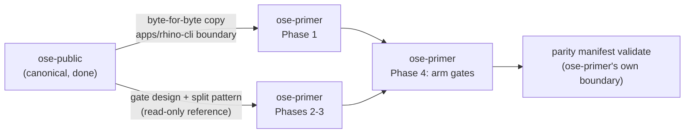

# Technical Documentation: Sync `ose-primer` Governance Parity

## Architecture

This plan performs a one-way sync: `ose-public` is canonical, `ose-primer` is the target. No new
mechanism is designed — every gate, threshold, and split pattern below is **copied**, not
reimplemented, from the already-shipped `optimize-governance-md`
(`/Users/wkf/ose-projects/ose-public/worktrees/optimize-governance-md/`).



## Design Decisions

| Decision                                         | Choice                                                                                                                                                                                                        | Why                                                                                                                                                                             |
| ------------------------------------------------ | ------------------------------------------------------------------------------------------------------------------------------------------------------------------------------------------------------------- | ------------------------------------------------------------------------------------------------------------------------------------------------------------------------------- |
| rhino-cli sync mechanism                         | Direct file copy from `ose-public`'s worktree checkout (`src/`, `tests/`, `Cargo.toml`, `Cargo.lock`, `project.json`, `LICENSE`, Gherkin tree), not a re-derivation                                           | Zero risk of subtle Rust-logic drift; exactly how `ose-private`'s Phase 10 did it                                                                                               |
| `instruction-size` gate                          | Removed entirely (`repo-config.yml` top-level `instruction-size:` block, lines 200–243, and the `instruction-size` gate id) — **replaced**, not supplemented, by `governance-word-budget`                     | `ose-public`'s `repo-config.yml` has zero remaining `instruction-size` references post-`optimize-governance-md`; two overlapping size gates on the same files is worse than one |
| `md-readme-index` → `governance-readme-index`    | Rename in place, `scope: all-file-type` unchanged, no enforcement gap                                                                                                                                         | It already detects `orphan`/`ghost` links today, armed unconditionally; renaming in place preserves that coverage instead of a from-scratch rebuild                             |
| `md-frontmatter` `ci`-surface handling           | Dropped from `repo-config.yml` in Phase 1 (proactive), re-added in Phase 4                                                                                                                                    | `ose-private` PR10 discovered this exact gap live; applying the known fix up front avoids a repeat CI break — see §2 below                                                      |
| Word-budget `args.exclude` list for `ose-primer` | `plans/`, `docs/`, `specs/`, `.opencode/skills/`, `.opencode/commands/` — **omitting** `.fvm/`/`.fvm-cache/` (absent in `ose-primer`'s checkout, verified 2026-08-15)                                         | `[Judgment call]` — excluding a nonexistent path is a harmless no-op either way; omitted here rather than carried forward blindly from `ose-public`                             |
| `governance-word-budget` trigger list            | 9 entries: `repo-governance/`, `.claude/`, `.cursor/`, `.codex/`, `.opencode/`, `.amazonq/`, `AGENTS.md`, `CLAUDE.md`, `repo-config.yml` — `ose-public`'s 10-entry list minus `.pi/` (absent in `ose-primer`) | `ose-primer` has no `.pi/` directory (verified 2026-08-15); a trigger for a path that never exists is dead configuration                                                        |
| `governance-readme-completeness` scope           | `args.paths`: `repo-governance/`, `.claude/`, `.codex/` (3 entries — `ose-public`'s narrowed list minus `.pi/`); trigger: those 3 plus `repo-config.yml`                                                      | Mirrors `ose-public`'s final Phase 9 narrowing (word/readme-budget gates optimize agent context, not human-facing docs — `docs/`/`specs/` excluded)                             |
| Content-split pattern                            | Index parent (`X.md`) + sibling directory of capped children (`X/NN-slug.md`), README-index authority stays with the parent                                                                                   | Identical to `optimize-governance-md`'s proven pattern — preserves every existing inbound link to `X.md`                                                                        |

## Implementation Approach

### 1. rhino-cli boundary sync (Phase 1)

Copy, file-for-file, from `ose-public`'s current checkout into the `ose-primer` worktree:

- `apps/rhino-cli/src/` (all `.rs` files, including the renamed/new modules:
  `src/application/governance/word_budget.rs`, `src/application/governance/readme_index.rs`,
  `src/commands/governance_validate_word_budget.rs`,
  `src/commands/governance_validate_readme_index.rs`,
  `src/commands/governance_generate_readme_index.rs`)
- `apps/rhino-cli/tests/`
- `apps/rhino-cli/Cargo.toml`, `apps/rhino-cli/Cargo.lock`, `apps/rhino-cli/project.json`,
  `apps/rhino-cli/LICENSE`
- `specs/apps/rhino/behavior/rhino-cli/gherkin/**` (the Gherkin behavior tree)

After the copy, `apps/rhino-cli/src/application/repo_governance/instruction_size.rs`,
`readme_index_audit.rs`, and the corresponding old `src/commands/*.rs` files no longer exist in
`ose-primer` either (they were replaced, not kept alongside, in `ose-public`'s own history) — this
is a full-tree replacement copy, not an additive merge. Regenerate
`apps/rhino-cli/parity-manifest.sha256` with `rhino-cli parity manifest generate` afterward; do not
hand-edit it.

### 2. The `md-frontmatter` mitigation (Phase 1, applied proactively)

`ose-primer`'s `repo-config.yml` already registers, pre-existing and unrelated to this plan:

```yaml
- id: md-frontmatter
  type: check
  command: md frontmatter validate
  kind: rhino-cli
  ci-group: markdown
  surfaces:
    pre-commit: { scope: affected-file-type, glob: "*.md" }
    ci: { scope: all-file-type }
```

The copied `frontmatter.rs::validate_governance_schema` (part of the byte-for-byte copy above)
hardcodes FAIL severity for `missing-description` and `missing-when-to-use` on governance docs —
there is no WARN/FAIL toggle in the Rust source, only in whether `repo-config.yml` registers a
`ci` surface at all. Because `ose-primer`'s `repo-governance/` is not yet split or frontmatter-
complete (0/186 files carry `when_to_use`), landing the copy as-is would turn a full-tree FAIL scan
on immediately — exactly the CI break `ose-private`'s PR10 hit live. **Phase 1's repo-config.yml
edit drops the `ci` surface, keeping only `pre-commit`**, until Phase 4 re-adds it once Phases 2–3
have made the content compliant.

### 3. Content split (Phases 2–3)

Same four operations `optimize-governance-md` applied per subtree, applied here per tree rather
than per sub-subtree (see `README.md` §Decisions for the phase-granularity judgment call):

1. **Split** — every file over 500 words becomes an index parent (`X.md`, keeps its original
   filename and inbound links) plus a sibling directory of capped children
   (`X/01-slug.md`, `X/02-slug.md`, …). Acceptance: direct (unarmed)
   `rhino-cli governance word-budget validate <tree>` reports 0 failures.
2. **Frontmatter** — every file (parent, child, and every previously-compliant file) gains
   `when_to_use`; the 22 files in `repo-governance/` missing `description` are backfilled at the
   same time. Acceptance: `rhino-cli md frontmatter validate <tree>` exits 0 (against the
   `pre-commit` surface only, per §2's dark-launch — the `ci` surface is not re-registered until
   Phase 4).
3. **Index** — every directory's `README.md` links every sibling `.md` file and every immediate
   subdirectory's `README.md`, each entry annotated with a one-line summary derived from the
   target's frontmatter `description`. Acceptance: direct (unarmed)
   `rhino-cli governance readme-index validate <tree>` reports 0 `orphan`/`ghost`/`missing`/
   `unannotated` findings.
4. **Verify** — `rhino-cli md links validate && rhino-cli md heading-hierarchy validate && npm run
lint:md` all exit 0.

`AGENTS.md`/`CLAUDE.md` (Phase 2) are rewritten as directive indexes preserving `ose-primer`'s own
directives — not copied verbatim from `ose-public`'s post-split shape, since the two files are
platform-binding shims with repo-specific content (see `ose-primer/CLAUDE.md`'s own "Platform
Binding Examples" section). The resolved tree (`CLAUDE.md` + every `@`-import) must stay
≤1,500 words, ported from the byte budget to words exactly as `optimize-governance-md` did.

`.claude/agents/` and `.claude/skills/` (Phase 3): oversized agent bodies migrate to
`.claude/skills/<name>/reference/*.md`, since agent `.md` bodies load verbatim (not
`@`-import-resolved). After source is compliant, `npm run generate:bindings` regenerates
`.cursor/`, `.opencode/agents/`, and `.amazonq/`; `npm run validate:sync` confirms no hand-edited
mirror drift. A generated mirror that still violates the budget after regeneration is never
hand-edited — the fix belongs in `.claude/` source or the binding generator itself (same rule
`optimize-governance-md`'s `README.md` states).

### 4. Arming the gates (Phase 4)

Register, in `ose-primer`'s `repo-config.yml`:

```yaml
- id: governance-word-budget
  type: check
  command: governance word-budget validate
  kind: rhino-cli
  ci-group: governance
  args:
    exclude:
      - plans/
      - docs/
      - specs/
      - .opencode/skills/
      - .opencode/commands/
  surfaces:
    pre-push: &word-budget-triggers
      scope: path-gated
      trigger:
        - repo-governance/
        - .claude/
        - .cursor/
        - .codex/
        - .opencode/
        - .amazonq/
        - AGENTS.md
        - CLAUDE.md
        - repo-config.yml
    ci: *word-budget-triggers

- id: governance-readme-completeness
  type: check
  command: governance readme-index validate
  kind: rhino-cli
  ci-group: governance
  args:
    paths:
      - repo-governance/
      - .claude/
      - .codex/
    fail-kinds:
      - missing
      - unannotated
  surfaces:
    pre-push: &readme-completeness-triggers
      scope: path-gated
      trigger:
        - repo-governance/
        - .claude/
        - .codex/
        - repo-config.yml
    ci: *readme-completeness-triggers
```

Re-add `md-frontmatter`'s dropped `ci: { scope: all-file-type }` surface at the same time. No Rust
source edit is needed here — the FAIL-severity logic already landed with Phase 1's byte-for-byte
copy; Phase 4 only changes `repo-config.yml` registration, exactly matching the note in
`optimize-governance-md`'s Phase 10 "Discovered gap": _"Phase 16b's actual remaining action is
only to re-add `ci: { scope: all-file-type }`."_

`.opencode/skills/` and `.opencode/commands/` are excluded wholesale from `governance-word-budget`
in `ose-primer`, same as `ose-public` — both trees are Nx-vendored (`.opencode/skills/{monitor-ci,
nx-generate, nx-import, nx-plugins, nx-run-tasks, nx-workspace, link-workspace-packages}/` plus
`.opencode/commands/monitor-ci.md`, 15 files total, verified 2026-08-15) with no `.claude/` source
of truth this repo's binding generator produces. `.opencode/agents/` (the actual generated mirror
of `.claude/agents/`) stays fully covered — only `skills/` and `commands/` are excluded.

## Dependencies

No new external dependencies. Reuses `apps/rhino-cli`'s existing Rust toolchain, the existing
`npm run generate:bindings` / `npm run validate:sync` scripts, and the existing
`gate run --surface=pre-push` / CI pipeline — all already present in `ose-primer` prior to this
plan.

## Testing Strategy

| Acceptance criterion (`prd.md`)                             | Test level                                                                                                                                                                        |
| ----------------------------------------------------------- | --------------------------------------------------------------------------------------------------------------------------------------------------------------------------------- |
| FR-1 boundary byte-identity + new commands exist            | Integration — `diff -rq` across boundary paths; `rhino-cli <cmd> --help` invocation; `nx run rhino-cli:test:quick` + `specs:behavior:coverage`                                    |
| FR-2 dark-launch registration + `md-frontmatter` mitigation | Integration — real-repo `gate run --surface=pre-push` invocation against the live, unsplit tree                                                                                   |
| FR-3 split/frontmatter/index compliance                     | Integration — direct (unarmed) `governance word-budget validate` / `governance readme-index validate` invocations, scoped per tree                                                |
| FR-4 agent/skill migration + mirror regeneration            | Integration (`generate:bindings` + `validate:sync`) plus a behavioral check: real invocation of ≥5 migrated agents (mirrors `optimize-governance-md` Phase 6/14's five-agent bar) |
| FR-5 armed-gate enforcement                                 | Integration — fixture-file RED/GREEN cycle against the real `pre-push` surface, matching `optimize-governance-md`'s Phase 9/16 pattern                                            |

This plan copies rhino-cli's own already-existing unit and Gherkin test suite (`test:quick`,
`specs:behavior:coverage`) verbatim as part of the FR-1 boundary sync — it does not author new
rhino-cli unit tests, since the logic under test is not new, only newly present in this repo.

### Specs & Gherkin Delivery — exemption

Per the [Feature Change Completeness Convention §Two Paths](../../../repo-governance/development/quality/feature-change-completeness.md),
this plan is **exempt** from authoring new `specs/**` Gherkin scenarios: FR-1's byte-for-byte copy
brings the already-specified, already-covered `governance word-budget validate` /
`governance readme-index validate` behavior — including its Gherkin tree under
`specs/apps/rhino/behavior/rhino-cli/gherkin/**` — into `ose-primer` unchanged. No new observable
behavior is introduced; `nx run rhino-cli:specs:behavior:coverage` re-verifies the copied Gherkin
stays in sync as part of Phase 1's acceptance criteria.

## Vercel MCP Availability

Out of scope: `git ls-files | grep 'vercel\.json$'` against `ose-primer` and no `prod-*`/`stag-*`
deploy branch or deployment agent is among this plan's targets — `ose-primer` is a starter
template, not a deployed surface. No Vercel-observation steps are authored.

## UI-Design-Funnel / Learning-Bearing Syllabus — exemptions

Not UI-bearing (no `apps/`/`libs/` screens or components touched) and not learning-bearing (no
course/curriculum content authored or restructured) — both funnels are explicitly out of scope.

## File-Impact Analysis

The tree below is rooted at the **`ose-primer`** checkout root (`/Users/wkf/ose-projects/ose-primer`
today; the plan's own worktree at `worktrees/sync-primer-governance-parity/` once provisioned) —
every delivery action in this plan lands in `ose-primer`, never in this `ose-public` plan-docs
folder itself.

```text
.
├── apps/rhino-cli/
│   ├── src/**/*.rs [E] — byte-for-byte replaced from ose-public (Phase 1); includes new modules
│   │   word_budget.rs, readme_index.rs and removal of instruction_size.rs, readme_index_audit.rs
│   ├── tests/**/*.rs [E] — byte-for-byte replaced from ose-public (Phase 1)
│   ├── Cargo.toml, Cargo.lock, project.json, LICENSE [E] — byte-for-byte replaced (Phase 1)
│   └── parity-manifest.sha256 [G] — regenerated via `rhino-cli parity manifest generate` (Phase 1)
├── specs/apps/rhino/behavior/rhino-cli/gherkin/** [E] — byte-for-byte replaced from ose-public (Phase 1)
├── repo-governance/
│   ├── **/*.md over 500 words [E] — split into index parent + capped children (Phase 2); exact
│   │   member list discovered live via a fresh `wc -w` sweep at Phase 2 execution time, not
│   │   hardcoded from this plan's 2026-08-15 census (158 files as authored)
│   ├── <split-dirs>/NN-slug.md [N] — new child files, one directory per split parent (Phase 2)
│   └── **/README.md [E] — annotated index entries added/updated for every covered directory (Phase 2)
├── .claude/
│   ├── agents/*.md over 500 words [E] — charter trimmed to ≤500 words (Phase 3); 58 files as
│   │   authored, discovered live at execution time
│   ├── skills/<name>/reference/*.md [N] — migrated agent-body content (Phase 3)
│   └── skills/*/SKILL.md over 500 words [E] — split per the same pattern (Phase 3); 32 files as
│       authored
├── .cursor/**/*.md [G] — regenerated via `npm run generate:bindings` (Phase 3)
├── .opencode/agents/**/*.md [G] — regenerated via `npm run generate:bindings` (Phase 3);
│   .opencode/skills/ and .opencode/commands/ are Nx-vendored, untouched by this plan
├── .amazonq/**/*.md [G] — regenerated via `npm run generate:bindings` (Phase 3)
├── AGENTS.md [E] — rewritten as a directive index, ≤500 words (Phase 2)
├── CLAUDE.md [E] — rewritten as a directive index, ≤500 words (Phase 2)
├── repo-config.yml [E] — remove `instruction-size:` block + gate id; rename `md-readme-index` →
│   `governance-readme-index` in place; register `governance-word-budget` +
│   `governance-readme-completeness` dark-launched (Phase 1), then armed (Phase 4); drop then
│   re-add `md-frontmatter`'s `ci` surface (Phases 1 and 4)
└── repo-governance/conventions/structure/instruction-file-size-budget.md [D] — replaced by
    governance-word-budget.md [N], content ported from ose-public's already-authored convention doc,
    adjusted for ose-primer's own trigger lists (Phase 1); every inbound link discovered live via
    `grep -rl "instruction-size\|instruction-file-size-budget" repo-governance .claude docs
    AGENTS.md` in the ose-primer checkout and rewritten
```

### More Detail

The `repo-governance/**/*.md` and `.claude/**/*.md` split-member lists above are deliberately not
enumerated file-by-file: this plan's own 2026-08-15 census (158 + 58 + 32 files) will have drifted
by the time Phases 2–3 execute, since both `ose-public` and `ose-primer` continue landing commits.
Each phase's own first step re-derives its live member list with a fresh `wc -w` sweep rather than
trusting this document's numbers past Phase 0.
