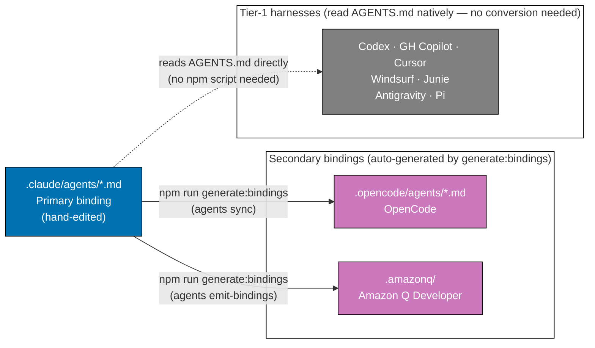
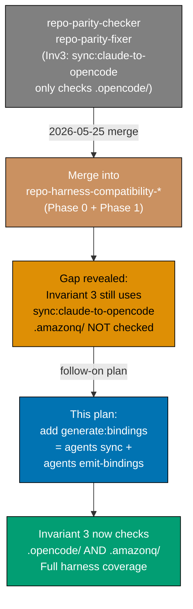
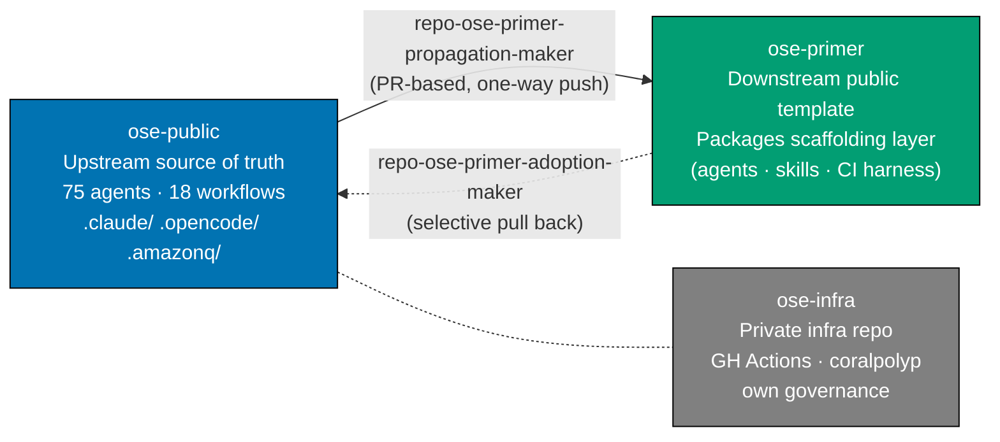

# Blueprint: Harness/Vendor Neutrality for the ose-\* Ecosystem

**Status**: In Progress
**Project**: `apps/rhino-cli`, `package.json`, `repo-governance/`, ose-ecosystem

## Purpose

This plan is a **blueprint** — a framework defining what harness/vendor neutrality means in this
repository, where it applies, how it is enforced, and how it propagates across the ose-\*
ecosystem. It is not just a script rename; the npm script rename is the **first concrete
deliverable** under the blueprint.

Future deliverables (new harnesses, new shared artifacts, new governance gaps) are governed by
this same blueprint without requiring a new plan — teams add deliverables under the blueprint's
framework.

---

## What is a Coding-Agent Harness?

A **coding-agent harness** is a tool that an AI coding agent uses to load repository-specific
instructions and configuration. Each harness reads a different set of binding files:

| Harness                | Binding format                        | Location                                 | Tier          |
| ---------------------- | ------------------------------------- | ---------------------------------------- | ------------- |
| Claude Code            | YAML frontmatter agent definitions    | `.claude/agents/*.md` (primary source)   | Primary       |
| OpenCode               | Converted agent definitions           | `.opencode/agents/*.md` (auto-generated) | Secondary     |
| Amazon Q Developer     | Bridge config + rules pointer         | `.amazonq/` (auto-generated)             | Secondary     |
| OpenAI Codex CLI       | Reads `AGENTS.md` natively            | repo root (`.codex/config.toml` present) | Tier-1 native |
| GitHub Copilot         | Reads `AGENTS.md` natively            | repo root                                | Tier-1 native |
| Cursor                 | Reads `AGENTS.md` natively            | repo root                                | Tier-1 native |
| Windsurf               | Reads `AGENTS.md` natively            | repo root                                | Tier-1 native |
| JetBrains Junie        | Reads `AGENTS.md` natively            | repo root                                | Tier-1 native |
| Google Antigravity CLI | Reads `AGENTS.md` natively (see note) | repo root                                | Tier-1 native |
| Pi                     | Reads `AGENTS.md` natively (see note) | repo root                                | Tier-1 native |

[Repo-grounded: `AGENTS.md` Platform Binding Examples section]

**Confidence notes**:

- **OpenAI Codex CLI**: `AGENTS.md` support confirmed. [Web-cited:
  OpenAI Codex CLI docs (<https://developers.openai.com/codex/guides/agents-md>, accessed
  2026-05-25) — "Starting at the project root... Codex walks down to your current working
  directory. In each directory along the path, it checks for `AGENTS.override.md`, then
  `AGENTS.md`"; also listed on [agents.md standard site](https://agents.md/) (accessed
  2026-05-25) — "Codex from OpenAI"]
- **Google Antigravity CLI**: real product (Antigravity 2.0, Google I/O 2026); reads a file
  named `AGENTS.md`; NOT currently listed on agents.md standard site.
  [Unverified — partially confirmed but not web-cited per agents.md standard]
- **Pi**: real product; reads `AGENTS.md`; NOT currently listed on agents.md standard site.
  [Unverified — partially confirmed but not web-cited per agents.md standard]

**Tier model**:

- **Primary** (`.claude/`): hand-edited source of truth for agent definitions
- **Secondary** (`.opencode/`, `.amazonq/`): auto-generated from primary by `rhino-cli`; require
  `npm run generate:bindings` after each primary edit
- **Tier-1 native**: read `AGENTS.md` directly from repo root; `generate:bindings` does NOT
  need to run for them — they always see the current primary instruction surface



---

## What is Harness/Vendor Neutrality?

**Harness neutrality** means that shared, load-bearing artifacts — npm script names, shared
config keys, instruction prose in `repo-governance/`, `AGENTS.md` — must not encode any single
harness's vendor name.

**Why it matters**: Shared artifacts serve all harnesses equally. If an npm script is named after
one harness, contributors using other harnesses are misled into thinking the script doesn't apply
to them. Automated checks miss other harnesses' coverage.

**The rule**: Name the **operation**, not the **vendor**. Use `generate:bindings`, not
`sync:claude-to-opencode`. Use "secondary binding generation", not "sync to OpenCode".

This is enforced by:

- [Governance Vendor-Independence Convention](../../../repo-governance/conventions/structure/governance-vendor-independence.md)
  [Repo-grounded]
- [Multi-Harness Binding Convention](../../../repo-governance/conventions/structure/multi-harness-binding.md)
  [Repo-grounded]
- `rhino-cli repo-governance vendor-audit` — scans governance prose for vendor names outside
  exempt sections [Repo-grounded]

---

## Vendor-Neutral Zones vs. Vendor-Specific Zones

The repo is partitioned into two zones:

### Vendor-Neutral Zone (must not name specific harnesses)

| Artifact                 | Why neutral                                                    |
| ------------------------ | -------------------------------------------------------------- |
| `package.json` scripts   | Serves all harnesses; contributors of any harness run them     |
| `repo-governance/` prose | Governance applies to all harnesses equally                    |
| `AGENTS.md`              | Primary instruction surface for all native harnesses           |
| Shared npm script names  | Must describe the operation, not the target harness            |
| Nx target names          | Project-level operations, not harness-specific                 |
| CI workflow steps        | Run identically regardless of which harness a contributor uses |

### Vendor-Specific Zone (may name harnesses — intentional)

| Artifact                                        | Why vendor-specific is correct                          |
| ----------------------------------------------- | ------------------------------------------------------- |
| `.claude/agents/*.md`                           | Claude Code platform binding; format is Claude-specific |
| `.opencode/agents/*.md`                         | OpenCode platform binding; format is OpenCode-specific  |
| `.amazonq/`                                     | Amazon Q bridge files; format is Amazon-Q-specific      |
| `CLAUDE.md` (Platform Binding Examples section) | Intentionally vendor-specific per convention            |
| `AGENTS.md` (Platform Binding Examples section) | Exempt section — vendor names allowed here              |
| `docs/reference/platform-bindings.md`           | Catalogs concrete bindings — names are accurate there   |

[Repo-grounded: `repo-governance/conventions/structure/governance-vendor-independence.md`]

---

## Blueprint Principles and Rules

### Rule 1: npm scripts must be vendor-neutral

Every npm script in `package.json` that generates, validates, or operates on artifacts shared
across harnesses must name the **operation**, not the harness:

```
# WRONG — encodes two vendor names
"sync:claude-to-opencode": "..."

# CORRECT — names the operation
"generate:bindings": "..."
```

[Judgment call: ecosystem convention uses plain `generate` (Prisma, GraphQL Code Generator,
OpenAPI Generator) but the colon-namespace `generate:bindings` adds useful clarity for a
monorepo with multiple generate targets. Not yet an ecosystem standard — design decision.]

### Rule 2: Governance prose must pass vendor-audit

All files under `repo-governance/` must pass `rhino-cli repo-governance vendor-audit`. Vendor
product names (Claude Code, OpenCode, Amazon Q, etc.) are only permitted in:

- The `Platform Binding Examples` section (and until the next same-level heading)
- `docs/reference/platform-bindings.md` (catalog file)
- Plan files under `plans/` (exempt from vendor-audit scan)

### Rule 3: Shared config keys must be harness-neutral

Any key in a shared config file (e.g., `nx.json`, `package.json`) that controls a cross-harness
operation must use harness-neutral naming.

### Rule 4: One convention, no variants

When a harness-neutral name is adopted (e.g., `generate:bindings`), all repos in the
ose-\* ecosystem that need the same operation adopt the same name. No `sync:bindings` in
ose-primer, no `emit:all` in ose-infra. One convention, propagated, no forks.

### Rule 5: Primary binding may be vendor-specific

The primary binding (`.claude/`) is intentionally Claude Code-specific. It is the source of
truth and its format is Claude Code's agent definition format. This is correct — vendor-specific
zones exist for a reason. The rule only applies to the **shared zone**.

---

## Current Problems This Blueprint Resolves (Phase 1)

### Problem 1: Silent correctness gap

`npm run sync:claude-to-opencode` only runs `agents sync` (OpenCode). It never runs
`agents emit-bindings` (Amazon Q). Every agent instruction that says "run
`sync:claude-to-opencode` after editing agents" silently leaves Amazon Q bindings stale.

The Phase 0 Invariant 3 check in `repo-harness-compatibility-checker` uses:

```bash
npm run sync:claude-to-opencode && git diff --quiet .opencode/
```

It passes even when `.amazonq/` is out of date — a correctness hole in the parity gate.
[Repo-grounded: `repo-governance/workflows/repo/repo-harness-compatibility-quality-gate.md`
line ~150]

### Problem 2: Vendor-locked naming

`sync:claude-to-opencode` encodes two vendor names (Claude, OpenCode) in a script that lives
in the shared `package.json`. The repo's governance explicitly requires vendor neutrality in
shared artifacts. [Repo-grounded: `repo-governance/conventions/structure/multi-harness-binding.md`]

### Problem 3: Ecosystem name mismatch

The `generate:` namespace is used in comparable projects (Prisma uses `generate`, GraphQL Code
Generator uses `codegen`, OpenAPI Generator uses `generate`) for artifact generation pipelines.
The word `sync` describes a push/pull operation with a remote — not artifact generation. The
word `emit` is compiler-internal (rustc, tsc) — not idiomatic for user-facing npm scripts.
[Judgment call: `generate:bindings` is not yet a standard — it is our design decision, not
a web-confirmed idiom.]

---

## First Concrete Deliverable: `generate:bindings`

**Replace `sync:claude-to-opencode` with `generate:bindings`** across the entire repo:

```json
"generate:bindings": "cargo run --release --quiet --manifest-path apps/rhino-cli/Cargo.toml -- agents sync && cargo run --release --quiet --manifest-path apps/rhino-cli/Cargo.toml -- agents emit-bindings"
```

- `sync:claude-to-opencode` is **fully removed** — hard delete, no alias, no passthrough
- All ~27 documentation and agent definition references updated in the same delivery batch
- Phase 0 Invariant 3 updated to: `npm run generate:bindings && git diff --quiet .opencode/ .amazonq/`

**See**: [Delivery Checklist](./delivery.md) for execution steps.

### Why hard-delete (no alias)

All ~27 documentation and agent definition references are updated in the same delivery batch
(Phases 2–3 in delivery.md). A grep-verify step confirms zero remaining references before the
commit. Because the rename sweep and the script deletion land together, there is no window
where the old name is referenced but missing — the repo is never in a broken intermediate state.
A deprecated alias would leave dead weight that future checkers flag as a finding, requiring
a follow-up cleanup plan with no benefit. Clean break is simpler. [Judgment call]

### Why sequential `&&` not parallel

`agents emit-bindings` reads no output from `agents sync`, so they could theoretically run in
parallel. However:

1. Both are fast (< 1s each) — no parallelism benefit
2. Sequential `&&` short-circuits: if `agents sync` fails, `emit-bindings` is not run
3. Sequential order makes debug output readable (no interleaved stdout)

[Judgment call: sequential is correct here]

---

## Scope of This Deliverable

### In Scope

- Add `generate:bindings` npm script covering both `agents sync` AND `agents emit-bindings`
- **Hard-delete** `sync:claude-to-opencode` (no alias, no passthrough)
- Update `validate:config` to use `generate:bindings`
- Update all governance documentation under `repo-governance/`
- Update all agent definition files under `.claude/agents/`
- Update `CLAUDE.md` and `AGENTS.md`
- Update Phase 0 Invariant 3 tool string in harness-compat workflow
- Run `repo-rules-maker` + `repo-rules-quality-gate` to confirm governance propagation
- Run vendor-audit to confirm zero vendor names outside exempt sections

### Out of Scope

- Renaming rhino-cli CLI subcommands (`agents sync`, `agents emit-bindings`)
- Adding new npm scripts beyond `generate:bindings` (e.g., dry-run variants)
- Removing `sync:agents`, `sync:skills`, `sync:dry-run` targeted scripts
- Any new harness support
- Changing the Rust source in `apps/rhino-cli/src/`

---

## Governance Placement and Vendor-Neutrality

All governance documentation for this change lives in `repo-governance/` and **must be
vendor-neutral**. Hard requirement from the
[Governance Vendor-Independence Convention](../../../repo-governance/conventions/structure/governance-vendor-independence.md).
[Repo-grounded]

Concretely:

- Documentation updated under `repo-governance/` must describe `generate:bindings` in
  vendor-neutral terms: "secondary binding generation", "generate all harness bindings", not
  "sync to OpenCode" or "emit Amazon Q bridges"
- The vendor-audit scanner (`rhino-cli repo-governance vendor-audit`) must pass after this plan
  lands — governance prose may not mention specific vendor product names outside exempt sections
- `repo-rules-maker` is invoked (Phase 5 of delivery) to confirm whether the multi-harness-binding
  convention already covers the `generate:` naming pattern or whether a new convention entry is
  needed

---

## Relationship to Harness Compatibility Workflow and Merged Parity Agents

This plan is a **direct follow-on** to the 2026-05-25 merge that absorbed `repo-parity-checker`
and `repo-parity-fixer` into `repo-harness-compatibility-checker` and
`repo-harness-compatibility-fixer`.

### Background: the repo-parity-\* merge

Prior to 2026-05-25, two separate agent pairs existed:

- `repo-parity-checker` / `repo-parity-fixer` — five deterministic parity invariants (offline)
- `repo-harness-compatibility-checker` / `repo-harness-compatibility-fixer` — external harness
  drift via web research

The merge collapsed these into a single pair where Phase 0 (deterministic, offline) runs the 5
invariants then Phase 1 runs web research.

The merged checker **inherited the old Invariant 3 tool string verbatim**:

```bash
npm run sync:claude-to-opencode && git diff --quiet .opencode/
```

This tool string only checks OpenCode drift — a correctness gap revealed by the merge.



### Impact on repo-harness-compatibility-quality-gate.md

The workflow changes in two ways:

1. **Invariant 3**: tool string gains `agents emit-bindings` and checks `.amazonq/` too
2. **Fixer step description**: `sync:claude-to-opencode` → `generate:bindings`

All other workflow logic (Phase 0 invariant definitions, Phase 1 web research, double-zero
termination, iteration control) is **unchanged**.

---

## Adoption Across the ose-\* Ecosystem

The `generate:bindings` convention applies to every repository in the ose-\* ecosystem that
ships AI agent bindings and uses `rhino-cli` for secondary binding generation.

### Ecosystem Overview



[Repo-grounded: `AGENTS.md` Related Repositories section]

### ose-primer adoption

`ose-primer` packages the scaffolding layer: governance docs, AI agents (including all
`.claude/agents/` definitions), skills, conventions, CI harness, and polyglot demo apps.
Sync is driven by `repo-ose-primer-propagation-maker`, which opens a draft PR against
`wahidyankf/ose-primer:main`.

**What propagates**:

| Artifact                                    | ose-public (after plan)       | ose-primer (after propagation) |
| ------------------------------------------- | ----------------------------- | ------------------------------ |
| `package.json` `generate:bindings`          | Added (new)                   | Propagated via PR              |
| `package.json` `sync:claude-to-opencode`    | Removed (hard delete)         | Removed via PR                 |
| `.claude/agents/*.md` (75 agents)           | Updated — `generate:bindings` | Propagated via PR              |
| `repo-governance/workflows/` (18 workflows) | Updated — Invariant 3 string  | Propagated via PR              |
| `AGENTS.md`                                 | Updated references            | Propagated via PR              |
| `apps/rhino-cli/` (Rust binary)             | Unchanged                     | Propagated via PR              |

**No duplication rule**: ose-primer inherits ONE `generate:bindings` script — same definition
as ose-public, not a variant. Propagation is copy-identical; no ose-primer-specific version
is created. Any future change propagates via the same PR mechanism — no separate maintenance
burden. [Judgment call: propagation is copy-identical, no drift expected]

### ose-infra adoption

`ose-infra` is the private infrastructure repository. It does NOT participate in the
ose-public ↔ ose-primer sync loop. [Repo-grounded: `AGENTS.md`]

If ose-infra ships its own AI agent bindings and uses `rhino-cli`:

- It **should** adopt the same `generate:bindings` script name (Rule 4: One convention, no variants)
- It **must not** create a `sync:claude-to-opencode` alias or any vendor-locked variant
- Adoption is conditional on whether ose-infra ships agent bindings; its current state cannot
  be verified from this repo [Judgment call: conditional adoption]

---

## Ongoing Blueprint Enforcement

After this plan lands, the blueprint is maintained by:

| Enforcement mechanism                     | Frequency               | Blocks what                             |
| ----------------------------------------- | ----------------------- | --------------------------------------- |
| `rhino-cli repo-governance vendor-audit`  | Every governance edit   | Vendor names in neutral zone            |
| `repo-rules-quality-gate` (strict mode)   | After governance sweeps | Inconsistent/contradictory rules        |
| `repo-harness-compatibility-quality-gate` | Periodic / on demand    | Stale secondary bindings, harness drift |
| Phase 0 Invariant 3 (generate:bindings)   | Every checker run       | Stale `.opencode/` or `.amazonq/`       |

---

## Related Documents

- [BRD](./brd.md) — Business rationale and success metrics
- [PRD](./prd.md) — User stories and acceptance criteria
- [Technical Documentation](./tech-docs.md) — Implementation details and file-impact analysis
- [Delivery Checklist](./delivery.md) — Sequential execution steps with quality gates

## Related Files

- [Plans Convention](../../../repo-governance/conventions/structure/plans.md)
- [Multi-Harness Binding Convention](../../../repo-governance/conventions/structure/multi-harness-binding.md)
- [Governance Vendor-Independence Convention](../../../repo-governance/conventions/structure/governance-vendor-independence.md)
- [AI Agents Convention](../../../repo-governance/development/agents/ai-agents.md)
- [Harness Compatibility Quality Gate](../../../repo-governance/workflows/repo/repo-harness-compatibility-quality-gate.md)
- [repo-harness-compatibility-checker](../../../.claude/agents/repo/repo-harness-compatibility-checker.md)
- [repo-harness-compatibility-fixer](../../../.claude/agents/repo/repo-harness-compatibility-fixer.md)
