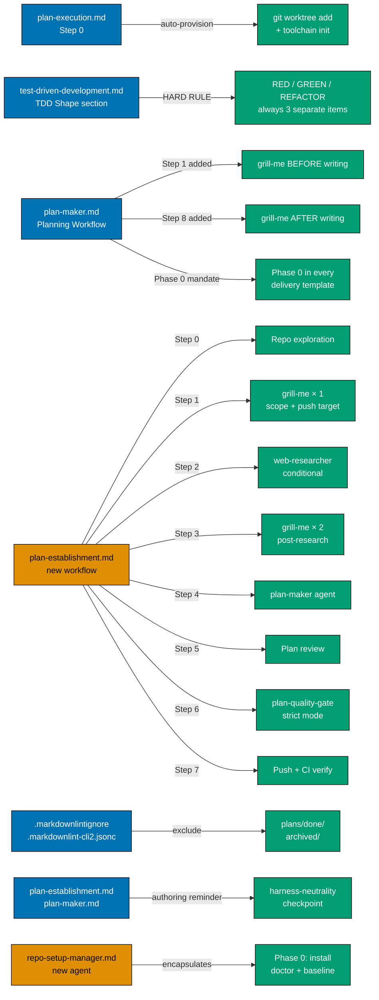

# Technical Documentation

## Architecture

All changes are text edits to existing governance Markdown files plus two new files (one workflow,
one agent) and two config file edits. No code, no tests, no migrations.



## Design Decisions

### DD-1: Auto-provisioning uses `git worktree add worktrees/<id> HEAD`

**Decision**: Provision from `HEAD` (current commit), not from `main` by name.

**Rationale**: The executor may be running from a commit that is not the tip of `main` (e.g., a
detached HEAD, a local commit not yet pushed). Using `HEAD` ensures the worktree matches the
current state. Using `main` could create a worktree at a different commit.

**Alternative rejected**: Using `claude --worktree <id>` — this requires the Claude Code agent
harness and cannot be invoked as a shell command from within a workflow step.

### DD-2: Missing `## Worktree` section still terminates — no change

**Decision**: Keep the existing "terminate with fail" behavior when the `## Worktree` section is
absent from the plan.

**Rationale**: Without a declared worktree path, the executor has no information to provision.
Auto-provisioning is impossible. The user must add the section first.

### DD-3: Grill before AND after in plan-maker — two separate invocations

**Decision**: Two mandatory grill-me calls, not one.

**Rationale**:

- **Before**: discovers unresolved design branches before the author commits to a structure
- **After**: validates that the finished plan matches the resolved decisions and surfaces anything
  that changed during writing

Using a single grill either at the start or end leaves a gap.

### DD-4: Grill-me after covers the finished plan, not requirements re-check

**Decision**: The post-write grill focuses on validating plan content (structure, checklist
completeness, unresolved questions), not re-asking the pre-write questions.

**Rationale**: The post-write grill is a quality gate, not a requirements session. If major
design decisions resurface, the plan-maker may need to revise files before signalling done.

### DD-5: plan-establishment uses direct orchestration, not a delegated agent

**Decision**: The calling context orchestrates plan-establishment step-by-step (same pattern as
plan-execution). No dedicated `plan-establishment` agent is created.

**Rationale**: Grill sessions in Steps 1 and 3 must run in the user's live conversation context.
Delegated agents cannot interact with the user — they run in isolated contexts. Keeping
orchestration in the calling context preserves the conversation thread across all grill turns and
prevents the user from being cut off mid-session.

**Alternative rejected**: A delegated `plan-establishment` agent — cannot handle interactive grill
sessions with the user.

### DD-6: Two grill sessions in plan-establishment serve distinct purposes

**Decision**: Step 1 (pre-research grill) and Step 3 (post-research grill) are separate, not
merged into one.

**Rationale**: Step 1 must establish push target, plan identifier, and constraints _before_
research begins — otherwise research has no scope. Step 3 incorporates research findings and
resolves new branches they open. Merging the two would either delay research (waiting for all
grill branches to close) or require re-grilling after research in the same session (confusing UX).

**Interaction with plan-maker's own grills**: plan-establishment's two grills resolve
macro-decisions. plan-maker's pre-write grill (Step 1) and post-write grill (Step 8) resolve
micro-decisions (exact Gherkin phrasing, section ordering, delivery step granularity). The
layering is intentional — plan-establishment handles what; plan-maker handles how.

### DD-7: Web research is conditional, not mandatory

**Decision**: Step 2 (web research) has an explicit skip condition: if the prompt is a purely
internal governance change with no external claims, and the user confirms in Step 1 that no
research is needed, Step 2 is skipped with a logged note.

**Rationale**: Running web-researcher for every plan adds latency and cost for plans that
don't need it (e.g., renaming a governance convention, adding a new checklist item). The skip
condition is evaluated and confirmed in Step 1 so the decision is explicit, not implicit.

### DD-8: Push target confirmed once in Step 1, used verbatim in Step 7

**Decision**: The push target (e.g., `origin main`) is confirmed during the Step 1 grill and
recorded. Step 7 uses it verbatim without re-asking.

**Rationale**: Re-asking the push target in Step 7 (after research, grilling, and plan creation)
breaks the "resolve once, use everywhere" principle and creates a confusing late-stage decision
point. Confirming it in Step 1 (when the user is already engaged in decisions) is the natural
moment — and it is one of the concrete questions in the Step 1 grill checklist.

### DD-9: plan-establishment places plans directly in `plans/in-progress/`, not `backlog/`

**Decision**: The created plan is written to `plans/in-progress/<identifier>/`, not
`backlog/YYYY-MM-DD__<identifier>/`.

**Rationale**: The workflow is called "establishment" — it produces a plan ready for immediate
execution, not a deferred backlog item. If the user wanted a backlog plan, they would not need
research, grilling, and a quality gate before creation. Plans going through this workflow are
expected to be executed soon after creation.

**Consequence**: The plan-maker agent, when invoked from plan-establishment, receives an explicit
instruction to write directly to `plans/in-progress/<identifier>/` instead of its default
`backlog/` target.

### DD-10: Both `.markdownlintignore` and `.markdownlint-cli2.jsonc` need archive exclusion

**Decision**: Add archive exclusion to both config files, not just one.

**Rationale**: The two files serve different tools in the markdown pipeline. `.markdownlintignore`
is read by `markdownlint-cli2` for its ignore pattern. `.markdownlint-cli2.jsonc` also has an
`ignores` array that governs the same tool when invoked via config. Both must be updated for the
exclusion to take effect regardless of which invocation path is used.

**Alternative rejected**: Only updating `.markdownlintignore` — does not guarantee the config-file
invocation path (used by `npm run lint:md`) respects the exclusion.

### DD-11: Harness-neutrality awareness added as authoring reminders, not as new enforcement

**Decision**: Add explicit harness-neutrality reminders to `plan-establishment.md` (Step 1 grill
checklist, question 4) and `plan-maker.md` (post-write grill coverage list). No new enforcement
step or checker is added.

**Rationale**: `plan-quality-gate` already runs the harness-neutrality scan (Step 5g). The gap is
_awareness at authoring time_, not enforcement. Adding a reminder at the first-grill stage
(plan-establishment) and the post-write grill (plan-maker) closes the awareness gap without
duplicating enforcement logic that already exists.

**Scope**: Only plan-related governance files are audited for existing harness-neutrality gaps in
this plan. A broader audit is deferred.

### DD-12: Phase 0 encapsulated in `repo-setup-manager` agent, mandated in delivery template

**Decision**: Create a `repo-setup-manager` agent responsible for Phase 0 execution, and update
`plan-maker.md`'s delivery checklist template to always emit Phase 0 as the first phase.

**Rationale**: Without a named agent, each plan author invents the Phase 0 sequence ad hoc,
leading to inconsistent baselines (some miss `doctor --fix`, others skip baseline test runs).
Encapsulating Phase 0 in `repo-setup-manager` gives plan executors a named, trusted executor for
setup tasks and makes the responsibility explicit in the delivery template.

**Phase 0 content** (minimum required):

1. `npm install` — synchronize dependencies
2. `npm run doctor -- --fix` — converge polyglot toolchain
3. Baseline: run the full test suite for projects in scope; record pass/fail counts
4. Resolve all preexisting failures before plan phase work begins

**Alternative rejected**: Adding Phase 0 instructions inline to `plan-execution.md` — this
duplicates setup logic that already varies per-plan; a named agent + delivery template mandate is
the single-responsibility approach.

## File Impact Analysis

| File                                                              | Change Type | Scope                                                                                                                           |
| ----------------------------------------------------------------- | ----------- | ------------------------------------------------------------------------------------------------------------------------------- |
| `repo-governance/workflows/plan/plan-execution.md`                | Edit        | Step 0: replace terminate-on-mismatch with auto-provision logic                                                                 |
| `repo-governance/development/workflow/test-driven-development.md` | Edit        | TDD Shape section: add HARD RULE; mini-TDD example: add grouping-label note                                                     |
| `.claude/agents/plan-maker.md`                                    | Edit        | Planning Workflow: renumber steps 1–6 → 2–7; add Step 1 (pre-write) + Step 8 (post-write); Phase 0 mandate in delivery template |
| `AGENTS.md`                                                       | Edit        | plan-maker summary: mention grill mandate; workflows list: add plan-establishment; add repo-setup-manager                       |
| `repo-governance/workflows/plan/plan-establishment.md`            | Create      | New workflow: 8-step prompt-to-pushed-plan pipeline with harness-neutrality checkpoint                                          |
| `repo-governance/workflows/plan/README.md`                        | Edit        | Add plan-establishment to Workflows list and Purpose paragraph                                                                  |
| `.markdownlintignore`                                             | Edit        | Add `plans/done/` and `archived/` exclusion entries                                                                             |
| `.markdownlint-cli2.jsonc`                                        | Edit        | Add `"plans/done/**"` and `"archived/**"` to `ignores` array                                                                    |
| `repo-governance/development/quality/markdown.md`                 | Edit        | Document archive exclusion policy                                                                                               |
| `.claude/agents/repo-setup-manager.md`                            | Create      | New agent definition: Phase 0 environment setup and baseline                                                                    |
| `.opencode/agents/plan-maker.md`                                  | Auto-sync   | `npm run generate:bindings` after `.claude/agents/plan-maker.md` edit                                                           |
| `.opencode/agents/repo-setup-manager.md`                          | Auto-sync   | `npm run generate:bindings` after `.claude/agents/repo-setup-manager.md` create                                                 |

## Exact Changes

### plan-execution.md Step 0

**Remove** from the introductory paragraph:

> "this gate is non-recoverable — the executor does NOT auto-create worktrees."

**Replace with**:

> "If the declared worktree path does not exist or the working directory does not match, the
> executor auto-provisions the worktree before continuing."

**Replace** the "If mismatched" bullet under Orchestrator action point 4:

> "**If mismatched**: terminate with status `fail`. Emit a single user-visible line: `Working
directory mismatch — expected <expected-path>, got <actual-path>. Provision the worktree via
"claude --worktree <plan-identifier>" from the repo root and re-invoke plan execution from
inside the worktree.`"

**With**:

> "**If mismatched or worktree not yet created**: auto-provision the worktree:
>
> 1. Emit user-visible: `Worktree not found at <expected-path>. Auto-provisioning…`
> 2. From the repo root, run: `git worktree add worktrees/<plan-identifier> HEAD`
> 3. In the root worktree, run: `npm install && npm run doctor -- --fix` (per
>    `repo-governance/development/workflow/worktree-setup.md`)
> 4. Emit user-visible: `Worktree provisioned at <expected-path>.`
> 5. Continue execution with the worktree path as the working context.
> 6. If `git worktree add` fails (e.g., path already exists at a different commit, dirty state),
>    terminate with fail and emit the error verbatim."

**Remove** the "On failure" note:

> "Do NOT attempt auto-provisioning — worktree creation is an explicit user action via
> `claude --worktree <plan-identifier>`."

**Update** the "Why this is a hard gate" section to reflect that CWD mismatch is now recoverable,
and only the missing `## Worktree` section remains a hard-fail gate.

### test-driven-development.md TDD Shape section

After the existing three-substep template code block (RED/GREEN/REFACTOR), **add**:

> **HARD RULE: Never combine RED, GREEN, and REFACTOR into a single checkbox.** Each of the
> three phases must be its own `- [ ]` item in the delivery checklist. Collapsing multiple phases
> (e.g., `- [ ] Implement X with TDD`, `- [ ] Red-Green-Refactor feature Y`) is forbidden. Each
> sub-bullet in a mini-TDD nested group counts as its own independent checkbox — the parent label
> bullet must not be the only tracked item. `plan-checker` flags combined items as HIGH findings.

In the Mini-TDD Passes / Applying TDD to Plans section, after the nested example, **add a note**:

> Note: each nested sub-bullet (`- [ ] Red:`, `- [ ] Green:`, `- [ ] Refactor:`) is its own
> independent checkbox tracked by the plan-execution workflow. The parent label
> (`- [ ] TDD cycle:`) is a grouping label only — if included, it must not substitute for the
> three phase items.

### plan-maker.md Planning Workflow

**Renumber** existing steps (Step 1 → Step 2, Step 2 → Step 3, …, Step 6 → Step 7).

**Add new Step 1** before "Gather Requirements":

```markdown
### Step 1: Grill the User (Mandatory — Pre-Write)

Before reading the codebase or creating any files, invoke the `grill-me` Skill to
stress-test requirements and resolve all open design decisions.

Ask about:

- Problem being solved and why now
- Scope boundaries and what is explicitly out-of-scope
- Acceptance criteria: what does done look like?
- Constraints: tooling, backwards compatibility, agent or workflow conventions
- Any forks in the design space that require a decision before writing starts

Do NOT proceed to Step 2 until all design-decision branches are resolved and the user has
confirmed the direction.
```

**Add new Step 8** after the existing final step (Plan Archival Section content):

```markdown
### Step 8: Grill the User (Mandatory — Post-Write)

After all plan files are written, invoke the `grill-me` Skill again to validate the
finished plan with the user.

Cover:

- Does the plan structure match the design decisions from Step 1?
- Are there any open questions introduced during writing?
- Are the Gherkin acceptance criteria complete and testable?
- Is the delivery checklist granular enough for an execution-grade (sonnet-tier) agent?
- Does the Worktree section exist and is the declared path correct?
- Does the delivery checklist start with Phase 0 (Environment Setup and Baseline)?

Revise plan files as needed based on gaps surfaced. Signal done only after the user
confirms.
```

**Update the delivery checklist template** in plan-maker.md to always include Phase 0 as the
first phase:

```markdown
## Phase 0: Environment Setup and Baseline

> _Executor: repo-setup-manager_

- [ ] Install dependencies: `npm install`
      — acceptance: exits 0, `node_modules/` synchronized
- [ ] Converge polyglot toolchain: `npm run doctor -- --fix`
      — acceptance: exits 0 with no unresolved drift
- [ ] Run baseline tests for projects in scope and record pass/fail counts
      — acceptance: baseline recorded; all preexisting failures documented
- [ ] Resolve all preexisting failures found in baseline before proceeding to Phase 1
      — acceptance: no known failures carried into plan phase work
```

### .markdownlintignore

Append the following lines:

```
# Archived content — internal links may be stale; do not validate
plans/done/
archived/
```

### .markdownlint-cli2.jsonc

In the `ignores` array, append two entries:

```json
"plans/done/**",
"archived/**"
```

### repo-governance/development/quality/markdown.md

Add a new section **Archive Exclusion** documenting that `plans/done/` and `archived/` are
excluded from markdown linting:

> ### Archive Exclusion
>
> The directories `plans/done/` and `archived/` are excluded from markdown linting
> (both `.markdownlintignore` and `.markdownlint-cli2.jsonc`). These directories contain frozen
> historical files. Internal cross-references in archived content legitimately rot over time as
> files move or are deleted. Validating them produces false failures and blocks pushes for content
> that is not under active maintenance.
>
> Active content (`plans/in-progress/`, `plans/backlog/`, `docs/`, `repo-governance/`, `apps/`,
> `libs/`) is still fully linted.

### plan-establishment.md (new file — full content)

_New file: `.claude/agents/repo-setup-manager.md` is created in Phase 6 of this plan's delivery.
The cross-reference to it inside the template below is a forward reference — it is valid once
Phase 6 completes._

Create `repo-governance/workflows/plan/plan-establishment.md` with the following content:

````markdown
---
name: plan-establishment
title: "plan-establishment"
goal: >
  Create a well-researched, grill-validated project plan in plans/in-progress/ from a user prompt
  describing a desired behavior or change, then push it to the confirmed target
termination: >
  Plan exists in plans/in-progress/, passes plan-quality-gate at strict mode, and is pushed to
  the confirmed target
inputs:
  - name: prompt
    type: string
    description: Description of the behavior, change, or convention to adopt in the repository
    required: true
  - name: push-target
    type: string
    description: "Git push destination (e.g., 'origin main'). Confirmed in the Step 1 grill if not provided."
    required: false
    default: "origin main"
outputs:
  - name: plan-path
    type: string
    description: Path to the created plan in plans/in-progress/<identifier>/
  - name: final-status
    type: enum
    values: [pass, partial, fail]
    description: Final status after the quality gate
  - name: final-report
    type: file
    pattern: generated-reports/plan__*__audit.md
    description: Final audit report from plan-quality-gate
---

# Plan Establishment Workflow

**Purpose**: Transform a user prompt describing a desired behavior or change into a
production-ready plan in `plans/in-progress/`, validated by `plan-quality-gate` and pushed to
the confirmed target.

**When to use**:

- When the user describes a new behavior, pattern, or convention to adopt in the repository
- When a vague idea needs to become a structured, executable plan
- When research is needed before writing a plan (library versions, best practices, prior art)
- When the user wants the full plan-creation lifecycle orchestrated automatically

## Execution Mode

**Direct Orchestration** — the calling context (the top-level assistant session) is the
orchestrator. It follows this workflow step-by-step: exploring the repo, conducting grill sessions
via the `grill-me` Skill, delegating research to `web-researcher` and plan writing to
`plan-maker` via the Agent tool, and running the `plan-quality-gate` workflow inline.

Grill sessions run in the calling context (not delegated) so the user's conversation is preserved
across all turns.

```
User: "Establish a plan to [describe desired change]"
```

## Steps

### 0. Prompt Parsing and Repo Exploration (Sequential)

Before any user interaction, understand the current repo state relative to the prompt.

**Orchestrator action**:

1. Parse the prompt: extract the desired behavior, likely affected areas (governance files,
   agents, workflows, apps, libs), and any explicit constraints
2. Explore the repo:
   - Read relevant `repo-governance/` files (conventions, workflows, development practices that
     overlap with the prompt)
   - Search `plans/in-progress/`, `plans/backlog/`, `plans/done/` for related prior plans
   - `Grep` for existing conventions or code that may already address or conflict with the prompt
   - Read `AGENTS.md` for relevant agent and workflow references
3. Build a context summary: what already exists, what gaps remain, what conflicts with the prompt

**Output**: Repo context loaded. Related prior work and conflicts identified.

**Notes**:

- Purely exploratory — no user interaction in this step
- Thorough exploration reduces grill time in Step 1 (pre-read the repo so you can answer "does X
  already exist?" without asking the user)

### 1. First Grill — Scope, Constraints, Push Target (Sequential, Hard Gate)

Invoke the `grill-me` Skill to resolve all open design decisions before research begins.

**Orchestrator action**:

Invoke the `grill-me` Skill (`.claude/skills/grill-me/SKILL.md`). Present Step 0 findings.
Resolve ALL of the following:

1. **Scope**: What is the exact behavior to adopt? What is explicitly out-of-scope?
2. **Affected files**: Which governance files, agents, or workflows will change?
3. **Conflicts**: Does any current convention already address this, conflict with it, or need
   updating?
4. **Constraints**: Backwards compatibility, multi-harness binding implications (if the plan
   touches `.claude/agents/`, `.opencode/agents/`, or `repo-governance/` paths, confirm that
   changes remain vendor-neutral per the
   [Governance Vendor-Independence Convention](../../conventions/structure/governance-vendor-independence.md)),
   tool dependencies
5. **Plan identifier**: What slug should the plan folder use (e.g., `add-foo-convention`)?
6. **Push target**: Confirm where the finished plan should be pushed (default: `origin main`).
   Record — used verbatim in Step 7 without re-asking.
7. **PR vs. direct push**: Is a PR needed, or direct push to `main`?
8. **Definition of done**: What must the finished plan contain for the user to consider it ready?
9. **Research needed**: Are there external claims (library versions, third-party best practices,
   API behavior) that require verification before writing?

**Do NOT proceed to Step 2** until:

- All design-decision branches are resolved
- Push target and plan identifier are explicitly confirmed
- Definition of done is agreed upon
- Whether research is needed is established (determines Step 2 skip condition)

**Output**: Push target confirmed. Plan identifier confirmed. All decisions resolved.
Research-needed flag set.

**On failure to resolve**: Do not proceed. Remain in grill until resolved or user cancels.

### 2. Web Research (Sequential, Conditional)

Delegate external research to `web-researcher` to verify claims and gather authoritative
sources.

**Skip condition**: Skip if ALL hold:

1. The prompt describes a purely internal governance or structural change with no external claims
2. No library versions, API signatures, tool behavior, or third-party conventions need verification
3. The user confirmed in Step 1 that no research is needed

If skipping: emit `Step 2 skipped — no external research needed (confirmed in Step 1).`

**If NOT skipping**:

Invoke `web-researcher` via the Agent tool. Provide a focused research prompt covering:

- Best practices or authoritative sources for the proposed approach
- Library or tool behavior referenced in the prompt (versions, API signatures, caveats)
- Prior art: has anyone formalized this pattern? Known failure modes?
- Risks or caveats not mentioned in the prompt

**Agent**: `web-researcher`

**Output**: Cited, structured research findings. Passed to Step 3 grill and included in the
plan-maker handoff in Step 4.

### 3. Second Grill — Post-Research Validation (Sequential)

Present research findings and grill again to validate direction and close new branches.

**Orchestrator action**:

1. Summarize research findings from Step 2 (or confirm skipped)
2. Invoke the `grill-me` Skill. Cover:
   - Do the research findings change any decision from Step 1?
   - Are there new constraints or trade-offs surfaced by the research?
   - Does the proposed approach still hold after authoritative sources?
   - Are there risks the user wants to explicitly accept or mitigate in the plan?
3. Confirm the updated direction before proceeding

**Do NOT proceed to Step 4** until mutual understanding is confirmed, incorporating research.

**Notes**:

- If research was skipped in Step 2, this is a brief confirmation pass, not a full grill session
- All new branches must be resolved before calling `plan-maker`

**Output**: Final direction confirmed. Research findings integrated into design decisions.

### 4. Plan Creation (Sequential)

Invoke `plan-maker` to write the plan in `plans/in-progress/`.

**Agent**: `plan-maker`

Delegate via the Agent tool. Provide a self-contained handoff prompt containing ALL of:

1. Original user prompt (verbatim)
2. Resolved design decisions from Steps 1 and 3 (numbered decision list)
3. Research findings from Step 2 (cited) — or note that research was skipped
4. Confirmed plan identifier (target folder: `plans/in-progress/<identifier>/`)
5. Confirmed push target
6. Definition of done (from Step 1)
7. **Explicit instruction**: write the plan directly to `plans/in-progress/<identifier>/` — do
   NOT create in `backlog/`. This workflow places plans in `in-progress/` immediately.

**Note on plan-maker's own grill protocol**: `plan-maker` mandates a pre-write grill (Step 1) and
a post-write grill (Step 8). When invoked by `plan-establishment`, these become
**validation passes** — macro-decisions are already resolved. Micro-decisions (exact Gherkin
phrasing, section ordering, step granularity) are still resolved by plan-maker's grills.

**Output**: Plan files created in `plans/in-progress/<identifier>/`.

**On failure**: Terminate with status `fail`. Surface the error.

### 5. Plan Review (Sequential)

Read the created plan files and verify structural completeness before the quality gate.

**Orchestrator action**:

1. Read all plan files in `plans/in-progress/<identifier>/`
2. Verify `## Worktree` section exists in `delivery.md` (multi-file) or `README.md` (single-file)
3. Verify delivery checklist has at least one `- [ ]` checkbox
4. Verify Gherkin acceptance criteria present in `prd.md` (multi-file) or condensed PRD
5. Verify the worktree path in the plan matches `<identifier>` confirmed in Step 1
6. Verify delivery checklist starts with **Phase 0: Environment Setup and Baseline**
7. If structural gaps found: provide a focused prompt to `plan-maker` or fix trivially via `Edit`

**Output**: Plan structurally complete. Ready for quality gate.

**On failure after one retry**: Terminate with status `fail`.

### 6. Quality Gate (Sequential)

Run the `plan-quality-gate` workflow at `strict` mode.

Follow the [plan-quality-gate workflow](./plan-quality-gate.md) with:

- **Input** `scope`: `plans/in-progress/<identifier>/`
- **Input** `mode`: `strict`
- **Output**: `final-status`, `final-report`

**Success criteria**: `plan-quality-gate` returns `pass` (zero CRITICAL/HIGH/MEDIUM on two
consecutive checks).

**On `partial` or `fail`**: Investigate the final report. Apply targeted fixes. Re-run
`plan-quality-gate` up to 2 additional times. If still not `pass`, terminate with status
`partial` and surface the final report.

### 7. Push and Verify (Sequential)

Commit and push the plan to the confirmed target.

**Orchestrator action**:

1. Stage all plan files: `git add plans/in-progress/<identifier>/`
2. Commit: `chore(plans): establish <identifier> plan`
3. Push to the confirmed target from Step 1: `git push <confirmed-target>`
4. Monitor GitHub Actions: `gh run list --limit 5` — verify all triggered workflows complete
   with `completed/success` conclusion
5. If a CI workflow fails: diagnose root cause, fix, push a follow-up commit, re-monitor
6. Emit a user-visible summary: plan path, quality gate status, push target, CI status

**Output**: `plan-path`, `final-status`, `final-report`.

**On push failure**: Surface the error. Do NOT retry automatically — conflicts require human
resolution.

## Principles Implemented/Respected

- **[Deliberate Problem-Solving](../../../principles/general/deliberate-problem-solving.md)**:
  Two grill sessions and a research step ensure the plan is built on verified understanding, not
  assumptions
- **[Root Cause Orientation](../../../principles/general/root-cause-orientation.md)**: Repo
  exploration in Step 0 prevents duplicating existing conventions and surfaces conflicts early
- **[Automation Over Manual](../../../principles/software-engineering/automation-over-manual.md)**:
  The full research → grill → write → validate → push lifecycle is orchestrated without manual
  intervention at each step
- **[Explicit Over Implicit](../../../principles/software-engineering/explicit-over-implicit.md)**:
  Push target, plan identifier, and definition of done are confirmed explicitly in Step 1 before
  any work begins

## Conventions Implemented/Respected

- **[Plans Organization Convention](../../conventions/structure/plans.md)**: Creates plans in
  `plans/in-progress/` with correct identifier format and worktree specification
- **[Governance Vendor-Independence Convention](../../conventions/structure/governance-vendor-independence.md)**:
  Step 1 grill includes an explicit harness-neutrality checkpoint for plans touching agents,
  skills, or `repo-governance/` paths
- **[Web Research Delegation Convention](../../conventions/writing/web-research-delegation.md)**:
  External research delegated to `web-researcher`
- **[Commit Messages Convention](../../development/workflow/commit-messages.md)**: Conventional
  Commits format in Step 7
- **[CI Post-Push Verification Convention](../../development/workflow/ci-post-push-verification.md)**:
  Step 7 monitors GitHub Actions after push

## Related Workflows

- [Plan Quality Gate](./plan-quality-gate.md) — called in Step 6
- [Plan Execution](./plan-execution.md) — next workflow after plan-establishment

## Related Documentation

- [Plans Organization Convention](../../conventions/structure/plans.md)
- [Governance Vendor-Independence Convention](../../conventions/structure/governance-vendor-independence.md)
- [grill-me Skill](../../../.claude/skills/grill-me/SKILL.md) — Steps 1 and 3
- [plan-maker Agent](../../../.claude/agents/plan/plan-maker.md) — Step 4
- [web-researcher Agent](../../../.claude/agents/web/web-researcher.md) — Step 2
- [repo-setup-manager Agent](../../../.claude/agents/repo/repo-setup-manager.md) — Phase 0 of plans
  created by this workflow
````

### repo-governance/workflows/plan/README.md

In the **Workflows** section, add after `[Plan Quality Gate]`:

```markdown
- [Plan Establishment](./plan-establishment.md) - Orchestrate the full prompt-to-pushed-plan
  lifecycle: repo exploration → grill → web research → grill → plan-maker → plan-quality-gate →
  push. Use when turning a behavioral prompt into a production-ready plan.
```

Update the **Purpose** paragraph to mention plan-establishment as the third workflow.

### repo-setup-manager.md (new agent — full content)

Create `.claude/agents/repo-setup-manager.md` with the following content:

````markdown
---
name: repo-setup-manager
description: >
  Executes Phase 0 of any plan delivery checklist: installs dependencies, converges the
  polyglot toolchain via npm run doctor, runs baseline tests for projects in scope, and
  resolves all preexisting failures before plan work begins. Use at the start of every plan
  execution to establish a clean, known-good baseline.
tools: [Read, Bash, Glob, Grep]
model: haiku
color: green
---

# repo-setup-manager

## Purpose

Standardize Phase 0 across all plan executions: install dependencies, converge the polyglot
toolchain, establish a test baseline, and resolve ALL preexisting failures — before any plan
phase work begins. Ensures every plan starts from a clean, known-good state.

## Phase 0 Sequence

Execute the following steps in order. Each step must pass before proceeding to the next.

### Step 1: Install Dependencies

```bash
npm install
```

**Acceptance**: exits 0, `node_modules/` synchronized.

### Step 2: Converge Polyglot Toolchain

```bash
npm run doctor -- --fix
```

**Acceptance**: exits 0 with no unresolved drift. If drift remains after `--fix`, report the
specific tools that could not be auto-fixed and stop — do NOT proceed until drift is cleared.

### Step 3: Baseline Test Run

Run the full test suite for all projects in scope for the current plan. Use `nx affected` if the
plan affects a subset of projects; use `nx run-many -t test:unit` for a full baseline.

Record the exact pass/fail/skip counts:

```
Baseline (YYYY-MM-DD HH:MM):
  Projects in scope: [list]
  Passed: N
  Failed: N
  Skipped: N
  Known preexisting failures: [list test IDs or 'none']
```

**Acceptance**: Baseline recorded and emitted as user-visible output.

### Step 4: Resolve Preexisting Failures

For each failure found in Step 3:

1. Investigate root cause
2. Determine if the failure is:
   - **Pre-existing and in-scope** (related to the plan's work area): fix it before Phase 1
   - **Pre-existing and out-of-scope**: document it in the baseline record as "known, out-of-scope"
     and do NOT fix (to avoid unintended scope creep)
3. Re-run failing tests after any fix to confirm resolution
4. Update baseline record

**Acceptance**: No in-scope preexisting failures remain. All out-of-scope failures are documented.

**On persistent failure**: If an in-scope preexisting failure cannot be resolved within Phase 0,
emit a clear stop signal: the plan cannot proceed until the failure is resolved. Surface the
failure details and halt.

## Principles Implemented/Respected

- **[Root Cause Orientation](../../repo-governance/principles/general/root-cause-orientation.md)**:
  Resolve preexisting failures at root cause, not by marking them as "known and ignored"
- **[Reproducible Environments](../../repo-governance/development/workflow/reproducible-environments.md)**:
  `npm install` and `doctor --fix` establish a reproducible starting state
- **[Deliberate Problem-Solving](../../repo-governance/principles/general/deliberate-problem-solving.md)**:
  Understand the baseline before writing new code

## Related Documentation

- [Worktree Setup](../../repo-governance/development/workflow/worktree-setup.md) — toolchain init
  after `git worktree add`
- [Plan Execution Workflow](../../repo-governance/workflows/plan/plan-execution.md) — Phase 0 is
  the first phase of every plan
- [plan-maker Agent](./plan-maker.md) — delivery template includes Phase 0
````

## Rollback

All changes in this plan are text edits to governance Markdown files and two config files. No
database migrations, no compiled artifacts, no binary changes. Rollback is `git revert` per
thematic commit.

**Rollback by domain** (matches Phase 10 thematic commit order):

| Domain                      | Commit message                                                                                 | Files affected                                                                                       |
| --------------------------- | ---------------------------------------------------------------------------------------------- | ---------------------------------------------------------------------------------------------------- |
| Worktree auto-provisioning  | `docs(governance): update plan-execution worktree auto-provisioning`                           | `repo-governance/workflows/plan/plan-execution.md`                                                   |
| TDD hard rule               | `docs(governance): add TDD RED/GREEN/REFACTOR hard rule`                                       | `repo-governance/development/workflow/test-driven-development.md`                                    |
| plan-maker grills + Phase 0 | `docs(agents): update plan-maker with mandatory grill and Phase 0 mandate`                     | `.claude/agents/plan-maker.md`                                                                       |
| AGENTS.md summaries         | `docs(governance): update AGENTS.md with plan-establishment and repo-setup-manager`            | `AGENTS.md`                                                                                          |
| plan-establishment workflow | `docs(governance): add plan-establishment workflow`                                            | `repo-governance/workflows/plan/plan-establishment.md`, `repo-governance/workflows/plan/README.md`   |
| repo-setup-manager agent    | `feat(agents): add repo-setup-manager agent`                                                   | `.claude/agents/repo-setup-manager.md`                                                               |
| Markdown archive exclusions | `docs(governance): exclude plans/done and archived from markdown lint`                         | `.markdownlintignore`, `.markdownlint-cli2.jsonc`, `repo-governance/development/quality/markdown.md` |
| Bindings sync               | `chore(bindings): sync opencode agent mirrors after plan-maker and repo-setup-manager changes` | `.opencode/agents/plan-maker.md`, `.opencode/agents/repo-setup-manager.md`                           |

**Rollback procedure**: `git revert <commit-hash>` for each commit to roll back, in reverse
order. Each revert is independently safe — no domain depends on another at the text-edit level.
