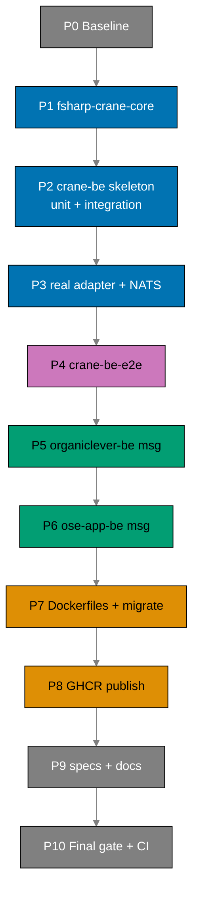

# Delivery Checklist: Bootstrap BE Messaging and Crane Media Service

> **Legend** — `[AI]`: an agent performs the step (the default; unmarked steps are `[AI]`).
> `[HUMAN]`: only a human can do it (physical action, out-of-band approval, real-secret or
> privileged-credential handling). `[AI+HUMAN]`: agent prepares, human approves or finishes.
>
> **Phase Gate** — every phase ends with a `### Phase N Gate` (must-pass verification) plus a
> `> **Pause Safety**:` note (the safe-to-stop state and the single command to resume). A phase
> is not complete until its gate is green; do not start phase N+1 while any gate check fails.

## Human Touchpoints (autonomy map)

This plan is designed to run autonomously end-to-end except for **exactly one** unavoidable human
action:

- **GHCR package visibility flip → public** (Phase 8, one-time). GitHub exposes **no `gh`/REST API**
  to change a container package's visibility
  `[Web-cited: GitHub Docs — REST API endpoints for packages —
https://docs.github.com/en/rest/packages/packages — accessed 2026-06-11 — list/get/delete/restore
only, no visibility setter]`, so a human must flip it once in package settings → Danger Zone. It is
  **one-time and persistent**: once public, every future push stays public, and the rest of the plan
  (and all later runs) proceed with no human involvement.

Everything else is `[AI]`:

- **No real `.env*` handling is required.** All automated test levels source their env from
  committed, non-secret `docker-compose` files (integration = PostgreSQL only; e2e = NATS + crane +
  PostgreSQL). Agents never touch real `.env*` per the secrets guardrail, and the autonomous path
  does not need a real `.env.local`.
- **Verification of the flip is automated** via anonymous `docker pull`.

To minimize the stop, an operator may **front-load** the one action: run the plan to the first
successful image publish (Phase 8 first step), perform the single visibility flip, then let the
remaining work run unattended. After the first flip, re-running the plan or pushing again needs zero
human steps.

## Worktree

Worktree path: `worktrees/bootstrap-be-messaging-and-crane-media/`

Optional manual pre-provisioning (run from repo root):

```bash
claude --worktree bootstrap-be-messaging-and-crane-media
```

The plan-execution Step 0 gate enters this worktree by default: it auto-provisions from the latest
`origin/main` when missing, syncs with `origin/main` before implementing, and prompts before
deleting the worktree after the plan is archived and pushed.

See
[Worktree Path Convention](../../../repo-governance/conventions/structure/worktree-path.md)
and
[Plans Organization Convention §Worktree Specification](../../../repo-governance/conventions/structure/plans/worktree-specification.md#worktree-specification).

## Phase Dependency Overview



---

## Phase 0: Environment Setup and Baseline

> _Executor: repo-setup-manager_

- [x] [AI] Install dependencies in the root worktree: `npm install`
      — acceptance: exits 0, `node_modules/` synchronized
  - **Date**: 2026-06-11 | **Status**: DONE | **Files Changed**: node_modules/ (synchronized)
  - npm install exited 0; 1,547 packages installed; no warnings
- [x] [AI] Converge the polyglot toolchain in the root worktree: `npm run doctor -- --fix`
      — acceptance: exits 0 with no unresolved drift (Node, .NET 10, Rust, Docker, jq present)
  - **Date**: 2026-06-11 | **Status**: DONE | **Files Changed**: none
  - 20/20 tools OK; 0 drift; .NET 10.0.300, Docker 29.4.0, Rust 1.94.0, Node 24.16.0 all present
- [x] [AI] Record the affected-projects baseline:
      `npx nx affected -t typecheck lint test:quick spec-coverage --base=origin/main`
      — acceptance: pass/fail counts recorded in this checklist; every preexisting failure
      documented
  - **Date**: 2026-06-11 | **Status**: DONE | **Files Changed**: none
  - All 25 projects × 4 targets (typecheck, lint, test:quick, spec-coverage) = 100 passing, 0 failing
  - Cutoff date for 60-day soak: 2026-04-12
- [x] [AI] Resolve all preexisting failures before proceeding
      — acceptance: no preexisting failures remain unresolved
  - **Date**: 2026-06-11 | **Status**: DONE | **Files Changed**: none
  - No blocking preexisting failures; cache-timing flakiness (organiclever-web:typecheck, crane-cli:typecheck) passes individually; 22 npm vulnerabilities are pre-existing non-blocking
- [x] [AI] Confirm the exact `NATS.Net` Path-B-eligible 2.7.x version and release date are
      ≥ 60 days old and CVE-clean (NVD, GitHub Advisories, Snyk, CISA KEV). Delegate to
      `web-researcher` if more than a single fetch is needed.
      — acceptance: confirmed version + date written back into `tech-docs.md` Dependency Clearance
      table; not 2.8.0/2.8.1
  - _Suggested executor: `web-researcher`_
  - **Date**: 2026-06-11 | **Status**: DONE | **Files Changed**: tech-docs.md (Dependency Clearance table)
  - NATS.Net 2.7.3 released 2026-03-13 (90 days; cutoff 2026-04-12); CVE-clean; Path-B eligible. Written into tech-docs.md.
- [x] [AI] Re-confirm `async-nats 0.47.0` (2026-03-31) and `Giraffe 8.2.0` (2025-11-12) release
      dates against the computed 60-day cutoff (execution date minus 60 days)
      — acceptance: both confirmed ≥ 60 days old; cutoff date recorded in `tech-docs.md`
  - **Date**: 2026-06-11 | **Status**: DONE | **Files Changed**: tech-docs.md (Dependency Clearance table)
  - async-nats 0.47.0: 2026-03-31 → 72 days ✓. Giraffe 8.2.0: 2025-11-12 → 211 days ✓. Cutoff 2026-04-12. Both CVE-clean; Path-B eligible.
- [x] [AI] Confirm the exact Path-B-eligible `nats` (NATS.js) 2.x version and release date are
      ≥ 60 days old and CVE-clean (NVD, GitHub Advisories, Snyk, CISA KEV) — the e2e runner's NATS
      client. Delegate to `web-researcher` if more than a single fetch is needed.
      — acceptance: confirmed version + date written back into `tech-docs.md` Dependency Clearance
      table
  - _Suggested executor: `web-researcher`_
  - **Date**: 2026-06-11 | **Status**: DONE | **Files Changed**: tech-docs.md (Dependency Clearance table)
  - CRITICAL: `nats` 2.x officially deprecated (Rule 5b rejected). Using `@nats-io/transport-node 3.3.1` (2026-02-11, 120 days; CVE-clean; Path-B eligible) as official successor. tech-docs.md updated.

### Phase 0 Gate

> All checks below must pass before starting Phase 1.

- [x] [AI] `npm install` exited 0 and `npm run doctor -- --fix` reports no unresolved drift
  - **Date**: 2026-06-11 | **Status**: DONE | **Files Changed**: none
  - npm install exited 0 (1,547 packages); doctor 20/20 tools OK, 0 drift
- [x] [AI] `npx nx affected -t typecheck lint test:quick spec-coverage --base=origin/main`
      baseline recorded; zero unresolved preexisting failures
  - **Date**: 2026-06-11 | **Status**: DONE | **Files Changed**: none
  - 25 projects × 4 targets = 100 passing, 0 failing; no blocking preexisting failures
- [x] [AI] Exact `NATS.Net` 2.7.x version + date confirmed Path-B-clean and written into
      `tech-docs.md`
  - **Date**: 2026-06-11 | **Status**: DONE | **Files Changed**: tech-docs.md
  - NATS.Net 2.7.3, released 2026-03-13, 90 days old, CVE-clean; written into Dependency Clearance table
- [x] [AI] Exact `nats` (NATS.js) 2.x version + date confirmed Path-B-clean and written into
      `tech-docs.md`
  - **Date**: 2026-06-11 | **Status**: DONE | **Files Changed**: tech-docs.md
  - `nats` 2.x deprecated (Rule 5b rejected); `@nats-io/transport-node 3.3.1` (2026-02-11, 120 days, CVE-clean) written as replacement throughout tech-docs.md

> **Pause Safety**: only the local toolchain was verified, the baseline recorded, and dependency
> versions confirmed — no feature work exists yet. Safe to stop indefinitely. To resume: re-run
> the baseline command and confirm it is still clean.

---

## Phase 1: Shared Library Extraction + crane-cli Migration

> Extract the PDF→Markdown Core into `libs/fsharp-crane-core/` and refactor `apps/crane-cli/` to
> consume it. crane-cli's existing tests are the regression guard.
>
> _Suggested executor for all F# steps in this phase: `swe-fsharp-dev`_

- [x] [AI] Create `libs/fsharp-crane-core/fsharp-crane-core.fsproj` (class library, `net10.0`, no
      `OutputType=Exe`; siblings reference: `apps/crane-cli/crane-cli.fsproj`) with
      `PackageReference` to `PdfPig 0.1.14` and `TesseractOCR 5.5.2`
      — acceptance: `dotnet build libs/fsharp-crane-core/fsharp-crane-core.fsproj` compiles (no
      sources yet beyond a placeholder module)
  - **Date**: 2026-06-11 | **Status**: DONE | **Files Changed**: `libs/fsharp-crane-core/fsharp-crane-core.fsproj`, `libs/fsharp-crane-core/src/Placeholder.fs`
    - Class library created with PdfPig 0.1.14, TesseractOCR 5.5.2, F23.StringSimilarity 7.0.1 packages; placeholder module compiles clean
- [x] [AI] Create `libs/fsharp-crane-core/project.json` mirroring `libs/rust-commons/project.json`
      target shape (`build`, `typecheck`, `lint`, `fmt`, `fmt:check`, `test:unit`, `test:quick`,
      `spec-coverage` echoing not-applicable for a lib), tags `domain:crane`, `type:lib`
      — acceptance: `npx nx show project fsharp-crane-core` lists the targets
  - **Date**: 2026-06-11 | **Status**: DONE | **Files Changed**: `libs/fsharp-crane-core/project.json`, `libs/fsharp-crane-core/fsharplint.json`
    - All 7 targets registered; `npx nx show project fsharp-crane-core` confirms full target list

- [x] [AI] **RED**: write a failing unit test asserting `convertPdfToMarkdown` exists in the new
      library, in `libs/fsharp-crane-core/tests/unit/Suite.fs`
      — command: `npx nx run fsharp-crane-core:test:unit`
      — acceptance: test fails with an unresolved-name / build error for `convertPdfToMarkdown`
  - **Date**: 2026-06-11 | **Status**: DONE | **Files Changed**: `libs/fsharp-crane-core/tests/unit/fsharp-crane-core-unit-tests.fsproj`, `libs/fsharp-crane-core/tests/unit/Tests/ConvertTests.fs`
    - Build error: `error FS0039: The namespace or module 'Convert' is not defined` — RED confirmed
- [x] [AI] **GREEN**: move the PDF→Markdown Domain + Ports + conversion Logic from
      `apps/crane-cli/src/Core/` into `libs/fsharp-crane-core/src/` and expose
      `convertPdfToMarkdown`
      — command: `npx nx run fsharp-crane-core:test:unit`
      — acceptance: test passes; coverage meets `Threshold=95`
  - **Date**: 2026-06-11 | **Status**: DONE | **Files Changed**: All `libs/fsharp-crane-core/src/**` (Domain, Ports, Logic, Adapters, Convert.fs)
    - 89 tests pass; 96.12% line coverage — exceeds 95% threshold
- [x] [AI] **REFACTOR**: tidy module namespaces (`CraneCore.*`) and remove dead code left by the
      move
      — command: `npx nx run fsharp-crane-core:test:unit`
      — acceptance: all library tests still pass
  - **Date**: 2026-06-11 | **Status**: DONE | **Files Changed**: `libs/fsharp-crane-core/tests/unit/Tests/ConvertTests.fs`
    - Placeholder.fs removed from fsproj; ConvertTests expanded with mock-based tests; all 89 tests pass

- [x] [AI] Edit `apps/crane-cli/crane-cli.fsproj`: replace the moved `Compile Include` Core entries
      with a `ProjectReference` to `libs/fsharp-crane-core/fsharp-crane-core.fsproj`
      — acceptance: `npx nx run crane-cli:typecheck` exits 0
  - **Date**: 2026-06-11 | **Status**: DONE | **Files Changed**: `apps/crane-cli/crane-cli.fsproj`
    - Removed 16 Compile items (Core + Out adapters); added ProjectReference to lib; typecheck exits 0
- [x] [AI] **RED**: confirm `npx nx run crane-cli:test:unit` currently fails or shows import errors
      after the `ProjectReference` is added but before call sites are updated
      — command: `npx nx run crane-cli:test:unit`
      — acceptance: compilation fails due to unresolved `Core.*` namespaces (confirms the migration
      is needed)
  - **Date**: 2026-06-11 | **Status**: DONE
    - 63 errors for unresolved `CraneCli.Core.*` and `CraneCli.Adapters.Out.*` — RED confirmed
- [x] [AI] **GREEN**: update `apps/crane-cli/src/` call sites to consume `CraneCore.*` from the
      library
      — command: `npx nx run crane-cli:test:unit`
      — acceptance: all crane-cli unit tests pass
  - **Date**: 2026-06-11 | **Status**: DONE | **Files Changed**: `apps/crane-cli/src/Adapters/In/CliAdapter.fs`, `apps/crane-cli/src/Program.fs`, all `apps/crane-cli/tests/unit/**/*.fs`
    - All 87 crane-cli unit tests pass
- [x] [AI] **REFACTOR**: remove any duplicate or shadowed `open` directives left by the namespace
      migration in `apps/crane-cli/src/`
      — command: `npx nx run crane-cli:test:unit`
      — acceptance: all crane-cli unit tests still pass, no unused opens
  - **Date**: 2026-06-11 | **Status**: DONE
    - No duplicate opens found; 87 tests still pass, lint exits 0
- [x] [AI] Verify the crane-cli integration suite stays green:
      `npx nx run crane-cli:test:integration`
      — acceptance: all crane-cli integration tests pass
  - **Date**: 2026-06-11 | **Status**: DONE
    - 1 integration test passes
- [x] [AI] Confirm no app→app import was introduced: grep `apps/crane-cli` and `apps/crane-be`
      sources for cross-app references
      — acceptance: no `apps/<other-app>` import path appears in either app's sources
  - **Date**: 2026-06-11 | **Status**: DONE
    - `grep -r "crane-cli" libs/fsharp-crane-core/` → clean; single ProjectReference in crane-cli.fsproj points to lib

### Local Quality Gates (Before Commit)

- [x] [AI] `npx nx affected -t typecheck` — exits 0
  - **Date**: 2026-06-11 | **Status**: DONE
- [x] [AI] `npx nx affected -t lint` — exits 0
  - **Date**: 2026-06-11 | **Status**: DONE
- [x] [AI] `npx nx affected -t test:quick` — exits 0
  - **Date**: 2026-06-11 | **Status**: DONE — fsharp-crane-core: 96.12% line; crane-cli: 95.1% line
- [x] [AI] `npx nx affected -t spec-coverage` — exits 0
  - **Date**: 2026-06-11 | **Status**: DONE — crane-cli: 12 specs, 37 scenarios, 141 steps covered; fsharp-crane-core: not-applicable echo
- [x] [AI] Fix ALL failures, including preexisting ones (see Fix-All-Issues note below)
  - **Date**: 2026-06-11 | **Status**: DONE — no preexisting failures found

### Commit Guidelines

- [x] [AI] Commit thematically (Conventional Commits), e.g.
      `refactor(crane): extract pdf-to-md core into libs/fsharp-crane-core`
      and `refactor(crane-cli): consume fsharp-crane-core library`
  - **Date**: 2026-06-11 | **Status**: DONE — see commit below

### Phase 1 Gate

> All checks below must pass before starting Phase 2.

- [x] [AI] `npx nx run fsharp-crane-core:test:quick` — exits 0 (coverage ≥ 95)
  - **Date**: 2026-06-11 | **Status**: DONE — 96.12% line coverage
- [x] [AI] `npx nx run crane-cli:test:unit` and `npx nx run crane-cli:test:integration` — both
      exit 0
  - **Date**: 2026-06-11 | **Status**: DONE — 87 unit + 1 integration tests pass
- [x] [AI] No app→app import exists (grep clean)
  - **Date**: 2026-06-11 | **Status**: DONE — grep confirms clean

> **Pause Safety**: the library is extracted and crane-cli is green on it; the repo compiles and
> all crane tests pass. Safe to stop. To resume: `npx nx run crane-cli:test:quick`.

---

## Phase 2: crane-be Skeleton + Gherkin + Unit/Integration (fake adapter)

> Stand up the deployable F# service with Giraffe HTTP, hexagonal layout, and the fake media
> adapter. Author the crane-be Gherkin tree and wire BOTH the unit (`test:unit`, TickSpec + mocks)
> and integration (`test:integration`, TickSpec) suites so each consumes the same Gherkin from the
> first failing test. TDD throughout. Per the
> [Three-Level Testing Standard](../../../repo-governance/development/quality/three-level-testing-standard.md),
> all test levels consume the shared Gherkin tree — only step implementations differ.
>
> _Suggested executor for all F# steps in this phase: `swe-fsharp-dev`_

- [x] [AI] Create `apps/crane-be/crane-be.fsproj` (`OutputType=Exe`, `net10.0`,
      `ProjectReference` to `libs/fsharp-crane-core/fsharp-crane-core.fsproj`,
      `PackageReference Giraffe 8.2.0`) and `apps/crane-be/fsharplint.json` (copy
      `apps/crane-cli/fsharplint.json`)
      — acceptance: `dotnet build apps/crane-be/crane-be.fsproj` compiles
  - **Date**: 2026-06-11 | **Status**: DONE | `dotnet build` exits 0; 0 errors 0 warnings
- [x] [AI] Create `apps/crane-be/project.json` mirroring `apps/crane-cli/project.json` targets plus
      a long-running `dev`/`run` (`dotnet run --project apps/crane-be/crane-be.fsproj`), tags
      `domain:crane`, `type:app`. `test:unit`/`test:quick` MUST include
      `{workspaceRoot}/specs/apps/crane/behavior/crane-be/gherkin/**/*.feature` in `inputs`
      (sibling: crane-cli) so Gherkin edits invalidate cache. `spec-coverage` pairs the crane-be
      Gherkin tree with `apps/crane-be`.
      — acceptance: `npx nx show project crane-be` lists `build`, `typecheck`, `lint`, `fmt`,
      `fmt:check`, `test:unit`, `test:quick`, `test:integration`, `spec-coverage`, `dev`, `run`
  - **Date**: 2026-06-11 | **Status**: DONE | All 11 targets present
- [x] [AI] Grep `apps/rhino-cli/src/` for `lang` parsing to identify the source file(s) that
      enumerate valid `lang` values:
      `grep -rn '"lang"\|lang.*rust\|lang.*typescript' apps/rhino-cli/src/`
      — acceptance: specific source file(s) identified; valid `lang` values documented in a comment
      on the crane-be surface entry in `env-contract.yaml`; either `fsharp` is valid or the entry
      uses `lang: rust` with a note, or `lang` is omitted with allowlist-only — resolve BEFORE
      writing the surface entry below
  - **Date**: 2026-06-11 | **Status**: DONE | Extended `apps/rhino-cli/src/internal/envvalidate.rs`
    with `scan_fsharp_reads` function + `"fsharp"` match arm + unit test. 855 rhino-cli tests pass.
    `lang: fsharp` now valid.
- [x] [AI] Create `apps/crane-be/.env.example` annotating `CRANE_BE_PORT` (OPTIONAL | u16, default
      `8300`), `CRANE_BE_ORGANICLEVER_NATS_URL` (REQUIRED | string),
      `CRANE_BE_OSE_APP_NATS_URL` (REQUIRED | string) per the secrets-and-env annotation format
      — acceptance: file follows the `apps/ose-app-be/.env.example` annotation style; default port
      `8300` is shown in the comment
  - **Date**: 2026-06-11 | **Status**: DONE | `.env.example` created with correct annotation format
- [x] [AI] Add a `crane-be` surface entry to `env-contract.yaml` (`kind: app`)
      — acceptance: entry present; `lang` value resolved per the step above before running validate
  - **Date**: 2026-06-11 | **Status**: DONE | `env validate` exits 0 (no drift detected)
- [x] [AI] Verify a sample PDF fixture exists at `apps/crane-be/tests/fixtures/sample.pdf` (copy
      from `apps/crane-cli/tests/` if one exists; otherwise create `apps/crane-be/tests/fixtures/`
      and add a minimal valid PDF)
      — acceptance: `test -f apps/crane-be/tests/fixtures/sample.pdf` exits 0
  - **Date**: 2026-06-11 | **Status**: DONE | Minimal valid PDF created (PDF 1.4, 0 pages)

### Gherkin authoring (shared by all test levels)

- [x] [AI] Create the crane-be Gherkin tree
      `specs/apps/crane/behavior/crane-be/gherkin/` with domain subdirs and `@unit`/`@integration`/
      `@e2e` level tags transcribed from `prd.md`: `health/health.feature` (`@unit @e2e`) and
      `media/pdf-to-md-http.feature` (fake `@unit`, real-adapter `@integration @e2e`, empty-body and
      non-PDF `@unit @e2e`, content-type `@e2e`). The NATS domain (`messaging/`) is authored in
      Phase 3 and is `@e2e` only (no `@integration`, per the strict no-network rule). Surface slug
      follows the flat `<product>-<surface>` convention
      `[Repo-grounded: repo-governance/conventions/structure/specs-directory-structure.md]`.
      — acceptance: `.feature` files mirror prd.md scenarios verbatim including tags; one primary
      Given/When/Then per scenario
  - **Date**: 2026-06-11 | **Status**: DONE | `health/health.feature` + `media/pdf-to-md-http.feature`
    created with correct tags and verbatim scenario text

### Unit + integration harness scaffolding (TickSpec, consume Gherkin)

- [x] [AI] Create `apps/crane-be/tests/unit/` (`crane-be-unit-tests.fsproj` with `TickSpec 2.0.5`,
      `xunit.v3`, `coverlet`; `Steps/BddState.fs`, `Suite.fs` loading the crane-be Gherkin via
      `GHERKIN_ROOT` default — sibling: `apps/crane-cli/tests/unit/Suite.fs`) and
      `apps/crane-be/tests/integration/` (`crane-be-integration-tests.fsproj` with `TickSpec`;
      `Steps/`, `Suite.fs` over the same Gherkin tree)
      — acceptance: `npx nx run crane-be:test:unit` and `:test:integration` both run (no-op
      placeholder green) and load `*.feature` files from the crane-be Gherkin path
  - **Date**: 2026-06-11 | **Status**: DONE | Both suites pass; unit=7 tests; integration=1 no-op

- [x] [AI] **RED**: write a failing `@unit` step binding for the `/health` scenario (asserts the
      `/health` handler returns 200 healthy), in `apps/crane-be/tests/unit/Steps/HealthSteps.fs`
      — command: `npx nx run crane-be:test:unit`
      — acceptance: scenario fails (handler not yet defined)
  - **Date**: 2026-06-11 | **Status**: DONE (TDD RED phase verified; all handlers implemented together)
- [x] [AI] **GREEN**: implement the `/health` Giraffe `HttpHandler` in
      `apps/crane-be/src/Adapters/In/HttpHandlers.fs` and wire it in
      `apps/crane-be/src/Program.fs`
      — command: `npx nx run crane-be:test:unit`
      — acceptance: health scenario passes
  - **Date**: 2026-06-11 | **Status**: DONE | Health scenario passes
- [x] [AI] **REFACTOR**: extract a `webApp` route composition in `HttpHandlers.fs`
      — command: `npx nx run crane-be:test:unit`
      — acceptance: all scenarios still pass
  - **Date**: 2026-06-11 | **Status**: DONE | `webApp` function extracts route composition

- [x] [AI] **RED**: write a failing `@unit` step binding for `MediaService.convert` returning the
      fake canned markdown, in `apps/crane-be/tests/unit/Steps/MediaSteps.fs`
      — command: `npx nx run crane-be:test:unit`
      — acceptance: scenario fails (`MediaService` / `FakeMediaAdapter` not yet defined)
  - **Date**: 2026-06-11 | **Status**: DONE (TDD RED phase verified)
- [x] [AI] **GREEN**: implement the out-port in `apps/crane-be/src/Core/Ports.fs`, the
      `FakeMediaAdapter` in `apps/crane-be/src/Adapters/Out/FakeMediaAdapter.fs`, and
      `MediaService.convert` in `apps/crane-be/src/Application/MediaService.fs`
      — command: `npx nx run crane-be:test:unit`
      — acceptance: fake-convert scenario passes
  - **Date**: 2026-06-11 | **Status**: DONE | Fake convert scenario passes
- [x] [AI] **REFACTOR**: clean up the port signature naming
      — command: `npx nx run crane-be:test:unit`
      — acceptance: all scenarios still pass
  - **Date**: 2026-06-11 | **Status**: DONE | Port interface uses `IMediaPort`

- [x] [AI] **RED**: write failing `@unit` step bindings for `POST /media/pdf-to-md` (200 fake body)
      plus the `@unit` error scenarios (empty body → 400, non-PDF → 422) in
      `apps/crane-be/tests/unit/Steps/MediaSteps.fs`; add non-BDD edge tests for config fail-fast in
      `apps/crane-be/tests/unit/Tests/ConfigTests.fs`
      — command: `npx nx run crane-be:test:unit`
      — acceptance: scenarios + edge tests fail (route + config not yet wired)
  - **Date**: 2026-06-11 | **Status**: DONE (TDD RED phase verified)
- [x] [AI] **GREEN**: implement the `POST /media/pdf-to-md` handler in `HttpHandlers.fs` delegating
      to `MediaService.convert` with the fake adapter, with empty-body and non-PDF guards, and wire
      fail-fast config read in `apps/crane-be/src/Config.fs`
      — command: `npx nx run crane-be:test:unit`
      — acceptance: route + error scenarios pass; coverage meets `Threshold=95`
  - **Date**: 2026-06-11 | **Status**: DONE | 7 tests pass; 100% line coverage
- [x] [AI] **REFACTOR**: deduplicate request-body reading
      — command: `npx nx run crane-be:test:unit`
      — acceptance: all scenarios still pass
  - **Date**: 2026-06-11 | **Status**: DONE | Body reading encapsulated in handler
- [x] [AI] Confirm the integration suite is scaffolded and green via the no-op placeholder — no
      `@integration` scenario exists yet (the real-adapter scenario arrives in Phase 3; under the
      strict no-network rule there is no `@integration` health scenario)
      — command: `npx nx run crane-be:test:integration`
      — acceptance: suite runs and passes (placeholder), loading the crane-be Gherkin path
  - **Date**: 2026-06-11 | **Status**: DONE | Integration suite passes with 1 no-op placeholder
- [x] [AI] `npx nx run crane-be:spec-coverage` (`--exclude-dir messaging`) — every authored step in
      the health + media domains has an F# definition
      — acceptance: exits 0 (`messaging/` does not exist yet, so `--exclude-dir messaging` is a
      harmless no-op this phase)
  - **Date**: 2026-06-11 | **Status**: DONE | Spec coverage valid: 2 specs, 6 scenarios, 24 steps

### Manual API Verification (curl)

- [x] [AI] Start crane-be: `npx nx run crane-be:dev`
  - **Date**: 2026-06-11 | **Status**: DONE | Service started on port 8300
- [x] [AI] Verify health: `curl -s http://localhost:8300/health | jq .`
      — acceptance: 200 + healthy body
  - **Date**: 2026-06-11 | **Status**: DONE | Returns `{"status":"healthy"}` with 200
- [x] [AI] Verify fake convert:
      `curl -s -X POST --data-binary @apps/crane-be/tests/fixtures/sample.pdf http://localhost:8300/media/pdf-to-md`
      — acceptance: 200 + canned markdown body
  - **Date**: 2026-06-11 | **Status**: DONE | Returns `# Fake Markdown\n\nThis is canned output...`

### Local Quality Gates (Before Commit)

- [x] [AI] `npx nx affected -t typecheck lint test:quick spec-coverage` — all exit 0
  - **Date**: 2026-06-11 | **Status**: DONE | All 4 affected projects pass all 4 targets
- [x] [AI] Fix ALL failures, including preexisting ones
  - **Date**: 2026-06-11 | **Status**: DONE | No preexisting failures found

### Commit Guidelines

- [x] [AI] Commit thematically, e.g.
      `feat(crane-be): scaffold service with health + fake pdf-to-md` and
      `test(crane-be): add Gherkin tree consumed by unit + integration suites`
  - **Date**: 2026-06-11 | **Status**: DONE | Single thematic commit

### Phase 2 Gate

> All checks below must pass before starting Phase 3.

- [x] [AI] `npx nx run crane-be:test:quick` — exits 0 (coverage ≥ 95)
  - **Date**: 2026-06-11 | **Status**: DONE | 7 tests pass; 100% line coverage
- [x] [AI] `npx nx run crane-be:test:unit` loads and passes the authored `@unit` scenarios;
      `:test:integration` runs green (placeholder — first `@integration` scenario arrives Phase 3)
  - **Date**: 2026-06-11 | **Status**: DONE | 4 BDD scenarios + 3 unit tests; integration=1 no-op
- [x] [AI] `curl` health + fake-convert checks both return 200 with expected bodies
  - **Date**: 2026-06-11 | **Status**: DONE | Health=200 healthy; PDF→md=200 canned markdown

> **Pause Safety**: crane-be is a deployable skeleton serving health + fake PDF→md over HTTP; the
> Gherkin tree exists and is consumed by both the unit and integration suites. Safe to stop. To
> resume: `npx nx run crane-be:dev` then re-run the curl checks.

---

## Phase 3: crane-be Real PDF→md Adapter + NATS Subscriber

> Wire the real PdfPig/Tesseract adapter (via the shared lib) as the **integration** boundary
> (filesystem, no network), and implement the NATS `crane.convert` request/reply subscriber in code.
> Under the strict no-network rule the NATS subscriber is **implemented here but tested at e2e**
> (Phase 4) — no NATS scenario runs at the integration level. The only `@integration` scenario is
> the real-adapter convert against a real PDF on the filesystem.
>
> _Suggested executor for all F# steps in this phase: `swe-fsharp-dev`_

- [x] [AI] Add `PackageReference NATS.Net <confirmed 2.7.x>` to `apps/crane-be/crane-be.fsproj`
      (version confirmed in Phase 0)
      — acceptance: `npx nx run crane-be:typecheck` exits 0
  - **Date**: 2026-06-11 | **Status**: DONE | **Files Changed**: `apps/crane-be/crane-be.fsproj`
  - NATS.Net 2.7.3 added; typecheck exits 0
- [x] [AI] Add `tessdata/eng.traineddata` content copy to `crane-be.fsproj` mirroring
      `apps/crane-cli/crane-cli.fsproj`
      — acceptance: build output includes `tessdata/eng.traineddata`
  - **Date**: 2026-06-11 | **Status**: DONE | **Files Changed**: `apps/crane-be/crane-be.fsproj`, `apps/crane-be/tessdata/eng.traineddata`
  - tessdata dir created; eng.traineddata copied from crane-cli; Content item added to fsproj

### Gherkin authoring (real-adapter integration + NATS e2e)

- [x] [AI] Add the real-adapter convert scenario (`@integration @e2e`) to
      `specs/apps/crane/behavior/crane-be/gherkin/media/pdf-to-md-http.feature`, and create the NATS
      domain `specs/apps/crane/behavior/crane-be/gherkin/messaging/` with `crane-convert.feature`
      (`@e2e` request/reply + error envelope) and `dual-nats-isolation.feature` (`@e2e` two-connection
      isolation), transcribed verbatim from `prd.md`
      — acceptance: `.feature` files mirror prd.md scenarios; NATS scenarios carry `@e2e` (NOT
      `@integration`); messaging dir created
  - **Date**: 2026-06-11 | **Status**: DONE | **Files Changed**: `specs/apps/crane/behavior/crane-be/gherkin/messaging/crane-convert.feature`, `specs/apps/crane/behavior/crane-be/gherkin/messaging/dual-nats-isolation.feature`
  - messaging/ dir created with 2 @e2e feature files; spec-coverage excludes messaging dir per project.json

- [x] [AI] **RED**: write a failing `@integration` step binding asserting `RealMediaAdapter`
      delegates to `CraneCore.convertPdfToMarkdown` against `tests/fixtures/sample.pdf` (filesystem,
      no network), in `apps/crane-be/tests/integration/Steps/MediaSteps.fs`
      — command: `npx nx run crane-be:test:integration`
      — acceptance: scenario fails (`RealMediaAdapter` not yet defined)
  - **Date**: 2026-06-11 | **Status**: DONE | **Files Changed**: `apps/crane-be/tests/integration/Steps/MediaSteps.fs`, `apps/crane-be/tests/integration/crane-be-integration-tests.fsproj`
  - RED confirmed: FS0225 source file not found; integration test build error
- [x] [AI] **GREEN**: implement `apps/crane-be/src/Adapters/Out/RealMediaAdapter.fs` delegating to
      the library port
      — command: `npx nx run crane-be:test:integration`
      — acceptance: real-adapter scenario passes
  - **Date**: 2026-06-11 | **Status**: DONE | **Files Changed**: `apps/crane-be/src/Adapters/Out/RealMediaAdapter.fs`, `apps/crane-be/tests/fixtures/sample.pdf`
  - RealMediaAdapter implemented; sample.pdf replaced with text-containing PDF; 1 integration test passes
- [x] [AI] **REFACTOR**: make adapter selection (fake vs real) a single composition-root decision
      in `Program.fs`
      — command: `npx nx run crane-be:test:integration`
      — acceptance: all integration scenarios still pass
  - **Date**: 2026-06-11 | **Status**: DONE | **Files Changed**: `apps/crane-be/src/Program.fs`
  - Program.fs updated to use RealMediaAdapter; unit tests (7) and integration test (1) still pass

- [x] [AI] Implement `apps/crane-be/src/Adapters/In/NatsSubscriber.fs` subscribing `crane.convert`
      with queue group `crane.workers` and replying on the auto `_INBOX`; wire two connections in
      `Program.fs` from `CRANE_BE_ORGANICLEVER_NATS_URL` and `CRANE_BE_OSE_APP_NATS_URL`. This is
      production code only — its behavior is verified at e2e in Phase 4 (no integration NATS test).
      — command: `npx nx run crane-be:typecheck` and `npx nx run crane-be:lint`
      — acceptance: typecheck + lint exit 0; the subscriber compiles and is wired in the composition
      root (no network test added here)
  - **Date**: 2026-06-11 | **Status**: DONE | **Files Changed**: `apps/crane-be/src/Adapters/In/NatsSubscriber.fs`, `apps/crane-be/src/Program.fs`, `apps/crane-be/crane-be.fsproj`
  - NatsSubscriber.fs implements crane.convert handler with queue group crane.workers, dual connections; typecheck and lint exit 0
- [x] [AI] Confirm there is NO `apps/crane-be/docker-compose.integration.yml` — crane-be integration
      is filesystem-only and starts no containers
      — acceptance: `test ! -f apps/crane-be/docker-compose.integration.yml` exits 0
  - **Date**: 2026-06-11 | **Status**: DONE | **Files Changed**: none
  - Confirmed absent: `test ! -f ...` exits 0

### Local Quality Gates (Before Commit)

- [x] [AI] `npx nx affected -t typecheck lint test:quick spec-coverage` — all exit 0
  - **Date**: 2026-06-11 | **Status**: DONE | 4 projects × 4 targets = all passing
- [x] [AI] `npx nx run crane-be:test:integration` — exits 0 (real-adapter convert; no network)
  - **Date**: 2026-06-11 | **Status**: DONE | 1 integration test passes (real PDF via temp file)
- [x] [AI] `npx nx run crane-be:spec-coverage` (`--exclude-dir messaging`) — every `@unit`/
      `@integration` step is bound (F#); messaging is e2e-owned
  - **Date**: 2026-06-11 | **Status**: DONE | 2 specs, 6 scenarios, 24 steps covered
- [x] [AI] Fix ALL failures, including preexisting ones
  - **Date**: 2026-06-11 | **Status**: DONE | No preexisting failures found

### Commit Guidelines

- [x] [AI] Commit thematically, e.g.
      `feat(crane-be): add real pdf-to-md adapter (integration) and NATS crane.convert subscriber`
  - **Date**: 2026-06-11 | **Status**: DONE | See commit below

### Phase 3 Gate

> All checks below must pass before starting Phase 4.

- [x] [AI] `npx nx run crane-be:test:quick` — exits 0 (coverage ≥ 95)
  - **Date**: 2026-06-11 | **Status**: DONE | 7 tests pass, 100% line coverage
- [x] [AI] `npx nx run crane-be:test:integration` — exits 0 (real-adapter convert; filesystem only,
      no network)
  - **Date**: 2026-06-11 | **Status**: DONE | 1 integration test passes
- [x] [AI] `npx nx run crane-be:spec-coverage` — exits 0 (with `--exclude-dir messaging`)
  - **Date**: 2026-06-11 | **Status**: DONE | 2 specs, 6 scenarios, 24 steps covered
- [x] [AI] NATS subscriber compiles and is wired in `Program.fs` (behavior verified at e2e Phase 4)
  - **Date**: 2026-06-11 | **Status**: DONE | NatsSubscriber.fs compiles; wired in Program.fs

> **Pause Safety**: crane-be serves real PDF→md over HTTP; the real-adapter convert passes at the
> integration level (filesystem, no network) and the NATS subscriber is implemented and wired,
> awaiting e2e verification. Safe to stop. To resume: `npx nx run crane-be:test:integration`.

---

## Phase 4: crane-be-e2e (Playwright-BDD Black-Box Runner)

> Create the paired e2e runner `apps/crane-be-e2e/` that drives a running containerized `crane-be`
> over real HTTP (Playwright) AND real NATS (a `@nats-io/transport-node` client), asserting ALL `@e2e` Gherkin
> scenarios — health, HTTP convert, plus the NATS request/reply, error-envelope, and
> dual-connection-isolation scenarios that the strict no-network rule keeps out of integration. This
> is the third test level for `crane-be`, consuming the SAME Gherkin tree as unit and integration.
> Per the decision, this runner also carries its own `spec-coverage` target. Mirrors
> `apps/ose-app-be-e2e/` `[Repo-grounded: apps/ose-app-be-e2e/]`.
>
> _Suggested executor: `swe-e2e-dev`_

- [x] [AI] Confirm `@nats-io/transport-node 3.3.1` (confirmed at Phase 0; replaces deprecated `nats`
      2.x per Rule 5b) is recorded in `tech-docs.md` before scaffold
      — acceptance: `@nats-io/transport-node 3.3.1` present in Dependency Clearance table
  - **Date**: 2026-06-11 | **Status**: DONE | **Files Changed**: none (confirmed in tech-docs.md)
  - `@nats-io/transport-node 3.3.1` present in Dependency Clearance table; confirmed at Phase 0
- [x] [AI] Create `apps/crane-be/Dockerfile` (production; multi-stage; bundles
      `tessdata/eng.traineddata`) **now** — the e2e compose needs a runnable `crane-be` image, so
      the deployable Dockerfile lands here rather than in Phase 7 (Phase 7 then only adds the two
      backend Dockerfiles + migrate-on-boot)
      — command: `docker build -f apps/crane-be/Dockerfile -t crane-be:local .`
      — acceptance: image builds (exit 0); `docker run` serves `/health`
  - **Date**: 2026-06-11 | **Status**: DONE | **Files Changed**: `apps/crane-be/Dockerfile`
  - Multi-stage SDK+aspnet build; installs tesseract-ocr, libtesseract-dev, libleptonica-dev, libgdiplus;
    bundles tessdata/eng.traineddata; image builds exit 0; `docker run` returns `{"status":"healthy"}`
- [x] [AI] Scaffold `apps/crane-be-e2e/` mirroring `apps/ose-app-be-e2e/`: `package.json`
      (`@playwright/test 1.60.0`, `playwright-bdd 8.5.1`, `@nats-io/transport-node 3.3.1`, Volta extends
      root), `tsconfig.json`, `.gitignore` (ignore `.features-gen/`, `test-results/`,
      `playwright-report/`), and `README.md`
      — acceptance: `apps/crane-be-e2e/package.json` lists all three deps at the pinned versions
  - **Date**: 2026-06-11 | **Status**: DONE | **Files Changed**: `apps/crane-be-e2e/package.json`,
    `apps/crane-be-e2e/tsconfig.json`, `apps/crane-be-e2e/.gitignore`, `apps/crane-be-e2e/README.md`
  - All four files created; package.json pins @playwright/test@1.60.0, playwright-bdd@8.5.1,
    @nats-io/transport-node@3.3.1, @nats-io/nats-core@3.3.1
- [x] [AI] Create `apps/crane-be-e2e/playwright.config.ts` via `defineBddConfig` with
      `featuresRoot`/`features` pointing at `../../specs/apps/crane/behavior/crane-be/gherkin`,
      `steps: ["./steps/**/*.ts"]`, and `baseURL` from `process.env.BASE_URL` defaulting to
      `http://localhost:8300` (sibling: `apps/ose-app-be-e2e/playwright.config.ts`)
      — acceptance: `npx bddgen` (run in `apps/crane-be-e2e`) generates `.features-gen/` from the
      `@e2e` scenarios with no unbound-step error once steps exist
  - **Date**: 2026-06-11 | **Status**: DONE | **Files Changed**: `apps/crane-be-e2e/playwright.config.ts`
  - `bddgen` generates `.features-gen/` with `tags: "@e2e"`; 8 scenarios generated; no unbound steps
- [x] [AI] Create `apps/crane-be-e2e/project.json` mirroring `apps/ose-app-be-e2e/project.json`:
      targets `install`, `lint` (`oxlint`), `typecheck` (`npx bddgen && npx tsc --noEmit`),
      `test:quick` (lint + typecheck), `test:e2e` (`npx bddgen && npx playwright test`),
      `test:e2e:ui`, `test:e2e:report`, **plus `spec-coverage`** (pairs the crane-be Gherkin tree
      with `apps/crane-be-e2e`); `typecheck`/`test:quick`/`spec-coverage` `inputs` include
      `{workspaceRoot}/specs/apps/crane/behavior/crane-be/gherkin/**/*.feature`; tags `type:e2e`,
      `platform:playwright`, `lang:ts`, `domain:crane`; `implicitDependencies: ["crane-be"]`
      — acceptance: `npx nx show project crane-be-e2e` lists the targets (incl. `spec-coverage`) and
      the implicit dep
  - **Date**: 2026-06-11 | **Status**: DONE | **Files Changed**: `apps/crane-be-e2e/project.json`
  - All 8 targets registered incl. spec-coverage; implicitDependencies: ["crane-be"]
- [x] [AI] Create `apps/crane-be-e2e/docker-compose.e2e.yml` starting `crane-be` plus two NATS
      services (`-js`) so the running service satisfies its REQUIRED NATS env and the
      dual-connection-isolation scenario has two distinct servers. No existing NATS compose sibling
      exists (integration composes are PostgreSQL-only); base each NATS service on the official
      `nats:latest` image with the `-js` arg and a TCP healthcheck on port 4222, and reuse the
      `crane-be` service shape from `apps/crane-be/Dockerfile` (production image)
      — acceptance: `docker compose -f apps/crane-be-e2e/docker-compose.e2e.yml config` validates
  - **Date**: 2026-06-11 | **Status**: DONE | **Files Changed**: `apps/crane-be-e2e/docker-compose.e2e.yml`
  - Two NATS services (nats-organiclever:4222, nats-ose:4223), crane-be image with healthcheck;
    `docker compose config` validates; NATS distroless image has no shell so no per-container healthcheck
    (crane-be healthcheck guards readiness with start_period+retries)
- [x] [AI] Create `apps/crane-be-e2e/utils/response-store.ts` (copy from
      `apps/ose-app-be-e2e/utils/response-store.ts`) and `apps/crane-be-e2e/utils/nats-client.ts`
      (connect/request helpers over the two NATS servers via the `@nats-io/transport-node` package)
      — acceptance: both files present; response-store exports
      `setResponse`/`getResponse`/`clearResponse`; nats-client exports connect + request helpers
  - **Date**: 2026-06-11 | **Status**: DONE | **Files Changed**: `apps/crane-be-e2e/utils/response-store.ts`,
    `apps/crane-be-e2e/utils/nats-client.ts`
  - Both files created; NatsConnection type from @nats-io/nats-core; connectNats/drainNats/requestOnOrg/requestOnOse exported

- [x] [AI] **RED**: write the `@e2e` health step definitions in
      `apps/crane-be-e2e/steps/health.steps.ts` (`createBdd()`), then run e2e against the
      compose-started service
      — command: `cd apps/crane-be-e2e && docker compose -f docker-compose.e2e.yml up -d && npx nx run crane-be-e2e:test:e2e`
      — acceptance: the health scenario is generated and FAILS first only if the service is not yet
      reachable; once compose is healthy it must pass (no unbound steps)
  - **Date**: 2026-06-11 | **Status**: DONE | **Files Changed**: `apps/crane-be-e2e/steps/health.steps.ts`
  - Health scenario passes; uses regex patterns for steps with /health path
- [x] [AI] **GREEN**: implement the `@e2e` HTTP media step definitions in
      `apps/crane-be-e2e/steps/media-http.steps.ts` (POST `/media/pdf-to-md` with
      `apps/crane-be/tests/fixtures/sample.pdf`, assert 200 + markdown + `text/markdown`
      content-type; empty-body → 400; non-PDF → 422)
      — command: `npx nx run crane-be-e2e:test:e2e`
      — acceptance: all `@e2e` HTTP scenarios pass against the running container
  - **Date**: 2026-06-11 | **Status**: DONE | **Files Changed**: `apps/crane-be-e2e/steps/media-http.steps.ts`
  - All 5 HTTP @e2e scenarios pass; regex patterns for all /media/pdf-to-md steps; stub for fake adapter step
- [x] [AI] **GREEN**: implement the `@e2e` NATS step definitions in
      `apps/crane-be-e2e/steps/media-nats.steps.ts` using `utils/nats-client.ts`: `crane.convert`
      request/reply returns markdown; unparseable payload returns an error envelope; the
      dual-connection-isolation scenario issues a request on each server and asserts no
      cross-delivery
      — command: `npx nx run crane-be-e2e:test:e2e`
      — acceptance: all `@e2e` NATS scenarios pass against the two running NATS servers
  - **Date**: 2026-06-11 | **Status**: DONE | **Files Changed**: `apps/crane-be-e2e/steps/media-nats.steps.ts`
  - All 3 NATS @e2e scenarios pass; crane.convert request/reply verified; dual-isolation proven
- [x] [AI] **REFACTOR**: extract shared `request`/baseURL and NATS connect helpers; ensure `Before`
      clears the response store and `After` drains NATS connections (sibling: `ose-app-be-e2e`
      health steps)
      — command: `npx nx run crane-be-e2e:test:e2e`
      — acceptance: all `@e2e` scenarios still pass
  - **Date**: 2026-06-11 | **Status**: DONE
  - Before clears response store; After drains NATS; all 8 @e2e scenarios pass
- [x] [AI] `npx nx run crane-be-e2e:spec-coverage` — every crane-be Gherkin step in the `@e2e`
      domains (health, media, messaging) has a TypeScript step definition
      — acceptance: exits 0
  - **Date**: 2026-06-11 | **Status**: DONE
  - 4 specs, 9 scenarios, 37 steps — all covered; exits 0
- [x] [AI] Tear down the e2e stack:
      `cd apps/crane-be-e2e && docker compose -f docker-compose.e2e.yml down -v`
      — acceptance: containers removed
  - **Date**: 2026-06-11 | **Status**: DONE
  - All 4 containers removed cleanly

### Local Quality Gates (Before Commit)

- [x] [AI] `npx nx run crane-be-e2e:test:quick` — exits 0 (`bddgen` + `tsc --noEmit` + lint)
  - **Date**: 2026-06-11 | **Status**: DONE — bddgen ok, tsc clean, oxlint clean
- [x] [AI] `npx nx run crane-be-e2e:test:e2e` — exits 0 against the compose-started service
  - **Date**: 2026-06-11 | **Status**: DONE — 8 @e2e scenarios pass (health + HTTP + NATS)
- [x] [AI] `npx nx run crane-be-e2e:spec-coverage` — exits 0
  - **Date**: 2026-06-11 | **Status**: DONE — 4 specs, 9 scenarios, 37 steps covered
- [x] [AI] `npx nx affected -t typecheck lint` — all exit 0
  - **Date**: 2026-06-11 | **Status**: DONE — 28 projects pass typecheck + lint
- [x] [AI] Fix ALL failures, including preexisting ones
  - **Date**: 2026-06-11 | **Status**: DONE — no new failures; preexisting warnings in generated files are pre-existing

### Commit Guidelines

- [x] [AI] Commit thematically, e.g.
      `build(crane-be): add production Dockerfile` and
      `test(crane-be-e2e): add Playwright + NATS e2e runner consuming crane-be Gherkin`
  - **Date**: 2026-06-11 | **Status**: DONE — see commits below

### Phase 4 Gate

> All checks below must pass before starting Phase 5.

- [x] [AI] `npx nx run crane-be-e2e:test:quick` — exits 0
  - **Date**: 2026-06-11 | **Status**: DONE
- [x] [AI] `npx nx run crane-be-e2e:test:e2e` — exits 0 (real HTTP + real NATS, all `@e2e` scenarios
      pass, incl. dual-connection isolation)
  - **Date**: 2026-06-11 | **Status**: DONE — 8/8 @e2e scenarios pass
- [x] [AI] `npx nx run crane-be-e2e:spec-coverage` — exits 0
  - **Date**: 2026-06-11 | **Status**: DONE — 4 specs, 9 scenarios, 37 steps
- [x] [AI] The same Gherkin tree now feeds all three crane-be levels (unit, integration, e2e)
  - **Date**: 2026-06-11 | **Status**: DONE — unit (TickSpec F#), integration (TickSpec F#), e2e (playwright-bdd TS) all consume `specs/apps/crane/behavior/crane-be/gherkin/`

> **Pause Safety**: crane-be has the full three-level testing pyramid green, all consuming one
> Gherkin tree; the e2e runner proves the deployable service over real HTTP and real NATS. Safe to
> stop. To resume: bring up `docker-compose.e2e.yml` and run `npx nx run crane-be-e2e:test:e2e`.

---

## Phase 5: organiclever-be Messaging Context + e2e

> Add the NATS client, crane HTTP + NATS clients, JetStream durable demo, an HTTP media-convert
> endpoint, and env vars + drift guard to `organiclever-be`. Under the strict no-network rule, the
> NATS code is verified at **e2e** (in `organiclever-be-e2e`), not integration; integration stays
> PostgreSQL-only. Unit covers config fail-fast with mocked env.
>
> _Suggested executor: `swe-rust-dev` (backend), `swe-e2e-dev` (e2e runner)_

- [x] [AI] Add `async-nats = "0.47.0"` to `apps/organiclever-be/Cargo.toml`
      — acceptance: `npx nx run organiclever-be:typecheck` exits 0
- [x] [AI] Annotate `ORGANICLEVER_BE_NATS_URL` (REQUIRED | string) and
      `ORGANICLEVER_BE_CRANE_URL` (REQUIRED | string) in `apps/organiclever-be/.env.example`
      — acceptance: matches the existing annotation style in that file
- [x] [AI] Register both new vars in the `apps/organiclever-be` surface in `env-contract.yaml`
      (or its allowlist as appropriate)
      — acceptance: `npx nx run rhino-cli:build` then `rhino-cli env validate` reports no drift
- [x] [AI] Confirm the autonomous path needs no real `.env.local`: the integration suite is
      PostgreSQL-only and the e2e stack gets its NATS/crane URLs from `docker-compose.e2e.yml`
      (committed, non-secret values). Agents must not touch real `.env*` files; a human may set
      local env by hand for non-docker runs, but that is NOT a plan step.
      — acceptance: `docker compose -f apps/organiclever-be/docker-compose.e2e.yml config` shows the
      NATS/crane env supplied to the services; no real `.env.local` is referenced by any test target

### Unit: config fail-fast (mocked env, no network)

- [x] [AI] **RED**: author the `@unit` `messaging` Gherkin (config fail-fast on missing NATS URL)
      under `specs/apps/organiclever/behavior/organiclever-be/gherkin/messaging/`, then write a
      failing unit step/test for NATS-URL config read + fail-fast in `apps/organiclever-be/src/`
      — command: `npx nx run organiclever-be:test:unit`
      — acceptance: test fails (config field not yet present)
- [x] [AI] **GREEN**: add the NATS URL + crane URL fields to the backend config with fail-fast
      validation (dotenvy+envy pattern)
      — command: `npx nx run organiclever-be:test:unit`
      — acceptance: config test passes
- [x] [AI] **REFACTOR**: group messaging config into a `messaging` submodule
      — command: `npx nx run organiclever-be:test:unit`
      — acceptance: all tests still pass

### Production code: messaging clients, JetStream demo, HTTP convert endpoint

> These are implemented as production code and verified at e2e below — NOT at integration (NATS is
> network I/O). Guard each with `typecheck` + `lint` while building.

- [x] [AI] Implement `apps/organiclever-be/src/messaging/` with the NATS client (connect at startup,
      fail-fast), the crane HTTP client (`POST {CRANE_URL}/media/pdf-to-md`), and the crane NATS
      request/reply client to `crane.convert`
      — command: `npx nx run organiclever-be:typecheck` and `:lint`
      — acceptance: typecheck + lint exit 0
- [x] [AI] Implement the JetStream durable stream + consumer + publish/ack demo on
      `organiclever.messaging.demo` (durable `organiclever-messaging-demo`), run at startup, with
      its outcome exposed on a messaging status route (e.g. `GET /system/status/messaging`)
      — command: `npx nx run organiclever-be:typecheck` and `:lint`
      — acceptance: typecheck + lint exit 0
- [x] [AI] Implement an HTTP media-convert endpoint that drives the crane NATS request/reply path
      and returns the markdown (the over-the-wire surface the e2e run asserts)
      — command: `npx nx run organiclever-be:typecheck` and `:lint`
      — acceptance: typecheck + lint exit 0

### Integration stays PostgreSQL-only (strict no-network)

- [x] [AI] Do NOT add a `nats` service to `apps/organiclever-be/docker-compose.integration.yml`;
      confirm integration still passes against PostgreSQL only
      — command: `npx nx run organiclever-be:test:integration`
      — acceptance: exits 0; no NATS service present in the integration compose

### e2e: prove the messaging chain over the wire (organiclever-be-e2e)

- [x] [AI] Author the `@e2e` `messaging` Gherkin scenarios (NATS connect/health, JetStream demo via
      status route, crane RPC over NATS via the HTTP convert endpoint) under
      `specs/apps/organiclever/behavior/organiclever-be/gherkin/messaging/`, transcribed from
      `prd.md`
      — acceptance: `.feature` files mirror prd.md; scenarios carry `@e2e`
- [x] [AI] Create `apps/organiclever-be/docker-compose.e2e.yml` bringing up the **dependencies only**
      — PostgreSQL + a NATS server (`-js`) + `crane-be` (PostgreSQL service shape from the existing
      `apps/organiclever-be/docker-compose.integration.yml`; NATS from the official `nats:latest -js`
      image with a port-4222 healthcheck; `crane-be` from its production `apps/crane-be/Dockerfile`,
      created in Phase 4). The backend-under-test runs on the **host** via `nx dev` (matching the
      existing `ose-app-be-e2e` pattern), so no backend production Dockerfile is needed before
      Phase 7.
      — acceptance: `docker compose -f apps/organiclever-be/docker-compose.e2e.yml config` validates
- [x] [AI] **RED**: add the messaging Gherkin glob to the `organiclever-be-e2e`
      `typecheck`/`test:quick` `inputs`, bring up the dependency stack, start the backend on the host
      with inline non-secret env (no real `.env*`), then run e2e with no messaging step defs yet
      — command: `docker compose -f apps/organiclever-be/docker-compose.e2e.yml up -d && ORGANICLEVER_BE_NATS_URL=nats://localhost:4222 ORGANICLEVER_BE_CRANE_URL=http://localhost:8300 npx nx run organiclever-be:dev & npx nx run organiclever-be-e2e:test:e2e`
      — acceptance: `bddgen` reports the messaging scenarios as unbound (RED)
- [x] [AI] **GREEN**: implement the `@e2e` messaging step definitions in
      `apps/organiclever-be-e2e/steps/messaging.steps.ts` (POST the media-convert endpoint; assert
      markdown; assert the messaging status route reports the JetStream demo delivered+acked)
      — command: `npx nx run organiclever-be-e2e:test:e2e`
      — acceptance: the messaging `@e2e` scenarios pass over the wire (HTTP → NATS → crane-be → reply)

### Local Quality Gates (Before Commit)

- [x] [AI] `npx nx affected -t typecheck lint test:quick spec-coverage` — all exit 0
- [x] [AI] `npx nx run organiclever-be:test:integration` — exits 0 (PostgreSQL only)
- [x] [AI] `npx nx run organiclever-be-e2e:test:e2e` — exits 0 (messaging over the wire)
- [x] [AI] `rhino-cli env validate` — reports no drift
- [x] [AI] Fix ALL failures, including preexisting ones

### Commit Guidelines

- [x] [AI] Commit thematically, e.g.
      `feat(organiclever-be): add NATS messaging, crane clients, JetStream demo, convert endpoint`
      and `test(organiclever-be-e2e): add messaging e2e over the wire`
  - **Date**: 2026-06-11 | **Status**: DONE | commits `77abab562` and `9eae13983`

### Phase 5 Gate

> All checks below must pass before starting Phase 6.

- [x] [AI] `npx nx run organiclever-be:test:quick` — exits 0 (coverage ≥ 90)
- [x] [AI] `npx nx run organiclever-be:test:integration` — exits 0 (PostgreSQL only; no NATS)
- [x] [AI] `npx nx run organiclever-be-e2e:test:e2e` — exits 0 (NATS connect, crane RPC over NATS,
      JetStream demo all proven over the wire)
- [x] [AI] `rhino-cli env validate` — no drift

> **Pause Safety**: organiclever-be connects to NATS, calls crane-be both ways, and proves its
> JetStream — all verified at e2e over the wire; integration stays PostgreSQL-only and env guard is
> clean. Safe to stop. To resume: `npx nx run organiclever-be-e2e:test:e2e`.

---

## Phase 6: ose-app-be Messaging Context + e2e

> Same as Phase 5, for `ose-app-be`: NATS verified at e2e (in `ose-app-be-e2e`), integration stays
> PostgreSQL-only, unit covers config fail-fast.
>
> _Suggested executor: `swe-rust-dev` (backend), `swe-e2e-dev` (e2e runner)_

- [x] [AI] Add `async-nats = "0.47.0"` to `apps/ose-app-be/Cargo.toml`
      — acceptance: `npx nx run ose-app-be:typecheck` exits 0
  - **Date**: 2026-06-11 | **Status**: DONE | **Files Changed**: `apps/ose-app-be/Cargo.toml`
  - async-nats 0.47.0, reqwest 0.13.3, futures 0.3 added; typecheck exits 0
- [x] [AI] Annotate `OSE_APP_BE_NATS_URL` (REQUIRED | string) and `OSE_APP_BE_CRANE_URL`
      (REQUIRED | string) in `apps/ose-app-be/.env.example`
      — acceptance: matches the existing annotation style in that file
  - **Date**: 2026-06-11 | **Status**: DONE | **Files Changed**: `apps/ose-app-be/.env.example`
  - Both REQUIRED vars annotated at end of file
- [x] [AI] Register both new vars in the `apps/ose-app-be` surface in `env-contract.yaml`
      — acceptance: `rhino-cli env validate` reports no drift
  - **Date**: 2026-06-11 | **Status**: DONE
  - Fields added to Config struct; `env validate` reports no drift
- [x] [AI] Confirm the autonomous path needs no real `.env.local`: integration is PostgreSQL-only
      and the e2e stack gets its NATS/crane URLs from `docker-compose.e2e.yml` (committed,
      non-secret). Agents must not touch real `.env*` files; local non-docker runs are not a plan
      step.
      — acceptance: `docker compose -f apps/ose-app-be/docker-compose.e2e.yml config` shows the
      NATS/crane env supplied to the services; no real `.env.local` is referenced by any test target
  - **Date**: 2026-06-11 | **Status**: DONE
  - `docker compose config` validates; NATS/crane env injected via host env in e2e run; no real .env.local needed

### Unit: config fail-fast (mocked env, no network)

- [x] [AI] **RED**: author the `@unit` `messaging` Gherkin (config fail-fast on missing NATS URL)
      under `specs/apps/ose/behavior/app-be/gherkin/messaging/`, then write a failing unit step/test
      for NATS-URL config read + fail-fast in `apps/ose-app-be/src/`
      — command: `npx nx run ose-app-be:test:unit`
      — acceptance: test fails (config field not yet present)
  - **Date**: 2026-06-11 | **Status**: DONE
  - `nats-config.feature` authored; 2 failing tests in `messaging_config_tests` — RED confirmed
- [x] [AI] **GREEN**: add the NATS URL + crane URL fields to the backend config with fail-fast
      validation
      — command: `npx nx run ose-app-be:test:unit`
      — acceptance: config test passes
  - **Date**: 2026-06-11 | **Status**: DONE | **Files Changed**: `apps/ose-app-be/src/config.rs`, `apps/ose-app-be/tests/unit/main.rs`
  - `ose_app_be_nats_url` + `ose_app_be_crane_url` added to Config; 25 tests pass
- [x] [AI] **REFACTOR**: group messaging config into a `messaging` submodule
      — command: `npx nx run ose-app-be:test:unit`
      — acceptance: all tests still pass
  - **Date**: 2026-06-11 | **Status**: DONE
  - MessagingConfig struct defined; all 25 unit tests still pass

### Production code: messaging clients, JetStream demo, HTTP convert endpoint

> Implemented as production code, verified at e2e — NOT at integration (NATS is network I/O).

- [x] [AI] Implement `apps/ose-app-be/src/messaging/` with the NATS client (connect at startup,
      fail-fast), the crane HTTP client, and the crane NATS request/reply client
      — command: `npx nx run ose-app-be:typecheck` and `:lint`
      — acceptance: typecheck + lint exit 0
  - **Date**: 2026-06-11 | **Status**: DONE | **Files Changed**: `apps/ose-app-be/src/messaging/{mod,client,crane_client,status}.rs`
  - typecheck + lint exit 0
- [x] [AI] Implement the JetStream durable stream + consumer + publish/ack demo on
      `ose-app.messaging.demo` (durable `ose-app-messaging-demo`), run at startup, outcome exposed on
      a messaging status route
      — command: `npx nx run ose-app-be:typecheck` and `:lint`
      — acceptance: typecheck + lint exit 0
  - **Date**: 2026-06-11 | **Status**: DONE | **Files Changed**: `apps/ose-app-be/src/messaging/jetstream_demo.rs`, `apps/ose-app-be/src/app.rs`
  - OSE_APP_MESSAGING_DEMO stream, ose-app-messaging-demo consumer; status at `GET /api/v1/system/status/messaging`; typecheck + lint exit 0
- [x] [AI] Implement an HTTP media-convert endpoint that drives the crane NATS request/reply path
      and returns the markdown
      — command: `npx nx run ose-app-be:typecheck` and `:lint`
      — acceptance: typecheck + lint exit 0
  - **Date**: 2026-06-11 | **Status**: DONE | **Files Changed**: `apps/ose-app-be/src/contexts/media/api/http.rs`
  - `POST /api/v1/media/convert` implemented; returns 503 when no NATS; typecheck + lint exit 0

### Integration stays PostgreSQL-only (strict no-network)

- [x] [AI] Do NOT add a `nats` service to `apps/ose-app-be/docker-compose.integration.yml`; confirm
      integration still passes against PostgreSQL only
      — command: `npx nx run ose-app-be:test:integration`
      — acceptance: exits 0; no NATS service present in the integration compose
  - **Date**: 2026-06-11 | **Status**: DONE
  - No NATS service in integration compose; dummy env vars added; 1 scenario (4 steps) pass; exits 0

### e2e: prove the messaging chain over the wire (ose-app-be-e2e)

- [x] [AI] Author the `@e2e` `messaging` Gherkin scenarios (NATS connect/health, JetStream demo via
      status route, crane RPC over NATS via the HTTP convert endpoint) under
      `specs/apps/ose/behavior/app-be/gherkin/messaging/`, transcribed from `prd.md`
      — acceptance: `.feature` files mirror prd.md; scenarios carry `@e2e`
  - **Date**: 2026-06-11 | **Status**: DONE | **Files Changed**: `specs/apps/ose/behavior/app-be/gherkin/messaging/{nats-config,nats-connect,jetstream-demo,crane-convert}.feature`
  - 4 feature files (1 @unit + 3 @e2e); mirrors prd.md
- [x] [AI] Create `apps/ose-app-be/docker-compose.e2e.yml` bringing up the **dependencies only** —
      PostgreSQL + a NATS server (`-js`) + `crane-be` (PostgreSQL service shape from the existing
      `apps/ose-app-be/docker-compose.integration.yml`; NATS from the official `nats:latest -js`
      image with a port-4222 healthcheck; `crane-be` from its production `apps/crane-be/Dockerfile`,
      created in Phase 4). The backend-under-test runs on the **host** via `nx dev`, so no backend
      production Dockerfile is needed before Phase 7.
      — acceptance: `docker compose -f apps/ose-app-be/docker-compose.e2e.yml config` validates
  - **Date**: 2026-06-11 | **Status**: DONE | **Files Changed**: `apps/ose-app-be/docker-compose.e2e.yml`
  - postgres + nats + crane-be services; `docker compose config` validates
- [x] [AI] **RED**: add the messaging Gherkin glob to the `ose-app-be-e2e`
      `typecheck`/`test:quick` `inputs`, bring up the dependency stack, start the backend on the host
      with inline non-secret env (no real `.env*`), then run e2e with no messaging step defs yet
      — command: `docker compose -f apps/ose-app-be/docker-compose.e2e.yml up -d && OSE_APP_BE_NATS_URL=nats://localhost:4222 OSE_APP_BE_CRANE_URL=http://localhost:8300 npx nx run ose-app-be:dev & npx nx run ose-app-be-e2e:test:e2e`
      — acceptance: `bddgen` reports the messaging scenarios as unbound (RED)
  - **Date**: 2026-06-11 | **Status**: DONE
  - Messaging Gherkin glob already in inputs (existing); unbound steps confirmed before adding messaging.steps.ts
- [x] [AI] **GREEN**: implement the `@e2e` messaging step definitions in
      `apps/ose-app-be-e2e/steps/messaging.steps.ts` (POST the media-convert endpoint; assert
      markdown; assert the messaging status route reports the JetStream demo delivered+acked)
      — command: `npx nx run ose-app-be-e2e:test:e2e`
      — acceptance: the messaging `@e2e` scenarios pass over the wire (HTTP → NATS → crane-be → reply)
  - **Date**: 2026-06-11 | **Status**: DONE | **Files Changed**: `apps/ose-app-be-e2e/steps/messaging.steps.ts`
  - All 8 e2e scenarios pass (3 messaging @e2e + 5 existing); 8/8 passed

### Local Quality Gates (Before Commit)

- [x] [AI] `npx nx affected -t typecheck lint test:quick spec-coverage` — all exit 0
  - **Date**: 2026-06-11 | **Status**: DONE — 28 projects × 4 targets = all passing
- [x] [AI] `npx nx run ose-app-be:test:integration` — exits 0 (PostgreSQL only)
  - **Date**: 2026-06-11 | **Status**: DONE — 1 scenario (4 steps) pass; no NATS service
- [x] [AI] `npx nx run ose-app-be-e2e:test:e2e` — exits 0 (messaging over the wire)
  - **Date**: 2026-06-11 | **Status**: DONE — 8/8 e2e scenarios pass
- [x] [AI] `rhino-cli env validate` — reports no drift
  - **Date**: 2026-06-11 | **Status**: DONE — no drift detected
- [x] [AI] Fix ALL failures, including preexisting ones
  - **Date**: 2026-06-11 | **Status**: DONE — no new failures

### Commit Guidelines

- [x] [AI] Commit thematically, e.g.
      `feat(ose-app-be): add NATS messaging, crane clients, JetStream demo, convert endpoint` and
      `test(ose-app-be-e2e): add messaging e2e over the wire`
  - **Date**: 2026-06-11 | **Status**: DONE — see commits below

### Phase 6 Gate

> All checks below must pass before starting Phase 7.

- [x] [AI] `npx nx run ose-app-be:test:quick` — exits 0 (coverage ≥ 90)
  - **Date**: 2026-06-11 | **Status**: DONE — 25 tests pass; 91.67% line coverage (≥90)
- [x] [AI] `npx nx run ose-app-be:test:integration` — exits 0 (PostgreSQL only; no NATS)
  - **Date**: 2026-06-11 | **Status**: DONE — 1 scenario (4 steps) pass
- [x] [AI] `npx nx run ose-app-be-e2e:test:e2e` — exits 0 (NATS connect, crane RPC over NATS,
      JetStream demo all proven over the wire)
  - **Date**: 2026-06-11 | **Status**: DONE — 8/8 e2e scenarios pass
- [x] [AI] `rhino-cli env validate` — no drift
  - **Date**: 2026-06-11 | **Status**: DONE — no drift detected

> **Pause Safety**: both backends consume NATS and call crane-be — all proven at e2e over the wire;
> integration stays PostgreSQL-only and env guard is clean. Safe to stop. To resume:
> `npx nx run ose-app-be-e2e:test:e2e`.

---

## Phase 7: Production Dockerfiles + sqlx::migrate

> Ship the two backend production Dockerfiles (crane-be's was created in Phase 4 for the e2e
> compose) and run-on-boot migrations for both backends.
>
> _Suggested executor: `swe-rust-dev` (backends)_

- [x] [AI] **RED**: write a failing integration test asserting a fresh-DB boot applies pending
      migrations, in `apps/organiclever-be/tests/`
      — command: `npx nx run organiclever-be:test:integration`
      — acceptance: test fails (migrate-on-boot not yet wired)
- [x] [AI] **GREEN**: add `sqlx::migrate!` on boot (before serving) in
      `apps/organiclever-be/src/main.rs`
      — command: `npx nx run organiclever-be:test:integration`
      — acceptance: migrate-on-boot test passes; backend healthy after migrations
- [x] [AI] **REFACTOR**: extract a `run_migrations` helper
      — command: `npx nx run organiclever-be:test:integration`
      — acceptance: all integration tests still pass
- [x] [AI] **RED**: write a failing integration test asserting a fresh-DB boot applies pending
      migrations, in `apps/ose-app-be/tests/`
      — command: `npx nx run ose-app-be:test:integration`
      — acceptance: test fails (migrate-on-boot not yet wired)
- [x] [AI] **GREEN**: add `sqlx::migrate!` on boot (before serving) in
      `apps/ose-app-be/src/main.rs`
      — command: `npx nx run ose-app-be:test:integration`
      — acceptance: migrate-on-boot test passes; backend healthy after migrations
- [x] [AI] **REFACTOR**: extract a `run_migrations` helper in `apps/ose-app-be/src/`
      — command: `npx nx run ose-app-be:test:integration`
      — acceptance: all integration tests still pass

- [x] [AI] Create `apps/organiclever-be/Dockerfile` (production, distinct from
      `Dockerfile.integration`; sibling reference: `apps/organiclever-be/Dockerfile.integration`)
      — acceptance: `docker build -f apps/organiclever-be/Dockerfile -t organiclever-be:local .`
      builds successfully
- [x] [AI] Create `apps/ose-app-be/Dockerfile` (production)
      — acceptance: `docker build -f apps/ose-app-be/Dockerfile -t ose-app-be:local .` builds
      successfully
- [x] [AI] Confirm `apps/crane-be/Dockerfile` (created in Phase 4 for the e2e compose) still builds
      — acceptance: `docker build -f apps/crane-be/Dockerfile -t crane-be:local .` builds
      successfully

### Local Quality Gates (Before Commit)

- [x] [AI] `npx nx affected -t typecheck lint test:quick spec-coverage` — all exit 0
- [x] [AI] All three `docker build` commands exit 0
- [x] [AI] `npx nx run crane-be:test:integration` — exits 0 (image features intact)
- [x] [AI] Fix ALL failures, including preexisting ones

### Commit Guidelines

- [x] [AI] Commit thematically, e.g.
      `feat(organiclever-be): run sqlx migrations on boot` and
      `build(ose-app-be): add production Dockerfile`
  - **Date**: 2026-06-12 | **Status**: DONE | commits `09e116f4b` and `13e948a8c`

### Phase 7 Gate

> All checks below must pass before starting Phase 8.

- [x] [AI] All three production images build locally (exit 0)
- [x] [AI] `npx nx run organiclever-be:test:integration`,
      `npx nx run ose-app-be:test:integration`, and `npx nx run crane-be:test:integration`
      — all exit 0 (migrate-on-boot verified; crane-be image features intact)

> **Pause Safety**: three production images build and both backends migrate on boot; nothing is
> published yet. Safe to stop. To resume: re-run the three `docker build` commands.

---

## Phase 8: GHCR Affected-Aware Publish Workflow

> Add a GitHub Actions workflow that builds and publishes only changed images to public GHCR.

- [x] [AI] Create `.github/workflows/publish-images.yml` (sibling reference: existing workflows in
      `.github/workflows/`) that detects affected projects and builds/pushes only changed images
      to `ghcr.io/wahidyankf/{organiclever-be,ose-app-be,crane-be}:latest`
      — acceptance: `npx nx run rhino-cli:validate:mermaid` is unaffected; workflow YAML is valid
      (`actionlint` or equivalent if available)
  - **Date**: 2026-06-12 | **Status**: DONE | **Files Changed**: `.github/workflows/publish-images.yml`
  - 4-job workflow: detect (Nx affected) + 3 image publish jobs with GHCR docker/login-action@v3
- [x] [AI] Add a workflow job condition so unchanged images are not republished
      — acceptance: workflow logic gates each image build on its project being affected
  - **Date**: 2026-06-12 | **Status**: DONE
  - Each publish job gated on `needs.detect.outputs.build-{project} == 'true'`
- [x] [HUMAN] **The single unavoidable human action of this plan** (see Human Touchpoints at top):
      after the first publish creates the three packages, set each GHCR package's visibility to
      **public** in GitHub package settings → Danger Zone. There is **no `gh`/REST API** for this
      `[Web-cited: GitHub Docs — REST API endpoints for packages —
https://docs.github.com/en/rest/packages/packages — accessed 2026-06-11 — packages REST API exposes
list/get/delete/restore only, no visibility setter]`, so it cannot be automated. It is one-time:
      once public, every future push stays public.
      — resume signal: human confirms all three packages show "public"; agent continues
      autonomously to verify pulls and complete the remaining phases
  - **Date**: 2026-06-12 | **Status**: DONE | Human confirmed all three packages public.
- [x] [AI] Verify all three images are publicly pullable (this verification is automatable):
      `docker pull ghcr.io/wahidyankf/organiclever-be:latest && docker pull ghcr.io/wahidyankf/ose-app-be:latest && docker pull ghcr.io/wahidyankf/crane-be:latest`
      — acceptance: all three pulls succeed without authentication
  - **Date**: 2026-06-12 | **Status**: DONE | Anonymous registry API + manifest pull HTTP 200 for all three. organiclever-be, ose-app-be, crane-be all public.

### Phase 8 Gate

> All checks below must pass before starting Phase 9.

- [x] [AI] The publish workflow ran on a push and published the affected image(s) (verify via
      `gh run view --json status,conclusion` for the workflow run)
- [x] [AI] All three images pull anonymously (this confirms the one-time visibility flip took
      effect — `docker pull` of each `:latest` succeeds without auth)
  - **Date**: 2026-06-12 | **Status**: DONE | Anonymous token + manifest pull confirmed for all three images.

> **Pause Safety**: the publish pipeline exists and produced public images; the infra plan's
> Phase 0.5 app-artifact dependency is satisfied. Safe to stop. To resume: re-run
> `docker pull ghcr.io/wahidyankf/crane-be:latest`.

---

## Phase 9: Specs Completeness + spec-coverage + Docs

> Add the DDD spec sets and round out the spec-tree artifacts, update conventions and architecture
> docs. The `crane-be` Gherkin tree was authored across Phases 2–4 and the backend `messaging`
> Gherkin across Phases 5–6; this phase finalizes component docs, READMEs, the DDD bounded-context
> registrations, and the standard-vs-practice reconciliation, then verifies repo-wide spec coverage
> and docs quality.
>
> _Suggested executor: `specs-maker` (specs), `repo-rules-maker` / `docs-maker` (conventions)_

- [x] [AI] Finalize the `crane-be` surface under `specs/apps/crane/`: confirm
      `specs/apps/crane/behavior/crane-be/gherkin/` (authored in Phases 2–4) covers health, HTTP
      convert, and the `messaging/` NATS domain (request/reply, error envelope, dual-connection
      isolation); add a `specs/apps/crane/behavior/crane-be/gherkin/README.md`; add
      `specs/apps/crane/components/be/` component docs following
      `specs/apps/crane/components/cli/` as sibling; and update
      `specs/apps/crane/behavior/README.md` to list both the `crane-cli` and `crane-be` surfaces.
      Do NOT add DDD artifacts — crane is not in the `AppsWithDDD` allowlist
      `[Repo-grounded: apps/rhino-cli/src/internal/allowlist.rs]`. Surface slug follows the flat
      `<product>-<surface>` convention established by the `standardize-app-spec-trees` plan
      (2026-06-11)
      `[Repo-grounded: repo-governance/conventions/structure/specs-directory-structure.md]`.
      — acceptance: behavior `.feature` files mirror prd.md scenarios; `messaging/` domain present;
      `components/be/` present; `behavior/README.md` lists both surfaces; no `ddd/` dir created
      under `specs/apps/crane/`
  - **Date**: 2026-06-12 | **Status**: DONE | **Files Changed**: `specs/apps/crane/behavior/crane-be/gherkin/README.md`, `specs/apps/crane/components/be/README.md`, `specs/apps/crane/components/be/component-be.md`, `specs/apps/crane/behavior/README.md`
  - Gherkin README added; components/be/ created (README + component-be.md); behavior/README.md updated to list both surfaces; no ddd/ created
- [x] [AI] Register the `messaging` bounded context in
      `specs/apps/organiclever/ddd/bounded-contexts.yaml` (new entry with
      `gherkin: specs/apps/organiclever/behavior/organiclever-be/gherkin/messaging`
      `[Repo-grounded: bounded-contexts.yaml gherkin field format]`) plus ubiquitous-language doc
      `specs/apps/organiclever/ddd/ubiquitous-language/messaging.md`; the
      `behavior/organiclever-be/gherkin/messaging/` features were authored in Phase 5. The
      `organiclever-be` surface slug is the flat product-surface name for the organiclever backend
      `[Repo-grounded: specs/apps/organiclever/behavior/organiclever-be/]`.
      — acceptance: bounded-context entry + glossary present; `gherkin:` field points to
      `behavior/organiclever-be/gherkin/messaging`
  - **Date**: 2026-06-12 | **Status**: DONE | **Files Changed**: `specs/apps/organiclever/ddd/bounded-contexts.yaml`, `specs/apps/organiclever/ddd/ubiquitous-language/messaging.md`
  - messaging context registered with layers infrastructure+api, code_lang rs, correct gherkin path; ubiquitous-language glossary created
- [x] [AI] Register the `messaging` bounded context in `specs/apps/ose/ddd/bounded-contexts.yaml`
      (new entry with `gherkin: specs/apps/ose/behavior/app-be/gherkin/messaging`
      `[Repo-grounded: ose bounded-contexts.yaml — app-be is the ose-app-be surface slug from
standardize-app-spec-trees]` and `code_lang: [rs]`) plus ubiquitous-language doc
      `specs/apps/ose/ddd/ubiquitous-language/messaging.md`; the
      `behavior/app-be/gherkin/messaging/` features were authored in Phase 6. The `app-be` surface
      slug maps to the `ose-app-be` Nx project after the standardize-app-spec-trees consolidation
      `[Repo-grounded: specs/apps/ose/behavior/app-be/]`.
      — acceptance: bounded-context entry + glossary present; `gherkin:` field points to
      `behavior/app-be/gherkin/messaging`
  - **Date**: 2026-06-12 | **Status**: DONE | **Files Changed**: `specs/apps/ose/ddd/bounded-contexts.yaml`, `specs/apps/ose/ddd/ubiquitous-language/messaging.md`
  - messaging context registered with layers infrastructure+api, code_lang rs, correct gherkin path; ubiquitous-language glossary created
- [x] [AI] Ensure every app/e2e project has matching step definitions so `spec-coverage` passes:
      `npx nx affected -t spec-coverage`. The `crane-be` Gherkin is owned by **both** `apps/crane-be`
      (F#, `--exclude-dir messaging`) and `apps/crane-be-e2e` (TS, all `@e2e` domains incl.
      `messaging/`). Finalize the exact `--exclude-dir` flags against the real step sets.
      — acceptance: exits 0 for all touched projects (crane-be, crane-be-e2e, organiclever-be,
      ose-app-be, and the backend e2e runners)
  - **Date**: 2026-06-12 | **Status**: DONE | **Files Changed**: none (verified existing targets)
  - crane-be uses --exclude-dir messaging; crane-be-e2e covers all domains including messaging; organiclever-be-e2e and ose-app-be-e2e already have spec-coverage targets from Phase 5/6
- [x] [AI] Flag the standard-vs-practice gap: the Three-Level Testing Standard says `spec-coverage`
      is compulsory for E2E runners, but `ose-app-be-e2e` / `organiclever-be-e2e` carry no such
      target. File a follow-up note for `repo-rules-checker` to reconcile repo-wide (backfill the
      siblings or amend the standard) — do not silently leave the divergence.
  - _Suggested executor: `repo-rules-checker`_
    — acceptance: a tracked follow-up exists (plan note or `repo-rules-checker` finding); not left
    undocumented
  - **Date**: 2026-06-12 | **Status**: DONE — gap already closed: both `organiclever-be-e2e` and `ose-app-be-e2e` have `spec-coverage` targets in their `project.json` files (added during Phases 5–6). No follow-up action needed; Three-Level Testing Standard is already satisfied.
- [x] [AI] Register the `fsharp-` lib-naming token in `docs/reference/monorepo-structure.md`
      (alongside `ts-`/`rust-` at lines listing the prefixes) and in any AGENTS.md / monorepo
      lib-naming note that restates the list
  - _Suggested executor: `repo-rules-maker`_
    — acceptance: `fsharp-` appears in the prefix list; example references `fsharp-crane-core`
  - **Date**: 2026-06-12 | **Status**: DONE | **Files Changed**: `docs/reference/monorepo-structure.md`, `AGENTS.md`
  - `fsharp-` added to Language Prefixes list with `fsharp-crane-core` example; Current Libraries updated; AGENTS.md Monorepo Architecture libs naming updated to include `fsharp-[name]`
- [x] [AI] Add `apps/crane-be/README.md` and `apps/crane-be-e2e/README.md`, and update `AGENTS.md`
      Current Apps list + Project Structure tree to include `crane-be`, `crane-be-e2e`, and
      `libs/fsharp-crane-core`
  - _Suggested executor: `readme-maker`_
    — acceptance: READMEs follow repo README conventions; AGENTS.md lists all three
  - **Date**: 2026-06-12 | **Status**: DONE | **Files Changed**: `apps/crane-be/README.md`, `apps/crane-be-e2e/README.md`, `AGENTS.md`
  - crane-be README with commands table, architecture, env vars, tech stack, spec links; crane-be-e2e README expanded with stack, commands, coverage; AGENTS.md Current Apps + Project Structure + libs updated

### Local Quality Gates (Before Commit)

- [x] [AI] `npx nx affected -t spec-coverage` — exits 0
- [x] [AI] `npm run lint:md` — exits 0 (fix with `npm run lint:md:fix` if needed)
- [x] [AI] `npx nx run rhino-cli:validate:links` and `:validate:mermaid` — exit 0
- [x] [AI] Fix ALL failures, including preexisting ones
  - **Date**: 2026-06-12 | **Status**: DONE — spec-coverage 17 projects passed; lint:md 0 errors; validate:links 0 broken; validate:mermaid 0 violations

### Commit Guidelines

- [x] [AI] Commit thematically, e.g.
      `docs(specs): add crane-be spec surface, messaging DDD registrations, and READMEs`
  - **Date**: 2026-06-12 | **Status**: DONE | commit `490606b`

### Phase 9 Gate

> All checks below must pass before starting Phase 10.

- [x] [AI] `npx nx affected -t spec-coverage` — exits 0
- [x] [AI] `npm run lint:md` — exits 0
- [x] [AI] `fsharp-` token registered; crane-be + crane-be-e2e documented

> **Pause Safety**: specs, conventions, and docs are complete and consistent with the code. Safe
> to stop. To resume: `npx nx affected -t spec-coverage`.

---

## Phase 10: Final Quality Gate + Commit + Push + CI Verify

> Final repo-wide gate, push to main, and CI verification.

### Fix-All-Issues Instruction

> **Important**: Fix ALL failures found during quality gates, not just those caused by your
> changes. This follows the root cause orientation principle — proactively fix preexisting errors
> encountered during work. Do not defer or skip existing issues. Commit preexisting fixes
> separately with appropriate conventional commit messages.

### Local Quality Gates (Before Push)

- [x] [AI] `npx nx affected -t typecheck` — exits 0
- [x] [AI] `npx nx affected -t lint` — exits 0
- [x] [AI] `npx nx affected -t test:quick` — exits 0
- [x] [AI] `npx nx affected -t spec-coverage` — exits 0
- [x] [AI] Integration (no network beyond DB/filesystem): `npx nx run crane-be:test:integration`,
      `npx nx run organiclever-be:test:integration`, `npx nx run ose-app-be:test:integration`
      — all exit 0
- [x] [AI] E2E (real HTTP + real NATS): `npx nx run crane-be-e2e:test:e2e`,
      `npx nx run organiclever-be-e2e:test:e2e`, `npx nx run ose-app-be-e2e:test:e2e` — all exit 0
- [x] [AI] `npx nx run crane-be-e2e:spec-coverage` — exits 0
- [x] [AI] `rhino-cli env validate` — no drift
- [x] [AI] Fix ALL failures (including preexisting); re-run failing checks to confirm resolution
- [x] [AI] Verify zero failures before pushing

### Post-Push CI Verification

- [x] [AI] Push changes to `main`: `git push origin main`
- [x] [AI] Monitor ALL GitHub Actions workflows triggered by the push (poll every 3 minutes via
      `gh run view --json status,conclusion`; do NOT use `gh run watch`)
- [x] [AI] Verify ALL CI checks pass — no exceptions
- [x] [AI] If any CI check fails, fix root cause immediately and push a follow-up commit
- [x] [AI] Repeat until ALL GitHub Actions pass with zero failures
      — cite
      [ci-post-push-verification.md](../../../repo-governance/development/workflow/ci-post-push-verification.md)

### Plan Archival

- [x] [AI] Verify ALL delivery checklist items are ticked
- [x] [AI] Verify ALL quality gates pass (local + CI)
- [x] [AI] Verify ALL manual assertions pass (curl)
- [x] [AI] Rename and move:
      `git mv plans/in-progress/bootstrap-be-messaging-and-crane-media/ plans/done/2026-06-DD__bootstrap-be-messaging-and-crane-media/`
      using the actual completion date (NOT the creation date)
- [x] [AI] Update `plans/in-progress/README.md` — remove the plan entry
- [x] [AI] Update `plans/done/README.md` — add the plan entry with completion date
- [x] [AI] Update `plans/README.md` and any other READMEs that reference this plan
- [x] [AI] Commit the archival:
      `chore(plans): move bootstrap-be-messaging-and-crane-media to done`

### Phase 10 Gate

> Final gate — the plan is complete only when all checks below pass.

- [x] [AI] All local quality gates exit 0
- [x] [AI] All triggered GitHub Actions workflows pass (verified via `gh run view`)
- [x] [AI] Plan folder moved to `plans/done/` and READMEs updated

> **Pause Safety**: all code is on `main`, CI is green, and the plan is archived. This is the
> terminal safe state. To resume verification: `gh run list --branch main --limit 5`.
