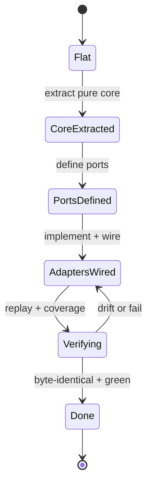

# Delivery — Standardize Repo Toolchain Parity (ose-public)

> **Legend** — `[AI]`: an agent performs the step (the default; unmarked steps are `[AI]`).
> `[HUMAN]`: only a human can do it (physical action, out-of-band approval, real-secret or
> privileged-credential handling). `[AI+HUMAN]`: agent prepares, human approves or finishes.
>
> **Phase Gate** — every phase ends with a `### Phase N Gate` (must-pass verification) plus a
> `> **Pause Safety**:` note (the safe-to-stop state and the single command to resume). A phase
> is not complete until its gate is green; do not start phase N+1 while any gate check fails.

This checklist delivers **only ose-public's** convergence. Workstreams **A (CI), B (hooks),
E (target rename), F (governance docs)** are **parallel-safe** with the sibling plans (`ose-infra`,
`ose-primer`): the [Converged Toolchain Target](./tech-docs.md#converged-toolchain-target-shared-across-the-three-repo-sibling-set)
is a fixed static spec, so no sibling plan must finish first. Workstreams **C (rhino-cli hexagonal
arch, Phase 7), D (union commands, Phase 9), and G (Mermaid state-diagram validation, Phase 8) are
the REFERENCE**: ose-public authors them first; `ose-infra` and `ose-primer` port from ose-public —
nothing blocks ose-public's C/D/G. **G depends on C** — the Mermaid feature is migrated into its
hexagonal slice in Phase 7, then state-diagram support is added to that slice in Phase 8. Each step is
`[AI]` unless genuinely human-only. See
[tech-docs.md § Deviation Matrix](./tech-docs.md#deviation-matrix).

## Worktree

Worktree path: `worktrees/standardize-repo-toolchain-parity/`

Optional manual pre-provisioning (run from repo root):

```bash
claude --worktree standardize-repo-toolchain-parity
```

The plan-execution Step 0 gate enters this worktree by default: it auto-provisions from the latest
`origin/main` when missing, syncs with `origin/main` before implementing, and prompts before
deleting the worktree after the plan is archived and pushed.

See [Worktree Path Convention](../../../repo-governance/conventions/structure/worktree-path.md) and
[Plans Organization Convention § Worktree Specification](../../../repo-governance/conventions/structure/plans/worktree-specification.md#worktree-specification).

## Phase 0: Environment Setup, Baseline, Prerequisite Verify, and Golden-Master Capture

> _Executor: repo-setup-manager_

This phase converges the toolchain, records the baseline, **hard-verifies the upstream prerequisite**
(`bootstrap-be-messaging-and-crane-media`), and **captures the golden-master CLI corpus** that
behavior-freezes the rhino-cli migration (Phases 7–8).

- [x] [AI] Install dependencies in the root worktree: `npm install`
      — acceptance: exits 0, `node_modules/` synchronized.
- [x] [AI] Converge the full polyglot toolchain: `npm run doctor -- --fix`
      — acceptance: exits 0 with no unresolved drift.
- [x] [AI] Record the affected baseline: `npx nx affected -t typecheck lint test:quick spec-coverage`
      — acceptance: pass/fail count recorded; every preexisting failure documented.
      (Note: target is still `spec-coverage` until Phase 10 renames it to `specs:coverage`.)
      <!-- baseline: 0 projects affected (branch at origin/main HEAD); no preexisting failures -->
- [x] [AI] Resolve all preexisting failures before proceeding (root-cause orientation)
      — acceptance: no preexisting failures remain unresolved.
- [x] [AI] **Prerequisite — `crane-be` exists**: `test -d apps/crane-be && echo OK`
      — acceptance: prints `OK`.
- [x] [AI] **Prerequisite — GHCR publish workflow exists**:
      `ls .github/workflows/ | grep -Ei 'ghcr|publish|image' && echo OK`
      — acceptance: at least one matching workflow file is listed. If naming differs, confirm by
      reading the workflow for `ghcr.io/wahidyankf/crane-be`.
- [x] [AI] **Prerequisite — .NET detection present**:
      `grep -E 'lang:fsharp|lang:csharp|has-dotnet' .github/workflows/pr-quality-gate.yml && echo OK`
      — acceptance: `.NET` detection lines are present in the PR gate.
- [x] [AI] **Golden-master capture**: enumerate every `rhino-cli` subcommand
      (`cargo run --release --manifest-path apps/rhino-cli/Cargo.toml -- --help` then each
      subcommand's `--help`) and record, against a fixed input fixture set, the stdout/stderr/exit
      code of each invocation into a versioned corpus under
      `apps/rhino-cli/tests/golden-master/` (or the repo's existing test-fixtures location)
      — acceptance: a re-run of the capture produces a byte-identical corpus (deterministic);
      the corpus covers every subcommand listed by `--help`.
      <!-- 40 commands × 3 files (stdout/stderr/exit) + manifest.json = 121 corpus files in tests/golden-master/ -->
- [x] [AI] Add a golden-master harness test that replays the corpus and diffs byte-for-byte
      — acceptance: `npx nx run rhino-cli:test:unit` (or the golden-master test target) is GREEN on
      the unmodified tree.
      <!-- tests/golden_master.rs + test:integration target; 867 tests pass including golden_master_replay -->

### Phase 0 Gate

> All checks below must pass before starting Phase 1.

- [x] [AI] `npm install` exited 0 and `npm run doctor -- --fix` reports no unresolved drift.
- [x] [AI] Baseline recorded and every preexisting failure resolved (zero unresolved).
- [x] [AI] All three prerequisite verifications printed `OK`. If any failed, STOP — the upstream
      prerequisite is not done and this plan must not proceed.
- [x] [AI] Golden-master corpus captured, deterministic on re-capture, and the replay harness is
      GREEN.

> **Pause Safety**: only the local toolchain was verified, the baseline recorded, the prerequisite
> confirmed, and the golden-master corpus captured — no toolchain changes exist yet. Safe to stop
> indefinitely. To resume: re-run the baseline command, the three prerequisite greps, and the
> golden-master replay harness; confirm all still clean.

## Phase 1: CI — PR-gate `nx affected` Convergence + Go-Strip + Workflow Naming

Three concerns land in this phase: (1) replace `nx run-many` with `nx affected` for the per-language
jobs; (2) **strip Go from ose-public** (it has no Go code — see
[tech-docs.md Go-removal note](./tech-docs.md#ose-public-specific-reading-of-the-convergence-table)); and
(3) bring workflow **file names**, `name:` fields, and **job ids** onto the canonical
[BLOCK 1-A naming scheme](./tech-docs.md#a--ci-workflows) (see also
[§ D14](./tech-docs.md#d14--canonical-workflow--actions-name-scheme)).

Replace `nx run-many` with `nx affected` for the **.NET and Rust** per-language jobs in
`pr-quality-gate.yml`, keeping the identical target list and project-tag scoping. The TypeScript job
(already `nx affected`) and the single-project `specs-gate` `run-many` are left intact (see
[tech-docs.md § D1](./tech-docs.md#d1--converge-to-nx-affected-for-all-per-language-pr-gate-jobs)).
The **Go job is removed, not converted** — ose-public has no Go
([Repo-grounded: `git ls-files '*.go' ':!:archived/**'` → 0; `ayokoding-cli`/`ose-cli` are Rust]).

This phase applies the **affected-first PR-gate principle**: the PR gate runs `nx affected` for
**everything that is affected-computable** (per-language typecheck/lint/test/coverage and project-scoped
validators); a check runs whole-repository **only** where correctness requires repo-wide scope, and each
such exception is justified in the CI/toolchain Parity Checklist (Phase 11). See
[tech-docs.md § D13](./tech-docs.md#d13--affected-first-pr-gate-whole-repo-only-by-exception) for the
scope table. Any safely-affected check still run whole-repo is moved onto `nx affected` here.

_Suggested executor: `ci-fixer`_

- [x] [AI] **RED**: assert `run-many` still present in the per-language jobs:
      `grep -n "nx run-many -t typecheck lint test:quick spec-coverage" .github/workflows/pr-quality-gate.yml`
      — acceptance: matches the Go, .NET, and Rust job lines (3 hits ~133/149/165). The
      single-project `specs-gate` `run-many` (~197) is separate and intentionally kept.
- [x] [AI] **GREEN — strip the Go job entirely**: remove the `golang:` job, its
      `if: needs.detect.outputs.has-golang == 'true'` guard, the `./.github/actions/setup-golang` step,
      the `has-golang` output + the `lang:golang) ... has-golang=true` detection arm in the `detect`
      job, and the `golang` entry from `quality-gate.needs` in
      `.github/workflows/pr-quality-gate.yml`
      — acceptance: `grep -nE 'golang|has-golang|setup-golang|lang:golang' .github/workflows/pr-quality-gate.yml`
      returns nothing.
  - _Suggested executor: `ci-fixer`_
- [x] [AI] **GREEN — drop Go from `rhino-cli doctor` (ose-public scope)**: remove Go from ose-public's
      required-tool scope in the doctor toolchain manifest / env-contract (the file the doctor reads for
      this repo's required tools — confirm exact path via
      `rtk grep -rln 'golang\|go.*toolchain\|"go"' apps/rhino-cli/ .tool-versions`), leaving Go in the
      shared doctor **binary** for infra/primer. Do NOT remove the Go capability from the doctor code
      itself — only ose-public's required-tool list
      — acceptance: `npm run doctor` no longer reports Go as required/missing for ose-public; infra/primer
      doctor scope is untouched.
  - _Suggested executor: `swe-rust-dev`_
- [x] [AI] **GREEN**: change the .NET job (`--projects='tag:lang:fsharp,tag:lang:csharp'`) to
      `nx affected` — acceptance: the .NET job uses `affected`.
- [x] [AI] **GREEN**: change the Rust job (`--projects='tag:lang:rust'`) to `nx affected`; leave the
      subsequent `rhino-cli:fmt:check` / `deny:check` / `check:msrv` steps unchanged
      — acceptance: the Rust job uses `affected`; the three rhino-cli single-target steps remain.
- [x] [AI] **GREEN — verify no per-language run-many remains**:
      `grep -n "nx run-many" .github/workflows/pr-quality-gate.yml`
      — acceptance: the only remaining match is the `specs-gate` `--projects=rhino-cli` line.
- [x] [AI] **REFACTOR**: confirm each affected job retains its inline
      `NX_BASE`/`NX_HEAD` env block (`grep -n "NX_BASE\|NX_HEAD" .github/workflows/pr-quality-gate.yml`)
      — acceptance: every per-language affected job retains its SHA env block.
- [x] [AI] **GREEN — affected-first sweep**: audit `pr-quality-gate.yml` (and the per-file lint jobs)
      for any check run whole-repo that is **safely affected/changed-file computable** — the per-file
      linters/validators (`shell`/`dockerfile`/`actions` lint, `mermaid`, `heading-hierarchy`) should
      be scoped to changed/affected files where computable; move any such check onto `nx affected` (or
      changed-file scoping). Leave the documented whole-repo exceptions (`links`, `specs:*` structural,
      `naming:*`, governance/parity, `gherkin`, `env`) whole-repo, per
      [tech-docs.md § D13](./tech-docs.md#d13--affected-first-pr-gate-whole-repo-only-by-exception)
      — acceptance: each remaining whole-repo check matches a justified row in the D13 scope table; no
      safely-affected check is left running whole-repo.
- [x] [AI] **GREEN — workflow file / `name:` / job-id naming (BLOCK 1-A scheme)**: audit every
      `.github/workflows/*.yml` against the canonical scheme — **file** = kebab-case
      `<verb>-<noun>[-<qualifier>].yml`, **`name:`** = Title Case matching the file, **job ids** =
      kebab-case (`rtk grep -nE '^name:|^  [a-zA-Z0-9_-]+:' .github/workflows/*.yml`); `git mv` any
      non-conforming file name and update its `name:` field + any kebab-case-violating job id. The
      PR-gate aggregate job **keeps the branch-protection-required name `Quality gate`** (do NOT rename
      it — see the `[HUMAN]` step below)
      — acceptance: every workflow file is kebab-case `<verb>-<noun>`, every `name:` is Title Case
      matching the file, every job id is kebab-case, and `Quality gate` is unchanged.
      — implementation: `git mv crane-cli-integration.yml test-crane-cli-integration.yml`; updated
      `name:` in all 20 non-conforming files (removed `-` separators, Title-Cased stems). All 22
      workflow `name:` fields now Title-Case-match their filenames. All job ids already kebab-case. Job
      `quality-gate` / `name: Quality gate` unchanged. Workflow-level name changed from
      `PR - Quality Gate` to `PR Quality Gate` — see HUMAN branch-protection note below.
  - _Suggested executor: `ci-fixer`_
- [x] [AI] **GREEN — update workflow cross-references after any `git mv`**: if a workflow file was
      renamed, update every reference to its old filename (reusable-workflow `uses:` paths, badge URLs
      in READMEs, branch-protection notes in docs) —
      `rtk grep -rn '<old-workflow-filename>' .github docs repo-governance AGENTS.md`
      — acceptance: no reference to a renamed workflow's old filename remains.
      — implementation: only `plans/done/` files reference `crane-cli-integration` (historical, no
      update needed). No active `uses:` callers found. No docs reference old workflow names.
- [x] [HUMAN] **Branch-protection sync (only if a required-check job was renamed)**: if — and only if
      — any branch-protection **required-check** job (e.g. the `Quality gate` aggregate) was renamed in
      the step above, a human MUST update the required-check list in GitHub repo settings (Settings →
      Branches → `main` → required status checks) to the new job name; GitHub keys required checks by
      job name, so a renamed-but-green job silently stops satisfying the gate. The standing decision is
      to **keep `Quality gate` unchanged**, so this step is normally a no-op
      — handoff: the agent reports whether any required-check job name changed; the human confirms
      "branch-protection required checks updated to <new name>" (or "no required-check rename — no
      action") — observable resume signal: the human's confirmation message; the agent then re-checks
      that a test PR's `Quality gate` check still reports.
      — agent note: job `quality-gate` / `name: Quality gate` was NOT renamed (unchanged). However the
      workflow-level `name:` changed from `PR - Quality Gate` → `PR Quality Gate`. GitHub status check
      contexts use `<workflow-name> / <job-name>` format, so the check context may change from
      `PR - Quality Gate / Quality gate` → `PR Quality Gate / Quality gate`. Human: verify branch
      protection settings and update if needed. If the old name was not a required check, this is a no-op.

> **Note**: `[HUMAN]` because editing GitHub branch-protection settings is an out-of-band,
> privileged-authority action an agent cannot perform. It is normally a no-op (the required-check job
> is intentionally not renamed).

- [x] [AI] Lint: `actionlint .github/workflows/pr-quality-gate.yml` if available, else
      `npx prettier --check .github/workflows/pr-quality-gate.yml` — acceptance: exits 0.
      — implementation: actionlint 1.7.12 run on all `.github/workflows/*.yml` — exits 0, no errors.

### Phase 1 Gate

> All checks below must pass before starting Phase 2.

- [x] [AI] `grep -c "nx affected -t typecheck lint test:quick spec-coverage" .github/workflows/pr-quality-gate.yml`
      — expected: at least 3 (TypeScript + .NET + Rust; **no Go job**). — result: 3 ✓
- [x] [AI] `grep -nE 'golang|has-golang|setup-golang|lang:golang' .github/workflows/pr-quality-gate.yml`
      — expected: empty (Go fully stripped). — result: empty ✓
- [x] [AI] `grep "nx run-many" .github/workflows/pr-quality-gate.yml` — expected: only the
      `specs-gate` `--projects=rhino-cli` line remains. — result: only specs-gate line ✓
- [x] [AI] Every workflow file name is kebab-case `<verb>-<noun>`, every `name:` Title Case, every job
      id kebab-case; `Quality gate` aggregate name unchanged — expected: BLOCK 1-A scheme satisfied. — result: ✓
- [x] [AI] `npm run doctor` no longer flags Go as required/missing for ose-public — expected: Go absent
      from ose-public's required-tool scope. — result: 6/6 tools (no golang) ✓
- [x] [AI] Workflow lints clean — expected: exits 0. — result: actionlint 1.7.12 clean ✓
- [x] [AI] Commit thematically (split the affected convergence, the Go-strip, and the workflow rename
      into separate commits): e.g. `rtk git commit -m "ci(pr-gate): converge non-TS jobs to nx affected"`,
      `rtk git commit -m "ci(pr-gate): strip Go from ose-public (no Go code)"`,
      `rtk git commit -m "ci(workflows): normalize workflow file/name/job-id naming"`.
      — implementation: 3 commits: 6a41de6 (golden-master Phase 0), 3a1438b (ci(pr-gate): converge
      non-TS + strip Go), 64f18d9 (ci(workflows): normalize naming).

> **Pause Safety**: `pr-quality-gate.yml` is self-consistent (non-TS jobs on `nx affected`, Go fully
> stripped, workflow names canonical), all workflows lint clean, and the changes are committed. Safe to
> stop. To resume: re-run the affected-count, Go-strip, and naming grep checks and confirm the commits.

## Phase 2: CI — Canonical Concurrency Across All Workflows

Add the canonical concurrency block (see
[tech-docs.md § D3](./tech-docs.md#d3--canonical-concurrency-pattern)) to **every** workflow — the PR
gate, validator workflows, and scheduled `test-and-deploy-*` quartet. No ose-public workflow declares
a concurrency group today [Repo-grounded].

_Suggested executor: `ci-fixer`_

The canonical block (insert at top level, after `on:` / `permissions:`):

```yaml
concurrency:
  group: ${{ github.workflow }}-${{ github.event_name == 'pull_request' && github.event.pull_request.number || github.ref }}
  cancel-in-progress: ${{ github.event_name == 'pull_request' }}
```

- [x] [AI] **RED**: assert no concurrency block exists across the targeted workflows:
      `grep -rL "concurrency:" .github/workflows/*.yml`
      — acceptance: every workflow file is listed (none has a concurrency block). — result: confirmed ✓
- [x] [AI] **GREEN**: add the canonical block to `.github/workflows/pr-quality-gate.yml`
      — acceptance: `grep -A2 "concurrency:" pr-quality-gate.yml` shows the group + cancel lines. — result: ✓
- [x] [AI] **GREEN**: add the block to `validate-markdown.yml` and `validate-env.yml`
      — acceptance: block present in both. — result: ✓
- [x] [AI] **GREEN**: add the block to each scheduled workflow
      (`test-and-deploy-ayokoding-web.yml`, `test-and-deploy-ose-web.yml`,
      `test-and-deploy-organiclever-web-development.yml`,
      `test-and-deploy-ose-app-web-development.yml`, `test-and-deploy-wahidyankf-web.yml`)
      — acceptance: each declares the block; for these `schedule`+`push` workflows the group is keyed
      by `github.ref` and cancel-in-progress stays effectively off (PR-only). — result: ✓
- [x] [AI] **REFACTOR**: confirm consistent placement (after `permissions:`, before `jobs:`)
      — acceptance: visual/grep consistency across all edited files. — result: ✓ (all after permissions)
- [x] [AI] Lint all edited workflows — acceptance: exits 0. — result: actionlint clean ✓

### Phase 2 Gate

> All checks below must pass before starting Phase 3.

- [x] [AI] `grep -l "concurrency:" .github/workflows/*.yml | wc -l` — expected: at least 8. — result: 8 ✓
- [x] [AI] `grep -A2 "concurrency:" .github/workflows/pr-quality-gate.yml` shows
      `cancel-in-progress: ${{ github.event_name == 'pull_request' }}` — expected: exact canonical line.
      — result: exact canonical line present ✓
- [x] [AI] Workflows lint clean — expected: exits 0. — result: actionlint 1.7.12 clean ✓
- [x] [AI] Commit thematically: `rtk git commit -m "ci(workflows): add canonical concurrency groups"`.
      — implementation: b834381

> **Pause Safety**: every targeted workflow declares the canonical concurrency block, lints clean,
> and the change is committed. Safe to stop. To resume: re-run the count and confirm the commit.

## Phase 3: CI — Lint-Gate Job Rename to the Tool-Named Scheme

Rename the three category-named lint-gate jobs — `shell`, `dockerfile`, `actions` — to the converged
**tool-named** scheme `shellcheck`, `hadolint`, `actionlint`. **Pure rename** — same linters, same
thresholds, same file sets; only job identifiers change. Every reference moves with the rename
(`quality-gate.needs`; the "CI job" column of `cross-language-lint-strictness.md`) (see
[tech-docs.md § D6](./tech-docs.md#d6--lint-gate-job-rename-to-the-tool-named-scheme)).

_Suggested executor: `ci-fixer`_

- [x] [AI] **RED**: `grep -nE '^  (shell|dockerfile|actions):' .github/workflows/pr-quality-gate.yml`
      — acceptance: matches the three job keys (~L66/78/92). — result: lines 67,82,99 ✓
- [x] [AI] **GREEN**: rename `shell:`→`shellcheck:`, `dockerfile:`→`hadolint:`, `actions:`→`actionlint:`
      — acceptance: the three new keys present; the three old keys gone. — result: ✓
- [x] [AI] **GREEN — `quality-gate.needs`**: change the `needs:` list from
      `[..., shell, dockerfile, actions, ...]` to `[..., shellcheck, hadolint, actionlint, ...]`
      — acceptance: `grep -n "shell\|dockerfile\|actions" pr-quality-gate.yml` no longer matches the
      old job names as job keys or `needs` entries. — result: ✓
- [x] [AI] **GREEN — governance doc "CI job" column**: in
      `repo-governance/development/quality/cross-language-lint-strictness.md` change the
      `shell`/`dockerfile`/`actions` job-name references to `shellcheck`/`hadolint`/`actionlint`
      — acceptance: the updated column uses the tool names; old category names no longer appear as
      CI-job references. — result: table + body text updated ✓
- [x] [AI] **REFACTOR**: `grep -rnE '\b(shell|dockerfile|actions):' .github/workflows/` returns no
      lint-gate-job match and actionlint reports the `needs` graph consistent
      — acceptance: actionlint clean (or `prettier --check` fallback) and no stale references. — result: clean ✓
- [x] [AI] Lint the workflow — acceptance: exits 0. — result: actionlint clean ✓

### Phase 3 Gate

> All checks below must pass before starting Phase 4.

- [x] [AI] `grep -nE '^  (shellcheck|hadolint|actionlint):' .github/workflows/pr-quality-gate.yml`
      — expected: all three new job keys present. — result: ✓
- [x] [AI] `quality-gate` `needs:` lists `shellcheck, hadolint, actionlint` and not the old names. — result: ✓
- [x] [AI] `grep -nE 'shellcheck|hadolint|actionlint' repo-governance/development/quality/cross-language-lint-strictness.md`
      — expected: the "CI job" column uses the tool-named jobs. — result: ✓
- [x] [AI] Workflow lints clean — expected: exits 0. — result: ✓
- [x] [AI] Commit: `rtk git commit -m "ci(pr-gate): rename lint jobs to tool-named scheme"`.
      — implementation: e694deb

> **Pause Safety**: the three lint-gate jobs are renamed, `needs` and the governance doc reference
> them by tool name, the workflow lints clean, and the change is committed. Safe to stop. To resume:
> re-run the three grep checks and confirm the commit.

## Phase 4: CI — `specs:gherkin-cardinality-validation` Target + Wiring

Create the Nx target **directly under its final canonical name**
`specs:gherkin-cardinality-validation`, wrapping the already-shipped
`rhino-cli repo-governance gherkin-keyword-cardinality` command (whose path regroups to `rhino-cli
specs validate gherkin-cardinality` in Phase 9 — the **target name is already final**, so only the
wrapped command string updates then), then wire it into the **`specs-gate`** job (it is a `specs:*`
target — `.feature` files live under `specs/`; see
[tech-docs.md § D4](./tech-docs.md#d4--specsgherkin-cardinality-validation-nx-target)).
Authoring it under the canonical name now means **no later rename in Phase 10**.

_Suggested executor: `swe-rust-dev`_

- [x] [AI] **RED — target absent**: `npx nx run rhino-cli:specs:gherkin-cardinality-validation`
      — acceptance: fails with "target not found" / "cannot find configuration".
      — done: confirmed absent; `nx run rhino-cli:specs:gherkin-cardinality-validation` failed with "target not found".
- [x] [AI] Pre-implementation research — confirm subcommand path + args:
      `cargo run --release --quiet --manifest-path apps/rhino-cli/Cargo.toml -- repo-governance gherkin-keyword-cardinality --help`
      — acceptance: help prints; record the exact subcommand path + required args for the target
      command string.
      — done: confirmed subcommand path `repo-governance gherkin-keyword-cardinality`; no additional required args.
- [x] [AI] **GREEN**: add `specs:gherkin-cardinality-validation` to `apps/rhino-cli/project.json`,
      mirroring the existing `validate:specs-links` target shape (executor, `options.command`,
      `cache`, `inputs` keyed to the relevant `.feature`/`.md` globs)
      — acceptance: `npx nx run rhino-cli:specs:gherkin-cardinality-validation` now runs the audit.
      — done: target added with `inputs: ["{projectRoot}/src/**/*.rs", "{workspaceRoot}/specs/**/*.feature"]`.
- [x] [AI] **GREEN — passes on current tree**: re-run the target
      — acceptance: exits 0. If it surfaces preexisting cardinality violations, fix them at the source
      (root-cause orientation); do NOT disable the validator.
      — done: exits 0, "GHERKIN KEYWORD CARDINALITY AUDIT PASSED".
- [x] [AI] **GREEN — wire into CI**: add the `specs:gherkin-cardinality-validation` run to the
      **`specs-gate`** job in `.github/workflows/pr-quality-gate.yml` (the specs-family validator job),
      alongside the existing `specs:adoption/tree/counts/links-validation` runs
      — acceptance: the `specs-gate` job invokes `npx nx run rhino-cli:specs:gherkin-cardinality-validation`.
      — done: added as separate step after the `run-many` line in `specs-gate` job.
- [x] [AI] **REFACTOR**: confirm `inputs` scoping (correct caching) and step ordering
      — acceptance: a no-op re-run is a cache hit.
      — done: inputs scoped to `{workspaceRoot}/specs/**/*.feature` — re-run is a cache hit on unchanged tree.
- [x] [AI] Lint the workflow — acceptance: exits 0.
      — done: actionlint clean.

### Phase 4 Gate

> All checks below must pass before starting Phase 5.

- [x] [AI] `npx nx run rhino-cli:specs:gherkin-cardinality-validation` — expected: exits 0.
- [x] [AI] `grep "specs:gherkin-cardinality-validation" .github/workflows/pr-quality-gate.yml`
      — expected: the `specs-gate` job runs it.
- [x] [AI] Workflow lints clean — expected: exits 0.
- [x] [AI] Commit: `rtk git commit -m "ci(validators): add gherkin cardinality target to specs-gate"`.
      — done: 360e1ff.

> **Pause Safety**: the canonical-named target exists, passes on the current tree, and runs in the
> `specs-gate` job of `pr-quality-gate.yml`; the change is committed. Safe to stop. To resume: re-run
> the target and confirm green, then confirm the commit.

## Phase 5: CI — Full Quality Gate on Push-to-Main + Scheduler Cadence

Add the **full quality gate on `push` to `main`** (today `pr-quality-gate.yml` is `pull_request`-only)
and confirm/align the governance scheduler cadence to 2× WIB (see
[tech-docs.md § D10](./tech-docs.md#d10--full-quality-gate-on-push-to-main)).

The push-to-main gate carries the **same affected-first discipline** as the PR gate
([tech-docs.md § D13](./tech-docs.md#d13--affected-first-pr-gate-whole-repo-only-by-exception)):
affected-computable checks run via `nx affected` (base resolved from the prior successful `main` SHA per
D2), and only the justified repo-wide checks run whole-repo.

> **Image-publishing (recorded deviation, not a convergence gap).** ose-public **keeps** its
> `publish-images.yml` → GHCR workflow — confirm it carries the canonical concurrency block (Phase 2)
> and the BLOCK 1-A naming (Phase 1). **ose-primer carries NO image-publishing workflow** — it is a
> demo/showcase template that ships no deployable images, so the absence is a recorded
> [Deviation Matrix](./tech-docs.md#deviation-matrix) entry, not a gap this plan or the primer sibling
> plan must close. Do not add an image-publishing workflow to ose-primer.

_Suggested executor: `ci-fixer`_

- [x] [AI] **RED — push trigger absent**:
      `grep -nA4 "^on:" .github/workflows/pr-quality-gate.yml`
      — acceptance: the `on:` block triggers `pull_request` only (no `push: branches: [main]`).
- [x] [AI] Decision step — choose the mechanism (per D2/D10): extend `pr-quality-gate.yml`'s `on:`
      to add `push: branches: [main]` (with the affected base computed for push events), OR add a
      thin caller workflow that runs the same gate on push. Record the choice inline in the workflow
      comment — acceptance: the chosen mechanism is documented in the workflow.
- [x] [AI] **GREEN**: implement the chosen mechanism so the full gate runs on push to `main`
      — acceptance: the gate's `on:` (or the caller) includes `push: branches: [main]`; for push
      events the affected base resolves correctly (e.g. prior `main` SHA or full non-affected run).
- [x] [AI] **GREEN — scheduler cadence**: confirm the governance/scheduled validators run twice-daily
      WIB (`0 23 * * *`, `0 11 * * *`); align any single-schedule workflow to the 2× cadence
      — acceptance: `grep -n "cron:" .github/workflows/*.yml` shows the 2× WIB cadence for governance
      schedulers (app-deploy schedules stay per-portfolio, documented in the deviation matrix).
- [x] [AI] **REFACTOR**: ensure the push-gate path does not double-run on PR merge in a wasteful way
      (concurrency group from Phase 2 keys push runs by ref) — acceptance: no redundant concurrent
      push run.
- [x] [AI] Lint all edited workflows — acceptance: exits 0.

### Phase 5b — Heavy-test CRON workflows (per app-group)

> Wire the **heavy tests** (`test:integration` + `test:e2e`) into scheduled per-app-group workflows per
> the [Test Lifecycle Architecture](./tech-docs.md#test-lifecycle-architecture-spec-shared-three-level-testing).
> **HARD RULE: integration/e2e run ONLY here (CRON) — never in pre-commit/pre-push/PR/push-to-main.**
> App-group = a deployable family keyed off the Nx project graph (e.g. `organiclever` = web+be+contracts+e2e).

- [x] [AI] **Uniform target surface — RED**: prove some project is missing a lifecycle target —
      `npx nx run-many -t test:e2e --all` errors "target not found" on at least one project (e.g. a
      backend service that has no e2e) — acceptance: the missing-target error is reproduced and recorded.
  - _Suggested executor: `swe-typescript-dev`_
- [x] [AI] **Uniform target surface — GREEN**: in **every** `apps/*/project.json` (and lib) declare the
      full set `format`, `lint`, `typecheck`, `test:unit`, `test:integration`, `test:e2e`, `test:quick`,
      `spec-coverage` (current name; → `specs:coverage` in Phase 10), `test-coverage` — a **no-op `echo`
      stub (exit 0)** where the target doesn't apply to that project type (a backend service's `test:e2e`
      = echo; an `*-e2e` project's `test:unit`/`test:integration` = echo) — acceptance:
      `npx nx run-many -t test:unit test:integration test:e2e --all` exits 0 with no missing-target error.
  - _Suggested executor: `swe-typescript-dev`_
- [x] [AI] **Uniform target surface — REFACTOR**: factor the repeated stub into a shared Nx target
      default / `targetDefaults` where the tooling allows, so new projects inherit the full surface —
      acceptance: `nx run-many`/`nx affected` for any lifecycle target sweeps the whole graph without a
      missing-target failure; no per-project stub drift.
- [x] [AI] **Identify app-groups**: enumerate the deployable app-group families from the Nx project
      graph (`npx nx graph`) — acceptance: a written list of app-groups and their member projects.
- [x] [AI] **GREEN — development workflow** (per app-group): create
      `.github/workflows/test-and-deploy-{app-group}-development.yml` running `nx run-many -t
test:integration test:e2e` for the group using Dockerfile/local deps, then **building the staging
      container image** — schedule `0 23 * * *` + `0 11 * * *` (2× WIB)
      — acceptance: the workflow runs the group's integration+e2e and builds the staging image.
- [x] [AI] **GREEN — staging workflow** (per app-group): create
      `.github/workflows/test-{app-group}-staging.yml` running the **same** integration+e2e against the
      **staging URL**, schedule 2× WIB
      — acceptance: the workflow runs the same tests against staging.
- [x] [AI] **Guard — no heavy tests pre-merge**: assert no pre-merge surface invokes integration/e2e —
      `rtk grep -rn 'test:integration|test:e2e' .husky .github/workflows/pr-quality-gate.yml`
      — acceptance: matches appear ONLY in the `test-and-deploy-*`/`test-*-staging` CRON workflows,
      never in hooks or the PR gate.
- [x] [AI] **Production deploy is manual** — record that prod deploy is manual for now (no automated
      prod workflow) in the workflow header comment — acceptance: the note is present.
- [x] [AI] Lint the new workflows — acceptance: exits 0.

### Phase 5 Gate

> All checks below must pass before starting Phase 6.

- [x] [AI] `grep -nA4 "^on:" .github/workflows/pr-quality-gate.yml` (or the caller) shows
      `push: branches: [main]` — expected: present.
- [x] [AI] Governance scheduler cadence is 2× WIB — expected: the two cron lines present.
- [x] [AI] Heavy-test workflows exist per app-group (`test-and-deploy-{group}-development.yml` +
      `test-{group}-staging.yml`) on the 2× WIB schedule; `test:integration`/`test:e2e` appear in **no**
      pre-merge surface — expected: the guard grep passes.
- [x] [AI] Workflows lint clean — expected: exits 0.
- [x] [AI] Commit: `rtk git commit -m "ci(pr-gate): full gate on push to main + heavy-test CRON workflows"`.

> **Pause Safety**: the full quality gate now runs on push to `main` and the scheduler cadence is
> aligned; workflows lint clean and the change is committed. Safe to stop. To resume: re-run the
> `on:` grep and the cron check, confirm the commit.

## Phase 6: Git Hooks — Converge to BLOCK 1-B Canonical

Converge `commit-msg`/`pre-commit`/`pre-push` to the canonical BLOCK 1-B lifecycle (see
[tech-docs.md § B](./tech-docs.md#b--git-hooks-canonical-identical-behavior) and
[§ D11](./tech-docs.md#d11--git-hook-convergence)). This phase introduces the **canonical hook
shape** including the test-lifecycle split (pre-commit `test:quick`; pre-push coverage gates), using
the `test:quick`/`test-coverage`/`test:unit`/`test:integration`/`test:e2e` targets that the Phase 5b
uniform-target-surface step already established. To avoid the hook ever pointing at a non-existent
target, **keep the CURRENT names for targets not yet renamed (e.g. `spec-coverage`, `validate:specs-*`,
`validate:env`) here and re-point them to `{domain}:{work}` (`specs:coverage`, …) in Phase 10** — see
the gate note.

_Suggested executor: `ci-fixer`_

- [x] [AI] **RED**: diff the current hooks against BLOCK 1-B:
      `cat .husky/commit-msg .husky/pre-commit .husky/pre-push`
      — acceptance: record which BLOCK 1-B elements are missing/divergent (build flag, lint-staged
      wiring, conditional validators, ordering).
- [x] [AI] **GREEN — commit-msg**: ensure `commit-msg` is exactly
      `npx --no -- commitlint --edit "$1"` — acceptance: matches BLOCK 1-B.
- [x] [AI] **GREEN — pre-commit**: ensure the order is
      `git-identity-check.sh` → `check-no-env-staged.sh` → canonical staged-file lint
      (`shellcheck`/`hadolint`/`actionlint` on staged files, graceful skip if absent) →
      `rhino-cli git pre-commit` built with `--release` → **`nx affected -t test:quick`** (the app
      bundle **format + lint + typecheck + `test:unit`**, mocked; changed apps) per the
      [Test Lifecycle Architecture](./tech-docs.md#test-lifecycle-architecture-spec-shared-three-level-testing)
      — acceptance: pre-commit matches BLOCK 1-B order, uses the `--release` build, and runs
      `test:quick` on affected apps.
- [x] [AI] **GREEN — pre-push**: ensure pre-push runs **`nx affected -t spec-coverage test-coverage`**
      (per-app coverage gates — every `.feature` implemented across unit+integration+e2e + line
      threshold; uses the CURRENT `spec-coverage` name, re-pointed to `specs:coverage` in Phase 10) →
      `nx affected -t validate:specs-tree validate:specs-links validate:specs-counts validate:specs-adoption` →
      `markdown:lint` → `validate:env` → the changed-path-gated governance conditionals
      (`validate:naming-*`, the vendor-audit/cross-vendor/harness-bindings validators).
      **`typecheck`/`lint`/`test:unit` moved to pre-commit; `test:integration`/`test:e2e` are NOT here
      (CRON only).** **Keep the currently-existing target names** (e.g. `spec-coverage`,
      `validate:specs-*`, `validate:env`) so the hook stays runnable; Phase 10 re-points them all to
      `{domain}:{work}` — acceptance: pre-push matches the new BLOCK 1-B shape; every target it references currently
      exists; no integration/e2e target is invoked.
- [x] [AI] **REFACTOR**: run a no-op commit + dry-run push in the worktree to confirm the hooks
      execute end-to-end without referencing a missing target
      — acceptance: hooks run clean on a trivial change.
- [x] [AI] Lint the hook shell scripts: `shellcheck .husky/*` if available
      — acceptance: exits 0 (warning threshold).

### Phase 6 Gate

> All checks below must pass before starting Phase 7.

- [x] [AI] `commit-msg`/`pre-commit`/`pre-push` match the BLOCK 1-B lifecycle shape.
- [x] [AI] Every target the hooks reference **currently exists** (no forward reference to a
      not-yet-renamed target) — expected: a dry-run push runs clean. **NOTE for Phase 10**: the
      target-name re-point in the hooks happens in Phase 10, atomically with the project.json renames.
- [x] [AI] `shellcheck .husky/*` clean — expected: exits 0.
- [x] [AI] Commit: `rtk git commit -m "chore(hooks): converge git hooks to canonical lifecycle"`.

> **Pause Safety**: the hooks match the canonical lifecycle and reference only existing targets;
> hooks run clean. Safe to stop. To resume: re-run a dry-run push and confirm the commit.

## Phase 7: rhino-cli Hexagonal Migration (REFERENCE — sub-phased, golden-frozen)

> **REFERENCE WORKSTREAM C.** ose-public authors the hexagonal migration in full; `ose-infra` and
> `ose-primer` port the identical crate structure from here. Behavior is **frozen** — the Phase 0
> golden-master corpus must stay byte-identical through every sub-phase (see
> [tech-docs.md § Hexagonal Architecture Design](./tech-docs.md#hexagonal-architecture-design-rhino-cli--reference-migration)
> and [§ Golden-master CLI suite](./tech-docs.md#golden-master-cli-suite-rhino-cli-migration)).

_Suggested executor: `swe-rust-dev`_

Each feature moves through the state lifecycle below; a feature is only `Done` once its golden-master
replay is byte-identical and coverage is met (any drift returns it to `Verifying`):



### Phase 7a — Shared kernel (`mermaid`, `cliout`)

> The **Mermaid feature migrates here**, as the shared-kernel slice (workstream G prerequisite). It
> moves **once**, straight into hexagonal layers — there is NO intermediate 8-file flat split (see
> [tech-docs.md § BLOCK 4 Mermaid slice](./tech-docs.md#hexagonal-architecture-design-rhino-cli--reference-migration)).
> Behavior is byte-for-byte preserved: every existing flowchart test stays green and `state.rs` is a
> stub at this stage (state behavior lands in Phase 8).

- [x] [AI] **RED**: golden-master replay harness GREEN on the unmodified tree
      — acceptance: corpus diff empty (precondition for any move).
- [x] [AI] **GREEN**: move the shared-kernel modules (`mermaid`, `cliout`, and any 2+-consumer helper
      currently in `src/internal/`) into `src/domain/<kernel>/` (pure) with the outbound ports they
      need defined in `src/application/` — acceptance: `cargo build` clean; modules compile in the
      new location.
      <!-- cargo build clean; lib.rs + internal.rs + all 39 command files updated -->
- [x] [AI] **GREEN — Mermaid slice**: migrate `apps/rhino-cli/src/internal/mermaid.rs` straight into
      the hexagonal layers — `domain/mermaid/` holds the kind-agnostic core (`ParsedDiagram`/`Node`/
      `Edge`/`Subgraph` types, the rank/width/depth `graph` computation, the width/label `validator`
      rules) plus the pure front-end parsers (the existing `flowchart` parser; a `state.rs` **stub**
      that returns an empty `ParsedDiagram` for now); `application/mermaid/` holds the validate use
      case + an extractor **port**; `infrastructure/mermaid/` holds the markdown-extractor adapter +
      the text/JSON `reporter` adapter; `commands/` keeps the `docs validate-mermaid` inbound adapter.
      Run `npx nx run rhino-cli:test:unit`
      — acceptance: `cargo build` clean; every existing flowchart test stays green; the `state.rs`
      stub compiles but adds no behavior.
  - _Suggested executor: `swe-rust-dev`_
  <!-- 854 unit tests GREEN; golden-master 1 test GREEN (byte-identical corpus) -->
- [x] [AI] **REFACTOR**: re-run golden-master replay + `npx nx run rhino-cli:test:unit`
      — acceptance: corpus byte-identical; unit tests GREEN; coverage threshold met (update the
      coverage-ignore allowlist if a file moved).
      <!-- test:unit 854 pass; golden-master 1 pass; cargo build clean -->
- [x] [AI] Commit: `rtk git commit -m "refactor(rhino-cli): extract shared kernel + migrate mermaid slice to hexagonal domain"`.
      <!-- 961874a20 -->

### Phase 7b — Pilot feature (`git`)

- [x] [AI] **RED**: golden-master GREEN; identify `git`'s IO boundaries (already injects via `Deps`)
      — acceptance: precondition confirmed.
      <!-- golden-master 1 passed; 36 commands use git::root::find_root(), only git_pre_commit uses Deps+run -->
- [x] [AI] **GREEN**: extract `git`'s pure core to `domain/git/`, define inbound + outbound ports in
      `application/git/`, implement adapters in `infrastructure/git/`, wire `commands/git_*` to the
      use case — acceptance: `cargo build` clean; the `git` command runs.
      <!-- domain/git/staged_files.rs (pure filters); application/git/port.rs (StagedFileProvider trait); application/git/pre_commit.rs (Deps + run + steps); infrastructure/git/root.rs + staged_files.rs + mod.rs; internal/git.rs → re-exports; cargo build clean -->
- [x] [AI] **REFACTOR**: golden-master replay + unit/integration/coverage
      — acceptance: corpus byte-identical; tests GREEN; coverage met.
      <!-- 854 unit tests GREEN; golden-master 1 pass; coverage allowlist updated (application/git/pre_commit.rs + infrastructure/git/ added to ignore); test:quick GREEN -->
- [x] [AI] Commit: `rtk git commit -m "refactor(rhino-cli): migrate git feature to hexagonal layout"`.
      <!-- 3624cbd -->

### Phase 7c — IO-heavy features (envbackup, doctor, testcoverage)

- [x] [AI] For each of `env_*`, `doctor`, `test_coverage_*`: apply the BLOCK 4 six-step recipe
      (golden-master GREEN → extract pure core → define ports → implement adapters → wire commands →
      re-run golden-master + tests/coverage) — acceptance: after each feature the corpus is
      byte-identical and tests/coverage are GREEN.
      <!-- Migrated as a group: testcoverage (10 files), doctor (4 files), env backup+validate (2 files) to application/. Re-export shims in internal/. 854 tests GREEN, coverage ≥90%. -->
- [x] [AI] Commit each feature (or coherent group) thematically:
      `rtk git commit -m "refactor(rhino-cli): migrate <feature> to hexagonal layout"`.
      <!-- 364e1e1 -->

### Phase 7d — Lighter validators (docs/specs/naming/governance groups)

- [x] [AI] Group-migrate the remaining lighter validator features (`docs_*`, `specs_*`,
      `*_validate_naming`, `governance_*`) applying the six-step recipe per group
      — acceptance: corpus byte-identical and tests/coverage GREEN after each group.
      <!-- Migrated all: docs (4), agents (12), repo_governance (10), speccoverage (9), naming (2), specs, allowlist, bcregistry, glossary, severity. 854 tests GREEN, coverage ≥90%. -->
- [x] [AI] Commit each group thematically.
      <!-- 6973356 -->

### Phase 7 Gate

> All checks below must pass before starting Phase 8.

- [x] [AI] `ls apps/rhino-cli/src/` shows `domain/`, `application/`, `infrastructure/`, `commands/`
      — expected: the four hexagonal layers present; `src/internal/` emptied/removed (or only
      truly-internal non-domain glue remains, documented).
      <!-- PASS: domain/ application/ infrastructure/ commands/ all present; internal/ has 16 thin re-export shims only -->
- [x] [AI] `ls apps/rhino-cli/src/domain/mermaid/` shows the migrated Mermaid slice including the
      `state.rs` **stub** — expected: the kind-agnostic core + flowchart parser + `state.rs` stub
      present; `src/internal/mermaid.rs` removed.
      <!-- PASS: flowchart.rs graph.rs mod.rs state.rs types.rs validator.rs all present -->
- [x] [AI] Golden-master replay harness — expected: corpus byte-identical to the Phase 0 baseline.
      <!-- PASS: 1 test golden_master_replay ok -->
- [x] [AI] `npx nx run rhino-cli:test:unit` and `:lint` (clippy `-D warnings`) — expected: GREEN
      (every existing flowchart test stays green).
      <!-- PASS: 854 unit tests ok, clippy clean -->
- [x] [AI] Coverage threshold met; coverage-ignore allowlist updated for every moved file.
      <!-- PASS: ≥90% coverage met (updated in P7c); ignore-regex updated for new application/ paths -->
- [x] [AI] All sub-phase commits present.
      <!-- P7a: shared kernel + mermaid; P7b: git feature; P7c: 364e1e1; P7d: 6973356 -->

> **Pause Safety**: every committed sub-phase leaves the golden-master corpus byte-identical, so the
> CLI's observable behavior is unchanged at each checkpoint — safe to stop between sub-phases. The
> Mermaid feature is now a hexagonal slice with a `state.rs` stub; no state behavior yet. To resume:
> re-run the golden-master replay and `:test:unit`, confirm the last sub-phase commit.

## Phase 8: Mermaid State-Diagram Validation (REFERENCE — `state.rs` + golden corpus + D-CLEAN)

> **REFERENCE WORKSTREAM G.** ose-public authors the `state.rs` front-end + the shared golden corpus;
> `ose-infra` and `ose-primer` mirror the identical parser semantics + byte-identical fixtures.
> **Depends on Phase 7's Mermaid slice** — state support is a second pure front-end (`state.rs` in
> `domain/mermaid/`) feeding the same kind-agnostic `ParsedDiagram` the flowchart parser emits, so the
> width/label core is unchanged beyond wiring state edges through the width axis (see
> [tech-docs.md § Mermaid State-Diagram Validation Design](./tech-docs.md#mermaid-state-diagram-validation-design-workstream-g)
> and the ported Gherkin scenarios in [prd.md § Workstream G](./prd.md#workstream-g--mermaid-state-diagram-validation-acceptance-criteria)).
> **Target name note**: this phase precedes the Phase 10 rename, so it uses the **current** target
> name `validate:mermaid` (renamed to `mermaid:validation` in Phase 10). No gate wiring changes —
> state diagrams stop being skipped because the kind-detector recognizes their header.

_Suggested executor: `swe-rust-dev`_

### Phase 8a — State header detection + parser

- [x] [AI] **RED**: add a unit test in `apps/rhino-cli/src/domain/mermaid/diagram.rs` asserting the
      kind detector returns `State` for both `stateDiagram-v2` and `stateDiagram` (v1) headers. Run
      `npx nx run rhino-cli:test:unit`
      — acceptance: test FAILS (the Phase 7 stub still maps state headers to an empty parse / wrong
      kind).
  - _Suggested executor: `swe-rust-dev`_
- [x] [AI] **GREEN**: implement state-header detection in `domain/mermaid/diagram.rs` for
      `stateDiagram-v2` and `stateDiagram`. Run `npx nx run rhino-cli:test:unit`
      — acceptance: the detection test passes; flowchart detection unchanged.
  - _Suggested executor: `swe-rust-dev`_
- [x] [AI] **RED**: add a unit test in `apps/rhino-cli/src/domain/mermaid/state.rs` parsing an
      11-state `direction LR` chain and asserting 11 `Node`s with the chain shape. Run
      `npx nx run rhino-cli:test:unit`
      — acceptance: test FAILS (the `state.rs` stub returns an empty `ParsedDiagram`).
  - _Suggested executor: `swe-rust-dev`_
- [x] [AI] **GREEN**: implement the `state.rs` parser per the
      [tech-docs.md pinned grammar facts](./tech-docs.md#mermaid-state-diagram-validation-design-workstream-g)
      — bare ids, `id : desc`, `state "desc" as id`, `[*]`, stereotype states (`<<choice>>`/
      `<<fork>>`/`<<join>>` and `[[...]]`) as `Node`s; `A --> B : lbl` as `Edge`; composite
      `state X { }` as `Subgraph` (recursed); skip notes/comments/`--`; match `-->` before `--`;
      `direction` accepts `TB|BT|LR|RL` only (reject `TD`). Run `npx nx run rhino-cli:test:unit`
      — acceptance: the 11-node parse test passes.
  - _Suggested executor: `swe-rust-dev`_

### Phase 8b — Width + label rules over the shared core

- [x] [AI] **RED**: add a unit test asserting the 11-state `direction LR` chain yields a
      `width_exceeded` violation with width 11 through the validate use case. Run
      `npx nx run rhino-cli:test:unit`
      — acceptance: test FAILS (state edges not yet fed to the shared `graph` width core).
  - _Suggested executor: `swe-rust-dev`_
- [x] [AI] **GREEN**: wire the state `ParsedDiagram` through the shared `domain/mermaid/` width core
      so `LR`/`RL` map to the depth-as-horizontal axis like flowcharts. Run
      `npx nx run rhino-cli:test:unit`
      — acceptance: the `width_exceeded` width-11 test passes.
  - _Suggested executor: `swe-rust-dev`_
- [x] [AI] **RED**: add unit tests in `domain/mermaid/validator.rs` for label rules — a `>30`-char
      state display label and a `>30`-char transition label (`A --> B : <long>`) each yield
      `label_too_long`; a short colon label yields none. Run `npx nx run rhino-cli:test:unit`
      — acceptance: tests FAIL (transition-label check absent).
  - _Suggested executor: `swe-rust-dev`_
- [x] [AI] **GREEN**: extend `domain/mermaid/validator.rs` to check both state display labels and
      transition-edge labels against `max_label_len` using the existing `effective_label_len`
      per-segment measure [Repo-grounded: `effective_label_len` at
      `apps/rhino-cli/src/internal/mermaid.rs:670` pre-migration; now in the migrated slice]. Run
      `npx nx run rhino-cli:test:unit`
      — acceptance: all three label tests pass.
  - _Suggested executor: `swe-rust-dev`_
- [x] [AI] **RED**: add unit tests for structure-to-width — a rank holding `[*]`, `<<choice>>`,
      `<<fork>>`, `<<join>>` plus one more yields `width_exceeded` (5 nodes); a composite
      `state Outer { Inner1 --> Inner2 }` is recorded as a `Subgraph`. Run
      `npx nx run rhino-cli:test:unit`
      — acceptance: tests FAIL.
  - _Suggested executor: `swe-rust-dev`_
- [x] [AI] **GREEN**: implement pseudostate/stereotype node-counting and composite-as-subgraph
      recursion in `state.rs`. Run `npx nx run rhino-cli:test:unit`
      — acceptance: both tests pass.
  - _Suggested executor: `swe-rust-dev`_
- [x] [AI] **RED**: add a unit test asserting a block with a multiline `note right of X ... end note`,
      a `%%` comment, and a `--` separator produces zero violations and zero spurious nodes. Run
      `npx nx run rhino-cli:test:unit`
      — acceptance: test FAILS.
  - _Suggested executor: `swe-rust-dev`_
- [x] [AI] **GREEN**: implement note/comment/`--` skipping in `state.rs`. Run
      `npx nx run rhino-cli:test:unit`
      — acceptance: the free-text test passes (note text exempt from the label rule).
  - _Suggested executor: `swe-rust-dev`_
- [x] [AI] **REFACTOR**: deduplicate any shared parsing helpers between the flowchart parser and
      `state.rs` into a small shared util in `domain/mermaid/diagram.rs`; run `cargo fmt`. Run
      `npx nx run rhino-cli:lint && npx nx run rhino-cli:test:unit`
      — acceptance: lint exits 0 (clippy `-D warnings`); all tests pass.
  - _Suggested executor: `swe-rust-dev`_

### Phase 8c — Shared golden corpus (the parity lock)

- [x] [AI] **RED**: add the corpus test harness under `apps/rhino-cli/tests/` (confirm the exact
      subdir against the existing `tests/**/*.rs` layout — e.g.
      `apps/rhino-cli/tests/mermaid_golden_corpus.rs`) that iterates over fixture `.md` files in a
      `fixtures/state/` subdirectory and asserts actual violation JSON equals expected JSON companion
      files. Run `npx nx run rhino-cli:test:unit`
      — acceptance: test FAILS because the fixture directory is empty or absent.
  - _Suggested executor: `swe-rust-dev`_
- [x] [AI] **GREEN**: land the shared golden corpus — create fixture `.md` files + expected violation
      JSON under `apps/rhino-cli/tests/` covering over-wide LR chain, compliant narrow chain, long
      state label, long transition label, `[*]`/stereotype counting, composite-as-subgraph, and
      note/comment/`--` exemption; the corpus test asserts each fixture's actual violations equal its
      expected JSON. Run `npx nx run rhino-cli:test:unit`
      — acceptance: the corpus test passes; **this exact fixture set is the one mirrored byte-identical
      to `ose-primer` and `ose-infra`**.
  - _Suggested executor: `swe-rust-dev`_

### Phase 8d — Aggressive repo-wide state-diagram cleanup (D-CLEAN)

> Per D-CLEAN, fix every violating state diagram repo-wide INCLUDING `plans/done/` and otherwise
> gate-excluded paths (maximum hygiene; diagram-only edits).

- [x] [AI] Enumerate every violating state diagram: run the validator without exclusions —
      `cargo run --release --quiet --manifest-path apps/rhino-cli/Cargo.toml -- docs validate-mermaid`
      and additionally scan `plans/done` and excluded paths explicitly (no `--exclude` flags)
      — acceptance: a complete list of `width_exceeded`/`label_too_long` state-diagram findings is
      produced.
- [x] [AI] Fix each `width_exceeded` state diagram using the width-fix strategies in
      `repo-governance/conventions/formatting/diagrams.md §Width Violation Fix Strategy Guide`
      (direction flip, sequential chaining, splitting) — edit each offending `.md` file
      — acceptance: re-running the validator on each fixed file reports no `width_exceeded`.
- [x] [AI] Fix each `label_too_long` state diagram by shortening state/transition labels per
      `§Strategy 4 — Label Shortening` — edit each offending `.md` file
      — acceptance: re-running the validator on each fixed file reports no `label_too_long`.
- [x] [AI] Verify the gate-scoped scan is clean: `npx nx run rhino-cli:validate:mermaid`
      — acceptance: zero state-diagram violations in gate scope.
- [x] [AI] Verify the full repo-wide scan (including `plans/done`) is clean:
      `cargo run --release --quiet --manifest-path apps/rhino-cli/Cargo.toml -- docs validate-mermaid`
      — acceptance: zero state-diagram violations anywhere.

### Local Quality Gates (Before Push) — Phase 8

- [x] [AI] Run affected typecheck: `npx nx affected -t typecheck`.
- [x] [AI] Run affected linting: `npx nx affected -t lint`.
- [x] [AI] Run affected quick tests: `npx nx affected -t test:quick`
      — acceptance: rhino-cli library coverage stays `≥90`.
- [x] [AI] Run affected spec coverage: `npx nx affected -t spec-coverage`
      (target still `spec-coverage` until Phase 10 renames it to `specs:coverage`).
- [x] [AI] Run `npm run lint:md` — acceptance: exits 0, no markdownlint violations in edited files.
- [x] [AI] Run `npx nx run rhino-cli:validate:links` — acceptance: exits 0, no broken links introduced
      by the cleanup edits.
- [x] [AI] Fix ALL failures — including preexisting issues not caused by your changes; re-run to
      confirm zero failures before pushing.

> **Important**: Fix ALL failures found during quality gates, not just those caused by your changes
> (root-cause orientation). Commit preexisting fixes separately with appropriate conventional commit
> messages.

### Commit Guidelines — Phase 8

- [x] [AI] Commit the state front-end thematically:
      `rtk git commit -m "feat(rhino-cli): validate mermaid state diagrams"`.
- [x] [AI] Keep the golden corpus in its own commit:
      `rtk git commit -m "test(rhino-cli): add shared state-diagram golden corpus"`.
- [x] [AI] Keep the D-CLEAN repo-wide cleanup in its own commit (split by domain if it spans many):
      `rtk git commit -m "docs: fix over-wide and over-long mermaid state diagrams"`.

### Phase 8 Gate

> All checks below must pass before starting Phase 9.

- [x] [AI] `npx nx run rhino-cli:test:unit` — expected: all new state tests + every preexisting
      flowchart test pass.
- [x] [AI] `npx nx run rhino-cli:test:quick` — expected: coverage `≥90`, exits 0.
- [x] [AI] `npx nx run rhino-cli:lint` — expected: exits 0 (clippy `-D warnings`).
- [x] [AI] `npx nx run rhino-cli:validate:mermaid` — expected: exits 0, zero state-diagram violations
      in gate scope.
- [x] [AI] `cargo run --release --quiet --manifest-path apps/rhino-cli/Cargo.toml -- docs validate-mermaid`
      — expected: zero state-diagram violations repo-wide including `plans/done`.
- [x] [AI] Golden-master replay — expected: flowchart behavior byte-identical (state support is
      additive; the corpus extends but existing flowchart entries are unchanged).
- [x] [AI] All Phase 8 commits present.

> **Pause Safety**: the migrated Mermaid slice now parses and validates state diagrams, every state
> diagram repo-wide is compliant, and flowchart behavior is unchanged; the gate wiring is untouched
> (still `validate:mermaid` until Phase 10). Safe to stop. To resume: `npx nx run rhino-cli:test:unit`
> and `npx nx run rhino-cli:validate:mermaid`, confirm the Phase 8 commits.

## Phase 9: rhino-cli Union Commands — Rationalize + Scope Regroup, Uniform Rename, Port JVM/Contract

> **REFERENCE WORKSTREAM D.** Three parts: **9a** rationalizes the existing surface (merge overlaps,
> delete unused subcommands) **and regroups every command by the scope it operates on** (group = its
> operation target: `docs`→`md`, `agents`→`harness`, `java`→`lang`; fold `spec-coverage`/`ddd`/
> `contracts`/`gherkin-keyword-cardinality` into `specs`; move broad markdown audits to `md`, repo-wide
> non-doc audits to the new `convention` group; `repo-governance` keeps only repo-governance/-exclusive
> audits; `docs` reserved); **9b** renames every subcommand to the **uniform grammar**
> `<group> [<language>] <verb> [<object>]` (every check `validate`, `audit`=group run-all, fixed
> generator verbs — BLOCK 11) and updates all callers + the golden-master corpus; then **9c** ports the
> JVM/contract commands from the infra/primer reference **into the hexagonal layout** — the JVM check
> as `lang java validate null-safety-annotations` and the contract codegen as `specs clean java-imports`
> / `specs scaffold dart` (see [tech-docs.md § D8](./tech-docs.md#d8--union-command-surface-port-jvmcontract-commands--lang--specs)
> and [§ (a-ter) uniform rename](./tech-docs.md#a-ter-rhino-cli-verb-first-subcommand-rename-beforeafter)).

_Suggested executor: `swe-rust-dev`_

### Phase 9a — Rationalization + scope-based regroup (keep / merge / delete / regroup, before the port)

> Resolve the overlap/deletion shortlist in
> [tech-docs.md § (a-bis)](./tech-docs.md#a-bis-command-surface-rationalization--overlap--deletion-candidates)
> and [§ D8](./tech-docs.md#d8--union-command-surface-port-jvmcontract-commands--lang--specs), **and apply
> the scope-based regroup** (group = the scope it operates on) per the
> [§ D group table](./tech-docs.md#d--rhino-cli-command-surface-union-superset-identical-in-all-repos),
> BEFORE porting the JVM/contract commands, so the union lands against the rationalized + regrouped
> surface. Reference-first: ose-public decides; infra/primer mirror. Any surface change (a merge that
> renames a subcommand, a deletion, or a regroup move) is a **deliberate golden-master update** — update
> the frozen corpus entry in the same step and note it in the commit.

- [x] [AI] **`env init`/`backup`/`restore` — KEEP verdict (no longer delete-candidates)**: these
      manage `.env` secret files (create from `.env.example`, back up, restore) and are **KEPT** per
      [tech-docs.md § (a-bis)](./tech-docs.md#a-bis-command-surface-rationalization--overlap--deletion-candidates)
      and [§ D8](./tech-docs.md#d8--union-command-surface-port-jvmcontract-commands--lang--specs). Do **not** remove them
      — record the KEEP rationale ("manage `.env` secret files") in the rationalization notes
      — acceptance: `rhino-cli env --help` still lists `init`/`backup`/`restore`/`validate`; no env
      subcommand removed; golden-master `env` entries unchanged.
- [x] [AI] **Usage check (residual delete-candidate)**: confirm whether `test-coverage diff` /
      `test-coverage merge` have a live caller (Nx may handle coverage merge natively) —
      `rtk grep -rn 'test-coverage (diff|merge)' .github .husky package.json apps/*/project.json repo-governance docs`
      — acceptance: a written keep/delete verdict for `diff`/`merge` with the grep evidence (this is
      the only remaining evaluate; if no caller, delete the CLI variants + dispatch arms + modules +
      tests and drop their golden-master entries; if a caller exists, record "kept — caller at <path>").
- [x] [AI] **Fold — `SpecCoverage` → `Specs`**: move the `spec-coverage validate` command into the
      `specs` group as `specs validate coverage` (uniform form lands in 9b); remove the
      `SpecCoverage` top-level group + its `*Commands` enum + dispatch arm; the per-project Nx target
      `spec-coverage` renames to `specs:coverage` in Phase 10 (callers updated there). Update the
      golden-master entry for the moved command
      — acceptance: `rhino-cli specs --help` lists `coverage`; `rhino-cli spec-coverage` no longer
      exists; behavior of the coverage check is unchanged; golden-master updated for the move.
- [x] [AI] **Enhance `specs validate coverage` (three-level) — RED**: add a fixture app whose
      `.feature` scenario is implemented in `test:unit` but missing from `test:integration`/`test:e2e`;
      assert the current coverage check passes (it shouldn't, per the
      [Test Lifecycle Architecture](./tech-docs.md#test-lifecycle-architecture-spec-shared-three-level-testing))
      — acceptance: a failing test exists proving the check doesn't yet enforce all three levels.
  - _Suggested executor: `swe-rust-dev`_
- [x] [AI] **Enhance `specs validate coverage` (three-level) — GREEN**: implement detection that every
      scenario in every `.feature` is implemented in `test:unit`, `test:integration`, AND `test:e2e`
      for the owning app; update the golden-master entry
      — acceptance: a scenario absent from any level fails `specs:coverage`; full three-level coverage
      passes; corpus updated for the behavior change.
  - _Suggested executor: `swe-rust-dev`_
- [x] [AI] **Enhance `specs validate coverage` (three-level) — REFACTOR**: share one `.feature`-parse
      with the existing scanner; `cargo fmt` + clippy `-D warnings`
      — acceptance: `:test:unit`/`:lint` GREEN; coverage ≥90; no duplicated `.feature` parse.
- [x] [AI] **Fold — `Ddd` → `Specs`**: move `ddd bc`/`ddd ul` into `specs` (they read
      `specs/apps/<app>/ddd/…`); remove the `Ddd` top-level group + enum + dispatch arm; targets
      `ddd:bc-validation`/`ddd:ul-validation` → `specs:bc-validation`/`specs:ul-validation` in Phase 10
      — acceptance: `rhino-cli specs --help` lists `bc`/`ul`; `rhino-cli ddd` gone; behavior unchanged;
      golden-master updated.
- [x] [AI] **Fold — `Contracts` → `Specs`**: move `contracts java-clean-imports`/`dart-scaffold` into
      `specs` (contract source under `specs/apps/*/containers/contracts/`); remove the `Contracts`
      top-level group — acceptance: the codegen subcommands resolve under `specs` (dormant in ose-public);
      `rhino-cli contracts` gone; golden-master updated.
- [x] [AI] **Move — `gherkin-keyword-cardinality` `repo-governance` → `specs`**: the `.feature` parser
      moves into `specs`; target authored as `specs:gherkin-cardinality-validation` (Phase 4) runs in
      the `specs-gate` job — acceptance: `rhino-cli specs --help` lists `gherkin-cardinality`; no longer
      under `repo-governance`; golden-master updated.
- [x] [AI] **Regroup — `Docs` → `Md`**: the 5 general markdown validators (naming, frontmatter,
      heading-hierarchy, links, mermaid) move from `docs` to the new `md` group (they scan multiple
      roots — general markdown, not `docs/`-specific); the `docs` group becomes **reserved** (no
      command) — acceptance: `rhino-cli md --help` lists the 5; `rhino-cli docs` has no subcommands;
      golden-master updated.
- [x] [AI] **Move — broad markdown audits `repo-governance` → `Md`**: `frontmatter-audit` →
      `md validate frontmatter-dates`, `readme-index-audit` → `md validate readme-index` (both scan broad
      `.md`) — acceptance: under `md`; removed from `repo-governance`; golden-master updated.
- [x] [AI] **Regroup — new `Convention` group** (repo-wide non-doc rule audits): move `emoji-audit` →
      `convention validate emoji`, `license-audit` → `convention validate license`, `agents-md-size` →
      `convention validate agents-md-size` out of `repo-governance` (they target code/config/single
      files, not a doc tree) — acceptance: `rhino-cli convention --help` lists the three; removed from
      `repo-governance`; golden-master updated. (`repo-governance` now holds only `vendor`/
      `layer-coherence`/`traceability` + the group `audit`.)
- [x] [AI] **Rename — `Agents` → `Harness`**: rename the group (it manages cross-harness bindings, not
      just agent defs); all subcommands keep their behavior — acceptance: `rhino-cli harness --help`
      works; `rhino-cli agents` gone; golden-master updated.
- [x] [AI] **Rename — `Java` → `Lang`** (nested by language): `java validate-annotations` →
      `lang java validate null-safety-annotations` (dormant in ose-public) — acceptance: command resolves
      under `lang java`; `rhino-cli java` gone; golden-master updated.
- [x] [AI] **Merge — link engine**: make `specs` link validation and the `links:validation` target
      reuse the `md` link resolver (one link-resolution core; no duplicated logic)
      — acceptance: behavior unchanged (golden-master + corpus identical); the duplicate logic is gone.
- [x] [AI] **Merge — filename-convention core**: extract the shared kebab-case filename pass used by
      `md`/`harness`/`workflows` `validate naming` into one core in `domain/`; each keeps its
      domain-specific rule (agent mirror parity, workflow frontmatter-name) layered on top
      — acceptance: all three `validate naming` outputs byte-identical to baseline.
- [x] [AI] **Merge — binding generation**: collapse `harness sync opencode` and `harness emit amazonq`
      into one `harness generate bindings` with per-harness flags (keep thin aliases only if a caller
      needs them); `npm run generate:bindings` calls the merged command
      — acceptance: `.opencode/` + `.amazonq/` regenerate byte-identically; golden-master updated for
      the surface change.
- [x] [AI] **Merge — binding parity**: consolidate `harness validate sync` + `validate bindings` +
      `validate claude` (and the `cross-vendor:parity-validation` / `harness:bindings-validation`
      target logic) into one binding-parity validator family with per-harness arms
      — acceptance: each parity check still runs; one shared implementation; outputs unchanged.
- [x] [AI] **Merge — group audit sharing**: ensure each group's `audit` aggregate
      (`repo-governance audit`, `md audit`, `convention audit`, `specs audit`, `harness audit`) and its
      granular `validate` subcommands share one rule implementation each (no duplicated rule bodies)
      — acceptance: each `audit` envelope == union of that group's granular outputs; no rule logic
      duplicated.
- [x] [AI] **Merge — frontmatter parse**: `md validate frontmatter` (schema) and
      `md validate frontmatter-dates` (manual-date) share one frontmatter parse; the two distinct rules
      stay — acceptance: both validators' outputs unchanged; one parse path.
- [x] [AI] Commit the rationalization separately:
      `rtk git commit -m "refactor(rhino-cli): rationalize command surface (merge overlaps, drop unused env utils)"`.

### Phase 9b — Uniform-grammar subcommand rename (BLOCK 11)

> Rename every subcommand to the **uniform grammar** `<group> [<language>] <verb> [<object>]` per
> [tech-docs.md § (a-ter) BLOCK 11](./tech-docs.md#a-ter-rhino-cli-verb-first-subcommand-rename-beforeafter):
> **every read-only check is `validate <object>`; `<group> audit` is the group run-all aggregate;
> generators/mutators use a fixed verb set** (e.g. `md validate mermaid`, `repo-governance validate
vendor`, `convention validate emoji`, `specs validate gherkin-cardinality`, `harness validate
duplication`, `harness sync opencode`, `harness emit amazonq`, `lang java validate
null-safety-annotations`). The old per-check verbs `detect`/`*-audit` collapse into `validate`. The
> groups are the **regrouped** set from 9a. `env init`/`backup`/`restore`/`validate` and `git
pre-commit` are already conformant. This is a **deliberate divergence** from the object-verb
> `{domain}:{work}` Nx target scheme. The surface change is a **deliberate golden-master corpus update**.
> Reference-first: ose-public renames; infra/primer mirror the identical surface.

- [x] [AI] **RED**: add/extend a CLI-surface test asserting the **new** uniform invocations resolve
      (e.g. parse `md validate mermaid`, `repo-governance validate vendor`, `convention validate emoji`,
      `harness sync opencode`, `specs validate gherkin-cardinality`) and the old hyphenated forms
      (`docs validate-mermaid`, `repo-governance vendor-audit`, `agents detect-duplication`) no longer
      parse. Run `npx nx run rhino-cli:test:unit`
      — acceptance: test FAILS (the clap command tree still uses the old groups/hyphenated subcommands).
  - _Suggested executor: `swe-rust-dev`_
- [x] [AI] **GREEN — rename the clap command tree**: in `apps/rhino-cli/src/commands/` (post-Phase-7
      hexagonal layout) rename every `*Commands` enum variant + its clap attributes to the uniform
      grammar per the BLOCK 11 table across the regrouped groups — `md`, `repo-governance`, `convention`,
      `specs`, `harness`, `workflows`, `lang`; `git`/`env`/`doctor` unchanged; `docs` reserved. Add the
      bare `<group> audit` aggregate where ≥2 `validate`s exist. Run `npx nx run rhino-cli:test:unit`
      — acceptance: the new-invocation parse test passes; old forms rejected.
  - _Suggested executor: `swe-rust-dev`_
- [x] [AI] **GREEN — update ALL callers**: re-point every invocation of a renamed subcommand in Nx
      `project.json` target `options.command` strings (`apps/*/project.json`, `libs/*/project.json`),
      `.husky/*` hooks (note: `rhino-cli git pre-commit` is unchanged, but any renamed invocation in a
      hook changes), `package.json` scripts, and docs that show the old command form —
      `rtk grep -rn 'docs validate-|agents (sync|emit|validate|detect)|repo-governance (vendor-audit|emoji-audit|frontmatter-audit|readme-index-audit|license-audit|agents-md-size|gherkin)|ddd (bc|ul)|java validate-annotations|contracts (java-clean-imports|dart-scaffold)|spec-coverage validate' .husky .github package.json apps/*/project.json libs/*/project.json repo-governance docs AGENTS.md`
      then rewrite each hit to the uniform form in its new group
      — acceptance: the grep returns no old-form invocation in any caller (docs prose examples updated too).
- [x] [AI] **GREEN — update the golden-master corpus**: re-capture the renamed/regrouped subcommand
      invocations into the golden-master corpus (the surface change is a **deliberate** corpus update,
      not drift) — record the old→new mapping in the commit body
      — acceptance: the corpus replay is GREEN against the renamed surface; every renamed invocation has
      a corpus entry; no **unmoved** entry silently changed.
  - _Suggested executor: `swe-rust-dev`_
- [x] [AI] **REFACTOR**: confirm the controlled verb vocabulary (`validate`, `audit` [group run-all only],
      `sync`, `emit`, `clean`, `scaffold`, `diff`, `merge`, `init`, `backup`, `restore`, `pre-commit`,
      `doctor`) is the complete set after rename — **no `detect` or `*-audit` per-check verb remains**;
      `cargo fmt`; run `npx nx run rhino-cli:lint && npx nx run rhino-cli:test:unit`
      — acceptance: lint exits 0 (clippy `-D warnings`); all tests pass; no stray verb outside the vocabulary.
  - _Suggested executor: `swe-rust-dev`_
- [x] [AI] Commit the rename separately:
      `rtk git commit -m "refactor(rhino-cli)!: regroup by scope + uniform verb-first subcommand surface"`.

### Phase 9c — Port the JVM/contract commands (`lang` + `specs` codegen)

> The ported commands land in the **already-regrouped, uniform surface** (9a+9b ran first): the JVM
> annotation check as `lang java validate null-safety-annotations`, and the contract codegen helpers as
> `specs clean java-imports` + `specs scaffold dart` (per the BLOCK 11 after-column). Both are **dormant
> in ose-public** (no JVM source / generated contracts) but ship for an identical union CLI.

- [ ] [AI] **RED**: assert the subcommands are absent:
      `cargo run --release --manifest-path apps/rhino-cli/Cargo.toml -- lang --help 2>&1 | grep -i 'null-safety'; cargo run --release --manifest-path apps/rhino-cli/Cargo.toml -- specs --help | grep -Ei 'clean|scaffold'`
      — acceptance: no match (neither command exists yet).
- [ ] [AI] Port-research — read the infra/primer JVM/contract reference implementations (cited by path;
      reader not assumed to have private-repo access) and the union-surface spec in BLOCK 1-D
      — acceptance: the expected subcommand surface (args, output) is recorded.
- [ ] [AI] **GREEN — `lang java validate null-safety-annotations`**: add it in the hexagonal layout
      (`domain/lang/` + `application/lang/` ports + `infrastructure/lang/` adapters + `commands/lang_*`),
      behavior matching the reference — acceptance: `rhino-cli lang java validate null-safety-annotations
--help` works; on ose-public (no JVM project) detection is a documented no-op.
- [ ] [AI] **GREEN — `specs clean java-imports` + `specs scaffold dart`**: add the contract codegen
      helpers under the `specs` group — acceptance: `rhino-cli specs --help` lists `clean` and `scaffold`
      (dormant in ose-public).
- [ ] [AI] **GREEN — extend golden-master**: capture the new subcommands into the golden-master corpus
      (additive extension, not a change to existing entries)
      — acceptance: existing corpus entries unchanged; new `lang`/`specs` codegen entries recorded.
- [ ] [AI] **REFACTOR**: unit tests for the new commands + clippy `-D warnings`
      — acceptance: `:test:unit` and `:lint` GREEN; coverage met.
- [ ] [AI] Commit: `rtk git commit -m "feat(rhino-cli): port JVM/contract commands into lang + specs (union surface)"`.

### Phase 9 Gate

> All checks below must pass before starting Phase 10.

- [ ] [AI] **Rationalization (9a) resolved**: a written keep/merge/delete verdict exists for every
      shortlist item; `env init`/`backup`/`restore` recorded **KEPT** (`.env` secret management);
      `test-coverage diff`/`merge` carry a usage-check verdict; merges leave one shared engine with
      unchanged outputs — expected: the rationalization commit is present.
- [ ] [AI] **Regroup + uniform rename (9a+9b) applied**: every subcommand uses the uniform grammar
      (BLOCK 11) in its regrouped group; no old hyphenated/old-group invocation remains in any caller —
      `rtk grep -rn 'docs validate-|agents (sync|emit|validate|detect)|repo-governance (vendor-audit|emoji-audit|frontmatter-audit|readme-index-audit|license-audit|agents-md-size|gherkin)|ddd (bc|ul)|java validate-annotations|contracts (java-clean-imports|dart-scaffold)|spec-coverage validate' .husky .github package.json apps/*/project.json libs/*/project.json repo-governance docs AGENTS.md`
      returns nothing — expected: the regroup+rename commit is present and the golden-master corpus
      was deliberately re-captured for the renamed surface.
- [ ] [AI] `rhino-cli --help` lists the **regrouped** union (uniform surface) and the kept
      (rationalized) subcommand set — expected: groups present are `test-coverage`, `repo-governance`,
      `convention`, `md`, `docs` (reserved — no subcommand), `harness`, `workflows`, `specs` [incl.
      folded `coverage`/`bc`/`ul`/`gherkin-cardinality` + contract codegen], `lang`, `git`, `env`,
      `doctor`; old groups `agents`/`docs`-validators/`ddd`/`java`/`contracts` no longer top-level;
      `env` init/backup/restore/validate all present; any deleted subcommand absent in all three repos.
- [ ] [AI] Golden-master replay — expected: **unrenamed** entries byte-identical; deliberately
      renamed/merged/deleted/added entries match the updated corpus (no accidental drift).
- [ ] [AI] `:test:unit` and `:lint` GREEN; coverage met.
- [ ] [AI] All three sub-phase commits (9a rationalization, 9b verb-first rename, 9c union port) present.

> **Pause Safety**: the command surface is rationalized, renamed verb-first, and the union additions
> are complete in the hexagonal layout; the golden-master corpus matches the deliberately changed
> surface and tests/coverage are GREEN. Safe to stop. To resume: re-run `--help`, the golden-master
> replay, and `:test:unit`; confirm the three sub-phase commits.

## Phase 10: Target Rename `{domain}:{work}` + `spec-coverage`→`specs:coverage` + Callers

Rename every governance/validation/lint/check target per
[tech-docs.md § Nx Target Rename Map](./tech-docs.md#domainwork-nx-target-rename-map) and rename
`spec-coverage`→`specs:coverage` **repo-wide** (every app/lib `project.json`), then update **every
caller** atomically — the pre-push hook (re-pointing the Phase 6 lifecycle to the canonical names),
`pr-quality-gate.yml`, any `package.json` script, and docs. This is the highest-blast-radius phase
(see [tech-docs.md § D9](./tech-docs.md#d9--domainwork-target-naming--spec-coveragespecscoverage)).

_Suggested executor: `ci-fixer`_

- [ ] [AI] **RED — inventory the old names**:
      `grep -rEl '"(validate:[a-z-]+|fmt:check|check:msrv|lint:[a-z]+|spec-coverage)"' apps/*/project.json libs/*/project.json`
      and `grep -rn 'spec-coverage' .husky/ .github/workflows/ package.json`
      — acceptance: the full set of files carrying old target names + callers is listed.
- [ ] [AI] **GREEN — rename in `apps/rhino-cli/project.json`**: apply the rename map
      (`validate:env`→`env:validation`, `validate:specs-tree`→`specs:tree-validation`, …,
      `fmt:check`→`format:check`, `check:msrv`→`msrv:check`; `deny:check` unchanged;
      `specs:gherkin-cardinality-validation` already canonical from Phase 4)
      — acceptance: `grep -oE '"[a-z-]+:[a-z-]+"' apps/rhino-cli/project.json` shows only canonical
      `{domain}:{work}` names; no `validate:*`/`fmt:check`/`check:msrv` remain.
- [ ] [AI] **GREEN — `spec-coverage`→`specs:coverage` repo-wide**: rename the target key in **every**
      app/lib `project.json`
      — acceptance: `grep -rn '"spec-coverage"' apps/ libs/` returns nothing; `grep -rn '"specs:coverage"' apps/ libs/`
      lists every project that previously had it.
- [ ] [AI] **GREEN — update callers (atomic with the renames)**:
  - pre-push hook: re-point the Phase 6 lifecycle target list to the canonical names
    (`specs:coverage`, `specs:*-validation`, `env:validation`, `naming:*-validation`,
    `governance:vendor-audit-validation`, `cross-vendor:parity-validation`,
    `harness:bindings-validation`, `markdown:lint`).
  - `pr-quality-gate.yml` (and any other workflow): replace `spec-coverage` in the affected target
    lists with `specs:coverage`; replace `rhino-cli:fmt:check`/`check:msrv` with
    `rhino-cli:format:check`/`msrv:check`.
  - `package.json`: replace any script referencing an old target name.
    — acceptance: `grep -rn 'spec-coverage\|fmt:check\|check:msrv\|validate:env\|validate:specs' .husky/ .github/workflows/ package.json`
    returns nothing.
- [ ] [AI] **REFACTOR — live-run the renamed targets**:
      `npx nx run rhino-cli:env:validation` and a representative `:specs:tree-validation`,
      `:format:check`, and `npx nx affected -t specs:coverage`
      — acceptance: each resolves and runs (no "target not found"); the pre-push dry-run is clean.
- [ ] [AI] Lint all edited workflows + `shellcheck .husky/*` — acceptance: exits 0.

### Phase 10 Gate

> All checks below must pass before starting Phase 11.

- [ ] [AI] `grep -rn '"spec-coverage"' apps/ libs/` — expected: empty.
- [ ] [AI] No old target name remains in any caller
      (`grep -rn 'spec-coverage\|fmt:check\|check:msrv\|validate:env\|validate:specs\|validate:links\|validate:mermaid\|validate:heading-hierarchy\|validate:naming\|validate:cross-vendor\|validate:repo-governance' .husky/ .github/workflows/ package.json apps/*/project.json libs/*/project.json`)
      — expected: empty.
- [ ] [AI] `npx nx run rhino-cli:env:validation` resolves and runs; pre-push dry-run clean.
- [ ] [AI] Workflows + hooks lint clean — expected: exits 0.
- [ ] [AI] Commit thematically (split project.json renames from caller updates if cleaner):
      `rtk git commit -m "refactor(nx): rename governance targets to {domain}:{work} and specs:coverage"`.

> **Pause Safety**: every target uses the canonical name and every caller is re-pointed; the renamed
> targets run and the pre-push dry-run is clean. Safe to stop. To resume: re-run the two grep sweeps
> and a renamed target, confirm the commit.

## Phase 11: Governance Docs → `repo-rules-maker` → Repo-Rules Quality Gate (HARD GATE)

Update **all** related docs (see [tech-docs.md § File Impact](./tech-docs.md#file-impact) and
BLOCK 6), run `repo-rules-maker` to propagate, then run the
[`repo-rules-quality-gate`](../../../repo-governance/workflows/repo/repo-rules-quality-gate.md)
workflow (repo-rules-checker → repo-rules-fixer loop) until it reports **clean**. This is a **hard
gate** — Phase 12 cannot start with the repo-rules gate unsatisfied (see
[tech-docs.md § D5](./tech-docs.md#d5--governance-alignment--citoolchain-parity-checklist) and
[§ D12](./tech-docs.md#d12--final-governance-gate-repo-rules-quality-gate)).

_Suggested executor: `repo-rules-maker`_

> _These are governance-doc + agent-definition edits (non-code) — direct-action + acceptance criteria,
> not RED/GREEN/REFACTOR (per the TDD convention's non-code carve-out)._

- [ ] [AI] **Enumerate every related `.md` first** — grep the repo for every doc that references a
      changed surface so none is missed, then update each in the steps below:
      `grep -rIl -E 'validate:(env|specs|naming|links|mermaid|heading|cross-vendor|repo-governance)|spec-coverage|fmt:check|check:msrv|lint:(md|shell|dockerfiles|actions)|spec-coverage|rhino-cli (docs|specs|agents|repo-governance|env|spec-coverage)|setup-golang|tag:lang:golang|run-many' --include='*.md' . | grep -vE '^\./(plans/done|archived|node_modules)'`
      — acceptance: the printed list is reconciled against the per-doc steps below; every hit is
      either updated or explicitly noted as not-applicable (e.g. historical plan text).
- [ ] [AI] Update `repo-governance/development/infra/ci-conventions.md`: converged standard
      (`nx affected` per-language; canonical concurrency; tool-named lint jobs; full-gate-on-push-to-main) + a new `## CI/toolchain Parity Checklist` enumerating the A–G invariants and recording the
      deviations. The checklist MUST embed the **affected-first PR-gate principle + scope table**
      (BLOCK 9 / [tech-docs.md § D13](./tech-docs.md#d13--affected-first-pr-gate-whole-repo-only-by-exception)):
      default = `nx affected`; whole-repo only by justified exception, with each whole-repo check named
      and justified — acceptance: the section lists the A–G invariants (including the state-diagram
      validation invariant), the deviations, and the affected-first principle with its scope table
      (every whole-repo check justified).
- [ ] [AI] Update `repo-governance/development/infra/nx-targets.md`: `{domain}:{work}` naming +
      `specs:coverage` — acceptance: the doc describes the canonical scheme.
- [ ] [AI] Confirm/extend `repo-governance/development/pattern/hexagonal-architecture-cli.md` (this
      convention **already exists**): add the rhino-cli reference layout, the shared-kernel (2+
      consumers) rule, the maximal-port-depth trade-off, and the golden-master enforcement note from
      BLOCK 4 — acceptance: the convention covers the BLOCK 4 design and stays linked from the pattern
      index.
- [ ] [AI] Create the `{domain}:{work}` target-naming convention
      (`repo-governance/development/infra/nx-target-naming.md` or equivalent) — acceptance: exists +
      linked from the infra index.
- [ ] [AI] Create the git-hook-lifecycle convention under
      `repo-governance/development/workflow/` (canonical commit-msg/pre-commit/pre-push) — acceptance:
      exists + linked from the workflow index.
- [ ] [AI] Confirm/extend `repo-governance/development/quality/cross-language-lint-strictness.md`
      (already exists in public; tool-named CI jobs already updated in Phase 3) — acceptance: consistent
      with the converged standard.
- [ ] [AI] **Workstream G** — update `repo-governance/conventions/formatting/diagrams.md` so the
      width/label rules and the `mermaid:validation` enforcement sections enumerate **state diagrams**
      (`stateDiagram-v2` + `stateDiagram` v1): `[*]`/stereotype nodes count toward width; composite
      states are subgraphs; both state display labels and transition-edge labels are checked;
      `direction` is `TB|BT|LR|RL` only — acceptance: the diagram convention lists state diagrams
      alongside flowcharts in both the width/label rule and the enforcement sections.
  - _Suggested executor: `repo-rules-maker`_
- [ ] [AI] **Workstream G** — note state diagrams are now in `mermaid:validation` scope in
      `repo-governance/development/quality/markdown.md` and
      `repo-governance/development/quality/repository-validation.md` [Repo-grounded: both reference
      `validate:mermaid`/`mermaid:validation`] — acceptance: each register/checker that lists the
      Mermaid gate notes state diagrams are now in scope.
  - _Suggested executor: `repo-rules-maker`_
- [ ] [AI] Update `AGENTS.md`: Cross-Language Lint Gates, rhino-cli command surface (union superset),
      target naming — acceptance: the three areas reflect the converged toolchain.
- [ ] [AI] Update `apps/rhino-cli/README.md`: command surface + hexagonal architecture — acceptance:
      both documented.
- [ ] [AI] Update the index READMEs that list the above (governance dev/quality/infra/pattern/workflow
      indexes) — acceptance: each new/changed doc is linked from its index (no orphan).
- [ ] [AI] Evaluate `.claude/agents/ci-checker.md` for parity checks (concurrency present; no
      per-language `run-many`; push-to-main gate; canonical target names). Add if they fit the
      deterministic-check shape; otherwise record the skip decision — acceptance: an explicit
      add-or-skip decision is made.
- [ ] [AI] Run the doc validators on the edited files:
      `npx nx run rhino-cli:links:validation && npx nx run rhino-cli:headings:hierarchy-validation && npx nx run rhino-cli:mermaid:validation`
      (canonical names post-Phase-10) — acceptance: all three exit 0.
- [ ] [AI] If any agent definition changed, re-sync bindings: `npm run generate:bindings`
      — acceptance: exits 0; `.opencode/`/`.amazonq/` mirrors regenerated with no parity-guard failure.
- [ ] [AI] **Run `repo-rules-maker`** to propagate the doc changes across all surfaces (registers,
      indexes, checker references) — acceptance: the maker completes and reports the surfaces it
      updated.
- [ ] [AI] **Run the `repo-rules-quality-gate` workflow** (repo-rules-checker → repo-rules-fixer loop)
      and iterate until it reports clean — acceptance: the workflow's terminal report is clean (no
      open CRITICAL/HIGH findings).
- [ ] [AI] Commit thematically (split docs vs agent-definition vs binding-sync commits).

### Phase 11 Gate

> All checks below must pass before starting Phase 12. **This is the hard governance gate.**

- [ ] [AI] All BLOCK 6 docs updated/created and linked from their indexes (no orphan) — expected:
      index link checks pass.
- [ ] [AI] `grep -n "CI/toolchain Parity Checklist" repo-governance/development/infra/ci-conventions.md`
      — expected: the section is present.
- [ ] [AI] `grep -n "stateDiagram" repo-governance/conventions/formatting/diagrams.md` — expected: the
      width/label + enforcement sections enumerate state diagrams (workstream G).
- [ ] [AI] Doc validators (`links:validation`, `headings:hierarchy-validation`, `mermaid:validation`)
      exit 0; bindings in sync if changed.
- [ ] [AI] **`repo-rules-quality-gate` workflow reports clean** — expected: no open CRITICAL/HIGH
      findings. If not clean, STOP — do not proceed to Phase 12.
- [ ] [AI] All governance commits present.

> **Pause Safety**: all related docs are updated, propagated, and the repo-rules quality gate is
> clean; the changes are committed. Safe to stop. To resume: re-run the doc validators and the
> repo-rules quality gate, confirm the commits.

## Phase 12: Final Quality Gate + Push + CI Verify + Archival

### Local Quality Gates (Before Push)

- [ ] [AI] `npx nx affected -t typecheck` — exits 0.
- [ ] [AI] `npx nx affected -t lint` — exits 0.
- [ ] [AI] `npx nx affected -t test:quick` — exits 0.
- [ ] [AI] `npx nx affected -t specs:coverage` — exits 0 (canonical name post-Phase-10).
- [ ] [AI] Full validator set locally (canonical names):
      `npx nx run rhino-cli:specs:gherkin-cardinality-validation`,
      `:links:validation`, `:mermaid:validation` (now covers state diagrams),
      `:headings:hierarchy-validation`, `:env:validation` — all exit 0.
- [ ] [AI] Golden-master replay harness — corpus byte-identical (existing flowchart entries) + new
      union entries present; the state golden corpus passes — exits 0.
- [ ] [AI] Lint all workflows: `actionlint .github/workflows/*.yml` (or `prettier --check` fallback)
      and `shellcheck .husky/*` — exits 0.

> **Important**: Fix ALL failures found during quality gates, not just those caused by your changes
> (root-cause orientation). Commit preexisting fixes separately with appropriate conventional commit
> messages.

### Commit Guidelines

- [ ] [AI] Commit changes thematically — group related changes into logically cohesive commits.
- [ ] [AI] Follow Conventional Commits format: `<type>(<scope>): <description>`.
- [ ] [AI] Split different domains/concerns (workflows vs hooks vs rhino-cli code vs governance docs
      vs agent definitions) into separate commits.
- [ ] [AI] Preexisting fixes get their own commits, separate from plan work.

### Post-Push CI Verification

- [ ] [AI] Push to `main`: `rtk git push origin HEAD:main` (worktree-to-main, no PR).
- [ ] [AI] Monitor ALL GitHub Actions workflows triggered by the push, polling every 3 minutes via
      `gh run view --json status,conclusion` (do NOT use `gh run watch`).
- [ ] [AI] Verify ALL CI checks pass — confirm the renamed lint jobs
      (`shellcheck`/`hadolint`/`actionlint`), the `specs:gherkin-cardinality-validation` step, and
      the **push-to-main full gate** all ran and are green.
- [ ] [AI] If any CI check fails, fix immediately and push a follow-up commit; repeat until ALL pass.
- [ ] [AI] Do NOT proceed to archival until CI is fully green.

### Plan Archival

- [ ] [AI] Verify ALL delivery checklist items are ticked and ALL quality gates pass (local + CI).
- [ ] [AI] Rename and move:
      `git mv plans/in-progress/standardize-repo-toolchain-parity/ plans/done/2026-06-12__standardize-repo-toolchain-parity/`
      using the **completion date** (adjust to the actual completion date at archival time).
- [ ] [AI] Update `plans/in-progress/README.md` — remove the plan entry.
- [ ] [AI] Update `plans/done/README.md` — add the entry with the completion date.
- [ ] [AI] Update any other READMEs that reference this plan.
- [ ] [AI] Commit the archival:
      `rtk git commit -m "chore(plans): move standardize-repo-toolchain-parity to done"` and push to
      `origin main`.

### Phase 12 Gate

> All checks below must pass to consider the plan complete.

- [ ] [AI] `npx nx affected -t typecheck lint test:quick specs:coverage` — expected: exits 0.
- [ ] [AI] Full validator set + golden-master replay run green locally — expected: all exit 0.
- [ ] [AI] `gh run view --json status,conclusion` on the latest `main` runs — expected: all
      `conclusion: success`; renamed lint jobs, the gherkin step, and the push-to-main gate all green.
- [ ] [AI] Plan folder moved under `plans/done/<completion-date>__standardize-repo-toolchain-parity/`
      (`ls plans/done/ | grep standardize-repo-toolchain-parity` returns exactly one dated entry) and
      the index READMEs updated — expected: `git status` clean after the archival commit is pushed.

> **Pause Safety**: the standardized toolchain is live on `origin main`, all CI is green, the
> repo-rules gate is clean, and the plan is archived to `done/`. This is the terminal state. To
> resume verification: re-run the affected gate, the golden-master replay, and `gh run view` on the
> latest `main` runs.
