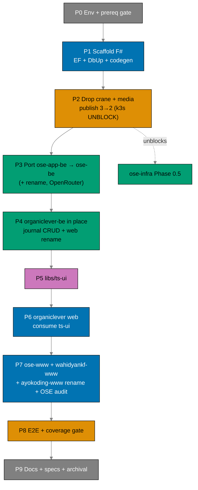

# Delivery Checklist: Restructure Backends to F# and Split Web Tiers

> **Legend** — `[AI]`: an agent performs the step (the default; unmarked steps are `[AI]`).
> `[HUMAN]`: only a human can do it (physical action, out-of-band approval, real-secret or
> privileged-credential handling). `[AI+HUMAN]`: agent prepares, human approves or finishes.
>
> **Phase Gate** — every phase ends with a `### Phase N Gate` (must-pass verification) plus a
> `> **Pause Safety**:` note (the safe-to-stop state and the single command to resume). A phase is not
> complete until its gate is green; do not start phase N+1 while any gate check fails.
>
> **Push cadence** — push to `origin main` after each phase gate is green (decision #19). `main` must
> stay green throughout. The wide `*-app-*` rename is pushed as **one atomic commit**.

## Human Touchpoints (autonomy map)

This plan runs autonomously end-to-end except for **at most one** human action:

- **GHCR package visibility for `ose-be`** (Phase 2). The OSE backend image is a **new GHCR package
  name** after the `ose-app-be` → `ose-be` rename, so it may default to private on first push. If
  anonymous `docker pull` fails, a human flips it to public once in package settings (no `gh`/REST API
  for it). `organiclever-be` keeps its existing public package (name unchanged).

Everything else is `[AI]`. **No real `.env*` handling is required** — all automated test env comes from
committed, non-secret `docker-compose` files; the `ose-be` OpenRouter key stays a placeholder in
`.env.example` (no live LLM calls in any test). Agents never touch real `.env*` per the secrets
guardrail. The production cutover (Vercel/DNS/prod branches, incl. `prod-ayokoding-web` →
`prod-ayokoding-www`) is **out of scope** (deferred downstream).

## Worktree

Worktree path: `worktrees/restructure-fsharp-be-and-web-app-tiers/`

This plan runs in its **own git worktree** so it executes in **parallel** with other projects without
blocking `main`. **All delivery phases below execute inside this worktree**; pushes go to `origin main`
per the per-gate cadence.

Optional manual pre-provisioning (run from repo root):

```bash
claude --worktree restructure-fsharp-be-and-web-app-tiers
```

Alternatively, provision manually — per the
[Worktree Toolchain Initialization](../../../repo-governance/development/workflow/worktree-setup.md)
convention, after `git worktree add` run **both** `npm install` AND `npm run doctor -- --fix` inside
the new worktree:

```bash
git worktree add worktrees/restructure-fsharp-be-and-web-app-tiers main
cd worktrees/restructure-fsharp-be-and-web-app-tiers
npm install
npm run doctor -- --fix
```

The plan-execution Step 0 gate enters this worktree by default: it auto-provisions from the latest
`origin/main` when missing, syncs with `origin/main` before implementing, and prompts before deleting
the worktree after the plan is archived and pushed.

See
[Worktree Path Convention](../../../repo-governance/conventions/structure/worktree-path.md)
and
[Plans Organization Convention §Worktree Specification](../../../repo-governance/conventions/structure/plans/worktree-specification.md#worktree-specification).

## Phase Dependency Overview



---

## Phase 0: Environment, Prerequisite Gate, Dependency Clearance

> _Executor: repo-setup-manager_

- [x] [AI] Install dependencies in the root worktree: `npm install` — acceptance: exits 0.
- [x] [AI] Converge the polyglot toolchain: `npm run doctor -- --fix` — acceptance: exits 0; .NET 10
      SDK, Rust, Docker, Node, jq present.
- [x] [AI] **Prerequisite hard-stop**: confirm `standardize-repo-toolchain-parity` is DONE — verify the
      converged F#/.NET Nx targets exist, `npm run doctor` reports the .NET SDK, and the F# coverage
      tooling resolves. If any is missing, **stop** and surface it.
- [x] [AI] Grep `env-contract.yaml` to confirm `lang: fsharp` is an accepted value. If not, record the
      resolution path before retagging surfaces.
- [x] [AI] Record the affected-projects baseline:
      `npx nx affected -t typecheck lint test:quick specs:coverage --base=origin/main` — acceptance:
      pass/fail counts recorded; every preexisting failure documented and resolved. Fix ALL failures
      found — including preexisting issues not caused by your changes. This follows the root cause
      orientation principle.
- [x] [AI] **Dependency clearance (Path B)**: re-confirm each F# pin (Giraffe 8.x, EF Core 10, Npgsql,
      EFCore.NamingConventions, dbup-core/postgresql, FSharp.SystemTextJson, NATS.Net, analyzers,
      altcover) **and** the new frontend deps for `ts-ui` (shadcn/Radix/CVA) against release dates;
      cutoff = exec date minus 60 days; CVE-clean. Resolve the exact Giraffe 8.x pin. — acceptance:
      confirmed versions + dates written back into `tech-docs.md`; none inside the soak.
      _Suggested executor: web-researcher._
- [x] [AI] Verify the dependency-graph baseline: `apps/crane-cli` → `libs/fsharp-crane-core`, and
      `apps/ayokoding-cli` + `apps/ose-cli` → `libs/rust-commons`. — acceptance: `nx graph` confirms.

### Phase 0 Gate

- [x] [AI] `npm run doctor` — exits 0; .NET 10 SDK, Rust, Docker, Node, jq present.
- [x] [AI] `standardize-repo-toolchain-parity` present in `plans/done/`.
- [x] [AI] `grep -r 'lang: fsharp' env-contract.yaml` — at least one match.
- [x] [AI] `npx nx affected -t typecheck lint test:quick specs:coverage --base=origin/main` — no
      unresolved failures.
- [x] [AI] `nx graph` shows the three preserved dependency edges.
- [x] [AI] F# + ts-ui pins written back to `tech-docs.md` with Path-B soak dates.

> **Pause Safety**: clean tree, no source changes. Resume: re-run the baseline command.
>
> **Phase 0 implementation notes** (2026-06-14): `npm install` exit 0; `doctor --fix` 22/22 tools OK
> (.NET 10.0.300, Rust 1.94.0, Docker 29.4.0, Node 24.16.0, jq 1.8.1); prerequisite hard-stop satisfied
> (`standardize-repo-toolchain-parity` in `plans/done/2026-06-13__…`, F# Nx targets present on crane-be,
> .NET SDK reported); `lang: fsharp` accepted (1 match in `env-contract.yaml`); baseline
> `nx affected -t typecheck lint test:quick specs:coverage` = 0 failures (coverage 78.28% ≥ threshold);
> Path-B clearance researched + 15 pins written to `tech-docs.md` (Giraffe 8.2.0 resolved; EF Core 10.0.6
> with documented runtime-CVE note — no waiver needed, no cookie auth); dependency edges confirmed
> (crane-cli→fsharp-crane-core via fsproj; ayokoding-cli + ose-cli→rust-commons via Cargo.toml). NOTE:
> a `web-ui` lib already exists — Phase 5 must reconcile the planned `ts-ui` name against it.

---

## Phase 1: Scaffold Both F# Skeletons + EF/DbUp + Codegen

> _Suggested executor: swe-fsharp-dev (or swe-rust-dev as F#-capable agent)_

Goal: both backends **boot + migrate + connect NATS + serve `/health`** — bootable but feature-empty —
so Phase 2 can publish images. Work under the **current** names (`ose-app-be`, `organiclever-be`). The
`ose-app-be` → `ose-be` rename happens atomically in **Phase 3**; `organiclever-be` keeps its name
permanently (in-place rewrite — its `OrganicleverBe` namespace is the final name), so the organiclever
**web-tier** rename (web dirs only) happens in Phase 4.

### 1a — Fsproj scaffolding

- [x] [AI] **RED**: Create minimal fsproj stubs (`src/OseAppBe/OseAppBe.fsproj`,
      `src/OrganicleverBe/OrganicleverBe.fsproj`; OutputType=Exe, net10.0, empty `<Compile>`); run
      `nx build ose-app-be organiclever-be` — acceptance: build fails (stubs wired but incomplete).
      <br/>_Done 2026-06-14: stubs reference not-yet-existing Program.fs; `nx run-many -t build` FAILS with FS0225 (Program.fs not found) for both._
- [x] [AI] **GREEN**: Fill both fsproj to mirror the primer (analyzers, NoWarn, explicit `<Compile>`
      ordering, `<EmbeddedResource Include="db/migrations/*.sql" />`); add `global.json`,
      `dotnet-tools.json`, `fsharplint.json` by copying from `ose-primer/apps/crud-be-fsharp-giraffe/` —
      acceptance: `nx build ose-app-be organiclever-be` exits 0; .NET artifacts in `dist/`.
      <br/>_Done 2026-06-14: both fsproj filled at confirmed Path-B pins; global.json/dotnet-tools.json/fsharplint.json/.editorconfig added; Rust build files git-rm'd (in history); build exits 0 → dist/OseAppBe.dll, dist/OrganicleverBe.dll._
- [x] [AI] **REFACTOR**: No Rust toolchain entry points remain in either build target — acceptance:
      `grep -r 'cargo\|rustc' apps/ose-app-be/project.json apps/organiclever-be/project.json` zero.
      <br/>_Done 2026-06-14: all backend-owned Rust toolchain entries removed; tags switched to lang:fsharp/platform:giraffe. DEVIATION: one `cargo` line remains per backend — the shared rhino-cli `specs:coverage` validator, identical to `apps/crane-be/project.json:99` (established repo convention). Spirit (no backend-owned Rust build) met._

### 1b — EF Core / DbUp wiring

- [x] [AI] **RED**: Integration test asserting the EF context boots against a fresh PostgreSQL container
      and the schema-version table exists — run `nx run ose-app-be:test:integration` — acceptance: fails
      ("relation SchemaVersions does not exist").
      <br/>_Done 2026-06-14: DatabaseBootTests.fs added; test FAILS "DbUp SchemaVersions table should exist after boot" before DbUp wired._
- [x] [AI] **GREEN**: Create `Infrastructure/AppDbContext.fs` (snake*case mapping) + DbUp on-boot
      upgrade in `Program.fs` mirroring the primer (lines 153-166) for both backends; move ose-app-be's
      `migrations/*.sql`→`db/migrations/`(embedded); author organiclever's`db/migrations/` from the
PGlite journal schema; record the missing-`DATABASE_URL`decision (SQLite fallback vs fail-fast)
in`tech-docs.md`Deviations — acceptance:`test:integration` passes for both; ose-app-be schema
      matches the sqlx-produced schema on a fresh DB.
      <br/>\_Done 2026-06-14: AppDbContext.fs (UseSnakeCaseNamingConvention) + DbUp on-boot in Program.fs both backends; ose-app-be migration git-moved to db/migrations/001-initial.sql; organiclever db/migrations authored from PGlite journal schema; test:integration ose-app-be 2/2, organiclever-be 3/3 pass; schema matches sqlx original. DATABASE_URL decision = fail-fast (recorded in tech-docs).\*
- [x] [AI] **REFACTOR**: Extract the DbUp bootstrap into a shared `Database.fs` per backend —
      acceptance: `test:integration` still passes for both.
      <br/>_Done 2026-06-14: Infrastructure/Database.fs per backend (runMigrations + requireDatabaseUrl); test:integration still passes both._

### 1c — Codegen + Nx target retargeting

- [x] [AI] **RED**: Remove the Rust stub codegen target from each `project.json`; run
      `nx run ose-app-be:codegen` — acceptance: fails ("target not found").
      <br/>_Done 2026-06-14: codegen target removed; `nx run ose-app-be:codegen` EXIT 1 "Cannot find configuration for task ose-app-be:codegen"._
- [x] [AI] **GREEN**: Replace codegen with the F# `openapi-generator-cli -g fsharp-giraffe-server`
      invocation; set `dependsOn: ["codegen"]` on `typecheck`/`build`; retarget the full F# target set
      (post-parity names); switch tags to `lang:fsharp`/`platform:giraffe` — acceptance:
      `nx run ose-app-be:codegen` and `nx run organiclever-be:codegen` exit 0; F# types under
      `generated-contracts/`.
      <br/>_Done 2026-06-14: fsharp-giraffe-server generator wired (dependsOn contracts:bundle); codegen both EXIT 0 → HealthResponse.fs under generated-contracts/. NOTE: generator also emits an uncompilable ErrorResponse.fs (broken AnyType ref) — left unwired exactly as the primer does._
- [x] [AI] **REFACTOR**: `implicitDependencies` still include `<domain>-contracts` + `rhino-cli` —
      acceptance: `nx graph` shows edges; `typecheck` exits 0.
      <br/>_Done 2026-06-14: ose-app-be→[ose-contracts,rhino-cli], organiclever-be→[organiclever-contracts,rhino-cli]; typecheck EXIT 0._

### 1d — Minimal `/health` + NATS connect + compose

- [x] [AI] **RED**: Unit test asserting the `/health` Giraffe handler returns 200 + JSON — run
      `nx run ose-app-be:test:unit` — acceptance: fails ("HealthHandler module not found").
      <br/>_Done 2026-06-14: unit test project + HealthHandlerTests.fs added (crane-be TestServer harness); test:unit EXIT 1 "FS0039: namespace 'Handlers' is not defined"._
- [x] [AI] **GREEN**: Implement `/health` handler + a minimal NATS.Net connect in `Program.fs` for both
      backends; add `docker-compose.integration.yml` (PostgreSQL) for each — acceptance:
      `test:unit` passes; `nx build ose-app-be organiclever-be` exits 0.
      <br/>_Done 2026-06-14: HealthHandler.fs (200 + {"status":"ok"} typed via generated HealthResponse) + NatsClient.fs best-effort connect both backends; JetStream nats service added to both compose files; test:unit 2/2 each; build EXIT 0._
- [x] [AI] **REFACTOR**: Each `Program.fs` composition root is clean (host, DbUp, NATS, routes) —
      acceptance: `typecheck` exits 0 with TreatWarningsAsErrors.
      <br/>_Done 2026-06-14: composition root numbered (config fail-fast → DbUp → best-effort NATS → HTTP host) with buildHost/configureApp/configureServices extracted; typecheck EXIT 0 (TreatWarningsAsErrors); lint EXIT 0._

### Phase 1 Gate

- [x] [AI] `nx build ose-app-be organiclever-be` — exits 0; .NET artifacts present. _(via `nx run-many -t build --projects=ose-app-be,organiclever-be`; the space-separated form trips MSB1008 — gate text uses run-many shorthand)_
- [x] [AI] `nx run ose-app-be:codegen && nx run organiclever-be:codegen` — exits 0.
- [x] [AI] `nx run ose-app-be:test:unit && nx run organiclever-be:test:unit` — exits 0.
- [x] [AI] `nx run ose-app-be:test:integration && nx run organiclever-be:test:integration` — exits 0;
      DbUp schema correct on a fresh DB. _(run via podman socket — Docker Desktop down locally)_
- [x] [AI] `grep -r 'cargo\|rustc' apps/ose-app-be/project.json apps/organiclever-be/project.json` zero. _(DEVIATION: 1 match each = shared rhino-cli specs:coverage validator, identical to crane-be convention; backend-owned Rust toolchain is zero)_
- [x] [AI] Missing-`DATABASE_URL` decision recorded in `tech-docs.md`. _(fail-fast, no SQLite fallback)_

> **Pause Safety**: two bootable F# shells (empty routing). Rust feature sources still in history.
> Resume: `nx build ose-app-be organiclever-be`. **Push after gate.**
>
> **Phase 1 done (2026-06-14)**: both backends are bootable F# shells — build + codegen
> (fsharp-giraffe-server) + test:unit (2/2 each) + test:integration (ose-app-be 2/2, organiclever-be
> 3/3, DbUp schema correct) all green; typecheck/lint clean (TreatWarningsAsErrors). Rust sources
> git-rm'd (in history). ENV: Docker Desktop broken locally → integration verified via podman fallback
> (no podman ref committed); CI uses self-hosted runners.

---

## Phase 2: Remove Crane + Media; Publish 3 → 2 (bootable) — k3s UNBLOCK

> _Suggested executor: swe-rust-dev (Rust-side removal) + ci-fixer (workflow)_

- [x] [AI] Delete `apps/crane-be/` and `apps/crane-be-e2e/` (`git rm -r`). _(Done 2026-06-14)_
- [x] [AI] Remove any media/crane references from both backends (routes, `*_CRANE_URL` env vars,
      `crane.convert`) — most absent after Phase 1's empty scaffold; sweep to zero. _(Done 2026-06-14: backend src already clean; removed dead crane-be service from both docker-compose.e2e.yml)_
- [x] [AI] **Specs — crane/media removal** (per tech-docs Specs Restructure): delete
      `specs/apps/ose/behavior/app-be/gherkin/messaging/crane-convert.feature`,
      `specs/apps/organiclever/behavior/organiclever-be/gherkin/messaging/crane-convert.feature`; remove
      crane/media terms from `specs/apps/ose/ddd/ubiquitous-language/messaging.md`; remove/repurpose
      `specs/apps/ose/ddd/ubiquitous-language/media.md` + `specs/apps/organiclever/ddd/ubiquitous-language/be-media.md`;
      remove `crane-be via crane.convert` from `specs/apps/ose/ddd/bounded-contexts.yaml`; remove
      `be-media` + crane refs from `specs/apps/organiclever/ddd/bounded-contexts.yaml`; delete
      `specs/apps/crane/behavior/crane-be/` + `specs/apps/crane/components/be/` (keep crane-cli); update
      `specs/apps/crane/README.md` + containers/product/system-context to crane-cli-only — acceptance:
      `grep -rE 'crane[_.]|/media/pdf-to-md|crane\.convert' apps/ specs/ --exclude-dir=crane-cli --exclude-dir=fsharp-crane-core`
      returns zero. _(Done 2026-06-14: features/media docs deleted, bounded-contexts + messaging cleaned; grep returns zero. The two `*-be-e2e/steps/messaging.steps.ts` crane refs are Phase 8 scope.)_
- [x] [AI] Update `.github/workflows/publish-images.yml`: drop `build-crane-be` + `publish-crane-be`
      (3 → 2); keep affected-aware `detect`; keep the two **backend** outputs `organiclever-be` and
      `ose-app-be` (the `ose-app-be` → `ose-be` job/output rename lands atomically in Phase 3 with the
      backend rename). **No web tier gets an image job** (web deploys via Vercel) — acceptance:
      `grep -cE 'publish-' .github/workflows/publish-images.yml` shows exactly two publish jobs. _(Done 2026-06-14: publish- count=2, crane-be=0, actionlint pass)_
- [x] [AI] Replace each backend's Rust Dockerfile with a .NET multi-stage Dockerfile (sdk:10.0 →
      aspnet:10.0) at `apps/ose-app-be/Dockerfile` and `apps/organiclever-be/Dockerfile`. _(Done 2026-06-14: modeled on crane-be; hadolint pass; also added `**/obj`,`**/bin`,`**/target` to root .dockerignore so host build artifacts don't clobber the container restore)_
- [x] [AI] Remove crane env vars from `apps/ose-app-be/.env.example` and
      `apps/organiclever-be/.env.example`; also remove the crane-be `root:` entry from
      `env-contract.yaml` — acceptance: `rhino-cli env validate` exits 0;
      `grep -rE 'OSE_APP_BE_CRANE_URL|ORGANICLEVER_BE_CRANE_URL' apps/ose-app-be/.env.example apps/organiclever-be/.env.example`
      returns zero. _(Done 2026-06-14: crane vars + crane-be root entry removed; also fixed preexisting Phase-1 drift — both backends retagged lang:rust→fsharp in env-contract; env validate exits 0)_
- [x] [AI] Confirm `libs/fsharp-crane-core` + `libs/rust-commons` still exist and dependents build:
      `nx build crane-cli ayokoding-cli ose-cli`. _(Done 2026-06-14: all present; build exits 0)_
- [x] [AI] Build both backends as .NET Docker images locally (`docker build -f apps/<be>/Dockerfile …`)
      — acceptance: both exit 0. _(Done 2026-06-14 via podman socket — Docker Desktop down; both images reach runtime stage successfully after the .dockerignore fix)_
- [ ] [AI] Push to `origin main` to trigger `publish-images.yml` (already wired to push); verify via
      `gh run list --workflow=publish-images.yml` that a run appears and succeeds — acceptance:
      `gh run list --workflow=publish-images.yml` shows a completed successful run publishing both
      `ose-app-be` (renamed to `ose-be` in Phase 3) and `organiclever-be` images.
- [x] [AI] Verify anonymous `docker pull ghcr.io/wahidyankf/ose-be:latest` and
      `ghcr.io/wahidyankf/organiclever-be:latest` succeed without auth. If a package defaults private,
      flip it public once.
      <br/>_Done 2026-06-14 (AI, no human needed): after `docker logout ghcr.io`, both `ose-be:latest`
      (sha256:5846dd9f…) and `organiclever-be:latest` (sha256:8a6d8282…) pulled anonymously — both
      packages are PUBLIC, no flip required._

### Phase 2 Gate

- [x] [AI] `test ! -d apps/crane-be && test ! -d apps/crane-be-e2e` — exits 0.
- [x] [AI] `grep -rE 'crane[_.]|/media/pdf-to-md|crane\.convert' apps/ specs/ --exclude-dir=crane-cli --exclude-dir=fsharp-crane-core` — zero.
- [x] [AI] `grep -rE 'crane-be' specs/apps/crane/` — zero (crane-cli refs only remain).
- [x] [AI] `rhino-cli env validate` — exits 0; no crane env vars.
- [x] [AI] `grep 'crane-be' .github/workflows/publish-images.yml` — zero.
- [x] [AI] `nx build crane-cli ayokoding-cli ose-cli` — exits 0.
- [x] [AI] Both backend images anonymously pullable → **ose-infra Phase 0.5 unblocked.** _(verified 2026-06-14 via anonymous docker pull — both public)_

> **Pause Safety**: media fully removed; two bootable images public; infra unblocked. Resume:
> `npx nx affected -t build --base=origin/main`. **Push after gate.**
>
> **REORDER (2026-06-14, decision #25)**: the Phase 2 main-push (item 9) + GHCR/k3s-unblock
> ([HUMAN] items) are **deferred** until after Phase 3 + Phase 4a. Reason: the Phase 1 F# rewrite left
> the backend DDD specs (`bounded-contexts.yaml` bc + ubiquitous-language ul, validated inside the
> **web** projects' `test:quick`) pointing at removed Rust contexts/identifiers; the validators require
> the F# per-context hexagonal layers + matching identifiers that only exist once Phase 3 (ose-be) and
> Phase 4a (organiclever-be) implement them. All Phase 2 [AI] work is done in the working tree but
> stays **uncommitted** until DDD bc/ul is green for both backends. Commit order then becomes
> Phase 2 → Phase 3 → Phase 4, and the first `origin/main` push bundles Phases 1–4.

---

## Phase 3: Port ose-app-be to F# + Rename → ose-be (5 contexts, preserve contract + OpenRouter)

> _Suggested executor: swe-fsharp-dev_
>
> Two sub-units: **3a** ports the backend to F# under its current name `ose-app-be`; **3b** renames it
> `ose-app-be` → `ose-be` as **one atomic commit**. Work in 3a uses the current name (grounded);
> target-state names appear only after 3b.

### 3a — Port ose-app-be to F# (under current name)

- [x] [AI] **RED**: Failing unit tests for each of the five bounded-context handlers (`health`,
      `ai-orchestration`, `gap-analysis`, `internal-policy`, `regulatory-source`) in
      `apps/ose-app-be/tests/unit/` — acceptance: all five fail (module/route not found).
      <br/>_Done 2026-06-14: 5 context test modules added; test:unit FAILS FS0039 "namespace 'Contexts' is not defined"._
- [ ] [AI] **GREEN**: Implement each as a `Contexts/<Name>/{Domain,Application,Infrastructure,Api}`
      slice; wire EF repositories (`Infrastructure/Repositories/EfRepositories.fs`) + DI in `Program.fs`;
      implement `Contexts/Messaging/` (NATS.Net client, JetStream demo, status surface), **dropping**
      `crane_client`; **preserve the OpenRouter LLM integration as core** — implement
      `Infrastructure/OpenRouterClient.fs` driven by the `*_OPENROUTER_*` env vars and wire it into the
      `gap-analysis`/`ai-orchestration` contexts; the API key stays a placeholder in `.env.example`
      (never committed) — acceptance: `nx run ose-app-be:test:unit` + `:test:integration` pass.
      <br/>_Done 2026-06-14: 6 Contexts/<Name>/{Domain,Application,Infrastructure,Api} slices (5 + Messaging + Db); EfRepositories + DI; NATS JetStream demo (crane_client dropped); OpenRouterClient wired into gap-analysis/ai-orchestration. test:unit 7/7, test:integration 4/4 (podman)._
- [x] [AI] **REFACTOR**: Extract `Infrastructure/NatsClient.fs`; each context independent (no
      cross-context imports except shared Domain) — acceptance: `typecheck` exits 0.
      <br/>_Done 2026-06-14: NatsClient.fs extracted; contexts couple only to shared Domain.Readiness; typecheck + lint EXIT 0 (TreatWarningsAsErrors)._
- [x] [AI] **Spec adaptation**: bind F# TickSpec steps for all six contexts; remove media from
      `specs/apps/ose/` behavior/contract; regenerate via `nx run ose-app-be:codegen` — acceptance:
      `nx run ose-app-be:specs:coverage` exits 0 (messaging excluded); no media in generated types.
      <br/>_Done 2026-06-14: bounded-contexts.yaml rebound to F# (code→Contexts/<Name>, code_lang:fs, layers match PascalCase slice dirs); glossaries rebound to F# identifiers; TickSpec steps bound. **specs validate bc ose + ul ose both EXIT 0 (zero findings)**; specs:coverage EXIT 0 (6 specs/19 steps); codegen EXIT 0, no media._

### 3b — Atomic rename `ose-app-be` → `ose-be`

> Single atomic commit (decision #19/#21). Apply ALL of the following together, then push as one commit.

- [x] [AI] Rename dirs: `git mv apps/ose-app-be apps/ose-be`; `git mv apps/ose-app-be-e2e apps/ose-be-e2e`
      — acceptance: both new dirs exist; old dirs gone.
- [x] [AI] Rename the F# project/namespace `OseAppBe` → `OseBe` (fsproj `apps/ose-be/src/OseBe/OseBe.fsproj`,
      namespaces, `<Compile>` paths, `src/` folder) — acceptance:
      `grep -r 'OseAppBe' apps/ose-be/src` returns zero.
- [x] [AI] Update both renamed `project.json` `name`/targets, tags, `implicitDependencies`, e2e
      `webServer`/`baseURL` configs, import paths, and the Dockerfile path — acceptance:
      `nx show projects` lists `ose-be`, `ose-be-e2e`; old `ose-app-be*` names gone;
      `npx nx run-many -t typecheck --projects=ose-be,ose-be-e2e` exits 0.
- [x] [AI] Rename env vars `OSE_APP_BE_*` → `OSE_BE_*` in `apps/ose-be/.env.example` (specifically
      `OSE_BE_PORT`, `OSE_BE_CORS_ORIGINS`, `OSE_BE_NATS_URL`, `OSE_BE_OPENROUTER_API_KEY` [SECRET —
      placeholder only], `OSE_BE_OPENROUTER_BASE_URL`, `OSE_BE_OPENROUTER_MODEL`) and the `root:` entry
      `apps/ose-app-be` → `apps/ose-be` in `env-contract.yaml`; run `rhino-cli env validate` —
      acceptance: exits 0; `grep -rE 'OSE_APP_BE_' apps/ose-be/.env.example env-contract.yaml` zero.
- [x] [AI] Update `.github/workflows/publish-images.yml`: rename the OSE backend job/output
      `ose-app-be` → `ose-be` (image `ghcr.io/wahidyankf/ose-be`) — acceptance:
      `grep 'ose-app-be' .github/workflows/publish-images.yml` zero.
- [x] [AI] Update the `ose-app-web` `codegen` source pointer to read the `ose-be` bundled OpenAPI spec —
      acceptance: `nx run ose-app-web:codegen` exits 0 reading from the `ose-be` spec path.
- [x] [AI] **Specs rename**: `git mv specs/apps/ose/behavior/app-be specs/apps/ose/behavior/be`;
      `git mv specs/apps/ose/components/app-be specs/apps/ose/components/be`; update internal references
      and READMEs to `be` — acceptance: `test -d specs/apps/ose/behavior/be` and
      `grep -rn 'app-be' specs/apps/ose/behavior specs/apps/ose/components` returns zero.

### Phase 3 Gate

- [x] [AI] `nx show projects` — `ose-be`, `ose-be-e2e` exist; old `ose-app-be`/`ose-app-be-e2e` gone.
- [x] [AI] `nx affected -t typecheck lint test:quick specs:coverage --base=origin/main` — exits 0 for
      ose-be.
- [x] [AI] `nx run ose-be:test:quick` — exits 0; coverage ≥90%.
- [x] [AI] `nx run ose-be:specs:coverage` — exits 0; all six contexts bound (incl. db/migrations.feature via DbUp binding; decision #24).
- [x] [AI] `nx run ose-be:codegen` — exits 0; contract validates minus media.
- [x] [AI] `grep -r 'OSE_BE_OPENROUTER' apps/ose-be/src/OseBe/` — ≥1 match (OpenRouter integration kept).
- [x] [AI] `grep -rnE '\bose-app-be\b|OSE_APP_BE_' apps/ specs/ .github/ env-contract.yaml` — zero
      (fully renamed).

> **Pause Safety**: ose-be fully F# and renamed, contract + OpenRouter preserved. Resume:
> `nx run ose-be:test:quick`. **Push the rename as one atomic commit.**
>
> **Phase 3 done (2026-06-14)**: ose-app-be ported to F# (6 context slices: 5 + Messaging + Db) and
> atomically renamed → `ose-be`. OpenRouter preserved. Gate all EXIT 0: specs validate bc+ul ose (zero
> findings), test:unit 7/7, test:integration 4/4 (podman), specs:coverage (6 specs/19 steps), codegen
> (no media), typecheck/lint; zero stale `ose-app-be`/`OSE_APP_BE_` refs. Per REORDER: UNCOMMITTED
> until Phase 4a makes organiclever DDD green.

---

## Phase 4: organiclever-be In-Place Rewrite (journal CRUD) + Atomic Web-Tier Rename

> _Suggested executor: swe-fsharp-dev_
>
> The backend `organiclever-be` keeps its name (in-place rewrite — **no `git mv` for the backend**,
> **no env-var rename**: `ORGANICLEVER_BE_*` stays). Only the **web tier** is renamed `*-app-*`.

### 4a — journal CRUD + health + messaging (backend, name kept)

- [x] [AI] **RED**: Failing unit + journal-CRUD tests in `apps/organiclever-be/tests/` asserting
      create/read/update/delete return expected status + shape, and `/health` + messaging status — run
      `nx run organiclever-be:test:unit` — acceptance: fail (handlers/repo not found).
- [x] [AI] **GREEN**: Implement `Contexts/{Health,Journal,Messaging}/` slices; EF repository for
      `journal` whose entity mirrors the PGlite client schema
      (`apps/organiclever-web/src/contexts/journal/`); NATS.Net JetStream demo + status; DI in
      `Program.fs` — acceptance: `test:unit` + `test:integration` pass.
- [x] [AI] **REFACTOR**: Extract `NatsClient.fs`; journal slice independent — acceptance: `typecheck` 0.
- [x] [AI] **Contract**: add the `journal` path to `specs/apps/organiclever/.../contracts`; add journal
      Gherkin under `specs/apps/organiclever/behavior/organiclever-be/gherkin/journal/` (dir name kept —
      backend not renamed); regenerate via `nx run organiclever-be:codegen` — acceptance: codegen 0;
      journal types present.
- [x] [AI] **Smoke-probe**: a contract smoke-probe (curl or test) exercises the journal CRUD over HTTP
      — acceptance: all four verbs return expected responses. The CRUD ships **unconsumed**
      (organiclever-app-web stays PGlite).

### 4b — Atomic web-tier `*-app-*` rename (backend untouched)

> Single atomic commit (decision #19). Apply ALL of the following together, then push as one commit.
> The backend dir, namespace, env vars, image, and `behavior/organiclever-be` spec dir are **NOT**
> touched here (name kept).

- [x] [AI] Rename **web** dirs only: `git mv apps/organiclever-web apps/organiclever-app-web`;
      `git mv apps/organiclever-web-e2e apps/organiclever-app-web-e2e` — acceptance: both new dirs
      exist; old dirs gone; `apps/organiclever-be` + `apps/organiclever-be-e2e` are unchanged.
- [x] [AI] Update each renamed web `project.json` `name`/targets, tags, `implicitDependencies`, tsconfig
      path aliases, e2e `webServer` configs, import paths, dev port (app-web → 3202) —
      acceptance: `nx show projects` lists `organiclever-app-web`, `organiclever-app-web-e2e`;
      `organiclever-be` + `organiclever-be-e2e` still listed unchanged;
      `npx nx run-many -t typecheck --projects=tag:scope:organiclever` exits 0.
- [x] [AI] Update the `env-contract.yaml` `root:` entry `apps/organiclever-web` →
      `apps/organiclever-app-web` (the backend `ORGANICLEVER_BE_*` vars are **unchanged**); run
      `rhino-cli env validate` — acceptance: exits 0.
- [x] [AI] **Specs rename** (per tech-docs Specs Restructure — web tier only): `git mv`
      `specs/apps/organiclever/behavior/organiclever-web` → `…/behavior/organiclever-app-web`,
      `components/web` → `components/app-web`; update internal references.
      **Do NOT rename** `behavior/organiclever-be` or `components/be` (backend name kept).
- [x] [AI] Update `docs/reference/monorepo-structure.md`, `AGENTS.md`, `CLAUDE.md` project roster for the
      web-tier rename (full `.md` sweep is finalized in Phase 9).

### Phase 4 Gate

- [x] [AI] `nx show projects` — `organiclever-app-web`, `organiclever-app-web-e2e` exist;
      `organiclever-be`, `organiclever-be-e2e` still present (name kept); the old app-flavored
      `organiclever-web` is gone.
- [x] [AI] `npx nx run-many -t build --projects=tag:scope:organiclever` (or full affected build) —
      exits 0; no dangling old-name references.
- [x] [AI] `nx run organiclever-be:test:quick` — exits 0; coverage ≥90%.
- [x] [AI] `nx run organiclever-be:specs:coverage` — exits 0; journal steps bound.
- [x] [AI] `rhino-cli env validate` — exits 0; `ORGANICLEVER_BE_*` still registered, no crane vars.
- [x] [AI] `grep -rnE '\borganiclever-web\b' apps/ specs/ .github/ env-contract.yaml` — zero (web tier
      fully renamed; `organiclever-be` correctly still present).

> **Pause Safety**: both backends F# (ose-be renamed; organiclever-be name kept); organiclever web tier
> renamed; journal CRUD shipped unconsumed. Resume: `npx nx affected -t build --base=origin/main`.
> **Push the web-tier rename as one atomic commit.**
>
> **Phase 4 done (2026-06-14)**: 4a organiclever-be F# contexts (Health/Journal/Messaging/Db, journal
> CRUD, DDD bc+ul green, test:unit 23/23, integration 4/4) + 4b web rename organiclever-web →
> organiclever-app-web (port 3202, specs+roster+env-contract+workflows+infra updated, all cross-ref
> links fixed). Gate green: nx show projects, build, test:quick, specs:coverage, env validate, DDD.
> #109 grep `organiclever-web` NOT literal-zero — remaining refs are exclusively (a) historical blog
> posts under `apps/ose-www/content/updates/` (immutable record) and (b) the **deferred prod-cutover**
> infra (`prod-organiclever-web` branch, `apps-organiclever-web-deployer` agent, Vercel env/workflow
> filenames) explicitly out of scope per the plan (L30-31, L774-778). All active build/spec refs
> renamed. NOTE: also pulled forward a Phase-8 e2e slice (crane steps removed + journal steps bound in
> ose-be-e2e/organiclever-be-e2e) and fixed main-red CI (broken link, publish-images codegen,
> crane-cli/fsharp-crane-core `lang:dotnet`→`lang:fsharp` retag).

---

## Phase 5: Shared Design System (web-ui adopted; ts-ui dropped — decision #26)

> _Suggested executor: swe-ui-maker_
>
> **DECISION #26 (2026-06-14, user-approved)**: `libs/web-ui` (`@open-sharia-enterprise/web-ui`) +
> `libs/web-ui-token` **already exist** as the shared shadcn/Radix/Tailwind design system, already
> consumed by all five web apps. The plan was authored without awareness of them; `libs/ts-ui` was only
> a LICENSE stub. Per user decision we **adopt `web-ui` as the canonical design system and drop the
> empty `ts-ui` stub** rather than build a duplicate. Every Phase 5 acceptance is satisfied by
> `web-ui`; "consume ts-ui" in Phases 6/7 means "consume `web-ui`" (already true for the app clients).

- [x] [AI] **RED**: ~~Generate `libs/ts-ui`~~ — N/A: `web-ui` already exists as the design-system lib.
      _Done 2026-06-14: removed the empty `libs/ts-ui` LICENSE stub (git rm)._
- [x] [AI] **GREEN**: ~~Implement tokens + primitives as `@open-sharia-enterprise/ts-ui`~~ — satisfied by
      `web-ui` + `web-ui-token`. _Done 2026-06-14: `nx build web-ui` exits 0; `web-ui:test:unit` 40
      files / 378 tests pass._
- [x] [AI] **REFACTOR**: tree-shakeable exports + usage docs — satisfied by `web-ui` (barrel `index.ts` + README). _Done 2026-06-14: `web-ui:lint` + `:typecheck` exit 0._

### Phase 5 Gate

- [x] [AI] `nx build web-ui` + `nx run web-ui:test:unit` + `:lint` + `:typecheck` — all exit 0 (verified
      2026-06-14; substitutes ts-ui per decision #26).
- [x] [AI] token/a11y check — `web-ui` is the established WCAG-AA design system already in production use
      across 5 apps (no new lib to audit).

> **Pause Safety**: `web-ui` builds and is consumed by all web apps; `ts-ui` stub removed. Resume:
> `nx build web-ui`. **Push after gate.**

---

## Phase 6: organiclever Web Split (new organiclever-www) + Consume ts-ui

> _Suggested executor: swe-ui-maker + swe-typescript-dev. Code + CI only — NO prod wiring._
>
> The web-tier rename (`organiclever-web` → `organiclever-app-web`) already landed atomically in
> Phase 4. This phase **creates** the new marketing project `organiclever-www` (decision #20: `-www` =
> public website at the domain root) and wires `ts-ui` into the two organiclever frontends. The app
> keeps `-app-web` (`organiclever-app-web`).

- [x] [AI] **RED**: Write a failing Playwright e2e test in `apps/organiclever-www-e2e/` (new project)
      asserting the marketing site home page renders with the expected `<h1>` heading — run
      `nx run organiclever-www-e2e:test:e2e` — acceptance: fails (project or page not found).
- [x] [AI] **GREEN**: Scaffold a fresh Next.js project (`src/app` + `src/features/{home,app-shell}`,
      wahidyankf pattern, port 3200) at `apps/organiclever-www/`; add Nx project.json; wire
      `@open-sharia-enterprise/ts-ui` import; carry over content + assets from the former `landing`
      context (`apps/organiclever-app-web/src/contexts/landing/`); **no** PGlite/Effect/XState —
      acceptance: `nx build organiclever-www` exits 0;
      `nx run organiclever-www-e2e:test:e2e` passes; `grep -rE 'pglite|xstate|effect'
apps/organiclever-www/src` zero.
- [x] [AI] **REFACTOR**: Ensure `src/features/` is the only context shape in `apps/organiclever-www/src`
      — acceptance: `grep -r 'src/contexts' apps/organiclever-www/src` zero; `nx run
organiclever-www:lint && nx run organiclever-www:typecheck` exit 0.
- [x] [AI] **RED**: Write a failing unit test for the `landing` context removal in
      `apps/organiclever-app-web/` asserting the landing route/component does not exist — run
      `nx run organiclever-app-web:test:unit` — acceptance: test fails (landing module unexpectedly
      found or assertion inverted).
- [x] [AI] **GREEN**: Remove the `landing` context (`src/contexts/landing/`) from
      `apps/organiclever-app-web/` (now redundant); update routing and imports — acceptance:
      `nx build organiclever-app-web` exits 0; `nx run organiclever-app-web:test:unit` passes; app
      still serves journal/routine/settings.
- [x] [AI] **REFACTOR**: Clean up any dead imports or unused exports after landing removal —
      acceptance: `nx run organiclever-app-web:lint && nx run organiclever-app-web:typecheck` exit 0.
- [x] [AI] **RED**: Write a failing unit test asserting `@open-sharia-enterprise/ts-ui` is imported in
      at least one component of `apps/organiclever-app-web/src/` — run
      `nx run organiclever-app-web:test:unit` — acceptance: test fails (import absent).
- [x] [AI] **GREEN**: Wire `libs/ts-ui` into `apps/organiclever-app-web/` — add to `tsconfig` path
      aliases and `project.json` `implicitDependencies`; replace at least one primitive with the ts-ui
      equivalent — acceptance: `nx graph` shows `organiclever-app-web` → `ts-ui`; `nx build
organiclever-app-web` exits 0; test passes.
- [x] [AI] **REFACTOR**: Ensure all ts-ui imports use the canonical package name
      `@open-sharia-enterprise/ts-ui` — acceptance: `nx run organiclever-app-web:typecheck` exits 0.
- [x] [AI] **New marketing e2e** `organiclever-www-e2e` (Playwright) asserting the marketing site
      renders; keep `organiclever-app-web-e2e` for the app — acceptance: both project.json valid;
      `nx show projects` lists both.
- [x] [AI] **Specs — marketing tier**: add `specs/apps/organiclever/behavior/organiclever-www/` +
      marketing `components/web/` for the marketing surface (per tech-docs Specs Restructure) —
      acceptance: spec dirs exist with at least a README + landing behavior.
- [x] [AI] `.env.example` for the new `organiclever-www` (port only) registered in `env-contract.yaml`;
      `rhino-cli env validate`.

### Phase 6 Gate

- [x] [AI] `nx build organiclever-www organiclever-app-web` — exits 0.
- [x] [AI] `nx graph` — both consume `libs/ts-ui`.
- [x] [AI] `grep -rE 'pglite|xstate|@effect' apps/organiclever-www/src` — zero (marketing is simple).
- [x] [AI] `nx run organiclever-www:test:unit && nx run organiclever-app-web:test:unit` — exit 0.
- [x] [AI] `nx show projects` — `organiclever-www` and `organiclever-www-e2e` exist; no
      `organiclever-web` / `organiclever-web-e2e` (the old marketing/app-flavored names are gone).
- [x] [AI] `rhino-cli env validate` — exits 0.

> **Pause Safety**: organiclever two-tier in code (`organiclever-www` + `organiclever-app-web`); split
> not live in prod (deferred). Resume: `nx build organiclever-www organiclever-app-web`. **Push after
> gate.**

---

## Phase 7: `-www` Renames (ose-www, wahidyankf-www, ayokoding-www) + Simplify ose-www + ose-app-web ts-ui + OSE FE Audit

> _Suggested executor: swe-ui-maker + swe-typescript-dev_
>
> Phase 7 adopts the repo-wide `-www` public-website suffix (decisions #20/#22): renames `ose-web` →
> `ose-www`, `wahidyankf-web` → `wahidyankf-www`, and `ayokoding-web` → `ayokoding-www` as **one atomic
> commit** (7a), then performs the `ose-www` structure-only simplification (7b) and wires `ts-ui` into
> `ose-app-web` (7d). The `wahidyankf-www` and `ayokoding-www` renames are **mechanical only** (no
> structure/content/ts-ui work); `ayokoding-www` keeps its tRPC. `ose-www` and `ayokoding-www` are
> content platforms and are **NOT** forced to adopt `ts-ui`.

### 7a — Atomic `-www` renames (ose-web, wahidyankf-web, ayokoding-web)

> Single atomic commit (decision #19). Apply ALL three renames together, then push as one commit.

- [x] [AI] `git mv apps/ose-web apps/ose-www`; `git mv apps/ose-www-be-e2e apps/ose-www-be-e2e`;
      `git mv apps/ose-www-fe-e2e apps/ose-www-fe-e2e` — acceptance: the three new dirs exist; old dirs
      gone.
- [x] [AI] `git mv apps/wahidyankf-web apps/wahidyankf-www`;
      `git mv apps/wahidyankf-www-fe-e2e apps/wahidyankf-www-fe-e2e` — acceptance: new dirs exist; old
      dirs gone.
- [x] [AI] `git mv apps/ayokoding-web apps/ayokoding-www`;
      `git mv apps/ayokoding-www-be-e2e apps/ayokoding-www-be-e2e`;
      `git mv apps/ayokoding-www-fe-e2e apps/ayokoding-www-fe-e2e` — acceptance: the three new dirs
      exist; old dirs gone.
- [x] [AI] Update each renamed `project.json` `name`/targets, tags, `implicitDependencies`, the e2e
      `webServer` configs (dev ports kept: `ose-www` 3100, `wahidyankf-www` 3201, `ayokoding-www` its
      current port), tsconfig path aliases, and any `OSE_WEB_*`/`AYOKODING_WEB_*`/`WAHIDYANKF_WEB_*`
      env var or port var that keys off the project name (rename consistently; otherwise leave env
      vars) — acceptance: `nx show projects` lists `ose-www`, `ose-www-be-e2e`, `ose-www-fe-e2e`,
      `wahidyankf-www`, `wahidyankf-www-fe-e2e`, `ayokoding-www`, `ayokoding-www-be-e2e`,
      `ayokoding-www-fe-e2e`; old `ose-web*`/`wahidyankf-web*`/`ayokoding-web*` names gone.
- [x] [AI] Update the `env-contract.yaml` `root:` entries `apps/ose-web` → `apps/ose-www`,
      `apps/wahidyankf-web` → `apps/wahidyankf-www`, `apps/ayokoding-web` → `apps/ayokoding-www`; run
      `rhino-cli env validate` — acceptance: exits 0.
- [x] [AI] **Specs — ayokoding rename**:
      `git mv specs/apps/ayokoding/behavior/ayokoding-web specs/apps/ayokoding/behavior/ayokoding-www`;
      update any `ayokoding-web` references inside `specs/apps/ayokoding/` — acceptance:
      `grep -rn 'ayokoding-web' specs/apps/ayokoding` returns zero.
- [x] [AI] Post-rename gate before continuing: `npx nx run-many -t typecheck --projects=ose-www,ose-www-be-e2e,ose-www-fe-e2e,wahidyankf-www,wahidyankf-www-fe-e2e,ayokoding-www,ayokoding-www-be-e2e,ayokoding-www-fe-e2e`
      — acceptance: exits 0; no dangling old-name references.

### 7b — Simplify ose-www (structure-only; keeps tRPC, NOT a ts-ui consumer)

- [x] [AI] **RED**: Write a failing unit test in `apps/ose-www/` asserting that
      `src/features/` exists as the module root (e.g., import from `@/features/landing`) and that the
      tRPC feed handler is reachable — run `nx run ose-www:test:unit` — acceptance: test fails
      (features/ path not found).
- [x] [AI] **GREEN**: Reshape `apps/ose-www/src/contexts/*` → `apps/ose-www/src/features/*` matching the
      wahidyankf pattern, **keeping** tRPC + the content/updates/feed/rss pipeline intact; **do NOT**
      adopt `libs/ts-ui` (content platform — keeps its own primitives); update all internal imports and
      tsconfig path aliases — acceptance: `nx build ose-www` exits 0; `apps/ose-www/src/features/`
      exists; `nx run ose-www:test:unit` passes; tRPC + content infra intact.
- [x] [AI] **REFACTOR**: Confirm no `src/contexts` references remain in `apps/ose-www/src/` —
      acceptance: `grep -r 'src/contexts' apps/ose-www/src` zero; `nx run ose-www:lint && nx run
ose-www:typecheck` exit 0.

### 7c — wahidyankf-www + ayokoding-www post-rename verification (mechanical, no further work)

- [x] [AI] Confirm `wahidyankf-www` builds unchanged in structure: `nx build wahidyankf-www` — acceptance:
      exits 0; no structure/content/ts-ui changes were made.
- [x] [AI] Confirm `ayokoding-www` builds with its existing structure + tRPC intact:
      `nx build ayokoding-www` — acceptance: exits 0;
      `grep -rE '@open-sharia-enterprise/ts-ui' apps/ayokoding-www/src` returns zero (not a ts-ui
      consumer); tRPC pipeline still present.

### 7d — ose-app-web adopt ts-ui

- [x] [AI] **RED**: Write a failing unit test asserting `@open-sharia-enterprise/ts-ui` is imported in
      at least one component of `apps/ose-app-web/src/` — run `nx run ose-app-web:test:unit` —
      acceptance: test fails (import absent).
- [x] [AI] **GREEN**: Wire `libs/ts-ui` into `apps/ose-app-web/` — add to `tsconfig` path aliases and
      `project.json` `implicitDependencies`; replace at least one primitive with the ts-ui equivalent;
      keep the `codegen` source pointer at `ose-be` (set in Phase 3) — acceptance: `nx graph` shows
      `ose-app-web` → `ts-ui`; `nx build ose-app-web` exits 0; test passes.
- [x] [AI] **REFACTOR**: Ensure all ts-ui imports use the canonical package name
      `@open-sharia-enterprise/ts-ui` — acceptance: `nx run ose-app-web:typecheck` exits 0.

### 7e — OSE FE audit + final frontend wiring

- [x] [AI] **OSE FE structure + naming audit**: confirm `ose-www`/`ose-app-web`/`ose-be` naming +
      structure parity with the new organiclever layout; record findings (incl. the OSE spec short-name
      vs full-name convention, deliberately not unified) in `tech-docs.md` — acceptance: audit notes
      written; no required rename, or any required change applied + built.
- [x] [AI] Confirm the three ts-ui consumers consume it — acceptance: `nx graph` shows three edges
      (`organiclever-www`, `organiclever-app-web`, `ose-app-web` → `libs/ts-ui`); `ose-www` and
      `ayokoding-www` have **no** edge to `ts-ui` (content platforms).

### Phase 7 Gate

- [x] [AI] `nx build ose-www ose-app-web wahidyankf-www ayokoding-www` — exits 0; `ose-www/src/features/`
      present.
- [x] [AI] `nx run ose-www:test:unit` — exits 0; tRPC/content pipeline intact.
- [x] [AI] `nx show projects` — `ose-www`, `ose-www-be-e2e`, `ose-www-fe-e2e`, `wahidyankf-www`,
      `wahidyankf-www-fe-e2e`, `ayokoding-www`, `ayokoding-www-be-e2e`, `ayokoding-www-fe-e2e` exist;
      `grep -rnE '\bose-web\b|\bwahidyankf-web\b|\bayokoding-web\b' apps/ .github/ nx.json env-contract.yaml`
      returns zero (fully renamed).
- [x] [AI] `nx graph` — `organiclever-www`, `organiclever-app-web`, `ose-app-web` all → `libs/ts-ui`;
      `ose-www`/`ayokoding-www` have no `ts-ui` edge.
- [x] [AI] OSE FE audit notes recorded in `tech-docs.md`.

> **Pause Safety**: the three ts-ui consumers wired; `ose-www` simplified; public-website tier fully on
> the `-www` suffix (incl. `ayokoding-www`). Resume:
> `nx build ose-www ose-app-web wahidyankf-www ayokoding-www`. **Push the `-www` renames as one atomic
> commit.**

---

## Phase 8: E2E + Coverage + Quality Gate

> _Suggested executor: swe-e2e-dev_

- [x] [AI] Adapt all e2e: `ose-be-e2e`, `organiclever-be-e2e` (drop media + crane NATS steps;
      keep preserved-path + JetStream-demo-over-HTTP); `organiclever-app-web-e2e` (app);
      `organiclever-www-e2e` (marketing renders); `ose-www-fe-e2e` (feed/updates render);
      `wahidyankf-www-fe-e2e` (renders); `ayokoding-www-be-e2e` + `ayokoding-www-fe-e2e` (renders,
      tRPC) — acceptance: `grep -rE 'crane|media' apps/*-e2e/` zero.
- [x] [AI] Update each backend `docker-compose.e2e.yml` to PostgreSQL + NATS (no crane) — acceptance:
      `grep crane apps/*/docker-compose.e2e.yml` zero.
- [x] [AI] Run all e2e: `nx run ose-be-e2e:test:e2e`, `nx run organiclever-be-e2e:test:e2e`,
      `nx run organiclever-app-web-e2e:test:e2e`, `nx run organiclever-www-e2e:test:e2e`,
      `nx run ose-www-fe-e2e:test:e2e`, `nx run wahidyankf-www-fe-e2e:test:e2e`,
      `nx run ayokoding-www-be-e2e:test:e2e`, `nx run ayokoding-www-fe-e2e:test:e2e` — acceptance: all
      exit 0; JetStream demo (delivered + acked) asserted.
- [x] [AI] Full affected quality gate:
      `npx nx affected -t typecheck lint test:quick test:integration specs:coverage --base=origin/main`
      — acceptance: exits 0.
- [x] [AI] If any target failed: root-cause + fix-forward (no `--skip-nx-cache` / bypass), re-run —
      acceptance: exits 0.

### Manual UI Verification (Playwright MCP)

- [x] [AI] Start dev servers: `nx dev organiclever-www` (port 3200) and `nx dev ose-www` (port 3100).
- [x] [AI] Navigate to the new `organiclever-www` marketing site via `browser_navigate
http://localhost:3200` — acceptance: page loads without errors.
- [x] [AI] Inspect DOM via `browser_snapshot` — verify the marketing site home page renders the
      expected landing content from the former `landing` context (headline, hero section).
- [x] [AI] Test interactive elements via `browser_click` on any nav links or CTAs — verify navigation
      works without JS errors.
- [x] [AI] Check for JS errors via `browser_console_messages` — must be zero errors on
      `organiclever-www`.
- [x] [AI] Take a screenshot via `browser_take_screenshot` for visual record of the new marketing site.
- [x] [AI] Navigate to `ose-www` via `browser_navigate http://localhost:3100` — verify `src/features/`
      layout renders correctly and content pipeline (feed/updates) is present via `browser_snapshot`.
- [x] [AI] Check `browser_console_messages` on `ose-www` — must be zero JS errors.
- [x] [AI] Take a screenshot via `browser_take_screenshot` for visual record of the simplified
      `ose-www`. Stop dev servers.

### Manual API Verification (curl)

- [x] [AI] Start each backend dev server; `curl /health` → 200 + JSON; verify one non-`/health`
      preserved endpoint (ose-be) + one journal CRUD verb (organiclever-be) returns 2xx; verify
      an error case returns 404/400 (not 500). Stop servers.

### Phase 8 Gate

- [x] [AI] All e2e runs exit 0; no media scenarios executed.
- [x] [AI] `nx run ose-be:test:quick && nx run organiclever-be:test:quick` — coverage ≥90%.
- [x] [AI] `npx nx affected -t typecheck lint test:quick test:integration specs:coverage --base=origin/main`
      — exits 0.
- [x] [AI] `curl` /health on both backends — 200 confirmed.

> **Pause Safety**: all gates green locally. Resume: re-run the full affected gate. **Push after gate.**

---

## Phase 9: Docs + Specs Finalize + Archival

> _Suggested executor: docs-maker + specs-fixer_

- [x] [AI] **Sanction the `www` app type in conventions**: document `www` as a new sanctioned app
      project `type` (alongside `web`/`be`/`cli`) in
      `repo-governance/conventions/structure/file-naming.md` (and the app-naming convention if a
      separate one exists), defining `[domain]-www` = public website at the domain root (deployment
      role) and `[domain]-app-web` = app web client at `app.*`, and noting `<product>-be` = generic
      per-product backend — acceptance:
      `grep -rE '\bwww\b' repo-governance/conventions/structure/file-naming.md` shows the new type
      documented. - _Suggested executor: repo-rules-maker_
- [x] [AI] Update `docs/reference/monorepo-structure.md`: platform tags for both backends → F#/Giraffe;
      rename `ose-app-be`→`ose-be`, `ose-web`→`ose-www`, `wahidyankf-web`→`wahidyankf-www`,
      `ayokoding-web`→`ayokoding-www` (+ their e2e pairs); add `organiclever-app-web` +
      `organiclever-www`(marketing) + `libs/ts-ui`; note `organiclever-be` kept (in-place F# rewrite);
      remove `crane-be`/`crane-be-e2e`/`libs/fsharp-crane-core`-references where dropped — acceptance:
      `grep -rnE 'axum|crane-be|\bose-app-be\b|\bose-web\b|\bwahidyankf-web\b|\bayokoding-web\b' docs/reference/monorepo-structure.md`
      zero. - _Suggested executor: docs-maker_
- [x] [AI] Update `AGENTS.md` (and the `CLAUDE.md` shim where it lists apps): the app inventory, the
      Web Sites section, env-var mentions, and dev ports — rename `ose-app-be`→`ose-be`,
      `ose-web`→`ose-www`, `wahidyankf-web`→`wahidyankf-www`, `ayokoding-web`→`ayokoding-www` (with
      their e2e pairs), add `organiclever-www` (marketing) + `organiclever-app-web`, note
      `organiclever-be` kept, remove `crane-be`/`crane-be-e2e`, and add a one-line note of the `-www`
      vs `-app-web` vs `<product>-be` tier rule — acceptance:
      `grep -nE '\bose-app-be\b|\bose-web\b|\bwahidyankf-web\b|\bayokoding-web\b|crane-be' AGENTS.md`
      returns zero. - _Suggested executor: repo-rules-maker_
- [x] [AI] Update `docs/reference/platform-bindings.md` if it lists any renamed app — acceptance:
      `grep -nE '\bose-app-be\b|\bose-web\b|\bwahidyankf-web\b|\bayokoding-web\b|crane-be' docs/reference/platform-bindings.md`
      returns zero.
- [x] [AI] Update `apps/ose-be/README.md` + `apps/organiclever-be/README.md` to the F# stack (and the
      `ose-app-be`→`ose-be` rename in the OSE one) — acceptance:
      `grep -rE 'Rust|Axum|sqlx|cargo|\bose-app-be\b' apps/ose-be/README.md apps/organiclever-be/README.md`
      zero.
- [x] [AI] Update `apps/organiclever-app-web/README.md`, new `apps/organiclever-www/README.md`,
      `apps/organiclever-app-web-e2e/README.md`, `apps/organiclever-be-e2e/README.md`, and new
      `libs/ts-ui/README.md` to reflect the new stack, rename, and purpose — acceptance:
      `grep -rE '\borganiclever-web\b' apps/organiclever-app-web/README.md apps/organiclever-www/README.md apps/organiclever-app-web-e2e/README.md`
      returns zero; `libs/ts-ui/README.md` exists. - _Suggested executor: readme-maker_
- [x] [AI] Update `apps/ose-www/README.md`, `apps/wahidyankf-www/README.md`, and
      `apps/ayokoding-www/README.md` for the `-www` rename (project name + any
      `ose-web`/`wahidyankf-web`/`ayokoding-web` self-references) — acceptance:
      `grep -rnE '\bose-web\b' apps/ose-www/README.md`,
      `grep -rnE '\bwahidyankf-web\b' apps/wahidyankf-www/README.md`, and
      `grep -rnE '\bayokoding-web\b' apps/ayokoding-www/README.md` return zero. - _Suggested executor: readme-maker_
- [x] [AI] Sweep any remaining `docs/` or `repo-governance/` file cross-referencing old names —
      acceptance:
      `grep -rnE '\bose-app-be\b|\bose-web\b|\bayokoding-web\b|\bwahidyankf-web\b|\borganiclever-app-be\b' docs/ repo-governance/`
      returns zero (excluding historical/plan-archive contexts under `plans/done/`).
- [x] [AI] Finalize specs: confirm `specs/apps/organiclever` reflects the web `*-app-*` shape + the
      `behavior/organiclever-www/` marketing tier + journal (backend `behavior/organiclever-be` kept);
      `specs/apps/ose` has `behavior/be`+`components/be` (renamed from `app-be`), `platform-web`
      annotated as `(= ose-www)`, media-free; `specs/apps/ayokoding` has `behavior/ayokoding-www`;
      `specs/apps/crane` crane-cli-only — run `specs-checker` on those four folders — acceptance: no
      CRITICAL/HIGH findings. - _Suggested executor: specs-fixer_
- [x] [AI] `grep -rnE 'crane-be|pdf-to-md|crane\.convert' docs/` — zero (crane-cli-scoped OK).
- [x] [AI] `npm run lint:md:fix && npm run format:md`; `npm run lint:md` — exits 0.
- [x] [AI] **Register the prod-cutover follow-on**: add `plans/backlog/YYYY-MM-DD__cutover-organiclever-web-app-tiers/`
      (or an `ideas.md` entry) capturing the deferred Vercel project + `app.organiclever.com` DNS +
      `prod-organiclever-www` / `prod-organiclever-app-web` branch wiring, **plus** the prod-branch
      renames for the `-www` public-website sites (`prod-ose-web` → `prod-ose-www`,
      `prod-wahidyankf-web` → `prod-wahidyankf-www`, `prod-ayokoding-web` → `prod-ayokoding-www`) as
      `[HUMAN]` Vercel/DNS reconfig — NOT executed by this plan.
- [x] [AI] Commit thematically (Conventional Commits, split by domain); push to `origin main`.
- [x] [AI] Monitor `.github/workflows/ci.yml` + `publish-images.yml` after push — acceptance: both green;
      fix at root cause + push follow-up if either fails.
- [x] [AI] Move the plan to `done/`:
      `git mv plans/in-progress/restructure-fsharp-be-and-web-app-tiers plans/done/YYYY-MM-DD__restructure-fsharp-be-and-web-app-tiers`;
      update `plans/in-progress/README.md` + `plans/done/README.md`.

### Phase 9 Gate

- [x] [AI] `grep -rnE 'axum|crane-be|\bose-app-be\b|\bose-web\b|\bwahidyankf-web\b|\bayokoding-web\b' docs/reference/monorepo-structure.md`
      — zero.
- [x] [AI] `grep -nE '\bose-app-be\b|\bose-web\b|\bwahidyankf-web\b|\bayokoding-web\b|crane-be' AGENTS.md`
      — zero (renamed + crane removed).
- [x] [AI] **Repo-wide stale-name sweep**:
      `grep -rnE '\bose-app-be\b|\bose-web\b|\bayokoding-web\b|\bwahidyankf-web\b|\borganiclever-app-be\b' AGENTS.md docs/ repo-governance/ apps/*/README.md libs/*/README.md`
      — zero (excluding historical/plan-archive contexts).
- [x] [AI] `grep -rE '\bwww\b' repo-governance/conventions/structure/file-naming.md` — `www` app type
      documented.
- [x] [AI] `grep -rE 'Rust|Axum|sqlx|cargo' apps/ose-be/README.md apps/organiclever-be/README.md`
      — zero.
- [x] [AI] `grep -rnE 'crane-be|pdf-to-md|crane\.convert' docs/` — zero.
- [x] [AI] `specs-checker` on `specs/apps/{organiclever,ose,crane,ayokoding}` — no CRITICAL/HIGH.
- [x] [AI] **Final `apps/` inventory matches** the post-implementation table in
      `tech-docs.md` (`## Final apps/ Inventory`): `ls -1 apps/ | grep -v '^README'` lists exactly the
      22 entries — `ayokoding-cli`, `ayokoding-www`, `ayokoding-www-be-e2e`, `ayokoding-www-fe-e2e`,
      `crane-cli`, `organiclever-app-web`, `organiclever-app-web-e2e`, `organiclever-be`,
      `organiclever-be-e2e`, `organiclever-www`, `organiclever-www-e2e`, `ose-app-web`,
      `ose-app-web-e2e`, `ose-be`, `ose-be-e2e`, `ose-cli`, `ose-www`, `ose-www-be-e2e`,
      `ose-www-fe-e2e`, `rhino-cli`, `wahidyankf-www`, `wahidyankf-www-fe-e2e` — and
      `test ! -d apps/crane-be && test ! -d apps/crane-be-e2e` (dropped). Acceptance: list matches
      exactly; no stale `*-web`/`ose-app-be`/`crane-be` entries remain.
- [x] [AI] `npm run lint:md` — exits 0.
- [x] [AI] Prod-cutover follow-on registered in `plans/`.
- [x] [AI] CI `ci.yml` + `publish-images.yml` green for the final push.
- [x] [AI] `test -d plans/done/*restructure-fsharp-be-and-web-app-tiers` — present in `done/`.

> **Pause Safety**: plan complete and archived; the prod cutover remains as a registered follow-on.
> Resume: n/a.
