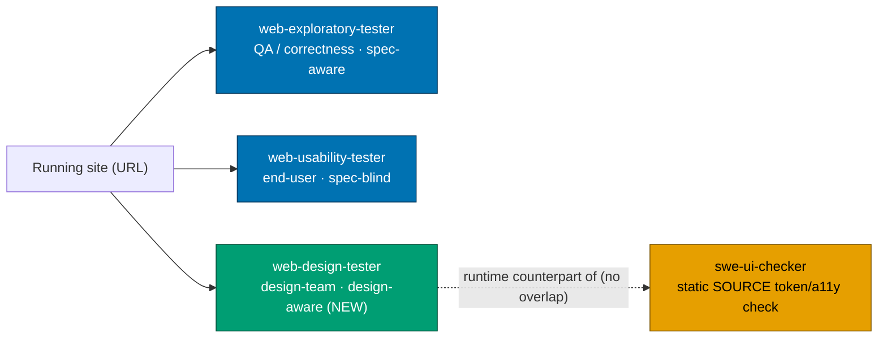
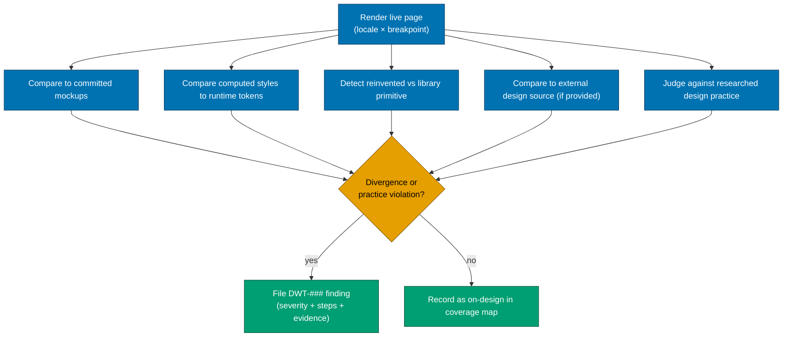
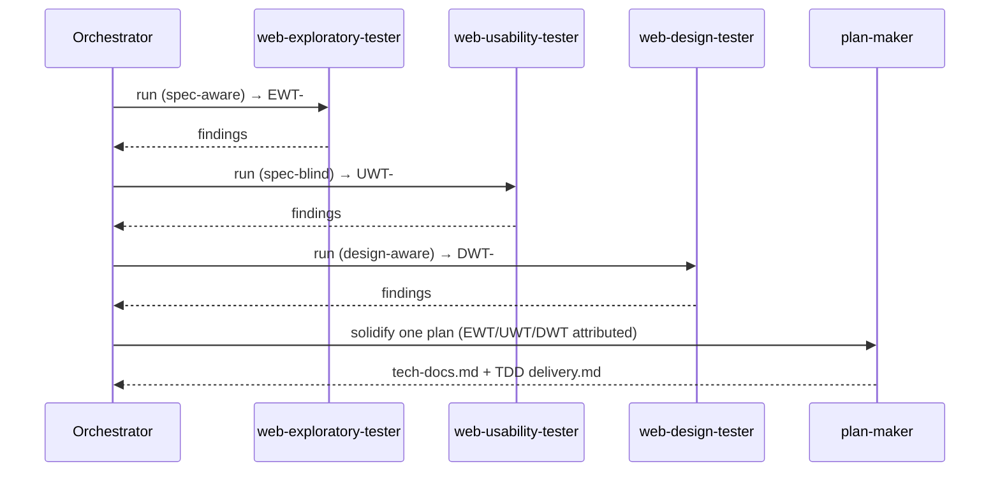
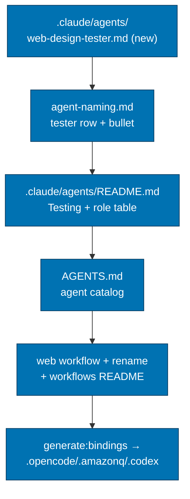

# Technical Documentation — Web Design Tester Agent

## Architecture Overview

`web-design-tester` is a **read-only, non-destructive live-site tester agent** — same execution
model as its two siblings. It drives a real browser against a running site, compares the rendered
result against five ground-truth sources, and emits a backlog plan. It writes only under
`plans/backlog/<dated-slug>/` (incl. `evidence/`), `local-temp/`, and the `plans/backlog/README.md`
index — nowhere else. It never commits, never modifies the site, never audits component source.

### The advocate triad

### Question each lens answers

| Agent                           | Lens             | Ground truth                                         | Answers                                                       |
| ------------------------------- | ---------------- | ---------------------------------------------------- | ------------------------------------------------------------- |
| `web-exploratory-tester`        | QA / correctness | `specs/**` Gherkin + recomputed values               | "is it correct?"                                              |
| `web-usability-tester`          | end-user         | usability principles + internal consistency          | "is it usable?"                                               |
| **`web-design-tester`**         | **design team**  | **mockups + tokens + primitives + ext + practice**   | **"does it match the design + follow good design practice?"** |
| `swe-ui-checker` (not a tester) | static QA        | component **source** vs token/a11y/pattern standards | "is the source compliant?"                                    |

## The Five Ground-Truth Sources (judged on the LIVE rendered page)

The charter MUST document all five, each judged against the **running** page:

1. **Committed plan-folder mockup assets** — the both-tier mockups the plan-doc UI-mockup convention
   requires (`./assets/ui-<screen>-…`), per
   [UI Mockups in Plan Docs](../../../repo-governance/conventions/formatting/diagrams/ui-mockups-principles-and-scope.md#ui-mockups-in-plan-docs-principles-in-practice-and-scope).
   The agent compares the rendered page to these and reports divergence as a `DWT-###` finding citing
   the mockup file.
2. **Design tokens / theme (colors, spacing, typography) at RUNTIME** — the **runtime counterpart** to
   `swe-ui-checker`'s static source check. The agent reads computed styles on the live page and
   compares them to the theme tokens; an inline-overridden color or off-scale spacing that the source
   check cannot see is a finding. **Must NOT duplicate** the static source-token audit.
3. **Design-system primitives (the shared component library)** — flags **reinvented UI** the shared
   library already provides. **Repo divergence**: `libs/web-ui` in **ose-public**; `libs/ts-ui` in
   **ose-primer** and **ose-infra**. The charter names the correct lib per repo.
4. **Optional external design source** — a Figma link or mockup URL passed **at invocation**. When
   provided, the agent fetches it (`WebFetch`) and compares the live page against it; when absent,
   this source is simply skipped (no finding for its absence).
5. **General design best-practice / UX / visual consistency / information density ("not cramped")** —
   grounded by delegating to `web-researcher` for current design-practice references (per the
   [Web Research Delegation Convention](../../../repo-governance/conventions/writing/web-research-delegation.md)),
   so judgements cite a principle, not a vibe.

### Ground-truth comparison flow

## The `swe-ui-checker` Boundary (pinned in the charter — HARD)

The charter MUST state the line in prose, both directions:

- **`web-design-tester`** = **live** mockup/token fidelity + design practice on a **RUNNING** page.
  Drives a browser, reads computed styles, screenshots per locale/breakpoint, files a backlog plan.
- **`swe-ui-checker`** = **static** source token/a11y/pattern compliance. Reads component **source**
  (`tools: Read, Glob, Grep, Write, Bash` — no browser), writes `generated-reports/`
  [Repo-grounded — `.claude/agents/swe-ui-checker.md`]. Never renders.

They are complementary, never overlapping: the design-tester is the **runtime** counterpart of the
**static** checker. The charter states explicitly that the design-tester does **not** audit source.

## Filing Format (triad symmetry — modelled on the siblings)

Modelled verbatim on `web-exploratory-tester`'s output section
[Repo-grounded — `.claude/agents/web-exploratory-tester.md` §Output]:

- `plans/backlog/<YYYY-MM-DD>__<slug>/` (date = `Bash date +%F`; slug from target + design goal).
- Documents: `README.md`, `brd.md`, `prd.md`, `findings.md`, `spec-gaps.md`, `evidence/`.
- Findings prefixed **`DWT-###`** (Design — Web Tester), severity-rated, with numbered
  steps-to-reproduce, expected (cite the mockup/token/primitive/external/practice ground truth) vs
  actual, and an evidence screenshot path in `evidence/`.
- Does **not** author `tech-docs.md`/`delivery.md` — those come from `plan-maker` on promotion; the
  README states the promotion path. (Same as siblings.)

## Locale + Evidence Awareness (MANDATORY — matches shipped parity work)

- Test **ALL supported locales** (discover from the app's i18n config — `apps/<app>/src/features/i18n/`
  or `next.config.ts`), per breakpoint **375 / 768 / 1280 px**.
- Capture cited screenshots into the plan's committed `evidence/` subfolder, named
  `phase-N-<description>-<locale>-<breakpoint>px.png`, per the
  [Evidence Capture Convention](../../../repo-governance/development/quality/evidence-capture.md).
- Use **Playwright MCP** for rendering/screenshots; **`web-researcher`** for design-practice grounding.

## Workflow Extension — Two Testers to Three

The existing workflow file
`repo-governance/workflows/web/web-exploratory-and-usability-test-fixing-planning.md` runs two testers
sequentially [Repo-grounded]. This plan extends it to **three** and renames it.

**Rename** (maintainer-chosen name): `web-exploratory-and-usability-test-fixing-planning` →
`web-ux-test-fixing-planning` (scope `web`, qualifier `ux` — the umbrella for the three live-site
UX-quality lenses: exploratory correctness, usability, and design — descriptor `test-fixing`, type
`planning`; parses per
[Workflow Naming Convention](../../../repo-governance/conventions/structure/workflow-naming.md)). The
shorter `ux` qualifier keeps the filename stable if a fourth UX lens is ever added, rather than
growing an ever-longer enumerated name. The intro names all three testers explicitly so the umbrella
term is not opaque.

**Changes**: add a third sequential pass (design), keep findings source-attributed
(`EWT-###`/`UWT-###`/`DWT-###`) synthesized into ONE plan; update the workflow's `name`/`title`/`goal`/
`termination`, intro, agent list, phases, Gherkin success criteria, and Related Documents. Update the
two index surfaces that reference it (`repo-governance/workflows/README.md` table row + intro bullet;
`repo-governance/workflows/web/README.md` purpose + agent list + workflow entry). Move/rename the file
with `git mv` to preserve history.

## Reciprocal Triad Complementarity (Phase 1b)

The new agent names its two siblings, but the triad is only truly mutually-aware once the **two
existing testers also name the design lens**. Phase 1b edits `web-exploratory-tester.md` and
`web-usability-tester.md` so every tester definition cross-references the other two and pins its
non-overlapping boundary. The invariant (verified by a gate loop in `delivery.md`): for each pair
`(a, b)` of distinct testers, `a`'s definition mentions `b`. All three also distinguish themselves
from `swe-ui-checker`'s static-source audit. This makes "the three agents complement each other" a
checkable property of the agent files, not merely a claim in the plan docs.

## Web-UI-Feature-Change 3-Tester Governance Rule (Phase 2c)

The repo already carries **Rule 15** of the
[User-Facing Delivery Hardening Convention](../../../repo-governance/development/quality/user-facing-delivery-hardening.md):
a web-UI plan must run one near-end `web-exploratory-tester` round and fix its findings before
archival. This plan **expands Rule 15 to the full triad** — the renamed `web-ux-test-fixing-planning`
workflow (exploratory + usability + design). A web-UI **feature-change** plan must, near the end of
delivery, run all three live-site testers to iron out rough edges and inconsistencies, record every
finding in `delivery.md` as an unchecked checkbox (source-attributed `EWT-###`/`UWT-###`/`DWT-###`),
and **fix them within the same plan-execution run** before archival. The rule is kept consistent
across six surfaces: the hardening convention itself, `AGENTS.md`, `plan-execution.md` (finalization
gate), `plan-maker.md` (emits the step), `plan-checker.md` (flags its absence), and
`plan-execution-checker.md` (verifies it ran). Scope: browser-rendered web-UI feature changes only —
excludes CLI/text output and pure-governance/agent-definition plans like THIS one.

## Registration Surfaces (per repo)

| #   | Surface                                                                                                                                                | Action                                                                                                        |
| --- | ------------------------------------------------------------------------------------------------------------------------------------------------------ | ------------------------------------------------------------------------------------------------------------- |
| 1   | `.claude/agents/web-design-tester.md` (NEW)                                                                                                            | Author; model on the two sibling tester files; same skills list shape                                         |
| 2   | `repo-governance/conventions/structure/agent-naming.md`                                                                                                | Add to `tester` role table row + the §Examples bullet                                                         |
| 3   | `.claude/agents/README.md`                                                                                                                             | Add to 🧪 Testing section + role table row                                                                    |
| 4   | `AGENTS.md`                                                                                                                                            | Add to the agent catalog (a Testing line in the catalog block)                                                |
| 5   | `repo-governance/workflows/web/web-exploratory-and-usability-test-fixing-planning.md` + `workflows/README.md` + `workflows/web/README.md`              | Rename to `web-ux-test-fixing-planning.md` + add third tester; update both index surfaces                     |
| 6   | `.claude/agents/web-exploratory-tester.md` + `.claude/agents/web-usability-tester.md` (Phase 1b)                                                       | Reciprocal complement: each names the other two testers + pins its boundary                                   |
| 7   | `user-facing-delivery-hardening.md` + `AGENTS.md` + `plan-execution.md` + `plan-maker.md` + `plan-checker.md` + `plan-execution-checker.md` (Phase 2c) | Expand Rule 15 to the three-tester web-UI-feature-change round; keep it consistent across the planning agents |
| 8   | bindings                                                                                                                                               | `npm run generate:bindings`; verify `validate:sync` + `harness:bindings-validation`                           |
| 9   | specs/Gherkin                                                                                                                                          | **N/A** — agents are not specced in this repo (see exemption below)                                           |
| 10  | `repo-rules-maker` sweep (Phase 7b)                                                                                                                    | One run per repo after propagation; weaves the new rules consistently across all surfaces                     |

> Surface #4 note: `AGENTS.md` currently lists agents under Content Creation / Validation / Fixing /
> Planning / Development / Operations / Content / Meta but has **no Testing line** and does **not**
> list the existing testers [Repo-grounded — `grep "tester" AGENTS.md` returns only the
>
> > hardening-convention bullet]. The surgical change is to add a **Testing** catalog line naming all
> > three testers (exploratory, usability, design) so the catalog reflects reality. Verify the exact
> > block at execution time and insert minimally.

## Specs & Gherkin Exemption (stated explicitly)

This plan touches **no** `apps/`, `libs/`, or `specs/` source — it is **agent-definition + governance-
doc only**. The [Specs & Gherkin Completeness two-path rule](../../../repo-governance/development/quality/feature-change-completeness.md)
is therefore **not triggered**: there is no observable app/lib behavior change to cover. The
**sibling testers carry no `specs/**`coverage** either [Repo-grounded —`grep -rn web-exploratory-tester specs/`returns nothing], confirming the precedent that agents are not specced here. The Gherkin
in`prd.md`is plan-level acceptance criteria, not`specs/**` feature files. **No `specs:coverage`
delivery steps are required.\*\*

## Three-Repo Localization Map (surgical-topic propagation, NOT byte-copy)

The change lands topic-identically in `ose-public`, `ose-primer`, `ose-infra`; localize these tokens:

| Token in ose-public      | ose-primer / ose-infra | Where it appears                                |
| ------------------------ | ---------------------- | ----------------------------------------------- |
| `libs/web-ui`            | `libs/ts-ui`           | agent charter ground-truth source #3            |
| `specs:coverage`         | `spec-coverage`        | any specs target reference (none expected here) |
| ose-public app/lib names | per-repo app/lib names | examples in the charter, if any are named       |

Per-repo specifics to verify before editing:

- **Binding script names** — confirm each repo's `package.json` exposes `generate:bindings`,
  `validate:sync`, `harness:bindings-validation` (names may differ; ose-public uses exactly these
  [Repo-grounded — `package.json`]). Use each repo's actual script names.
- **No worktrees (maintainer directive for this plan)** — all three repos are edited directly on
  `main` in their primary checkouts; no `git worktree` is created. `ose-infra` is edited in place at
  `~/ose-projects/ose-infra` on `main` (confirm `git status` works there before committing).
- Confirm the workflow file + both workflow index surfaces exist in each repo before renaming.

## Dependencies

- **Playwright MCP** (rendering/screenshots) — already used by the sibling testers.
- **`web-researcher`** agent (design-practice grounding) — already present
  [Repo-grounded — `.claude/agents/web-researcher.md`].
- **`rhino-cli harness` binding pipeline** — drives `generate:bindings` / `validate:sync` /
  `harness:bindings-validation` [Repo-grounded — `package.json`].

## Testing Strategy

No production code is written, so there is no unit/integration/E2E test layer for this plan. Verification
is **doc/structural**: grep-based assertions that each registration surface contains
`web-design-tester`, the binding validators pass, markdown gates pass, and each repo's pre-push + CI
go green. These are expressed as Phase Gate checks in `delivery.md` (each an independently verifiable
command), mapping to the `prd.md` Gherkin scenarios:

| `prd.md` scenario                                 | Verified by (delivery)                                          |
| ------------------------------------------------- | --------------------------------------------------------------- |
| Agent file exists with correct metadata           | `grep` frontmatter assertions in Phase 1 gate                   |
| Charter pins runtime-vs-static boundary           | `grep "swe-ui-checker"` + boundary phrase in Phase 1 gate       |
| Five ground-truth sources documented              | `grep` for each source label in Phase 1 gate                    |
| Filed as backlog plan matching siblings           | structural review of the Output section in Phase 1 gate         |
| Registered across every governance surface        | `grep web-design-tester` across surfaces in Phase 2 gate        |
| Bindings re-synced and validate clean             | `validate:sync` + `harness:bindings-validation` exit 0, Phase 3 |
| Workflow runs three testers, source-attributed    | `grep` workflow name/agent-list/attribution in Phase 2 gate     |
| Three testers reciprocally complement             | mutual-cross-reference gate loop in Phase 1b gate               |
| Rule 15 binds the triad, consistent across agents | three-tester greps across the six surfaces in Phase 2c gate     |
| Three-repo parity with localization               | per-repo gates in Phases 6–7                                    |
| Governance consistency swept per repo             | `repo-rules-maker` zero-findings in Phase 7b gate               |

## Rollback

Pure additive governance change. To roll back: `git revert` the commit(s) per repo, re-run
`generate:bindings`, and `git mv` the workflow file back to its original name. No data migration, no
runtime dependency.

## Related Documents

- [`brd.md`](./brd.md) · [`prd.md`](./prd.md) · [`delivery.md`](./delivery.md)
- [Agent Naming Convention](../../../repo-governance/conventions/structure/agent-naming.md)
- [Governance Vendor-Independence Convention](../../../repo-governance/conventions/structure/governance-vendor-independence.md)
- [Evidence Capture Convention](../../../repo-governance/development/quality/evidence-capture.md)
