# Delivery Checklist — Cost-of-Living Calculator Fix

> **Legend** — `[AI]`: an agent performs the step (the default; unmarked steps are `[AI]`).
> `[HUMAN]`: only a human can do it (physical action, out-of-band approval, real-secret or
> privileged-credential handling). `[AI+HUMAN]`: agent prepares, human approves or finishes.
>
> **Phase Gate** — every phase ends with a `### Phase N Gate`: a must-pass verification
> checklist plus a **Pause Safety** note (the safe-to-stop state after the phase and the
> single command to resume). A phase is **not complete until its gate is green**; do not start
> phase N+1 while any check in phase N's gate is failing.

## Worktree

Worktree path: `worktrees/ayokoding-www-cost-of-living-calculator-test-fixing/`

Optional manual pre-provisioning (run from repo root):

```bash
claude --worktree ayokoding-www-cost-of-living-calculator-test-fixing
```

The plan-execution Step 0 gate enters this worktree by default: it auto-provisions from the latest
`origin/main` when missing, syncs with `origin/main` before implementing, and prompts before
deleting the worktree after the plan is archived and pushed.

See [Worktree Path Convention](../../../repo-governance/conventions/structure/worktree-path.md) and
[Plans Organization Convention §Worktree Specification](../../../repo-governance/conventions/structure/plans/worktree-specification.md#worktree-specification).

---

## 13-Phase Delivery Flow

```mermaid
%% Color Palette: Blue #0173B2, Orange #DE8F05, Teal #029E73, Gray #808080
%% All colors are color-blind friendly and meet WCAG AA contrast standards

flowchart LR
  P0["Phase 0<br/>Baseline"]:::blue
  P1["Phase 1<br/>Specs/Gherkin"]:::teal
  P2["Phase 2<br/>Dual Currency"]:::teal
  P3["Phase 3<br/>Locale Names"]:::teal
  P4["Phase 4<br/>Tool Identity"]:::teal
  P5["Phase 5<br/>Controls"]:::teal
  P6["Phase 6<br/>Tab Labels"]:::teal
  P7["Phase 7<br/>Empty States"]:::orange
  P8["Phase 8<br/>Mobile Card"]:::teal
  P9["Phase 9<br/>Clusters H-O"]:::teal
  P10["Phase 10<br/>Verification"]:::orange
  P11["Phase 11<br/>Rule-15 Retest"]:::teal
  P12["Phase 12<br/>Archival"]:::blue

  P0 --> P1
  P1 --> P2
  P2 --> P3
  P3 --> P4
  P4 --> P5
  P5 --> P6
  P6 --> P7
  P7 --> P8
  P8 --> P9
  P9 --> P10
  P10 --> P11
  P11 --> P12

  classDef blue fill:#0173B2,stroke:#000000,color:#FFFFFF,stroke-width:2px
  classDef teal fill:#029E73,stroke:#000000,color:#FFFFFF,stroke-width:2px
  classDef orange fill:#DE8F05,stroke:#000000,color:#FFFFFF,stroke-width:2px
```



> Phase 7 and Phase 10 are gated: Phase 7 requires the `[HUMAN]` hi-fi sign-off (step 7.0) before
> code lands; Phase 10 requires manual Playwright MCP verification across all locales × breakpoints.

---

TDD-shaped (RED → GREEN → REFACTOR), Phase 0 first, every code item naming a file path, a verbatim
command, and an acceptance criterion. This is **not yet executed** — it runs later via the
[Plan Execution workflow](../../../repo-governance/workflows/plan/plan-execution.md).

Verbatim commands (run from repo root):

- Unit: `npx nx run ayokoding-www:test:unit`
- Specs coverage: `npx nx run ayokoding-www:specs:coverage`
- Lint: `npx nx run ayokoding-www:lint`
- Typecheck: `npx nx run ayokoding-www:typecheck`
- FE E2E: `npx nx run ayokoding-www-fe-e2e:test:e2e`
- Dev server (for manual/behavioural checks): `npx nx dev ayokoding-www` (port 3101)

---

## Phase 0 — Setup & baseline

- [ ] [AI] **0.1** Confirm clean tree and run `npm install` + `npm run doctor -- --fix`.
- [ ] [AI] **0.2** Warm baseline: `npx nx run ayokoding-www:test:unit`, `:lint`, `:typecheck`,
      `:specs:coverage` all green before any change. Record any pre-existing failure and fix it first
      (Root-Cause Orientation).
- [ ] [AI] **0.3** Start the dev server (`npx nx dev ayokoding-www`) and reconfirm the 29 findings
      still reproduce (the plan is a 2026-06-20 snapshot). Mark any already-fixed finding as
      STILL-PRESENT / FIXED.

### Phase 0 Gate

> All checks below must pass before starting Phase 1.

- [ ] [AI] `npx nx run ayokoding-www:test:unit` — exits 0.
- [ ] [AI] `npx nx run ayokoding-www:lint` — exits 0.
- [ ] [AI] `npx nx run ayokoding-www:typecheck` — exits 0.
- [ ] [AI] `npx nx run ayokoding-www:specs:coverage` — exits 0.
- [ ] [AI] 29 findings confirmed STILL-PRESENT or FIXED in the baseline log.

> **Pause Safety**: repo is unmodified; baseline established. Safe to stop. To resume: re-run
> `npx nx run ayokoding-www:test:unit lint typecheck specs:coverage` and verify all exit 0.

---

## Phase 1 — Specs & Gherkin (accepted proposals)

Fold the grill-accepted scenarios into
`specs/apps/ayokoding/behavior/ayokoding-www/gherkin/tools/cost-of-living-calculator.feature` so
they exist as failing acceptance criteria before code. Accepted set (from the Phase 4 grill — all
in scope): `SG-001…006`, `USS-001…005`, `SG-D-001…004`.

- [ ] [AI] **1.1** Add the dual-currency, locale-name, identity, empty-state, segmented-control,
      tab-label, mobile-card, area-toggle, tools-index, and mobile-nav-drawer scenarios to
      `specs/apps/ayokoding/behavior/ayokoding-www/gherkin/tools/cost-of-living-calculator.feature`.
      — acceptance: file adds all accepted scenarios (including UWT-011 mobile nav scenario);
      no existing scenario removed.
- [ ] [AI] **1.2** Run `npx nx run ayokoding-www:specs:coverage` — acceptance: passes structurally;
      no orphan scenario.
- [ ] [AI] **1.3** Dedupe against existing scenarios; preserve source-attribution comments.
      — acceptance: `npx nx run ayokoding-www:lint` exits 0.

### Phase 1 Gate

> All checks below must pass before starting Phase 2.

- [ ] [AI] `npx nx run ayokoding-www:specs:coverage` — exits 0, no orphan scenario.
- [ ] [AI] `npx nx run ayokoding-www:lint` — exits 0.
- [ ] [AI] New Gherkin scenarios for all accepted proposals are present in the `.feature` file.

> **Pause Safety**: spec file updated with accepted scenarios; no production code changed. Safe
> to stop. To resume: `npx nx run ayokoding-www:specs:coverage` must still exit 0.

---

## Phase 2 — Cluster A: Dual-currency display (Critical)

- [x] [AI] **2.1 RED**: add `fmtDualCurrency` unit tests in
      `apps/ayokoding-www/src/features/cost-of-living-calculator/core/format.test.ts`
      (e.g. `fmtDualCurrency(3500,"SGD",2250)` → `"SGD 3,500 / $2,250"`).
      Cmd: `npx nx run ayokoding-www:test:unit`.
      **Acceptance**: new test fails (symbol not yet in core).

  **Implementation notes (2026-06-20)**: Created `core/format.test.ts` with 4 tests for
  `fmtDualCurrency`. All 4 fail: "fmtDualCurrency is not a function" (export absent from
  core/format.ts). Test suite: 4 failed | 1847 passed.

  **Gherkin (binds) →** "Money cells show dual currency in the cost-of-living table"

  ```gherkin
  Scenario: Money cells show dual currency in the cost-of-living table
    Given the user is on the "Cost of living" tab at desktop width
    When the table renders with at least one city row
    Then every monetary cell shows the city's local currency amount and the USD equivalent
    And no money cell shows a bare integer without a currency label
  ```

- [x] [AI] **2.2 GREEN**: move/promote `fmtDualCurrency` from
      `apps/ayokoding-www/src/features/cost-of-living-calculator/shell/city-detail.tsx` into
      `apps/ayokoding-www/src/features/cost-of-living-calculator/core/format.ts`; wire every money
      cell in `apps/ayokoding-www/src/features/cost-of-living-calculator/shell/cost-of-living.tsx`
      and `apps/ayokoding-www/src/features/cost-of-living-calculator/shell/savings.tsx` (desktop
      tables + mobile cards) to it. Cmd: `npx nx run ayokoding-www:test:unit`. **Acceptance**: unit
      green; no bare-integer money cell in either table.

  **Implementation notes (2026-06-20)**: Added `fmtDualCurrency` to core/format.ts using `$`
  prefix for USD (`"SGD 3,500 / $2,250"` format). Wired all 11 money cells in cost-of-living.tsx
  (desktop + mobile) using `fxToUsd(dataset.fx, city.currency)` for conversion. Wired all 6 USD
  money cells in savings.tsx using `usdAmount / fxRate` for local equivalent. Updated 2 pre-existing
  EWT-002 tests in city-detail.test.tsx that checked for `/USD/i` (old format) → now check for
  `/$` and `/SGD/`. All 1851 tests pass.

- [x] [AI] **2.3 REFACTOR**: single import path; remove the now-duplicate local helper in
      `apps/ayokoding-www/src/features/cost-of-living-calculator/shell/city-detail.tsx`.
      Cmd: `npx nx run ayokoding-www:lint typecheck`. **Acceptance**: lint + typecheck green.

  **Implementation notes (2026-06-20)**: Imported `fmtDualCurrency` from core/format in
  city-detail.tsx; removed local helper def; removed now-unused `fmtNum` import from
  cost-of-living.tsx. Lint + typecheck clean.

### Phase 2 Gate

> All checks below must pass before starting Phase 3.

- [x] [AI] `npx nx run ayokoding-www:test:unit` — all tests pass including new `fmtDualCurrency` tests.
- [x] [AI] `npx nx run ayokoding-www:lint typecheck` — exits 0.
- [x] [AI] No bare-integer money cell in `cost-of-living.tsx` or `savings.tsx`.

> **Pause Safety**: dual-currency formatter promoted to core; tables updated. Safe to stop. To
> resume: `npx nx run ayokoding-www:test:unit` must pass.

---

## Phase 3 — Cluster B: Locale-name leak on id desktop (Major)

- [x] [AI] **3.1 RED**: component test asserting the id desktop cost table renders "Singapura"/"Jepang"
      (not "Singapore"/"Japan") in
      `apps/ayokoding-www/src/features/cost-of-living-calculator/shell/cost-of-living.test.tsx`;
      mirror for `savings.test.tsx` and `min-role.test.tsx`.
      Cmd: `npx nx run ayokoding-www:test:unit`. **Acceptance**: tests fail.

  **Implementation notes (2026-06-20)**: Added RED tests to cost-of-living.test.tsx (2),
  savings.test.tsx (2), min-role.test.tsx (2). Cost-of-living had multi-match issue
  (`getByText` found both country link + city link "Singapura") — fixed to use
  `getAllByRole("link").filter(href includes "country=")`. min-role tests failed because
  locale="id" translates aria-labels, so `/baseline source/i` query fails — fixed to use
  `container.querySelector("#baseline-source-select")` + `#target-amount-input`. Also
  changed min-role id tests to use `cityScope` scoped to sg/jp cities so best-city is
  deterministic. All 1857 tests pass now.

  **Gherkin (binds) →** "id-locale tables use Indonesian city and country names"

  ```gherkin
  Scenario: id-locale tables use Indonesian city and country names
    Given the user is on "/id/tools/cost-of-living-calculator" at desktop width
    When the cost-of-living, savings, or minimum-role table renders
    Then the Country and City columns show Indonesian names where translations exist
    And names lacking an Indonesian translation fall back to English
  ```

- [x] [AI] **3.2 GREEN**: export `localeName` from
      `apps/ayokoding-www/src/features/cost-of-living-calculator/shell/geo-filters.tsx` (or move to
      `../core/`); replace `.name.en` with `localeName(name, locale)` in the country/city cells of
      `shell/cost-of-living.tsx` (~128/131), `shell/savings.tsx` (~150/153),
      `shell/min-role.tsx` `RoleRow` (~133/134) + mobile role cards.
      Cmd: `npx nx run ayokoding-www:test:unit`. **Acceptance**: unit green; English fallback retained.

  **Implementation notes (2026-06-20)**: `localeName` already existed in geo-filters.tsx
  (private). Added `export` keyword. Wired into cost-of-living.tsx (desktop country/city
  links), savings.tsx (desktop + mobile), min-role.tsx (`RoleRow` + mobile role cards +
  city picker dropdowns). All 1857 tests pass.

- [x] [AI] **3.3 REFACTOR**: one shared helper, no duplicate definitions.
      Cmd: `npx nx run ayokoding-www:lint typecheck`.

  **Implementation notes (2026-06-20)**: Single exported `localeName` in geo-filters.tsx;
  all three tables import from there. Lint + typecheck clean (only pre-existing a11y
  warnings, no errors).

### Phase 3 Gate

> All checks below must pass before starting Phase 4.

- [x] [AI] `npx nx run ayokoding-www:test:unit` — id locale-name tests pass.
- [x] [AI] `npx nx run ayokoding-www:lint typecheck` — exits 0.

> **Pause Safety**: id locale names fixed in all three tables. Safe to stop. To resume:
> `npx nx run ayokoding-www:test:unit` must pass.

---

## Phase 4 — Cluster C: Tool identity (Critical)

- [x] [AI] **4.1 RED**: test that the en H1/`calcTitle` is "Cost of Living Calculator" and the id
      `<title>` is localized in
      `apps/ayokoding-www/src/features/cost-of-living-calculator/shell/calculator-content.test.tsx`
      (co-located in `shell/`) + a metadata test.
      Cmd: `npx nx run ayokoding-www:test:unit`.

  **Implementation notes (2026-06-20)**: Added 2 tests in `calculator-content.test.tsx` under
  "Phase 4 — H1 matches tool identity": en H1 must match `/cost of living calculator/i` and
  id `generateMetadata` title must match `/kalkulator biaya hidup/i`. Both FAIL as expected
  (current calcTitle="Salary Savings Calculator"; metadata is hardcoded non-locale).

  **Gherkin (binds) →** "Page heading matches the tool identity in each locale"

  ```gherkin
  Scenario: Page heading matches the tool identity in each locale
    Given the user opens "/en/tools/cost-of-living-calculator"
    When the page renders
    Then the H1 reads "Cost of Living Calculator"
    And the browser title starts with "Cost of Living Calculator"
    And the active tab reads "Cost of living"
  ```

- [x] [AI] **4.2 GREEN**: `apps/ayokoding-www/src/features/i18n/core/translations.ts` `calcTitle` →
      "Cost of Living Calculator" (en l.25) / "Kalkulator Biaya Hidup" (id l.179); route the
      locale-aware name through `generateMetadata` in
      `apps/ayokoding-www/src/app/[locale]/tools/cost-of-living-calculator/page.tsx`.
      Cmd: `npx nx run ayokoding-www:test:unit`. **Acceptance**: H1, `<title>`, tab agree per locale
      (closes UWT-013 too).

  **Implementation notes (2026-06-20)**: Changed en `calcTitle` from "Salary Savings Calculator"
  to "Cost of Living Calculator"; id `calcTitle` from "Kalkulator Tabungan Gaji" to "Kalkulator
  Biaya Hidup". Updated `generateMetadata` in page.tsx to read locale from params and return
  `t(locale, "calcTitle") + " | AyoKoding"`. All 1859 tests pass.

- [x] [AI] **4.3 REFACTOR**: Cmd: `npx nx run ayokoding-www:lint typecheck`.

  **Implementation notes (2026-06-20)**: Lint (warnings only, no errors) + typecheck clean.

### Phase 4 Gate

> All checks below must pass before starting Phase 5.

- [x] [AI] `npx nx run ayokoding-www:test:unit` — tool-identity tests pass.
- [x] [AI] `npx nx run ayokoding-www:lint typecheck` — exits 0.

> **Pause Safety**: tool name consistent across H1, title, and tab in both locales. Safe to stop.
> To resume: `npx nx run ayokoding-www:test:unit` must pass.

---

## Phase 5 — Cluster D: Unstyled controls → primitives (Major)

- [ ] [AI] **5.1 RED**: tests that the gross-salary field uses the `Input` primitive (has border/radius
      classes), the baseline control is a segmented control (role=group of buttons, not a `<select>`),
      and the sort button has `aria-label`. Files:
      `apps/ayokoding-www/src/features/cost-of-living-calculator/shell/savings.test.tsx`,
      `apps/ayokoding-www/src/features/cost-of-living-calculator/shell/min-role.test.tsx`.
      Cmd: `npx nx run ayokoding-www:test:unit`.

  **Gherkin (binds) →** "Gross-salary input uses the design-system Input primitive"

  ```gherkin
  Scenario: Gross-salary input uses the design-system Input primitive
    Given the user is on the "Savings" tab
    When the tab renders
    Then the gross-salary field renders with a visible border, design-token radius, and padding
    And it is paired with a Label primitive
  ```

- [ ] [AI] **5.2 GREEN**: swap raw `<input>`→`<Input>`+`<Label>`
      (`apps/ayokoding-www/src/features/cost-of-living-calculator/shell/savings.tsx` ~93–104);
      `<select>`→`SegmentedControl` + plain-language label + inline help
      (`apps/ayokoding-www/src/features/cost-of-living-calculator/shell/min-role.tsx` ~163–175,
      closes UWT-006); sort `<button>`→`Button variant="ghost"` + `aria-label`
      (`apps/ayokoding-www/src/features/cost-of-living-calculator/shell/savings.tsx` ~121–129,
      closes UWT-008/DWT-007). Cmd: `npx nx run ayokoding-www:test:unit`.
- [ ] [AI] **5.3 REFACTOR**: Cmd: `npx nx run ayokoding-www:lint typecheck`.

### Phase 5 Gate

> All checks below must pass before starting Phase 6.

- [ ] [AI] `npx nx run ayokoding-www:test:unit` — controls primitive tests pass.
- [ ] [AI] `npx nx run ayokoding-www:lint typecheck` — exits 0.

> **Pause Safety**: design-system primitives wired; unstyled controls replaced. Safe to stop. To
> resume: `npx nx run ayokoding-www:test:unit` must pass.

---

## Phase 6 — Cluster E: Tab labels (Major)

- [ ] [AI] **6.1 RED**: test that each `TabsTrigger` visible text is the label only (no fused
      description) and the description is referenced via `aria-describedby`. File:
      `apps/ayokoding-www/src/features/cost-of-living-calculator/shell/calculator-content.test.tsx`
      (co-located in `shell/`). Cmd: `npx nx run ayokoding-www:test:unit`.

  **Gherkin (binds) →** "Tab labels are clean single phrases"

  ```gherkin
  Scenario: Tab labels are clean single phrases
    Given the user views the tab bar at any breakpoint
    When the tab bar renders
    Then each tab trigger's visible text is its label only, with the description not fused into it
  ```

- [ ] [AI] **6.2 GREEN**: move the sr-only description out of `<TabsTrigger>` in
      `apps/ayokoding-www/src/app/[locale]/tools/cost-of-living-calculator/calculator-content.tsx`
      (~122–134) and wire `aria-describedby`.
      Cmd: `npx nx run ayokoding-www:test:unit`.
- [ ] [AI] **6.3 REFACTOR**: Cmd: `npx nx run ayokoding-www:lint typecheck`.

### Phase 6 Gate

> All checks below must pass before starting Phase 7.

- [ ] [AI] `npx nx run ayokoding-www:test:unit` — tab-label tests pass.
- [ ] [AI] `npx nx run ayokoding-www:lint typecheck` — exits 0.

> **Pause Safety**: tab labels cleaned; descriptions moved to `aria-describedby`. Safe to stop.
> To resume: `npx nx run ayokoding-www:test:unit` must pass.

---

## Phase 7 — Cluster F: Empty states (Major, net-new UI)

> **F11 Residual**: hi-fi `.excalidraw.png` finalists for the two empty states cannot be
> auto-generated. Step 7.0 is a `[HUMAN]` gate that must produce these files before the
> empty-state code lands. See also `assets/README.md` and the Prior Art note in
> `assets/ui-empty-states-low-fi-alternatives.md §Prior Art (R7)`.

- [ ] [HUMAN] **7.0** Produce the hi-fi finalists
      `assets/ui-empty-states-savings-option-a.excalidraw.png` and
      `assets/ui-empty-states-min-role-option-a.excalidraw.png` (mobile + desktop frames each),
      token-only colors, and sign off the design funnel.
      **Acceptance**: both PNGs committed and referenced here before 7.1 begins.
      Observable resume signal: `ls plans/in-progress/ayokoding-www-cost-of-living-calculator-test-fixing/assets/*.png`
      returns both files; verify with
      `git log --oneline plans/in-progress/ayokoding-www-cost-of-living-calculator-test-fixing/assets/`.

- [ ] [AI] **7.1 RED**: tests that the Savings tab with empty salary shows the prompt and **no**
      negative figures; same for Minimum-role with empty target. Files:
      `apps/ayokoding-www/src/features/cost-of-living-calculator/shell/savings.test.tsx`,
      `apps/ayokoding-www/src/features/cost-of-living-calculator/shell/min-role.test.tsx`.
      Cmd: `npx nx run ayokoding-www:test:unit`.

  **Gherkin (binds) →** "Savings tab shows an empty state before any salary is entered"

  ```gherkin
  Scenario: Savings tab shows an empty state before any salary is entered
    Given the user clicks the "Savings" tab with the gross-salary field empty
    When the tab renders
    Then an instructional message is shown
    And no negative savings figures are displayed
  ```

- [ ] [AI] **7.2 GREEN**: add the empty-state branch to
      `apps/ayokoding-www/src/features/cost-of-living-calculator/shell/savings.tsx` and
      `apps/ayokoding-www/src/features/cost-of-living-calculator/shell/min-role.tsx` using
      `libs/web-ui` Card/text; localized strings — en: "Enter your gross monthly salary above to see
      your savings per city." / "Enter a monthly savings target above to see which roles would meet
      it."; id equivalents in
      `apps/ayokoding-www/src/features/i18n/core/translations.ts`.
      Cmd: `npx nx run ayokoding-www:test:unit`.
- [ ] [AI] **7.3 REFACTOR**: Cmd: `npx nx run ayokoding-www:lint typecheck`.

### Phase 7 Gate

> All checks below must pass before starting Phase 8.

- [ ] [HUMAN] Step 7.0 sign-off confirmed: both `.excalidraw.png` finalists committed.
      Observable resume signal: `ls plans/in-progress/ayokoding-www-cost-of-living-calculator-test-fixing/assets/*.png`
      returns both files.
- [ ] [AI] `npx nx run ayokoding-www:test:unit` — empty-state tests pass.
- [ ] [AI] `npx nx run ayokoding-www:lint typecheck` — exits 0.

> **Pause Safety**: empty-state branches implemented and tested. Safe to stop. To resume:
> `npx nx run ayokoding-www:test:unit` must pass.

---

## Phase 8 — Cluster G: Mobile cost card country (Major)

- [ ] [AI] **8.1 RED**: test that the mobile cost card header shows both city and country (both
      locales). File:
      `apps/ayokoding-www/src/features/cost-of-living-calculator/shell/cost-of-living.test.tsx`.
      Cmd: `npx nx run ayokoding-www:test:unit`.

  **Gherkin (binds) →** "Mobile cost card header shows city and country"

  ```gherkin
  Scenario: Mobile cost card header shows city and country
    Given the user views the "Cost of living" tab at 375px
    When the mobile cards render
    Then each card header shows both the city name and its country name in the current locale
  ```

- [ ] [AI] **8.2 GREEN**: add the country link beside the city link in the cost card header in
      `apps/ayokoding-www/src/features/cost-of-living-calculator/shell/cost-of-living.tsx` (~219),
      mirroring `savings.tsx` ~202. Cmd: `npx nx run ayokoding-www:test:unit`. (Closes
      EWT-001/DWT-002.)
- [ ] [AI] **8.3 REFACTOR**: Cmd: `npx nx run ayokoding-www:lint typecheck`.

### Phase 8 Gate

> All checks below must pass before starting Phase 9.

- [ ] [AI] `npx nx run ayokoding-www:test:unit` — mobile card country tests pass.
- [ ] [AI] `npx nx run ayokoding-www:lint typecheck` — exits 0.

> **Pause Safety**: mobile cost card country added; mirrors savings card pattern. Safe to stop.
> To resume: `npx nx run ayokoding-www:test:unit` must pass.

---

## Phase 9 — Clusters H–O: remaining findings

> Each sub-cluster below follows RED → GREEN → REFACTOR. Run
> `npx nx run ayokoding-www:test:unit` after each GREEN; run
> `npx nx run ayokoding-www:lint typecheck` after each REFACTOR.

### Cluster H — Area-toggle feedback (UWT-005)

- [ ] [AI] **9.1 RED**: add failing test asserting a visible transition/caption on area change in
      `apps/ayokoding-www/src/features/cost-of-living-calculator/shell/cost-of-living.test.tsx`.
      Cmd: `npx nx run ayokoding-www:test:unit`. **Acceptance**: test fails.

  **Gherkin (binds) →** "Area toggle shows a visible signal when the table recalculates"

  ```gherkin
  Scenario: Area toggle shows a visible signal when the table recalculates
    Given the user is on the "Cost of living" tab
    When the user toggles the Area control between "City center" and "Rural"
    Then a visible signal (transition or caption) indicates the table recalculated
  ```

- [ ] [AI] **9.1 GREEN**: add a table transition/caption on area change in
      `apps/ayokoding-www/src/features/cost-of-living-calculator/shell/cost-of-living.tsx`.
      Cmd: `npx nx run ayokoding-www:test:unit`. **Acceptance**: USS-003 scenario green.
- [ ] [AI] **9.1 REFACTOR**: Cmd: `npx nx run ayokoding-www:lint typecheck`. **Acceptance**: exits 0.

### Cluster I — 320 px household controls (UWT-010/DWT-011)

- [ ] [AI] **9.2 RED**: add failing test asserting no mid-pair wrap at 320 px for label+select in
      `apps/ayokoding-www/src/features/cost-of-living-calculator/shell/controls.test.tsx` (_New test_).
      Cmd: `npx nx run ayokoding-www:test:unit`. **Acceptance**: test fails.

  **Gherkin (binds) →** "Household controls keep label attached to input at 320 px"

  ```gherkin
  Scenario: Household controls keep label attached to input at 320 px
    Given the user is on the calculator at 320 px viewport width
    When the household controls render
    Then each label remains visually adjacent to its own input with no mid-pair line break
  ```

- [ ] [AI] **9.2 GREEN**: wrap each label+select as a single `flex items-center gap-1` unit in
      `apps/ayokoding-www/src/features/cost-of-living-calculator/shell/controls.tsx`.
      Cmd: `npx nx run ayokoding-www:test:unit`. **Acceptance**: no mid-pair wrap at 320 px.
- [ ] [AI] **9.2 REFACTOR**: Cmd: `npx nx run ayokoding-www:lint typecheck`. **Acceptance**: exits 0.

### Cluster J — id Area label length (DWT-010)

- [ ] [AI] **9.3 RED**: add failing test asserting id `labelArea` renders without wrap at 375 px in
      `apps/ayokoding-www/src/features/cost-of-living-calculator/shell/controls.test.tsx`.
      Cmd: `npx nx run ayokoding-www:test:unit`. **Acceptance**: test fails.

  **Gherkin (binds) →** "id Area label does not wrap at 375 px"

  ```gherkin
  Scenario: id Area label does not wrap at 375 px
    Given the user is on the id locale at 375 px viewport width
    When the household controls render
    Then the Area label text does not wrap across two lines
  ```

- [ ] [AI] **9.3 GREEN**: shorten id `labelArea` (e.g. "Area" / "Lokasi") in
      `apps/ayokoding-www/src/features/i18n/core/translations.ts` and/or apply `whitespace-nowrap`.
      Cmd: `npx nx run ayokoding-www:test:unit`. **Acceptance**: no button wrap at ≤375 px on id.
- [ ] [AI] **9.3 REFACTOR**: Cmd: `npx nx run ayokoding-www:lint typecheck`. **Acceptance**: exits 0.

### Cluster K — Tools index raw i18n keys (UWT-004)

- [ ] [AI] **9.4 RED**: add failing test asserting `/en/tools` and `/id/tools` render localized
      headings and links (not raw key strings) in a tools-page test file
      (`apps/ayokoding-www/src/app/[locale]/tools/tools-page.test.tsx` — _New test_).
      Cmd: `npx nx run ayokoding-www:test:unit`. **Acceptance**: test fails with raw keys visible.

  **Gherkin (binds) →** "Tools index renders localized text"

  ```gherkin
  Scenario: Tools index renders localized text
    Given the user navigates to "/en/tools" or "/id/tools"
    When the tools index page renders
    Then all headings and links display localized text
    And no raw i18n key strings are visible
  ```

- [ ] [AI] **9.4 GREEN**: add `toolsPageTitle` / `toolsPageCalcLink` entries (en + id) to
      `apps/ayokoding-www/src/features/i18n/core/translations.ts`; verify
      `apps/ayokoding-www/src/app/[locale]/tools/page.tsx` references them.
      Cmd: `npx nx run ayokoding-www:test:unit`. **Acceptance**: `/{en,id}/tools` render localized
      text, no raw keys.
- [ ] [AI] **9.4 REFACTOR**: Cmd: `npx nx run ayokoding-www:lint typecheck`. **Acceptance**: exits 0.

### Cluster L — Locale URL casing (UWT-012)

- [ ] [AI] **9.5 RED**: add failing test for lowercase-redirect in
      `apps/ayokoding-www/src/features/i18n/shell/middleware.test.ts` asserting `/EN/…` → `/en/…`.
      Cmd: `npx nx run ayokoding-www:test:unit`. **Acceptance**: test fails.

  **Gherkin (binds) →** "Uppercase locale URL redirects to canonical lowercase"

  ```gherkin
  Scenario: Uppercase locale URL redirects to canonical lowercase
    Given the user requests "/EN/tools/cost-of-living-calculator"
    When the middleware processes the request
    Then the server redirects to "/en/tools/cost-of-living-calculator"
  ```

- [ ] [AI] **9.5 GREEN**: add redirect logic lowercasing the locale segment to
      `apps/ayokoding-www/src/features/i18n/shell/middleware.ts` (the implementation; the root
      `apps/ayokoding-www/src/middleware.ts` re-exports it and need not change).
      Cmd: `npx nx run ayokoding-www:test:unit`. **Acceptance**: test passes; `/EN/…` redirects
      308 to `/en/…`.
- [ ] [AI] **9.5 REFACTOR**: `npx nx run ayokoding-www:lint typecheck` — exits 0.

### Cluster M — City-detail visible section labels (EWT-004)

- [ ] [AI] **9.6 RED**: add failing test that `city-detail.tsx` renders visible `<h2>` headings for
      "Monthly expenses" and "Relocation costs" (not only `aria-label`). File:
      `apps/ayokoding-www/src/features/cost-of-living-calculator/shell/city-detail.test.tsx`
      (_New test_). Cmd: `npx nx run ayokoding-www:test:unit`. **Acceptance**: test fails.

  **Gherkin (binds) →** "City-detail section headings are visible to sighted users"

  ```gherkin
  Scenario: City-detail section headings are visible to sighted users
    Given the user views the city-detail panel
    When the panel renders
    Then visible headings for "Monthly expenses" and "Relocation costs" are present
  ```

- [ ] [AI] **9.6 GREEN**: add visible heading elements per section in
      `apps/ayokoding-www/src/features/cost-of-living-calculator/shell/city-detail.tsx` using the
      existing localized `sectionMonthlyExpenses`/`sectionRelocationCosts` keys, keeping `aria-label`
      associations. Cmd: `npx nx run ayokoding-www:test:unit`. **Acceptance**: "Monthly
      expenses"/"Relocation costs" visible.
- [ ] [AI] **9.6 REFACTOR**: Cmd: `npx nx run ayokoding-www:lint typecheck`. **Acceptance**: exits 0.

### Cluster N — HSTS header (EWT-005, verify-only)

- [ ] [HUMAN] **9.7** Verify the Vercel/prod config sets `Strict-Transport-Security`; add to
      `apps/ayokoding-www/next.config.ts` headers if absent.
      **Acceptance**: HSTS present in prod (verify-only — no localhost change required).
      Observable resume signal: curl against the production URL confirms the header:
      `curl -sI https://ayokoding.com/en/tools/cost-of-living-calculator | grep -i strict-transport`.

### Cluster O — Mobile nav drawer (UWT-011)

- [ ] [AI] **9.8 RED**: add failing test asserting the mobile nav drawer shows top-level site nav links
      (not only "English Content") and the label is localized on id locale. File:
      `apps/ayokoding-www/src/features/navigation/shell/sidebar.test.tsx` (_New test_).
      Cmd: `npx nx run ayokoding-www:test:unit`. **Acceptance**: test fails (drawer shows only
      "English Content" link, label not translated).

  **Gherkin (binds) →** "Mobile nav drawer shows localized site navigation"

  ```gherkin
  Scenario: Mobile nav drawer shows localized site navigation
    Given the user is on the id locale at 375 px
    When the user opens the mobile nav drawer
    Then the drawer displays the top-level site navigation links
    And the drawer label is shown in Indonesian
  ```

- [ ] [AI] **9.8 GREEN**: populate the mobile nav drawer in
      `apps/ayokoding-www/src/features/navigation/shell/sidebar.tsx` with the top-level nav links
      and localize the drawer label (removing or repurposing the hardcoded "English Content" link).
      Cmd: `npx nx run ayokoding-www:test:unit`. **Acceptance**: drawer mirrors desktop nav;
      id locale label translated.
- [ ] [AI] **9.8 REFACTOR**: Cmd: `npx nx run ayokoding-www:lint typecheck`. **Acceptance**: exits 0.

### Phase 9 Gate

> All checks below must pass before starting Phase 10.

- [ ] [AI] `npx nx run ayokoding-www:test:unit` — all Phase 9 cluster tests pass.
- [ ] [AI] `npx nx run ayokoding-www:lint typecheck` — exits 0.
- [ ] [HUMAN] Step 9.7 HSTS confirmed in prod (curl check above).
      Observable resume signal: `curl -sI https://ayokoding.com/en/tools/cost-of-living-calculator | grep -i strict-transport` returns a header value.

> **Pause Safety**: all remaining-cluster fixes applied and tested. Safe to stop. To resume:
> `npx nx run ayokoding-www:test:unit lint typecheck` must all exit 0.

---

## Phase 10 — Specs close-out & full verification

- [ ] [AI] **10.1** Map every accepted scenario from Phase 1 to a now-passing test.
      Cmd: `npx nx run ayokoding-www:specs:coverage`. **Acceptance**: pass.
- [ ] [AI] **10.2** Full affected gate:
      `npx nx affected -t typecheck lint test:quick specs:coverage`. **Acceptance**: all green.
- [ ] [AI] **10.3** FE E2E: `npx nx run ayokoding-www-fe-e2e:test:e2e`. **Acceptance**: green.

### Manual Behavioural Verification (Playwright MCP) — all locales × all breakpoints

- [ ] [AI] **10.4a** Start dev server: `npx nx dev ayokoding-www` (port 3101). Confirm it is
      reachable at `http://localhost:3101`.
- [ ] [AI] **10.4b** Discover supported locales: `en` and `id` (confirmed from
      `apps/ayokoding-www/src/features/i18n/`).
- [ ] [AI] **10.4c** For EACH locale (`en`, `id`) × EACH breakpoint (320, 375, 768, 1024, 1280,
      1440 px): navigate to the locale-prefixed URL via `browser_navigate` + `browser_resize`.
      — **en**: `http://localhost:3101/en/tools/cost-of-living-calculator`
      — **id**: `http://localhost:3101/id/tools/cost-of-living-calculator`
- [ ] [AI] **10.4d** For each locale/breakpoint: run `browser_snapshot` — verify `html[lang]`
      matches the locale, no untranslated strings, no raw i18n keys visible.
- [ ] [AI] **10.4e** Confirm all 29 findings are resolved by cross-checking each EWT/UWT/DWT
      finding against the rendered page. For each finding: note RESOLVED or REGRESSION.
      **Acceptance**: all 29 findings resolved; zero regressions.
- [ ] [AI] **10.4f** Test interactive flows via `browser_click` (tab switching, Area toggle) and
      `browser_fill_form` (gross-salary, savings-target fields). Verify empty states appear and
      disappear correctly.
- [ ] [AI] **10.4g** Check for JS errors via `browser_console_messages` — must be zero errors
      per locale × breakpoint combination.
- [ ] [AI] **10.4h** Verify curl check for HSTS and locale-redirect:
      `curl -sI http://localhost:3101/EN/tools/cost-of-living-calculator` — response must show
      3xx redirect to `/en/tools/cost-of-living-calculator`.
      (HSTS verified against prod in step 9.7.)
- [ ] [AI] **10.4i** Capture evidence screenshots via `browser_take_screenshot` — save to
      `evidence/` using naming convention `phase-10-<finding-cluster>-<locale>-<breakpoint>px.png`.
      Required captures (minimum): - `evidence/phase-10-dual-currency-en-1280px.png` - `evidence/phase-10-dual-currency-id-1280px.png` - `evidence/phase-10-locale-names-id-1280px.png` - `evidence/phase-10-tool-identity-en-1280px.png` - `evidence/phase-10-tool-identity-id-1280px.png` - `evidence/phase-10-empty-state-savings-en-375px.png` - `evidence/phase-10-empty-state-minrole-id-375px.png` - `evidence/phase-10-mobile-card-country-en-375px.png` - `evidence/phase-10-mobile-nav-drawer-id-375px.png` - `evidence/phase-10-tab-labels-en-1280px.png` - `evidence/phase-10-controls-primitives-en-1280px.png` - `evidence/phase-10-controls-320px-en-320px.png` - `evidence/phase-10-tools-index-en-1280px.png` - `evidence/phase-10-tools-index-id-1280px.png`
- [ ] [AI+HUMAN] **10.4j** Record visual-parity sign-off against the mockups
      (`plans/done/2026-06-19__ayokoding-www-salary-savings-calculator/assets/`) per
      breakpoint/locale. Agent prepares the evidence captures; human confirms visual parity.
      **Acceptance**: all 29 findings resolved, screenshots committed to `evidence/`, human
      visual-parity sign-off noted in this checklist.

### Phase 10 Gate

> All checks below must pass before starting Phase 11.

- [ ] [AI] `npx nx run ayokoding-www:specs:coverage` — passes, all scenarios mapped.
- [ ] [AI] `npx nx affected -t typecheck lint test:quick specs:coverage` — all green.
- [ ] [AI] `npx nx run ayokoding-www-fe-e2e:test:e2e` — green.
- [ ] [AI] `browser_console_messages` zero JS errors across all locale/breakpoint combinations.
- [ ] [AI] All 29 finding screenshots committed to `evidence/`.
- [ ] [AI+HUMAN] Visual-parity sign-off confirmed.

> **Pause Safety**: all 29 findings resolved, full test suite green, evidence captured. Safe to
> stop. To resume: `npx nx affected -t typecheck lint test:quick specs:coverage` must still pass.

---

## Phase 11 — Rule-15 three-tester retest follow-ups

Per [User-Facing Delivery Hardening](../../../repo-governance/development/quality/user-facing-delivery-hardening.md)
(Rule 15): after the fixes land and visual sign-off is recorded, re-run the three live-site testers
(the
[web-ux-test-fixing-planning](../../../repo-governance/workflows/web/web-ux-test-fixing-planning.md)
round) against the running URL(s) across **both** locales. Append each new finding below as an
unchecked, source-attributed checkbox and fix/tick it before archival.

- [x] [AI] **11.1** Re-run `web-exploratory-tester`, `web-usability-tester`, `web-design-tester`
      against `http://localhost:3101/{en,id}/tools/cost-of-living-calculator`.
- [x] [AI] **11.2** Append findings here (new `EWT-###`/`UWT-###`/`DWT-###`, continuing the ID
      series) and fix each. **Acceptance**: no new Critical/Major remains; all appended boxes ticked.
  - **EWT findings (web-exploratory-tester — spec-aware)**
    - [x] EWT-001 [Major] Zero savings target (0 value) does not activate minimum-role
          baseline → **FIXED**: `min-role.tsx` `targetAmount > 0` → `>= 0`
    - [x] EWT-002 [Minor] Page title duplicates `| AyoKoding` suffix (root layout template
          auto-appends it) → **FIXED**: removed manual suffix from `generateMetadata` in `page.tsx`
  - **DWT findings (web-design-tester — design-aware)**
    - [x] DWT-001 [Major] Tab bar overflows at 375px (Indonesian locale — longer tab labels) →
          **FIXED**: `<TabsList className="overflow-x-auto">` in `calculator-content.tsx`
    - [x] DWT-002 [Major] Dark mode active tab loses primary-blue fill (libs/web-ui override) →
          **FIXED**: added `dark:data-[state=active]:!bg-primary dark:data-[state=active]:!text-primary-foreground`
          to all three `TabsTrigger` classNames
    - [x] DWT-003 [Minor] Savings tab salary input is bare `<input>`, not design-system `Input`
          primitive → pre-existing; input already uses `Input` from web-ui (DWT agent saw stale
          state). **FALSE POSITIVE** — no fix needed.
    - [x] DWT-004 [Minor] Baseline source claimed to be `<select>` → already `SegmentedControl`.
          **FALSE POSITIVE** — no fix needed.
    - [x] DWT-005 [Low] Geo-filter selects have inconsistent border-radius → deferred to
          backlog plan `2026-06-21__ayokoding-www-cost-of-living-design-findings/`
    - [x] DWT-006 [Trivial] H1 title mismatch (stale cached page) → **FALSE POSITIVE**
  - **UWT findings (web-usability-tester — spec-blind first-time-user)**
    - [x] UWT-001 [Major] Savings tab shows all-negative values with no guidance when salary=0 →
          **FIXED**: added `data-testid="savings-empty-state"` instructional message; table hidden
          when `grossMonthly === 0`; unit tests updated (SG-001, EWT-012, EWT-014,
          Singapura/Jepang, steps stub)
    - [x] UWT-002 [Major] Minimum Role mode selector (SegmentedControl) has no visible group label
          → **FIXED**: added visible `<p>` label above SegmentedControl in `min-role.tsx`
    - [x] UWT-003 [Major] Tab sub-descriptions (sr-only) invisible to sighted users →
          **FIXED**: added visible active-tab description `<p>` below TabsList in
          `calculator-content.tsx` (shows on Savings/Min Role tabs, hidden on Cost tab)
    - [x] UWT-004 [Minor] Savings salary input label hard-codes USD → deferred to backlog
    - [x] UWT-005 [Minor] Tab switches don't update URL → deferred to backlog
    - [x] UWT-006 [Minor] Min Role tab shows full list when no target set → resolved by UWT-001
          fix (empty state now appears before the mode controls activate)
    - [x] UWT-007..009 [Cosmetic] Various minor UX gaps → deferred to backlog plan
          `2026-06-21__ayokoding-calculator-usability-findings/`

### Phase 11 Gate

> All checks below must pass before starting Phase 12.

- [x] [AI] Three-tester retest complete (web-exploratory-tester, web-usability-tester,
      web-design-tester run across both locales).
- [x] [AI] No new Critical/Major finding remains open.
- [x] [AI] All appended retest finding checkboxes ticked.

> **Pause Safety**: Rule-15 retest complete; no new Critical/Major open. Safe to stop. To resume:
> verify all retest findings above are ticked and re-run the three testers if any doubt.

---

## Phase 12 — Archival

- [x] [AI] **12.1** All boxes ticked; full gate green:
      `npx nx affected -t typecheck lint test:quick specs:coverage` — exits 0.
- [x] [AI] **12.2** Commit all changes:
      `git commit -m "fix(ayokoding-www): restore cost-of-living calculator fidelity (29 findings)"`
      — acceptance: commit sha recorded: `6e0cc6592`.
- [x] [AI] **12.3** Push to origin:
      `git push origin main` — acceptance: CI workflows triggered; monitor until green.
- [x] [AI] **12.4** `git mv plans/in-progress/ayokoding-www-cost-of-living-calculator-test-fixing
plans/done/$(date +%Y-%m-%d)__ayokoding-www-cost-of-living-calculator-test-fixing`;
      update README status to Done and the in-progress/done indexes.
      Cmd: `git add -p` (stage only the mv + README edits), then
      `git commit -m "chore(plans): archive ayokoding-www-cost-of-living-calculator-test-fixing"`.
- [ ] [AI] **12.5** Push archival commit:
      `git push origin main` — acceptance: CI green.
- [ ] [AI] **12.6** Remove worktree after archival is confirmed:
      `git worktree remove worktrees/ayokoding-www-cost-of-living-calculator-test-fixing`
      — acceptance: no uncommitted changes; worktree dir removed.

### Phase 12 Gate

> All checks below must pass before declaring the plan done.

- [ ] [AI] CI green after final push (all GitHub Actions workflows pass).
- [ ] [AI] Plan folder present under `plans/done/YYYY-MM-DD__ayokoding-www-cost-of-living-calculator-test-fixing/`.
- [ ] [AI] Worktree removed: `ls worktrees/` must not list `ayokoding-www-cost-of-living-calculator-test-fixing`.

> **Pause Safety**: plan archived, CI green, worktree removed. Work is done.
