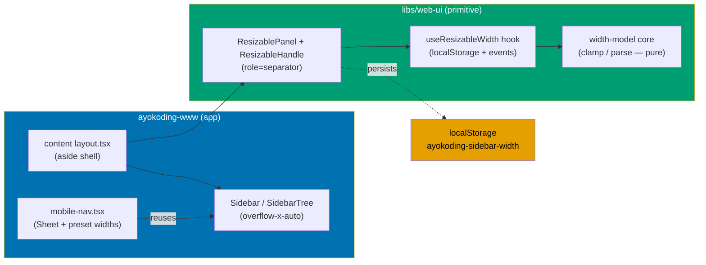
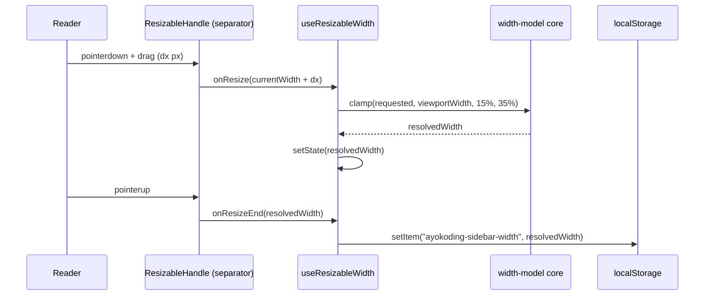
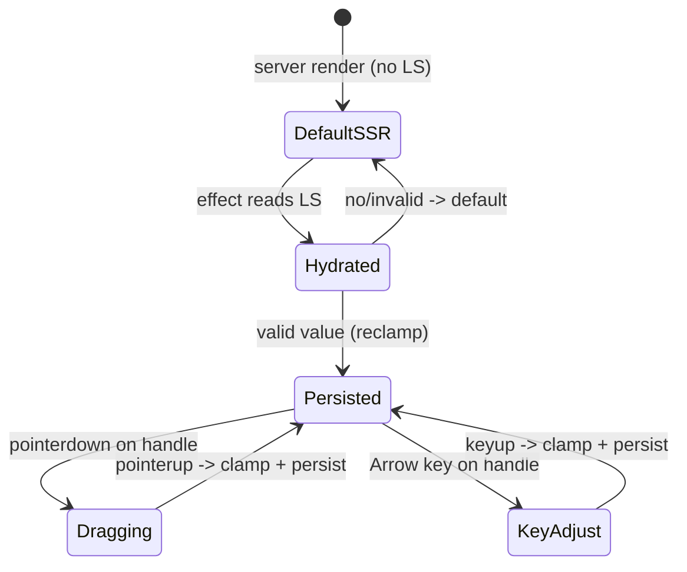

# Tech Docs: Resizable Docs Sidebar (ayokoding-www)

## Architecture

Functional core / imperative shell, applied in both the lib and the app (repo convention for web
apps and libs — features are `{core,shell}`, not hexagonal).

### Component interaction (call graph)

### Resize sequence (drag)

### Width lifecycle (state)

## Design Decisions

### DD-1 — New reusable primitive in `libs/web-ui` (not app-local)

Per the user's decision (grill Q4): the resize mechanic is a **new `libs/web-ui` primitive**
`resizable-panel`, matching the existing primitive pattern
(`libs/web-ui/src/primitives/<name>/<name>.tsx` + `.test.tsx` + `.stories.tsx`, exported through
`libs/web-ui/src/primitives/index.ts`) [Repo-grounded]. Rationale: reusable across future apps,
tested and documented once. Trade-off: larger scope now (story + tests + specs) — accepted.

### DD-1a — `resizable-panel` is the first `primitives/`-level component with Gherkin coverage (deliberate)

**Repo-grounded gap**: all 12 existing `libs/web-ui/src/primitives/*` folders follow a
`<name>.tsx` + `.test.tsx` + `.stories.tsx` triad with **zero** `.steps.tsx` files — Gherkin spec
coverage (`.steps.tsx` co-located with the component, consumed by `nx run web-ui:test:specs`) is
currently a `components/`-only convention (18 of the 22 `libs/web-ui/src/components/*` folders have
a `.steps.tsx`; documented in `specs/libs/web-ui/behavior/README.md`). `resizable-panel` stays under
`primitives/` per DD-1 (the user's explicit placement decision), so this plan deliberately makes it
the **first primitive to carry Gherkin coverage** rather than relocating it to `components/`.

**Consequences, declared explicitly** (resolves the `primitives/` vs `components/` spec-coverage
mismatch):

- New file `libs/web-ui/src/primitives/resizable-panel/resizable-panel.steps.tsx` — the step
  definitions consuming `specs/libs/web-ui/behavior/gherkin/resizable-panel/resizable-panel.feature`
  — is added to `File Impact` below.
- Delivery Phase 3's "Specs & Gherkin Delivery" GREEN step names this file path explicitly.
- Delivery Phase 3's `specs/libs/web-ui/behavior/README.md` update step (already present) must also
  amend the README's "Structure" note — which currently reads "Every scenario is consumed at the
  unit level via the matching `*.steps.tsx` file co-located with each component under
  `libs/web-ui/src/components/`" — to acknowledge that `libs/web-ui/src/primitives/` MAY also carry
  Gherkin coverage, citing `resizable-panel` as the precedent.

### DD-2 — ZERO new dependencies; everything hand-rolled from existing repo tooling (MANDATED, HARD)

**Decision (user-mandated, HARD constraint): this plan adds NO new external npm package of any
kind — neither runtime nor dev.** Every capability is built from what the repo already ships:

- **Drag + keyboard resize** — hand-rolled `useResizableWidth` hook + a `role="separator"` handle,
  using **React only** (`useState`/`useEffect`/`useRef`/`useCallback` — all already available via
  the existing `react` peer dependency [Repo-grounded: `libs/web-ui/package.json` peerDeps]).
- **`localStorage` persistence** — the browser Web Storage API directly (no package), mirroring
  `libs/web-ui/src/components/theme-toggle/theme-toggle.tsx` [Repo-grounded].
- **Horizontal scroll** — Tailwind `overflow-x-auto` utility classes only (no package).
- **Mobile presets** — plain React state + the existing `Sheet` primitive
  [Repo-grounded: `libs/web-ui/src/primitives/sheet/`].
- **Primitive composition + styling** — the already-present `radix-ui`, `class-variance-authority`,
  `clsx`, `tailwind-merge`, `lucide-react` [Repo-grounded: `libs/web-ui/package.json` deps] and the
  `cn` util at `libs/web-ui/src/utils/cn.ts`.
- **Tests + Storybook** — the already-present `vitest`, `@testing-library/react`, `vitest-axe`,
  `storybook` [Repo-grounded: `libs/web-ui/package.json` devDeps]. No new test/story tooling.

**No `react-resizable-panels` or any substitute resizing/utility library may be added.** Because no
dependency is introduced, the
[Dependency Bump Stability & Safety Policy](../../../repo-governance/development/workflow/dependency-bump-policy.md)
does not apply. This is enforced by an acceptance criterion (prd.md "No new dependencies" scenario)
and a delivery gate check that diffs `package.json`, `libs/web-ui/package.json`,
`apps/ayokoding-www/package.json`, and `package-lock.json` against `origin/main` and fails if any
`dependencies`/`devDependencies` key is added.

### DD-3 — Relative min/max (15%–35% of viewport width)

Per the user's decision (grill Q3, Option C). The core clamps against the **current** viewport width
so a stored value is re-clamped on window resize / smaller screens (avoids a stale wide value
crowding a narrow viewport). Implemented as pure functions in the core module for exhaustive unit
testing without a DOM.

### DD-4 — Persistence via `localStorage` (no SSR/cookie)

Per the user's decision (grill Q2). Key `ayokoding-sidebar-width`, value = integer px string.
Mirror `libs/web-ui/src/components/theme-toggle/theme-toggle.tsx` [Repo-grounded]: read in a
mount `useEffect`, write on resize-end. Server renders the default width; the persisted width
applies post-hydration. Accepts a brief first-paint at the default width (documented Non-Goal).

### DD-5 — Horizontal scroll of nav content

Per the user's added requirement (grill Q3). The sidebar content container (around `SidebarTree`)
gets `overflow-x-auto` (and the tree stops force-truncating so labels can extend and scroll). The
existing `overflow-y-auto` on the sticky wrapper is preserved; the inner content becomes
independently `overflow-x`-scrollable so narrowing the rail scrolls rather than clips.
Note: `sidebar-tree.tsx` currently applies `truncate` to the link [Repo-grounded]; horizontal
scroll requires relaxing that on the scroll axis — captured as a delivery step.

### DD-6 — Keyboard + drag accessibility

Per the user's decision (grill Q1). The handle is a focusable element with `role="separator"`,
`aria-orientation="vertical"`, `aria-valuemin`/`aria-valuemax`/`aria-valuenow` (percent or px), and
`tabIndex=0`. `ArrowLeft`/`ArrowRight` adjust by a fixed keyboard step; `Home`/`End` optional to
snap to min/max. Covered by `vitest-axe` (already a `libs/web-ui` devDependency [Repo-grounded]) and
an E2E keyboard test.

### DD-7 — Mobile preset widths (not drag)

Per the user's decision (grill Q5c). `mobile-nav.tsx`'s `SheetContent` currently hardcodes
`w-[280px]` [Repo-grounded]. Replace with a small preset control (a default and a wider preset),
persisted to `localStorage` (key `ayokoding-mobilenav-width`) using the same core parse/clamp. No
free drag on the overlay drawer.

## File Impact

**New files** (all `_New file_`):

- `libs/web-ui/src/primitives/resizable-panel/resizable-panel.tsx` — primitive (panel + handle).
- `libs/web-ui/src/primitives/resizable-panel/resizable-panel.test.tsx` — unit tests.
- `libs/web-ui/src/primitives/resizable-panel/resizable-panel.stories.tsx` — Storybook story.
- `libs/web-ui/src/primitives/resizable-panel/use-resizable-width.ts` — hook (localStorage + events).
- `libs/web-ui/src/primitives/resizable-panel/use-resizable-width.test.tsx` — hook tests.
- `libs/web-ui/src/primitives/resizable-panel/width-model.ts` — pure core (clamp/parse).
- `libs/web-ui/src/primitives/resizable-panel/width-model.test.ts` — core unit tests.
- `specs/libs/web-ui/behavior/gherkin/resizable-panel/resizable-panel.feature` — primitive specs.
- `libs/web-ui/src/primitives/resizable-panel/resizable-panel.steps.tsx` — Gherkin step definitions
  consuming `resizable-panel.feature` (see DD-1a — first `primitives/`-level component with Gherkin
  coverage; no per-component README, matching the `components/` convention where the sole inventory
  lives in the top-level `specs/libs/web-ui/behavior/README.md`).
- `specs/apps/ayokoding/behavior/ayokoding-www/gherkin/navigation/resizable-sidebar.feature` — app specs.
- `assets/resizable-sidebar-option-a.excalidraw.png`, `assets/resizable-sidebar-option-b.excalidraw.png`
  (plan funnel finalists).

**Modified files**:

- `libs/web-ui/src/primitives/index.ts` — export `./resizable-panel/resizable-panel`. [Repo-grounded]
- `apps/ayokoding-www/src/app/[locale]/(content)/layout.tsx` — swap fixed `<aside>` for the
  primitive. [Repo-grounded]
- `apps/ayokoding-www/src/features/navigation/shell/sidebar-tree.tsx` — relax `truncate` on the
  scroll axis; enable `overflow-x`. [Repo-grounded]
- `apps/ayokoding-www/src/features/app-shell/shell/mobile-nav.tsx` — preset-width control. [Repo-grounded]
- Possibly a new `apps/ayokoding-www/src/features/navigation/shell/resizable-sidebar.tsx` client
  wrapper (the layout is an async server component; the primitive + hook are client — a `"use client"`
  wrapper bridges them, mirroring how `mobile-nav.tsx` is a client component consumed by the shell).

## Dependencies

- **Runtime**: none new (DD-2, mandated). Reuses `react`, `radix-ui`, `cva`, `clsx`,
  `tailwind-merge`, `lucide-react` already in `libs/web-ui`. [Repo-grounded: `libs/web-ui/package.json`]
- **Dev/test**: none new. Reuses `vitest`, `@testing-library/react`, `vitest-axe`, `storybook` — all
  already present. [Repo-grounded]
- **ZERO new external packages** (runtime OR dev) are permitted by this plan (DD-2, HARD). The
  Dependency Bump policy does not apply because no dependency is added. Enforced by a delivery gate
  that diffs the four manifests + lockfile against `origin/main`.

## Testing Strategy

Per TDD (Red → Green → Refactor) and Feature Change Completeness (both paths — companion specs land
with the code):

- **Unit (core)** — `width-model.test.ts`: clamp above/below/inside band, parse valid/invalid.
  Maps to the "Core width model" Gherkin scenarios.
- **Unit (hook + primitive)** — `use-resizable-width.test.tsx`, `resizable-panel.test.tsx`: drag
  math, keyboard step, `localStorage` read/write, `role="separator"` + `aria-*` semantics,
  `vitest-axe` no-violations. Maps to the "Primitive" Gherkin scenarios.
- **Specs coverage** — `specs/libs/web-ui/.../resizable-panel.feature` consumed by
  `nx run web-ui:test:specs`; `specs/apps/ayokoding/.../resizable-sidebar.feature` consumed by
  `nx run ayokoding-www:test:specs`. [Repo-grounded: both `test:specs` targets exist]
- **E2E** — `ayokoding-www-fe-e2e` (Playwright + `bddgen`) [Repo-grounded]: drag resize, keyboard
  resize, persistence across reload, `< md` rail hidden, horizontal scroll, mobile preset. Maps to
  the "consumption" and "mobile" Gherkin scenarios.
- **Manual** — Playwright MCP across `en` + `id` locales and 375/768/1280 px breakpoints, with
  committed evidence.

### Acceptance-criterion → test-level map

| Gherkin scenario                               | Test level          |
| ---------------------------------------------- | ------------------- |
| Clamp above/below/inside; reject unparseable   | Unit (core)         |
| Widen/limit by drag                            | Unit (primitive)    |
| Keyboard widen; separator semantics            | Unit + `vitest-axe` |
| Persist across reload; `< md` hidden; h-scroll | E2E (Playwright)    |
| Mobile preset width                            | E2E (Playwright)    |

## Rollback

Single PR (worktree-to-pr). Rollback = revert the PR merge commit. The primitive is additive
(new files + one `index.ts` export line); the app changes are localized to three files plus one new
client wrapper. No data migration, no persisted-schema change beyond two new `localStorage` keys
(harmless if orphaned).

## Harness-Neutrality

Not applicable — the plan touches `libs/web-ui` and `apps/ayokoding-www` only, not
`.claude/agents/`, `.opencode/agents/`, or `repo-governance/`. No vendor-specific governance content.
