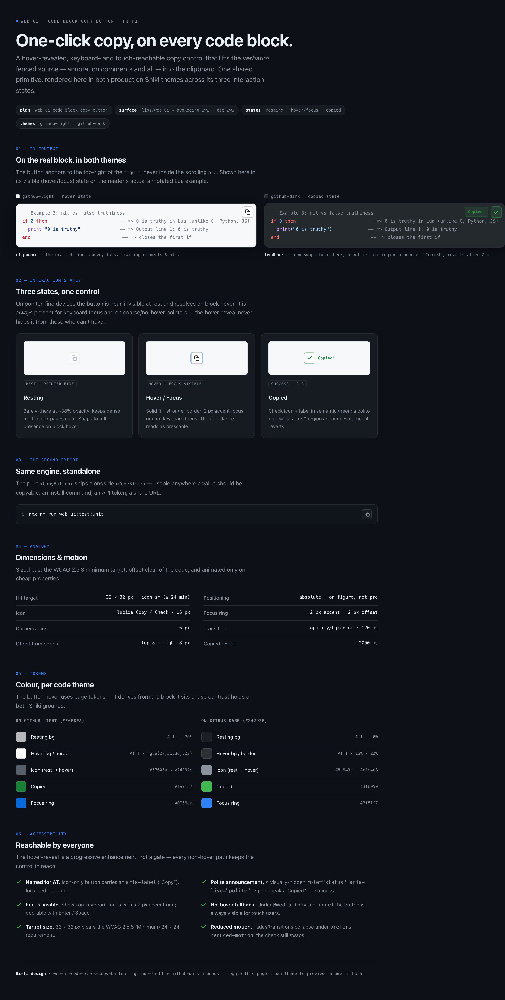

# Product Requirements — web-ui Code-Block Copy Button

## Product Overview

A design-system primitive family (`CopyButton`, `CodeBlock`, `useCopyToClipboard`) in `libs/web-ui`,
wired into the Markdown code-block rendering of `apps/ayokoding-www` and `apps/ose-www`. Every rendered
**non-mermaid** fenced code block gains a positioned Copy button that writes the **verbatim fenced
source** (all `--` annotations and `-- => output` markers included) to the clipboard, with a transient
success confirmation and full keyboard/AT support.

## Personas (hats the maintainer wears; consuming agents)

- **Learner/Reader** (end user) — reads annotated examples on AyoKoding; wants to copy-and-run.
- **Design-system owner** — maintains the reusable primitive.
- **App maintainer** — wires the primitive into each site's renderer.
- **Consuming agents** — `swe-ui-*` (primitive), `swe-typescript-dev` + `swe-e2e-dev` (apps),
  `apps-ayokoding-www-deployer` + `apps-ose-www-deployer` (prod).

## User Stories

- As a **reader**, I want a Copy button on each code block, so that I can copy a snippet in one click
  without hand-selecting across highlight spans.
- As a **reader of annotated examples**, I want the copied text to be the exact fenced source including
  every `--` comment and `-- => output` marker, so that the pedagogy survives the paste.
- As a **keyboard/screen-reader user**, I want the button reachable, operable, and to announce success,
  so that copying is not a pointer-only feature.
- As a **touch-device reader**, I want the button always visible (no hover to reveal), so that I can
  find and tap it.
- As an **Indonesian reader of AyoKoding**, I want the button labelled in my language, so that the UI is
  consistent with the rest of the localized site.
- As the **design-system owner**, I want a standalone `CopyButton` primitive, so that I can reuse it to
  copy any value (a CLI command, a token, a URL) elsewhere.

## UI Design Funnel

> The user-facing surface here is a single **icon-only affordance overlaid on an existing code block**,
> not a new full screen. This funnel carries both tiers in one place (per the UI-mockup placement rule):
> the divergent **low-fidelity** alternatives + selection + rationale + responsive strategy below, then
> the **high-fidelity** finalists — two committed renders (light + dark, in context) in
> [§ High-fidelity finalists](#high-fidelity-finalists). The **executable, regression-guarded** record of
> the same surface is the primitive's **Storybook stories + Playwright visual-regression baselines**
> (`libs/web-ui/e2e/components.visual.ts`); the token/anatomy spec behind the finalists lives in
> [`tech-docs.md` § Hi-Fi Token Spec & Anatomy](./tech-docs.md#hi-fi-token-spec--anatomy).

### Low-fidelity alternatives (diverge)

**Option A — Icon-only ghost button, top-right, hover-reveal (SELECTED)**

```text
┌───────────────────────────────────────────────┐
│ lua                                    [ ⧉ ]   │  ← ghost icon, top-right, fades in on block hover
│ -- Example 59: error() can raise ANY value...  │     always visible on touch + when focused
│ local ok, err = pcall(function()   -- => runs  │
│   error({ code = 42 })             -- => any…  │
│ end)                                           │
└───────────────────────────────────────────────┘
```

**Option B — Persistent labelled button ("Copy" text + icon), top-right**

```text
┌───────────────────────────────────────────────┐
│ lua                            [ ⧉ Copy ]      │  ← always-visible text button
│ -- Example 59: error() can raise ANY value...  │
└───────────────────────────────────────────────┘
```

Drop reason: a persistent text button competes visually with the code, widens the header band on
mobile, and the localized "Copy"/"Salin" text width fluctuates between locales — noisier than needed.

**Option C — Bottom-right floating pill inside the block**

```text
┌───────────────────────────────────────────────┐
│ -- Example 59: error() can raise ANY value...  │
│ local ok, err = pcall(function()               │
│ end)                                 [ ⧉ Copy ] │  ← floats bottom-right, over the code
└───────────────────────────────────────────────┘
```

Drop reason: the block is `overflow-x: auto`; a control anchored to the scrolling inner content clips
or scrolls away, and bottom-right overlaps the most code on short blocks. Positioning on the figure
(top-right, outside the scroll region) is required — see `tech-docs.md`.

### Selection

**Selected: Option A — Icon-only ghost button, top-right, hover-reveal (always-visible on touch/focus).**

### Decision record

| Criterion                 | A (selected)                                   | B (labelled)               | C (bottom pill)             |
| ------------------------- | ---------------------------------------------- | -------------------------- | --------------------------- |
| Visual weight vs. code    | Minimal (icon only)                            | Heavy (text always shown)  | Heavy + overlaps code       |
| Clip-safe on `overflow-x` | Yes (on figure, outside scroll)                | Yes                        | **No** (anchored to scroll) |
| Locale-width stability    | Icon is width-stable                           | Text width varies en vs id | Text width varies           |
| Touch/keyboard reach      | Always-visible fallback + focus                | Always visible             | Always visible but clips    |
| Chosen because            | Clean, clip-safe, locale-stable, a11y-complete | —                          | —                           |

**Responsive strategy (mobile-first, per breakpoint)** — the affordance is intentionally
breakpoint-invariant in structure and reflows only its reveal behaviour:

- **Mobile (`< sm`, coarse/no-hover pointer):** button is **always visible** (via `@media (hover: none)`)
  at the top-right of the figure; target size ≥ 24×24 CSS px (WCAG 2.5.8). No hover dependency.
- **Tablet (`md` ≥ 768 px):** hybrid devices treated as coarse-pointer when `hover: none` — always
  visible; hover-capable tablets get the fade-in.
- **Desktop (`lg` ≥ 1024 px, fine pointer):** button is hover-revealed on the block and always shown on
  `focus-visible`; never hidden from keyboard/AT.

Because the button is icon-only and positioned on the figure (not inside the scrolling `<pre>`), the
layout does not otherwise reflow between breakpoints — the code block itself already scrolls
horizontally on narrow viewports, unchanged.

### High-fidelity finalists

Two committed renders of the selected Option A, on the two real production Shiki grounds
(`github-light` `#f6f8fa` and `github-dark` `#24292e`), each showing the button in context plus its three
interaction states, the standalone `CopyButton`, the anatomy/motion spec, per-theme token swatches, and
the accessibility checklist. These are the plan's authoritative visual finalists; they travel with the
plan into `done/`.

**Light theme (`github-light`):**


**Dark theme (`github-dark`):**



> An interactive, theme-toggleable version of the same design (for review only — not part of the
> committed `done/` record) is published at
> <https://claude.ai/code/artifact/9cf28211-fb93-4eaa-ac3f-4aecca818be9>. In the running app the two
> grounds are never simultaneous: a code block's Shiki theme follows the page theme, and the button —
> styled with web-ui theme tokens — switches in lockstep with it (see
> [`tech-docs.md` § Hi-Fi Token Spec & Anatomy](./tech-docs.md#hi-fi-token-spec--anatomy)).

## Acceptance Criteria (Gherkin)

> Tags: `@unit` = component/renderer unit test (vitest + jsdom); `@visual` = Playwright Storybook
> visual-regression; `@e2e` = live ayokoding-www Playwright-BDD. Per the specs-two-path rule these
> scenarios are authored into `specs/libs/web-ui/behavior/gherkin/code-block/*.feature` and
> `specs/apps/ayokoding/behavior/ayokoding-www/gherkin/content/code-block-copy.feature`. Each `Scenario`
> uses exactly one primary `Given`/`When`/`Then`; extras chain via `And`.

### web-ui primitive — `CopyButton`

```gherkin
@unit
Scenario: Clicking the copy button writes its value to the clipboard
  Given a CopyButton rendered with the value "npm install"
  When the user clicks the button
  Then the clipboard receives the exact text "npm install"

@unit
Scenario: A successful copy swaps to the success icon and announces via a live region
  Given a CopyButton rendered with a value and a stubbed clipboard that resolves
  When the user clicks the button
  Then the button shows the success (Check) icon
  And a polite live region announces the copied label

@unit
Scenario: The success state reverts to the resting state after the timeout
  Given a CopyButton that has just shown its success state
  When the revert timeout elapses
  Then the button shows the resting (Copy) icon again
  And the live region no longer announces the copied label

@unit
Scenario: A failed clipboard write does not show a false success state
  Given a CopyButton rendered with a stubbed clipboard that rejects
  When the user clicks the button
  Then the button remains in the resting (Copy) state
  And no copied confirmation is announced

@unit
Scenario: The copy button is operable by keyboard
  Given a CopyButton is focused
  When the user presses Enter
  Then the clipboard receives the button's value

@unit
Scenario: The copy button exposes an accessible name
  Given a CopyButton rendered with the default labels
  When the accessibility tree is inspected
  Then the button has an accessible name of "Copy"

@unit
Scenario: The copy button's accessible name can be localized
  Given a CopyButton rendered with copyLabel "Salin"
  When the accessibility tree is inspected
  Then the button has an accessible name of "Salin"

@unit
Scenario: The copy button has no accessibility violations
  Given a CopyButton is rendered in its resting state
  When an automated accessibility scan runs
  Then no accessibility violations are reported

@unit
Scenario: The copy button meets the minimum target size
  Given a CopyButton rendered at its default size
  When its rendered box is measured
  Then both dimensions are at least 24 CSS pixels
```

### web-ui primitive — `CodeBlock`

```gherkin
@unit
Scenario: The code block renders its highlighted children and a copy button
  Given a CodeBlock rendered with code text and a highlighted <pre> child
  When the component mounts
  Then the highlighted child is present
  And a copy button is present within the code-block wrapper

@unit
Scenario: Copying from the code block yields the verbatim multi-line source
  Given a CodeBlock whose code prop is a three-line annotated snippet with trailing comments
  When the user clicks the code block's copy button
  Then the clipboard receives the snippet byte-for-byte including every annotation and newline

@unit
Scenario: The code block establishes its own positioning context
  Given a CodeBlock is rendered
  When its wrapper is inspected
  Then the wrapper is a relatively-positioned element carrying data-slot "code-block"

@visual
Scenario: The code block renders correctly in light and dark themes
  Given the CodeBlock stories are loaded in Storybook
  When the resting and copied stories are captured in light and dark themes
  Then each screenshot matches its committed visual baseline
```

### ayokoding-www — live wiring (bilingual)

```gherkin
@unit @e2e
Scenario: A non-mermaid code block renders a copy button
  Given a visitor opens an English content page containing a fenced Lua code block
  When the page renders
  Then the code block displays a copy button

@unit @e2e
Scenario: A mermaid block renders no copy button
  Given a visitor opens a content page containing a mermaid fenced block
  When the page renders
  Then the mermaid block renders as a diagram with no copy button

@e2e
Scenario: Clicking copy places the verbatim annotated source on the clipboard
  Given a visitor is on a page whose Lua block contains "-- => output" annotations
  When the visitor clicks that block's copy button
  Then the clipboard contains the block's source verbatim including the "-- => output" annotations

@e2e
Scenario: The copy button confirms success to the visitor
  Given a visitor has clicked a code block's copy button
  When the copy succeeds
  Then the button shows a "Copied" confirmation before reverting

@unit @e2e
Scenario: The copy button is labelled in Indonesian on the Indonesian site
  Given a visitor opens an Indonesian content page containing a fenced code block
  When the accessibility tree is inspected
  Then the copy button has the Indonesian accessible name "Salin"

@e2e
Scenario: The copy button is reachable on a touch viewport without hovering
  Given a visitor loads a content page on a touch (no-hover) viewport
  When the code block is rendered
  Then the copy button is visible without any hover interaction
```

### ose-www — latent wiring (unit only)

```gherkin
@unit
Scenario: The renderer wraps a non-mermaid code figure in a CodeBlock
  Given the ose-www markdown renderer receives HTML with a non-mermaid code figure
  When the HTML is parsed to React
  Then the figure is wrapped in a CodeBlock exposing a copy button

@unit
Scenario: The renderer leaves a mermaid figure as a diagram
  Given the ose-www markdown renderer receives HTML with a mermaid code figure
  When the HTML is parsed to React
  Then the figure renders as a mermaid diagram with no copy button
```

## Product Scope

**In-scope features**: standalone `CopyButton`; `CodeBlock` layout composer; `useCopyToClipboard` hook;
ayokoding en/id wiring + live proof; ose-www latent wiring + unit proof; light/dark theming; full
keyboard + AT support; production deploy of both apps.

**Out-of-scope features**: inline-code copy; mermaid copy/export; usage analytics; new ose-www content;
`document.execCommand` legacy path is optional (decision recorded in `tech-docs.md`).

## Product-Level Risks

- **Newline fidelity** — `getTextContent` walking rehype-pretty-code's per-line spans could drop
  newlines; pinned by the verbatim multi-line Gherkin + live e2e. See `tech-docs.md` extraction note.
- **Reveal-behaviour a11y** — hover-only reveal would strand touch/keyboard users; always-visible
  fallback is a HARD requirement with axe coverage.
- **Mermaid regression** — new replace-case must be ordered after the mermaid guard; exclusion tests
  pin it in both apps.
