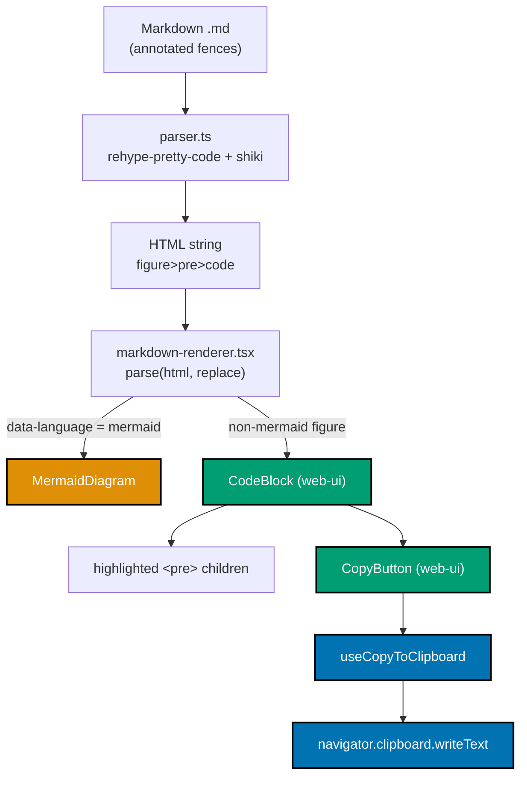
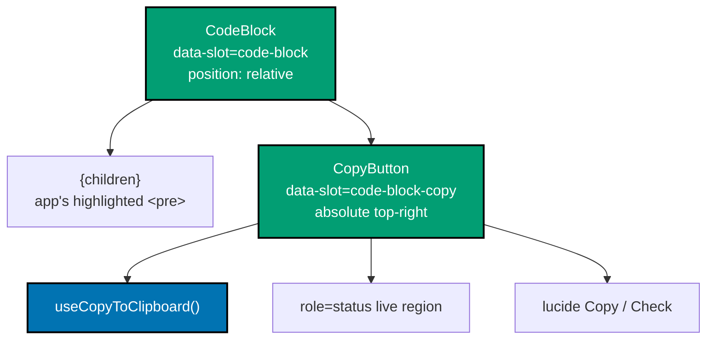
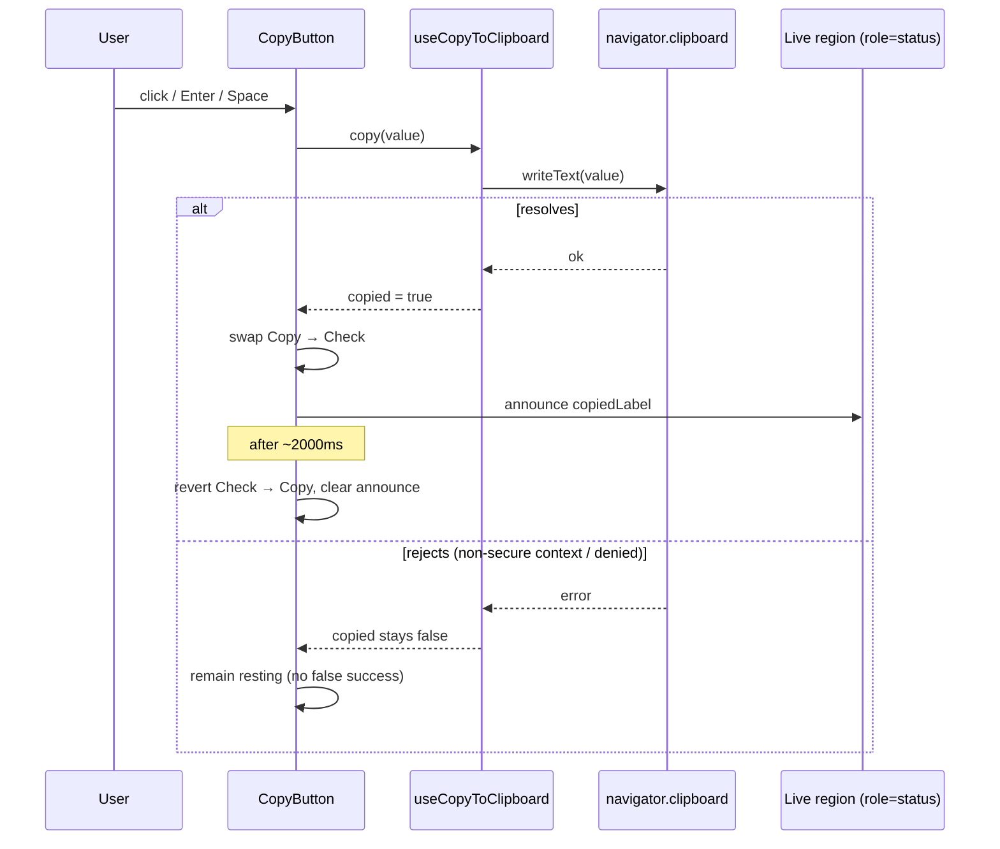
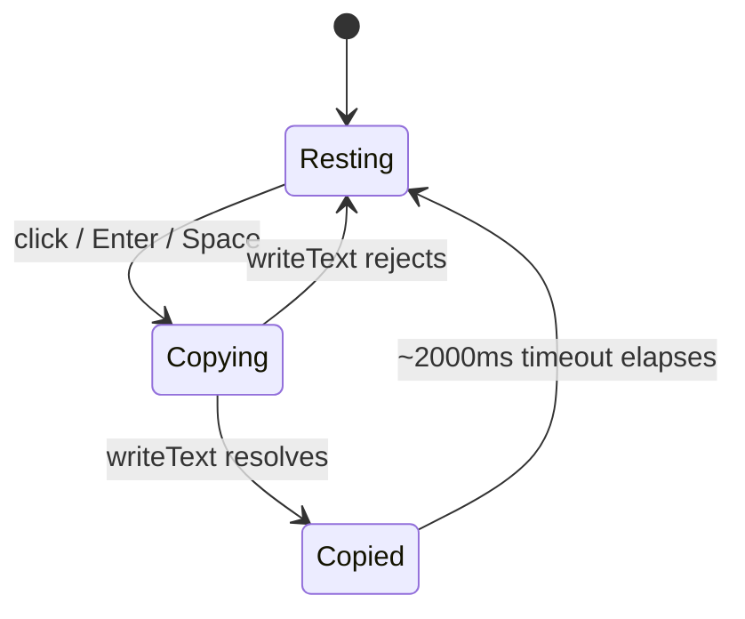
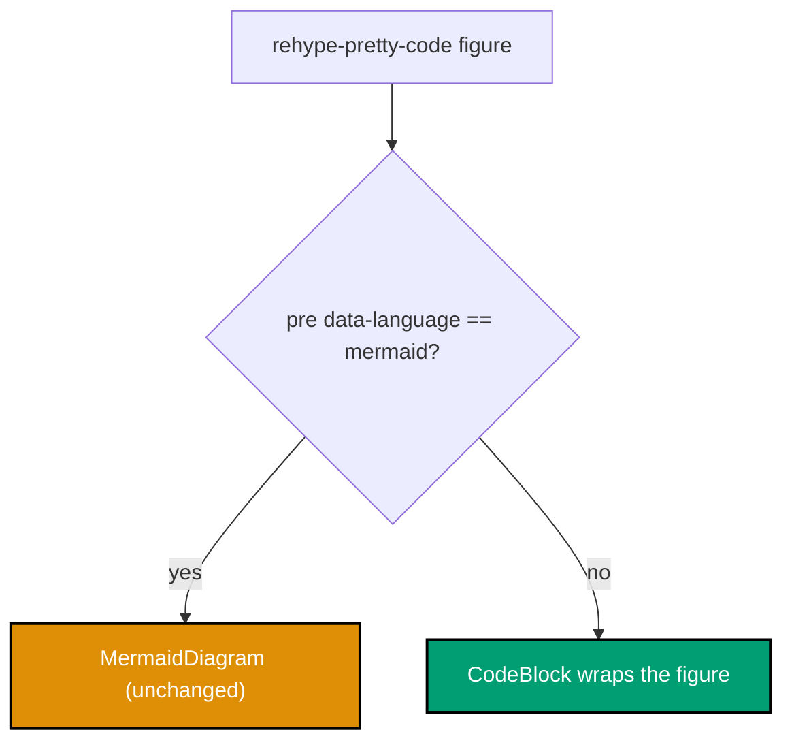

# Technical Design — web-ui Code-Block Copy Button

All cited paths are `[Repo-grounded]` against the current commit unless flagged `_New file_`.

## Architecture Overview

Both content sites share a byte-identical code-block render pipeline: server-side Markdown → HTML string
via `rehype-pretty-code` + `shiki`, then a `"use client"` renderer turns that HTML string into a **real
React tree** via `html-react-parser`'s `parse(html, { replace })`. We add ONE new `replace`-case in each
app's renderer that wraps every **non-mermaid** code figure in the shared `CodeBlock` primitive, passing
the verbatim text (extracted from the `<pre>`) as the clipboard payload and rendering the original
highlighted figure as children.

<!-- Uses accessible colors: teal (#029E73) for new web-ui parts, blue (#0173B2) for browser API, orange (#DE8F05) for the mermaid branch -->



### Component composition



### Copy interaction sequence



### State model



## Component API

### `useCopyToClipboard` (hook) — `_New file_` `libs/web-ui/src/primitives/code-block/use-copy-to-clipboard.ts`

Colocated hook mirroring the `use-resizable-width.ts` precedent (`"use client"`, `useState` +
timeout-on-mount cleanup). Owns the copy side effect and the transient `copied` flag so both `CopyButton`
and the tests share one implementation.

| Member           | Type                               | Notes                                                                                                                     |
| ---------------- | ---------------------------------- | ------------------------------------------------------------------------------------------------------------------------- |
| option `resetMs` | `number` (default `2000`)          | How long the `copied` flag stays true before auto-reverting.                                                              |
| return `copied`  | `boolean`                          | `true` only after a **resolved** `writeText`. Never set on rejection.                                                     |
| return `copy`    | `(value: string) => Promise<void>` | Calls `navigator.clipboard.writeText(value)`; on resolve sets `copied`, schedules reset; on reject leaves `copied` false. |

Cleanup: the pending reset timeout is cleared on unmount and on a fresh `copy` call (no state update
after unmount). No `document.execCommand` fallback (decision below).

### `CopyButton` — `_New file_` `libs/web-ui/src/primitives/code-block/copy-button.tsx`

A standalone, reusable primitive (copy any string). Composes the exported `Button`
(`variant="ghost" size="icon-sm"`, which auto-sizes lucide svgs and already provides `focus-visible`
ring styling) and adds the live region + icon swap.

| Prop          | Type                             | Default    | Notes                                                                         |
| ------------- | -------------------------------- | ---------- | ----------------------------------------------------------------------------- |
| `value`       | `string` (required)              | —          | Exact text written to the clipboard.                                          |
| `copyLabel`   | `string`                         | `"Copy"`   | `aria-label` in resting state. Locale-agnostic — apps pass localized strings. |
| `copiedLabel` | `string`                         | `"Copied"` | Announced via the live region on success; also the success `aria-label`.      |
| `resetMs`     | `number`                         | `2000`     | Forwarded to `useCopyToClipboard`.                                            |
| _passthrough_ | `React.ComponentProps<"button">` | —          | `className`, `onClick`, etc. merged via `cn`. `data-slot="code-block-copy"`.  |

Rendering: a `<button>` (through `Button`) carrying `data-slot="code-block-copy"`, `aria-label`
(= `copied ? copiedLabel : copyLabel`), the `Copy`→`Check` icon swap, and a sibling
`<span role="status" aria-live="polite" className="sr-only">` that holds `copiedLabel` only while
`copied` is true. **This aria-live `role=status` pattern is new to web-ui** — it is introduced here.
Icons are decorative (`aria-hidden`) because the accessible name comes from `aria-label`. Keyboard
operability (Enter/Space) is native to `<button>`; no custom key handling needed.

The **locale-agnostic label props with English defaults** exactly mirror the resizable-panel
`handleAriaLabel?: string` precedent
(`libs/web-ui/src/primitives/resizable-panel/resizable-panel.tsx:40`), including tests asserting BOTH
the override and the default.

### `CodeBlock` — `_New file_` `libs/web-ui/src/primitives/code-block/code-block.tsx`

Layout composer for the code-block use case.

| Prop          | Type                          | Default    | Notes                                                                  |
| ------------- | ----------------------------- | ---------- | ---------------------------------------------------------------------- |
| `code`        | `string` (required)           | —          | Raw verbatim text for the clipboard (forwarded to `CopyButton value`). |
| `copyLabel`   | `string`                      | `"Copy"`   | Forwarded to `CopyButton`.                                             |
| `copiedLabel` | `string`                      | `"Copied"` | Forwarded to `CopyButton`.                                             |
| `children`    | `React.ReactNode`             | —          | The app's already-highlighted `<pre>`/figure React subtree.            |
| _passthrough_ | `React.ComponentProps<"div">` | —          | Merged via `cn`; `data-slot="code-block"`.                             |

Renders a `data-slot="code-block"` wrapper with the **`group relative`** classes (its OWN positioning
context — never relies on app CSS), the `children`, then the absolutely-positioned `CopyButton` at
top-right. The `group` class enables the hover-reveal on the child button.

### Barrel export — `libs/web-ui/src/primitives/index.ts`

Add:

```ts
export * from "./code-block/code-block";
export * from "./code-block/copy-button";
```

Apps already resolve `@open-sharia-enterprise/web-ui/primitives` → `libs/web-ui/src/primitives/index.ts`
via the tsconfig path alias (root `tsconfig.base.json` + per-app `tsconfig.json`); **no `package.json`
dependency change is needed** in either app. Both apps' `globals.css` already `@source`-scan
`libs/web-ui`, so Tailwind picks up the new classes.

## Injection Strategy (identical shape in both apps)

Add a NEW `replace`-case in each app's `markdown-renderer.tsx`, ordered **strictly after** the existing
mermaid guard so mermaid still wins. Reuse the existing bottom-of-file `getTextContent(node: Element)`
helper (present in both renderers) to extract the verbatim clipboard text, and `domToReact` to render
the original highlighted figure as children.

Files:

- `apps/ayokoding-www/src/features/content/shell/markdown-renderer.tsx` (mermaid guard at lines ~61–71;
  `getTextContent` at ~93–104). Its `MarkdownRenderer` receives a `locale` prop that is **currently
  destructured away/unused** — thread it in.
- `apps/ose-www/src/features/content/shell/markdown-renderer.tsx` (mermaid guard at ~29–38;
  `getTextContent` at ~60–71). No locale — English labels.

### ayokoding-www replace-case (bilingual)

```tsx
// inside options.replace, AFTER the mermaid figure guard:
if (domNode.name === "figure" && domNode.attribs["data-rehype-pretty-code-figure"] !== undefined) {
  const pre = domNode.children.find((c): c is Element => c instanceof Element && c.name === "pre");
  if (pre && pre.attribs["data-language"] !== "mermaid") {
    return (
      <CodeBlock code={getTextContent(pre)} copyLabel={t(locale, "copy")} copiedLabel={t(locale, "copied")}>
        {domToReact([domNode] as DOMNode[], options)}
      </CodeBlock>
    );
  }
}
```

`MarkdownRenderer({ html, locale })` must stop discarding `locale`; import `t` from
`../../i18n/core/translations` and `CodeBlock` from `@open-sharia-enterprise/web-ui/primitives`.

### ose-www replace-case (English, latent)

```tsx
if (domNode.name === "figure" && domNode.attribs["data-rehype-pretty-code-figure"] !== undefined) {
  const pre = domNode.children.find((c): c is Element => c instanceof Element && c.name === "pre");
  if (pre && pre.attribs["data-language"] !== "mermaid") {
    return <CodeBlock code={getTextContent(pre)}>{domToReact([domNode] as DOMNode[], options)}</CodeBlock>;
  }
}
```

ose-www passes no labels → the component's English defaults apply. **Latent wiring**: ose-www currently
has ZERO non-mermaid fenced blocks (all 19 are mermaid), so this case does not fire on any live page
today. It is unit-tested with mocked HTML and ships the capability ahead of code content; **no live e2e
is added for ose-www** (nothing on the site to exercise). Live behavioural proof comes from (a) the
fully-tested web-ui component and (b) the ayokoding-www live e2e.

### Ordering guard

The mermaid check returns early for `data-language === "mermaid"`; the new case only runs for
`pre.attribs["data-language"] !== "mermaid"`. An exclusion unit test in each app asserts a mermaid
figure still yields `MermaidDiagram` and **no** `CodeBlock`.



## Verbatim Text Extraction — Newline Fidelity (KEY RISK)

`getTextContent` concatenates the `data` of every descendant text node. `rehype-pretty-code` emits each
source line inside a `<span data-line>` within `<code>`. The newline characters between lines are
preserved as text nodes in shiki/rehype-pretty-code output, so `getTextContent(pre)` reproduces the
verbatim multi-line source **including** the `--` annotations and `-- => output` markers.

**Because this is the single highest-risk assumption, it is pinned by test, not trusted:**

- web-ui `CodeBlock` unit test: a three-line annotated `code` prop copies byte-for-byte incl. newlines.
- ayokoding live e2e: reads a real Lua block's clipboard and asserts the `-- => output` annotations and
  line breaks survive.

If (and only if) a test reveals newline loss, the fallback is to join per-`[data-line]` blocks with
`\n` inside a small extraction helper — recorded here so the executor does not improvise. This
contingency is noted in `learnings.md` if triggered.

**Cross-OS caveat (from research).** The W3C Clipboard API spec normatively requires the `writeText`
algorithm to replace `\n` with `\r\n` **on Windows** before the bytes hit the clipboard (see References
§Clipboard). Consequence: the source is preserved faithfully (nothing stripped/trimmed/re-flowed), but
the on-clipboard bytes are **not guaranteed byte-identical across OSes**. The byte-for-byte assertions
above must therefore compare against `getTextContent`'s **return value in-process** (pre-`writeText`),
not against clipboard-read bytes — and any e2e clipboard-read assertion normalizes `\r\n` → `\n` before
comparison. This keeps the tests green on a Windows CI runner or contributor machine.

## i18n Wiring (ayokoding-www)

Add two keys to BOTH locale maps in
`apps/ayokoding-www/src/features/i18n/core/translations.ts` (append near the existing
`resizableSidebarHandleLabel` entry, mirroring its placement in both `en` and `id`):

- `en`: `copy: "Copy"`, `copied: "Copied"`
- `id`: `copy: "Salin"`, `copied: "Tersalin"`

The renderer threads them via `t(locale, "copy")` / `t(locale, "copied")`. The web-ui component stays
locale-agnostic (English defaults), per the resizable-panel `handleAriaLabel` precedent. ose-www is
English-only and relies on the component defaults.

## Positioning & CSS Strategy

- The button MUST NOT sit inside `<pre>` — both apps' `globals.css` set `.prose pre { overflow-x: auto }`
  (ayokoding ~lines 85–125, ose-www ~67–103), which would clip or horizontally-scroll an inner control.
- `figure[data-rehype-pretty-code-figure]` has `margin: 1rem 0` and **no `position`** set in either
  app. Therefore `CodeBlock` establishes its own `relative` context (`data-slot="code-block"` wrapper
  with `group relative`), and the `CopyButton` is `absolute top-2 right-2`, layered above the figure but
  outside the scroll region.
- No app CSS changes are required (the wrapper is self-contained); Tailwind classes come from web-ui via
  the existing `@source` scan.

## Dark-Mode & Contrast

Code blocks use light `#f6f8fa` / dark `#24292e` backgrounds. The ghost button uses web-ui theme tokens
(`hover:bg-accent hover:text-accent-foreground dark:hover:bg-accent/50` from the `ghost` variant) plus a
resting icon color that meets WCAG AA non-text contrast (≥ 3:1) against BOTH backgrounds — use
`text-muted-foreground` resting and `text-foreground` on hover/focus, verified in the light/dark visual
baselines. The success `Check` uses a success-tone token with adequate contrast in both themes.

## Accessibility Specification (REQUIRED)

- **Accessible name**: `aria-label` = `copyLabel` resting / `copiedLabel` after success (localized by
  app). Icons are `aria-hidden`.
- **Live announcement**: a visually-hidden `<span role="status" aria-live="polite" className="sr-only">`
  announces `copiedLabel` on success (NEW pattern in web-ui).
- **Keyboard**: native `<button>` — Enter/Space operate it; `focus-visible` ring from the `Button`
  primitive. Never removed from tab order.
- **Reveal behaviour**: hover-reveal on fine-pointer via `group-hover`; **always visible** on
  `focus-visible` (`group-focus-within`/`focus-visible:opacity-100`) and on coarse/no-hover pointers via
  a `@media (hover: none)` always-visible rule. Never hidden from keyboard or AT.
- **Target size**: `size="icon-sm"` = `size-8` (32×32 CSS px) ≥ WCAG 2.5.8's 24×24 minimum.
- **Tooltip**: the `copiedLabel` confirmation uses the **inline sr-only live region** as the source of
  truth for AT; a lightweight visible transient label/tooltip may accompany it. **Decision: inline label
  via the live-region text + icon swap** (no dependency on the Radix `Tooltip` primitive) to keep the
  primitive portal-free and test-simple. Recorded so the executor does not add a Tooltip.
- **axe**: `vitest-axe` `axe()` + `toHaveNoViolations` on resting and copied states.

## Clipboard Strategy

- Primary and only path: `navigator.clipboard.writeText(value)` (Promise-based; requires a secure
  context = HTTPS or `localhost`). Both prod sites are HTTPS; dev is `localhost`. **No
  `document.execCommand('copy')` fallback** — modern browsers universally support the async API, and the
  fallback adds DOM-mutation complexity for a non-secure-context edge case the prod sites never hit.
  Decision recorded here.
- **Graceful failure**: a rejected `writeText` leaves `copied` false — no false Check, no false
  announcement (pinned by the "failed clipboard write" Gherkin scenario).
- **jsdom caveat (tests)**: jsdom does NOT implement `navigator.clipboard`. Unit/steps tests MUST stub
  it — e.g. `vi.spyOn`/`Object.defineProperty` a mock `writeText` on `navigator.clipboard` — analogous
  to how `resizable-panel.test.tsx` spies on `Storage.prototype.setItem`. Provide both a resolving and a
  rejecting stub. Documented in `delivery.md`.

## Testing Strategy

| Level                | Coverage                                                                                                                         | Location                                                                                                                    |
| -------------------- | -------------------------------------------------------------------------------------------------------------------------------- | --------------------------------------------------------------------------------------------------------------------------- |
| Unit (RTL + axe)     | `CopyButton`, `CodeBlock`, `useCopyToClipboard` — clipboard stub, icon swap, live region, a11y, target size, verbatim multi-line | `libs/web-ui/src/primitives/code-block/*.test.tsx` _New_                                                                    |
| Gherkin steps        | The `@unit` scenarios in `prd.md` via `@amiceli/vitest-cucumber` loading the `.feature`                                          | `libs/web-ui/src/primitives/code-block/*.steps.tsx` _New_ + `specs/libs/web-ui/behavior/gherkin/code-block/*.feature` _New_ |
| Visual regression    | Resting + copied stories, light + dark                                                                                           | `libs/web-ui/e2e/components.visual.ts` (add cases) + Storybook `*.stories.tsx` _New_                                        |
| App unit (renderer)  | ayokoding + ose-www replace-case: wraps non-mermaid, excludes mermaid; ayokoding localized labels                                | each app's `markdown-renderer` unit test                                                                                    |
| Live e2e (ayokoding) | copy button present, mermaid excluded, verbatim clipboard incl. annotations, Copied confirmation, id label, touch-visible        | `apps/ayokoding-www-fe-e2e` + `specs/apps/ayokoding/behavior/ayokoding-www/gherkin/content/code-block-copy.feature` _New_   |

Per the **specs-two-path rule**, every new observable behaviour ships with companion Gherkin in the same
PR; per the **regression-test mandate**, the mermaid-exclusion guard and newline-fidelity paths are
pinned by reproducing tests.

## ASCII Mockups (resting + copied)

**Resting (desktop hover, light theme)** — icon-only ghost button fades in at top-right:

```text
 figure[data-rehype-pretty-code-figure]  (position: relative, group)
┌──────────────────────────────────────────────────────────────┐
│                                                      ┌──────┐  │
│                                                      │  ⧉   │  │ ← CopyButton, absolute top-2 right-2
│  <pre data-language="lua"> (overflow-x: auto)        └──────┘  │   aria-label="Copy"
│    -- Example 59: error() can raise ANY value, not just a str  │
│    local ok, err = pcall(function()   -- => runs inner fn      │
│      error({ code = 42 })             -- => any Lua value       │
│    end)                                                        │
│    print(err.code)                    -- => err IS the table    │
│  </pre>                                                        │
└──────────────────────────────────────────────────────────────┘
```

**Copied (just after click)** — icon swaps to Check; sr-only live region announces "Copied":

```text
┌──────────────────────────────────────────────────────────────┐
│                                                      ┌──────┐  │
│                                                      │  ✓   │  │ ← Check icon, aria-label="Copied"
│  <pre ...>                                           └──────┘  │
│    -- Example 59: error() can raise ANY value...              │   (role=status sr-only: "Copied")
│    ...                                                         │   reverts to ⧉ after ~2000ms
└──────────────────────────────────────────────────────────────┘
```

**Mobile / touch (no-hover, always visible)** — identical placement, button never hidden:

```text
┌────────────────────────────────────┐
│                          ┌──────┐   │
│  <pre ...> (scrolls →)   │  ⧉   │   │ ← always visible (@media (hover: none))
│    local ok, err = pcall └──────┘   │
└────────────────────────────────────┘
```

## Hi-Fi Token Spec & Anatomy

The high-fidelity **visual finalists** (two committed renders, light + dark, in context) live with the
rest of the UI funnel in [`prd.md` § High-fidelity finalists](./prd.md#high-fidelity-finalists). This
section is the **technical record** behind them: the exact target rendered values and the anatomy the
executor must reproduce, plus how those per-block values map onto web-ui theme tokens.

### Reconciliation with the implementation (important)

The finalists show a fixed light block **beside** a fixed dark block so both appearances are visible at
once. In the running app the two are never simultaneous: a code block's Shiki theme **follows the page
theme** (`.prose figure pre` uses `--shiki-light-*`; `.dark .prose figure pre` uses `--shiki-dark-*` —
see each app's `globals.css`). Because the ghost button is styled with **web-ui theme tokens**
(`text-muted-foreground` resting → `text-foreground` on hover, `ghost` variant hover fill) — which also
switch on page theme — the button and its block always change in lockstep, producing exactly the two
appearances the mockup shows. The hardcoded per-block hex values below are therefore the **target
rendered result**, not literal class values; the implementation reaches them through tokens (keeps the
primitive theme-driven and avoids per-code-theme branching).

### Hi-fi token spec (target rendered values)

| Token               | On `github-light` (`#f6f8fa`) | On `github-dark` (`#24292e`) | web-ui token path                              |
| ------------------- | ----------------------------- | ---------------------------- | ---------------------------------------------- |
| Resting bg          | `#fff` @ 70%                  | `#fff` @ 6%                  | ghost variant (transparent) → block shows thru |
| Hover bg / border   | `#fff` / `rgba(27,31,36,.22)` | `#fff` @13% / @22%           | `hover:bg-accent` + border token               |
| Icon rest → hover   | `#57606a` → `#24292e`         | `#8b949e` → `#e1e4e8`        | `text-muted-foreground` → `text-foreground`    |
| Copied (icon+label) | `#1a7f37`                     | `#3fb950`                    | success-tone token                             |
| Focus ring          | `#0969da`                     | `#2f81f7`                    | `ring` / accent token                          |

### Anatomy (authoritative)

- Hit target **32 × 32 px** (`size="icon-sm"` = `size-8`) — clears WCAG 2.5.8's 24 × 24 minimum.
- Icon **16 px** (lucide `Copy` → `Check`); corner radius **6 px**; offset **top 8 / right 8 px**.
- Positioned `absolute` on the `figure` (never inside the scrolling `pre`); focus ring **2 px accent, 2
  px offset**; transitions on `opacity/background/color` at **120 ms**; copied state reverts after
  **2000 ms**. All transitions collapse under `prefers-reduced-motion` (the check still swaps).

## UI-Bearing Design-Funnel Note

The complete UI funnel — divergent low-fi alternatives, selection, rationale table, per-breakpoint
responsive strategy, AND the two committed high-fidelity finalists (light + dark, in context) — lives in
one place, [`prd.md` § UI Design Funnel](./prd.md#ui-design-funnel), per the UI-mockup placement rule.
This tech-doc holds only the **technical record** behind those finalists
([§ Hi-Fi Token Spec & Anatomy](#hi-fi-token-spec--anatomy)). The executable, regression-guarded record
of the same surface is the primitive's **Storybook stories + Playwright visual baselines** (resting +
copied × light + dark): the entire visual surface is one ghost button in two states across two themes, so
those baselines capture it precisely and cannot silently drift.

## References (external, verified via `web-researcher`)

Every design decision above traces to a current, authoritative source. All URLs below were accessed and
verified via `web-researcher` on **2026-07-16**. Confidence is `[Verified]` unless noted.

**Clipboard API**

- [MDN — `Clipboard.writeText()`](https://developer.mozilla.org/en-US/docs/Web/API/Clipboard/writeText):
  secure-context only (HTTPS/localhost), returns a Promise, rejects `NotAllowedError`; **Baseline: widely
  available since March 2020** — validates the primary-and-only path with no fallback.
- [MDN — `Document.execCommand()`](https://developer.mozilla.org/en-US/docs/Web/API/Document/execCommand):
  **deprecated and non-standard**; MDN steers new code to the async Clipboard API — validates the
  **no-`execCommand`-fallback** decision.
- [W3C — Clipboard API and events (WD 2026-06-24)](https://www.w3.org/TR/clipboard-apis/#dom-clipboard-writetext):
  `Clipboard` is `[SecureContext]`; the `writeText` algorithm normatively notes **"On Windows replace `\n`
  with `\r\n`"** — the source of the cross-OS newline caveat in § Verbatim Text Extraction. A real click
  supplies [transient activation](https://developer.mozilla.org/en-US/docs/Glossary/Transient_activation),
  so no permission prompt is needed for top-level same-origin pages.

**Accessibility**

- [MDN — ARIA live regions](https://developer.mozilla.org/en-US/docs/Web/Accessibility/ARIA/Guides/Live_regions):
  explicitly recommends **adding a redundant `aria-live="polite"` when using `role="status"`** for AT
  compatibility, and starting from an empty region then changing its content — validates the
  `<span role="status" aria-live="polite">` pattern and the always-present-span-with-toggled-text approach.
- [MDN — ARIA `status` role](https://developer.mozilla.org/en-US/docs/Web/Accessibility/ARIA/Reference/Roles/status_role):
  implicit `aria-live="polite"` + `aria-atomic="true"`; do not move focus on update — validates the passive
  announce (no focus-stealing toast).
- [W3C WCAG 2.2 — SC 2.5.8 Target Size (Minimum)](https://www.w3.org/WAI/WCAG22/Understanding/target-size-minimum.html):
  24 × 24 CSS px minimum (Level AA) — the 32 × 32 `icon-sm` button clears it.
- [W3C WCAG — SC 2.1.1 Keyboard](https://www.w3.org/WAI/WCAG21/Understanding/keyboard.html) +
  [MDN — `hover` media feature](https://developer.mozilla.org/en-US/docs/Web/CSS/@media/hover): root
  authority for "hover-reveal must also work on `:focus-visible`" and the `@media (hover: none)`
  always-visible-on-touch rule.
- [W3C — ARIA APG, Names & Descriptions](https://www.w3.org/WAI/ARIA/apg/practices/names-and-descriptions/):
  `aria-label` is the correct name for an icon-only control; **must be translated per locale** — validates
  the locale-agnostic prop threaded from each app's i18n.

**Prior art / UX convention**

- [rehype-pretty-code — Copy Button plugin](https://rehype-pretty.pages.dev/plugins/copy-button/): from the
  exact transformer this pipeline uses; **default `visibility: 'hover'`**, icon-swap-to-success, timed
  revert (its default `feedbackDuration` is `3000` ms — this plan intentionally uses **2000** ms). Plugin is
  flagged experimental and ships no ARIA — reason this plan builds a bespoke, a11y-complete web-ui primitive
  rather than adopting the transformer.
- [github/clipboard-copy-element](https://github.com/github/clipboard-copy-element): GitHub's own MIT copy
  affordance — success event drives the icon/label swap, architecturally analogous to `useCopyToClipboard`'s
  `copied` flag.
- Docusaurus classic theme ships an automatic per-`CodeBlock` copy button (built-in, no per-fence opt-in) —
  confirms top-right icon-swap-revert as table-stakes convention.

**Gaps (recorded for honesty)**: no single W3C doc names the "hover-reveal button" pitfall by that term —
it is anchored to SC 2.1.1 + SC 1.4.13. MDN's own copy-button is scoped to its Playground feature, not
every static code block. Neither affects any decision above.
