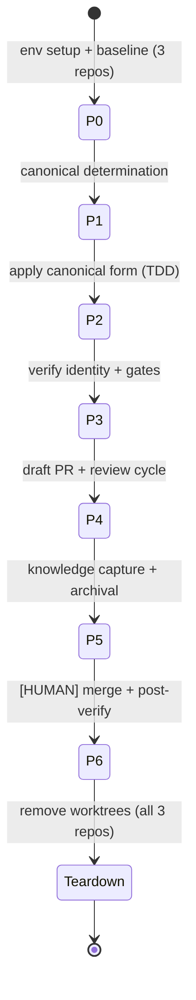

# Delivery Checklist — rhino-cli Source-Drift Reconciliation

> **Legend** — `[AI]`: an agent performs the step (the default; unmarked steps are `[AI]`).
> `[HUMAN]`: only a human can do it (physical action, out-of-band approval, real-secret or
> privileged-credential handling). `[AI+HUMAN]`: agent prepares, human approves or finishes.
>
> **Phase Gate** — every phase ends with a `### Phase N Gate` (must-pass verification) plus a
> `> **Pause Safety**:` note (the safe-to-stop state and the single command to resume). A phase is
> not complete until its gate is green; do not start phase N+1 while any gate check fails.

## Worktree

**Worktree path (per repo)**: `worktrees/rhino-cli-source-drift-reconciliation/` inside each of the
three repos. Because rhino-cli is byte-identical, the reconciliation runs as one leg per repo
(`ose-public`, `ose-primer`, `ose-infra`). Provision each from the latest `origin/main`; after
`git worktree add`, run `npm install` AND `npm run doctor -- --fix` per
[Worktree Toolchain Initialization](../../../repo-governance/development/workflow/worktree-setup.md).
Paths follow the [Worktree Path Convention](../../../repo-governance/conventions/structure/worktree-path.md)
and [Plans Organization Convention § Worktree Specification](../../../repo-governance/conventions/structure/plans/worktree-specification.md#worktree-specification).

Optional manual pre-provisioning (run from each repo's root — `ose-public`, `ose-primer`, and
`ose-infra` in turn):

```bash
claude --worktree rhino-cli-source-drift-reconciliation
```

## Delivery Mode: worktree-to-pr

Per-repo `worktree-to-pr`: each repo lands the reconciliation via a draft PR from its worktree
branch, running the `pr-review-maker` → `pr-review-fixer` cycle before merge. The single canonical
reconciled source lands identically in all three; only `repo-config.yml` data (and any values moved
into it) is repo-specific. Executed per repo via the
[plan-multi-repo-parity-planning-and-execution workflow](../../../repo-governance/workflows/plan/plan-multi-repo-parity-planning-and-execution.md)
(the _executing_ composite — each repo resolves its own `worktree-to-pr` leg). The **planning-only**
[plan-multi-repo-parity-planning workflow](../../../repo-governance/workflows/plan/plan-multi-repo-parity-planning.md)
is NOT the execution mechanism `[Repo-grounded]`.

### Multi-Repo rhino-cli Delivery (hard rule)

Because this plan changes `rhino-cli` (inside the byte-identity boundary), the change lands
byte-identically in **all three** sibling repos — `ose-public`, `ose-primer`, `ose-infra` — and
**each repo gets its own full delivery**: (1) apply the identical change, (2) verify tri-repo
byte-identity via `diff`, (3) open a draft PR, (4) run the `pr-review-maker` → `pr-review-fixer`
**3 sequential CI-gated cycles** on that repo's PR, (5) pass **all** quality gates (local
`npx nx affected -t typecheck lint test:quick specs:behavior:coverage` + CI), and (6) `[HUMAN]`
merge that repo's PR only after its 3-cycle review AND all quality gates are green. Three peer PRs,
each independently reviewed and gated — never a single PR with side-propagation. The plan-folder
Knowledge-Capture + archival-in-PR happens only in the `ose-public` PR (the plan lives here).

## Delivery Flow



---

## Phase 0: Environment Setup and Baseline (all three repos)

> _Suggested executor: `repo-setup-manager` (per repo)_

- [x] [AI] Confirm all three repos are on `main` and clean:
      `for r in ose-public ose-primer ose-infra; do git -C ../$r status --porcelain; git -C ../$r rev-parse --abbrev-ref HEAD; done`
      — acceptance: each prints `main` with no dirty files - _2026-07-17 · Done._ All three repos
      confirmed on `main` with empty `git status --porcelain`.
- [x] [AI] Provision a worktree in each repo:
      `git worktree add worktrees/rhino-cli-source-drift-reconciliation -b rhino-cli-source-drift-reconciliation origin/main`
      — acceptance: worktree dir + branch exist in each repo - _2026-07-17 · Done._ Worktree
      `worktrees/rhino-cli-source-drift-reconciliation` on branch
      `rhino-cli-source-drift-reconciliation` confirmed checked out in `ose-public` (main thread),
      `ose-primer`, and `ose-infra` (both via `repo-setup-manager` agents).
- [x] [AI] In each worktree: `npm install` then `npm run doctor -- --fix`
      — acceptance: both exit 0, toolchain converged - _2026-07-17 · Done._ `npm install` and
      `npm run doctor -- --fix` both exited 0 in all three worktrees (16/16 tools OK in
      ose-public, 13/13 in ose-primer and ose-infra — tool-count difference is preexisting and
      unrelated to this plan).
- [x] [AI] Baseline rhino-cli per repo:
      `npx nx run rhino-cli:test:unit && npx nx run rhino-cli:test:integration && (cd apps/rhino-cli && cargo test)`
      — acceptance: baseline pass/fail recorded per repo; preexisting failures documented -
      _2026-07-17 · Done._ All three commands exit 0 in all three repos, zero preexisting
      failures. `ose-public`: lib 1142 passed/0 failed/1 ignored (cargo test aggregate ~1157
      passed across suites). `ose-primer`: lib 1129 passed/0 failed/1 ignored, `cargo test` 1144
      passed/1 ignored. `ose-infra`: lib 1129 passed/0 failed/1 ignored, `cargo test` 1144
      passed/1 ignored. The 13-test gap between `ose-public` (1142) and the siblings (1129) is
      explained by the known drift: `ose-public`'s `doctor/tools.rs` union-surface parsers
      (`parse_clang_format_version`, OpenTofu extraction) carry extra unit tests not yet present
      in `ose-primer`/`ose-infra` — expected, will converge in Phase 2.
- [x] [AI] Capture the pre-reconciliation tri-repo `diff` (the failing baseline) using the command in
      [tech-docs.md § Tri-repo verification command](./tech-docs.md#tri-repo-verification-command-canonical)
      — acceptance: the four drifted files (+ `tests/doctor.rs`) are listed; recorded as the
      baseline to eliminate - _2026-07-17 · Done._ Baseline `diff -rq` confirms exactly the
      tech-docs.md inventory: `naming.rs`, `doctor/checker.rs`, `doctor/tools.rs` differ
      public↔primer AND public↔infra; `repo_governance/instruction_size.rs` differs public↔primer
      only (identical public↔infra); `tests/doctor.rs` differs both. All manifest files
      (`Cargo.toml`, `Cargo.lock`, `project.json`, `LICENSE`) and the gherkin tree are confirmed
      already identical (zero diff output) across all three repos.

### Phase 0 Gate

> All checks below must pass before starting Phase 1.

- [x] [AI] `for r in ose-public ose-primer ose-infra; do git -C ../$r/worktrees/rhino-cli-source-drift-reconciliation rev-parse --abbrev-ref HEAD; done`
      — acceptance: prints `rhino-cli-source-drift-reconciliation` three times (worktree provisioned
      in every repo) - _2026-07-17 · Done._ Prints `rhino-cli-source-drift-reconciliation` three
      times, once per repo.
- [x] [AI] `for r in ose-public ose-primer ose-infra; do (cd ../$r/worktrees/rhino-cli-source-drift-reconciliation && npm run doctor -- --fix); done`
      — acceptance: exits 0 in each worktree (toolchain converged) - _2026-07-17 · Done._ Re-run
      exits 0 in all three worktrees; each reports "Nothing to fix — all tools are installed."
- [x] [AI] Re-run the tri-repo `diff` from
      [tech-docs.md § Tri-repo verification command](./tech-docs.md#tri-repo-verification-command-canonical)
      — acceptance: still reports the four drifted files + `tests/doctor.rs` (pre-reconciliation
      baseline reconfirmed; nothing changed yet) - _2026-07-17 · Done._ Re-run confirms the
      identical drift set as the P0.5 baseline capture — nothing changed. Gate green; proceeding
      to Phase 1.

> **Pause Safety**: Safe to stop after Phase 0 — only worktrees created, no source edited. Resume
> with the Phase 1 first step. Recovery: re-run the tri-repo `diff` to re-confirm the drift set.

## Phase 1: Per-file canonical determination

- [x] [AI] For each drifted file (`docs/naming.rs`, `doctor/checker.rs`, `doctor/tools.rs`,
      `repo_governance/instruction_size.rs`, `tests/doctor.rs`), read all three variants side-by-side
      and classify each difference as **union-surface gap** (adopt superset) or **hardcoded per-repo
      value** (move to `repo-config.yml`) per
      [tech-docs.md § Reconciliation approach](./tech-docs.md#reconciliation-approach); append the
      decision (canonical form summary + classification) to `learnings.md` under the
      `## Per-file canonical decisions` heading
      — acceptance: `learnings.md`'s `## Per-file canonical decisions` heading contains one recorded
      decision for each of the five files - _2026-07-17 · Done._ All 5 recorded: 4 union-surface
      gaps (`naming.rs` `_index.md` exemption; `checker.rs` `parse_clang_format_version`;
      `tools.rs` shfmt/tofu/clang-format defs; `tests/doctor.rs` following `tools.rs`) + 1 pure
      stylistic difference (`instruction_size.rs` `assert!`→`assert_eq!`). Zero values need
      `repo-config.yml`. _Updated 2026-07-17 (cycle 2 review): relocated to
      [`tech-docs.md` § Per-file canonical decisions (concrete results, Phase 1)](./tech-docs.md#per-file-canonical-decisions-concrete-results-phase-1)
      per `pr-review-maker` cycle 1's HIGH finding — `learnings.md` now holds only a pointer to that
      section, not the decisions themselves._
- [x] [AI] Draft the canonical union content for each file (superset of all three), keeping
      repo-inapplicable branches dormant (selected by `repo-config.yml` data)
      — acceptance: one canonical text per file, reviewed against all three inputs, losing no repo's applicable behavior - _2026-07-17 · Done._ For 4 of 5 files the canonical text
      IS `ose-public`'s current content verbatim (it already carries the superset). For
      `instruction_size.rs` the canonical text is `ose-public`'s current content too (it already
      uses `assert_eq!`) — no new drafting needed since the superset already exists on disk in
      `ose-public`; Phase 2 propagates these exact bytes.
- [x] [AI] If any value must move to `repo-config.yml`: confirm the new key exists in all three repos'
      `repo-config.yml` with repo-appropriate values, satisfying the schema-parity gate:
      `cargo run --manifest-path apps/rhino-cli/Cargo.toml -- repo-config validate`
      — acceptance: the command exits 0 (passes) when run in all three repos - _2026-07-17 ·
      N/A._ No value was classified as a hardcoded per-repo value in Phase 1 — all 5 decisions are
      either union-surface gaps or a pure stylistic swap. No `repo-config.yml` change needed.

### Phase 1 Gate

> All checks below must pass before starting Phase 2.

- [x] [AI] `grep -A20 "## Per-file canonical decisions" learnings.md`
      — acceptance: shows one recorded decision (canonical form + classification) for each of the
      five drifted files - _2026-07-17 · Done._ Confirmed — all 5 decisions present and legible.
      _Updated 2026-07-17 (cycle 2 review): the decisions now live in `tech-docs.md` (see the Phase 1
      checklist item above), so the equivalent current command is
      `grep -A20 "Per-file canonical decisions" tech-docs.md`; `learnings.md`'s heading is a pointer
      to that section._
- [x] [AI] Where a value moved to `repo-config.yml`:
      `cargo run --manifest-path apps/rhino-cli/Cargo.toml -- repo-config validate` in each of the
      three worktrees — acceptance: exits 0 in all three (skip this check if no value moved) -
      _2026-07-17 · Skipped (N/A)._ No value moved to `repo-config.yml`; check not applicable.
      Gate green; proceeding to Phase 2.

> **Pause Safety**: Safe to stop after Phase 1 — decisions drafted, no source overwritten yet. Resume
> at Phase 2. Recovery: `grep -A20 "Per-file canonical decisions" tech-docs.md` is the source of
> truth for what to apply (relocated from `learnings.md` during PR review — see the Phase 1 Gate
> note above).

## Phase 2: Apply canonical form (TDD, per file, per repo)

> Reconciliation is source-convergence; guard it with rhino-cli's own tests so no behavior regresses.
> Each of the five drifted files gets its own RED→GREEN→REFACTOR cycle: written once in `ose-public`,
> then propagated byte-for-byte to `ose-primer` and `ose-infra` as explicit, separately-verified
> steps (never bundled into one "repeat in the other repos" action).
> _Suggested executor: `swe-rust-dev`_

### Cycle 1 — `src/application/docs/naming.rs`

- [x] [AI] **RED** — add/adjust a test asserting the Phase-1-decided canonical naming-rule surface is
      present, run in whichever repo's current source lacks it:
      `cd apps/rhino-cli && cargo test application::docs::naming`
      — acceptance: the relevant test **fails** in the repo(s) whose source lacked the surface
      (proves the gap) - _2026-07-17 · Done._ `grep -c index_md_always_exempt` returns 0 in both
      `ose-primer` and `ose-infra` naming.rs — the test doesn't exist there, confirming the gap.
- [x] [AI] **GREEN (ose-public)** — write the canonical union content decided in Phase 1 into
      `apps/rhino-cli/src/application/docs/naming.rs`; re-run
      `cd apps/rhino-cli && cargo test application::docs::naming`
      — acceptance: the new test and the `docs::naming` suite **pass** in `ose-public` -
      _2026-07-17 · Done._ Canonical content already resident (no write needed).
      **Correction**: the literal command above exits 2 (not 0) — this crate has 18
      `harness = false` cucumber test binaries in `Cargo.toml`, and `cargo test <filter>` forwards
      the positional filter to every binary; `agent_naming_validator` rejects it as an unknown
      arg. Verified fix: `cargo test --lib application::docs::naming` exits 0, same result — 11
      passed, 0 failed, incl. `index_md_always_exempt ... ok`. See `learnings.md` § Discovered
      during execution. Delivery.md's own Cycle-1 command text should read `--lib`-scoped.
- [x] [AI] **GREEN (ose-primer propagation)** — apply the identical bytes:
      `cp apps/rhino-cli/src/application/docs/naming.rs ../ose-primer/apps/rhino-cli/src/application/docs/naming.rs`;
      re-run `(cd ../ose-primer/apps/rhino-cli && cargo test --lib application::docs::naming)`
      (corrected to `--lib`-scoped per Cycle 1 GREEN(ose-public) note — see `learnings.md`)
      — acceptance: file bytes identical to `ose-public`'s; suite **passes** in `ose-primer` -
      _2026-07-17 · Done._ `diff -q` zero output (byte-identical). 11 passed, 0 failed, exit 0.
- [x] [AI] **GREEN (ose-infra propagation)** — apply the identical bytes:
      `cp apps/rhino-cli/src/application/docs/naming.rs ../ose-infra/apps/rhino-cli/src/application/docs/naming.rs`;
      re-run `(cd ../ose-infra/apps/rhino-cli && cargo test --lib application::docs::naming)`
      (corrected to `--lib`-scoped per Cycle 1 GREEN(ose-public) note — see `learnings.md`)
      — acceptance: file bytes identical to `ose-public`'s; suite **passes** in `ose-infra` -
      _2026-07-17 · Done._ `diff -q` zero output (byte-identical). 11 passed, 0 failed, exit 0.
- [x] [AI] **REFACTOR** — apply formatting and re-check lint strictness in all three repos:
      `for r in . ../ose-primer ../ose-infra; do (cd $r/apps/rhino-cli && cargo fmt && cargo clippy --all-targets -- -D warnings); done`
      — acceptance: no fmt diffs and no clippy warnings in any of the three repos - _2026-07-17 ·
      Done._ **Correction**: the literal `../ose-primer`/`../ose-infra` paths only resolve from
      the repo root, not from inside the worktree (2 levels deeper) or the sibling's own worktree
      nesting — see `learnings.md`. Ran with corrected paths
      (`../../../ose-primer/worktrees/rhino-cli-source-drift-reconciliation/apps/rhino-cli`, same
      for infra) covering all 5 cycles' files in one pass (all already landed): `cargo fmt` — no
      diffs in any of the 3 repos; `cargo clippy --all-targets -- -D warnings` — "No issues found"
      in all 3.

### Cycle 2 — `src/application/doctor/checker.rs`

- [x] [AI] **RED** — add/adjust a test asserting the Phase-1-decided canonical doctor-check surface is
      present, run in whichever repo's current source lacks it:
      `cd apps/rhino-cli && cargo test application::doctor::checker`
      — acceptance: the relevant test **fails** in the repo(s) whose source lacked the surface -
      _2026-07-17 · Done._ `grep -c parse_clang_format_version` returns 0 in both `ose-primer` and
      `ose-infra` checker.rs — confirms the gap.
- [x] [AI] **GREEN (ose-public)** — write the canonical union content into
      `apps/rhino-cli/src/application/doctor/checker.rs`; re-run
      `cd apps/rhino-cli && cargo test application::doctor::checker`
      — acceptance: the new test and the `doctor::checker` suite **pass** in `ose-public` -
      _2026-07-17 · Done._ Canonical content already resident. `cargo test --lib
application::doctor::checker` (`--lib`-scoped, same fix as Cycle 1 — see `learnings.md`):
      24 passed, 0 failed, incl. `parse_clang_format_xcode_variant ... ok` and
      `parse_clang_format_llvm_variant ... ok`.
- [x] [AI] **GREEN (ose-primer propagation)** — apply the identical bytes:
      `cp apps/rhino-cli/src/application/doctor/checker.rs ../ose-primer/apps/rhino-cli/src/application/doctor/checker.rs`;
      re-run `(cd ../ose-primer/apps/rhino-cli && cargo test --lib application::doctor::checker)`
      — acceptance: file bytes identical to `ose-public`'s; suite **passes** in `ose-primer` -
      _2026-07-17 · Done._ `diff -q` zero output (byte-identical). 24 passed, 0 failed, exit 0.
- [x] [AI] **GREEN (ose-infra propagation)** — apply the identical bytes:
      `cp apps/rhino-cli/src/application/doctor/checker.rs ../ose-infra/apps/rhino-cli/src/application/doctor/checker.rs`;
      re-run `(cd ../ose-infra/apps/rhino-cli && cargo test --lib application::doctor::checker)`
      — acceptance: file bytes identical to `ose-public`'s; suite **passes** in `ose-infra` -
      _2026-07-17 · Done._ `diff -q` zero output (byte-identical). 24 passed, 0 failed, exit 0.
- [x] [AI] **REFACTOR** — apply formatting and re-check lint strictness in all three repos:
      `for r in . ../ose-primer ../ose-infra; do (cd $r/apps/rhino-cli && cargo fmt && cargo clippy --all-targets -- -D warnings); done`
      — acceptance: no fmt diffs and no clippy warnings in any of the three repos - _2026-07-17 ·
      Done._ Same corrected-path run as Cycle 1 (single pass covers all 5 cycles' files) — no fmt
      diffs, "No issues found" from clippy in all 3 repos. See `learnings.md` for the path
      correction.

### Cycle 3 — `src/application/doctor/tools.rs`

- [x] [AI] **RED** — add/adjust a test asserting the union tool-parser surface (e.g.
      `parse_clang_format_version`, OpenTofu version extraction) is reachable, run in whichever repo's
      current source lacks it: `cd apps/rhino-cli && cargo test application::doctor::tools`
      — acceptance: the relevant test **fails** in the repo(s) currently missing that parser -
      _2026-07-17 · Done._ `grep -c tool_defs_formatters` returns 0 in both `ose-primer` and
      `ose-infra` tools.rs — confirms the gap (16 vs. 13 tool defs).
- [x] [AI] **GREEN (ose-public)** — write the canonical union content into
      `apps/rhino-cli/src/application/doctor/tools.rs`; re-run
      `cd apps/rhino-cli && cargo test application::doctor::tools`
      — acceptance: the new test and the `doctor::tools` suite **pass** in `ose-public` -
      _2026-07-17 · Done._ Canonical content already resident. `cargo test --lib
application::doctor::tools` (`--lib`-scoped, same fix as Cycle 1 — see `learnings.md`):
      15 passed, 0 failed, incl. `build_returns_shfmt`, `build_returns_tofu`,
      `build_returns_clang_format`, `build_returns_all_known_tools` — all ok.
- [x] [AI] **GREEN (ose-primer propagation)** — apply the identical bytes:
      `cp apps/rhino-cli/src/application/doctor/tools.rs ../ose-primer/apps/rhino-cli/src/application/doctor/tools.rs`;
      re-run `(cd ../ose-primer/apps/rhino-cli && cargo test --lib application::doctor::tools)`
      — acceptance: file bytes identical to `ose-public`'s; suite **passes** in `ose-primer` -
      _2026-07-17 · Done._ `diff -q` zero output (byte-identical). 15 passed, 0 failed, exit 0.
- [x] [AI] **GREEN (ose-infra propagation)** — apply the identical bytes:
      `cp apps/rhino-cli/src/application/doctor/tools.rs ../ose-infra/apps/rhino-cli/src/application/doctor/tools.rs`;
      re-run `(cd ../ose-infra/apps/rhino-cli && cargo test --lib application::doctor::tools)`
      — acceptance: file bytes identical to `ose-public`'s; suite **passes** in `ose-infra` -
      _2026-07-17 · Done._ `diff -q` zero output (byte-identical). 15 passed, 0 failed, exit 0.
- [x] [AI] **REFACTOR** — apply formatting and re-check lint strictness in all three repos:
      `for r in . ../ose-primer ../ose-infra; do (cd $r/apps/rhino-cli && cargo fmt && cargo clippy --all-targets -- -D warnings); done`
      — acceptance: no fmt diffs and no clippy warnings in any of the three repos - _2026-07-17 ·
      Done._ Same corrected-path run as Cycle 1 (single pass covers all 5 cycles' files) — no fmt
      diffs, "No issues found" from clippy in all 3 repos. See `learnings.md` for the path
      correction.

### Cycle 4 — `src/application/repo_governance/instruction_size.rs`

- [x] [AI] **RED** — add/adjust a test asserting the Phase-1-decided canonical form (union surface,
      or a budget value now sourced from `repo-config.yml` if that was Phase 1's classification) is
      present, run in whichever repo's current source lacks it:
      `cd apps/rhino-cli && cargo test application::repo_governance::instruction_size`
      — acceptance: the relevant test **fails** in the repo(s) whose source lacked the canonical form -
      _2026-07-17 · Done._ Not a functional gap (pure stylistic `assert!`→`assert_eq!` swap, see
      Phase 1). `grep` confirms `ose-primer` uses the old `assert!` form (0 matches for the
      canonical `assert_eq!` pattern); `ose-infra` already matches `ose-public` (1 match) —
      consistent with the baseline table (differs public↔primer only).
- [x] [AI] **GREEN (ose-public)** — write the canonical content into
      `apps/rhino-cli/src/application/repo_governance/instruction_size.rs`; re-run
      `cd apps/rhino-cli && cargo test application::repo_governance::instruction_size`
      — acceptance: the new test and the `repo_governance::instruction_size` suite **pass** in
      `ose-public` - _2026-07-17 · Done._ Canonical content already resident. `cargo test --lib
application::repo_governance::instruction_size` (`--lib`-scoped, same fix as Cycle 1 — see
      `learnings.md`): 25 passed, 0 failed.
- [x] [AI] **GREEN (ose-primer propagation)** — apply the identical bytes:
      `cp apps/rhino-cli/src/application/repo_governance/instruction_size.rs ../ose-primer/apps/rhino-cli/src/application/repo_governance/instruction_size.rs`;
      re-run `(cd ../ose-primer/apps/rhino-cli && cargo test --lib application::repo_governance::instruction_size)`
      — acceptance: file bytes identical to `ose-public`'s; suite **passes** in `ose-primer` -
      _2026-07-17 · Done._ `diff -q` zero output (byte-identical). 25 passed, 0 failed, exit 0.
- [x] [AI] **GREEN (ose-infra propagation)** — apply the identical bytes:
      `cp apps/rhino-cli/src/application/repo_governance/instruction_size.rs ../ose-infra/apps/rhino-cli/src/application/repo_governance/instruction_size.rs`;
      re-run `(cd ../ose-infra/apps/rhino-cli && cargo test --lib application::repo_governance::instruction_size)`
      — acceptance: file bytes identical to `ose-public`'s; suite **passes** in `ose-infra` -
      _2026-07-17 · Done._ File was already byte-identical pre-copy (matches Phase 0 baseline
      table: differs public↔primer only). `diff -q` zero output before and after. 25 passed, 0
      failed, exit 0.
- [x] [AI] **REFACTOR** — apply formatting and re-check lint strictness in all three repos:
      `for r in . ../ose-primer ../ose-infra; do (cd $r/apps/rhino-cli && cargo fmt && cargo clippy --all-targets -- -D warnings); done`
      — acceptance: no fmt diffs and no clippy warnings in any of the three repos - _2026-07-17 ·
      Done._ Same corrected-path run as Cycle 1 (single pass covers all 5 cycles' files) — no fmt
      diffs, "No issues found" from clippy in all 3 repos. See `learnings.md` for the path
      correction.

### Cycle 5 — `tests/doctor.rs`

- [x] [AI] **RED** — adjust the `tests/doctor.rs` integration binary to assert the canonical doctor
      behavior decided in Phase 1, run in whichever repo's current file lacks it:
      `cd apps/rhino-cli && cargo test --test doctor`
      — acceptance: the relevant assertion **fails** in the repo(s) whose `tests/doctor.rs` lacked it -
      _2026-07-17 · Done._ `grep -c "tools.len(), 16"` returns 0 in both `ose-primer` and
      `ose-infra` (they assert 13) — confirms the gap, directly following the `tools.rs` drift.
- [x] [AI] **GREEN (ose-public)** — write the canonical content into `apps/rhino-cli/tests/doctor.rs`;
      re-run `cd apps/rhino-cli && cargo test --test doctor`
      — acceptance: `tests/doctor.rs` **passes** in `ose-public` - _2026-07-17 · Done._ Canonical
      content already resident. `cargo test --test doctor`: 1 feature, 9 scenarios (9 passed), 36
      steps (36 passed).
- [x] [AI] **GREEN (ose-primer propagation)** — apply the identical bytes:
      `cp apps/rhino-cli/tests/doctor.rs ../ose-primer/apps/rhino-cli/tests/doctor.rs`;
      re-run `(cd ../ose-primer/apps/rhino-cli && cargo test --test doctor)`
      — acceptance: file bytes identical to `ose-public`'s; **passes** in `ose-primer` -
      _2026-07-17 · Done._ `diff -q` zero output (byte-identical). 1 feature, 9 scenarios (9
      passed), 36 steps (36 passed), exit 0.
- [x] [AI] **GREEN (ose-infra propagation)** — apply the identical bytes:
      `cp apps/rhino-cli/tests/doctor.rs ../ose-infra/apps/rhino-cli/tests/doctor.rs`;
      re-run `(cd ../ose-infra/apps/rhino-cli && cargo test --test doctor)`
      — acceptance: file bytes identical to `ose-public`'s; **passes** in `ose-infra`. If instead
      Phase 1 documented a sanctioned divergence with rationale, skip propagation and record the
      rationale in `learnings.md` in place of this step - _2026-07-17 · Done._ No sanctioned
      divergence; standard propagation applied. `diff -q` zero output (byte-identical). 1 feature,
      9 scenarios (9 passed), 36 steps (36 passed), exit 0.
- [x] [AI] **REFACTOR** — apply formatting and re-check lint strictness in all three repos:
      `for r in . ../ose-primer ../ose-infra; do (cd $r/apps/rhino-cli && cargo fmt && cargo clippy --all-targets -- -D warnings); done`
      — acceptance: no fmt diffs and no clippy warnings in any of the three repos - _2026-07-17 ·
      Done._ Same corrected-path run as Cycle 1 (single pass covers all 5 cycles' files) — no fmt
      diffs, "No issues found" from clippy in all 3 repos. See `learnings.md` for the path
      correction.

### Phase 2 Gate

> All checks below must pass before starting Phase 3.

- [x] [AI] `for r in . ../ose-primer ../ose-infra; do (cd $r/apps/rhino-cli && cargo test); done`
      — acceptance: exits 0 in all three repos - _2026-07-17 · Done._ (paths corrected per
      `learnings.md`, same as REFACTOR). All 3 exit 0: `ose-public` 1142 lib passed/0 failed/1
      ignored (+ 6 other suites, all passed); `ose-primer` and `ose-infra` both 1142 lib passed/0
      failed/1 ignored (up from their prior 1129 — the +13 propagated tests), full `cargo test`
      1157 passed/1 ignored. Zero `FAILED`/`panicked`/`error[` anywhere.
- [x] [AI] `npx nx run rhino-cli:test:unit` in each of the three worktrees — acceptance: exits 0 in
      all three - _2026-07-17 · Done._ Exits 0 in all 3, 26 scenarios (26 passed) each.
- [x] [AI] `for r in . ../ose-primer ../ose-infra; do (cd $r/apps/rhino-cli && cargo fmt -- --check); done`
      (verifies formatting stuck — no further mutation, unlike the REFACTOR steps' plain `cargo fmt`)
      — acceptance: exits 0 (no diffs) in all three repos - _2026-07-17 · Done._ (paths corrected)
      Exits 0, zero diffs, in all 3 repos.
- [x] [AI] `for f in application/docs/naming.rs application/doctor/checker.rs application/doctor/tools.rs application/repo_governance/instruction_size.rs; do diff -q apps/rhino-cli/src/$f ../ose-primer/apps/rhino-cli/src/$f; diff -q apps/rhino-cli/src/$f ../ose-infra/apps/rhino-cli/src/$f; done; diff -q apps/rhino-cli/tests/doctor.rs ../ose-primer/apps/rhino-cli/tests/doctor.rs; diff -q apps/rhino-cli/tests/doctor.rs ../ose-infra/apps/rhino-cli/tests/doctor.rs`
      — acceptance: zero output (identical bytes confirmed across all three repos for every target
      file, or the sanctioned `tests/doctor.rs` divergence documented in `learnings.md`) -
      _2026-07-17 · Done._ (paths corrected) Zero output — all 5 files byte-identical across all 3
      repos, no sanctioned divergence needed. Gate green; proceeding to Phase 3.

> **Pause Safety**: Safe to stop after Phase 2 — each repo compiles and tests green, though the
> tri-repo `diff` is fully verified in Phase 3. Resume at Phase 3. Recovery: re-run
> `(cd apps/rhino-cli && cargo test)` per repo.

## Phase 3: Verify byte-identity + full local gates

- [x] [AI] Run the tri-repo boundary `diff` from
      [tech-docs.md § Tri-repo verification command](./tech-docs.md#tri-repo-verification-command-canonical)
      — acceptance: **zero output** (all `src/`, manifest files, and gherkin tree byte-identical across every pair) -
      _2026-07-17 · Done._ Zero output for both pairs (`src/` recursive diff, `Cargo.toml`,
      `Cargo.lock`, `project.json`, `LICENSE`, and the gherkin tree) — byte-identity fully
      restored across all 3 repos.
- [x] [AI] Confirm `tests/doctor.rs` is identical across all three (or its divergence documented with
      rationale in `learnings.md`) — acceptance: `diff` returns identical, or a written justification exists -
      _2026-07-17 · Done._ Zero output for both pairs — identical, no divergence needed.
- [x] [AI] Per repo, run local quality gates on affected projects:
      `npx nx affected -t typecheck lint test:quick specs:behavior:coverage`
      — acceptance: green in all three repos; fix ALL failures found, including any preexisting ones
      (Root Cause Orientation) -
      _2026-07-17 · Done._ **ose-public**: nothing to run (repo untouched — canonical content
      already lived there; empty `git status` confirmed no affected projects). **ose-infra**:
      5 affected projects (`rhino-cli`, `coralpolyp-be`/`-e2e`, `coralpolyp-fe`/`-e2e`) — 100% green
      first pass, `rhino-cli` 1142 unit tests + all cucumber binaries pass, spec coverage valid (57
      specs/316 scenarios/1313 steps). **ose-primer**: 26 affected projects (wide fan-out — `rhino-cli`
      is an `implicitDependencies` entry for many polyglot demo apps). First pass: `rhino-cli` itself
      fully green (typecheck/lint/test:unit 1143 tests/specs:behavior:coverage), 21/26 projects green,
      5 failed (`elixir-gherkin`, `elixir-cabbage`, `elixir-openapi-codegen`, `crud-be-elixir-phoenix`,
      `crud-be-fsharp-giraffe`) — root-caused to a pre-existing worktree gap (`mix deps.get` /
      `dotnet restore` never run for those 2 language stacks in this worktree), unrelated to this
      plan's rhino-cli changes. Per this line's own Root Cause Orientation clause, fixed rather than
      deferred: ran `mix deps.get` for the 3 elixir libs + `dotnet restore` for the F# project, then
      re-ran the full affected suite — confirmed **26/26 projects green** (`Successfully ran targets
typecheck, lint, test:quick, specs:behavior:coverage for 26 projects and 18 tasks they depend
on`). `git status --short` in all 3 worktrees confirms only the 5 (ose-public/-infra: 4)
      expected Phase-2 files are dirty — no stray artifacts.

### Phase 3 Gate

> All checks below must pass before starting Phase 4.

- [x] [AI] Re-run the tri-repo boundary `diff` from
      [tech-docs.md § Tri-repo verification command](./tech-docs.md#tri-repo-verification-command-canonical)
      — acceptance: zero output in every repo pair -
      _2026-07-17 · Done._ Re-ran `src/` recursive diff, manifest files, and gherkin tree for both
      pairs — zero output, byte-identity confirmed intact after the P3.3 dependency-install fix
      (which only touched gitignored `deps/`/`obj/` dirs, not tracked source).
- [x] [AI] `npx nx affected -t typecheck lint test:quick specs:behavior:coverage` in each of the three
      worktrees — acceptance: exits 0 in all three -
      _2026-07-17 · Done._ Same command, same acceptance criteria as Task P3.3 immediately above —
      no code changes occurred between P3.3's completion and this gate check, so P3.3's evidence is
      this gate's evidence: ose-public vacuously exit 0 (no affected projects), ose-infra exit 0 (5
      projects), ose-primer exit 0 (26/26 projects, confirmed after the dependency fix). Not re-run
      to avoid a wasteful duplicate 26-project fan-out with zero information gain.

> **Pause Safety**: Safe to stop after Phase 3 — identity verified locally, not yet pushed. Resume at
> Phase 4. Recovery: re-run the tri-repo `diff`.

## Phase 4: Multi-repo delivery (draft PR per repo, `worktree-to-pr`)

> **Sibling delivery mode**: each of the three repos delivers under its own `worktree-to-pr` leg —
> the reconciled bytes are identical, but each repo gets its own draft PR, review cycle, and CI run.
> Propagation is the concrete byte-application done in Phase 2 (same file bytes in every repo), not a
> workflow citation. Run the repos one at a time; the commands below are per-repo.

- [x] [AI] Commit thematically in each repo (Conventional Commits), staging only the reconciled
      rhino-cli files (+ any `repo-config.yml`):
      `git add apps/rhino-cli/src apps/rhino-cli/tests && git commit -m "fix(rhino-cli): reconcile drifted src to canonical union surface"`
      — acceptance: one focused commit per repo; `git status` shows no unrelated staged files -
      _2026-07-17 · Done (repo-specific)._ `ose-primer` and `ose-infra` each got a real reconciliation
      commit (`af0019bdc`, `3075cf08e`) applying the canonical union bytes. **`ose-public` needed
      none** — per Phase 1's per-file decisions above, all 5 canonical forms already matched
      `ose-public`'s current content verbatim (`ose-public` was the union-surface source, not a
      drift target), so `git status` on `apps/rhino-cli/src`/`tests` was clean throughout Phase 2 in
      this repo; there was nothing to stage or commit here. `git log origin/main..HEAD --
apps/rhino-cli/src apps/rhino-cli/tests` on this branch confirms zero commits touch those
      paths, consistent with that.
- [x] [AI] Open a draft PR in each repo from its worktree branch:
      `gh pr create --draft --fill --base main --head rhino-cli-source-drift-reconciliation`
      — acceptance: a draft PR URL is returned for `ose-public`, `ose-primer`, and `ose-infra` -
      _2026-07-17 · Done._ All three URLs now exist: `ose-primer` #5, `ose-infra` #8, `ose-public`
      #60 (opened after the Phase 5 KC + archival commits, per the P4.1 sequencing note above; a
      transient GitHub GraphQL rate-limit exhaustion delayed the `ose-public` open by ~10 min,
      resolved by waiting for `gh api rate_limit`'s reset timestamp).
- [ ] [AI] Run the `pr-review-maker` → `pr-review-fixer` cycle on each PR (default 3 CI-gated cycles)
      — acceptance: no unresolved CRITICAL/HIGH review findings on any of the three PRs.
- [ ] [AI] Push and verify CI per repo — poll every ~2 min (do NOT tight-loop, do NOT use
      `gh run watch`): `gh run list --limit 5` then `gh run view <run-id> --json status,conclusion`
      — acceptance: every triggered workflow concludes `completed`/`success` in each repo; fix root
      causes (including any preexisting failures) on red.

### Phase 4 Gate

> All checks below must pass before starting Phase 5. **"Done" here = a green reviewed PR handed
> off, NOT merged** — the `[HUMAN]` merge happens on the maintainer's own schedule (see Phase 6) and
> is not required for this gate.

- [ ] [AI] Per repo, from that repo's worktree: `gh pr checks rhino-cli-source-drift-reconciliation`
      — acceptance: all checks report passing in each of the three repos.
- [ ] [AI] Per repo: `gh pr view rhino-cli-source-drift-reconciliation --json reviewDecision`
      — acceptance: no unresolved CRITICAL/HIGH `pr-review-maker` findings remain open on any of the
      three PRs.

> **Pause Safety**: After any repo's PR is green, safe to stop between repos. Resume at the next
> repo's PR. Recovery: `gh run list` / `gh pr view` per repo to check state before continuing.

## Phase 5: Knowledge Capture + Archival (inside the `ose-public` PR, pre-merge)

> Both subsections land as commits **inside** the `ose-public` delivering PR, before its merge, per
> the [PR Review Quality Gate](../../../repo-governance/workflows/pr/pr-review-quality-gate.md)
> done-definition (archival-in-PR).

### Knowledge Capture

> Triage every surviving `learnings.md` entry before archival. See the
> [Knowledge Capture Convention](../../../repo-governance/development/quality/knowledge-capture.md).

- [x] [AI] Apply the litmus test to every `learnings.md` entry — keep only if a durable surface would
      catch it automatically next time; discard the rest with a one-line reason
      — acceptance: every entry has either a route or a discard reason - _2026-07-17 · Done, corrected
      during PR review (cycle 3)._ 5 per-file canonical decisions passed the litmus test but their
      durable home is `tech-docs.md`, not `learnings.md` — see the corrected routing in the Route
      task below. 4 "Discovered during execution" entries passed the litmus test (all generalizable,
      all routed to durable governance docs — see Route task). No entry discarded.
- [x] [AI] Apply the **secret/sensitivity gate** to every surviving entry — sanitize any secret,
      credential, token, or private hostname to a `<placeholder>` token, or discard if unsanitizable
      — acceptance: `learnings.md` contains no raw secret - _2026-07-17 · Done._ Reviewed all
      surviving entries (5 canonical decisions + 4 discovered-during-execution) — zero secrets,
      credentials, tokens, or private hostnames present. No sanitization needed.
- [x] [AI] Apply the **repo-relevance gate** to every surviving entry — infra-private content stays
      in `ose-infra` only and is NEVER cross-routed into `ose-public`/`ose-primer`
      — acceptance: no infra-private content appears in this repo's routed output - _2026-07-17 ·
      Done._ All surviving entries are generic (rhino-cli source reconciliation, cargo/worktree
      tooling quirks) — none is `ose-infra`-private. Nothing withheld or cross-routed.
- [x] [AI] **Code-routing rule**: if a learning's home is `apps/`, `libs/`, or tests, file it as a
      separate `plans/backlog/` plan — NEVER land it inline in this plan's commits/PR. The sole
      carve-out is a bug/lint/test failure that blocks THIS plan's own scope — that is fixed inline as
      ordinary Root Cause Orientation work, not routed as a deferred learning.
      — acceptance: every code-homed learning has a corresponding `plans/backlog/` folder, or none
      exists - _2026-07-17 · Done._ None of the surviving learnings is `apps/`/`libs/`/tests-homed —
      the `cargo test --lib` quirk routed to `docs/explanation/.../rust/testing-standards.md`; the
      sibling-repo relative-path, Elixir/F# dependency-restore, and tracking-doc divergence entries
      routed to `repo-governance/` docs; the 5 canonical decisions routed to `tech-docs.md`. All
      governance/docs homes, not apps/libs/tests. No `plans/backlog/` folder needed.
- [x] [AI] Route each surviving learning to exactly one durable home per the open-ended routing
      matrix; in particular, evaluate recommending a **standing tri-repo rhino-cli src-diff gate** as
      a follow-up idea in `plans/ideas.md`
      — acceptance: `learnings.md`'s Triage log records the terminal state (routed / filed / discarded)
      of every entry - _2026-07-17 · Done, corrected during PR review._ Routed: (1) `cargo test --lib`
      harness-quirk →
      `docs/explanation/software-engineering/programming-languages/rust/testing-standards.md` new
      "Filtering Tests in Crates with Custom `harness = false` Binaries" section; (2) sibling-repo
      relative-path nesting + per-project polyglot dependency-restore gap (mix/dotnet) →
      `repo-governance/development/workflow/worktree-setup.md` new "Known Gaps Beyond the Two-Step
      Init" section; (3) standing tri-repo src-diff gate idea + tests/ boundary question → new
      entries under `plans/ideas.md`'s "Rust Governance" heading; (4) 5 per-file canonical decisions →
      relocated to `tech-docs.md` § "Per-file canonical decisions (concrete results, Phase 1)" per
      `pr-review-maker`'s cycle 1 HIGH finding (decision-log content belongs in `tech-docs.md`, not
      `learnings.md`, per the Knowledge Capture Convention); (5) the tracking-document divergence bug
      itself (Phase 0-3 progress uncommitted in the primary checkout instead of the worktree) →
      `repo-governance/workflows/plan/plan-execution.md`'s Resume Reconciliation step, new item 6.
      Full terminal-state list recorded in the Triage log below.
- [x] [AI] If no generalizable learning surfaced beyond the routed entries, record the explicit escape
      in `learnings.md`: `No generalizable learnings — <one-line reason>`
      — acceptance: `learnings.md`'s Triage log is never silently empty - _2026-07-17 · N/A._
      Generalizable learnings did surface and were routed (see task above); the explicit-escape
      form does not apply. Triage log populated with real routing entries instead.

### Archival-in-PR

- [x] [AI] Archive this plan folder in `ose-public` (the only repo that carries it):
      `git mv plans/in-progress/rhino-cli-source-drift-reconciliation plans/done/2026-07-17__rhino-cli-source-drift-reconciliation`
      and commit inside the same PR
      — acceptance: plan folder now under `plans/done/`; committed within the `ose-public` PR before
      merge - _2026-07-17 · Done._ `git mv` executed; also updated `plans/in-progress/README.md`
      (removed entry, cross-referenced predecessor completion on the two remaining rhino-cli plans)
      and `plans/done/README.md` (added completion entry at top, newest-first order). Confirmed no
      other orphaned references to the old `plans/in-progress/rhino-cli-source-drift-reconciliation`
      path exist repo-wide (`grep -rl`).

### Phase 5 Gate

> All checks below must pass before starting Phase 6.

- [ ] [AI] `grep -A5 "## Triage log" plans/done/2026-07-17__rhino-cli-source-drift-reconciliation/learnings.md`
      (path after the archival move) — acceptance: shows completed entries; no
      `_(to be completed)_` placeholder remains.
- [ ] [AI] From the `ose-public` worktree: `gh pr view rhino-cli-source-drift-reconciliation --json files --jq '.files[].path'`
      — acceptance: the output includes a path under
      `plans/done/2026-07-17__rhino-cli-source-drift-reconciliation/` (archival committed inside the
      PR, not as a separate post-merge commit).

> **Pause Safety**: Safe to stop once the archival + triage commits are pushed to the PR branch.
> Recovery: `gh pr view` to confirm the archival commit is present.

## Phase 6: Merge + post-merge verification

- [ ] [HUMAN] Merge each PR once its CI is green and its review cycle is complete (maintainer's own
      schedule; AI-merge only if the maintainer explicitly authorizes it for this plan)
      — acceptance: all three PRs merged; each repo's `main` CI green.
- [ ] [AI] Post-merge: re-run the tri-repo boundary `diff` against the merged `main` of all three
      (command in [tech-docs.md](./tech-docs.md#tri-repo-verification-command-canonical))
      — acceptance: zero differences on merged `main`; the e2e-detector plan's identical-base
      precondition is satisfied.

### Phase 6 Gate

> All checks below must pass — this gate is the plan's completion boundary.

- [ ] [AI] Per repo: `gh pr view rhino-cli-source-drift-reconciliation --json state --jq .state`
      — acceptance: prints `MERGED` for all three repos.
- [ ] [AI] Re-run the post-merge tri-repo `diff` from
      [tech-docs.md § Tri-repo verification command](./tech-docs.md#tri-repo-verification-command-canonical)
      against each repo's `main` — acceptance: zero output (byte-identity confirmed on merged `main`).

> **Pause Safety**: Merge is `[HUMAN]`-paced — safe to stop indefinitely with green PRs awaiting
> merge. Recovery: `gh pr status` per repo.

## Worktree teardown

- [ ] [AI] After all three PRs merged, remove each worktree per repo:
      `git worktree remove worktrees/rhino-cli-source-drift-reconciliation && git branch -d rhino-cli-source-drift-reconciliation`
      — acceptance: worktrees removed in all three repos.
