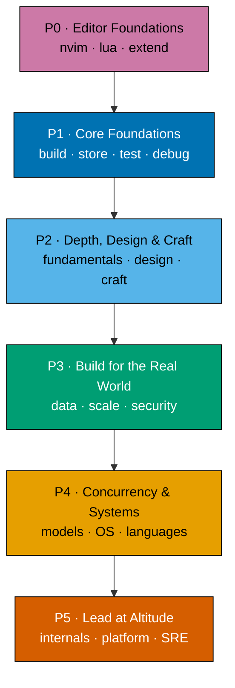

# Product Requirements — The Fundamentally Strong Software Engineer

## Product Overview

A new self-contained top-level collection at `learn/fundamentally-strong/` on ayokoding-www, built for
**breadth-across-the-field with by-example depth per topic**, sequenced as a **spiral learning
journey**: the reader first sets up their editor/forge, then builds, stores, tests, and secures a
small working system early, then revisits each concern area at increasing depth on later passes. The
layout is **topic-first** (DD-26): each topic is one folder owning both a **learning** and a
**drilling** subfolder, so the two tracks cover the same 94 topics in the same order, co-located per
topic. English only. Static markdown; the only executable artifacts are the colocated, downloadable
code samples each topic ships (DD-24), which are excluded from the app's build/test/lint gates.

Three cross-cutting authoring guarantees back the content: every topic is **accuracy-verified** by
the `web-researcher` agent before authoring (DD-28); every example and capstone is
**follow-along-complete** — reproducible step-by-step, code-by-code, line-by-line, with no hidden
assumptions (DD-30); and every topic ships **capstones** that cement the knowledge — an intra-topic
capstone inside each topic plus inter-topic capstones at pass boundaries and cross-cutting junctions
(DD-27). Per-topic detail (items, examples, and full capstone specs) lives in the
[syllabus/ folder](./syllabus/), one `NN-<slug>.md` file per topic (DD-29).

**The goal is an outcome, not a page count**: a reader who works this section becomes a
**fundamentally strong software engineer** — grounded enough to operate at **any company size, at any level
of complexity, and at any career altitude from individual contributor up to CTO**. Topic and tutorial
length are explicitly not a concern (per the user); depth-to-grounding of each topic's core is. Scope
is judged by real-world usefulness, not by topic count — genuinely useful material is in scope even
when it grows the surface.

**Pace target (per user):** each topic's learning content is authored at a pace **comparable to an
ayokoding By Example tutorial** — heavily annotated, incremental, code-first where code fits, with
annotation density **1.0–2.25 comments per code line per example**. [Repo-grounded —
`docs-creating-by-example-tutorials` skill / `apps-ayokoding-www-by-example-checker`]

**Three content shapes by topic nature:**

- **By Example** — code-centric topics use the ayokoding By Example format.
- **Annotated-concept** — concept-centric topics use equal-density worked examples + accessible
  Mermaid diagrams so the pace stays comparable where a strict 75–85-code-example format is awkward.
- **Primer** — a _Just Enough &lt;Language or Tool&gt;_ on-ramp: the minimum of a language or tool
  needed to be productive in the topics that use it, authored at By-Example pace. Primers exist so a
  reader never learns a new language and a new concept at the same time (DD-13).

This is **content-only** (markdown under `apps/ayokoding-www/content/`, plus colocated code samples
per DD-24). It is not a UI/component change, so the UI-design-funnel requirement does not apply.

## Tooling & Environment Stance (raw-form-first)

Across every topic, the content assumes and teaches a **pure-editor, CLI-first workflow on a
macOS/Linux-compatible environment** — the reader edits in **Neovim** and drives everything else
(compile, run, test, debug, package, version-control) from the terminal, rather than behind the
buttons of a full IDE such as IntelliJ (DD-17). The point is pedagogical: a fundamentally strong engineer
should know the **raw form** of the tools — the actual compiler/interpreter invocation, the test
runner command, the `git` plumbing, the build step — not just the IDE gesture that hides it. Where a
topic shows an editor/terminal interaction, it shows the command, not a screenshot of a GUI.

Because the workflow _is_ Neovim + terminal, the series **teaches the editor first** — a **Pass 0 ·
Editor Foundations** prologue (Just Enough Nvim → Just Enough Lua → Extending Neovim) precedes even
Python, so the reader is fluent in their tool before the first program. **Just Enough Nvim** is
deliberately scoped to **vanilla latest Neovim with zero plugins/extensions** — modes, motions,
operators, buffers/windows/tabs, registers, marks, macros, search-and-replace, quickfix, and the
built-in `:terminal` — so editing fluency is built on what ships in the box. Plugin management, LSP,
DAP, Treesitter, and completion are the subject of **Extending Neovim** (after **Just Enough Lua**
supplies the config language). Every topic also lists its **Neovim and VSCode** editor setup so a
VSCode reader can follow along, under a fixed precedence — **nvim ⇒ vscode ⇒ topic/language/stack**
(see [Editor Setup matrix](#editor-setup-matrix-dd-25)).

This mirrors the Python-primary rule: a sensible default with **honestly named exceptions**. Some
platforms make a vendor IDE effectively mandatory, and the content says so plainly rather than
pretending otherwise:

- **iOS App Development** — Xcode is required (simulator, signing, SwiftUI previews); the topic uses
  Xcode where the platform demands it and still shows the `swift`/`xcodebuild` command-line form where
  possible.
- **Android App Development** — Android Studio / the Android SDK + Gradle tooling is the practical
  baseline (emulator, AVD, Gradle); the topic favours the Gradle CLI (`./gradlew`) for the raw form.
- **Windows App Development** — Visual Studio / the .NET SDK is the practical baseline for WinUI/WPF;
  the topic favours the `dotnet` CLI for build/test/run where possible.

Everywhere else — Python, Bash, TypeScript, Go, Elixir, C, SQL, Cypher, containers/IaC, the OS and
systems topics — the workflow is **terminal-first and editor-agnostic** (Neovim-friendly, VSCode
parity documented), so a reader on macOS or Linux can follow every step without a proprietary IDE.
This stance is an authoring constraint applied to all topics; it does not add a topic.

## Learning Journey (Pass 0 prologue + five-pass spiral + parallel tracks)

The 94 topics are sequenced as a **Pass 0 setup prologue followed by a five-pass spiral** under an
**immediately-effective** principle (per user): after the reader sets up their editor, the earliest
learning topics get them **building, persisting, testing, and securing a small end-to-end system
fast**, then each later pass revisits the same concern areas at greater depth and breadth. This
replaces the earlier strict seven-level gated ordering: the passes are **descriptive arcs, not
gates**, and big subjects are **split into an Essentials topic early and an Advanced topic later,
interleaved across passes** so a usable slice arrives before the deep facets (DD-11).

The prologue and five passes:

- **Pass 0 · Editor Foundations** (topics 1–3) — Just Enough Nvim (vanilla, no plugins), Just Enough
  Lua, Extending Neovim (plugins, LSP, DAP, Treesitter, completion). Outcome: the reader is fluent in
  the editor and terminal workflow every later topic assumes.
- **Pass 1 · Core Foundations** (topics 4–18) — Just Enough Python, Just Enough Bash, Version Control &
  Git, DS&A/OOP Essentials, Project Management (▲), SQL/Backend/Networking Essentials, Just Enough
  TypeScript, Frontend Essentials, Software Testing, Debugging & Profiling, Security Essentials,
  Technical Communication. Outcome: build + store + test + secure + debug a small full-stack app,
  driving it from the shell, understanding the network layer it rides on.
- **Pass 2 · Depth, Design & Craft** (topics 19–33) — CS foundations, computer architecture, OO design
  & patterns, paradigms, functional programming (incl. applied category theory), concurrency &
  parallelism, advanced algorithms, advanced SQL, data access (ORMs + build-your-own), advanced
  networking, engineering practices, agentic coding, and the start-early Product & Delivery track (▲:
  Software Product Engineering, Engineering Management).
- **Pass 3 · Build for the Real World** (topics 34–63) — NoSQL (Valkey/Redis), graph databases, DB
  internals & storage engines, data engineering, search & IR, backend at scale, build-your-own web
  framework, API design, architecture (incl. hexagonal), **Domain-Driven Design**, system design,
  **Event-Driven Architecture**, distributed systems, advanced frontend, build-your-own reactive UI,
  information architecture & SEO, containers & orchestration, cloud & IaC, **CI/CD & release
  engineering**, AI-powered apps, agentic AI, the IT-security + **Offensive Security (red team, Kali) +
  Defensive Security (blue team, SOC/IR)** split, IT governance & GRC, and analytics & experimentation.
- **Pass 4 · Concurrency & Systems** (topics 64–89) — CSP (Go) and actor (Elixir) concurrency, the ◆
  app domains (Android/iOS/Hybrid/Windows/Linux) with their language primers, building production CLI
  tools, C + OS internals (Linux/Windows, incl. PowerShell), systems programming, Rust + modern systems
  programming, Java + the enterprise JVM, Lisp (Scheme + Clojure sidebar), F#, type systems (OCaml +
  Haskell + F# sidebar; incl. applied category theory), compilers/parsers/transpilers.
- **Pass 5 · Internals & Lead at Altitude** (topics 90–94) — Build Your Own Git, Build Your Own
  Database, Build Your Own Raft, Platform Engineering & Developer Experience (‡ senior leadership
  depth), and Site Reliability Engineering (the platform/SRE finale).

Two **parallel tracks** run alongside the spiral (a reader picks their path rather than reading all
serially): the **app-domain** topics marked ◆ (Android / iOS / Hybrid / Windows / Linux app — pick the
domain(s) that match your path) and the **Product & Delivery** track marked ▲ (Software Product
Engineering + Project Management — readable early, from Pass 1 onward, since product and delivery
thinking help a junior engineer immediately). Engineering Management (Pass 2) and IT Governance &
GRC (Pass 3) come later as senior-altitude depth (DD-14).



Both the learning and drilling tracks follow this exact same pass order and topic order; the
"parallel tracks" are a **reading-path affordance** (the ◆ app domains and the ▲ Product & Delivery
track are independent of the main spine), not a second content layout.

### Skill tree (all 94 topics, dependency view)

The pass phase diagram above is the high-level arc; the skill tree below is the **per-topic
dependency map** — an RPG-style tech tree showing the actual prerequisite spine plus the branch
bulges (the ▲ Product & Delivery track, the red/blue security split, and the ◆ app-domain fan). The
Pass 0 editor prologue (nvim → lua → extending nvim) leads into Python. Solid arrows are the
recommended learning order; dotted `primer` / `deepens` links show where a _Just Enough_ primer feeds
its first use and where an Essentials topic is later revisited at depth. Node colour encodes the pass
(P0 → P5).

```mermaid
flowchart TD
    N1["1 · Just Enough Nvim"]
    N2["2 · Just Enough Lua"]
    N3["3 · Extending Neovim"]
    N4["4 · Just Enough Python"]
    N5["5 · Just Enough Bash"]
    N6["6 · Version Control & Git"]
    N7["7 · DS & Algo Essentials"]
    N8["8 · OOP Essentials"]
    N9["9 · Project Management ▲"]
    N10["10 · SQL Essentials"]
    N11["11 · Backend Essentials"]
    N12["12 · Networking Essentials"]
    N13["13 · Just Enough TypeScript"]
    N14["14 · Frontend Essentials"]
    N15["15 · Software Testing"]
    N16["16 · Debugging & Profiling"]
    N17["17 · Security Essentials"]
    N18["18 · Technical Communication"]
    N19["19 · CS Foundations"]
    N20["20 · Computer Architecture"]
    N21["21 · OO Design & Patterns"]
    N22["22 · Programming Paradigms"]
    N23["23 · Functional Programming"]
    N24["24 · Concurrency & Parallelism"]
    N25["25 · Advanced Algorithms"]
    N26["26 · Advanced SQL"]
    N27["27 · Data Access: ORMs"]
    N28["28 · BYO ORM"]
    N29["29 · Advanced Networking"]
    N30["30 · Eng Practices"]
    N31["31 · Agentic Coding"]
    N32["32 · Product Engineering ▲"]
    N33["33 · Engineering Mgmt"]
    N34["34 · NoSQL Databases"]
    N35["35 · Graph Databases"]
    N36["36 · DB Internals"]
    N37["37 · Data Engineering"]
    N38["38 · Search & IR"]
    N39["39 · Backend at Scale"]
    N40["40 · BYO Web Framework"]
    N41["41 · API Design"]
    N42["42 · Software Architecture"]
    N43["43 · Domain-Driven Design"]
    N44["44 · System Design"]
    N45["45 · Event-Driven Arch"]
    N46["46 · Distributed Systems"]
    N47["47 · Advanced Frontend"]
    N48["48 · BYO Reactive UI"]
    N49["49 · Info Arch & SEO"]
    N50["50 · Containers & Orch"]
    N51["51 · Cloud & IaC"]
    N52["52 · Bare-Metal Virtualization"]
    N53["53 · Self-Managed K8s & GitOps"]
    N54["54 · Build Automation"]
    N55["55 · CI/CD & Release Eng"]
    N56["56 · AI-Powered Apps"]
    N57["57 · Agentic AI"]
    N58["58 · IT / App Security"]
    N59["59 · Offensive Sec (Red)"]
    N60["60 · Defensive Sec (Blue)"]
    N61["61 · Vulnerability Mgmt"]
    N62["62 · IT Governance GRC"]
    N63["63 · Analytics & Experiments"]
    N64["64 · Just Enough Go"]
    N65["65 · CSP Concurrency"]
    N66["66 · Just Enough Elixir"]
    N67["67 · Actor Concurrency"]
    N68["68 · Just Enough Kotlin"]
    N69["69 · Android App Dev ◆"]
    N70["70 · Just Enough Swift"]
    N71["71 · iOS App Dev ◆"]
    N72["72 · Just Enough Dart"]
    N73["73 · Hybrid App Dev ◆"]
    N74["74 · Just Enough C#"]
    N75["75 · Windows App Dev ◆"]
    N76["76 · Linux App Dev ◆"]
    N77["77 · Building Production CLI"]
    N78["78 · Just Enough C"]
    N79["79 · Linux OS"]
    N80["80 · Windows OS"]
    N81["81 · System Programming"]
    N82["82 · Just Enough Rust"]
    N83["83 · Modern System Programming"]
    N84["84 · Just Enough Java"]
    N85["85 · Enterprise Java & JVM"]
    N86["86 · Lisp"]
    N87["87 · Just Enough F#"]
    N88["88 · Type Systems"]
    N89["89 · Compilers & Transpilers"]
    N90["90 · Build Your Own Git"]
    N91["91 · Build Your Own Database"]
    N92["92 · Build Your Own Raft"]
    N93["93 · Platform Engineering"]
    N94["94 · Site Reliability Eng"]

    N1 --> N2 --> N3 --> N4 --> N5 --> N6 --> N7 --> N8 --> N9 --> N10
    N10 --> N11 --> N12 --> N13 --> N14 --> N15 --> N16 --> N17 --> N18 --> N19
    N19 --> N20 --> N21 --> N22 --> N23 --> N24 --> N25 --> N26 --> N27 --> N28
    N28 --> N29 --> N30 --> N31 --> N32 --> N33 --> N34 --> N35 --> N36 --> N37
    N37 --> N38 --> N39 --> N40 --> N41 --> N42 --> N43 --> N44 --> N45 --> N46
    N46 --> N47 --> N48 --> N49 --> N50 --> N51 --> N52 --> N53 --> N54 --> N55
    N55 --> N56 --> N57 --> N58
    N58 --> N59
    N58 --> N60
    N59 --> N62
    N60 --> N61 --> N62
    N62 --> N63 --> N64
    N64 --> N65 --> N66 --> N67
    N67 --> N68 --> N69
    N67 --> N70 --> N71
    N67 --> N72 --> N73
    N67 --> N74 --> N75
    N75 --> N76
    N69 --> N77
    N71 --> N77
    N73 --> N77
    N75 --> N77
    N76 --> N77
    N77 --> N78 --> N79 --> N80 --> N81 --> N82 --> N83 --> N84 --> N85
    N85 --> N86 --> N87 --> N88 --> N89
    N89 --> N90 --> N91 --> N92 --> N93 --> N94

    N1 -.->|primer| N3
    N2 -.->|primer| N3
    N4 -.->|primer| N7
    N5 -.->|primer| N59
    N13 -.->|primer| N14
    N64 -.->|primer| N65
    N66 -.->|primer| N67
    N68 -.->|primer| N69
    N70 -.->|primer| N71
    N72 -.->|primer| N73
    N74 -.->|primer| N75
    N78 -.->|primer| N79
    N82 -.->|primer| N83
    N84 -.->|primer| N85
    N87 -.->|primer| N89
    N7 -.->|deepens| N25
    N8 -.->|deepens| N21
    N10 -.->|deepens| N26
    N12 -.->|deepens| N29
    N11 -.->|deepens| N39
    N14 -.->|deepens| N47
    N17 -.->|deepens| N58
    N21 -.->|deepens| N43
    N50 -.->|deepens| N53
    N51 -.->|deepens| N52
    N58 -.->|deepens| N61

    classDef p0 fill:#CC79A7,stroke:#000,color:#000
    classDef p1 fill:#0072B2,stroke:#000,color:#fff
    classDef p2 fill:#56B4E9,stroke:#000,color:#000
    classDef p3 fill:#009E73,stroke:#000,color:#fff
    classDef p4 fill:#E69F00,stroke:#000,color:#000
    classDef p5 fill:#D55E00,stroke:#000,color:#fff
    class N1,N2,N3 p0
    class N4,N5,N6,N7,N8,N9,N10,N11,N12,N13,N14,N15,N16,N17,N18 p1
    class N19,N20,N21,N22,N23,N24,N25,N26,N27,N28,N29,N30,N31,N32,N33 p2
    class N34,N35,N36,N37,N38,N39,N40,N41,N42,N43,N44,N45,N46,N47,N48,N49,N50,N51,N52,N53,N54,N55,N56,N57,N58,N59,N60,N61,N62,N63 p3
    class N64,N65,N66,N67,N68,N69,N70,N71,N72,N73,N74,N75,N76,N77,N78,N79,N80,N81,N82,N83,N84,N85,N86,N87,N88,N89 p4
    class N90,N91,N92,N93,N94 p5
```



## Cross-Cutting Big Ideas: the idea spine (DD-33)

The passes give the section a spine of **topics** (vertical: order) and the skill tree gives it a spine of
**dependencies** (which topic needs which). Neither gives it a spine of **ideas** — the handful of durable
concepts that recur across many topics and are the real transferable payoff. Without this horizontal
thread a reader finishes 94 competent-but-isolated topics; with it, they can trace one idea across
paradigms, concurrency, and distributed systems and **reason about the next technology they meet**, which
is exactly the AI-age durable edge the brd names (understanding over recall).

**The eight big ideas.** Every topic tags the ideas it advances in its `Why this exists · the big idea`
opener (universal, all 94); judgment topics additionally develop them in their Tensions/Lineage blocks
(see [Scaled Intellectual Depth](./syllabus/overview.md#scaled-intellectual-depth-dd-33)):

| Big idea (tag)                   | The through-line, in one sentence                                                                        | Recurs across (illustrative)                                                       |
| -------------------------------- | -------------------------------------------------------------------------------------------------------- | ---------------------------------------------------------------------------------- |
| `abstraction-and-its-cost`       | Every abstraction buys leverage by hiding something; the hidden thing eventually leaks.                  | CS foundations, OO design, FP, type systems, compilers, architecture               |
| `taming-state`                   | Mutable shared state is the enemy of reasoning; each paradigm and tool is a strategy to contain it.      | OOP, FP, core concurrency, CSP, actor, EDA, DDD                                    |
| `coupling-vs-cohesion`           | Keep what changes together together, and what changes apart apart.                                       | OO design, architecture, DDD, system design, backend at scale                      |
| `consistency-latency-throughput` | The distributed-systems trilemma: you trade among the three, you never win all three.                    | advanced SQL, NoSQL, backend at scale, system design, EDA, SRE                     |
| `mechanism-vs-policy`            | Separate the machinery ("how") from the decision ("what/who decides").                                   | OS internals, systems programming, cloud & IaC, IT security, governance            |
| `determinism-vs-emergence`       | Predictable pipelines vs systems whose behaviour emerges from interaction (concurrent, distributed, AI). | core concurrency, CSP, actor, AI-powered apps, system design, SRE                  |
| `correctness-vs-pragmatism`      | When "provably right" yields to "ships and holds" — engineering as disciplined compromise.               | software testing, type systems, engineering practices, product, project management |
| `layering-and-leaks`             | The stack of abstractions from silicon to UI, and where each layer bleeds into the next.                 | CS foundations, networking, OS internals, backend, frontend, compilers             |

The maker assigns each topic's tags from this table (a topic typically advances 1–3 ideas, never all
eight); `apps-ayokoding-www-*-checker` verifies each topic's opener names at least one tag drawn from this
table, and that every idea is claimed by at least three topics (so no idea is orphaned). The set is a
**floor, not a cap** (DD-8) — a topic may surface a further cross-cutting idea in prose — but these eight
are the guaranteed connective tissue.

## Personas

- **Mid/senior engineer, periodic refresher** — reloads a topic in depth and self-tests it stuck.
- **Interview candidate** — sweeps Pass 1–2 for the interview core, then their app domain, then Pass 3
  design.
- **Career-switcher / bootcamp grad consolidating** — follows the spiral top-to-bottom to build a
  coherent breadth map, picking one ◆ app domain.
- **Engineer picking up a new language** — uses the _Just Enough &lt;Language&gt;_ primer to get
  productive in Go / Elixir / Kotlin / Swift / C# / C / TypeScript / Bash before the topic that uses
  it.
- **Engineer adopting the raw-form workflow** — uses Pass 0 (Just Enough Nvim → Just Enough Lua →
  Extending Neovim) to become fluent in a pure-editor, terminal-first setup before touching a topic.
- **Engineer working AI-assisted** — wants fundamentals sharp enough to judge and correct
  LLM-generated output rather than defer to it, and wants to build the **deterministic guardrails**
  (parsers, validators, transpilers) that keep AI-assisted delivery honest.
- **Engineer levelling up across altitudes** — wants grounding broad and deep enough to move between
  company sizes and complexity levels, and up the ladder from IC toward CTO, without a blind spot
  becoming a ceiling.

## The 94 Topics — canonical table (spiral order; identical in both tracks)

This table is the **single source of truth** for topics, pass, slug, format, primary language,
weights, and editor-readiness status. Other docs reference it rather than re-enumerating. Weights
encode the journey order.

**Topic set: 94 topics** (79 subject topics + 15 _Just Enough_ primers — 14 language primers plus the
Neovim tool primer). The delivery checklist ([delivery.md](./delivery.md)) and full tech-docs tree
([tech-docs.md](./tech-docs.md)) are authored against this table.

The **Nvim-ready** and **VSCode-ready** columns mark whether a topic's work is fully doable in that
editor + the terminal on macOS/Linux (**Yes**), or whether build/run/debug additionally requires a
proprietary platform IDE/SDK or a specific OS (**Partial** — e.g. Xcode for iOS, the Android SDK +
emulator, a Windows host). The two columns carry identical values because every Partial is driven by
the **platform SDK/OS**, not by the editor: neither Neovim nor VSCode can, by itself, lift a Partial
to Yes. No topic is editor-**No**: every topic's code is authored and read in either editor; Partial
marks only where the run/deploy step reaches past the editor (DD-17, DD-21, DD-25).

| #   | Pass                              | Topic                                       | Short summary                                                             | Why it matters                                                                   | Slug                                        | Learning format   | Primary language            | Learn wt | Drill wt | Nvim-ready | VSCode-ready |
| --- | --------------------------------- | ------------------------------------------- | ------------------------------------------------------------------------- | -------------------------------------------------------------------------------- | ------------------------------------------- | ----------------- | --------------------------- | -------- | -------- | ---------- | ------------ |
| 1   | P0 · Editor Foundations           | Just Enough Nvim                            | Modal editing, motions, buffers, and terminal-native text work in Neovim. | Fluent editing keeps you fast enough to inspect and reshape any codebase.        | `just-enough-nvim`                          | Primer            | Neovim §                    | 101      | 201      | Yes        | Yes          |
| 2   | P0 · Editor Foundations           | Just Enough Lua                             | Lua fundamentals as the scripting language of modern Neovim.              | You cannot configure or extend Neovim without reading and writing Lua.           | `just-enough-lua`                           | Primer            | Lua †                       | 102      | 202      | Yes        | Yes          |
| 3   | P0 · Editor Foundations           | Extending Neovim                            | Building Neovim config, plugins, LSP, and keymaps in Lua.                 | A tuned editor is your durable interface for judging generated code.             | `extending-neovim`                          | By Example        | Lua †                       | 103      | 203      | Yes        | Yes          |
| 4   | P1 · Core Foundations             | Just Enough Python                          | Python syntax, types, data structures, and idioms from scratch.           | Python is the shared language for reasoning about nearly every later topic.      | `just-enough-python`                        | Primer            | Python                      | 104      | 204      | Yes        | Yes          |
| 5   | P1 · Core Foundations             | Just Enough Bash                            | Shell scripting, pipes, redirection, and command composition.             | The shell glues tools together and drives every automation you touch.            | `just-enough-bash`                          | Primer            | Bash/shell †                | 105      | 205      | Yes        | Yes          |
| 6   | P1 · Core Foundations             | Version Control & Git                       | Version control, branching, merging, and history with Git.                | Every collaboration and recovery workflow depends on Git fluency.                | `version-control-and-git`                   | By Example        | Git †                       | 106      | 206      | Yes        | Yes          |
| 7   | P1 · Core Foundations             | Data Structures & Algorithms Essentials     | Core data structures and algorithms with complexity analysis.             | Choosing the right structure decides whether systems scale or stall.             | `data-structures-and-algorithms-essentials` | By Example        | Python                      | 107      | 207      | Yes        | Yes          |
| 8   | P1 · Core Foundations             | Object-Oriented Programming Essentials      | Classes, inheritance, encapsulation, and polymorphism in practice.        | OOP vocabulary underpins most codebases you will read and modify.                | `object-oriented-programming-essentials`    | By Example        | Python                      | 108      | 208      | Yes        | Yes          |
| 9   | P1 · Core Foundations             | Project Management ▲                        | Scoping, planning, estimating, and tracking software work.                | Delivering value needs the discipline to steer work, not just code.              | `project-management`                        | Annotated-concept | ‡ no-code                   | 109      | 209      | Yes        | Yes          |
| 10  | P1 · Core Foundations             | SQL Essentials                              | Relational modeling, joins, and querying with SQL.                        | Data lives in relational stores, so SQL is a non-negotiable literacy.            | `sql-essentials`                            | By Example        | SQL + Python † (SQLite)     | 110      | 210      | Yes        | Yes          |
| 11  | P1 · Core Foundations             | Backend Essentials                          | Building HTTP backends with persistence, routing, and validation.         | Most products are backends, so this is the core building skill.                  | `backend-essentials`                        | By Example        | Python (PostgreSQL)         | 111      | 211      | Yes        | Yes          |
| 12  | P1 · Core Foundations             | Networking Essentials                       | TCP/IP, HTTP, DNS, and sockets from first principles.                     | Networking knowledge lets you diagnose failures across every distributed system. | `networking-essentials`                     | By Example        | Python                      | 112      | 212      | Yes        | Yes          |
| 13  | P1 · Core Foundations             | Just Enough TypeScript                      | TypeScript types, tooling, and idioms for typed JavaScript.               | TypeScript is the entry fee for modern frontend and Node work.                   | `just-enough-typescript`                    | Primer            | TypeScript †                | 113      | 213      | Yes        | Yes          |
| 14  | P1 · Core Foundations             | Frontend Essentials                         | Building interactive web UIs with components and state.                   | User-facing delivery demands real frontend construction ability.                 | `frontend-essentials`                       | By Example        | TypeScript †                | 114      | 214      | Yes        | Yes          |
| 15  | P1 · Core Foundations             | Software Testing                            | Unit, integration, and end-to-end testing techniques.                     | Tests are how you verify code, especially code you did not write.                | `software-testing`                          | By Example        | Python + TS                 | 115      | 215      | Yes        | Yes          |
| 16  | P1 · Core Foundations             | Debugging & Profiling                       | Systematic debugging and performance profiling methods.                   | Finding root causes fast is the skill that separates seniors.                    | `debugging-and-profiling`                   | By Example        | Python + native †           | 116      | 216      | Yes        | Yes          |
| 17  | P1 · Core Foundations             | Security Essentials                         | Common vulnerabilities, auth, secrets, and secure defaults.               | Every engineer ships attack surface and must not create holes.                   | `security-essentials`                       | By Example        | Python                      | 117      | 217      | Yes        | Yes          |
| 18  | P1 · Core Foundations             | Technical Communication                     | Writing clear docs, proposals, reviews, and technical prose.              | Influence and clarity scale your impact beyond the code you write.               | `technical-communication`                   | Annotated-concept | ‡ no-code                   | 118      | 218      | Yes        | Yes          |
| 19  | P2 · Depth, Design & Craft        | Computer Science Foundations                | Automata, computability, complexity, and formal foundations.              | Theory gives you the vocabulary to reason about what is possible.                | `computer-science-foundations`              | Annotated-concept | Python \*                   | 119      | 219      | Yes        | Yes          |
| 20  | P2 · Depth, Design & Craft        | Computer Architecture                       | CPU, memory, caches, and instruction execution up close.                  | Hardware understanding explains why performant code performs.                    | `computer-architecture`                     | By Example        | C †                         | 120      | 220      | Yes        | Yes          |
| 21  | P2 · Depth, Design & Craft        | Object-Oriented Design & Patterns           | SOLID principles, design patterns, and refactoring toward them.           | Good structure is what keeps large codebases changeable over time.               | `object-oriented-design-and-patterns`       | By Example        | Python                      | 121      | 221      | Yes        | Yes          |
| 22  | P2 · Depth, Design & Craft        | Programming Paradigms                       | Imperative, functional, logic, and declarative paradigm survey.           | Knowing paradigms lets you pick the right mental model per problem.              | `programming-paradigms`                     | By Example        | Python \*\*                 | 122      | 222      | Yes        | Yes          |
| 23  | P2 · Depth, Design & Craft        | Functional Programming                      | Pure functions, immutability, composition, and higher-order code.         | Functional discipline produces code that is easier to reason about and test.     | `functional-programming`                    | By Example        | Python                      | 123      | 223      | Yes        | Yes          |
| 24  | P2 · Depth, Design & Craft        | Concurrency & Parallelism                   | Threads, async, locks, and coordinating concurrent work.                  | Modern hardware and services are concurrent, and correctness here is hard.       | `concurrency-and-parallelism`               | By Example        | Python                      | 124      | 224      | Yes        | Yes          |
| 25  | P2 · Depth, Design & Craft        | Advanced Algorithms                         | Graphs, dynamic programming, and advanced algorithmic techniques.         | Harder problems need a deeper algorithmic toolbox to solve well.                 | `advanced-algorithms`                       | By Example        | Python                      | 125      | 225      | Yes        | Yes          |
| 26  | P2 · Depth, Design & Craft        | Advanced SQL & Query Performance            | Query plans, indexing, and tuning SQL for performance.                    | Slow queries sink real systems, and you must read the planner.                   | `advanced-sql-and-query-performance`        | By Example        | SQL + Python † (PostgreSQL) | 126      | 226      | Yes        | Yes          |
| 27  | P2 · Depth, Design & Craft        | Data Access: ORMs & Query Builders          | Using ORMs and query builders effectively and safely.                     | These tools mediate most data access, so mastering their edges matters.          | `data-access-orms-and-query-builders`       | By Example        | Python †                    | 127      | 227      | Yes        | Yes          |
| 28  | P2 · Depth, Design & Craft        | Build Your Own ORM & Query Builder          | Implementing a small ORM and query builder yourself.                      | Building one demystifies the abstraction so you wield it wisely.                 | `build-your-own-orm-and-query-builder`      | By Example        | Python †                    | 128      | 228      | Yes        | Yes          |
| 29  | P2 · Depth, Design & Craft        | Advanced Networking                         | Load balancing, proxies, TLS, and network performance.                    | Production networking issues demand depth beyond the basics.                     | `advanced-networking`                       | Annotated-concept | Python \*                   | 129      | 229      | Yes        | Yes          |
| 30  | P2 · Depth, Design & Craft        | Software Engineering Practices              | Code review, CI, quality gates, and team engineering practice.            | Sustainable delivery depends on the practices around the code.                   | `software-engineering-practices`            | Annotated-concept | Python \*                   | 130      | 230      | Yes        | Yes          |
| 31  | P2 · Depth, Design & Craft        | Agentic Coding                              | Driving AI coding agents to plan, generate, and verify code.              | The AI-age core skill is directing and checking generated output.                | `agentic-coding`                            | Annotated-concept | ‡ polyglot                  | 131      | 231      | Yes        | Yes          |
| 32  | P2 · Depth, Design & Craft        | Software Product Engineering ▲              | Turning engineering into shipped, valued software products.               | Building the right thing matters as much as building it right.                   | `software-product-engineering`              | Annotated-concept | ‡ no-code                   | 132      | 232      | Yes        | Yes          |
| 33  | P2 · Depth, Design & Craft        | Engineering Management                      | Leading engineers, teams, delivery, and technical direction.              | Growth eventually means multiplying others, not just your own output.            | `engineering-management`                    | Annotated-concept | ‡ no-code                   | 133      | 233      | Yes        | Yes          |
| 34  | P3 · Build for the Real World     | NoSQL Databases                             | Document, key-value, and column stores beyond relational.                 | Many workloads demand non-relational models you must choose correctly.           | `nosql-databases`                           | By Example        | Python †                    | 134      | 234      | Yes        | Yes          |
| 35  | P3 · Build for the Real World     | Graph Databases                             | Modeling and querying connected data with graph databases.                | Relationship-heavy domains are far cleaner in a graph store.                     | `graph-databases`                           | By Example        | Cypher + Python †           | 135      | 235      | Yes        | Yes          |
| 36  | P3 · Build for the Real World     | Database Internals & Storage Engines        | B-trees, LSM-trees, WAL, and how databases store data.                    | Understanding internals lets you predict and tune database behavior.             | `database-internals-and-storage-engines`    | By Example        | Python †                    | 136      | 236      | Yes        | Yes          |
| 37  | P3 · Build for the Real World     | Data Engineering                            | Pipelines, batch/stream processing, and data warehousing.                 | Data movement and transformation underpin analytics and ML systems.              | `data-engineering`                          | Annotated-concept | Python                      | 137      | 237      | Yes        | Yes          |
| 38  | P3 · Build for the Real World     | Search & Information Retrieval              | Inverted indexes, ranking, and full-text search engines.                  | Search is a pervasive feature with subtle relevance and scale tradeoffs.         | `search-and-information-retrieval`          | By Example        | Python †                    | 138      | 238      | Yes        | Yes          |
| 39  | P3 · Build for the Real World     | Backend at Scale                            | Caching, sharding, queues, and scaling backends.                          | Growth breaks naive backends, and scaling patterns keep them alive.              | `backend-at-scale`                          | By Example        | Python                      | 139      | 239      | Yes        | Yes          |
| 40  | P3 · Build for the Real World     | Build Your Own Web Framework                | Implementing routing, middleware, and a web framework core.               | Building the framework reveals what your everyday tools actually do.             | `build-your-own-web-framework`              | By Example        | Python †                    | 140      | 240      | Yes        | Yes          |
| 41  | P3 · Build for the Real World     | API Design                                  | REST, versioning, contracts, and pragmatic API design.                    | APIs are long-lived contracts whose design mistakes are costly to undo.          | `api-design`                                | By Example        | Python †                    | 141      | 241      | Yes        | Yes          |
| 42  | P3 · Build for the Real World     | Software Architecture                       | Architectural styles, tradeoffs, and structuring large systems.           | Architecture decisions are the expensive-to-reverse ones you must get right.     | `software-architecture`                     | Annotated-concept | Python \*                   | 142      | 242      | Yes        | Yes          |
| 43  | P3 · Build for the Real World     | Domain-Driven Design                        | Modeling complex domains with bounded contexts and ubiquitous language.   | Aligning code with the domain keeps complex software comprehensible.             | `domain-driven-design`                      | By Example        | Python                      | 143      | 243      | Yes        | Yes          |
| 44  | P3 · Build for the Real World     | System Design                               | Designing systems for scale, availability, and reliability.               | System design is the interview and the job for senior engineers.                 | `system-design`                             | Annotated-concept | Python \*                   | 144      | 244      | Yes        | Yes          |
| 45  | P3 · Build for the Real World     | Event-Driven Architecture                   | Events, message brokers, and event-driven system design.                  | Decoupled, event-driven flows power resilient modern architectures.              | `event-driven-architecture`                 | By Example        | Python                      | 145      | 245      | Yes        | Yes          |
| 46  | P3 · Build for the Real World     | Distributed Systems                         | Consensus, replication, partitions, and CAP tradeoffs.                    | Distributed correctness is subtle, and naive assumptions cause outages.          | `distributed-systems`                       | By Example        | Python †                    | 146      | 246      | Yes        | Yes          |
| 47  | P3 · Build for the Real World     | Advanced Frontend                           | State management, performance, and complex frontend architecture.         | Real frontends grow complex, needing architecture beyond basic components.       | `advanced-frontend`                         | By Example        | TypeScript †                | 147      | 247      | Yes        | Yes          |
| 48  | P3 · Build for the Real World     | Build Your Own Reactive UI                  | Building a reactive UI library with a virtual DOM.                        | Rebuilding React's core teaches you to debug and judge any UI framework.         | `build-your-own-reactive-ui`                | By Example        | TypeScript †                | 148      | 248      | Yes        | Yes          |
| 49  | P3 · Build for the Real World     | Information Architecture & SEO              | Structuring content and optimizing for search and discovery.              | Findability determines whether the software you ship reaches users.              | `information-architecture-and-seo`          | Annotated-concept | ‡ HTML †                    | 149      | 249      | Yes        | Yes          |
| 50  | P3 · Build for the Real World     | Containers & Orchestration                  | Docker containers and Kubernetes orchestration fundamentals.              | Containers are the default deployment unit for modern software.                  | `containers-and-orchestration`              | By Example        | YAML/CLI †                  | 150      | 250      | Yes        | Yes          |
| 51  | P3 · Build for the Real World     | Cloud & IaC                                 | Provisioning cloud infrastructure declaratively with IaC.                 | Reproducible infrastructure is how teams manage cloud without chaos.             | `cloud-and-iac`                             | Annotated-concept | HCL/YAML †                  | 151      | 251      | Yes        | Yes          |
| 52  | P3 · Build for the Real World     | Bare-Metal Virtualization                   | Provisioning bare-metal hosts and hypervisors below the cloud.            | Owning the metal layer matters for cost, control, and on-prem constraints.       | `bare-metal-virtualization`                 | By Example        | HCL/YAML/shell †            | 152      | 252      | Yes        | Yes          |
| 53  | P3 · Build for the Real World     | Self-Managed Kubernetes & On-Prem GitOps    | Running self-hosted Kubernetes with GitOps on your own hardware.          | On-prem and hybrid realities demand running clusters without a cloud provider.   | `self-managed-kubernetes-and-gitops`        | By Example        | YAML/CLI †                  | 153      | 253      | Yes        | Yes          |
| 54  | P3 · Build for the Real World     | Build Automation & Task Runners             | Build systems, task runners, and reproducible build graphs.               | Fast, reliable builds are the substrate every other workflow rides on.           | `build-automation-and-task-runners`         | By Example        | multi-tool †                | 154      | 254      | Yes        | Yes          |
| 55  | P3 · Build for the Real World     | CI/CD & Release Engineering                 | Pipelines, artifacts, deployment, and release automation.                 | Safe, frequent releases are the heartbeat of any healthy team.                   | `cicd-and-release-engineering`              | By Example        | YAML + Python †             | 155      | 255      | Yes        | Yes          |
| 56  | P3 · Build for the Real World     | Creating AI-Powered Apps                    | Integrating LLMs, embeddings, and RAG into applications.                  | AI features are now table stakes, and you must wire them correctly.              | `creating-ai-powered-apps`                  | By Example        | Python                      | 156      | 256      | Yes        | Yes          |
| 57  | P3 · Build for the Real World     | Agentic AI                                  | Building autonomous agents with tools, memory, and planning.              | Agentic systems are the frontier you will increasingly design and constrain.     | `agentic-ai`                                | By Example        | Python †                    | 157      | 257      | Yes        | Yes          |
| 58  | P3 · Build for the Real World     | IT / Application Security                   | Enterprise security controls, identity, and app hardening.                | Defending real systems requires structured, layered security thinking.           | `it-and-application-security`               | Annotated-concept | Python \*                   | 158      | 258      | Yes        | Yes          |
| 59  | P3 · Build for the Real World     | Offensive Security                          | Penetration testing, exploitation, and attacker techniques.               | Thinking like an attacker is how you find holes before they do.                  | `offensive-security`                        | By Example        | Python + shell †            | 159      | 259      | Yes        | Yes          |
| 60  | P3 · Build for the Real World     | Defensive Security                          | Detection, monitoring, incident response, and hardening.                  | Defenders keep systems standing when attacks inevitably arrive.                  | `defensive-security`                        | By Example        | Python + shell †            | 160      | 260      | Yes        | Yes          |
| 61  | P3 · Build for the Real World     | Vulnerability Management & Assessment       | Scanning, triaging, and remediating vulnerabilities at scale.             | Managing the flood of CVEs is a core operational security discipline.            | `vulnerability-management-and-assessment`   | By Example        | Python †                    | 161      | 261      | Yes        | Yes          |
| 62  | P3 · Build for the Real World     | IT Governance, Risk & Compliance            | Governance, risk management, compliance, and audit frameworks.            | Regulated environments make GRC fluency a gate on shipping anything.             | `it-governance-grc`                         | Annotated-concept | ‡ no-code                   | 162      | 262      | Yes        | Yes          |
| 63  | P3 · Build for the Real World     | Analytics & Experimentation                 | Metrics, A/B testing, and rigorous product experimentation.               | Data-driven decisions need sound experiment design to avoid false conclusions.   | `analytics-and-experimentation`             | By Example        | Python †                    | 163      | 263      | Yes        | Yes          |
| 64  | P4 · Concurrency & Systems        | Just Enough Go                              | Go syntax, tooling, goroutines, and idioms from scratch.                  | Go is the lingua franca of cloud-native and concurrent services.                 | `just-enough-go`                            | Primer            | Go †                        | 164      | 264      | Yes        | Yes          |
| 65  | P4 · Concurrency & Systems        | CSP-Style Concurrency                       | Channels, goroutines, and CSP-style concurrency in Go.                    | CSP offers a clear, composable model for concurrent correctness.                 | `csp-style-concurrency`                     | By Example        | Go †                        | 165      | 265      | Yes        | Yes          |
| 66  | P4 · Concurrency & Systems        | Just Enough Elixir                          | Elixir syntax, pattern matching, and functional idioms.                   | Elixir unlocks the BEAM's uniquely resilient concurrency model.                  | `just-enough-elixir`                        | Primer            | Elixir †                    | 166      | 266      | Yes        | Yes          |
| 67  | P4 · Concurrency & Systems        | Actor-Model Concurrency                     | Actors, supervision trees, and fault-tolerant concurrency.                | The actor model shows how to build systems that self-heal.                       | `actor-model-concurrency`                   | By Example        | Elixir †                    | 167      | 267      | Yes        | Yes          |
| 68  | P4 · Concurrency & Systems        | Just Enough Kotlin                          | Kotlin syntax, null safety, coroutines, and JVM idioms.                   | Kotlin is the modern language for Android and JVM work.                          | `just-enough-kotlin`                        | Primer            | Kotlin †                    | 168      | 268      | Yes        | Yes          |
| 69  | P4 · Concurrency & Systems        | Android App Development ◆                   | Building native Android apps with Kotlin and the SDK.                     | Mobile reach demands hands-on native Android delivery skill.                     | `android-app-development`                   | By Example        | Kotlin †                    | 169      | 269      | Partial    | Partial      |
| 70  | P4 · Concurrency & Systems        | Just Enough Swift                           | Swift syntax, optionals, and value-oriented idioms.                       | Swift is the gateway to Apple's platforms and their tooling.                     | `just-enough-swift`                         | Primer            | Swift †                     | 170      | 270      | Partial    | Partial      |
| 71  | P4 · Concurrency & Systems        | iOS App Development ◆                       | Building native iOS apps with Swift and the SDK.                          | iOS is half the mobile market and needs first-hand experience.                   | `ios-app-development`                       | By Example        | Swift †                     | 171      | 271      | Partial    | Partial      |
| 72  | P4 · Concurrency & Systems        | Just Enough Dart                            | Dart syntax, async, and idioms for Flutter development.                   | Dart underpins cross-platform Flutter app delivery.                              | `just-enough-dart`                          | Primer            | Dart †                      | 172      | 272      | Yes        | Yes          |
| 73  | P4 · Concurrency & Systems        | Hybrid App Development ◆                    | Building cross-platform apps from one Dart/Flutter codebase.              | Hybrid delivery ships to many platforms without duplicating work.                | `hybrid-app-development`                    | By Example        | Dart †                      | 173      | 273      | Yes        | Yes          |
| 74  | P4 · Concurrency & Systems        | Just Enough C#                              | C# syntax, LINQ, async, and .NET idioms.                                  | C# anchors the vast .NET ecosystem across desktop and cloud.                     | `just-enough-csharp`                        | Primer            | C# †                        | 174      | 274      | Yes        | Yes          |
| 75  | P4 · Concurrency & Systems        | Windows App Development ◆                   | Building native Windows desktop applications in C#.                       | Windows remains dominant on the desktop you must sometimes target.               | `windows-app-development`                   | By Example        | C# †                        | 175      | 275      | Partial    | Partial      |
| 76  | P4 · Concurrency & Systems        | Linux App Development ◆                     | Building native Linux desktop applications and packaging.                 | Linux desktop delivery rounds out cross-platform native capability.              | `linux-app-development`                     | By Example        | Python                      | 176      | 276      | Yes        | Yes          |
| 77  | P4 · Concurrency & Systems        | Building Production CLI Tools               | Shipping robust, distributable command-line tools in Go and Rust.         | CLIs are how engineers deliver leverage to other engineers.                      | `building-production-cli-tools`             | By Example        | Go + Rust †                 | 177      | 277      | Yes        | Yes          |
| 78  | P4 · Concurrency & Systems        | Just Enough C                               | C syntax, pointers, memory, and manual management.                        | C is the substrate beneath operating systems and every runtime.                  | `just-enough-c`                             | Primer            | C †                         | 178      | 278      | Yes        | Yes          |
| 79  | P4 · Concurrency & Systems        | Linux OS                                    | Processes, syscalls, filesystems, and the Linux kernel interface.         | Linux runs the servers, so its internals explain production behavior.            | `linux-os`                                  | By Example        | C + shell †                 | 179      | 279      | Yes        | Yes          |
| 80  | P4 · Concurrency & Systems        | Windows OS                                  | Windows internals, the API, and PowerShell administration.                | Windows environments require their own systems and automation knowledge.         | `windows-os`                                | By Example        | C + PowerShell †            | 180      | 280      | Partial    | Partial      |
| 81  | P4 · Concurrency & Systems        | System Programming                          | Memory, files, processes, and OS-level systems programming.               | Systems programming reveals what happens below your application code.            | `system-programming`                        | By Example        | C †                         | 181      | 281      | Yes        | Yes          |
| 82  | P4 · Concurrency & Systems        | Just Enough Rust                            | Rust syntax, ownership, borrowing, and the type system.                   | Rust delivers memory safety without a garbage collector, a durable advantage.    | `just-enough-rust`                          | Primer            | Rust †                      | 182      | 282      | Yes        | Yes          |
| 83  | P4 · Concurrency & Systems        | Modern System Programming                   | Safe, high-performance systems programming in Rust.                       | Rust is increasingly the choice for reliable low-level software.                 | `modern-system-programming`                 | By Example        | Rust †                      | 183      | 283      | Yes        | Yes          |
| 84  | P4 · Concurrency & Systems        | Just Enough Java                            | Java syntax, the JVM, collections, and idioms.                            | Java runs a huge share of the enterprise you will encounter.                     | `just-enough-java`                          | Primer            | Java †                      | 184      | 284      | Yes        | Yes          |
| 85  | P4 · Concurrency & Systems        | Enterprise Java & the JVM                   | Spring, the JVM ecosystem, and enterprise Java patterns.                  | Enterprise Java skills unlock a massive body of production systems.              | `enterprise-java-and-the-jvm`               | By Example        | Java †                      | 185      | 285      | Yes        | Yes          |
| 86  | P4 · Concurrency & Systems        | Lisp                                        | Lisp, macros, and homoiconic programming in Scheme and Clojure.           | Lisp reshapes how you think about code as malleable data.                        | `lisp`                                      | By Example        | Scheme + Clojure †          | 186      | 286      | Yes        | Yes          |
| 87  | P4 · Concurrency & Systems        | Just Enough F#                              | F# syntax, discriminated unions, and functional-first idioms.             | F# brings typed functional programming onto the .NET platform.                   | `just-enough-fsharp`                        | Primer            | F# †                        | 187      | 287      | Yes        | Yes          |
| 88  | P4 · Concurrency & Systems        | Type Systems                                | Algebraic types, inference, and type theory in ML-family languages.       | Deep type-system fluency lets you make illegal states unrepresentable.           | `type-systems`                              | By Example        | OCaml + Haskell + F# †      | 188      | 288      | Yes        | Yes          |
| 89  | P4 · Concurrency & Systems        | Compilers, Parsers & Transpilers            | Lexers, parsers, ASTs, and building compilers and transpilers.            | Understanding compilers demystifies every language and tool you use.             | `compilers-parsers-and-transpilers`         | By Example        | F# †                        | 189      | 289      | Yes        | Yes          |
| 90  | P5 · Internals & Lead at Altitude | Build Your Own Git                          | Implementing Git's object model and plumbing yourself.                    | Rebuilding Git turns a daily tool into fully understood machinery.               | `build-your-own-git`                        | By Example        | Python †                    | 190      | 290      | Yes        | Yes          |
| 91  | P5 · Internals & Lead at Altitude | Build Your Own Database                     | Building a database with storage, indexing, and transactions.             | Building a database cements how persistence and durability truly work.           | `build-your-own-database`                   | By Example        | Python †                    | 191      | 291      | Yes        | Yes          |
| 92  | P5 · Internals & Lead at Altitude | Build Your Own Raft / Replicated KV         | Implementing Raft consensus and a replicated key-value store.             | Hand-building consensus is the deepest lesson in distributed correctness.        | `build-your-own-raft`                       | By Example        | Go †                        | 192      | 292      | Yes        | Yes          |
| 93  | P5 · Internals & Lead at Altitude | Platform Engineering & Developer Experience | Internal platforms, golden paths, and developer experience.               | Platform work multiplies every engineer's productivity across an organization.   | `platform-engineering-and-devex`            | Annotated-concept | ‡ no-code                   | 193      | 293      | Yes        | Yes          |
| 94  | P5 · Internals & Lead at Altitude | Site Reliability Engineering                | SLOs, observability, incident response, and reliability engineering.      | SRE keeps production trustworthy, the ultimate measure of shipped software.      | `site-reliability-engineering`              | Annotated-concept | Python \*                   | 194      | 294      | Yes        | Yes          |

**Primary-language legend**:

- **Python is the primary language** — used across every topic where it is honest to do so, for
  cross-topic consistency (DD-7).
- `*` — concept-centric topic; **Python** is used wherever code appears, otherwise prose + diagrams.
- `**` — **Programming Paradigms** survey is anchored in Python but shows other languages
  illustratively where a paradigm demands it.
- `†` — **platform- or subject-mandated exception** to the Python primary: the topic's subject _is_
  that language/platform (Bash as the shell language; Git as the version-control system; SQL as the
  query language of relational storage; Cypher for the property graph; TypeScript for the browser; Lua
  for Neovim config; Go for CSP concurrency; Elixir for the actor model; Kotlin/Swift/C# for native
  mobile/desktop; C and Rust for the low-level memory/syscall boundary; Java for the enterprise JVM;
  PowerShell for Windows administration; Scheme + Clojure for Lisp; the ML-family — OCaml + Haskell +
  F# — for type systems, with **F#** also anchoring Compilers, Parsers & Transpilers as the ML-family's
  natural home for parser combinators and algebraic ASTs; **YAML/HCL** as the declarative language of
  container manifests and infrastructure-as-code). Networking Essentials stays Python
  (sockets/HTTP clients). **Second sense**: on a few **Python-primary** topics the same `†` instead
  flags the fully-typed-Python treatment (DD-39) — not a non-Python subject; each topic's per-topic
  footnote states which of the two senses applies.
- `§` — **tool primer**: an interactive-editor skill on **vanilla Neovim with no plugins**; minimal-to-no
  programming code, shown as `:set`/ex-commands and motions rather than a language. Just Enough Nvim
  precedes Just Enough Lua precisely so it needs no Lua.
- `‡` — **minimal-to-no runnable code**; taught via prose, worked scenarios, artifacts, and diagrams.
  **Primary sense**: leadership/governance topics (09, 18, 32, 33, 62, 93). **Second sense**: two
  technical topics whose deliverables are a workflow or markup rather than a runnable program carry a
  qualified `‡` — **31 Agentic Coding** (`‡ polyglot`: the skill is the agentic loop, so the target
  language varies while the loop stays the same) and **49 Information Architecture & SEO**
  (`‡ HTML †`: the worked artifacts are semantic HTML and structured-data markup, with `†` marking
  HTML as the subject-mandated primary). Each topic's opening note states which sense applies.

**Parallel-track markers**:

- ◆ — **parallel app-domain topic**: pick the domain(s) matching your path; not every reader does
  every domain. Frontend and Backend are the default full-stack spine and are not marked.
- ▲ — **parallel Product & Delivery track topic**: readable early (from Pass 1 onward), in parallel
  with the technical spiral, since product and delivery thinking help a junior engineer immediately.

**Format split**: 62 By-Example topics, 17 Annotated-concept topics, 15 _Just Enough_ primer topics
(94 total). Topic slugs are identical across both tracks (only parent folder + weight differ), so the
two tracks stay in the same order. The ordering requirement is satisfied at the **topic** level; the
learning track's per-topic pages are richer (a By-Example-scale subtree) while the drilling track is
one page per topic.

### Editor Setup matrix (DD-25)

**Every topic lists its Neovim and VSCode setup**, but plugins are a property of the **language/stack**,
not the topic — so to stay DRY (a language repeats across many topics) the setup is enumerated **once
per language/stack here**, and each topic's `overview.md` links to the relevant row(s). The
**precedence is nvim ⇒ vscode ⇒ topic/language/stack-specific**: the Neovim raw-form setup is the
default the content teaches; the VSCode column is parity for readers who use it; any stack-specific
tool beyond the editor (platform SDK, emulator, DB client, container runtime) is named **in the topic
itself**, not here.

**Neovim baseline (applies to every language row):** a plugin manager (**lazy.nvim**), **mason.nvim**
for installing language servers/DAP/linters, **nvim-treesitter** for the language's grammar,
**nvim-lspconfig** to wire the LSP, and a completion engine (**nvim-cmp** or **blink.cmp**). Neovim
**0.11+** ships native `vim.lsp.config()` / `vim.lsp.enable()`, which makes nvim-lspconfig optional;
the matrix lists nvim-lspconfig as the baseline and notes native LSP as the emerging path. These
baseline plugins are taught in **Extending Neovim (topic 3)**; the per-language rows below name only
the **language server + language-specific extras**.

| Language / stack             | Neovim (LSP + key add-ons)                                           | VSCode (extensions)                                                                  | Licensing / notes                                                                                                                                                                            |
| ---------------------------- | -------------------------------------------------------------------- | ------------------------------------------------------------------------------------ | -------------------------------------------------------------------------------------------------------------------------------------------------------------------------------------------- |
| Neovim / Lua (editor itself) | built-in only for Just Enough Nvim; `lua-language-server`, `stylua`  | `sumneko.lua` (Lua Language Server); (Neovim itself is the subject)                  | Neovim Apache-2.0; lua-language-server MIT. Just Enough Nvim uses **zero** plugins by design.                                                                                                |
| Python                       | `pyright`/`basedpyright` or `pylsp`, `nvim-dap-python`, `ruff`       | `ms-python.python` + `ms-python.vscode-pylance`                                      | **Pylance is proprietary — licensed for use only in official MS builds of VSCode.** Open alternatives: `basedpyright`/`pylsp`.                                                               |
| Bash / shell                 | `bash-language-server`, `shellcheck`, `shfmt`                        | `mads-hartmann.bash-ide-vscode`, `timonwong.shellcheck`, `foxundermoon.shell-format` | All OSS (MIT/GPL). shellcheck + shfmt are the same tools the repo's own lint gate uses.                                                                                                      |
| TypeScript                   | `ts_ls` (or `typescript-tools.nvim`), `eslint`, `prettier`           | built-in TS + `dbaeumer.vscode-eslint` + `esbenp.prettier-vscode`                    | All OSS. TS server ships with the TypeScript package.                                                                                                                                        |
| SQL                          | `sqls` (or `sqlls`), treesitter `sql`                                | `mtxr.sqltools` + a DB driver extension                                              | OSS. DB client tools (psql, sqlite3) named in the SQL topics.                                                                                                                                |
| Go                           | `gopls`, `nvim-dap-go`, `gofumpt`                                    | `golang.go`                                                                          | All OSS (BSD/MIT), maintained by the Go team.                                                                                                                                                |
| Elixir                       | `elixir-ls` (or `lexical`), treesitter `elixir`                      | `JakeBecker.elixir-ls`                                                               | OSS. Requires Erlang/Elixir installed.                                                                                                                                                       |
| Kotlin                       | `kotlin-language-server`, treesitter `kotlin`                        | `fwcd.kotlin` (community)                                                            | LSP Apache-2.0 wrapper with partially closed internals; **Android Studio** required for the app topic (Tier-2 SDK).                                                                          |
| Swift                        | `sourcekit-lsp`, treesitter `swift`                                  | `swiftlang.swift-vscode` (official, uses sourcekit-lsp)                              | LSP OSS; **Xcode** required for iOS build/sign/preview (Tier-2 SDK, macOS-only).                                                                                                             |
| C#                           | `roslyn.nvim`/`omnisharp`, `netcoredbg`, treesitter `c_sharp`        | `ms-dotnettools.csharp`; optional `ms-dotnettools.csdevkit`                          | **C# Dev Kit is closed-source; free only for personal use, OSS, or orgs ≤5 people — paid for larger orgs.** Base `csharp` ext + OmniSharp/Roslyn are OSS.                                    |
| C                            | `clangd`, `codelldb` (DAP), treesitter `c`                           | `llvm-vs-code-extensions.vscode-clangd` (or `ms-vscode.cpptools`)                    | clangd Apache-2.0; cpptools is Microsoft-proprietary — clangd is the OSS default.                                                                                                            |
| Scheme + Clojure (Lisp)      | `conjure` + `vim-sexp`; `clojure-lsp` (Clojure), Racket/Guile REPL   | `betterthantomorrow.calva` (Clojure); `evzen-wybitul.magic-racket` (Scheme)          | All OSS. Racket Apache-2.0/MIT; Clojure EPL-1.0 (JVM + `clj` CLI).                                                                                                                           |
| OCaml + Haskell + F#         | `ocamllsp`, `haskell-language-server`, `fsautocomplete`              | `ocamllabs.ocaml-platform`, `haskell.haskell`, `Ionide.Ionide-fsharp`                | All OSS. F# = ML on .NET and this repo's own backend language.                                                                                                                               |
| YAML / Containers / IaC      | `yaml-language-server`, `dockerls`, `terraform-ls`, treesitter `hcl` | `redhat.vscode-yaml`, `ms-azuretools.vscode-docker`, `hashicorp.terraform`           | Editor tooling MPL-2.0/OSS. **The Terraform _CLI_ is BUSL-1.1 (source-available, not OSI-open) since Aug 2023** — the topic teaches this license shift; OpenTofu (MPL-2.0) is the open fork. |
| Cypher (Graph)               | treesitter `cypher`; Neo4j `cypher-shell`                            | `neo4j.cypher-query-language`                                                        | Cypher/GQL is now ISO/IEC 39075:2024; tools OSS.                                                                                                                                             |

## Personas' materials policy — free-to-use-and-teachable-first (HARD RULE, DD-21)

**Every material this series uses — vehicle languages, tools, editors, databases, frameworks,
datasets, standards, and every cited reference — must pass two tests: (1) it is free for a learner to
obtain and use, and (2) we are legally eligible to author training material on it** (documentation and
reproduction rights; no license clause forbidding derivative educational content). This is stated
here as a binding authoring rule and is re-asserted at every phase gate.

- **Tier 1 — open-source / public-domain (preferred default).** Guarantees both tests at once, so
  it is the default everywhere: CPython, TypeScript, Go, Elixir/Erlang, Kotlin, Swift, .NET/C#, C
  (gcc/clang), Lua, **Neovim (the editor itself, Apache-2.0)**, **Bash / GNU coreutils**, **Racket for
  Scheme (Apache-2.0/MIT)**, **Clojure (EPL-1.0, on the JVM)**, OCaml/Haskell/**F# (.NET)**; SQLite
  (public domain), PostgreSQL, **Valkey** (BSD) or Redis (AGPLv3 — both free and teachable); the CLI
  toolchain (DD-17); Kali Linux and its bundled security tools; GDPR and NIST (CSF / SP 800-53 /
  SP 800-63) as the compliance frameworks studied in detail.
- **Tier 2 — free-to-use AND teachable, even if proprietary (used only where a domain requires
  it).** The ◆ app-domain platform SDKs qualify: **Xcode**, the **Android SDK + emulator**, and
  **Visual Studio Community** are all free to obtain, and their vendors permit writing tutorials
  against them. They are named and used; this is exactly what the **Partial** editor-readiness marks
  flag (free to code and build, but the run/deploy step reaches past the editor to a platform
  toolchain). Free cloud tiers used for hands-on labs sit in this tier.
- **Editor-tooling licensing is content, not a footnote.** Where the editor tooling itself carries a
  license catch, the topic says so: **Pylance is proprietary** (licensed only inside official MS
  builds of VSCode — the content names `basedpyright`/`pylsp` as the open alternative); the **C# Dev
  Kit is closed-source and free only for personal use, OSS, or organisations of ≤5 people** (paid
  otherwise — the base `csharp` extension + OmniSharp/Roslyn are the OSS baseline); the **Terraform
  CLI is BUSL-1.1 source-available, not OSI-open, since Aug 2023** (OpenTofu is the MPL-2.0 fork). See
  the [Editor Setup matrix](#editor-setup-matrix-dd-25).
- **Excluded from detailed reproduction (fails test 2 — teachability, not a cost test).** Paywalled
  or reproduction-restricted materials whose text we cannot lawfully republish — **ISO 27001** and
  the **SOC 2 Trust Services Criteria** — appear as **named landscape context only**: described at a
  high level and pointed to, never reproduced as worked content.
- **License shifts are content, not footnotes (DD-15).** Where a well-known tool changes license
  (Redis's SSPL detour then AGPL return, Akka→BSL and the Apache Pekko fork, MongoDB SSPL,
  ScyllaDB source-available, **Terraform's BUSL move and the OpenTofu fork**), the topic explains the
  shift and the free/teachable choice it drives, modelling license-awareness as an engineering skill.
  The graph topic notes **GQL is now ISO/IEC 39075:2024**; the containers topic teaches Kubernetes
  **Ingress (frozen) alongside the Gateway API (its GA successor)**; the testing topic uses
  **Hypothesis** for property-based testing.

### CVE-free dependencies — safe-supply-chain-first (HARD RULE, DD-23)

**Every dependency a topic asks the reader to install must be CVE-free and safe.** The series is
**standard-library-first / minimal-deps**: prefer the language's own stdlib and the tools already in
Tier 1; reach for a third-party dependency only when a topic genuinely needs it. When a topic does
introduce a third-party dependency it is:

- **Pinned to an exact version** (no floating ranges), chosen as the latest patch with **no open CVE**.
- **Verified CVE-clean across the five policy sources** of the repo's
  [dependency-bump planning workflow](../../../repo-governance/workflows/repo/repo-dependency-bump-planning.md):
  **NVD, GitHub Security Advisories, the Snyk vulnerability DB, the vendor's own advisory page, and
  CISA KEV**. A dependency on CISA KEV, or with EPSS ≥ 0.5, is not used in a teaching example until a
  patched version clears all five.
- **Scannable with free OSS tooling** — `osv-scanner`, `npm audit`, `pip-audit`, `cargo-audit`,
  `govulncheck` — so a reader can reproduce the safety check themselves; the run command is shown.

`apps-ayokoding-www-facts-checker` verifies pinned versions and CVE-clean status at authoring time and
at each phase gate. This is the supply-chain complement to DD-21: DD-21 governs whether a material is
free and teachable; DD-23 governs whether it is safe to install.

**Splits and standalone topics** (per user decisions, DD-11/DD-12/DD-13/DD-16 — the
split-and-interleave lever applied wherever an early usable slice serves the immediately-effective
principle):

- **Editor prologue first (DD-17, Pass 0)** — because the series is authored and worked in **Neovim**,
  the editor is taught before any programming topic: **Just Enough Nvim (1)** teaches vanilla latest
  Neovim with **zero plugins** (modes, motions, operators, buffers/windows/tabs, registers, marks,
  macros, search-and-replace, quickfix, `:terminal`); **Just Enough Lua (2)** supplies the config
  language; **Extending Neovim (3)** By-Example adds plugin management (lazy.nvim), LSP, DAP,
  Treesitter, and completion. This is the same "never learn a language and a concept at once"
  discipline (DD-13) applied to the editor.
- **Essentials/Advanced splits, interleaved across passes** — the biggest subjects are each split
  into an Essentials topic early and an Advanced topic later so a usable slice lands first:
  **DS&A → {DS&A Essentials (P1), Advanced Algorithms (P2)}**, **SQL → {SQL Essentials (P1), Advanced
  SQL & Query Performance (P2)}**, **Backend → {Backend Essentials (P1), Backend at Scale (P3)}**,
  **OOP → {OOP Essentials (P1), OO Design & Patterns (P2)}**, **Networking → {Networking Essentials
  (P1), Advanced Networking (P2)}**, **Frontend → {Frontend Essentials (P1), Advanced Frontend (P3)}**,
  **Security → {Security Essentials (P1), IT Security + Offensive + Defensive Security (P3)}**.
  Rationale per split: the P1 slice is exactly what building/storing/testing/securing the first
  full-stack app needs; the deep facets (design patterns, DP/graph algorithms, query tuning, scale,
  OSI/subnetting/congestion, Core Web Vitals/SSR, threat-modeling/crypto/supply-chain) are their own
  later pass.
- **A shell primer in Pass 1** — **Just Enough Bash (5)** teaches the shell as its own primer right
  after Python, so every later topic can drive builds, tests, and tooling from the terminal (the
  raw-form stance). **PowerShell** is not a standalone primer; it is folded into **Windows OS (80)**
  where Windows administration needs it.
- **Databases split into three** — the old single data-storage topic becomes **SQL Essentials +
  Advanced SQL & Query Performance** (relational, SQLite→PostgreSQL vehicles), **NoSQL Databases**
  (key-value/document/wide-column, Valkey/Redis vehicle), and **Graph Databases** (property graph,
  Cypher/GQL).
- **Containers split out** — the old cloud-containers-and-iac topic becomes a hands-on By-Example
  **Containers & Orchestration** (Docker/K8s) topic plus an Annotated-concept **Cloud & IaC** topic.
- **Concurrency models standalone** — **CSP-Style Concurrency** (Go) and **Actor-Model Concurrency**
  (Elixir) are their own topics alongside the core **Concurrency & Parallelism** topic.
- **Software Testing standalone (incl. TDD + property-based)** — a dedicated By-Example testing topic
  folds in **TDD (red→green→refactor)** and **property-based testing** (Hypothesis/fast-check)
  alongside test design, doubles, coverage, and e2e, in Pass 1, with **applied testing sections
  retained inside each app-dev topic** so testing is taught both as a discipline and in context.
- **Architecture patterns** — **Domain-Driven Design** and **Event-Driven Architecture** are their
  own By-Example topics in Pass 3; **hexagonal architecture (ports & adapters)** folds into
  **Software Architecture (42)** as one catalogued style alongside layered/clean/functional-core.
- **Functional programming + type systems carry applied category theory** — functors, monoids, monads,
  and composition are taught **as they appear in code** inside **Functional Programming (23)** and
  again, more deeply, inside **Type Systems (88)**; category theory is **not** a standalone topic. The
  treatment is anchored on Bartosz Milewski's CC-licensed _Category Theory for Programmers_ (DD-21).
- **Lisp = Scheme core + Clojure sidebar** — **Lisp (86)** teaches Lisp's ideas (homoiconicity,
  macros, the REPL, `cons`/recursion) in a **minimal Racket/Scheme** for the cleanest teaching signal,
  with a **Clojure sidebar** showing the same ideas in a production Lisp on the JVM (employability,
  real-world tooling).
- **Type Systems = OCaml + Haskell + F# sidebar** — **Type Systems (88)** teaches Hindley–Milner
  inference in **OCaml** (the cleanest HM vehicle), typeclasses / higher-kinded types in **Haskell**,
  with an **F# sidebar** (ML on .NET — and this repo's own backend language) grounding the ideas in an
  industry setting.
- **Security red/blue split** — beyond **Security Essentials (P1)** and **IT Security (58,
  risk/asset/network)**, the offensive and defensive disciplines are their own By-Example topics:
  **Offensive Security (59)** — red team, pentest methodology, **Kali Linux**, against
  intentionally-vulnerable OSS targets and local VMs — and **Defensive Security (60)** — blue team,
  detection/SOC, hardening, incident response. **GDPR + NIST** compliance is studied in detail in
  **IT Governance & GRC (62)** with an intro in Security Essentials; ISO 27001 / SOC 2 are
  landscape-only (DD-21).
- **Compilers as AI-guardrail engineering** — Compilers, Parsers & Transpilers is framed around a
  concrete real-world motivation (DD-16): building the **deterministic guardrails** that keep
  AI-assisted software engineering honest — AST-based linters/validators, codegen and transpiler
  checks, schema/grammar-driven verification of generated output — not compiler theory for its own sake.
- **Language primers** — 10 _Just Enough &lt;Language&gt;_ primer topics (Python, Bash, TypeScript,
  Lua, Go, Elixir, Kotlin, Swift, C#, C) plus the **Just Enough Nvim** tool primer, each placed
  immediately before that language/tool's first use. Languages whose own topic teaches them from
  scratch (Scheme→Lisp, OCaml→Type Systems, SQL→SQL Essentials, Cypher→Graph Databases) fold the
  primer into that topic instead.

**Per-topic detail lives in [syllabus/ folder](./syllabus/)** — the companion doc enumerating, for every
one of the 94 topics, the concrete **items** (subtopics) and the specific **worked examples** each
track authors. The delivery checklist points each per-topic step at its syllabus section.

## Source-Code Storage — colocated page-bundle files (DD-24)

**All source code the series teaches is stored in this repository**, as **colocated Hugo page-bundle
files** beside the page that teaches them. Under the topic-first layout (DD-26), for a topic at
`<slug>/`, the learning runnable files live under `<slug>/learning/code/…`, the intra-topic capstone
sources under `<slug>/learning/capstone/code/…`, and the drilling katas under `<slug>/drilling/code/…`;
inter-topic capstone bundles keep their sources under `<capstone-slug>/code/…`. They are **real,
downloadable files** a reader can clone and run — the source of the fenced code blocks shown inline,
not a second copy to drift from.

Because these are **teaching artifacts, not shipped product code**, they are **excluded from the
polyglot Nx build/test/lint gates** (no project wiring, no coverage threshold, no CI compile step) —
they would otherwise pull a dozen language toolchains into the ayokoding-www build. They remain
covered by the **authoring/checker gates** (facts-checker for correctness + CVE-clean pins per DD-23,
by-example-checker for density) and the **runnable-example rule (DD-20)**: every sample must actually
run via its stated raw-form command. The exclusion is recorded in the app's ignore config so the
`specs:coverage` and code-checker gates do not treat `content/**/code/**` as product source.

## Depth Targets — outcome over length (per topic)

**The measure of done is the reader outcome, not page length or example count.** Per the user: length
of any topic or of the whole tutorial does not matter — what matters is that a reader who works a
topic comes away **fundamentally strong** in it: able to operate at any company size, at any level of
complexity, from individual contributor up to CTO. Each topic is authored to whatever depth achieves
that grounding of its core surface, no more and no less. Scope creep is acceptable when it is
genuinely useful in real-world practice.

The by-example _pace_ still holds (heavily annotated, incremental, real-code, **1.0–2.25** comments
per code line per example) — that governs how densely each example is explained, not how many pages
the topic runs to. The checker density/format bands
(`apps-ayokoding-www-by-example-checker` / `apps-ayokoding-www-general-checker`) are applied as
**quality floors**, not as length caps: a topic is done when its core is covered to mastery depth and
clears the checker, however long that turns out to be. Primer topics are held to the same by-example
density on their code, but scoped to "just enough to be productive," not to full language mastery.

## Implementation Completeness — no deferred items (HARD RULE, DD-19)

**The implementation MUST NOT contain any deferred items.** Every topic committed to scope — all 94
topics across **both** tracks — is authored **completely, to the mastery bar, before the plan is
done**. Concretely, the shipped section contains **zero** of the following:

- No `TODO`, `TBD`, "coming soon", "to be written", "left as an exercise", or placeholder pages.
- No stub topics, empty `_index.md` shells, or half-authored subtrees carried past their phase gate.
- No "author later" learning subtrees or drilling pages — every topic has its full learning subtree
  **and** its full four-section drill page before that phase's gate passes.
- No deferred items **inside** a topic: every item and worked example listed in
  [syllabus/ folder](./syllabus/) for that topic is actually present, not promised — including its
  colocated `code/` samples (DD-24).

**This is not in tension with the split-and-interleave lever (DD-11) or the out-of-scope list.** A
subject split into an Essentials topic and an Advanced topic is **two fully-authored in-scope
topics** — the "deferral" there is a deliberate _sequencing of two complete deliverables_, not an
unfinished item; both ship complete. Likewise the explicitly out-of-scope items (the Indonesian
mirror, interactive flashcards, scoring/progress state) are **scope boundaries decided up front**,
not implementation debt left inside a delivered artifact. The rule is absolute _within the committed
scope_: nothing in scope ships partial, stubbed, or promised-for-later. Each phase gate asserts this
for the topics in that phase; the final gate asserts it for all 94.

## Runnable-Example Rule (HARD RULE, DD-20)

**Every code example must be runnable.** For each example the reader sees:

- **Standalone / isolated example** — it MUST be **runnable in isolation** exactly as shown: a reader
  can copy the block (or run its colocated `code/` file per DD-24), run the stated command (e.g.
  `python3 example.py`, `go run main.go`, `npx tsx example.ts`), and see the described result, with all
  imports/setup the block needs present.
- **Long or non-standalone example** (built up in fragments across a page, or depending on earlier
  fragments) — the fragments may be shown piecewise for teaching, but the page MUST then present the
  **complete, runnable program in full at the end** (a final "full listing" / "putting it together"
  block) that a reader can run as one unit to reproduce the result. Its colocated `code/` file is that
  complete program.

No example is left in a state where a reader could not actually run it — no elided `...`-only bodies
presented as runnable, no "assume the rest" snippets without a final complete listing. The stated run
command uses the raw-form tooling (DD-17): the actual interpreter/compiler/test invocation from the
terminal. This rule is enforced per topic at authoring time and re-checked at each phase gate.

Two contracts sharpen this rule (per user), enforced identically:

- **No implicit dependencies ("no implicit")** — every identifier a runnable snippet uses (variable,
  function, type, `import`/`require`/`use`, package, environment variable, prior REPL state, ambient
  file) is defined or imported **within that same snippet** (or its explicitly-labelled fragment chain
  ending in the page's final full listing); nothing relies on unshown earlier state, an editor's
  auto-import, or an ambient global. When in doubt, prefer a slightly longer self-contained block over a
  terse one that assumes context — **as complete as possible** is the bar.
- **Expected output shown inline as a comment** — in addition to the DD-30 verbatim-command-with-output
  requirement (output shown next to the run command), each runnable block also annotates its result
  **inside the code**, as a comment at the point the result is produced, using the language's idiomatic
  comment syntax (e.g. `# => 3.14` in Python, `// prints: 1 2 3` in Go/TS, `-- 42` in Lua/Haskell/SQL,
  `;; => nil` in Lisp), so a reader scanning the code alone sees what each line yields. These output
  comments compose with — and count toward — the DD-8 annotation density (1.0–2.25 comments/line).

## Follow-Along Completeness Rule (HARD RULE, DD-30)

**Every example and every capstone is followable step-by-step, code-by-code, line-by-line, with no
hidden assumptions** (per user). This strengthens the runnable-example rule (DD-20) into a full
reproducibility contract — a reader typing the page top-to-bottom reaches a running result at every
checkpoint:

- **Explicit environment up front** — each learning subtree's and each capstone's `overview.md` opens
  with a **prerequisites + environment** block: the exact tool/language/library versions (from the
  DD-28 web-researcher sweep, exact-pinned and CVE-clean per DD-23), the install command(s), and the
  raw-form run command (DD-17). No "assuming you already have X".
- **Incremental, never-elided listings** — every code block is either complete-and-runnable on its own
  or an explicitly-labelled fragment that is later assembled into a complete runnable full listing on
  the same page. No "add the rest yourself".
- **Verbatim commands with expected output** — every command the reader must run is shown verbatim
  with its **observable expected result** (a printed line, an exit code, a created file), so the reader
  can confirm they are on track before the next step.
- **Full ordered capstone build sequence** — each capstone ships the complete ordered sequence of
  steps (see [Capstone Policy](#capstone-policy-dd-27)); each step names the file, the code to add, and
  the verify command, so a reader following top-to-bottom ends with the stated runnable artifact.

Enforced per topic and re-checked at each phase gate; the final gate asserts it for all 94 topics and
every capstone.

## Prerequisites Clarity Rule (HARD RULE, DD-31)

**Every topic states its prerequisites explicitly, so a reader never hits an unstated dependency.** Each
topic declares three things under a dedicated `## Prerequisites` block:

- **Prior topics** — which earlier topics it builds on, each cross-linked to its page (topic order is
  the prd canonical-table order).
- **Tools & environment** — the toolchain / SDK / OS assumed, tied to the [Editor Setup
  matrix](#editor-setup-matrix-dd-25) and the exact-pinned, CVE-clean versions from the DD-28 sweep.
- **Assumed knowledge** — the concepts the reader must already hold before starting.

The syllabus `NN-<slug>.md` file carries the `## Prerequisites` section as the **source of truth**; the
authored learning page restates it at the top of `overview.md`. This complements the Follow-Along
Completeness Rule (DD-30) at the topic level: DD-30 forbids hidden assumptions inside an example, DD-31
forbids hidden dependencies between topics. Enforced per topic and re-checked at each phase gate.

## Prev/Next Navigation Rule (HARD RULE, DD-32)

**Every material file carries an explicit navigation footer**, so a reader can always step one topic
forward or back along the frozen spiral order. The footer is a horizontal rule followed by
`← Previous: [...] · Next: [...] →`. In the [syllabus/ folder](./syllabus/) the chain runs
`README → 01 → 02 → … → 94 → overview` (file 01's Previous points at `README`; file 94's Next points at
`overview`); the authored learning/drilling pages carry the equivalent footer in content order. Footer
targets follow the prd canonical-table order (DD-10 table-referential). Enforced per file and re-checked
at each phase gate.

## Accuracy Verification Rule (HARD RULE, DD-28)

**Every topic is verified for currency and factual accuracy via the `web-researcher` agent before it
is authored.** The delegated, isolated-context research covers: current stable tool/library/language
versions, current API/CLI syntax, current license status (DD-15/DD-21), current CVE status (DD-23),
and current best practice. Findings are folded back into that topic's `syllabus/NN-<slug>.md` file
(and, where a decision changes, into prd/tech-docs) **before** the maker authors content. During
authoring, `apps-ayokoding-www-facts-checker` — which itself delegates deep research to
`web-researcher` — re-checks the rendered pages. A topic is not "done" until **both** the pre-authoring
sweep and the facts-checker report clean. The sweep runs **sequentially, one topic at a time**, to
bound token usage.

## Capstone Policy (DD-27)

**Capstones cement the knowledge a pass builds.** Two kinds, both **self-contained** (needing nothing
outside the capstone and its topic's prerequisites), **follow-along-complete** (DD-30), and
**web-verified** (DD-28). Size is uncapped (per user); correctness, accuracy, detail, and clarity are
the bar.

**Intra-topic capstone** — one inside every topic's `learning/capstone/`, scaled to the topic kind:

- **Subject topics** (buildable By-Example / Annotated-concept topics): a **full runnable capstone** —
  one cohesive project exercising the topic's core items end-to-end.
- **The 15 _Just Enough_ primers** (`§`/language primers): a **light consolidation exercise** — a short
  program using the just-learned language/tool features together, not a full project.
- **Leadership/governance topics** (`‡`): a **design/decision capstone** — a worked scenario producing
  an artifact (decision record, governance matrix, runbook), no code.

**Inter-topic capstones** — **inline milestone bundles** at the section root (no separate track):

1. **Pass-boundary capstones (6)** — one concluding each pass (Pass 0 … Pass 5), integrating that
   pass's topics into one project that proves the pass's promise.
2. **Curated cross-cutting capstones** bringing the total to **~9–11**: **full-stack-app** (Frontend +
   Backend + SQL, after the Pass 1 arc), **secure-service** (Backend + Security Essentials + IT
   Security, Pass 3), **data-pipeline** (Data Engineering + SQL/NoSQL + a RAG interface, Pass 3), and
   **concurrency-showdown** (CSP/Go + actor/Elixir, same problem two ways, Pass 4).

**Full spec per capstone lives in the [syllabus/ folder](./syllabus/)** (DD-29): each is specified with
(a) goal / outcome, (b) concepts-exercised checklist, (c) ordered step outline (each step naming a
file + the code + the verify command), (d) testable acceptance criteria, and (e) the **done bar** =
"runnable end-to-end + web-verified". A pass-boundary or cross-cutting spec lives in the
`syllabus/NN-<slug>.md` of the last topic in its junction, or a dedicated `syllabus/NN-<capstone-slug>.md`
where the junction spans a pass boundary (delivery.md assigns the NN).

## Topic-First Layout (DD-26)

Each canonical topic is a **single folder owning both its `learning/` and its `drilling/`
subfolder** — not two top-level `learning/`/`drilling/` trees. A reader navigates once into a topic and
finds its by-example depth, its intra-topic capstone, and its drill page together. Journey order lives
on the **topic-slug folder weight** (`100 + 10 × journey-index` → 110..1040, ×10-spaced so inter-topic
capstone folders slot into the gaps); the prd **"Learn wt" (101..194)** and **"Drill wt" (201..294)**
columns now describe the two **subfolder** weights and are unchanged, with the parity invariant
`Drill wt = Learn wt + 100` preserved. The tech-docs [Content-Tree Layout](./tech-docs.md) is the
authoritative shape.

## Syllabus as a Folder (DD-29)

The per-topic detail lives in a **`syllabus/` folder**, not a single file: `README.md` (index +
how-to-read), `overview.md` (design, legend, capstone policy, follow-along contract, per-file
template), and one **`NN-<slug>.md` per topic** where **NN = order of appearance (01, 02, … 94)**. Each
per-topic file is very detailed — the topic's full item list, worked-example specs, and the full
intra-topic capstone spec (plus any inter-topic capstone spec anchored at that topic). Each delivery
per-topic step authors exactly its syllabus file's content.

## Learning-track anatomy — By Example and Primer topics

Each By-Example (and Primer) learning topic is a subtree following the ayokoding By Example content
type:

- `_index.md` — topic nav.
- `overview.md` — what/why, prerequisites, how the examples progress, and the topic's **Editor Setup**
  (links to the relevant [Editor Setup matrix](#editor-setup-matrix-dd-25) row(s)). Primer overviews
  state the "just enough to be productive here" scope and which later topics depend on the primer.
- Example page(s) (e.g. `beginner.md` / `intermediate.md` / `advanced.md`) whose examples each use the
  **five-part example structure** and hit the **1.0–2.25** density.
  [Repo-grounded — `docs-creating-by-example-tutorials`]
- `code/` — the colocated, runnable source files backing the page's examples (DD-24).

## Learning-track anatomy — Annotated-concept topics

Each annotated-concept learning topic is a subtree at equal density:

- `_index.md` — topic nav.
- `overview.md` — mental model + how the worked examples/diagrams progress + Editor Setup links.
- Worked-example page(s): each concept introduced via an **annotated worked example** (code,
  pseudocode, config, or a captioned accessible Mermaid diagram) at the same 1.0–2.25 density on every
  code/pseudocode block, incremental simple → real-world.
- `code/` — colocated runnable files for any code-bearing worked example (DD-24).

Mermaid diagrams use the verified WCAG-compliant palette. [Repo-grounded — `docs-creating-accessible-diagrams`]

## Worked-Example & Concept Enumeration — exhaustive per topic (HARD RULE, DD-34)

**Every topic's `syllabus/NN-<slug>.md` enumerates its _full_ worked-example set — not a 3-example
sample.** The earlier syllabus files named only a beginner/intermediate/advanced triplet as a
placeholder; DD-34 replaces that with the **complete, numbered list** of every example the topic
authors, so the syllabus is the exhaustive lesson plan a maker executes item-by-item and a reader can
see end-to-end. This applies to **all 94 topics regardless of shape** (By Example, Primer,
Annotated-concept, and leadership `‡` no-code alike — per user: "apply to non-by-example topics too").

**Enumeration format** (in each topic's `## Worked examples` section):

- Grouped by progression — **Beginner / Intermediate / Advanced** for By-Example/Primer code topics;
  **per-theme clusters** for Annotated-concept and `‡` topics.
- Each example is one line: **`ex-NN · <kebab-slug>`** (contiguous `01..N` within the topic) **—**
  a one-line spec **— verify** `<observable result / command>`.
- Each example maps **1:1** to a colocated `code/` file (or `artifacts/` file for `‡` no-code
  scenarios) and to exactly one **delivery.md checkbox** (see below).

**Count bands by shape** (a **floor, not a cap** — DD-8; a maker may add more, never fewer):

| Shape                         | Band (examples) | Unit                                                           |
| ----------------------------- | --------------- | -------------------------------------------------------------- |
| By Example                    | 75–85           | code example                                                   |
| Primer (_Just Enough X_)      | 75–85           | code example (authored at By-Example pace)                     |
| Annotated-concept (with code) | 45–60           | worked example (code where it fits, else Mermaid-backed prose) |
| Leadership `‡` no-code        | 20–30           | worked scenario / decision artifact (no code)                  |

The 6 leadership `‡` no-code topics are **09, 18, 32, 33, 62, 93**; the 11 Annotated-concept
code-bearing topics are **19, 29, 30, 31, 37, 42, 44, 49, 51, 58, 94**; the remaining 77 (62 By Example + 15
Primers) sit in the 75–85 band.

**Delivery mirror (1:1)**: each topic's phase in [delivery.md](./delivery.md) lists **one `[AI]`
checkbox per enumerated example** — `ex-NN · <slug>` with its colocated file path and its verify
command — grouped by the same tiers, in place of the former single "cover all worked examples" step.
The syllabus enumeration and the delivery checkboxes must stay 1:1 (same count, same slugs).

**Research-first (HARD)**: each topic's example inventory is **researched upfront via the
`web-researcher` agent** — an extension of the DD-28 pre-authoring sweep — so the enumerated list is
grounded in authoritative sources (official docs, canonical books/tutorials, standard curricula) and
is genuinely comprehensive rather than invented. The researcher returns the sized inventory (slugs +
one-line specs + verify observables); the syllabus enumeration and delivery mirror are written from
it. Per the [Web Research Delegation Convention](../../../repo-governance/conventions/writing/web-research-delegation.md),
`web-researcher` is the default primitive for this inventory work.

**Concept enumeration (`co-NN`, 1:1 delivery mirror)**: examples are not the only enumerated unit —
**every concept a topic teaches is enumerated too**, so plan-planning and implementation stay
consistent (per user: "each concept should be put in the syllabus and delivery.md checklist items
too"). Each topic's **`## Concepts`** section (the formalized, numbered successor to the old prose
`## Items` list) lists **`co-NN · <kebab-slug>`** (contiguous `01..N` within the topic) **—** a
one-line claim of what the concept asserts. Concepts are the _ideas_ the topic must teach; examples
are the _code/scenarios_ that demonstrate them — an example typically cites the `co-NN` it exercises.
Concept count is **proportionate to the topic's genuine idea inventory, a floor not a cap (DD-8)**:
subject/Annotated-concept topics **≥ 10**, Primers and leadership `‡` topics **≥ 8**; never fewer,
add more when the subject demands. Each `co-NN` maps **1:1 to one `[AI]` delivery.md checkbox**
(same count, same slugs), sitting in the topic's phase _before_ its example checkboxes — the concept
list is authored/verified first, then the examples that demonstrate it. The `web-researcher`
inventory (above) returns **both** the concept list and the example list for each topic.

`apps-ayokoding-www-*-maker` authors **every** enumerated example to the density bar and grounds it in
the topic's enumerated concepts; `apps-ayokoding-www-by-example-checker` verifies the count/structure;
`plan-checker` flags a topic whose syllabus example enumeration falls below its band, whose concept
list falls below its floor, or whose delivery checkboxes (concepts **and** examples) do not mirror the
syllabus 1:1.

## No-Hallucination Citation Verification — every cited fact traces to a read primary source (HARD RULE, DD-35)

**No plan doc and no authored content may cite a thing that does not exist, and every citation must
name a real reference the author actually fetched and read.** This binds two surfaces:

- **Plan docs (now)** — every version number, API/CLI name, library method, command flag, config key,
  standard/RFC number, book/spec title, and factual claim written into any `syllabus/NN-<slug>.md`,
  `prd.md`, `brd.md`, `tech-docs.md`, or `delivery.md` is grounded by the DD-28 / DD-34 `web-researcher`
  sweep against an **authoritative primary source the researcher fetched and read** (official docs, the
  RFC/ISO text, the canonical book, the project's own repo). The researcher's dated "Accuracy notes"
  carry the source URL for each version-pinned or API-level claim and explicitly flag anything it could
  **not** verify as `[Needs Verification]`. Invented APIs, guessed version numbers, plausible-but-unread
  citations, and fabricated command/operator/procedure names are defects, not acceptable placeholders.
- **Implementation (when the plan is executed)** — the same bar binds `CONTENT/` authoring. Every
  command, code API, library call, flag, operator, procedure name, config key, and version string in an
  authored page must be **verified against a real primary source that was read**, not recalled from
  memory. `apps-ayokoding-www-facts-checker` (delegating to `web-researcher`) is the enforcing gate
  (delivery step **F**): a page that cites a non-existent API/flag/command/version, or a claim with no
  readable authoritative source, is an unresolved factual finding that blocks the phase gate. When a
  fact genuinely cannot be verified, the author states the uncertainty in-text rather than presenting a
  guess as fact.

**Rule of thumb**: _if you cite it, you have read the source; if you have not read a source for it, you
do not cite it as fact._ This is the plan-level expression of the repo's Root-Cause / Deliberate
Problem-Solving principles applied to factual accuracy — a defense against LLM hallucination baked into
both the planning surface and the execution gates. `plan-checker` flags an unsupported version/API
claim in a plan doc; `apps-ayokoding-www-facts-checker` + `plan-execution-checker` flag it in authored
content.

## Typed-Python Rule — every Python example fully type-annotated (HARD RULE, DD-39)

**Every Python worked example, capstone, snippet, and drill answer across the curriculum is fully
type-annotated in the pyright-clean spirit.** Function signatures (parameters and return types),
module-level constants, dataclass/`TypedDict` fields, and non-obvious locals carry
[PEP 484](https://peps.python.org/pep-0484/) / [PEP 604](https://peps.python.org/pep-0604/) type
hints; the intent is that a reader could run `pyright` in strict mode (set via `"typeCheckingMode":
"strict"` in `pyrightconfig.json`/`pyproject.toml`, or a `# pyright: strict` file comment — pyright has
no `--strict` CLI flag) over any authored Python page and see it report `0 errors`. Type hints are treated as first-class readability documentation, not optional
decoration — they make the shape of every example legible at a glance and reinforce the static-typing
discipline the series teaches.

This is why several Python-primary topics carry a `†` in their Language column: on those topics the
`†` footnote flags exactly this typed-Python treatment (not a non-Python language exception — that is
the `†` legend's other, subject-mandated sense). A topic whose subject **is** Python but whose
footnote emphasises the pyright-clean discipline reads its `†` through this rule. `plan-checker` flags an
untyped Python example in a plan doc; `swe-code-checker` and `apps-ayokoding-www-*-checker` enforce it
in authored `CONTENT/`.

## Drilling-track anatomy

Each drilling topic is a **single page** using this exact section order:

1. **Recall Q&A (flashcards)** — question + collapsible answer via `<details>` (active recall).
2. **Applied problems / scenarios** — "design X" / "what breaks here?" prompts with worked solutions
   in `<details>`.
3. **Code katas / exercises** — small hands-on tasks with reference solutions in `<details>`
   (concept-centric topics substitute a short design exercise where code doesn't fit); kata source in
   the topic's colocated `code/` (DD-24).
4. **Self-check mastery checklist** — "Can you explain X without notes?" checkboxes to surface gaps.
5. **Elaborative interrogation / self-explanation** (DD-33) — "**why** does this hold, and **why not**
   the alternative?" prompts that force the reader to reconstruct the reasoning, not just recall the
   fact, with model explanations in `<details>`. This is the intellectual-journey drill form: it targets
   the understanding that lets an engineer judge and override generated output (brd AI-age thesis), and
   it links back to the topic's `Cross-Cutting Big Ideas` tags and — for judgment topics — its
   Tensions/Lineage material. Universal (every drilling page carries it); because it lives in the opt-in
   drilling track it deepens without taxing the learning-track reader. Grounded in the
   elaborative-interrogation / self-explanation finding (Dunlosky et al. 2013).

`<details>` collapsibles are already used in existing ayokoding-www content, so no new tooling is
needed. [Repo-grounded — `apps/ayokoding-www/content/en/learn/business/corporate-finance.md`]

## User Stories

- **US-1** — As a refreshing engineer, I want by-example-depth learning per topic so I actually
  relearn it, not just skim a summary.
- **US-2** — As a self-tester, I want a matching drilling page per topic so I can verify recall.
- **US-3** — As a learner, I want the topics ordered immediately-effective-first (set up my editor,
  then build + store + test + secure a small system early, then revisit each area deeper on later
  passes) so I become productive fast and deepen in passes.
- **US-4** — As a specializing engineer, I want the ◆ app domains and the ▲ Product & Delivery track
  to be parallel tracks so I pick my path (e.g. backend or mobile; product thinking early) instead of
  reading every topic serially.
- **US-5** — As a reader, I want every topic reachable from the section landing and from the
  `learn/` nav, so that I can find any topic in at most two clicks without
  hunting through unrelated content.
- **US-6** — As a gap-finder, I want a self-check checklist per topic, so that I can surface what I
  don't know without waiting for an external quiz or interview to expose the gap.
- **US-7** — As an AI-assisted engineer, I want fundamentals deep enough to judge and correct
  generated output, and the compiler/parser skills to build **deterministic guardrails** around
  AI-assisted delivery, rather than trusting generated code blindly.
- **US-8** — As an engineer picking up a new language, I want a _Just Enough &lt;Language&gt;_ primer
  before the first topic that uses it, so that I am not learning the language and the concept at the
  same time.
- **US-9** — As a reader who uses VSCode, I want each topic's Neovim setup mirrored by a VSCode setup
  (under the nvim ⇒ vscode ⇒ stack precedence) so I can follow every step in my own editor.
- **US-10** — As a cautious learner, I want every dependency an example asks me to install to be an
  exact, CVE-clean pin, so I am not taught to `pip install` a vulnerable package.
- **US-11** — As a learner who wants to prove I learned it, I want a capstone inside every topic and
  larger capstones between topics, so I integrate what I just learned into something runnable instead
  of leaving each concept isolated.
- **US-12** — As a hands-on reader, I want every example and capstone followable step-by-step,
  code-by-code, line-by-line with no hidden assumptions, so I can type along top-to-bottom and reach a
  running result without guessing missing pieces.
- **US-13** — As a reader who trusts the content, I want every topic accuracy-verified against the
  live web (versions, APIs, licenses, CVEs) before it is authored, so I am not taught stale syntax or
  a deprecated tool.

## Acceptance Criteria (Gherkin)

```gherkin
Feature: The Fundamentally Strong Software Engineer section

  Background:
    Given the ayokoding-www content tree
    And the section root "learn/fundamentally-strong/software-engineer"

  Scenario: Section landing, overview, and journey map exist
    Given the section root
    When a reader opens the section
    Then an "_index.md" landing page lists both the learning and drilling tracks
    And an "overview.md" explains the read-then-drill workflow and shows the Pass 0 + five-pass spiral Mermaid map

  Scenario: Editor prologue precedes every programming topic
    Given the Pass 0 "Editor Foundations" topics
    When the journey order is inspected
    Then "Just Enough Nvim", "Just Enough Lua", and "Extending Neovim" all appear before "Just Enough Python"
    And "Just Enough Nvim" teaches vanilla Neovim using no plugins or extensions
    And "Extending Neovim" is where plugin management, LSP, DAP, Treesitter, and completion are taught

  Scenario: Journey ordering is immediately-effective-first and consistent across tracks
    Given the 94 defined topics
    When the learning and drilling tracks are compared
    Then each track covers exactly the same 94 topics in the same weight order
    And the order runs from Pass 0 (set up your forge) through Pass 5 (lead at altitude)
    And Pass 1 lets a reader build, persist, test, and secure a small end-to-end system
    And no topic is present in one track but missing from the other

  Scenario: Split subjects interleave an Essentials topic before their Advanced topic
    Given a subject split into Essentials and Advanced topics
    When the journey order is inspected
    Then the Essentials topic appears at a lower weight, in an earlier pass, than its Advanced topic
    And the Essentials topic is scoped to the immediately-effective slice

  Scenario: A language primer precedes each vehicle language's first use
    Given a topic taught in Bash, TypeScript, Lua, Go, Elixir, Kotlin, Swift, C#, or C
    When the journey order is inspected
    Then a "Just Enough <Language>" primer topic appears at a lower weight than that topic
    And the primer is scoped to just enough of the language to be productive in the topics that use it

  Scenario: Every topic lists Neovim and VSCode setup under the fixed precedence
    Given any topic's overview page
    When its Editor Setup section is inspected
    Then it links the Editor Setup matrix row(s) for its language/stack
    And the matrix names the Neovim LSP + add-ons and the VSCode extensions for that language
    And the precedence nvim => vscode => topic/language/stack-specific is stated
    And the canonical table marks the topic Nvim-ready and VSCode-ready with identical Yes/Partial values

  Scenario: Security discipline is split into offensive and defensive topics
    Given the security topics beyond Security Essentials and IT Security
    When the journey order is inspected
    Then an "Offensive Security" topic teaches red-team methodology using Kali Linux against OSS/local-VM targets
    And a "Defensive Security" topic teaches blue-team detection, hardening, and incident response
    And every tool and target used is free to obtain and legal to teach against

  Scenario: Compliance frameworks are studied in detail only where reproduction is permitted
    Given the IT Governance & GRC topic and Security Essentials
    When the compliance content is inspected
    Then GDPR and NIST (CSF, SP 800-53, SP 800-63) are studied and applied in detail
    And ISO 27001 and the SOC 2 Trust Services Criteria appear as named landscape context only, never reproduced

  Scenario: Every material is free to use and legal to make training content on
    Given any language, tool, editor, database, framework, dataset, standard, or cited reference the series uses
    When its licensing and reproduction terms are inspected
    Then it is free for a learner to obtain and use
    And authoring training material on it is permitted by its license or terms
    And proprietary editor tooling (Pylance, C# Dev Kit, the Terraform CLI's BUSL) is flagged with its open alternative
    And paywalled or reproduction-restricted materials are referenced as landscape only, never reproduced

  Scenario: Every third-party dependency is an exact, CVE-clean pin
    Given any dependency an example asks the reader to install
    When its version and advisories are inspected
    Then it is pinned to an exact version, not a floating range
    And it has no open CVE across NVD, GitHub Advisories, Snyk, the vendor page, and CISA KEV
    And the topic is standard-library-first, reaching for a dependency only where genuinely needed

  Scenario: Source code is colocated and excluded from the app build gates
    Given any learning or drilling topic that ships code
    When the content tree is inspected
    Then its runnable files live under the topic's colocated "code/" page-bundle directory
    And "content/**/code/**" is excluded from the Nx build, test, lint, and specs:coverage gates
    And every colocated file still runs via its stated raw-form command

  Scenario: The canonical table marks editor-readiness per topic
    Given the canonical 94-topic table in prd.md
    When any topic row is inspected
    Then it carries an Nvim-ready value of "Yes" or "Partial" and a VSCode-ready value of "Yes" or "Partial"
    And "Partial" is used only where the build/run/deploy step needs a proprietary platform IDE/SDK or a specific OS
    And the Nvim-ready and VSCode-ready values are identical for every topic
    And no topic is marked editor-No

  Scenario: No topic ships with deferred items
    Given any in-scope topic across either track
    When its learning subtree and drilling page are inspected at its phase gate
    Then no TODO, TBD, stub, placeholder, or "author later" content is present
    And every item, worked example, and capstone listed in the syllabus/ folder for that topic is actually present

  Scenario: Every code example is runnable
    Given any code example in a learning or drilling page
    When the example is inspected
    Then a standalone example runs in isolation via its stated raw-form command
    And a long or fragmented example is followed by a complete runnable full listing at the end of the page

  Scenario: Every code snippet is self-contained with no implicit dependencies
    Given any runnable code snippet in a learning or drilling page
    When its identifiers are inspected
    Then every variable, function, type, import, package, and environment value it uses is defined or imported within that same snippet or its explicitly-labelled fragment chain
    And nothing relies on unshown earlier state, an editor auto-import, or an ambient global

  Scenario: Every code snippet shows its expected output inline as a comment
    Given any runnable code snippet that produces an observable result
    When the code block is read on its own
    Then the result is annotated inside the code as a comment at the point it is produced, in the language's idiomatic comment syntax
    And these output comments count toward the 1.0 to 2.25 annotation density

  Scenario: By-Example learning topic meets by-example pace
    Given a By-Example or Primer learning topic
    When its example pages are reviewed
    Then examples use the five-part example structure
    And every example holds an annotation density between 1.0 and 2.25 comments per code line
    And the topic clears apps-ayokoding-www-by-example-checker with no unresolved findings

  Scenario: Annotated-concept learning topic meets comparable density
    Given an annotated-concept learning topic
    When its worked-example pages are reviewed
    Then each concept is introduced via an annotated worked example or captioned accessible diagram
    And every code or pseudocode block holds a 1.0 to 2.25 annotation density
    And it clears apps-ayokoding-www-general-checker with no unresolved findings

  Scenario: Drilling page follows the fixed anatomy with all four drill forms
    Given any drilling-track topic page
    When the page is read
    Then it contains, in order, Recall Q&A, Applied problems, Code katas, and a Self-check checklist
    And every question or exercise hides its answer in a collapsible "<details>" block

  Scenario: Navigation wiring
    Given the "learn/_index.md" navigation
    When a reader browses the learn index
    Then "The Fundamentally Strong Software Engineer" appears in the list
    And it links to the new section landing

  Scenario: Every topic states its prerequisites explicitly
    Given any of the 94 topics
    When its syllabus "NN-<slug>.md" file and its authored "overview.md" are inspected
    Then a "Prerequisites" section names its Prior topics, Tools & environment, and Assumed knowledge
    And each Prior topic is cross-linked to that topic's page
    And the Tools & environment entry ties to the Editor Setup matrix and the exact-pinned CVE-clean versions

  Scenario: Every material file carries a Prev/Next navigation footer
    Given any material syllabus or content file in the section
    When the end of the file is inspected
    Then it ends with a horizontal rule followed by a "Previous" link and a "Next" link in spiral order
    And the first topic file's Previous points at the folder README while the last topic file's Next points at the overview
    And the footer targets follow the prd canonical-table order

  Scenario: Content passes quality gates
    Given all new content pages
    When the ayokoding content checkers and markdown lint run
    Then the applicable maker's checker, facts-checker, and link-checker report no unresolved findings
    And markdownlint, mermaid validation, and the repo link/heading validators pass

  Scenario: Every topic is detailed to item and example before authoring
    Given the companion syllabus/ folder
    When any of the 94 topics is inspected
    Then a "NN-<slug>.md" file (NN = order of appearance) lists that topic's concrete items (subtopics), its named worked examples, and its full capstone spec
    And the authored learning subtree covers every listed item
    And each listed worked example appears in the learning or drilling content

  Scenario: Each topic is a topic-first folder owning its own learning and drilling
    Given any of the 94 canonical topics
    When its content tree is inspected
    Then a single "<topic-slug>/" folder holds both a "learning/" and a "drilling/" subfolder
    And there is no top-level "learning/" or "drilling/" tree splitting the topic across two trees
    And the topic-slug folder weight is "100 + 10 x journey-index" while its "learning/" subfolder weight is the canonical Learn wt and its "drilling/" subfolder weight is the canonical Drill wt

  Scenario: Every topic carries an intra-topic capstone scaled to its kind
    Given any of the 94 topics
    When its "learning/capstone/" folder is inspected
    Then a subject topic ships a full runnable capstone exercising the topic end-to-end
    And a "Just Enough <Language>" primer ships a light consolidation exercise
    And a leadership or governance topic ships a design/decision capstone producing an artifact with no code
    And the capstone is self-contained, follow-along-complete, and web-verified

  Scenario: Inter-topic capstones integrate across topics at pass boundaries and junctions
    Given the section-root inter-topic capstone folders
    When they are inspected
    Then one pass-boundary capstone concludes each of Pass 0 through Pass 5
    And curated cross-cutting capstones exist for full-stack-app, secure-service, data-pipeline, and concurrency-showdown
    And each inter-topic capstone is an inline milestone bundle at the section root, not a separate track
    And each capstone folder slots into a weight gap left by the "100 + 10 x journey-index" topic spacing

  Scenario: Every capstone spec is fully specified in the syllabus folder
    Given any intra-topic or inter-topic capstone
    When its "syllabus/NN-<slug>.md" spec is inspected
    Then the spec states the goal/outcome, a concepts-exercised checklist, an ordered step outline naming a file and code and verify command per step, testable acceptance criteria, and the done bar "runnable end-to-end + web-verified"

  Scenario: Every example and capstone is follow-along-complete
    Given any learning example, drilling exercise, or capstone
    When it is followed top-to-bottom
    Then the prerequisites and exact tool/library versions and install commands are stated up front
    And every code block is complete-and-runnable or an explicitly-labelled fragment assembled into a complete listing on the same page
    And every command is shown verbatim with its observable expected result
    And no step relies on a hidden assumption or an "add the rest yourself" gap

  Scenario: Every topic is web-verified for accuracy before it is authored
    Given any of the 94 topics
    When its authoring is scheduled
    Then the web-researcher agent verifies its current versions, APIs, licenses, and CVE status first
    And the findings are folded into the topic's "syllabus/NN-<slug>.md" before content is authored
    And the topic clears apps-ayokoding-www-facts-checker with no unresolved findings
    And the verification sweep runs sequentially, one topic at a time

  Scenario: Every topic opens with a why-this-exists intellectual opener
    Given any of the 94 topics
    When its "syllabus/NN-<slug>.md" and its authored learning intro are inspected
    Then a "Why this exists · the big idea" section states the problem before the solution and the keep-forever mental model
    And it tags at least one Cross-Cutting Big Idea drawn from the eight-idea spine
    And the opener is present on every topic kind, primers and Essentials included

  Scenario: The eight big ideas form a horizontal spine no topic orphans
    Given the eight Cross-Cutting Big Ideas defined in the prd
    When every topic's big-idea tags are collected
    Then each topic advances between one and three of the eight ideas
    And every one of the eight ideas is claimed by at least three topics
    And a reader can trace any single idea across the topics that advance it

  Scenario: Judgment topics carry Tensions and Lineage; primers and how-to topics omit them
    Given the ~20 judgment and altitude topics listed for scaled depth
    When each is inspected
    Then it carries a "Tensions & trade-offs — when NOT to reach for this" section and a "Lineage — why it beat the alternative" section
    And a primer, an Essentials topic, or a pure how-to tool topic carries neither, so the depth is not padding
    And Pass 5 and the Product & Delivery track carry the fullest Tensions/Lineage treatment

  Scenario: Every drilling page carries the elaborative-interrogation drill form
    Given any of the 94 drilling pages
    When its section order is inspected
    Then it carries a fifth "Elaborative interrogation / self-explanation" form after the self-check checklist
    And that form asks why a claim holds and why not the alternative, with model explanations in a "<details>" block
    And it links back to the topic's big-idea tags and, for judgment topics, its Tensions/Lineage material

  Scenario: English-only in this plan
    Given the deferred Indonesian mirror
    When the content tree is inspected
    Then only "content/en/..." pages are added
    And no "content/id/..." pages are created by this plan
```

## Product Scope

**In scope**: `_index.md` + `overview.md` (with the Pass 0 + five-pass spiral Mermaid map and the
94-node skill tree); **94 topic-first folders** (DD-26), each `<topic-slug>/` owning its own
`learning/` subtree (By-Example-scale learning content, hybrid format per the canonical table,
including the 15 _Just Enough_ primers) and its own `drilling/` page, covering every item/example
enumerated in the [syllabus/ folder](./syllabus/), each with its colocated `code/` samples (DD-24);
an **intra-topic capstone** in every topic's `learning/capstone/` scaled to topic kind (DD-27); the
**inter-topic capstones** as section-root milestone bundles — six pass-boundary capstones plus the
curated cross-cutting capstones (full-stack-app, secure-service, data-pipeline, concurrency-showdown),
each with colocated `code/` (DD-27); the [syllabus/ folder](./syllabus/) itself (`README.md` +
`overview.md` + one `NN-<slug>.md` per topic with full item list, worked-example specs, and capstone
spec, DD-29); a topic-slug-`overview.md` per topic; the [Editor Setup matrix](#editor-setup-matrix-dd-25);
nav wiring in `learn/_index.md` and a new `learn/fundamentally-strong/_index.md`. Every topic is
**accuracy-verified by `web-researcher` before authoring** (DD-28) and every example/capstone is
**follow-along-complete** (DD-30).

**Materials constraint (DD-21 + DD-23)**: every material used is **free to obtain, legal to author
training content on, and CVE-clean** (see
[Materials policy](#personas-materials-policy--free-to-use-and-teachable-first-hard-rule-dd-21) and
[CVE-free dependencies](#cve-free-dependencies--safe-supply-chain-first-hard-rule-dd-23)) — Tier-1
OSS/public-domain by default; Tier-2 free-but-proprietary (Xcode / Android SDK / Visual Studio
Community) only where a domain requires it; proprietary editor tooling (Pylance, C# Dev Kit, Terraform
CLI's BUSL) flagged with its open alternative; ISO 27001 and SOC 2 TSC are landscape-context only,
never reproduced.

**Out of scope**: Indonesian mirror; interactive/JS flashcards; scoring/progress state; detailed
reproduction of ISO 27001 / SOC 2 control text (landscape-only); Nx build/test/lint wiring for the
colocated `code/` samples (deliberately excluded, DD-24); edits to existing deep subtrees; any
`apps/ayokoding-www/src/` code.

## Product Risks

| Risk                                                                            | Mitigation                                                                                                                                                                                 |
| ------------------------------------------------------------------------------- | ------------------------------------------------------------------------------------------------------------------------------------------------------------------------------------------ |
| Breadth (94 topics) risks shallow, "fundamentally strong"-in-name-only coverage | Depth-to-mastery per topic is the done-bar (not length); by-example pace + checker quality floors; pass-phased, one topic finished before the next.                                        |
| Concept topics can't hit strict by-example format                               | Annotated-concept format defined with equal density + diagrams.                                                                                                                            |
| Factual/licensing drift across a wide, fast-moving surface                      | facts-checker pass on all pages; license-aware choices grounded by web research (DD-15); standard-library-first, cited claims.                                                             |
| A material turns out to be non-free or non-teachable (e.g. paywalled standard)  | Free-to-use-and-teachable-first policy (DD-21) applied per material; ISO 27001 / SOC 2 landscape-only; Tier-2 proprietary SDKs used only where a domain requires and permits tutorials.    |
| A taught dependency carries an open CVE                                         | CVE-free policy (DD-23): stdlib-first, exact pins, CVE-clean across five sources, free OSS scanners; facts-checker verifies at each gate.                                                  |
| Colocated `code/` samples drag a dozen toolchains into the app build            | DD-24 excludes `content/**/code/**` from Nx build/test/lint/specs:coverage; samples covered by authoring/checker gates + runnable-example rule instead.                                    |
| Editor setup drifts per topic / duplicates plugin lists                         | Plugins enumerated once per language in the Editor Setup matrix (DRY); each topic links the row rather than re-listing; nvim ⇒ vscode ⇒ stack precedence fixed.                            |
| Topic-first `learning/`+`drilling/` pair drifts in set/order                    | Weight scheme (topic folder 100 + 10 x index; learning subfolder 101..194 / drilling subfolder 201..294, drill = learn + 100) + explicit parity gate per topic (DD-26).                    |
| Capstones balloon or turn shallow / non-runnable                                | Capstone Policy (DD-27) scales by topic kind; full spec (goal, checklist, ordered steps, acceptance criteria) lives in the syllabus file; done-bar = "runnable end-to-end + web-verified". |
| A worked example or capstone hides an assumption a reader can't fill            | Follow-Along Completeness Rule (DD-30): prerequisites + versions up front, no elided listings, verbatim commands with expected output; re-checked at every phase gate.                     |
| Content goes stale between authoring and publish (versions, APIs, CVEs)         | Accuracy Verification Rule (DD-28): web-researcher verifies each topic before authoring (sequential); facts-checker re-verifies rendered pages at each gate.                               |
| Spiral splits (Essentials vs Advanced) fragment a subject confusingly           | Each Essentials topic cross-links its Advanced counterpart; overview states what is deferred to the later pass.                                                                            |
| Language primer duplicates or drifts from the topic that uses it                | Primers are "just enough to be productive"; the consuming topic references the primer as prerequisite rather than re-teaching the language.                                                |
| Multi-language exceptions dilute the "one primary language" goal                | Python is the default everywhere it's honest; every non-Python topic is a documented platform/subject exception in the canonical table.                                                    |
| `<details>` renders poorly in the Next.js content pipeline                      | Verify rendering in a Playwright smoke check before archival.                                                                                                                              |
| Journey Mermaid not color-blind safe                                            | Use verified WCAG palette; mermaid-validation gate in delivery.                                                                                                                            |
