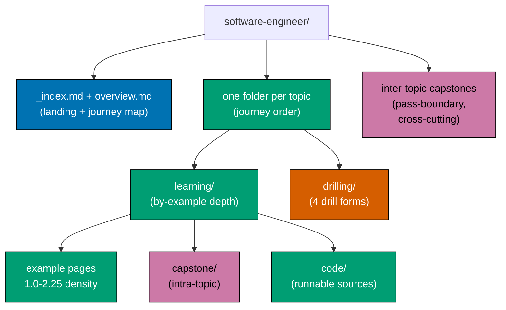
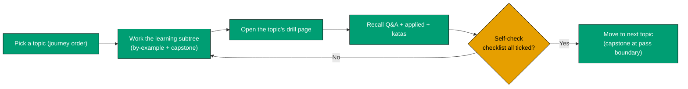
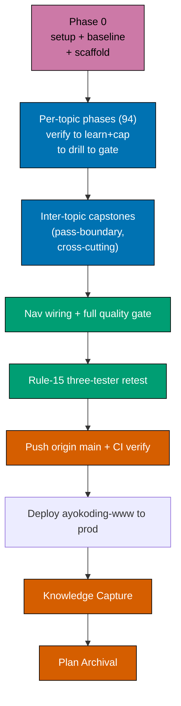

# Technical Docs — The Fundamentally Strong Software Engineer

## Summary

Content-only addition to ayokoding-www: a new self-contained section under
`apps/ayokoding-www/content/en/learn/fundamentally-strong/software-engineer/`, laid
out **topic-first** — one folder per canonical topic, each owning its own `learning/` and `drilling/`
subfolders (DD-26), covering the **same topic set in identical order** across both tracks. The
canonical topic set, per-topic level, learning format, primary language, and weights live in
[prd.md](./prd.md) — **the single source of truth**. This file is deliberately **table-referential**:
it describes the _shape_ of each artifact per-topic rather than hard-coding topic slugs, so adding or
removing a topic is a one-row edit in prd.md plus the mechanical per-row work described here. No
`apps/ayokoding-www/src/` code changes. English only. [Repo-grounded — nx project `ayokoding-www`,
`apps/ayokoding-www/project.json`]

At authoring time the canonical table holds **94 topics** (79 subject topics + 15 _Just Enough_
primers) sequenced as a **six-pass journey**: a new **Pass 0 · Editor Foundations** (Just Enough Nvim →
Just Enough Lua → Extending Neovim — the editor prologue, DD-17) followed by a **five-pass spiral**
(Pass 1 Core Foundations → Pass 5 Internals & Lead at Altitude) under an **immediately-effective-first**
principle (build/store/test/secure a small system early, then revisit each concern deeper on later
passes). The ◆ app-domain topics (Android/iOS/Hybrid/Windows/Linux app) and the ▲ Product & Delivery
track (Software Product Engineering + Project Management) are **parallel reading-path affordances**, not
gates. Each topic also carries an **Nvim-ready** and a **VSCode-ready** flag (Yes / Partial) in the prd
table. See prd.md for the authoritative list, the six-pass journey map, the 94-node skill tree, and the
Editor Setup matrix; all counts below are derived from it, not independently maintained. Every topic's
concrete items, worked examples, and capstone specs are enumerated in the
[syllabus/ folder](./syllabus/) — one `NN-<slug>.md` file per topic (DD-29).

The section is **accuracy-gated** (DD-28): every topic is verified against current, freely-licensed
sources via the `web-researcher` agent before authoring, and every code example plus capstone is
**follow-along-complete** (DD-30): reproducible by the reader step-by-step, code-by-code,
line-by-line, with no hidden assumptions. **Capstones** (DD-27) cement each pass: an intra-topic
capstone inside every subject topic, plus inter-topic capstones at each pass boundary and at curated
cross-cutting junctions.

## Content-Tree Layout (topic-first; per-topic shape, not a hard-coded slug list)

For **N** canonical topics (currently 94), the section is:

```text
apps/ayokoding-www/content/en/learn/fundamentally-strong/
└── software-engineer/
    ├── _index.md                     # section landing (weight 1750; nav + six-pass journey map + skill tree)
    ├── overview.md                   # what this is + read-then-drill workflow + journey map + skill tree (weight 1)
    ├── <topic-slug>/                 # one folder PER canonical topic, folder = table "Slug"
    │   ├── _index.md                 # topic nav (weight = 100 + 10 × journey-index → 110..1040, journey order)
    │   ├── overview.md               # what/why, prerequisites, primary language, how examples progress (weight 1)
    │   ├── learning/                 # the by-example / annotated-concept subtree for this topic
    │   │   ├── _index.md             # learning-subfolder landing (weight = prd "Learn wt" = 101..194)
    │   │   ├── overview.md           # how this topic's examples progress (weight 1)
    │   │   ├── <example pages>       # By-Example: by-example/{overview,beginner,intermediate,advanced}
    │   │   │                         # Annotated-concept: worked-example pages by theme
    │   │   ├── capstone/             # DD-27 intra-topic capstone (weight 900; sorts last in learning/)
    │   │   └── code/                 # DD-24 colocated runnable sources for this bundle (excluded from Nx gates)
    │   └── drilling/                 # the drill page(s) for this topic
    │       ├── _index.md             # drilling-subfolder landing (weight = prd "Drill wt" = 201..294)
    │       └── <topic-slug>.md       # the four-section drill page (or index-embedded single page)
    └── <inter-topic-capstone>/       # DD-27 pass-boundary + cross-cutting milestone bundles (see Capstone Policy)
        ├── _index.md                 # capstone nav (weight slots at its pass boundary, e.g. 275)
        ├── overview.md               # goal/outcome, concepts exercised, ordered steps, acceptance criteria
        └── code/                     # colocated runnable capstone sources (excluded from Nx gates)
```

**Topic-first, not two top-level tracks** (DD-26): the reader navigates into a topic and finds both
its learning subtree and its drill page co-located — no separate `learning/` and `drilling/` trees at
the section root. The user's ordering requirement is satisfied at the **topic** level — the
topic-slug folders sort in journey order (weight `100 + 10 × journey-index`), and inside each, the
`learning/` subfolder (prd "Learn wt") sorts before the `drilling/` subfolder (prd "Drill wt").

The By-Example topic subtree mirrors the existing `system-design/by-example/` layout
(`overview` → `beginner` → `intermediate` → `advanced`, optional `cases`). [Repo-grounded —
`apps/ayokoding-www/content/en/learn/software-engineering/system-design/_index.md`]

`_index.md` files are Hugo/Next-content section indexes; the section `weight: 1750` places the new
section immediately after `system-design` (weight 1700) in the software-engineering nav.
[Repo-grounded — `system-design/_index.md` uses `weight: 1700`]

## Weight Scheme (encodes journey order + track identity)

- Section landing: **1750**. Section overview: **1** (first child).
- Each **topic-slug folder** (`<topic-slug>/_index.md`): **100 + 10 × (journey index)** → currently
  110..1040. The ×10 spacing leaves integer gaps between consecutive topics so inter-topic capstone
  folders can slot at a pass boundary without a float (e.g. the Pass 1 capstone concludes after topic
  17 → topic weight 270 → capstone folder weight **275**).
- Inside each topic folder:
  - `learning/_index.md`: weight = the prd **"Learn wt"** column (**101..194**) — orders `learning/`
    before `drilling/` and mirrors the topic's journey position in the prd table.
  - `learning/capstone/`: weight **900** (sorts last inside the learning subtree).
  - `drilling/_index.md`: weight = the prd **"Drill wt"** column (**201..294**).
- **Parity invariant**: for every topic, `Drill wt = Learn wt + 100`. This is the mechanical parity
  gate that keeps the two tracks in the same order (verified in delivery.md). The prd table columns are
  unchanged by the topic-first layout — they now describe the two **subfolder** weights.
- **Inter-topic capstone folders** (section-root siblings of the topic folders) take an intermediate
  weight in the ×10 gap immediately after the last topic of the pass they conclude (delivery.md
  assigns the concrete integer per capstone; the gap always exists because topics are spaced ×10).

## Frontmatter Convention

All pages use the existing ayokoding content frontmatter shape. [Repo-grounded —
`system-design/_index.md`]

```yaml
---
title: "Data Structures & Algorithms"
weight: 107
date: 2026-07-11T00:00:00+07:00
draft: false
description: "Relearn core data structures and algorithms by example, then drill for recall"
---
```

- `title` — the topic's "Topic" cell from the prd table (human title, not the slug).
- `weight` — per the Weight Scheme above: topic folder `100 + 10 × index`; `learning/` = prd "Learn
  wt"; `drilling/` = prd "Drill wt".
- `description` — one line; states the topic and the relearn-then-drill intent.

Route pattern for cross-links: `/en/c/learn/fundamentally-strong/software-engineer/...`.
[Repo-grounded — existing content links use `/en/c/learn/...`]

## Primary-Language Rule (DD-7)

Every topic that uses code uses a **real programming language, never pseudocode**, and **Python is the
primary language** used across as many topics as possible for cross-topic consistency. A topic uses a
non-Python language only when the prd table's **Primary language** column marks it as a platform- or
subject-mandated exception (`†`). The authoring agent MUST read the language cell for the topic before
writing any code and use exactly that language:

- **Python** — DS&A, Concurrency & Parallelism, Backend (Essentials + at Scale), Linux App Dev, Data
  Engineering, AI-Powered Apps, Compilers/Parsers/Transpilers, OOP, Functional Programming,
  Domain-Driven Design, Event-Driven Architecture, and (where code appears) every concept-centric
  topic (`*`).
- **Exceptions (`†`)** — system-programming & OS-internals → **C**; Lisp → **Scheme + Clojure**
  (Scheme core, Clojure sidebar); Type Systems (Hindley–Milner) → **OCaml + Haskell + F#** (OCaml/Haskell
  core, F# sidebar); Frontend → **TypeScript**; Android → **Kotlin**; iOS → **Swift**; Windows App →
  **C#**; CSP concurrency → **Go**; actor concurrency → **Elixir**; Extending Neovim → **Lua**; Just
  Enough Bash → **Bash** (shell primer, Pass 1); Cloud, Containers & IaC → **YAML/HCL** (container
  manifests + Terraform); SQL topics → **SQL + Python** (SQLite → PostgreSQL); Graph DB →
  **Cypher + Python**; NoSQL → **Python + Valkey/Redis**; Offensive/Defensive Security →
  **Python + shell**.
- **Leadership/governance (`‡`)** — minimal-to-no code; prose + worked scenarios + diagrams.

Each topic's `overview.md` states its primary language up front so the reader knows what to expect.

## Nvim-ready + VSCode-ready Rule (mirror of prd columns, DD-25)

The prd table's **Nvim-ready** and **VSCode-ready** columns are authoritative; tech-docs mirrors their
meaning, not their values. Each topic is **Yes** (fully doable in that editor + terminal on
macOS/Linux) or **Partial** (code/build works in the editor but the run/deploy step needs a
proprietary platform IDE/SDK or a specific OS — the ◆ app domains iOS/Android/Windows, plus Windows
OS). **No topic is editor-No** in either column. The DD-17 default workflow is Neovim + terminal;
the VSCode-ready flag records the same reachability for a reader who prefers VSCode (both are honest
editor-first setups, neither is a proprietary-IDE lock-in). A `Partial` topic still shows the raw-form
CLI (`xcodebuild`, `./gradlew`, `dotnet`) where the platform allows it, and its `overview.md` states
plainly what reaches past the editor. See the prd **Editor Setup matrix** for the authoritative
per-topic Nvim/VSCode readiness and setup notes.

## Depth-to-Mastery Rule — outcome over length (DD-8)

**The done-bar is the reader outcome, not page length or example count.** Per the user, length of any
topic or of the whole tutorial does not matter; what matters is that a reader who works a topic comes
away **fundamentally strong** — able to operate at any company size, any complexity level, from IC to CTO.
The by-example _pace_ (annotation density **1.0–2.25** comments per code line per example, incremental
real-code) governs how densely each example is explained, not how many pages a topic runs to. The
per-agent checker density/format bands are applied as **quality floors**, never as length caps: a
topic is done when its core surface is covered to mastery depth and it clears the checker, however
long that turns out to be.

**Scope clarification for colocated verification blocks**: Topics that layer a colocated
per-example pytest verification file (`test_example.py`, first used starting with the Phase 9
Python OOP topics) on top of the base by-example convention measure the DD-8 annotation density
against the primary taught example block (`example.py`) alone. The colocated `test_example.py`
is out of scope for the density formula, same as the base `swe-by-example.md` convention already
excludes "Run"/"Output" scaffolding blocks — its role is proving the example works, not teaching
the concept. [Fixer interpretation, applied 2026-07-14 while resolving
`apps-ayokoding-www-by-example-checker` Finding 2 for
`object-oriented-programming-essentials`, so future phases do not re-litigate this per topic]

## Follow-Along Completeness Rule (HARD RULE, DD-30)

Every example AND every capstone in the section is **followable step-by-step, code-by-code,
line-by-line, with no hidden assumptions.** Strengthens DD-20 (runnable-example) with an explicit
reproducibility contract:

- Each learning subtree and each capstone `overview.md` opens with a **prerequisites + environment**
  block: exact tool versions (from the web-researcher sweep, DD-28), install commands, and the raw-form
  run command (DD-17). No "assuming you have X set up".
- Code is introduced **incrementally**: every listing either is complete-and-runnable on its own, or is
  an explicitly-labelled fragment that is later assembled into a complete runnable full listing in the
  same page (no "add the rest yourself"). The reader can type each block in order and reach a running
  result at every checkpoint.
- Every command the reader must run is shown **verbatim** with its expected observable output (a
  printed line, an exit code, a file created), so the reader can confirm they are on track before the
  next step.
- Capstones ship the **full ordered build sequence** (see Capstone Policy) — each step names the file,
  the code to add, and the command to verify — such that a reader following top-to-bottom ends with the
  stated runnable, web-verified artifact.

Enforced per topic and re-checked at each phase gate; the final gate asserts it for all 94 topics and
every capstone.

## Accuracy Verification Rule (HARD RULE, DD-28)

Before a topic is authored, its syllabus file and planned examples/capstone are verified for
**currency and factual accuracy** via the `web-researcher` agent (delegated, isolated context): current
stable tool/library/language versions, current API/CLI syntax, current license status (DD-15/DD-21),
and current best practice. Findings are folded back into the topic's `syllabus/NN-<slug>.md` file (and,
where a decision changes, into prd/tech-docs) **before** the maker authors content. During authoring,
`apps-ayokoding-www-facts-checker` (which itself delegates deep research to `web-researcher`) re-checks
the rendered content. A topic is not "done" until both the pre-authoring sweep and the facts-checker
report clean. Run **sequentially**, one topic at a time, to bound token usage.

## Learning-track format detail

### By-Example topics (prd "Learning format" = By Example)

Authored via `apps-ayokoding-www-by-example-maker` following the `docs-creating-by-example-tutorials`
skill, in the topic's prd-designated primary language:

- **Five-part example structure** per example.
- **Annotation density 1.0–2.25** comments per code line, per example.
- **Standard-library-first**, incremental beginner → advanced.
- Subtree shape under `learning/`: `overview.md` +
  `by-example/{overview,beginner,intermediate,advanced}` (optional `cases`) + `capstone/` + `code/`,
  mirroring `system-design/by-example/`.

Validated via `apps-ayokoding-www-by-example-checker` (density, five-part structure, progression).
[Repo-grounded — agent + skill exist]

### Annotated-concept topics (prd "Learning format" = Annotated-concept)

Authored via `apps-ayokoding-www-general-maker`:

- Each concept introduced via an **annotated worked example** (code in the primary language,
  pseudocode only where code genuinely does not fit, config, or a captioned accessible Mermaid
  diagram) at the same **1.0–2.25** density on every code block.
- **Accessible Mermaid** diagrams use the verified WCAG palette. [Repo-grounded —
  `docs-creating-accessible-diagrams`]
- Incremental simple → real-world; covered to mastery depth (DD-8), not to a fixed count.

Validated via `apps-ayokoding-www-general-checker`.

## Capstone Policy (DD-27)

Capstones cement knowledge. Two kinds, both **self-contained** (a reader needs nothing outside the
capstone and its topic's prerequisites), **follow-along-complete** (DD-30), and **web-verified** (DD-28).
Size is not capped; correctness, accuracy, detail, and clarity are the bar.

**Intra-topic capstone** — one inside every topic's `learning/capstone/`, scaled to the topic kind:

- **Subject topics** (By-Example or Annotated-concept that teach a buildable skill): a **full runnable
  capstone** — a single cohesive project exercising the topic's core items end-to-end.
- **The 15 _Just Enough_ primers** (`§`/language primers): a **light consolidation exercise** — a short
  program that uses the just-learned language/tool features together, not a full project.
- **Leadership/governance topics** (`‡`): a **design/decision capstone** — a worked scenario producing
  an artifact (decision record, governance matrix, runbook), no code.

**Inter-topic capstones** — **inline milestone bundles** at section root (no separate track). Two
families:

1. **Pass-boundary capstones (6)** — one concluding each pass (Pass 0 … Pass 5): integrates the pass's
   topics into one project proving the pass's promise.
2. **Curated cross-cutting capstones (~9–11 total, incl. the 6 above)** — junctions where several
   topics compose into a realistic system. The named cross-cutting builds:
   - **full-stack-app** — Frontend + Backend + SQL (after the Pass 1 first-working-software arc).
   - **secure-service** — Backend + Security Essentials + IT Security (Pass 3 real-world delivery).
   - **data-pipeline** — Data Engineering + SQL/NoSQL + a RAG interface (Pass 3).
   - **concurrency-showdown** — CSP (Go) + actor (Elixir), same problem two ways
     (Pass 4).

**Full spec per capstone lives in the syllabus file** (DD-29): each capstone is specified with
(a) **goal / outcome**, (b) **concepts-exercised checklist**, (c) **ordered step outline** (each step
names a file + the code + the verify command), (d) **testable acceptance criteria**, and (e) the
**done bar** = "runnable end-to-end + web-verified". Pass-boundary and cross-cutting specs live in the
`syllabus/NN-<slug>.md` file of the last topic in their junction (or a dedicated
`syllabus/NN-<capstone-slug>.md` where the junction spans a pass boundary; delivery.md assigns the NN).

## Drilling-track markup

Each drilling page is a single markdown file using native `<details>` collapsibles for hidden
answers — already used in existing ayokoding-www content, so the Next.js content pipeline renders
them. [Repo-grounded — `apps/ayokoding-www/content/en/learn/business/corporate-finance.md` contains
`<details>`]

Every drilling page follows the **same four-section anatomy in this order** (per prd):

```markdown
### Recall Q&A (flashcards)

**Q:** What does the CAP theorem force you to trade off during a network partition?

<details>
<summary>Answer</summary>

Under a partition you must choose **Consistency** (reject/stall to avoid stale reads) **or**
**Availability** (serve possibly-stale data). Partition tolerance is not optional in a distributed
system.

</details>

### Applied problems / scenarios

**Scenario:** A single Postgres primary is at 100% CPU on writes at 10k writes/sec...

<details>
<summary>Worked solution</summary>

... reference reasoning ...

</details>

### Code katas / exercises

**Kata:** Implement an LRU cache with O(1) get/put (in the topic's primary language).

<details>
<summary>Reference solution</summary>

... annotated solution in the primary language ...

</details>

### Self-check mastery checklist

- [ ] I can explain sharding vs partitioning without notes
- [ ] I can derive the average-case complexity of quicksort
```

For leadership/governance topics (`‡`) the "Code katas" section becomes a **short design/decision
exercise** where code does not fit.

## Diagrams

### Section structure (topic-first)



### Reader workflow (learn → drill loop)



### Delivery phase flow (Pass 0 + per-topic phases)



Each per-topic phase is itself: `web-researcher` accuracy sweep (DD-28) then author `learning/`
subtree + intra-topic `capstone/` + colocated `code/` then author `drilling/` page then per-topic
`ayokoding-web-general-quality-gate` to double-zero then Phase Gate + Pause Safety. Inter-topic
capstone phases run at their journey position (pass boundaries + cross-cutting junctions).

## File Impact (derived from the prd table; N = current topic count = 94)

| Path                                                                 | Change | Notes                                                                      |
| -------------------------------------------------------------------- | ------ | -------------------------------------------------------------------------- |
| `.../fundamentally-strong/software-engineer/_index.md`               | New    | Section landing, weight 1750                                               |
| `.../fundamentally-strong/software-engineer/overview.md`             | New    | Read-then-drill workflow + six-pass journey map + 94-node skill tree       |
| `.../<topic-slug>/_index.md` × N                                     | New    | Topic folder nav, weight 110..1040 (journey order)                         |
| `.../<topic-slug>/overview.md` × N                                   | New    | Per-topic what/why + primary language + prerequisites                      |
| `.../<topic-slug>/learning/…` × N                                    | New    | By-Example / Annotated-concept subtree + `capstone/` + `code/` per prd row |
| `.../<topic-slug>/drilling/…` × N                                    | New    | One four-section drill page per prd row (Drill wt = Learn wt + 100)        |
| `.../<inter-topic-capstone>/…` × ~9–11                               | New    | Pass-boundary + cross-cutting capstone bundles (Capstone Policy)           |
| `apps/ayokoding-www/content/en/learn/fundamentally-strong/_index.md` | New    | Collection landing + nav for the fundamentally-strong collection           |
| `apps/ayokoding-www/content/en/learn/_index.md`                      | Edit   | Add top-level entry for the fundamentally-strong collection                |

No `apps/ayokoding-www/src/` files, no `project.json`, no new npm packages.

## Design Decisions

- **DD-1: A new top-level `fundamentally-strong/` collection, not nested under `software-engineering/`.**
  Chosen by the user; the series is its own top-level collection at `learn/fundamentally-strong/`,
  complementing the deep SE content beside it rather than nesting inside it. [User decision]
- **DD-2: Self-contained, no links into existing subtrees.** Chosen by the user; each topic stands
  alone so a reader is never bounced elsewhere. [User decision]
- **DD-3: By-example pace per topic, hybrid by nature.** Code topics use the By Example content type;
  concept topics use an equal-density annotated-concept format so pace stays comparable where a strict
  code-example format is awkward. [User decision]
- **DD-4: Two tracks, symmetric at the topic level.** Each topic owns a `learning/` (rich subtree) +
  `drilling/` (one page) pair, same slugs, same weight order; parity enforced by
  `Drill wt = Learn wt + 100`. [User decision]
- **DD-5: English only this plan.** Indonesian mirror deferred. [User decision]
- **DD-6: `<details>` for hidden drill answers.** Reuses an existing, already-rendering markup
  pattern; no new tooling. [Repo-grounded]
- **DD-7: Single primary language = Python, with documented exceptions.** Any code uses a real
  language; Python is used everywhere it is honest; every non-Python topic is a platform/subject
  exception recorded in the prd "Primary language" column. [User decision]
- **DD-8: Outcome over length.** Depth-to-mastery of each topic's core is the done-bar; checker bands
  are quality floors, not length caps; the target reader outcome is "fundamentally strong from IC to CTO,
  any company size, any complexity." [User decision]
- **DD-9: Journey ordering as a five-pass spiral, immediately-effective-first; ◆ and ▲ parallel.**
  Topics sequenced so the earliest get the reader **building, persisting, testing, and securing a small
  end-to-end system fast** (Pass 1), then each later pass revisits the same concern areas at greater
  depth (Pass 2 Depth, Design & Craft → Pass 3 Build for the Real World → Pass 4 Concurrency & Systems →
  Pass 5 Internals & Lead at Altitude). The passes are **descriptive arcs, not gates**; big subjects split into an
  Essentials topic early and an Advanced topic later (DD-11). The ◆ app domains and the ▲ Product &
  Delivery track are independent parallel reading paths. This replaces the earlier seven-level gated
  ordering. [User decision]
- **DD-10: Table-referential plan.** tech-docs/delivery describe per-topic shape and loop over the
  prd table rather than hard-coding slugs, so topic additions stay cheap. [Judgment call]
- **DD-11: Split-and-interleave.** Seven large subjects each ship an Essentials topic early and an
  Advanced topic on a later pass (DS&A, SQL, Backend, OOP, Networking, Frontend, Security), so a usable
  slice arrives before the deep facets. Each Essentials topic cross-links its Advanced counterpart.
  [User decision]
- **DD-12: Structural splits.** Beyond the Essentials/Advanced splits: databases split into SQL /
  NoSQL / Graph; containers split out from cloud & IaC; CSP (Go) and actor (Elixir) concurrency stand
  alone beside core Concurrency; Software Testing stands alone (folding in TDD + property-based);
  architecture adds standalone `domain-driven-design` + `event-driven-architecture` (hexagonal folds
  into `software-architecture`); security splits into `security-essentials` + `it-and-application-security` +
  `offensive-security` (red/Kali) + `defensive-security` (blue/SOC-IR); the editor branch adds
  `just-enough-nvim` + `just-enough-lua` + `extending-neovim`. **94 topics total.** [User decision]
- **DD-13: Language + tool primers.** Fifteen _Just Enough_ primer topics (Nvim, Python, Bash,
  TypeScript, Lua, Go, Elixir, Kotlin, Swift, Dart, C#, C, Rust, Java, F#), each placed immediately before that
  language's/tool's first use, so a reader never learns a new language and a new concept at once.
  Languages a topic teaches from scratch (Scheme→Lisp, OCaml→Type Systems, SQL→SQL Essentials,
  Cypher→Graph DB) fold the primer in. The Nvim primer (`§`) is a vanilla-Neovim tool primer (no
  plugins); `just-enough-lua` + `extending-neovim` complete Pass 0's editor-extensibility arc. [User decision]
- **DD-14: Leadership split by altitude.** Product & Delivery (Software Product Engineering + Project
  Management, ▲) is readable early from Pass 1; Engineering Management (Pass 2) and IT Governance/GRC
  (Pass 3) come later as senior-altitude depth. [User decision]
- **DD-15: License-aware technology choices.** Where a well-known tool changes license (Redis
  SSPL→AGPL, Akka→BSL + the Apache Pekko fork, MongoDB SSPL, ScyllaDB source-available), the topic
  explains the shift and the free/teachable choice it drives; GQL noted as ISO/IEC 39075:2024; K8s
  Ingress (frozen) taught alongside the Gateway API. License-awareness is modelled as an engineering
  skill. [Web-grounded]
- **DD-16: Compilers as AI-guardrail engineering.** Compilers, Parsers & Transpilers is framed around
  building the **deterministic guardrails** that keep AI-assisted engineering honest — AST linters,
  codegen/transpiler checks, grammar-driven verification — not compiler theory for its own sake. [User decision]
- **DD-17: Raw-form-first tooling.** Every topic assumes a pure-editor, CLI-first workflow on
  macOS/Linux — the reader edits in **Neovim** and drives compile/run/test/debug/git from the terminal,
  learning the raw command rather than an IDE gesture. Honestly-named exceptions: iOS→Xcode,
  Android→Android Studio/Gradle, Windows→Visual Studio/.NET, still shown in CLI form where possible.
  This drives the Nvim-ready column. [User decision]
- **DD-18: Per-topic syllabus in a companion folder.** Every topic's concrete items (subtopics), named
  worked examples, and capstone specs are enumerated in the [syllabus/ folder](./syllabus/) — one
  `NN-<slug>.md` file per topic (NN = order of appearance, 01..94) plus `README.md` + `overview.md`;
  each delivery per-topic step authors exactly its syllabus file, so "detail every item and example" is
  specified once and not scattered across the checklist. Layout detailed in DD-29. [User decision]
- **DD-19: No deferred items (HARD RULE).** Every in-scope topic — all 94, both tracks, plus every
  capstone — ships complete to the mastery bar: zero TODO/TBD/stub/placeholder/"author later" content,
  and every syllabus item/example/capstone actually present. Split-and-interleave (two complete
  deliverables) and the out-of-scope list (scope boundaries) are not deferrals. Each phase gate asserts
  this; the final gate asserts it for all 94 + all capstones. [User decision]
- **DD-20: Runnable-example rule (HARD RULE).** Every code example is runnable — standalone blocks run
  in isolation via the stated raw-form command (DD-17); long/fragmented examples end in a complete
  runnable full listing. No elided-body "assume the rest" snippets presented as runnable. Two sharpening
  contracts (per user): **no implicit dependencies** — every identifier a snippet uses is defined or
  imported within that same snippet (or its fragment chain ending in the page's full listing), never
  relying on unshown state / auto-imports / ambient globals ("as complete as possible" is the bar); and
  **expected output shown inline as a comment** — each block annotates its result inside the code in the
  language's idiomatic comment syntax (`# => …`, `// prints: …`, `-- …`), composing with the DD-8
  annotation density. Enforced per topic and re-checked at each phase gate. Strengthened by DD-30
  (follow-along completeness). See [prd.md §Runnable-Example Rule](./prd.md#runnable-example-rule-hard-rule-dd-20). [User decision]
- **DD-21: Free-to-use-and-teachable-first materials (HARD RULE).** Every material used passes two
  tests — free to obtain/use, and legal to author training content on. Tier-1 OSS/public-domain is the
  default (Python…C, SQLite/PostgreSQL/Valkey/Redis, Neovim, Kali, GDPR, NIST); Tier-2
  free-but-proprietary (Xcode / Android SDK / Visual Studio Community) only where a domain requires and
  permits it; ISO 27001 and SOC 2 TSC are named landscape context only, never reproduced (teachability
  test, not a cost test). [User decision]
- **DD-22: the `specs` Gherkin-_authoring_ requirement does not apply to this plan.** Per the
  [Feature Change Completeness Convention](../../../repo-governance/development/quality/feature-change-completeness.md),
  the Gherkin-companion requirement binds code changes under `apps/`/`libs/`; this plan touches zero
  files under `apps/ayokoding-www/src/` and adds no `project.json` targets — it is pure markdown
  content under `apps/ayokoding-www/content/`, so no new `.feature` files are authored. The
  `specs:behavior:coverage` target is still _run_ in the finalization affected quality gate (it passes
  trivially, since no new uncovered code exists) — the plan is exempt from writing new Gherkin, not
  from executing the gate. [Repo-grounded — Feature Change Completeness Convention]
- **DD-23: CVE-clean, current-version dependencies (HARD RULE).** Every tool/library/language version
  named in the content is the current stable release at authoring time and CVE-clean per the
  [Dependency Bump Policy](../../../repo-governance/development/workflow/dependency-bump-policy.md)
  sources (NVD, GitHub Advisories, Snyk, vendor pages, CISA KEV), verified by the DD-28 web-researcher
  sweep. Content never pins a reader to a version with a known unpatched CVE. [User decision]
- **DD-24: Colocated runnable code as page bundles.** Every topic's runnable sources live in a
  `code/` folder colocated with that topic's `learning/` page bundle (Hugo page-bundle convention),
  excluded from Nx build/test gates (content, not app source). The reader can copy the exact file the
  example builds from. [User decision]
- **DD-25: Editor-readiness flags (Nvim-ready + VSCode-ready).** Each topic carries an **Nvim-ready**
  and a **VSCode-ready** flag (Yes / Partial) in the prd table, backed by the prd **Editor Setup
  matrix**. Both encode honest editor-first reachability on macOS/Linux; `Partial` marks the ◆
  proprietary-platform run/deploy steps. Neither editor is a lock-in; the DD-17 default is Neovim. [User decision]
- **DD-26: Topic-first layout.** Each canonical topic is a single folder owning both its `learning/`
  and its `drilling/` subfolder — not two top-level `learning/`/`drilling/` trees. A reader navigates
  once into a topic and finds its by-example depth, its intra-topic capstone, and its drill page
  together. Journey order lives on the topic-slug folder weight (`100 + 10 × index`); the prd "Learn
  wt"/"Drill wt" columns describe the two subfolder weights and are unchanged. [User decision]
- **DD-27: Capstones (intra-topic + inter-topic).** Every subject topic ships a full runnable
  intra-topic capstone (primers = light consolidation; `‡` = design/decision capstone); pass boundaries
  and curated cross-cutting junctions ship inter-topic capstones as inline milestone bundles
  (6 pass-boundary + cross-cutting full-stack-app / secure-service / data-pipeline / concurrency-showdown,
  ~9–11 total). Each capstone is self-contained, follow-along-complete (DD-30), web-verified (DD-28),
  and fully specified in its syllabus file (goal, concepts checklist, ordered steps, acceptance
  criteria, done bar). Size uncapped; correctness/clarity are the bar. [User decision]
- **DD-28: Web-researcher accuracy verification (HARD RULE).** Every topic is verified for currency and
  factual accuracy via the `web-researcher` agent **before** authoring (findings folded into the
  syllabus file), and re-checked during authoring by `apps-ayokoding-www-facts-checker` (which delegates
  to `web-researcher`). A topic is not done until both report clean. Runs sequentially, one topic at a
  time, to bound token usage. [User decision]
- **DD-29: Syllabus as a folder.** The single `syllabus.md` is replaced by a `syllabus/` folder:
  `README.md` (index + how-to-read) + `overview.md` (design, legend, capstone policy, follow-along
  contract, per-file template) + one **`NN-<slug>.md` per topic** where **NN = order of appearance
  (01, 02, … 94)**. Each per-topic file is very detailed: full item list, worked-example specs, and the
  full intra-topic capstone spec (plus any inter-topic capstone spec anchored at that topic). [User decision]
- **DD-30: Follow-along completeness (HARD RULE).** Every example and capstone is reproducible
  step-by-step, code-by-code, line-by-line, with no hidden assumptions: explicit prerequisites +
  versions + install/run commands, incremental complete-or-assembled listings, verbatim commands with
  expected output, and a full ordered capstone build sequence. Strengthens DD-20; enforced per topic and
  at every phase gate. [User decision]
- **DD-31: Prerequisites clarity (HARD RULE).** Every topic states its prerequisites explicitly under
  three headings — **Prior topics** (which earlier topics it builds on, cross-linked), **Tools &
  environment** (toolchain/SDK/OS assumed, tied to the DD-25 editor matrix), and **Assumed knowledge**
  (concepts the reader must already hold) — so a reader never hits an unstated dependency. The syllabus
  `NN-<slug>.md` file carries a `## Prerequisites` section (source of truth); the authored learning page
  restates it at the top. Enforced per topic and at each phase gate; complements DD-30's no-hidden-
  assumptions rule at the topic level. [User decision]
- **DD-32: Prev/Next navigation (HARD RULE).** Every material file carries an explicit navigation footer
  — a horizontal rule followed by `← Previous: [...] · Next: [...] →` — so a reader can always move one
  step forward or back along the frozen spiral order. In the syllabus folder the chain runs
  `README → 01 → 02 → … → 94 → overview` (file 01's Previous points at `README`; file 94's Next points at
  `overview`); the authored learning/drilling pages carry the equivalent footer in content order. The
  footer target order is the prd canonical table order (DD-10 table-referential). Enforced per file and
  at each phase gate. [User decision]
- **DD-33: Intellectual journey as a scaled layer (HARD RULE).** The section is immediately effective
  **and** an intellectual journey, per the brd AI-age thesis that the durable edge is the understanding
  that lets an engineer judge, verify, and override generated output. Understanding is delivered by four
  intellectual layers — **not uniformly**, because page attention is zero-sum and padding a primer with a
  "trade-offs of Just Enough Bash" section makes the material feel _less_ intellectual while taxing the
  primary reader (a working engineer re-grounding fast). The layers and their weighting: (1) a universal
  `Why this exists · the big idea` opener on all 94 topics — the problem before the solution + the
  keep-forever mental model + big-idea tags; (2) a universal horizontal **idea spine** of eight
  Cross-Cutting Big Ideas (`abstraction-and-its-cost`, `taming-state`, `coupling-vs-cohesion`,
  `consistency-latency-throughput`, `mechanism-vs-policy`, `determinism-vs-emergence`,
  `correctness-vs-pragmatism`, `layering-and-leaks`) that each topic tags, so the section teaches ideas,
  not just topics; (3) **Tensions & trade-offs + Lineage** depth blocks on the ~41 judgment/altitude
  topics (6, 9, 18, 20, 21, 22, 23, 27, 30, 31, 32, 33, 36, 38, 39, 41, 42, 43, 44, 45, 46, 49, 51, 52,
  55, 56, 57, 58, 59, 60, 61, 63, 73, 77, 79, 83, 85, 89, 90, 93, 94), omitted for the remaining primers,
  Essentials, and how-to tool topics where they would be padding; (4) a universal
  fifth **elaborative-interrogation / self-explanation** drill form in the opt-in drilling track, so
  depth never taxes the learning-track reader. Depth concentrates at altitude (Pass 5 + `▲`), where the
  IC→CTO promise is actually paid. Rationale: a competency curriculum without an intellectual spine
  produces engineers who can paste but not judge — the opposite of the section's stated purpose.
  Grounded in retrieval practice (Roediger & Karpicke), spiral curriculum (Bruner), cognitive-load theory
  (Sweller), and the elaborative-interrogation / self-explanation finding (Dunlosky et al. 2013).
  Full rubric: [syllabus/overview.md §Scaled Intellectual Depth](./syllabus/overview.md#scaled-intellectual-depth-dd-33);
  idea spine: [prd.md §Cross-Cutting Big Ideas](./prd.md#cross-cutting-big-ideas-the-idea-spine-dd-33).
  Enforced per topic and at each phase gate. [User decision]

### DD-34 — Worked-Example & Concept Enumeration (exhaustive per topic, HARD RULE)

Every topic exhaustively enumerates its concepts (`co-NN`) and worked examples (`ex-NN`), with a
strict 1:1 mirror between the syllabus enumeration and the `delivery.md` checkboxes: each `co-NN`/`ex-NN`
appears once, contiguous, no gaps or duplicates, and every phase gate's declared counts equal the true
unique counts. Full rule and rationale:
[prd.md §Worked-Example & Concept Enumeration](./prd.md#worked-example--concept-enumeration--exhaustive-per-topic-hard-rule-dd-34).
Enforced per topic and at each phase gate. [User decision]

### DD-35 — No-Hallucination Citation Verification (HARD RULE)

Every cited fact (command syntax, version string, API name, statistic) traces to a read primary source;
uncited or unverifiable claims are removed rather than guessed. Full rule and rationale:
[prd.md §No-Hallucination Citation Verification](./prd.md#no-hallucination-citation-verification--every-cited-fact-traces-to-a-read-primary-source-hard-rule-dd-35).
Enforced per topic via the Accuracy-notes block and at each phase gate. [User decision]

### DD-36 — Formatter coverage for code samples (lint-staged)

Every code-sample file type the section commits under `CONTENT/**/code/` must have a canonical
auto-formatter wired into the repo-root [`package.json`](../../../package.json) `lint-staged` block, so
polyglot samples stay consistently formatted at commit time. Formatters are grouped by install cost
(from a `web-researcher` survey, verified 2026-07):

- **Tier 1 — npm-installable, no extra runtime (wire directly into lint-staged):** Prettier (`*.md`,
  `*.yaml`/`*.yml`, `*.json`, `*.html`, `*.ts`/`*.tsx`/`*.js`), **StyLua** (`*.lua`),
  `prettier-plugin-sql` (`*.sql`), **`@bazel/buildifier`** (`BUILD`/`*.bzl`). Dockerfiles have **no
  canonical formatter** — keep **hadolint** as the existing lint gate.
- **Tier 2 — single lightweight binary (install via `npm run doctor -- --fix`, invoke from a wrapper):**
  **Ruff** `ruff format` (`*.py`), **shfmt** (`*.sh`), **gofmt** (`*.go`), **rustfmt** (`*.rs`),
  **`tofu fmt`** (`*.tf`) — OpenTofu's MPL-2.0 formatter is preferred over `terraform fmt`, whose CLI is
  **BUSL-1.1** (not OSI-approved) and would trip this repo's license-clean dependency policy —
  **`clang-format`** (`*.c`/`*.h`).
- **Tier 3 — heavy toolchain (deferred to CI / existing per-language lint gates, NOT pre-commit):**
  Elixir (`mix format`), Kotlin (ktlint), Swift (swift-format), Dart (`dart format`), C#
  (`dotnet format`/CSharpier), Java (google-java-format), F# (Fantomas), OCaml (ocamlformat), Haskell
  (Ormolu/Fourmolu), Clojure (cljfmt). Requiring a JDK + .NET SDK + GHC + opam + Erlang/OTP + Dart SDK +
  Xcode on every contributor's pre-commit is impractical; these are gated in CI where the toolchain
  already exists.
- **No canonical formatter (style enforced by review only, documented as out of pre-commit scope):**
  Makefile, Gradle Groovy DSL (`*.gradle`), Scheme/Common Lisp.

Rationale: pre-commit formatting must be fast and universally installable; the tiering keeps the hook
light while still guaranteeing every committed sample is formatted somewhere (hook or CI). Phase 0 wires
this before any topic content lands. `clang-format` moved from Tier 1 to Tier 2 during Phase 0 execution
(2026-07-13): the npm wrapper package's own `getNativeBinary()` fallback logic ships only a
`darwin_x64` binary and runs it via Rosetta on Apple Silicon macOS, which throws `assertion failed
[header->version <= kProjectSourceVersion]: runtime library is newer than runtime` — a confirmed,
upstream-acknowledged limitation, not a config mistake — so it is now installed as a single binary via
`npm run doctor -- --fix` instead, matching Ruff/shfmt/gofmt/rustfmt/`tofu fmt`. [User decision]

### DD-37 — Dedicated maker/checker/fixer trio + quality gate per learning format

Each of the section's three learning formats gets its **own** `maker`/`checker`/`fixer` agent trio and
quality-gate workflow, mirroring the existing By Example set — rather than routing concept/primer topics
through the generic `general` agents. Formats and their trios: **By Example** (pre-existing:
`apps-ayokoding-www-by-example-{maker,checker,fixer}` +
[`ayokoding-web-swe-by-example-quality-gate`](../../../repo-governance/workflows/ayokoding-web/ayokoding-web-swe-by-example-quality-gate.md));
**Annotated-concept** (new trio + `ayokoding-web-annotated-concept-quality-gate`) — the **leadership
no-code `‡`** variant is a validated **sub-mode** of this trio (20-30 scenarios, zero code), not a
separate fourth trio (3-format decision); **Primer** (new trio + `ayokoding-web-primer-quality-gate`) for
the "Just Enough X" on-ramps. The six new agents register in the agent catalog + `AGENTS.md` and sync to
`.opencode/`/`.amazonq/` via `npm run generate:bindings`. Rationale: each format has a distinct anatomy
and volume target (75-85 heavily-annotated examples vs 45-60 concept-centric worked examples + diagrams vs
a fast language on-ramp), so a format-specific checker validates far more precisely than one generic
checker. Created in Phase 0. [User decision]

### DD-38 — Post-v3 gap-fold ADDs + format / progression / capstone re-validation

After the 94-topic set locked, eight grounded **concept/example folds** were added into existing host
topics (each decided by a grill; each mirrored 1:1 into `delivery.md` and gate-count-corrected). Folds
add rungs **within** a topic — they do **not** add topics, change the 94-count, alter Learn/Drill weights,
or move pass boundaries. The folds:

| Fold (rung)                                     | Host topic                     | Δconcepts | Δexamples | Grounding                                                  |
| ----------------------------------------------- | ------------------------------ | --------- | --------- | ---------------------------------------------------------- |
| Podman (daemonless/rootless/Quadlet)            | 50 Containers & Orchestration  | +3 (35)   | +3 (83)   | inline, established                                        |
| Reactive streams (Rx/Reactor/backpressure)      | 24 Concurrency & Parallelism   | +5 (33)   | +6 (87)   | web-researcher, primary-sourced                            |
| OLAP-columnar (ClickHouse/DuckDB/Parquet/Arrow) | 34 NoSQL Databases             | +5 (36)   | +6 (91)   | web-researcher, primary-sourced                            |
| VPN / overlay (WireGuard/mesh)                  | 29 Advanced Networking         | +5 (29)   | +7 (62)   | web-researcher, primary-sourced                            |
| Coordination services (ZooKeeper/etcd/Consul)   | 46 Distributed Systems         | +5 (39)   | +5 (85)   | established; `[Needs Verification]` (grounding agent died) |
| State machines / statecharts (FSM/Harel/XState) | 21 OO Design & Patterns        | +3 (37)   | +4 (84)   | established; deepens the existing GoF State pattern        |
| Progressive delivery (Argo Rollouts/Flagger)    | 55 CI/CD & Release Engineering | +2 (34)   | +3 (83)   | established; `[Needs Verification]` on tool CRDs           |
| BDD / executable specs (Gherkin/pytest-bdd)     | 15 Software Testing            | +5 (32)   | +6 (86)   | established; `[Needs Verification]` on pkg versions + API  |

Each fold's new material is cited in its host topic's Accuracy-notes DD-35 block, with `[Needs
Verification]` markers where a primary source was not fetched-and-read at authoring time.

**Learning-format re-validation (all 94).** Re-checked that every topic's format (By Example / Annotated-
concept / Primer / leadership `‡`) remains the most optimal for its subject. **Verdict: no format change.**
All eight fold-host topics are By-Example subject topics; the folded rungs are worked-example-first, matching
the host format exactly. The prior format-optimality sweep (scheme sound; only the topic-37 borderline noted)
still holds. Three host topics now modestly exceed the 75–85 By-Example example band (24 → 87, 34 → 91,
15 → 86): this is
an **accepted** consequence — the folds are cohesive sub-rungs of a coherent topic, and the band is a
depth-to-mastery guideline (DD-8), not a hard cap; splitting them out would fragment the spiral and duplicate
prerequisites for a marginal count win.

**Merge / split / rearrange analysis.** Re-examined whether any topic should merge, split, or move for a more
optimal reader journey, using the series' own arrangement principles (spiral order; primer-before-use; pass
boundaries at natural competence thresholds; big-ideas spine). **Verdict: no re-sequencing.** The gaps the
user surfaced were all correctly resolved as folds into their canonical home topic rather than new topics or
reorderings, so the existing spiral order and pass boundaries (P0 01–03, P1 04–18, P2 19–33, P3 34–63,
P4 64–89, P5 90–94) remain optimal and unchanged.

**Capstone re-examination.** Intra-topic capstones of the fold hosts still pass their done-bar with the new
rungs available as optional enrichment (the concepts-exercised checklist is representative, not exhaustive, so
no capstone spec required editing). The ten inter-topic capstones are cross-topic integrations unaffected by
intra-topic folds. One placement note surfaced and is made explicit: the **Pass-3 boundary capstone**
`capstone-real-world-delivery` is anchored after the security **core** (topic 60) and integrates topics
**34–60**; the Pass-3 tail — 61 vulnerability management, 62 GRC, 63 analytics & experimentation — is a
deliberate **assurance-and-measurement coda** taught _after_ the build-and-ship integration capstone in
rendered curriculum order (the capstone sorts at folder weight 705–707, ahead of topic 61 at weight 710, so a
reader meets it first; the delivery-phase build order authors topic 61 earlier only for grouping), not a
gap in its coverage. Kept as-is (no capstone move) to avoid destabilizing re-sequencing this late; documented
so the placement reads as intentional.

**Gap questions evaluated as already-covered (no fold).** Two surfaced gap questions resolved to
_already a first-class topic_ rather than a fold, and are recorded here so the "we checked, and it's
covered" decision is explicit and auditable:

- **A/B testing** — already taught in topic **63 Analytics & Experimentation** (experiment design,
  significance). The related _canary / blue-green / feature-flag_ deploy strategies live in topic **55
  CI/CD & Release Engineering**; the only ADD there was the progressive-delivery rung above (Argo
  Rollouts/Flagger), not a new A/B topic.
- **Terraform + Ansible** — already a _dedicated_ topic **51 Cloud & IaC** (32 concepts / 53 examples:
  full `plan → apply → destroy` lifecycle, state + remote locking, modules, dependency DAG, drift, and
  `co-25 config-management-vs-provisioning` + `ex-37`/`ex-38` `idempotent-ansible`). License posture is
  settled in **DD-15** (Terraform is BUSL-1.1; the series prefers **OpenTofu**, MPL-2.0). Terraform +
  Ansible are additionally exercised against real infra in topic **52 Bare-Metal Virtualization**
  (`bpg/proxmox` provider, `community.proxmox` collection, Packer golden images) and GitOps in topic
  **53 Self-Managed Kubernetes & On-Prem GitOps**. No fold needed — coverage is deeper as a standalone
  topic than any single folded rung would be.

### DD-39 — Typed-Python Rule (every Python example fully type-annotated, `pyright`-clean)

Every Python worked example, capstone, snippet, and drill answer across the curriculum is **fully
type-annotated** in the `pyright`-clean spirit (canonical statement:
[prd.md Typed-Python Rule](./prd.md#typed-python-rule--every-python-example-fully-type-annotated-hard-rule-dd-39)).
Signatures, dataclass/`TypedDict` fields, and non-obvious locals carry PEP 484 / PEP 604 hints; the bar
is a clean `pyright` strict run (`typeCheckingMode: strict` in config, or a `# pyright: strict` file
comment — pyright has **no** `--strict` CLI flag). `pyright` **1.1.411** (2026-06-25) installs via
`pip install pyright`; the Python primer (topic 04) teaches it as `co-25 · static-type-checking` with
worked examples `ex-83`/`ex-84`. On Python-primary topics that nonetheless carry a `†`, that marker's
per-topic footnote flags exactly this typed-Python treatment (distinct from `†`'s other,
non-Python-subject sense — both senses are documented in the prd primary-language legend). Enforced by
`plan-checker` in plan docs and by `swe-code-checker` / `apps-ayokoding-www-*-checker` in authored
`CONTENT/`.

## Dependencies

- Content-authoring agents: `apps-ayokoding-www-by-example-maker`, `apps-ayokoding-www-general-maker`,
  plus the new per-format trios (DD-37): `apps-ayokoding-www-annotated-concept-{maker,checker,fixer}` and
  `apps-ayokoding-www-primer-{maker,checker,fixer}` (created in Phase 0).
- Validators: `apps-ayokoding-www-by-example-checker`, `apps-ayokoding-www-general-checker`,
  `apps-ayokoding-www-facts-checker`, `apps-ayokoding-www-link-checker`.
- Research: `web-researcher` (accuracy sweep, DD-28; also the facts-checker's delegate).
- Skills: `docs-creating-by-example-tutorials`, `docs-creating-accessible-diagrams`,
  `apps-ayokoding-www-developing-content`.
- Workflow: [`ayokoding-web-general-quality-gate`](../../../repo-governance/workflows/ayokoding-web/ayokoding-web-general-quality-gate.md)
  (per-topic + final, double-zero, strict), plus the per-format quality gates (DD-37):
  `ayokoding-web-swe-by-example-quality-gate` (existing), and the new
  `ayokoding-web-annotated-concept-quality-gate` + `ayokoding-web-primer-quality-gate` (created in Phase 0).
- No new npm packages, no `project.json` target changes.

## Rollback

Pure additive content. Rollback = delete the `fundamentally-strong/software-engineer/` folder and revert
the two `_index.md` nav edits. No data migration, no build-config change, no runtime state.

## Testing & Verification

- Markdown lint + repo link/heading validators (pre-commit + CI). [Repo-grounded — AGENTS.md
  Markdown Quality]
- `nx run ayokoding-www:build` succeeds with the new content. [Repo-grounded — `build` target exists
  in `apps/ayokoding-www/project.json`]
- Content checkers (by-example / general / facts / link) report no unresolved findings; every topic
  passes the DD-28 web-researcher accuracy sweep and the DD-30 follow-along-completeness check.
- Playwright smoke: section landing + one topic's learning page + its drill page + one capstone render;
  `<details>` expands; nav link resolves; zero console errors.
- **Not** a UI/component change: the UI-design-funnel does not apply (no new UI components; pure
  markdown content). The **rule-15 three-tester retest DOES apply**: this plan adds well over 100 new
  browser-rendered pages (94 topic folders × learning subtree + drill page + intra-topic capstone,
  10 inter-topic capstones, plus section landing/overview) plus 2 nav entries to the live
  ayokoding-www site, which is a user-facing feature change under
  [User-Facing Delivery Hardening Convention](../../../repo-governance/development/quality/user-facing-delivery-hardening.md)
  Rule 15 — content-only is not itself an exemption from Rule 15. See the finalization retest step in
  [delivery.md](./delivery.md).
