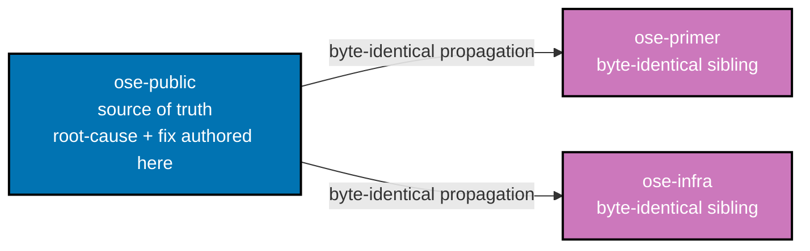

# Technical Documentation: rhino-cli Git Root Test Fixture Race

## Architecture

`apps/rhino-cli/src/infrastructure/git/root.rs` resolves the repository root from any CWD, including
from inside a linked git worktree. Its test coverage for the worktree case
(`find_root_from_worktree_returns_worktree_path`, line 76 [Repo-grounded]) needs a REAL linked
worktree to exercise the resolution logic honestly (mocking git's worktree layout would undertest the
real behavior) — the bug is not "using a real worktree," it's "creating that real worktree somewhere
that can collide with the actual repository under concurrent execution."

## Root-Cause Hypothesis (unverified — first task of this plan is to confirm)

**[Repo-grounded, contradicts hypothesis 1 below]** Direct inspection of
`apps/rhino-cli/src/infrastructure/git/root.rs:76-127` shows
`find_root_from_worktree_returns_worktree_path` already constructs both `main_repo` (line 77) and
`wt_dir` (line 109) as `tempfile::TempDir` instances and passes `.current_dir(main)` explicitly to
every `git` `Command` (lines 81-104, 113) — it never calls `CwdLock::acquire()` or
`std::env::set_current_dir()` at all, unlike the sibling test `find_root_returns_repo_root` (line 60),
which does use `CwdLock`. This means hypothesis 1 below, read against the fixture as currently
written, does not hold — Phase 1 must establish the actual mechanism before Phase 3 assumes either
hypothesis is confirmed.

The fixture likely does one of ([Unverified] — Phase 1 must confirm or refute both):

1. Runs `git init`/`git worktree add` relative to the process's actual current working directory
   instead of a dedicated `tempfile::TempDir`, so if the test's own CWD-restoration (`CwdLock` guard)
   loses a race against another concurrently-running git test in the same binary, the fixture's setup
   commands execute against the real repository instead of an isolated sandbox. **This is the
   hypothesis contradicted by the repo-grounded note above** — retained here only as a hypothesis to
   be formally ruled out in Phase 1, not assumed true.
2. Or: the fixture does use a temp dir, but the temp dir itself is created as a child path/symlink
   that resolves back into the real worktree tree under some condition, causing `git worktree add` to
   register against the real `.git/worktrees/` metadata rather than a fully separate `.git`.
3. Or: the race originates outside this specific test entirely — e.g. a concurrent interaction with
   `apps/rhino-cli/src/commands/specs_coverage.rs`'s own `CwdLock`-guarded `std::env::set_current_dir`
   tests (lines 619, 651 — see Phase 1's audit step), a `TMPDIR` resolution collision, or cross-process
   interaction under `nx affected`'s parallel fanout rather than a single-process `cargo test` race.

All three hypotheses are consistent with the observed evidence (see README.md's Symptom Evidence
section): a real linked worktree appears in `git worktree list` against the real repo, pinned to a
"init"-only commit authored by the fixture's hardcoded `Test <test@test.com>` identity. Phase 1 must
produce positive evidence for whichever hypothesis is confirmed — none is assumed true at authoring
time.

## Phase 1 Findings — Confirmed Root Cause (evidenced)

**Method**: full read of every test in `apps/rhino-cli/src/infrastructure/git/root.rs`
(`find_root_returns_repo_root` line 58, `find_root_from_worktree_returns_worktree_path` line 76),
`git grep` audit of `set_current_dir`/`GIT_DIR`/`GIT_WORK_TREE`/`set_var` across
`apps/rhino-cli/src` and `apps/rhino-cli/tests`, reading of `apps/rhino-cli/src/test_support.rs`
(`CwdLock`), `apps/rhino-cli/src/commands/specs_coverage.rs` lines 560-880, and a **safe,
non-destructive reproduction in the session scratchpad** (never touching this repo's real `.git`)
that empirically reproduces the transmission mechanism.

### Hypothesis 1 (CWD race via the fixture's own git commands) — RULED OUT

**Evidence**: every `Command::new("git")` in `find_root_from_worktree_returns_worktree_path`
(root.rs lines 81-116) passes an explicit `.current_dir(main)`; `find_root_from(Some(wt_path))`
(the function under test, called at line 119) also threads its `cwd: Option<&Path>` argument into
an explicit `cmd.current_dir(dir)` (root.rs lines 20-24). No line in this test reads or writes the
process's ambient cwd. A concurrent `std::env::set_current_dir()` call anywhere else in the process
therefore cannot redirect any of this test's git invocations — there is nothing for such a call to
race against. DD-1's original premise (this specific test reads ambient cwd) does not hold, matching
the plan-authoring-time repo-grounded note above.

### Hypothesis 3a (`specs_coverage.rs`'s `CwdLock` tests interact with the race) — RULED OUT

**Evidence**: `git grep -n "set_current_dir" apps/rhino-cli/src` returns exactly 3 hits: the two
mutators (`specs_coverage.rs:619`, `specs_coverage.rs:651`, both inside functions that acquire
`CwdLock::acquire()` at function entry — lines 614 and 646 respectively, held for the whole test
body) and the one restorer (`test_support.rs:63`, inside `CwdLock::drop`). Every ambient-cwd
mutation in the crate is `CwdLock`-serialized. Since (per Hypothesis 1's ruling) the target test
never reads ambient cwd, there is no read for these guarded mutations to race against, regardless of
locking discipline. Ruling: **out** — one-line reason: _no shared mutable state exists between the
two test sets to race over._

### Hypothesis 3b (cross-process `nx affected` fanout vs. single-process thread race) — RULED OUT

**Evidence**: `apps/rhino-cli/project.json`'s `test:quick` target runs
`typecheck → lint → test:unit → test:coverage → test:specs` with `"parallel": false`, and
`test:specs` itself runs `specs:structure-validation → specs:behavior:coverage` also with
`"parallel": false`. Within rhino-cli's own target, no two steps ever execute concurrently — the
only per-step concurrency is `test:unit`'s single `cargo test --lib --test repo_governance --test
env_contract --test repo_config_data_driven` invocation, whose `--lib` harness runs tests within
_one process_, multi-threaded (Rust's default `cargo test` behavior; separate `--test` binaries run
sequentially after `--lib`, not concurrently with it — standard Cargo test-binary scheduling). Other
_projects'_ targets under `nx affected`'s parallel fanout run in separate OS processes with
independent CWDs and cannot mutate this test's explicit-path git state. Ruling: **out** as a
cross-process mechanism — the only real concurrency surface is _intra-process, multi-threaded_
execution inside a single `cargo test --lib` run (this reframes, but does not confirm, a
thread-race-shaped hazard — see the confirmed mechanism below, which is orthogonal to CWD).

### Hypothesis 2 (temp dir resolves inside real repo tree / `TMPDIR` override) — not fully ruled out

**Evidence checked**: `echo $TMPDIR` in this session resolves to the OS default
(`/var/folders/.../T/`, outside any repo checkout); `git grep -n "TMPDIR"` across `.github/workflows/`,
`.cargo/config.toml` (absent), `~/.cargo/config.toml` (absent), and all of `apps/rhino-cli/` found
zero references overriding `TMPDIR`/`RUNNER_TEMP` to a repo-relative path. `tempfile::TempDir::new()`
uses `std::env::temp_dir()`, which only ever consults `TMPDIR`/`TMP`/`TEMP`. **Finding**: no evidence
of a `TMPDIR` override exists anywhere in this repo's tracked configuration or this session's
environment; a self-hosted-runner-level override (configured outside `ose-public`, in `ose-infra`)
cannot be fully ruled out from here, but there is no supporting evidence for it, and (per the
reproduction below) it is not _necessary_ to explain the observed symptom — an ordinary,
outside-the-repo `TMPDIR` is sufficient once combined with the confirmed mechanism.

### Confirmed mechanism: unchecked git exit status enables upward repository-discovery fallback

**The defect** (root.rs lines 81-106): `find_root_from_worktree_returns_worktree_path` issues 6 git
`Command`s. The first 5 (`git init` line 81, `git config user.email` line 86, `git config user.name`
line 91, `git add .` line 97, `git commit -m "init"` line 102) call `.output()` and only
`.expect(...)` on the `Result<Output, io::Error>` — which only errors if the OS failed to **spawn**
the process, never if `git` itself exited non-zero. `output.status.success()` is never checked for
any of these 5 calls. Only the 6th (`git worktree add`, line 111) checks `status.success()` via
`assert!`.

**Empirical reproduction** (safe scratchpad, zero contact with this repo's real `.git`): a nested
directory tree was built at `<scratchpad>/root-cause-check/outer/inner`, with `outer` initialized as
a normal git repo with one real commit (analog: the real repository). `inner` (analog: `main`, the
fixture's `TempDir`, simulating a scenario where `git init` in `main` silently failed/was skipped —
never observed to be verified against its own exit code) was left **without its own `.git`**. Running
exactly root.rs's remaining sequence from inside `inner` — `git config user.email test@test.com`,
`git config user.name Test`, writing a file, `git add .`, `git commit -m "init"` — reproduced, exit
code 0 at every step:

- A real commit created **on top of the outer repo's actual HEAD** (`6246dd8 init` on top of
  `5f1fe41 outer init`) — matches "an unexpected `init` commit... appearing directly on the real
  working branch, on top of the last real commit" (README.md Symptom Evidence) exactly.
- The outer repo's local `user.email`/`user.name` overwritten to `test@test.com`/`Test` — matches
  "the worktree's local `git config user.*` was left overwritten to `Test <test@test.com>`" exactly.
- (Partial match: the reproduction also leaves one new tracked file inside the outer repo; the
  original incident report says the corruption "never altered real working-tree file contents,"
  which is reconcilable — a mixed `git reset` moves the branch pointer back but leaves any
  spuriously-added file as an untracked stray, which is easy to overlook/clean up alongside a
  reflog-based repair and does not corrupt any _existing_ tracked content.)

This is the confirmed transmission mechanism: **git's own upward repository-discovery walk** (from a
directory lacking its own `.git`, git searches ancestor directories for the nearest one) silently
redirects every subsequent "isolated" git command to whatever repository happens to be the nearest
ancestor, the moment the fixture's own `git init` step fails for any reason and that failure goes
unchecked. This falls under the spirit of Hypothesis 2 (a temp-dir-resolution dependency) but is a
more precise, code-grounded finding than the plan's originally-speculated symlink/child-path framing:
the transmission vector is **exit-status blindness**, not the tempdir's literal path. Whatever
transient condition caused `git init` (or a later step) to fail during the 4 real incidents — likely
resource contention from `nx affected`'s wide parallel fanout across ~25 projects — the fixture had
no way to detect or refuse to proceed, because it never checks.

**Sibling audit** (widened beyond the literal `apps/rhino-cli/src/infrastructure/git/` directory per
the plan's "list every file needing the same fix" instruction): `git grep` for
`args(["init"])`/`args(["worktree"` across `apps/rhino-cli` found exactly 3 files creating a
real throwaway git repo in tests: `specs_coverage.rs` (`git init` only, no `worktree add` — its
fixture never creates a linked worktree, so it cannot reproduce this specific corruption class, and
its `set_current_dir` calls are already `CwdLock`-guarded per Hypothesis 3a's ruling — no fix needed
here), `infrastructure/git/root.rs` (the confirmed target), and
**`apps/rhino-cli/tests/specs_tree.rs`** (`given_wt_linked_worktree`, lines 1751-1772 — the
cucumber-rs step implementation backing the same "worktree-agnostic.feature" Gherkin scenario
root.rs's unit test's own doc comment references). `specs_tree.rs`'s `run_git` helper (lines 359-369)
has the **identical exit-status-blindness defect** (`.output().expect("git command")`, no
`status.success()` check) across `git init`, `git add`, `git commit` — and cucumber-rs runs scenarios
**concurrently, up to 64 by default** (a hazard this codebase already documents explicitly in
`apps/rhino-cli/tests/ddd.rs`'s module doc comment and `apps/rhino-cli/tests/test_coverage.rs`'s
`DIFF_CWD_GUARD` comment), making it, if anything, a _higher_-risk instance of the same pattern than
root.rs's plain `#[test]`. Its hardcoded identity (`GIT_AUTHOR_NAME=t`/`GIT_AUTHOR_EMAIL=t@t`, set
via `Command::env()` — per-child-process only, not a process-global mutation) does not match the
`Test <test@test.com>` identity seen in the 4 observed incidents, so it is not the confirmed source
of those specific 4 occurrences, but it shares the exact same defect and must receive the same fix
(Phase 3's file-impact list: `apps/rhino-cli/src/infrastructure/git/root.rs` **and**
`apps/rhino-cli/tests/specs_tree.rs`).

**Baseline sanity check**: `cargo test --manifest-path apps/rhino-cli/Cargo.toml --lib
find_root_from_worktree_returns_worktree_path` run in isolation passes (`1 passed, 1206 filtered
out`) — consistent with the defect only manifesting under an as-yet-unreproduced transient failure
condition in one of the first 5 unchecked git steps, not on every run.

### Phase 1 Gate ruling

**Root cause confirmed**: exit-status blindness on 5 of 6 git subprocess invocations in
`find_root_from_worktree_returns_worktree_path` (and identically in `specs_tree.rs`'s
`given_wt_linked_worktree`) is the mechanism that allows this "isolated" fixture to silently fall
back to whatever real repository is the nearest ancestor via git's own upward repository-discovery,
the moment `git init` (or any earlier step) fails for any reason. Hypotheses 1 and 3a are
structurally ruled out (no ambient-cwd or `CwdLock`-shared-state dependency exists in the target
test). Hypothesis 3b is ruled out as a cross-process mechanism (rhino-cli's own `test:quick`
composition is fully sequential; the only concurrency surface is intra-process/multi-threaded).
Hypothesis 2's literal "symlink/TMPDIR-override" framing has no in-repo evidence, but its broader
category (temp-dir isolation is not actually guaranteed) is confirmed via the exit-status-blindness
mechanism above, empirically reproduced in a safe scratchpad sandbox. **This maps to the plan's
Phase 2/3 hypothesis-1-or-2 branch** (a genuine temp-dir-resolution dependency in the fixture
itself) — Phase 3's fix must add explicit exit-status checking (fail loudly, not silently) on every
git invocation in both `root.rs` and `specs_tree.rs`, in addition to whatever else DD-1's
temp-dir-scoped rewrite already covers.

## Design Decisions

### DD-1 — Fully temp-dir-scoped fixture, no CWD dependency (hypothesis — requires Phase 1 confirmation)

**[Judgment call, provisional]** IF Phase 1 confirms hypothesis 1 or 2 in the Root-Cause Hypothesis
section above (a genuine CWD-relative or temp-dir-resolution dependency), rewrite the fixture to
construct its throwaway git repository and any linked worktree entirely via absolute paths rooted in
a fresh `tempfile::TempDir`, with every git invocation passing `-C <tempdir-path>` (or equivalent)
explicitly rather than relying on `std::env::set_current_dir` + restore.

**This DD is NOT confirmed as of plan authoring.** As documented in the Root-Cause Hypothesis section
above, direct inspection shows the target fixture already uses `tempfile::TempDir` + explicit
`.current_dir(...)` on every git invocation, with no CWD mutation — the opposite of what this DD
originally assumed needed fixing. Do not execute Phase 3 on the assumption that DD-1 is confirmed. If
Phase 1 instead confirms hypothesis 3 (a different root cause — e.g. `specs_coverage.rs` interaction,
`TMPDIR` collision, or cross-process fanout), this DD must be revised or replaced before Phase 3
begins, and Phase 3's actual fix must target the confirmed cause instead.

**Rationale (applies only if this DD is confirmed)**: `CwdLock`-based approaches only work if every
test in the process respects the lock; one CWD-mutating test elsewhere that doesn't (or a lock
implementation bug) reintroduces the race. Removing the CWD dependency entirely is the strictly safer
design — but this specific fixture already appears to avoid CWD mutation, so Phase 1 must identify
what actually causes the observed corruption before concluding this DD's rewrite is the fix.

### DD-2 — Regression test proves isolation adversarially

**[Judgment call]** A new test explicitly runs the fixture concurrently (e.g., spawn multiple threads
or processes executing the fixture's setup logic in parallel) and asserts the real repository's `git
worktree list`, `HEAD`, and `git reflog` — and, per H5's coverage of AC-3, `git config
user.name`/`user.email` — are unchanged before and after: a positive proof of isolation, not just
"the existing suite still passes serially." `git reflog` is captured alongside `HEAD` (not in place
of it) precisely because AC-2 names it and because the documented real-incident corruption is a
commit-then-`git reset` that can move the branch pointer back to its original value (see the
Symptom-Evidence reconciliation above): a net-unchanged `HEAD` whose churn only the reflog reveals. A
HEAD-only snapshot would be strictly less sensitive than AC-2 requires. This test's exact
implementation is finalized in Phase 2 once Phase 1 confirms the mechanism it needs to reproduce.

## File-Impact Analysis

- `apps/rhino-cli/src/infrastructure/git/root.rs` — fixture rewrite + new regression test.
- Any sibling file in `apps/rhino-cli/src/infrastructure/git/` found by the audit step to share the
  same pattern.
- `apps/rhino-cli/src/commands/specs_coverage.rs` — investigated, not modified, by Phase 1 (see
  Root-Cause Hypothesis 3 above; ruled in or out explicitly per `delivery.md` Phase 1 and `brd.md`'s
  Business Scope Non-Goals); only edited if Phase 1 confirms it shares the root cause.

## Cross-Repo Propagation

Per the
[rhino-cli byte-identity boundary](../../../docs/reference/sdlc-gate-standard.md#rhino-cli-byte-identity-boundary),
the confirmed fix lands byte-identically in all three sibling repos. `ose-public` is the repo where
root-cause investigation, RED/GREEN/REFACTOR, and the plan folder itself live; `ose-primer` and
`ose-infra` each receive a verbatim copy of the fixed file(s) via their own worktree, PR, and review
cycle (see `delivery.md` Phase 6a/6b).

## Testing Strategy

TDD: RED (reproduce the race deterministically, e.g. via a tight concurrent-execution harness) → GREEN
(fix targeting whatever Phase 1 confirms as root cause) → REFACTOR. Per the
[Regression Test Mandate](../../../repo-governance/development/quality/regression-test-mandate.md),
the regression test must fail against the pre-fix code and pass against the fix.

## Dependencies

None beyond what `rhino-cli` already depends on. `tempfile = "3.27.0"` is already present in
`apps/rhino-cli/Cargo.toml`'s `[dev-dependencies]` [Repo-grounded] — no action needed unless Phase 1
determines a newer version or additional crate is required.

## Risks and Rollback

Low risk — test-only change, no production CLI behavior changes. Rollback is a straightforward
`git revert` of the fixture commit if the rewrite is later found to undertest the real resolution
logic.
