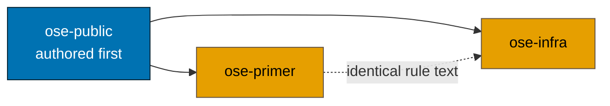
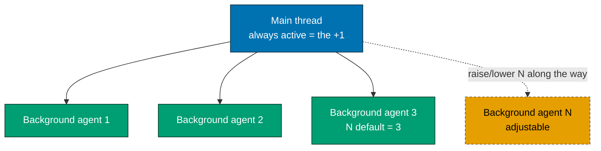
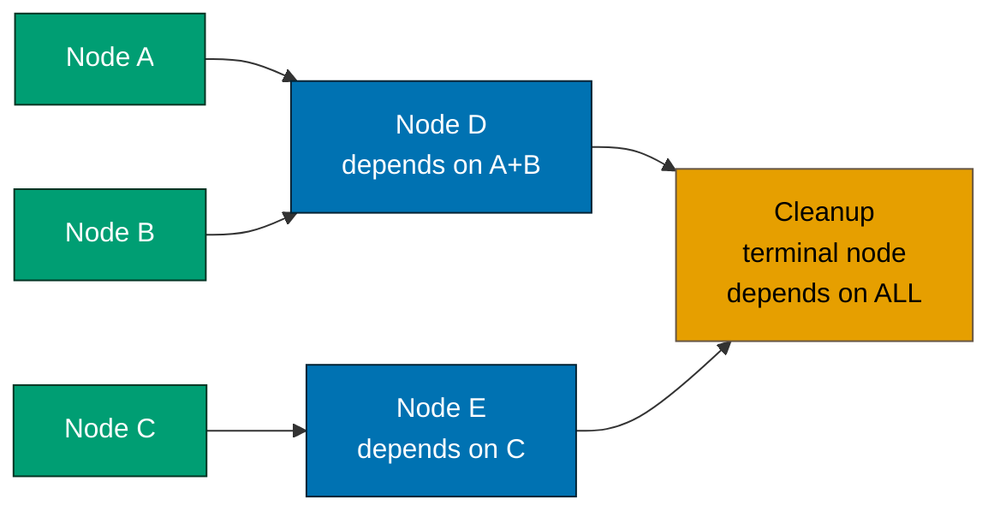
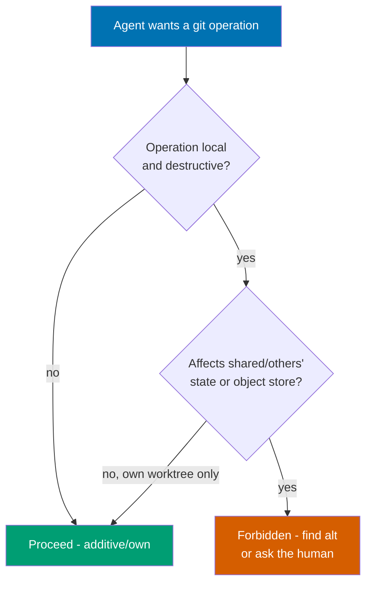
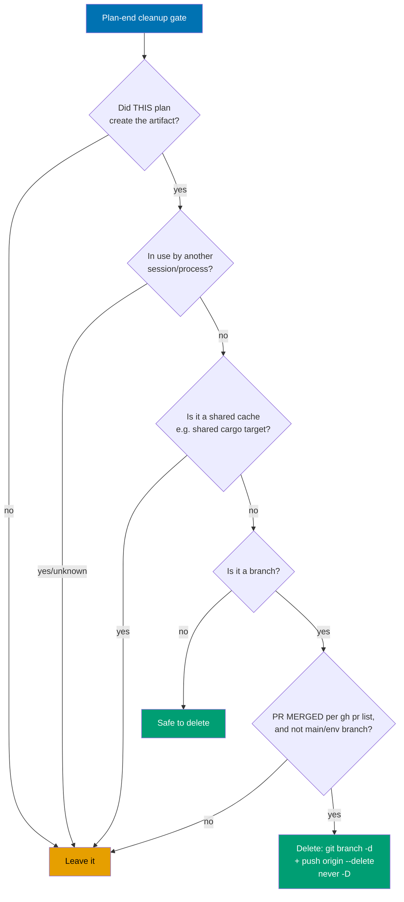
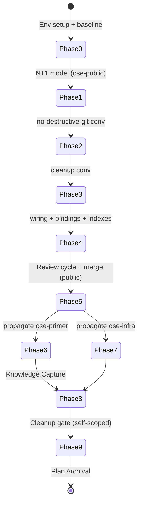

# Technical Documentation — Parallel-Orchestration & Shared-Machine Governance

## Nature of the change

This is a **governance/documentation** change plus one **CI-config** change. It edits markdown under
`repo-governance/`, `docs/`, `AGENTS.md`, `CLAUDE.md`, `.claude/agents/**`, `.claude/skills/**`,
`repo-governance/workflows/**`, regenerates mechanical binding artifacts, and changes the trigger of
`.github/workflows/main-ci.yml` in all three repos. It ships **no** application or library code, so:

- **Specs & Gherkin Delivery is exempt** — no observable behavior in `apps/`/`libs/`/`specs/` changes.
  Stated here per the [Feature Change Completeness Convention](../../../repo-governance/development/quality/feature-change-completeness.md)
  two-paths rule. [Repo-grounded]
- **UI-design-funnel is exempt** — no user-facing screens or components under `apps/`/`libs/`.
- **Manual UI/API verification is exempt** — no UI or API surface touched.
- **Delta 11 surface-conditional gates are exempt (stated explicitly, per the rule this plan
  introduces)** — this plan touches **neither** UI nor API/BE, so neither the UI gates
  (`ui/ui-quality-gate.md`, `web/web-ux-test-fixing-planning.md`) nor the new
  `api/api-quality-gate.md` applies. The rule forbids leaving this implicit; see
  [Delta 11](#delta-11--surface-conditional-ui--api-tester-gates-new-rule--new-workflowsapi-dir).
- **TDD Red/Green/Refactor is not applicable** — doc edits use direct-action + acceptance format,
  validated by markdown lint, link validation, vendor-audit, `generate:bindings` sync, and
  `repo-rules-checker`. The one YAML config change (`main-ci.yml` trigger) is validated by
  `actionlint` (already a repo lint gate), not by unit tests.

## Rule deltas (the substantive governance edits)

### Delta 1 — N+1 parallel-orchestration model (SUPERSEDES the fixed cap)

**Old model** [Repo-grounded]:

- `parallel-by-default.md` Standard 2 — "Cap at Three" for independent tool-call units.
- `parallel-by-default.md` Standard 3 / `subagent-orchestration.md` Standard 1 /
  `agent-workflow-orchestration.md` §Parallelism Budget — background subagents "cap at 2, 3 total
  including the main thread."
- `AGENTS.md` §Agent Workflow Orchestration — "capped at 3 concurrent … background agents cap at 2
  (never more), for 3 total including the main thread."

**New model**:

- **Accounting**: `1 main thread + N background agents = N+1 total`.
- **Default**: `N = 3` (→ 4 total). **Rationale**: N=3 is chosen specifically to **bound
  token/compute-budget burn** — parallelism has real cost. Raising N is a **deliberate, justified**
  act (independent work available + machine capacity + budget headroom); lowering N is **required**
  under budget/runner/disk pressure.
- **Adjustable**: N may be raised per-plan and **along the way** when independent work and machine
  capacity allow; lowered under budget/runner/disk pressure.
- **Guardrail preserved**: an agent MUST NOT silently self-promote beyond the declared N without
  cause; the mtime/staleness relaunch guidance (3-min poll, 30-min stuck threshold, `TaskStop` +
  relaunch) is kept verbatim in intent.
- **Unification**: the old asymmetry (3 for tool-batching, 2 for background) collapses into a single
  adjustable N whose default is 3. Plans declare their N in a `## Parallelization Model` section.

### Delta 2 — worktree-to-pr; the PR is the independent merge point

Reinforce (do not change the default): each plan/unit gets its **own worktree + PR**, so independent
work proceeds concurrently without collision. Sharpen the rationale: the **PR** — not just the
worktree — is the parallelism enabler. N parallel units become **N PRs that review, gate, and merge
INDEPENDENTLY** without blocking each other; that independent-merge property is precisely why the
default is worktree-**to-PR**. Each DAG leaf that produces changes gets its own worktree + PR.
Strengthen the rationale in the orchestration surface and cross-link the
[Delivery Mode](../../../repo-governance/conventions/structure/plans/delivery-mode-the-four-modes.md#delivery-mode) section. [Repo-grounded]

### Delta 3 — same-machine, concurrent-actors assumption (NEW explicit)

Add an explicit assumption to the orchestration surface: **always assume the repos are very active and
multiple agents / software engineers / other processes run simultaneously on the same machine**,
sharing the disk, the git object store, worktrees, and CI runners. All task/plan/execution guidance
must be safe under that assumption. This assumption motivates Deltas 4 and 5.

### Delta 4 — no-destructive-git-operations convention (NEW)

A new convention forbidding **local** destructive/irreversible git operations that could destroy
concurrent actors' work or parallelism on the shared machine. All git behaviors below are grounded in
the official `git-scm.com` man pages [Web-cited via web-researcher, access 2026-07-19 —
<https://git-scm.com/docs/git-push>, <https://git-scm.com/docs/git-rebase>,
<https://git-scm.com/docs/git-stash>, <https://git-scm.com/docs/git-gc>,
<https://git-scm.com/docs/git-worktree>, <https://git-scm.com/docs/git-checkout>].

**Forbidden set** (rewrites shared history, or discards data with no recovery path):

- `git push --force` (bare) — overwrites the remote tip, discarding others' commits. Verbatim
  [git-push(1)](https://git-scm.com/docs/git-push): "This flag disables that check, the other safety
  checks in PUSH RULES below, and the checks in `--force-with-lease`. It can cause the remote
  repository to lose commits; use it with care."
- `git push --force-with-lease` **bare form** — still unsafe when the local fetch is stale; the lease
  can pass against an out-of-date expectation. Verbatim
  [git-push(1)](https://git-scm.com/docs/git-push): "supplying this option without an expected value
  … interacts very badly with anything that implicitly runs `git fetch` on the remote to be pushed to
  in the background … this is trivially defeated if some background process is updating refs in the
  background."
- `git rebase` / `git commit --amend` of **already-published** commits — verbatim
  [git-rebase(1)](https://git-scm.com/docs/git-rebase) "RECOVERING FROM UPSTREAM REBASE": "Rebasing
  (or any other form of rewriting) a branch that others have based work on is a bad idea: anyone
  downstream of it is forced to manually fix their history."
- `git filter-repo` / `filter-branch` (full-history rewrite).
- `git reset --hard` — discards uncommitted work irrecoverably.
- `git clean -fdx` / `-fd` — recursively deletes untracked files (including ignored build output).
- `git stash drop` / `git stash clear` — verbatim
  [git-stash(1)](https://git-scm.com/docs/git-stash): "those entries will then be subject to pruning,
  and may be impossible to recover."
- `git branch -D` — force-deletes a branch, skipping the merged-check.
- `git reflog expire --expire=now --all` + `git gc --prune=now` — immediate reflog expiry + immediate
  pruning; verbatim [git-gc(1)](https://git-scm.com/docs/git-gc) §NOTES on `--prune=now`: "increases
  the risk of corruption if another process is writing to the repository concurrently."
- `git worktree remove --force --force` (double-force).
- `git checkout -- <path>` / `git restore <path>` overwriting unstaged work; `git switch
--discard-changes`.

**Cross-worktree facts (git already enforces much of this for us — state them so agents don't fight
the tool)** [git-worktree(1) §REFS / §DETAILS, git-gc(1) §NOTES —
<https://git-scm.com/docs/git-worktree>, <https://git-scm.com/docs/git-gc>]:

- The **object database and all `refs/*` are SHARED** across worktrees; **`HEAD` and the index are
  per-worktree** — so concurrent checkouts of _different_ branches do not collide by design. Verbatim
  [git-worktree(1)](https://git-scm.com/docs/git-worktree): "The new worktree is linked to the current
  repository, sharing everything except per-worktree files such as `HEAD`, `index`, etc." and "refs
  are shared across all worktrees, except `refs/bisect`, `refs/worktree` and `refs/rewritten`."
- Git **already refuses** to check out a branch that is active in another worktree via ordinary
  `git checkout`/`-f` — but note the precise mechanism: verbatim
  [git-checkout(1)](https://git-scm.com/docs/git-checkout) describes a dedicated
  `--ignore-other-worktrees` flag that exists specifically "to check the branch out anyway," so a
  determined bypass flag DOES exist even though bare `-f`/`--force` alone does not trigger it — do NOT
  pass `--ignore-other-worktrees` to bypass this guard.
- `gc` / `--auto` while another worktree is writing carries a **documented non-zero corruption risk**.
  Verbatim [git-gc(1)](https://git-scm.com/docs/git-gc) §NOTES: "when git gc runs concurrently with
  another process, there is a risk of it deleting an object that the other process is using but hasn't
  created a reference to. This may just cause the other process to fail or may corrupt the repository
  if the other process later adds a reference to the deleted object."
- `rm -rf` of a worktree directory leaves orphaned admin state → **forbidden**; use `git worktree
remove`. If a worktree directory was moved, repair with `git worktree repair`.

**Safer equivalents the convention prescribes** (not the destructive form):

- `git push --force-with-lease=<ref>:<expect>` **plus** `--force-if-includes` — never bare `--force`.
- `git revert` (a new inverse commit) instead of `reset`/`rebase` on shared history.
- `git worktree remove` (non-force) instead of `rm -rf`.
- `-n` / `--dry-run` preview before any bulk delete.
- `git worktree lock --reason=<why>` around a long unattended run.
- `git branch -d` (with merged-check) instead of `-D`.

**Ready-to-use vendor-neutral governance block** (drop verbatim into the convention — no vendor names,
no tool-specific command spellings):

> Forbidden without explicit per-instance approval: any operation that rewrites already-shared/pushed
> history (force-push without a lease-and-expected-value guard, rebase or amend of published commits,
> full-history-rewrite tooling); any operation that discards data with no recovery path (hard reset,
> recursive untracked-file cleanup including ignored build output, unconditional stash removal, force
> branch deletion, immediate reflog expiry + immediate object pruning); any operation that overwrites
> uncommitted working-tree changes without a save-first step. Cross-worktree: the VCS already refuses
> to check out or delete a branch active in another worktree — do not bypass with force. The shared
> object database and shared refs mean gc, aggressive pruning, and forced worktree removal can affect
> state another worktree depends on even when working trees are isolated; these require the same
> explicit approval. Manually deleting a worktree directory outside the tool's removal command is
> forbidden. Preferred: lease-with-expected-value over unconditional force; the tool's worktree-removal
> command over raw delete; a new revert commit over rewriting shared history; dry-run before bulk
> deletes; lock a worktree before a long unattended session.

Prefer additive/non-destructive operations; **stage explicit paths only** (see the whole-tree-staging
rule below); operate only within your **own** worktree. Cross-links the existing
[Git Push Safety Convention](../../../repo-governance/development/workflow/git-push-safety.md) as the
remote-side companion (this new rule owns the local/shared-machine side) and the stage-explicit-paths
guidance.

**Whole-tree staging is forbidden — the parallel-safety rule.** On a shared machine another actor's
uncommitted work, scratch files, and half-finished edits sit in the same tree; a whole-tree stage
sweeps them into _your_ commit, which is both a correctness bug and a disclosure risk (it is how an
unrelated `.env`-adjacent or scratch file gets committed by accident). The rule is therefore stated as
a **shape**, not a single flag spelling — every one of these is forbidden without explicit
per-instance approval:

- `git add -A` and its long form `git add --all`
- `git add .` (and any bare-directory add that pulls in paths you did not author)
- `git add -u` / `--update` across the whole tree
- `git commit -a` / `--all` (stages every tracked modification implicitly)
- any wrapper, alias, or agent shortcut whose net effect is "stage everything"

**Required instead**: name every path explicitly (`git add <path> [<path>...]`), and in a sibling repo
or another worktree use the `-C <worktree>` form so the operation cannot leak into the wrong tree.
Before staging, run `git status --porcelain` and stage only lines you can account for; anything you
cannot account for belongs to another actor and stays unstaged. [Repo-grounded — `AGENTS.md`
§Important Notes already forbids staging/committing without instruction; this delta supplies the
parallel-safety rationale and the full forbidden-shape list.]

**No corner-cutting — root-cause orientation is binding, not aspirational.** Under parallel execution
the cheapest way to make a gate go green is to weaken the gate, and nothing in the orchestration rules
previously forbade it. The convention therefore states: when a gate, test, lint, type-check, or CI job
fails, **fix the cause**, never the signal. Forbidden without explicit per-instance approval and a
written reason recorded in the plan:

- bypassing hooks (`--no-verify`) or skipping a declared quality gate
- deleting, skipping, `.only`-narrowing, or loosening a failing test instead of fixing the code
- weakening an acceptance criterion, threshold, or lint rule so a failing check passes
- ticking a delivery checkbox without the evidence its acceptance criterion demands
- suppressing an error (broad catch, ignore-comment, silenced warning) in place of a fix
- deferring a discovered preexisting failure instead of fixing it in-scope

A blocker that genuinely cannot be root-caused in scope is **escalated and recorded** — named in the
plan with what was tried and why it is out of scope — never silently worked around. [Repo-grounded —
`AGENTS.md` §Conventions "Root Cause Orientation: Fix root causes, not symptoms; proactively fix
preexisting errors encountered during work (do not mention and defer)" and §Manual Verification & CI
Blockers "never bypass"; this delta binds those principles to the orchestration and merge surface.]

**[Needs Verification]** at execution time: the exact concurrent-fetch ref-lock mechanics (transient
"cannot lock ref" contention vs. corruption) — do not overclaim in the convention prose.

### Delta 5 — worktree-and-artifact cleanup convention (NEW)

A new convention requiring, at plan end, removal of the worktrees the plan created, deletion of the
branches it created (local + remote, merged-only), and purge of the build artifacts it created
(`target/`, `dist/`, `.next/`, build caches) so the shared disk and the ref namespace do not fill —
**especially plans that spin up multiple worktrees**. Hard safety caveat:

- Delete only artifacts/worktrees **you created** AND that **no other session/worktree/process is
  currently using**.
- **Never** delete shared caches other sessions depend on — in particular the shared cargo `target/`
  directory introduced by the `rust-cargo-target-dir-sharing` plan (a symlinked shared build output);
  removing it would break concurrent builds. [Repo-grounded]
  ([`plans/done/2026-07-19__rust-cargo-target-dir-sharing/`](../../done/2026-07-19__rust-cargo-target-dir-sharing/) — completed and archived)
- Verify non-use before deleting; when in doubt, leave it.
- Make cleanup a **mandatory plan-end gate** that is itself non-destructive to others.

**Mandatory pre-removal checks before any `git worktree remove`** — each grounded in a live 2026-07-19
incident during this session's own worktree audit, not hypothesised:

1. **Test merge state with `gh pr list --head <branch> --state all --json number,state,mergedAt`, NOT
   `git merge-base --is-ancestor`.** Every PR in these repos is **squash**-merged, which replays the
   branch as one new commit, so the branch's own commits never become ancestors of `main`. The
   ancestry test therefore reports `NOT-MERGED` for **every** merged branch. Observed live: all four
   `ose-public` worktree branches reported NOT-MERGED while `gh` showed PRs #62/#66/#76/#77 all MERGED.
2. **`git status --porcelain` the worktree and read any dirty diff before removing.** A merged PR
   proves the _branch_ landed, not that the _working tree_ is empty — archival record-keeping in
   particular is written last, after the merge, and is easily left uncommitted. Observed live: the
   `rhino-speccoverage-multiline-scenario-scan` worktree held the plan's two terminal archival
   checkboxes ticked with real evidence (commit SHAs, merge timestamp) that existed **nowhere else**;
   every merge-state signal said "safe to delete". Recover such content to `main` first (plan-docs-only
   changes may push direct), or discard it explicitly with a stated reason.
3. **Check `git log origin/<branch>..<branch>`** for commits never pushed anywhere.
4. **Always use non-force `git worktree remove`** — it refuses on a dirty worktree, which is the
   backstop for when checks 1-3 are skipped. Never `rm -rf` a worktree.
5. **Never remove a worktree you did not create** without positive evidence it is idle — on a shared
   machine another session's live work is indistinguishable from stale state by path alone. Observed
   live: of 11 worktrees across the three repos, one (`rhino-cli-source-drift-reconciliation`, 5 dirty
   files) belonged to active work and was correctly left in place.

**Branch cleanup — the third artifact class** (alongside worktrees and build output). Removing a
worktree leaves its branch behind; under the 1-PR ↔ 1-worktree mapping of Delta 2, a multi-phase plan
accumulates one branch per phase per repo, so a plan that cleans worktrees but not refs still leaves
stale local and remote branches on every repo it touched. The convention therefore requires, after
each worktree removal:

- **Delete only branches this plan created**, and only after the branch's PR is confirmed MERGED by
  the same `gh pr list --head <branch> --state all --json number,state,mergedAt` test used in check 1
  above (squash-merge makes ancestry tests useless here — same reason).
- **Local deletion uses `git branch -d`** (merged-check retained), **never `git branch -D`** — `-D` is
  already on the forbidden list in Delta 4. `-d` refuses on an unmerged branch, which is the intended
  backstop. If `-d` refuses on a branch whose PR reports MERGED, that is the squash-merge shape rather
  than lost work: confirm via `git log origin/main..<branch>` that the content landed, then delete
  with an explicit stated reason — do not reflexively reach for `-D`.
- **Remote deletion (`git push origin --delete <branch>`) only after the PR is MERGED**, and only for
  branches this plan pushed. Never delete `main` or any environment branch this repo defines
  ([Repo-grounded] — `prod-*`/`stag-*` exist in `ose-public` today per `AGENTS.md` §Web Sites; live-verified
  `ose-primer` and `ose-infra` currently define none, so the rule is vacuously satisfied there — check
  each repo's own environment-branch set rather than assuming this exact pattern is universal).
- **Jurisdiction note**: `git push origin --delete <branch>` is remote-ref deletion, not
  history-rewriting force-push; it is deliberately **outside** the
  [Git Push Safety Convention](../../../repo-governance/development/workflow/git-push-safety.md)'s
  explicit-per-instance-approval gate (which is scoped to `--force`/`--force-with-lease`/`--no-verify`
  only — see its Covered Operations table), and is instead safety-gated by **this convention's own**
  merged-check requirement above. This is the single authority for remote branch deletion; Delta 4's
  forbidden-operations table (local-side only) and `git-push-safety.md` (force-push/`--no-verify` only)
  both explicitly defer to this convention for `git push origin --delete`.
- **Run `git worktree prune`** after removals so administrative worktree metadata does not accumulate;
  it touches only already-removed entries and is safe alongside other sessions.
- **Never `gc`/`prune` the object store** as part of cleanup — history maintenance is a serialization
  point on a shared machine (see the local-parallelism grounding below), so it stays out of the
  cleanup gate entirely.

**Local-parallelism grounding** (the git-endorsed shape for concurrent workstreams on one machine)
[git-worktree(1), git-gc(1) §CONFIGURATION; Web-cited via web-researcher, access 2026-07-19 —
<https://git-scm.com/docs/git-worktree>, <https://git-scm.com/docs/git-gc>]:

- **Worktree-per-task / per-PR is the git-endorsed isolation unit** — enforced by the tool, not merely
  convention: the **same branch cannot be active in two worktrees** at once (a hard block).
- **NOT auto-parallel-safe**, so treat as serialization points: (1) history maintenance
  (`gc` / `prune`); (2) two workstreams writing the **same shared ref** simultaneously — this is
  transient **"cannot lock ref" contention that self-heals on a short retry**, NOT corruption.
- **Mitigations**: set `gc.auto=0` (or schedule `gc` deliberately) during heavy fan-out
  [git-gc(1) §CONFIGURATION]; **isolate build output per worktree** (e.g. a distinct
  `CARGO_TARGET_DIR`, separate node build dirs) to avoid artifact collisions — this ties directly to
  the `rust-cargo-target-dir-sharing` plan; remove worktrees promptly (idle worktrees grow disk +
  stale state).
- **No official numeric ceiling** on concurrent worktrees exists — the dominant real bottlenecks are
  **disk I/O and shared-ref / build-lock contention**, not CPU or object-DB corruption. So the plan's
  **default N is an operational choice, NOT a git limit — state that explicitly** so nobody mistakes 3
  for a tool constraint.

**Ready-to-use vendor-neutral governance block** (drop verbatim into the convention — no vendor names):

> One clone, one shared history store, many independent working directories is the supported shape for
> concurrent workstreams on one machine. Each working directory has its own working-tree + staging
> area, so parallel work on different branches doesn't collide by design — provided each workstream
> stays on its own branch (the same branch cannot be active in two places at once). NOT automatically
> parallel-safe: history maintenance (gc, aggressive pruning) and two workstreams writing the same
> shared reference simultaneously — treat these as serialization points (schedule gc deliberately;
> expect transient, self-healing contention on shared refs). Isolate each workstream's build-output
> location when true concurrency matters, accepting disk cost. Remove a workstream's working directory
> promptly once its work lands. There is no fixed safe count of concurrent workstreams; the practical
> limits are disk I/O and shared-reference lock contention, not CPU or corruption.

**Honesty caveat to reflect (do NOT omit)**: verbatim
[git-worktree(1)](https://git-scm.com/docs/git-worktree) §BUGS [Web-cited via web-researcher, access
2026-07-19]: "Multiple checkout in general is still experimental, and the support for submodules is
incomplete. It is NOT recommended to make multiple checkouts of a superproject." — a label that has
persisted across many stable releases and yet underpins this repo's default workflow.
**Quote-and-contextualize** it in the convention (it is stable in practice despite the label) rather
than dropping it. **[Needs Verification]** the exact Cargo build-directory locking nuance before
over-specifying `CARGO_TARGET_DIR` isolation guarantees.

**Home decision**: a NEW dedicated convention file
`repo-governance/development/workflow/worktree-and-artifact-cleanup.md` (the teardown sibling of the
existing `worktree-setup.md`, which owns the setup/init side). Rationale: cleanup/teardown is a
distinct lifecycle concern; folding it into `worktree-path.md` (location) or `temporary-files.md`
(temp-file taxonomy) would blur those documents' single responsibilities. Cross-link `worktree-setup.md`,
`temporary-files.md` (build-artifact taxonomy), and the shared-cargo-target plan. [Repo-grounded — the
sibling `worktree-setup.md` exists]

### Delta 6 — DAG-first orchestration (NEW)

Every non-trivial task list AND plan delivery checklist must declare an explicit **dependency DAG**:
nodes = tasks/items, edges = blocks/blockedBy. **Independent** nodes run in PARALLEL up to N;
**dependent** nodes serialize (safety). The DAG's **independent-node width** is what the orchestrator
fans out to, capped at N. Concretely:

- **Task lists** express dependencies via `blocks`/`blockedBy`.
- **`delivery.md`** expresses phases/steps as a DAG plus a `## Parallelization Model` section naming
  which items are concurrent vs. serial. **Cleanup is the terminal DAG node**, depending on all
  delivery nodes.

Home: the DAG rule lands in `agent-workflow-orchestration.md` and `parallel-by-default.md` (general
norm), with the delivery-checklist expression documented in the
[Plans Organization Convention](../../../repo-governance/conventions/structure/plans.md). [Repo-grounded]

### Delta 7 — background-slot preference + bounded status cadence (NEW)

Two orchestration-behavior rules folded into the same surfaces (`parallel-by-default.md`,
`subagent-orchestration.md`, `agent-workflow-orchestration.md`, `AGENTS.md`):

- **Background-slot preference**: fill the **background** agent slots as much as possible (up to N)
  and keep the **main thread** as free/vacant as possible so it stays responsive to the user — the
  main thread is the **responsive orchestrator**, background agents are the **workers**. This is
  **bounded by the DAG**: only fan out genuinely-independent nodes; dependent nodes stay serial.
  "Maximize background utilization" is bounded by real independence, **not** artificial splitting —
  do not force parallelism where it does not make sense.
- **Status-update cadence**: while there are active/open task-list items, the orchestrator gives the
  user a progress update every **3-5 minutes — not faster** (informed without spam; no
  update-storming on every micro-event). Tie this to the
  [Task List Discipline](../../../repo-governance/development/practice/task-list-discipline.md) convention. [Repo-grounded]

### Delta 8 — PR merge preconditions (NEW hardened done-gate)

A PR merges ONLY when ALL **five** hold: **(a)** it passed the `pr-review-maker`→`pr-review-fixer`
cycle for **3 cycles**; **(b)** **0 CRITICAL + 0 HIGH findings outstanding**; **(c)** the branch is
**up-to-date with the latest `origin/main`** at merge time — if BEHIND, bring it forward
**non-destructively** (`git merge origin/main` or a forward-only update-branch; never a shared-history
rewrite); **(d)** **all PR quality gates are green**; **(e)** the **surface-conditional tester gates
of Delta 11 have been run and their defect findings resolved** — UI-bearing PR → UI gates;
API/BE-bearing PR → API gate; both → both; neither → explicitly recorded as exempt. The "up-to-date
with `origin/main` before merge" clause and clause **(e)** are both **NEW**.

> **Lettering is normative.** This (a)-(e) enumeration is the canonical one; `delivery.md`'s Phase
> 5/6/7 merge checkboxes use the identical lettering. Any future edit must change both together — an
> earlier revision let this list run (a)-(d) while `delivery.md` ran (a)-(e), so both cited "Delta 8"
> while disagreeing on what (b), (c), and (d) meant. Encode into the
> [PR Review Quality Gate workflow](../../../repo-governance/workflows/pr/pr-review-quality-gate.md) and
> the Delivery Mode **done-definition** (`AGENTS.md` §Git Workflow §Delivery Mode + the Plans
> Convention). Cross-links `git-push-safety.md` and the new `no-destructive-git-operations.md` for the
> non-destructive update requirement. [Repo-grounded — the workflow file exists]

### Delta 9 — main-ci on a schedule, not per-push (NEW, all 3 repos)

Change `.github/workflows/main-ci.yml` to **stop** triggering on push to `main` and instead run
**4×/day at 06:00/12:00/18:00/00:00 (next day) WIB (UTC+7)** plus manual dispatch:

```yaml
on:
  schedule:
    - cron: "0 5,11,17,23 * * *" # 06:00/12:00/18:00/00:00 (next day) WIB (UTC+7)
  workflow_dispatch:
```

Remove `push: branches: [main]` **entirely** — this is a **pure** 4×/day schedule with no push
trigger (deliberate choice). **Rationale**: with `worktree-to-pr` as the default, every change is
already CI-gated on its PR before merge, so per-push main-ci is redundant and wastes the shared
self-hosted runners.

**Core safety justification (same checks, all-vs-affected scope)**: `main-ci.yml` runs essentially
the **same checks** as the PR quality gate and the pre-commit/pre-push hooks — only the **scope**
differs. Its jobs run the same target set (`typecheck lint test:quick specs:behavior:coverage` per
language + the repo-wide rhino-cli validators: markdown per-file / mermaid / heading-hierarchy /
gherkin-cardinality, naming, instruction-size, specs structure, env, repo-config, md-links,
readme-index, harness-duplication, governance vendor+license). The distinguishing factor:

- **PR CI + pre-commit + pre-push** run at **`nx affected`** scope — only the projects/files the
  branch/PR changed.
- **main-ci** runs at **`nx run-many --all`** scope — the WHOLE repo.

So every merge already passed the same checks at affected-scope before landing (author's pre-push
affected gate + the PR's affected-scope CI). main-ci's role is the periodic **whole-repo sweep** that
catches only cross-project drift visible at `--all` scope. Nothing that cleared the affected-scope
gates can newly fail at `--all` except genuine cross-project interactions — which the 4×/day sweep
still catches within the window. This chain (**same checks; all-vs-affected scope; PR + hooks already
gated affected-scope**) is the core reason dropping the push trigger is acceptably safe.

**Hooks are auto-installed, not opt-in**: the pre-commit + pre-push hooks are installed by Husky via
the repo's `"prepare": "husky"` script, which runs automatically on every `npm install`
[Repo-grounded — `package.json` line 23]. Because the worktree-setup step already mandates
`npm install` in every worktree, every contributor and every worktree gets the affected-scope gates
installed and running locally **by default** — no manual opt-in. This closes the safety loop into
**three overlapping layers**: (1) local pre-push affected-scope gates (auto-installed for essentially
everyone), (2) PR CI re-running the same checks at affected scope before merge, (3) main-ci sweeping
the whole repo at `--all` scope 4×/day. Three overlapping layers mean no per-push main-ci trigger is
needed for safety. The two direct-push delivery modes (`worktree-to-origin-main`,
`main-to-origin-main`) are used only for changes already known safe to push directly — essentially the
"usual" `.md`/docs-only edits — so accepting up-to-~6h detection lag on `main` is an **accepted,
understood tradeoff**, not an oversight. Do NOT keep a push trigger for the direct-push modes. Where a
green `main` must be confirmed on demand, use `workflow_dispatch` (`gh workflow run main-ci.yml`).
`.github/workflows/**` is **NOT** in the rhino-cli byte-identity boundary → `ose-infra` keeps its
`coralpolyp` jobs, but the **schedule trigger** is consistent across all three repos. Validated by
`actionlint` (green; trigger is schedule + dispatch only).
[Repo-grounded — `main-ci.yml` currently triggers on `push: branches: [main]`]

The cron `0 5,11,17,23 * * *` is UTC; UTC+7 gives 12:00/18:00/00:00 (next day)/06:00 WIB. [Repo-grounded — arithmetic]

### Delta 10 — per-phase PR delivery + feature flags + strict 1-PR ↔ 1-worktree (NEW planning-granularity rule)

A planning-granularity rule for how plans are **decomposed**, landing in the plan-planning workflow +
plan conventions:

- **The default binds at all three plan paths, but in two different ways** — this distinction is the
  rule, not a caveat, because plan **creation** and **update** are by definition `plans/**`-only edits
  and would otherwise be swallowed whole by the plan-docs carve-out below:
  - **Creating / updating a plan** — binds as a **design obligation**, not a delivery route. The
    authoring edit itself may push directly to `main` (see the carve-out below); what the default
    requires is that the plan be **authored so its phases are independently PR-able** — phase
    boundaries, DAG shape, and feature-flag placement are chosen so that each applicable phase can
    become its own PR at execution time. A plan that genuinely cannot be decomposed this way must
    record why in its `tech-docs.md`.
  - **Executing a plan** — binds as the **actual delivery route**: `worktree-to-pr`, per-phase PRs,
    merged per phase.
- **Plan-docs-only carve-out (NEW general rule introduced by this plan)**: a change touching only
  `plans/**`, with no `apps/`/`libs/` code, may be committed and pushed directly to `main` rather than
  routed through a PR — authoring loops on documents that gate no runtime behaviour, where a PR
  round-trip buys no safety. This is stated here as a **new general convention in its own right**; it
  is **not** derived from DD-11. DD-11 is this plan's own narrow, self-scoped instance of the same
  reasoning and explicitly disclaims being a general precedent, so it cannot serve as the authority
  for a repo-wide rule. Once this convention lands, DD-11 becomes redundant with it rather than its
  source.
- **Per-phase / per-DAG-node PRs, merged per phase**: decompose a plan so each applicable phase (or
  independent DAG node) lands as its **OWN pull request**, rather than accumulating many phases in one
  long-lived branch. Each phase PR is **opened AND merged** as that phase completes — per-phase
  merging is the point; opening a PR per phase but holding them all for a batch merge at the end
  re-creates the long-lived-branch problem this rule exists to remove. **Merge actor**: `[AI]` merges
  the phase PR once CI is green and the 3-cycle `pr-review-maker`→`pr-review-fixer` gate is clean —
  see Delta 12, which inverts the repo-wide default. No phase stalls waiting on a human unless that
  plan's own step explicitly says `[HUMAN]`.
- **Feature flags by default**: keep partially-built work **merged-but-dark on `main`** behind a
  feature flag, so incomplete phases integrate early instead of piling up unmerged. Flagging is the
  default, not an optional nicety — the escape is explicit: a phase may land unflagged only when it
  ships **no user-reachable behaviour change** (pure docs, governance, refactor, or test-only work),
  and the phase step must say which. Every flag carries a named removal step in the plan's final
  phase, so flags do not accumulate as permanent dead branches.
- **Rationale**: smaller per-phase PRs + feature-flagging enable **safer and faster continuous
  integration** — work integrates into `main` early (behind a flag), shrinking merge conflicts and
  review surface, and letting independent phases proceed and merge **in parallel**.
- **Strict 1-PR ↔ 1-worktree mapping**: **one worktree → one branch → one PR → one phase / DAG-node**.
  This is exactly what makes the N+1 local fan-out translate cleanly to parallel PRs, and it is why the
  **worktree is the unit that gets cleaned up when its PR lands** (ties Delta 5 cleanup to Delta 2's
  PR-as-merge-point).
- **DAG governs — do not force-split**: where a phase is genuinely inseparable (a real DAG
  dependency), it stays **one PR** — never artificially split dependent work (consistent with the
  DAG-governs-fan-out principle, Delta 6/DD-7).

Home: the plan-planning workflow (`repo-governance/workflows/plan/plan-planning.md`), the
[Plans Organization Convention](../../../repo-governance/conventions/structure/plans.md), and the
Delivery-Mode/worktree guidance; cross-linked from the N+1 orchestration surface. [Repo-grounded]

### Delta 11 — surface-conditional UI / API tester gates (NEW rule + NEW `workflows/api/` dir)

**The rule.** Whenever a plan touches **UI**, the UI quality gates MUST run. Whenever it touches
**BE/APIs**, the API quality gate MUST run. This binds at **BOTH** points:

1. **During plan creation / update / execution** — the gate is emitted as delivery steps and run as
   part of the work, not discovered at the end.
2. **As a pre-merge precondition** — folded into Delta 8 clause **(e)** alongside "3 review cycles +
   up-to-date-with-`origin/main` + all PR gates green".

**Conditional by surface** — and the condition MUST be stated explicitly, never left implicit:

| Plan touches                      | Gate(s) required                                                   |
| --------------------------------- | ------------------------------------------------------------------ |
| UI (`apps/**` web, `libs/web-ui`) | UI gates (both, see below)                                         |
| API / BE (REST or GraphQL)        | API gate (`workflows/api/api-quality-gate.md` — **NEW**)           |
| Both                              | Both                                                               |
| Neither (pure docs/governance)    | **Exempt — but the plan must SAY SO explicitly** in `tech-docs.md` |

This plan itself is the "neither" case: it is a governance/docs + one CI-config change, touching no
`apps/` UI and no API handler. **Explicitly exempt from both Delta 11 gates.** [Repo-grounded]

#### Correction to the brief — "the UI gate" is TWO distinct workflows, not one

The brief described `repo-governance/workflows/ui/ui-quality-gate.md` as the
"web-exploratory-tester / web-usability-tester / web-design-tester triad". **On disk it is not.**
[Repo-grounded — frontmatter read]:

- **`ui/ui-quality-gate.md`** drives **`swe-ui-checker` + `swe-ui-fixer`** — a _static_ component
  audit (design-token compliance, accessibility, component patterns, dark mode, responsive), iterating
  to zero findings (`max-iterations` default 7, `mode` default `strict`). It never opens a browser.
- **The tester triad** lives in **`web/web-ux-test-fixing-planning.md`** (`Default 1`, the three
  testers run SEQUENTIALLY) — the _running-UI_ gate, already bound as Rule 15 of the
  [User-Facing Delivery Hardening Convention](../../../repo-governance/development/quality/user-facing-delivery-hardening.md).

Both are genuine UI gates at different layers, so the rule requires **both** for a UI-bearing plan:
`ui-quality-gate.md` for the static component layer, `web-ux-test-fixing-planning.md` for the running
surface. Writing the rule as "run ui-quality-gate" alone would silently drop the triad.

#### Three-way distinction — do not conflate (state this explicitly in the governance text)

| Gate                                         | What it gates                                                                                                                                   | Layer                            |
| -------------------------------------------- | ----------------------------------------------------------------------------------------------------------------------------------------------- | -------------------------------- |
| `plan-checker` **Step 5k**                   | The UI-**design funnel** in the plan doc (`prd.md`: ≥2 low-fi alternatives, 2 hi-fi finalists, named selection, rationale, responsive strategy) | Plan document, pre-build         |
| `ui/ui-quality-gate.md`                      | The **built components** (tokens, a11y, dark mode, responsive, patterns)                                                                        | Static code, post-build          |
| `web/web-ux-test-fixing-planning.md` (triad) | The **running UI** in a browser (exploratory / usability / design defects)                                                                      | Live surface, post-deploy-to-dev |

These are **complementary, not contradictory**: 5k gates the DESIGN before it is built,
`ui-quality-gate` gates the CODE once built, the triad gates the RUNNING result. A plan can pass 5k
and still fail the triad. The governance text MUST spell this out so nobody treats one as
substituting for another. [Repo-grounded — `plan-checker` Step 5k verified]

#### VERIFIED GAP — `workflows/api/` does not exist; this plan creates it

`repo-governance/workflows/api/` **does not exist** [Repo-grounded — `ls` returns
"No such file or directory"], even though **`.claude/agents/api-exploratory-tester.md` DOES exist**
(46.9K, `model: sonnet`, `output-mode` input with `plan` / `delivery` / `local-temp`)
[Repo-grounded]. So the API side has a tester agent with **no workflow gating it** — the asymmetry
is real, not a documentation oversight.

This plan therefore **creates two new files**:

- **`repo-governance/workflows/api/api-quality-gate.md`** _New file_ — modelled on the
  `ui/ui-quality-gate.md` shape: YAML frontmatter (`name`, `title`, `goal`, `termination`, `inputs`,
  `outputs`), an Execution Mode section (Agent Delegation preferred / Manual Orchestration fallback),
  iteration + termination semantics, and a **`max-concurrency` input consistent with the §4c-ii N+1
  alignment**. It drives `api-exploratory-tester` against a **live REST/GraphQL endpoint** with the
  contract (OpenAPI 3.x / GraphQL SDL) as ground truth.
- **`repo-governance/workflows/api/README.md`** _New file_ — the dir index, mirroring
  `ui/README.md`'s frontmatter + "Available Workflows" table + "Related Documentation" shape.

> **Honest shape caveat**: `ui-quality-gate.md` is a true **checker→fixer** loop
> (`swe-ui-checker` + `swe-ui-fixer`). There is **no `api-checker` / `api-fixer` pair** in
> `.claude/agents/` [Repo-grounded — grep]. So `api-quality-gate.md` is authored as a
> **tester-driven find→fix→re-test loop** (like `web-ux-test-fixing-planning.md`), NOT a literal
> checker/fixer clone: `api-exploratory-tester` emits `AET-###` findings, the findings are fixed by
> the appropriate `swe-*-dev` agent, and the tester re-runs until the defect set is empty. Claiming
> a checker/fixer pair that does not exist would be AP-7.

**Executor**: `repo-workflow-maker` (workflow authoring is its remit), validated by
`repo-workflow-checker` [Repo-grounded — both agent files exist]. The
[Workflow Naming Convention](../../../repo-governance/conventions/structure/workflow-naming.md)
applies to the new file names.

**Wiring**: the conditional rule is stated in `plan/plan-execution.md` and `plan/plan-planning.md`
(so plan authoring and execution both carry it), and `pr/pr-review-quality-gate.md` carries it as a
merge precondition (Delta 8 clause e). Propagated to all three repos in Phases 6/7.

### Delta 12 — `[AI]` merge becomes the repo-wide default (INVERTS the Delivery Mode convention)

A maintainer directive (2026-07-19): **"by default, AI are allowed to merge the PR. Only wait for
human when you are explicitly told so."** This inverts the standing default rather than adding
another per-plan exception.

- **New default**: on a `*-to-pr` plan, `[AI]` merges the PR once its merge preconditions hold — CI
  green, the 3-cycle `pr-review-maker`→`pr-review-fixer` gate clean, 0 CRITICAL + 0 HIGH, branch
  up-to-date with latest `origin/main`, and the surface-conditional tester gates (Delta 11) satisfied.
  **The preconditions are unchanged; only the actor is.**
- **`[HUMAN]` becomes the opt-in**: a plan gets a human merge gate only where its own step says so
  explicitly. Silence now means `[AI]`, where it previously meant `[HUMAN]`.
- **What this dissolves**: DD-10 existed solely to grant this plan a per-plan auto-merge exception,
  and explicitly disclaimed amending the default for other plans. Once Delta 12 lands, DD-10 is
  **redundant with the default** rather than a deviation from it — it is retained only as the
  historical record of how the authorization arrived. Any other plan's identical carve-out is likewise
  absorbed.
- **What this does NOT change**: the merge _preconditions_, the 3-cycle review requirement, the
  quality gates, or the `[HUMAN]`/`[AI]` tagging of any non-merge step. This is not a loosening of the
  gate — it is a change in who performs the final click once the gate is already green.
- **Rationale**: a green, fully-reviewed PR waiting on a human is pure latency in a per-phase-PR model
  (Delta 10). With phases landing continuously, a human merge gate per phase would serialize the whole
  point of incremental delivery back onto one person's availability.

**Surfaces**: [Plans Organization Convention §Delivery Mode](../../../repo-governance/conventions/structure/plans/delivery-mode-the-four-modes.md#delivery-mode)
(the definitional home of the `[HUMAN]`-merge default), `pr/pr-review-quality-gate.md` (the merge-gate
done-definition), `plan/plan-execution.md` + `plan/plan-planning.md`, and every `*-to-pr` reference
that currently hardcodes `[HUMAN]` merge. Propagated to all three repos in Phases 6/7.

## Surface inventory (the execution scope)

| #   | Surface (relative to repo root)                                                                                            | Change                                                                                                                                                                                                                   | Verified                                     |
| --- | -------------------------------------------------------------------------------------------------------------------------- | ------------------------------------------------------------------------------------------------------------------------------------------------------------------------------------------------------------------------ | -------------------------------------------- |
| 1   | `AGENTS.md` §Agent Workflow Orchestration                                                                                  | Replace the "3 concurrent / 2 background / 3 total" numbers with the N+1 model + assumption                                                                                                                              | [Repo-grounded] lines 264-266                |
| 2   | `repo-governance/development/agents/agent-workflow-orchestration.md` §Parallelism Budget                                   | Rewrite to N+1 model; add same-machine assumption                                                                                                                                                                        | [Repo-grounded] lines 111-117                |
| 3   | `repo-governance/development/agents/subagent-orchestration.md` Standard 1 (+ anti-patterns)                                | Rewrite cap to N (default 3); keep polling/stuck/relaunch Standards 2-4                                                                                                                                                  | [Repo-grounded] lines 73-93, 170-196         |
| 4   | `repo-governance/development/practice/parallel-by-default.md` Standards 2 & 3                                              | Unify to single adjustable N (default 3); update "cap at three"/"stricter cap of 2"                                                                                                                                      | [Repo-grounded] lines 74-86                  |
| 5   | `repo-governance/development/workflow/no-destructive-git-operations.md`                                                    | NEW convention (Delta 4)                                                                                                                                                                                                 | _New file_                                   |
| 6   | `repo-governance/development/workflow/worktree-and-artifact-cleanup.md`                                                    | NEW convention (Delta 5)                                                                                                                                                                                                 | _New file_                                   |
| 7   | `repo-governance/development/workflow/README.md` §Documents                                                                | Link the two new conventions (no hardcoded counts)                                                                                                                                                                       | [Repo-grounded] lines 34-53                  |
| 8   | `repo-governance/development/agents/README.md` / `practice/README.md` (as needed)                                          | Cross-link updated concurrency model if these indexes reference the old numbers                                                                                                                                          | [Unverified] — grep in Phase 1               |
| 9   | `CLAUDE.md`                                                                                                                | Update any Claude-specific concurrency text; note the two new conventions if bound                                                                                                                                       | [Unverified] — grep in Phase 4               |
| 10  | `repo-governance/development/practice/task-list-discipline.md`                                                             | Add the 3-5 min bounded status-update cadence (Delta 7)                                                                                                                                                                  | [Repo-grounded] file exists                  |
| 11  | `repo-governance/conventions/structure/plans.md`                                                                           | Document the DAG expression in `delivery.md` + `## Parallelization Model` (Delta 6)                                                                                                                                      | [Repo-grounded] file exists                  |
| 12  | `repo-governance/workflows/pr/pr-review-quality-gate.md`                                                                   | Add hardened merge preconditions incl. up-to-date-with-origin-main clause (Delta 8)                                                                                                                                      | [Repo-grounded] file exists                  |
| 13  | `.claude/agents/*.md` (grep-scoped subset of 83)                                                                           | Update any agent referencing old cap/orchestration/worktree/git-safety/cleanup text                                                                                                                                      | [Repo-grounded] 83 files; grep-scoped        |
| 14  | `.claude/skills/*/SKILL.md` (grep-scoped subset of 31)                                                                     | Update any skill referencing the same (e.g. subagent-orchestration/parallel skills)                                                                                                                                      | [Repo-grounded] 31 files; grep-scoped        |
| 15  | `repo-governance/workflows/plan/**` — **ALL SEVEN** files (see §Workflow surface inventory below)                          | Align every plan workflow with the new model (N+1 main-vacant, DAG fan-out, worktree-to-PR, per-phase PR + feature flags, 1-PR↔1-worktree, no-destructive-git, self-scoped cleanup, merge preconditions, 4×/day main-CI) | [Repo-grounded] all 7 files exist            |
| 15b | `repo-governance/workflows/**` **`max-concurrency` frontmatter** — 20 files repo-wide (19 @ `default: 2`, 1 @ `Default 1`) | Align the `max-concurrency` default/wording with the N+1 model; **preserve** the deliberate `Default 1` serialization in `web/web-ux-test-fixing-planning.md`                                                            | [Repo-grounded] enumerated by grep           |
| 16  | `.github/workflows/main-ci.yml` (all 3 repos)                                                                              | Replace `push: branches: [main]` with schedule (4×/day WIB) + `workflow_dispatch`                                                                                                                                        | [Repo-grounded] currently push-triggered     |
| 17  | `.opencode/**`, `.amazonq/**`                                                                                              | Regenerate via `npm run generate:bindings` (mechanical; never hand-edit)                                                                                                                                                 | [Repo-grounded] package.json:30              |
| 18  | `docs/reference/platform-bindings.md` (all 3 repos)                                                                        | Amazon Q Developer → Kiro CLI succession (sunset dates + Kiro capabilities); vendor-accurate, platform-binding surface only                                                                                              | [Repo-grounded] file exists; Amazon Q listed |
| 19  | `AGENTS.md` §Platform Binding Examples + any other "Amazon Q Developer" mention (all 3 repos)                              | Reflect the Q→Kiro succession consistently                                                                                                                                                                               | [Repo-grounded] Amazon Q listed in AGENTS.md |
| 20  | `repo-governance/workflows/plan/plan-planning.md` + `plan/plan-execution.md`                                               | Add the per-phase-PR + feature-flag + strict 1-PR↔1-worktree planning-granularity rule (Delta 10)                                                                                                                        | [Repo-grounded] both files exist             |
| 21  | `repo-governance/workflows/api/api-quality-gate.md`                                                                        | **NEW workflow** (Delta 11) — `api-exploratory-tester` against a live REST/GraphQL endpoint; find→fix→re-test loop; `max-concurrency` aligned with §4c-ii                                                                | _New file_ — `workflows/api/` does not exist |
| 22  | `repo-governance/workflows/api/README.md`                                                                                  | **NEW index** (Delta 11) — mirrors `ui/README.md` frontmatter + Available-Workflows table                                                                                                                                | _New file_                                   |
| 23  | `repo-governance/workflows/README.md`                                                                                      | Register the new `api/` category alongside `ui/` in the workflows index (no hardcoded counts)                                                                                                                            | [Repo-grounded] file exists                  |
| 24  | `repo-governance/workflows/plan/plan-execution.md` + `plan/plan-planning.md` (Delta 11 pass)                               | State the surface-conditional UI/API gate rule + the explicit-exemption requirement + the three-way 5k / ui-quality-gate / triad distinction                                                                             | [Repo-grounded] both files exist             |
| 25  | `repo-governance/workflows/pr/pr-review-quality-gate.md` (Delta 11 pass)                                                   | Add the surface-conditional gate as merge precondition clause (e) — Delta 8's normative lettering, where (a)-(d) are the existing four preconditions                                                                     | [Repo-grounded] file exists                  |
| 26  | `repo-governance/development/quality/user-facing-delivery-hardening.md`                                                    | Cross-link Rule 15 (web triad) / Rule 16 (AET) to the new conditional gate rule and the new `api/` workflow so the two surfaces agree                                                                                    | [Repo-grounded] file exists                  |
| 27  | `repo-governance/development/workflow/git-push-safety.md` §Related Documentation                                           | Add the reciprocal "see also" link to the new `no-destructive-git-operations.md` convention (Delta 4's remote-side companion, per DD-2) — closes the bidirectional link the new convention already establishes           | [Repo-grounded] lines 188-194                |

`npm run generate:bindings` = `cargo run --release --quiet --manifest-path apps/rhino-cli/...`
[Repo-grounded] (`package.json` line 30). Do NOT hand-edit `.opencode/` or `.amazonq/`.

### Workflow surface inventory (expanded — ALL of `workflows/plan/*` + the repo-wide `max-concurrency` set)

**A. `repo-governance/workflows/plan/` — ALL SEVEN files in scope** [Repo-grounded — `ls` verified]:

| File                                               | Why it changes                                                                                                                                                                                                                                                       |
| -------------------------------------------------- | -------------------------------------------------------------------------------------------------------------------------------------------------------------------------------------------------------------------------------------------------------------------- |
| `README.md`                                        | Plan-workflow index — reflect the new orchestration model and link the new conventions                                                                                                                                                                               |
| `plan-execution.md`                                | Execution semantics: N+1 fan-out, DAG ordering, 1-PR↔1-worktree cleanup tie, no-destructive-git, self-scoped cleanup                                                                                                                                                 |
| `plan-planning.md`                                 | Planning granularity: per-phase PR + feature flags + strict 1-PR↔1-worktree (Delta 10)                                                                                                                                                                               |
| `plan-quality-gate.md`                             | **`max-concurrency` (default 2) frontmatter input** + a Delivery-Mode done-definition section → align default/wording with N+1 and add the hardened merge preconditions                                                                                              |
| `multi-plans-execution.md`                         | **Most affected** — governs running multiple plans at once: must adopt N+1, background-slot-preference/main-vacant, DAG-first ordering, 3-5 min status cadence, 1-PR↔1-worktree; its old "cap 3 concurrent / background cap 2 never more" language is **superseded** |
| `plan-multi-repo-parity-planning.md`               | Governs the 3-repo parity loop **this plan runs** → worktree-to-PR default, per-phase PR + feature flags, no-destructive-git, self-scoped cleanup, parallel propagation shape                                                                                        |
| `plan-multi-repo-parity-planning-and-execution.md` | Same as above, execution half — ose-public → ose-primer/ose-infra parallel propagation                                                                                                                                                                               |

**B. Repo-wide `max-concurrency` frontmatter — 20 files** [Repo-grounded — grep-enumerated]. Nineteen
carry `default: 2`; align each with the N+1 model:

`workflows/README.md` (documents "Parallel execution limit - default: 2"), `meta/workflow-identifier.md`
(defines the input schema), `plan/plan-execution.md`, `plan/plan-quality-gate.md`,
`plan/multi-plans-execution.md`, `plan/plan-multi-repo-parity-planning.md`,
`plan/plan-multi-repo-parity-planning-and-execution.md`, `docs/docs-quality-gate.md`,
`docs/docs-software-engineering-separation-quality-gate.md`, `specs/specs-quality-gate.md`,
`ui/ui-quality-gate.md`, `content/pdf-to-md-quality-gate.md`, `repo/repo-rules-quality-gate.md`,
`repo/repo-harness-compatibility-quality-gate.md`, and the five `ayokoding-web/*-quality-gate.md`
files — fourteen named plus five ayokoding-web = **19 at `default: 2`**. The twentieth is
`web/web-ux-test-fixing-planning.md` at `Default 1` (see the preservation note below).

**`pr/pr-review-quality-gate.md` is NOT in this set.** It carries **zero** `max-concurrency`
frontmatter — live-verified: `grep -c "max-concurrency" repo-governance/workflows/pr/pr-review-quality-gate.md`
returns `0`, and the file states its cycle is "Strictly sequential, never parallel". An earlier
revision of this inventory wrongly listed it, which would have sent §4c-ii to edit a field that
does not exist. Its only edits in this plan are the Delta 8 merge preconditions (row 12) and the
Delta 11 surface-conditional clause (row 25) — no concurrency frontmatter change.

> **Preserve the deliberate exception**: `web/web-ux-test-fixing-planning.md` uses `Default 1` on
> purpose — "the three testers run SEQUENTIALLY". That is a genuine DAG serialization point, NOT a
> stale cap. Do **not** raise it to N; instead document _why_ it stays 1 (consistent with
> "DAG governs — never force parallelism onto dependent nodes", DD-7).

**C. Prose-level orchestration reference**: `repo/repo-dependency-bump-planning.md` caps concurrency in
prose ("one agent per ecosystem batch") and cross-links the Subagent Orchestration Convention → align
its wording with N+1. [Repo-grounded]

## Diagrams

### Tri-repo propagation (dependency / flow)



### N+1 parallel-orchestration model (component)



### DAG-first fan-out (dependency graph → parallelism)



> Independent nodes A, B, C fan out in parallel up to N; D and E serialize behind their
> dependencies; cleanup (Z) is the terminal node depending on every delivery node.

### Destructive-git-op guard (decision branch)



### Cleanup safety (decision branch)



### Phase / delivery flow (gated progression)



## Cross-harness compatibility (vendor-neutral, capability-gated)

The N+1 / DAG / worktree model **can** be stated vendor-neutrally and capability-gated (confirmed by a
`web-researcher` survey of 11 harnesses). Per the
[Governance Vendor-Independence Convention](../../../repo-governance/conventions/structure/governance-vendor-independence.md),
the governance **prose** carries **no vendor names and no hardcoded numeric caps** — if a numeric
ceiling is ever needed it belongs in a platform-binding file, not in `repo-governance/`.

**Recommended vendor-neutral phrasing** (to land verbatim in the concurrency surface):

> Where the harness supports background or parallel subagents, execute the DAG's independent nodes
> concurrently, each in its own git worktree (or equivalent isolated branch checkout), respecting the
> harness's own documented concurrency ceiling if one exists. Where the harness does NOT support
> background/parallel subagents, execute the same DAG **serially**, node by node, in dependency order
> — one worktree/branch at a time is fine (serial execution has no concurrent-edit collision to
> isolate against). In both modes, the delivery-safety rules (no destructive git operations, worktree
> cleanup on completion, no direct pushes to protected branches) apply **identically** regardless of
> concurrency mode.

**Three capability tiers** (research context for the plan — the vendor names live here in the plan,
NOT in the governance prose):

- **Full native N+1 + per-agent worktrees**: Claude Code, OpenAI Codex CLI, GitHub Copilot, Cursor,
  Google Antigravity CLI, Kiro CLI.
- **Partial**: OpenCode (native subagents, no native worktree — `git worktree` usable manually as a
  git feature), Windsurf (parallel sessions; worktrees recommended, not fully automatic), JetBrains
  Junie (autonomous planning; native parallel/worktree unconfirmed — open feature requests
  [JUNIE-236](https://youtrack.jetbrains.com/projects/JUNIE/issues/JUNIE-236/Multi-Worktree-Project-Management)
  / [JUNIE-1924](https://youtrack.jetbrains.com/projects/JUNIE/issues/JUNIE-1924/Allow-Junie-to-operate-on-independent-changesets-in-parallel-tasks)).
  [Web-cited via web-researcher, access 2026-07-19]. Verbatim JUNIE-236: "JetBrains IDEs treat each
  worktree as a separate project, which requires extra setup each time. The expected result is that
  JetBrains IDEs should support projects with multiple worktrees and checkouts at the same time" —
  i.e. still an open request, not yet native, confirming the "unconfirmed" characterization.
- **Single-threaded by design → serial DAG walk**: Pi (no built-in subagents, intentional), Aider
  (explicitly single-agent; also does NOT auto-read `AGENTS.md` — needs `--read`).
  [Web-cited via web-researcher, access 2026-07-19 —
  <https://aider.chat/docs/usage/conventions.html>]. Verbatim: "It's best to load the conventions file
  with `/read CONVENTIONS.md` or `aider --read CONVENTIONS.md`."

**Currency gap to flag (Amazon Q → Kiro succession)**: Amazon Q Developer CLI is being **sunset** by
AWS through 2026 (new-signup block 2026-05-15; latest models Kiro-only from 2026-05-29; IDE-plugin EOS
2027-04-30). Its successor **Kiro CLI** is the most DAG-native harness found (explicit upfront
task-graphs with dependencies, up to 4 concurrent subagents, worktree isolation, `q`/`q chat` entry
points preserved, `~/.aws/amazonq`→`~/.kiro` auto-migrated). The repo's Platform Bindings Catalog +
`AGENTS.md` still list "Amazon Q Developer" as active without the Kiro succession.
[Web-cited via web-researcher, access 2026-07-19 —
<https://aws.amazon.com/blogs/devops/amazon-q-developer-end-of-support-announcement/>,
<https://docs.aws.amazon.com/amazonq/latest/qdeveloper-ug/upgrade-to-kiro.html>,
<https://kiro.dev/docs/cli/chat/subagents/>]. Verbatim AWS blog: "Amazon Q Developer IDE plugins and
paid subscriptions will reach end of support on April 30, 2027, with new signups blocked starting May
15, 2026" and "Starting May 29, 2026 … The latest coding models … are available exclusively on Kiro."
Verbatim `docs.aws.amazon.com`: "The Amazon Q Developer CLI has been rebranded to Kiro." Verbatim
[kiro.dev](https://kiro.dev/docs/cli/chat/subagents/): "The main agent can spawn up to four subagents
at once, monitor them live with Ctrl+G, and combine the results when they finish." The worktree-
isolation-as-default and `~/.aws/amazonq`→`~/.kiro` auto-migration details were confirmed
substantively during the original `web-researcher` survey but were not re-fetched verbatim in this
citation pass — flagged `[Needs Verification]` for anyone re-authoring this content into a durable
convention file.

**Decision (DD-6, UPDATED — now folded in)**: the Amazon Q → Kiro CLI catalog fix is **folded into
this plan** (Phase 4e). Update the Platform Bindings Catalog (`docs/reference/platform-bindings.md`) +
`AGENTS.md` + any other surface listing "Amazon Q Developer" across all three repos to reflect the
Q-Developer-CLI → Kiro-CLI succession, vendor-accurately but **confined to the platform-binding
surfaces** (the Governance Vendor-Independence Convention still bars vendor names from
`repo-governance/` prose). Facts to record: new-signup block 2026-05-15, models Kiro-only 2026-05-29,
IDE-plugin EOS 2027-04-30; Kiro CLI has native DAG task-graphs, up to 4 subagents, worktree isolation,
`q`/`q chat` entry points preserved, `~/.aws/amazonq`→`~/.kiro` auto-migrated. See the citations and
verbatim excerpts in the "Currency gap to flag" paragraph above.
[Web-cited via web-researcher, access 2026-07-19]

## Design decisions

- **DD-1: New dedicated cleanup convention (not folded).** Teardown is a distinct lifecycle concern
  from setup/location/temp-taxonomy; a dedicated file mirrors `worktree-setup.md` and keeps each
  document single-responsibility.
- **DD-2: New no-destructive-git convention separate from git-push-safety.** `git-push-safety.md`
  owns the **remote** push side (force-push, `--no-verify`); the new file owns the **local /
  shared-machine** side. Two focused files cross-linked beats one overloaded file.
- **DD-3: Unify the two caps into a single adjustable N.** The old 3-vs-2 asymmetry is replaced by one
  N (default 3) so there is a single number to reason about and adjust; the +1 always denotes the main
  thread. Preserves the safety intent (don't self-promote; keep relaunch guidance).
- **DD-4: ose-public first, then parallel propagation.** Source-of-truth ordering prevents drift;
  primer + infra propagation run as parallel worktrees to dogfood the N+1 model.
- **DD-5: Respect Dynamic Collection References.** Index edits link the new conventions by name; no
  hardcoded convention counts. [Repo-grounded — Dynamic Collection References convention]
- **DD-6: Harness-catalog refresh (Amazon Q → Kiro CLI succession) is folded into this plan
  (Phase 4e), UPDATED from an earlier separate-follow-up draft.** See the Cross-harness
  compatibility section above.
- **DD-7: DAG governs fan-out; background-slot preference is bounded by real independence.** "Maximize
  background utilization, keep main vacant" never means artificially splitting dependent work — the
  DAG's independent-node width is the ceiling, capped at N.
- **DD-8: main-ci trigger is config, not byte-identity.** `.github/workflows/**` is outside the
  rhino-cli byte-identity boundary; the schedule trigger is made consistent across repos while
  ose-infra keeps its own `coralpolyp` jobs. Validated by `actionlint`, not unit tests.
- **DD-9: Governance prose stays vendor-neutral; vendor names + numeric caps live in the plan/binding
  files only.** Enforces the Governance Vendor-Independence Convention.
- **DD-10 (DEVIATION — documented exception): `[AI]` auto-merges Phase 5/6/7 PRs instead of the
  `worktree-to-pr` mode's default `[HUMAN]`-merge requirement.** Rationale: the maintainer has a
  standing, previously-granted preference to auto-merge once the hardened merge preconditions hold
  (3 `pr-review-maker`→`pr-review-fixer` cycles complete, branch up-to-date with `origin/main`, all
  gates green) — this is a recurring, explicitly-authorized exception across this maintainer's plans,
  not a one-off invention for this plan. Authorizing context: explicit maintainer instruction at
  this plan's authoring time. Scope: this deviation is per-plan, not a rule change — it does NOT
  amend the [Delivery Mode convention](../../../repo-governance/conventions/structure/plans/delivery-mode-the-four-modes.md#delivery-mode)'s
  `[HUMAN]`-merge default for `*-to-pr` plans generally; other plans still require `[HUMAN]` merge
  unless they carry the same explicit authorization. Applies to: the merge checkboxes in `delivery.md`
  Phase 5, Phase 6, and Phase 7 (each cross-references DD-10), and the `## Delivery Mode:
worktree-to-pr` declaration at the top of `delivery.md`.
  **Status: DISSOLVED BY DELTA 12 — bootstrap timing.** Delta 12 makes `[AI]` merge the repo-wide
  default, so this per-plan exception stops being an exception the moment Phase 4 lands. The two
  framings are **sequential, not contradictory**: this plan must merge its own Phase 5/6/7 PRs under
  DD-10's per-plan authorization **because it is the very plan that installs the new default** — the
  convention change is not yet in force while the plan that delivers it is still executing. Once
  Phase 4's edit to the Delivery Mode convention lands, DD-10 is redundant with the default and is
  retained only as the historical record of how the authorization arrived. Any later plan needs no
  such deviation.
- **DD-11 (DEVIATION — documented exception): Plan Archival is committed via direct push to `main`
  after all three repos' PRs merge, rather than folded into the delivering PR itself.** Rationale:
  this is a tri-repo-propagation plan whose plan-folder is tracked only in `ose-public`, and its
  single archival `git mv` cannot cleanly land "inside" three separate cross-repo PRs (ose-public,
  ose-primer, ose-infra) simultaneously; the plan-doc artifacts (`README.md`/`brd.md`/`prd.md`/
  `tech-docs.md`/`delivery.md`/`learnings.md`) are already established as "known-safe direct-push
  docs-only" edits, distinct from the governance-content PRs (see the "Plan-doc authoring vs plan
  execution" note in `delivery.md`'s `## Delivery Mode` section). Authorizing context: this is an
  architectural consequence of this specific plan's tri-repo shape, not a general precedent — a
  single-repo `*-to-pr` plan MUST still fold its archival step into the delivering PR per the
  [Delivery Mode convention](../../../repo-governance/conventions/structure/plans/delivery-mode-the-four-modes.md#delivery-mode).
  Applies to: `delivery.md`'s Plan Archival section (cross-references DD-11) and the "Plan-doc
  authoring vs plan execution" note.

## Dependencies

- `repo-rules-maker` / `repo-rules-checker` agents (governance authoring + validation). [Repo-grounded]
- `repo-harness-compatibility-checker` (vendor-neutrality completeness gate for the sweep). [Repo-grounded]
- `npm run generate:bindings` (mechanical binding sync). [Repo-grounded] package.json:30
- `pr-review-maker` / `pr-review-fixer` (PR review cycle for `*-to-pr`). [Repo-grounded]
- `actionlint` (validates the `main-ci.yml` trigger change). [Repo-grounded — cross-language lint gate]
- Markdown lint / link validation / vendor-audit gates. [Repo-grounded]

## Rollback

Governance-only: revert the per-repo PR commit(s). No data migration, no runtime state. The new
convention files can be deleted and the concurrency-surface edits reverted independently since they
touch distinct files.
