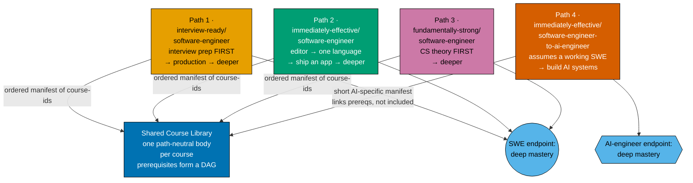
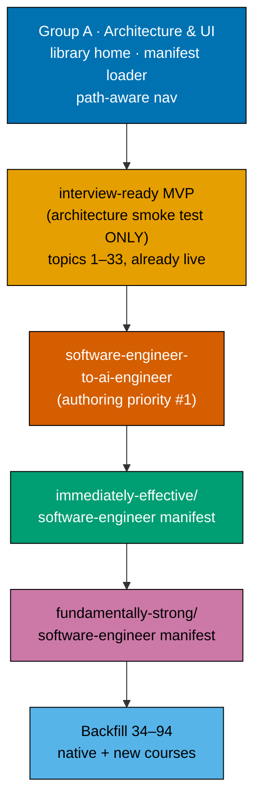

# Fundamentally Strong — Shared Course Library, Four Learning Paths

> **RETIRED 2026-07-21 — superseded by a five-way split. Do not execute this plan.**
>
> No phase of this plan was ever executed. Its entire scope was **transferred, not abandoned**, to
> five independently mergeable plans in [`../../backlog/`](../../backlog/README.md), whose `NN-`
> prefix is the execution sequence:
> [`01-url-restructure`](../../backlog/ayokoding-learning-path-01-url-restructure/README.md),
> [`02-schema-and-prerequisite-dag`](../../backlog/ayokoding-learning-path-02-schema-and-prerequisite-dag/README.md),
> [`03-navigation-ui`](../../backlog/ayokoding-learning-path-03-navigation-ui/README.md),
> [`04-course-authoring`](../../backlog/ayokoding-learning-path-04-course-authoring/README.md),
> and [`05-manifests`](../../backlog/ayokoding-learning-path-05-manifests/README.md).
>
> This folder is retained **only** as the provenance record those five plans cite. Its `syllabus/`
> corpus and design assets now live in `02-schema-and-prerequisite-dag` and `03-navigation-ui`
> respectively, so the intra-folder links below no longer resolve — that is expected, and is why
> `plans/done` is excluded from the link gate. Everything after this banner is the plan as it stood
> at the moment of the split.

Turn the "Fundamentally Strong" curriculum into a **shared course library** composed by **four
learning paths**. One canonical body per course (a path-neutral "building block"); each path is an
**ordered, prerequisite-consistent manifest** that composes a **curated subset** of course IDs in a
chosen order. Zero body duplication, single source of truth per course. This plan also builds the
**real ayokoding-www UI change** that makes path-aware navigation work — one canonical course URL
plus client-side path context — under the `/en/c/learn` URL model.

**Scope extension (2026-07-21)** — the plan additionally **revamps everything else under
`/{locale}/c/learn/`**, so the learn section closes at **exactly three** structural buckets:
`paths/`, `courses/`, and a new `legacy/` bucket for everything not yet a course or a path. See
[The three-bucket learn section](#the-three-bucket-learn-section-scope-extension-2026-07-21) below.

## Four paths, one library, per-role convergence

Paths converge **within a role**, not globally — the library now serves **more than one endpoint**.
The three `software-engineer` paths (`interview-ready`, `immediately-effective/software-engineer`,
`fundamentally-strong/software-engineer`) end at the same software-engineering **deep mastery**; only
their entry point, journey ordering, and teaching emphasis differ. The fourth path,
`immediately-effective/software-engineer-to-ai-engineer`, converges on a distinct **AI-engineering**
deep mastery — it assumes an already-working software engineer and does not aim at the three other
paths' endpoint. Each path is a fresh, bespoke ordering authored over the one library and over the one
prerequisite DAG the library forms. See
[tech-docs.md DD-22](./tech-docs.md#design-decisions) for the full amendment record.



The two endpoint nodes differ by **shape and label**, not only fill color, so the per-role split reads
correctly for color-blind viewers: `SWEGOAL` is a circle, `AIGOAL` is a hexagon.

- **Course = standalone, path-neutral building block.** Each self-contained topic module is a
  **course** with a stable **course ID** (its kebab-case slug, e.g. `coding-interview`). Its canonical
  body is authored **once**, lives at
  `apps/ayokoding-www/content/en/.../courses/<course-id>/`, and is served at
  **`/en/c/learn/courses/<course-id>`** via the existing `/c/[...slug]` content route. Rendered with
  no path context, a course shows its canonical standalone view. A body is **never** forked per path.
- **Path = ordered manifest composing a curated subset.** A "path" is a data manifest that lists
  course IDs in a chosen order. It references a **curated subset** of the library — **not every course
  is in every path**. A path freely **omits** courses that do not fit its arc (omit-or-create) and
  every manifest must be **prerequisite-consistent** (a valid topological entry into the DAG).
- **`fundamentally-strong` is both the library/section brand and path #3's id.** The four path
  landings live at **`/en/c/learn/paths/<first-segment>/<second-segment>`**. The first segment is the
  arc style (`interview-ready` / `immediately-effective` / `fundamentally-strong`). The second segment
  names either a **role** (`software-engineer`, for the first three paths) or, as of path #4, a **role
  transition or subject** — the convention is now stated explicitly as
  `<role-transition-or-subject>` rather than left as an accident of the first three paths sharing
  `software-engineer` (see [tech-docs.md DD-23](./tech-docs.md#design-decisions)):
  1. `interview-ready/software-engineer` — an experienced SWE re-entering the market: interview/job
     prep FIRST → production-effective → deeper. (renamed from `job-seeking`)
  2. `immediately-effective/software-engineer` — the immediately-effective principle: editor → one
     language → **build a real app FIRST** → then deepen. (renamed from the old shipping-first
     `fundamentally-strong` path)
  3. `fundamentally-strong/software-engineer` — university-style: fundamentals / CS-theory FIRST →
     deeper.
  4. `immediately-effective/software-engineer-to-ai-engineer` — an already-working software engineer
     transitioning to AI engineering: assumes SWE competence (prerequisites are **linked, not
     included**), teaches **building** AI systems rather than driving them (`agentic-coding` stays a
     separate, unrelated axis), and converges on a **distinct AI-engineering endpoint**. (**NEW** path,
     2026-07-20 grilling session)
- **All four are FRESH manifests.** None maps cleanly to the existing built spiral order; each is a
  bespoke ordering authored over the library. The first three paths are **three different entry points
  and orderings into the one DAG** that converges on the shared software-engineering endpoint; the
  fourth path converges on its own AI-engineering endpoint — see
  [tech-docs.md DD-22](./tech-docs.md#design-decisions).

## The three-bucket learn section (scope extension, 2026-07-21)

The original plan converted **one** of the seven domains under `en/learn/` (`fundamentally-strong`)
and left six in place — a top level mixing two structural buckets with six subject domains, which is
neither the old IA nor the new one. The extension closes the section at **exactly three** structural
buckets (DD-40):

| Bucket     | URL shape                                   | Contents                                                             |
| ---------- | ------------------------------------------- | -------------------------------------------------------------------- |
| `paths/`   | `/en/c/learn/paths/<arc>/<role-or-subject>` | The four ordered path manifests (already in the plan)                |
| `courses/` | `/en/c/learn/courses/<course-id>`           | Canonical, path-neutral course bodies, **flat** namespace            |
| `legacy/`  | `/en/c/learn/legacy/<domain>/<…verbatim…>`  | **NEW** — the six remaining domains, **1,148** `.md` [Repo-grounded] |

The relocation is a **prefix move, not a rewrite**: each domain keeps its sub-taxonomy verbatim, so
the redirect is a **per-domain 308 prefix rule** (six for `en`), never 1,713 per-file rules and never
a blanket `/en/c/learn/:path*` rule — which would swallow `courses/` and `paths/` and self-recurse
(DD-41, DD-42). Condensed target tree (full BEFORE/AFTER trees, source tree, and URL-mapping table in
[tech-docs](./tech-docs.md#content-tree--after-target-state); markers: `✓` verified on disk, `+` new,
`→` moved by `git mv`, `~` changed):

```text
apps/ayokoding-www/content/en/learn/                ✓  1,713 .md today
├── _index.md                                       ~  machine-regenerated
├── overview.md                                     ~  hand-rewritten: 6 domains → 3 buckets
├── paths/                                          +  BUCKET 1
│   ├── _index.md                                   +  paths hub (2×2 grid, 4 cards)
│   ├── interview-ready/software-engineer/          +
│   ├── immediately-effective/software-engineer/    +
│   ├── immediately-effective/software-engineer-to-ai-engineer/   +
│   └── fundamentally-strong/software-engineer/     +
├── courses/                                        +  BUCKET 2 — flat, one dir per course-id
│   ├── _index.md                                   +
│   ├── just-enough-python/  advanced-algorithms/  capstone-solid-core/  …   →  37 re-homed (Phase 5)
│   └── evaluating-ai-output-essentials/  nosql-databases/  coding-interview/  …  +  toward the 127-course catalog
└── legacy/                                         +  BUCKET 3 — relocated, not rewritten
    ├── _index.md                                   +  REQUIRED (see DD-44)
    ├── software-engineering/                       →  979 .md, sub-taxonomy verbatim
    ├── artificial-intelligence/                    →   55 .md
    ├── information-security/                       →   51 .md
    ├── personal-development/                       →   50 .md
    ├── it-governance/                              →    9 .md
    └── business/                                   →    4 .md
```

`fundamentally-strong/` does **not** appear above: its 37 topic directories collapse into flat
`courses/` bodies with **per-course** redirects, so the legacy prefix module deliberately carries no
rule for it (DD-43). The `id` locale is left untouched and the deferral is recorded explicitly
(DD-45). Navigation needs **zero** code changes — sidebar, browse index, section cards, search,
`sitemap.ts`, and `feed.xml` are all tree-derived (DD-44).

**Six decisions are still open** and are recorded with recommended defaults rather than silently
applied — `legacy/` as staging pen vs archive (Q-A), `id` scope (Q-B) and segment translation (Q-C),
`legacy/` SEO treatment (Q-D), the three residual `fundamentally-strong` index pages (Q-E), and
`en/learn/overview.md` (Q-F). See
[tech-docs §Open Questions](./tech-docs.md#open-questions--learn-section-scope-extension-unresolved).

## Course-block & manifest model (summary)

- **Canonical course home**: `apps/ayokoding-www/content/en/.../courses/<course-id>/` — one
  page-bundle per course, served at **`/en/c/learn/courses/<course-id>`** via the existing
  `/c/[...slug]` content route. One URL per course, path-independent.
- **Path landing**: **`/en/c/learn/paths/<path-id>`** renders a path's manifest as an ordered,
  prerequisite-consistent syllabus over the courses.
- **Path manifest**: a standalone data file under
  `apps/ayokoding-www/src/features/course-paths/manifests/**/*.yaml` (nested to mirror each slash path
  ID — the machine-consumed source of truth), carrying `pathId`, display `title`, `description`, and
  an ordered `courseOrder` list of course IDs. It is NOT frontmatter on a content `_index.md`; the
  path landing page renders from the loaded manifest. The human-readable mirror is
  [`syllabus/paths/`](./syllabus/paths/README.md).
- **Path context**: a course page reads `?path=<path-id>`; its prev/next and breadcrumb then follow
  **that path's manifest ordering**. With no path context (or an unknown path) the course renders its
  **canonical standalone view** — a graceful fallback, never an error.
- **Prerequisites (EVERY course)**: each course declares `prerequisites: [course-id, ...]` in its
  canonical metadata, so the library forms a **prerequisite DAG**. The canonical course page
  **surfaces its prerequisites**. Full design in
  [tech-docs.md §Path-Aware Navigation UI](./tech-docs.md#path-aware-navigation-ui-ayokoding-www).
- **Variant allowance**: the default is one shared, path-neutral block. Only when a path needs a
  genuinely different **teaching approach** for a topic (e.g. interview-drilled vs university-rigorous
  vs build-fast) is a **separate course variant** authored — same topic, distinct course ID, distinct
  pedagogy — and paths pick the fitting variant. Variants are added on demand, never enumerated
  speculatively.

## Course library source (baseline 121 → 127, course surgery now permitted)

The library retains **all 121** of its original software-engineer-role courses (see the reconciled
catalog in [`syllabus/courses/`](./syllabus/courses/README.md)) and adds **6 net-new AI-specific
courses** for the fourth path, for a **127-course catalog**. Course surgery (update / merge / split /
create) is now **permitted** — see [tech-docs.md DD-28](./tech-docs.md#design-decisions) — superseding
the original "pure manifest reuse, zero new bodies" invariant. Because courses are shared, any surgery
is a **four-path change**: each surgery states its blast radius across all four manifests, and every
affected manifest is re-verified prerequisite-consistent afterward.

1. **33 shipped topics (1–33)** — live today at legacy
   `content/en/learn/fundamentally-strong/software-engineer/<slug>/`. These are **re-homed** into
   `courses/<course-id>/` **with redirects**.
2. **61 transferred topics (34–94)** — carried from the now-closed FS-SE plan. These are authored
   **NATIVE** into `courses/<course-id>/` (no legacy home, so no re-home, no redirect).
3. **4 existing capstones + 23 net-new courses** — the interview cluster (interview ×4 +
   `capstone-interview-loop`), the build-your-own coding-agent / harness cluster, browser/CDP,
   async-Python/FastAPI, light self-hosting, C++, detection-engineering, the
   build-your-own-pentest-engine capstone, and (per **DL-14**) `capstone-solid-core` (existing, already
   live on disk) plus six new inter-topic capstones (`capstone-real-world-delivery`,
   `capstone-secure-service`, `capstone-data-pipeline`, `capstone-concurrency-and-systems`,
   `capstone-concurrency-showdown`, `capstone-lead-at-altitude`). This is the **121-course baseline**.
4. **6 net-new AI-specific courses** (2026-07-20 grilling session) — a light eval gate, a
   statistics-for-evals course, a deep evals course, a product-patterns-for-probabilistic-systems
   course, an inference-serving-and-model-deployment course, and a fine-tuning-and-adaptation
   course — authored for the fourth path (`immediately-effective/software-engineer-to-ai-engineer`),
   which **walks** these 6 plus the existing 9-course AI/harness cluster for a **15-course spine**
   (DD-33); the 6 new courses are available to any path thereafter. Brings the shared library to
   **127**. See
   [tech-docs.md DD-25, DD-26, DD-28, DD-33](./tech-docs.md#design-decisions).

**Reconciliation rulings (locked)** — the rulings below are themselves authoritative and are
reproduced against the tracked [Course Library Catalog](./tech-docs.md#course-library-catalog)
(121 software-engineer-role baseline; 127 with the fourth path's six net-new AI courses, DD-28). They
were originally derived in a gitignored `local-temp/` scratch file, which is not tracked and must not
be consulted during execution:

- **detection-engineering kept distinct.** `detection-engineering-and-siem-operations` (deep,
  Wazuh-specific decoder/rule/dashboard ops) stays distinct from topic 60 `defensive-security`
  (generalist Sigma/ELK/OpenSearch blue-team breadth + IR + hardening). **The catalog's "concept-level"
  label on topic 60 is WRONG and is FIXED** — `defensive-security` is hands-on By-Example. Explicit
  scope lines are drawn between the two.
- **AI-band scope-guard.** `creating-ai-powered-apps` (56, _use_ an LLM in an app) → `agentic-ai`
  (57, a single **survey** that previews and **forward-links** each primitive, and does NOT re-teach
  at build-your-own depth) → the build-your-own harness cluster (build a production harness, one
  subsystem at a time). The scope-guard cross-reference contract is baked into the cluster authoring.

The full per-course detail (every course + ID, format, language, one-line scope) is the
[`syllabus/courses/` catalog](./syllabus/courses/README.md); the four path orderings are the
[`syllabus/paths/` manifests](./syllabus/paths/README.md) (the fourth path's manifest lands per the
build order below).

## Build order (locked, amended 2026-07-20)



1. **Group A — architecture + UI (hard prerequisite).** Build the `courses/` library home; the
   `/en/c/learn/courses/<id>` + `/en/c/learn/paths/<path-id>` routing; `?path` context; the manifest
   loader (`apps/ayokoding-www/src/features/course-paths/manifests/**/*.yaml`, nested to mirror slash
   path IDs); manifest-driven prev/next + breadcrumb; **prerequisite display** on the course page;
   graceful canonical fallback; path landing pages; accessibility. Unit + integration + e2e +
   `specs/` Gherkin.
2. **interview-ready MVP — architecture smoke test ONLY (ships first, amended 2026-07-20).** Re-home
   topics 1–33 (already live on disk) into `courses/`; write
   `manifests/interview-ready/software-engineer.yaml` over that already-live content; ship
   end-to-end (landing page, path-aware nav, deploy). This step's sole job is to **prove the
   architecture** — routing, manifest loading, `?path` context, prev/next, breadcrumb, prerequisite
   display — against real content, in days not months. Authoring the 4 NEW interview courses +
   `capstone-interview-loop` is **no longer bundled into this MVP gate** — it is real authoring work,
   and step 2's whole point is to ship before that work is done. Those NEW courses land whenever the
   interview-ready path's remaining authoring is scheduled, without blocking steps 3–5.
3. **`software-engineer-to-ai-engineer` — authoring priority #1.** The AI path (six net-new courses +
   manifest, see [tech-docs.md DD-25, DD-26, DD-28](./tech-docs.md#design-decisions)) gets first claim
   on all authoring effort once Group A and the MVP are done.
4. **`immediately-effective/software-engineer` manifest.** Compose the editor → one-language →
   build-a-real-app-first arc over the courses that have landed.
5. **`fundamentally-strong/software-engineer` manifest.** Compose the university-style
   fundamentals/CS-theory-first arc.
6. **Backfill topics 34–94** native into `courses/` (+ the remaining new courses) as the library
   fills; each path's manifest grows as its courses land.

**Why the AI path jumps ahead of the other two manifests.** Nothing in the AI path exists on disk yet
(~17 courses). Making it literally first — ahead of even the MVP — would mean nothing ships until all
17 are authored, with the UI architecture unvalidated the entire time. Ordering it after an
architecture-smoke-test MVP (step 2, proven cheaply against topics 1–33 that already exist) gives the
AI path first claim on every unit of real authoring effort while keeping the architecture proven early
against content that already exists. See [tech-docs.md DD-27](./tech-docs.md#design-decisions).

Full phase list in [delivery.md](./delivery.md).

## Depends-on

**No hard plan dependency.** The prior "FS-SE must be DONE first" hard dependency is **REMOVED** —
the sibling FS-SE plan is **closed**
([`plans/done/2026-07-19__fundamentally-strong-software-engineer/`](../../done/2026-07-19__fundamentally-strong-software-engineer/README.md)),
and its Passes 3–5 scope (topics 34–94 + the associated capstones) is **absorbed into this plan** as
the native-authored backfill. This plan therefore owns both the re-homing of the 33 shipped topics
and the native authoring of the 61 transferred topics — it does not wait on any other plan.

## Primary personas (one per path)

- **`interview-ready/software-engineer` — experienced SWE re-entering the market.** Recently laid off,
  returning from a gap/sabbatical, or a senior switching. Wants to refresh breadth fast, relearn
  interview technique at mid/senior/staff level, and handle a layoff/gap narrative — without walking a
  from-scratch curriculum. Interview/job prep FIRST.
- **`immediately-effective/software-engineer` — a productive-fast builder.** Wants "immediately
  effective" SWE: set up the editor, learn one language end-to-end, **build a real app first**, and
  only then deepen into CS fundamentals, DS&A, algorithms, and systems. Serves a from-scratch learner
  and a mid-career switcher alike.
- **`fundamentally-strong/software-engineer` — a university-style, fundamentals-first learner.** Wants
  the theory foundation first: CS foundations, computer architecture, paradigms, data structures and
  algorithms **before** building apps at scale — the rigorous, bottom-up route to the same mastery.
- **`immediately-effective/software-engineer-to-ai-engineer` — an already-working software engineer
  transitioning to AI engineering.** Owns the editor workflow and SWE fundamentals already; wants to
  become **immediately effective** at **building** AI systems (not at driving coding agents — that
  stays `agentic-coding`'s separate axis). The manifest is a short, AI-specific spine: prerequisite
  courses are **linked, not included** — fast because it assumes competence, not because it skips
  depth. Converges on a distinct AI-engineering endpoint, not the other three paths' shared
  software-engineering endpoint. See
  [tech-docs.md DD-21, DD-22, DD-24](./tech-docs.md#design-decisions).

## Navigation

- [Business Requirements (brd.md)](./brd.md) — WHY the four-path shared-library model, who it serves.
- [Product Requirements (prd.md)](./prd.md) — the model as product spec, the four personas, user
  stories, Gherkin acceptance criteria (path-aware nav, `?path` context, prerequisite display,
  canonical fallback), the NEW-course specs, and the **UI-design-funnel** for the path-aware
  navigation screens against the `/en/c/learn` URL model.
- [Technical Docs (tech-docs.md)](./tech-docs.md) — the shared-course-library architecture, the
  course-ID + manifest schema, the prerequisite DAG, the ayokoding-www path-aware-navigation UI
  design, the course library catalog, the four path manifests, and — as of the 2026-07-21 scope
  extension — the
  [three-bucket learn-section IA](./tech-docs.md#learn-section-ia--the-three-bucket-model-scope-extension-2026-07-21)
  (BEFORE/AFTER content trees, BEFORE/AFTER source tree, URL-mapping table, redirect design,
  per-file IA consequences) and its six
  [Open Questions](./tech-docs.md#open-questions--learn-section-scope-extension-unresolved).
- [Delivery Checklist (delivery.md)](./delivery.md) — phased executable checklist.
- [Syllabus](./syllabus/README.md) — the per-course detail layer: the
  [`courses/` catalog](./syllabus/courses/README.md) (the 127-course catalog) and the
  [`paths/` manifests](./syllabus/paths/README.md) (the four orderings over it).
- [Learnings (learnings.md)](./learnings.md) — knowledge-capture running log.

## Delivery Mode: worktree-to-pr

`worktree-to-pr` (the repo default): work in `worktrees/shared-course-library-and-learning-paths/`,
open a draft PR per phase against `main`, run the PR-Review Maker→Fixer Cycle (3 sequential CI-gated
cycles), then `[AI]` merges automatically once the review and all quality gates are green — a
plan-scoped confirmation of the repo-default `[AI]` merge, which this plan does not opt out of (see
**DN-11 DECIDED** below). `ayokoding-www` is deployed to `prod-ayokoding-www` after every merge. See
[delivery.md](./delivery.md) for the `## Worktree` and `## Delivery Mode` declarations and the
PR-review-cycle steps.

## Decisions Locked (from grilling the maintainer)

The following are **decided** and drive the plan. Residual per-path ordering judgment calls (which
courses each path curates, exact orderings) are resolved in the manifests (tech-docs +
[`syllabus/paths/`](./syllabus/paths/README.md)) rather than re-grilled.

- **DL-1 · Four paths, one shared library, per-role convergence (amended 2026-07-20 — see DL-15 /
  tech-docs DD-22).** `interview-ready/software-engineer` (interview-first),
  `immediately-effective/software-engineer` (build-app-first), `fundamentally-strong/software-engineer`
  (theory-first), and `immediately-effective/software-engineer-to-ai-engineer` (AI-transition-first)
  compose one canonical course library. The three `software-engineer` paths end at the same
  software-engineering deep mastery; the fourth path converges on a distinct AI-engineering endpoint.
  Convergence is a per-role property, not a library-wide axiom — only entry point, journey ordering,
  and teaching emphasis differ **within a role**. **Decided; amended 2026-07-20.**
- **DL-2 · Course = path-neutral building block; path = ordered manifest over a curated subset.**
  1 topic = 1 course with a stable ID; a path references a curated subset of course IDs in order and
  freely omits courses that do not fit; zero body duplication, single source of truth. **Decided.**
- **DL-3 · All manifests are FRESH.** None maps to the existing built spiral order; each is a
  bespoke ordering authored over the library. **Decided; now four manifests as of DL-15.**
- **DL-4 · Prerequisite DAG.** Every course declares `prerequisites: [course-id, ...]` in its
  canonical metadata; the library forms one prerequisite DAG; the canonical course page surfaces its
  prerequisites; every path manifest MUST be a valid topological entry into the DAG. The four paths
  (as of DL-15) are four different entry points into the one DAG. **Decided.**
- **DL-5 · Omit-or-create + variant policy.** A path omits a shared course that does not fit, or a new
  course is created (added to the library, available to all paths). The default is one shared,
  path-neutral block; a **separate course variant** (same topic, distinct course ID, distinct
  pedagogy) is authored **only** when a path needs a genuinely different teaching approach. Optional
  per-path lightweight framing (intro/outro callout) only; never a body fork. Variants added on
  demand, not enumerated speculatively. **Decided.**
- **DL-6 · Library source & catalog (baseline 121 → 127, course surgery now permitted — amended
  2026-07-20, see DL-15 / tech-docs DD-28).** 33 shipped topics (1–33) re-homed into `courses/` **with
  redirects**; 61 transferred topics (34–94) authored **NATIVE** into `courses/` (no re-home); 4
  existing capstones + 23 net-new courses (see **DL-14** for the seven DD-20 inter-topic capstones
  folded into this 121 baseline). Plus, as of 2026-07-20, 6 net-new AI-specific courses for the fourth
  path, bringing the catalog to **127**; update / merge / split / create course surgery is now
  permitted, superseding the original zero-new-bodies invariant, subject to the four-path blast-radius
  rule. **Decided; amended 2026-07-20.**
- **DL-7 · Build order — amended 2026-07-20, see DL-15 / tech-docs DD-27.** Deliver Group A
  (architecture + UI) first as a hard prerequisite; then an **interview-ready MVP that is an
  architecture smoke test only** (shipped against already-live topics 1–33, not the full interview
  cluster); then `immediately-effective/software-engineer-to-ai-engineer` (authoring priority #1); then
  the `immediately-effective/software-engineer` manifest; then the `fundamentally-strong/software-engineer`
  manifest; then backfill topics 34–94 native as the library fills. **Decided; amended 2026-07-20.**
- **DL-8 · URL model.** Courses at `/en/c/learn/courses/<course-id>` and path landings at
  `/en/c/learn/paths/<path-id>`, both via the existing `/c/[...slug]` content route; `?path=<path-id>`
  carries path context. (Renamed from the prior `/en/courses/<id>` + `/en/path/...` forms.) **Decided.**
- **DL-9 · detection-engineering kept distinct + topic-60 label fix.**
  `detection-engineering-and-siem-operations` stays distinct from `defensive-security` (60);
  `defensive-security` is re-labelled **hands-on By-Example** (the catalog's "concept-level" label was
  wrong); explicit scope lines are drawn (generalist Sigma/ELK breadth vs deep Wazuh SIEM-ops).
  **Decided.**
- **DL-10 · AI-band scope-guard.** `creating-ai-powered-apps` (use-an-LLM) → `agentic-ai` (survey +
  forward-link, does not re-teach at depth) → build-your-own harness cluster (build-your-own depth).
  A cross-reference contract prevents the survey and the cluster from duplicating the
  loop/tools/MCP/memory/evals explanations. **Decided.**
- **DN-11 DECIDED — `[AI]` auto-merge (now the repo default).** `[AI]` merges each phase's PR
  automatically once the 3-cycle PR-Review Maker→Fixer Cycle and all quality gates are green — this
  plan declares no `[HUMAN]` merge gate. When DN-11 was first recorded, `pr-merge-protocol.md` still
  defaulted to a `[HUMAN]` merge, so the maintainer authorized AI-auto-merge for **this plan**
  (in-session): (a) it uses the SAME delivery methods as the now-closed sibling plan
  `fundamentally-strong-software-engineer`; and (b) no maintainer permission is needed to merge a PR
  once it has passed 3 review cycles and the PR quality gate. The protocol has since been changed so
  that `[AI]` merges by default and `[HUMAN]` is an explicit per-plan opt-in, making DN-11 a
  confirmation of the default rather than an override. Recorded here and in
  [delivery.md](./delivery.md#delivery-mode-worktree-to-pr).
- **DL-12 · FS-SE hard dependency REMOVED.** The sibling FS-SE plan is closed; its Passes 3–5 scope is
  absorbed here as the native-authored backfill of topics 34–94. This plan waits on no other plan.
  **Decided.**
- **DL-13 · Path composition = "curated + converge" (not all-comprehensive; scoped to the three
  `software-engineer` paths).** Not every course is in every path. `fundamentally-strong/software-engineer`
  = the complete-mastery path (all 121 software-engineer-role courses, theory-first); `interview-ready`
  = interview + core + production spine that OMITS deep-systems/OS/kernel/niche courses from its spine
  (offered as an optional "go deeper" tail); `immediately-effective/software-engineer` = build-first
  spine that DEFERS heavy theory into a later deepening band. These three still converge on the same
  software-engineering deep endpoint; each manifest is prerequisite-consistent. Supersedes the earlier
  all-comprehensive draft. The fourth path (DL-15) is a different, curated-only composition against a
  distinct endpoint and is not claimed to converge with these three. **Decided 2026-07-19.**
- **DL-14 · Seven orphaned inter-topic capstones promoted to first-class library courses (baseline
  114 → 121, still 0 merges).** Audit found seven capstones fully specced but absent from the catalog
  tables and path manifests: `capstone-solid-core` (already **live on disk**, embedded in
  `syllabus/courses/engineering-management.md`), `capstone-real-world-delivery`,
  `capstone-secure-service`, `capstone-data-pipeline` (embedded in
  `syllabus/courses/defensive-security.md`), `capstone-concurrency-and-systems`,
  `capstone-concurrency-showdown` (embedded in
  `syllabus/courses/compilers-parsers-and-transpilers.md`), and `capstone-lead-at-altitude`
  (embedded in `syllabus/courses/site-reliability-engineering.md`). Ruling: promote all seven to
  first-class catalog rows (existing capstones 3 → 4, net-new 17 → 23, baseline 114 → 121, still
  0 merges); include all seven in all three path manifests at their earliest prerequisite-safe
  position (none is genuinely omitted, verified machine-checked topologically-consistent in all
  three); never fold any into a parent course's intra-course capstone or cut it. Mirrors
  [tech-docs DD-20](./tech-docs.md#design-decisions). **Decided 2026-07-19.**
- **DL-15 · Fourth path added — `immediately-effective/software-engineer-to-ai-engineer`
  (2026-07-20 grilling session).** Summary of the full decision record, folded into
  [tech-docs.md DD-21 through DD-28](./tech-docs.md#design-decisions): the path teaches **building**
  AI systems, not driving them (`agentic-coding` stays a separate axis, DD-21); the convergence axiom
  is amended to a per-role property — the library now serves more than one endpoint (DD-22, amends
  DL-1); the path's ID and the second-URL-segment convention are registered explicitly (DD-23); its
  entry point assumes an already-working software engineer, with prerequisites linked rather than
  included (DD-24); evals are split into an early light gate and a later deep-evals course (DD-25); a
  scoped statistics-for-evals course is authored (DD-26); the locked build order is amended so the path
  is authoring priority #1 behind an architecture-smoke-test MVP (DD-27, amends DL-7); and course
  surgery is now permitted, with six net-new AI courses bringing the catalog to 127 (DD-28, amends
  DL-6). **Decided 2026-07-20.**
- **DL-16 · Whole-section IA revamp — `/{locale}/c/learn/` closes at three structural buckets
  (2026-07-21 scope extension).** Summary of the decision record folded into
  [tech-docs.md DD-40 through DD-45](./tech-docs.md#design-decisions): the learn section ends with
  exactly `paths/`, `courses/`, and a new `legacy/` bucket, plus the section's own two hub files
  (DD-40); the legacy move is a **prefix relocation preserving each domain's sub-taxonomy verbatim**,
  rewriting no page (DD-41); redirects are **per-domain 308 prefix rules** in a new
  `apps/ayokoding-www/src/redirects/learn-three-bucket.ts`, with a blanket `/en/c/learn/:path*` rule
  explicitly FORBIDDEN and the `next.config.ts` ordering load-bearing (DD-42);
  `fundamentally-strong/` stays on its **per-course** re-home redirects and is excluded from the
  bucket module (DD-43); navigation needs **zero** code changes because the IA is tree-derived, with
  `legacy/_index.md` and `generated/search-data.json` named as the two surfaces that do not self-heal
  (DD-44); and the extension is **`en`-only**, with the `id` deferral recorded rather than implied
  (DD-45). Delivered by **Phase 5A** in [delivery.md](./delivery.md). **Six questions remain OPEN**
  with recommended defaults — Q-A through Q-F in
  [tech-docs §Open Questions](./tech-docs.md#open-questions--learn-section-scope-extension-unresolved).
  **Decided 2026-07-21** (the six `Q-` items are explicitly _not_ decided).
- **DL-17 · Screen 3 is the left path rail (Option B), and the design funnel covers three viewports
  (2026-07-21 design revision).** The maintainer overturned the earlier Screen 3 selection: the course
  page in path context now carries the **path's whole ordered arc as the left rail** rather than a
  one-line top banner. The rail is a **content swap in two already-shipped hosts** — `ResizableSidebar`
  on `md+` and the `MobileNav` left `Sheet` below `md` — so the "needs a mobile sheet" objection that
  originally sank Option B is answered by an overlay that already exists; the residual cost (one
  net-new `PathRail`, truncation at the ~115 px width floor) is accepted deliberately and recorded, not
  quietly dropped. The `PathBanner` survives as the rail's compact readout and hosts the below-`md`
  disclosure trigger. With no `?path=`, both hosts render exactly what they render today. Alongside it,
  the funnel now carries **a lo-fi wireframe and a hi-fi render per screen, per option, at three
  viewports** (375 / 768 / 1280 px) — **30 `.png` total** — because the reselection turned on precisely
  the mobile question that desktop-only artefacts could not surface. See
  [tech-docs.md DD-46 / DD-47](./tech-docs.md#design-decisions),
  [prd.md Screen 3](./prd.md#screen-3--course-page-in-path-context), and
  [prd.md §Hi-fi asset matrix](./prd.md#hi-fi-asset-matrix-screen--option--viewport).
  **Decided 2026-07-21.**
