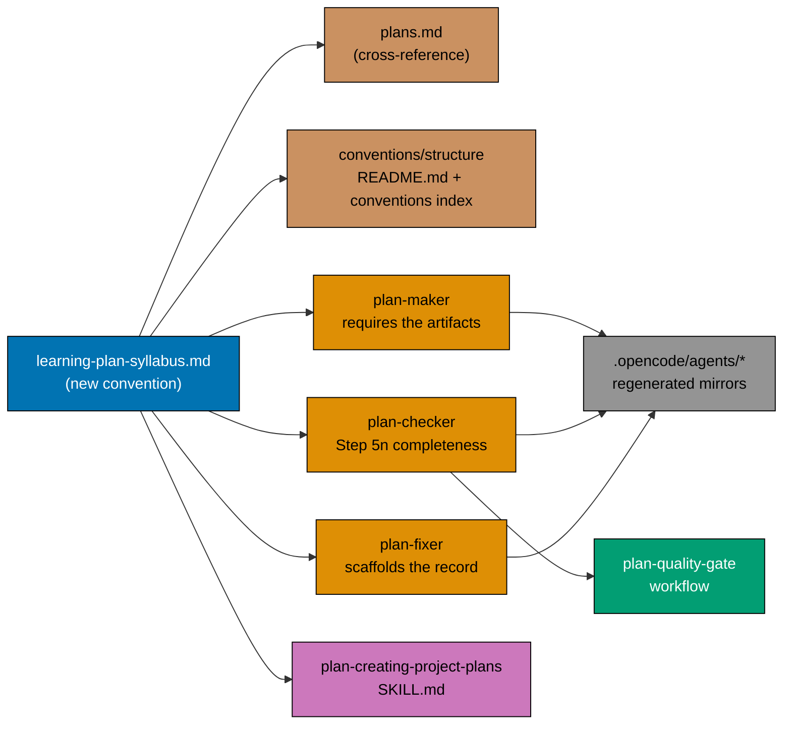
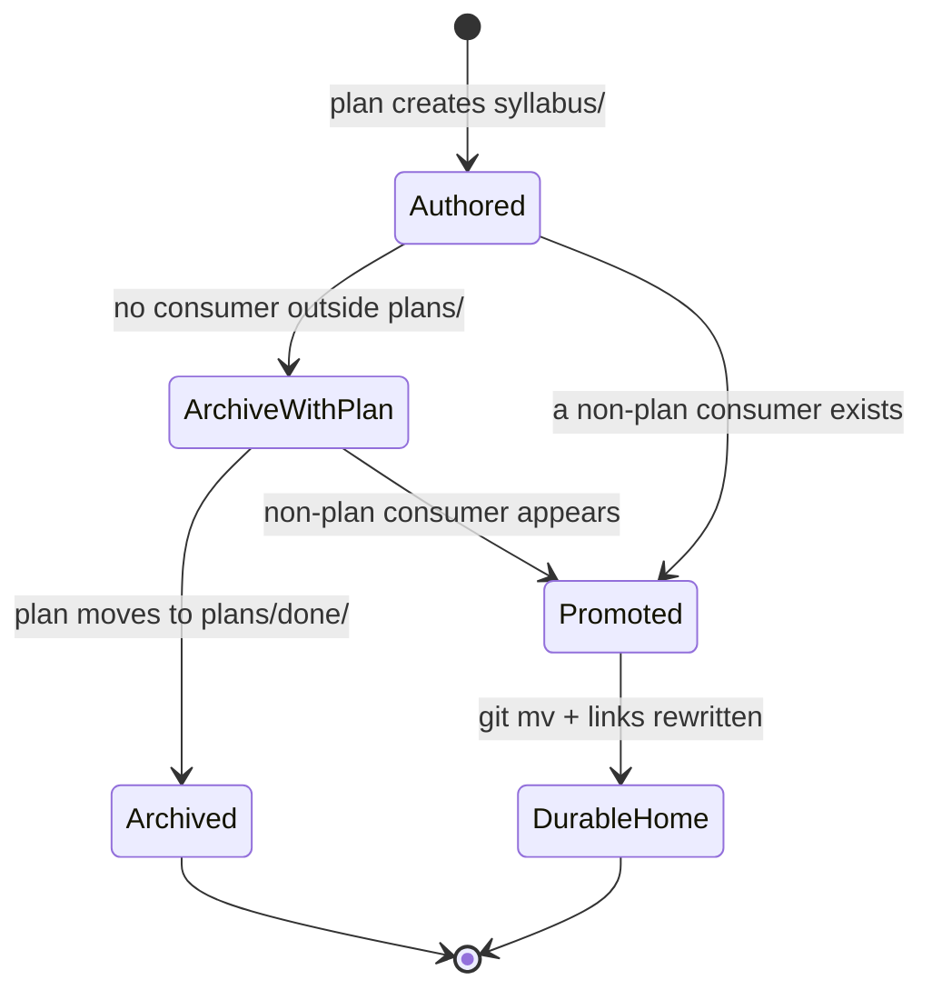
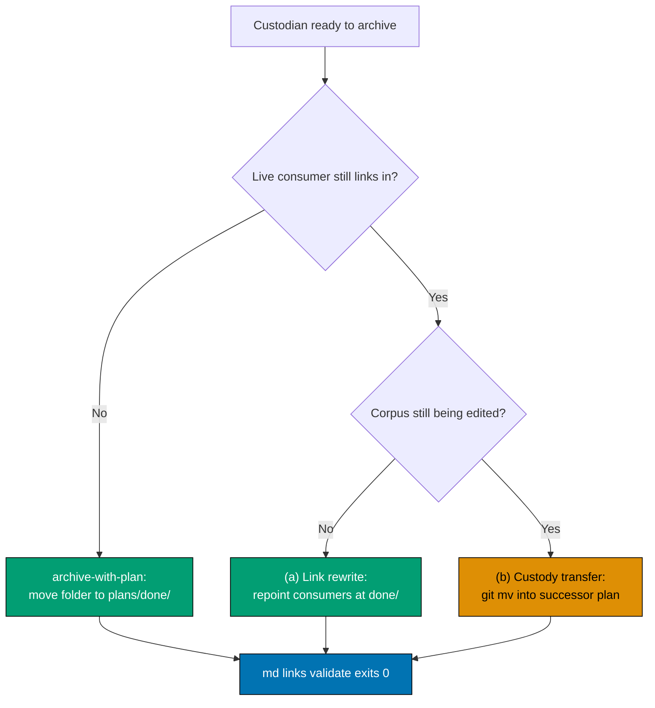

# Technical Documentation — Learning-Plan `syllabus/` Folder Convention

## Architecture

The product is a governance document plus wiring into an existing enforcement chain. Nothing here is
application or library code; there is no runtime component.



## Corpus Census — the derivation basis

Every number below was measured on commit `e398b8d39` (2026-07-22) by counting files under each
plan's `syllabus/courses/` directory, excluding `README.md` and `surgery.md` (a scope-contract
document, not a course) `[Repo-grounded]`.

**Census pin.** Corpora 06 and 07 were under active authorship on 2026-07-22 — plan 07 gained its
Quality Management course in `e398b8d39` after an earlier draft of this census was taken — so these
counts are a snapshot, not a constant. The numbers below are pinned to `e398b8d39`. Phase 1 re-runs
the per-file measurement at execution time and reconciles any drift into both this table and the
convention before reproducing it (see DD-05 and the Phase 1 census step in
[delivery.md](./delivery.md)).

### Corpus shapes

| Corpus                                                                                                                                                  | Course files | `courses/README.md` | Path manifests | `paths/README.md` |
| ------------------------------------------------------------------------------------------------------------------------------------------------------- | -----------: | ------------------- | -------------: | ----------------- |
| [`ayokoding-learning-path-02-schema-and-prerequisite-dag`](../../in-progress/ayokoding-learning-path-02-schema-and-prerequisite-dag/syllabus/README.md) |          120 | present             |              4 | present           |
| [`ayokoding-learning-path-06-skills-accounting`](../../backlog/ayokoding-learning-path-06-skills-accounting/README.md)                                  |           24 | absent              |              2 | absent            |
| [`ayokoding-learning-path-07-skills-erp`](../../backlog/ayokoding-learning-path-07-skills-erp/README.md)                                                |           30 | absent              |              2 | absent            |
| **Total**                                                                                                                                               |      **174** | 1 of 3              |          **8** | 1 of 3            |

Plan 02's 120 standalone course files plus 7 capstones embedded in host-topic files make the
**127-course catalog** its `syllabus/courses/README.md` documents `[Repo-grounded]`.

### Section frequency (the tiering evidence)

| Section / header line      | 02 (of 120) | 06 (of 24) | 07 (of 30) | Total (of 174) |    % | Tier        |
| -------------------------- | ----------: | ---------: | ---------: | -------------: | ---: | ----------- |
| `**Course ID**` line       |         120 |         24 |         30 |            174 |  100 | REQUIRED    |
| `## Why this exists`       |         120 |         24 |         30 |            174 |  100 | REQUIRED    |
| `## Prerequisites`         |         120 |         24 |         30 |            174 |  100 | REQUIRED    |
| `## In which paths`        |         120 |         24 |         30 |            174 |  100 | REQUIRED    |
| `## Accuracy notes`        |         120 |         24 |         30 |            174 |  100 | REQUIRED    |
| `**Scope note**` line      |         119 |         24 |         30 |            173 | 99.4 | REQUIRED    |
| `## Concepts`              |         119 |         24 |         30 |            173 | 99.4 | REQUIRED    |
| `## Read more`             |         114 |         24 |         30 |            168 | 96.6 | RECOMMENDED |
| `## Worked examples`       |         112 |         24 |         30 |            166 | 95.4 | RECOMMENDED |
| `**Short summary**` line   |          95 |         24 |         30 |            149 | 85.6 | RECOMMENDED |
| `## Capstone spec`         |         115 |          0 |          0 |            115 | 66.1 | OPTIONAL    |
| `## Tensions & trade-offs` |          61 |          5 |          0 |             66 | 37.9 | OPTIONAL    |
| `## Lineage`               |          62 |          0 |          0 |             62 | 35.6 | OPTIONAL    |

**Tiering rule** (DD-05): REQUIRED at ≥ 99% of all 174 files; RECOMMENDED at ≥ 80%; OPTIONAL below
that. The rule is stated so a future author can re-derive the tiers from a larger corpus rather than
inheriting a frozen list.

**Reproducing these numbers**: for each corpus, iterate the `*.md` files under `syllabus/courses/`,
skipping `README.md` and `surgery.md`, and test each file for the section with
`grep -q '<pattern>' "$file"`. Counting with a recursive `grep -rl` over the directory instead
**silently includes `README.md` and `surgery.md`** and produced a wrong figure during authoring — the
per-file loop is the reliable method.

**The only two REQUIRED-tier misses in all 174 files are the same file**:
`syllabus/courses/capstone-forge-ready.md` carries neither `**Scope note**` nor `## Concepts`
`[Repo-grounded]`. It is a capstone, a legitimate structural variant, which is why the convention
carries an explicit capstone carve-out rather than treating it as a defect.

### The measured format fork

| Cohort                                                          | Files | `co-NN` / `ex-NN` rendering   | Carries `**Short summary**` |
| --------------------------------------------------------------- | ----: | ----------------------------- | --------------------------- |
| Plan 02 — majority cohort                                       |    97 | bullets (`- **co-01 …`)       | yes                         |
| Plan 02 — divergent cohort                                      |    17 | ordered list (`1. **co-01 …`) | **no** (0 of 17)            |
| Plan 02 — capstone / AI-systems files with neither concept list |     6 | n/a                           | mixed                       |
| Plans 06 + 07                                                   |    53 | bullets                       | yes                         |

The divergent cohort's two markers coincide perfectly: **all 17** ordered-list files also omit
`**Short summary**` `[Repo-grounded]`. That coincidence is what identifies it as a separate authoring
cohort rather than 17 independent typos — and no gate in the repo noticed, because no gate knows what
a course file is. This is the plan's core justification, and it corrects a plausible-sounding but
wrong reading of the same evidence: the fork is **inside** the canonical corpus, not between plan 06
and plans 02/07. Plans 06 and 07 are uniformly bullets `[Repo-grounded]`.

## Design Decisions

> **Provenance.** This plan was promoted by an agent that had no interactive question tool, so the
> [Grilling-With-Options Convention](../../../repo-governance/development/workflow/grilling-with-options.md)'s
> mandatory pre-write and post-write grills did not run when the decisions below were first written —
> all twelve were the promoting agent's defaults. They were put to the user afterwards. `DD-07`
> (corpus disposition), `DD-08` (custody), `DD-09`/`DD-10` (checker step at HIGH, no validator) and
> `DD-11` (no retrofit) were **ratified as written**. `DD-12` was **overturned** — cross-repo
> propagation is now in scope. Recording this because a decision an agent made alone and a decision a
> human ratified are not the same artifact, and a later reader cannot otherwise tell them apart.

### DD-01 — The convention is a new standalone file, not a section of `plans.md`

`plans.md` is already 1127 lines `[Repo-grounded]` and covers the plan lifecycle generally. A
`syllabus/` rule is a self-contained artifact rule, and the sibling UI rule is likewise a section of
its own topical convention (`diagrams.md`) rather than of `plans.md` `[Repo-grounded]`.

- **Chosen**: `repo-governance/conventions/structure/learning-plan-syllabus.md`, cross-referenced
  from `plans.md §Multi-File Structure` exactly as the UI rule is.
- **Rejected — a section inside `plans.md`**: further inflates an already large document and buries
  a lookup-style rule inside a lifecycle narrative.
- **Rejected — a section inside `diagrams.md`**: that file is about visual formatting; a syllabus is
  not a diagram.

### DD-02 — The template ships as a fenced block inside the convention, not as a separate file

No `templates/` directory exists anywhere under `repo-governance/` or `.claude/` `[Repo-grounded]`.
The repo's established pattern is a copy-paste fenced block inside the governing document — the
two-pager template lives in `plans.md`, and the UI funnel record ships as a "Copy-paste example"
block in `diagrams.md` `[Repo-grounded]`.

- **Chosen**: one fenced ` ```markdown ` block containing every REQUIRED section with placeholders,
  followed by labelled RECOMMENDED and OPTIONAL blocks.
- **Rejected — a new `repo-governance/conventions/structure/templates/` directory**: invents a
  pattern with no precedent, and adds a directory the `readme-index` validator would then require an
  index for.
- **Rejected — pointing authors at an existing course file**: that is exactly the transmission
  mechanism that already failed.

### DD-03 — "Learning-bearing" is defined by delivery effect, mirroring "UI-bearing"

A plan is **learning-bearing** when its delivery checklist **authors or restructures course,
tutorial, or curriculum content** — the direct analogue of "adds or changes user-facing screens or
components under `apps/` or `libs/`". Merely citing a course, linking to one, or fixing a typo in an
existing body does not trigger it, exactly as a CSS-token bump does not trigger the UI funnel.

The convention carries worked positive and negative examples so the trigger is decidable without
judgment calls.

### DD-04 — The required layout is `syllabus/courses/` + `syllabus/paths/`, both with a README

All three corpora already use that split `[Repo-grounded]`. Only plan 02 carries `courses/README.md`
and `paths/README.md`; plans 06 and 07 carry neither `[Repo-grounded]`.

- **Chosen**: `courses/` and `paths/` are REQUIRED; `syllabus/README.md` is REQUIRED (all three have
  it); the per-subfolder READMEs are REQUIRED **for new corpora** and the two existing corpora
  without them are grandfathered — adding them is a one-line index task the `readme-index` validator
  would otherwise eventually demand anyway.
- **Rejected — making subfolder READMEs optional**: `rhino-cli md readme-index validate` flags an
  unindexed sibling file as an orphan, so a corpus without a `courses/README.md` is on borrowed time
  regardless of what this convention says `[Repo-grounded]`.

### DD-05 — Section tiering is derived from measured frequency, not designed

See the census table above. The convention states the derivation rule so the tiers can be
re-measured, and names the exact commands used, so the numbers are reproducible rather than asserted.

### DD-06 — Bullets are canonical; the 17-file ordered-list cohort is grandfathered

97 of 114 concept-bearing plan-02 files and 54 of 54 plan-06/07 files use bullets `[Repo-grounded]`;
the repo-wide markdownlint config additionally pins unordered list style to `dash` — [Repo-grounded]
via the `MD004` style setting in `.markdownlint-cli2.jsonc`. Bullets are therefore both the majority
and the house style.

Retrofitting the 17 files is explicitly out of scope, so the convention names that cohort as
grandfathered rather than pretending conformance it does not have.

### DD-07 — Corpus Disposition: the corpus stays in `plans/` by default

**This is the first of the two questions promotion had to answer.**

Every learning-bearing plan that **owns** a corpus (its custodian — see DD-08) declares, in its
`tech-docs.md`, a `## Corpus Disposition` section with exactly one value. A plan that only
**consumes** another plan's corpus is not learning-bearing in its own right (per the convention's
Learning-Bearing Trigger negative example 2) and never carries a `## Corpus Disposition` section —
instead it carries the `custodied-by:<plan-id>` echo under its own `## Corpus Custody` heading, per
DD-08:

| Value               | Meaning                                                                | Extra obligation                                                     |
| ------------------- | ---------------------------------------------------------------------- | -------------------------------------------------------------------- |
| `archive-with-plan` | **Default.** The corpus moves to `plans/done/` with the plan folder    | None                                                                 |
| `promote-to:<path>` | The corpus has a consumer outside `plans/` and moves to a durable home | A delivery step performing the move and rewriting every inbound link |



**Why the default is "stay in `plans/`"** — four grounded reasons:

1. **It mirrors the governed precedent.** Hi-fi `.excalidraw.png` mockups live in the plan's
   `assets/` and archive with the plan; nothing promotes them out `[Repo-grounded]`. A syllabus is
   the same kind of artifact — the specification a deliverable was built from.
2. **Archived plan artifacts are already treated as durable, machine-readable ground truth.**
   `web-design-tester` lists "committed plan-folder mockups" as one of its five ground-truth sources
   — [Repo-grounded] in `.claude/agents/web-design-tester.md`. "It sits in `plans/`" is therefore not
   an argument that it is dead.
3. **The durable product is the shipped course body**, under `apps/ayokoding-www/content/`
   `[Repo-grounded]`, not the syllabus. The syllabus is to the course what the mockup is to the
   screen.
4. **Moving now would cost a migration the plan explicitly excludes.** Promoting 174 files into
   `specs/` or `docs/` is precisely the retrofit the two-pager rules out, and would touch three plan
   folders under concurrent authorship.

**The promotion trigger is falsifiable, not a vibe.** A corpus MUST switch to `promote-to:` the
moment a **consumer outside `plans/`** reads it: a checker or agent, an Nx target, a build or
generation step, or shipped content front-matter that references a syllabus path. The test an author
applies is: _name the non-plan reader_. If none can be named, the disposition is `archive-with-plan`.

**This answers the two-pager's meta-question directly**: because the default keeps the corpus inside
`plans/`, this **is** a `plans/` convention — and the non-plan-consumer trigger is the written
boundary at which it would become something larger. That boundary is now documented in advance
instead of being discovered.

### DD-08 — Custody: one custodian, read-only consumers, routed change requests

**This is the second of the two questions promotion had to answer.**

Rules:

1. **Exactly one custodian per corpus.** The custodian is named in the corpus's own
   `syllabus/README.md` as a `**Custodian**: <plan-id>` line, and echoed in every consumer plan's
   `tech-docs.md` under its own `## Corpus Custody` heading as `custodied-by:<plan-id>` — distinct from
   the `## Corpus Disposition` section in DD-07, which only the owning (custodian) plan carries.
2. **Consumers are read-only.** A consumer plan links into the corpus by relative path and MUST NOT
   edit, copy, or fork any file under it. A consumer's delivery checklist containing a step that
   writes to another plan's `syllabus/` is a defect.
3. **Edits are change requests routed to the custodian.** A needed change lands as a step in the
   **custodian's** `delivery.md`. This is derived from practice, not invented: plan 02 already
   carries `syllabus/courses/surgery.md`, a register of shared-library edits that states each edit's
   blast radius across every manifest carrying the touched course `[Repo-grounded]`.
4. **Archival hand-off.** When a custodian is ready to archive while a live consumer still links into
   its corpus, the archival step MUST do one of:
   - **(a) Link rewrite (default)** — rewrite every inbound link to the corpus's new
     `plans/done/YYYY-MM-DD__<id>/syllabus/…` location. Preserves provenance; a pure link edit.
   - **(b) Custody transfer** — `git mv` the `syllabus/` folder into a named successor plan, update
     that plan's `**Custodian**` line, and rewrite inbound links. For a corpus still being actively
     edited by the successor.



**Half of this rule is already mechanically enforced.**
`rhino-cli md links validate --exclude plans/done …` runs at pre-push and in both CI workflows
— [Repo-grounded] in `.husky/pre-push`, `.github/workflows/main-ci.yml`, and
`.github/workflows/pr-quality-gate.yml`. The `--exclude plans/done` flag removes archived files as a
**scan source**, not as a link **target** — so a still-live consumer under `plans/backlog/` is scanned,
and its link into a corpus that moved without a rewrite fails the push. The convention names this
backstop explicitly, so authors learn about it before a push fails rather than after.

**Why the current programme needs this now**: plan 02 is Wave 1 while its consumers, plans 04 and 05,
are Waves 2 and 3 `[Repo-grounded]`. The custodian archives **before** its consumers finish, so
branch (a) is the live case, not a hypothetical.

### DD-09 — Enforcement lands as a `plan-checker` step numbered 5n, at HIGH

`plan-checker` currently ends its numbered conditional steps at **Step 5m (Delivery Mode
Validation)**, with 5j (specs/Gherkin), 5k (UI-design-funnel) and 5l (knowledge capture) preceding it
`[Repo-grounded]`. The learning-side check therefore takes the next free identifier, **5n**, and
mirrors 5k's severity: each missing artifact is a **HIGH** finding, and the check is **conditional**
— it fires only when the learning-bearing trigger matches, and records an explicit exemption
otherwise.

### DD-10 — No validator; a documented conformance recipe instead

The two-pager's position stands: a deterministic check should follow a settled format, not precede
it. This plan therefore ships a **runnable `grep` recipe** in the convention (an author or checker can
run it today) and files the deterministic `rhino-cli` check as a two-pager in `plans/ideas/`.

The recipe is written to be falsifiable in both directions and to avoid this repo's known `grep`
traps: `grep` here resolves to a **ugrep**-backed shell function, so `--glob VALUE` (space-separated)
does not parse and `--include=` is used instead; `-L` (files-without-match) is never used in a
pass/fail clause because it exits 0 when it finds a non-matching file; and `-c` exits 1 on a zero
count, which the recipe states explicitly as the "clean" signal where absence is the pass condition
— [Repo-grounded] via direct verification of the repo's `grep` behaviour during authoring.

### DD-11 — No retrofit of existing files

The convention is derived from the corpus, so the corpus is the reference. No delivery step edits the
body of any existing course or manifest file. The only edits to existing corpora are the
`**Custodian**` line in each `syllabus/README.md` and the `## Corpus Disposition` section in each
custodian plan's `tech-docs.md`.

### DD-12 — Cross-repo propagation is in scope, and lands in Phase 6

**Superseded during promotion review.** The original decision excluded propagation because
`ose-primer` and `ose-infra` carry no learning-bearing plan today, so "there is nothing for the rule to
govern there."

That reasoning does not hold. It conflates whether the rule has anything to **govern** in a sibling
with whether the rule's **text and enforcement** must exist there. The convention document, the two
governance index entries, the `plans.md` cross-reference, and the `plan-maker` / `plan-checker` /
`plan-fixer` edits are shared governance surfaces carried by all three repos. Leaving them out of the
siblings means `plan-maker` there emits plans that `plan-checker` here would reject — drift created by
construction, not discovered later.

Propagation therefore runs as [Phase 6](./delivery.md) of this plan, following the
[plan-multi-repo-parity-planning](../../../repo-governance/workflows/plan/plan-multi-repo-parity-planning.md)
workflow, with one worktree and one PR per sibling. The `ose-public` PR merges first; the sibling PRs
merge after it, in Phase 8.

What is **not** propagated: anything under `plans/` — the `ayokoding-learning-path-*` corpora and their
custody declarations are `ose-public` content with no counterpart in a sibling. The propagated surface
is the convention and its enforcement, nothing else.

Two constraints inherited from the siblings' topology, both verified rather than assumed: each is a
**bare** repository (`git rev-parse --is-bare-repository` reports `true`), so every git operation runs
through a worktree per the
[bare-repo landing method](../../../repo-governance/development/workflow/bare-repo-landing-method.md);
and this plan's own folder is archived inside the `ose-public` PR while sibling PRs may still be open,
a known structural limitation filed as
[plan-archival-in-pr-multi-repo-gap](../../ideas/q2-not-urgent-important/plan-archival-in-pr-multi-repo-gap.md).

## File Impact

| Path                                                                                      | Change            | Notes                                                                   |
| ----------------------------------------------------------------------------------------- | ----------------- | ----------------------------------------------------------------------- |
| `repo-governance/conventions/structure/learning-plan-syllabus.md`                         | **create**        | _New file_ — the convention, template, disposition, custody             |
| `repo-governance/conventions/structure/README.md`                                         | edit              | Index entry, alphabetical among the Documents list                      |
| `repo-governance/conventions/README.md`                                                   | edit              | Top-level convention index entry                                        |
| `repo-governance/conventions/structure/plans.md`                                          | edit              | Cross-reference beside the UI-bearing sentence in §Multi-File Structure |
| `.claude/agents/plan-maker.md`                                                            | edit              | Learning-bearing requirement + delivery steps to emit                   |
| `.claude/agents/plan-checker.md`                                                          | edit              | New Step 5n                                                             |
| `.claude/agents/plan-fixer.md`                                                            | edit              | Scaffold action for a missing syllabus record                           |
| `.claude/skills/plan-creating-project-plans/SKILL.md`                                     | edit              | Learning-bearing section beside the UI-bearing one                      |
| `repo-governance/workflows/plan/plan-quality-gate.md`                                     | edit              | Add Step 5n to the validation-scope list                                |
| `.opencode/agents/plan-{maker,checker,fixer}.md`                                          | regenerate        | Never hand-edited; produced by `npm run generate:bindings`              |
| `plans/backlog/ayokoding-learning-path-02-schema-and-prerequisite-dag/syllabus/README.md` | edit              | `**Custodian**` line                                                    |
| `plans/backlog/ayokoding-learning-path-02-schema-and-prerequisite-dag/tech-docs.md`       | edit              | `## Corpus Disposition` section                                         |
| `plans/backlog/ayokoding-learning-path-06-skills-accounting/syllabus/README.md`           | edit              | `**Custodian**` line                                                    |
| `plans/backlog/ayokoding-learning-path-06-skills-accounting/tech-docs.md`                 | edit              | `## Corpus Disposition` section                                         |
| `plans/backlog/ayokoding-learning-path-07-skills-erp/syllabus/README.md`                  | edit              | `**Custodian**` line                                                    |
| `plans/backlog/ayokoding-learning-path-07-skills-erp/tech-docs.md`                        | edit              | `## Corpus Disposition` section                                         |
| `plans/backlog/ayokoding-learning-path-04-course-authoring/tech-docs.md`                  | edit              | `custodied-by:` consumer declaration                                    |
| `plans/backlog/ayokoding-learning-path-05-manifests/tech-docs.md`                         | edit              | `custodied-by:` consumer declaration                                    |
| `plans/ideas/syllabus-conformance-validator.md`                                           | **create**        | _New file_ — the deferred deterministic check                           |
| `plans/ideas/README.md`                                                                   | edit              | Index line for the new two-pager                                        |
| `ose-primer` — same convention, index, `plans.md`, 3 plan-agents, workflow entry          | **create** + edit | Phase 6 propagation; adapted to that repo's own step numbering          |
| `ose-infra` — same set                                                                    | **create** + edit | Phase 6 propagation; record any surface that legitimately differs       |

No file under `apps/`, `libs/`, `specs/`, or any `syllabus/courses/*.md` body is modified.

## Testing Strategy

This plan ships no executable code, so there is no unit / integration / e2e tier to fill. Its
verification is entirely gate-based, and every gate below already exists:

| Acceptance concern                    | Verification                                                                                   |
| ------------------------------------- | ---------------------------------------------------------------------------------------------- |
| Markdown well-formedness              | `npm run lint:md` exits 0                                                                      |
| Cross-links resolve                   | `rhino-cli md links validate --exclude plans/done …` exits 0 (pre-push + both CI workflows)    |
| New files are indexed in their README | `rhino-cli md readme-index validate` exits 0 — catches an unindexed convention or two-pager    |
| Governance prose stays vendor-neutral | `repo-rules-checker` / the vendor-audit scanner, run as part of the quality gates              |
| Binding mirrors match their sources   | `npm run generate:bindings` then a clean `git status` for `.opencode/agents/`                  |
| The convention's own recipe works     | Running the documented recipe against each of the three corpora produces the expected verdict  |
| Gherkin scenarios in `prd.md`         | Each maps to a delivery step; the learning-bearing checker step is exercised against this plan |

## Exemptions Declared

- **UI-design funnel (`plan-checker` Step 5k)** — **exempt**. This plan adds and changes no
  user-facing screen or component under `apps/` or `libs/`; every artifact is a governance markdown
  file.
- **Specs & Gherkin delivery coverage (Step 5j)** — **exempt**. The plan creates, modifies, and
  deletes no observable behavior under `apps/`, `libs/`, or `specs/`. No `specs:coverage` obligation
  arises.
- **Manual behavioral verification (Playwright MCP / curl)** — **exempt**. No UI surface and no API
  endpoint is touched, so there is nothing to drive a browser or `curl` against.
- **Rule-15 three-tester retest / Rule-16 API exploratory retest** — **exempt**, for the same
  reason: no web UI feature change and no API feature change.
- **Regression test mandate** — **not applicable**. This plan fixes no bug in executable code; the
  defect it addresses is an absent convention.

## Rollback

Every change is additive markdown or a one-line index edit, so rollback is a revert of the plan's
commits. Specifically:

1. Deleting `repo-governance/conventions/structure/learning-plan-syllabus.md` and its three index
   references returns the tree to its current state; `md readme-index validate` stays green because
   the file and its index line disappear together.
2. Reverting the agent/skill/workflow edits and re-running `npm run generate:bindings` restores the
   mirrors deterministically.
3. The `**Custodian**` lines and `## Corpus Disposition` sections in the learning-path plans are
   additive text; removing them affects nothing else.

No data migration, no schema change, no deployed surface is involved.

## Related Documents

- [README.md](./README.md) — context, scope, and the dependency/delivery diagrams
- [brd.md](./brd.md) — business rationale and the observable success checks
- [prd.md](./prd.md) — personas, user stories, and the Gherkin acceptance criteria
- [delivery.md](./delivery.md) — the phased execution checklist
- [UI Mockups in Plan Docs](../../../repo-governance/conventions/formatting/diagrams/ui-mockups-principles-and-scope.md#ui-mockups-in-plan-docs-principles-in-practice-and-scope)
  — the governed precedent whose shape this mirrors
- [plan-doc-ui-mockup-convention](../../done/2026-06-16__plan-doc-ui-mockup-convention/README.md) —
  the completed plan that closed this same class of gap for UI
