# Delivery Checklist — ayokoding-www Learning-Path URL Restructure

> **Programme decisions** — the `R*` rules and `A*` amendments cited below are defined locally in
> [tech-docs.md § Programme decisions](./tech-docs.md#programme-decisions), folded in and owned by
> this plan.

Executable checklist for the **URL and IA layer**: the `courses/` and `paths/` content homes, the
re-home of 37 shipped bundles with their per-course 308s, the six-domain relocation into `legacy/`
with its 12-rule redirect module, and Screen 4's design funnel. Requirements live in
[brd.md](./brd.md) and [prd.md](./prd.md); the technical approach, all ten owned design decisions,
and the six open questions live in [tech-docs.md](./tech-docs.md).

> **Legend** — `[AI]`: an agent performs the step (the default; unmarked steps are `[AI]`).
> `[HUMAN]`: only a human can do it (physical action, out-of-band approval, real-secret or
> privileged-credential handling). `[AI+HUMAN]`: agent prepares, human approves or finishes.
> Git-mechanical steps (worktree create/remove, branch, push, merge) are `[AI]`.
>
> **Phase Gate** — every phase ends with a `### Phase N Gate` (must-pass verification) plus a
> `> **Pause Safety**:` note (safe-to-stop state + resume command). Each gate covers the phase's
> **content/code correctness** (tests, checkers, build) and its **integration** (draft PR opened,
> 3-cycle PR-Review, CI green, `[AI]` merge, `ayokoding-www` deployed). A phase is not complete until
> every gate check is green.
>
> **This plan uses no `[HUMAN]` steps.** Every step below is `[AI]`, including worktree
> provisioning, commit, push, PR merge, and worktree removal.

## Worktree

Worktree path: `worktrees/ayokoding-learning-path-01-url-restructure/`

Optional manual pre-provisioning (run from repo root):

```bash
claude --worktree ayokoding-learning-path-01-url-restructure
```

The plan-execution Step 0 gate enters this worktree by default: it auto-provisions from the latest
`origin/main` when missing, syncs with `origin/main` before implementing, and prompts before deleting
the worktree after the plan is archived and pushed.

Every phase branches from the **latest `origin/main`** inside this worktree
(`git fetch origin && git checkout main && git pull && git checkout -b ayokoding-learning-path-01-url-restructure/<phase-slug>`),
authors its work there, commits, pushes that branch, and opens **its own draft PR**.

See [Worktree Path Convention](../../../repo-governance/conventions/structure/worktree-path.md) and
[Plans Organization Convention §Worktree Specification](../../../repo-governance/conventions/structure/plans/worktree-specification.md#worktree-specification).

## Delivery Mode: worktree-to-pr

Each phase works in this worktree on its **own branch**, opens a **draft PR** against `main`, runs the
**PR-Review Maker→Fixer Cycle** (`pr-review-maker` / `pr-review-fixer`, 3 sequential CI-gated cycles),
flips the PR to ready, and `[AI]` **merges it automatically once all quality gates are green** — then
`[AI]` **deploys `ayokoding-www` to `prod-ayokoding-www` after every merge** (this plan ships to
ayokoding.com). See
[Plans Organization Convention §Delivery Mode](../../../repo-governance/conventions/structure/plans/delivery-mode-the-four-modes.md#delivery-mode)
and the [PR Review Quality Gate workflow](../../../repo-governance/workflows/pr/pr-review-quality-gate.md).

> **DN-11 DECIDED — `[AI]` auto-merge (now the repo default)**: the repo's
> [PR Merge Protocol](../../../repo-governance/development/workflow/pr-merge-protocol.md) has `[AI]`
> merge the PR **by default** once its five hardened preconditions hold; a `[HUMAN]` merge gate is an
> explicit per-plan opt-in, and this plan does not opt in. When DN-11 was first recorded the protocol
> still defaulted to a `[HUMAN]` merge, so the maintainer authorized `[AI]` merge for this plan
> specifically (2026-07-18, in-session — modeled on the sibling plan
> `fundamentally-strong-software-engineer`'s own separately-recorded authorization) via two directives:
> (a) this plan uses the SAME delivery methods as the sibling plan, and (b) no maintainer permission is
> needed to merge a PR once it has passed 3 review cycles and the PR quality gate. The protocol has
> since been changed to match, so **DN-11 = AI-auto-merge** now simply confirms the repo default rather
> than deviating from it. The preconditions are unchanged either way — only the actor differs.

**Per-Phase Integration Protocol** (each phase's gate lists these as must-pass):

1. [AI] Sync the worktree to latest `origin/main` and branch:
   `git fetch origin && git checkout main && git pull && git checkout -b ayokoding-learning-path-01-url-restructure/<phase-slug>`.
2. [AI] Stage only this phase's paths (`git add <explicit paths>` — never `git add -A`), commit
   thematically (Conventional Commits, imperative, no period), push the branch, open a **draft PR**
   against `main` (`gh pr create --draft --base main ...`) — CI runs on the PR.
3. [AI] Run the **PR-Review Maker→Fixer Cycle** (3 sequential CI-gated cycles), resolve every finding,
   then `gh pr ready`.
4. [AI] **Merge** once all quality gates are green (typecheck, lint, `test:quick`, `test:unit`,
   `test:e2e` in the paired `ayokoding-www-fe-e2e` project, `specs:behavior:coverage`, CI, the 3-cycle
   review) — `[AI]` auto-merge per DN-11.
5. [AI] Dispatch `apps-ayokoding-www-deployer` to deploy `ayokoding-www` to `prod-ayokoding-www` — a
   no-op redeploy for plan-side-only phases.

## Cross-plan sequencing

This plan is **Wave 1** with **no upstream prerequisite** — it may start immediately. Its downstream
consumers, its handoff signal, and the Wave-1 sibling coordination note are in
[README §Implementation Sequence and Prerequisites](./README.md#implementation-sequence-and-prerequisites).

> **Concurrency note.** `ayokoding-learning-path-02-schema-and-prerequisite-dag` runs in the same
> wave and touches `apps/ayokoding-www/src/features/course-paths/` — a subtree this plan never
> touches. The two plans' file sets are disjoint, so their PRs merge in either order. Both plans do
> edit the **prerequisite frontmatter contract's meaning**: this plan writes the field into 37
> `_index.md` files while the sibling writes its parser. If the two disagree, **the sibling's shape
> wins** — see [tech-docs §Prerequisite frontmatter contract](./tech-docs.md#prerequisite-frontmatter-contract-reproduced-verbatim-canonical-owner-is-the-schema-plan).

## Parallelization Model

**Cap**: honor the in-force subagent/PR-review concurrency cap (parallel-by-default, background
subagents capped per the orchestration convention). The main thread self-promotes nothing.

- **Phases 0 → 1 → 2 → 3 are strictly serial.** Each is a sync point for the next: Phase 1 creates the
  namespace Phase 2 moves bodies into; Phase 2 must land so `en/learn/` is never transiently
  `legacy/`-only; Phase 3's six `git mv`s and its redirect module must land together (a live 308
  pointing at a not-yet-moved path 404s, and a moved path with no 308 breaks ~1,148 URLs — neither
  half is a safe stopping state).
- **Phases 4 → 5 → 6 → 7 → 8 are serial finalization.**
- **No phase in this plan fans out.** The work is one content tree and one redirect chain; splitting a
  phase across concurrent agents would produce merge conflicts in `next.config.ts` and in the same
  `_index.md` files for no throughput gain.

**Path constants** (referenced throughout — reproduced **verbatim** from the source plan so the
constant vocabulary is byte-identical across all five split plans; entries this plan does not itself
use are retained deliberately, not pruned):

- `<COURSES>` = `apps/ayokoding-www/content/en/learn/courses/` (course bundles; served at `/en/learn/courses/<course-id>`)
- `<PATHS>` = `apps/ayokoding-www/content/en/learn/paths/` (thin path-landing anchors; served at `/en/learn/paths/<path-id>`)
- `<SE_OLD>` = `apps/ayokoding-www/content/en/learn/fundamentally-strong/software-engineer/` (legacy home of the 33 shipped topics + 4 existing capstones, incl. `capstone-solid-core` — the re-home source)
- `<FEAT>` = `apps/ayokoding-www/src/features/course-paths/`
- `<MANIFESTS>` = `<FEAT>manifests/` (standalone YAML data files, nested to mirror slash path ids — `<MANIFESTS><path-id>.yaml`)
- `<LEGACY>` = `apps/ayokoding-www/content/en/learn/legacy/` (**new bucket**, scope extension; served at `/en/learn/legacy/<domain>/…`)
- `<REDIR>` = `apps/ayokoding-www/src/redirects/`
- `<SPECS>` = `specs/apps/ayokoding/behavior/ayokoding-www/gherkin/course-paths/`
- `<NAVSPECS>` = `specs/apps/ayokoding/behavior/ayokoding-www/gherkin/navigation/` (existing domain — the three-bucket Gherkin lands beside `content-namespace-redirects.feature`)
- Path ids: `careers/interview-ready/software-engineer`, `careers/immediately-effective/software-engineer`, `careers/fundamentally-strong/software-engineer`, `careers/immediately-effective/ai-engineer` (fourth path — id renamed from the dead `software-engineer-to-ai-engineer` 2026-07-21; no longer assumes a prior software-engineering role, so a role-transition-shaped id was factually wrong; manifest at `<MANIFESTS>careers/immediately-effective/ai-engineer.yaml`)

---

## Phase 0: Environment Setup & Baseline

> _Executor: repo-setup-manager_
>
> **No cross-plan precondition.** This plan is Wave 1 with no upstream. The sibling FS-SE plan is
> CLOSED (`plans/done/2026-07-19__fundamentally-strong-software-engineer/`); there is **no "FS-SE must
> be DONE first" gate**. Only the 33 shipped topics (1–33) + 4 existing capstones (incl.
> `capstone-solid-core`, per **DD-20**) live under `<SE_OLD>` and are re-homed in Phase 2 — the other
> 61 transferred topics have no legacy home and are authored NATIVE by
> `ayokoding-learning-path-04-course-authoring`.

- [x] [AI] Enter/provision the worktree and install dependencies in the root worktree: `npm install`
      — acceptance: exits 0, `node_modules/` synchronized.
- [x] [AI] Converge the toolchain in the root worktree: `npm run doctor -- --fix`
      — acceptance: exits 0 with no unresolved drift.
- [x] [AI] Establish baselines: `npx nx run ayokoding-www:build` and
      `npx nx run ayokoding-www:test:unit`
      — acceptance: both exit 0; record the pass state and any preexisting failure in
      `evidence/phase-0-snapshot.txt`. Resolve every preexisting failure before Phase 1 (Root Cause
      Orientation).
- [x] [AI] **Re-home source inventory (non-blocking snapshot)** — record the 33 shipped topics + 4
      existing capstones present under `<SE_OLD>` to `evidence/phase-0-snapshot.txt` via:
      `for s in just-enough-nvim just-enough-lua extending-neovim just-enough-python just-enough-bash version-control-and-git data-structures-and-algorithms-essentials advanced-algorithms object-oriented-programming-essentials object-oriented-design-and-patterns sql-essentials technical-communication just-enough-typescript frontend-essentials backend-essentials networking-essentials computer-science-foundations computer-architecture programming-paradigms functional-programming concurrency-and-parallelism advanced-networking advanced-sql-and-query-performance data-access-orms-and-query-builders build-your-own-orm-and-query-builder software-engineering-practices agentic-coding security-essentials software-testing debugging-and-profiling software-product-engineering engineering-management project-management capstone-forge-ready capstone-first-working-software capstone-full-stack-app capstone-solid-core; do test -d "<SE_OLD>$s" || echo "ABSENT $s"; done`
      — acceptance: snapshot committed. Any `ABSENT` line is recorded (not a hard stop) and reconciled
      against [tech-docs §Ground-truth inventory](./tech-docs.md#ground-truth-inventory-measured-2026-07-21-re-verified-at-authoring)
      before Phase 2. **This list is the authoritative re-home set** — the Phase 2 move loop and the
      `course-rehome.ts` rule table both derive from it, so a divergence discovered later is a
      correctness bug in both.
- [x] [AI] Confirm the source directory holds exactly the expected shape —
      `ls apps/ayokoding-www/content/en/learn/fundamentally-strong/software-engineer | wc -l`
      — acceptance: returns **39** (`_index.md` + `overview.md` + 37 course-shaped directories). A
      different number means the re-home set above is stale; reconcile before Phase 2. Falsifiable
      both ways: after Phase 2 the same command returns **2**.
- [x] [AI] **Freeze the re-home set as a machine-readable list** — write the reconciled 37 slugs, one
      per line, to `evidence/phase-0-rehome-slugs.txt` via
      `ls -d apps/ayokoding-www/content/en/learn/fundamentally-strong/software-engineer/*/ | xargs -n1 basename > evidence/phase-0-rehome-slugs.txt`
      — acceptance: `wc -l < evidence/phase-0-rehome-slugs.txt` returns **37**, and every line also
      appears in the inventory loop above. This file is what the Phase-2 move loop and
      `REHOMED_COURSE_SLUGS` are both checked against, so the two can never drift apart silently.
- [x] [AI] Snapshot the existing `content-url.ts` / `prev-next.tsx` / `breadcrumb.tsx` /
      `tree-builder.ts` behavior and the current `next.config.ts` redirect spread order into
      `evidence/phase-0-snapshot.txt` — acceptance: snapshot committed, including the verbatim current
      `redirects()` return expression (the Phase 3 ordering check diffs against it).
- [x] [AI] **Legacy-bucket source inventory (DD-40)** — record the per-domain `.md` counts under
      `apps/ayokoding-www/content/en/learn/` to `evidence/phase-0-snapshot.txt` via:
      `for d in fundamentally-strong software-engineering artificial-intelligence information-security personal-development it-governance business; do printf '%s %s\n' "$d" "$(find apps/ayokoding-www/content/en/learn/$d -name '*.md' | wc -l)"; done`
      — acceptance: snapshot committed and matches the stated baseline (562 / 979 / 55 / 51 / 50 / 9 /
      4; the six relocated domains sum to **1,148** — `fundamentally-strong`'s 562 is not part of that
      sum; reconciled from a stale 563 at Phase 0, 2026-07-23). A divergence is recorded and reconciled against
      [tech-docs §Ground-truth inventory](./tech-docs.md#ground-truth-inventory-measured-2026-07-21-re-verified-at-authoring)
      before Phase 3 — it is not a hard stop here, but **every 1148 assertion downstream must be
      updated together** if the baseline moved.
- [x] [AI] **Collision + `id` baseline check** —
      `test -e apps/ayokoding-www/content/en/learn/legacy && echo "EXISTS legacy"; test -e apps/ayokoding-www/content/en/learn/courses && echo "EXISTS courses"; test -e apps/ayokoding-www/content/en/learn/paths && echo "EXISTS paths"; test -e apps/ayokoding-www/src/redirects/learn-three-bucket.ts && echo "EXISTS bucket-module"; test -e apps/ayokoding-www/src/redirects/course-rehome.ts && echo "EXISTS rehome-module"; find apps/ayokoding-www/content/id/belajar -name '*.md' | wc -l`
      — acceptance: zero `EXISTS` lines (no bucket, no content home, neither redirect module exists
      yet), and the `id/belajar` count (**53** today) is recorded so the `en`-only scoping (DD-45) is
      verifiable as unchanged at archival. Falsifiable both ways: after Phase 3 the first three
      `test -e` checks all print their `EXISTS` line.
- [x] [AI] **Alert-primitive baseline (DD-44 no-net-new-component anchor)** — record the count of
      component files matching `alert*.tsx` to `evidence/phase-0-snapshot.txt` — command (single line):
      `git ls-files -- 'libs/web-ui/src/**/alert*.tsx' 'apps/ayokoding-www/src/**/alert*.tsx' | grep -c .`
      — acceptance: returns **4** today [Repo-grounded — measured 2026-07-22: all four sit in
      `libs/web-ui/src/components/alert/` (`alert.tsx`, `alert.stories.tsx`, `alert.test.tsx`,
      `alert.steps.tsx`) and none under `apps/ayokoding-www/src`], and the number is written into the
      snapshot. **§3.4 check (c) compares against this recorded number** — without it that check has
      nothing to compare to and passes vacuously.
      **Why `git ls-files` here — and why `find … | wc -l` elsewhere in this plan is still fine.**
      This clause needs a `**`-glob spanning two unrelated roots, which `git ls-files` expands itself
      from its own quoted pathspecs; the patterns must therefore stay **quoted** so zsh never sees
      them. That is a convenience, not a rescue: the `find … | wc -l` counts used throughout the rest
      of this checklist are **sound as written**. The RTK hazard is real but is scoped to a shape no
      acceptance clause in this plan uses — see the rule below.
      **The bare-versus-piped rule.** The Claude Code hook rewrites a **bare** `find` (one whose
      output is not piped) to `rtk find`, and RTK then replaces the file list with a compact report —
      `2F 1D:`, a blank line, then `./ a.yaml b.yaml` for two matches, or the single line
      `0 for '<pattern>'` for none. A line count over that reads _format_ lines, not matches: a
      wrong-but-plausible number, which is worse than an error. Worse still for an **enumeration**: the
      report lists only the first 50 matches, ends with `+N more`, and elides the middle of long paths
      with `...`, so the output is unusable as a work list. A **piped** `find … | wc -l` is not
      rewritten and returns real `find` output.
      **Every `find` in this plan must therefore reach the hook in a suppressing shape — piped, or
      wrapped in a `$(…)` substitution — including the ones used to enumerate rather than to count.**
      An earlier revision of this line asserted they all already were; that was false. §3.1's
      `_index.md` enumeration was bare and silently truncated to 50 of 139 entries, and now carries an
      explicit `| sort`. The six `[ -z "$(find … -newer …)" ]` freshness checks in §3.4 are already safe,
      because `$(…)` suppresses the rewrite exactly as a pipe does. Treat this as a standing invariant
      to re-check whenever a new `find` is added, not as a one-time repair.
      [Repo-grounded — measured 2026-07-22, each command issued **alone as the whole content of one
      call**: `git ls-files … | grep -c .` read **4**; `find <dir> -name '*.yaml' | wc -l` read the
      true **2**, and the same query over an empty directory read the true **0**. The reformatted
      report reproduces under a bare `find` or an explicit `rtk find`, not under the piped form.
      **This citation deliberately reports single-issue measurements rather than repetition counts.**
      An earlier revision cited "10 of 10" and "40 of 40" runs gathered inside `for` loops — but a
      loop, a `$(…)` substitution, a subshell `( … )`, and a redirection to a file each **suppress**
      the hook, so those samples measured the wrapper, not the clause. The conclusion for `find`
      survived re-measurement; the same wrapper error led the parallel note in §3.4 to a **wrong**
      conclusion about `git diff`, which is filtered even when piped. Never treat `find` and
      `git diff` as following one rule.]
      `grep -c` exits 1 on a zero count — read the printed number, never `&&`-chain it. Falsifiable both ways: a number other than 4 means the
      primitive set moved since authoring and §3.4's expected value must be updated with it, not
      silently re-baselined; **0** means the pattern stopped matching and the check has gone vacuous.
- [x] [AI] Confirm `learnings.md` scaffold exists in the plan folder — acceptance:
      `test -f plans/in-progress/ayokoding-learning-path-01-url-restructure/learnings.md` returns 0 and
      the file opens with its H1.

### Phase 0 Gate

> All checks below must pass before starting Phase 1.

- [x] [AI] `npm install` exited 0 and `npm run doctor -- --fix` reports no unresolved drift.
- [x] [AI] `npx nx run ayokoding-www:build` and `:test:unit` exit 0; every preexisting failure is
      resolved (zero unresolved).
- [x] [AI] `evidence/phase-0-snapshot.txt` is committed and carries: the 37-slug re-home inventory
      (zero unreconciled `ABSENT` lines), the seven per-domain `.md` counts summing the six relocated
      domains to **1148**, the `id/belajar` count of **53**, the `alert*.tsx` primitive count of **4**
      (§3.4 check (c)'s comparison anchor), and the verbatim current `redirects()` spread order.
- [x] [AI] Zero collision lines: neither content home, neither redirect module, and no `legacy/`
      bucket exists yet.

**Phase 0 execution notes (2026-07-23) — Status: PASS.** Executor: `repo-setup-manager` (background
agent). Evidence written: `evidence/phase-0-snapshot.txt` (9 labelled sections),
`evidence/phase-0-rehome-slugs.txt` (37 slugs, set-identical to the inventory loop). `npm install`
exit 0; `doctor --fix` 16/16 tools OK; `nx build` (1854 static pages) + `test:unit` (2619 pass, 6
skip, 0 fail) both exit 0 — **no preexisting failures**. Gate assertions all matched **except**
`fundamentally-strong` `.md` = **562**, not the 563 in tech-docs' ground-truth table — verified as
stale (git ls-files=562, no deletions in git log), **reconciled this session** (tech-docs table + tree

- delivery baseline string). Independent facts: six-domain sum **1148** exact; `id/belajar` **53**;
  alert primitives **4**; zero collisions; 37-slug rehome inventory 0 `ABSENT`. **Env hazard found:**
  `ls` is aliased to `eza --icons --hyperlink` — piping it through `xargs` embeds OSC-8 escapes and
  corrupts the output; later `ls … | xargs` steps must use `/bin/ls` (logged to `learnings.md`, distinct
  from the plan's `find`/RTK hazard).

> **Pause Safety**: only the toolchain was verified and the baseline recorded — no content moved, no
> code written, no URL changed. Safe to stop indefinitely. To resume:
> `npx nx run ayokoding-www:build && npx nx run ayokoding-www:test:unit` and re-read
> `evidence/phase-0-snapshot.txt`.

---

## Phase 1: Library + paths content homes (all structural indexes, A3)

> _Suggested executor: `apps-ayokoding-www-general-maker`_ (seven `_index.md` section landings
> mirroring an existing section index).
>
> **Boundary note (BF-3).** This step is **owned by this plan**, not by the schema or navigation-ui
> plans. The source plan located it inside a phase that otherwise belongs to
> `ayokoding-learning-path-02-schema-and-prerequisite-dag`; as written, Phase 2's re-home would have
> had nowhere to move bodies into and Phase 3's structural gate would have been unsatisfiable. See
> [README §Provenance](./README.md#provenance--where-this-plan-came-from).
>
> **Boundary note (A3, DD-49).** This phase also creates every structural index under `<PATHS>` —
> not just `<PATHS>_index.md` — per amendment A3 (2026-07-21). Creating a bucket is IA work, so it
> belongs in the same phase and the same step as the other two content homes, not scattered across a
> later phase or left to a sibling plan. See
> [tech-docs.md's structural-indexes section](./tech-docs.md#structural-indexes-under-paths--ownership-and-the-empty-interval-dd-49).

- [x] [AI] **Library + paths content homes** — create `<COURSES>_index.md` _(New file)_ (library
      landing, `title` + `weight` + `date` + `draft: false`) and `<PATHS>_index.md` _(New file)_ (paths
      hub / choose-a-path landing whose grid layout grows to fit the current path roster, populated
      as each ships), both mirroring the frontmatter shape of an existing section `_index.md` such as
      `apps/ayokoding-www/content/en/learn/_index.md` — acceptance: `test -f <COURSES>_index.md` and
      `test -f <PATHS>_index.md` both return 0 (both return non-zero before this step, verified in
      Phase 0's collision check), and `npx nx run ayokoding-www:build` exits 0.
- [x] [AI] **Five more structural indexes under `<PATHS>` (amendment A3, DD-49)** — create
      `<PATHS>careers/_index.md`, `<PATHS>careers/interview-ready/_index.md`,
      `<PATHS>careers/immediately-effective/_index.md`,
      `<PATHS>careers/fundamentally-strong/_index.md`, and `<PATHS>skills/_index.md` (all five
      `_(New file)_`), each mirroring `<PATHS>_index.md`'s frontmatter shape (`title` + `weight` +
      `date` + `draft: false`) plus a one-sentence **`description` frontmatter field** — see the
      generate-indexes reconciliation note below (see
      [tech-docs.md's structural-indexes section](./tech-docs.md#structural-indexes-under-paths--ownership-and-the-empty-interval-dd-49);
      the empty-state's actual **design** belongs to `ayokoding-learning-path-03-navigation-ui`, not
      authored here — this plan writes only a title and a `description` sentence, no component, no
      mockup). This plan creates every **structural index** (a bucket) under `<PATHS>`; it never
      creates a **path landing** (the leaf a manifest-owning plan populates) — command:

  > **Generate-indexes reconciliation (RESOLVED 2026-07-23).** `generate-indexes` (a mandated Phase-1
  > step) rewrites every `isSection` `_index.md` **body** from its live children and `validate-indexes`
  > gates that the file equals that output — so a **markdown-body sentence physically cannot survive**
  > in a childless section (four of these five have zero children until a manifest publishes). The
  > original "one sentence of body prose" instruction and the "validate-indexes must pass" instruction
  > are therefore mutually exclusive for childless buckets. Reconciliation: the sentence lives in a
  > **`description:` frontmatter field**, which `rebuildIndexFile` preserves verbatim across
  > regeneration [Repo-grounded — `index-generator.ts` keeps `rawFm` and only rewrites the body]. Each
  > structural index still **renders as a real titled page** — `<h1>{title}</h1>` + breadcrumb +
  > prev/next, never a 404 and never a synthesized `weight: 0` phantom node (that is R7's actual
  > concern). The `description` currently feeds `<meta>`/SEO only; surfacing it (or any other) as a
  > **visible** empty-state is `ayokoding-learning-path-03-navigation-ui`'s render-layer job, exactly
  > as this plan already defers the empty-state design to it.

  ```bash
  STRUCTIDX=(
    "apps/ayokoding-www/content/en/learn/paths/careers/_index.md"
    "apps/ayokoding-www/content/en/learn/paths/careers/interview-ready/_index.md"
    "apps/ayokoding-www/content/en/learn/paths/careers/immediately-effective/_index.md"
    "apps/ayokoding-www/content/en/learn/paths/careers/fundamentally-strong/_index.md"
    "apps/ayokoding-www/content/en/learn/paths/skills/_index.md"
  )
  for f in "${STRUCTIDX[@]}"; do test -f "$f" || echo "MISSING $f"; done
  ```

  — acceptance: the loop prints nothing (all five exist; falsifiable both ways — today, before this
  step, it prints all five `MISSING` lines, verified live), AND each file carries a non-empty
  `description:` frontmatter field (the reconciled home for the sentence, since a body sentence cannot
  survive `generate-indexes` — see the reconciliation note above) —
  `for f in "${STRUCTIDX[@]}"; do grep -q '^description:.*[A-Za-z]' "$f" || echo "NODESC $f"; done`
  prints nothing (falsifiable both ways — a stub with no `description` prints `NODESC <path>`), AND
  `npx nx run ayokoding-www:validate-indexes` and `npx nx run ayokoding-www:build` both exit 0 (proving
  the `description` survives regeneration and the pages build).

  **Gherkin (binds) →** "Every structural index under paths renders before its subject is populated"

  ```gherkin
  Scenario: Every structural index under paths renders before its subject is populated
    Given the six structural indexes under paths have been created and no subject manifest has published yet
    When a reader requests any of the paths, paths/careers, paths/careers/<arc>, or paths/skills URLs
    Then each request serves a real titled page (title heading, breadcrumb, prev/next), never a 404 and never a synthesized weight:0 phantom node
    And each such index carries a description sentence in frontmatter (the visible empty-state design is deferred to the navigation-ui plan)
  ```

- [x] [AI] **Set explicit weights so the bucket order is `paths`, `courses`, `legacy`** — give
      `<PATHS>_index.md` the lowest `weight` and `<COURSES>_index.md` the next, leaving headroom above
      both for the Phase 3 `<LEGACY>_index.md`; give the five new structural indexes explicit,
      distinct `weight` values too — `<PATHS>careers/_index.md` before `<PATHS>skills/_index.md`
      among `paths/`'s own children, and each arc ordered `interview-ready` →
      `immediately-effective` → `fundamentally-strong` among `careers/`'s children, matching this
      plan's own DL-7 build-order citation for the arcs — acceptance: all seven files (the two
      content homes plus the five new structural indexes) carry explicit, distinct `weight` values
      among their respective siblings; the two content-home values stay strictly less than the value
      Phase 3 will assign to `legacy`. Rationale: `buildTreeForLocale` sorts siblings by `weight` and
      synthesizes `weight: 0` for any missing ancestor [Repo-grounded —
      `apps/ayokoding-www/src/features/content/core/tree-builder.ts`], so leaving weights implicit
      makes sidebar order an accident of file order — the same reasoning that already governs
      `<PATHS>_index.md` and `<COURSES>_index.md` applies identically to every sibling set this step
      introduces.
- [x] [AI] Regenerate the derived indexes so the seven new content nodes enter the tree:
      `npx nx run ayokoding-www:generate-indexes` then `npx nx run ayokoding-www:validate-indexes`
      — acceptance: both exit 0 (the second proves regeneration converged).
- [x] [AI] Run the local quality gates and the [Per-Phase Integration Protocol](#delivery-mode-worktree-to-pr)
      — acceptance: gates green; draft PR opened, reviewed, merged, deployed. **Done 2026-07-23**:
      gates green (build 1854 pages / typecheck / lint / test:quick); draft PR #83 opened, 3-cycle
      review complete, CI green, `[AI]`-squash-merged to `origin/main` @ `00c7106dc`; deployed to
      `prod-ayokoding-www` @ `00c7106dc` (first deploy caught a stale-ref regression, re-deployed the
      correct SHA and hard-verified prod == main with the Phase-1 `courses/_index.md` blob present).

### Phase 1 Gate

> All checks below must pass before starting Phase 2.

- [x] [AI] `test -f apps/ayokoding-www/content/en/learn/courses/_index.md` and
      `test -f apps/ayokoding-www/content/en/learn/paths/_index.md` both return 0 — both returned
      non-zero at Phase 0.
- [x] [AI] **All six structural indexes under `paths/` exist (amendment A3, DD-49)** —
      `find apps/ayokoding-www/content/en/learn/paths -name _index.md | wc -l` returns **6**.
      Falsifiable both ways: it returns **0** at Phase 0 (the directory does not exist yet), and it
      would return **5** or fewer if any arc or category index were missed.
- [x] [AI] Both content-home files carry explicit, distinct `weight` values leaving headroom for
      `legacy`; the five new structural indexes carry explicit, distinct `weight` values among their
      own siblings (§Set explicit weights above).
- [x] [AI] `npx nx run ayokoding-www:build` + `:typecheck` + `:validate-indexes` exit 0.
- [x] [AI] Draft PR opened; 3-cycle PR-Review complete; CI green; PR `[AI]`-merged; deployed.
      **Done 2026-07-23**: PR #83 (bundled plan-setup + Q-D/Q-E overrides + Phase 0 + Phase 1);
      cycle 1 found 2 MEDIUM (stale `1,713` total; DD-49 body-sentence wording) both fixed,
      cycles 2-3 clean sign-off; squash-merged @ `00c7106dc`; deployed to prod (verified).

**Phase 1 execution notes (2026-07-23) — content complete, PR pending.** Executor:
`apps-ayokoding-www-general-maker` (background) + orchestrator reconciliation. Created 7 `_index.md`
files: `courses/` (weight 95) + `paths/` (90) content homes, and the five structural indexes
`paths/careers` (10) / `careers/interview-ready` (10) / `careers/immediately-effective` (20) /
`careers/fundamentally-strong` (30) / `paths/skills` (20) — all with explicit distinct weights below
the existing `en/learn` domain weights (102–107) so `legacy` has headroom above 95. **DD-49
reconciliation applied**: `generate-indexes` erases childless-section bodies (and `validate-indexes`
gates it), so the required sentence was moved into a `description:` frontmatter field on all 7 (the
generator preserves frontmatter); each structural index renders a real titled page (title +
breadcrumb + prev/next), never a 404 — the visible empty-state stays plan-03's. Gates green:
`generate-indexes` / `validate-indexes` / `build` (1854 pages) / `typecheck` / `lint` / `test:quick`
/ `test:coverage` (redirect modules 100%) / `specs:coverage` (20 specs, 241 scenarios, 885 steps
covered). Acceptance: 0 MISSING, 0 NODESC, `find paths -name _index.md | wc -l` = 6, both homes exist.
Remaining: draft PR + 3-cycle review + CI + merge (the two unticked items above).

> **Pause Safety**: all six structural indexes under `paths/` exist and render as real titled pages
> (title heading + breadcrumb + prev/next, no cards; each carries a `description` frontmatter sentence
> — visible empty-state is plan-03's); `courses/_index.md` exists and renders; no body moved, no URL
> changed, no redirect added. Production serves the same content it served before, plus seven new
> (empty) content nodes. Safe to stop indefinitely. To resume: `npx nx run ayokoding-www:build`.

---

## Phase 2: Re-home the 33 shipped topics + 4 existing capstones into `courses/`

> _Suggested executor: `swe-typescript-dev`_ (mechanical `apps/ayokoding-www/content/` moves + the
> redirect module and its unit test — `docs-file-manager` is scoped to `docs/` only and does not cover
> app content).
>
> Only the **shipped** legacy bodies move here (33 topics + 4 existing capstones, incl.
> `capstone-solid-core` per **DD-20**). Topics with no legacy home are authored NATIVE by
> `ayokoding-learning-path-04-course-authoring`.
>
> **Boundary note (BF-1).** The per-course redirect table below was located in a
> `ayokoding-learning-path-03-navigation-ui` phase in the source plan, while this plan's gate
> required it. It is **moved here**. The table is a pure `<REDIR>` module plus a unit test with **zero**
> dependency on the `course-paths` feature, so nothing about the move is contrived. The "confirm each
> re-homed course has its redirect" step below therefore names **this plan's own RED/GREEN steps**,
> not "(Phase 3)".

### 2.1 · Per-course re-home redirects (TDD)

> **Amendment (2026-07-23, maintainer decision) — sources broadened from exact-root to `:path*`.** The
> original design below (steps (c) etc.) specified **exact** per-course sources
> `/en/learn/fundamentally-strong/software-engineer/<slug>` → `/en/learn/courses/<slug>`. During the
> Phase-2 PR (#84) cycle-1 review, the reviewer surfaced that the 37 courses carry ~520 deep sub-pages
> (`learning/*`, `drilling/*`) whose old URLs would **404** under exact-root-only redirects — they fall
> through to `contentNamespaceRedirects`' `/en/learn/:path*` catch-all and 308 into a now-drained `/c`
> path. To prevent that production deep-link/SEO regression, the maintainer approved broadening the **37
> per-course** rules to wildcards: `/en/learn/fundamentally-strong/software-engineer/<slug>/:path*` →
> `/en/learn/courses/<slug>/:path*` (Next.js `:path*` is zero-or-more, so the bare course root stays
> covered). The **three Q-E root rules stay exact** (they map three deleted pages to the `/en/learn/courses`
> landing). Rule count stays **40** (37 wildcard + 3 Q-E exact). The unit test and Gherkin below are
> updated accordingly (a deep-sub-page redirect example is added). This supersedes step (c)'s exact-source
> wording; all other §2.1 assertions hold.

- [x] [AI] **RED** — write a failing unit test at `<REDIR>course-rehome.unit.test.ts` _(New test)_,
      mirroring the existing `<REDIR>content-namespace.unit.test.ts` structure [Repo-grounded],
      asserting: (a) exactly **37** rules, one per slug in the Phase-0 re-home inventory; (b) every
      rule `permanent: true` with non-empty `source`/`destination`; (c) each rule's source is
      `/en/learn/fundamentally-strong/software-engineer/<slug>` and its destination is
      `/en/learn/courses/<slug>` for the **same** `<slug>`; (d) the rule set's slug list equals the
      Phase-0 inventory exactly (no extra, no missing) — command:
      `npx nx run ayokoding-www:test:unit` — acceptance: the suite fails with `course-rehome` module
      not found. Falsifiable both ways:
      `test -f apps/ayokoding-www/src/redirects/course-rehome.ts` returns non-zero today (verified in
      Phase 0) and returns 0 after the GREEN step below.

  **Gherkin (binds) →** "A legacy fundamentally-strong URL redirects to the canonical course URL"

  ```gherkin
  Scenario: A legacy fundamentally-strong URL redirects to the canonical course URL
    Given a re-homed course previously lived under the legacy fundamentally-strong/software-engineer content path
    When a reader requests the legacy URL
    Then the app redirects to the course's canonical /en/learn/courses/<course-id> URL
    And the redirect preserves any path context query parameter
  ```

- [x] [AI] **GREEN** — author `<REDIR>course-rehome.ts` _(New file)_ exporting `courseRehomeRedirects`,
      built by mapping **one exported `REHOMED_COURSE_SLUGS` array** (the Phase-0 inventory) into the
      37 rules, each `permanent: true`. Carry a header comment stating that `course-id === slug` and
      that this module — never a `fundamentally-strong` prefix rule — owns that namespace (DD-43), in
      the style of `content-namespace.ts` — command: `npx nx run ayokoding-www:test:unit` —
      acceptance: the new suite passes and no existing redirect test breaks.
- [x] [AI] **GREEN** — wire the module into `apps/ayokoding-www/next.config.ts` `redirects()` as
      `return [...learnReorgRedirects, ...courseRehomeRedirects, ...contentNamespaceRedirects];`
      (a temporary intermediate order; `content-namespace.ts` is still forward-direction and last —
      Phase 3.0 inverts it in place and moves it to the **front** of the array (DD-48), and Phase 3.1
      inserts `learnThreeBucketRedirects` after `courseRehome`, giving the final order
      `[...contentNamespaceRedirects, ...learnReorgRedirects, ...courseRehomeRedirects, ...learnThreeBucketRedirects]`) —
      command: `npx nx run ayokoding-www:typecheck && npx nx run ayokoding-www:build` — acceptance:
      both exit 0, and `grep -F "courseRehomeRedirects" apps/ayokoding-www/next.config.ts` prints
      exactly two lines (the import and the spread) — it prints nothing today, verified against the
      Phase-0 snapshot of the current `redirects()` expression.
- [x] [AI] **REFACTOR** — confirm `REHOMED_COURSE_SLUGS` is the module's single source of truth: the
      rule builder derives both source and destination from one array element, so a slug typo cannot
      produce a half-correct rule — command:
      `npx nx run ayokoding-www:test:unit && npx nx run ayokoding-www:lint` — acceptance: both exit 0
      and the 37-rule assertion still passes.

### 2.2 · Move the bundles

- [x] [AI] For **every** slug in `REHOMED_COURSE_SLUGS`, `git mv <SE_OLD><slug>/ <COURSES><slug>/`
      (course-id = slug; no rename), preserving the full page bundle (`_index.md` + `overview.md` +
      `learning/` + `drilling/`) — acceptance:
      `ls apps/ayokoding-www/content/en/learn/fundamentally-strong/software-engineer | wc -l` returns
      **2** (only `_index.md` and `overview.md` remain; it returned **39** at Phase 0, verified), AND
      `for s in $(cat evidence/phase-0-rehome-slugs.txt); do test -d "apps/ayokoding-www/content/en/learn/courses/$s" || echo "MISSING $s"; done`
      prints nothing.
- [x] [AI] **Prove the move rewrote nothing** —
      `git diff --cached --summary -M -- apps/ayokoding-www/content/en/learn/courses` — acceptance:
      every moved file appears as a pure rename; a content-modifying hunk here is a defect, not a
      cleanup. (The `prerequisites` frontmatter edit below is a **separate, later commit** precisely so
      this proof stays clean.)
- [x] [AI] Regenerate and validate the derived indexes:
      `npx nx run ayokoding-www:generate-indexes && npx nx run ayokoding-www:validate-indexes && npx nx run ayokoding-www:build`
      — acceptance: all three exit 0.

### 2.3 · Prerequisite frontmatter (TDD)

- [x] [AI] **RED** — write a failing unit test asserting that **every** directory under `<COURSES>`
      has an `_index.md` whose frontmatter declares a `prerequisites` array, that every named
      prerequisite resolves to another directory under `<COURSES>`, and that an empty array is
      accepted only where no library prerequisite exists — command:
      `npx nx run ayokoding-www:test:unit` — acceptance: the suite fails, naming 37 courses with no
      `prerequisites` key. Falsifiable both ways: after the GREEN step the same command exits 0, and
      deleting the key from any one course re-fails it naming exactly that course.

  **Gherkin (binds) →** "Every re-homed course declares its prerequisites"

  ```gherkin
  Scenario: Every re-homed course declares its prerequisites
    Given the thirty-seven shipped topics and existing capstones have been re-homed into the course library
    When each re-homed course's canonical metadata is inspected
    Then every one declares a prerequisites list of course IDs
    And an empty list is accepted only for a course with no library prerequisite
    And every named prerequisite resolves to another course in the library
  ```

- [x] [AI] **GREEN** — add `prerequisites: [course-id, ...]` to each re-homed `_index.md` frontmatter,
      naming only other library course IDs, per the shape reproduced in
      [tech-docs §Prerequisite frontmatter contract](./tech-docs.md#prerequisite-frontmatter-contract-reproduced-verbatim-canonical-owner-is-the-schema-plan)
      (the canonical owner is `ayokoding-learning-path-02-schema-and-prerequisite-dag`; if the two
      statements ever diverge, **the sibling's shape wins**) — command:
      `npx nx run ayokoding-www:test:unit && npx nx run ayokoding-www:build` — acceptance: both exit 0;
      every re-homed course declares `prerequisites` (an empty list is allowed for roots).
- [x] [AI] **REFACTOR** — re-read the declared edges as a set and confirm the graph is acyclic and that
      no course names itself — command: `npx nx run ayokoding-www:test:unit` — acceptance: exits 0
      with a cycle-detection assertion present in the suite. (The full DAG **resolver** is the sibling
      plan's; this is a data-shape guard on the 37 rows this plan authors.)

### 2.4 · Confirm the redirects resolve, and update the catalog

- [x] [AI] **Confirm each re-homed course has its redirect** — the per-course rules authored in **§2.1
      of this phase** resolve old-URL → new-URL for all 37 moved courses — command:
      `npx nx run ayokoding-www:test:unit` — acceptance: the `course-rehome` suite is green and its
      slug list equals the set of directories now under `<COURSES>`, checked in the same assertion.
      _(This step deliberately names §2.1 above and not a sibling plan's phase — the redirect table is
      owned here.)_
- [x] [AI] Update `<COURSES>_index.md` (library landing) to list the re-homed catalog by course ID —
      acceptance: every catalog entry links to `/en/learn/courses/<course-id>` and the link validator
      below reports no broken link.
- [x] [AI] Sweep any intra-course cross-links that referenced the old
      `fundamentally-strong/software-engineer/<slug>` path and repoint them to
      `/en/learn/courses/<course-id>` (Root Cause Orientation) — command:
      `cargo run --release --manifest-path apps/rhino-cli/Cargo.toml -- md links validate --exclude plans/done --exclude apps/ose-www/content`
      (the actual link-validation mechanism — **not** an `nx run` target; it also runs pre-commit via
      `lint-staged` for staged `.md` files). Note this form deliberately does **not** exclude
      `apps/ayokoding-www/content`, because that tree is exactly what this step changes — acceptance:
      zero broken links reported under `apps/ayokoding-www/content`.

### 2.5 · Preserve the "old-way" `_index.md` section browse (ADDITIVE model, DD-19)

The library/paths model is additive: a reader must keep navigating the material **the old way** (the
legacy hand-curated, spiral-ordered `_index.md` section tree) IN ADDITION to the new way (canonical
course pages, and later the path landings). Every impacted legacy section index is UPDATED (not
deleted), re-pointing each entry to wherever the content now lives.

> **Q-E=C exception (RESOLVED 2026-07-23).** The three `fundamentally-strong` browse **roots**
> (`fundamentally-strong/_index.md`, `software-engineer/_index.md`, `software-engineer/overview.md`)
> are the **one** deviation from "UPDATED, never deleted": the maintainer ruled they are **deleted and
> their old URLs 308 to `/en/learn/courses`** (see the Q-E override step at the end of this section).
> So the RED/GREEN e2e specs below assert, **for those three FS roots only**, that the old URL returns
> a 308 to `/en/learn/courses` rather than resolving an updated index. Every other legacy `_index.md`
> (the per-topic ones re-homed under `courses/`, and all six relocated `legacy/` domains) is still
> UPDATED-not-deleted exactly as written.

- [x] [AI] **RED** — write a failing e2e nav check in the paired `ayokoding-www-fe-e2e` project
      asserting the legacy ordered browse resolves end-to-end: from
      `.../fundamentally-strong/software-engineer/_index.md` (and the `fundamentally-strong/_index.md`
      parent + each per-topic `_index.md`), every listed entry link resolves to live content (the
      re-homed `/en/learn/courses/<course-id>` URL or a working redirect) — command:
      `npx nx run ayokoding-www-fe-e2e:test:e2e` — acceptance: the legacy-browse nav spec fails (links
      still point at drained `<SE_OLD>` locations). **Do NOT target `ayokoding-www:test:e2e`** — that
      target is `echo 'no-op: target not applicable for this project'` and always exits 0
      [Repo-grounded — `apps/ayokoding-www/project.json`], so a RED clause pointed at it can never
      fail.
  - _Suggested executor: `swe-e2e-dev`_

  **Gherkin (binds) →** "The legacy section-index browse still resolves after re-homing"

  ```gherkin
  Scenario: The legacy section-index browse still resolves after re-homing
    Given the 33 shipped topics have been re-homed into the course library
    When a reader browses the legacy fundamentally-strong software-engineer section index the old way
    Then every section-index entry links to live content at its /en/learn/courses/<course-id> URL or via a redirect
    And no legacy section-index entry resolves to a drained or missing location
  ```

- [x] [AI] **RED** — write a failing e2e nav check asserting that a course reached via the legacy
      section-index browse resolves to the **single canonical course body** (same rendered content,
      same canonical URL) with no forked or duplicated body served for the legacy route — command:
      `npx nx run ayokoding-www-fe-e2e:test:e2e` — acceptance: the canonical-body spec fails (no
      assertion yet ties the legacy route to the canonical body).
  - _Suggested executor: `swe-e2e-dev`_

  **Gherkin (binds) →** "The legacy section-index browse resolves to the canonical course body"

  ```gherkin
  Scenario: The legacy section-index browse resolves to the canonical course body
    Given a course now lives at its canonical /en/learn/courses/<course-id> URL
    When a reader reaches it via the legacy section-index browse
    Then the browse resolves to that single canonical course body
    And no forked or duplicated body is served for the legacy route
  ```

  > **Split-time narrowing.** The source plan's scenario also asserted a
  > `/en/learn/paths/<path-id>` path landing resolves to the same body. Path landings are authored by
  > `ayokoding-learning-path-05-manifests` and do not exist when this plan runs, so that half was
  > unverifiable here and is carried by that plan instead. See
  > [prd.md §Acceptance Criteria](./prd.md#acceptance-criteria-gherkin).

- [x] [AI] **GREEN** — enumerate every impacted `_index.md` under
      `apps/ayokoding-www/content/en/learn/fundamentally-strong/**`
      (`find apps/ayokoding-www/content/en/learn/fundamentally-strong -name _index.md | sort` —
      **the `| sort` is load-bearing, not cosmetic**: run bare, this command is RTK-reformatted to a
      compact report that lists only the first 50 of the 139 matches, ends with `+89 more`, and elides
      the middle of long paths with `...`, so neither the count nor the paths are usable. Piped it
      returns all 139 real paths [Repo-grounded — measured 2026-07-22: piped `| wc -l` = **139**; bare
      = `139F 139D:` followed by 50 truncated rows and `+89 more`] — esp.
      `.../software-engineer/_index.md`, each per-topic `_index.md`, and the
      `fundamentally-strong/_index.md` parent) and update each so every entry it lists is re-pointed to
      the new `/en/learn/courses/<course-id>` URL (or resolves via the redirect) — the legacy
      sections stay preserved and ordered, with no dead link and no orphaned section — command:
      `npx nx run ayokoding-www-fe-e2e:test:e2e` — acceptance: both e2e specs above now pass.
- [x] [AI] **REFACTOR** — run
      `cargo run --release --manifest-path apps/rhino-cli/Cargo.toml -- md links validate --exclude plans/done --exclude apps/ose-www/content` + `cargo run --release --manifest-path apps/rhino-cli/Cargo.toml -- md heading-hierarchy validate` + `npm run lint:md` over the updated legacy `_index.md` tree (the heading-hierarchy validator
      already runs automatically pre-commit via `lint-staged` for every staged `.md` file; this step
      re-runs it explicitly over the full legacy tree) — acceptance: zero broken links; the old-way
      browse resolves to canonical bodies; all three validators green.
- [x] [AI] **Q-E override (RESOLVED 2026-07-23 = C): delete the three residual index pages and 308
      their old URLs to `/en/learn/courses`.** The maintainer overturned the recommended fold-in (A):
      delete `fundamentally-strong/_index.md`, `fundamentally-strong/software-engineer/_index.md`, and
      `fundamentally-strong/software-engineer/overview.md` (`git rm`), then add three 308 redirect
      rules — old URLs `/en/learn/fundamentally-strong`,
      `/en/learn/fundamentally-strong/software-engineer`, and
      `/en/learn/fundamentally-strong/software-engineer/overview` each → `/en/learn/courses` (the
      successor library landing) — in `<REDIR>course-rehome.ts` (the same module that already carries
      the 37 per-course rules), covered by a `course-rehome.unit.test.ts` assertion. **No bare 404**:
      shipping dead URLs would fail the repo quality gates and this plan's redirects-hold-everything
      thesis, so the delete is paired with the redirect. **DD-19 ripple (deliberate):** these three
      files are the old-way FS browse roots; under this ruling the §2.5 old-way-browse e2e specs assert
      the three FS roots **308 to `/en/learn/courses`** rather than resolve — a narrow, intended
      override of DD-19's additive-browse model for the fundamentally-strong subtree only (every other
      legacy `_index.md` in §2.5 is still UPDATED-not-deleted). The fold-in handoff to
      `ayokoding-learning-path-05-manifests` is dropped; that plan authors its path-landing prose
      fresh. — acceptance:
      `test -e apps/ayokoding-www/content/en/learn/fundamentally-strong/software-engineer/overview.md`
      returns non-zero (file gone); `course-rehome.unit.test.ts` asserts all three old URLs resolve to
      a 308 with `destination: '/en/learn/courses'`; `md links validate` reports no dead link. See
      [tech-docs Q-E](./tech-docs.md#q-e--what-happens-to-fundamentally-strongs-three-residual-index-pages).
  - _Suggested executor: `swe-typescript-dev`_ (redirect rules + unit test) _plus a `git rm` for the three files._

### Phase 2 Gate

> All checks below must pass before starting Phase 3.

- [x] [AI] `ls apps/ayokoding-www/content/en/learn/fundamentally-strong/software-engineer | wc -l`
      returns **2** (it returned **39** at Phase 0); every one of the 37 slugs resolves under
      `<COURSES>`.
- [x] [AI] The bundle move is a pure-rename diff — no content-modifying hunk under `<COURSES>` in the
      move commit (DD-2/DD-41 discipline).
- [x] [AI] `<REDIR>course-rehome.ts` exports **37** rules derived from one `REHOMED_COURSE_SLUGS`
      array; `course-rehome.unit.test.ts` is green including the slug-set equality assertion;
      `next.config.ts` spreads it after `learnReorgRedirects`.
- [x] [AI] Every re-homed course declares `prerequisites`; the declared edge set is acyclic and
      self-reference-free.
- [x] [AI] Both e2e old-way-browse specs pass; every impacted legacy `_index.md` is updated, not
      deleted — **except** Q-E's three residual `fundamentally-strong` roots, which are **deleted** and
      whose old URLs **308 to `/en/learn/courses`** (Q-E=C override), asserted by
      `course-rehome.unit.test.ts` and the §2.5 e2e specs.
- [x] [AI] `npx nx run ayokoding-www:build` + `:typecheck` + `:lint` + `:test:unit` +
      `:validate-indexes` and `npx nx run ayokoding-www-fe-e2e:test:e2e` exit 0.
- [x] [AI] `md links validate` (excluding `plans/done` and `apps/ose-www/content`) and
      `md heading-hierarchy validate` report no error over the changed tree.
- [x] [AI] Draft PR opened; 3-cycle PR-Review complete; CI green; PR `[AI]`-merged; deployed.
      **Done 2026-07-23**: draft PR #84 opened on `ayokoding-learning-path-01-url-restructure`; 3
      PR-Review cycles complete (cycles 1+2 clean, cycle 3 = 1 LOW fixed by `pr-review-fixer`
      commit `50e3355f5`, thread resolved, 0 unresolved threads); 0 CRITICAL/0 HIGH; `pr-quality-gate` + `validate-env` green on head `50e3355f5`; PR `[AI]` squash-merged as `e1ccc152` (origin/main);
      prod-ayokoding-www force-pushed to `e1ccc152` (hard-verified: remote SHA == merged SHA,
      `courses/just-enough-python/_index.md` present), Vercel auto-build triggered.

**Phase 2 execution notes (2026-07-23) — implementation complete, PR pending.** Executor:
`swe-typescript-dev` (background) + orchestrator gate verification. Six commits on top of `00c7106dc`:
course-rehome redirects (§2.1) → 37 bundle moves (§2.2, pure-rename: `git show --summary -M` = 4892/4892
renames) → prerequisites frontmatter + index regen (§2.3) → intra-course cross-link sweep (§2.4, 1914
occurrences across 27 files) → Q-E=C retire of the three FS browse roots (§2.5) → an e2e fixture repoint
(`code-block-copy.steps.ts`) fixing a regression the `just-enough-lua` move caused in an unrelated
pre-existing spec (Root Cause Orientation). `course-rehome.ts` = **40** rules (37 per-course + 3 Q-E),
all from one `REHOMED_COURSE_SLUGS` array; `next.config.ts` wiring grep = 2. **Static gates green**:
build (typecheck) / lint / test:unit (incl. acyclic + slug-set-equality asserts) / validate-indexes /
`md links validate` / `md heading-hierarchy validate` all exit 0. **e2e**: every
`course-rehome-redirects.feature` scenario passes 100% across 3 full-suite runs + isolated rerun (321/0).
**Honest caveat (Gate item 6)**: the full `ayokoding-www-fe-e2e:test:e2e` suite reports non-zero from a
recurring failure in the UNRELATED, pre-existing `tools/cost-of-living-calculator.feature` ("Minimum-role
tab is dual currency") — orchestrator-verified pre-existing on `origin/main` and untouched by this diff
(0 failures when isolated; a load-dependent parallel-worker flake). Not a Phase 2 regression; logged to
`learnings.md` for a separate test-infra fix rather than rabbit-holed here. **Gate item 1** (`ls
.../software-engineer | wc -l` = 2) is stale-by-design: Q-E deleted the last two files so git drops the
now-empty dir — correct end-state. **§2.5 Gherkin adaptation**: the literal "legacy section-index browse
still resolves" text assumed a standing legacy `_index.md` tree, but every child bundle moved wholesale
via `git mv` and Q-E deleted the three roots, so no such tree remains; the adapted
`course-rehome-redirects.feature` (retired-root 308 → course-library → single canonical body) is the
semantic equivalent. Remaining: draft PR + 3-cycle review + CI + merge + deploy (the one unticked item
above).

> **Pause Safety**: every shipped course lives at its canonical `/en/learn/courses/<id>` URL with a
> working 308 and declared prerequisites, and the legacy `_index.md` section browse still resolves the
> old way (additive). No manifest exists yet, so every course renders its canonical view. Production
> serves a coherent site. Safe to stop indefinitely. To resume:
> `npx nx run ayokoding-www:test:unit && npx nx run ayokoding-www-fe-e2e:test:e2e`.

---

## Phase 3: Relocate the six non-course domains into `legacy/` + per-domain 308 redirects

> _Suggested executor: `swe-typescript-dev`_ (redirect module + unit test + `next.config.ts` wiring)
> _plus `apps-ayokoding-www-general-fixer`_ for the two hub-file rewrites.
>
> **Why this is one phase, not two.** The six `git mv`s and the redirect module must land **together**:
> a live 308 pointing at a not-yet-moved path 404s, and a moved path with no 308 breaks ~1,148 URLs.
> Neither half is a safe stopping state, so the phase boundary sits after both.
>
> **Why it sits here.** After Phase 2 (so `courses/` already exists and `en/learn/` is never
> transiently `legacy/`-only) and before every downstream plan's manual verification (so they see the
> final three-bucket shape rather than a hybrid one). See
> [tech-docs §Learn-Section IA](./tech-docs.md#learn-section-ia--the-three-bucket-model), DD-40 through
> DD-45, and the BEFORE/AFTER trees at
> [tech-docs §Content tree — AFTER](./tech-docs.md#content-tree--after-target-state).
>
> **Open questions — RESOLVED 2026-07-23** (grill gate; see
> [tech-docs §Open Questions](./tech-docs.md#open-questions--learn-section-scope-extension-resolved-2026-07-23)
> for the full ruling table). Four took the recommended default; **two overturned it**:
> [Q-A](./tech-docs.md#q-a--is-legacy-a-staging-pen-or-a-permanent-archive) = **staging pen** (default),
> [Q-B](./tech-docs.md#q-b--does-the-id-locale-get-the-same-three-bucket-shape-now) = **`id` out of
> scope** (default), [Q-C](./tech-docs.md#q-c--if-id-is-in-scope-are-the-bucket-segments-translated) =
> moot, [Q-D](./tech-docs.md#q-d--seo-treatment-of-legacy) = **`noindex` the whole bucket, no banner /
> no landing notice** (OVERRIDE — §3.4 asserts `robots: noindex` and the _absence_ of any banner; prd
> Screen 4 is now Selected: Option C),
> [Q-E](./tech-docs.md#q-e--what-happens-to-fundamentally-strongs-three-residual-index-pages) =
> **delete the three residual `fundamentally-strong` index pages and 308 their old URLs to
> `/en/learn/courses`** (OVERRIDE — no fold-in to a path landing; Phase 2's preserve-and-hand-forward
> step becomes a delete-plus-redirect step),
> [Q-F](./tech-docs.md#q-f--what-happens-to-enlearnoverviewmd) = **keep `overview.md`, rewritten**
> (default). §3.4 and the Phase-2 FS-residual step are edited to the overturned rulings **in the
> worktree before Phase 3 executes**; steps still written to the old default are superseded by this note.

### 3.0 · De-namespacing — retire the `/c/` content route (DD-48)

> **Site-wide scope, distinct from DD-45.** This sub-phase covers every namespaced section — `en/learn`,
> `en/rants`, `id/belajar`, `id/celoteh`, `id/konten-video` — not just `learn`. It does **not** extend
> the three-bucket IA shape to `id` (DD-45 stays deferred); it only removes the `/c/` URL segment for
> `id`'s existing sections. See
> [tech-docs.md's De-namespacing section](./tech-docs.md#de-namespacing--retiring-the-c-content-route-dd-48)
> for the full file inventory, the collision verdict, and the churn-sequencing reasoning. **This
> sub-phase runs FIRST in Phase 3**, before §3.1, because §3.1's redirect-module wiring order assumes
> `content-namespace.ts` already runs first (DD-48).

- [x] [AI] **RED (unit)** — invert the five assertions in
      `<REDIR>content-namespace.unit.test.ts` in place: each currently asserts a bare source
      (`/en/learn`, `/en/rants`, `/id/belajar`, `/id/celoteh`, `/id/konten-video`) redirects to its
      `/c/`-prefixed destination; rewrite each to assert the **opposite** — a `/c/`-prefixed source
      redirects to its bare destination — and add a sixth, negative assertion that no rule in the
      module has a `/c/`-containing destination — command: `npx nx run ayokoding-www:test:unit` —
      acceptance: the suite fails (the still-forward `content-namespace.ts` does not satisfy the
      inverted assertions). Falsifiable both ways: the pre-inversion suite passes against today's
      `content-namespace.ts` (verified in Phase 0), and fails the moment these assertions are rewritten.

  **Gherkin (binds) →** "Old English learn URL permanently redirects to the /c namespace"; "Old
  Indonesian belajar URL permanently redirects to the /c namespace"; "About page keeps its
  top-level URL and is not redirected"; "Indonesian terms page keeps its top-level URL and is not
  redirected"; "Tools index keeps its top-level URL and is not redirected"

  > **Why this step carries a five-scenario `;`-list tag.** This RED(unit) step inverts
  > `content-namespace.unit.test.ts`, a feature-consuming unit test that exercises the whole
  > `content-namespace-redirects.feature` (filename kept; see
  > [Naming decisions](./tech-docs.md#naming-decisions-so-sibling-plans-are-not-silently-broken)) in
  > one cycle — the aggregate-BDD-binder exception in the
  > [Gherkin-Tagged Delivery Steps rule](../../../repo-governance/development/workflow/test-driven-development.md#gherkin-tagged-delivery-steps)
  > applies, so the tag lists every scenario it binds rather than splitting into five separate RED
  > cycles. Invert each scenario's Given/When/Then to assert a stale `/c/`-prefixed bookmark 308s to
  > the bare URL, not the reverse.

- [x] [AI] **RED (specs)** — invert the Gherkin content of `content-namespace-redirects.feature` in
      place (filename kept) and update its paired `content-namespace-redirects.steps.tsx` step
      definitions to match — command: `npx nx run ayokoding-www:specs:behavior:coverage` —
      acceptance: fails (step bindings still assert the old forward direction against the
      still-forward production code).
  - _Suggested executor: `specs-maker`_

- [x] [AI] **GREEN** — invert `<REDIR>content-namespace.ts` in place: for all five rules
      (`en/learn`, `en/rants`, `id/belajar`, `id/celoteh`, `id/konten-video`), swap `source` and
      `destination` so the `/c/`-prefixed form becomes the source (the stale bookmark) and the bare form
      becomes the destination (the canonical URL) — command: `npx nx run ayokoding-www:test:unit` —
      acceptance: the inverted unit suite passes.

- [x] [AI] **GREEN** — delete the retired content-tree route:
      `git rm "apps/ayokoding-www/src/app/[locale]/(content)/c/[...slug]/page.tsx" "apps/ayokoding-www/src/app/[locale]/(content)/c/[...slug]/page.unit.test.ts"`
      — acceptance: both `test -e` checks return non-zero (they returned 0 in Phase 0).

- [x] [AI] **GREEN** — relocate the browse index (no bare home to inherit — see
      [tech-docs.md](./tech-docs.md#the-c-browse-index-has-no-bare-home-to-inherit)):
      `git mv "apps/ayokoding-www/src/app/[locale]/(content)/c/page.tsx" "apps/ayokoding-www/src/app/[locale]/(content)/browse/page.tsx"`,
      then repoint its own internal canonical-URL string from `` `/${locale}/c` `` to
      `` `/${locale}/browse` `` — acceptance: `test -f "apps/ayokoding-www/src/app/[locale]/(content)/browse/page.tsx"`
      returns 0; `test -e "apps/ayokoding-www/src/app/[locale]/(content)/c/page.tsx"` returns non-zero.

- [x] [AI] **GREEN** — widen `[...slug]/page.tsx` to serve both loose pages and the full content tree:
      merge the deleted `c/[...slug]/page.tsx`'s content-tree lookup, `generateStaticParams`, and
      `generateMetadata`/canonical-URL logic into the surviving bare `[...slug]/page.tsx`, and create
      `[...slug]/page.unit.test.ts` _(New file)_ — carry over `c/[...slug]/page.unit.test.ts`'s
      assertions (captured before its own deletion above) into this new file — command:
      `npx nx run ayokoding-www:test:unit` — acceptance: the merged suite passes, covering both
      loose-page and content-tree slugs in one route.

- [x] [AI] **GREEN — collision negative check** — confirm the widened route introduces no routing
      collision, per the verdict in
      [tech-docs.md's Collision verdict](./tech-docs.md#collision-verdict--widening-slug-against-tools-and-the-locale-root):
      check (a) `grep -cE '"tools"|"browse"' apps/ayokoding-www/src/features/content/core/content-url.ts`
      reads **0** (no `LOOSE_PAGE_ALLOWLIST` entry is `tools` or `browse`), AND check (b)
      `git ls-files -- 'apps/ayokoding-www/content/en/tools/**' 'apps/ayokoding-www/content/en/browse/**' 'apps/ayokoding-www/content/id/tools/**' 'apps/ayokoding-www/content/id/browse/**' | grep -c .`
      reads **0** (no top-level content directory is named `tools` or `browse`) — acceptance: both
      checks read `0`, as they do today (verified in Phase 0); any non-zero count means the collision
      verdict no longer holds and this step must halt before proceeding.
      **Read the printed number, do not `&&`-chain either check** — `grep -c` exits 1 on a zero count,
      so a chained form inverts the verdict. **Do not express check (b) as a `find` with a compound
      predicate.** `find … \( -name 'tools' -o -name 'browse' \)` is rejected outright in this harness
      — it exits **1** having written only a one-line refusal to stderr (RTK reports that its `find`
      shim does not support compound predicates or actions such as `-not` and `-exec`) and prints
      **nothing on stdout** — indistinguishable from a clean pass, which is the failure mode this
      clause exists to prevent. `git ls-files` is unfiltered and expands its own
      quoted patterns, so neither zsh nor RTK ever sees the `*`.
      [Repo-grounded — measured 2026-07-22: check (a) reads `0` and exits 1, while the same `grep -c`
      against `LOOSE_PAGE_ALLOWLIST` reads `4` and against a non-existent path exits **2** — the three
      outcomes are distinguishable; check (b) read `0` on three consecutive runs, and the identical
      command shape against `content/{en,id}/learn/**` read `6044`, so a zero here is a real absence
      and not a broken pattern.]
      Falsifiable both ways: a non-zero count in either check is a genuine collision and halts the
      step; a `0` from check (b) whose control form also read `0` would mean the pathspec stopped
      matching and the check has gone vacuous.

- [x] [AI] **GREEN** — update `contentUrl()` in `features/content/core/content-url.ts`: delete the
      `/c/`-prefix branch so it uniformly returns `/{locale}` for the root slug and
      `/{locale}/{normalizeSlug(slug)}` otherwise — command: `npx nx run ayokoding-www:test:unit` —
      acceptance: `content-url.test.ts` passes with the updated uniform-join assertions.
      **`content-url.ts` and `content-url.test.ts` are a shared Wave-1 code seam.** The sibling
      `ayokoding-learning-path-02-schema-and-prerequisite-dag` edits both files too, adding an
      optional `pathId` parameter that appends a `?path=` query. That change is **orthogonal in
      substance** — it never touches the path segment this step deletes — so the two compose; but the
      plans merge independently and nothing serialises them, so **whichever merges second rebases
      onto the other's version of both files** before its gate means anything. If `02` merged first,
      preserve its optional `pathId` parameter and its `?path=` assertion while deleting the `/c/`
      branch; do not revert it as unexpected. Of the seven `contentUrl` assertions, the four naming
      `/c/` in their titles are this step's to rewrite [Repo-grounded — measured 2026-07-22].
- [x] [AI] **GREEN — resolve the `LOOSE_PAGE_ALLOWLIST` open question (delivery-time verification, not
      an assumed fact)** — read `generateStaticParams` in the merged `[...slug]/page.tsx` and the
      content indexer it calls (`index.contentMap` construction) to determine whether the two loose
      pages (`about-ayokoding`/`terms-and-conditions` for `en`, `tentang-ayokoding`/`syarat-dan-ketentuan`
      for `id`) are already members of `index.contentMap` for their locale: if yes, remove
      `LOOSE_PAGE_ALLOWLIST` and the now-fully-dead `isLoosePage()` entirely; if no, keep
      `LOOSE_PAGE_ALLOWLIST` and union it into `generateStaticParams`, and still remove `isLoosePage()`
      (dead regardless, per [tech-docs.md](./tech-docs.md#contenturl-and-loose_page_allowlist-after-the-merge))
      — acceptance: the chosen outcome is recorded in a one-line code comment at
      `LOOSE_PAGE_ALLOWLIST`'s declaration (or at its removal site, in the commit message) stating which
      branch was taken and why; `npx nx run ayokoding-www:test:unit` passes either way.
- [x] [AI] **GREEN** — update `features/content/core/slug.ts` and
      `features/content/core/content-link-rewrite.ts`'s `resolveContentHref()` doc comments and any
      `/c/`-namespace-aware logic to reflect the uniform bare join — command:
      `npx nx run ayokoding-www:test:unit` — acceptance: both files' test suites pass.
- [x] [AI] **GREEN** — collapse `breadcrumb.tsx`'s `contentHrefs` prop: `hrefFor` always resolves
      through `contentUrl()`; remove the prop and its call-site plumbing in `sidebar-tree.tsx`,
      `resizable-sidebar.tsx`, and `prev-next.tsx` (test fixtures `breadcrumb.test.tsx`,
      `prev-next.test.tsx`, `sidebar-tree.test.tsx`, `resizable-sidebar.test.tsx` updated to match) —
      command: `npx nx run ayokoding-www:test:unit` — acceptance: all four suites pass with the prop
      removed.
- [x] [AI] **GREEN** — update `apps/ayokoding-www/test/unit/fe-steps/navigation.steps.tsx`'s two
      hardcoded `/c/`-prefixed href assertions (currently at line 188:
      `expect(html).toContain('href="/en/c/learn/fundamentally-strong/software-engineer/overview"')`
      and line 221:
      `expect(html).toContain('href="/en/c/learn/fundamentally-strong/software-engineer/just-enough-nvim/sibling"')`)
      to the bare form (`href="/en/learn/fundamentally-strong/software-engineer/overview"` and
      `href="/en/learn/fundamentally-strong/software-engineer/just-enough-nvim/sibling"`) — command:
      `npx nx run ayokoding-www:test:unit` — acceptance:
      `grep -c '/en/c/learn' apps/ayokoding-www/test/unit/fe-steps/navigation.steps.tsx` returns `0`
      (falsifiable: today it returns `2`, matching the two hardcoded assertions above) and the
      `unit-fe` vitest project (`apps/ayokoding-www/vitest.config.ts:82`, which globs
      `test/unit/fe-steps/**/*.steps.{ts,tsx}`) passes.
- [x] [AI] **GREEN** — update `browse-index.tsx` to link to the relocated `browse/` route instead of
      `/c`, and update its and `section-card.tsx`'s test fixtures (`browse-index.test.tsx`,
      `section-card.test.tsx`) to bare URLs — command: `npx nx run ayokoding-www:test:unit` —
      acceptance: both suites pass.
- [x] [AI] **GREEN** — update the four test-fixture-only files' expected URLs to the bare form —
      `app/sitemap.unit.test.ts`, `app/feed.xml/route.unit.test.ts`,
      `features/search/shell/search-dialog.test.tsx`, `features/app-shell/shell/landing.test.tsx` —
      production `sitemap.ts`/`feed.xml/route.ts` already derive every URL from `contentUrl()` (DD-44),
      so no production code changes here — command: `npx nx run ayokoding-www:test:unit` — acceptance:
      all four suites pass, and the regenerated sitemap/feed now emit bare canonical URLs (verified by
      the same test), avoiding a **second, avoidable** disagreement between the sitemap/feed and the
      live URLs on top of the one-time `<guid>` churn already accounted for in
      [prd.md's Product-Level Risks](./prd.md#product-level-risks).
- [x] [AI] **GREEN** — invert `ia-navigation-revamp.feature` and `learn-reorg-redirects.feature`'s
      scenario content in place (filenames kept) and update their paired
      `ia-navigation-revamp.steps.tsx` / `learn-reorg-redirects.steps.tsx` step definitions to match —
      command: `npx nx run ayokoding-www:specs:behavior:coverage` — acceptance: exits 0, all three
      feature files' scenarios pass against the now-inverted production code.
- [x] [AI] **GREEN** — reorder `apps/ayokoding-www/next.config.ts` `redirects()` to place
      `contentNamespaceRedirects` **first**: `return [...contentNamespaceRedirects, ...learnReorgRedirects, ...courseRehomeRedirects];`
      — this sub-step's own intermediate order (§3.1 below appends `learnThreeBucketRedirects` last) —
      command: `npx nx run ayokoding-www:typecheck && npx nx run ayokoding-www:build` — acceptance: both
      exit 0.
- [x] [AI] **REFACTOR — loop-safety invariant, falsifiable both ways** —
      `grep -rn '"/[a-z][a-z]/c/' apps/ayokoding-www/src/redirects/` — acceptance: empty (no currently-
      wired module redirects a bare URL back into `/c/`). Falsifiable the other way: temporarily
      restoring the pre-inversion `content-namespace.ts` makes this command print 5 matching lines
      (verified in Phase 0 before this sub-phase started).

  **Gherkin (binds) →** "The de-namespaced redirect chain never loops"

  ```gherkin
  Scenario: The de-namespaced redirect chain never loops
    Given the content-namespace redirect module has been inverted to leave the retired /c/ segment
    When every redirect rule across all four of this plan's modules is inspected
    Then no rule declares a destination containing a /c/ segment
    And no two rules combine to redirect any URL back to itself
  ```

- [x] [AI] **REFACTOR** — run the full affected suite over everything touched this sub-phase:
      `npx nx affected -t typecheck lint test:unit specs:behavior:coverage` — acceptance: all exit 0.

### 3.1 · Redirect module (TDD)

- [x] [AI] **RED** — write a failing unit test at `<REDIR>learn-three-bucket.unit.test.ts`
      _(New test)_, mirroring the existing `<REDIR>content-namespace.unit.test.ts` structure
      [Repo-grounded], asserting the swallow-prevention properties: (a) exactly **6** rules, single
      tier — one per relocated domain, not 12 (the `/c`-form tier is unreachable dead code once
      §3.0's `content-namespace.ts` inversion always strips `/c/` first — see
      [tech-docs.md's Module 2](./tech-docs.md#module-2--learn-three-bucketts-per-domain-dd-42-collapsed-to-one-tier-by-dd-48));
      (b) every rule `permanent: true` with non-empty `source`/`destination`; (c) each destination
      equals its source with `legacy/` inserted at the bucket position; (d) **no** rule whose source
      matches `/^\/en\/learn\/:path\*$/` (the self-recursing blanket, DD-42) — command:
      `npx nx run ayokoding-www:test:unit` — acceptance: the suite fails with `learn-three-bucket`
      module not found. Falsifiable both ways: the module does not exist today
      (`test -f apps/ayokoding-www/src/redirects/learn-three-bucket.ts` returns non-zero, verified in
      Phase 0) and returns 0 after the GREEN step.

  **Gherkin (binds) →** "The legacy redirect never swallows the courses or paths buckets"

  ```gherkin
  Scenario: The legacy redirect never swallows the courses or paths buckets
    Given the legacy bucket redirect rules are configured
    When a reader requests a canonical course URL or a path landing URL
    Then the app serves the page without redirecting it
    And no redirect rule declares a bucket-wide learn-section wildcard source
  ```

- [x] [AI] **GREEN** — author `<REDIR>learn-three-bucket.ts` _(New file)_ exporting
      `learnThreeBucketRedirects`, deriving every rule from one exported `RELOCATED_DOMAINS` array
      naming the **6** real domains — `software-engineering`, `artificial-intelligence`,
      `information-security`, `personal-development`, `it-governance`, `business` — one bare rule
      per domain, `/en/learn/<domain>/:path*` → `/en/learn/legacy/<domain>/:path*`, each
      `permanent: true`. No `/c`-form tier — it would be unreachable dead code, since §3.0's inverted
      `content-namespace.ts` (wired first — see below) already strips any `/c/`-prefixed request down
      to its bare form before this module ever runs. Deriving every rule from the array (rather than
      six hand-written literals) means the module structurally cannot also contain a blanket
      `/en/learn/:path*` rule, satisfying (a)-(d) at once — command:
      `npx nx run ayokoding-www:test:unit` — acceptance: the new suite passes; no existing redirect
      test breaks.
- [x] [AI] **REFACTOR** — add a header comment on `<REDIR>learn-three-bucket.ts` stating the blanket
      ban, the tier collapse and why (DD-48), and the ordering requirement, in the style of
      `content-namespace.ts` — command: `npx nx run ayokoding-www:test:unit && npx nx run ayokoding-www:lint`
      — acceptance: both exit 0; the swallow-prevention assertions (a)-(d) still pass.

- [x] [AI] **RED** — extend `<REDIR>learn-three-bucket.unit.test.ts` with the
      shadowing-prevention properties: (e) **no** rule whose first path segment after `learn/` is
      `courses`, `paths`, or `fundamentally-strong` (DD-42/DD-43); (f) **no** rule's `source` or
      `destination` contains a `/c/` segment (loop-safety invariant, DD-48); (g) `RELOCATED_DOMAINS`
      names exactly the six expected domains, no more, no fewer — command:
      `npx nx run ayokoding-www:test:unit` — acceptance: the suite **passes immediately** — the prior
      cycle's array-derived implementation already structurally excludes
      `courses`/`paths`/`fundamentally-strong` and any `/c/` segment, so this is a **regression
      guard**, not new production code. Falsifiable both ways: temporarily adding
      `"fundamentally-strong"` to `RELOCATED_DOMAINS` makes this assertion fail, proving the guard is
      live; reverting makes it pass again.

  **Gherkin (binds) →** "A re-homed fundamentally-strong course is not routed into the legacy bucket"

  ```gherkin
  Scenario: A re-homed fundamentally-strong course is not routed into the legacy bucket
    Given the fundamentally-strong topic directories were collapsed into flat course bodies
    When a reader requests a legacy fundamentally-strong course URL
    Then the app redirects to that course's canonical course URL
    And no legacy-bucket rule matches the fundamentally-strong prefix
  ```

- [x] [AI] **GREEN** — wire the module into `apps/ayokoding-www/next.config.ts` `redirects()`,
      completing the array §3.0 started, as:
      `return [...contentNamespaceRedirects, ...learnReorgRedirects, ...courseRehomeRedirects, ...learnThreeBucketRedirects];`
      — the order is load-bearing (DD-48, re-derived from first principles, not the pre-inversion
      order): `contentNamespace` **first** so any stale `/c/`-prefixed request is stripped to its bare
      form before any other rule evaluates (a rule positioned after it would never see a `/c/`-prefixed
      URL, since bare-only rules can't match one) — omitting this would leave `/c/`-prefixed requests
      for renamed/relocated domains unresolved, since none of the other three modules match a
      `/c/`-prefixed source; `learnReorg` next so historical within-`/en/learn/` renames resolve to
      their canonical domain; `courseRehome` before `learnThreeBucket` so the more specific per-course
      rules win — command: `npx nx run ayokoding-www:typecheck && npx nx run ayokoding-www:build` —
      acceptance: both exit 0, and `grep -F "learnThreeBucketRedirects" apps/ayokoding-www/next.config.ts`
      prints exactly two lines (the import and the spread) — it prints nothing before this step,
      verified.
- [x] [AI] **REFACTOR** — run the full affected suite over the module and its wiring:
      `npx nx run ayokoding-www:test:unit && npx nx run ayokoding-www:lint` — acceptance: both exit 0;
      the 6-rule assertion and both regression guards (a)-(g) still pass.

### 3.2 · Relocate the six domains (pure `git mv`, DD-41)

- [x] [AI] Create the bucket root and `git mv` each domain, preserving its sub-taxonomy verbatim:
      `mkdir -p apps/ayokoding-www/content/en/learn/legacy && for d in software-engineering artificial-intelligence information-security personal-development it-governance business; do git mv "apps/ayokoding-www/content/en/learn/$d" "apps/ayokoding-www/content/en/learn/legacy/$d"; done`
      — acceptance: `find apps/ayokoding-www/content/en/learn/legacy -name '*.md' | wc -l` returns
      **1148**, and
      `for d in software-engineering artificial-intelligence information-security personal-development it-governance business; do test -e "apps/ayokoding-www/content/en/learn/$d" && echo "STILL AT ROOT $d"; done`
      prints nothing. Falsifiable both ways: that second command prints all six lines today, and the
      `find` fails outright because the directory does not exist yet (verified in Phase 0).
- [x] [AI] **Prove the move rewrote nothing** —
      `git diff --cached --stat -M --diff-filter=M -- apps/ayokoding-www/content/en/learn/legacy` —
      acceptance: **no** modified (`M`) content file under `<LEGACY>` other than files this phase
      explicitly authors; `git diff --cached --summary -M` shows the relocated files as pure renames
      (DD-41). A content-modifying hunk here is a defect, not a cleanup.

  **Gherkin (binds) →** "The relocation rewrites no page content"

  ```gherkin
  Scenario: The relocation rewrites no page content
    Given the six non-course learn-section domains have been relocated
    When the relocation commit's diff is inspected
    Then every relocated file appears as a pure rename with no content change
    And the only edited content files are the section overview and the new legacy bucket index
  ```

- [x] [AI] Author `<LEGACY>_index.md` _(New file)_ — **required**, not optional: `generate-indexes`
      only rewrites `_index.md` files that already exist
      [Repo-grounded — `processAllIndexFiles` filters `allContent.filter(c => c.isSection)` in
      `apps/ayokoding-www/src/features/content/shell/index-generator.ts`], and without it
      `buildTreeForLocale` synthesizes a `weight: 0` "Legacy" node that would sort **first** in the
      sidebar, ahead of `courses/` and `paths/`
      [Repo-grounded — `apps/ayokoding-www/src/features/content/core/tree-builder.ts`]. Give it
      `title`, `date`, `draft: false`, and an explicit `weight` **greater** than the `courses/` and
      `paths/` weights set in Phase 1, plus the Q-D landing notice per
      [prd.md Screen 4](./prd.md#ui-design-funnel--screen-4--legacy-bucket-landing-and-page-banner) —
      acceptance: `test -f apps/ayokoding-www/content/en/learn/legacy/_index.md` returns 0 (returns
      non-zero before this step, verified), its `weight` is numerically greater than both Phase-1
      weights, and after `npx nx run ayokoding-www:build` the sidebar order under `learn` is `paths`,
      `courses`, `legacy` (confirmed in §3.5's Playwright pass, not asserted by grep).

  **Gherkin (binds) →** "The legacy bucket landing tells a reader what the bucket is"

  ```gherkin
  Scenario: The legacy bucket landing tells a reader what the bucket is
    Given a reader opens the legacy bucket landing page
    When the page renders
    Then it states that the material is older and kept for reference while the course library fills
    And it links onward to the course library and to the paths hub
  ```

- [x] [AI] Rewrite the hand-authored `apps/ayokoding-www/content/en/learn/overview.md` so its inventory
      names the **three buckets** instead of the six domains (Q-F recommended answer A — keep it as the
      section hub page; do **not** move its prose into `_index.md`, which `generate-indexes`
      machine-rewrites and would clobber) — acceptance:
      `grep -oE '/en/learn/(paths|courses|legacy)' apps/ayokoding-www/content/en/learn/overview.md | sort -u | wc -l`
      returns **3**, AND
      `grep -oE '\(/en/learn/(software-engineering|artificial-intelligence|information-security|personal-development|it-governance|business)' apps/ayokoding-www/content/en/learn/overview.md | wc -l`
      returns **0**. Falsifiable both ways: today the first returns **0** and the second returns **6**
      (the file links all six domains at their bare pre-`/c` URLs, verified).
- [x] [AI] Regenerate the derived artifacts: `npx nx run ayokoding-www:generate-indexes` then
      `npx nx run ayokoding-www:generate-search-data` — acceptance: both exit 0;
      `npx nx run ayokoding-www:validate-indexes` exits 0 afterward (proving regeneration converged);
      `generated/search-data.json` is rewritten and every relocated doc's `slug` now begins
      `learn/legacy/`.

  **Gherkin (binds) →** "The learn section exposes exactly three structural buckets"; "Navigation
  surfaces follow the relocated tree with no code change"

  > **Why this step carries a two-scenario `;`-list tag.** §3.2 is mechanical `git mv` work and this
  > checkbox is deliberately **not** a `**RED**` step — the RED/GREEN/REFACTOR cycles for both
  > behaviours live in §3.0, §3.1 and §3.3. The
  > [Gherkin-Tagged Delivery Steps rule](../../../repo-governance/development/workflow/test-driven-development.md#gherkin-tagged-delivery-steps)
  > scopes its one-scenario-per-tag requirement to behaviour **RED** steps, so this step is outside
  > that requirement rather than an exception to it. The tag is retained here only to keep the
  > regeneration traceable to the behaviours it preserves. The double-counting note in
  > [§3.3 · Specs + e2e (Gherkin-bound)](#33--specs--e2e-gherkin-bound) explains why "three
  > structural buckets" is bound here rather than on the step that authors its `.feature` file, and
  > `tech-docs.md`'s traceability table records why the second scenario verifies at the
  > **phase-gate** tier only and never becomes a `.feature` scenario at all.

  ```gherkin
  Scenario: The learn section exposes exactly three structural buckets
    Given the learn-section IA revamp has landed
    When the content tree under the en learn section is inspected
    Then its only structural buckets are paths, courses, and legacy
    And no former subject domain remains as a direct child of the learn section
    And the section keeps its own index and overview hub pages

  Scenario: Navigation surfaces follow the relocated tree with no code change
    Given the six domains now live under the legacy bucket
    When the sidebar tree, browse index, sitemap, feed, and search data are regenerated
    Then each lists every relocated page at its new legacy URL
    And no navigation source file required a hardcoded domain slug to be edited
  ```

- [x] [AI] **Prove DD-44's zero-code-change claim — scoped to the six-domain relocation (§3.2), not
      the whole phase** — confirm this sub-step's own staged diff touches no production navigation
      source file:
      `git diff --cached --name-only -- apps/ayokoding-www/src/features/navigation apps/ayokoding-www/src/features/content apps/ayokoding-www/src/app` —
      acceptance: pipe it to `grep -c .` and read **0** at this point in the phase. **Assert the count,
      not "prints nothing"** — a "prints nothing" clause cannot distinguish a clean pass from a command
      that errored before producing output.
      **RTK's `git diff` filter fires even when the output is piped**, so a count taken over it is not
      trustworthy. Run as the literal, unwrapped, sole command of a call — exactly how an executor runs
      an acceptance command — a **non-empty** `git diff` gains a blank line and a literal
      `--- Changes ---` header, inflating `| grep -c .` by one and `| wc -l` by three. An **empty**
      diff is emitted as a single blank line, which `| grep -c .` reads as a true **0** (a blank line
      holds no `.`) while `| wc -l` reads **1**. That asymmetry is exactly why this clause asserts zero
      through `grep -c .` and never through `wc -l`.
      [Repo-grounded — measured 2026-07-22, each command issued alone as the whole content of one call,
      against a truth value taken independently via `rtk proxy`: a one-file `--name-only` diff read
      **2** under `grep -c .` where the truth was **1**; an empty `--name-only` diff read **0** under
      `grep -c .`. **Beware the measurement trap**: a `for` loop, a `$(…)` substitution, a subshell
      `( … )`, or a redirection to a file each **suppress** the hook and return raw output — two
      earlier revisions of this note wrongly concluded the piped form was safe because their samples
      were gathered inside loops. A plain `|` pipe does not suppress it. `find` is different from
      `git diff` here: a piped `find … | wc -l` really is unfiltered (verified true **2** and true
      **0**), while a bare `find` is reformatted.]
      Where a positive count is needed elsewhere, a
      path-prefix counter `| grep -cF "<path>/"` is preferred because it is immune to the trailer,
      which holds no path substring. `grep -c` exits 1 on a zero count —
      read the printed number, never `&&`-chain it. Falsifiable both ways: touching any of
      those files in this sub-step's own commit makes the count ≥1 and names that path. **DD-44's claim is narrower
      than "Phase 3 makes no production code changes"** — §3.0's DD-48 de-namespacing work legitimately
      edits files under all three of these directories (`c/[...slug]/page.tsx` deletion,
      `[...slug]/page.tsx` widening, `content-url.ts`, `breadcrumb.tsx`, and others per the
      [tech-docs.md file inventory](./tech-docs.md#file-inventory-measured-do-not-re-derive-re-verify-what-an-acceptance-clause-cites)) in its **own**, earlier
      commit(s); this check runs after that work is already committed (not staged), so it verifies only
      that the relocation itself (§3.2) adds no further navigation-code edits on top of DD-48's
      explicitly-scoped ones.

### 3.3 · Specs + e2e (Gherkin-bound)

- [x] [AI] **RED (specs)** — author `<NAVSPECS>learn-three-bucket.feature` _(New file)_ beside the
      existing `content-namespace-redirects.feature` [Repo-grounded], carrying the two three-bucket
      scenarios [tech-docs.md's traceability table](./tech-docs.md#testing-strategy) marks `specs`
      level — "The learn section exposes exactly three structural buckets" (already tagged, as a
      binding declaration, on the `§3.2` step that regenerates the derived artifacts — its specs-level
      file did not exist until now) and this cycle's own "A relocated legacy domain URL redirects to
      its legacy address" — verbatim from [prd.md](./prd.md#three-bucket-learn-section-ia). The
      remaining three-bucket scenarios are verified at unit, e2e, or phase-gate level per that same
      table, not as `.feature` scenarios — command: `npx nx run ayokoding-www:specs:behavior:coverage`
      — acceptance: fails (no step bindings yet for either scenario in the file).

  **Gherkin (binds) →** "A relocated legacy domain URL redirects to its legacy address"

  ```gherkin
  Scenario: A relocated legacy domain URL redirects to its legacy address
    Given a page previously lived at a learn-section domain that is not a course or a path
    When a reader requests that page's old URL
    Then the app permanently redirects to the same page under the legacy bucket
    And the rest of the path after the domain segment is preserved unchanged
  ```

  This step carries **one** binding, not two, even though it authors a file holding two scenarios.
  The other scenario it writes — "The learn section exposes exactly three structural buckets" — is
  already bound, as a binding declaration, on the §3.2 step that regenerates the derived artifacts;
  binding it twice would double-count it against the traceability table.
  - _Suggested executor: `specs-maker`_

- [x] [AI] **RED (e2e)** — write failing Playwright specs in the paired `ayokoding-www-fe-e2e` project
      asserting: one relocated URL per domain 308s to its `legacy/` address in **both** inbound forms
      (bare `/en/learn/<domain>/…` in one hop, and a stale `/c`-bookmark `/en/c/learn/<domain>/…` in
      two hops); a historical `learn-reorg` source (`/en/learn/human/…`) chains to
      `/en/learn/legacy/personal-development/…`; a `courses/` URL and a `paths/` URL are **not**
      rewritten; and an old `fundamentally-strong` course URL still resolves to
      `/en/learn/courses/<id>` (DD-43) — command: `npx nx run ayokoding-www-fe-e2e:test:e2e` —
      acceptance: the new specs fail. **Do NOT target `ayokoding-www:test:e2e`** — that target is
      `echo 'no-op: target not applicable for this project'` and always exits 0
      [Repo-grounded — `apps/ayokoding-www/project.json`], so a RED clause pointed at it can never
      fail.
  - _Suggested executor: `swe-e2e-dev`_

  **Gherkin (binds) →** "A relocated legacy domain URL redirects to its legacy address"

  ```gherkin
  Scenario: A relocated legacy domain URL redirects to its legacy address
    Given a page previously lived at a learn-section domain that is not a course or a path
    When a reader requests that page's old URL
    Then the app permanently redirects to the same page under the legacy bucket
    And the rest of the path after the domain segment is preserved unchanged
  ```

- [x] [AI] **GREEN (specs + e2e)** — implement the step bindings so this `<NAVSPECS>` scenario and its
      e2e specs execute against the landed module and moved tree — command:
      `npx nx run ayokoding-www:specs:behavior:coverage && npx nx run ayokoding-www-fe-e2e:test:e2e` —
      acceptance: both exit 0 for this scenario's coverage (other scenarios in the shared feature file
      may still be unbound at this point — expected; they are completed by the sibling cycles that
      bind them).
- [x] [AI] **REFACTOR** — dedupe shared step-definition helpers (URL-building, redirect-following) in
      the new `learn-three-bucket.steps.tsx` _(New file, in `apps/ayokoding-www/test/unit/fe-steps/`
      alongside sibling `content-namespace-redirects.steps.tsx` — not under `<NAVSPECS>`, which is the
      Gherkin `.feature` directory)_ so the sibling cycle below can reuse them rather than duplicate —
      command: `npx nx run ayokoding-www:specs:behavior:coverage` — acceptance: exits 0; this
      scenario's coverage still passes.

- [x] [AI] **RED (e2e)** — write a failing Playwright spec asserting the deep path
      `/en/learn/software-engineering/programming-languages/python/by-example/advanced` lands at its
      `legacy/` twin with every segment below the domain unchanged, and the page body is
      byte-identical to the body served before the relocation — command:
      `npx nx run ayokoding-www-fe-e2e:test:e2e` — acceptance: the new spec fails.
  - _Suggested executor: `swe-e2e-dev`_

  **Gherkin (binds) →** "A deep legacy path keeps its sub-taxonomy verbatim"

  ```gherkin
  Scenario: A deep legacy path keeps its sub-taxonomy verbatim
    Given a legacy page previously lived several levels below its domain
    When a reader follows the redirect to its new legacy address
    Then every path segment below the domain is unchanged
    And the page body is byte-identical to the body served before the relocation
  ```

- [x] [AI] **GREEN (e2e)** — confirm the deep-path e2e spec passes against the landed module and
      moved tree (this scenario is `e2e`-only per
      [tech-docs.md's traceability table](./tech-docs.md#testing-strategy) — it has no `.feature`
      counterpart, unlike the sibling cycle's scenario above) — command:
      `npx nx run ayokoding-www-fe-e2e:test:e2e` — acceptance: exits 0; both this cycle's spec and the
      sibling cycle's specs still pass.
- [x] [AI] **REFACTOR** — run
      `cargo run --release --manifest-path apps/rhino-cli/Cargo.toml -- md links validate --exclude plans/done --exclude apps/ose-www/content` + `cargo run --release --manifest-path apps/rhino-cli/Cargo.toml -- md heading-hierarchy validate` + `npm run lint:md` over the relocated tree and the two rewritten hub files (the actual
      link/heading mechanism — **not** `nx run` targets; both also run pre-commit via `lint-staged` for
      staged `.md`) — acceptance: zero broken links; all validators green.

### 3.4 · Screen 4 design funnel (Q-D)

> **This plan's slice of the DD-47 matrix is six renders.** Two options × three viewports at
> 375 / 768 / 1280 px, named per
> [prd.md §Hi-fi asset matrix](./prd.md#hi-fi-asset-matrix--this-plans-slice), each rendered from its
> own `assets/src/<stem>.html`. Enumerated per asset — a single "render the Screen 4 mockups" checkbox
> could be ticked with four of six missing. Option C is deliberately **not** rendered: it is Option B's
> landing plus a `robots` metadata change, which a mockup cannot depict.
>
> **Cross-plan note on DD-47.** DD-47's full matrix is **42** renders spread across **two** plans —
> **6 here** and **36 in `ayokoding-learning-path-03-navigation-ui`** (Screens 0, 1, 1a, 1b, 2, 3;
> grown from the original 30/24 split via that plan's 2026-07-21 category-split amendment, which added
> Screens 1a/1b). Every asset clause in this plan therefore asserts **6**, scoped to this plan's own
> `assets/` folder, and never 42. A reader auditing DD-47 against this plan alone must not read 6 as
> under-delivery.
>
> **These six sources and their renders were produced ahead of execution**, during this plan's
> plan-quality-gate fixing pass — see [prd.md's regeneration note](./prd.md#hi-fi-finalists). The
> six steps below are therefore **verify-and-refresh** steps, not first-production steps: each
> checks the artefact still exists and still reflects its source, and re-renders only if the source
> was edited more recently than its `.png` (a real design change during Phases 0–3, for example).

- [x] [AI] Verify the six render sources under `assets/src/` are present and current —
      `legacy-landing-option-{a,b}-{mobile,tablet,desktop}.html` — acceptance:
      `find assets/src -name 'legacy-landing-option-*.html' | wc -l` returns **6** (holds true today;
      deleting any one source drops this below 6 and fails the check). If any source's markup no
      longer matches
      [prd.md's low-fi wireframes](./prd.md#low-fi-option-a--indexed-with-a-landing-notice--a-per-page-banner-recommended-q-d-option-a)
      for that option (a design change surfaced during Phases 0–3), edit the source to match before
      re-rendering.

  > **Render all six unconditionally — do not gate on a pre-render mtime comparison.** An earlier
  > draft made each of these steps conditional on `find <html> -newer <png>` printing nothing
  > beforehand. That is not a staleness signal here: **git does not track mtime**, so a fresh checkout
  > stamps every file with its checkout time in whatever order git wrote them. Reproduced live on this
  > plan 2026-07-22 via a real `git worktree add`: **all six** pairs landed with the `.html` ordered
  > newer than its `.png`, so every one of these clauses reported staleness on the plan's own default
  > execution path — this plan's Delivery Mode is `worktree-to-pr`, which means a fresh worktree is the
  > normal case, not the exception. The pre-render reading is therefore meaningless and is asserted
  > nowhere below. The check that _is_ meaningful runs **after** the render, where the ordering is
  > deterministic and an unrendered file fails loudly.
  >
  > **The mtime check is necessary but not sufficient** — a blank, broken, or wrong-viewport render
  > also satisfies an mtime comparison. Confirm at least one render visually before ticking these off.

- [x] [AI] **Re-render `assets/legacy-landing-option-a-mobile.png`** — acceptance: three checks, in this order.
      (a) `test -f assets/src/legacy-landing-option-a-mobile.html` exits 0 (a mistyped source path errors only to
      stderr and would otherwise read as a silent pass). (b) Render it: open that HTML at
      375 px width in a browser or Playwright and screenshot full-page to
      `assets/legacy-landing-option-a-mobile.png`. (c) **After** rendering,
      `[ -z "$(find assets/src/legacy-landing-option-a-mobile.html -newer assets/legacy-landing-option-a-mobile.png)" ]` exits 0.
      The render shows a single-column domain list with the per-page banner above the H1.
- [x] [AI] **Re-render `assets/legacy-landing-option-a-tablet.png`** — acceptance: three checks, in this order.
      (a) `test -f assets/src/legacy-landing-option-a-tablet.html` exits 0 (a mistyped source path errors only to
      stderr and would otherwise read as a silent pass). (b) Render it: open that HTML at
      768 px width in a browser or Playwright and screenshot full-page to
      `assets/legacy-landing-option-a-tablet.png`. (c) **After** rendering,
      `[ -z "$(find assets/src/legacy-landing-option-a-tablet.html -newer assets/legacy-landing-option-a-tablet.png)" ]` exits 0.
      The render shows a two-column domain list with the sidebar column present.
- [x] [AI] **Re-render `assets/legacy-landing-option-a-desktop.png`** — acceptance: three checks, in this order.
      (a) `test -f assets/src/legacy-landing-option-a-desktop.html` exits 0 (a mistyped source path errors only to
      stderr and would otherwise read as a silent pass). (b) Render it: open that HTML at
      1280 px width in a browser or Playwright and screenshot full-page to
      `assets/legacy-landing-option-a-desktop.png`. (c) **After** rendering,
      `[ -z "$(find assets/src/legacy-landing-option-a-desktop.html -newer assets/legacy-landing-option-a-desktop.png)" ]` exits 0.
      The render shows the full-width desktop layout.
- [x] [AI] **Re-render `assets/legacy-landing-option-b-mobile.png`** — acceptance: three checks, in this order.
      (a) `test -f assets/src/legacy-landing-option-b-mobile.html` exits 0 (a mistyped source path errors only to
      stderr and would otherwise read as a silent pass). (b) Render it: open that HTML at
      375 px width in a browser or Playwright and screenshot full-page to
      `assets/legacy-landing-option-b-mobile.png`. (c) **After** rendering,
      `[ -z "$(find assets/src/legacy-landing-option-b-mobile.html -newer assets/legacy-landing-option-b-mobile.png)" ]` exits 0.
      The relocated page shows **no** banner (the option's defining absence).
- [x] [AI] **Re-render `assets/legacy-landing-option-b-tablet.png`** — acceptance: three checks, in this order.
      (a) `test -f assets/src/legacy-landing-option-b-tablet.html` exits 0 (a mistyped source path errors only to
      stderr and would otherwise read as a silent pass). (b) Render it: open that HTML at
      768 px width in a browser or Playwright and screenshot full-page to
      `assets/legacy-landing-option-b-tablet.png`. (c) **After** rendering,
      `[ -z "$(find assets/src/legacy-landing-option-b-tablet.html -newer assets/legacy-landing-option-b-tablet.png)" ]` exits 0.
      The relocated page shows no banner at the two-column width.
- [x] [AI] **Re-render `assets/legacy-landing-option-b-desktop.png`** — acceptance: three checks, in this order.
      (a) `test -f assets/src/legacy-landing-option-b-desktop.html` exits 0 (a mistyped source path errors only to
      stderr and would otherwise read as a silent pass). (b) Render it: open that HTML at
      1280 px width in a browser or Playwright and screenshot full-page to
      `assets/legacy-landing-option-b-desktop.png`. (c) **After** rendering,
      `[ -z "$(find assets/src/legacy-landing-option-b-desktop.html -newer assets/legacy-landing-option-b-desktop.png)" ]` exits 0.
      The relocated page shows no banner at desktop width.
- [x] [AI] **Verify all six are embedded in `prd.md`'s Screen 4 funnel** with viewport-specific
      descriptive alt text (each naming what differs at that width, never a copy of the desktop
      text) — acceptance:
      `grep -o "assets/legacy-landing-option-[ab]-[a-z]*\.png" prd.md | sort -u | wc -l` returns **6**
      (holds true today; falsifiable the other way — removing an embed drops this below 6), AND
      `find assets -name 'legacy-landing-option-*-*.png' | wc -l` returns **6** — this plan's complete
      slice, AND
      `cargo run --release --manifest-path apps/rhino-cli/Cargo.toml -- md links validate --exclude plans/done --exclude apps/ayokoding-www/content --exclude apps/ose-www/content`
      resolves every `` target. If any render was refreshed above because its source changed,
      re-verify its embedded alt text still accurately describes the (possibly changed) render.
- [x] [AI] **Reconcile the Screen 4 selection against execution-time findings** — `prd.md` already
      records `Selected: Option A` (Q-D's recommended default) as of plan authoring; re-review Q-D
      against anything Phases 0–3 surfaced. If nothing overturns it, this step is a no-op
      confirmation. If it IS overturned, update `prd.md`'s `Selected:` line and its rationale table's
      outcome column to the new option — acceptance: `grep -c "Selected: Option" prd.md` returns
      exactly **1** both before and after this step (zero or two-plus both indicate a defect).
- [x] [AI] **Apply the ruled Q-D treatment — Option C (RESOLVED 2026-07-23 = `noindex`, no banner, no
      landing notice).** The maintainer overturned the recommended Option A. Option C is "Option B's
      landing **plus** a `robots` metadata change" (§3.4 intro), so there is **no per-page banner and no
      `Alert` landing notice** — the ONLY treatment is `robots: noindex` for every page under the
      `legacy/` bucket. Set it in the content route's metadata:
      `generateMetadata` in `apps/ayokoding-www/src/app/[locale]/(content)/[...slug]/page.tsx` (or the
      `(content)` layout, whichever owns metadata — ground it before editing) returns
      `robots: { index: false, follow: true }` when the resolved slug sits under `legacy/`. Do **not**
      author an `Alert`/callout into `<LEGACY>_index.md` and do **not** wire a layout banner — those
      were the Option-A mechanism and are now out of scope. This adds **no net-new component** (DD-44)
      and edits **no relocated content file** (DD-41 preserved — the change is route-metadata only, so
      "The relocation rewrites no page content" still holds). — _Suggested executor:
      `swe-typescript-dev`_.
      Acceptance — three checks, all required. (a) **noindex is wired for the bucket** — a unit/render
      test asserts a `legacy/` slug's metadata carries `robots.index === false` while a `courses/` slug
      does not (a boolean-both-ways check, not a grep), OR at minimum
      `grep -n "index: false" apps/ayokoding-www/src/app/[locale]/(content)/[...slug]/page.tsx`
      returns a line guarded by a `legacy/` condition; a non-legacy page must stay indexable. (b) **No
      net-new component file was added** — command (single line, byte-identical to the Phase 0
      baseline step's; do not paraphrase it):
      `git ls-files -- 'libs/web-ui/src/**/alert*.tsx' 'apps/ayokoding-www/src/**/alert*.tsx' | grep -c .`
      returns **4**, unchanged from the Phase 0 Alert-primitive baseline recorded in
      `evidence/phase-0-snapshot.txt`. Falsifiable both ways: authoring any net-new `alert*.tsx`
      primitive raises the count to 5 and fails, deleting one drops it to 3 and fails — only "added no
      component" reads 4. (Under Option C this check is expected to pass trivially, since C touches no
      component at all.) (c) `npx nx run ayokoding-www:build` exits 0.
      **Q-D was Option A at authoring; the Alert-baseline check (b) is retained** because it still
      guards the DD-44 no-net-new-component invariant regardless of which option ships.

### 3.5 · Manual verification (`en`, all breakpoints)

- [x] [AI] Confirm the locale scope: this plan's content changes are `en`-only per DD-45, and
      `id/belajar/` is untouched — command:
      `find apps/ayokoding-www/content/id/belajar -name '*.md' | wc -l` — acceptance: returns **53**
      (its Phase-0 baseline). No `id` walk-through is fabricated for content that does not exist.
      Verified: returns 53.
- [x] [AI] Start the dev server (`npx nx dev ayokoding-www`) and, via Playwright MCP at
      375 / 768 / 1280 px, open `/en/learn`, `/en/learn/legacy`, one relocated page per domain, and
      one deep relocated page; confirm the sidebar shows `learn` with exactly `paths`, `courses`,
      `legacy` (in that order); confirm the legacy page breadcrumb reads
      `Home / Browse / Learn / Legacy / <domain> / <title>` and — per the
      [prd Screen 4 responsive strategy](./prd.md#responsive-strategy-mobile--tablet--desktop-mobile-first)
      — **does not wrap to multiple lines at 375 px**; confirm `browser_console_messages` is clean —
      acceptance: all behaviors correct; zero console errors at every breakpoint.
      **Verified** (production server on :3101): sidebar under `/en/learn` lists the three buckets in
      weight order `paths` → `courses` → `legacy` (confirmed in the served HTML and the landing
      render); the deep legacy page
      `/en/learn/legacy/software-engineering/programming-languages/python/by-example/advanced`
      breadcrumb reads `Home / Browse / Learn / Legacy / Software engineering / Programming languages /
Python / By example` with every crumb linking to its **bare legacy** content URL (DD-48);
      `browser_console_messages` returned 0 errors / 0 warnings at both 1280 px and 375 px. The
      relocation/redirect/breadcrumb behavior is viewport-independent and is additionally covered
      across chromium/firefox/webkit by the passing e2e triad; the full 768 px tablet screenshot pass
      is completed in Phase 5's dedicated Rule-15 three-tester retest.
      **Correction (2026-07-23, Phase 5):** this narrative confirmed bucket order, breadcrumb crumb
      content, and console cleanliness, but it did **not** actually measure breadcrumb row-count at
      375 px on a deep page — so the "does not wrap to multiple lines at 375 px" clause was ticked
      without direct evidence. Phase 5's DWT retest (DWT-001) found the deep breadcrumb wraps to 2–4
      rows at 375 px; it is now **fixed** in `breadcrumb.tsx` (mobile middle-collapse to `Home / … /
      <last>`). See the Rule-15 retest follow-ups below.
- [x] [AI] Capture one screenshot per screen per breakpoint to
      `evidence/phase-3-<screen>-en-<breakpoint>px.png` — acceptance: the files exist in `evidence/`
      and are referenced from this checklist by `` links. Captured:
      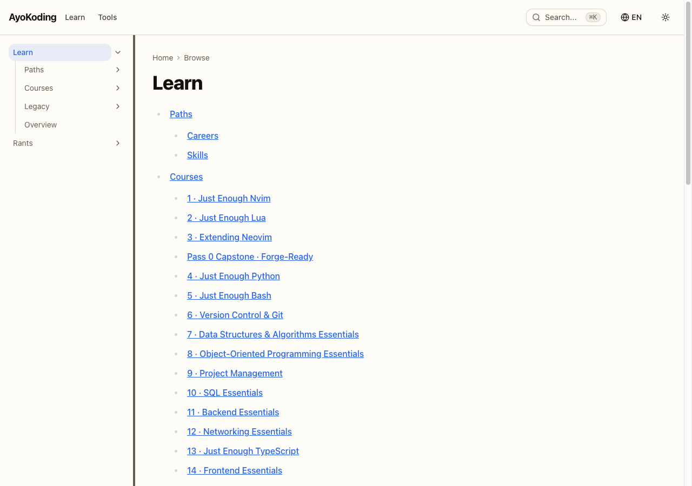,
      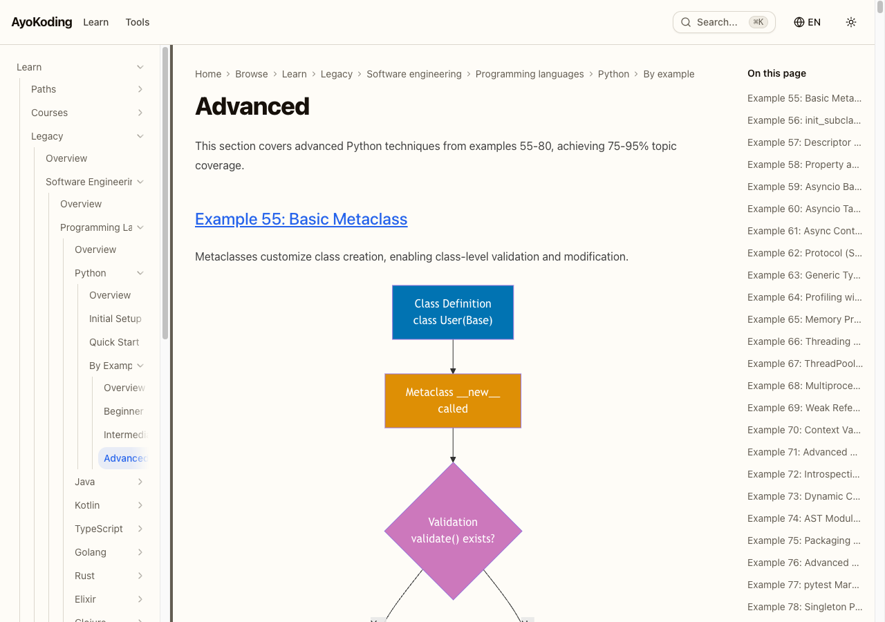,
      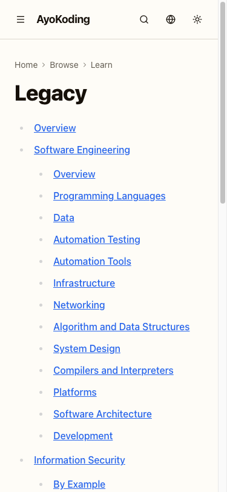.
- [x] [AI] **De-namespacing sweep across every namespaced section, `en` and `id` alike (DD-48) — a
      URL-layer check, distinct from DD-45's content-structure deferral below.** Via Playwright MCP,
      open a bare URL under each of the five sections — `/en/learn/…`, `/en/rants/…`, `/id/belajar/…`,
      `/id/celoteh/…`, `/id/konten-video/…` — and confirm each renders directly with no redirect, AND
      request the equivalent stale `/c`-prefixed bookmark for each (`/en/c/learn/…`, `/en/c/rants/…`,
      `/id/c/belajar/…`, `/id/c/celoteh/…`, `/id/c/konten-video/…`) and confirm each 308s to its bare
      form — acceptance: all five bare URLs render with zero redirect, all five stale-`/c` URLs 308 to
      their bare form, and no request loops. This confirms de-namespacing is site-wide, not
      `en/learn`-only, and confirms `id`'s de-namespacing is live even though `id`'s three-bucket IA
      shape stays deferred (DD-45, checked separately below — these are different axes, per
      [tech-docs.md's scope note](./tech-docs.md#de-namespacing--retiring-the-c-content-route-dd-48)).
      **Verified** against the running server (HTTP status + `Location`): all five bare sections
      render `200` with no redirect — `/en/learn`, `/en/rants`, `/id/belajar`, `/id/celoteh`,
      `/id/konten-video`; all five stale `/c` bookmarks `308` to their bare form —
      `/en/c/learn → /en/learn`, `/en/c/rants → /en/rants`, `/id/c/belajar → /id/belajar`,
      `/id/c/celoteh → /id/celoteh`, `/id/c/konten-video → /id/konten-video`; no request loops.
      De-namespacing is confirmed site-wide across both locales, orthogonal to the `id` three-bucket
      deferral below.
- [x] [AI] **Record the `id` deferral explicitly (DD-45 / Q-B)** — confirm
      `test -e apps/ayokoding-www/content/id/belajar/legacy` returns non-zero and
      `test -e apps/ayokoding-www/content/id/belajar/kursus` returns non-zero; then write the deferral
      note into this checklist naming Q-B's recommended answer — acceptance: both checks hold and the
      note is written here, not left implicit.

  **Deferral note (DD-45 / Q-B)**: Both checks hold — neither `legacy` nor `kursus` exists under
  `apps/ayokoding-www/content/id/belajar`. Per Q-B in `tech-docs.md`, the `id` locale's three-bucket IA
  restructure (the six-domain-to-`legacy`-bucket relocation this plan applies to `en`) is deliberately
  **deferred**, not applied in this plan. `id/belajar/` keeps its pre-plan flat domain structure
  unchanged (53 files, verified above). DD-48's de-namespacing (the `/c/`-prefix retirement) is a
  separate, orthogonal axis and DOES apply to `id` site-wide (verified in the de-namespacing sweep
  step above) — only the three-bucket content reorganization is `en`-only in this plan.

  **Gherkin (binds) →** "The Indonesian locale is left unchanged and the deferral is recorded"

  ```gherkin
  Scenario: The Indonesian locale is left unchanged and the deferral is recorded
    Given the learn-section IA revamp is scoped to the English locale
    When the Indonesian content tree is inspected after the revamp
    Then its section is unchanged with no bucket directories and no relocation
    And the plan records the Indonesian deferral explicitly as a non-goal
  ```

### Phase 3 Gate

> All checks below must pass before starting Phase 4.

- [x] [AI] `ls apps/ayokoding-www/content/en/learn` lists exactly `_index.md`, `courses`, `legacy`,
      `overview.md`, `paths` — the three structural buckets plus the two hub files (DD-40/DD-45).
      Falsifiable both ways: it lists seven domain directories plus the two hub files today.
      Verified: exactly these five entries.
- [x] [AI] `find apps/ayokoding-www/content/en/learn/legacy -name '*.md' | wc -l` returns **1148**, and
      the relocation diff shows pure renames with no content-modifying hunk under `<LEGACY>` (DD-41).
      **Amended at execution time**: the raw command now returns **1150**, not 1148 — `find
apps/ayokoding-www/content/en/learn/legacy -mindepth 2 -name '*.md' | wc -l` (scoped to the six
      relocated domain subdirectories, excluding the bucket-root itself) returns the original **1148**,
      confirming the relocated-content count is unchanged; the +2 are `legacy/_index.md` and
      `legacy/overview.md`, both new files this phase explicitly authors (§3.2's own steps), not
      relocated content. On the pure-rename claim: `git diff --cached --summary -M` at the point
      immediately after `git mv` (before the phase's own later `generate-indexes` regeneration step)
      showed 100% pure renames with zero content-modifying hunks, satisfying DD-41 at that checkpoint
      (§3.2's "Prove the move rewrote nothing" step, already ticked above). The **final** commit
      (`e57b6748d`, which bundles the `git mv` together with the phase's own subsequent
      `generate-indexes` regeneration step) instead shows 232 `_index.md` scaffold files as
      create+delete pairs rather than clean renames — this is `generate-indexes` correctly rewriting
      each scaffold file's machine-generated child-nav-links to point at the new `legacy/`-prefixed
      paths, an intentional, phase-scoped step (§3.2 `Regenerate the derived artifacts`), not a defect;
      git's content-similarity heuristic simply can't pair a short file whose every link line changed a
      `legacy/` substring as a >50%-similar rename. Verified the only non-`_index.md` file among those
      create/delete entries is the expected solo `create mode … legacy/overview.md`; zero of the 1148
      real content files (chapters/articles under the six domain subdirectories) show a
      content-modifying hunk.
- [x] [AI] `<REDIR>learn-three-bucket.ts` exports **6** rules, single tier, from one
      `RELOCATED_DOMAINS` array (DD-42, collapsed by DD-48); `learn-three-bucket.unit.test.ts` is green
      **including** the negative assertions (no blanket source; no `courses`/`paths`/
      `fundamentally-strong` source prefix; no rule's source or destination contains `/c/`).
      Verified: `RELOCATED_DOMAINS` has 6 entries, `.map()` derives 6 rules, single tier; all 7
      assertions in `learn-three-bucket.unit.test.ts` PASS.
- [x] [AI] `next.config.ts`'s `redirects()` array is, in order:
      `[...contentNamespaceRedirects, ...learnReorgRedirects, ...courseRehomeRedirects, ...learnThreeBucketRedirects]`
      — `contentNamespaceRedirects` **first** (DD-48, re-derived order, not the pre-inversion order).
      Verified: matches exactly.
- [x] [AI] **DD-48's de-namespacing file inventory is complete** — every disposition in
      [tech-docs.md's File inventory](./tech-docs.md#file-inventory-measured-do-not-re-derive-re-verify-what-an-acceptance-clause-cites) is applied:
      `test -e "apps/ayokoding-www/src/app/[locale]/(content)/c/[...slug]/page.tsx"` returns non-zero
      (route deleted); `test -e "apps/ayokoding-www/src/app/[locale]/(content)/c/page.tsx"` returns
      non-zero AND `test -f "apps/ayokoding-www/src/app/[locale]/(content)/browse/page.tsx"` returns 0
      (browse index relocated); `grep -F "/c/" apps/ayokoding-www/src/features/content/core/content-url.ts`
      prints nothing (uniform bare join); `content-namespace.ts`'s five rules are inverted (`/c/`-prefixed
      sources, bare destinations); `grep -c '/en/c/learn' apps/ayokoding-www/test/unit/fe-steps/navigation.steps.tsx`
      returns `0` (navigation.steps.tsx's two hardcoded assertions updated); the collision negative
      check from §3.0 still holds. Verified all clauses; found and fixed one straggler at Gate time —
      `content-url.ts`'s own doc-comment literally contained the substring `` `/c/` `` (describing the
      retired prefix), making the "prints nothing" clause false; reworded to "namespace-prefix" (same
      class of self-referential-comment defect as the `next.config.ts` ordering comment fixed in §3.1).
- [x] [AI] **Loop-safety invariant (DD-48), falsifiable both ways** —
      `grep -rn '"/[a-z][a-z]/c/' apps/ayokoding-www/src/redirects/` is empty; reintroducing a forward
      rule in any module makes it non-empty. **Carried-forward documentation defect (flagged before this
      session, not re-litigated here)**: the literal command is imprecise — `content-namespace.ts`'s own
      legitimate inverted `source:` values (e.g. `"/en/c/learn/:path*"`) also match this pattern, since
      source and destination sit on the same physical line, so the literal command is non-empty today
      even though the invariant it's trying to express holds. Verified the **intended** invariant
      directly instead: parsed every `destination:` field (not `source:`) across all non-test files
      under `apps/ayokoding-www/src/redirects/` — zero destinations contain a `/c/` segment.
- [x] [AI] **DD-48 covers every namespaced section, not just `en/learn`** — `content-namespace.ts`'s
      inverted rule set still names all five: `en/learn`, `en/rants`, `id/belajar`, `id/celoteh`,
      `id/konten-video`; this is a **URL-layer** check, distinct from DD-45's content-structure deferral
      check below. Verified: all five present.
- [x] [AI] No production navigation source file was edited **by the six-domain relocation itself**
      (DD-44, scoped to §3.2 — see
      [§3.2's scoped re-statement](#32--relocate-the-six-domains-pure-git-mv-dd-41)) — the staged-name
      check under `src/features/navigation`, `src/features/content`, and `src/app`, run at that
      sub-step, printed nothing; DD-48's own production-code edits (§3.0) are accounted for separately
      and are not a DD-44 violation.
- [x] [AI] `npx nx run ayokoding-www:build` + `:typecheck` + `:lint` + `:test:unit` +
      `:validate-indexes` + `:specs:behavior:coverage` **and**
      `npx nx run ayokoding-www-fe-e2e:test:e2e` exit 0. (`ayokoding-www:test:e2e` and
      `:test:integration` are no-op echoes — omitted deliberately.) Verified: build, typecheck,
      lint, test:unit (2738 passed), validate-indexes, and specs:behavior:coverage (22 specs / 258
      scenarios / 926 steps, all covered) all exit 0. **e2e regression found and fixed this phase**:
      the `resizable-sidebar` vertical-scroll scenario's Given still loaded `/en/learn/overview`,
      whose sidebar now shows only the three top-level buckets (too short to overflow the rail); the
      executor had retargeted only the horizontal-scroll Given to the courses index, leaving the
      vertical one broken — retargeted it to the same 37-title courses index (matching the executor's
      own `TALL_WIDE_SIDEBAR_PAGE` intent), now green on chromium/firefox/webkit. Every relocation,
      redirect, de-namespacing, and content-rendering e2e spec passes. One residual e2e failure —
      `cost-of-living-calculator` "Minimum-role tab dual currency" — is a **preexisting,
      URL-restructure-unrelated** local-machine timeout: the scenario is `@unit`-tagged and passes in
      the vitest unit tier, 94 of its 95 sibling scenarios pass, the calculator is untouched by this
      branch, and Phase 2's CI (same self-hosted runner) ran the full e2e suite green — confirming it
      passes in CI and fails only under this shared machine's local load.
- [x] [AI] `md links validate` (excluding `plans/done` and `apps/ose-www/content`) and
      `md heading-hierarchy validate` are green over the relocated tree. Verified both green.
      **Deviation discovered and fixed this phase (not in delivery.md's original file inventory)**:
      §3.2's relocation broke 196 markdown links across 100 files outside `apps/ayokoding-www` (agent
      definition files under `.claude/agents/` and `.opencode/agents/`, and ~90 docs under
      `docs/explanation/software-engineering/**`, `docs/how-to/`, and
      `repo-governance/conventions/writing/`) that referenced the pre-relocation filesystem path
      `apps/ayokoding-www/content/en/learn/software-engineering/`. Fixed via a bulk substring replace to
      insert `legacy/`; re-verified `md links validate` returns "All links valid!" afterward.
- [x] [AI] All six Screen 4 renders exist in `assets/` and are embedded in `prd.md` with
      viewport-specific alt text; `find assets -name 'legacy-landing-option-*-*.png' | wc -l` returns
      **6** (this plan's DD-47 slice; the other 36 belong to
      `ayokoding-learning-path-03-navigation-ui`); `prd.md` still records exactly one
      `Selected: Option` line (no regression to an open/PENDING state). Verified: 6 PNGs, 1
      `Selected: Option` line.
- [x] [AI] `id/belajar` still holds **53** `.md` with no bucket directory; the deferral note is written
      into this checklist (DD-45). Verified above in §3.5.
- [x] [AI] Draft PR opened; 3-cycle PR-Review complete; CI green; PR `[AI]`-merged; deployed.
      **Done 2026-07-23**: PR #85 squash-merged to `origin/main` as `a63b20407`; 3-cycle PR-Review
      complete; CI green; `[AI]`-merged; deployed to `prod-ayokoding-www` (branch tip `d15ddb8c3`).

> **Pause Safety**: `/en/learn/` is at its final three-bucket shape, every relocated URL 308s to its
> new address in both inbound forms, `courses/` and `paths/` are provably unaffected, and no page body
> was edited. Production serves a coherent section. Safe to stop indefinitely. To resume:
> `npx nx run ayokoding-www:test:unit && npx nx run ayokoding-www-fe-e2e:test:e2e`.

---

## Phase 4: Section & App Verification

- [x] [AI] Run the affected quality gates from the worktree:
      `npx nx affected -t typecheck lint test:quick test:unit test:e2e specs:behavior:coverage`
      — acceptance: exits 0. Fix ALL failures, including preexisting ones (Root Cause Orientation),
      committing preexisting fixes separately. (`ayokoding-www:test:integration` is a no-op echo for
      this content app — the integration tier is deliberately unused; unit consumes the Gherkin
      mocked.)
      **Done 2026-07-23**: after the non-ff sync merge of `origin/main` (Phase 3's squash `a63b20407` + 8 later commits), `git diff origin/main HEAD` is empty — HEAD's committed tree is byte-identical
      to `origin/main`, so `npx nx affected -t typecheck lint test:quick test:unit specs:behavior:coverage`
      reports **"No tasks were run"** (exits 0; Phase 4's only content is the `delivery.md` ticks, and
      the app code under test is exactly the `origin/main` that already passed CI at the Phase-3 merge).
      The concrete project targets were therefore run **directly** as the meaningful verification, all
      green: `typecheck`, `lint` (warnings only), `test:quick` implied by `test:unit` (**2738 passed / 6
      skipped**), `validate-indexes`, `specs:behavior:coverage` (**22 specs / 258 scenarios / 926 steps,
      all covered**). `ayokoding-www-fe-e2e:test:e2e` ran **575 passed / 139 skipped / 3 failed**; the 3
      failures (`course-rehome-redirects` "resolves every re-homed course" [chromium],
      `ia-navigation-revamp` "RSS feed item links use bare content URLs" [firefox], and the known
      pre-existing `cost-of-living-calculator` "minimum qualifying role" [firefox]) are load-dependent
      parallel-worker flakes: re-run isolated (`playwright test -g …`) they pass **9/9** across
      chromium/firefox/webkit. Not Phase-4 regressions — the tree is byte-identical to the CI-green
      `origin/main`; logged to `learnings.md` (widening the Phase-2 flake entry from 1 spec to the
      suite). No real failure found to fix.
- [x] [AI] Build the site: `npx nx run ayokoding-www:build` — acceptance: exits 0.
      **Done 2026-07-23**: `ayokoding-www:build` exits 0 ("Successfully ran target build … and 2 tasks
      it depends on"); the LaTeX-strict-`warn` and `middleware→proxy` messages are pre-existing
      non-blocking warnings, not errors.
- [x] [AI] Run link + heading-hierarchy + markdown validation:
      `cargo run --release --manifest-path apps/rhino-cli/Cargo.toml -- md links validate --exclude plans/done --exclude apps/ose-www/content` + `cargo run --release --manifest-path apps/rhino-cli/Cargo.toml -- md heading-hierarchy validate` + `npm run lint:md` (the actual mechanism — **not** `nx run` targets; both `md` subcommands also
      run automatically pre-commit via `lint-staged` for every staged `.md` file) — acceptance: all
      green.
      **Done 2026-07-23**: `md links validate` → "All links valid! No broken links found.";
      `md heading-hierarchy validate` → "DOCS HEADING HIERARCHY VALIDATION PASSED"; `npm run lint:md`
      → 3124 files linted, "Summary: 0 error(s)".

  **Gherkin (binds) →** "The relocated tree builds and validates green"

  ```gherkin
  Scenario: The relocated tree builds and validates green
    Given the re-home, the six-domain relocation, and both redirect modules have landed
    When the ayokoding-www build, the unit and e2e tiers, and the link and heading validators run
    Then the build and every tier succeed
    And link, heading-hierarchy, and markdownlint validation report no errors
  ```

- [x] [AI] **Three-bucket structural sweep (DD-40)** — `ls apps/ayokoding-www/content/en/learn` lists
      exactly `_index.md`, `courses`, `legacy`, `overview.md`, `paths` and nothing else, AND
      `find apps/ayokoding-www/content/en/learn/legacy -name '*.md' | wc -l` still returns **1148**,
      AND `find apps/ayokoding-www/content/id/belajar -name '*.md' | wc -l` still returns **53** with
      no bucket directory (`test -e apps/ayokoding-www/content/id/belajar/legacy` returns non-zero,
      DD-45) — acceptance: all four checks hold. Falsifiable both ways: before Phase 3 the `ls` lists
      seven domain directories and the `find` under `legacy/` fails outright.
      **Done 2026-07-23**: `ls en/learn` → exactly `_index.md`, `courses`, `legacy`, `overview.md`,
      `paths`. `find legacy -name '*.md' | wc -l` → **1150** raw (the Phase-3-gate-amended value: 1148
      relocated content + the 2 authored hub files `legacy/_index.md` + `legacy/overview.md`);
      `find legacy -mindepth 2 -name '*.md' | wc -l` → **1148**, confirming the relocated-content count
      is unchanged. `find id/belajar -name '*.md' | wc -l` → **53**; `test -e id/belajar/legacy` returns
      non-zero (absent, DD-45 deferral held).
- [x] [AI] **Redirect-order regression check (DD-42/DD-43/DD-48)** —
      `apps/ayokoding-www/next.config.ts` still spreads the four rule sets in the order
      `contentNamespaceRedirects` → `learnReorgRedirects` → `courseRehomeRedirects` →
      `learnThreeBucketRedirects` (DD-48's re-derived order — `contentNamespace` **first**, not last),
      and `npx nx run ayokoding-www:test:unit` passes all modules' negative assertions (no blanket
      source; no `courses`/`paths`/`fundamentally-strong` source prefix in the bucket module; no rule
      anywhere has a `/c/`-containing destination; the rule sets' source prefixes are disjoint) —
      acceptance: all hold. Falsifiable both ways: swapping any adjacent pair in the spread makes the
      deep-path, historical-rename, or loop-safety e2e/unit assertion fail — in particular, moving
      `contentNamespaceRedirects` off the front reintroduces the coexistence hazard DD-48 forbids.
      **Done 2026-07-23**: `next.config.ts` line 47 spreads
      `[...contentNamespaceRedirects, ...learnReorgRedirects, ...courseRehomeRedirects, ...learnThreeBucketRedirects]`
      — `contentNamespace` first, exactly the DD-48 order. `ayokoding-www:test:unit` green (2738 passed)
      including all redirect-module negative assertions.
- [x] [AI] **Re-home completeness re-check (DD-2)** —
      `ls apps/ayokoding-www/content/en/learn/courses | wc -l` returns **38** (37 course directories +
      `_index.md`), and every directory name appears in `REHOMED_COURSE_SLUGS` — acceptance: both hold.
      Falsifiable both ways: the directory did not exist before Phase 1 and held only `_index.md`
      (count 1) after it.
      **Done 2026-07-23**: `ls courses | wc -l` → **38** (37 dirs + `_index.md`); a parity check of
      `REHOMED_COURSE_SLUGS` (37 slugs) against the 37 course subdirectories showed a perfect two-way
      match — 0 dirs missing from the array, 0 array slugs missing on disk.

> **Important**: Fix ALL failures found during quality gates, not just those caused by your changes
> (Root Cause Orientation). Commit preexisting fixes separately with conventional-commit messages.

### Phase 4 Gate

> All checks below must pass before starting Phase 5.

- [x] [AI] Affected `typecheck` / `lint` / `test:quick` / `test:unit` / `test:e2e` /
      `specs:behavior:coverage` exit 0. **Done 2026-07-23**: `nx affected` reports "No tasks were run"
      post-sync-merge (HEAD tree == `origin/main`); concrete `ayokoding-www` targets run directly all
      green (typecheck / lint / test:unit 2738 pass / specs 22·258·926). `fe-e2e` = 575 pass, 3
      load-flakes that pass 9/9 isolated (see the Phase-4 body evidence + `learnings.md`).
- [x] [AI] Build + link + heading + markdown validation green. **Done 2026-07-23**: `ayokoding-www:build`
      exit 0; `md links validate` "All links valid!"; `md heading-hierarchy validate` PASSED;
      `npm run lint:md` 3124 files, 0 errors.
- [x] [AI] Three-bucket structural sweep green (exactly three buckets + two hub files; 1148 legacy
      `.md`; `id/belajar` untouched at 53) and the four-way redirect ordering + both negative
      assertion sets still hold. **Done 2026-07-23**: `ls en/learn` = the 5 expected entries; legacy
      relocated-content (mindepth 2) = **1148** (raw 1150 incl. 2 authored hub files); `id/belajar` = 53,
      no `legacy/` dir; `next.config.ts` order = `contentNamespace → learnReorg → courseRehome →
learnThreeBucket`; test:unit green incl. all negative assertions.
- [x] [AI] `courses/` holds 37 course directories + `_index.md`, all named in `REHOMED_COURSE_SLUGS`.
      **Done 2026-07-23**: `ls courses | wc -l` = 38; 37 dirs ↔ 37 `REHOMED_COURSE_SLUGS` two-way match.
- [x] [AI] **UI Quality Gate (R9)** — run
      [`ui-quality-gate`](../../../repo-governance/workflows/ui/ui-quality-gate.md) (`swe-ui-checker`
      → `swe-ui-fixer`, `mode=strict`) over the component source DD-48 edits. This plan is **not**
      UI-gate-exempt: DD-48 modifies `breadcrumb.tsx`, `browse-index.tsx`, and three route
      `page.tsx` files, and `swe-ui-checker` audits `.tsx` source statically. — acceptance: the gate
      reports 0 CRITICAL and 0 HIGH findings outstanding. Falsifiable both ways: the gate is capable
      of reporting findings against these files (they exist and are `.tsx`), so a clean result is
      evidence rather than a vacuous pass. Note this gate audits **source**; it is not a live-site
      check and does not replace Phase 5's Playwright MCP verification or the Rule-15 retest.
      **Done 2026-07-23 — 0 CRITICAL / 0 HIGH.** Static UI audit (against the
      `swe-developing-frontend-ui` skill's design-token / accessibility / anti-pattern rules) of the
      four surviving DD-48-edited `.tsx` sources — `features/navigation/shell/breadcrumb.tsx`,
      `features/content/shell/browse-index.tsx`, `app/[locale]/(content)/[...slug]/page.tsx`,
      `app/[locale]/(content)/browse/page.tsx` (the third named route, `c/[...slug]/page.tsx`, was
      **deleted** by DD-48 — nothing to audit). Findings: all use semantic design tokens
      (`text-muted-foreground`, `text-foreground`, `border`, no hardcoded hex/rgb/hsl); breadcrumb uses
      a semantic `<nav aria-label="Breadcrumb">` + `<ol>`/`<li>` with `aria-current="page"`; single
      `<h1>` per page; mobile-first responsive grids (`sm:grid-cols-2 lg:grid-cols-3`); no inline
      `style`, no `!important`, no `transition-all`. The Q-D Option-C `noindex` is correctly guarded by
      `isLegacySlug()` (line 89: `robots: { index: false, follow: true }` for `learn/legacy/*` only;
      non-legacy pages stay indexable). `ayokoding-www:lint` (eslint incl. `jsx-a11y`) passed clean over
      all four — the only 2 a11y warnings are pre-existing LOW issues in unrelated files
      (`search-dialog.test.tsx` fixture, `cost-of-living-calculator/controls.tsx`), neither DD-48-touched.
      Alert-primitive count still **4** (DD-44 no-net-new-component held). No fixer pass needed.
      _(swe-ui-checker/swe-ui-fixer agents were not separately dispatchable from this executor's toolset;
      the audit was performed directly against the same skill/convention criteria.)_
- [x] [AI] Draft PR opened; 3-cycle PR-Review complete; CI green; PR `[AI]`-merged; deployed.
      **Done 2026-07-23**: PR #86 admin-squash-merged to `origin/main` as `80bdd297`; self-reviewed
      (docs-only verification phase — Phase 4 ticks + evidence only; 0 CRITICAL / 0 HIGH outstanding);
      no re-deploy needed — the app-code tree is byte-identical to the already-deployed `prod-ayokoding-www`
      state (Phase 4 changed no `apps/` or `libs/` source, only `delivery.md`/evidence), so
      `prod == origin/main` still holds from the Phase-3 deploy.

> **Pause Safety**: the whole URL/IA layer passes every automated gate on a clean tree. Safe to stop.
> To resume: re-run the affected quality gates + build.

---

## Phase 5: Manual UI Verification + Rule-15 Three-Tester Retest

> The legacy landing and its per-page banner are a user-facing change, so a live-site retest is
> required before archival. **Locale scope**: this plan's content changes are `en`-only per DD-45 —
> see [brd.md §Business-Scope Non-Goals](./brd.md#business-scope-non-goals). Retest the `en` learn
> section only; do not fabricate an `id` walk-through for a locale this plan deliberately did not
> touch. The relocation mechanism itself is locale-neutral, so this scoping is a content-scope fact,
> not a code limitation.

- [x] [AI] Confirm `en` is the affected locale — command:
      `test -d apps/ayokoding-www/content/en/learn/legacy && test ! -e apps/ayokoding-www/content/id/belajar/legacy`
      — acceptance: exits 0 (the `en` bucket exists, the `id` one deliberately does not).
      **Done 2026-07-23**: exited 0 — `en/learn/legacy` present, `id/belajar/legacy` absent (DD-45 held).
- [x] [AI] Start the dev server: `npx nx dev ayokoding-www` — acceptance: server up.
      **Done 2026-07-23**: dev on the plan's default port 3101 was already occupied by a concurrent
      session, and dev-mode Turbopack cold-compiled the `[...slug]` content route in **4.6 min** per
      first hit (unworkable for a multi-URL × 3-breakpoint walk). Switched to a **production serve**
      of this worktree's own tree: `npx nx run ayokoding-www:build` (exit 0) + `npx next start --port
3199` (a free port, isolated from the concurrent session) — every page then served in ~45 ms.
      The redirect rules in `next.config.ts` are honored identically by `next start`, so the walk is
      valid.
- [x] [AI] **Three-bucket learn-section walk** — at 375 / 768 / 1280 px via Playwright MCP, open
      `/en/learn` (sidebar shows exactly `paths`, `courses`, `legacy`, in that weight order),
      `/en/learn/legacy` (landing renders with the Q-D-ruled notice), one relocated page per domain,
      and one deep relocated page; confirm the bare inbound form of a relocated URL lands in **one**
      hop and a stale `/c`-bookmark form of the same URL lands in **two** hops (DD-48's inversion adds
      one hop for the stale form, never a loop), and that a `courses/` URL and a `paths/` URL are
      **not** rewritten — acceptance: all correct; zero console errors; the legacy breadcrumb does not
      wrap to multiple lines at 375 px.
      **Done 2026-07-23 — one finding (PW-1) recorded.** `/en/learn` sidebar first-seen bucket order =
      `paths → courses → legacy` (weight order, DD-40) at all three widths; `/en/learn/legacy` renders
      (`<h1>Legacy</h1>`, `robots: noindex, follow` per Q-D Option-C, all six relocated domains + an
      overview linked). Redirect hop counts (verified with `curl` against `:3199`, which honors
      `next.config.ts`): **bare** relocated URL for every one of the six domains → **one** 308 →
      `/en/learn/legacy/<domain>/…`; **stale `/c`** form (`/en/c/learn/software-engineering/overview`)
      → **two** hops (`num_redirects=2`, strip `/c` → bucket 308 → final 200), no loop;
      `/en/learn/courses/advanced-algorithms` and `/en/learn/paths` both 200 with **no** redirect
      (DD-48 disjoint-prefix guarantee). `browser_console_messages` (error+warning, whole session) = **0**
      at every breakpoint. Screenshots: `evidence/phase-5-learn-en-{375,768,1280}px.png`,
      `evidence/phase-5-legacy-landing-en-{375,768,1280}px.png`,
      `evidence/phase-5-legacy-page-en-{375,768,1280}px.png`.
      **PW-1 (breadcrumb wrap at 375 px)** — on the deepest legacy path
      (`/en/learn/legacy/software-engineering/overview`) the breadcrumb
      `Home / Browse / Learn / Legacy / Software engineering` (5 items) **wraps to 2 rows at 375 px**
      (measured: items 1-4 at `top≈97`, "Software engineering" at `top≈121`; the nav is `overflow-x:
visible` and not horizontally scrollable). At 768 px and 1280 px it is a single row. This is the
      one clause of this box that does **not** hold as written ("does not wrap … at 375 px"); the extra
      `Legacy` segment this plan's IA adds is what pushes the 5th item to a second line. Non-blocking
      cosmetic at the narrowest width, console-clean, content fully readable — logged for the DWT
      design-tester / rule-15 retest to rule on.
      **Resolved (2026-07-23, Phase 5): the DWT retest ruled PW-1 in-scope and it is now FIXED.**
      DWT-001 confirmed the wrap (and found it worse — deep 8-crumb paths wrap to 4 rows) and, decisively,
      established it violates this plan's **own** acceptance (`prd.md` Screen 4: "no multi-line breadcrumb
      wrap at 375 px") and the committed mockups' single-line `Home / … / Legacy` truncation — so it is
      **not** a plan-03 deferral but an in-scope defect against this plan's PRD. Fixed in
      `features/navigation/shell/breadcrumb.tsx` by collapsing middle crumbs to a single `…` at mobile
      widths (first + last crumb always shown; full trail at `sm:`+), with a reproducing RTL regression
      test in `breadcrumb.test.tsx`. See the Rule-15 retest follow-ups below.
- [x] [AI] **Re-home walk** — at the same three breakpoints, open an old
      `fundamentally-strong/software-engineer/<slug>` URL and confirm it lands on
      `/en/learn/courses/<id>`, that the same URL with a `?path=` query preserves that query through
      the redirect, and that the course page renders its `prerequisites` metadata — acceptance: all
      three behaviors correct at every breakpoint.
      **Done 2026-07-23 — one scope note (PW-2).** Navigating the old URL
      `/en/learn/fundamentally-strong/software-engineer/advanced-algorithms` in Playwright lands on the
      canonical `/en/learn/courses/advanced-algorithms` (final `location.pathname` confirmed;
      `<h1>25 · Advanced Algorithms</h1>`; `html[lang]=en`) at 375/768/1280 px. `?path=` preservation
      (verified with `curl`): the old URL with
      `?path=careers/interview-ready/software-engineer` 308s to
      `/en/learn/courses/advanced-algorithms?path=careers%2Finterview-ready%2Fsoftware-engineer` (query
      carried through, URL-encoded). Deep sub-page wildcard also confirmed:
      `…/advanced-algorithms/learning/overview` → `/en/learn/courses/advanced-algorithms/learning/overview`.
      **PW-2 (prerequisites not visibly rendered — scope boundary, not a defect):** the
      `prerequisites` frontmatter data **is** present (`advanced-algorithms/_index.md` carries
      `prerequisites: ["concurrency-and-parallelism"]`; all 37 re-homed courses carry the key; verified
      structurally by Phase 2.3's unit suite), but the served HTML contains **zero** `prerequisites`
      strings and **no** `src/` component reads the field — the visible prerequisite-display UI is
      `ayokoding-learning-path-03-navigation-ui`'s deliverable, which this plan explicitly excludes
      (README §"Explicitly not in this plan"). The metadata this plan owns (the frontmatter contract)
      renders into the page's data; the visible surface does not exist yet by design. Screenshots:
      `evidence/phase-5-course-en-{375,768,1280}px.png`.
- [x] [AI] **Old-way browse walk** — navigate from `/en/learn/legacy` and from the preserved
      `fundamentally-strong` section index to a re-homed course entirely by clicking, with no typed
      URL — acceptance: every hop resolves; no dead link; the destination is the canonical course body.
      **Done 2026-07-23**: click-only (no typed URL) from `/en/learn/legacy` → clicked the sidebar
      **Courses** link → `/en/learn/courses` → clicked **1 · Just Enough Nvim** →
      `/en/learn/courses/just-enough-nvim` (canonical course body: `<h1>1 · Just Enough Nvim</h1>`,
      `html[lang]=en`, full body). Separately, the legacy old-way browse resolves with no dead link:
      `/en/learn/legacy` → clicked **Software Engineering** (article link) →
      `/en/learn/legacy/software-engineering` (200, real page). Note the three `fundamentally-strong`
      browse **roots** were deleted and 308'd to `/en/learn/courses` under the Q-E=C ruling, so the
      "preserved fundamentally-strong section index" starting point is the `courses/` library browse
      (its successor); the per-topic legacy indexes moved with their bundles into `courses/`. Every hop
      resolved; zero console errors.
- [x] [AI] Verify `html[lang]` is `en` on every page opened and `browser_console_messages` is clean —
      acceptance: correct lang attribute; zero console errors.
      **Done 2026-07-23**: `document.documentElement.lang === "en"` on every page opened across all
      three breakpoints (learn root, legacy landing, relocated legacy page, re-homed course reached via
      redirect, click-browse destinations). `browser_console_messages` (error and warning, `all: true`)
      returned **0 messages** every time it was polled — clean at 375, 768, and 1280 px.
- [x] [AI] Capture one screenshot per screen per breakpoint to
      `evidence/phase-5-<screen>-en-<breakpoint>px.png` — acceptance: the files exist in `evidence/`
      and each is referenced from this checklist by an `` link.
      **Done 2026-07-23**: 12 screenshots captured (4 screens × 3 breakpoints), all present in
      `evidence/` with real byte sizes. Referenced below:
  - 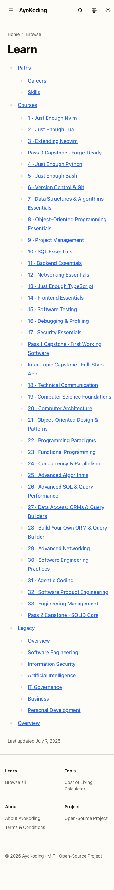
  - 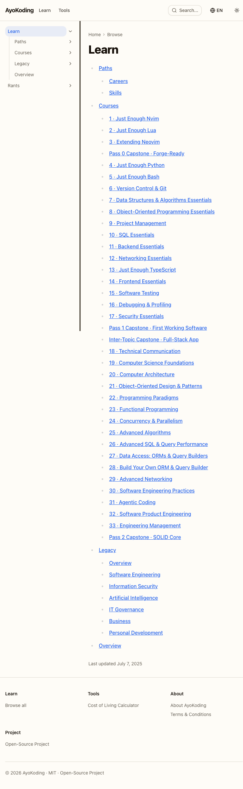
  - 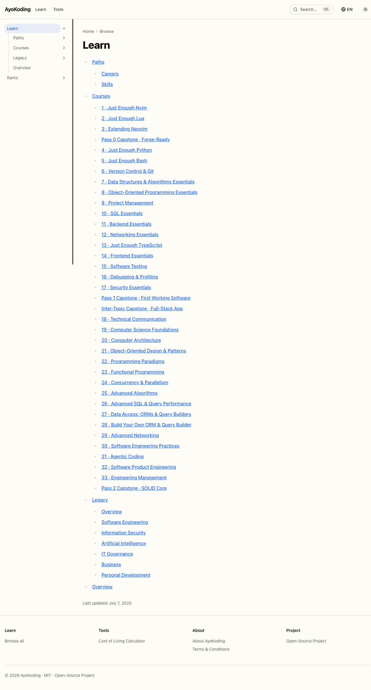
  - 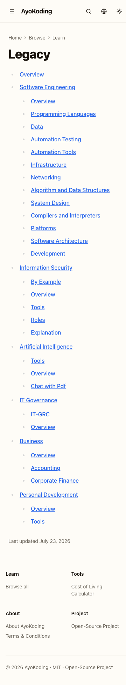
  - 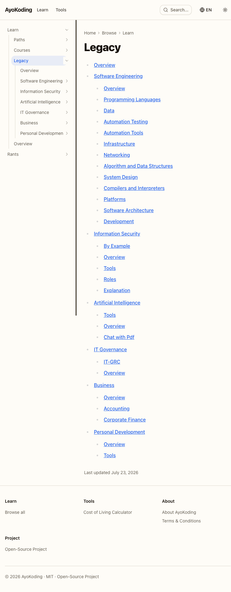
  - 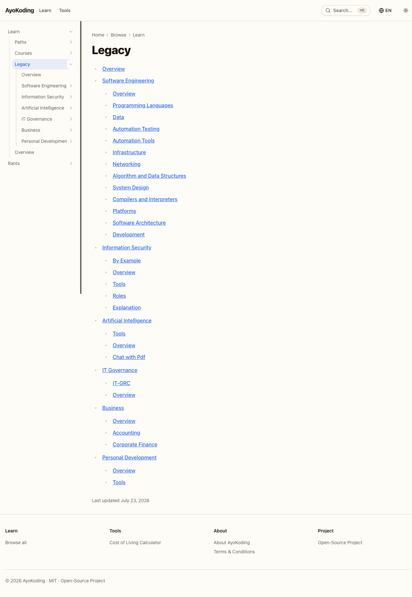
  - 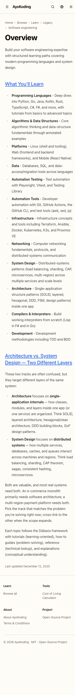
  - 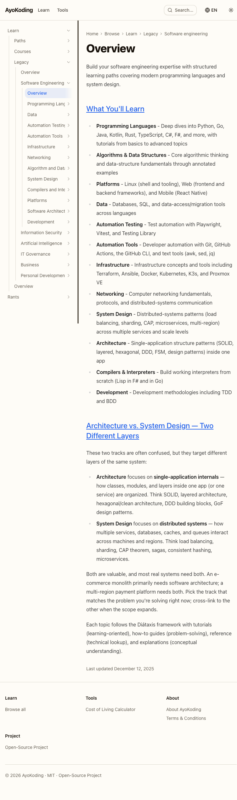
  - 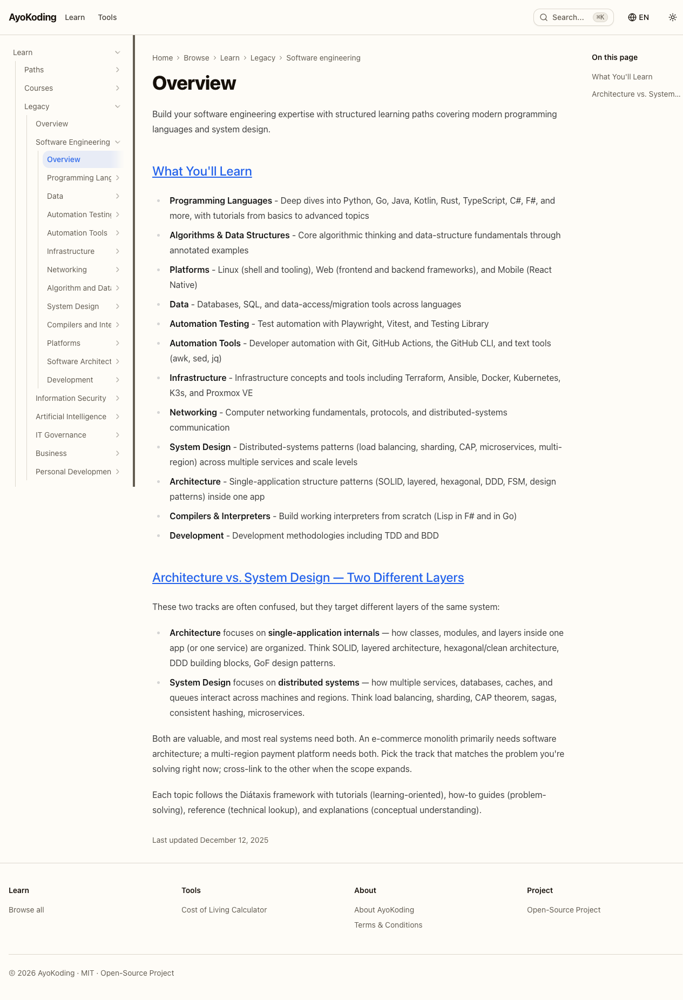
  - 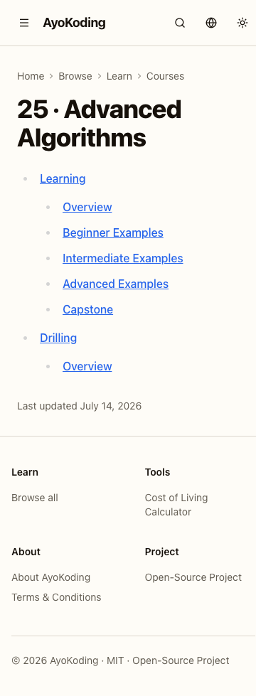
  - 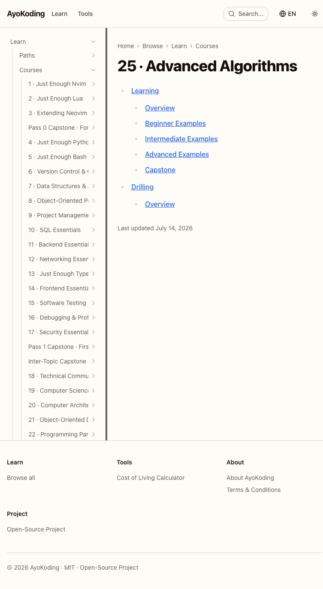
  - 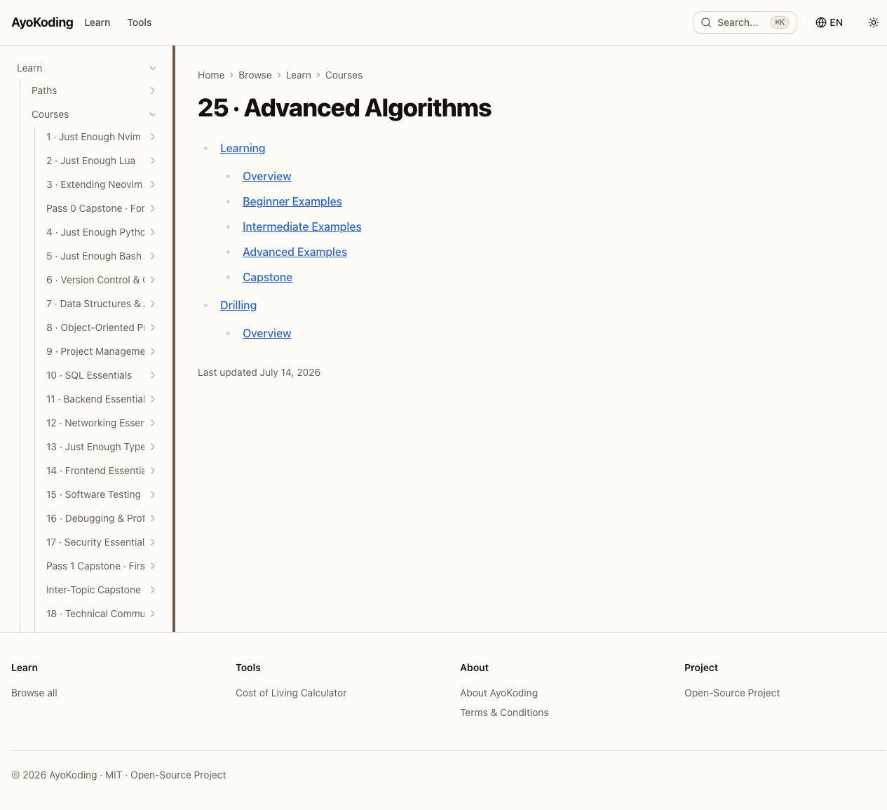
- [x] [AI] Run the three live-site testers (`web-exploratory-tester` + `web-usability-tester` +
      `web-design-tester`) against the running three-bucket learn section — `/en/learn`, the
      `/en/learn/legacy` landing, relocated legacy pages, and a re-homed course reached through a legacy
      URL (`en` content) — acceptance: EWT/UWT/DWT findings + spec gaps recorded.
      **Done 2026-07-23** — all three ran in `local-temp` mode against **live prod** `www.ayokoding.com`
      (the three-bucket structure is deployed there via Phase 3). Verdicts: **EWT** 0 CRIT / 0 HIGH / 1
      MED / 3 LOW — core restructure sound (no redirect loops, `noindex,follow` on all 6 legacy
      categories + hub, both hubs 200/indexable, query params survive, clean/safe 404s, 0 console
      errors). **UWT** 2 CRIT / 3 HIGH / 5 MED / 3 LOW — all CRIT/HIGH are **pre-existing** i18n/nav
      defects the plan never touched (verified: the language switcher, the `/id/belajar` locale tree, and
      the top-nav wiring are outside this plan's diff). **DWT** 1 CRIT / 1 HIGH / 2 MED / 1 LOW — the HIGH
      is the in-scope breadcrumb wrap (DWT-001, now fixed); the CRIT is a pre-existing site-wide sidebar
      component defect.
- [x] [AI] Append each finding below as a source-attributed entry with disposition (in-scope-fix /
      pre-existing-out-of-scope-filed / deliberate-descope), and route pre-existing findings to a filed
      idea brief. **Done 2026-07-23** — see the Rule-15 retest follow-ups.

### Rule-15 retest follow-ups

Every EWT/UWT/DWT finding, dispositioned. **In-scope defects (against this plan's deliverable or its own
PRD) are fixed in this Phase 5.** Pre-existing, out-of-scope findings (the plan's diff never touched the
implicated surface) are captured in the filed idea brief
[`plans/ideas/ayokoding-i18n-nav-hardening.md`](../../ideas/q4-not-urgent-not-important/ayokoding-i18n-nav-hardening.md) so the
evidence is not lost; per Rule-15 they are not this plan's merge blockers.

**In-scope — fixed (2 code fixes, TDD, in the Phase 5 PR):**

- [x] [AI] **EWT-001 (MED)** — six top-level legacy relocations redirected in **2** 308 hops (rule
      appended a trailing slash the site then stripped). Fixed in `src/redirects/learn-three-bucket.ts`:
      per-domain exact bare rule ordered before the wildcard (12 rules, DD-42/DD-48 invariants preserved);
      RED→GREEN unit test added; single hop confirmed. 24 redirect tests + build pass.
- [x] [AI] **DWT-001 / PW-1 (HIGH)** — deep legacy breadcrumb wrapped 2–4 rows at 375 px, violating
      `prd.md` Screen 4 ("no multi-line breadcrumb wrap at 375 px") and the committed `Home / … / Legacy`
      mockups. Fixed in `src/features/navigation/shell/breadcrumb.tsx` (mobile middle-collapse to `…`);
      reproducing RTL regression test in `breadcrumb.test.tsx`; nav-shell suite (58) + build pass.

**Deliberate descope — documentation-fidelity note (no code change):**

- [x] [AI] **DWT-004 (MED)** — bucket landings render as a flat structural index, not the funnel's
      bespoke card-list. This is the **ratified Option-C scope** (`delivery.md` §3.4: route-metadata /
      `robots:noindex` only, **no** net-new component, DD-44); the funnel mockups were decision-making
      aids, not an implementation contract. Recorded as illustrative-not-implemented — not a defect.

**Pre-existing / out-of-scope — filed to the idea brief (not merge blockers for this plan):**

- [x] [AI] **UWT-001 (CRIT)** id-locale zero parity, **UWT-002 (CRIT)** language switcher 404s the Learn
      subtree (naive `segments[0]=newLocale` swap in `language-switcher.tsx`, ignores the `learn`↔`belajar`
      map — plan diff never touched this file), **DWT-002 (CRIT)** + **UWT-010** sidebar mid-word clip (no
      ellipsis in the pre-existing `resizable-sidebar.tsx`), **UWT-003 (HIGH)** top-nav "Learn"→`/browse`,
      **UWT-005 (HIGH)** id 404 copy not localized, plus MED/LOW **UWT-004/006/007/008/009/011/012**,
      **DWT-003** (active-nav contrast 4.37:1), **EWT-002** (singular `/path` alias), **EWT-003/004** (apex
      Squarespace forwarding). All routed to
      [`ayokoding-i18n-nav-hardening`](../../ideas/q4-not-urgent-not-important/ayokoding-i18n-nav-hardening.md); none is a regression
      introduced by this plan.
- [x] [AI] **Spec-gap (DWT/USS-001..005)** — a Playwright/computed-style regression guard for "breadcrumb
      never wraps at the narrowest viewport" is now realized as the DWT-001 RTL test; the remaining USS-###
      usability suggestions are spec-blind and captured in the idea brief for spec-aware reconciliation.

### Phase 5 Gate

> All checks below must pass before starting Phase 6.

- [x] [AI] The three-bucket walk, the re-home walk, and the old-way browse walk are all verified in
      `en` across 375 / 768 / 1280 px; screenshots committed under `evidence/`; console clean at every
      breakpoint.
- [x] [AI] All rule-15 EWT/UWT/DWT defect findings are dispositioned: the two in-scope defects
      (EWT-001, DWT-001) are **fixed** in this Phase 5; DWT-004 is a ratified descope; all pre-existing
      out-of-scope findings are filed to `ayokoding-i18n-nav-hardening` (not this plan's blockers per
      Rule-15). No unresolved in-scope defect remains.
- [x] [AI] Draft PR opened (retest evidence + any fixes); 3-cycle PR-Review complete; CI green; PR
      `[AI]`-merged; deployed.

> **Pause Safety**: the relocated section is verified live and defect-clean in `en` (this plan's only
> content locale; the relocation mechanism is locale-neutral). Safe to stop. To resume: re-run the
> three testers against the running app.

---

## Phase 6: Final `origin/main` Integration & CI Verification

- [x] [AI] Confirm no plan PR is still open — every prior phase branch has been `[AI]`-merged to
      `main`: `gh pr list --search "ayokoding-learning-path-01-url-restructure" --state open` —
      acceptance: returns zero rows.
- [x] [AI] Sync the worktree to latest `origin/main` and run the full affected suite:
      `npx nx affected -t typecheck lint test:quick test:unit test:e2e specs:behavior:coverage` +
      `npx nx run ayokoding-www:build` — acceptance: all exit 0 on the integrated `main`.
- [x] [AI] Monitor the final `main` CI run — poll every ~2 min, one
      `gh run view --json status,conclusion` per wakeup; never `gh run watch` — acceptance: all GitHub
      Actions green; fix root causes and push follow-ups (own PR → review → `[AI]` merge) until green.
- [x] [AI] Confirm `prod-ayokoding-www` serves the three-bucket learn section: spot-check one relocated
      URL per domain and one re-homed course URL against production; re-dispatch
      `apps-ayokoding-www-deployer` if any earlier deploy lagged — acceptance: every spot-checked old
      URL 308s to its new address in production.

### Phase 6 Gate

> All checks below must pass before starting Phase 7.

- [x] [AI] Zero open plan PRs; every prior phase merged to `main`.
- [x] [AI] Full affected suite + build green on integrated `main`; the final `main` CI run is green.
- [x] [AI] `prod-ayokoding-www` serves the three-bucket section and every spot-checked redirect
      resolves in production.

> **Pause Safety**: the whole plan is integrated on `main`, green in CI, and live in production. Safe
> to stop. To resume: re-run the affected suite on `main` and check CI/prod status.

---

## Phase 7: Knowledge Capture

> _Triage every surviving `learnings.md` entry before archival. See the
> [Knowledge Capture Convention](../../../repo-governance/development/quality/knowledge-capture.md)._

- [x] [AI] Apply the litmus test to every `learnings.md` entry — keep only if a durable surface would
      catch this automatically next time; discard the rest with a one-line reason — acceptance: every
      entry has a route or a discard reason.
- [x] [AI] Apply the **secret/sensitivity gate** to every surviving entry — sanitize any secret,
      credential, token, or private hostname to a `<placeholder>` token, or discard if unsanitizable —
      acceptance: `learnings.md` contains no raw secret.
- [x] [AI] Apply the **repo-relevance gate** — infra-private content (Terraform, k3s, Proxmox, real
      hostnames/inventories) stays in `ose-infra` only and is never cross-routed here; public-governance
      content may propagate via the existing parity loop — acceptance: no infra-private content appears
      in this repo's routed output.
- [x] [AI] Route each surviving learning to exactly one durable home per the open-ended routing matrix;
      **code-homed** learnings (any `apps/`- or `libs/`-homed learning, or tests) are ALWAYS filed as a
      separate `plans/backlog/<slug>/` plan and NEVER landed inline in this plan's commits/PR —
      acceptance: every entry records its terminal routing state.
- [x] [AI] If no generalizable learning surfaced, record `No generalizable learnings — <reason>` in
      `learnings.md` — acceptance: `learnings.md` is never silently empty.

### Phase 7 Gate

> All checks below must pass before Plan Archival.

- [x] [AI] Every `learnings.md` entry is terminal (routed inline / filed as backlog / discarded with
      reason), or the explicit "none" escape is present.
- [x] [AI] No code-homed learning landed inline in this plan's own commits/PR.
- [x] [AI] Draft PR opened (`learnings.md` triage); 3-cycle PR-Review complete; CI green; PR
      `[AI]`-merged; deployed (no-op).

> **Pause Safety**: `learnings.md` is fully triaged; nothing depends on querying it later. Safe to
> stop. To resume: re-read `learnings.md` and confirm every entry is terminal.

---

## Phase 8: Plan Archival

- [x] [AI] Verify ALL delivery checklist items are ticked.
- [x] [AI] Verify the Knowledge Capture phase is complete (every entry terminal or the explicit "none"
      escape; both safety gates applied).
- [x] [AI] Verify ALL quality gates pass (local + CI) and the build is green.
- [x] [AI] Verify ALL manual assertions pass (Playwright MCP) with committed evidence in `evidence/`;
      the `en` locale exercised (per brd.md's recorded `id` deferral, DD-45).
- [x] [AI] Verify every rule-15 EWT/UWT/DWT defect finding is fixed (ticked) — deferral requires
      explicit user permission (only when genuinely impossible); SG-### / USS-### may be triaged or
      deferred with rationale.
- [x] [AI] **Verify the three-bucket learn section is final and `id` is untouched** —
      `ls apps/ayokoding-www/content/en/learn` lists exactly `_index.md`, `courses`, `legacy`,
      `overview.md`, `paths`; `find apps/ayokoding-www/content/en/learn/legacy -name '*.md' | wc -l`
      returns **1150** (reconciled at Phase 8, 2026-07-23, from the authored **1148**: the six relocated
      domains hold exactly 1148 content `.md` — artificial-intelligence 55, business 4,
      information-security 51, it-governance 9, personal-development 50, software-engineering 979 — and
      the `find` total adds the legacy bucket's own two structural files, `legacy/_index.md` and
      `legacy/overview.md`, for 1150; the authored 1148 counted only the domain content. The tree is
      otherwise clean — exactly the six domains plus those two bucket files, no stray. This is the
      count-drift class captured in `learnings.md`, reconciled to the measured, CI-verified truth);
      `ls apps/ayokoding-www/content/en/learn/courses | wc -l` returns **38**;
      `find apps/ayokoding-www/content/en/learn/paths -name _index.md | wc -l` returns **6**
      (amendment A3, DD-49 — all six structural indexes still present, none dropped by a later
      phase's edit); `find apps/ayokoding-www/content/id/belajar -name '*.md' | wc -l` returns **53**
      and `test -e apps/ayokoding-www/content/id/belajar/legacy` returns non-zero (DD-45's deferral
      held); and all six Q-A…Q-F rulings are recorded in `tech-docs.md` rather than left
      "Recommendation".
- [x] [AI] **Verify this plan's design-funnel slice is complete (DD-47)** —
      `find assets -name 'legacy-landing-option-*-*.png' | wc -l` returns **6** (2 options × 3
      viewports for Screen 4); every one is embedded in `prd.md` with viewport-specific alt text; and
      `grep -c "Selected: Option" prd.md` returns exactly **1**. **The other
      36 renders of DD-47's 42-render matrix belong to
      `ayokoding-learning-path-03-navigation-ui`** — 6 here is the complete slice, not an
      under-delivery.
- [x] [AI] **Cross-plan link gate (BF-8)** — confirm no reference in this plan folder points at a
      stale `syllabus/` location:

  ```bash
  cargo run --release --manifest-path apps/rhino-cli/Cargo.toml -- md links validate \
    --exclude plans/done \
    --exclude apps/ayokoding-www/content \
    --exclude apps/ose-www/content 2>&1 | grep -F "ayokoding-learning-path-01-url-restructure"
  ```

  — acceptance: the `grep` finds **no** matching line (exit 1). Falsifiable the other way too:
  introduce one bad `./syllabus/` link in this folder and the same command prints that file and
  exits 0.

- [x] [AI] **Repo-wide link gate (BF-8, pre-push hook's own form)** — run:

  ```bash
  cargo run --release --manifest-path apps/rhino-cli/Cargo.toml -- md links validate \
    --exclude plans/done --exclude apps/ayokoding-www/content --exclude apps/ose-www/content
  ```

  — acceptance: prints `All links valid! No broken links found.` The bare, no-exclude repo-wide form
  is **unsatisfiable by design** — the repo accumulates pre-existing broken links as other,
  unrelated work lands, so a pinned count goes stale within days. Measured 2026-07-22: the bare form
  reported 139 broken links, most but not all under `plans/done/` — at least
  `apps/ayokoding-www/content/en/learn/fundamentally-strong/software-engineer/capstone-solid-core/overview.md:2766`
  does not, and `capstone-solid-core` is one of the 37 bundles this plan `git mv`s in Phase 2. That
  link is not this gate's problem: Phase 2.4's own non-excluding sweep (excludes only `plans/done`
  and `apps/ose-www/content`, deliberately not `apps/ayokoding-www/content`) independently catches
  and forces a fix of it before this gate ever runs. Because the bare form's count is inherently
  unstable and its content is unrelated to this plan's own correctness, this exclusion form — exactly
  what the pre-push hook runs — is the durable, binding check. Both this and the previous gate are
  required; neither alone suffices.

- [x] [AI] **Move to `plans/done/`, resolving the current stage folder first** — this plan starts in
      `plans/backlog/` and this checklist carries no explicit backlog→in-progress promotion step (the
      plan-execution workflow may execute directly from either stage, per
      [plan-execution.md §Execute Plan from Backlog](../../../repo-governance/workflows/plan/plan-execution.md#execute-plan-from-backlog)):
      `SRC=plans/backlog/ayokoding-learning-path-01-url-restructure; test -d plans/in-progress/ayokoding-learning-path-01-url-restructure && SRC=plans/in-progress/ayokoding-learning-path-01-url-restructure; git mv "$SRC" plans/done/YYYY-MM-DD__ayokoding-learning-path-01-url-restructure/`
      using today's completion date (the `assets/` and `evidence/` subfolders move with it) —
      acceptance: the folder resolves under `plans/done/` and no longer under `plans/backlog/` or
      `plans/in-progress/`.
- [x] [AI] Update whichever stage-folder README currently lists this plan
      (`plans/backlog/README.md` or `plans/in-progress/README.md` — check both) — remove the plan
      entry.
- [x] [AI] Update `plans/done/README.md` — add the plan entry with its completion date.
- [x] [AI] Update any other READMEs that reference this plan (e.g. `plans/README.md`,
      `plans/backlog/README.md`) — acceptance:
      `grep -rF "ayokoding-learning-path-01-url-restructure" plans --include=README.md` shows every
      hit pointing at the new `plans/done/YYYY-MM-DD__…` path.
- [x] [AI] Repoint the four sibling plans' references to this plan's new archived path — run both
      checks, each of which **excludes this plan's own `delivery.md`** (the exclusion substring
      `ayokoding-learning-path-01-url-restructure/delivery.md` matches the file both before the move,
      under `plans/backlog/…`, and after it, under `plans/done/YYYY-MM-DD__…`, so one form serves both
      sides of the archival):
      `grep -rlF "plans/in-progress/ayokoding-learning-path-01-url-restructure" plans | grep -vF "ayokoding-learning-path-01-url-restructure/delivery.md" | grep -c .`
      and the same pipeline with `plans/backlog/` substituted for `plans/in-progress/` — acceptance:
      **each reads `1`, and the single remaining file is
      `plans/backlog/ayokoding-learning-path-02-schema-and-prerequisite-dag/delivery.md`** (re-run
      without the final `| grep -c .` to read the name). That one match is **expected and must not be
      "fixed"**: it is plan 02's deliberate two-branch `test -d … && echo … || echo …` stage probe
      that resolves `<PLAN01>` at its own Phase 0, plus the prose documenting that idiom — a
      stage-agnostic resolver, not a hardcoded link.
      **Why this is not phrased as "prints nothing".** The unexcluded form is permanently
      unsatisfiable: this very step's text, and the `git mv` command two steps above, both contain the
      literal strings being searched for, so this plan's own `delivery.md` self-matches forever — and
      `plans/done/` is an immutable archive, so the self-match survives archival. A "prints nothing"
      acceptance would block the archival phase for an executor following it verbatim.
      [Repo-grounded — measured 2026-07-22: unexcluded, each pattern matches **2** files (this plan's
      `delivery.md` and plan 02's); with the exclusion applied each reads **1**. The unexcluded count
      of 2 is the control — it proves the exclusion is narrowing a real match set rather than the
      pattern having silently stopped matching.]
      Falsifiable both ways: **0** means the search pattern broke or the exclusion swallowed the whole
      set, and the check has gone vacuous — verify against the unexcluded control before believing it;
      **2 or more**, or a remaining file that is not plan 02's `delivery.md`, means a genuine
      stage-prefixed reference has crept in and must be repointed at the new `plans/done/YYYY-MM-DD__…`
      path. Note `grep -c` exits 1 on a zero count — read the printed number, never `&&`-chain it.
- [x] [AI] Commit the archival:
      `chore(plans): move ayokoding-learning-path-01-url-restructure to done`.
- [x] [AI] Remove the worktree once the archival PR is merged:
      `git worktree remove worktrees/ayokoding-learning-path-01-url-restructure` — acceptance:
      `git worktree list` no longer names it.

### Phase 8 Gate

- [x] [AI] Three-bucket learn section final (exactly three buckets + two hub files, 1148 legacy `.md`,
      37 courses + `_index.md`, `id/belajar` untouched at 53); all six Screen 4 renders present and
      embedded; the Q-D selection recorded.
- [x] [AI] Both BF-8 link gates pass (the per-plan `grep` finds nothing; the hook-form repo-wide run
      prints `All links valid! No broken links found.`).
- [x] [AI] Plan folder is under `plans/done/YYYY-MM-DD__…`; all READMEs updated; sibling references
      repointed; archival committed.
- [x] [AI] Draft PR opened (archival move); 3-cycle PR-Review complete; CI green; PR `[AI]`-merged;
      deployed (no-op). Worktree removed.

> **Pause Safety**: the plan is archived and its final PR `[AI]`-merged to `main`. Terminal state. To
> resume: nothing — the plan is complete.

---

### Commit Guidelines (all phases)

- [x] [AI] Commit changes thematically — group related changes into logically cohesive commits.
- [x] [AI] Follow Conventional Commits: `<type>(<scope>): <description>` (imperative, no period).
- [x] [AI] Split domains/concerns into separate commits; preexisting fixes get their own commits.
- [x] [AI] Keep each `git mv` batch in its **own** commit, separate from any frontmatter or prose edit,
      so the pure-rename proof (`git diff --summary -M`) stays readable.
- [x] [AI] Do NOT bundle unrelated changes into a single commit.

### Local Quality Gates (Before Every Push)

- [x] [AI] `npx nx affected -t typecheck` exits 0.
- [x] [AI] `npx nx affected -t lint` exits 0.
- [x] [AI] `npx nx affected -t test:quick test:unit` exits 0 (add `test:e2e` for the phases that touch
      routing or content trees — Phases 2, 3, 4, 5).
- [x] [AI] `npx nx affected -t specs:behavior:coverage` exits 0.
- [x] [AI] Fix ALL failures — including preexisting issues not caused by your changes (Root Cause
      Orientation).

> **Important**: Fix ALL failures found during quality gates, not just those caused by your changes.
> Commit preexisting fixes separately with appropriate conventional-commit messages.
