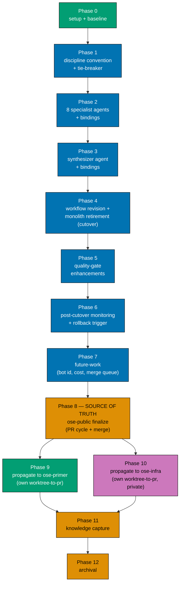

# Delivery Checklist — Worktree-to-PR Hardening

This checklist ships the decomposition of `pr-review-maker` into eight specialist reviewers plus a
mandatory `pr-review-synthesis-maker` coordinator, a reviewer-discipline convention with the boundary
tie-breaker, the workflow revision, the quality-gate enhancements, and the measurement/eval plan. It
ships **no application code** — every artifact is agent-definition markdown or governance/workflow
markdown plus register/binding updates.

> **Legend** — `[AI]`: an agent performs the step (the default; unmarked steps are `[AI]`).
> `[HUMAN]`: only a human can do it (physical action, out-of-band approval, real-secret or
> privileged-credential handling). `[AI+HUMAN]`: agent prepares, human approves or finishes.
> Git-mechanical steps (worktree create/remove, branch, commit, push, merge) are `[AI]`.
>
> **Phase Gate** — every phase ends with a `### Phase N Gate` (must-pass verification) plus a
> `> **Pause Safety**:` note (safe-to-stop state + resume command). A phase is not complete until
> every gate check is green; phase N+1 does not start while any phase N gate check is failing.

<!-- -->

> **Execution prerequisite** — **all decisions D1–D15 are now decided**; this delivery.md reflects
> every one. In particular: **D1** (7 specialists) + **D14** (an eighth specialist,
> `pr-review-instruction-maker`, for instruction-decay) → **8 specialists + coordinator**; **D2** (retire
> the monolith at cutover); **D3** (coordinator name `pr-review-synthesis-maker`); **D4** (adversarial
> verification on high-risk diffs only); **D5** (specialists `sonnet`, coordinator opus); **D6**
> (absolute-threshold rollback bar — no monolith baseline); **D7 / D10** (merge queue — **NOT adopted;
> dropped from scope**: the repo's branch settings do not expose a merge-queue toggle, so it is deferred
> to future-work and precondition (c) stays the manual branch-up-to-date check); **D8**
> (convention at `repo-governance/development/quality/pr-review-disciplines.md`, 4-tier severity kept);
> **D9** (keep one `pr-review-fixer`); **D11** (parallel downstream propagation); **D12** (3-tier risk
> fan-out); **D13** (**no** diff filtering / **no** generated-file exclusion — reviewers see the full
> diff); **D15** (archival deferred to Phase 12 as the DAG terminal cleanup node — ratifies the
> Archival-in-PR carve-out for the `ose-public` PR under 3-repo-parity). See
> [tech-docs.md §Grilling Deferred](./tech-docs.md#grilling-deferred--decisions-for-maintainer) for the
> full decision record.
>
> **Three-repo parity scope** — Phases 0–8 deliver the change set in `ose-public` (the **source of
> truth**). Phases 9 (`ose-primer`) and 10 (`ose-infra`) then propagate the identical shared-scaffolding
> artifacts to the two downstream repos, **each as its own `worktree-to-pr` delivery in its own repo**,
> delivered in the spirit of the [multi-repo parity workflow](../../../repo-governance/workflows/plan/plan-multi-repo-parity-planning-and-execution.md)
> but adapted to this plan's single shared plan folder rather than that workflow's canonical
> one-folder-per-repo output — see [tech-docs.md §Repo Scope & Propagation](./tech-docs.md#repo-scope--propagation-three-repo-parity)
> for the rationale. The two downstream phases are independent of each other (D11). Because Phases 9–11
> have not yet run at Phase 8 merge time, **Phase 12's archival is deliberately deferred** past Phase
> 8's merge — a documented exception to the Archival-in-PR default, landed as a trailing direct-push
> commit to `ose-public` `main` (see [tech-docs.md §Archival Timing](./tech-docs.md#archival-timing--a-documented-exception-to-archival-in-pr)).
> The `## Worktree` and `## Delivery Mode` sections below describe the **`ose-public`** delivery; each
> downstream phase provisions its own worktree in its own repo.

## Worktree

Worktree path: `worktrees/worktree-to-pr-hardening/`

Optional manual pre-provisioning (run from repo root):

```bash
claude --worktree worktree-to-pr-hardening
```

The plan-execution Step 0 gate enters this worktree by default: it auto-provisions from the latest
`origin/main` when missing, syncs with `origin/main` before implementing, and prompts before deleting
the worktree after the plan is archived and pushed.

See [Worktree Path Convention](../../../repo-governance/conventions/structure/worktree-path.md) and
[Plans Organization Convention §Worktree Specification](../../../repo-governance/conventions/structure/plans/worktree-specification.md#worktree-specification).

## Delivery Mode: worktree-to-pr

Work in `worktrees/worktree-to-pr-hardening/`; open a draft PR against `main`; run the
**PR-Review Maker→Fixer Cycle** (3 sequential CI-gated cycles) before an `[AI]` merge once the five
hardened merge preconditions hold. This plan dogfoods the workflow it hardens. Per the
[Git Push Default Convention](../../../repo-governance/development/workflow/git-push-default.md), the
finalization phase opens the draft PR; git-mechanical steps are `[AI]`.

## Dependency DAG



**ose-public (source of truth)**: Phases 0–7 are strictly sequential, delivered in one worktree and
one draft PR; Phase 8 runs the review cycle + merge once for that PR.

**Propagation (downstream)**: Phases 9 (ose-primer) and 10 (ose-infra) both depend on Phase 8's
merge and are **independent of each other** — they may run in parallel (D11). Each is its own
`worktree-to-pr` delivery in its own repo, each with its own per-repo binding-emit. Knowledge Capture
(Phase 11) and Archival (Phase 12) run once, after all three repos are done.

## Parallelization Model

**Serial spine (Phases 0-8)**: Phase 0 through Phase 8 are strictly **serial** in `ose-public` — each
phase's artifacts are the source of truth the next phase builds on (the convention → the specialists →
the coordinator → the workflow cutover → the enhancements → the monitoring plan → future-work → the
`ose-public` PR merge). No fan-out inside this spine.

**Parallel branch (Phase 9 / Phase 10)**: once Phase 8 merges, Phase 9 (`ose-primer`) and Phase 10
(`ose-infra`) are the plan's only concurrent pair — both `blockedBy: Phase 8`, no edge between them
(D11) — because they touch different repos, share no files, and neither reads what the other writes.

**Join + terminal (Phase 11 / Phase 12)**: Phase 11 (Knowledge Capture) depends on both Phase 9 and
Phase 10 completing; Phase 12 (Archival) is the **terminal node**, depending on Phase 11 — it never
runs while a delivery node it depends on is still in flight. See
[tech-docs.md §Archival Timing](./tech-docs.md#archival-timing--a-documented-exception-to-archival-in-pr)
for why Phase 12 is deliberately deferred this far past Phase 8's merge.

**Chosen N**: this plan's only fan-out point is the Phase 9/Phase 10 pair — **N=2**, well under the
[Agent Workflow Orchestration Convention](../../../repo-governance/development/agents/agent-workflow-orchestration.md)'s
default N=3 (1 main thread + N background agents). No other point in this plan fans out; Phases 0-8
and Phase 11-12 are single-threaded by construction (each is one worktree, one PR, one repo).

---

## Phase 0: Environment Setup and Baseline

> _Executor: repo-setup-manager_

- [x] [AI] Provision the worktree from latest `origin/main`: `git worktree add worktrees/worktree-to-pr-hardening origin/main`
      — acceptance: `worktrees/worktree-to-pr-hardening/` exists and is on a fresh branch off `origin/main`
- [x] [AI] Install dependencies in the root worktree: `npm install`
      — acceptance: exits 0, `node_modules/` synchronized
- [x] [AI] Converge the toolchain in the root worktree: `npm run doctor -- --fix`
      — acceptance: exits 0 with no unresolved drift
- [x] [AI] Record the markdown/binding baseline: `npx nx affected -t lint` and `npm run lint:md:fix` (dry read)
      — acceptance: baseline pass/fail recorded; any preexisting failures documented
- [x] [AI] Confirm the binding sync baseline is clean: run `npm run generate:bindings` then `git status --porcelain`
      — acceptance: no diff (bindings already in sync before any change)
- [x] [AI] Resolve all preexisting failures before proceeding
      — acceptance: no preexisting failures remain unresolved
- [x] [AI] Delegate to `web-researcher`: re-verify the remaining ~7 unverified `[Web-cited]` claims in
      [tech-docs.md §Research Grounding](./tech-docs.md#research-grounding-citations) — BitsAI-CR
      ([arXiv 2501.15134](https://arxiv.org/abs/2501.15134)), CodeAgent
      ([arXiv 2402.02172](https://arxiv.org/abs/2402.02172)), the two confidence-calibration papers
      ([arXiv 2603.06604](https://arxiv.org/abs/2603.06604),
      [arXiv 2604.06723](https://arxiv.org/abs/2604.06723)), Refute-or-Promote
      ([arXiv 2604.19049](https://arxiv.org/abs/2604.19049)), the repair-loop paper
      ([arXiv 2607.05197](https://arxiv.org/abs/2607.05197)), and the Graphite/Ramp 74%-faster-merges
      claim (the Cloudflare blog post and SWR-Bench citations were already independently spot-verified
      by `plan-checker` and do not need re-verification)
      — acceptance: each claim's status in `tech-docs.md` is updated to `[Verified]`/`[Outdated]`/`[Error]`,
      with any inaccuracy corrected, before Phase 1's substantive convention-authoring work begins

### Phase 0 Gate

> All checks below must pass before starting Phase 1.

- [x] [AI] `npm install` exited 0 and `npm run doctor -- --fix` reports no unresolved drift
- [x] [AI] `npm run generate:bindings` produces zero diff against a clean tree (baseline sync confirmed)
- [x] [AI] Markdown/lint baseline recorded and every preexisting failure resolved
- [x] [AI] All ~7 remaining `[Web-cited]` claims in `tech-docs.md` §Research Grounding are re-verified
      and labeled `[Verified]`/`[Outdated]`/`[Error]`; any inaccuracy is corrected

> **Pause Safety**: only the local toolchain was verified and the baseline recorded — no plan work
> exists yet. Safe to stop indefinitely. To resume: re-run `npm run generate:bindings && git status --porcelain`
> and confirm it is still clean.

---

## Phase 1: Reviewer-Discipline Convention + Tie-Breaker

> _Suggested executor: `repo-rules-maker`_

- [x] [AI] Create the reviewer-discipline convention (D8 → `repo-governance/development/quality/pr-review-disciplines.md`,
      sibling reference `repo-governance/development/quality/ci-blocker-resolution.md`) defining the
      eight disciplines, each discipline's owned/not-owned scope, and the **boundary tie-breaker rule**
      (documented rule → governance; new tradeoff → architecture; domain-intent → correctness)
      — acceptance: file exists; `grep -c "tie-breaker" repo-governance/development/quality/pr-review-disciplines.md` ≥ 1; the architecture↔correctness
      boundary is named as the coordinator's re-categorization responsibility
- [x] [AI] Embed the six grey-zone rulings verbatim (four core: new cross-module dependency; naming
      format vs. should-this-boundary-exist; error-handling shape vs. domain error scenarios; spec-file
      presence vs. scenario completeness — plus the two D1-added: performance↔architecture and
      docs↔governance)
      — acceptance: all six rulings present; `grep -c "→" repo-governance/development/quality/pr-review-disciplines.md` ≥ 6
- [x] [AI] Document the **Cloudflare-folded cost/noise mechanics** in the convention, mirroring
      [tech-docs.md §Cost-Control & Noise-Control Mechanics](./tech-docs.md#cost-control--noise-control-mechanics-cloudflare-production-learnings--folded-2026-07-23):
      the **risk-tier fan-out** (D12: trivial → coordinator-only, lite → 4 specialists, full → all 8
      specialists; security-sensitive paths force full), the
      **shared-context extract-once + coordinator-discretion large-diff handling** (D13: NO
      generated-file exclusion — reviewers see the full diff), the per-specialist **`SUPPRESS` block**
      requirement, the **instruction-decay** dedicated specialist (D14), the **human-dismissal-respect**
      re-review rule, and the **boundary-tag-strip** untrusted-input hardening
      — acceptance: `grep -cE "risk-tier|SUPPRESS|instruction-decay|shared-context" repo-governance/development/quality/pr-review-disciplines.md` ≥ 4; the
      convention states D13 chose no generated-file exclusion (reviewers see the full diff) and CI runs
      over everything regardless
- [x] [AI] Add the accessible Mermaid boundary-decision flowchart (color-blind palette) mirroring
      [tech-docs.md](./tech-docs.md#boundary-decision-the-tie-breaker-as-a-flowchart)
      — acceptance: `npx rhino-cli md mermaid validate repo-governance/development/quality/pr-review-disciplines.md` (or repo md-mermaid gate) exits 0
- [x] [AI] Cross-link the new convention from `repo-governance/development/README.md` index if the repo
      indexes conventions there (verify with `grep -rn "ci-blocker-resolution" repo-governance/development/README.md`)
      — acceptance: new convention linked, or its absence confirmed as not-indexed with a note
  - _Suggested executor: `repo-rules-maker`_

### Phase 1 Gate

> All checks below must pass before starting Phase 2.

- [x] [AI] `npx nx affected -t lint` (or `npm run lint:md:fix` + markdownlint) passes on the new convention
- [x] [AI] `rhino-cli md links validate` and `md mermaid validate` pass for the new file
- [x] [AI] Invoke `repo-rules-checker` against `repo-governance/development/quality/pr-review-disciplines.md`
      — acceptance: audit report generated in `generated-reports/`; 0 CRITICAL/HIGH findings (this is
      the substantively meaningful gate for this plan's own new governance artifact — the `nx affected`
      checks above are expected to report zero affected projects for a `repo-governance/`-only diff)
- [x] [AI] Commit created: `docs(governance): add PR reviewer-discipline convention + tie-breaker` and pushed to the plan branch

> **Pause Safety**: the convention is a standalone governance doc with no dangling references; the repo
> is coherent with it present. Safe to stop. To resume: re-run the md link/mermaid validators on the
> new file.

---

## Phase 2: Eight Specialist Reviewer Agents + Bindings

> _Suggested executor: `agent-maker`_ — one checkbox each for the eight agents (D1 = 7 + D14
> instruction-decay = 8). Model tier per D5 (decided): every specialist inherits **`sonnet`**; the
> coordinator (Phase 3) inherits **opus**. Frontmatter `color: blue` (Maker role, per the
> [AI Agents Convention](../../../repo-governance/development/agents/ai-agents.md) role-color mapping)
> for all eight, matching the retired monolith's own `color: blue`.

- [x] [AI] Author `.claude/agents/pr-review-architecture-maker.md` (sibling reference
      `.claude/agents/pr-review-maker.md`) with the architecture charter from
      [tech-docs.md §Agent Charters](./tech-docs.md#agent-charters-non-overlapping), inheriting the
      monolith's hard rules verbatim (confidence ≥ 80, evidence, anti-sycophancy, scope-guard,
      untrusted-input, Reviews-API `COMMENT`, cross-cycle re-review) and the `sonnet` specialist tier (D5)
      — acceptance: file present; frontmatter `name: pr-review-architecture-maker`; suffix matches the
      naming regex `-(maker|checker|fixer|dev|deployer|manager|tester|researcher)$`
  - _Suggested executor: `agent-maker`_
- [x] [AI] Author `.claude/agents/pr-review-logic-maker.md` (business-logic/correctness incl. Gherkin
      acceptance-criteria conformance), same inheritance + charter
      — acceptance: file present; charter names logic/correctness as its sole discipline; NOT-its-job
      routes to governance + architecture per the charter table
  - _Suggested executor: `agent-maker`_
- [x] [AI] Author `.claude/agents/pr-review-governance-maker.md` (mechanical `repo-governance/`
      conformance, naming/structure, spec-file presence), same inheritance + charter — instruction-decay
      is **NOT** its job (D14 → B gave that its own eighth specialist; route it to `pr-review-instruction-maker`)
      — acceptance: file present; explicitly routes "should a new rule exist" to architecture,
      "scenario completeness" to logic, and instruction-decay to `pr-review-instruction-maker`
  - _Suggested executor: `agent-maker`_
- [x] [AI] Author `.claude/agents/pr-review-security-maker.md` (secrets, injection, untrusted-input,
      git-fixture isolation, unsafe git/FS ops), same inheritance + charter
      — acceptance: file present; cites the git-fixture-isolation + no-secrets rules as in-charter
  - _Suggested executor: `agent-maker`_
- [x] [AI] Author `.claude/agents/pr-review-integrity-maker.md` (CI-gaming/test-integrity +
      regression-test-mandate), same inheritance + charter
      — acceptance: file present; cites the regression-test-mandate + ci-blocker-resolution rules
  - _Suggested executor: `agent-maker`_
- [x] [AI] Author `.claude/agents/pr-review-performance-maker.md` (concrete/likely perf regressions,
      hot paths, algorithmic complexity, resource use), same inheritance + charter
      — acceptance: file present; NOT-its-job routes a quality-attribute tradeoff to architecture per
      the charter table (performance↔architecture grey-zone)
  - _Suggested executor: `agent-maker`_
- [x] [AI] Author `.claude/agents/pr-review-docs-maker.md` (substantive doc quality/completeness,
      README/docs/Diátaxis fit, doc drift, doc alt-text/a11y), same inheritance + charter
      — acceptance: file present; NOT-its-job routes mechanical doc-convention conformance to governance
      per the charter table (docs↔governance grey-zone)
  - _Suggested executor: `agent-maker`_
- [x] [AI] Author `.claude/agents/pr-review-instruction-maker.md` (D14 → B: **instruction-decay** — a
      framework/build-tool/package-manager/env-var/CI change in the diff not reflected in
      `AGENTS.md`/`CLAUDE.md`/`.claude/`; instruction bloat >200 lines / generic filler), same
      inheritance + charter + the `sonnet` specialist tier (D5)
      — acceptance: file present; frontmatter `name: pr-review-instruction-maker`; charter names
      instruction-decay as its sole discipline; NOT-its-job routes mechanical convention conformance to
      governance and "should a new rule exist" to architecture per the charter table
  - _Suggested executor: `agent-maker`_
- [x] [AI] Give every specialist file an explicit **`SUPPRESS` block** (what it must NOT raise at all —
      nitpicks, style already enforced by a mechanical gate, speculative "consider adding X" when X is
      present, defense-in-depth on adequately-defended paths), distinct from its NOT-its-job routing
      column, and inherit the two sharpened rules (re-review **does not re-raise a human-dismissed
      finding**; untrusted-input **strips user-supplied boundary tags** from PR body/comment/issue text)
      — acceptance: `grep -lc "SUPPRESS" .claude/agents/pr-review-*-maker.md` lists all eight specialist
      files; each also references the human-dismissal-respect and boundary-tag-strip rules
- [x] [AI] Register all eight in `AGENTS.md` §AI Agents lists and `.claude/agents/README.md` catalog
      under the appropriate section
      — acceptance: `grep -o "pr-review-architecture-maker\|pr-review-logic-maker\|pr-review-governance-maker\|pr-review-security-maker\|pr-review-integrity-maker\|pr-review-performance-maker\|pr-review-docs-maker\|pr-review-instruction-maker" AGENTS.md | wc -l` = 8
      (occurrence-count via `grep -o` + `wc -l`, not `grep -c`, so multiple names on one register line
      are each counted — `grep -c` counts matching LINES, which would undercount if 2+ names share a line)
- [x] [AI] Regenerate bindings: `npm run generate:bindings`
      — acceptance: `.opencode/agents/pr-review-*-maker.md` and `.amazonq/` artifacts created; exits 0
- [x] [AI] Verify binding sync: `git status --porcelain` shows only intended new/edited files and the
      sync-validation gate is green
      — acceptance: `npx nx run rhino-cli:instruction-size:validation` (if applicable) and the
      validate:sync check pass with zero drift

### Phase 2 Gate

> All checks below must pass before starting Phase 3.

- [x] [AI] All eight specialist files pass the agent-naming regex and carry valid frontmatter
      (including `color: blue`, the Maker role)
- [x] [AI] `npm run generate:bindings` re-run produces zero _additional_ diff (bindings settled)
- [x] [AI] `npx nx affected -t lint` passes; registers list all eight agents
- [x] [AI] Commit created: `feat(agents): add eight specialist PR-review reviewer agents` and pushed

> **Pause Safety**: the eight specialists exist and are registered but are not yet wired into any
> workflow — they are inert until Phase 4 references them, and the monolith is still the live reviewer.
> The repo is coherent (agents can be invoked by name but nothing calls them). Safe to stop. To resume:
> re-run `npm run generate:bindings && git status --porcelain`.

---

## Phase 3: Coordinator / Synthesizer Agent + Bindings

> _Suggested executor: `agent-maker`_ — resolve **D3** (name; default `pr-review-synthesis-maker`).
> Per D5 (decided) the coordinator inherits **opus** (top tier) — it is the single quality chokepoint
> above the `sonnet` specialists. Frontmatter `color: blue` (Maker role — the model tier does not
> change the role-color mapping), matching the retired monolith's own `color: blue`.

- [x] [AI] Author `.claude/agents/pr-review-synthesis-maker.md` (name per D3) implementing the four
      coordination functions from [tech-docs.md §Coordinator Contract](./tech-docs.md#coordinator-contract-the-mandatory-synthesizer):
      dedup, re-categorize (owns architecture↔correctness), reasonableness-filter, tool-verify; emits
      exactly one consolidated review; top model tier justified in a Model Selection Justification block
      — acceptance: file present; frontmatter names the top tier (inherited opus); charter states it
      produces ONE consolidated review consumed by `pr-review-fixer`
  - _Suggested executor: `agent-maker`_
- [x] [AI] Give the coordinator the folded pre/post-fan-out duties (D12/D13): **classify the PR risk-tier**
      (trivial/lite/full, security paths force full) and select the specialist set accordingly; **assemble
      the shared-context brief once** (PR metadata + linked-plan/issue + the **full diff**, D13: no
      generated-file exclusion — reviewers see everything) rather than each specialist re-deriving it;
      **read prior-cycle thread resolution status** (including human "won't fix") before fanning out;
      record the tier + any coordinator-discretion diff-slicing in the consolidated review header
      — acceptance: charter names the risk-tier classification, the shared-context assembly, the
      **no-exclusion full-diff posture (D13)**, and the human-dismissal read; the review header format includes the tier
  - _Suggested executor: `agent-maker`_
- [x] [AI] Register the coordinator in `AGENTS.md` and `.claude/agents/README.md`
      — acceptance: coordinator listed in both registers
- [x] [AI] Regenerate + verify bindings: `npm run generate:bindings` then `git status --porcelain`
      — acceptance: OpenCode + Amazon-Q mirrors created; sync-validation green with zero drift

### Phase 3 Gate

> All checks below must pass before starting Phase 4.

- [x] [AI] Coordinator file passes the naming regex and carries a Model Selection Justification block;
      frontmatter includes `color: blue` (Maker role)
- [x] [AI] `npm run generate:bindings` re-run produces zero additional diff
- [x] [AI] `npx nx affected -t lint` passes; registers list the coordinator
- [x] [AI] Commit created: `feat(agents): add pr-review-synthesis-maker coordinator` and pushed

> **Pause Safety**: all nine new agents (eight specialists + coordinator) exist and are registered but
> still unwired — the live review gate remains the untouched monolith. Safe to stop. To resume: re-run
> the binding sync check.

---

## Phase 4: Workflow Revision + Monolith Retirement (Cutover)

> _Suggested executor: `repo-workflow-maker`_ — this is the **cutover** phase: the eight specialists +
> coordinator become the live reviewer and the monolith is **retired immediately** (D2), in one
> coherent phase.

- [x] [AI] Revise `repo-governance/workflows/pr/pr-review-quality-gate.md`: replace the single-maker
      per-cycle pass with **fan-out to the eight specialists → `pr-review-synthesis-maker` → one
      consolidated review → `pr-review-fixer`**; keep the 3-cycle hard ceiling, no-early-exit, and the
      CI-green gate between cycles verbatim
      — acceptance: `grep -c "pr-review-synthesis-maker" pr-review-quality-gate.md` ≥ 1; the Loop
      Algorithm block shows fan-out→synthesize→fixer; the "3, hard ceiling" wording is unchanged
- [x] [AI] Update the Participants + sequence diagram in that workflow to show the eight specialists +
      coordinator (accessible Mermaid palette)
      — acceptance: `rhino-cli md mermaid validate` passes; diagram lists all nine agents
- [x] [AI] Update `repo-governance/development/workflow/pr-merge-protocol.md`: the **structural shape**
      of the five hardened preconditions — five preconditions, same `(a)-(e)` lettering, same
      substantive gates — stays intact; **only the reviewer-agent name inside precondition (a)** is
      repointed from the retired `pr-review-maker` to the new pipeline (e.g. "the configured PR-review
      cycle (fan-out → `pr-review-synthesis-maker` → `pr-review-fixer`) is complete (default 3)"), since
      leaving `pr-review-maker` as live text inside (a) would itself be the dangling reference the sweep
      step below exists to catch. No other precondition's substance changes (the merge queue was dropped
      from scope, so precondition (c) keeps its manual branch-up-to-date form)
      — acceptance: `grep -c "all five" pr-merge-protocol.md` unchanged; precondition lettering (a)-(e)
      intact (`grep -c "\*\*(a)\*\*\|\*\*(b)\*\*\|\*\*(c)\*\*\|\*\*(d)\*\*\|\*\*(e)\*\*" pr-merge-protocol.md` unchanged);
      precondition (a)'s text no longer names the retired `pr-review-maker` as the live reviewer
- [x] [AI] **Retire the monolith (D2)**: `git rm .claude/agents/pr-review-maker.md` and delete its
      entries from `AGENTS.md` §AI Agents lists and `.claude/agents/README.md` catalog
      — acceptance: `test ! -f .claude/agents/pr-review-maker.md`; `grep -c "pr-review-maker\b" AGENTS.md`
      returns `0` (the specialist/coordinator names like `pr-review-synthesis-maker` do not match the
      bounded `pr-review-maker` pattern, so any non-zero count would flag a residual monolith reference)
- [x] [AI] Regenerate bindings so the monolith's mirrors are also removed: `npm run generate:bindings`
      — acceptance: `test ! -f .opencode/agents/pr-review-maker.md`; `git status --porcelain` shows the
      deletion and zero unexpected drift
- [x] [AI] Grep the repo for any dangling reference to the retired monolith and repoint it to the
      synthesizer or the specialist set: `grep -rn "pr-review-maker" repo-governance/ .claude/ AGENTS.md CLAUDE.md`
      — acceptance: no reference points to the monolith as a live reviewer (workflow/name references now
      read `pr-review-synthesis-maker` + the specialists); `CLAUDE.md`'s "Delivery Mode default
      (Claude-Code binding)" note (which names `pr-review-maker` and `pr-review-fixer` explicitly) is
      updated to name the new coordinator/specialist set in place of the retired monolith
- [x] [AI] Edit `AGENTS.md`'s "PR Review Cycle" catalog line (the brace-notation
      `pr-review-{maker,fixer}` line, currently ~line 327) specifically — the plain-substring grep above
      does not match it because the brace `{` breaks the literal `pr-review-maker` substring, so this
      line survives that sweep undetected. Update it to name the new coordinator + specialist set (e.g.
      `pr-review-synthesis-maker` + the eight `pr-review-*-maker` specialists)
      — acceptance: `grep -c "pr-review-{maker" AGENTS.md` returns `0`; the "PR Review Cycle" line names
      `pr-review-synthesis-maker` and/or the specialist set instead
- [x] [AI] Edit `.claude/agents/pr-review-fixer.md` — repoint all 8 references to the retired
      `pr-review-maker` (frontmatter `description` + 7 body sites) to name `pr-review-synthesis-maker`
      and/or "the eight specialists" as contextually appropriate (e.g. the frontmatter `description`'s
      "posted by `pr-review-maker`" and line 175's "the same trust boundary `pr-review-maker`
      [establishes]" each need their own contextually-correct rewrite, not a single mechanical
      find-replace) — acceptance: `grep -c "pr-review-maker" .claude/agents/pr-review-fixer.md` returns
      `0`; the file's core triage contract (4-way triage) is otherwise unchanged
- [x] [AI] Cross-check every inbound reference to the workflow still resolves:
      `rhino-cli md links validate repo-governance/workflows/pr/pr-review-quality-gate.md`
      — acceptance: exits 0, no broken links

### Phase 4 Gate

> All checks below must pass before starting Phase 5.

- [x] [AI] The workflow describes fan-out→synthesize→fixer and preserves the 3-cycle ceiling + CI gate
- [x] [AI] `pr-merge-protocol.md` preconditions (a)-(e) keep their structural shape — five
      preconditions, same lettering, same substantive gates — with only precondition (a)'s
      reviewer-agent name updated to the new pipeline; no other precondition's text changed
- [x] [AI] The monolith is gone: `test ! -f .claude/agents/pr-review-maker.md` and no register or
      binding lists it; `npm run generate:bindings` produces zero additional diff
- [x] [AI] `rhino-cli md links validate` + `md mermaid validate` pass on all edited docs; no dangling
      `pr-review-maker` reference remains anywhere in `repo-governance/`, `.claude/`, `AGENTS.md`, or
      `CLAUDE.md`
- [x] [AI] Invoke `repo-workflow-checker` against the revised
      `repo-governance/workflows/pr/pr-review-quality-gate.md`
      — acceptance: audit report generated in `generated-reports/`; 0 CRITICAL/HIGH findings (the
      substantively meaningful gate for this phase's revised workflow doc, complementing the `nx
affected` no-op noted in Phase 8)
- [x] [AI] Commit created: `refactor(workflow): cut over PR review to specialists + synthesizer, retire monolith` and pushed

> **Pause Safety**: cutover is complete and self-consistent — the eight specialists + coordinator are
> the documented live reviewer, the monolith is deleted (recoverable from git history), and no dangling
> reference remains. Safe to stop. To resume: re-run `npm run generate:bindings && git status --porcelain`
> and the md link validators.

---

## Phase 5: Quality-Gate Enhancements

> _Suggested executor: `repo-rules-maker`_

- [x] [AI] Add the **confidence-calibration spot-check** procedure to the reviewer-discipline
      convention (sample past findings, compare stated confidence vs. fixer triage outcome, recalibrate
      the ≥80 threshold)
      — acceptance: `grep -ci "calibration" repo-governance/development/quality/pr-review-disciplines.md` ≥ 1; procedure is a documented manual step
- [x] [AI] Add the **selective adversarial verification** rule scoped to high-risk diffs per **D4**
      (auth/payments/migrations/security/public-API), including the cross-model-diversity note
      — acceptance: `grep -ci "adversarial\|high-risk" repo-governance/development/quality/pr-review-disciplines.md` ≥ 1; scope stated explicitly
- [x] [AI] Add the **CRITICAL-requires-reproduction** rule (CRITICAL findings carry a reproduction, not
      agreement-counting)
      — acceptance: `grep -ci "reproduction" repo-governance/development/quality/pr-review-disciplines.md` ≥ 1
- [x] [AI] Document the **3-cycle / no-early-exit rationale** explicitly as a predictability policy
      choice, NOT research-derived
      — acceptance: `grep -ci "predictability" repo-governance/development/quality/pr-review-disciplines.md` ≥ 1; the note disclaims research-backing

### Phase 5 Gate

> All checks below must pass before starting Phase 6.

- [x] [AI] All four enhancements present in the convention and internally cross-linked
- [x] [AI] `npx nx affected -t lint` + `rhino-cli md links validate` pass
- [x] [AI] Commit created: `docs(governance): add PR-review quality-gate enhancements` and pushed

> **Pause Safety**: the enhancements are additive documentation; nothing depends on them being wired
> to code. Safe to stop. To resume: re-run the md link validator on the convention.

---

## Phase 6: Post-Cutover Monitoring Plan + Rollback Trigger

> _Suggested executor: `repo-rules-maker`_ — D6 is **decided**: an **absolute-threshold rollback bar**
> with no pre-cutover monolith baseline (resolving the D2×D6 contradiction). The monolith was already
> retired at cutover (Phase 4); this phase documents how the split is watched afterward and the fixed
> thresholds that trip a rollback.

- [x] [AI] Author the post-cutover monitoring section in the convention: precision, per-discipline
      acceptance rate (watching the two added lenses `performance`/`docs` and the catch-all
      `governance`/`logic`), BitsAI-CR "Outdated Rate", cost/latency per review **tracked per risk-tier**
      (D12 — a flat cost across tiers means the tiering is not taking effect), and the **human-override
      rate** (Cloudflare's break-glass trust proxy, an early trust-erosion signal)
      — acceptance: `grep -ci "Outdated Rate\|acceptance rate\|precision\|override rate\|risk-tier" repo-governance/development/quality/pr-review-disciplines.md` ≥ 2; the section
      is framed as post-cutover monitoring, not a pre-cutover gate
- [x] [AI] Document the **rollback trigger** (D6 decided — absolute thresholds): the **fixed absolute
      bar** (proposed, maintainer-tunable: consolidated-finding precision < 50% over a rolling N-PR
      window, OR human-override-rate > 5%, OR any CRITICAL false-positive reaching the fixer — **no
      monolith baseline required**), the monitoring window N, and the exact restore procedure
      (`git revert`/`git checkout` of the deleted `pr-review-maker.md` + register entries, then
      `npm run generate:bindings`)
      — acceptance: `grep -ci "rollback\|precision <\|override-rate\|absolute" repo-governance/development/quality/pr-review-disciplines.md` ≥ 2; the
      restore procedure is a non-destructive forward operation (no history rewrite); the absolute bar is
      recorded in the convention and `learnings.md`, and the doc explicitly notes it needs no pre-cutover
      baseline (D2×D6 contradiction resolved)

### Phase 6 Gate

> All checks below must pass before starting Phase 7.

- [x] [AI] The monitoring plan defines the metric families and is framed as post-cutover (not a gate)
- [x] [AI] The rollback trigger, bar, and non-destructive restore procedure are documented
- [x] [AI] `npx nx affected -t lint` + `rhino-cli md links validate` pass
- [x] [AI] Commit created: `docs(governance): add PR-review post-cutover monitoring + rollback trigger` and pushed

> **Pause Safety**: the monitoring plan and rollback path are documented; the split is the live reviewer
> and the monolith stays recoverable from git history. Safe to stop. To resume: re-run the md link
> validator on the convention.

---

## Phase 7: Future-Work Workstream

> _Suggested executor: `repo-rules-maker`_

- [x] [AI] Add a `## Future Work` section to `repo-governance/development/quality/pr-review-disciplines.md`
      (the convention created in Phase 1) and cross-reference the existing bot-identity two-pager
      [`plans/ideas/pr-review-bot-identity.md`](../../ideas/q2-not-urgent-important/pr-review-bot-identity.md) as the owner of
      the AI-attribution / `REQUEST_CHANGES` gap
      — acceptance: `grep -c "## Future Work" repo-governance/development/quality/pr-review-disciplines.md` = 1;
      `test -f plans/ideas/pr-review-bot-identity.md` passes and the `## Future Work` section links it
- [x] [AI] Add the **cost/latency budgeting** note (≈$1 × 8 specialists × 3 cycles, bounded by the
      D12 risk-tier fan-out; monitor per-PR review cost) referencing the Cloudflare median, inside the
      `## Future Work` section of `repo-governance/development/quality/pr-review-disciplines.md`
      — acceptance: `grep -ci "cost\|budget" repo-governance/development/quality/pr-review-disciplines.md` ≥ 1
- [x] [AI] Record the **deferred merge queue** (D7/D10): a merge queue was researched (GitHub-native vs
      Graphite) but **NOT adopted** — the repo's branch settings do not expose a merge-queue toggle, so
      precondition (c) stays the manual branch-up-to-date check. The deferred work is owned by the
      standalone [`merge-queue-adoption`](../../ideas/q2-not-urgent-important/merge-queue-adoption.md) backlog plan; record this
      inside the same `## Future Work` section of `repo-governance/development/quality/pr-review-disciplines.md`
      — acceptance: `grep -ci "merge queue" repo-governance/development/quality/pr-review-disciplines.md` ≥ 1; the note states it is deferred,
      not delivered, links `merge-queue-adoption`, and confirms precondition (c) is unchanged

### Phase 7 Gate

> All checks below must pass before starting Phase 8.

- [x] [AI] Future-work section covers the bot-identity cross-ref, cost budgeting, and the deferred
      merge queue (researched, not adopted — no branch-protection merge-queue setting available)
- [x] [AI] `rhino-cli md links validate` passes (bot-identity link resolves); `npx nx affected -t lint` passes
- [x] [AI] Commit created: `docs(governance): add worktree-to-PR future-work workstream` and pushed

> **Pause Safety**: all substantive content is authored and committed to the plan branch; the draft PR
> (if already open) reflects the full change set. Safe to stop. To resume: re-run the md link validator
> across the plan's edited docs.

---

## Phase 8: ose-public Finalization — Source of Truth (PR-Review Cycle + Merge)

> This is the **blocking source-of-truth node**: the two downstream propagation phases (9 & 10)
> cannot start until this PR merges to `ose-public` `main`. See
> [tech-docs.md §Repo Scope & Propagation](./tech-docs.md#repo-scope--propagation-three-repo-parity).
> Per [D15 — Archival timing under 3-repo-parity Archival-in-PR tension](./tech-docs.md#d15--archival-timing-under-3-repo-parity-archival-in-pr-tension)
> (maintainer-ratified), this PR merges **without** the `git mv … plans/done/` archival move — that
> move is deliberately deferred to Phase 12.

### Local Quality Gates (Before Push)

> **Expected outcome note**: this plan's diff lives entirely under `.claude/agents/**`,
> `repo-governance/**`, and root `AGENTS.md`/`CLAUDE.md`/`.claude/agents/README.md` — none of which sit
> inside an Nx project root or `sharedGlobals`. The four `nx affected` steps below are therefore
> expected to legitimately report **zero affected projects** and exit 0 without validating this plan's
> actual deliverable; do not treat that as a tooling failure. The substantively meaningful checks for
> this plan's own governance/agent artifacts are the markdown gate below plus the `repo-rules-checker`
> (Phase 1 Gate) and `repo-workflow-checker` (Phase 4 Gate) invocations.

- [x] [AI] Run affected typecheck: `npx nx affected -t typecheck` — exits 0 (zero affected projects expected)
- [x] [AI] Run affected linting: `npx nx affected -t lint` — exits 0 (zero affected projects expected)
- [x] [AI] Run affected quick tests: `npx nx affected -t test:quick` — exits 0 (zero affected projects expected)
- [x] [AI] Run affected spec coverage: `npx nx affected -t specs:coverage` — exits 0 (docs/agents plan;
      confirm no `specs/` regression)
- [x] [AI] Run the full markdown gate: `npm run lint:md:fix` then markdownlint — zero violations
- [x] [AI] Fix ALL failures — including preexisting issues not caused by this plan — then re-run to confirm

> **Important**: Fix ALL failures found during quality gates, not just those caused by your changes.
> This follows the root cause orientation principle — proactively fix preexisting errors encountered
> during work. Commit preexisting fixes separately with appropriate conventional commit messages.

### Commit Guidelines

- [x] [AI] Commit changes thematically (convention doc, specialist agents, coordinator, workflow
      cutover + monolith retirement, enhancements, monitoring/rollback, future-work as separate
      cohesive commits)
- [x] [AI] Follow Conventional Commits `<type>(<scope>): <description>`
- [x] [AI] Keep any preexisting fixes in their own commits, separate from plan work

### Open Draft PR + Post-Push CI Verification

- [x] [AI] Open a draft PR against `main`: `gh pr create --draft --base main`
      — acceptance: draft PR exists; its diff carries all nine new agents, the monolith deletion, and
      the governance/workflow edits
- [x] [AI] Monitor ALL GitHub Actions workflows on the PR (poll every 2 min per `ci-monitoring`)
      — acceptance: all CI checks green; no exceptions
- [x] [AI] If any CI check fails, fix at root cause and push a follow-up commit; repeat until green

### PR-Review Maker→Fixer Cycle (mandatory for `worktree-to-pr`)

> Runs the [PR Review Quality Gate workflow](../../../repo-governance/workflows/pr/pr-review-quality-gate.md)
> — 3 strictly sequential cycles, each CI-gated. **Because the monolith was retired at cutover (Phase 4),
> this plan's own PR is reviewed by the NEW pipeline** — the eight specialists fan out to
> `pr-review-synthesis-maker`, which posts the consolidated review that `pr-review-fixer` consumes. This
> is the plan dogfooding its own reviewer redesign; record the dogfooding observation in `learnings.md`.

- [x] [AI] Cycle 1: run the reviewer (per the live workflow) → `pr-review-fixer` triages, fixes,
      pushes, resolves → wait for CI green — acceptance: cycle 1 complete, CI green
- [x] [AI] Cycle 2: fresh reviewer pass (fed prior findings) → fixer → CI green — acceptance: cycle 2 complete
- [x] [AI] Cycle 3: fresh reviewer pass → fixer → CI green — acceptance: cycle 3 complete, no early exit
- [x] [AI] Flip the PR to ready: `gh pr ready` once the done-definition holds — acceptance: PR is ready-for-review

### Merge (once the five hardened preconditions hold)

- [x] [AI] Verify the five hardened merge preconditions (a)-(e) per
      [pr-merge-protocol.md](../../../repo-governance/development/workflow/pr-merge-protocol.md): (a)
      3 cycles complete + not escalated; (b) 0 CRITICAL + 0 HIGH; (c) branch non-destructively up to
      date with `origin/main`; (d) all gates green; (e) tester gates run or no-reachable-behavior
      exemption recorded (this plan changes no reachable behavior — record the docs/agents exemption
      explicitly) — acceptance: all five hold and are surfaced in the merge summary
- [x] [AI] Merge the PR (`[AI]` is the default actor once preconditions hold; precondition (c) is the
      manual non-destructive branch-up-to-date check — the merge queue was dropped from scope)
      — acceptance: PR merges to `main`; branch integrated

### Phase 8 Gate

> All checks below must pass before starting the propagation phases (9 & 10).

- [x] [AI] Draft PR opened, CI green, 3 review cycles complete with no `escalated` exit
- [x] [AI] Five merge preconditions (a)-(e) verified and surfaced; the (e) docs/agents exemption recorded
- [x] [AI] PR merged to `ose-public` `main` (or a `[HUMAN]` merge gate reached only if the plan later
      opts in — this plan does not)

> **Pause Safety**: the source-of-truth change set is either fully merged to `ose-public` `main` or
> sitting green-and-ready on the draft PR. Safe to stop between cycles (the loop is CI-gated) and safe
> to stop indefinitely after merge — the two downstream propagation phases are independent follow-on
> deliveries. To resume: re-check `gh pr checks <PR>`, or (post-merge) start Phase 9 and/or Phase 10.

---

## Phase 9: Propagate to ose-primer (own worktree-to-pr)

> Depends on Phase 8 merge; **independent of Phase 10** — may run in parallel (D11). This is a
> **separate `worktree-to-pr` delivery in the `ose-primer` repo** (its own worktree, PR, review cycle,
> and merge), delivered in the spirit of the [multi-repo parity planning-and-execution workflow](../../../repo-governance/workflows/plan/plan-multi-repo-parity-planning-and-execution.md)
> — see [tech-docs.md §Repo Scope & Propagation](./tech-docs.md#repo-scope--propagation-three-repo-parity)
> for the single-folder adaptation rationale. **Re-verify the bare-repo topology at execution time** —
> `ose-primer` is a BARE repo with worktrees; use the bare-repo git method (`-c core.bare=false
--work-tree=…`, or `GIT_DIR`/`GIT_WORK_TREE` for rhino-cli/bindings). See
> [tech-docs.md §Bare-repo topology caveat](./tech-docs.md#bare-repo-topology-caveat-re-verify-at-execution-time).

### Setup + Port

- [x] [AI] Re-verify `ose-primer`'s topology before any git op: confirm bare-vs-normal
      (`git -C <ose-primer> rev-parse --is-bare-repository`) and locate the worktrees root
      — acceptance: topology confirmed and the correct git-invocation method selected
- [x] [AI] Provision a worktree from the latest `origin/main` of `ose-primer`
      — acceptance: worktree exists on a fresh branch off `origin/main`
- [x] [AI] Initialize the toolchain: `npm install` then `npm run doctor -- --fix`
      — acceptance: both exit 0; `node_modules/` synchronized
- [x] [AI] Port the identical artifacts landed in `ose-public` Phase 8 (the reviewer-discipline
      convention, the eight specialist agents, `pr-review-synthesis-maker`, the `pr-review-quality-gate`
      workflow revision + monolith retirement, the `pr-merge-protocol.md` reviewer-count/shape edits, the
      quality-gate enhancements, and the monitoring/rollback doc) into `ose-primer`
      — acceptance: the diff matches `ose-public`'s agent/governance/workflow change set (no rhino-cli
      files touched — see the byte-identity note)
- [x] [AI] Regenerate the platform bindings **in `ose-primer`**: `npm run generate:bindings`
      — acceptance: `.opencode/` and `.amazonq/` mirrors updated; sync-validation gate passes

### Local Quality Gates (Before Push)

> **Expected outcome note**: as in Phase 8, this repo's diff is `.claude/`/`repo-governance/`-only —
> none of it sits inside an Nx project root, so the four `nx affected` steps below are expected to
> legitimately report **zero affected projects** and exit 0; do not treat that as a tooling failure.
> The markdown gate below plus the Phase-gate checker invocations are the substantive checks here.

- [x] [AI] Run affected typecheck: `npx nx affected -t typecheck` — exits 0
- [x] [AI] Run affected linting: `npx nx affected -t lint` — exits 0
- [x] [AI] Run affected quick tests: `npx nx affected -t test:quick` — exits 0
- [x] [AI] Run affected spec coverage: `npx nx affected -t specs:coverage` — exits 0
- [x] [AI] Run the full markdown gate: `npm run lint:md:fix` then markdownlint — zero violations
- [x] [AI] Fix ALL failures — including preexisting issues not caused by this plan — then re-run to confirm

### Commit Guidelines

- [x] [AI] Commit changes thematically (ported convention, agents, workflow-cutover edits as separate
      cohesive commits, mirroring `ose-public`'s Phase 8 commit shape)
- [x] [AI] Follow Conventional Commits `<type>(<scope>): <description>`

### Open Draft PR + Post-Push CI Verification

- [x] [AI] Open a draft PR against `ose-primer`'s `main`: `gh pr create --draft --base main`
      — acceptance: draft PR exists; its diff matches the ported change set
- [x] [AI] Monitor ALL GitHub Actions workflows on the PR (poll every 2 min per `ci-monitoring`)
      — acceptance: all CI checks green; no exceptions
- [x] [AI] If any CI check fails, fix at root cause and push a follow-up commit; repeat until green

### PR-Review Maker→Fixer Cycle (mandatory for `worktree-to-pr`)

- [x] [AI] Cycle 1: run the reviewer (per the live `ose-primer` workflow) → `pr-review-fixer` triages,
      fixes, pushes, resolves → wait for CI green — acceptance: cycle 1 complete, CI green
- [x] [AI] Cycle 2: fresh reviewer pass (fed prior findings) → fixer → CI green — acceptance: cycle 2 complete
- [x] [AI] Cycle 3: fresh reviewer pass → fixer → CI green — acceptance: cycle 3 complete, no early exit
- [x] [AI] Flip the PR to ready: `gh pr ready` once the done-definition holds — acceptance: PR is ready-for-review

### Merge (once the five hardened preconditions hold)

- [x] [AI] Verify the five hardened merge preconditions (a)-(e) hold for the `ose-primer` PR
      — acceptance: all five hold and are surfaced in the merge summary
- [x] [AI] Merge the PR (`[AI]` is the default actor once preconditions hold)
      — acceptance: `ose-primer` PR merges to its `main`; branch integrated

### Phase 9 Gate

> All checks below must pass before this propagation node is considered done.

- [x] [AI] `ose-primer` carries the identical agent/governance/workflow change set as `ose-public`
      (no rhino-cli byte-identity boundary crossed)
- [x] [AI] `ose-primer` bindings regenerated and sync-validation green
- [x] [AI] `ose-primer` PR merged to its `main`; CI green

> **Pause Safety**: `ose-primer` is either fully propagated-and-merged or green-and-ready on its own
> draft PR; `ose-public` (source of truth) is already merged and unaffected. Safe to stop. To resume:
> re-check the `ose-primer` PR state or restart from topology re-verification.

---

## Phase 10: Propagate to ose-infra (own worktree-to-pr, private)

> Depends on Phase 8 merge; **independent of Phase 9** — may run in parallel (D11). This is a
> **separate `worktree-to-pr` delivery in the private `ose-infra` repo** (its own worktree, PR, review
> cycle, and merge). `ose-infra` does **not** participate in the content-parity loop for infra-private
> material, but it **does** carry
> the same `.claude/agents/`, `repo-governance/`, and binding scaffolding this plan changes, so it
> receives the identical PR-review agent/governance/workflow artifacts. **Re-verify the bare-repo
> topology at execution time** — `ose-infra` is a BARE repo with worktrees; use the bare-repo git method.
> See [tech-docs.md §Bare-repo topology caveat](./tech-docs.md#bare-repo-topology-caveat-re-verify-at-execution-time).

### Setup + Port

- [x] [AI] Re-verify `ose-infra`'s topology before any git op: confirm bare-vs-normal
      (`git -C <ose-infra> rev-parse --is-bare-repository`) and locate the worktrees root
      — acceptance: topology confirmed and the correct git-invocation method selected
- [x] [AI] Provision a worktree from the latest `origin/main` of `ose-infra`
      — acceptance: worktree exists on a fresh branch off `origin/main`
- [x] [AI] Initialize the toolchain: `npm install` then `npm run doctor -- --fix`
      — acceptance: both exit 0; `node_modules/` synchronized
- [x] [AI] Port the identical shared-scaffolding artifacts landed in `ose-public` Phase 8 into
      `ose-infra`; keep all infra-private content (Terraform, k3s, Proxmox, real hostnames) untouched and
      never cross-route it — acceptance: the diff matches `ose-public`'s agent/governance/workflow change
      set; no infra-private material altered; no rhino-cli files touched
- [x] [AI] Regenerate the platform bindings **in `ose-infra`**: `npm run generate:bindings`
      — acceptance: `.opencode/` and `.amazonq/` mirrors updated; sync-validation gate passes

### Local Quality Gates (Before Push)

> **Expected outcome note**: as in Phase 8, this repo's diff is `.claude/`/`repo-governance/`-only —
> none of it sits inside an Nx project root, so the four `nx affected` steps below are expected to
> legitimately report **zero affected projects** and exit 0; do not treat that as a tooling failure.
> The markdown gate below plus the Phase-gate checker invocations are the substantive checks here.

- [x] [AI] Run affected typecheck: `npx nx affected -t typecheck` — exits 0
- [x] [AI] Run affected linting: `npx nx affected -t lint` — exits 0
- [x] [AI] Run affected quick tests: `npx nx affected -t test:quick` — exits 0
- [x] [AI] Run affected spec coverage: `npx nx affected -t specs:coverage` — exits 0
- [x] [AI] Run the full markdown gate: `npm run lint:md:fix` then markdownlint — zero violations
- [x] [AI] Fix ALL failures — including preexisting issues not caused by this plan — then re-run to confirm

### Commit Guidelines

- [x] [AI] Commit changes thematically (ported convention, agents, workflow-cutover edits as separate
      cohesive commits, mirroring `ose-public`'s Phase 8 commit shape)
- [x] [AI] Follow Conventional Commits `<type>(<scope>): <description>`

### Open Draft PR + Post-Push CI Verification

- [x] [AI] Open a draft PR against `ose-infra`'s `main`: `gh pr create --draft --base main`
      — acceptance: draft PR exists; its diff matches the ported change set; no infra-private material
      is included in the diff
- [x] [AI] Monitor ALL GitHub Actions workflows on the PR (poll every 2 min per `ci-monitoring`)
      — acceptance: all CI checks green; no exceptions
- [x] [AI] If any CI check fails, fix at root cause and push a follow-up commit; repeat until green

### PR-Review Maker→Fixer Cycle (mandatory for `worktree-to-pr`)

- [x] [AI] Cycle 1: run the reviewer (per the live `ose-infra` workflow) → `pr-review-fixer` triages,
      fixes, pushes, resolves → wait for CI green — acceptance: cycle 1 complete, CI green
- [x] [AI] Cycle 2: fresh reviewer pass (fed prior findings) → fixer → CI green — acceptance: cycle 2 complete
- [x] [AI] Cycle 3: fresh reviewer pass → fixer → CI green — acceptance: cycle 3 complete, no early exit
- [x] [AI] Flip the PR to ready: `gh pr ready` once the done-definition holds — acceptance: PR is ready-for-review

### Merge (once the five hardened preconditions hold)

- [x] [AI] Verify the five hardened merge preconditions (a)-(e) hold for the `ose-infra` PR
      — acceptance: all five hold and are surfaced in the merge summary
- [x] [AI] Merge the PR (`[AI]` is the default actor once preconditions hold)
      — acceptance: `ose-infra` PR merges to its `main`; branch integrated

### Phase 10 Gate

> All checks below must pass before this propagation node is considered done.

- [x] [AI] `ose-infra` carries the identical agent/governance/workflow change set as `ose-public`
      (no rhino-cli byte-identity boundary crossed; no infra-private content altered)
- [x] [AI] `ose-infra` bindings regenerated and sync-validation green
- [x] [AI] `ose-infra` PR merged to its `main`; CI green

> **Pause Safety**: `ose-infra` is either fully propagated-and-merged or green-and-ready on its own
> draft PR; `ose-public` and `ose-primer` are unaffected. Safe to stop. To resume: re-check the
> `ose-infra` PR state or restart from topology re-verification.

---

## Phase 11: Knowledge Capture

> _Triage every surviving `learnings.md` entry before archival. See the
> [Knowledge Capture Convention](../../../repo-governance/development/quality/knowledge-capture.md)._

- [x] [AI] Apply the litmus test to every `learnings.md` entry — keep only if a durable surface would
      catch this automatically next time; discard the rest with a one-line reason
      — acceptance: every entry has either a route or a discard reason
- [x] [AI] Apply the **secret/sensitivity gate** to every surviving entry — sanitize any secret/token/
      private hostname to a `<placeholder>`, or discard if unsanitizable
      — acceptance: `learnings.md` contains no raw secret
- [x] [AI] Apply the **repo-relevance gate** — infra-private content stays in `ose-infra` only; public
      governance content may propagate via the parity loop; never cross-route private content here
      — acceptance: no infra-private content in routed output
- [x] [AI] Route each surviving learning to exactly one durable home per the open-ended routing matrix —
      non-code homes may land inline (small) or as a `plans/backlog/` follow-up (large); code homes
      (`apps/`, `libs/`, tests) are ALWAYS a separate `plans/backlog/<slug>/` plan, NEVER inline
      — acceptance: every entry records its terminal routing state
- [x] [AI] If no generalizable learning surfaced, record the explicit escape in `learnings.md`:
      `No generalizable learnings — <one-line reason>` — acceptance: `learnings.md` is never silently empty

### Phase 11 Gate

> All checks below must pass before Plan Archival.

- [x] [AI] Every `learnings.md` entry is terminal (routed inline, filed as backlog, or discarded), or
      the explicit "none" escape is present
- [x] [AI] No code-homed learning landed inline in this plan's own commits/PR

> **Pause Safety**: `learnings.md` is fully triaged (or explicitly recorded empty); no future process
> depends on querying it. Safe to stop. To resume: re-read `learnings.md` and confirm every entry is
> terminal.

---

## Phase 12: Plan Archival

> Archival is intentionally deferred to this final phase — Phases 9-11 must complete first so all
> three repos carry the identical change set before the folder moves to `plans/done/`. This is a
> documented exception to the Archival-in-PR default, maintainer-ratified as
> [tech-docs.md D15](./tech-docs.md#d15--archival-timing-under-3-repo-parity-archival-in-pr-tension);
> the archival commit below lands as a **direct, trailing push to `ose-public` `main`** (no new PR, no
> new review cycle). See
> [tech-docs.md §Archival Timing](./tech-docs.md#archival-timing--a-documented-exception-to-archival-in-pr)
> for the full rationale.

- [x] [AI] Verify ALL delivery checklist items are ticked
- [x] [AI] Verify all three repos delivered: `ose-public` (Phase 8), `ose-primer` (Phase 9), and
      `ose-infra` (Phase 10) each merged the identical change set to their respective `main`
- [x] [AI] Verify the Knowledge Capture phase is complete (every `learnings.md` entry terminal or the
      explicit "none" escape present; both safety gates applied)
- [x] [AI] Verify ALL quality gates pass (local + CI) and the PR merged
- [x] [AI] Move and date-stamp: `git mv plans/in-progress/worktree-to-pr-hardening plans/done/YYYY-MM-DD__worktree-to-pr-hardening`
      using today's date as the completion date
      — acceptance: folder relocated under `plans/done/` with a date prefix
- [x] [AI] Update `plans/backlog/README.md` (remove the entry if it was listed there) and, if the plan
      passed through `in-progress`, `plans/in-progress/README.md`
- [x] [AI] Update `plans/done/README.md` — add the plan entry with completion date
- [x] [AI] Update any other READMEs referencing this plan
- [x] [AI] Commit and push the archival directly to `ose-public` `main` (trailing commit, no new PR —
      the substantive change already passed review in Phase 8's PR): `chore(plans): move
worktree-to-pr-hardening to done`

### Phase 12 Gate

> All checks below must pass to consider the plan fully delivered.

- [x] [AI] All delivery checklist items across all thirteen phases (Phase 0 through Phase 12) are ticked
- [x] [AI] All three repos (`ose-public`, `ose-primer`, `ose-infra`) have merged the identical change
      set to their respective `main` — verified against the Phase 8, Phase 9, and Phase 10 Gates
- [x] [AI] Knowledge Capture (Phase 11) is complete — every `learnings.md` entry terminal or the
      explicit "none" escape recorded
- [x] [AI] The plan folder is relocated to `plans/done/YYYY-MM-DD__worktree-to-pr-hardening/` and every
      referencing README (`plans/backlog/README.md` or `plans/in-progress/README.md`,
      `plans/done/README.md`) is updated
- [x] [AI] The archival commit is pushed directly to `ose-public` `main` (trailing commit, no new PR)

> **Pause Safety**: the plan is fully archived across all three repos; nothing further depends on this
> folder's location. This is the plan's terminal state. To resume (if interrupted mid-archival):
> re-run `git status --porcelain` in the `ose-public` root worktree and confirm the `git mv` + README
> updates landed and were pushed to `origin main`.

<!-- -->

> **Note**: This plan starts in `plans/backlog/`. When work begins it moves to `plans/in-progress/`
> (pure move, no date prefix) per the [Plans Organization Convention](../../../repo-governance/conventions/structure/plans.md);
> the date prefix is added only at this archival step.
