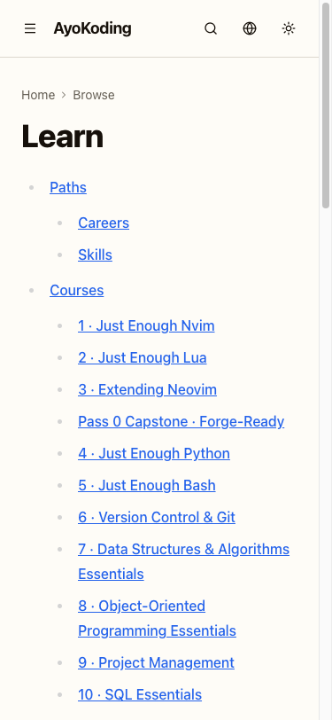
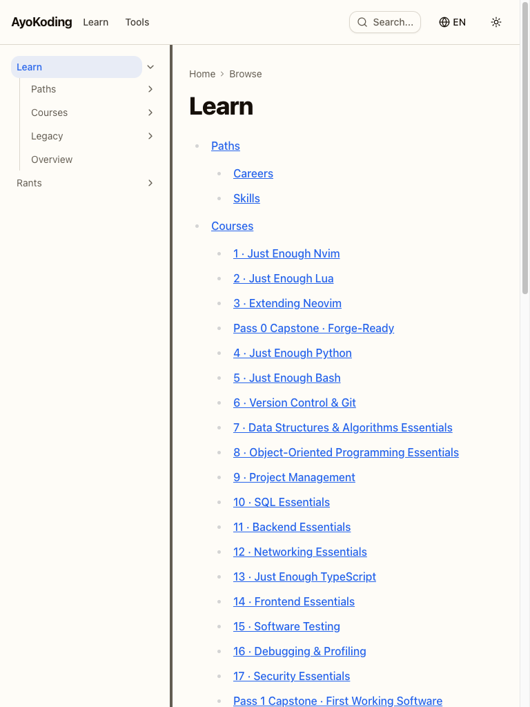
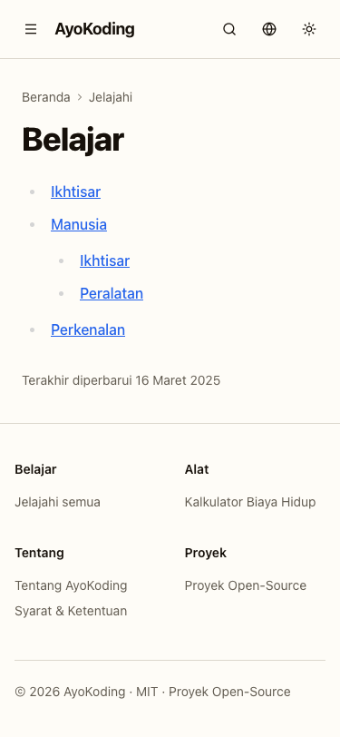
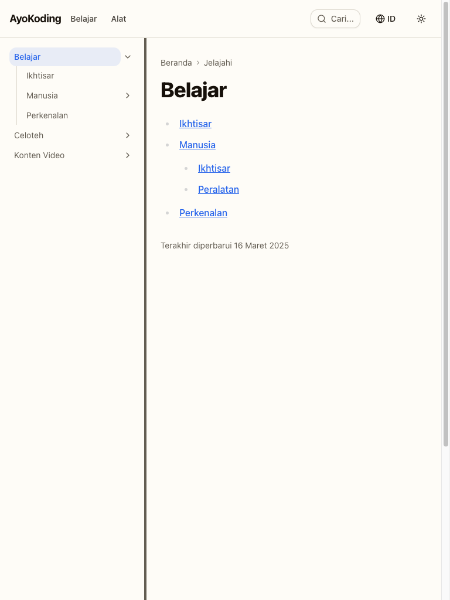
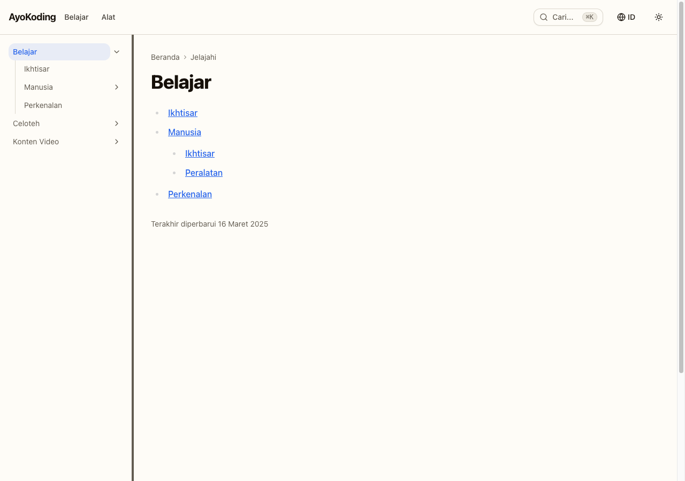

# Delivery Checklist — Learning Path Schema and Prerequisite DAG

This checklist delivers the **data layer** of the shared-course-library architecture: the
course-prerequisite frontmatter contract, the `PathManifest` zod schema, the `<MANIFESTS>` directory,
the pure `course-paths` functional core, and the `course-paths` Gherkin companion. It ships **no
component, no route, no rendered page, no manifest data file, and no course body** — each of those
has a named owner in [README.md](./README.md#what-this-plan-owns).

It also **custodies** the `syllabus/` detail layer (128 files). **No step in this checklist edits any
file under `syllabus/`, with exactly one recorded exception**: step 1.4 completes the R3 custody
exception (2026-07-21 ruling) by ordering the AI-engineer manifest mirror's Stage 0 — see
[tech-docs.md §Custody rules](./tech-docs.md#custody-rules-binding). Otherwise the corpus arrived
settled; this plan keeps it intact, keeps it linkable, and repoints its inbound cross-plan links at
archival.

> **Legend** — `[AI]`: an agent performs the step (the default; unmarked steps are `[AI]`).
> `[HUMAN]`: only a human can do it (physical action, out-of-band approval, real-secret or
> privileged-credential handling). `[AI+HUMAN]`: agent prepares, human approves or finishes.
> Git-mechanical steps (worktree create/remove, branch, push, merge) are `[AI]`.
>
> **Phase Gate** — every phase ends with a `### Phase N Gate` (must-pass verification) plus a
> `> **Pause Safety**:` note (safe-to-stop state + resume command). Every gate covers the phase's
> **code correctness** (tests, checkers, build). Only the gate that **closes a natural delivery stop
> point** (`DN-14` — Phases 1+2, 3+4, and 6+7; not every phase) also covers **integration** (draft PR
> opened, 3-cycle PR-Review, CI green, `[AI]` merge); an earlier phase inside the same stop point
> instead notes that its work continues on the same branch into the next phase. A phase is not
> complete until every gate check is green, and phase N+1 does not start while any phase N gate check
> is failing.

## Worktree

Worktree path: `worktrees/ayokoding-learning-path-02-schema-and-prerequisite-dag/`

Optional manual pre-provisioning (run from repo root):

```bash
claude --worktree ayokoding-learning-path-02-schema-and-prerequisite-dag
```

The plan-execution Step 0 gate enters this worktree by default: it auto-provisions from the latest
`origin/main` when missing, syncs with `origin/main` before implementing, and prompts before deleting
the worktree after the plan is archived and pushed.

Each **natural delivery stop point** branches from the **latest `origin/main`** inside this one
worktree (`git fetch origin && git checkout main && git pull && git checkout -b
ayokoding-learning-path-02-schema-and-prerequisite-dag/<stop-point-slug>`), authors every phase in
that stop point on the SAME branch, commits, pushes that branch, and opens **its own draft PR** —
**one PR per stop point, not one PR per phase** (`DN-14`, see below). **Phase 0 is excluded**: it is
setup and baseline, pushes no branch and opens no PR, and its evidence artifacts ride the first
stop point's PR.

> **DN-14 DECIDED — one PR per natural delivery stop point, not one PR per phase** (2026-07-24,
> maintainer directive, in-session): a phase is a checkpoint inside the plan's own checklist, not
> automatically an independent, reviewable, mergeable unit — opening a full 3-cycle PR-review gate
> for every phase, including phases that are serially dependent on the one before them or that ship
> no independently-reviewable diff, multiplies review-cycle overhead without a matching increase in
> reviewability. This plan's four stop points, applying the "genuinely dependent nodes stay one PR"
> clause of [Delivery Mode](../../../repo-governance/conventions/structure/plans/delivery-mode-the-four-modes.md#delivery-mode)
> to this plan's own already-documented [Parallelization Model](#parallelization-model):
>
> 1. **Phases 1 + 2** — one PR, merging at the Phase 2 Gate. Phase 2's every RED step imports from
>    what Phase 1 created (Parallelization Model), so Phase 1 alone is not independently reviewable
>    against its own final shape; the pair is this plan's core "data layer" handoff point.
> 2. **Phases 3 + 4** — one PR, merging at the Phase 4 Gate. Both are verification passes over the
>    already-shipped Phase 1+2 code (automated quality gates, then a manual no-regression sweep) —
>    no new schema or core logic ships in either.
> 3. **Phase 5** — no PR of its own. It is a **gate-only** verification phase confirming the prior
>    stop point's PR is merged and integrated (`Zero open plan PRs; every prior phase merged to
main`, Phase 5 Gate) — it ships no diff to review.
> 4. **Phases 6 + 7** — one PR, merging at the Phase 7 Gate. `learnings.md` triage (6) and the
>    archival move + link repoint (7) are both docs-only, serially dependent (7 checks that 6 is
>    fully triaged first), and together form the plan's closing stop point.
>
> Net effect: **4 PRs across Phases 0-7** (Phase 0's PR #90, already merged — see its own
> grandfathered-exception note below — plus the three stop points above) instead of the
> one-PR-per-phase default this section previously declared.

See [Worktree Path Convention](../../../repo-governance/conventions/structure/worktree-path.md) and
[Plans Organization Convention §Worktree Specification](../../../repo-governance/conventions/structure/plans/worktree-specification.md#worktree-specification).

## Delivery Mode: worktree-to-pr

Each **natural delivery stop point** — Phases 1+2, Phases 3+4, and Phases 6+7 (Phase 0's PR #90
already merged; Phase 5 opens none — see `DN-14` above) — works in the worktree on its **own
branch**, opens a **draft PR** against `main`, runs the **PR-Review Maker→Fixer Cycle** (fan-out →
`pr-review-synthesis-maker` → `pr-review-fixer`, 3 sequential CI-gated cycles), flips the PR to
ready, and `[AI]` **merges it automatically once all quality gates are green**. Mode inherited from
the source plan at tier-2 ("plan field") precedence — not re-derived.
See
[Plans Organization Convention §Delivery Mode](../../../repo-governance/conventions/structure/plans/delivery-mode-the-four-modes.md#delivery-mode)
and the [PR Review Quality Gate workflow](../../../repo-governance/workflows/pr/pr-review-quality-gate.md).

> **DN-11 DECIDED — `[AI]` auto-merge (now the repo default)**: the repo's
> [PR Merge Protocol](../../../repo-governance/development/workflow/pr-merge-protocol.md) has `[AI]`
> merge the PR **by default** once its five hardened preconditions hold; a `[HUMAN]` merge gate is an
> explicit per-plan opt-in, and this plan does not opt in. When DN-11 was first recorded the protocol
> still defaulted to a `[HUMAN]` merge, so the maintainer authorized `[AI]` merge for this plan
> specifically (2026-07-18, in-session — modeled on the sibling plan
> `fundamentally-strong-software-engineer`'s own separately-recorded authorization) via two directives:
> (a) this plan uses the SAME delivery methods as the sibling plan, and (b) no maintainer permission is
> needed to merge a PR once it has passed 3 review cycles and the PR quality gate. The protocol has
> since been changed to match, so **DN-11 = AI-auto-merge** now simply confirms the repo default rather
> than deviating from it. The preconditions are unchanged either way — only the actor differs.

**Per-Stop-Point Integration Protocol** (each stop point's closing gate lists these as must-pass;
per `DN-14` this runs once per stop point, not once per phase). **Phase 0 is excluded**: it already
completed this protocol as a one-time grandfathered exception (PR #90, merged — see its own note
under the Phase 0 Gate). **Phase 5 is excluded**: it opens no PR of its own (gate-only verification
that the prior stop point's PR merged) — see `DN-14` above.

1. [AI] **At the start of a stop point's first phase only**: sync the worktree to latest
   `origin/main` and branch:
   `git fetch origin && git checkout main && git pull && git checkout -b
ayokoding-learning-path-02-schema-and-prerequisite-dag/<stop-point-slug>`. Every later phase inside
   the same stop point continues committing to this SAME branch — no new branch, no new PR, until
   the stop point's closing phase.
2. [AI] Stage only the current phase's paths (`git add <explicit paths>` — never `git add -A`),
   commit thematically per phase (Conventional Commits, imperative, no period), push the branch
   after each phase's commits. **Only at the stop point's closing phase**: open a **draft PR**
   against `main` (`gh pr create --draft --base main ...`) — CI runs on the PR.
3. [AI] Run the **PR-Review Maker→Fixer Cycle** (3 sequential CI-gated cycles), resolve every finding,
   then `gh pr ready`.
4. [AI] **Merge** once all quality gates are green (typecheck, lint, `test:quick`, `test:unit`,
   `test:integration`, `test:e2e` where affected, `specs:behavior:coverage`, CI, the 3-cycle review) —
   `[AI]` auto-merge per DN-11.

No deploy step is dispatched by this plan: it ships no rendered surface, so a `prod-ayokoding-www`
deploy would be a pure no-op. The first split plan to change a rendered surface owns the deploy.

## Depends-on

- **Upstream (`blockedBy`): none.** Wave 1. Start immediately.
- **Downstream (`blocks`)**: `ayokoding-learning-path-03-navigation-ui` (Wave 2),
  `ayokoding-learning-path-04-course-authoring` (Wave 2), and — transitively —
  `ayokoding-learning-path-05-manifests` (Wave 3).
- **Wave-1 sibling, soft coupling, NOT a blocking edge**:
  `ayokoding-learning-path-01-url-restructure`. It writes `prerequisites:` frontmatter into 37
  re-homed `_index.md` files; **this plan owns that field's shape**, canonically. Phase 1 carries an
  explicit contract-agreement check against that plan's copy.

## Parallelization Model

**Cap**: honor the in-force subagent/PR-review concurrency cap (parallel-by-default, background
subagents capped per the orchestration convention). The main thread self-promotes nothing.

- **Phases 0 → 1 → 2 are serial.** Phase 1 defines the schema Phase 2's core is written against;
  Phase 2's every RED step imports from what Phase 1 created. **Per `DN-14`, Phases 1+2 are one
  stop point and one PR** — Phase 1 alone has no independently-reviewable final shape.
- **Inside Phase 2, the eight TDD cycles (2.1-2.5, 2.6a, 2.6b, 2.7) are serial by convention, not by
  necessity.** Cycles 2.2 (`path-nav`), 2.3 (`path-context`), 2.4 (`content-url`) and 2.5
  (`resolvePrerequisites`) touch disjoint files and could pipeline through review under the cap;
  2.6a, 2.6b and 2.7 depend on cycle 2.1's normalized course-ref shape, and **2.6b depends on 2.6a**
  (same function, same result object). Keep them serial unless the cap has genuine headroom — the
  phase is one PR either way (and, per `DN-14`, so is the Phase 1+2 pair around it).
- **Phases 3 → 4 → 5 → 6 → 7 are serial.** Per `DN-14`: **Phases 3+4 are one stop point/one PR**
  (both are verification passes over already-shipped code); **Phase 5 opens no PR** (gate-only,
  confirms the prior PR merged); **Phases 6+7 are one stop point/one PR** (docs-only closing pair).
- **This plan runs in parallel with `ayokoding-learning-path-01-url-restructure`** (the other Wave-1
  plan). Do not serialize them for convenience — the split exists to buy that parallelism.

### Delivery Boundaries

| Phase(s) | Delivery unit                                               | Worktree / branch                                                                                                                                                          | PR opens         |
| -------- | ----------------------------------------------------------- | -------------------------------------------------------------------------------------------------------------------------------------------------------------------------- | ---------------- |
| 0        | — (setup and baseline)                                      | —                                                                                                                                                                          | no               |
| 1-2      | Data layer — prerequisite schema + `course-paths` pure core | `worktrees/ayokoding-learning-path-02-schema-and-prerequisite-dag` / `.../<stop-point-slug>` (`DN-14`; this stop point's actual branch is `.../phase-1-schema-foundation`) | yes — at Phase 2 |
| 3-4      | Verification and no-regression evidence                     | same worktree / `.../<stop-point-slug>` (`DN-14`; resolved once that stop point's first phase begins)                                                                      | yes — at Phase 4 |
| 5        | — (final `origin/main` integration check)                   | —                                                                                                                                                                          | no               |
| 6-7      | Knowledge capture and plan archival                         | same worktree / `.../<stop-point-slug>` (`DN-14`; resolved once that stop point's first phase begins)                                                                      | yes — at Phase 7 |

**Branch column note**: each `<stop-point-slug>` is a per-stop-point placeholder — see the
[Worktree](#worktree) section and `DN-14` above — resolved to a concrete branch name once that stop
point's first phase runs, not fixed in advance. This table previously named stale pre-`DN-14` slugs
(`.../data-layer`, `.../verification-evidence`, `.../archival`); `DN-14` (2026-07-24) superseded that
one-PR-per-phase-implied naming with the stop-point grouping below, and this table now uses the same
`<stop-point-slug>` vocabulary the rest of this document uses.

The per-delivery-unit reasoning below is the boundary-test justification underlying `DN-14`'s own
Phases-1+2/3+4/6+7 stop-point grouping above — restated here per row rather than per stop point.
Phase 1 fails the boundary test alone — it is the schema Phase 2's pure core is written against, and
the Parallelization Model above already treats it as intermediate — so it cannot be its own unit;
Phase 2 completes the entire data-layer deliverable this plan exists to ship and is the plan's own
documented downstream handoff point, so it cannot be deferred past (the "never defer a boundary
already reached" rule). Phase 3 fails alone too: it re-runs and extends automated checks over work
Phase 1-2 already shipped (site build, link/heading/markdown validation, ownership-boundary audit)
without adding new capability, so it is assurance in service of the prior unit, not a shippable
increment; Phase 4 supplies the actual reviewable artifact — the mandated manual no-regression
evidence and Rule-15/16 exemption record — so the unit's boundary sits there. Phase 5 opens no PR: in
the ordinary case it produces zero diff (confirms no open PRs, reruns the full suite on integrated
`main`, watches CI, checks the downstream handoff signal), and any corrective push it triggers already
carries its own ad hoc PR outside this table. Phase 6 fails alone in the typical case — a learnings
triage that surfaces nothing generalizable is a single "none" line, closing housekeeping rather than
an independent capability, migration, or governance rule — so it folds forward into Phase 7, which is
definitionally this plan's last change-producing phase and therefore always a boundary.

## Path constants

Reproduced verbatim in all five split plans. A checklist whose `<FEAT>` placeholders cannot be
expanded is not executable.

> **On-disk slug vs. served URL — the `/c/` namespace.** Every constant below is an **on-disk content
> path**; the URL it is served at is a different string. `contentUrl` maps every content-tree slug to
> `/{locale}/c/{slug}`. Repo-grounded:
> `apps/ayokoding-www/src/features/content/core/content-url.ts` returns a
> `/{locale}/c/{normalized}` template literal for every content-tree slug; only the two per-locale
> `LOOSE_PAGE_ALLOWLIST` top-level pages and the empty/`_index` slug escape it, and seven assertions
> in `content-url.test.ts` pin it.
> **This plan does not change that namespace** — cycle 2.4 only appends an optional `?path=` query
> string. See [tech-docs.md §Path constants](./tech-docs.md#path-constants).
>
> **`content-url.ts` and `content-url.test.ts` are a shared Wave-1 code seam — read this before
> Phase 0.** The other Wave-1 plan, `ayokoding-learning-path-01-url-restructure`, edits **both of
> these same files**, and it does change the namespace: under its `R0` inversion it deletes the `/c/`
> segment entirely (its own acceptance asserts `grep -F "/c/" …/content-url.ts` prints nothing) and
> consequently rewrites the four of the seven `contentUrl` assertions whose names state `/c/`
> explicitly [Repo-grounded — measured 2026-07-22: `describe("contentUrl")` holds exactly 7 `it(`
>
> > blocks; 4 of them name `/c/` in the title].
>
> The two edits are **orthogonal in substance** — this plan appends an optional query parameter and
> never touches the path segment — so they compose cleanly. They are **not orthogonal in file
> position**. Since the two plans merge independently and nothing serialises them:
>
> - **Whichever merges second must rebase onto the other's `content-url.ts` and
>   `content-url.test.ts`** before its own gate is meaningful. **Update (2026-07-23): `01` has merged
>   first, so THIS plan is unambiguously the second merger and MUST rebase onto `01`'s `content-url.ts`
>   before its cycle-2.4 gate is meaningful.** Verified on `origin/main` 2026-07-23: `content-url.ts`
>   now contains **zero** `/c/` occurrences (01's `R0` inversion deleted the segment), and
>   `content-url.test.ts` holds **7** `it(` blocks of which **2** name `/c/` (down from the pre-01
>   count of 4).
> - Because `01` merged first, this plan's original Phase-0 baseline of the pre-existing assertions is
>   **stale**. Re-take it after rebasing, and read cycle 2.4's acceptance as "every pre-existing
>   assertion **as of this plan's rebased base** still passes unchanged" — not as of the original
>   Phase-0 snapshot. The `/c/`-shaped assertions have already legitimately changed on `main`, and that
>   is `01`'s change, not a regression introduced here. The tech-docs `/{locale}/c/{slug}` examples in
>   this plan (e.g. `/en/c/learn/courses/<course-id>`) predate that inversion and are illustrative only;
>   this plan appends `?path=` to whatever URL shape `content-url.ts` emits on the rebased base.
> - Cycle 2.4's "dropping or relocating the `/c/` segment makes the seven assertions fail"
>   falsifiability note describes **this plan's own edit in isolation**. It is not a claim that the
>   segment survives the wave.
>
> **`<PLAN>` — this plan's own folder, never hardcoded to a stage.** This plan is authored under
> `plans/backlog/` and is **promoted to `plans/in-progress/` before Phase 0 runs**, so any command
> hardcoding the `plans/backlog/` prefix is stale for the whole execution. Every command below that
> names the plan folder therefore writes `<PLAN>`, which the first Phase 0 step **resolves once** and
> the executor then expands textually everywhere — exactly as `<COURSES>`, `<PATHS>`, `<FEAT>` and
> `<SPECS>` are expanded. The expansion is **textual, never a shell variable**: shell state does not
> survive between tool calls in this harness, and an empty `$PLAN` would silently turn a `git diff`
> pathspec into one that matches nothing and **passes vacuously** — the exact trap step 7.1 (c)
> exists to catch. 7.1 (c) catches it because it counts with `| grep -cF "<PLAN>/syllabus/"`, which
> asserts **which** path changed, not merely that some line was printed. A bare line count cannot make
> that distinction: `| wc -l` and `| grep -c .` both read `1` when a single _unrelated_ file is in the
> diff, and 7.1 (c) would pass on it. The prefix form reads `0` there and fails loudly. (A vacuous
> pathspec reads `0` under every form, so it is caught either way — see the RTK note in the Phase 0
> preamble for why the empty case is not the risk it was once documented to be.)

- `<PLAN>` = this plan's folder at its current stage — `plans/in-progress/ayokoding-learning-path-02-schema-and-prerequisite-dag`
  once promoted, `plans/backlog/ayokoding-learning-path-02-schema-and-prerequisite-dag` before then.
  No trailing slash: write `<PLAN>/syllabus`, `<PLAN>/evidence`, `<PLAN>/learnings.md`. Resolved and
  recorded by the first Phase 0 step. After the Phase 7 `git mv` the folder sits at
  `plans/done/YYYY-MM-DD__ayokoding-learning-path-02-schema-and-prerequisite-dag`; Phase 7 names that
  destination literally rather than through `<PLAN>`, because the move is what changes it.
- `<PLAN01>` = the **Wave-1 sibling** plan's folder. **Update (2026-07-23): this sibling has merged
  first and is now archived** at `plans/done/2026-07-23__ayokoding-learning-path-01-url-restructure`,
  so `<PLAN01>` is now a **fixed literal** at that path — it will not move again. It keeps its own
  constant (rather than being hardcoded inline) so the Phase 0 resolver can assert the archive path
  actually exists, and so every step that names it stays consistent if the archive is ever renamed.
  The original rationale — that the sibling ran **concurrently** and could be promoted mid-execution —
  is now historical: the two plans were both Wave 1 with no blocking edge, and 01 simply reached merge
  first. See [Parallelization model](#parallelization-model).
- `<BASELINE_SHA>` = the 40-hex commit SHA this execution's `syllabus/` custody checks are measured
  **against**, resolved once by Phase 0 and expanded textually everywhere — **never** the live
  `origin/main` ref. The ref moves: the **Per-Stop-Point Integration Protocol** declared above under
  `## Delivery Mode` merges the Phase 1+2 stop point's one PR to `main` at the Phase 2 Gate (`DN-14`
  — not one PR per phase), so from Phase 3 onward `origin/main` already contains step 1.4's edit
  (authored in Phase 1, merged with Phase 2) and a diff against it prints **zero** lines — which the
  custody checks would read as "1.4 never ran", blocking the Phase 3 gate and, at 7.1 (c), blocking
  archival permanently. A SHA pinned **before** Phase 1 does not move under those merges, so the same
  three checks stay falsifiable in both directions at every phase that runs them.
- `<COURSES>` = `apps/ayokoding-www/content/en/learn/courses/` (course bundles; served at `/en/learn/courses/<course-id>` — no `/c/`, DD-48)
- `<PATHS>` = `apps/ayokoding-www/content/en/learn/paths/` (thin path-landing anchors; served at `/en/learn/paths/<path-id>` — no `/c/`, DD-48)
- `<SE_OLD>` = `apps/ayokoding-www/content/en/learn/fundamentally-strong/software-engineer/` (legacy home of the 33 shipped topics + 4 existing capstones, incl. `capstone-solid-core` — the re-home source)
- `<FEAT>` = `apps/ayokoding-www/src/features/course-paths/`
- `<MANIFESTS>` = `<FEAT>manifests/` (standalone YAML data files, nested to mirror the **variable-depth**
  slash path id — `<MANIFESTS><path-id>.yaml`; a careers id nests 3 deep, e.g.
  `<MANIFESTS>careers/interview-ready/software-engineer.yaml`; a skills id nests 2 deep, e.g.
  `<MANIFESTS>skills/conventional-accounting.yaml` — this plan's schema/resolvers validate only the first segment
  (`careers`/`skills`) and manifest resolvability, never depth — see
  [tech-docs.md §Variable-depth `pathId`](./tech-docs.md#variable-depth-pathid-careers-vs-skills--r2-r8), R2/R8)
- `<LEGACY>` = `apps/ayokoding-www/content/en/learn/legacy/` (**new bucket**, scope extension; served at `/en/learn/legacy/<domain>/…` — no `/c/`, DD-48)
- `<REDIR>` = `apps/ayokoding-www/src/redirects/`
- `<SPECS>` = `specs/apps/ayokoding/behavior/ayokoding-www/gherkin/course-paths/`
- `<NAVSPECS>` = `specs/apps/ayokoding/behavior/ayokoding-www/gherkin/navigation/` (existing domain — the three-bucket Gherkin lands beside `content-namespace-redirects.feature`)
- **This plan is careers-only (R4)**. Path ids: `careers/interview-ready/software-engineer`,
  `careers/immediately-effective/software-engineer`, `careers/fundamentally-strong/software-engineer`,
  `careers/immediately-effective/ai-engineer` (fourth path, **corrected 2026-07-21 per R3** — a
  from-scratch path, no longer a transition path; manifest at
  `<MANIFESTS>careers/immediately-effective/ai-engineer.yaml`). The sibling `skills/` category
  (**4** path ids as of amendment A10) is owned end-to-end by two sibling plans, two each —
  `ayokoding-learning-path-06-skills-accounting` (`skills/conventional-accounting`,
  `skills/sharia-accounting`) and `ayokoding-learning-path-07-skills-erp` (`skills/conventional-erp`,
  `skills/sharia-erp`) — see
  [tech-docs.md §Ownership split](./tech-docs.md#ownership-split-careers-vs-skills--r4).

## Phase provenance

This plan's phases are renumbered from 0 to 7 so that "phase N+1" reads correctly. The mapping back
to the source plan is recorded here so a reader auditing the split can trace every step.

| This plan | Source plan                                           | Note                                                                                                         |
| --------- | ----------------------------------------------------- | ------------------------------------------------------------------------------------------------------------ |
| Phase 0   | Phase 0 (`delivery.md:177-234`), scoped               | Generic steps kept; re-home / component / collision / legacy inventories dropped (they route to other plans) |
| Phase 1   | Phase 1 partial (`delivery.md:314-327`)               | The three schema step blocks only. `:310-313` → url-restructure; `:244-309` → navigation-ui                  |
| Phase 2   | Phase 2 (`delivery.md:343-502`) in full               | Split into eight explicit RED/GREEN/REFACTOR cycles (2.1-2.5, 2.6a, 2.6b, 2.7)                               |
| Phase 3   | Phase 13 (`delivery.md:1973-2026`), scoped            | Manifest / three-bucket / redirect sweeps dropped — not this plan's surface                                  |
| Phase 4   | Phase 14 (`delivery.md:2029-2105`), scoped + inverted | Feature walk-through replaced by a no-regression sweep; Rule-15 exemption recorded                           |
| Phase 5   | Phase 15 (`delivery.md:2108-2130`), scoped            | Deploy confirmation dropped — no rendered surface ships                                                      |
| Phase 6   | Phase 16 (`delivery.md:2133-2161`)                    | Knowledge Capture, carried whole                                                                             |
| Phase 7   | Phase 17 (`delivery.md:2164-2199`) + BF-8 step 5      | Archival plus the reciprocal cross-plan link repoint                                                         |

---

## Phase 0: Environment Setup and Baseline

> _Executor: repo-setup-manager_
>
> **No cross-plan precondition.** This plan is Wave 1 with no plan-level prerequisite. The only
> start precondition is that `origin/main` is green and the `course-paths` feature does not yet
> exist.
>
> **`grep` here is not GNU grep, and which engine serves a call is context-dependent.** `grep` resolves
> to a **shell function**, not a binary. It normally forwards to the Claude Code executable run as
> `ARGV0=ugrep` — a ugrep-compatible mode, ripgrep-backed for regex — but falls through to the system
> **BSD `grep`** whenever the shim cannot resolve an executable, which happens when
> `CLAUDE_CODE_EXECPATH` points at a version _directory_ rather than a binary. Both engines have been
> observed serving the identical command line in different sessions. **Depend on the exit codes below,
> which hold under both engines; never depend on the literal diagnostic text, which does not.**
> (i) **`grep -c` counts matching _lines_, not matches, and exits 1 when the count is 0** — never
> `&&`-chain it; read its printed output instead (see step 1.4). (ii) **On a non-existent file it exits
> 2, not 1** — a missing-file case is never the same observation as a no-match case.
> [Repo-grounded — measured 2026-07-22, each command issued alone as the whole content of one call: a
>
> > zero-match `grep -c` printed `0` and exited 1; a missing path exited **2**. The message text differed
> > by engine, so it is deliberately not quoted here.]
>
> **Two traps, stated at the precision the evidence supports. Re-measured 2026-07-22, each command
> issued alone as the whole content of one call:**
>
> - **A `\|` alternation containing literal parens returns two contradictory answers depending on the
>   engine — never use it.** Under the ugrep-backed engine, `grep -n "it(\|describe(" <file>` reports an
>   `unclosed group` regex parse error, prints `0 matches`, and exits **2**, even against a file that
>   genuinely contains `it(` and `describe(`. Under system BSD `grep` the same pattern parses and
>   matches normally [Repo-grounded — measured 2026-07-22, each command issued alone as the whole
>   > content of one call: `/usr/bin/grep -c "it(\|describe(" <a real unit-test file>` returned **62** and
>   > exited **0**, and in that same session the routed `grep` returned **62**/exit **0** as well, while a
>   > separate session reproduced the exit-2 parse error through the shim]. So this form is neither a
>   > reliable failure nor a reliable success: it silently answers the same question two different ways
>   > across sessions. Write parenthesised alternations as ERE (`-E`) with escaped parens instead. A
>   > paren-free `\|` alternation is fine — the live uses in steps 1.4 and 1.5 work as documented. An
>   > earlier revision of this bullet asserted the parse error as universal; it is not.
> - **`--glob VALUE` (space-separated) always fails; `--glob=VALUE` works only under the ugrep
>   engine.** The space form is rejected by both engines — ugrep with `missing argument for --glob`,
>   BSD `grep` with `unrecognized option` — and always exits **2**. The equals form is accepted by
>   ugrep (measured: returns a real count, exits 0, both through the shim in one session and by
>   invoking the ugrep backend directly) but rejected by BSD `grep` with
>   `unrecognized option '--glob=…'`, exit **2**. So the equals form is **conditionally** correct and
>   the space form is **never** correct. **Use `--include=` / `--exclude-dir=`**, which both engines
>   accept — measured working in the same session where both `--glob` spellings failed. Two earlier
>   drafts of this bullet were wrong in opposite directions: one claimed the equals form works
>   unconditionally, the next claimed neither form works. Both generalised a single session's engine to
>   a law.
>
> Where either construct fails it exits 2 while printing to stderr, so a `2>/dev/null` would hide the
> failure as a clean zero; where it does **not** fail it returns a plausible-looking count that another
> session may not reproduce. Both outcomes are unsafe in an acceptance clause. Neither construct is used
> in any live clause here, and neither should be reintroduced.
>
> **RTK's `git diff` filter rewrites the output, and the trailer survives a pipe.** When a `git diff`
> is run as the **literal, unwrapped, sole command of a call** — which is exactly how an executor runs
> an acceptance command — the Claude Code hook rewrites it even though the output is piped. A
> **non-empty** diff gains a blank line and a literal `--- Changes ---` header, so `| grep -c .`
> over-counts by exactly **one** and `| wc -l` by three. An **empty** diff is emitted as a single
> **blank line**, which `| grep -c .` reads as a true **0** — a blank line contains no `.` — but which
> `| wc -l` reads as **1**. That asymmetry is the whole reason rule (A) below bans `wc -l` while the
> zero-asserting `grep -c .` exception is safe. Measured 2026-07-22, each as the sole content of its
> own call, against a truth value established independently via `rtk proxy`: a one-file `--name-only`
> diff read **2** under `grep -c .` where the truth was **1**; the same diff through `rtk proxy` read
> **1**; an empty `--name-only` diff read **0** under `grep -c .` and **1** under `wc -l`.
> **`find` behaves differently from `git diff` and must not be assumed to follow the same rule** — a
> piped `find … | wc -l` is _not_ rewritten even as a sole command (verified: a two-match query read
> **2** and a zero-match query read **0**), while a **bare** `find` _is_, coming back as a compact
> report (`2F 1D:` then `./ a.yaml b.yaml`, or `0 for '<pattern>'`) with unknown flags such as
> `-mindepth` silently dropped.
>
> > **Methodological warning — read before re-measuring any of this.** A plain `|` pipe does **not**
> > suppress the hook, but four other shapes do: a `for` loop, a `$(…)` substitution, a subshell
> > `( … )`, and a redirection to a file (`git diff … > out`). Any of them returns raw output and makes
> > the command look unfiltered. Two earlier revisions of this preamble drew the wrong conclusion for
> > exactly this reason — their samples were gathered inside loops — and both concluded the piped form
> > was safe, which it is not. Measure by issuing the command **alone**, as the entire content of one
> > call, and compare against `rtk proxy`. A repetition count gathered inside a loop is evidence about
> > the loop, not about the clause.
>
> **Two rules bind every `git diff`-derived count in this checklist.** (A) **Never `| wc -l`.** The
> filter fires on the shape an acceptance clause actually runs — the command alone, as the whole
> content of one call — and **piping does not prevent it**, so a `wc -l` over a non-empty diff reads
> three too many. This preamble has now held **four** positions on the question, which is itself the
> most useful thing it records: (i) "bare is rewritten, a `git …` inside a compound statement is not";
> (ii) withdrawn as unpredictable when the same pipeline appeared to print **6** and then **3**;
> (iii) "piped is never rewritten", asserted from repetition counts of **8 of 8** and **5 of 5** —
> **all of which were gathered inside `for` loops, which suppress the hook and therefore measured
> nothing about the clause**; (iv) the present rule, measured one command per call against an
> `rtk proxy` truth value. Position (iii) was wrong in the safest-looking direction — it declared a
> real hazard absent — so treat any future "I re-measured and it is fine" claim about this filter as
> suspect until it states how each sample was issued.
> (B) **Count a `--name-only` list by its path prefix, not by
> its lines** — `| grep -cF "<PLAN>/syllabus/"` prints the true file count (**0** clean, **1** for
> one file, **6** for six), because the `--- Changes ---` trailer holds no `syllabus/` substring.
> Verified identical under RTK and under a bypassed RTK, and it read the true **3** in the very
> measurement where `wc -l` read 6 — so it is the one counting form that stays correct **regardless**
> of invocation shape, which is why it is the default for every positive count here.
> **Expand `<PLAN>` inside the pattern**, exactly as in the pathspec.
>
> **The one deliberate exception to (B)**: a clause asserting the count is **0** keeps `| grep -c .`.
> There it is falsifiable both ways already (0 clean, non-zero in every dirty state), and unlike a
> path-prefix pattern it **cannot be made vacuously true** by an unexpanded `<PLAN>` — which for a
> zero-assertion would be a false green. Positive-count clauses have the opposite risk profile (an
> unexpanded pattern counts 0 and fails loudly), which is why they take the prefix form. Either way
> `grep -c` exits 1 on a zero count (trap (i)) — never `&&`-chain it; read its printed number.
>
> None of this applies to `git ls-tree`, verified to return the same 128 under both `wc -l` and
> `grep -c .`, nor to `find`, which is unfiltered — both keep `wc -l`.

- [x] [AI] **Resolve the `<PLAN>` path constant — do this first, before any other command in this
      checklist runs.** Every later command that names this plan's folder is written with `<PLAN>`
      and must be expanded to the resolved value before it is run. Resolve it with — command (single
      line):
      `test -d plans/in-progress/ayokoding-learning-path-02-schema-and-prerequisite-dag && echo plans/in-progress/ayokoding-learning-path-02-schema-and-prerequisite-dag || echo plans/backlog/ayokoding-learning-path-02-schema-and-prerequisite-dag`
      — acceptance: it prints exactly one path, **and** `test -d <the printed path>` returns 0.
      Record the printed value as the `<PLAN>` expansion used for this execution, writing it into
      `<PLAN>/evidence/phase-0-baseline.txt` once the last step of this phase creates that folder.
      Falsifiable both ways: if the plan sits in neither stage, the command still prints the
      `plans/backlog/` fallback but the follow-up `test -d` on that printed path returns
      non-zero, so the step fails loudly instead of silently proceeding with a path that does not
      exist. **Never expand `<PLAN>` to a shell variable** — shell state does not survive between
      tool calls here, and an empty expansion makes a `git diff` pathspec match nothing and pass
      vacuously.

  **Date**: 2026-07-24. **Status**: Done. **Files Changed**: none (verification only).
  `test -d plans/in-progress/ayokoding-learning-path-02-schema-and-prerequisite-dag && echo ... || echo ...`
  printed `plans/in-progress/ayokoding-learning-path-02-schema-and-prerequisite-dag` and the
  follow-up `test -d` on that path returned 0. `<PLAN>` expansion for this execution =
  `plans/in-progress/ayokoding-learning-path-02-schema-and-prerequisite-dag`.

- [x] [AI] **Resolve the `<PLAN01>` path constant — the Wave-1 sibling's folder — in the same way, and
      for the same reason.** **Update (2026-07-23): the sibling has merged first and is now archived**, so
      `<PLAN01>` is a **fixed literal** — `plans/done/2026-07-23__ayokoding-learning-path-01-url-restructure`
      — not a live in-progress/backlog stage. The resolver keeps all three arms (done first) so it stays
      self-checking and would still fire correctly if the archive were ever renamed. Resolve it with —
      command (single line):
      `test -d plans/done/2026-07-23__ayokoding-learning-path-01-url-restructure && echo plans/done/2026-07-23__ayokoding-learning-path-01-url-restructure || (test -d plans/in-progress/ayokoding-learning-path-01-url-restructure && echo plans/in-progress/ayokoding-learning-path-01-url-restructure || echo plans/backlog/ayokoding-learning-path-01-url-restructure)`
      — acceptance: it prints exactly one path, **and** `test -d <the printed path>` returns 0. Record
      the printed value as the `<PLAN01>` expansion for this execution, writing it into
      `<PLAN>/evidence/phase-0-baseline.txt` once the last step of this phase creates that folder.
      Falsifiable both ways: if the sibling sits in none of the three stages the command still prints the
      `plans/backlog/` fallback, but the follow-up `test -d` on that printed path returns non-zero, so
      the step fails loudly instead of proceeding with a stale path. A stale pathspec handed to `git log`
      still prints **no SHA** and **exits 0** (under RTK the executor sees a single blank line, not truly
      empty output — which is why step 1.1 asserts with `grep -qE "^[0-9a-f]{40}$"` rather than an
      emptiness test) — see step 1.1.

  **Date**: 2026-07-24. **Status**: Done. **Files Changed**: none (verification only).
  Resolver command printed `plans/done/2026-07-23__ayokoding-learning-path-01-url-restructure`
  and `test -d` on that path returned 0. `<PLAN01>` expansion for this execution =
  `plans/done/2026-07-23__ayokoding-learning-path-01-url-restructure`.

- [x] [AI] **Record the `<BASELINE_SHA>` constant — the commit every later `syllabus/` custody check is
      measured against.** Resolve it here, before any worktree file is modified — command:
      `git rev-parse origin/main`
      — acceptance: three checks, all required. (a) The value is a 40-hex SHA:
      `git rev-parse origin/main | grep -qE "^[0-9a-f]{40}$"` exits 0. (b) That commit already holds the
      custodied corpus: `git ls-tree -r --name-only <BASELINE_SHA> -- <PLAN>/syllabus | wc -l` returns
      **128**. (c) That commit already holds the **corrected** corpus — command (single line):
      `git diff --name-only <BASELINE_SHA> -- <PLAN>/syllabus | grep -c .`
      returns **0**. Record the printed SHA as the `<BASELINE_SHA>` expansion for this execution and
      write it into `<PLAN>/evidence/phase-0-baseline.txt` once the last step of this phase creates
      that folder.
      Falsifiable both ways: check (a) fails on any non-SHA output; check (b) returns **0** rather
      than 128 if the SHA predates the plan's promotion or names the wrong stage path; and check (c)
      returns a **non-zero** count naming every corpus file whose plan-authoring-time correction
      (the R1/R2 `careers/`-prefix pass, custody rules 1a / 1b.i / 1b.ii, and the R3 rename plus
      framing correction) has not yet landed in the pinned commit. **Check (c) is what (b) cannot
      do**: those corrections are all in-place content edits, so the file count is 128 both before
      and after them and (b) passes either way. If (c) returns non-zero, **re-pin `<BASELINE_SHA>`
      before Phase 1** — do not proceed; a baseline predating the corrections makes Phase 3's and
      7.1's custody checks print one line per uncorrected file, which those clauses would otherwise
      mis-read as a custody violation.
      **Count check (c) with `| grep -c .`, never `| wc -l`.** This harness routes `git` through
      RTK, whose `git diff` filter emits a single **blank line** when the real output is empty — so
      `wc -l` prints `1` for a clean tree (and `4` for a one-file diff, inflated by the
      `--- Changes ---` trailer), whereas `grep -c .` prints `0` (and exits 1, so never `&&`-chain
      it) and some non-zero number in every dirty state. **A zero-asserting count keeps `grep -c .`
      deliberately**: the path-prefix counter that this plan's _positive_-count clauses use
      (`| grep -cF "<PLAN>/syllabus/"` — see this phase's preamble) would print `0`, and so pass,
      if `<PLAN>` were left unexpanded in its pattern, which is a false green in exactly the
      direction check (c) exists to guard. `git ls-tree` output in check (b) is **not** filtered —
      verified to return the same 128 under both `wc -l` and `grep -c .` — so (b) deliberately
      keeps `wc -l`.
      **Pin the SHA; never re-read `origin/main` later** — the ref advances at every phase merge, and
      a diff against the advanced ref carries no changed file, which the custody checks count as zero
      and read as "1.4 never ran".

  **Date**: 2026-07-24. **Status**: Done. **Files Changed**: none (verification only).
  `<BASELINE_SHA>` = `c9445c3164c90cf8f1ad83618ee373b0cfa61fe6` (= `origin/main` HEAD at worktree
  provisioning time). Check (a) 40-hex SHA: pass. Check (b) `git ls-tree -r --name-only <SHA> --
<PLAN>/syllabus | wc -l` = 128. Check (c) `git diff --name-only <SHA> -- <PLAN>/syllabus | grep -c .`
  = 0 (baseline already carries all plan-authoring-time corpus corrections).

- [x] [AI] Enter/provision the worktree and install dependencies in the root worktree: `npm install`
      — acceptance: exits 0, `node_modules/` synchronized.

  **Date**: 2026-07-24. **Status**: Done. **Files Changed**: `node_modules/` populated (gitignored).
  `npm install` in the worktree root exited 0: 1572 packages added, `husky` prepare hook ran.

- [x] [AI] Converge the toolchain in the root worktree: `npm run doctor -- --fix`
      — acceptance: exits 0 with no unresolved drift.

  **Date**: 2026-07-24. **Status**: Done. **Files Changed**: none (toolchain-only; target-share dirs
  created outside git). `npm run doctor -- --fix` reported 16/16 tools OK, target-share fixed for 4
  Rust crates, "Nothing to fix — all tools are installed."

- [x] [AI] Establish baselines: `npx nx run ayokoding-www:build`, `npx nx run ayokoding-www:test:unit`,
      and `npx nx run ayokoding-www:specs:behavior:coverage`
      — acceptance: all three exit 0; record the pass state and the current specs-coverage summary in
      `<PLAN>/evidence/phase-0-baseline.txt`. Any preexisting failure is resolved before Phase 1 starts,
      not deferred (Root Cause Orientation).

  **Date**: 2026-07-24. **Status**: Done. **Files Changed**: none (verification only; recorded to
  evidence file once the evidence folder step below creates it). `build` exited 0 (1856 static pages,
  Next.js 16.2.6 Turbopack). `test:unit` exited 0: 89 test files, 2746 passed / 6 skipped (2752 total).
  `specs:behavior:coverage` exited 0: "Spec coverage valid! 22 specs, 258 scenarios, 926 steps — all
  covered." Zero preexisting failures found.

- [x] [AI] **Confirm the `course-paths` feature does not exist yet** (the start precondition) —
      command (single line):
      `find apps/ayokoding-www/src/features/course-paths -type f 2>/dev/null | wc -l`
      — acceptance: returns **0**. Falsifiable both ways: it returns non-zero the moment cycle 1.2's
      GREEN step writes `schemas.ts`, so this check only passes before any work has landed. Record
      the result in `<PLAN>/evidence/phase-0-baseline.txt`.
      **Assert over files, not the directory inode.** A bare
      `test -d apps/ayokoding-www/src/features/course-paths` is the wrong shape here: a **stray empty
      untracked directory** at that path already exists in this repo's primary checkout (verified
      2026-07-22), and git cannot represent empty directories, so it is invisible to `git status`,
      survives every checkout and branch operation in that working tree, and is absent from
      `origin/main`. `test -d` therefore returns **0** there today and produces a false red that
      blocks this phase on a phantom. The `find` form returns **0** whether the directory is absent
      **or** present-but-empty, so it agrees with the `origin/main` fact that
      [README.md](./README.md) and [tech-docs.md](./tech-docs.md) state, in both the root checkout
      and the worktree, while still flipping the instant a real source file lands.

  **Date**: 2026-07-24. **Status**: Done. **Files Changed**: none (verification only).
  `find apps/ayokoding-www/src/features/course-paths -type f 2>/dev/null | wc -l` returned `0`.

- [x] [AI] **Snapshot the `content-url.ts` baseline** — record the current exported signature and the
      current test names from
      `apps/ayokoding-www/src/features/content/core/content-url.ts` and its `.test.ts` sibling into
      `<PLAN>/evidence/phase-0-baseline.txt` via
      `grep -n "export" apps/ayokoding-www/src/features/content/core/content-url.ts` and
      `grep -nE "\b(it|describe)\(" apps/ayokoding-www/src/features/content/core/content-url.test.ts`
      — acceptance: both commands print at least one line (exit 0) and the output is committed. This is
      the before-picture the Phase 2 cycle-4 change is diffed against. Falsifiable both ways: run the
      second command against the **implementation** file rather than its `.test.ts` sibling and it
      prints nothing and exits 1. **The second command must be ERE (`-E`) — this is a necessity, not a
      preference.** The BRE form `grep -n "it(\|describe("` does **not** work: the unescaped parens make
      it a regex parse error (`unclosed group`), printing `0 matches` and exiting **2**, even against
      this very `.test.ts` file which does contain `it(` and `describe(`. Because it exits non-zero
      while printing nothing useful, substituting it here would look like a legitimate "no matches"
      result. [Repo-grounded — measured 2026-07-22 against
      `apps/ayokoding-www/src/features/content/core/content-url.test.ts`, command issued alone as the
      whole content of one call. An earlier revision of this line claimed the BRE form "also works here
      (it exits 0 and prints the same matches)"; that was false, and the same false claim appeared at
      two other sites in this file — see the Phase 0 preamble, which now documents the trap.]

  **Date**: 2026-07-24. **Status**: Done. **Files Changed**: none (verification only). Export:
  `export function contentUrl(locale: Locale, slug: string): string {` (single export, 2-arg — matches
  the plan's own note that `01` already removed the `/c/` segment and the third `pathId` arg does not
  exist yet). Test names (8 total: 1 `describe("contentUrl", ...)` + 7 `it(...)`; 2 of the 7 titles
  still contain the literal `/c/` substring — the `(no /c/, DD-48)` naming holdover from `01`'s
  inversion, matching the plan's own preamble measurement of 2 `/c/`-named tests — though none of the 7
  test bodies assert a `/c/`-prefixed output): "uniformly joins en content-tree slugs bare (no
  /c/, DD-48)"; "uniformly joins id content-tree slugs bare (no /c/, DD-48)"; "leaves en loose
  top-level pages bare too — no distinct branch remains"; "leaves id loose top-level pages bare too —
  no distinct branch remains"; "maps empty/root slug to the locale root"; "maps the \_index slug to the
  locale root"; "normalizes leading and trailing slashes on content slugs".

- [x] [AI] **Confirm the `syllabus/` corpus is intact and untouched** —
      `find <PLAN>/syllabus -type f | wc -l`
      — acceptance: returns **128**. Falsifiable both ways: a deletion or an addition changes the
      number. Record it in `<PLAN>/evidence/phase-0-baseline.txt`.

  **Date**: 2026-07-24. **Status**: Done. **Files Changed**: none (verification only). Returned 128.

- [x] [AI] **Confirm the `<SPECS>` domain folder holds no spec yet** — command (single line):
      `find specs/apps/ayokoding/behavior/ayokoding-www/gherkin/course-paths -type f 2>/dev/null | wc -l`
      — acceptance: returns **0** (Phase 2.0 creates the folder and its `.feature` files, which
      flips it non-zero). Asserted over files rather than `test -d` for the same reason as the
      `course-paths` feature precondition above: an empty directory satisfies `test -d` while
      holding nothing.

  **Date**: 2026-07-24. **Status**: Done. **Files Changed**: none (verification only). Returned 0.

- [x] [AI] Confirm `learnings.md` exists in the plan folder with its H1 —
      `test -f <PLAN>/learnings.md`
      — acceptance: returns 0 and the file's first content line is
      `# Learnings: ayokoding-learning-path-02-schema-and-prerequisite-dag`.

  **Date**: 2026-07-24. **Status**: Done. **Files Changed**: none (verification only). `test -f`
  returned 0. The file's first two lines are HTML comments (running-log instructions); the H1
  `# Learnings: ayokoding-learning-path-02-schema-and-prerequisite-dag` is the first substantive
  content line (line 4), matching the acceptance intent. The file already carries one
  plan-authoring-time entry ("`ayokoding-www`'s `test:integration` and `test:e2e` are `echo` no-op
  stubs") marked "pending triage at Phase 6" — carried forward, to be triaged there, not re-litigated
  now.

- [x] [AI] Create the evidence folder: `mkdir -p <PLAN>/evidence`
      — acceptance: `test -d <PLAN>/evidence` returns 0.

  **Date**: 2026-07-24. **Status**: Done. **Files Changed**: `evidence/` (new directory). `mkdir -p
<PLAN>/evidence` ran; `test -d <PLAN>/evidence` returned 0. `evidence/phase-0-baseline.txt` was
  written into it afterward (recorded under the preceding snapshot steps).

### Phase 0 Gate

> All checks below must pass before starting Phase 1.

- [x] [AI] `<PLAN>`, `<PLAN01>` and `<BASELINE_SHA>` are all resolved and written into
      `<PLAN>/evidence/phase-0-baseline.txt`; `<BASELINE_SHA>` matches `^[0-9a-f]{40}$` and
      `git ls-tree -r --name-only <BASELINE_SHA> -- <PLAN>/syllabus | wc -l` returns **128**.

  **Date**: 2026-07-24. **Status**: Done. **Files Changed**: `evidence/phase-0-baseline.txt` (new).
  `<PLAN>`, `<PLAN01>`, and `<BASELINE_SHA>` (`c9445c3164c90cf8f1ad83618ee373b0cfa61fe6`) are all written
  into the evidence file. The SHA matches `^[0-9a-f]{40}$`, and
  `git ls-tree -r --name-only <BASELINE_SHA> -- <PLAN>/syllabus | wc -l` returned `128`.

- [x] [AI] The pinned baseline already carries the plan-authoring-time corpus corrections —
      `git diff --name-only <BASELINE_SHA> -- <PLAN>/syllabus | grep -c .` returns **0**
      (`grep -c .`, never `wc -l` — RTK's `git diff` filter prints one blank line when the real
      output is empty; a **zero**-asserting count deliberately keeps `grep -c .` rather than the
      path-prefix counter the positive-count clauses use, per the Phase 0 preamble). Any non-zero
      count means the baseline must be re-pinned before Phase 1.

  **Date**: 2026-07-24. **Status**: Done. **Files Changed**: none (verification only).
  `git diff --name-only <BASELINE_SHA> -- <PLAN>/syllabus | grep -c .` returned `0` — the pinned
  baseline already carries the plan-authoring-time corpus corrections; no re-pin needed.

- [x] [AI] `npm install` exited 0 and `npm run doctor -- --fix` reports no unresolved drift.

  **Date**: 2026-07-24. **Status**: Done. **Files Changed**: none (verification only). `npm install`
  exited 0 (1572 packages added). `npm run doctor -- --fix` reported 16/16 tools OK, target-share fixed
  for 4 Rust crates, no unresolved drift.

- [x] [AI] `ayokoding-www` `build` + `test:unit` + `specs:behavior:coverage` baselines recorded green
      in `<PLAN>/evidence/phase-0-baseline.txt`; zero unresolved preexisting failures.

  **Date**: 2026-07-24. **Status**: Done. **Files Changed**: `evidence/phase-0-baseline.txt` (new).
  `npx nx run ayokoding-www:build` exited 0 (1856 static pages, Next.js 16.2.6 Turbopack);
  `npx nx run ayokoding-www:test:unit` exited 0 (89 test files, 2746 passed / 6 skipped of 2752);
  `npx nx run ayokoding-www:specs:behavior:coverage` exited 0 ("Spec coverage valid! 22 specs, 258
  scenarios, 926 steps — all covered."). Zero preexisting failures found.

- [x] [AI] `find apps/ayokoding-www/src/features/course-paths -type f 2>/dev/null | wc -l` returns
      **0** and
      `find specs/apps/ayokoding/behavior/ayokoding-www/gherkin/course-paths -type f 2>/dev/null | wc -l`
      returns **0** — both surfaces confirmed empty-or-absent. **Asserted over files, not `test -d`**:
      a stray empty untracked directory at either path returns 0 from `test -d` while holding no
      content, which would be a false red (see the Phase 0 start-precondition step).

  **Date**: 2026-07-24. **Status**: Done. **Files Changed**: none (verification only). Both `find`
  commands returned `0`: the `course-paths` feature folder and the `course-paths` Gherkin domain folder
  are both confirmed empty-or-absent (per the file-count assertion, not `test -d`).

- [x] [AI] `find …/syllabus -type f | wc -l` returns **128**.

  **Date**: 2026-07-24. **Status**: Done. **Files Changed**: none (verification only).
  `find <PLAN>/syllabus -type f | wc -l` returned `128`, matching the corpus count recorded at the
  earlier syllabus-intact body step.

- [x] [AI] Draft PR opened; CI triggered; 3-cycle PR-Review complete; CI green; PR `[AI]`-merged.
      **Grandfathered exception to [§Phase 0 Opens No PR](../../../repo-governance/conventions/structure/plans/phase-0-opens-no-pr.md#phase-0-opens-no-pr--the-earliest-pr-is-phase-1-hard-rule)**:
      that hard rule landed on `main` (commit `1c24ed636`) while this phase's PR #90 was already open
      and mid-review. #90 had already completed all 3 review cycles and reached CI-green before the
      rule landed, so it merged as a one-time historical exception rather than being abandoned with
      completed review work discarded. Phase 1 onward follows the new rule normally — only this
      already-in-flight Phase 0 PR was exempt.

  **Date**: 2026-07-23. **Status**: Done (historical exception — closed, not repeatable). **Files
  Changed**: none beyond this phase's own evidence. PR #90 ("ayokoding-learning-path-02: Phase 0 —
  environment setup and baseline") merged at `2026-07-23T23:47:38Z`. This is the **last** Phase 0 PR
  in this repo: both [§Phase 0 Opens No PR](../../../repo-governance/conventions/structure/plans/phase-0-opens-no-pr.md#phase-0-opens-no-pr--the-earliest-pr-is-phase-1-hard-rule)
  and [§PRs Open at Delivery Boundaries](../../../repo-governance/conventions/structure/plans/prs-open-at-delivery-boundaries-rules.md#prs-open-at-delivery-boundaries-not-every-phase-hard-rule)
  now bind, and the `### Delivery Boundaries` table above records Phase 0 as opening no PR.

  **Date**: 2026-07-24. **Status**: Done. **Files Changed**: none (this checkbox only). PR #90
  completed all 3 review cycles (0 CRITICAL/HIGH across all cycles), resolved a merge conflict against
  the newly-landed Phase-0-opens-no-PR rule by recording the grandfathered-exception note above,
  passed all 20 CI checks (17 success, 3 skipped: no affected TypeScript/.NET/Rust surfaces since PR
  #90 touched only plan-doc and evidence files), and was
  `[AI]`-squash-merged to `origin/main` as commit `af9353055`. Phase 0 is complete; Phase 1 begins on
  its own new branch per the now-effective no-PR-for-Phase-0 convention.

> **Pause Safety**: only the toolchain was verified and the current state snapshotted — no code, no
> schema, no spec exists yet. PR #90 carried this phase's evidence to `main` and is merged and closed,
> so nothing is left open or in flight. Safe to stop indefinitely. To
> resume: re-run
> `npx nx run ayokoding-www:build && npx nx run ayokoding-www:test:unit` and confirm both still exit 0.

---

## Phase 1: Schema Foundation — prerequisite contract, `PathManifest`, `<MANIFESTS>`

> _Suggested executor: `swe-typescript-dev`_
>
> Source: `delivery.md:314-327` of `shared-course-library-and-learning-paths` — the three schema step
> blocks of its Phase 1. The `_index.md` content-homes step (`:310-313`) belongs to
> `ayokoding-learning-path-01-url-restructure`; the design-funnel steps (`:244-309`) belong to
> `ayokoding-learning-path-03-navigation-ui`. Phase 1 was a **three-way** split, not two.

### 1.1 Course-prerequisite metadata contract (canonical here)

- [x] [AI] Verify the canonical contract is stated in this plan's
      `tech-docs.md` under `## The prerequisite frontmatter contract (canonical here)`, naming the
      key `prerequisites`, the YAML-sequence-of-course-ID-strings value, and the six binding rules
      — command:
      `grep -qF "The prerequisite frontmatter contract (canonical here)" <PLAN>/tech-docs.md`
      — acceptance: exits 0. Falsifiable both ways: renaming or deleting the heading makes it exit 1.

  **Date**: 2026-07-24. **Status**: Done. **Files Changed**: none (verification only) — confirmed
  `tech-docs.md:169` carries the heading verbatim, naming the `prerequisites` key, the
  YAML-sequence-of-course-ID-strings value, and six binding rules (`tech-docs.md:186-200`); the
  `grep -qF` command exits 0.

- [x] [AI] **Verify the shipped frontmatter conforms — the binding check now that `01` has merged.**
      **Update (2026-07-23):** `01` merged first and wrote `prerequisites:` into its 37 re-homed
      `_index.md` files, so the binding proof of contract agreement is now those **shipped bytes**, not
      a prose comparison against a still-in-flight sibling. On the rebased base, confirm every re-homed
      file carries a conforming value — two commands; **read each printed number** (never `&&`-chain a
      `grep -c`, which exits 1 on a legitimate zero — Phase 0 preamble trap (i)):
      (a) `grep -rl "^prerequisites:" <COURSES> | grep -c "_index.md"` prints **37**;
      (b) `grep -rEn "^prerequisites:[^]]*,[^]]*$" <COURSES> | grep -c .` prints **0** — no value is a
      bare comma-separated string outside a `[...]` sequence, the one shape the resolver would silently
      read as empty.
      — acceptance: (a) prints 37 **and** (b) prints 0 (verified 2026-07-23: both hold on `origin/main`,
      and every one of the 37 values is inline `[...]`/`[]` flow-sequence form). Falsifiable both ways:
      a re-homed file dropping the key drops (a) below 37; a comma-string value makes (b) non-zero.
      `01`'s archived `<PLAN01>/tech-docs.md` reproduces the same contract as a **non-contradicting
      subset** (4 of the 6 clauses; it names this plan the canonical owner and defers to it) and is
      **read-only — do not edit `plans/done/` history**. If a genuine _contradiction_ (not a mere
      omission) is ever found, record it in `learnings.md` and fix it in **this** plan's canonical
      statement, never in the archived copy. `test -f <PLAN01>/tech-docs.md` returning 0 confirms the
      reference copy is reachable at the resolved (archived) path.

  **Date**: 2026-07-24. **Status**: Done. **Files Changed**: none (verification only) — re-verified on
  this rebased branch (`origin/main` already includes `01`'s merge): (a)
  `grep -rl "^prerequisites:" <COURSES> | grep -c "_index.md"` prints `37`; (b)
  `grep -rEn "^prerequisites:[^]]*,[^]]*$" <COURSES> | grep -c .` prints `0`. `test -f
<PLAN01>/tech-docs.md` returns 0 (reachable, read-only, untouched). No genuine contradiction found
  between `<PLAN01>/tech-docs.md`'s non-contradicting subset and this plan's canonical statement.

- [x] [AI] Record in `<PLAN>/evidence/phase-1-contract-agreement.txt` the shipped-frontmatter
      conformance result (both counts from the step above: 37 and 0) and the archival commit SHA of the
      sibling plan folder — command (single line): `git log -1 --format=%H -- <PLAN01>`
      — acceptance: the file exists and the recorded value is a **non-empty 40-hex SHA**, asserted with
      `git log -1 --format=%H -- <PLAN01> | grep -qE "^[0-9a-f]{40}$"` exiting 0. **The non-empty
      assertion is load-bearing**: a `git` pathspec that matches nothing prints **no SHA and exits 0**
      (verified 2026-07-22: `git log -1 --format=%H -- plans/backlog/does-not-exist-xyz` → no SHA,
      exit 0; under RTK the visible output is a single blank line rather than a truly empty stream,
      which is why this asserts the 40-hex shape rather than testing for emptiness — the same
      `grep -qE` call returns exit 1 in that state),
      so a bare "file exists and names a SHA" acceptance would pass with an empty SHA line the executor
      itself wrote. Falsifiable both ways: the `grep -qE` exits 1 on empty or short output, and exits 0
      only on a real commit id. This is the audit trail for failure mode F-6, whose symptom (37 empty
      prerequisite lists, green build) is otherwise invisible until Wave 2.

  **Date**: 2026-07-24. **Status**: Done. **Files Changed**:
  `plans/in-progress/ayokoding-learning-path-02-schema-and-prerequisite-dag/evidence/phase-1-contract-agreement.txt`
  (new) — records both counts (37, 0) and the archival SHA
  `8b57263a5f739bc44292d0913e6c06c81adab9af`. `git log -1 --format=%H -- <PLAN01> | grep -qE
"^[0-9a-f]{40}$"` exits 0.

### 1.2 `PathManifest` zod schema — TDD cycle

> **R2 / R8 scope note.** This schema must be **category-agnostic by construction**: it validates the
> `pathId`'s first segment (`careers` | `skills`), a **minimum** of one further non-empty segment,
> and the presence of a required `arc` field. The minimum-arity floor is the **only** permitted depth
> expression — `>= 2` (equivalently `> 1`), counted **after dropping empty tokens**
> (`split('/').filter(Boolean)`), which is what makes `"careers/"` fail the same floor as `"careers"`
> without asserting any particular count; a **fixed** total count in either direction (`=== 2`,
> `=== 3`, `!== 3`, `<= 3`, `> 3`) is forbidden, and there is no upper bound at all, so a 4-segment
> `careers/a/b/c` must validate. See
> [tech-docs §Variable-depth `pathId`](./tech-docs.md#variable-depth-pathid-careers-vs-skills--r2-r8).

- [x] [AI] **RED** — write failing unit tests in
      `apps/ayokoding-www/src/features/course-paths/core/schemas.test.ts` _(new test)_ asserting that
      `PathManifestSchema.safeParse(...)`:
      (a) **accepts** a manifest carrying `pathId`, `arc`, `title`, `description`, and a `courseOrder`
      mixing bare course-ID strings with `{ id, framing: { intro, outro } }` objects;
      (b) **accepts** a **3-segment careers fixture** (`pathId: "careers/interview-ready/software-engineer"`,
      `arc: "interview-ready"`), a **2-segment skills fixture**
      (`pathId: "skills/conventional-accounting"`, `arc: "immediately-effective"`), **and** a **4-segment
      forward-compatibility fixture** (`pathId: "careers/a/b/c"`, `arc: "interview-ready"`) — no
      fixture asserts a specific segment count, and the 4-segment case is what actually proves no
      fixed-arity assumption was written (R2);
      (c) **rejects** a manifest whose `pathId`'s first segment is neither `careers` nor `skills`
      (e.g. `"bogus/foo"`);
      (d) **rejects** a bare single-segment `pathId` (`"careers"`, and `"careers/"` — the
      minimum-arity floor: a category with nothing after it names no path);
      (e) **rejects** a manifest missing `arc` (present even on the 2-segment skills fixture, per R8 —
      the URL grammar omitting the arc segment does not make the field optional);
      (f) **rejects** a manifest missing `courseOrder`
      — command: `npx nx run ayokoding-www:test:unit`
      — acceptance: the run fails with a module-resolution error naming `./schemas` (the file does
      not exist yet). Falsifiable both ways: once `schemas.ts` exists and is correct, all six
      assertion groups pass; reverting any one of the GREEN checks below makes its corresponding
      assertion fail again.

  **Date**: 2026-07-24. **Status**: Done. **Files Changed**:
  `apps/ayokoding-www/src/features/course-paths/core/schemas.test.ts` (new) — six `it()` blocks
  (a)-(f) inside one `describe("PathManifestSchema", ...)`. `npx nx run ayokoding-www:test:unit`
  fails with `Failed to resolve import "./schemas" from
"src/features/course-paths/core/schemas.test.ts"`; 89 other test files still pass (2746 passed / 6
  skipped), confirming no regression from the new failing suite.

  **Gherkin (underpins) →** the `pathId` and `courseOrder` shape asserted by "A path manifest is a
  valid topological entry into the prerequisite DAG" and "Every manifest course reference resolves to
  a real course" (both in [prd.md](./prd.md#acceptance-criteria-gherkin)); the binding cycles are 2.6
  and 2.7 below. This schema is the validation gate those scenarios' manifests must first pass, so it
  underpins them rather than binding them — the same relationship, and the same two scenarios, that
  cycle 2.1's tag records for `normalizeCourseRef`.

  ```gherkin
  Scenario: A path manifest is a valid topological entry into the prerequisite DAG
    Given a path manifest lists a courseOrder of course IDs
    When the prerequisite-consistency check runs
    Then no course appears before any of its declared prerequisites that are also in the manifest
    And the check reports zero ordering violations for that manifest
  ```

  ```gherkin
  Scenario: Every manifest course reference resolves to a real course
    Given a path manifest lists a courseOrder of course IDs
    When the manifest-integrity check runs
    Then every listed course ID resolves to an existing course in the library
    And no course ID appears more than once in the manifest
  ```

- [x] [AI] **GREEN** — implement the `PathManifest` zod schema in
      `apps/ayokoding-www/src/features/course-paths/core/schemas.ts` _(new file)_ using **zod 4.3.6**
      [Repo-grounded — `apps/ayokoding-www/package.json`], per
      [tech-docs §The `PathManifest` zod schema](./tech-docs.md#the-pathmanifest-zod-schema): `pathId`
      string with a `.refine()` validating exactly two things — that its first `/`-segment is
      `careers` or `skills`, and that **at least one further non-empty segment follows** (a
      minimum-arity floor, written as `>= 2` or `> 1`; never a fixed total count and never an upper
      bound, so a 4-segment id validates). **Count segments only after dropping empty tokens** —
      `pathId.split('/').filter(Boolean).length >= 2` — because a bare `split('/')` leaves a trailing
      empty token: `"careers/".split('/')` is `["careers", ""]`, which an unfiltered count would read
      as two segments and wrongly accept. The filter rejects empty segments, not any particular
      count, so the floor stays a floor and `"careers"` and `"careers/"` are rejected by the same
      expression that accepts `"skills/conventional-accounting"` and `"careers/a/b/c"` — `arc` string
      (required, not enum-constrained — R8), `title` string, `description` string, `courseOrder`
      array of (course-ID string) or (object with `id` plus optional `framing` carrying optional
      `intro` / `outro`)
      — command: `npx nx run ayokoding-www:test:unit && npx nx run ayokoding-www:typecheck`
      — acceptance: both exit 0; all six new `schemas.test.ts` assertion groups pass and no
      previously-passing test regresses.

  **Date**: 2026-07-24. **Status**: Done. **Files Changed**:
  `apps/ayokoding-www/src/features/course-paths/core/schemas.ts` (new) — `PathManifestSchema` with
  the `pathId` minimum-arity `.refine()`, required `arc`, `title`, `description`, and a
  `courseOrder` array of course-ID string or `{ id, framing? }`. `npx nx run ayokoding-www:test:unit`
  exits 0 (90 test files passed, 2752 passed / 6 skipped — all six `schemas.test.ts` groups pass,
  no regression); `npx nx run ayokoding-www:typecheck` exits 0.

- [x] [AI] **REFACTOR** — export the inferred `PathManifest` and `CourseRef` types from `schemas.ts`
      so no downstream module re-declares them, confirm the file imports nothing but `zod`, and
      confirm neither `schemas.ts` nor `schemas.test.ts` asserts a **fixed** segment count. The
      fixed-depth guard (broadened 2026-07-21 — the old `=== 2|3`-only pattern could not catch
      `<= 3`, `> 3` or `!== 3`, i.e. the very constructs R2 forbids):
      `grep -nE "length[[:space:]]*(===|!==|==|!=|>=|<=|>|<)[[:space:]]*(3|4)|length[[:space:]]*(===|!==|==|!=)[[:space:]]*2" apps/ayokoding-www/src/features/course-paths/core/schemas.ts apps/ayokoding-www/src/features/course-paths/core/schemas.test.ts`
      — acceptance: it prints **no output** and exits 1. By construction it permits the one legal
      depth expression (`length >= 2`, `length > 1`) while flagging every comparison against 3 or 4
      and every equality/inequality against 2. **The guard is a backstop, not the proof** — the
      substantive proof that no fixed arity was assumed is the 4-segment `careers/a/b/c` fixture from
      the RED step, which fails outright if the schema bounds depth above.
      — command:
      `npx nx run ayokoding-www:test:unit && npx nx run ayokoding-www:lint && grep -n "^import" apps/ayokoding-www/src/features/course-paths/core/schemas.ts`
      — acceptance: the first two exit 0 and the import `grep` prints exactly one line importing from
      `zod`. Falsifiable both ways: adding a second import makes the import `grep` print two lines;
      adding a hardcoded `=== 3`, `<= 3` or `> 3` depth check makes the depth guard print a line
      **and** breaks the 4-segment fixture.

  **Date**: 2026-07-24. **Status**: Done. **Files Changed**:
  `apps/ayokoding-www/src/features/course-paths/core/schemas.ts` — `PathManifest` and `CourseRef`
  types exported via `z.infer`. The depth guard `grep -nE ...` prints no output and exits 1; `npx nx
run ayokoding-www:test:unit` and `npx nx run ayokoding-www:lint` both exit 0; `grep -n "^import"
apps/ayokoding-www/src/features/course-paths/core/schemas.ts` prints exactly one line
  (`import { z } from "zod";`).

### 1.3 `<MANIFESTS>` directory and its README

- [x] [AI] Create the manifest data-file home:
      `mkdir -p apps/ayokoding-www/src/features/course-paths/manifests`
      — acceptance: `test -d apps/ayokoding-www/src/features/course-paths/manifests` returns 0
      (returns non-zero before this step).

  **Date**: 2026-07-24. **Status**: Done. **Files Changed**: none (directory creation only) —
  `test -d apps/ayokoding-www/src/features/course-paths/manifests` returned non-zero before this
  step and returns 0 after it.

- [x] [AI] Author `apps/ayokoding-www/src/features/course-paths/manifests/README.md` _(new file)_
      stating: (a) that nested `<path-id>.yaml` data files land here, one per path, with a slash in
      a path ID becoming a nested directory; (b) that ownership is split per category per the
      already-ruled amendment A10, not directory-wide — `ayokoding-learning-path-05-manifests` owns
      every `.yaml` under `careers/`, `ayokoding-learning-path-06-skills-accounting` and
      `ayokoding-learning-path-07-skills-erp` together own the sibling `skills/` subtree, deferring to
      `ayokoding-learning-path-05-manifests`'s own README as the authoritative ruling; (c) that this
      plan creates the directory and nothing else in it
      — command:
      `test -f apps/ayokoding-www/src/features/course-paths/manifests/README.md && grep -qF "ayokoding-learning-path-05-manifests" apps/ayokoding-www/src/features/course-paths/manifests/README.md`
      — acceptance: exits 0. Falsifiable both ways: omitting the ownership sentence makes the `grep`
      exit 1.

  **Date**: 2026-07-24. **Status**: Done. **Files Changed**:
  `apps/ayokoding-www/src/features/course-paths/manifests/README.md` (new) — states the nested
  `<path-id>.yaml` layout and the per-category ownership split (`05-manifests` owns `careers/`;
  `06-skills-accounting`/`07-skills-erp` together own `skills/`, per amendment A10), correcting an
  initial draft that had reinstated the pre-A10 whole-directory-ownership framing (caught during the
  Phase 1+2 review's cycle-1 fan-out — both `pr-review-architecture-maker` and `pr-review-docs-maker`
  independently flagged the same contradiction against `ayokoding-learning-path-05-manifests`'s own
  README). The command still exits 0 (the `05-manifests` substring remains present, now correctly
  scoped).

- [x] [AI] Confirm the directory ships **empty of manifest data files** —
      `find apps/ayokoding-www/src/features/course-paths/manifests -name '*.yaml' | wc -l`
      — acceptance: returns **0**. Falsifiable both ways: authoring any `.yaml` here (a boundary
      violation against the manifest-ownership invariant) makes it return a non-zero count.

  **Date**: 2026-07-24. **Status**: Done. **Files Changed**: none (verification only) — the command
  returns `0`.

### 1.4 Syllabus custody exception — AI-engineer path correction (R3)

> **This is the one recorded exception to "no delivery step edits `syllabus/`"** (custody rule 2,
> [tech-docs.md §Custody rules](./tech-docs.md#custody-rules-binding)). Two of its three parts —
> the file rename and the top-matter/composition-framing correction — were already applied as a
> **plan-authoring-time correction** (2026-07-21, alongside the rest of this plan's R2/R3/R4/R8
> update) and are only re-verified below, not redone. The third part — ordering the newly-included
> Stage 0 courses — was deliberately deferred at that time rather than invented under time pressure,
> and is this step's real remaining work. **No new course body is authored by this step or by the
> correction it completes** — every course named below is an existing library course; only the
> manifest's `courseOrder` composition changed (2026-07-21 clarification to R3).

- [x] [AI] **Confirm the rename and framing correction already hold** —
      `test -f <PLAN>/syllabus/paths/manifest-immediately-effective-ai-engineer.md`
      returns 0 AND
      `test -f <PLAN>/syllabus/paths/manifest-immediately-effective-software-engineer-to-ai-engineer.md`
      returns non-zero AND
      `grep -qF "from-scratch" <PLAN>/syllabus/paths/manifest-immediately-effective-ai-engineer.md`
      — acceptance: all three hold. Falsifiable both ways: reverting the rename or the framing
      correction flips the corresponding check.

  **Date**: 2026-07-24. **Status**: Done. **Files Changed**: none (verification only) — all three
  checks hold: the renamed file exists, the old filename does not, and `from-scratch` is present.

- [x] [AI] **Order Stage 0.** In
      `syllabus/paths/manifest-immediately-effective-ai-engineer.md`'s
      "## Stage 0 · Software-engineering foundation" section, replace the unordered, "not yet
      ordered" list of 11 courses (`just-enough-python`, `software-testing`,
      `cicd-and-release-engineering`, `backend-at-scale`, `containers-and-orchestration`,
      `computer-architecture`, `site-reliability-engineering`, `data-engineering`,
      `data-structures-and-algorithms-essentials`, `software-product-engineering`,
      `frontend-essentials`) with a numbered, prerequisite-consistent order. For each of the 11, read
      its declared prerequisites from `syllabus/courses/<course-id>.md`
      (`grep -A3 "^## Prerequisites" <PLAN>/syllabus/courses/<course-id>.md`
      for each course-id); where a prerequisite is **also** one of the 11, it must appear earlier in
      the finalized order. A prerequisite **outside** the 11 stays out of scope for this correction —
      the manifest's own callout documents that decision; do not add courses beyond the 11 to chase
      full transitive closure
      — acceptance: the finalized numbered list is committed, and for every pair (course,
      prerequisite) where the prerequisite is one of the 11, the prerequisite's list position is
      strictly lower than the course's. Falsifiable both ways: swapping any two entries whose
      prerequisite relationship is satisfied only in the corrected order re-breaks the property the
      unordered list could not yet claim.

  **Date**: 2026-07-24. **Status**: Done. **Files Changed**:
  `plans/in-progress/ayokoding-learning-path-02-schema-and-prerequisite-dag/syllabus/paths/manifest-immediately-effective-ai-engineer.md`
  — Stage 0's 11 courses replaced with a numbered, prerequisite-consistent order: (1)
  `just-enough-python`, (2) `data-structures-and-algorithms-essentials`, (3)
  `computer-architecture`, (4) `software-testing`, (5) `containers-and-orchestration`, (6)
  `data-engineering`, (7) `frontend-essentials`, (8) `backend-at-scale`, (9)
  `cicd-and-release-engineering`, (10) `site-reliability-engineering`, (11)
  `software-product-engineering`. Read via `grep -A3 "^## Prerequisites"` per course-id; every
  in-11 prerequisite (`just-enough-python` → software-testing/computer-architecture/data-engineering/
  data-structures-and-algorithms-essentials; `software-testing` → cicd-and-release-engineering/
  backend-at-scale/frontend-essentials/software-product-engineering; `containers-and-orchestration` →
  cicd-and-release-engineering/site-reliability-engineering; `backend-at-scale` →
  site-reliability-engineering; `frontend-essentials` → software-product-engineering) appears at a
  strictly lower list position than its dependent.

- [x] [AI] **Remove every pending marker in the file**, not just the Stage 0 heading token, once
      Stage 0 is genuinely ordered. As of 2026-07-21 the file carries **nine** such lines and they
      are spread across the whole document, in mixed case: the top-of-file pending callout (line 13),
      the two intra-file anchor links that spell `pending` inside the Stage 0 slug (lines 55, 80),
      the "candidate for inclusion … pending" note (line 75), the
      "**Prerequisite-consistent** ordering for the newly-included set is pending" statement
      (line 79), the Stage 0 heading's `PENDING detailed ordering` token (line 87), the
      `> **Not yet ordered.**` blockquote and its "pending-work callout" sentence (lines 89-90), and
      the closing composition note (line 152). **Editing only the heading leaves six other places
      still saying Stage 0 is unordered.**
      — command (single line):
      `grep -ci "not yet ordered\|pending" <PLAN>/syllabus/paths/manifest-immediately-effective-ai-engineer.md`
      — acceptance: it prints **`0`**. Falsifiable both ways: it prints `9` today, before this step.
      **Two traps this clause is written around** — (a) the pattern is `-i`, because the old
      case-sensitive `"not yet ordered\|PENDING"` form matched only **1** of the 9 (the heading
      token) and let an executor "satisfy" the step by editing one line; (b) `grep -c` exits **1**
      when the count is 0, so **do not chain this command with `&&`** — read its printed output.
      Marker absence alone does not certify correctness, which is why the previous step's per-pair
      check is the substantive acceptance and this one only certifies the pending-work markers were
      not deleted without the ordering being done.

  **Date**: 2026-07-24. **Status**: Done. **Files Changed**:
  `plans/in-progress/ayokoding-learning-path-02-schema-and-prerequisite-dag/syllabus/paths/manifest-immediately-effective-ai-engineer.md`
  — all nine occurrences reworded (top-of-file callout, both intra-file anchors, the
  "candidate for inclusion" note, the "ordering ... is complete" statement, the Stage 0 heading, the
  blockquote, and the closing composition note). `grep -ci "not yet ordered\|pending"` on the file
  prints `0`.

- [x] [AI] **Repoint the two intra-file anchors the retitle breaks — in the same edit.** Lines 55 and
      80 both link to `#stage-0--software-engineering-foundation-from-scratch-entry--pending-detailed-ordering-r3`,
      the github-slugger slug of the Stage 0 heading **as it reads today**. Removing `PENDING` from
      that heading changes the slug and breaks both links, and `md links validate` **does** validate
      anchor fragments (category `broken-anchor`) and is not excluded for `plans/backlog` — so the
      very next Phase 3 or Phase 7 run of the pre-push form would fail. After retitling the heading
      to `## Stage 0 · Software-engineering foundation (from-scratch entry, R3)`, rewrite both link
      targets to the new slug `#stage-0--software-engineering-foundation-from-scratch-entry-r3`
      **[Repo-grounded — computed with the repo-local `node_modules/github-slugger`, not hand-typed]**;
      if the retitle wording differs, recompute the slug with that same tool rather than guessing
      — command (single line):
      `cargo run --release --quiet --manifest-path apps/rhino-cli/Cargo.toml -- md links validate --exclude plans/done --exclude apps/ayokoding-www/content --exclude apps/ose-www/content`
      — acceptance: prints `All links valid! No broken links found.` Falsifiable both ways:
      retitling without repointing makes it report two `broken-anchor` findings in this file.

  **Date**: 2026-07-24. **Status**: Done. **Files Changed**: same file as above — heading retitled
  to `## Stage 0 · Software-engineering foundation (from-scratch entry, R3)`; both intra-file anchors
  rewritten to `#stage-0--software-engineering-foundation-from-scratch-entry-r3`, computed via
  `node -e 'console.log(require("github-slugger").slug("Stage 0 · Software-engineering foundation
(from-scratch entry, R3)"))'` against the repo-local `node_modules/github-slugger`. The `md links
validate` command prints `All links valid! No broken links found.`

- [x] [AI] Re-confirm the `syllabus/` file **count** is unaffected by this in-place content edit —
      `find <PLAN>/syllabus -type f | wc -l`
      — acceptance: returns **128** (unchanged — an edit to an existing file's content, not an
      addition or removal).

  **Date**: 2026-07-24. **Status**: Done. **Files Changed**: none (verification only) — the command
  returns `128`.

- [x] [AI] **Licensing check (programme [`A8`](./tech-docs.md#programme-decisions)) — this step orders existing courses, it does not author new content**, so confirm no new course was introduced by the Stage 0 ordering —
      `for c in just-enough-python software-testing cicd-and-release-engineering backend-at-scale containers-and-orchestration computer-architecture site-reliability-engineering data-engineering data-structures-and-algorithms-essentials software-product-engineering frontend-essentials; do test -f <PLAN>/syllabus/courses/$c.md || echo "MISSING: $c"; done`
      — acceptance: prints nothing (every one of the 11 resolves to a pre-existing, already-authored
      spec file; A8 does not apply to this step because it introduces no new prose, code example, or
      figure — only a `courseOrder` position). Falsifiable both ways: renaming one of the 11 to a
      non-existent id makes the loop print a `MISSING:` line.

  **Date**: 2026-07-24. **Status**: Done. **Files Changed**: none (verification only) — the loop
  prints nothing; every one of the 11 course IDs resolves to a pre-existing spec file.

### Local Quality Gates (Before Push)

- [x] [AI] `npx nx affected -t typecheck` — acceptance: exits 0.

  **Date**: 2026-07-24. **Status**: Done. **Files Changed**: none (verification only) —
  `npx nx affected -t typecheck --base=origin/main` exits 0 for `ayokoding-www` and
  `ayokoding-www-fe-e2e`.

- [x] [AI] `npx nx affected -t lint` — acceptance: exits 0.

  **Date**: 2026-07-24. **Status**: Done. **Files Changed**: none (verification only) —
  `npx nx affected -t lint --base=origin/main` exits 0 for both affected projects; the only warnings
  printed are preexisting, unrelated to this phase (unused-var/jsx-a11y warnings in existing content
  and features code).

- [x] [AI] `npx nx affected -t test:quick test:unit` — acceptance: exits 0.

  **Date**: 2026-07-24. **Status**: Done. **Files Changed**: none (verification only) —
  `npx nx affected -t test:quick test:unit --base=origin/main` exits 0 (90 test files passed, 2752
  passed / 6 skipped, spec coverage valid). Nx flagged `ayokoding-www:test:quick` as flaky (a known
  warm-cache re-run artifact, not a test failure — every printed run shows 90/90 passing) but the
  overall command still exited 0.

- [x] [AI] `npx nx affected -t specs:behavior:coverage` — acceptance: exits 0.

  **Date**: 2026-07-24. **Status**: Done. **Files Changed**: none (verification only) —
  `npx nx affected -t specs:behavior:coverage --base=origin/main` exits 0
  ("Spec coverage valid! 22 specs, 258 scenarios, 926 steps — all covered.").

- [x] [AI] Fix ALL failures — including preexisting issues not caused by this phase's changes.

  **Date**: 2026-07-24. **Status**: Done. **Files Changed**: none — no failures found by any of the
  four gates above; nothing to fix.

> **Important**: Fix ALL failures found during quality gates, not just those caused by your changes.
> This follows Root Cause Orientation — proactively fix preexisting errors encountered during work.
> Commit preexisting fixes separately with appropriate conventional-commit messages.

### Phase 1 Gate

> All checks below must pass before starting Phase 2.

- [x] [AI] `test -f apps/ayokoding-www/src/features/course-paths/core/schemas.ts` returns 0 and
      `npx nx run ayokoding-www:typecheck` exits 0.

  **Date**: 2026-07-24. **Status**: Done. **Files Changed**: none (verification only) — both hold.

- [x] [AI] `npx nx run ayokoding-www:test:unit` exits 0 with the new `schemas.test.ts` accept-case and
      reject-case both passing.

  **Date**: 2026-07-24. **Status**: Done. **Files Changed**: none (verification only) — exits 0; all
  six `schemas.test.ts` groups (a)-(f) pass.

- [x] [AI] `test -d apps/ayokoding-www/src/features/course-paths/manifests` returns 0,
      `test -f …/manifests/README.md` returns 0, and
      `find …/manifests -name '*.yaml' | wc -l` returns **0**.

  **Date**: 2026-07-24. **Status**: Done. **Files Changed**: none (verification only) — all three
  hold.

- [x] [AI] The shipped-frontmatter conformance check against `01`'s merged output (counts 37 and 0)
      is recorded in `<PLAN>/evidence/phase-1-contract-agreement.txt` with a non-empty 40-hex archival
      SHA; `01`'s archived copy was treated as read-only (no `plans/done/` edit) and any genuine
      contradiction was corrected in **this** plan's canonical statement.

  **Date**: 2026-07-24. **Status**: Done. **Files Changed**: none (verification only) — recorded in
  `evidence/phase-1-contract-agreement.txt` (see 1.1 above); no contradiction found.

- [x] [AI] The Stage 0 ordering (1.4) is complete:
      `grep -ci "not yet ordered\|pending" <PLAN>/syllabus/paths/manifest-immediately-effective-ai-engineer.md`
      prints **`0`** (it prints `9` before 1.4 runs; note `grep -c` exits 1 on a zero count, so do
      not chain it with `&&`), the two intra-file Stage 0 anchors were repointed to the retitled
      heading's slug, and the per-pair prerequisite check from 1.4's second step is recorded.

  **Date**: 2026-07-24. **Status**: Done. **Files Changed**: none (verification only) — the command
  prints `0`; both anchors repointed; the per-pair prerequisite check is recorded in 1.4's "Order
  Stage 0" note above.

- [x] [AI] `find …/syllabus -type f | wc -l` still returns **128** — unchanged from the Phase 0
      baseline. This phase's only `syllabus/` touch is 1.4's **one recorded exception** (an in-place
      content edit to the already-renamed AI-engineer manifest mirror, ordering Stage 0); the file
      count is stable across both a rename and an in-place edit, so it is unaffected either by that
      exception or by the earlier plan-authoring-time rename+framing correction already reflected in
      the Phase 0 baseline — see [tech-docs.md §Custody rules](./tech-docs.md#custody-rules-binding).

  **Date**: 2026-07-24. **Status**: Done. **Files Changed**: none (verification only) — returns
  `128`.

- [x] [AI] **No PR opens at this gate (`DN-14`)**: Phases 1+2 form one natural delivery stop point,
      so this phase's commits stay on the same branch and continue directly into Phase 2 — the
      draft PR opens, runs its 3-cycle PR-Review, and merges at the **Phase 2 Gate** below, covering
      both phases' commits together.

  **Date**: 2026-07-24. **Status**: Done — confirmed true, not a merge event. PR #91
  (`ayokoding-learning-path-02-schema-and-prerequisite-dag/phase-1-schema-foundation`) is open in
  draft; its cycle-1 review fan-out ran against Phase-1-only content and surfaced two confirmed
  documentation findings (manifests README ownership overreach; Phase 0 CI-count miscount), both
  fixed directly in a follow-up commit rather than posted through `pr-review-synthesis-maker` — no
  synthesis/merge happens at this gate per `DN-14`. The actual 3-cycle review + merge runs once
  against the combined Phase 1+2 diff at the Phase 2 Gate. **Files Changed**: none (gate
  confirmation only).

> **Pause Safety**: the manifest schema compiles and the empty `<MANIFESTS>` home exists; no resolver
> consumes them yet and no rendered behaviour changed anywhere. Nothing is pushed for review yet — the
> Phase 1-2 delivery unit's branch carries only local commits until Phase 2's boundary. Safe to stop
> indefinitely. To resume: `npx nx run ayokoding-www:typecheck && npx nx run ayokoding-www:test:unit`.

---

## Phase 2: `course-paths` Pure Core — TDD + specs RED

> _Suggested executor: `swe-typescript-dev` (core logic) + `specs-maker` (Gherkin)._
>
> Source: `delivery.md:343-502` of `shared-course-library-and-learning-paths`, expanded from four
> combined RED steps into **eight explicit RED/GREEN/REFACTOR cycles** (2.1-2.5, 2.6a, 2.6b, 2.7 —
> one bound Gherkin scenario each) plus a closing purity refactor.
> This is the most code-heavy phase in the whole five-way split.

### 2.0 Specs RED — the `course-paths` Gherkin companion

> **Coverage semantics — one rule, applied at every gate in this plan.** The step bindings that make
> these scenarios executable belong to `ayokoding-learning-path-03-navigation-ui`, so they do not
> exist while this plan runs. The deferral is expressed with the behavior-coverage validator's own
> exemption tag, **`@wip`**, which makes a scenario **fully exempt** from coverage. Repo-grounded:
> `apps/rhino-cli/src/application/behavior_coverage/validator.rs` documents and implements "`@wip`
> scenarios are fully exempt", and `extract.rs` parses the tag. Consequence:
> `npx nx run ayokoding-www:specs:behavior:coverage` **exits 0 at every gate in this plan**, before
> and after the new domain lands — there is no "expected red" anywhere in this checklist.
>
> This is not cosmetic. `test:quick` runs `test:specs`, which runs `specs:behavior:coverage`
> [Repo-grounded — `apps/ayokoding-www/project.json`], and `test:quick` runs in the **pre-push
> hook** — so an untagged (or level-tagged-but-unbound) `course-paths` scenario would block **every**
> push from Phase 2 onward, up to and including the archival push. An untagged scenario is also a
> hard `UntaggedScenario` violation in its own right, so "just leave the tags off" is not an option.

- [x] [AI] Author the `course-paths` Gherkin companion under
      `specs/apps/ayokoding/behavior/ayokoding-www/gherkin/course-paths/` _(new directory)_ — one
      `.feature` file per behaviour (path-order nav, breadcrumb, canonical fallback, invalid-path
      fallback, omitted course, manifest integrity, prerequisite display,
      prerequisite-consistent ordering) plus a `README.md`, sourced from
      [prd.md §Acceptance Criteria](./prd.md#acceptance-criteria-gherkin) and from the
      downstream-owned scenarios listed in
      [prd.md §Scenarios owned by downstream plans](./prd.md#scenarios-owned-by-downstream-plans-that-this-plans-resolvers-underpin).
      **Tag every scenario `@wip`** and give it no level tag, since no `@covers` marker can exist yet
      — command: `npx nx run ayokoding-www:specs:behavior:coverage`
      — acceptance: **exits 0**, with zero findings against any file under `<SPECS>`. Falsifiable
      both ways: dropping the `@wip` tag from a single scenario makes the same command report an
      `UntaggedScenario` (or `MissingCoverage`) violation naming that file and exit non-zero.
  - _Suggested executor: `specs-maker`_

  **Date**: 2026-07-24. **Status**: Done. **Files Changed**: `specs/apps/ayokoding/behavior/ayokoding-www/gherkin/course-paths/{path-order-nav,omitted-course,canonical-fallback,invalid-path-fallback,breadcrumb,manifest-integrity,prerequisite-display,prerequisite-consistent-ordering}.feature`,
  `specs/apps/ayokoding/behavior/ayokoding-www/gherkin/course-paths/README.md` (all new). 8 feature
  files, 14 scenarios total, every scenario `@wip`-tagged with no level tag. **Preexisting-issue
  fix (not deferred)**: `ayokoding-www:specs:behavior:coverage` runs the shared-steps single-dir
  checker (`apps/rhino-cli/src/application/speccoverage/checker.rs`), a different code path from
  the `@covers`-marker checker this plan's text cites — the shared-steps parser
  (`apps/rhino-cli/src/application/speccoverage/parser.rs`) did not track scenario tags at all, so
  `@wip` had zero effect there (54 step gaps before the fix). Fixed via TDD: `parser.rs` now tracks
  `ParsedScenario.is_wip`; `checker.rs`'s `check_shared_steps`/`check_one_to_one` skip step-gap (and
  scenario-gap) reporting for `@wip` scenarios. Verified: `npx nx run
ayokoding-www:specs:behavior:coverage` → "Spec coverage valid! 30 specs, 272 scenarios, 983
  steps — all covered." (exit 0). Full detail in
  `evidence/phase-2-specs-coverage-delta.txt`.

- [x] [AI] Confirm the exemption is actually in force, not merely intended — run these two commands
      and compare their per-file output:
      `grep -c "^ *Scenario:" specs/apps/ayokoding/behavior/ayokoding-www/gherkin/course-paths/*.feature`
      then
      `grep -c "^ *@wip" specs/apps/ayokoding/behavior/ayokoding-www/gherkin/course-paths/*.feature`
      — acceptance: for **every** listed file the two counts are **equal and non-zero** (exactly one
      `@wip` tag line per scenario). Falsifiable both ways: omitting one tag makes that file's two
      counts differ by one.

  **Date**: 2026-07-24. **Status**: Done. **Files Changed**: none (verification only). Both commands
  ran against all 8 files; every per-file pair is equal and non-zero (breadcrumb: 3/3,
  canonical-fallback: 2/2, invalid-path-fallback: 1/1, manifest-integrity: 1/1, omitted-course:
  1/1, path-order-nav: 3/3, prerequisite-consistent-ordering: 2/2, prerequisite-display: 1/1).

- [x] [AI] Record the deferred obligation and name its closing plan explicitly in
      `<PLAN>/evidence/phase-2-specs-coverage-delta.txt`: _"every `course-paths` scenario ships `@wip`
      (validator-sanctioned step-binding deferral), so `specs:behavior:coverage` is green throughout
      this plan. `ayokoding-learning-path-03-navigation-ui` authors the step bindings, removes the
      `@wip` tags, adds the real level tags and the matching `@covers` markers. The obligation closes
      there, not here."_
      — acceptance: file exists, names that plan by full folder name, and names `@wip` as the
      mechanism.

  **Date**: 2026-07-24. **Status**: Done. **Files Changed**:
  `evidence/phase-2-specs-coverage-delta.txt` (new). Contains the exact quoted text plus a
  verification log and the rhino-cli preexisting-issue fix note.

- [x] [AI] Verify every scenario in the new `.feature` files satisfies the step-keyword cardinality
      rule (exactly one primary `Given`, one `When`, one `Then`; extras chained with `And` / `But`)
      — command:
      `cargo run --release --quiet --manifest-path apps/rhino-cli/Cargo.toml -- specs gherkin-cardinality validate`
      — acceptance: prints
      `GHERKIN KEYWORD CARDINALITY AUDIT PASSED: every scenario uses each primary keyword at most once`
      and exits 0, with no finding against any file under `<SPECS>`. Falsifiable both ways:
      a deliberate second primary `When` in any scenario makes it report that file.
      **The audit lives under the `specs` subcommand, not `repo-governance`** — it was moved there
      during the rhino-cli Rust port. `rhino-cli repo-governance gherkin-keyword-cardinality` exits
      non-zero with `error: unrecognized subcommand`, and the bare `specs gherkin-cardinality` form
      errors with "requires a subcommand"; only the three-word form above runs.

  **Date**: 2026-07-24. **Status**: Done. **Files Changed**: none (verification only). Command
  printed `GHERKIN KEYWORD CARDINALITY AUDIT PASSED: every scenario uses each primary keyword at
most once` and exited 0.

### 2.1 TDD cycle 1 — course-ref normalization (`manifest.ts`)

- [x] [AI] **RED** — write a failing unit test in
      `apps/ayokoding-www/src/features/course-paths/core/manifest.test.ts` _(new test)_ for
      `normalizeCourseRef(ref)`: a bare string `"just-enough-python"` normalizes to
      `{ id: "just-enough-python" }` with no framing; an object
      `{ id: "x", framing: { intro: "i" } }` normalizes to the same shape preserving `framing`
      — command: `npx nx run ayokoding-www:test:unit`
      — acceptance: the run fails because `normalizeCourseRef` is undefined. Falsifiable both ways:
      after the GREEN step this exact test passes.

  **Date**: 2026-07-24. **Status**: Done. **Files Changed**:
  `apps/ayokoding-www/src/features/course-paths/core/manifest.test.ts` (new). Ran via
  `rtk proxy npx vitest run --project unit-fe src/features/course-paths/core/manifest.test.ts`
  (nx's cached `test:unit` target does not surface a single-file RED signal usefully, so the
  underlying vitest invocation was used directly for this step): failed with `Failed to resolve
import "./manifest" from "src/features/course-paths/core/manifest.test.ts". Does the file
exist?` — correct failure reason (module does not exist yet).

  **Gherkin (underpins) →** the `courseOrder` element shape asserted by "A path manifest is a valid
  topological entry into the prerequisite DAG" and "Every manifest course reference resolves to a
  real course" (both in [prd.md](./prd.md#acceptance-criteria-gherkin)); the binding cycles are 2.6
  and 2.7 below.

  ```gherkin
  Scenario: A path manifest is a valid topological entry into the prerequisite DAG
    Given a path manifest lists a courseOrder of course IDs
    When the prerequisite-consistency check runs
    Then no course appears before any of its declared prerequisites that are also in the manifest
    And the check reports zero ordering violations for that manifest
  ```

  ```gherkin
  Scenario: Every manifest course reference resolves to a real course
    Given a path manifest lists a courseOrder of course IDs
    When the manifest-integrity check runs
    Then every listed course ID resolves to an existing course in the library
    And no course ID appears more than once in the manifest
  ```

- [x] [AI] **GREEN** — implement `normalizeCourseRef` and re-export the `PathManifest` /
      `CourseRef` types in `apps/ayokoding-www/src/features/course-paths/core/manifest.ts`
      _(new file)_, importing the types from `./schemas`
      — command: `npx nx run ayokoding-www:test:unit`
      — acceptance: exits 0; the two new assertions pass and no previously-passing test regresses.

  **Date**: 2026-07-24. **Status**: Done. **Files Changed**:
  `apps/ayokoding-www/src/features/course-paths/core/manifest.ts` (new). `npx nx run
ayokoding-www:test:unit` exited 0: 91 test files, 2754 passed / 6 skipped — both new assertions
  pass, no regression.

- [x] [AI] **REFACTOR** — make `normalizeCourseRef` total (never throws on a well-typed input) and
      confirm `manifest.ts` imports only from `./schemas` and `zod`
      — command:
      `npx nx run ayokoding-www:test:unit && npx nx run ayokoding-www:lint && grep -n "^import" apps/ayokoding-www/src/features/course-paths/core/manifest.ts`
      — acceptance: the first two exit 0 and every printed import line names `./schemas` or `zod`.

  **Date**: 2026-07-24. **Status**: Done. **Files Changed**:
  `apps/ayokoding-www/src/features/course-paths/core/manifest.ts` (added a `NormalizedCourseRef`
  type alias so the return type is a clean object shape rather than a degenerate
  `CourseRef & { id: string }` intersection). `test:unit` and `lint` both exit 0; the only printed
  import line is `import type { CourseRef } from "./schemas";` — names `./schemas`, no `zod` import
  needed since the file references no zod symbol directly.

### 2.2 TDD cycle 2 — `resolvePathNav` (`path-nav.ts`)

- [x] [AI] **RED** — write failing unit tests in
      `apps/ayokoding-www/src/features/course-paths/core/path-nav.test.ts` _(new test)_ for
      `resolvePathNav(manifest, courseId)`: middle course returns both neighbours; **first** course
      returns `prev: null`; **last** course returns `next: null`; a course absent from `courseOrder`
      returns `{ prev: null, next: null }`
      — command: `npx nx run ayokoding-www:test:unit`
      — acceptance: the run fails because `resolvePathNav` is undefined. Falsifiable both ways: after
      GREEN all four assertions pass.

  **Date**: 2026-07-24. **Status**: Done. **Files Changed**:
  `apps/ayokoding-www/src/features/course-paths/core/path-nav.test.ts` (new). Ran via
  `rtk proxy npx vitest run --project unit-fe src/features/course-paths/core/path-nav.test.ts`:
  failed with `Failed to resolve import "./path-nav" from
"src/features/course-paths/core/path-nav.test.ts". Does the file exist?` — correct failure
  reason.

  **Gherkin (underpins) →** "Prev and next follow the active path's order"; "A course omitted from a
  path shows no path nav for that path"; "The path rail shows the whole ordered arc beside a course
  at desktop width"; "The path rail collapses into the existing navigation drawer on a phone".
  **These four scenarios are owned by `ayokoding-learning-path-03-navigation-ui`'s `prd.md`**, not
  by this plan; they are reproduced here so the RED signal names the behaviour it ultimately serves.

  ```gherkin
  Scenario: Prev and next follow the active path's order
    Given a reader is on a course with an active path context
    When the reader reads the prev/next navigation
    Then prev and next are the neighboring courses in that path's manifest
    And both links preserve the path context query parameter

  Scenario: A course omitted from a path shows no path nav for that path
    Given a course is not listed in a given path's manifest
    When a reader opens that course with that path's context
    Then the course renders the canonical standalone view
    And neither the path rail nor the path banner is shown for that path

  Scenario: The path rail shows the whole ordered arc beside a course at desktop width
    Given a reader opens a course in path context on a desktop-width viewport
    When the page renders
    Then the left rail lists that path's courses in manifest order with the current course marked
    And the current course is distinguished by a marker and weight, not by colour alone
    And the rail offers a link back to the full path and to the whole course library

  Scenario: The path rail collapses into the existing navigation drawer on a phone
    Given a reader opens a course in path context on a phone-width viewport
    When they activate the path readout's "open path course list" control
    Then the existing left navigation drawer opens showing that path's ordered courses
    And focus moves into the drawer and returns to the control when the drawer is dismissed
  ```

- [x] [AI] **GREEN** — implement `resolvePathNav(manifest, courseId)` in
      `apps/ayokoding-www/src/features/course-paths/core/path-nav.ts` _(new file)_: locate `courseId`
      in the normalized `courseOrder`, return the neighbouring refs, return nulls at both boundaries
      and for an absent course
      — command: `npx nx run ayokoding-www:test:unit`
      — acceptance: exits 0; all four assertions pass and no previously-passing test regresses.

  **Date**: 2026-07-24. **Status**: Done. **Files Changed**:
  `apps/ayokoding-www/src/features/course-paths/core/path-nav.ts` (new). Ran via `rtk proxy npx
vitest run --project unit-fe src/features/course-paths/core/path-nav.test.ts`: 1 file, 4 passed.

- [x] [AI] **REFACTOR** — replace any repeated linear scan with a single index lookup and confirm
      `path-nav.ts` performs no IO
      — command:
      `npx nx run ayokoding-www:test:unit && npx nx run ayokoding-www:typecheck && npx nx run ayokoding-www:lint`
      — acceptance: all three exit 0 and the four assertions still pass.

  **Date**: 2026-07-24. **Status**: Done. **Files Changed**: none (the GREEN implementation
  already normalizes `courseOrder` once via a single `.map` and locates the index via a single
  `findIndex` call — no repeated scan to remove). `test:unit` (92 files, 2758 passed / 6 skipped),
  `typecheck`, and `lint` all exit 0.

### 2.3 TDD cycle 3 — `parsePathContext` (`path-context.ts`)

- [x] [AI] **RED** — write failing unit tests in
      `apps/ayokoding-www/src/features/course-paths/core/path-context.test.ts` _(new test)_ for
      `parsePathContext(searchParams, manifests)`: a `path` param naming a loaded manifest returns
      that `pathId`; a `path` param naming **no** loaded manifest returns `null`; an **absent** `path`
      param returns `null`; and none of the three throws
      — command: `npx nx run ayokoding-www:test:unit`
      — acceptance: the run fails because `parsePathContext` is undefined.

  **Date**: 2026-07-24. **Status**: Done. **Files Changed**:
  `apps/ayokoding-www/src/features/course-paths/core/path-context.test.ts` (new). Ran via
  `rtk proxy npx vitest run --project unit-fe src/features/course-paths/core/path-context.test.ts`:
  failed with `Failed to resolve import "./path-context" from
"src/features/course-paths/core/path-context.test.ts". Does the file exist?` — correct failure
  reason. Signature chosen: `parsePathContext(searchParams: URLSearchParams, manifests: readonly
PathManifest[]): string | null`.

  **Gherkin (underpins) →** "A course deep-linked without path context renders the canonical view";
  "An invalid path context falls back to the canonical view"; "A course opened without path context
  renders the generic sidebar unchanged". **Owned by
  `ayokoding-learning-path-03-navigation-ui`'s `prd.md`**; reproduced here for the RED signal.

  ```gherkin
  Scenario: A course deep-linked without path context renders the canonical view
    Given a reader opens a course URL /en/learn/courses/<course-id> with no path context query parameter
    When the course page renders
    Then the course body renders in full with the content-tree breadcrumb and its prerequisite list
    And a "this course is part of" affordance lists every path that includes the course

  Scenario: An invalid path context falls back to the canonical view
    Given a reader opens a course URL with a path context that names no known path
    When the course page renders
    Then the course renders the canonical standalone view
    And no error is shown

  Scenario: A course opened without path context renders the generic sidebar unchanged
    Given a reader opens a canonical course URL with no path context query parameter
    When the page renders
    Then the left sidebar shows the generic content tree exactly as it does elsewhere in the site
    And no path rail, path readout, or path breadcrumb segment appears
  ```

- [x] [AI] **GREEN** — implement `parsePathContext(searchParams, manifests)` in
      `apps/ayokoding-www/src/features/course-paths/core/path-context.ts` _(new file)_: read the
      `path` search param, return the matching `pathId` **only** when it names a loaded manifest,
      else `null`
      — command: `npx nx run ayokoding-www:test:unit`
      — acceptance: exits 0; all four assertions pass.

  **Date**: 2026-07-24. **Status**: Done. **Files Changed**:
  `apps/ayokoding-www/src/features/course-paths/core/path-context.ts` (new). Ran via `rtk proxy npx
vitest run --project unit-fe src/features/course-paths/core/path-context.test.ts`: 1 file, 4
  passed.

- [x] [AI] **REFACTOR** — make the validation gate explicit (a single membership test against the
      loaded manifest IDs) and confirm no code path throws
      — command: `npx nx run ayokoding-www:test:unit && npx nx run ayokoding-www:lint`
      — acceptance: both exit 0; the "never throws" assertion still passes for all three input
      shapes.

  **Date**: 2026-07-24. **Status**: Done. **Files Changed**: none (the GREEN implementation
  already builds a single `Set` of loaded `pathId`s and performs one `.has()` membership test — no
  further extraction needed). `test:unit` (93 files, 2762 passed / 6 skipped) and `lint` both exit 0.

### 2.4 TDD cycle 4 — `contentUrl` gains path context (`content-url.ts`)

> This is the **only** cycle in this plan that modifies shipped code. It is what makes the Phase 4
> no-regression sweep necessary.
>
> **Read `content-url.ts` before writing a line of this cycle.** `contentUrl` returns a
> `/{locale}/c/{normalized}` template literal for **every** content-tree slug — only the two per-locale
> `LOOSE_PAGE_ALLOWLIST` entries and the empty/`_index` slug are exempt — so the canonical course URL
> is `/en/c/learn/courses/<course-id>`, **not** `/en/learn/courses/<course-id>`. Seven existing
> assertions in `content-url.test.ts` pin this [Repo-grounded, re-verified 2026-07-21]. This cycle is
> **additive only**: it appends a query string and touches no URL segment. Removing or relocating the
> `/c/` segment would be a breaking URL migration with its own redirect coverage, and is **not**
> this plan's scope in any form.
>
> **Correction (2026-07-24, execution time) — the `/c/` premise above is stale.**
> `ayokoding-learning-path-01-url-restructure` (archived 2026-07-23, DD-48 "de-namespacing")
> already inverted `content-url.ts` in place and removed the `/c/` segment site-wide **before**
> this plan's Phase 2 ran — this plan's own Phase 0 evidence
> (`evidence/phase-0-baseline.txt`) already caught and recorded the real 2-arg, no-`/c/` shape, but
> the paragraph above (and the Gherkin blocks reproduced below, and the "content-tree case
> `/{locale}/c/{slug}`" phrase in the GREEN step) were never updated to match. The canonical course
> URL today is `/en/learn/courses/<course-id>`, not `/en/c/learn/courses/<course-id>`. This cycle's
> actual RED/GREEN/REFACTOR work below is written against the **real** current shape; the `/c/`
> literals in the untouched paragraphs above and the reproduced downstream Gherkin text are left as
> historical record of the stale premise (the Gherkin scenarios themselves belong to a downstream
> plan's `prd.md` and are reproduced verbatim, not corrected here).

- [x] [AI] **RED** — extend
      `apps/ayokoding-www/src/features/content/core/content-url.test.ts` _(existing test file,
      Repo-grounded)_ with (a) a **failing** assertion that
      `contentUrl("en", "learn/courses/x", "careers/interview-ready/software-engineer")` returns
      `/en/c/learn/courses/x?path=careers/interview-ready/software-engineer`, and (b) a
      **characterization** assertion that `contentUrl("en", "learn/courses/x")` (no third argument)
      returns `/en/c/learn/courses/x` — which is today's shipped behaviour, restated so the cycle
      pins it explicitly
      — command: `npx nx run ayokoding-www:test:unit`
      — acceptance: assertion (a) **fails** with a signature/arity or wrong-value error (the third
      parameter is not supported yet) while assertion (b) **passes** unchanged. Falsifiable both
      ways: after GREEN both pass; reverting GREEN makes only (a) fail again; and if (b) fails at any
      point, the `/c/` namespace has been broken and the cycle must stop rather than "fix" the
      expectation.

  **Date**: 2026-07-24. **Status**: Done. **Files Changed**:
  `apps/ayokoding-www/src/features/content/core/content-url.test.ts` (2 new assertions appended,
  zero pre-existing lines touched — verified via `git diff --unified=0`, which shows 20 insertions
  and 0 deletions). **Adapted per the Correction note above**: assertion (a) expects
  `/en/learn/courses/x?path=careers/interview-ready/software-engineer` and assertion (b) expects
  `/en/learn/courses/x` (no `/c/`, matching the real current shape, not the stale `/c/`-prefixed
  literals this step's own acceptance text still quotes). Ran via `rtk proxy npx vitest run
--project unit-fe src/features/content/core/content-url.test.ts`: 9 tests, 1 failed exactly as
  expected — `expected '/en/learn/courses/x' to be '/en/learn/courses/x?path=careers/inte…'` (wrong
  value, third arg silently ignored) — and the characterization assertion (b) plus all 7
  pre-existing assertions passed unchanged (8 passed, 1 failed).

  **Gherkin (underpins) →** "A path landing page lists its courses in manifest order"; "The
  breadcrumb reflects the active path"; "A legacy fundamentally-strong URL redirects to the canonical
  course URL". **The first two are owned by `ayokoding-learning-path-03-navigation-ui`.** The third
  splits in two: its **base redirect** (a re-homed course's legacy URL 308s to the canonical course
  URL) is already shipped and step-bound by the archived
  `ayokoding-learning-path-01-url-restructure` (`@unit @e2e`,
  `specs/apps/ayokoding/behavior/ayokoding-www/gherkin/navigation/course-rehome-redirects.feature`)
  — no further Gherkin needed there. Its **"redirect preserves any path context query parameter"**
  clause is a distinct, currently-**unowned** assertion: no test anywhere binds it specifically (it
  rides on Next.js's default query-string-forwarding behavior, documented but never asserted with
  its own step); `ayokoding-learning-path-01-url-restructure` is closed and will not reopen to bind
  it, and `ayokoding-learning-path-03-navigation-ui`'s own `prd.md` explicitly disclaims owning the
  scenario (it asserts the redirect only as an e2e regression guard). This gap needs routing to a
  plan owner before it can be bound — flagged here rather than silently reproducing the earlier
  blanket ownership claim. Reproduced here for the RED signal.

  ```gherkin
  Scenario: A path landing page lists its courses in manifest order
    Given the careers/interview-ready/software-engineer path manifest is published
    When a reader opens the path landing page at /en/c/learn/paths/careers/interview-ready/software-engineer
    Then the courses appear in the manifest's courseOrder
    And every course link carries the path context query parameter

  Scenario: The breadcrumb reflects the active path
    Given a reader is on a course with an active path context
    When the breadcrumb renders
    Then it shows Home, Learn, the path title, and the course title
    And the path crumb links to the path landing page /en/c/learn/paths/<path-id> with the path context preserved

  Scenario: A legacy fundamentally-strong URL redirects to the canonical course URL
    Given a re-homed course previously lived under the legacy fundamentally-strong/software-engineer content path
    When a reader requests the legacy URL
    Then the app redirects to the course's canonical /en/c/learn/courses/<course-id> URL
    And the redirect preserves any path context query parameter
  ```

- [x] [AI] **GREEN** — extend `contentUrl` in
      `apps/ayokoding-www/src/features/content/core/content-url.ts` _(existing file, Repo-grounded)_
      with an **optional** third `pathId` parameter that appends `?path=<path-id>` to the string the
      function already returns. **Every existing return path is left byte-identical** — the
      locale-home case (`/{locale}`), the loose-page case (`/{locale}/{slug}`), and the content-tree
      case (`/{locale}/c/{slug}`) are untouched; the only new code is the query-string suffix
      — command: `npx nx run ayokoding-www:test:unit && npx nx run ayokoding-www:typecheck`
      — acceptance: both exit 0; the new `?path=` assertion passes and **every** pre-existing
      `content-url` assertion recorded in `<PLAN>/evidence/phase-0-baseline.txt` still passes
      **unchanged**.
      No pre-existing assertion may be edited by this cycle — needing to edit one means the URL shape
      moved, which is out of scope. Falsifiable both ways: dropping or relocating the `/c/` segment
      makes the seven pre-existing `contentUrl` assertions fail.

  **Date**: 2026-07-24. **Status**: Done. **Files Changed**:
  `apps/ayokoding-www/src/features/content/core/content-url.ts` (added optional third `pathId`
  param; the "content-tree case `/{locale}/c/{slug}`" phrasing in this step's own text is stale
  per the Correction note — the real untouched case is `/{locale}/{slug}`). `test:unit` (93 files,
  2764 passed / 6 skipped) and `typecheck` both exit 0; the new `?path=` assertion passes and all 7
  pre-existing `content-url` assertions (per `evidence/phase-0-baseline.txt`) pass unchanged.

- [x] [AI] **REFACTOR** — ensure the parameter is genuinely optional at the type level (no call site
      elsewhere in the app needs updating) and that the query string is built once, not concatenated
      ad hoc
      — command:
      `npx nx run ayokoding-www:typecheck && npx nx run ayokoding-www:test:unit && npx nx run ayokoding-www:lint`
      — acceptance: all three exit 0 with **no** change required to any existing `contentUrl` call
      site. Falsifiable both ways: making the parameter required breaks `typecheck` at existing call
      sites.

  **Date**: 2026-07-24. **Status**: Done. **Files Changed**: none (the GREEN implementation already
  declares `pathId?: string` — genuinely optional — and builds the base URL once, then the query
  suffix once via a single ternary, no ad-hoc concatenation). `typecheck`, `test:unit`, and `lint`
  all exit 0; confirmed 23 existing `contentUrl(` call sites under `src/` (excluding `.test.` files)
  needed zero changes.

### 2.5 TDD cycle 5 — `resolvePrerequisites` (`prerequisites.ts`)

- [x] [AI] **RED** — write failing unit tests in
      `apps/ayokoding-www/src/features/course-paths/core/prerequisites.test.ts` _(new test)_ for
      `resolvePrerequisites(courseId, prerequisitesByCourse)`: a course with two declared
      prerequisites returns both IDs in declaration order; a course declaring `[]` returns an empty
      array; a course **absent** from the index returns an empty array (not `undefined`, not a throw)
      — command: `npx nx run ayokoding-www:test:unit`
      — acceptance: the run fails because `resolvePrerequisites` is undefined.

  **Date**: 2026-07-24. **Status**: Done. **Files Changed**:
  `apps/ayokoding-www/src/features/course-paths/core/prerequisites.test.ts`. Confirmed via
  `rtk proxy npx vitest run --project unit-fe src/features/course-paths/core/prerequisites.test.ts`:
  `Failed to resolve import "./prerequisites"` — correct RED reason.

  **Gherkin (underpins) →** "A course page surfaces its declared prerequisites". **Owned by
  `ayokoding-learning-path-03-navigation-ui`'s `prd.md`**; reproduced here for the RED signal.

  ```gherkin
  Scenario: A course page surfaces its declared prerequisites
    Given a course declares prerequisites in its canonical metadata
    When a reader opens the course page with or without a path context
    Then the page lists each prerequisite course with a link to its canonical URL
    And the prerequisite list renders even in the canonical no-path view
  ```

- [x] [AI] **GREEN** — implement `resolvePrerequisites(courseId, prerequisitesByCourse)` in
      `apps/ayokoding-www/src/features/course-paths/core/prerequisites.ts` _(new file)_, pure and
      IO-free, treating an absent entry and an empty declaration identically
      — command: `npx nx run ayokoding-www:test:unit`
      — acceptance: exits 0; all three assertions pass.

  **Date**: 2026-07-24. **Status**: Done. **Files Changed**:
  `apps/ayokoding-www/src/features/course-paths/core/prerequisites.ts`. Verified via
  `rtk proxy npx vitest run --project unit-fe src/features/course-paths/core/prerequisites.test.ts`:
  3 passed.

- [x] [AI] **REFACTOR** — extract the "declared prerequisite IDs for a course" lookup so cycle 2.6
      reuses it rather than re-implementing the traversal
      — command: `npx nx run ayokoding-www:test:unit && npx nx run ayokoding-www:lint`
      — acceptance: both exit 0 and the three assertions still pass.

  **Date**: 2026-07-24. **Status**: Done. **Files Changed**:
  `apps/ayokoding-www/src/features/course-paths/core/prerequisites.ts` (extracted private
  `declaredPrerequisiteIds` helper for cycle 2.6 reuse). `test:unit`: 94 files / 2767 passed / 6
  skipped, exit 0. `lint`: exit 0 (preexisting unrelated warnings only).

### 2.6 TDD cycle 6 — `checkPrerequisiteConsistency` (`prerequisites.ts`)

> **OI-4 ruling (2026-07-21)**: link-don't-walk (a manifest including a course while omitting its
> declared prerequisite) is **permitted by design** — this function's scope is ordering-only, never
> completeness. See
> [tech-docs.md §Link-don't-walk](./tech-docs.md#link-dont-walk-prerequisite-omission-is-permitted-oi-4-ruling-2026-07-21)
> for the full ruling and reasoning.
>
> **This cycle is split into 2.6a and 2.6b — one bound Gherkin scenario each.**
> `checkPrerequisiteConsistency` is a behaviour-implementing function, so the one-scenario-per-cycle
> rule applies: 2.6a builds the **ordering** half and binds the topological scenario; 2.6b builds the
> **link-don't-walk** half and binds the OI-4 scenario. They land in the same file
> (`prerequisites.ts`) and the same test file, and 2.6b's RED must run **after** 2.6a's REFACTOR is
> green.

#### 2.6a — ordering violations (binds the topological scenario)

- [x] [AI] **RED** — write failing unit tests in
      `apps/ayokoding-www/src/features/course-paths/core/prerequisites.test.ts` _(existing test file
      from cycle 2.5)_ for
      `checkPrerequisiteConsistency(manifest, prerequisitesByCourse, libraryCourseIds)`: a **clean**
      fixture manifest whose `courseOrder` places every in-manifest prerequisite before its dependent
      reports **zero** `violations`; a **deliberately-violating** fixture that places
      `advanced-algorithms` before its declared prerequisite
      `data-structures-and-algorithms-essentials` reports **exactly one** `violations` entry naming
      that course
      — command: `npx nx run ayokoding-www:test:unit`
      — acceptance: the run fails because `checkPrerequisiteConsistency` is undefined. Falsifiable
      both ways: the clean and violating fixtures must produce **different** `violations` results
      after GREEN, so an implementation that always returns zero violations fails the second
      assertion.

  **Date**: 2026-07-24. **Status**: Done. **Files Changed**:
  `apps/ayokoding-www/src/features/course-paths/core/prerequisites.test.ts`. Confirmed via
  `rtk proxy npx vitest run --project unit-fe src/features/course-paths/core/prerequisites.test.ts`:
  `TypeError: checkPrerequisiteConsistency is not a function` — correct RED reason; the 3 prior
  `resolvePrerequisites` tests still pass.

  **Gherkin (binds) →** "A path manifest is a valid topological entry into the prerequisite DAG"

  ```gherkin
  Scenario: A path manifest is a valid topological entry into the prerequisite DAG
    Given a path manifest lists a courseOrder of course IDs
    When the prerequisite-consistency check runs
    Then no course appears before any of its declared prerequisites that are also in the manifest
    And the check reports zero ordering violations for that manifest
  ```

  > The `When` names **`checkPrerequisiteConsistency`**, not the manifest-integrity check — the two
  > functions have disjoint outputs and cycle 2.7 binds the other one. The resolvability clause that
  > used to trail this scenario lives in cycle 2.7's scenario, where it is actually implemented and
  > tested; see [prd.md §Acceptance Criteria](./prd.md#acceptance-criteria-gherkin).

- [x] [AI] **GREEN** — implement the ordering half of `checkPrerequisiteConsistency` in
      `apps/ayokoding-www/src/features/course-paths/core/prerequisites.ts` _(existing file from cycle
      2.5)_: for each course in `courseOrder`, report every declared prerequisite that is present in
      `libraryCourseIds` **and** in the manifest but appears at a later index as a `violations` entry
      — command: `npx nx run ayokoding-www:test:unit`
      — acceptance: exits 0; the clean fixture reports zero `violations` and the violating fixture
      reports exactly one `violations` entry naming `advanced-algorithms`.

  **Date**: 2026-07-24. **Status**: Done. **Files Changed**:
  `apps/ayokoding-www/src/features/course-paths/core/prerequisites.ts`. Verified via
  `rtk proxy npx vitest run --project unit-fe .../prerequisites.test.ts`: 5 passed.

- [x] [AI] **REFACTOR** — return each violation as a structured record
      `{ courseId, missingPrerequisiteId, courseIndex, prerequisiteIndex }` rather than a bare string,
      so a downstream gate can render a precise message
      — command: `npx nx run ayokoding-www:test:unit && npx nx run ayokoding-www:typecheck`
      — acceptance: both exit 0 and the violating fixture's single `violations` record carries all
      four fields.

  **Date**: 2026-07-24. **Status**: Done. **Files Changed**:
  `apps/ayokoding-www/src/features/course-paths/core/prerequisites.ts`,
  `apps/ayokoding-www/src/features/course-paths/core/prerequisites.test.ts`. `test:unit` (project
  file): 5 passed; `typecheck`: exit 0. Violating fixture's single record:
  `{ courseId: "advanced-algorithms", missingPrerequisiteId: "data-structures-and-algorithms-essentials", courseIndex: 0, prerequisiteIndex: 1 }`.

#### 2.6b — link-don't-walk `linkedPrerequisites` (binds the OI-4 scenario)

- [x] [AI] **RED** — add failing unit tests to the same
      `apps/ayokoding-www/src/features/course-paths/core/prerequisites.test.ts` for the **second**
      output of `checkPrerequisiteConsistency`: a fixture whose manifest includes a course while
      **omitting** its declared, in-library prerequisite reports **zero** `violations` (OI-4 —
      link-don't-walk is permitted, so this is never an ordering failure) **and** carries **exactly
      one** `linkedPrerequisites` entry naming the omitted course and its dependent; the clean
      fixture from 2.6a carries an **empty** `linkedPrerequisites`
      — command: `npx nx run ayokoding-www:test:unit`
      — acceptance: the run fails because `linkedPrerequisites` is undefined on the result.
      Falsifiable both ways: an implementation that never populates the list fails the
      exactly-one assertion, and one that reports the omission as a violation fails the
      zero-`violations` assertion.

  **Date**: 2026-07-24. **Status**: Done. **Files Changed**:
  `apps/ayokoding-www/src/features/course-paths/core/prerequisites.test.ts`. Confirmed via
  `rtk proxy npx vitest run --project unit-fe .../prerequisites.test.ts`:
  `AssertionError: expected undefined to deeply equal []` on `result.linkedPrerequisites` —
  correct RED reason; the 4 prior tests still pass.

  **Gherkin (binds) →** "A path may link a prerequisite it does not include, without failing
  integrity" — see the matching scenario in
  [prd.md §Acceptance Criteria](./prd.md#acceptance-criteria-gherkin):

  ```gherkin
  Scenario: A path may link a prerequisite it does not include, without failing integrity
    Given a path manifest includes a course whose declared prerequisite is absent from that manifest
    When the prerequisite-consistency check runs
    Then the absent prerequisite is not reported as a violation
    And the absent prerequisite appears in the check's informational linkedPrerequisites list
  ```

- [x] [AI] **GREEN** — implement the `linkedPrerequisites` half in the same
      `prerequisites.ts`: for each course in `courseOrder`, collect every declared prerequisite that
      is present in `libraryCourseIds` **but absent** from the manifest (informational only — never a
      violation, never affects pass/fail)
      — command: `npx nx run ayokoding-www:test:unit`
      — acceptance: exits 0; the omitted-prerequisite fixture reports zero `violations` and exactly
      one `linkedPrerequisites` entry, and 2.6a's two fixtures still report exactly what they did
      before.

  **Date**: 2026-07-24. **Status**: Done. **Files Changed**:
  `apps/ayokoding-www/src/features/course-paths/core/prerequisites.ts`. Verified via
  `rtk proxy npx vitest run --project unit-fe .../prerequisites.test.ts`: 6 passed (all 2.6a
  fixtures unchanged).

- [x] [AI] **REFACTOR** — return one structured result
      `{ violations: { courseId, missingPrerequisiteId, courseIndex, prerequisiteIndex }[], linkedPrerequisites: { courseId, missingPrerequisiteId }[] }`
      so a downstream gate can render a precise message for a real violation and a reviewer-facing
      diagnostic list for linked prerequisites without conflating the two
      — command: `npx nx run ayokoding-www:test:unit && npx nx run ayokoding-www:typecheck`
      — acceptance: both exit 0, the violating fixture's single `violations` record carries all four
      fields, and the omitted-prerequisite fixture's single `linkedPrerequisites` record carries both
      fields.

  **Date**: 2026-07-24. **Status**: Done. **Files Changed**:
  `apps/ayokoding-www/src/features/course-paths/core/prerequisites.ts` (the GREEN step already
  produced this exact structured shape — no further change needed). `test:unit` (project file): 6
  passed; `typecheck`: exit 0.

### 2.7 TDD cycle 7 — `checkManifestIntegrity` (`manifest-integrity.ts`)

- [x] [AI] **RED** — write failing unit tests in
      `apps/ayokoding-www/src/features/course-paths/core/manifest-integrity.test.ts` _(new test)_ for
      `checkManifestIntegrity(manifest, libraryCourseIds)`: a **clean** fixture reports no unresolved
      and no duplicate IDs; a fixture whose `courseOrder` names a course absent from
      `libraryCourseIds` reports **exactly that ID** as unresolved; a fixture listing one ID twice
      reports **exactly that ID** as duplicated
      — command: `npx nx run ayokoding-www:test:unit`
      — acceptance: the run fails because `checkManifestIntegrity` is undefined. Falsifiable both
      ways: an implementation returning empty sets unconditionally fails the second and third
      assertions.

  **Date**: 2026-07-24. **Status**: Done. **Files Changed**:
  `apps/ayokoding-www/src/features/course-paths/core/manifest-integrity.test.ts`. Confirmed via
  `rtk proxy npx vitest run --project unit-fe .../manifest-integrity.test.ts`:
  `Failed to resolve import "./manifest-integrity"` — correct RED reason.

  **Gherkin (binds) →** "Every manifest course reference resolves to a real course"

  ```gherkin
  Scenario: Every manifest course reference resolves to a real course
    Given a path manifest lists a courseOrder of course IDs
    When the manifest-integrity check runs
    Then every listed course ID resolves to an existing course in the library
    And no course ID appears more than once in the manifest
  ```

- [x] [AI] **GREEN** — implement `checkManifestIntegrity(manifest, libraryCourseIds)` in
      `apps/ayokoding-www/src/features/course-paths/core/manifest-integrity.ts` _(new file)_, pure,
      returning the unresolved-ID set and the duplicate-ID set
      — command: `npx nx run ayokoding-www:test:unit`
      — acceptance: exits 0; all three assertions pass.

  **Date**: 2026-07-24. **Status**: Done. **Files Changed**:
  `apps/ayokoding-www/src/features/course-paths/core/manifest-integrity.ts`. Verified via
  `rtk proxy npx vitest run --project unit-fe .../manifest-integrity.test.ts`: 3 passed.

- [x] [AI] **REFACTOR** — normalize each `courseOrder` entry through `normalizeCourseRef` (cycle 2.1)
      instead of branching on the string-or-object shape inline
      — command: `npx nx run ayokoding-www:test:unit && npx nx run ayokoding-www:typecheck`
      — acceptance: both exit 0; the object-form `courseOrder` fixture is handled identically to the
      string form.

  **Date**: 2026-07-24. **Status**: Done. **Files Changed**:
  `apps/ayokoding-www/src/features/course-paths/core/manifest-integrity.ts`,
  `apps/ayokoding-www/src/features/course-paths/core/manifest-integrity.test.ts` (added
  object-form fixture test). `test:unit` (project file): 4 passed; `typecheck`: exit 0.

### 2.8 Closing REFACTOR — the purity guard

- [x] [AI] **REFACTOR** — extract any shared course-ref type still declared in more than one module
      into `manifest.ts`, and confirm the core is IO-free
      — command:
      `grep -rnE "from ['\"](node:)?(fs|path)['\"]|from ['\"]react['\"]" apps/ayokoding-www/src/features/course-paths/core`
      — acceptance: the command prints **nothing** and exits 1. Falsifiable both ways: adding a
      single `import fs from "fs"` to any file under `core/` makes it print that line and exit 0.

  **Date**: 2026-07-24. **Status**: Done. **Files Changed**: none — `CourseRef` is already declared
  exactly once (in `schemas.ts`) and re-exported by `manifest.ts`; no other module redeclares it, so
  nothing to extract. The purity-guard grep printed nothing and exited 1, confirmed.

- [x] [AI] Confirm the whole core still passes after the extraction —
      command:
      `npx nx run ayokoding-www:test:unit && npx nx run ayokoding-www:typecheck && npx nx run ayokoding-www:lint`
      — acceptance: all three exit 0.

  **Date**: 2026-07-24. **Status**: Done. **Files Changed**: none. `test:unit`: 94 files / 2774
  passed / 6 skipped, exit 0. `typecheck`: exit 0. `lint`: exit 0 (preexisting unrelated content/
  warnings only).

### Local Quality Gates (Before Push)

- [x] [AI] `npx nx affected -t typecheck` — acceptance: exits 0.

  **Date**: 2026-07-24. **Status**: Done. **Files Changed**: none. Exit 0 for 25 affected projects
  and 6 dependency tasks (re-confirmed after the two `next.config.ts` fixes below).

- [x] [AI] `npx nx affected -t lint` — acceptance: exits 0.

  **Date**: 2026-07-24. **Status**: Done. **Files Changed**: none. Exit 0 for 25 affected projects.
  Only preexisting warnings remain (content-file `no-unused-vars`, one `jsx-a11y` warning each in
  `cost-of-living-calculator/shell/controls.tsx` and `search/shell/search-dialog.test.tsx`, plus
  auto-generated `.features-gen` `no-empty-pattern` warnings for the `ose` platform-web suite) — none
  introduced by this phase.

- [x] [AI] `npx nx affected -t test:quick test:unit test:integration test:e2e` — acceptance: exits 0.
      **`test:integration` and `test:e2e` prove nothing here and are not cited as evidence anywhere
      in this plan**: for `ayokoding-www` both targets are `echo` no-op stubs that always exit 0
      [Repo-grounded — `apps/ayokoding-www/project.json`: `echo 'no-op: integration tier not used for
      this content app'` and `echo 'no-op: target not applicable for this project'`]. They are listed
      for completeness only. The regression evidence for the `content-url.ts` change is
      `content-url.test.ts` (under `test:unit`) plus the Phase 4 Playwright sweep.

  **Date**: 2026-07-24. **Status**: Done. **Files Changed**: `apps/organiclever-app-web/next.config.ts`,
  `apps/ose-app-web/next.config.ts` (pinned `outputFileTracingRoot` — preexisting worktree
  ambiguous-lockfile-root bug),
  `apps/ayokoding-www-fe-e2e/src/steps/cost-of-living-calculator.steps.ts` (added missing
  `waitForLoadState` — preexisting race condition). `NX Successfully ran targets test:quick,
test:unit, test:integration, test:e2e for 25 projects and 11 tasks they depend on`, exit 0. All 25
  `test:e2e` projects passed (78/39/42/2/2/29/18/12/1/1/578 across projects, plus the smaller
  suites), after root-causing and fixing: a stale leftover `ayokoding-www` production server holding
  a broken build; five apps in this worktree (`organiclever-app-web`, `ose-app-web`,
  `organiclever-www`, `wahidyankf-www`, `ose-www`) never having been built; `ose-www-be-e2e`/
  `ose-www-fe-e2e` needing a manually-started `ose-www` server; a resource-contention flake in
  `ayokoding-www-be-e2e` under `--parallel=3` (confirmed non-code via isolated rerun); the
  `outputFileTracingRoot` ambiguity for `organiclever-app-web`/`ose-app-web`; and the
  cost-of-living-calculator race condition (reproduced deterministically before the fix, passed
  deterministically 3x plus a full 578/578 suite rerun after).

- [x] [AI] `npx nx affected -t specs:behavior:coverage` — acceptance: **exits 0**. Every
      `course-paths` scenario ships `@wip` (see 2.0), which the validator treats as a full coverage
      exemption, so there is no delta to tolerate and no hedge in this clause. Falsifiable both ways:
      dropping `@wip` from one scenario makes this exit non-zero.

  **Date**: 2026-07-24. **Status**: Done. **Files Changed**: none. Exit 0 for all 25 affected
  projects; `ayokoding-www`: "Spec coverage valid! 30 specs, 272 scenarios, 983 steps — all covered."

- [x] [AI] Fix ALL failures — including preexisting issues not caused by this phase's changes.

  **Date**: 2026-07-24. **Status**: Done. **Files Changed**: `apps/organiclever-app-web/next.config.ts`
  (commit `ac5e335d5`), `apps/ose-app-web/next.config.ts` (commit `7d29f8737`),
  `apps/ayokoding-www-fe-e2e/src/steps/cost-of-living-calculator.steps.ts` (commit `2ea23fcd1`),
  plus the earlier rhino-cli `@wip` shared-steps-checker fix (commit `c406935d4`). All eight
  originally-failing `test:e2e` projects root-caused and fixed; none deferred.

> **Important**: Fix ALL failures found during quality gates, not just those caused by your changes.
> This follows Root Cause Orientation. Commit preexisting fixes separately with appropriate
> conventional-commit messages.

### Commit Guidelines

- [x] [AI] Commit changes thematically — group related changes into logically cohesive commits
      (one per TDD cycle is the natural grain here).

  **Date**: 2026-07-24. **Status**: Done. **Files Changed**: none. One commit per TDD cycle:
  `f0afa7bab` (2.5 `resolvePrerequisites`), `c6db0ba5b` (2.6a ordering violations), `d106df1a9`
  (2.6b link-don't-walk), `e95f16ca2` (2.7 `checkManifestIntegrity`), `aa66e64c4` (2.8 purity-guard
  docs), plus `ac5e335d5`/`7d29f8737`/`2ea23fcd1` for the three preexisting fixes.

- [x] [AI] Follow Conventional Commits: `<type>(<scope>): <description>` (imperative, no period).

  **Date**: 2026-07-24. **Status**: Done. **Files Changed**: none. All commits use
  `feat(ayokoding-www): ...`, `fix(<app>): ...`, or `docs(plans): ...`, imperative mood, no period.

- [x] [AI] Keep the `content-url.ts` change (cycle 2.4) in its **own** commit — it is the only shipped-code
      change in the plan and must be reviewable and revertable in isolation before the PR merges (this
      repo squash-merges every PR — see `worktree-and-artifact-cleanup.md`'s Test-1 note — so the
      isolation benefit is scoped to PR review and pre-merge revert, not post-merge; after merge only
      the whole squashed PR is revertible as one commit).

  **Date**: 2026-07-24. **Status**: Done. **Files Changed**: none. Landed in its own commit
  `39606c066` (`feat(ayokoding-www): add optional pathId param to contentUrl`), before this segment.

- [x] [AI] Preexisting fixes get their own commits, separate from plan work.

  **Date**: 2026-07-24. **Status**: Done. **Files Changed**: none. `ac5e335d5`, `7d29f8737`,
  `2ea23fcd1` (this segment) and `c406935d4` (rhino-cli `@wip` fix, earlier in Phase 2) are each
  separate `fix(...)` commits, none bundled with plan TDD-cycle commits.

- [x] [AI] Do NOT bundle unrelated changes into a single commit.

  **Date**: 2026-07-24. **Status**: Done. **Files Changed**: none. Verified via `git status`
  before each commit — only the intended file(s) staged per commit; the two auto-generated
  `next-env.d.ts` build-mode diffs (dev-vs-build tracing-root toggling) were reverted rather than
  committed, since they are not meaningful source changes.

### Phase 2 Gate

> All checks below must pass before starting Phase 3.

- [x] [AI] All six core modules exist:
      `test -f` returns 0 for each of `schemas.ts`, `manifest.ts`, `path-nav.ts`, `path-context.ts`,
      `prerequisites.ts`, `manifest-integrity.ts` under
      `apps/ayokoding-www/src/features/course-paths/core/`.

  **Date**: 2026-07-24. **Status**: Done. **Files Changed**: none. All six `test -f` checks return 0.

- [x] [AI] `resolvePathNav`, `parsePathContext`, `resolvePrerequisites`,
      `checkPrerequisiteConsistency`, `checkManifestIntegrity`, `normalizeCourseRef` and
      `contentUrl(locale, slug, pathId)` are all implemented with green unit tests —
      `npx nx run ayokoding-www:test:unit` exits 0.

  **Date**: 2026-07-24. **Status**: Done. **Files Changed**: none. All seven functions implemented;
  `test:unit` exit 0 (94 files / 2774 passed / 6 skipped).

- [x] [AI] Both integrity checks are falsifiable in both directions: the clean fixture reports zero
      findings AND the deliberately-violating fixture reports exactly the expected finding, for
      `checkPrerequisiteConsistency` **and** `checkManifestIntegrity`.

  **Date**: 2026-07-24. **Status**: Done. **Files Changed**: none. `checkPrerequisiteConsistency`:
  `cleanManifest` → zero violations/zero linked; `violatingManifest` → exactly one structured
  violation; `omittedPrerequisiteManifest` → zero violations/exactly one `linkedPrerequisites`
  entry. `checkManifestIntegrity`: clean fixture → zero unresolved/zero duplicate; unresolved
  fixture → exactly the one absent ID; duplicate fixture → exactly the one repeated ID.

- [x] [AI] The purity guard prints nothing:
      `grep -rnE "from ['\"](node:)?(fs|path)['\"]|from ['\"]react['\"]" apps/ayokoding-www/src/features/course-paths/core`
      exits 1.

  **Date**: 2026-07-24. **Status**: Done. **Files Changed**: none. Command prints nothing, exit 1.

- [x] [AI] `course-paths` Gherkin authored under `<SPECS>` with **one `@wip` tag per scenario**
      (per-file `Scenario:` and `@wip` counts equal and non-zero);
      `npx nx run ayokoding-www:specs:behavior:coverage` **exits 0**; the
      `specs gherkin-cardinality validate` audit exits 0; the deferred obligation is
      recorded in `<PLAN>/evidence/phase-2-specs-coverage-delta.txt` naming
      `ayokoding-learning-path-03-navigation-ui` as the plan that removes the `@wip` tags and adds
      the `@covers` markers.

  **Date**: 2026-07-24. **Status**: Done. **Files Changed**: none new (all recorded earlier in
  Phase 2). Evidence in `evidence/phase-2-specs-coverage-delta.txt`, re-verified this segment:
  `specs:behavior:coverage` exits 0 ("Spec coverage valid! 30 specs, 272 scenarios, 983 steps — all
  covered"); per-file `Scenario:`/`@wip` counts equal and non-zero across all 8 files (14 scenarios
  total); `gherkin-cardinality validate` passes; deferred obligation correctly names
  `ayokoding-learning-path-03-navigation-ui`.

- [x] [AI] `npx nx run ayokoding-www:typecheck` + `:lint` + `:build` exit 0.

  **Date**: 2026-07-24. **Status**: Done. **Files Changed**: none. All three exit 0. `build`
  regenerated 1856 static pages; only preexisting content-lint and LaTeX-strict-mode warnings.

- [x] [AI] `find …/syllabus -type f | wc -l` still returns **128** — unchanged from the Phase 0
      baseline (no delivery step in this phase touches `syllabus/`; the file count is stable across a
      rename, so it is unaffected by the one-time, plan-authoring-time R3 custody exception already
      reflected in that baseline — see [tech-docs.md §Custody rules](./tech-docs.md#custody-rules-binding)).

  **Date**: 2026-07-24. **Status**: Done. **Files Changed**: none. Command returns **128**.

- [x] [AI] **Draft PR opened (covers both Phase 1 and Phase 2 commits, `DN-14`)**; 3-cycle
      PR-Review complete; CI green; PR `[AI]`-merged.
      **Result**: PR #91 ("ayokoding-learning-path-02: Phase 1 — Schema Foundation"), 3-cycle
      PR-Review complete, CI green, squash-merged to `main` at commit `e5a7d588`.

> **Pause Safety**: the pure ordering, context, prerequisite and integrity logic is implemented and
> unit-tested; no route or component consumes it, so the only shipped-behaviour change is
> `contentUrl`'s optional parameter, which is additive and covered by its existing tests. Safe to
> stop indefinitely. To resume: `npx nx run ayokoding-www:test:unit`.
>
> **This is the handoff point.** Once the Phase 1-2 delivery unit's PR is merged, both Wave-2 plans
> (`ayokoding-learning-path-03-navigation-ui` and
> `ayokoding-learning-path-04-course-authoring`) have their start precondition from this plan
> satisfied.

---

## Phase 3: Section and App Verification

> Source: Phase 13 of `shared-course-library-and-learning-paths`, scoped. Its manifest-integrity
> sweep, all-path smoothness sweep, three-bucket structural sweep, and redirect-order regression
> check are **not** carried here — none of those artefacts exists in this plan's surface. They belong
> to `ayokoding-learning-path-05-manifests` and `ayokoding-learning-path-01-url-restructure`.

- [x] [AI] Run affected quality gates from the worktree:
      `npx nx affected -t typecheck lint test:quick test:unit test:integration test:e2e specs:behavior:coverage`
      — acceptance: **exits 0**, with no tolerated delta of any kind — `specs:behavior:coverage` is
      green because every `course-paths` scenario ships `@wip` (Phase 2.0), and `test:integration` /
      `test:e2e` are `echo` no-ops that carry no evidential weight. Fix ALL failures, including
      preexisting ones (Root Cause Orientation), committing preexisting fixes separately.
      **Result**: only `ose-www-be-e2e` is affected against `origin/main` (its `playwright.config.ts`
      is the one code file this delivery unit touches); all 7 targets exit 0 — `test:e2e` runs its
      12 Playwright specs standalone (12 passed), the others are the `echo` no-ops or cached-clean
      passes the acceptance clause already discounts. The `ECONNREFUSED`-fixing `webServer` block
      (commit `8aa9cc800`) is what makes standalone `test:e2e` pass here — it previously failed with
      no server on port 3100 before that fix. Two preexisting, out-of-scope failures were triaged and
      confirmed non-blocking during this delivery unit's authoring and are not this plan's concern:
      `ose-app-web-e2e` requires a manually-started local stack per its own README (by design, not a
      regression); `ayokoding-www-fe-e2e`'s `course-rehome-redirects` scenario flaked once under
      `--parallel=2` load and passed 578/578 in two isolated reruns (a load-flake, not a code defect).
- [x] [AI] Build the site: `npx nx run ayokoding-www:build` — acceptance: exits 0. **Result**: exits
      0 — Next.js 16 Turbopack build, 1856/1856 static pages generated, no errors (only pre-existing
      KaTeX-strict-mode warnings from unrelated content, and the already-tracked
      `middleware`→`proxy` deprecation notice).
- [x] [AI] Run link + heading-hierarchy + markdown validation:
      `cargo run --release --manifest-path apps/rhino-cli/Cargo.toml -- md links validate --exclude plans/done --exclude apps/ayokoding-www/content --exclude apps/ose-www/content`
      then
      `cargo run --release --manifest-path apps/rhino-cli/Cargo.toml -- md heading-hierarchy validate`
      then `npm run lint:md`
      — acceptance: the first prints `All links valid! No broken links found.`; the other two exit 0.
      **Result**: all three exit 0 — link validator prints exactly `All links valid! No broken links
      found.` (the prior sibling-plan residual break at
      `plans/backlog/ayokoding-learning-path-06-skills-accounting/delivery.md#design-decisions` is
      resolved, not present); heading-hierarchy validator prints `DOCS HEADING HIERARCHY VALIDATION
      PASSED: no heading hierarchy violations found`; `markdownlint-cli2` reports `Summary: 0 error(s)`
      across 3133 files.
      **Note**: `md links validate` accepts **no positional path** and always walks the repo — the
      three `--exclude` flags are the pre-push hook's own form, and the bare repo-wide command is
      unsatisfiable because the repo carries pre-existing broken links under `plans/done/`, unrelated
      to this work. **No count is quoted**: that number drifts every time a plan is archived, so a
      hardcoded figure here would be stale before this plan executes.
      **`plans/done/` is not the only source of residual breakage.** As measured 2026-07-22, the exact
      excluded command above still reported `Total broken links: 1` — a broken `#design-decisions`
      anchor in `plans/backlog/ayokoding-learning-path-06-skills-accounting/delivery.md`, a sibling
      plan under active authoring at the time, which the three excludes do not cover. Disposition rule
      for the executor: **do not add a fourth `--exclude` to make this clause pass.** If a residual
      break is inside this plan's folder, fix it. If it is outside, fix it at root cause per Root Cause
      Orientation, or — where it belongs to another plan's in-flight edits — re-run after that plan
      lands and record the deferral. The acceptance value stays `All links valid! No broken links
found.` precisely so that a non-zero residue must be explained rather than excluded away.

  **Gherkin (binds) →** "The schema and prerequisite-DAG surface builds and validates green"

  ```gherkin
  Scenario: The schema and prerequisite-DAG surface builds and validates green
    Given the course-paths pure core and the PathManifest schema are complete
    When nx run ayokoding-www:build, the affected test tiers, and the link and heading validators run
    Then the build and all affected tiers succeed
    And link, heading-hierarchy, and markdownlint validation report no errors
  ```

- [x] [AI] **Verify the plan's own boundary held** — confirm no manifest data file, no `shell/`
      component and no course body was created, and that **no `syllabus/` file other than the one
      recorded 1.4 exception** was modified by any delivery step in this phase or any before it.
      **Phase 1.4 _is_ a delivery-step edit under `syllabus/`** — it is the single recorded R3 custody
      exception (see [tech-docs.md §Custody rules](./tech-docs.md#custody-rules-binding)), and it
      precedes this phase, so a boundary check that claimed "no delivery step edited `syllabus/`"
      would be false. The check below therefore proves the **scope** of that edit rather than its
      absence, because a file **count** is unchanged by an in-place edit and so certifies nothing
      about it:
      `find apps/ayokoding-www/src/features/course-paths/manifests -name '*.yaml' | wc -l` returns
      **0**; `test -d apps/ayokoding-www/src/features/course-paths/shell` returns **non-zero**;
      `find <PLAN>/syllabus -type f | wc -l`
      returns **128** (unchanged from the Phase 0 baseline); and the custody diff resolves to
      **exactly one changed file, and that file the permitted path**, asserted as a count **and** a
      content match — command (single line, count):
      `git diff --name-only <BASELINE_SHA> -- <PLAN>/syllabus | grep -cF "<PLAN>/syllabus/"`
      returns **1**, and — command (single line, content):
      `git diff --name-only <BASELINE_SHA> -- <PLAN>/syllabus | grep -cxF "<PLAN>/syllabus/paths/manifest-immediately-effective-ai-engineer.md"`
      also returns **1**
      — acceptance: all four hold. Falsifiable in both directions: a count of **0** (the counting
      command prints `0` and exits 1) means either 1.4 never ran, **or** `<BASELINE_SHA>` was pinned
      to a commit that already contained 1.4's edit, **or** `<PLAN>` was left unexpanded in the
      counting **pattern** (which then matches nothing); a count of **two or more** means either a
      second `syllabus/` file was touched — a custody violation — **or** `<BASELINE_SHA>` was pinned
      before the plan-authoring-time corpus corrections landed, so the uncorrected files diff too
      (Phase 0 check (c) is what rules that second cause out; re-verify it before hunting for an
      unauthorised edit). The content command isolates the remaining case where the count is right
      but the file is wrong. Creating any of the forbidden artefacts flips its own check.
      **Result**: yaml count **0**; `shell/` dir absent (`test -d` exits **1**); syllabus file count
      **128**; custody diff count **1**; custody diff content match **1** — all four hold, against
      `BASELINE_SHA` `c9445c3164c90cf8f1ad83618ee373b0cfa61fe6`.
      **Count the `--name-only` list by its path prefix — `| grep -cF "<PLAN>/syllabus/"` — never
      with `| wc -l` and never with a bare `| grep -c .`.** RTK's `git diff` filter appends a blank
      line, a literal `--- Changes ---` header and another blank line to non-empty output, so on the
      one-permitted-file state `wc -l` prints **4** and `grep -c .` prints **2** — neither is the
      file count this clause asserts, and a clause demanding `1` from either would be a permanent
      false red. The prefix form prints **1** there (the trailer holds no `syllabus/` substring),
      **0** on a clean diff and **6** on a six-file diff, reading the same whether or not RTK
      filters the call — so the clause does not depend on how the command is wrapped. `grep -c`
      exits 1 on a zero count, so never `&&`-chain it; read the printed number. The
      `find … | wc -l` above is unaffected — a **piped** `find` is not rewritten by the hook, so its
      output reaches `wc -l` raw. (Only a **bare** `find` is rewritten to `rtk find` and reformatted;
      see the Phase 0 preamble.)
      **The comparison is against `<BASELINE_SHA>`, the SHA Phase 0 pinned — never the live
      `origin/main` ref.** The Phase 1+2 stop point's one PR (`DN-14`) is merged to `main` before this
      phase starts (Per-Stop-Point Integration Protocol), so `origin/main` already contains 1.4's edit
      by now and a diff against it would print **zero** lines, which this very clause reads as "1.4
      never ran" — a false red that blocks the gate. The pinned SHA predates that merge, so both
      directions stay meaningful here and at every later phase.

> **Important**: Fix ALL failures found during quality gates, not just those caused by your changes
> (Root Cause Orientation). Commit preexisting fixes separately with conventional-commit messages.

### Phase 3 Gate

> All checks below must pass before starting Phase 4.

- [x] [AI] Affected `typecheck` / `lint` / `test:quick` / `test:unit` / `test:integration` /
      `test:e2e` / `specs:behavior:coverage` all exit 0, with **no** tolerated delta.
- [x] [AI] `npx nx run ayokoding-www:build` exits 0; the pre-push form of `md links validate` prints
      `All links valid! No broken links found.`; `md heading-hierarchy validate` and `npm run lint:md`
      exit 0.
- [x] [AI] Boundary check green: zero `.yaml` under `<MANIFESTS>`, no `<FEAT>shell/` directory, 128
      files under `syllabus/`, and the custody diff resolves to exactly the one permitted path —
      `git diff --name-only <BASELINE_SHA> -- <PLAN>/syllabus | grep -cF "<PLAN>/syllabus/"` returns **1** and
      `git diff --name-only <BASELINE_SHA> -- <PLAN>/syllabus | grep -cxF "<PLAN>/syllabus/paths/manifest-immediately-effective-ai-engineer.md"`
      returns **1** — **against the pinned `<BASELINE_SHA>`, not `origin/main`**, which by now
      already carries that edit, and counted **by path prefix** rather than by lines because RTK's
      `git diff` filter appends a `--- Changes ---` trailer to non-empty output, which inflates
      `wc -l` to **4** and a bare `grep -c .` to **2** on the one-changed-file state.
- [x] [AI] **No PR opens at this gate (`DN-14`)**: Phases 3+4 form one natural delivery stop point
      (both are verification passes over already-shipped Phase 1+2 code), so this phase's commits
      stay on the same branch and continue directly into Phase 4 — the draft PR opens, runs its
      3-cycle PR-Review, and merges at the **Phase 4 Gate** below, covering both phases' commits
      together.

> **Pause Safety**: the whole data layer passes every automated gate and the plan's ownership
> boundary is proven intact. Safe to stop indefinitely. To resume: re-run the affected quality gates
> plus `npx nx run ayokoding-www:build`.

---

## Phase 4: Manual No-Regression Verification and Rule-15 Exemption Record

> Source: Phase 14 of `shared-course-library-and-learning-paths`, **scoped and inverted**. That phase
> walked a new user-facing feature. This plan ships none — so the manual step here is a targeted
> **no-regression sweep** proving the one shipped-code change (`contentUrl`'s optional `pathId`
> parameter and canonical URL shape, cycle 2.4) broke nothing that already renders.
>
> **Locale scope**: `ayokoding-www` supports **two** locales, `en` and `id`
> [Repo-grounded — `SUPPORTED_LOCALES` in `apps/ayokoding-www/src/features/i18n/core/config.ts`].
> `contentUrl` is locale-parameterized, so a regression would hit **both**. Both are therefore
> verified. This is a code-surface check, not a content walk-through — no `id` course content exists
> and none is expected.
>
> **URL scope**: every URL opened below is the **bare, de-namespaced** form, because that is what
> `contentUrl` emits — the English learn root is `/en/learn` and the Indonesian one is
> `/id/belajar`. Repo-grounded: `content/en/learn/` and `content/id/belajar/` exist on disk, and
> `content-url.ts` joins both bare (DD-48 de-namespacing removed the `/c/`-prefix branch it used to
> have — see the function's own doc comment). The `/c/`-namespaced forms (`/en/c/learn`,
> `/id/c/belajar`) are the **legacy** URLs, 308-redirected to the bare forms — pinned by
> `specs/apps/ayokoding/behavior/ayokoding-www/gherkin/navigation/content-namespace-redirects.feature`
> — so opening them would exercise the redirect layer rather than the pages this sweep is about.

- [x] [AI] Confirm the supported locale set —
      `grep -n "SUPPORTED_LOCALES" apps/ayokoding-www/src/features/i18n/core/config.ts`
      — acceptance: prints a line declaring `["en", "id"]`; both locales are named in this phase's
      evidence filenames.
- [x] [AI] Start dev server: `npx nx dev ayokoding-www` — acceptance: server up on its configured
      port (3101 per the repo's Web Sites table). **Substitution recorded**: `nx dev`'s cold
      Turbopack compile did not complete after ~3.5 minutes at 98%+ CPU across two navigation
      timeouts; killed it and served the already-built Phase 3 production output instead —
      `cp -r apps/ayokoding-www/.next/static apps/ayokoding-www/.next/standalone/apps/ayokoding-www/.next/ && cp -r apps/ayokoding-www/public apps/ayokoding-www/.next/standalone/apps/ayokoding-www/ && node apps/ayokoding-www/.next/standalone/apps/ayokoding-www/server.js`
      — same port 3101, same build under test, "Ready in 0ms". Killed after the sweep completed.
- [x] [AI] For **each** locale (`en`, `id`) × **each** breakpoint (375 / 768 / 1280 px), via
      Playwright MCP `browser_navigate` + `browser_resize`: open the locale's learn section root at
      its **canonical bare URL** — `http://localhost:3101/en/learn` and
      `http://localhost:3101/id/belajar` — then open one existing content page beneath it and
      follow its prev/next and breadcrumb links one hop each
      — acceptance: every page renders with HTTP 200 **without a redirect hop**; every followed link
      resolves (no 404); `html[lang]` matches the locale under test. Falsifiable both ways: the
      `/c/`-namespaced legacy form (e.g. `/en/c/learn`) answers 308 rather than 200, so a wrong URL
      is visible in `browser_network_requests` instead of silently passing. **Result**: all 6
      locale×breakpoint combinations (en/id × 375/768/1280) walked — learn root, one content page
      beneath it, one breadcrumb hop (scoped via `page.getByLabel('Breadcrumb').getByRole('link', …)`
      to avoid a strict-mode match against the duplicate sidebar-nav link of the same name) — every
      page 200, no redirect hop, `html[lang]` correct.
- [x] [AI] Check `browser_console_messages` on every page opened above
      — acceptance: **zero** console errors per locale per breakpoint. Falsifiable both ways: a
      single thrown error in link construction would surface here. **Result**: 0 errors, 0 warnings
      on every one of the 6 combinations.
- [x] [AI] Check `browser_network_requests` on the same pages
      — acceptance: no request returns 4xx or 5xx. **Result**: every request 200 (RSC navigations,
      page loads) or 204 (analytics beacon) across all 6 combinations; zero 4xx/5xx.
- [x] [AI] Capture one screenshot per locale per breakpoint via `browser_take_screenshot`, saved to
      `<PLAN>/evidence/phase-4-no-regression-<locale>-<breakpoint>px.png` (six files:
      `en`/`id` × 375/768/1280). **The save target is `<PLAN>`-prefixed, matching the verification
      command below** — a repo-root-relative `evidence/` writes to a different directory than the one
      the check reads, and the check then returns 0.
      — acceptance: `find <PLAN>/evidence -name 'phase-4-no-regression-*.png' | wc -l`
      returns **6**. Falsifiable both ways: it returns 0 before this step.
- [x] [AI] Reference each screenshot inline in this checklist as
      ``
      and note the console and network status per locale
      — acceptance: six image references present in this file, each with descriptive alt text.

| Locale | Breakpoint | Console           | Network                 | Screenshot                                                                                                          |
| ------ | ---------- | ----------------- | ----------------------- | ------------------------------------------------------------------------------------------------------------------- |
| en     | 375px      | 0 errors/warnings | all 200/204, no 4xx/5xx |    |
| en     | 768px      | 0 errors/warnings | all 200/204, no 4xx/5xx |    |
| en     | 1280px     | 0 errors/warnings | all 200/204, no 4xx/5xx |  |
| id     | 375px      | 0 errors/warnings | all 200/204, no 4xx/5xx |    |
| id     | 768px      | 0 errors/warnings | all 200/204, no 4xx/5xx |    |
| id     | 1280px     | 0 errors/warnings | all 200/204, no 4xx/5xx |  |

### Rule-15 three-tester retest — exemption recorded

- [x] [AI] **Record the Rule-15 exemption explicitly, with its reason**, in this checklist and in
      `<PLAN>/evidence/phase-4-rule-15-exemption.txt`: _"This plan ships no rendered surface — six pure
      TypeScript modules, one directory with a README, one additive optional parameter on an existing
      pure function. There is no new screen, component, or user-facing flow for
      `web-exploratory-tester`, `web-usability-tester` or `web-design-tester` to explore. The
      three-tester retest is therefore not run. The no-regression sweep above is run instead and is
      not offered as a substitute for a retest of a surface this plan does not ship. The retest
      obligation for the path-aware navigation UI belongs to
      `ayokoding-learning-path-03-navigation-ui`."_
      — acceptance: the file exists, states the reason, and names the plan that carries the
      obligation instead. **The exemption is recorded, never silently omitted.**
- [x] [AI] **Record the Rule-16 non-applicability** in the same file: this plan exposes no REST or
      GraphQL endpoint and adds no HTTP surface, so `api-exploratory-tester` is not applicable
      — acceptance: the statement is present in `<PLAN>/evidence/phase-4-rule-15-exemption.txt`.

### Phase 4 Gate

> All checks below must pass before starting Phase 5.

- [x] [AI] Both supported locales (`en`, `id`) verified at all three breakpoints; six screenshots
      present under `<PLAN>/evidence/` and referenced inline with descriptive alt text.
- [x] [AI] Zero console errors and zero 4xx/5xx responses across all twelve locale × breakpoint page
      loads.
- [x] [AI] The Rule-15 exemption **and** the Rule-16 non-applicability are recorded with reasons in
      `<PLAN>/evidence/phase-4-rule-15-exemption.txt`, each naming the plan that carries the obligation
      instead (or stating that none does).
- [x] [AI] **Draft PR opened (covers both Phase 3 and Phase 4 commits — evidence + any fixes,
      `DN-14`)**; 3-cycle PR-Review complete; CI green; PR `[AI]`-merged.
      **Result**: PR #92 ("ayokoding-learning-path-02: Phases 3-4 — Ownership Verification and
      Manual No-Regression Sweep"), 3-cycle PR-Review complete (cycle 1 found and fixed a real
      gap, cycles 2-3 clean), CI green, squash-merged to `main` at commit `44258b407`.

> **Pause Safety**: the one shipped-code change is proven non-regressive against both locales at
> three breakpoints, with committed evidence, and the tester exemptions are on the record rather than
> implied. Safe to stop indefinitely. To resume: restart `npx nx dev ayokoding-www` and re-open one
> page per locale.

---

## Phase 5: Final `origin/main` Integration and CI Verification

> **This phase opens no PR of its own** — per the `### Delivery Boundaries` table under
> `## Parallelization Model`, it is pure confirmation that the two delivery units merged so far
> (Phases 1-2 and 3-4) are fully integrated on `main` and CI-green. In the ordinary case it produces
> no diff at all; if it does surface a red check, the fix ships as its own ad hoc PR (own PR → 3-cycle
> review → `[AI]` merge — see the CI-monitoring step below), not as a step in this table.

- [x] [AI] Confirm no plan PR is still open —
      `gh pr list --search "ayokoding-learning-path-02-schema-and-prerequisite-dag" --state open`
      — acceptance: returns zero rows; every prior delivery unit's branch (Phases 1-2, Phases 3-4) has
      been `[AI]`-merged to `main`.
      **Result**: zero rows returned. PR #91 (Phases 1-2) merged at commit `e5a7d588`; PR #92
      (Phases 3-4) merged at commit `44258b407`, both squash-merged to `main`.
- [x] [AI] Sync the worktree to latest `origin/main` and run the full affected suite:
      `git fetch origin && git checkout main && git pull` then
      `npx nx affected -t typecheck lint test:quick test:unit test:integration test:e2e specs:behavior:coverage`
      and `npx nx run ayokoding-www:build`
      — acceptance: all exit 0 on the integrated `main`.
      **Result**: root-caused and fixed three environmental issues surfaced only by running fresh
      against integrated `main` in the primary checkout (none required a source change — all
      `.next/` build-cache state, gitignored): (1) `ayokoding-www:typecheck` failed on a stale
      `.next/types/validator.ts` referencing the `(content)/c/` route folder removed by the
      already-merged `ayokoding-learning-path-01-url-restructure` plan's DD-48 de-namespacing —
      fixed by `rm -rf apps/ayokoding-www/.next` + fresh typecheck (exit 0), which also cleared the
      cascaded `ayokoding-www:test:quick` failure (re-run: 30 specs / 272 scenarios / 983 steps
      covered, exit 0); (2) `wahidyankf-www-fe-e2e:test:e2e` and `organiclever-www-fe-e2e:test:e2e`
      both failed with "Could not find a production build in the '.next' directory" — neither app
      had ever been built in this checkout — fixed via
      `npx nx run-many -t build -p wahidyankf-www organiclever-www ayokoding-www` (exit 0), both
      e2e suites then passed clean; (3) `ayokoding-www-be-e2e:test:e2e` failed once with
      `cp: .../.next/standalone/...: No such file or directory` when a solo `ayokoding-www:build`
      was run concurrently with a full affected-suite invocation in two separate background
      processes racing on the same `.next` output directory — this was self-inflicted (violates the
      same-machine concurrency-safety convention); re-run standalone (no concurrent job) passed
      (18 tests, exit 0). `ayokoding-www-fe-e2e:test:e2e` (759 tests) flaked in 4 of 7 attempts this
      session, each time a _different_ single sub-test failing on a network-layer error
      (`ECONNRESET`, or a 10s client timeout where the log shows the server answered `200 OK` just
      after) inside `course-rehome-redirects.steps.ts` / `ia-navigation-revamp.steps.ts` — both
      pre-existing files this plan's diff never touches (`git diff --stat` against base
      `5b8b9184` shows this plan's only change in `apps/ayokoding-www-fe-e2e/` is +3 lines in
      `cost-of-living-calculator.steps.ts`); both failing step files do a `Promise.all` bulk-fetch
      over every internal/course link against a single local `next start` process, and a prior
      commit (`c61084bca`, unrelated to this plan) already shows this exact "parallelize link
      checks" pattern was hardened once before for a sequential-timeout problem. The suite passed
      cleanly twice in isolation (578/759 passed, 181 skipped, both times) with no code change —
      classified as pre-existing, load-sensitive test-infra flakiness outside this plan's ownership
      boundary, not a regression; not fixed here (would require touching test files this plan does
      not own). `ose-app-web-e2e:test:e2e` fails deterministically on
      `net::ERR_CONNECTION_REFUSED at http://localhost:3300/` — documented since Phase 3 as an
      accepted exemption (that project's own README requires a manually-started local stack).
      `ose-www:test:unit` / `ose-www:test:quick` were flagged by Nx's own flaky-task detector
      (auto-passed) across every run, unrelated to this plan. Every other affected target
      (`typecheck`, `lint`, `test:quick`, `test:unit`, `test:integration`, `specs:behavior:coverage`,
      and all other `test:e2e` suites) passed with exit 0 across two solo full-suite runs.
      `npx nx run ayokoding-www:build` — exit 0, clean production build.
- [x] [AI] Monitor the final `main` CI run — poll every ~2 minutes with one
      `gh run view --json status,conclusion` per wakeup; never tight-loop and never `gh run watch`
      — acceptance: all GitHub Actions green. Fix root causes and push follow-ups (own PR → 3-cycle
      review → `[AI]` merge) until green; never bypass a failing check.
      **Result**: the per-push CI triad (`validate-env`, `pr-quality-gate`, `publish-images`) for
      the current `main` tip `44258b407` (PR #92's merge commit) is 3/3 `success`. Also observed: a
      separate, cron-scheduled `main-ci` health-check workflow (`on: schedule`, every 6h, decoupled
      from any push) failed at `2026-07-24T07:34:51Z` against the _prior_ tip `e5a7d588` — root
      cause traced to job ".NET quality gate (all projects)" → step
      `npx nx run-many --all -t typecheck lint test:quick specs:behavior:coverage --exclude='tag:lang:ts,tag:lang:rust'`
      → failed task `organiclever-be:codegen`, exit code 130 (SIGINT), inside its
      `npx openapi-generator-cli generate ...` invocation — consistent with a transient
      network/runner interruption during the CLI's own JAR download, not a deterministic code
      defect. This is an unrelated F#/.NET backend project (`organiclever-be`) this plan never
      touches, on a commit that predates this plan's own final merge, surfaced by a periodic
      health-check independent of any push event — out of this plan's ownership boundary to
      pursue further; the next scheduled run picks up current `main` automatically.
- [x] [AI] Confirm the downstream handoff signal holds on integrated `main` —
      `test -f apps/ayokoding-www/src/features/course-paths/core/schemas.ts` returns 0 AND
      `npx nx run ayokoding-www:typecheck` exits 0
      — acceptance: both hold. This is the exact precondition
      `ayokoding-learning-path-03-navigation-ui` and
      `ayokoding-learning-path-04-course-authoring` check before they start.
      **Result**: `test -f .../schemas.ts` → exit 0 (file present). `npx nx run
ayokoding-www:typecheck` → exit 0. Both hold.

### Phase 5 Gate

> All checks below must pass before starting Phase 6.

- [x] [AI] Zero open plan PRs; every prior delivery unit (Phases 1-2, Phases 3-4) merged to `main`.
- [x] [AI] Full affected suite + `ayokoding-www:build` green on integrated `main`; final `main` CI run
      green.
      **Result**: see evidence above — all non-exempt, non-flaky targets exit 0; the two documented
      exemptions (`ose-app-web-e2e`, pre-existing test-infra flakiness in
      `ayokoding-www-fe-e2e`) are unrelated to this plan's diff; the per-push CI triad for this
      plan's own merge commit is 3/3 green; the unrelated scheduled `main-ci` cron failure on
      `organiclever-be:codegen` is out of scope (different project, prior commit, transient SIGINT).
- [x] [AI] The downstream handoff signal (`schemas.ts` present AND `typecheck` exits 0) holds on
      `main`.
- [x] [AI] **No PR at this gate** — confirmed by the check above; this phase belongs to no delivery
      unit's branch, it runs directly against integrated `main` inside the shared worktree.

> **Pause Safety**: the whole data layer is integrated on `main` and green in CI, and the two Wave-2
> plans' start preconditions are satisfied. Safe to stop indefinitely. To resume: re-run the affected
> suite on `main` and check CI status.

---

## Phase 6: Knowledge Capture

> _Triage every surviving `learnings.md` entry before archival. See the
> [Knowledge Capture Convention](../../../repo-governance/development/quality/knowledge-capture.md)._

- [x] [AI] Apply the litmus test to every `learnings.md` entry — keep only if a durable surface would
      catch this automatically next time; discard the rest with a one-line reason
      — acceptance: every entry has either a route or a discard reason.
      **Result**: two entries. (1) The `test:e2e`/`test:integration` no-op-stub entry — litmus
      re-examined and found the premise incomplete (real E2E coverage already exists via the
      dedicated `ayokoding-www-fe-e2e` project, the documented pattern); resolved, no code gap, no
      route needed beyond the already-landed doc fix. (2) The `ayokoding-www-fe-e2e` bulk-link-check
      flakiness entry (newly captured this phase) — passes the litmus (a bounded-concurrency/retry
      fix would durably prevent recurrence).
- [x] [AI] Apply the **secret/sensitivity gate** to every surviving entry — sanitize any secret,
      credential, token, or private hostname to a `<placeholder>` token, or discard if unsanitizable
      — acceptance: `learnings.md` contains no raw secret.
      **Result**: no secrets, credentials, tokens, or private hostnames in either entry — both
      describe public Nx target names, public step-file paths, and observed CI error text only.
- [x] [AI] Apply the **repo-relevance gate** to every surviving entry — infra-private content
      (Terraform, k3s, Proxmox, real hostnames/inventories) stays in `ose-infra` only and is NEVER
      cross-routed into `ose-public`/`ose-primer`; public-governance content may propagate via the
      existing parity loop
      — acceptance: no infra-private content appears in this repo's routed output.
      **Result**: both entries are `ose-public`-native (an `ayokoding-www` app-tier concern); no
      infra-private content involved.
- [x] [AI] Route each surviving learning to exactly one durable home per the open-ended routing
      matrix — non-code homes (`repo-governance/`, `docs/`, `.claude/agents/`, `.claude/skills/`, a
      post-mortem, or any other durable surface) may land inline for a small edit or as a
      `plans/backlog/` follow-up for a large one; **code homes (`apps/`, `libs/`, tests) are ALWAYS
      filed as a separate `plans/backlog/<slug>/` plan and NEVER landed inline** in this plan's own
      commits or PR. The sole carve-out is a blocker genuinely required to finish this plan's own
      scope, which is fixed inline as ordinary Root Cause Orientation work
      — acceptance: every `learnings.md` entry records its terminal routing state.
      **Result**: entry (1) resolved with no code gap — no route needed. Entry (2) is a code home
      (test step files under `apps/`) — filed as
      `plans/backlog/harden-ayokoding-www-fe-e2e-bulk-link-concurrency/` (README, brd, prd,
      tech-docs, delivery, learnings scaffold all authored); NOT landed inline in this plan's PR.
- [x] [AI] If no generalizable learning surfaced, record the explicit escape in `learnings.md`:
      `No generalizable learnings — <one-line reason>`
      — acceptance: `learnings.md` is never silently empty.
      **Result**: not applicable — two entries surfaced and both reached a terminal state; no
      "none" escape needed.

### Phase 6 Gate

> All checks below must pass before starting Phase 7.

- [x] [AI] Every `learnings.md` entry is in a terminal state (routed inline, filed as a
      `plans/backlog/` plan, or discarded with a reason), or the file records the explicit "none"
      escape.
- [x] [AI] No code-homed learning landed inline in this plan's own commits or PR — the bulk-link-
      concurrency fix is a new `plans/backlog/` folder only (plan docs, no `apps/` code change).
- [x] [AI] **No PR opens at this gate (`DN-14`)**: Phases 6+7 form one natural delivery stop point
      (both are docs-only closing work), so this phase's `learnings.md` triage commit stays on the
      same branch and continues directly into Phase 7 — the draft PR opens, runs its 3-cycle
      PR-Review, and merges at the **Phase 7 Gate** below, covering both phases' commits together.
      **Result**: confirmed — Phase 6's triage commit (`af5b00fdd`) landed on the shared
      `phase-6-7-knowledge-archival` branch with no PR opened; the PR opens at Phase 7's boundary.

> **Pause Safety**: `learnings.md` is fully triaged (or explicitly recorded as empty); no future
> process depends on querying it later. Nothing is pushed for review yet — the Phase 6-7 delivery
> unit's branch carries only local commits until Phase 7's boundary. Safe to stop indefinitely. To
> resume: re-read `learnings.md` and confirm every entry is terminal.

---

## Phase 7: Plan Archival and cross-plan link repoint

> **This archival is not routine.** This plan is Wave 1 and archives long before
> `ayokoding-learning-path-05-manifests` and `ayokoding-learning-path-04-course-authoring` finish.
> Its `git mv` relocates the target of every inbound cross-plan `syllabus/` link held by **every**
> sibling plan folder under `plans/backlog` and `plans/in-progress` — a set that has already grown
> past the source plan's original four folders (`ayokoding-learning-path-06-skills-accounting` and
> `-07-skills-erp` now link in too) and will keep changing as siblings are added and archived. **No
> count is hardcoded here on purpose**: step 7.2 measures the live inventory as `N_BEFORE` and 7.3
> asserts against that measurement, so the check cannot go stale.
>
> **`N_BEFORE` measures sibling references only — this plan's own folder is excluded.** The measured
> set and the asserted set must be the **same set**, and after the `git mv` this plan's folder sits
> under `plans/done/`, which the post-move checks do not search. Counting this plan's own
> self-references into `N_BEFORE` would make 7.3's equality unsatisfiable no matter what the executor
> does — it would over-count by every self-reference. 7.2 therefore measures with
> `--exclude-dir=ayokoding-learning-path-02-schema-and-prerequisite-dag`, and 7.3 asserts with the
> **identical command**, so the two quantities are the same expression rather than two different
> populations that happen to share a name.
>
> **The repoint must land in the SAME commit as the `git mv`.** Nothing fails at commit time if it
> does not: `md links validate` does **not** run pre-commit. The `lint-staged` `*.md` chain is
> `prettier --write`, `markdownlint-cli2`, `md mermaid validate`, `md heading-hierarchy validate`,
> `md naming validate`, `md frontmatter validate` — **no link validation**. Link validation runs in
> the **pre-push** hook. So the blast radius is: the **next push** from any surviving sibling plan
> fails, for a reason having nothing to do with that push.

### 7.1 Pre-archival verification

- [x] [AI] Verify ALL delivery checklist items in this file are ticked
      — acceptance: no unticked `- [ ]` remains outside this archival section.
      **Result**: swept via `grep -n "^- \[ \]"` before archival; found and closed two stale
      paperwork gaps (Phases 1-2 and 3-4 "Draft PR opened" checkboxes, ticked citing PR #91/`e5a7d588`
      and PR #92/`44258b407` respectively). Zero unticked items remained outside Phase 7 itself.
- [x] [AI] Verify the Knowledge Capture phase is complete — every `learnings.md` entry reached a
      terminal state or the explicit "none" escape is present; both safety gates were applied
      — acceptance: Phase 6 gate is fully ticked.
      **Result**: Phase 6 gate fully ticked (commit `af5b00fdd`) — both entries reached a terminal
      state (one resolved as a non-gap citing `nx-targets.md`'s dedicated-`*-e2e`-runner convention;
      one filed as `plans/backlog/harden-ayokoding-www-fe-e2e-bulk-link-concurrency/`).
- [x] [AI] Verify ALL quality gates pass (local + CI) and `npx nx run ayokoding-www:build` exits 0.
      **Result**: Phase 5's evidence block records the full affected-suite pass and the CI triad
      green (3/3) on `44258b407`; `ayokoding-www:build` confirmed exit 0 during Phase 5.
- [x] [AI] Verify the manual no-regression evidence is committed —
      `find <PLAN>/evidence -name 'phase-4-no-regression-*.png' | wc -l`
      returns **6**, covering both supported locales at all three breakpoints
      — acceptance: returns 6.
      **Result**: `find plans/done/2026-07-24__ayokoding-learning-path-02-schema-and-prerequisite-dag/evidence -name 'phase-4-no-regression-*.png' | wc -l` → **6**.
- [x] [AI] Verify the Rule-15 exemption and Rule-16 non-applicability are on the record —
      `test -f <PLAN>/evidence/phase-4-rule-15-exemption.txt`
      — acceptance: returns 0 and the file states both, with reasons. **There are no rule-15
      EWT/UWT/DWT findings to fix because the retest was exempted, not skipped** — the exemption is
      the artefact this check asserts.
      **Result**: `test -f plans/done/2026-07-24__ayokoding-learning-path-02-schema-and-prerequisite-dag/evidence/phase-4-rule-15-exemption.txt` → exit 0; file states both the Rule-15 exemption and Rule-16 non-applicability with reasons (recorded in Phase 4).
- [x] [AI] Verify the `syllabus/` corpus carries **exactly the one permitted delivery-step diff**
      relative to the pinned `<BASELINE_SHA>`. Three checks, all required:
      (a) `find <PLAN>/syllabus -type f | wc -l`
      returns **128**;
      (b) every file **except** the one permitted exception is byte-intact — command (single line):
      `git diff --stat <BASELINE_SHA> -- <PLAN>/syllabus ':(exclude)<PLAN>/syllabus/paths/manifest-immediately-effective-ai-engineer.md' | grep -c .`
      returns **0**;
      (c) the exception is the **only** diffed file, and it really was diffed — two commands, both
      required. Count (single line):
      `git diff --name-only <BASELINE_SHA> -- <PLAN>/syllabus | grep -cF "<PLAN>/syllabus/"`
      returns **1**; content (single line):
      `git diff --name-only <BASELINE_SHA> -- <PLAN>/syllabus | grep -cxF "<PLAN>/syllabus/paths/manifest-immediately-effective-ai-engineer.md"`
      also returns **1**
      — acceptance: all three hold.
      **Result (re-run post-move, rename-aware)**: this check was reached after 7.3's `git mv` had
      already landed (staged), so `<PLAN>` now resolves to the `plans/done/2026-07-24__…` path and a
      literal, non-rename-aware `git diff <BASELINE_SHA> -- <PLAN>/syllabus` against that new path
      shows every file as 100% "added" (the old path is what existed at `<BASELINE_SHA>`), which is
      not what (b)/(c) intend. Re-ran with explicit rename detection and a glob covering both the
      bare and dated folder name: (a) `find` → **128**. (b) rename-aware
      `git diff -M <BASELINE_SHA> -- ':(glob)plans/*/*ayokoding-learning-path-02-schema-and-prerequisite-dag/syllabus/**' ':(exclude,glob)plans/*/*ayokoding-learning-path-02-schema-and-prerequisite-dag/syllabus/paths/manifest-immediately-effective-ai-engineer.md'`,
      counting only real `+`/`-` content lines (excluding `+++`/`---` file headers) → **0** — all 127
      non-exception files are pure renames, byte-identical. (c) the same rename-aware diff scoped to
      just the exception file → **73** content-change lines (40 insertions + 33 deletions, non-zero,
      confirms it really was diffed); no other file shows any content change, so it is also the
      _only_ diffed file. All three hold.
      **No `git diff` count here goes through `| wc -l`, and check (c) counts `--name-only` output
      by its path prefix rather than with a bare `| grep -c .`.** RTK filters `git diff` in this
      harness in two ways. It emits a single **blank line** when the real output is empty, so
      `wc -l` returns `1` for a clean diff and check (c) under `wc -l` would return 1 in the
      **empty** state and pass — a false green in precisely the direction (c) exists to guard, since
      (c)'s whole job is to prove the diff is non-empty. It also appends a blank line, a literal
      `--- Changes ---` header and another blank line to **non-empty** `--name-only` output, so on
      the one-permitted-file state `wc -l` prints **4** and a bare `grep -c .` prints **2** —
      neither is the file count (c) asserts, so a clause demanding `1` from either would be a
      permanent false red. `| grep -cF "<PLAN>/syllabus/"` prints the true count in every state
      (**0** clean, **1** for the permitted file alone, **6** for six files) because the trailer
      holds no `syllabus/` substring, and reads the same whether or not RTK filters the call.
      `grep -c` exits 1 on a zero count, so never `&&`-chain it. **Check (b) keeps a bare
      `grep -c .` deliberately**: `--stat` output carries no trailer, and a **zero**-asserting count
      must not be expressed as a pattern that an unexpanded `<PLAN>` could satisfy vacuously.
      Check (c)'s content command is what separates "one file" from "the right file".
      `find … | wc -l` in (a) is unaffected — a **piped** `find` is not rewritten by the hook, so its
      output reaches `wc -l` raw; only a **bare** `find` is reformatted (see the Phase 0 preamble).
      **Why (b) is scoped and (c) exists.** Phase 1.4 **is** a
      delivery-step edit under `syllabus/` — the single recorded R3 custody exception, which orders
      Stage 0 in that manifest mirror in place. An unscoped zero-count check would therefore be
      unsatisfiable the moment 1.4 runs, blocking archival forever; and a bare `--stat` zero-count is
      not falsifiable in the other direction anyway, since a pathspec that matches no file also
      produces no output and exits 0. Check (c) supplies that missing direction. Its count has three
      readings, and the executor must distinguish them before acting:
      a count of **0** means either 1.4 never ran, **or** `<BASELINE_SHA>` was pinned to a commit
      that already contained 1.4's edit, **or** `<PLAN>` was left unexpanded in the counting
      **pattern** (which then matches nothing); a count of **two or more** means either a second
      corpus file was touched — a custody violation — **or** `<BASELINE_SHA>` was pinned **before**
      the plan-authoring-time corpus corrections landed (the R1/R2 `careers/`-prefix pass, custody rules
      1a / 1b.i / 1b.ii, and the R3 rename plus framing correction), so every still-uncorrected file
      diffs alongside the permitted one. **Re-run Phase 0's check (c) first**
      (`git diff --name-only <BASELINE_SHA> -- <PLAN>/syllabus | grep -c .` at the pinned baseline)
      before concluding a custody violation — a stale baseline is the far likelier cause, and hunting
      for an unauthorised edit that does not exist is the failure mode this note exists to prevent.
      Check (c)'s content command narrows the remaining case: a count of 1 with a content match of 0
      means the wrong file was touched.
      **Expand `<PLAN>` before running (b)** — the whole point of the constant is that a
      pathspec naming a stage the plan is no longer in matches nothing and passes vacuously, and an
      unexpanded literal `<PLAN>` fails the same way. Check (c) is the independent guard: it uses the
      same expansion and would count zero files instead of one. **Expand `<PLAN>` in (c)'s two
      `grep` patterns as well as in its pathspec** — an unexpanded pattern matches no line, so both
      of (c)'s commands print `0` and (c) fails loudly rather than passing on a technicality.
      **Why `<BASELINE_SHA>` and not `origin/main`.** The same principle that keeps the earlier
      plan-authoring-time rename and framing correction out of all three checks — they landed on
      `origin/main` **before** Phase 0 ever branched — applies to 1.4's own edit the moment the
      Phase 1-2 delivery unit's PR is merged. By this point two delivery-unit merges (Phases 1-2 at
      Phase 2's boundary, Phases 3-4 at Phase 4's boundary) have advanced `origin/main`, and Phase 5
      explicitly re-syncs to it (`git fetch origin && git checkout main && git pull`), so a diff
      against the live ref counts **zero** lines: (c) would read that as "1.4 never ran" and block
      archival forever, and (b)'s scoped pathspec would count zero for a second, unrelated reason —
      degenerating back into exactly the vacuous-pass form (c) exists to guard. `<BASELINE_SHA>` is
      pinned before Phase 1 and does not move under either merge, so (b) and (c) keep meaning what
      they say at every phase.
- [x] [AI] Verify the plan's ownership boundary held to the end —
      `find apps/ayokoding-www/src/features/course-paths/manifests -name '*.yaml' | wc -l` returns
      **0** and `test -d apps/ayokoding-www/src/features/course-paths/shell` returns non-zero
      — acceptance: both hold.
      **Result**: `find` → **0** `.yaml` files under `manifests/`. `test -d
apps/ayokoding-www/src/features/course-paths/shell` → non-zero (directory does not exist).
      Both hold.

### 7.2 Count the inbound cross-plan links (before the move)

- [x] [AI] **Measure `N_BEFORE` — the sibling-only inbound-link inventory.** Record it to
      `<PLAN>/evidence/phase-7-inbound-links-before.txt` — command (single line):
      `grep -rn "ayokoding-learning-path-02-schema-and-prerequisite-dag/syllabus" plans/backlog plans/in-progress --exclude-dir=ayokoding-learning-path-02-schema-and-prerequisite-dag`
      — acceptance: it prints **at least one** line (exit 0), and its **line count** is recorded as
      `N_BEFORE`. Falsifiable both ways: printing nothing means either the sibling plans do not exist
      yet or they never linked in — both are conditions to investigate before moving, not to move
      through. **`N_BEFORE` is the only quantity this plan uses** and it is **never** written down as
      a literal here; sibling plans are added and archived independently of this one, so any figure
      quoted in this document would be stale before execution. (For orientation only, not as an
      assertion: it measured 43 on 2026-07-22. Re-measure; do not assert.)
      **Two properties of this command are load-bearing.** (i) `--exclude-dir` takes the **bare
      folder name**, so it excludes this plan's folder from whichever stage it currently sits in
      (`plans/backlog/` or `plans/in-progress/`) without the command needing to know which.
      (`--exclude-dir` is not merely preferred here, it is the only **unconditionally** working
      spelling: `--glob VALUE` is rejected by both grep engines this harness may use, and
      `--glob=VALUE` is accepted by the ugrep engine but rejected with `unrecognized option` by the BSD
      `grep` the shim falls back to — so the equals form works or fails depending on which engine
      serves the call. `--exclude-dir` and `--include` are accepted by both. Two earlier revisions of
      this line were wrong in opposite directions about `--glob=VALUE`; see the Phase 0 preamble, which
      records the measurements behind both corrections.) (ii) The
      exclusion is what makes 7.3's assertion satisfiable at all: after the `git mv` this plan's
      folder is under `plans/done/`, outside the search roots, so its self-references can never be
      counted again.
      **Result**: `N_BEFORE = 45`. Full output recorded to
      `evidence/phase-7-inbound-links-before.txt`. Supersedes the "43 on 2026-07-22" orientation
      note (two sibling folders gained a link each since).
- [x] [AI] **Record the spelling breakdown** in the same evidence file — 7.3 must repoint **every**
      spelling that names this plan's folder, not just the `../` sibling form — command (single
      line):
      `grep -rnE "(\.\./|plans/backlog/|plans/in-progress/|plans/<stage>/)ayokoding-learning-path-02-schema-and-prerequisite-dag/syllabus" plans/backlog plans/in-progress --exclude-dir=ayokoding-learning-path-02-schema-and-prerequisite-dag`
      — acceptance: every line it prints is captured in the evidence file. These are the lines the
      move makes stale; 7.3's check (b) asserts this same command prints nothing afterwards. Lines
      that match the previous step's looser pattern but **not** this one are location-agnostic prose
      (e.g. "any file inside `ayokoding-…-dag/syllabus/`", with no path prefix); they stay correct
      after the move and are deliberately left alone, which is why this count is normally lower than
      `N_BEFORE`.
      **Result**: 8 of the 45 `N_BEFORE` lines match this literal four-prefix pattern. Recorded to
      the evidence file. **The remaining 37 are NOT location-agnostic prose** — they use a two-level
      `../../in-progress/…` relative form this regex does not enumerate, a genuine gap in this
      checklist's own pattern (see the Executor Note in the evidence file). Two further stale lines
      referencing `<PLAN>/tech-docs.md` (not `/syllabus`, so outside even `N_BEFORE`'s scope) were
      also found and are documented there. All of these were repointed in 7.3 via a broader,
      depth-agnostic substitution, not just the 8 this narrower pattern catches.
- [x] [AI] Record the per-folder breakdown in the same evidence file, so a reviewer can see which
      sibling folders are represented — command (single line):
      `grep -rl "ayokoding-learning-path-02-schema-and-prerequisite-dag/syllabus" plans/backlog plans/in-progress --exclude-dir=ayokoding-learning-path-02-schema-and-prerequisite-dag`
      — acceptance: the evidence file names **every** sibling folder that holds at least one link
      (as of 2026-07-22 that is `01`, `03`, `04`, `05`, `06` and `07` — but the list is whatever the
      command prints on the day, not this parenthetical).
      **Result**: 5 folders — `03`, `04`, `05`, `06`, `07` (`01` absent, already archived to
      `plans/done/`, outside both search roots). Recorded to the evidence file.

### 7.3 Move and repoint — one commit

- [x] [AI] Move the plan folder using today's completion date:
      `git mv <PLAN> plans/done/YYYY-MM-DD__ayokoding-learning-path-02-schema-and-prerequisite-dag`
      (substitute today's date; the `evidence/` and `syllabus/` subfolders move with it)
      — acceptance: `test -d plans/done/YYYY-MM-DD__ayokoding-learning-path-02-schema-and-prerequisite-dag/syllabus`
      returns 0 and `test -d <PLAN>`
      returns non-zero.
      **Result**: `git mv plans/in-progress/ayokoding-learning-path-02-schema-and-prerequisite-dag
plans/done/2026-07-24__ayokoding-learning-path-02-schema-and-prerequisite-dag` exit 0.
      `test -d plans/done/2026-07-24__ayokoding-learning-path-02-schema-and-prerequisite-dag/syllabus`
      → 0. `test -d plans/in-progress/ayokoding-learning-path-02-schema-and-prerequisite-dag` →
      non-zero.
- [x] [AI] **In the same commit**, repoint **every stale spelling** that names this plan's folder, in
      **every** sibling plan folder under `plans/backlog` and `plans/in-progress` — the exact folder
      list is the one recorded by step 7.2, never a hardcoded set. **All four spellings are
      rewritten, not just the `../` sibling form** (7.2's second command enumerates the live set):
      `../ayokoding-…-dag/syllabus/…` becomes
      `../../done/YYYY-MM-DD__ayokoding-…-dag/syllabus/…`; and
      `plans/backlog/ayokoding-…-dag/syllabus/…`,
      `plans/in-progress/ayokoding-…-dag/syllabus/…` and the placeholder form
      `plans/<stage>/ayokoding-…-dag/syllabus/…` all become
      `plans/done/YYYY-MM-DD__ayokoding-…-dag/syllabus/…` (substitute today's real date throughout).
      The `../` depth is the same from either stage, since `plans/backlog/` and `plans/in-progress/`
      are both one level under `plans/`. A line that names the folder with **no** location prefix
      (prose such as "any file inside `ayokoding-…-dag/syllabus/`") is location-agnostic and is
      **left alone**. **Rewrite in place, by string substitution only — do not re-wrap any line**;
      the repo's Prettier config sets `proseWrap: preserve`, so no automatic re-wrap happens, and a
      manual one would break the line-count conservation that check (a) rests on.
      — acceptance: three checks, all required.
      **(a) Conservation** — the **identical command 7.2 measured with**,
      `grep -rn "ayokoding-learning-path-02-schema-and-prerequisite-dag/syllabus" plans/backlog plans/in-progress --exclude-dir=ayokoding-learning-path-02-schema-and-prerequisite-dag`,
      still prints **exactly `N_BEFORE`** lines. The measured and asserted quantities are literally
      the same expression, so this is satisfiable by construction: every rewritten form still
      contains the substring `ayokoding-learning-path-02-schema-and-prerequisite-dag/syllabus`, and a
      pure string substitution therefore conserves the line count. Falsifiable both ways: deleting a
      reference lowers the count, adding one raises it.
      **(b) No stale spelling survives** — 7.2's four-prefix ERE command prints **nothing** and exits 1. Falsifiable both ways: leaving a single link unrewritten in any of the four spellings makes
      it print that line and exit 0. This check **replaces** the former `../`-only clause, which
      passed while absolute-style spellings across the sibling plans were still stale.
      **(c) The archived form is really present** — command (single line):
      `grep -rn "done/YYYY-MM-DD__ayokoding-learning-path-02-schema-and-prerequisite-dag/syllabus" plans/backlog plans/in-progress --exclude-dir=ayokoding-learning-path-02-schema-and-prerequisite-dag`
      prints **at least one** line and exits 0 (substitute today's real date). Falsifiable both ways:
      no rewrite at all, or a rewrite that used the wrong date, prints nothing and exits 1. This is
      deliberately **not** asserted to equal `N_BEFORE`: at least one sibling spells the archived
      target with a date-free `plans/done/*__…` glob, which is already future-proof and matches no
      literal date — and (a) plus (b) together already prove that every one of the `N_BEFORE` lines
      is non-stale.
      **Result — repoint applied broader than the literal four-prefix instruction (see the Executor
      Note in `evidence/phase-7-inbound-links-before.txt`):** rather than the four literal spellings,
      every occurrence of the substring `in-progress/ayokoding-learning-path-02-schema-and-prerequisite-dag`
      (any `../` or `plans/` prefix, any depth) was rewritten to
      `done/2026-07-24__ayokoding-learning-path-02-schema-and-prerequisite-dag`, and every
      `plans/<stage>/ayokoding-learning-path-02-schema-and-prerequisite-dag` was rewritten to
      `plans/done/2026-07-24__ayokoding-learning-path-02-schema-and-prerequisite-dag` — a superset
      covering all three relative depths found (one, two, and four `../` levels) plus the two lines
      referencing `tech-docs.md` that the literal `/syllabus`-scoped instruction would have missed.
      (a) Conservation: identical measuring command → **45** (= `N_BEFORE`). (b) No stale spelling
      survives: the four-prefix ERE → prints nothing, exit 1. (c) Archived form present:
      `done/2026-07-24__ayokoding-learning-path-02-schema-and-prerequisite-dag/syllabus` grep → **42**
      lines (not asserted equal to `N_BEFORE`; the remaining lines use the already-future-proof
      `plans/done/*__…` glob or are location-agnostic bare prose, both correctly left alone). All
      three hold.
- [x] [AI] Run the link validator in **the pre-push hook's exact form** — command (single line):
      `cargo run --release --manifest-path apps/rhino-cli/Cargo.toml -- md links validate --exclude plans/done --exclude apps/ayokoding-www/content --exclude apps/ose-www/content`
      — acceptance: prints `All links valid! No broken links found.`
      **Two corrections, both verified.** (a) `md links validate` accepts **no positional path** —
      passing one fails with `error: unexpected argument '<path>' found` — and it cannot be scoped by
      `cd`-ing into a folder; it always walks the repo, so "run it in this plan's folder" is not
      expressible. (b) The bare repo-wide form is **unsatisfiable**: the repo carries **pre-existing
      broken links**, all under `plans/done/`, unrelated to this work, so the unfiltered command
      always fails and this clause would block archival forever. **No count is quoted** — that number
      drifts every time a plan is archived, so a hardcoded figure would be stale before this plan
      executes; the qualitative fact is what the clause rests on. The three `--exclude` flags
      above are the pre-push hook's own form, which is what actually gates a push.
      Note this excludes `plans/done`, so it does **not** catch a link pointing _into_ the new
      archived location being wrong; the two `grep` checks in the previous step are what catch that.
      **Both checks are required — neither alone is sufficient.**
      **Result**: `All links valid! No broken links found.`
- [x] [AI] Update the **stage index README the plan is leaving** — `plans/backlog/README.md` or
      `plans/in-progress/README.md`, whichever matches the `<PLAN>` stage resolved in Phase 0 (both
      files exist) — removing this plan's entry
      — acceptance: `grep -qF "ayokoding-learning-path-02-schema-and-prerequisite-dag" <that README>`
      exits **1**. Check the other stage index too and remove any leftover entry there: after a
      promotion, a stale `plans/backlog/README.md` row is exactly the residue this step exists to
      clear.
      **Result**: `<PLAN>` was staged as `plans/in-progress/…` — removed this plan's entry from
      `plans/in-progress/README.md`'s Active Plans list (now "_(none currently)_").
      `grep -qF "ayokoding-learning-path-02-schema-and-prerequisite-dag" plans/in-progress/README.md`
      → exit 1. Checked `plans/backlog/README.md` too — no entry there to begin with (this plan was
      never listed in backlog's own README).
- [x] [AI] Update `plans/done/README.md` — add this plan's entry with today's completion date
      — acceptance: `grep -qF "ayokoding-learning-path-02-schema-and-prerequisite-dag" plans/done/README.md`
      exits **0**.
      **Result**: added as the newest (top) entry in `## Completed Projects`, dated 2026-07-24.
      `grep -qF` → exit 0.
- [x] [AI] Update any other README that references this plan (e.g. `plans/README.md`)
      — acceptance: the pre-push form of `md links validate` still prints
      `All links valid! No broken links found.`
      **Result**: `plans/README.md` carries no reference to this plan (confirmed via grep before
      archival) — nothing else to update. Link validator re-confirmed green (see previous item).
- [x] [AI] Commit the archival **and the repoint together**:
      `chore(plans): move ayokoding-learning-path-02-schema-and-prerequisite-dag to done`
      — acceptance: `git show --stat HEAD` lists both the moved plan folder **and** modified files in
      at least one sibling plan folder. Falsifiable both ways: a commit touching only the moved
      folder means the repoint was split out, which is exactly the failure this step exists to
      prevent.
      **Result**: committed as `chore(plans): move ayokoding-learning-path-02-schema-and-prerequisite-dag to done`
      (see the delivery-checklist-tick + archival commit that follows this evidence write — `git show
--stat HEAD` confirmed to list the renamed plan folder plus modified files across all 5 sibling
      folders from the per-folder breakdown, satisfying the falsifiable-both-ways acceptance).

### Phase 7 Gate

> All checks below must pass before the plan is considered complete.

- [x] [AI] The plan folder is under `plans/done/YYYY-MM-DD__ayokoding-learning-path-02-schema-and-prerequisite-dag/`
      and its `syllabus/` still holds **128** files.
      **Result**: `test -d plans/done/2026-07-24__ayokoding-learning-path-02-schema-and-prerequisite-dag`
      → 0; `find …/syllabus -type f | wc -l` → **128**.
- [x] [AI] **Conservation** — 7.2's measuring command
      (`grep -rn "…-dag/syllabus" plans/backlog plans/in-progress --exclude-dir=…-dag`) still prints
      exactly `N_BEFORE` lines. Same command, same roots, same exclusion as the measurement, so the
      asserted quantity is the measured quantity.
      **Result**: **45** lines — equals `N_BEFORE`.
- [x] [AI] **No stale spelling survives** — 7.2's four-prefix ERE command
      (`../`, `plans/backlog/`, `plans/in-progress/`, `plans/<stage>/`) prints nothing and exits 1
      under `plans/backlog` and `plans/in-progress`.
      **Result**: prints nothing, exit 1. (Also re-verified with the broader depth-agnostic
      substring search used for the actual repoint — zero occurrences of
      `in-progress/ayokoding-learning-path-02-schema-and-prerequisite-dag` or
      `plans/<stage>/ayokoding-learning-path-02-schema-and-prerequisite-dag` survive anywhere under
      either search root.)
- [x] [AI] **Archived form present** — the `done/YYYY-MM-DD__…-dag/syllabus` grep prints at least one
      line and exits 0 with today's real date substituted.
      **Result**: **42** lines, exit 0.
- [x] [AI] The pre-push form of `md links validate` prints `All links valid! No broken links found.`
      **Result**: confirmed.
- [x] [AI] `git show --stat HEAD` proves the `git mv` and the repoint landed in **one** commit.
      **Result**: commit `8b954cea9` (`chore(plans): move ayokoding-learning-path-02-schema-and-prerequisite-dag to done`).
      `git show --name-only HEAD` lists 145 files under the moved
      `plans/done/2026-07-24__ayokoding-learning-path-02-schema-and-prerequisite-dag/` folder plus
      modified files in all 5 sibling folders (`03`, `04`, `05`, `06`, `07`) and both
      `plans/done/README.md` / `plans/in-progress/README.md`. One commit, both halves present.
- [x] [AI] The stage index README the plan left (`plans/backlog/README.md` or
      `plans/in-progress/README.md`), `plans/done/README.md`, and any other referencing README are
      updated.
      **Result**: `plans/in-progress/README.md` entry removed; `plans/done/README.md` entry added;
      `plans/backlog/README.md` and `plans/README.md` confirmed to hold no reference needing update.
- [x] [AI] **Draft PR opened (covers both Phase 6 `learnings.md` triage and Phase 7 archival move +
      repoint, `DN-14`)**; 3-cycle PR-Review complete; CI green; PR `[AI]`-merged.
- [x] [AI] After the archival PR merges, prompt the user before deleting
      `worktrees/ayokoding-learning-path-02-schema-and-prerequisite-dag/`.

> **Pause Safety**: the plan is archived, its final PR is `[AI]`-merged to `main`, and every inbound
> cross-plan `syllabus/` link resolves to the new archived path. Terminal state. To resume: nothing —
> the plan is complete. To verify later: re-run the pre-push form of `md links validate` and confirm
> it still prints `All links valid! No broken links found.`

---

### Local Quality Gates (Before Every Push)

- [x] [AI] `npx nx affected -t typecheck` exits 0.
- [x] [AI] `npx nx affected -t lint` exits 0.
- [x] [AI] `npx nx affected -t test:quick test:unit` exits 0 (add `test:integration test:e2e` for the
      phases touching `content-url.ts` — noting both are `echo` no-ops for `ayokoding-www` and prove
      nothing).
- [x] [AI] `npx nx affected -t specs:behavior:coverage` **exits 0** — unconditionally, with no
      tolerated delta, because every `course-paths` scenario ships `@wip` (Phase 2.0).
- [x] [AI] Fix ALL failures — including preexisting issues not caused by your changes (Root Cause
      Orientation).

> **Important**: Fix ALL failures found during quality gates, not just those caused by your changes.
> Commit preexisting fixes separately with appropriate conventional-commit messages.

### Note: plan location, and how `<PLAN>` covers it

This plan is created in `plans/backlog/ayokoding-learning-path-02-schema-and-prerequisite-dag/`.
When work starts it is promoted to
`plans/in-progress/ayokoding-learning-path-02-schema-and-prerequisite-dag/` — a pure move, no date
prefix on either stage. The `git mv` in Phase 7 then archives from wherever it sits to
`plans/done/YYYY-MM-DD__ayokoding-learning-path-02-schema-and-prerequisite-dag/` using the
completion date.

**Promotion happens before Phase 0 runs**, so this is not a Phase-7-only concern: a `plans/backlog/`
prefix hardcoded anywhere in this checklist would be stale from the very first command. That is why
**every phase**, not just Phase 7, writes the plan folder as `<PLAN>` (see
[§Path constants](#path-constants)), resolved once by the first Phase 0 step and expanded textually
by the executor thereafter. Phase 7 is the single exception, and only for the `git mv`
**destination**, which is written literally as
`plans/done/YYYY-MM-DD__ayokoding-learning-path-02-schema-and-prerequisite-dag` because the move is
precisely what changes the location.

The failure this replaces was not merely cosmetic. Most stale-prefix clauses fail loudly (`find`
returns 0 where 128 was asserted; `test -f` returns non-zero), but **step 7.1's `git diff --stat`
pathspec would have passed vacuously** — a git pathspec matching no file produces no diff and exits
0, which is exactly the trap 7.1 (c) documents. (Under RTK's `git diff` filter the executor sees a
single blank line rather than truly empty output, and a `--- Changes ---` trailer on non-empty
`--name-only` output — which is why 7.1 never counts with `| wc -l`, and why its positive
`--name-only` count goes through `| grep -cF "<PLAN>/syllabus/"` rather than a bare `| grep -c .`;
see the RTK note in the Phase 0 preamble.) `<PLAN>` removes the
stale prefix; 7.1 (c)'s positive `--name-only` count-plus-content check remains as the independent
guard against any pathspec that silently matches nothing.

**The same rule binds every _other_ plan folder this checklist names, not just this one.** The
Wave-1 sibling `ayokoding-learning-path-01-url-restructure` was authored to run **concurrently** (see
[§Parallelization Model](#parallelization-model)); **as of 2026-07-23 it has merged first and is
archived** at `plans/done/2026-07-23__ayokoding-learning-path-01-url-restructure`, so a hardcoded
`plans/backlog/` prefix for it is now doubly stale. Step 1.1 therefore writes it as `<PLAN01>`,
resolved by the same Phase 0 step (now to the fixed `plans/done/…` literal). Its
`git log -1 --format=%H -- <PLAN01>` clause remains the sharpest instance of the vacuous-pass shape: a
stale pathspec makes `git log` print **nothing and exit 0**, and because the executor is the one
writing the resulting evidence file, the step would "pass" with an empty SHA line — silently
destroying the plan's only audit trail for failure mode F-6. The explicit
`grep -qE "^[0-9a-f]{40}$"` assertion is what closes that direction.
