# Product Requirements — Path-Aware Navigation UI

> **Programme decisions** — the `R*` rules and `A*` amendments cited below are defined in
> [tech-docs.md §Programme decisions](./tech-docs.md#programme-decisions).

## Product Overview

`ayokoding-www` gains a **`course-paths` rendering layer** that makes one canonical, path-neutral
course body behave correctly under four different **careers** reading orders, and renders (but does
not author) **four** more under `skills/` (amendment A10 — up from the original two). A **path** is
an ordered manifest of course IDs; **path context
rides in the `?path=<path-id>` query parameter**, never in the URL path segment, so a course keeps
exactly one canonical URL (`/en/learn/courses/<course-id>`) no matter how many paths list it.

> **2026-07-21 category-split ruling.** `pathId` is now **variable-depth**: `careers/<arc>/<role>`
> (3 segments) or `skills/<subject>` (2 segments) — never a hardcoded depth. Full record:
> [README.md §Category Split Ruling](./README.md#category-split-ruling-2026-07-21-r1r8).

This plan builds **seven** user-facing surfaces and the shell that feeds them — five carried from the
original four-path model (Screens 0–4, Screen 4 owned elsewhere), plus **two new screen types** the
category split introduces (Screens 1a, 1b):

| Screen | Surface                                                                      | What this plan ships                                                                                                                                                    |
| ------ | ---------------------------------------------------------------------------- | ----------------------------------------------------------------------------------------------------------------------------------------------------------------------- |
| 0      | Site landing hero at `/en`                                                   | Four **career**-goal-labelled `PathCard`s plus the "Compare all paths" and "Browse the library" escapes                                                                 |
| 1      | Paths hub at `/en/learn/paths`                                               | A **category-grouped** chooser — a `careers/` section (3 arcs, 4 paths) and a `skills/` section (2 paths) — replaces the old flat four-card grid                        |
| 1a     | Category landing at `/en/learn/paths/careers/` and `/en/learn/paths/skills/` | **Two different jobs, one screen type**: `careers/` is an **arc chooser** (3 options); `skills/` states its fixed arc **once** and lists subjects — **no** chooser (R8) |
| 1b     | Arc landing at `/en/learn/paths/careers/<arc>/`                              | `careers/`-only. Lists the arc's path(s) — 1 for `interview-ready` and `fundamentally-strong`, **2** for `immediately-effective` (the design case)                      |
| 2      | Path landing at `/en/learn/paths/<path-id>` (now variable-depth)             | The manifest rendered as a phase-grouped, numbered syllabus                                                                                                             |
| 3      | Course page in path context                                                  | The left `PathRail`, `PathBanner` readout, path breadcrumb, `PrerequisiteList`, prev/next                                                                               |
| 4      | Legacy-bucket landing and page banner                                        | **Not this plan** — owned by `ayokoding-learning-path-01-url-restructure`                                                                                               |

The `course-paths` **pure core** (`schemas.ts`, `path-nav.ts`, `path-context.ts`, `prerequisites.ts`,
`manifest-integrity.ts`) is an upstream artefact from
`ayokoding-learning-path-02-schema-and-prerequisite-dag`; this plan imports it and never edits it.
Every rendering behaviour is proven against **fixture manifests** — a `careers/`-shaped fixture (the
four real careers manifests are published by the Wave-3 plan `ayokoding-learning-path-05-manifests`)
and, per R2, a `skills/`-shaped fixture that exercises the 2-segment `pathId` path with no real skills
content owned here (a sibling plan publishes the two real skills manifests).

The navigation feature is **app code**, so it carries a `specs/` Gherkin companion and three-level
tests per the repo's feature-change completeness rule.

## Personas (one per path)

Duplicated verbatim from the source plan into every split plan — all four **careers** paths' readers
reach every screen this plan builds, so all four personas are carried, not just one. Skills personas
belong to the sibling skills-category plan (R4); not duplicated here.

- **Experienced engineer re-entering the job market (north-star for the
  `careers/interview-ready/software-engineer` path)** — recently laid off, returning from a
  gap/sabbatical, or an employed senior wanting to switch. Already owns the editor workflow and deep
  fundamentals; needs to **refresh breadth fast, relearn interview technique** at mid/senior/staff
  level, and handle a **layoff / employment-gap narrative** — without walking a from-scratch
  curriculum. Interview/job prep FIRST.
- **A builder who wants to be effective fast (north-star for the
  `careers/immediately-effective/software-engineer` path)** — wants "immediately effective" SWE: set
  up the editor, learn one language end-to-end, **ship a real app early**, then deepen into CS
  fundamentals, DS&A, algorithms, and systems. Serves both a from-scratch learner and a mid-career
  switcher.
- **A university-style, fundamentals-first learner (north-star for the
  `careers/fundamentally-strong/software-engineer` path)** — wants the rigorous bottom-up route: CS
  foundations, computer architecture, paradigms, and data structures & algorithms **before** building
  apps at scale. Prefers to understand the machine and the theory first, then apply it.
- **An aspiring AI engineer starting from scratch (north-star for the
  `careers/immediately-effective/ai-engineer` path — a content change, not a rename, per the
  2026-07-21 category-split ruling R3)** — does **not** assume prior software-engineering competence;
  wants to become immediately effective at **building** AI systems (models, agents, evals, inference
  serving), not at driving coding agents. Follows the same `immediately-effective` ramp as path 2 and
  every `skills/` path (R8): get up and running and dangerous fast, then go deeper. Its manifest
  **includes** the SWE-fundamentals prerequisites it needs in `courseOrder` (not linked, as the retired
  transition-path model had it) — those are **existing** library courses, so this authors no new
  course body; the growth is in the manifest only. Converges on a distinct AI-engineering endpoint, not
  the other three paths' shared software-engineering endpoint.
- **A reader who lands on a shared course by deep-link / share** — arrives at a course URL without a
  path context and must get a coherent standalone view (with its prerequisites surfaced) plus an
  obvious way to enter a path.
- **Maintainer (content strategist / frontend engineer / content author / reviewer)** — owns the
  eight-path (amended by A10), two-category architecture, builds the category-agnostic navigation
  feature, and authors
  the NEW careers courses via the ayokoding maker agents (the skills corpus is a sibling plan's
  authoring scope, rendered through this plan's shared components).

## User Stories

Scoped to the rendering layer. Authoring, manifest, and IA stories live in the sibling plans.

- As a **first-time visitor**, I want the landing page to show me the four goals directly, so that I
  can pick a route without first learning the site's taxonomy.
- As an **undecided visitor**, I want a "compare all paths" escape hatch beside the four cards, so that
  I am not forced to guess when the four goal labels do not resolve my situation.
- As a **topic-led seeker**, I want a "browse the full library" route that skips paths entirely, so
  that knowing the topic I want is a first-class way in.
- As a **reader choosing a path**, I want the hub to show all four paths at equal weight with their
  arcs and course counts, so that the fourth path is not visually de-ranked into invisibility.
- As a **reader previewing a path**, I want the whole ordered syllabus visible at a glance with the
  path order as the visible number, so that I can judge the arc before committing to it.
- As an **experienced re-entrant**, I want an explicit "skip the prologue" affordance that lands me
  further down the **same** ordered syllabus, so that skipping ahead does not fork me into a different
  variant to maintain.
- As a **reader on any path**, I want prev/next and the breadcrumb to follow **my path's order**, so
  that "next" always means the next course in the arc I chose.
- As a **reader inside a long path**, I want the whole ordered arc visible beside the course body, so
  that "where am I / what's next / what did I skip" costs no navigation.
- As a **reader on a phone**, I want the same ordered arc one tap away in the drawer the site already
  uses, so that path orientation is not a desktop-only privilege.
- As a **reader on any course page**, I want to see the course's **prerequisites**, so that I know what
  to complete first regardless of which path (or no path) I entered from.
- As a **reader who shares or deep-links a course**, I want the course to render coherently with no
  path context, so that a shared link never breaks — and to see which paths include this course.
- As a **reader who mistypes or holds a stale `?path=` value**, I want the page to fall back to the
  canonical view silently, so that a renamed path never produces an error page.
- As a **reader of a course that a path deliberately omits**, I want no path chrome for that path, so
  that the UI never implies an ordering the manifest does not contain.
- As a **screen-reader / keyboard user**, I want the path rail, banner, breadcrumb, prerequisite list,
  and prev/next to be fully accessible, so that path-aware navigation works without a mouse.
- As a **reader who never uses paths**, I want every non-path page to look and behave exactly as it
  does today, so that this feature costs me nothing.

## Learner Journey (End-to-End)

The design screens are not judged in isolation — they must make the **whole learner arc** smooth, from
the first cold visit through returning months later. This section maps the five journey stages to the
screens/affordances that serve them, the ergonomics principle behind each, and the **scope tag**
separating what **this plan builds** from **[Future]** enhancements it deliberately leaves for a
follow-up (this plan ships _path-aware navigation_, not a per-user progress backend). It is grounded in
a `web-researcher` window-shop of ~14 platforms on **2026-07-21** (sources in
[R7 Prior-Art Findings](#r7-prior-art-findings-window-shopped-2026-07-21)).

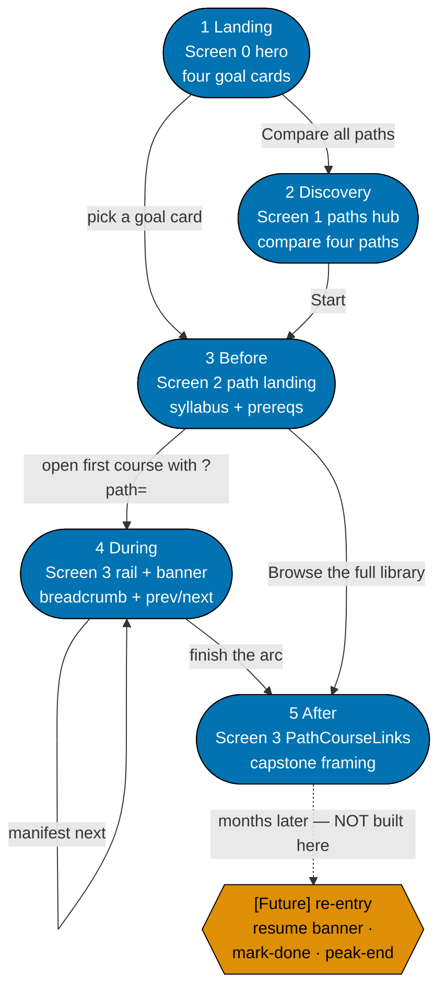
```mermaid
%% Learner journey — the five stages this plan's four screens serve.
%% Node SHAPE encodes scope: stadium = in-scope (built here), hexagon = [Future] (recorded, not built).
%% Each stage's label names its screen, so the mapping never depends on colour.
%% Palette: verified color-blind-friendly (#0173B2 blue, #DE8F05 orange, #029E73 teal, #CC78BC purple).
%% TB orientation: the journey is a six-node serial chain, which exceeds the LR width budget.
flowchart TB
    S1(["1 Landing<br/>Screen 0 hero<br/>four goal cards"]):::inscope
    S2(["2 Discovery<br/>Screen 1 paths hub<br/>compare four paths"]):::inscope
    S3(["3 Before<br/>Screen 2 path landing<br/>syllabus + prereqs"]):::inscope
    S4(["4 During<br/>Screen 3 rail + banner<br/>breadcrumb + prev/next"]):::inscope
    S5(["5 After<br/>Screen 3 PathCourseLinks<br/>capstone framing"]):::inscope
    FUT{{"[Future] re-entry<br/>resume banner ·<br/>mark-done · peak-end"}}:::future

    S1 -->|"Compare all paths"| S2
    S1 -->|"pick a goal card"| S3
    S2 -->|"Start"| S3
    S3 -->|"open first course with ?path="| S4
    S4 -->|"manifest next"| S4
    S4 -->|"finish the arc"| S5
    S5 -.->|"months later — NOT built here"| FUT
    S3 -->|"Browse the full library"| S5

    classDef inscope fill:#0173B2,stroke:#000000,color:#FFFFFF
    classDef future fill:#DE8F05,stroke:#000000,color:#000000
```

**Accessibility note.** Scope is carried by node **shape** (stadium = in-scope, hexagon = `[Future]`)
and by the literal `[Future]` text inside the node, never by fill colour alone; the single dotted edge
is additionally labelled "NOT built here".

| Stage           | Learner's need                               | Design response (screen / affordance)                                                                                                                           | Scope    |
| --------------- | -------------------------------------------- | --------------------------------------------------------------------------------------------------------------------------------------------------------------- | -------- |
| **1 Landing**   | "Where do I even start?"                     | **Screen 0** hero surfaces the 4 goal cards + "Compare all paths" escape hatch                                                                                  | In-scope |
| **2 Discovery** | "Which path fits me? what's shared?"         | **Screen 1** paths hub (compare paths, course counts); "Browse the full library" for topic-led seekers                                                          | In-scope |
| **3 Before**    | "Am I ready? can I skip ahead?"              | **Screen 2** syllabus preview + advisory `PrerequisiteList` + fast-path "skip the prologue" callout                                                             | In-scope |
| **4 During**    | "Keep me oriented and moving"                | **Screen 3** `PathRail` (whole ordered arc, current course marked) + `PathBanner` readout (step k of N) + path breadcrumb + manifest prev/next keeping `?path=` | In-scope |
| **5 After**     | "I finished — what now? where else is this?" | **Screen 3** `PathCourseLinks` ("this course is also in …") + manifest next → capstone framing                                                                  | In-scope |

**Stage-by-stage smoothness**

- **1 · Landing** — the failure mode today is a hero that dumps a goal-driven learner into a
  recall-heavy browse index. Screen 0 replaces that with four **goal-labeled** cards. Because the
  labels are the learner's own goal ("pass an interview soon"), the four options are trivially
  comparable and carry a built-in heuristic — the exact condition under which choice-overload does
  **not** bite — and the "Compare all paths" link is the Codecademy-style escape hatch for the
  genuinely undecided. **[Future]** a `localStorage`-read "welcome back — resume _Coding Interview_"
  banner would close the industry's weakest seam (cold returning visitor); noted, not built here.
- **2 · Discovery** — the seam from Landing must not "bait-and-switch": the hub the "Compare all paths"
  link opens shows the _same four paths_ with more detail (course counts, one-line arcs), not a
  different taxonomy. Topic-led seekers who don't want a path get "Browse the full library" → the course
  index. A shared course legitimately has several parent paths — a **polyhierarchy** — applied with
  restraint (a course appears only in the paths whose manifest actually lists it, not every path).
- **3 · Before** — readiness is **advisory, never gated**: prerequisites render as an inline list that
  points sideways ("take X first"), and experienced/re-entrant learners get an explicit skip-ahead
  (the fast-path callout lands them further down the _same_ ordered syllabus, not a separate stripped
  variant). No quiz-wall, no lock.
- **4 · During** — orientation without a login: the `PathRail` keeps the whole ordered arc beside the
  body (in the shipped drawer below `md`) with the current course marked, the `PathBanner` readout
  shows "on path: … · course k of N", the breadcrumb and prev/next all keep `?path=`, so the learner
  never falls out of path context by clicking forward. Deep-links/shares keep the path via the query
  param; opening a course with no `?path=` degrades to the canonical view. **[Future]** a client-only
  `localStorage` "mark done" + "k of N done" indicator (Zeigarnik re-engagement) — keyed by
  **course-ID alone** so completion **carries across every path** that shares the course; noted, not
  built here.
- **5 · After** — close the loop, don't dead-end: manifest `next` hands off to the following course;
  the terminal node is a **capstone** framed as a portfolio artifact (distinct treatment from a
  mid-path course); and `PathCourseLinks` answers "where else does this course live?" — a
  cross-path-continuity affordance the survey found **no platform** ships, so it is a deliberate
  differentiator here. **[Future]** a peak-end completion celebration (with an `aria-live`
  announcement, not colour/confetti alone).

**The seams** (where journeys usually break) — Landing→Discovery keeps the same four paths visible so
information scent is preserved; Before→During turns "skip ahead" into a starting offset in the _same_
structure, not a forked variant to maintain; During→After uses one boolean per course-ID so "in
progress" and "done" would be the same data model, and finishing a course in Path A would register when
it reappears in Path B; After→re-entry is the industry's weakest seam and is explicitly parked as
**[Future]** rather than hand-waved.

**Ergonomics principles (evidence-backed, applied across the journey)**

- **Choice overload is contextual, not automatic.** The canonical jam study (24 vs. 6 options) is real,
  but the largest meta-analysis ([Scheibehenne, Greifeneder & Todd 2010](https://www.psychologytoday.com/us/blog/pop-psych/201602/is-choice-overload-real-thing),
  50 studies) found a near-zero _average_ effect — overload bites mainly when the user has **no
  preexisting preference, options are hard to compare, and no heuristic/filter exists**. Screen 0's
  goal-labeled cards + escape hatch neutralize all three, so four cards in the hero is safe.
  [Web-cited: <https://www.psychologytoday.com/us/blog/pop-psych/201602/is-choice-overload-real-thing>,
  accessed 2026-07-21 — "the average estimated effect size for the choice overload effect across all
  the experiments was a mere D = 0.02; the effect was all but non-existent" (50 experiments, ~5,000
  participants, 13 published + 16 unpublished papers, 2000-2009)]
- **Hick's Law is logarithmic** (`RT = a + b·log₂n`), with **no magic-number cutoff** — the "7±2" figure
  is Miller's working-memory law, a different construct, and is not used here.
  [Web-cited: <https://lawsofux.com/hicks-law/>, accessed 2026-07-21 — "The time it takes to make a
  decision increases with the number and complexity of choices"]
- **Polyhierarchy** — one course, a _few restrained_ parent paths, not cross-listed everywhere.
  [Web-cited: <https://www.nngroup.com/articles/polyhierarchy/>, accessed 2026-07-21 — "exhaustively
  crossreferencing every single place where a particular item could sit would swell each menu"]
- **Breadcrumb = location, not history.** NN/g's default is a single canonical parent; our path-aware
  breadcrumb is a **deliberate, documented departure** — justified because the active path is explicit
  and shareable in the URL (`?path=`), so the trail is deterministic _given the URL_ rather than
  silently referrer-driven.
  [Web-cited: <https://www.nngroup.com/articles/breadcrumbs/>, accessed 2026-07-21 — "Breadcrumbs are
  not intended to show the history of pages traversed during a session on the site... they are intended
  to show the hierarchical structure of the site"; "If a page has multiple different parents, identify
  a canonical path to it in the site hierarchy and show that path in the breadcrumb trail"]
- **Recognition over recall / information scent** — persistent path banner + breadcrumb so the learner
  never has to remember which path they're in.
  [Web-cited: <https://www.nngroup.com/articles/recognition-and-recall/>, accessed 2026-07-21 —
  "Recognition is easier than recall because it involves more cues"]
  [Web-cited: <https://www.nngroup.com/articles/information-scent/>, accessed 2026-07-21 — "The user's
  imperfect estimate of the value that the source will deliver to the user, derived from a
  representation of the source"]
- **Zeigarnik & peak-end** (both **[Future]**) — an unfinished-count indicator drives return visits;
  completion should end on a rewarding note without an upsell.
  [Web-cited: <https://www.nngroup.com/videos/zeigarnik-effect/>, accessed 2026-07-21 — "The Zeigarnik
  effect suggests that unfinished tasks are more memorable than completed ones"]
  [Web-cited: <https://www.nngroup.com/articles/peak-end-rule/>, accessed 2026-07-21 — "Intense positive
  or negative moments (the 'peaks') and the final moments of an experience (the 'end') are heavily
  weighted in our mental calculus"]
- **Mobile & a11y per stage** — advisory-vs-hard signifiers never colour-only; tap targets ≥44px (above
  the WCAG 2.2 §2.5.8 24px floor); no multi-line breadcrumb wrap on small screens; completion state
  announced via `aria-live`.
  [Web-cited: <https://www.w3.org/WAI/WCAG22/Understanding/target-size-minimum.html>, accessed
  2026-07-21 — "The size of the target for pointer inputs is at least 24 by 24 CSS pixels"]

## UI-Design-Funnel (Path-Aware Navigation Screens)

The path-aware navigation adds/changes **six user-facing screens owned by this plan**: **Screen 0** is
the site **landing hero** at `/en` (where a first-time visitor first meets the paths); **Screens
1-1a-1b-2-3** live under the `/en/learn/paths` URL model (paths hub, category landing, arc landing,
path landing, course-in-path). A seventh screen — **Screen 4**, the legacy-bucket landing and page
banner — belongs to `ayokoding-learning-path-01-url-restructure`; see
[Screen 4 (cross-plan)](#screen-4--legacy-bucket-landing-cross-plan) below.

> **Screens 1, 1a, and 1b are new/redesigned by the 2026-07-21 category-split ruling** (R6, R7); they
> did not exist in this plan's original four-path draft. Screen 1a and 1b are a genuinely new IA
> concept — an arc was previously only a URL segment and a manifest attribute, never a page (R7) — and
> every URL segment now resolves to a real, rendered page rather than a routing waypoint. See
> [README.md §Category Split Ruling](./README.md#category-split-ruling-2026-07-21-r1r8) for the full
> record.

Each screen runs the diverge → narrow → select → justify funnel. Low-fidelity wireframes are authored
below at **all three viewports**; the two high-fidelity finalists per screen are rendered as `.png`
assets under this plan's [`assets/`](./assets/) and embedded inline here. Repo-grounded **textual**
hi-fi specifications for each chosen screen are authored in
[Hi-Fi Specifications](#hi-fi-specifications-textual-repo-grounded) below and are the source of truth
those PNGs render. The screens are sequenced along the [Learner Journey](#learner-journey-end-to-end)
— landing → discovery → before → during → after — so the funnel optimizes the _whole_ arc, not each
screen in isolation.

> **Assets note**: the twelve hi-fi finalist PNGs (two per screen, across the six screens 0, 1, 1a, 1b,
> 2, 3) are **already produced**
> and embedded below. They are rendered from self-contained HTML mockups (kept alongside as
> [`assets/src/*.html`](./assets/src/)) styled with the **exact AyoKoding token palette**
> (`libs/web-ui-token/src/ayokoding.css` — the same `oklch` hues, `--warm-*` neutral scale, radius,
> and shadow tokens the running app uses), so the mockups are colour- and spacing-accurate rather than
> sketches. To regenerate: serve `assets/src/` over HTTP and full-page-screenshot each page. The
> twenty-four mobile and tablet renders are produced by
> [delivery.md Phase 1](./delivery.md#phase-1-ui-design-funnel-screens-0-1-1a-1b-2-3).

**R5 grounding note (all screens)** — before drafting, survey the existing UI to reuse rather than
reinvent: `libs/web-ui` component inventory + tokens + Storybook; the ayokoding app-shell
(`apps/ayokoding-www/src/features/app-shell/`); the existing `sidebar-tree`, `breadcrumb`, `prev-next`,
and `section-card` components [Repo-grounded — `apps/ayokoding-www/src/features/navigation/shell/` and
`.../content/shell/section-card.tsx`]; and — decisively for Screen 3 — `resizable-sidebar.tsx` and
`app-shell/shell/mobile-nav.tsx`, the two already-shipped hosts the selected Option B swaps content
into. Reference the `swe-developing-frontend-ui` skill. **Net-new components**: `PathCard`,
`PathLanding`, `PathRail`, `PathBanner`, `PathCourseLinks`, `PrerequisiteList` — all composed from
existing `libs/web-ui` primitives; named in
[tech-docs §New feature: `course-paths`](./tech-docs.md#new-feature-course-paths-functional-core--imperative-shell).

**R7 prior-art survey (all screens) — COMPLETE.** A `web-researcher` window-shop of 13 learning
platforms ran on **2026-07-21**; the selections below are **prior-art-informed** (this discharges the
earlier provisional-diverge caveat). Sources and the full adopt/adapt/avoid mapping are in
[R7 Prior-Art Findings](#r7-prior-art-findings-window-shopped-2026-07-21) below. Headline results that
drove the selections:

- **No platform puts more than 3-4 large path choices in/near the hero** — the dense catalog is always
  one click deeper (roadmap.sh's 92-roadmap catalog, Codecademy's 12-path center). Our four
  goal-labeled paths sit safely under every choice-overload threshold ([Hick's Law](https://lawsofux.com/hicks-law/);
  Iyengar & Lepper's jam study), so Screen 0 puts the **4 goal cards directly in the hero** with an
  "Not sure? Compare paths" escape hatch (Boot.dev + Codecademy model).
- **Path landings are numbered flat lists + an advisory "take in order, content builds" note**, never
  a DAG diagram or 3-level nesting ([Coursera](https://www.coursera.org/professional-certificates/google-data-analytics);
  NN/g caps disclosure at [two levels](https://www.nngroup.com/articles/progressive-disclosure/)) —
  validates Screen 2 Option A.
- **Prerequisites are advisory prose, not hard gates** across every platform (Scrimba, DataCamp,
  Pluralsight's "skip modules you already know") — validates our advisory `PrerequisiteList` + the
  fast-path "skip the prologue" callout for re-entrant users.
- **A course-page path banner and a "this course is in N paths" affordance are an industry-wide
  whitespace** — no surveyed platform surfaces them ([Boot.dev](https://www.boot.dev/paths/backend-python-golang)
  path pages have no breadcrumb; Frontend Masters shows no cross-path indicator). Our `PathRail`,
  `PathBanner`, and `PathCourseLinks` are therefore **net-new differentiators**, built on the nearest
  adjacent precedents (Coursera's program breadcrumb; the persistent lesson rail every docs-style site
  ships) rather than copied.

### Screen 0 · Landing hero (path entry)

The site landing hero at `/en`
([`app-shell/shell/hero.tsx`](../../../apps/ayokoding-www/src/features/app-shell/shell/hero.tsx),
rendered by [`landing.tsx`](../../../apps/ayokoding-www/src/features/app-shell/shell/landing.tsx) via
`<Hero locale={locale} />`) [Repo-grounded — both files exist today]. **Today** it offers only two
generic CTAs — **Start learning** → `/en/browse` (a recall-heavy browse index of sections) and **Explore
tools** — so a goal-driven learner ("I want to get interview-ready") has **zero path scent** above the
fold. This screen fixes that: the hero must **surface `/paths` directly**, turning the landing page
into the first step of the learner journey rather than a dead-drop into a taxonomy.

**Low-fi Option A — Four goal cards in the hero (Recommended)**

_Mobile — 375 px (`<sm`): one column, cards full-width_

```text
┌────────────────────────────────────┐
│ ☰  AyoKoding            ⌕  ☾       │
├────────────────────────────────────┤
│ Learn to build software,           │
│ the clear way.                     │
│ Start from your goal — every path  │
│ is one route through one library.  │
│ CHOOSE YOUR PATH                   │
│ ┌────────────────────────────────┐ │
│ │ Pass a SWE interview soon      │ │
│ │ Interview-Ready SWE      ~119  │ │
│ └────────────────────────────────┘ │
│ ┌────────────────────────────────┐ │
│ │ Get productive & ship fast     │ │
│ │ Immediately-Effective    ~116  │ │
│ └────────────────────────────────┘ │
│ ┌────────────────────────────────┐ │
│ │ Build durable fundamentals     │ │
│ │ Fundamentally Strong     ~121  │ │
│ └────────────────────────────────┘ │
│ ┌────────────────────────────────┐ │
│ │ Become an AI engineer          │ │
│ │ AI Engineer               ~132 │ │
│ └────────────────────────────────┘ │
│ Compare all paths →                │
│ Or want a fast, focused skill      │
│ instead? Explore skills paths →    │
│ Browse the full library →          │
└────────────────────────────────────┘
```

_Tablet — 768 px (`md`): the four-card, two-column grid turns on (`md:grid-cols-2`)_

```text
┌────────────────────── AyoKoding · /en ───────────────────────┐
│ Learn to build software, the clear way.                       │
│ Start from your goal — one route through one library.         │
│ CHOOSE YOUR PATH                                              │
│  ┌────────────────────────┐  ┌────────────────────────┐      │
│  │ Pass a SWE interview   │  │ Get productive & ship  │      │
│  │ Interview-Ready   ~119 │  │ Immediately-Eff.  ~116 │      │
│  └────────────────────────┘  └────────────────────────┘      │
│  ┌────────────────────────┐  ┌────────────────────────┐      │
│  │ Build fundamentals     │  │ Become an AI engineer  │      │
│  │ Fundamentally S.  ~121 │  │ AI Engineer       ~132 │      │
│  └────────────────────────┘  └────────────────────────┘      │
│  Compare all paths →        Browse the full library →         │
│  Explore skills paths →                                       │
└───────────────────────────────────────────────────────────────┘
```

_Desktop — 1280 px (`xl`)_

```text
┌──────────────────────────── AyoKoding · /en ─────────────────────────────┐
│ Learn to build software, the clear way.                                   │
│ Start from your goal — every path is one route through one library.       │
│ CHOOSE YOUR PATH                                                          │
│  ┌───────────────────────────┐  ┌───────────────────────────┐            │
│  │ Pass a SWE interview soon │  │ Get productive & ship fast │           │
│  │ Interview-Ready SWE  ~119 │  │ Immediately-Effective ~116 │           │
│  └───────────────────────────┘  └───────────────────────────┘            │
│  ┌───────────────────────────┐  ┌───────────────────────────┐            │
│  │ Build durable fundamentals│  │ Become an AI engineer      │           │
│  │ Fundamentally Strong ~121 │  │ AI Engineer           ~132 │           │
│  └───────────────────────────┘  └───────────────────────────┘            │
│  Not sure which fits? Compare all paths →     Browse the full library →   │
│  Want a fast, focused skill instead? Explore skills paths →               │
└────────────────────────────────────────────────────────────────────────────┘
```

**Low-fi Option B — Goal-question strip below a single-CTA hero (Coursera model)**

_Mobile — 375 px: the two CTAs stack, so all four goals sit below the fold_

```text
┌────────────────────────────────────┐
│ Learn to build software,           │
│ the clear way.                     │
│ [ Start learning →              ]  │
│ [ Explore tools                 ]  │
│ ────────────────────────────────── │
│ What brings you here today?        │  ← typically below the fold
│  • Pass a SWE interview soon →     │
│  • Get productive & ship fast →    │
│  • Build durable fundamentals →    │
│  • Become an AI engineer →         │
└────────────────────────────────────┘
```

_Tablet — 768 px: CTAs sit inline; the goal strip becomes two columns_

```text
┌────────────────────── AyoKoding · /en ───────────────────────┐
│ Learn to build software, the clear way.                       │
│ [ Start learning → ]   [ Explore tools ]                      │
│ ───────────────────────────────────────────────────────────── │
│ What brings you here today?                                   │
│  • Pass a SWE interview soon →   • Get productive & ship →     │
│  • Build durable fundamentals →  • Become an AI engineer →     │
└───────────────────────────────────────────────────────────────┘
```

_Desktop — 1280 px_

```text
┌──────────────────────────── AyoKoding · /en ─────────────────────────────┐
│ Learn to build software, the clear way.                                   │
│ [ Start learning → ]   [ Explore tools ]                                  │
│ ───────────────────────────────────────────────────────────────────────  │
│ What brings you here today?                                               │
│  • Pass a SWE interview soon →     • Get productive & ship fast →         │
│  • Build durable fundamentals →    • Become an AI engineer →              │
└────────────────────────────────────────────────────────────────────────────┘
```

**Low-fi Option C — Single "Find your path" CTA + guided quiz (edX/Educative model)**

_Mobile — 375 px_

```text
┌────────────────────────────────────┐
│ Learn to build software,           │
│ the clear way.                     │
│ [ Find your path →              ]  │
│ (answer 3 questions)               │
│ or browse all paths →              │
└────────────────────────────────────┘
```

_Tablet — 768 px_

```text
┌────────────────────── AyoKoding · /en ───────────────────────┐
│ Learn to build software, the clear way.                       │
│ [ Find your path → ]  (answer 3 questions)                    │
│ or browse all paths →                                         │
└───────────────────────────────────────────────────────────────┘
```

_Desktop — 1280 px_

```text
┌──────────────────────────── AyoKoding · /en ─────────────────────────────┐
│ Learn to build software, the clear way.                                   │
│ [ Find your path → ]  (answer 3 questions)      or browse all paths →     │
└────────────────────────────────────────────────────────────────────────────┘
```

**Responsive (mobile ↔ desktop)** — Option A shows a **two-column, two-row card grid** at `md+` and
**stacks to one column** below `md`; each card is a full-width tap target (≥ the WCAG 2.2 §2.5.8 24px
floor, sized to the ~48px comfort target). The "Compare all paths" / "Explore skills paths" / "Browse
library" links wrap under the grid on mobile. The four cards fit above the fold on desktop and within
one short scroll on mobile — no card is pushed below a fold-and-a-half the way Option B's strip is once
the primary CTAs precede it.

**Why still four cards, not eight (careers + skills together — amended by A10, up from six).** The
hero's whole job is the fastest possible goal-to-route decision, and Hick's Law / the jam-study
threshold both argue for staying at the low end (see the Ergonomics rationale below) — doubling to
eight cards to fit skills in would undo the overload argument that won Option A. Skills gets a
**tertiary escape-hatch link** ("Explore skills
paths →" → `/en/learn/paths/skills/`) beside "Compare all paths" and "Browse the full library", the same
weight class those two already occupy, rather than hero-card real estate.

**Hi-fi finalists** (rendered from the token-accurate HTML mockups):


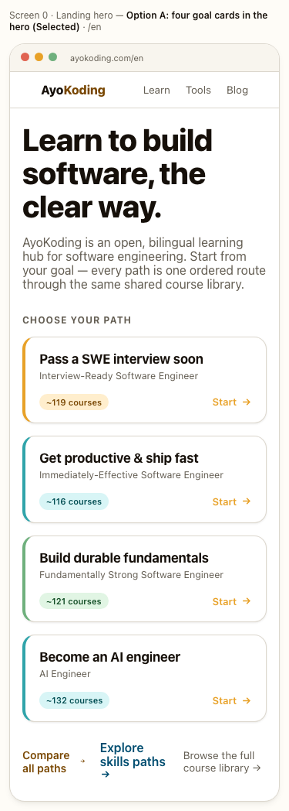

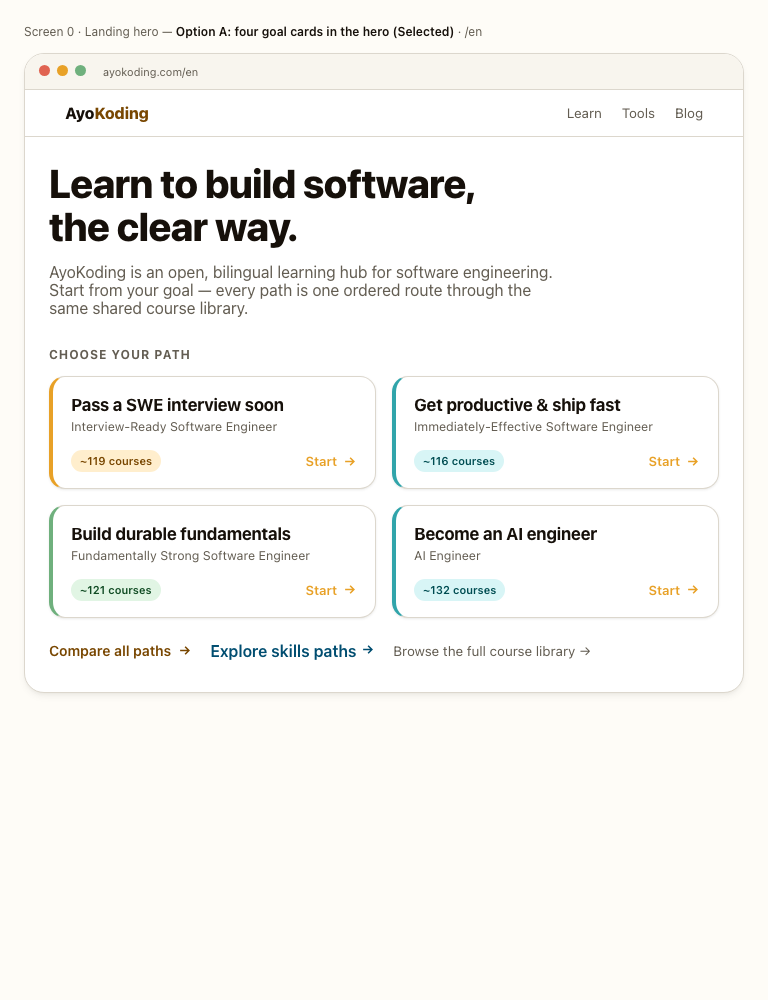


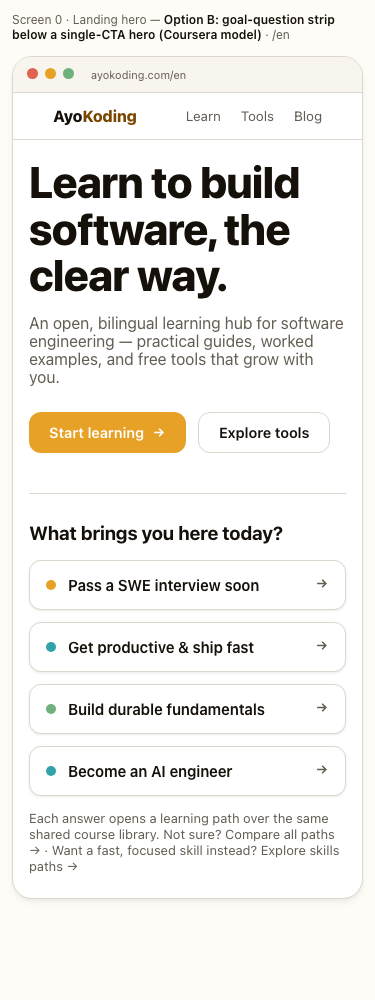

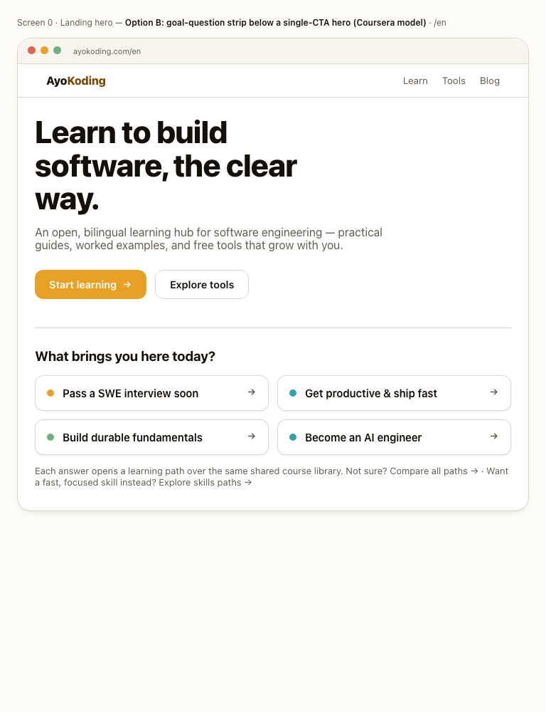

**Selected: Option A — four goal cards in the hero — finalist renders:
landing-hero-option-a-{mobile,tablet,desktop}.png.**

| Design                      | Why it won / lost                                                                                                                                               |
| --------------------------- | --------------------------------------------------------------------------------------------------------------------------------------------------------------- |
| A — 4 goal cards in hero ✅ | Zero clicks/scroll to the core decision; strongest information scent (goal verbs + course counts); 4 ≪ overload cap; skills escape hatch keeps the count honest |
| B — goal-question strip     | Proven (Coursera), but the primary CTA precedes it, so path choice needs a scroll and competes with "Start learning"                                            |
| C — guided quiz             | Best only when paths are ambiguous; ours are already goal-labeled, and no surveyed platform uses a quiz as sole entry                                           |

**Ergonomics rationale** — our four **careers** paths are **already goal-labeled**, so no quiz is
needed to translate intent into a route (avoids Option C's mandatory extra step). Four cards is at the
low end of every threshold surveyed ([Hick's Law](https://lawsofux.com/hicks-law/); Iyengar & Lepper
2000 jam study; NN/g "show a few of the most important options"), so putting them **in** the hero — not
one scroll below it like Option B — removes the single friction point every "goal-question-then-cards"
platform still has. The subordinate **"Compare all paths →"** link (→ Screen 1) is the escape hatch for
undecided visitors (Codecademy's "sorting quiz alongside the grid" pattern) without diluting the
four-card decision; **"Explore skills paths →"** (→ Screen 1a's skills instance) is the equivalent escape
hatch for the eight-path world the category split introduced (amended by A10, up from six), so a
skills-seeking visitor is never forced
through the careers-framed cards to get there; **"Browse the full library →"** preserves the non-path,
self-directed entry (recognition-over-recall for learners who know the topic they want). The existing
**Start learning / Explore tools** buttons are **not deleted** — they move into the global nav so the
hero's primary visual weight is the path decision.

**Implementation is in scope here.** Screen 0 is **not** design-only: this plan's
[delivery.md Phase 3](./delivery.md#phase-3-path-landing--paths-hub--landing-hero--e2e) carries a
RED/GREEN/REFACTOR triplet against `hero.tsx`, bound by the Gherkin scenario
["The landing hero surfaces the four goal paths directly"](#acceptance-criteria-gherkin). See
[README §Screen 0 ruling](./README.md#screen-0-ruling--option-a-implementation-carried-recorded).

### Screen 1 · Paths hub ("choose your path")

**Redesigned by the 2026-07-21 category-split ruling (R6), path count amended 2026-07-21 by A10.**
Entry screen at `/en/learn/paths` (the paths hub) now offers **eight paths in two categories** at
deliberately different URL depth — `careers/<arc>/<role>` (4 paths across 3 arcs) and
`skills/<subject>` (**4** paths as of amendment A10 — up from the original two — all the
`immediately-effective` arc per R8, though the arc is not itself a URL segment for skills). The old
flat four-card, one-card-per-manifest design cannot express this: eight paths do not tile a symmetric
four-card grid, and the two categories' different depth carries real information (skills has no arc
choice; careers does) that a flat grid would erase. The fourth **careers** path still converges on a different endpoint than the
other three (per-role convergence, DD-22), so the hub's `careers/` section copy states "converging
within your role" rather than the earlier single-endpoint framing.

**Low-fi Option A — Category sections, arc-grouped within Careers (Recommended)**

_Mobile — 375 px (`<sm`): one column; sections stack; no sidebar (`hidden` below `md`)_

```text
┌────────────────────────────────────┐
│ ☰  AyoKoding            ⌕  ☾       │
├────────────────────────────────────┤
│ Choose your path.                  │
│ Eight paths, two ways in.          │
│                                     │
│ CAREERS · converging within role   │
│ ── Interview-Ready ──────────────  │
│ ┌────────────────────────────────┐ │
│ │ Software Engineer   ~119       │ │
│ │ [ Start → ]                    │ │
│ └────────────────────────────────┘ │
│ ── Immediately-Effective ────────  │
│ ┌────────────────────────────────┐ │
│ │ Software Engineer   ~116       │ │
│ │ [ Start → ]                    │ │
│ └────────────────────────────────┘ │
│ ┌────────────────────────────────┐ │
│ │ AI Engineer          ~132      │ │
│ │ [ Start → ]                    │ │
│ └────────────────────────────────┘ │
│ ── Fundamentally Strong ─────────  │
│ ┌────────────────────────────────┐ │
│ │ Software Engineer   ~121       │ │
│ │ [ Start → ]                    │ │
│ └────────────────────────────────┘ │
│                                     │
│ SKILLS · up and running fast       │
│ ┌────────────────────────────────┐ │
│ │ Conventional Accounting        │ │
│ │ [ Start → ]                    │ │
│ └────────────────────────────────┘ │
│ ┌────────────────────────────────┐ │
│ │ Sharia Accounting              │ │
│ │ [ Start → ]                    │ │
│ └────────────────────────────────┘ │
│ ┌────────────────────────────────┐ │
│ │ Conventional ERP               │ │
│ │ [ Start → ]                    │ │
│ └────────────────────────────────┘ │
│ ┌────────────────────────────────┐ │
│ │ Sharia ERP                     │ │
│ │ [ Start → ]                    │ │
│ └────────────────────────────────┘ │
│ Or browse the full library →       │
└────────────────────────────────────┘
```

_Tablet — 768 px (`md`): sidebar appears; each category's cards go two-up_

```text
┌── Sidebar ───┬────────────────────────────────────────────────┐
│ ▸ Learn      │ CAREERS · converging within role                │
│   ▸ Paths    │ ── Interview-Ready ──  ── Immediately-Eff. ──   │
│   ▸ Courses  │ ┌──────────────────┐   ┌──────────────────┐    │
│   ▸ Legacy   │ │ SWE  ~119 [Start]│   │ SWE  ~116 [Start]│    │
│              │ └──────────────────┘   │ AI   ~132 [Start]│    │
│              │                        └──────────────────┘    │
│              │ ── Fundamentally Strong ──                      │
│              │ ┌──────────────────┐                            │
│              │ │ SWE  ~121 [Start]│                            │
│              │ └──────────────────┘                            │
│              │ SKILLS · up and running fast                    │
│              │ ┌──────────────────┐ ┌──────────────────┐      │
│              │ │ Conv. Acct[Start]│ │ Sharia Acct[Start]│     │
│              │ └──────────────────┘ └──────────────────┘      │
│              │ ┌──────────────────┐ ┌──────────────────┐      │
│              │ │ Conv. ERP [Start]│ │ Sharia ERP [Start]│     │
│              │ └──────────────────┘ └──────────────────┘      │
│              │ Or browse the full course library →             │
└──────────────┴────────────────────────────────────────────────┘
```

_Desktop — 1280 px (`xl`): each category is its own labelled section; Careers keeps arc sub-headings_

```text
┌────────────────────────────── AyoKoding · Learn ──────────────────────────────────┐
│  Choose your path. Eight paths, two ways in.                                       │
│                                                                                     │
│  CAREERS · converging within your role                                             │
│  Interview-Ready              Immediately-Effective         Fundamentally Strong   │
│  ┌──────────────────┐   ┌──────────────────┐┌──────────────────┐ ┌──────────────┐ │
│  │ Software Engineer │   │ Software Engineer││ AI Engineer      │ │ Software Eng.│ │
│  │ ~119  [ Start → ] │   │ ~116  [ Start → ]││ ~132 [ Start → ] │ │ ~121 [Start →│ │
│  └──────────────────┘   └──────────────────┘└──────────────────┘ └──────────────┘ │
│                                                                                     │
│  SKILLS · get up and running fast, then go deeper                                  │
│  ┌────────────────────────┐  ┌────────────────────────┐                           │
│  │ Conventional           │  │ Sharia                  │                           │
│  │ Accounting  [ Start → ]│  │ Accounting   [ Start → ]│                           │
│  └────────────────────────┘  └────────────────────────┘                           │
│  ┌────────────────────────┐  ┌────────────────────────┐                           │
│  │ Conventional ERP       │  │ Sharia ERP              │                           │
│  │             [ Start → ]│  │              [ Start → ]│                           │
│  └────────────────────────┘  └────────────────────────┘                           │
│                                                                                     │
│  Or browse the full course library →                                               │
└─────────────────────────────────────────────────────────────────────────────────────┘
```

**Low-fi Option B — Flat 8-card grid with category+arc badges**

_Mobile — 375 px: one column, badge is the only grouping signal_

```text
┌────────────────────────────────────┐
│ Choose your path.                  │
│ ┌────────────────────────────────┐ │
│ │ [careers·interview-ready]      │ │
│ │ Software Engineer     ~119     │ │
│ └────────────────────────────────┘ │
│ ┌────────────────────────────────┐ │
│ │ [careers·immediately-effective]│ │
│ │ Software Engineer     ~116     │ │
│ └────────────────────────────────┘ │
│ ┌────────────────────────────────┐ │
│ │ [careers·immediately-effective]│ │
│ │ AI Engineer            ~132    │ │
│ └────────────────────────────────┘ │
│ ┌────────────────────────────────┐ │
│ │ [careers·fundamentally-strong] │ │
│ │ Software Engineer     ~121     │ │
│ └────────────────────────────────┘ │
│ ┌────────────────────────────────┐ │
│ │ [skills]  Conventional         │ │
│ │ Accounting                     │ │
│ └────────────────────────────────┘ │
│ ┌────────────────────────────────┐ │
│ │ [skills]  Sharia Accounting    │ │
│ └────────────────────────────────┘ │
│ ┌────────────────────────────────┐ │
│ │ [skills]  Conventional ERP     │ │
│ └────────────────────────────────┘ │
│ ┌────────────────────────────────┐ │
│ │ [skills]  Sharia ERP           │ │
│ └────────────────────────────────┘ │
└────────────────────────────────────┘
```

_Tablet — 768 px: two-up, badges still the only grouping signal_

```text
┌── Sidebar ───┬────────────────────────────────────────────────┐
│ ▸ Learn      │ [careers·interview-ready] SWE          [Start] │
│              │ [careers·imm-effective] SWE             [Start]│
│              │ [careers·imm-effective] AI Eng.         [Start]│
│              │ [careers·fund-strong] SWE               [Start]│
│              │ [skills] Conventional Accounting        [Start]│
│              │ [skills] Sharia Accounting              [Start]│
│              │ [skills] Conventional ERP               [Start]│
│              │ [skills] Sharia ERP                     [Start]│
└──────────────┴────────────────────────────────────────────────┘
```

_Desktop — 1280 px: 3×3 uniform grid (last row partial — 8 cards), no section headings at all_

```text
┌────────────────────────────── AyoKoding · Learn ──────────────────────────────────┐
│  Choose your path.                                                                 │
│  ┌──────────────┐┌──────────────┐┌──────────────┐                                 │
│  │[careers·int-r]││[careers·im-e]││[careers·im-e]│                                 │
│  │SWE  [Start →] ││SWE  [Start →]││AI  [Start →] │                                 │
│  └──────────────┘└──────────────┘└──────────────┘                                 │
│  ┌──────────────┐┌──────────────┐┌──────────────┐                                 │
│  │[careers·fnd-s]││[skills] Conv.││[skills] Sharia│                                │
│  │SWE  [Start →] ││Acct [Start →]││Acct [Start →] │                                │
│  └──────────────┘└──────────────┘└──────────────┘                                 │
│  ┌──────────────┐┌──────────────┐                                                 │
│  │[skills] Conv. ││[skills] Sharia│                                                │
│  │ERP  [Start →] ││ERP  [Start →] │                                                │
│  └──────────────┘└──────────────┘                                                 │
└─────────────────────────────────────────────────────────────────────────────────────┘
```

**Responsive (mobile ↔ desktop)** — Option A's category sections stack full-width below `sm`; each
category's cards go to a comfortable two-up at `md`, and Careers' arc sub-groups sit side by side at
`lg+` while Skills stays a simple row. The "Start" CTA is a full-width tap target on mobile.

**Hi-fi finalists** (rendered from the token-accurate HTML mockups — the pre-existing
`paths-hub-option-{a,b}-desktop.png` sources are redesigned in place, not replaced by new filenames,
so this is a **content change**, covered by the same generic mtime-based re-render check already in
`delivery.md`):


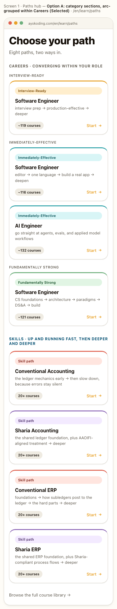

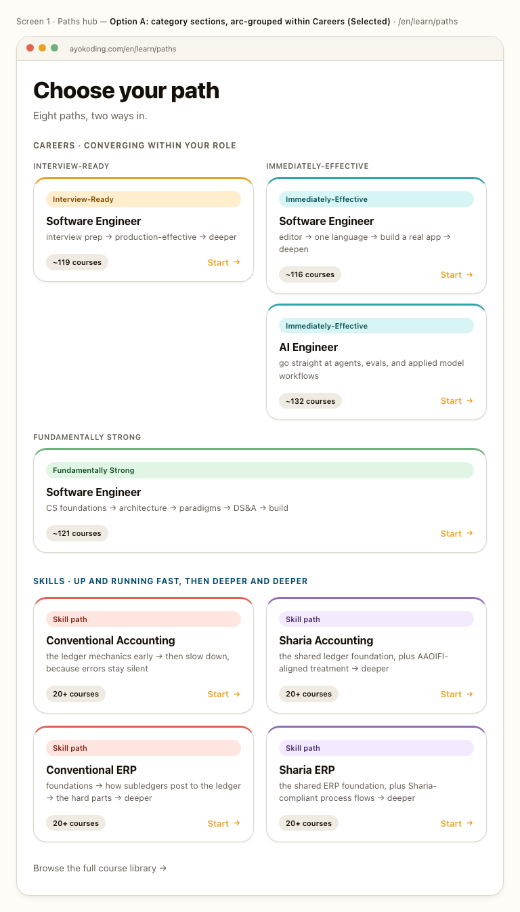

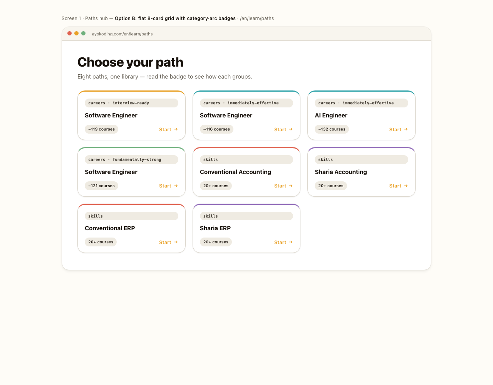

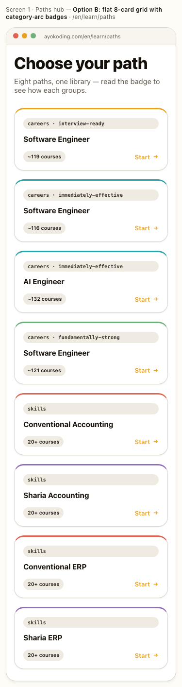

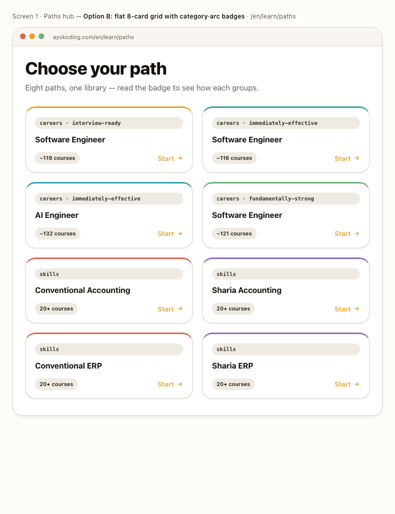

**Selected: Option A — Category sections, arc-grouped within Careers — finalist renders:
paths-hub-option-a-{mobile,tablet,desktop}.png.**

| Design                                | Why it won / lost                                                                                                                                                                                                                                 |
| ------------------------------------- | ------------------------------------------------------------------------------------------------------------------------------------------------------------------------------------------------------------------------------------------------- |
| A — category sections, arc-grouped ✅ | Grouping is a visible section, not a decoded badge; the arc sub-heading gives `immediately-effective`'s two cards a shared home without inventing a second grid; skills reads as a simpler, separate offer, matching R8's "different job" framing |
| B — flat 8-card grid                  | Uniform grid is simpler to build, but a reader must parse a compact `category·arc` badge to understand structure the section-header approach gives for free; also implies skills is "just another arc," which R8 explicitly rejects               |

### Screen 1a · Category landing (`careers/` and `skills/`)

**New screen type introduced by the category-split ruling (R7).** `/en/learn/paths/careers/` and
`/en/learn/paths/skills/` previously did not exist as pages — an arc/category was only a URL segment
and a manifest attribute. Per R7, every URL segment must resolve to a real, rendered page, so both
category landings are built here.

**The two instances have different jobs (R8) — not one template with swapped data.** `careers/` is a
genuine **branch point**: three arcs, and the landing's whole purpose is helping a reader choose
between them. `skills/` has **no branch to offer** — every skills path is the `immediately-effective`
arc (R8) — so its landing states that ramp promise **once**, as a fact, not a question, and lists
subjects directly. Design funnel below is run against the **careers instance** (the harder design
problem — an arc chooser); the **skills instance** is documented as an explicit content variant of
the selected option, not a separate alternative-generation pass, because R8 leaves it little design
freedom to vary.

**Low-fi Option A — Arc cards with member-role preview (Recommended)**

_Mobile — 375 px (`<sm`), careers instance: one column, each arc a card naming its member role(s)_

```text
┌────────────────────────────────────┐
│ ☰  AyoKoding            ⌕  ☾       │
├────────────────────────────────────┤
│ Home / Learn / Paths / Careers      │
│ Careers                            │
│ Three arcs, one shared library.     │
│ ┌────────────────────────────────┐ │
│ │ Interview-Ready                │ │
│ │ Pass a SWE interview soon.     │ │
│ │ Software Engineer              │ │
│ │ [ Explore arc → ]              │ │
│ └────────────────────────────────┘ │
│ ┌────────────────────────────────┐ │
│ │ Immediately-Effective          │ │
│ │ Get productive & ship fast.    │ │
│ │ Software Engineer · AI Engineer│ │
│ │ [ Explore arc → ]              │ │
│ └────────────────────────────────┘ │
│ ┌────────────────────────────────┐ │
│ │ Fundamentally Strong           │ │
│ │ Build durable fundamentals.    │ │
│ │ Software Engineer              │ │
│ │ [ Explore arc → ]              │ │
│ └────────────────────────────────┘ │
│ ← Back to all paths                │
└────────────────────────────────────┘
```

_Tablet — 768 px, careers instance: sidebar returns; cards go two-up with a third full-width_

```text
┌── Sidebar ───┬────────────────────────────────────────────────┐
│ ▸ Learn      │ Careers — three arcs, one shared library.       │
│   ▾ Paths    │ ┌──────────────────┐ ┌──────────────────┐      │
│     ▾ Careers│ │ Interview-Ready  │ │ Imm.-Effective   │      │
│     ▸ Skills │ │ SWE  [Explore →] │ │ SWE, AI Eng.     │      │
│   ▸ Courses  │ └──────────────────┘ │       [Explore →]│      │
│              │ ┌──────────────────┐ └──────────────────┘      │
│              │ │ Fund. Strong     │                            │
│              │ │ SWE  [Explore →] │                            │
│              │ └──────────────────┘                            │
└──────────────┴────────────────────────────────────────────────┘
```

_Desktop — 1280 px, careers instance: three arc cards side by side_

```text
┌──────────────────────── Careers · Learn ─────────────────────────────────┐
│ Home / Learn / Paths / Careers                                            │
│ Careers — three arcs, one shared library, converging within your role.    │
│                                                                            │
│ ┌───────────────────┐ ┌───────────────────┐ ┌───────────────────┐        │
│ │ Interview-Ready    │ │ Immediately-Eff.  │ │ Fundamentally S.  │        │
│ │ Pass an interview  │ │ Ship fast, deepen │ │ Fundamentals first│        │
│ │ soon.              │ │ later.            │ │, then build.       │       │
│ │ Software Engineer  │ │ Software Engineer │ │ Software Engineer │        │
│ │                     │ │ AI Engineer       │ │                     │      │
│ │ [ Explore arc → ]  │ │ [ Explore arc → ] │ │ [ Explore arc → ]  │       │
│ └───────────────────┘ └───────────────────┘ └───────────────────┘        │
│                                                                            │
│ ← Back to all paths                                                       │
└─────────────────────────────────────────────────────────────────────────────┘
```

**Skills instance (no chooser — R8), desktop, same Option A shell minus the chooser section, plus a
ramp-boundary strip.** The skills promise is "get us up and running and become dangerous as fast as
possible, then get deeper and deeper" — a **ramp**, not a chooser — and the most useful thing a skills
landing can show is **where in the ordering a reader becomes able to do real work**. Each subject card
therefore carries a small **milestone strip** naming the courses after which the reader is minimally,
comfortably, and confidently dangerous (course numbers per skills-plan manifest research — each of the
four skills paths (Conventional Accounting, Sharia Accounting, Conventional ERP, Sharia ERP) sets its
own milestone course numbers, amended by A9 to reflect corpora exceeding 20 courses each; the exact
numbers are sourced from the owning sibling skills-plan's manifest design, not re-derived or hardcoded
here — this plan's own scope is the rendering, not the milestone values):

```text
┌──────────────────────── Skills · Learn ───────────────────────────────────┐
│ Home / Learn / Paths / Skills                                             │
│ Skills — up and running fast, then deeper and deeper.                     │
│ Every skills path follows the same promise: become able to do real work   │
│ as fast as possible, then go deeper — no arc to choose here.              │
│                                                                            │
│ ┌───────────────────────────┐  ┌───────────────────────────┐             │
│ │ Conventional               │  │ Sharia                     │            │
│ │ Accounting                 │  │ Accounting                 │            │
│ │ ●───●─────●  dangerous     │  │ ●──●───────●  dangerous     │           │
│ │      comfortable           │  │     comfortable             │           │
│ │           confident        │  │          confident          │           │
│ │ [ Start → ]                │  │ [ Start → ]                 │           │
│ └───────────────────────────┘  └───────────────────────────┘             │
│ ┌───────────────────────────┐  ┌───────────────────────────┐             │
│ │ Conventional ERP           │  │ Sharia ERP                 │            │
│ │ ●───●─────●  dangerous     │  │ ●──●───────●  dangerous     │           │
│ │      comfortable           │  │     comfortable             │           │
│ │           confident        │  │          confident          │           │
│ │ [ Start → ]                │  │ [ Start → ]                 │           │
│ └───────────────────────────┘  └───────────────────────────┘             │
│                                                                            │
│ ← Back to all paths                                                       │
└─────────────────────────────────────────────────────────────────────────────┘
```

**Skills instance — empty state (before a skills manifest ships).** Plan 01 (amendment A3) creates
`paths/skills/_index.md` structurally ahead of the skills-plans that populate real manifests, so this
page **will render with zero subject cards for a real interval**, not a theoretical one. The empty
state is a first-class design, not a blank page:

```text
┌──────────────────────── Skills · Learn ───────────────────────────────────┐
│ Home / Learn / Paths / Skills                                             │
│ Skills — up and running fast, then deeper and deeper.                     │
│ ┌────────────────────────────────────────────────────────────────────┐  │
│ │  New skills paths are being written — check back soon.               │  │
│ │  In the meantime, explore the Careers paths →                        │  │
│ └────────────────────────────────────────────────────────────────────┘  │
│ ← Back to all paths                                                       │
└─────────────────────────────────────────────────────────────────────────────┘
```

This is the net-new **`EmptyPathListState`** component (`Alert`/`Card`-composed, not a bare `<p>`):
one line stating the interval is expected (not an error), one CTA back to a populated sibling category
(`careers/`, since it always has manifests). It is shared verbatim by Screen 1a's careers instance (if
an arc's manifest is ever mid-migration) and Screen 1b's arc landing, so the empty case is handled once
and reused, not redesigned per screen.

**Low-fi Option B — Arc list with inline description (no cards)**

_Mobile — 375 px (`<sm`), careers instance: the plain list stacks to one column, each item's
description wrapping across two or three lines with no card boundary to anchor it_

```text
┌────────────────────────────────────┐
│ ☰  AyoKoding            ⌕  ☾       │
├────────────────────────────────────┤
│ Home / Learn / Paths / Careers      │
│ Careers — three arcs, one shared    │
│ library.                            │
│ 1. Interview-Ready — pass a SWE     │
│    interview soon. Software         │
│    Engineer. →                      │
│ 2. Immediately-Effective — ship     │
│    fast, deepen later. Software     │
│    Engineer, AI Engineer. →         │
│ 3. Fundamentally Strong —           │
│    fundamentals first, then         │
│    build. SWE. →                    │
│ ← Back to all paths                 │
└────────────────────────────────────┘
```

_Tablet — 768 px, careers instance: sidebar returns; the list stays a single column beside it (no
two-up reflow available to a plain list the way Option A's cards get one)_

```text
┌── Sidebar ───┬────────────────────────────────────────────────┐
│ ▸ Learn      │ Careers — three arcs, one shared library.       │
│   ▾ Paths    │ 1. Interview-Ready — pass a SWE interview soon. │
│     ▾ Careers│    Software Engineer. →                         │
│     ▸ Skills │ 2. Immediately-Effective — ship fast, deepen    │
│   ▸ Courses  │    later. Software Engineer, AI Engineer. →     │
│              │ 3. Fundamentally Strong — fundamentals first,   │
│              │    then build. SWE. →                           │
└──────────────┴────────────────────────────────────────────────┘
```

_Desktop — 1280 px, careers instance: a numbered/plain list rather than cards_

```text
┌──────────────────────── Careers · Learn ─────────────────────────────────┐
│ Careers — three arcs, one shared library.                                 │
│ 1. Interview-Ready — pass a SWE interview soon. Software Engineer. →      │
│ 2. Immediately-Effective — ship fast, deepen later. Software Engineer,    │
│    AI Engineer. →                                                        │
│ 3. Fundamentally Strong — fundamentals first, then build. SWE. →         │
└─────────────────────────────────────────────────────────────────────────────┘
```

**Responsive (mobile ↔ desktop)** — Option A's arc cards stack full-width below `sm`, go two-up at
`md` with the third card wrapping full-width, and sit three-across at `lg+`. The skills instance
never needs more than a two-up reflow (**4** subjects as of amendment A10 — up from two — wrapping
into two rows of two), so it stacks at `<sm` and sits two-up from `md` up with no further breakpoint
tension.

**Hi-fi finalists** (desktop renders below; the mobile and tablet renders for both options are
produced by the delivery steps in
[Phase 1 · UI design funnel](./delivery.md#phase-1-ui-design-funnel-screens-0-1-1a-1b-2-3) — see the
[asset matrix](#hi-fi-asset-matrix-screen--option--viewport) — the low-fi wireframes above already
carry Option B through all three viewports. Option A's render is a **three-frame composite** —
careers instance, skills instance populated with ramp milestones, and skills instance empty state —
following the same "one render, multiple documented states" pattern Screen 3 already uses for its
rail states; Option B's render shows only the careers instance, sufficient to demonstrate why it
lost):

![Category landing, Option A — three stacked browser-chrome frames: the Careers instance with three arc cards side by side (Immediately-Effective visibly showing two member roles, Software Engineer and AI Engineer, where the other two arcs show one), the Skills instance with four subject cards (Conventional Accounting, Sharia Accounting, Conventional ERP, Sharia ERP) each carrying a dangerous/comfortable/confident milestone strip, and the Skills empty state showing a friendly "being written, check back soon" message with a fallback link to Careers](./assets/category-landing-option-a-desktop.png)


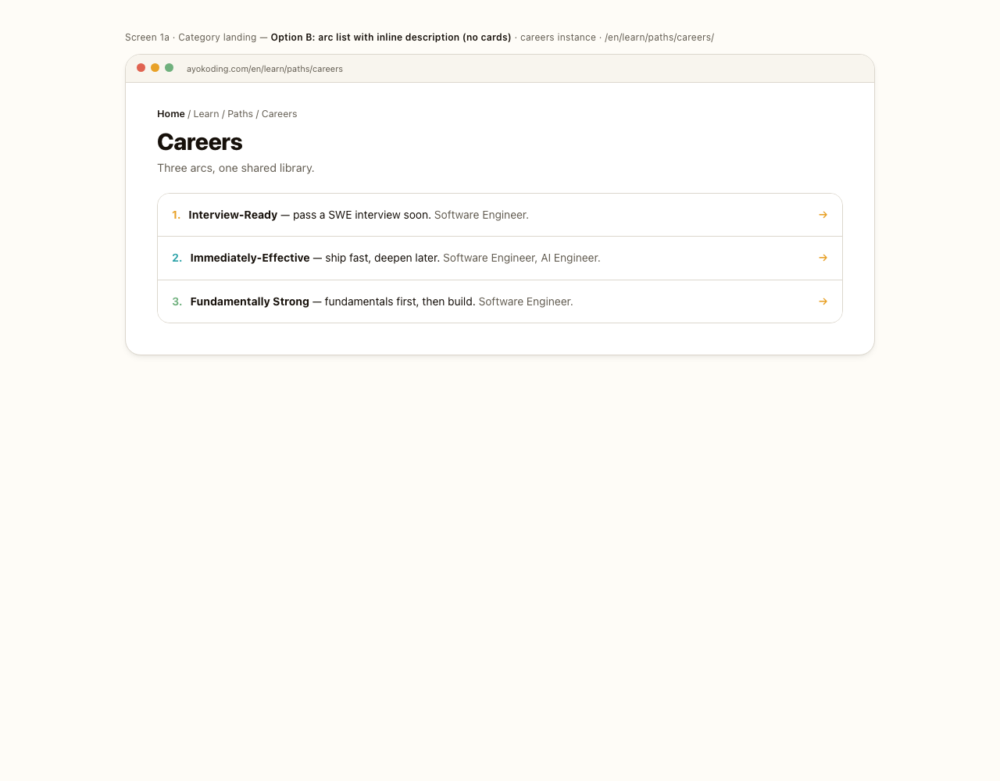

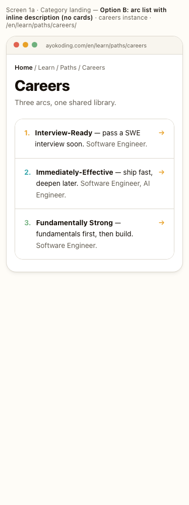

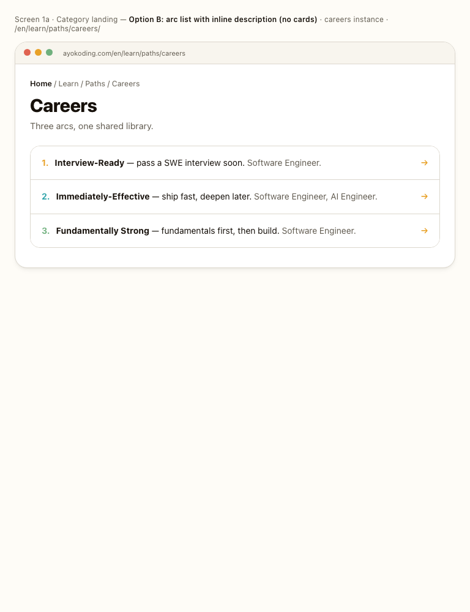

**Selected: Option A — Arc cards with member-role preview — finalist renders:
category-landing-option-a-{mobile,tablet,desktop}.png.**

| Design                           | Why it won / lost                                                                                                                                                                                                                              |
| -------------------------------- | ---------------------------------------------------------------------------------------------------------------------------------------------------------------------------------------------------------------------------------------------- |
| A — arc cards, member preview ✅ | Reuses the `SectionCard`/`PathCard` visual language already established by the hub and Screen 2, so the IA reads as one system; the member-role preview is what lets `immediately-effective` visibly carry two roles without extra explanation |
| B — plain list                   | Cheaper to build, but loses the equal-weight comparability a card grid gives the hub and arc landings; harder to scan at a glance which arc has more than one role                                                                             |

### Screen 1b · Arc landing (`careers/<arc>/` only)

**New screen type (R7), scoped to `careers/` only — per R8 there is no `skills/<arc>/` segment to
land on.** `/en/learn/paths/careers/interview-ready/`,
`/en/learn/paths/careers/immediately-effective/`, and `/en/learn/paths/careers/fundamentally-strong/`
each list that arc's role(s). This is R7's explicit design case: **`immediately-effective` lists two
roles** (Software Engineer, AI Engineer) while the other two arcs list **one role each** — a plain
`grid-cols-N` populated by count would make the one-role arcs look sparse or half-broken, which is the
exact failure this screen exists to avoid.

**Low-fi Option A — Always-render arc header + role card(s), single role gets a syllabus preview (Recommended)**

_Desktop — 1280 px, **two-role state** (`immediately-effective`): two cards side by side_

```text
┌──────────────────── Careers · Immediately-Effective ─────────────────────┐
│ Home / Learn / Paths / Careers / Immediately-Effective                    │
│ Immediately-Effective — ship fast, then go deeper.                        │
│                                                                            │
│ ┌───────────────────────────┐  ┌───────────────────────────┐             │
│ │ Software Engineer         │  │ AI Engineer                │             │
│ │ editor → one language →   │  │ from scratch → agents,     │             │
│ │ BUILD an app → deepen     │  │ evals, and AI systems      │             │
│ │ ~116 courses               │  │ ~132 courses                │             │
│ │ [ Start → ]                │  │ [ Start → ]                 │            │
│ └───────────────────────────┘  └───────────────────────────┘             │
│ ← Back to Careers                                                         │
└─────────────────────────────────────────────────────────────────────────────┘
```

_Desktop — 1280 px, **single-role state** (`interview-ready` / `fundamentally-strong`): one prominent
card carrying an inline first-phase preview, not a bare thin card, so it does not read as a stub_

```text
┌──────────────────────── Careers · Interview-Ready ────────────────────────┐
│ Home / Learn / Paths / Careers / Interview-Ready                          │
│ Interview-Ready — pass a SWE interview soon.                              │
│                                                                            │
│ ┌────────────────────────────────────────────────────────────────────┐  │
│ │ Software Engineer                                          ~119     │  │
│ │ interview prep → production-effective → deeper                      │  │
│ │ Starts with: 1. Just Enough Nvim · 2. Just Enough Lua ·             │  │
│ │              3. Extending Neovim → …                                │  │
│ │ [ Start → ]                                                          │  │
│ └────────────────────────────────────────────────────────────────────┘  │
│ ← Back to Careers                                                         │
└─────────────────────────────────────────────────────────────────────────────┘
```

_Mobile — 375 px: both states stack to one column; the single-role card keeps its syllabus preview
(never shrinks to a bare label-only card)_

```text
┌────────────────────────────────────┐
│ ☰  AyoKoding            ⌕  ☾       │
├────────────────────────────────────┤
│ Home / … / Careers / Interview-R.  │
│ Interview-Ready                    │
│ Pass a SWE interview soon.         │
│ ┌────────────────────────────────┐ │
│ │ Software Engineer      ~119    │ │
│ │ interview prep → … → deeper    │ │
│ │ Starts with: 1. Just Enough    │ │
│ │ Nvim · 2. Just Enough Lua → …  │ │
│ │ [ Start → ]                    │ │
│ └────────────────────────────────┘ │
│ ← Back to Careers                  │
└────────────────────────────────────┘
```

_Tablet — 768 px, two-role state: cards go two-up (the layout the single-role state never needs to
fill, so it stays legible at one card wide too)_

```text
┌── Sidebar ───┬────────────────────────────────────────────────┐
│ ▸ Learn      │ Immediately-Effective — ship fast, then deeper. │
│   ▾ Paths    │ ┌──────────────────┐ ┌──────────────────┐      │
│    ▾ Careers │ │ Software Engineer│ │ AI Engineer      │      │
│              │ │ ~116 [ Start → ] │ │ ~132 [ Start → ] │      │
│              │ └──────────────────┘ └──────────────────┘      │
│              │ ← Back to Careers                               │
└──────────────┴────────────────────────────────────────────────┘
```

**Low-fi Option B — Uniform N-card grid regardless of count**

_Mobile — 375 px: both states stack to one column exactly like Option A — the bare card template
gives up nothing at this width, so the design's flaw (the visibly empty second grid cell) does not
yet show; it only appears once the grid gets a second column_

```text
┌────────────────────────────────────┐
│ ☰  AyoKoding            ⌕  ☾       │
├────────────────────────────────────┤
│ Home / … / Careers / Interview-R.  │
│ Interview-Ready                    │
│ ┌────────────────────────────────┐ │
│ │ Software Engineer      ~119    │ │
│ │ [ Start → ]                    │ │
│ └────────────────────────────────┘ │
└────────────────────────────────────┘
```

_Tablet — 768 px, two-role state: the uniform grid at its intended width — both cards render bare,
with no differentiating content the way Option A's single-role card gets a syllabus preview_

```text
┌── Sidebar ───┬────────────────────────────────────────────────┐
│ ▸ Learn      │ Immediately-Effective                           │
│   ▾ Paths    │ ┌──────────────────┐ ┌──────────────────┐      │
│    ▾ Careers │ │ Software Engineer│ │ AI Engineer      │      │
│              │ │ ~116 [ Start → ] │ │ ~132 [ Start → ] │      │
│              │ └──────────────────┘ └──────────────────┘      │
└──────────────┴────────────────────────────────────────────────┘
```

_Desktop — 1280 px, single-role state: the same bare card template the two-role state uses, with
nothing to fill the second grid cell_

```text
┌──────────────────────── Careers · Interview-Ready ────────────────────────┐
│ Interview-Ready                                                           │
│ ┌───────────────────────────┐                                             │
│ │ Software Engineer  ~119   │                                             │
│ │ [ Start → ]                │                                            │
│ └───────────────────────────┘                                             │
│                                    ← empty grid cell, reads as broken      │
└─────────────────────────────────────────────────────────────────────────────┘
```

**Responsive (mobile ↔ desktop)** — Option A's card(s) stack full-width below `sm`; the two-role state
goes two-up at `md+`; the single-role state never needs more than one column at any width, so it stays
centred/left-aligned rather than stretching to fill a phantom second column.

**Empty-state note (shared with Screen 1a).** Every `careers/<arc>/` structural page plan 01 creates
already has a populated manifest by the time this plan ships (careers manifests are plan 05's existing
scope, not new), so arc landing's empty interval is smaller than the skills category landing's — but
the component still reuses the **same `EmptyPathListState`** described in
[Screen 1a's empty-state design](#screen-1a--category-landing-careers-and-skills) defensively, so a
future arc added before its manifest lands never silently renders blank. This is a shared-component
decision, not a second design pass.

**Hi-fi finalists** (desktop renders below; the mobile and tablet renders for both options are
produced by the delivery steps in
[Phase 1 · UI design funnel](./delivery.md#phase-1-ui-design-funnel-screens-0-1-1a-1b-2-3) — see the
[asset matrix](#hi-fi-asset-matrix-screen--option--viewport) — the low-fi wireframes above already
carry Option B through all three viewports. Each desktop render composites **both** the two-role
and single-role states into one image, following the same "one render, multiple documented states"
pattern already used for Screen 3's rail states):


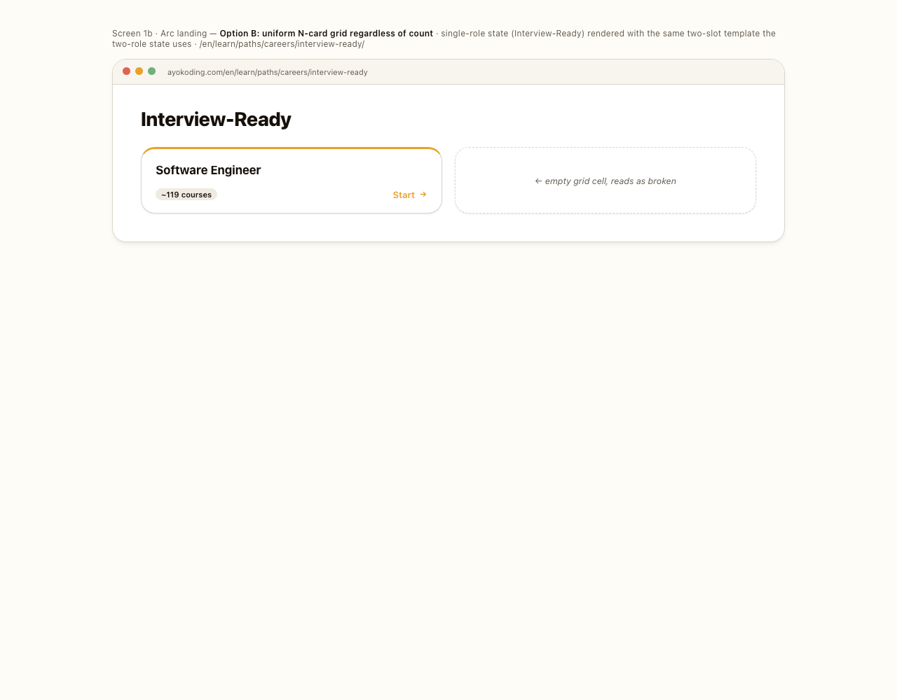


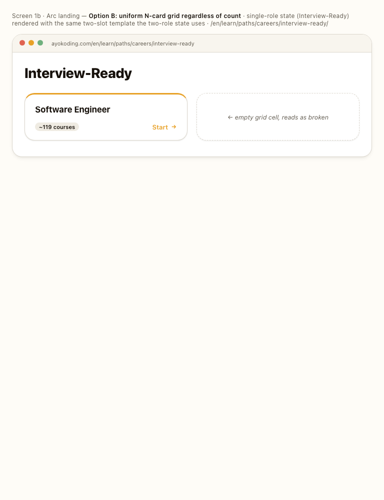

**Selected: Option A — Always-render arc header + role card(s), single role gets a syllabus
preview — finalist renders: arc-landing-option-a-{mobile,tablet,desktop}.png.**

| Design                            | Why it won / lost                                                                                                                                                                      |
| --------------------------------- | -------------------------------------------------------------------------------------------------------------------------------------------------------------------------------------- |
| A — header + card(s) + preview ✅ | The single-role state is a deliberately different composition (card + inline preview), not a starved copy of the two-role grid — directly answers R7's "must not read as broken/empty" |
| B — uniform N-card grid           | Simplest to build, but a 1-of-2-filled grid cell is the textbook "broken layout" signal R7 explicitly calls out to avoid                                                               |

### Screen 2 · Path landing page

At `/en/learn/paths/<path-id>` — the manifest rendered as an ordered, phase-grouped course list;
every course link carries `?path=<path-id>`. The ordering is a valid topological entry into the
prerequisite DAG.

**Low-fi Option A — Phase-grouped numbered syllabus (Recommended)**

_Mobile — 375 px: one course per row, phase headings inline (never sticky — sticky is `lg+`)_

```text
┌────────────────────────────────────┐
│ ☰  AyoKoding            ⌕  ☾       │
├────────────────────────────────────┤
│ Interview-Ready SWE                │
│ interview-first                    │
│ ⓘ Experienced & job-hunting?       │
│   Skip the prologue → Phase 1.     │
│ PROLOGUE · EDITOR (skippable)      │
│   1. Just Enough Nvim              │
│   2. Just Enough Lua               │
│   3. Extending Neovim              │
│   ▸ Capstone · Forge-Ready         │
│ PHASE 1 · INTERVIEW PREPARATION    │
│   4. Just Enough Python            │
│   …                                │
│   9. Coding Interview              │
└────────────────────────────────────┘
```

_Tablet — 768 px: sidebar returns; list stays one column, phase headings still inline_

```text
┌── Sidebar ───┬────────────────────────────────────────────────┐
│ ▸ Learn      │ Interview-Ready SWE · interview-first           │
│   ▾ Paths    │ ⓘ Skip the prologue → jump to Phase 1.          │
│   ▸ Courses  │ PROLOGUE · EDITOR FOUNDATIONS (skippable)        │
│              │   1. Just Enough Nvim   2. Just Enough Lua      │
│              │   3. Extending Neovim   ▸ Capstone · Forge-Ready│
│              │ PHASE 1 · INTERVIEW PREPARATION                  │
│              │   4. Just Enough Python … 9. Coding Interview   │
└──────────────┴────────────────────────────────────────────────┘
```

_Desktop — 1280 px: `max-w-3xl` reading column; phase headings sticky (`lg:sticky lg:top-16`)_

```text
┌──────────── Interview-Ready Software Engineer · interview-first ─────────┐
│ Experienced & job-hunting? Skip the prologue → jump to Phase 1.          │
│                                                                          │
│ Prologue · Editor Foundations (skippable)                               │
│   1. Just Enough Nvim        2. Just Enough Lua     3. Extending Neovim  │
│   ▸ Capstone · Forge-Ready                                               │
│ Phase 1 · Interview Preparation                                         │
│   4. Just Enough Python …  9. Coding Interview  … 16. Behavioral        │
│   ▸ Capstone · Interview Loop                                           │
│ Phase 2 · Production-Effective …                                        │
│ Phase 3 · Deepening …                                                   │
└──────────────────────────────────────────────────────────────────────────┘
```

**Low-fi Option B — Collapsible phase accordion**

_Mobile — 375 px: all stages collapsed except the first — the arc is hidden_

```text
┌────────────────────────────────────┐
│ Fundamentally Strong SWE           │
│ ▼ Stage 1 · CS foundations   (N)   │
│     1. Just Enough Git             │
│     2. Computer Systems            │
│ ▶ Stage 2 · Paradigms, DS&A  (N)   │
│ ▶ Stage 3 · Build real SW    (N)   │
│ ▶ Stage 4 · Systems & ops    (N)   │
└────────────────────────────────────┘
```

_Tablet — 768 px: two stages expanded_

```text
┌── Sidebar ───┬────────────────────────────────────────────────┐
│ ▸ Learn      │ ▼ Stage 1 · CS foundations & architecture  (N)  │
│              │ ▼ Stage 2 · Paradigms, DS&A, algorithms    (N)  │
│              │ ▶ Stage 3 · Build real software (collapsed)     │
│              │ ▶ Stage 4 · Systems, data, security, ops        │
└──────────────┴────────────────────────────────────────────────┘
```

_Desktop — 1280 px_

```text
┌──────────── Fundamentally Strong SWE · fundamentals-first ──────────────┐
│ ▼ Stage 1 · CS foundations & architecture       (N courses)             │
│ ▼ Stage 2 · Paradigms, DS&A, algorithms          (N courses)            │
│ ▶ Stage 3 · Build real software (collapsed)                             │
│ ▶ Stage 4 · Systems, data, security, ops (collapsed)                    │
└──────────────────────────────────────────────────────────────────────────┘
```

**Responsive (mobile ↔ desktop)** — Option A renders the numbered list full-width single-column on
mobile (each course a full-width row) and a comfortable reading column on desktop; the fast-path
callout stays pinned at the top. Phase headings are sticky sub-headers on desktop, inline on mobile.
Option B's accordion collapses all but the first stage on mobile to keep the list short.

**Hi-fi finalists** (rendered from the token-accurate HTML mockups):


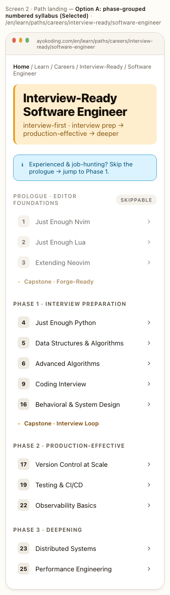

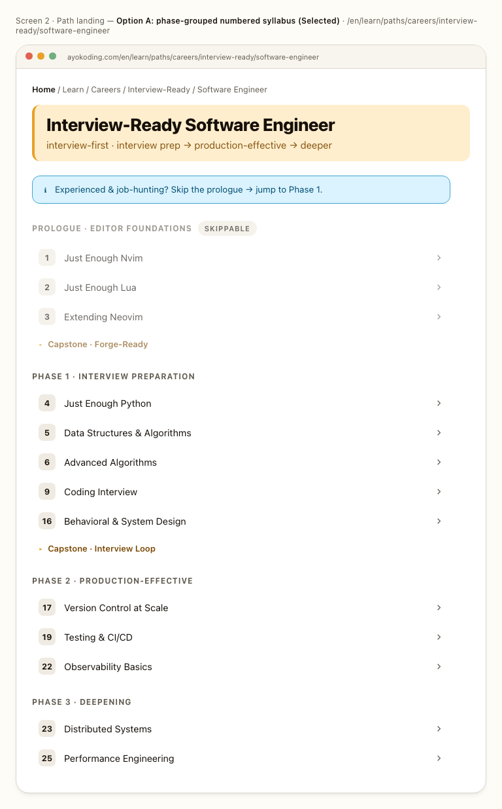

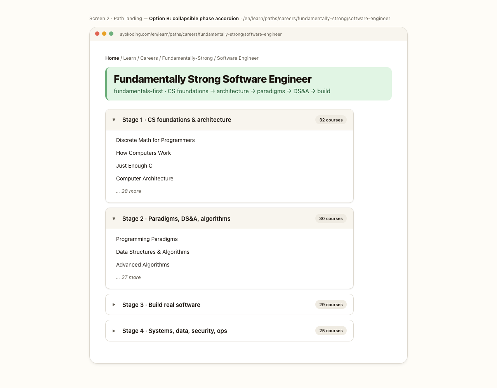

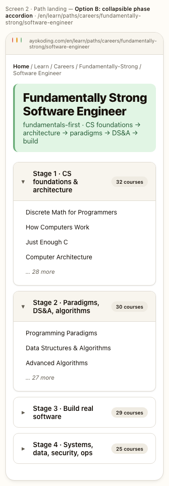

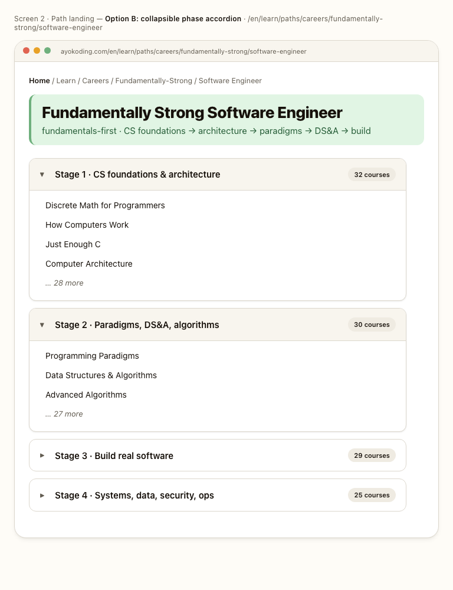

**Selected: Option A — Phase-grouped numbered syllabus — finalist renders:
path-landing-option-a-{mobile,tablet,desktop}.png.**

| Design                   | Why it won / lost                                                                   |
| ------------------------ | ----------------------------------------------------------------------------------- |
| A — numbered syllabus ✅ | Shows the whole ordered arc at a glance; the number IS the path order; SEO-friendly |
| B — phase accordion      | Compact, but hides the arc behind collapsed sections and adds interaction cost      |

### Screen 3 · Course page in path context

A shared course body rendered with the active path's affordances: the active path's **ordered course
list** as the left rail, a path breadcrumb, a **prerequisite list**, and manifest-driven prev/next.
Without `?path=` → canonical view (generic content-tree sidebar, which still surfaces prerequisites).

**Low-fi Option A — Top path banner + path breadcrumb + prerequisites + bottom prev/next**

_Mobile — 375 px (`<sm`)_

```text
┌────────────────────────────────────┐
│ ☰  AyoKoding            ⌕  ☾       │
├────────────────────────────────────┤
│ ▸ On path: Interview-Ready SWE     │
│   course 9 of N   [view full path] │
│ Home / … / Coding Interview        │
│ Prereqs: DS&A · Advanced Algos     │
│                                    │
│ # Coding Interview                 │
│ …body (unchanged, path-neutral)…   │
│                                    │
│ ← Prev: Advanced Algorithms        │
│ Next: Take-Home & Live Coding →    │
└────────────────────────────────────┘
```

_Tablet — 768 px (`md`)_

```text
┌── Sidebar (content tree) ─┬──────────────────────────────────────┐
│ ▸ Learn                   │ ▸ On path: Interview-Ready SWE ·      │
│   ▸ Paths                 │   course 9 of N     [view full path] │
│   ▾ Courses               │ Home / … / Coding Interview           │
│     · Advanced Algorithms │ Prereqs: DS&A · Advanced Algorithms   │
│     · Coding Interview    │ # Coding Interview … body …           │
│   ▸ Legacy                │ ← Prev: Advanced Algos   Next: … →    │
└───────────────────────────┴──────────────────────────────────────┘
```

_Desktop — 1280 px (`xl`)_

```text
┌── Sidebar ────┬──────────────────────────────────────────────────────────────────────────┐
│ ▸ Learn       │ ▸ On path: Interview-Ready SWE · course 9 of N       [ view full path ]   │
│   ▸ Paths     │ Home / Learn / Interview-Ready SWE / Coding Interview                     │
│   ▾ Courses   │ Prerequisites: Data Structures & Algorithms · Advanced Algorithms         │
│     · Adv Alg │                                                                          │
│     · Coding  │ # Coding Interview                                                        │
│   ▸ Legacy    │ …course body (unchanged, canonical, path-neutral)…                        │
│               │                                                                          │
│               │ ← Prev: Advanced Algorithms        Next: Take-Home & Live Coding →        │
│               │   (both links keep ?path=careers/interview-ready/software-engineer)               │
└───────────────┴──────────────────────────────────────────────────────────────────────────┘
```

**Low-fi Option B — Left path rail replacing the sidebar (SELECTED)**

The rail is the same `<aside>` slot the generic content-tree sidebar occupies today; only its
**contents** swap when `?path=` is present. Below `md` that slot does not exist at all — the tree
already lives in the shipped left `Sheet` drawer — so the rail collapses into the **same drawer**, and
the banner strip is retained as its always-visible compact readout.

_Mobile — 375 px (`<sm`): rail collapsed into the shipped drawer; banner strip is the readout_

```text
┌────────────────────────────────────┐
│ ☰  AyoKoding            ⌕  ☾       │   ← ☰ = "Open navigation menu"
├────────────────────────────────────┤
│ ▸ Interview-Ready SWE · 9 of N  ⌄  │   ← tap ⌄ = "Open path course list"
│ Home / … / Coding Interview        │
│ Prereqs: DS&A · Advanced Algos     │
│ # Coding Interview  …body…         │
│ ← Prev …            Next … →       │
└────────────────────────────────────┘
  ⌄ opens the SAME left drawer, path-scoped:
┌──────────────────────┬─────────────┐
│ Interview-Ready SWE ✕│  (scrim)    │
│  8  Data Structures  │             │
│ ▸9  Coding Interview │             │
│ 10  Take-Home & Live │             │
│ 11  System Design    │             │
│  [ view full path → ]│             │
└──────────────────────┴─────────────┘
```

_Tablet — 768 px (`md`): rail present at the panel's 15 % floor (~115 px) — number + truncated title_

```text
┌── Path rail ─┬───────────────────────────────────────────────────┐
│ Interview-R… │ Home / Learn / Interview-Ready SWE / Coding Int…   │
│  8 Data Str… │ Prereqs: DS&A · Advanced Algorithms                │
│ ▸9 Coding I… │ # Coding Interview … body …                        │
│ 10 Take-Hom… │ ← Prev: Advanced Algos        Next: Take-Home →    │
│ 11 System D… │   (both links keep ?path=…)                        │
│ [full path →]│                                                    │
└──────────────┴───────────────────────────────────────────────────┘
```

_Desktop — 1280 px (`xl`): rail at its resizable default; full titles + phase grouping_

```text
┌── Path rail ───────────┬─────────────────────────────────────────────────────────┐
│ Interview-Ready SWE    │ Home / Learn / Interview-Ready SWE / Coding Interview    │
│ course 9 of N          │ Prerequisites: Data Structures & Algorithms ·            │
│ ── PHASE 2 · PRACTICE ─│               Advanced Algorithms                        │
│   8  Data Structures   │                                                         │
│ ▸ 9  Coding Interview ●│ # Coding Interview                                       │
│  10  Take-Home & Live  │ …course body (unchanged, canonical, path-neutral)…       │
│ ── PHASE 3 · DESIGN ───│                                                         │
│  11  System Design     │ ← Prev: Advanced Algorithms   Next: Take-Home & Live →   │
│ [ view full path → ]   │   (both links keep ?path=careers/interview-ready/software-engineer)│
└────────────────────────┴─────────────────────────────────────────────────────────┘
```

Canonical fallback (no `?path=`, all breakpoints) — the rail slot reverts to the **generic
content-tree sidebar exactly as it renders today**; nothing about the no-path reader's experience
changes:

```text
┌── Sidebar (unchanged) ─┬─────────────────────────────────────────────────────────┐
│ ▸ Learn                │ Home / Learn / Courses / Coding Interview                │
│   ▸ Paths              │ Prerequisites: Data Structures & Algorithms ·            │
│   ▾ Courses            │               Advanced Algorithms                        │
│   ▸ Legacy             │ # Coding Interview … body …                              │
│                        │ This course is part of: [ Interview-Ready ] ·            │
│                        │   [ Immediately-Effective ] · [ Fundamentally Strong ]   │
└────────────────────────┴─────────────────────────────────────────────────────────┘
```

The affordance generically renders **one badge per path whose `courseOrder` actually lists the
course** — a course that a path only links (not includes) shows no badge for it. The wireframe above
shows `coding-interview` carrying three badges as an illustrative example of the rendering rule, not
an asserted fact about any specific manifest.

> **DD-24 staleness flag (this plan does not correct DD-24 in place).** DD-24's own worked example —
> "the `software-engineer-to-ai-engineer` path links rather than includes SWE-fundamentals courses" —
> assumed the pre-split transition-path model. Per R3, `careers/immediately-effective/ai-engineer` is
> now from-scratch and **includes** its SWE prerequisites in `courseOrder` rather than linking them, so
> DD-24's specific example is stale; whether `coding-interview` therefore also appears in
> `ai-engineer`'s `courseOrder` (making it a fourth badge) is a manifest-content decision owned by
> `ayokoding-learning-path-05-manifests`, not re-derived here. This plan's own contract — one badge
> per path whose `courseOrder` lists the course — needs no change; only DD-24's illustrative badge
> count is affected, and DD-24 is flagged for that plan to correct, not edited here.

#### Screen 3 responsive specification (the selected Option B, breakpoint by breakpoint)

Choosing B **obligates this plan to design the very thing the earlier rationale used to reject it**.
That specification is below; the accepted cost is recorded in the decision table that follows.

| Breakpoint                      | What the path rail does                                                                                                                                                                                                                                                                                                                                                                                                               |
| ------------------------------- | ------------------------------------------------------------------------------------------------------------------------------------------------------------------------------------------------------------------------------------------------------------------------------------------------------------------------------------------------------------------------------------------------------------------------------------- |
| **Mobile `<md`** (<768)         | The `<aside>` is `hidden` [Repo-grounded — `resizable-sidebar.tsx` L46 `hidden … md:block`], so there is **no rail**. The path's ordered list moves into the **already-shipped left `Sheet` drawer** that renders `SidebarTree` today; the `PathBanner` strip stays as the always-visible readout and gains a disclosure trigger.                                                                                                     |
| **Tablet `md`–`lg`** (768-1023) | Rail occupies the `<aside>`, which is live from `md` up. `ResizablePanel`'s band is **15 %-35 % of viewport** [Repo-grounded — `MIN_WIDTH_PCT`/`MAX_WIDTH_PCT`], i.e. **~115-269 px** at 768: rows render as `<number> <truncated title>` with the full title in the link's `aria-label`. Phase separators collapse to a thin rule (no phase label). The right TOC rail is `hidden xl:block`, so there is never a three-column crush. |
| **Desktop `lg+`** (≥1024)       | Rail at the reader's persisted width (**~192-448 px** at 1280): full course titles, phase-group separators with labels, `course k of N` header, and the `view full path →` footer link.                                                                                                                                                                                                                                               |

**Collapse affordance below `md` — the shipped left drawer, not a new pattern.** This is the single
decisive fact that overturns the old objection: the "mobile sheet" B was rejected for needing **already
exists and is in production** — `apps/ayokoding-www/src/features/app-shell/shell/mobile-nav.tsx` renders
`SidebarTree` inside `Sheet` / `SheetContent side="left"` with persisted preset widths, opened from the
header's `aria-label="Open navigation menu"` button [Repo-grounded — `mobile-nav.tsx`, `header.tsx` L34].
The path rail therefore reuses that drawer with a **content swap**, exactly as it reuses the desktop
`<aside>`. Chosen over the two alternatives:

- **Bottom sheet** (a second, different overlay) — rejected: a second sheet idiom in one app, and the
  existing `Sheet` is already `side="left"`.
- **In-flow disclosure under the banner** — rejected: it would push the H1 below the fold on a phone
  when the path has 20+ courses, and it duplicates a list the drawer already shows.

**Trigger** — a `<button>` inside the `PathBanner` strip, accessible name **"Open path course list —
Interview-Ready SWE, course 9 of N"**, carrying `aria-expanded` + `aria-controls` pointed at the drawer;
the existing header `☰` continues to open the same drawer (path-scoped when `?path=` is present, generic
otherwise). **Dismiss** — Radix `Dialog` semantics inherited from `Sheet`: `Esc`, scrim click, the
drawer's own `✕`, and route change (`onOpenChange(false)` on link click, as `MobileNav` already does).
**Focus** — also inherited: focus moves into the drawer on open, is trapped while open, and returns to
the trigger on close; no new focus machinery is written.

**Reconciliation with the shipped `ResizableSidebar` — reuse, not replace, not coexist.** "Replacing the
sidebar" means replacing its **contents**, not the component. `ResizableSidebar` keeps owning the
`<aside>` shell, the `md:block` gate, the drag/keyboard resize handle, and the persisted width; only its
`children` change from `<Sidebar>` (content tree) to `<PathRail>` when a `?path=` is present. Consequences,
stated explicitly:

- **With `?path=`** — the reader sees the path's ordered courses **instead of** the content tree, at the
  same width, with the same resize handle and the same `localStorage` width key.
- **Without `?path=`** — byte-identical to today: `ResizableSidebar` + `Sidebar` + `SidebarTree`. No
  regression surface for the majority of pages.
- **Escape hatch** — the rail footer carries `view full path →` (→ the path landing) and
  `browse all courses →` (→ `/en/learn/courses`), so a reader is never trapped inside a path with no
  route back to the generic tree.

**A11y (the rail is a navigation landmark).** `<nav aria-label="Interview-Ready SWE course list">`
wrapping a semantic `<ol>` — the visible number **is** the list semantics, matching Screen 2's syllabus.
The current course carries `aria-current="page"` **and** a text/shape signal, never colour alone (WCAG AA
1.4.1): a `▸` marker plus `font-semibold` plus the `bg-accent` row fill. Keyboard order is
header → rail (`<nav>` in DOM order before `<article>`, reachable by the existing skip-link's sibling
route) → content → prev/next; within the rail, plain `Tab` order follows course order with the canonical
`focus-visible:ring-2 focus-visible:ring-ring`. The mobile trigger's accessible name is the full string
above (not "Menu" or an icon alone), and the drawer's `SheetTitle` becomes the path name so the dialog is
announced with a meaningful label.

**Hi-fi finalists** (desktop renders; the mobile and tablet renders are produced by the delivery steps in
[Phase 1 · UI design funnel](./delivery.md#phase-1-ui-design-funnel-screens-0-1-1a-1b-2-3) — see the
[asset matrix](#hi-fi-asset-matrix-screen--option--viewport)):


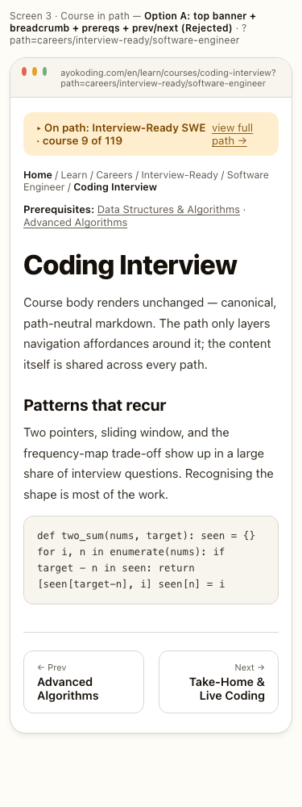

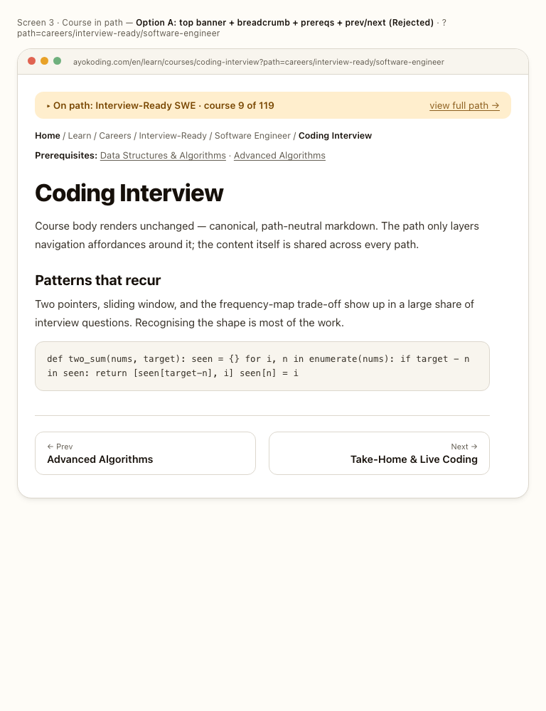


**Selected: Option B — Left path rail replacing the sidebar — finalist renders:
course-path-option-b-{mobile,tablet,desktop}.png.**

The earlier draft of this plan selected Option A and rejected B on mobile-first grounds, in these words:
_"Option B's left rail is desktop-only and would need to collapse into a top sheet on mobile — extra
complexity, so Option A wins on mobile-first grounds."_ That objection is **not deleted here** — it is
**answered and its residual cost accepted deliberately**: (a) the mobile sheet is not extra complexity
because it is already shipped and already renders the same tree component, so the collapse is a content
swap rather than new overlay machinery; (b) what remains genuinely more expensive than A is the rail
itself (a net-new `PathRail` component, a conditional `ResizableSidebar` child, and truncation behaviour
at the 15 % width floor) — that cost is accepted in exchange for continuous path orientation instead of a
one-line position readout. A later reader should see this as a trade made with eyes open, not as an
objection that was quietly dropped.

| Design                | Why it won / lost                                                                                                                                                                                                                   |
| --------------------- | ----------------------------------------------------------------------------------------------------------------------------------------------------------------------------------------------------------------------------------- |
| B — left path rail ✅ | The **whole ordered arc stays visible** while reading, so "where am I / what's next / what did I skip" needs no navigation; reuses the shipped `ResizableSidebar` shell **and** the shipped mobile `Sheet` — no new overlay pattern |
| A — top banner        | Cheaper and untouched-layout, but a one-line "course 9 of N" readout gives position without context; the reader must leave the page to see the arc. Its banner strip survives inside B as the rail's compact readout                |

**What B inherits from A (recorded explicitly, so the selection is not read as a clean sweep).** B keeps
A's `PathBanner` strip, path-aware `Breadcrumb`, `PrerequisiteList`, and manifest-driven `PrevNext`
verbatim. The strip is demoted from "the design" to "the rail's always-visible compact readout", which is
what makes B viable below `md`. Net component delta versus A: **one** net-new component (`PathRail`) plus
one conditional prop on `ResizableSidebar`.

### Screen 4 · Legacy-bucket landing (cross-plan)

**Not owned here.** The `legacy/` bucket's landing (`/en/learn/legacy`) and its per-page
"legacy / superseded" banner are introduced by the whole-section IA revamp, which belongs to
`ayokoding-learning-path-01-url-restructure`. That plan carries Screen 4's funnel prose, its six
`legacy-landing-option-{a,b}-{mobile,tablet,desktop}.png` renders, and its selection — which is pending
that plan's **Q-D** (SEO treatment of `legacy/`) ruling.

This plan links to it from the [asset matrix](#hi-fi-asset-matrix-screen--option--viewport) row below
and asserts nothing about it. Nothing in this plan's delivery checklist produces a Screen 4 artefact.

### Hi-fi asset matrix (screen × option × viewport)

Every screen's every option carries a wireframe **and** a rendered mockup at **three viewports** —
mobile-first, not one desktop drawing with a prose footnote about phones.

**Naming scheme** — `assets/<screen>-option-<a|b>-<mobile|tablet|desktop>.png`, all three rendered from
a **single responsive** token-accurate source at `assets/src/<screen>-option-<a|b>-desktop.html` (one
source per screen/option, carrying `@media` breakpoints — see the responsive-single-source note below;
there are no separate `-mobile.html` / `-tablet.html` sources). Screen slugs: `landing-hero` (0), `paths-hub`
(1), `category-landing` (1a), `arc-landing` (1b), `path-landing` (2), `course-path` (3),
`legacy-landing` (4). The eight pre-existing desktop renders were renamed into this scheme
(`…-option-a.png` → `…-option-a-desktop.png`) so the set is uniform; every `` reference was
updated with them. **2026-07-21 category-split ruling (R6/R7):** `paths-hub-option-{a,b}-desktop.html`
were **rebuilt in place** (same filenames, new category-grouped content — a content change, tracked by
the mtime re-render check below, not a rename) and four **new** stems
(`category-landing-option-{a,b}`, `arc-landing-option-{a,b}`) were added for the two new screen types.

**Render widths** — exactly the three in the shared design legend: **375 px** (mobile, below `sm`),
**768 px** (tablet, `md`), **1280 px** (desktop, `xl`). Identical across all screens, and identical to
the widths this plan's Playwright verification steps resize to.

**Responsive single-source model (recorded, not silently skipped).** Each of the 12 `.html` sources
(the original 8, plus the 4 new stems for Screens 1a/1b) is **one responsive file** carrying
`@media (max-width: 768px)` and `@media (max-width: 480px)` breakpoints: multi-column grids collapse
(three-up → two-up at tablet → one column at mobile), the fixed-width frame drops to full width, and
padding shrinks, so the single `-desktop.html` source reflows cleanly at all three viewports. **One
documented carve-out**: `course-path-option-b-desktop.html` uses a bespoke `@media (max-width: 1023px)`
/ `@media (min-width: 768px) and (max-width: 1023px)` / `@media (max-width: 767px)` breakpoint set
instead of the 768px/480px pair, matching the real app's `md`/`lg` (768px/1024px) rail boundaries from
the [Screen 3 responsive specification](#screen-3-responsive-specification-the-selected-option-b-breakpoint-by-breakpoint)
above — every other one of the 12 sources still uses the shared pair. Mobile
and tablet `.png` files are produced by rendering that one source at 375 px and 768 px — mobile/tablet
renders for every screen (including the redesigned hub and the two new screen types) are **explicitly
in scope** and now exist on disk (all 36 `.png` are rendered). This is a deliberate **yes**, not a
default: the two-category hub in particular is exactly the kind of layout (a section, sub-grouped by
arc, sitting above a second section) that can collapse badly on a narrow viewport if the reflow is not
designed and rendered, not assumed.

**Format** — `.png` only, per the
[UI Mockups convention](../../../repo-governance/conventions/formatting/diagrams/ui-mockups-principles-and-scope.md#ui-mockups-in-plan-docs-principles-in-practice-and-scope):
`.excalidraw.svg` is ruled out (GitHub blocks the Excalidraw font) and inline HTML+CSS is ruled out
(GitHub strips styles). The `.html` sources are build inputs, never the embedded artefact.

**Alt text** — each image gets its own descriptive alt text naming **what differs at that width**
(stacked vs. two-column, three-up vs. two-up grid, rail beside the body vs. rail stacked full-width
above it). Copying the desktop alt text onto the mobile render is a defect, not a shortcut.

| Screen              | Option A stem                 | Option B stem                 | Viewports produced        | Owner and status                                                   |
| ------------------- | ----------------------------- | ----------------------------- | ------------------------- | ------------------------------------------------------------------ |
| 0 Landing hero      | `landing-hero-option-a-*`     | `landing-hero-option-b-*`     | mobile / tablet / desktop | **this plan** — all 3 viewports on disk (content fixed, R8)        |
| 1 Paths hub         | `paths-hub-option-a-*`        | `paths-hub-option-b-*`        | mobile / tablet / desktop | **this plan** — all 3 viewports on disk (rebuilt in place, R6)     |
| 1a Category landing | `category-landing-option-a-*` | `category-landing-option-b-*` | mobile / tablet / desktop | **this plan** — new (R7); all 3 viewports on disk                  |
| 1b Arc landing      | `arc-landing-option-a-*`      | `arc-landing-option-b-*`      | mobile / tablet / desktop | **this plan** — new (R7); all 3 viewports on disk                  |
| 2 Path landing      | `path-landing-option-a-*`     | `path-landing-option-b-*`     | mobile / tablet / desktop | **this plan** — all 3 viewports on disk (path-id fixed)            |
| 3 Course in path    | `course-path-option-a-*`      | `course-path-option-b-*`      | mobile / tablet / desktop | **this plan** — all 3 viewports on disk (path-id fixed)            |
| 4 Legacy landing    | `legacy-landing-option-a-*`   | `legacy-landing-option-b-*`   | mobile / tablet / desktop | `ayokoding-learning-path-01-url-restructure` — all 6 pending there |

**This plan's total: 6 screens × 2 options × 3 viewports = 36 `.png`** — amended 2026-07-21 from the
original 24 by the category-split ruling (R6/R7), which redesigned Screen 1 in place (no new files) and
added two new screen types, Screen 1a and Screen 1b (four new `.html` stems, two options each, each
producing three viewports). **12 responsive `.html` sources on disk today** (the original 8
fixed/rebuilt in place, plus 4 new sources for 1a and 1b authored — one per screen per option, each
carrying the `@media` breakpoints), and **all 36 `.png` renders now exist on disk** — the 12 desktop
renders (embedded below) plus the 24 mobile/tablet renders produced by rendering each responsive source
at 375 px and 768 px. The 24 mobile/tablet renders exist on disk but are **not yet embedded** in this
document; Phase 1 embeds them under each screen's finalist block with viewport-specific alt text.
Phase 1 **re-renders** all 36 from their sources (an idempotent regeneration step, since the sources
are the authored source of truth); a fresh worktree checkout re-derives the `.png` set from the
committed `.html` sources. (File-modification-time state is
not a stable, authorable fact — `git checkout` and worktree provisioning reset it on every checkout —
so this plan does not assert a specific STALE/FRESH split as a fixed truth; see the Phase 1 checkbox's
falsifiable acceptance clause for the actual executable check.) **All 36 `.png` are produced or
re-produced** in
[Phase 1](./delivery.md#phase-1-ui-design-funnel-screens-0-1-1a-1b-2-3). The delivery checklist enumerates them
**one checkbox per asset** rather than one coarse "render all mockups" step, because the volume is large
enough that a single checkbox could be ticked with most of the set missing.

> **Cross-plan note on DD-47.** DD-47 mandates **30** renders across **two** plans — **24 here** and
> **6** in `ayokoding-learning-path-01-url-restructure` (Screen 4). **Amended 2026-07-21 by the
> category-split ruling**: this plan's share grows from 24 to **36** (Screen 1 redesigned, Screens 1a/1b
> added), so the cross-plan total grows from 30 to **42** (36 here + 6 there, Screen 4 unchanged). A
> reader auditing DD-47 against this plan alone must not conclude the matrix was under-delivered, and no
> executor may close the gap by copying the other plan's six renders into this folder — a matrix
> duplicated across two folders drifts. `tech-docs.md`'s DD-47 entry carries the same amendment note
> (owned there in full; not re-derived here) since the arithmetic is authored in that file.

### Hi-Fi Specifications (Textual, Repo-Grounded)

These **textual hi-fi specifications** are the source of truth the embedded `.png` finalists render —
they pin the **selected option of each screen** to concrete, existing design-system facts so both the
mockups and the build have an unambiguous target. The selections are **not uniformly Option A**:
Screens 0, 1, and 2 selected Option A; **Screen 3 selected Option B** (left path rail — see
[Screen 3](#screen-3--course-page-in-path-context)). Every primitive, token, and class named below is
**repo-grounded** in `@open-sharia-enterprise/web-ui` (barrel) /
`@open-sharia-enterprise/web-ui/primitives` and the AyoKoding token layer (`libs/web-ui-token`,
`apps/ayokoding-www/src/app/globals.css`), verified against the existing `prev-next`, `breadcrumb`,
`section-card`, and `hero`/`landing` components — nothing here invents a primitive or token.

#### Shared design legend (all six screens)

- **Import surface**: `@open-sharia-enterprise/web-ui` (composite `Button`, `Badge`, `Card*`,
  `Alert*`) and `@open-sharia-enterprise/web-ui/primitives` where a primitive is required — **not**
  `ts-web-ui`.
- **Color tokens** (Tailwind classes): surfaces `bg-background` / `bg-card` / `bg-accent`; text
  `text-foreground` / `text-muted-foreground` / `text-card-foreground` / `text-primary`; borders
  `border-border`; focus `ring-ring`. AyoKoding brand primary is **honey/amber**
  (`--color-primary: var(--hue-honey)`).
- **Accent hue (2026-07-21 category-split ruling, re-ruled 2026-07-22 for amendment A10's four-subject
  skills split — hue is per-arc for careers, per-compliance-track for skills, not per-path uniformly;
  see [DD-50](./tech-docs.md#design-decisions))**: the 6-hue system (`-wash` fill / `-ink` text variants) is now fully
  spoken for. **Careers arcs** (3 of 6 hues, shared by every role inside the arc — the arc is the
  meaningful grouping signal): `interview-ready` → `honey`, `immediately-effective` → `teal` (covers
  **both** Software Engineer and AI Engineer — differentiated by name/badge, never by colour, which the
  "hue is never the sole signal" rule below already requires), `fundamentally-strong` → `sage`. **Skills
  subjects** (2 of the remaining 3 hues, one per **compliance track**, shared across both subjects in
  that track — four subjects, no fourth or fifth hue left to spend after the careers arcs and the
  section accent, so this plan pairs by track exactly as the careers side already pairs by arc):
  `conventional-accounting` and `conventional-erp` → `terracotta`; `sharia-accounting` and `sharia-erp`
  → `plum`. **Skills section accent** (the 6th hue, used once for the section-level eyebrow/strap-line,
  not per-card): `sky`. Used as `bg-[var(--hue-<h>-wash)]` fills and `text-[var(--hue-<h>-ink)]`
  accents. Hue is **never the sole signal** (always paired with the path name/number/icon); the final
  hue↔entity map is confirmed at draw time and must hold WCAG-AA for `-ink` text on `-wash`.
- **Radius / elevation**: cards `rounded-xl` (20px on the AyoKoding scale); insets `rounded-lg`;
  `shadow-sm` at rest → `shadow-md` on hover.
- **Breakpoints**: `sm` 640 / `md` 768 / `lg` 1024 / `xl` 1280 — the only prefixes this app uses. The
  content column stays fluid `flex-1 px-6 py-8 lg:px-8` inside the `max-w-screen-2xl` content shell;
  the right TOC rail (`w-[200px]`, `hidden xl:block`) and resizable sidebar (`hidden md:block`) are
  untouched **except** for the Screen 3 `<aside>` content swap (`ResizableSidebar` keeps its shell,
  gate, handle, and persisted width — only its `children` change).
- **The three render viewports** (used by every lo-fi wireframe and every hi-fi `.png`, identical across
  all screens): **mobile 375 px** (below `sm` 640), **tablet 768 px** (exactly `md`), **desktop
  1280 px** (exactly `xl`). These are Tailwind's default breakpoints [Web-cited —
  <https://tailwindcss.com/docs/responsive-design>, accessed 2026-07-21: `sm` 40rem/640px, `md`
  48rem/768px, `lg` 64rem/1024px, `xl` 80rem/1280px], and 375/768/1280 are already the widths this
  plan's Playwright verification steps resize to, so mockups and verification agree by construction.
- **A11y baseline** (mirrors existing components): each new navigation region is a
  `<nav aria-label="…">`; lists are semantic `<ol>`/`<ul>` (this app uses semantic lists, not
  `role="list"`); the canonical focus ring is `focus-visible:ring-2 focus-visible:ring-ring`; the
  current location uses `aria-current="page"`; the global skip-link → `#main-content` is unchanged.

#### Screen 0 hi-fi — Landing hero (`/en`), Option A (four goal cards in the hero)

- **Where it lands**: extends [`app-shell/shell/hero.tsx`](../../../apps/ayokoding-www/src/features/app-shell/shell/hero.tsx)
  (currently H1 + tagline + `Button` Learn/Tools). The two existing CTAs move into the global nav; the
  hero's primary visual weight becomes the path decision.
- **Container**: keep the existing `<section className="px-6 pt-12 pb-10 lg:px-8 lg:pt-16">` with the
  inner `mx-auto max-w-6xl`. H1 unchanged (`text-4xl … sm:text-5xl lg:text-6xl font-extrabold`,
  `t(locale,"heroHeading")`); tagline `mt-5 max-w-2xl text-lg text-muted-foreground` (goal-framed copy).
- **"Choose your path" eyebrow**: `<p className="mt-8 text-sm font-semibold uppercase tracking-wide text-muted-foreground">`.
- **Grid**: `<ul className="mt-4 grid grid-cols-1 gap-4 md:grid-cols-2">` — two-column, two-row at
  `md+`, single column below. Each `<li>` a **`PathCard`** (same net-new component as Screen 1,
  `context="hero"` variant), populated with the **four careers paths only** (see "Why still four
  cards" in [Screen 0](#screen-0--landing-hero-path-entry)): the whole card is one `<Link>` to
  `/{locale}/learn/paths/careers/{arc}/{role}` (SectionCard pattern, no link-in-link). Card = `Card`
  (`rounded-lg border-border shadow-sm hover:bg-accent hover:shadow-md`, `border-l-4` in the arc hue
  `border-[var(--hue-<h>)]`). Contents — **goal phrase** as the prominent line
  (`text-lg font-semibold`), the **formal path name** beneath (`text-xs text-muted-foreground`), a
  course-count `Badge` (`variant="secondary" size="sm"` + hue wash), and a "Start →" `meta`
  (`text-sm font-medium text-primary`, lucide `ArrowRight`).
- **Escape hatch row**: below the grid, `<div className="mt-6 flex flex-wrap items-center gap-x-5 gap-y-2">`
  — a primary-weight `<Link className="text-sm font-medium text-[var(--hue-honey-ink)]">` "Compare all
  paths →" (→ `/en/learn/paths`, Screen 1), a same-weight
  `<Link className="text-sm font-medium text-[var(--hue-sky-ink)]">` "Explore skills paths →"
  (→ `/en/learn/paths/skills/`, Screen 1a's skills instance), and a subordinate
  `text-sm text-muted-foreground` "Browse the full course library →" (→ `/en/learn/courses`).
- **States**: card hover `bg-accent shadow-md`, arrow nudges `group-hover:translate-x-0.5`;
  focus-visible `ring-2 ring-ring` on the card. All four cards equal weight — none de-ranked.
- **Responsive**: two-column, two-row `md+`; single column `<md` (full-width cards, ≥44px tap height);
  escape-hatch links wrap under the grid on mobile; four cards + eyebrow stay within one short scroll
  on a phone.
- **A11y**: `<ul>`/`<li>`; each card `<a aria-label="Start the {path} path — {goal}, ~{N} courses">`;
  hue is decorative (goal phrase + path name carry meaning); eyebrow is a real heading landmark, not
  styled text alone if it introduces the list.
- **Data source**: the same loaded-manifest data the paths hub uses — **not** a second hard-coded list.
  Before any manifest is published, the hero renders the fixture-manifest cards in test and an empty
  grid in production, so shipping order never produces a broken hero.

#### Screen 1 hi-fi — Paths hub (`/en/learn/paths`), Option A (category sections, arc-grouped within Careers)

**Redesigned by the 2026-07-21 category-split ruling (R6)** — replaces the retired flat four-card grid.

- **Container**: content column; inner `<section className="mx-auto max-w-6xl px-6 py-8 lg:px-8">`.
  Header: `<h1 className="text-4xl font-extrabold tracking-tight">` "Choose your path" +
  `<p className="mt-2 text-muted-foreground">` "Eight paths, two ways in."
- **`CategorySection`** (net-new, one per category, in document order Careers then Skills): a
  `<section aria-labelledby="{category}-heading">` with an eyebrow `<h2 id="{category}-heading"
className="text-sm font-semibold uppercase tracking-wide text-muted-foreground">` — "Careers ·
  converging within your role" (`text-[var(--hue-honey-ink)]`-adjacent neutral) / "Skills · up and
  running fast, then deeper and deeper" (`text-[var(--hue-sky-ink)]`).
- **Careers section body**: one **`ArcGroup`** (net-new) per arc, each an `<h3 className="mt-6 text-xs
font-medium uppercase tracking-wide text-muted-foreground">` arc name followed by
  `<ul className="mt-2 grid grid-cols-1 gap-4 md:grid-cols-2 lg:grid-cols-3">` containing that arc's
  role `PathCard`s (1 for `interview-ready` / `fundamentally-strong`, 2 for `immediately-effective`).
- **Skills section body**: no `ArcGroup` wrapper — a flat `<ul className="mt-4 grid grid-cols-1 gap-4
md:grid-cols-2">` of the **four** subject `PathCard`s (amendment A10 — up from two) directly under
  the section heading.
- **`PathCard`** (net-new, composes the existing **`SectionCard` pattern** — the whole card is a single
  `<Link className="group block focus-visible:outline-none">`, so there is **no** nested button and no
  link-in-link trap): wraps `Card`
  (`h-full rounded-xl transition-colors hover:bg-accent hover:shadow-md group-focus-visible:ring-2 group-focus-visible:ring-ring`).
  Contents — a kind `Badge` (`variant="outline"` + hue: arc hue for careers cards, subject hue for
  skills cards), `CardTitle` (`text-lg font-semibold`) = role/subject name, `CardDescription`
  (`text-sm text-muted-foreground`) = a one-line summary (careers: the arc's phase arrow, e.g.
  "interview prep → production-effective → deeper"; skills: omitted here — the ramp milestones live on
  Screen 1a, not the hub card, to keep the hub card lightweight), a course-count `Badge`
  (`variant="secondary" size="sm"`) "~N courses" (careers cards only — skills subject counts are not
  yet meaningful pre-manifest), and the `meta` affordance "Start →"
  (`text-sm font-medium text-primary` + lucide `ArrowRight h-3.5 w-3.5`) exactly as `SectionCard`.
- **States**: default (`bg-card border-border shadow-sm`); hover (`bg-accent shadow-md`, arrow nudges
  `group-hover:translate-x-0.5`); focus-visible (`ring-2 ring-ring` on the card). No card is ever
  visually de-ranked within its group — equal weight is why Option A beat B.
- **Below both sections**: a tertiary
  `<a className="mt-6 inline-flex text-sm text-muted-foreground hover:text-foreground">` "Browse the
  full course library →" → `/en/learn/courses`.
- **Responsive**: Careers arc rows go `grid-cols-1` `<md`, `md:grid-cols-2`, `lg:grid-cols-3` (so the
  three arcs never crowd below `lg`); Skills stays `grid-cols-1` `<md`, `md:grid-cols-2` (**four**
  cards as of amendment A10 — up from two — wrap into two rows of two at `md+`, never needing a third
  breakpoint tier). Section headings and arc sub-headings never collapse or
  hide at any width — the grouping signal must survive to mobile.
- **A11y**: `<section aria-labelledby>` per category, `<h3>` per arc group (correct heading nesting
  under the `<h2>` category heading, never skipped); `<ul>`/`<li>`; each card
  `<a aria-label="Start the {path} path — {N} courses">` (skills cards omit the count clause until a
  count exists); hue is decorative (name + section/arc heading carry the meaning).
- **Grid capacity**: the Careers section has room for further arcs and the Skills section for further
  subjects without a layout change — `ArcGroup`/flat-`<ul>` both grow by adding `<li>`s, not by
  re-authoring the grid. Careers cards populate from `ayokoding-learning-path-05-manifests`; skills
  cards populate from the sibling skills-plans. Neither populating plan re-invents this layout.

#### Screen 1a hi-fi — Category landing (`/en/learn/paths/careers/`, `/en/learn/paths/skills/`), Option A (arc cards with member-role preview)

- **Container**: same content column as Screen 1 (`mx-auto max-w-6xl px-6 py-8 lg:px-8`). A
  category-aware `Breadcrumb` (`Home / Learn / Paths / Careers` or `.../ Skills`),
  `<h1 className="text-4xl font-extrabold tracking-tight">` = "Careers" or "Skills",
  `<p className="mt-2 text-muted-foreground">` = the category strap-line.
- **Careers instance — `ArcCard` grid** (net-new; distinct from Screen 1's `PathCard`, one level up the
  hierarchy): `<ul className="mt-8 grid grid-cols-1 gap-6 md:grid-cols-2 lg:grid-cols-3">`, one
  `<li>` per arc. Each `ArcCard` = `Card` (arc hue `border-l-4`), containing the arc name
  (`CardTitle`), a one-line tagline (`CardDescription`), and a **member-role preview list**
  (`<ul className="mt-2 flex flex-wrap gap-1">` of small `Badge variant="secondary"` chips, one per
  role in that arc's `courseOrder` set — `immediately-effective` renders **two** chips, the other two
  arcs render **one**, with no special-casing: the chip list length is simply the arc's role count),
  and an "Explore arc →" `meta`.
- **Skills instance — subject `PathCard` grid plus ramp strip** (no `ArcCard`, no chooser copy): the H1
  is "Skills", the strap-line states the fixed-arc ramp promise once (R8), and the grid below is the
  **same two-up `PathCard` grid Screen 1's Skills section uses** — reused, not re-implemented — plus a
  **`RampMilestoneStrip`** (net-new, subject `PathCard`-only addition on this screen, not on the hub
  card) rendering the dangerous/comfortable/confident course markers as a small horizontal `<ol>` of
  three labelled ticks (`text-[10px] text-muted-foreground`, tick dots in the subject hue). **This is
  the compact preview only** — the can/cannot text per boundary, the runway-justification paragraph,
  and the linked-prerequisite outbound links render on that subject's own Screen 2 landing, not here;
  see [Screen 2 hi-fi's landing body content](#screen-2-hi-fi--path-landing-enlearnpathspath-id-option-a-phase-grouped-numbered-syllabus).
- **`EmptyPathListState`** (net-new, shared with Screen 1b): `Alert`-composed
  (`<Alert variant="default" className="mt-8">`), one sentence stating the interval is expected
  ("New skills paths are being written — check back soon."), one `<Link>` CTA to a populated sibling
  category (`careers/`). Rendered in place of the grid when the category's manifest set is empty (an
  interval the skills category is far more likely to hit than careers, since plan 01's amendment A3
  creates `paths/skills/_index.md` structurally ahead of the skills-populating plans).
- **Responsive**: careers `ArcCard`s go `grid-cols-1` `<md`, `md:grid-cols-2`, `lg:grid-cols-3`; skills
  cards stay `grid-cols-1` `<md`, `md:grid-cols-2` (**four** cards as of amendment A10 — up from two —
  wrapping into two rows of two, never a third grid-column tier). `RampMilestoneStrip` wraps to
  two lines on mobile rather than truncating a milestone label.
- **A11y**: `<nav aria-label="Careers arcs">` / `<nav aria-label="Skills paths">` wrapping the
  respective `<ul>`; each `ArcCard` link `<a aria-label="Explore the {arc} arc — {role list}">`; the
  empty state is `role="status"` equivalent via `Alert`'s existing semantics, never a silent blank
  `<div>`.

#### Screen 1b hi-fi — Arc landing (`/en/learn/paths/careers/<arc>/`), Option A (always-render arc header + role card(s), single role gets a syllabus preview)

- **Container**: same content column; an arc-aware `Breadcrumb`
  (`Home / Learn / Paths / Careers / <Arc Title>`), `<h1>` = arc title,
  `<p className="mt-2 text-muted-foreground">` = arc tagline.
- **Role grid**: `<ul className="mt-8 grid grid-cols-1 gap-6 md:grid-cols-2">` populated with **exactly
  as many `PathCard`s as the arc has roles** — never padded, never a fixed 2-slot template. The
  **single-role state** (`interview-ready`, `fundamentally-strong`) additionally renders a
  **`SyllabusPreview`** (net-new, this screen only) inside that one card: the first phase's course
  titles as a small inline list (`text-xs text-muted-foreground`, "Starts with: 1. … · 2. … · 3. … →"),
  which is what keeps a one-card grid from reading as a stub — the card is visually "full" through
  richer content, not through a fabricated second card.
- **`EmptyPathListState`**: the same component Screen 1a defines, reused verbatim (see
  [Screen 1a hi-fi](#screen-1a-hi-fi--category-landing-enlearnpathscareers-enlearnpathsskills-option-a-arc-cards-with-member-role-preview)).
  Careers arcs already have real manifests by the time this plan ships, so this is a defensive reuse,
  not an expected-interval design the way the skills category landing's empty state is.
- **Responsive**: role cards `grid-cols-1` `<md`, `md:grid-cols-2` `md+` — the two-role state fills
  both columns, the single-role state occupies the first column and leaves the second empty **grid
  track** (not an empty card) at `md+`, which CSS grid handles natively without extra markup.
- **A11y**: `<nav aria-label="{Arc} paths">` wrapping the role `<ul>`; each card
  `<a aria-label="Start the {role} path — {N} courses">`; the `SyllabusPreview` list is a real
  `<ol>` sharing the same "number is order" semantics as Screen 2's syllabus, not decorative text.

#### Screen 2 hi-fi — Path landing (`/en/learn/paths/<path-id>`), Option A (phase-grouped numbered syllabus)

- **Container**: content column `flex-1 px-6 py-8 lg:px-8`; inner reading column `max-w-3xl`. A
  path-aware `Breadcrumb` (`Home / Learn / <Path Title>`), `<h1 className="text-4xl font-extrabold tracking-tight">`
  = path title, `<p className="text-muted-foreground">` = arc summary, framed by a hue strip
  (`bg-[var(--hue-<h>-wash)]`) matching the path's hub card.
- **Landing body content — skills paths only** (`MarkdownRenderer`
  [Repo-grounded — `apps/ayokoding-www/src/features/content/shell/markdown-renderer.tsx`,
  `{ html, locale }` props], reused unchanged, fed the same `html` the shipped `content.getBySlug`
  procedure already returns for any `_index.md`
  [Repo-grounded — `serverCaller.content.getBySlug` in `<ROUTE>`]): rendered between the H1/arc-summary
  and the Fast-path callout/syllabus below. A `skills/` path's `_index.md` body is the rendering surface
  for the three content obligations `ayokoding-learning-path-07-skills-erp` and
  `ayokoding-learning-path-06-skills-accounting` each hand off to this plan in their own `tech-docs.md`
  (plan 07 §Requirement L-1/L-2/L-4; plan 06 §Landing content contract):
  **(a)** a can/cannot pair per "dangerous by here" boundary, authored as an ordinary markdown table;
  **(b)** a one-paragraph runway-justification when the path's first boundary is not the ramp's minimum
  across the category (the ERP paths' dangerous-boundary course vs. the accounting paths' — each of the
  four skills paths' exact boundary course number is owned by its authoring plan, amended by A10, and
  is not restated here — this plan renders whichever prose the skills plan authors and authors none of
  it itself, per
  `ayokoding-learning-path-06-skills-accounting` §DD-611's "content only" boundary);
  **(c)** an outbound "Prerequisites (not included in this path)" link block to the linked-not-walked
  courses, authored as ordinary markdown links to their canonical `/en/learn/courses/<id>` URLs.
  **Careers paths render no body content** — a careers `_index.md` supplies only the SEO description,
  exactly as today; the slot is present for every path but is a silent no-op when the body is empty, so
  the careers render is byte-identical to before this addition. **Ordering never lives in the body** —
  same rule as the `_index.md` frontmatter below; a hand-written course list in the body would be a
  second source of truth this plan does not read.
- **Fast-path callout** (interview-ready etc.): `Alert variant="info"` above the list — "Experienced &
  job-hunting? Skip the prologue → jump to Phase 1." with an in-page anchor.
- **Syllabus**: each phase is a `<section>` with heading
  `<h2 className="mt-8 text-sm font-semibold uppercase tracking-wide text-muted-foreground">`
  (`lg:sticky lg:top-16` on desktop, inline on mobile). Courses are a **semantic ordered list**
  `<ol className="mt-3 space-y-1">` where the visible number **is** the path order; each row is a
  `<Link>` (carrying `?path=<path-id>`) styled like the sidebar-tree link
  (`rounded-md px-2 py-1 text-sm hover:bg-accent hover:text-foreground`). Capstone rows carry a `▸`
  marker + a `Badge variant="outline" hue` "Capstone".
- **States**: rows are **stateless links** (no per-user progress store in scope); the skippable prologue
  phase is dimmed (`text-muted-foreground`) with a `Badge size="sm"` "skippable".
- **Responsive**: full-width single column `<lg`; `max-w-3xl` reading column `lg+`; phase headings
  sticky only where there is vertical room (`lg+`).
- **A11y**: `<nav aria-label="{Path} syllabus">` around the phases; each phase an `<ol>` so reading
  order and "course k of N" are programmatically derivable — numbers are list semantics, not decoration.

#### Screen 3 hi-fi — Course page in path context, Option B (left path rail + banner readout + prereqs + prev/next)

The **unchanged, path-neutral course body** renders as today (`article className="min-w-0 flex-1 px-6 py-8 lg:px-8"`,
`h1 text-4xl font-extrabold`, `MarkdownRenderer`) with the path rail beside it and four affordances
layered around it.

- **`PathRail`** (net-new — the selected Option B's centrepiece; rendered as `ResizableSidebar`'s
  `children` instead of `<Sidebar>` when `?path=` is present, and inside `MobileNav`'s `SheetContent`
  below `md`): `<nav aria-label="{Path} course list">` wrapping a header block (path title
  `text-sm font-semibold`, `course k of N` `text-xs text-muted-foreground`, a
  `bg-[var(--hue-<h>-wash)]` tint tying it to the hub card) and a semantic
  `<ol className="mt-3 space-y-0.5">`. Each row is a `<Link>` carrying `?path=<path-id>`, styled like
  `sidebar-tree`'s links (`rounded-md px-2 py-1 text-sm hover:bg-accent hover:text-foreground`) with
  the order number in a fixed-width `<span className="tabular-nums text-muted-foreground">`. Phase
  groups are `<li>` separators (`mt-3 border-t pt-2 text-xs uppercase tracking-wide text-muted-foreground`)
  at `lg+`, degrading to a bare `border-t` rule at `md`. **Current row**: `aria-current="page"` plus a
  `▸` marker plus `font-semibold` plus `bg-accent` — never hue alone. **Footer**: `view full path →`
  and `browse all courses →` links (`text-xs`), so the generic tree is always one click away.
  **Truncation**: rows are `truncate` with the full title in the link's `aria-label`, which is what the
  `~115 px` 15 %-floor width at `md` requires.
- **`PathBanner`** (net-new, above the breadcrumb, only when `?path=` is present; **retained from
  Option A as the rail's compact readout** — it is the only path affordance visible below `md` before
  the drawer is opened): full-width strip
  `<div className="mb-4 flex items-center justify-between rounded-lg bg-[var(--hue-<h>-wash)] px-4 py-2 text-sm">`
  — left `▸ On path: <Path> · course <k> of <N>` (`text-[var(--hue-<h>-ink)] font-medium`), right a
  "view full path" `<Link>` (`underline-offset-2 hover:underline`) → the path landing, and — below
  `md` only (`md:hidden`) — a disclosure `<button aria-expanded aria-controls>` with accessible name
  `Open path course list — {Path}, course {k} of {N}` that opens the shipped left drawer.
- **Path-aware `Breadcrumb`**: `Home / Learn / <Path Title> / <Course Title>` (the `<Path Title>` crumb
  links to the landing with `?path=`), via the extended component below.
- **`PrerequisiteList`** (net-new, shown in **both** path and canonical views):
  `<p className="text-sm text-muted-foreground"><span className="font-medium text-foreground">Prerequisites:</span> …</p>`
  where each prerequisite is a `<Link>` (carrying `?path=` in path context) separated by `·`. **Empty
  state**: the whole line is omitted when the course has no prerequisites (never an empty
  "Prerequisites:").
- **`PrevNext` (path-aware)**: existing component, markup unchanged; `prev`/`next` come from the
  **manifest** (not `weight`) and both hrefs keep `?path=<path-id>`; bottom of article as today
  (`mt-12 border-t pt-6`).
- **Canonical fallback (no `?path=`)**: no rail (the `<aside>` reverts to `<Sidebar>` / `SidebarTree`,
  and `MobileNav`'s drawer stays generic — byte-identical to today); no banner; breadcrumb
  `Home / Learn / Courses / <Course Title>`;
  `PrerequisiteList` still shows; and a **`PathCourseLinks`** (net-new) affordance renders below the
  body: `<div className="mt-8 text-sm"><span className="text-muted-foreground">This course is part of:</span> …</div>`
  with **one `Badge` link per path whose manifest `courseOrder` actually lists this course** (hue per
  path, `variant="outline"`, wrapped in a `<Link>` to that path's landing). A course a path only links
  (not includes) shows no badge for it — see the
  [DD-24 staleness flag](#screen-3--course-page-in-path-context) for why this plan no longer asserts a
  specific badge count for any named course.
- **States**: with-path (rail + banner readout + path breadcrumb + manifest prev/next); without-path
  (generic sidebar + canonical breadcrumb + `PathCourseLinks` + canonical neighbours or omitted
  prev/next); no-prereq (list omitted); single-path course (one `PathCourseLinks` badge); rail-in-drawer
  (below `md`, opened from either the header `☰` or the banner disclosure).
- **Responsive** (full breakpoint-by-breakpoint contract in
  [Screen 3 responsive specification](#screen-3-responsive-specification-the-selected-option-b-breakpoint-by-breakpoint)):
  rail hidden `<md` → drawer; rail truncated at the 15 % floor `md`-`lg`; rail full-width-of-panel with
  phase labels `lg+`. Banner full-width at all breakpoints (with the `md:hidden` disclosure button);
  `PrevNext` stacks `<sm`, left/right `sm+` (unchanged); `PathCourseLinks` badges wrap.
- **A11y**: rail is `<nav aria-label="{Path} course list">` over a semantic `<ol>` with
  `aria-current="page"` + `▸` + `font-semibold` on the current row (never colour alone, WCAG AA 1.4.1);
  banner is a `<nav aria-label="Path position">`; "course k of N" is real text; the mobile disclosure
  button carries the full accessible name and `aria-expanded`/`aria-controls`; the drawer inherits Radix
  `Dialog` focus trap / restore / `Esc` from the shipped `Sheet`, and its `SheetTitle` becomes the path
  name; prerequisite and path-course affordances are semantic inline link lists; hue badges always carry
  the path name as text.

#### Extended existing components (additive props, no fork)

- **`PrevNext`** (`apps/ayokoding-www/src/features/navigation/shell/prev-next.tsx`): markup unchanged
  (`<nav aria-label="Page navigation">`, `ChevronLeft/Right`, eyebrow + title). Change is
  **data-source only** — `prev`/`next` resolve from the active path manifest and both `<Link>` hrefs
  append `?path=<path-id>`; with no path context they fall back to canonical neighbours (or render
  `null` when both are null, as today).
- **`Breadcrumb`** (`.../navigation/shell/breadcrumb.tsx`): reuse `segments` + `contentHrefs` as-is; add
  optional path context so a `<Path Title>` segment is injected (linking to the landing with `?path=`)
  and downstream `href`s carry `?path=`. `showCurrent` / `aria-current="page"` behaviour unchanged.
- **`contentUrl()`** (`.../content/core/content-url.ts`): add an optional `pathId` that appends
  `?path=<path-id>`, so breadcrumb, prev/next, and prerequisite link builders all produce
  path-preserving URLs from one place.
- **`ResizableSidebar`** (`.../navigation/shell/resizable-sidebar.tsx`) — **selected Option B's only
  change to an existing shell**: the `<aside>`, the `hidden … md:block` gate, `ResizablePanel`, the
  15 %-35 % band, the drag/keyboard handle, and the `ayokoding-sidebar-width` `localStorage` key are all
  unchanged [Repo-grounded]. Only the `children` passed by `ContentLayout` change — `<PathRail>` when
  the request carries `?path=`, `<Sidebar>` otherwise. No fork, no second `<aside>`, no second width key.
- **`MobileNav`** (`.../app-shell/shell/mobile-nav.tsx`): same content swap inside the already-shipped
  `Sheet` / `SheetContent side="left"` — `<SidebarTree>` is replaced by `<PathRail>` when a path context
  is active, and `SheetTitle` becomes the path name. The preset-width `fieldset`, the `PRIMARY_NAV_LINKS`
  menu, the tRPC tree fetch, and `onOpenChange(false)`-on-link-click all stay as they are
  [Repo-grounded]. The component additionally accepts the banner's disclosure button as a second opener,
  so `open` state stays single-sourced in `header.tsx`.

### R7 Prior-Art Findings (window-shopped 2026-07-21)

A `web-researcher` surveyed 13 learning platforms on 2026-07-21 for how a "path/track over a shared
library" is presented end-to-end. Every claim below is tagged `[Web-cited: URL(s), accessed
2026-07-21]` (URL + date, per the Anti-Hallucination Convention). Most bullets additionally carry a
`WebFetch`-verified verbatim excerpt, confirmed on 2026-07-22 re-verification; the exceptions —
Scrimba, and the Educative and Khan Academy halves of their combined bullets — could not be
re-confirmed (page unreachable or no matching text on re-fetch) and instead carry an honest caveat
note explaining why no excerpt is included.

**Per-platform highlights**

- **roadmap.sh** — the home page _is_ the catalog: role-based + skill-based roadmaps as chunked text
  links, 92-item catalog one level deep; deliberately not a hero-style chooser.
  [Web-cited: <https://roadmap.sh/>, <https://roadmap.sh/roadmaps>, accessed 2026-07-21 — re-verified
  2026-07-22 via `/roadmaps`: "Role Based Roadmaps" (~30 links) and "Skill Based Roadmaps" (~50 links)
  sections plus an "All Roadmaps92" total counter; a directory-style listing, no hero-style chooser]
- **Coursera** — generic value-prop hero + single CTA; a **4-option goal-question** ("What brings you
  to Coursera today?") sits _below_ the hero; Professional-Certificate landings use a **numbered
  "Course 1 of 9" list + advisory "take in order, content builds"** note, with a breadcrumb.
  [Web-cited: <https://www.coursera.org/>, <https://www.coursera.org/professional-certificates/google-data-analytics>,
  accessed 2026-07-21 — re-verified 2026-07-22 on the certificate page: "We highly recommend taking
  the courses of each certificate program in the order presented, as the content builds on
  information from earlier courses," numbered "Course 1", "Course 2" entries, and a
  Home > Browse > Data Science > Data Analysis breadcrumb]
- **Boot.dev** — generic hero → **"Pick a Learning Path" section with 3 cards**; path landing is a
  **flat numbered list (1-23)**, no breadcrumb/banner.
  [Web-cited: <https://www.boot.dev/>, <https://www.boot.dev/paths/backend-python-golang>, accessed
  2026-07-21 — re-verified 2026-07-22: the path page confirms a continuous 1-23 numbered list and no
  navigational breadcrumb; note a promotional header banner ("Go from Python fundamentals to real
  backend systems…") is present, distinct from a nav breadcrumb]
- **Codecademy** — Career Center shows **12 path cards + a "sorting quiz" alongside** (not gating);
  two-tier syllabus (path → unit).
  [Web-cited: <https://www.codecademy.com/career-center>, accessed 2026-07-21 — homepage returned 403
  during the original R7 survey; this fixer's re-verification on 2026-07-22 succeeded and confirms the
  claim: "Get help exploring your options with our free intro course and sorting quiz, or pick from
  any of our 12 beginner-friendly career paths," with no gating between the two]
- **Pluralsight** — optional **Skill IQ** entry; once inside a path you **"skip modules you already
  know"** (advisory, not gated). [Web-cited: <https://www.pluralsight.com/product/paths>, accessed
  2026-07-21 — re-verified 2026-07-22: "Many learning paths include a Skill IQ to determine where to
  begin ... Once you've started a learning path, you can always skip modules that you already know"]
- **Exercism** — join a track, **completion unlocks** more; **Practice-Mode opt-out** unlocks
  everything for experienced users.
  [Web-cited: <https://exercism.org/docs/using/getting-started>, accessed 2026-07-21 — re-verified
  2026-07-22: confirms "go to its track page and join the track" and "by completing exercises ... you'll
  get access to even more exercises"; this specific page does not itself describe the Practice-Mode
  opt-out (only links onward to a separate unlocking-exercises page), so that part of the claim is not
  independently re-confirmed via this URL today]
- **Scrimba / DataCamp** — prerequisites shown as **advisory prose** ("for intermediate devs; if not,
  do X first" / "no prerequisites for this track"), never a gate or DAG.
  [Web-cited: <https://scrimba.com/the-ai-engineer-path-c02v>, accessed 2026-07-21 — exact prereq
  wording is search-derived, re-verify verbatim before quoting in shipped UI copy; this fixer's
  2026-07-22 re-fetch of this URL found no prerequisite text at all on the page, so the Scrimba half of
  this claim remains unconfirmed]
  [Web-cited: <https://www.datacamp.com/tracks/associate-data-scientist-in-python>, accessed
  2026-07-21 — homepage returned 403 during the original R7 survey; this fixer's re-verification on
  2026-07-22 succeeded and confirms the exact wording: "There are no prerequisites for this track"]
- **edX / Educative** — "answer a few questions" quiz offered as an **alternative** route, never the
  sole entry. [Web-cited: <https://www.edx.org/find-your-path>, <https://www.educative.io/paths>,
  accessed 2026-07-21 — re-verified 2026-07-22: edX confirms the alternative-route framing verbatim —
  "This quiz is just one way to discover your path. You can also search our full catalog and use
  filters ..." plus a "Prefer to explore on your own?" link; Educative's `/paths` page, however, shows
  only skill-level and topic filters with no quiz mentioned, so the Educative half of this claim is not
  independently re-confirmed via this URL today]
- **Frontend Masters / Khan Academy** — level-tiered path cards with **no cross-path overlap
  indicator**; Khan's mastery model is the strongest "what's next" precedent.
  [Web-cited: <https://frontendmasters.com/learn/>,
  <https://support.khanacademy.org/hc/en-us/articles/115002552631-What-are-Course-and-Unit-Mastery>,
  accessed 2026-07-21 — re-verified 2026-07-22: Frontend Masters confirms four level-tiered path cards
  (Beginner/Professional/Expert/Computer Science) with "no overlap indicators ... between these
  offerings"; the Khan Academy support article returned HTTP 403 on this fixer's re-verification
  attempt, matching the pattern of the ResearchGate citation above — not independently re-confirmable
  via this URL today]

**Adopt / adapt / avoid (mapped to our screens)**

| Pattern (source)                                                    | Screen           | Verdict                                                       |
| ------------------------------------------------------------------- | ---------------- | ------------------------------------------------------------- |
| 3-4 path cards under a value-prop hero (Boot.dev)                   | 0 Landing hero   | **Adopt** — extend 3→4; put the cards _in_ the hero           |
| 4-option goal-question (Coursera)                                   | 0 (Option B)     | **Adapt** — kept as the runner-up; goal verbs reused on cards |
| Guided quiz as sole entry (edX/Educative)                           | 0 (Option C)     | **Avoid** — our paths are already goal-labeled                |
| Filterable card grid w/ course-count metadata (DataCamp)            | 1 Paths hub      | **Adopt** — differentiate overlapping paths without a table   |
| Full categorized catalog, dense (roadmap.sh)                        | 1 (browse all)   | **Adopt for hub, avoid for hero**                             |
| Sorting quiz _alongside_ direct cards (Codecademy)                  | 0→1 escape hatch | **Adapt** — "Compare all paths" link, never a gate            |
| Numbered list + advisory "builds on earlier" (Coursera)             | 2 Path landing   | **Adopt** — validates Option A over the accordion             |
| Two-level syllabus, max 2 disclosure levels (Codecademy + NN/g)     | 2                | **Adopt** — phase → course, never phase → unit → lesson       |
| Advisory prereqs + skip-ahead for experienced (Scrimba/Pluralsight) | 2, 3             | **Adopt** — `PrerequisiteList` + fast-path callout            |
| Breadcrumb on a nested/shared page (Coursera)                       | 3 Course-in-path | **Adopt** — nearest precedent for `PathBanner`                |
| Course-page path banner + "in N paths" affordance                   | 3                | **Build net-new** — industry-wide whitespace, no precedent    |
| Undifferentiated role+skill list (LinkedIn Learning)                | 1                | **Avoid** — keep path types legible                           |

**Evidence-backed UX principles applied** (each drives a selection above)

- **Hick's Law** — decision time grows with the number/complexity of choices; minimize and highlight a
  recommended option. → 4 cards, not 12.
  [Web-cited: <https://lawsofux.com/hicks-law/>, accessed 2026-07-21 — "The time it takes to make a
  decision increases with the number and complexity of choices"]
- **Choice overload (Iyengar & Lepper 2000, "jam study")** — 6 options converted ~10× better than 24.
  → dense catalog deferred to the hub.
  [Web-cited: <https://www.researchgate.net/publication/12189991_When_Choice_is_Demotivating_Can_One_Desire_Too_Much_of_a_Good_Thing>,
  accessed 2026-07-21 — returned HTTP 403 on this fixer's re-verification attempt (2026-07-22); the
  claim traces to the original R7 survey and is not independently re-confirmable via this URL today]
- **Progressive disclosure** — show a few key options first; **more than two levels hurts usability**.
  → phase → course only.
  [Web-cited: <https://www.nngroup.com/articles/progressive-disclosure/>, accessed 2026-07-21 —
  "designs that go beyond 2 disclosure levels typically have low usability because users often get
  lost when moving between the levels"]
- **Information scent** — cue value before the click. → goal verbs + course counts on cards.
  [Web-cited: <https://www.nngroup.com/articles/information-scent/>, accessed 2026-07-21 — "The user's
  imperfect estimate of the value that the source will deliver to the user, derived from a
  representation of the source"]
- **Recognition over recall** — show, don't make them remember. → persistent path banner/breadcrumb on
  the course page.
  [Web-cited: <https://www.nngroup.com/articles/recognition-and-recall/>, accessed 2026-07-21 —
  "Recognition is easier than recall because it involves more cues"]
- **Target size** — WCAG 2.2 §2.5.8 AA floor 24×24px; ~48px comfort. → full-card tap targets on
  mobile.
  [Web-cited: <https://www.w3.org/WAI/WCAG22/Understanding/target-size-minimum.html>, accessed
  2026-07-21 — "The size of the target for pointer inputs is at least 24 by 24 CSS pixels"]

**Whitespace / gaps** — no surveyed platform surfaces "this course is in N paths" or a course-page
path banner; both are **net-new** here (built on Coursera's breadcrumb as the nearest analog). Freshness
caveats: Codecademy and DataCamp homepages returned 403 during the original 2026-07-21 survey but were
successfully re-verified by this fixer on 2026-07-22 (excerpts inline above); Scrimba's exact prereq
wording is still search-derived and was not confirmed on re-fetch — re-verify verbatim before quoting
in shipped UI copy; the Khan Academy support-article citation returned 403 on this fixer's 2026-07-22
re-verification attempt and remains unconfirmed via that URL.

## Acceptance Criteria (Gherkin)

These are the source of the `specs/` Gherkin companion for the `course-paths` navigation feature (app
code). Each scenario uses exactly **one** primary `Given`, **one** `When`, and **one** `Then`; extras
chain with `And`.

**Provenance and the fixture rewrite.** Twenty scenarios follow, in three provenance buckets: eleven
routed to this plan from the closed source plan, two of this plan's own additions from that plan's
split, and seven added by the 2026-07-21 category-split ruling. Eleven of the twenty are routed to
this plan from the closed source plan. Four of them — "A path landing page lists its courses in manifest order",
"Prev and next follow the active path's order", "The breadcrumb reflects the active path", and "A
course omitted from a path shows no path nav for that path" — originally opened
`Given the … path manifest is published`, and publication belongs to the Wave-3 plan
`ayokoding-learning-path-05-manifests`. Each `Given` is therefore rewritten to name the **fixture
manifest**. This is not a fudge: the source plan's own delivery checklist already provisions exactly
that fixture ("add a minimal fixture manifest — a few real course IDs with declared prerequisites — so
the e2e specs exercise the real components") for this plan's e2e suite. The manifest plan re-asserts the
same four behaviours against the **real** manifests as checklist acceptance clauses in its own gates; no
duplicate Gherkin is authored there.

The same fixture rewrite applies to "A course page surfaces its declared prerequisites": the pure
prerequisite-resolver scenarios stay in
`ayokoding-learning-path-02-schema-and-prerequisite-dag`, the "every re-homed course declares its
prerequisites" scenario goes to `ayokoding-learning-path-01-url-restructure`, and the **rendering**
scenario below stays here with a fixture `Given`.

**Two scenarios are this plan's own additions from the source plan's split.** "The landing hero surfaces
the four goal paths directly" binds the Screen 0 implementation (see
[README §Screen 0 ruling](./README.md#screen-0-ruling--option-a-implementation-carried-recorded)).
"The navigation feature builds and validates green" is this plan's scoped share of the source plan's
composite "The app builds and validates green" scenario, whose `Given` conjoined the navigation feature
**and** the interview-ready path and therefore spanned two plans by construction; each of the five split
plans writes its own surface-scoped replacement instead.

**Seven further scenarios are new, added by the 2026-07-21 category-split ruling (R6/R7/R8)** to bind
Screen 1's category-grouped redesign, the two new screen types Screen 1a and Screen 1b, and the
skills-path landing body contract. Six of them sit together at the end of the list below ("The paths
hub groups paths by category, not a flat grid" through "A category landing with no populated manifest
renders an explicit empty state"); the seventh, "A skills path's authored runway-justification content
renders on its own landing", is listed earlier beside the other path-landing scenarios because it
binds the same screen. 11 + 2 + 7 = **20**, which reconciles with the scenario list below.

**Two behaviours are deliberately NOT Gherkin here.** The no-forked-body check across manifests is a
**checklist acceptance clause** in this plan (run over two fixture manifests); its Gherkin form —
"The three software-engineer paths reference a shared course with no body duplication" — belongs to
`ayokoding-learning-path-05-manifests`, which is the first place all three real manifests exist.
Likewise, the legacy-redirect scenario belongs wholly to
`ayokoding-learning-path-01-url-restructure`; this plan asserts the redirect only as an e2e regression
guard.

```gherkin
Scenario: The landing hero surfaces the four goal paths directly
  Given a first-time visitor opens the site landing page at /en
  When the hero section renders
  Then the hero shows a goal-labeled path card for each published path
  And a "Compare all paths" link to /en/learn/paths is visible below the cards
```

```gherkin
Scenario: A path landing page lists its courses in manifest order
  Given a fixture path manifest is loaded by the manifest repository
  When a reader opens that fixture path's landing page under /en/learn/paths/
  Then the courses appear in the fixture manifest's courseOrder
  And every course link carries the path context query parameter
```

```gherkin
Scenario: A skills path's authored runway-justification content renders on its own landing
  Given two fixture skills paths whose landing bodies declare different runway-justification paragraphs for their differing first boundaries
  When a reader opens either skills path's landing page
  Then that path's landing renders its own authored runway-justification paragraph between the title and the syllabus
  And the other path's justification paragraph never appears on this page
```

```gherkin
Scenario: A course page surfaces its declared prerequisites
  Given a fixture course declares prerequisites in its canonical metadata
  When a reader opens the course page with or without a path context
  Then the page lists each prerequisite course with a link to its canonical URL
  And the prerequisite list renders even in the canonical no-path view
```

```gherkin
Scenario: Prev and next follow the active path's order
  Given a reader is on a fixture-manifest course with an active path context
  When the reader reads the prev/next navigation
  Then prev and next are the neighboring courses in that fixture manifest
  And both links preserve the path context query parameter
```

```gherkin
Scenario: The breadcrumb reflects the active path
  Given a reader is on a fixture-manifest course with an active path context
  When the breadcrumb renders
  Then it shows Home, Learn, the path title, and the course title
  And the path crumb links to the path landing page /en/learn/paths/<path-id> with the path context preserved
```

```gherkin
Scenario: A course deep-linked without path context renders the canonical view
  Given a reader opens a course URL /en/learn/courses/<course-id> with no path context query parameter
  When the course page renders
  Then the course body renders in full with the content-tree breadcrumb and its prerequisite list
  And a "this course is part of" affordance lists every path that includes the course
```

```gherkin
Scenario: An invalid path context falls back to the canonical view
  Given a reader opens a course URL with a path context that names no known path
  When the course page renders
  Then the course renders the canonical standalone view
  And no error is shown
```

```gherkin
Scenario: A course omitted from a path shows no path nav for that path
  Given a fixture course is not listed in a given fixture path's manifest
  When a reader opens that course with that path's context
  Then the course renders the canonical standalone view
  And neither the path rail nor the path banner is shown for that path
```

```gherkin
Scenario: The path rail shows the whole ordered arc beside a course at desktop width
  Given a reader opens a course in path context on a desktop-width viewport
  When the page renders
  Then the left rail lists that path's courses in manifest order with the current course marked
  And the current course is distinguished by a marker and weight, not by colour alone
  And the rail offers a link back to the full path and to the whole course library
```

```gherkin
Scenario: The path rail collapses into the existing navigation drawer on a phone
  Given a reader opens a course in path context on a phone-width viewport
  When they activate the path readout's "open path course list" control
  Then the existing left navigation drawer opens showing that path's ordered courses
  And focus moves into the drawer and returns to the control when the drawer is dismissed
```

```gherkin
Scenario: A course opened without path context renders the generic sidebar unchanged
  Given a reader opens a canonical course URL with no path context query parameter
  When the page renders
  Then the left sidebar shows the generic content tree exactly as it does elsewhere in the site
  And no path rail, path readout, or path breadcrumb segment appears
```

```gherkin
Scenario: The navigation feature meets accessibility requirements
  Given a reader uses a keyboard and a screen reader on a course in path context
  When they navigate the path rail, banner, breadcrumb, prerequisite list, and prev/next
  Then each is a labelled landmark reachable and operable by keyboard with visible focus
  And the document language attribute matches the active locale
```

```gherkin
Scenario: The navigation feature builds and validates green
  Given the course-paths rendering layer is complete over a fixture manifest
  When the ayokoding-www build, the unit tier, the fixture e2e suite, and the link and heading validators run
  Then the build and every tier succeed
  And link, heading-hierarchy, and markdownlint validation report no errors
```

```gherkin
Scenario: The paths hub groups paths by category, not a flat grid
  Given a fixture manifest set covers both a careers-shaped and a skills-shaped fixture
  When a reader opens the paths hub at /en/learn/paths
  Then the hub renders a Careers section grouped by arc and a separate Skills section
  And no path card from either category is rendered outside its category's section
```

```gherkin
Scenario: The careers category landing offers an arc chooser
  Given a fixture careers manifest set with three arcs is loaded
  When a reader opens the careers category landing at /en/learn/paths/careers/
  Then the page renders one arc card per arc with its member role(s) previewed
  And the immediately-effective arc card previews exactly two member roles
```

```gherkin
Scenario: The skills category landing states its fixed arc once, with no chooser
  Given a fixture skills manifest set is loaded
  When a reader opens the skills category landing at /en/learn/paths/skills/
  Then the page renders the ramp promise once as a statement, not a question
  And no arc-selection control is present anywhere on the page
```

```gherkin
Scenario: An arc landing with two paths renders both role cards without a placeholder
  Given the fixture immediately-effective arc manifest lists two roles
  When a reader opens the arc landing at /en/learn/paths/careers/immediately-effective/
  Then both role cards render side by side with their own course counts
  And neither card is a placeholder or an empty grid cell
```

```gherkin
Scenario: An arc landing with one path renders a full card, not a sparse stub
  Given a fixture arc manifest lists exactly one role
  When a reader opens that arc's landing page
  Then the single role card renders with an inline first-phase syllabus preview
  And the layout does not reserve or render a visibly empty second card
```

```gherkin
Scenario: A category landing with no populated manifest renders an explicit empty state
  Given a structural category index exists with zero published path manifests
  When a reader opens that category's landing page
  Then the page renders a stated "being written, check back soon" message with a fallback link
  And the page never renders a blank content area with no message
```

## Product Scope

**In-scope features**

- The `course-paths` **shell**: `manifest-repository.ts`, `path-landing.tsx`, `path-card.tsx`,
  `path-rail.tsx`, `path-banner.tsx`, `prerequisite-list.tsx`, `path-course-links.tsx`, and — added by
  the 2026-07-21 category-split ruling — `category-landing.tsx`, `arc-landing.tsx`, and the shared
  `empty-path-list-state.tsx` component.
- `?path=` route wiring in `apps/ayokoding-www/src/app/[locale]/(content)/[...slug]/page.tsx`, plus
  the additive path-context props on `prev-next.tsx`, `breadcrumb.tsx`, and `content-url.ts`.
- The Screen 3 content swap in the two shipped hosts — `ResizableSidebar` on `md+` and `MobileNav`'s
  left `Sheet` below `md` — with no fork, no second `<aside>`, and no second `localStorage` width key.
- The `/en` landing hero's four careers goal cards, escape-hatch row (including the "Explore skills
  paths" link), and `hero.tsx`.
- The category-grouped paths hub, the category landing (`careers/` and `skills/` instances), the arc
  landing, and the path landing renderers, plus the accessibility contract for all of them.
- The **fixture manifests** (both a `careers/`-shaped and a `skills/`-shaped fixture, per R2) and the
  fixture-backed e2e suite in `ayokoding-www-fe-e2e`.
- The `specs/` Gherkin companion under
  `specs/apps/ayokoding/behavior/ayokoding-www/gherkin/course-paths/` and its step definitions.
- The complete UI-design funnel for Screens 0, 1, 1a, 1b, 2, 3: **36 renders**, embeds, selections,
  rationale tables, and the per-breakpoint responsive strategy.
- The Rule-15 three-tester retest against this plan's own surfaces.

**Out-of-scope features**

- Publishing any real **careers** path manifest, or growing one
  (`ayokoding-learning-path-05-manifests`); publishing any real **skills** path manifest (sibling
  skills-plans, R4/R5) — this plan proves rendering against fixtures only, for both categories.
- Authoring or editing any course body (`ayokoding-learning-path-04-course-authoring`).
- Creating the `courses/` or `paths/` content homes, relocating the `legacy/` bucket, writing either
  redirect module, or creating any structural `_index.md` — including `paths/careers/_index.md`,
  the three `paths/careers/<arc>/_index.md`, and `paths/skills/_index.md`
  (`ayokoding-learning-path-01-url-restructure`, amendment A3). This plan owns how those pages
  **render**, not the index files themselves.
- The pure `course-paths/core/` modules, the `PathManifest` zod schema, the `<MANIFESTS>` directory, and
  the whole `syllabus/` detail layer (`ayokoding-learning-path-02-schema-and-prerequisite-dag`).
- Screen 4 (legacy-bucket landing and page banner) and its six renders.
- Path progress persistence, accounts, or bookmarking — the `[Future]` items in the learner journey.
- Interactive flashcards.
- An Indonesian mirror of the section content; manual verification runs in `en` only.

## Product-Level Risks

- **Path rail regresses the generic sidebar** (Screen 3 Option B, DD-46): the rail shares the shipped
  `ResizableSidebar` shell, so a careless implementation could change width persistence, the resize
  handle, or the `md:block` gate for **every** content page, not just courses in path context.
  Mitigated by making the change a **`children` swap only** (no fork, no second `<aside>`, no second
  `localStorage` key), a no-path regression guard test asserting both directions, and a no-path sweep at
  all three breakpoints in the manual-verification phase.
- **Rail unusable at the tablet width floor**: at 768 px the `ResizablePanel` 15 % floor is ~115 px, so
  long course titles truncate hard and could make the rail unreadable. Mitigated by the specified
  truncation contract (number + ellipsised title, full title in `aria-label`, phase labels dropped to
  bare rules) and by a dedicated 768 px verification step and hi-fi render.
- **Mobile path context invisible until the drawer is opened**: below `md` the rail is not on screen.
  Mitigated by retaining the `PathBanner` readout at every breakpoint as the always-visible
  "course k of N" signal, with the drawer as the on-demand expansion.
- **Deep-link fallback gap**: a course without path context renders poorly. Mitigated by a first-class
  canonical view (with prerequisites surfaced, DD-4) plus a Gherkin scenario plus an e2e test.
- **A second overlay idiom creeps in for the mobile rail**: mitigated by reusing the shipped `Sheet`;
  the bottom-sheet and in-flow-disclosure alternatives are recorded as rejected with reasons.
- **Fixture drift**: the fixture manifest diverges from the real `PathManifest` shape, so this plan's
  green e2e proves nothing about the Wave-3 manifests. Mitigated by validating the fixture through the
  **same** `schemas.ts` zod schema the repository uses for real manifests — a fixture that would not
  load in production cannot load in the test either.
- **Hero renders an empty grid before any manifest exists**: mitigated by sourcing the hero cards from
  the same loaded-manifest data as the hub (never a second hard-coded list) and by asserting the hero
  against the fixture manifest, so shipping order never yields a broken landing page.
- **A11y retrofitted after the visuals**: mitigated by giving the a11y scenario its own RED step and its
  own `playwright-bdd` step definition, authored before the landmarks exist.
- **The DD-47 matrix reads as under-delivered at 36**: mitigated by the cross-plan note beside the asset
  matrix, beside the Phase-1 gate clause, and again in the archival gate.
- **Q-E's ruling lands late and changes what the coexistence guard asserts**: mitigated by carrying an
  explicit blocked-on note (see [README §Blocked-on](./README.md#blocked-on-open-questions-owned-by-another-plan))
  and by asserting the legacy browse only as a regression guard here, with the authoritative scenario in
  `ayokoding-learning-path-01-url-restructure`.
- **A structural category/arc index renders blank before its populating plan ships** (R7/A3): plan 01
  creates `paths/skills/_index.md` (and the careers structural indices) ahead of the plans that publish
  real manifests, so a real, non-theoretical interval exists where a category or arc page has zero
  paths to list. Mitigated by the shared `EmptyPathListState` component (Screen 1a hi-fi) being a
  first-class design, asserted by its own Gherkin scenario, rather than left to render as an
  accidental blank page.
- **Careers and skills landings collapse into "one template, different data," erasing the IA change**
  (R8): the two categories are a genuine different-depth, different-decision distinction (arc chooser
  vs. fixed-arc ramp statement), and a lazy implementation could render both from one undifferentiated
  component. Mitigated by documenting the careers/skills instances as explicitly different content
  states of Screen 1a (not a shared prop-driven template) in both the hi-fi spec and two dedicated
  Gherkin scenarios.
- **A `?path=` breadcrumb reaching 6 segments (`Home / Learn / Careers / <Arc> / <Role> / <Course>`)
  may read awkwardly on mobile.** **Correction (2026-07-25)** — `breadcrumb.tsx` no longer has a
  `flex-wrap` class at all [Repo-grounded]: a sibling plan's Rule-15 web-design-tester retest
  (`DWT-001`) replaced it with `overflow-x-auto whitespace-nowrap` plus a mobile ellipsis-collapse
  (beyond 3 visible crumbs the middle ones collapse behind one `…` below `sm:`, reappearing at `sm:`
  and up), so the component **structurally cannot wrap to a second line** at any depth — the original
  "wraps awkwardly" premise is moot. The residual, still-open risk is narrower: does the
  ellipsis-collapse read correctly at a full 6-segment careers trail, and is the tablet-band
  horizontal-scroll fallback acceptable rather than distracting? This plan's own Learner Journey
  "no multi-line breadcrumb wrap on small screens" principle is now satisfied by construction, not
  merely by design intent. **Not resolved here** — flagged for the 375 px Screen 3
  manual-verification step to confirm empirically (does the ellipsis-collapse and horizontal scroll
  read acceptably at 6 segments) rather than assumed either way in this document.
