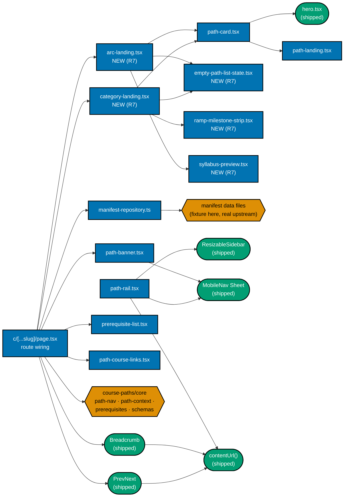
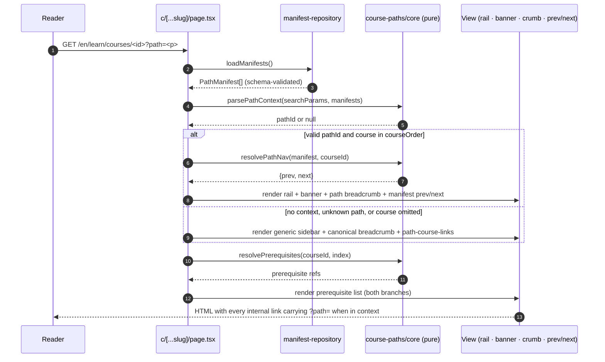
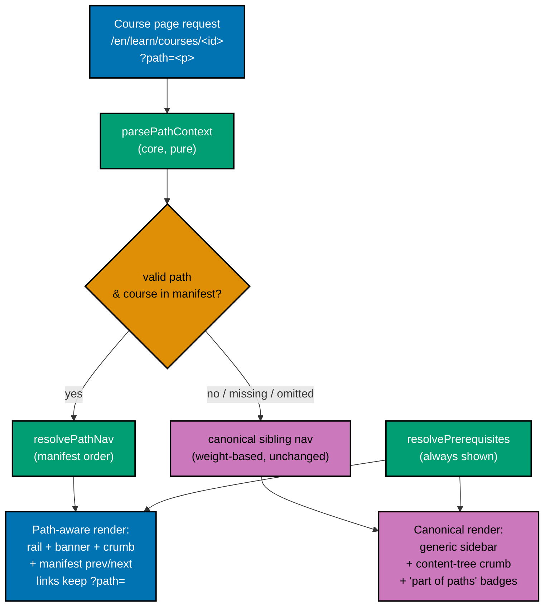
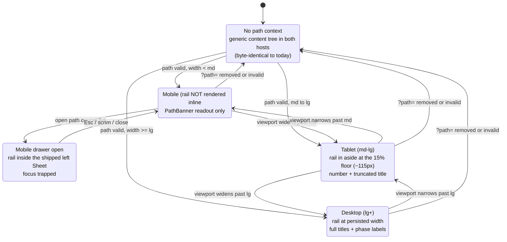

# Technical Documentation — Path-Aware Navigation UI

> **Programme decisions** — the `R*` rules and `A*` amendments cited below are defined in
> [§Programme decisions](#programme-decisions) below.

## Scope of this document

This plan builds the **rendering layer** of the `course-paths` feature in `ayokoding-www`: the shell
modules, the `?path=` route wiring, the Screen 3 rail content swap, the landing hero cards, the paths
hub, the path landing, and the accessibility contract for all of them. The pure `course-paths/core/`
modules are consumed here and **owned by**
`ayokoding-learning-path-02-schema-and-prerequisite-dag`; the content homes, the `legacy/`
relocation, and both redirect modules are **owned by** `ayokoding-learning-path-01-url-restructure`;
the real manifests are **owned by** `ayokoding-learning-path-05-manifests`.

**This plan is UI-bearing**, so the mandatory design funnel applies and is authored in full in
[prd.md §UI-Design-Funnel](./prd.md#ui-design-funnel-path-aware-navigation-screens) — no exemption is
claimed.

## Why the UI must change

Today, reading order is a single global property carried by `weight` frontmatter: `computePrevNext`
groups pages by parent slug and sorts siblings by `weight`, path-independently [Repo-grounded —
`apps/ayokoding-www/src/features/content/core/tree-builder.ts`]. One body cannot encode four orders.
The new model **moves order out of the body and into the manifest**, and makes prev/next + breadcrumb

- prerequisite display **resolve against the active path**. That resolution is a rendering concern, so
  it lives here.

`ayokoding-www` is a **Next.js app** [Repo-grounded — `apps/ayokoding-www/next.config.ts`,
`src/app/[locale]/(content)/[...slug]/page.tsx`] following the repo's
**functional-core/imperative-shell** feature layout (`src/features/<name>/{core,shell}`)
[Repo-grounded — `src/features/{content,navigation}/{core,shell}`]. **Correction (2026-07-25)** — the
`course-paths` feature's `core/` subdirectory is no longer new: it now exists on disk, populated by the
merged, archived upstream plan `ayokoding-learning-path-02-schema-and-prerequisite-dag` (six pure
modules plus `manifests/README.md`). The `shell/` subdirectory **this plan itself owns** remains absent
today [Repo-grounded — verified absent at `apps/ayokoding-www/src/features/course-paths/shell`,
matching `delivery.md`'s own Phase 0 precondition check].

## New feature: `course-paths` (functional core + imperative shell)

```text
apps/ayokoding-www/src/features/course-paths/
├── core/                      # PURE — no IO — OWNED BY ayokoding-learning-path-02-schema-and-prerequisite-dag
│   ├── schemas.ts             # PathManifest zod schema
│   ├── manifest.ts            # PathManifest type + course-ref normalization (id | {id, framing})
│   ├── path-nav.ts            # resolvePathNav(manifest, courseId) -> {prev, next} (pure)
│   ├── path-context.ts        # parsePathContext(searchParams, manifests) -> pathId | null (validate)
│   ├── prerequisites.ts       # resolvePrerequisites(courseId, index) -> course refs (pure)
│   ├── manifest-integrity.ts  # order/prereq/duplicate invariants (pure)
│   └── *.test.ts              # unit tests for the pure resolvers
└── shell/                     # IO / React — OWNED BY THIS PLAN
    ├── manifest-repository.ts # load manifest data files into validated PathManifest[] (fs)
    ├── path-landing.tsx       # Screen 2 — a path landing rendered from a manifest
    ├── path-card.tsx          # Screens 0 + 1 — one path as a card (hero variant + hub variant)
    ├── category-landing.tsx   # Screen 1a — NEW (R7): careers/skills category landing, two instances
    ├── arc-landing.tsx        # Screen 1b — NEW (R7): careers/<arc>/ arc landing, 1- and 2-role states
    ├── empty-path-list-state.tsx # NEW (R7): shared empty state for 1a/1b before a manifest lands
    ├── ramp-milestone-strip.tsx # NEW (R7): Screen 1a skills-instance dangerous/comfortable/confident ticks
    ├── syllabus-preview.tsx   # NEW (R7): Screen 1b single-role card's inline first-phase course list
    ├── path-rail.tsx          # Screen 3 (Option B) — the path's ordered course list as the left rail
    ├── path-banner.tsx        # Screen 3 — compact readout + the below-`md` disclosure trigger
    ├── prerequisite-list.tsx  # a course's prerequisites, rendered in BOTH views
    └── path-course-links.tsx  # "this course is part of: [path A] [path B]" affordance
```

**2026-07-21 category-split ruling.** The three new shell files above are this plan's share of R7
("every URL segment must render"). `category-landing.tsx` and `arc-landing.tsx` render the **pages**;
the structural `_index.md` files those routes mount are created by
`ayokoding-learning-path-01-url-restructure` (amendment A3) — same ownership boundary as the existing
paths-hub/path-landing split below.

**`shell/manifests/` is NOT created here.** The manifest data directory and its four files belong to
`ayokoding-learning-path-05-manifests`; this plan's `manifest-repository.ts` globs whatever directory
that plan will populate and is proven against a **fixture manifest** committed under the e2e suite's
fixture area. See [Fixture strategy](#fixture-strategy-how-this-plan-is-provable-before-any-manifest-exists).

### Component interaction



**Accessibility note.** Ownership is carried by node **shape** (rectangle = built here, hexagon =
upstream artefact, stadium = already-shipped component) as well as by fill colour, and every node's
label names its file, so no meaning depends on colour alone.

### Shell module contracts

- **`manifest-repository.ts`** (shell): globs the manifest data directory, parses each file, and
  validates it through the upstream `schemas.ts` into a `PathManifest`; manifests are cached in the
  content index alongside `trees`/`prevNext` [Repo-grounded — `ContentIndex` in
  `apps/ayokoding-www/src/features/content/core/types.ts`]. **The repository never defines its own
  validation** — a fixture that would not load in production must not load in a test either.
- **`path-card.tsx`**: one path rendered as a card. Two variants from one component — `context="hero"`
  (goal phrase prominent, formal name subordinate; Screen 0, careers-only) and `context="hub"` (formal
  name prominent, arc summary or omitted, course count or omitted; Screen 1, both categories). Both are
  a single `<Link>` wrapping a `Card`, per the shipped `SectionCard` pattern, so there is no
  link-in-link. Accent hue is **per-arc** for careers cards (shared by every role in the arc) and
  **per-subject** for skills cards — see [prd.md's accent hue legend](./prd.md#shared-design-legend-all-six-screens).
- **`category-landing.tsx`** (NEW, R7): renders `/en/learn/paths/careers/` or `/en/learn/paths/skills/`.
  **Two distinct instances, not one template with swapped data (R8)**: the careers instance renders an
  `ArcCard` grid (an arc chooser); the skills instance renders `path-card.tsx`'s `context="hub"` grid
  plus a `RampMilestoneStrip` per card and states the fixed-arc ramp promise once, with **no** chooser
  markup present at all — the two branches are separate render paths in the component, not one grid
  driven by a `hasChooser` prop.
- **`arc-landing.tsx`** (NEW, R7): renders `/en/learn/paths/careers/<arc>/`. Renders **exactly as many**
  `path-card.tsx` cards as the arc has roles (never a fixed-size grid); the single-role state
  additionally renders an inline first-phase syllabus preview inside that card so it never reads as a
  stub. Careers-only — per R8 there is no `skills/<arc>/` route to serve.
- **`empty-path-list-state.tsx`** (NEW, R7): shared by `category-landing.tsx` and `arc-landing.tsx`.
  Renders in place of a category/arc's card grid when its manifest set is empty — a stated
  "being written, check back soon" message plus a fallback link to a populated sibling category, never
  a silent blank render. Addresses the real (not theoretical) interval between plan 01's amendment A3
  creating structural `_index.md` files and the populating plans (careers: plan 05; skills: sibling
  skills-plans) shipping real manifests.
- **`ramp-milestone-strip.tsx`** (NEW, R7): rendered by `category-landing.tsx`'s skills instance as a
  `PathCard`-only addition (not on the Screen 1 hub card) — the dangerous/comfortable/confident course
  markers as a small horizontal `<ol>` of three labelled ticks, tick dots in the subject hue. This is
  the **compact preview only**; the detailed can/cannot text, runway-justification paragraph, and
  linked-prerequisite outbound links render on that subject's own `path-landing.tsx` page, not here. See
  [prd.md Screen 1a hi-fi](./prd.md#screen-1a-hi-fi--category-landing-enlearnpathscareers-enlearnpathsskills-option-a-arc-cards-with-member-role-preview).
- **`syllabus-preview.tsx`** (NEW, R7): rendered by `arc-landing.tsx`'s single-role state inside that one
  `PathCard` — the first phase's course titles as a small inline list, sharing the same "number is
  order" ordered-list semantics `path-landing.tsx`'s syllabus uses. See
  [prd.md Screen 1b hi-fi](./prd.md#screen-1b-hi-fi--arc-landing-enlearnpathscareersarc-option-a-always-render-arc-header--role-cards-single-role-gets-a-syllabus-preview).
- **`path-landing.tsx`**: renders a manifest as phase-grouped semantic `<ol>` sections; the visible
  number **is** the `courseOrder` index. Every course link carries `?path=`. For a `skills/` path, also
  renders the `_index.md`'s markdown body (via the shipped `MarkdownRenderer`) between the H1/arc-summary
  and the syllabus — the rendering surface for the can/cannot table, runway-justification paragraph, and
  linked-prerequisite outbound links `ayokoding-learning-path-07-skills-erp` §Requirement L-1/L-2/L-4 and
  `ayokoding-learning-path-06-skills-accounting` §Landing content contract hand off to this plan. See
  [prd.md Screen 2 hi-fi](./prd.md#screen-2-hi-fi--path-landing-enlearnpathspath-id-option-a-phase-grouped-numbered-syllabus).
- **`path-rail.tsx`**: `<nav aria-label="{Path} course list">` over a semantic `<ol>`. Renders
  identically in both hosts; the only host-dependent behaviour is truncation (see
  [Screen 3 responsive contract](#screen-3-the-rail-is-a-content-swap-not-a-new-shell)).
- **`path-banner.tsx`**: the compact `on path · course k of N` readout plus a `md:hidden` disclosure
  `<button aria-expanded aria-controls>` that opens the shipped drawer.
- **`prerequisite-list.tsx`**: renders `resolvePrerequisites` output in **both** the path-aware and the
  canonical view; renders **nothing at all** (not an empty label) when the course declares none.
- **`path-course-links.tsx`**: one badge link per path whose `courseOrder` **actually lists** this
  course. A path that only _links_ a course as a prerequisite (DD-24) contributes no badge.

## Routing and path-context propagation

- **Course pages** stay at their canonical `/en/learn/courses/<course-id>` URL; **path context rides
  in the `?path=<path-id>` query param**, never in the path segment. One canonical URL per course; the
  param is additive and shareable.
- **`c/[...slug]/page.tsx`** [Repo-grounded] reads `searchParams.path`, calls the upstream
  `parsePathContext`, and — when a valid path context resolves **and** the course is in that manifest —
  renders the **path-aware** view; otherwise the **canonical** view.
- **Static/dynamic boundary**: reading `searchParams` makes the route dynamic. This plan resolves the
  boundary by keeping the **server component static** and reading the param in a **thin client
  boundary** for the affordances that need it, so the canonical (no-`?path=`) render stays statically
  generated exactly as today. The chosen boundary is recorded as a delivery step with a build-output
  acceptance criterion, because the wrong choice silently de-optimizes every content page.
- **Link propagation**: `contentUrl(locale, slug, pathId?)` gains an optional `pathId` that appends
  `?path=<path-id>` [Repo-grounded — extend
  `apps/ayokoding-www/src/features/content/core/content-url.ts`], so rail, breadcrumb, prev/next, and
  prerequisite links all carry the context forward from **one** builder rather than four.

### Request → render sequence



### Decision branch (UI data flow)



**Accessibility note.** Every edge out of the branch node carries a text label (`yes` /
`no / missing / omitted`), and each render node's label states its full contents, so the diagram is
readable without distinguishing the fills.

## R2 rendering consequence: pathId is variable-depth

Per [README.md's R2 ruling](./README.md#category-split-ruling-2026-07-21-r1r8), `pathId` is
**variable-depth by design**: `careers/<arc>/<role>` (3 segments) or `skills/<subject>` (2 segments).
This plan's rendering layer must never hardcode a depth invariant. Concretely:

- **`parsePathContext`** (upstream, `course-paths/core`) validates only that the **first** segment is
  `careers` or `skills` and that the remaining segment(s) resolve to a manifest that exists — it never
  asserts a segment count. This plan's contract with that function is: pass the raw `?path=` value
  through unchanged and trust its `pathId | null` return, never re-split or re-validate segment depth
  in the shell.
- **`manifest-repository.ts`**'s directory glob walks **both** `careers/<arc>/<role>/` and
  `skills/<subject>/` shapes without a depth-specific code path — the glob pattern is
  `manifests/**/manifest.{json,yaml}` (or equivalent), not `manifests/*/*/manifest.*` — so adding a
  future third category at yet another depth costs no rendering-layer change.
- **Route-to-page resolution** (`category-landing.tsx` for 1- and 2-segment category roots,
  `arc-landing.tsx` for the careers-only 2-segment arc root, `path-landing.tsx` for the terminal
  segment) dispatches on **segment count found**, not on a hardcoded expectation of which category
  produces which count — the dispatch table is `{2: [category | arc | terminal-skills], 3:
[terminal-careers]}` disambiguated by the first segment, never `{careers: 3, skills: 2}` baked in as
  a constant.
- **Fixture proof (R2, this plan's own testing obligation)**: because the shell must provably handle
  both depths, this plan's fixture set includes **both** a `careers/`-shaped 3-segment fixture manifest
  and a `skills/`-shaped 2-segment fixture manifest — see
  [Fixture strategy](#fixture-strategy-how-this-plan-is-provable-before-any-manifest-exists) below. A
  single-depth fixture would let a hardcoded-depth regression pass silently.

## Prev/next resolution

- **With path context**: prev/next come from `resolvePathNav(activeManifest, courseId)` — the manifest
  ordering, **not** weight. Both links carry `?path=`.
- **Without path context**: the existing weight-based sibling prev/next is used (or none), exactly as
  today — no regression for non-path readers [Repo-grounded —
  `apps/ayokoding-www/src/features/navigation/shell/prev-next.tsx`].
- The component's **markup does not change**; only its data source and href construction do. This is
  deliberate: a markup rewrite would put the shipped `<nav aria-label="Page navigation">` contract at
  risk for every page on the site, not just courses in path context.

## Breadcrumb

- **With path context**: `Home / Learn / <Path Title> / <Course Title>` — the path crumb links to the
  path landing `/en/learn/paths/<path-id>` (carrying `?path=`).
- **Without path context**: the existing content-tree breadcrumb, unchanged [Repo-grounded —
  `buildBreadcrumbs` in `apps/ayokoding-www/src/app/[locale]/(content)/[...slug]/page.tsx`].
- The path-aware trail is a **documented departure** from NN/g's single-canonical-parent default,
  justified because the active path is explicit and shareable in the URL, so the trail is deterministic
  given the URL rather than referrer-driven. Rationale in
  [prd.md §Learner Journey](./prd.md#learner-journey-end-to-end).

**2026-07-21 category-split ruling — breadcrumb depth finding.** A careers path is now 3 URL segments
deep, so a course-in-path breadcrumb can reach **6 crumbs**: `Home / Learn / Careers / <Arc> / <Role> /
<Course>`. [Repo-grounded — read directly:
`apps/ayokoding-www/src/features/navigation/shell/breadcrumb.tsx`, current as of 2026-07-25.] Findings:

- **No hardcoded depth ceiling exists in the component.** `Breadcrumb` accepts a generic
  `segments: {label, slug, href?}[]` prop with no length check. **Correction (2026-07-25) — the
  markup this finding originally cited is stale.** A sibling plan's own Rule-15 web-design-tester
  retest (tagged `DWT-001` in the component's doc comment, sourced from
  `ayokoding-learning-path-01-url-restructure`'s `prd.md` Screen 4 acceptance criterion and mockup
  assets) landed **after** this passage was authored and removed `flex-wrap` entirely: the `<ol>` now
  renders `className="flex items-center gap-1 overflow-x-auto whitespace-nowrap"`, and beyond 3
  visible crumbs the middle ones collapse behind a single mobile-only ellipsis crumb
  (`hasMobileCollapse`), reappearing at `sm:` and up. The row **never wraps to a second line at any
  width** — it either shows every crumb on one line (with horizontal scroll as the tablet-band overflow
  fallback) or, below `sm`, collapses the middle crumbs behind one `…`. Six segments will render without
  a further code change.
- **Residual tension, now largely resolved by the code itself**: this plan's own
  [Learner Journey](./prd.md#learner-journey-end-to-end) states a "no multi-line breadcrumb wrap on
  small screens" principle — the current component **structurally guarantees** this (`overflow-x-auto
whitespace-nowrap` forbids wrapping outright), so the "how many lines does it wrap to" question this
  section originally flagged is now moot. The residual, still-open question is narrower: does the
  mobile ellipsis-collapse read correctly at a full 6-segment careers trail (does the single `…` crumb
  communicate the hidden middle segments clearly), and is the tablet-band horizontal-scroll fallback
  acceptable rather than distracting? This is flagged, not resolved, here: the 375 px Screen 3
  manual-verification step (Playwright MCP) must empirically confirm the ellipsis-collapse rendering and
  the horizontal-scroll fallback at 6 segments, rather than this document asserting either outcome
  without evidence. See the corresponding entry in
  [prd.md §Product-Level Risks](./prd.md#product-level-risks).

## Prerequisite display

Every course page renders its declared `prerequisites` (from the upstream `resolvePrerequisites`) as a
semantic list of links to the prerequisite courses' canonical pages. Shown in **both** the canonical
and the path-aware view — it is the body's own honest dependency statement and is path-independent.
When a path context is active, each prerequisite link carries `?path=` so the reader stays in-path.
Prerequisites are **advisory, never gated**: no lock, no quiz-wall.

## Graceful fallback (deep-link / share)

- A course URL opened without `?path=` lands on the **canonical standalone view** — full body,
  content-tree breadcrumb, canonical (or no) prev/next, prerequisite list — never an error.
- Every course page shows a **"this course is part of: [path A] [path B]"** affordance
  (`path-course-links.tsx`) so a deep-linked reader can enter any path that lists it.
- An **invalid** `?path=` value (unknown or renamed path) is treated as no context, never a crash —
  enforced upstream by `parsePathContext` and proven here by a Gherkin scenario plus an e2e test.

## Screen 3: the rail is a content swap, not a new shell

The selected Screen 3 design (Option B, [DL-17](./README.md#this-plans-own-locked-decision)) introduces
**no new shell and no new overlay pattern**. It swaps the `children` of two already-shipped hosts:

| Host                | Breakpoint | Today's `children`        | With `?path=` | Unchanged                                                                                                           |
| ------------------- | ---------- | ------------------------- | ------------- | ------------------------------------------------------------------------------------------------------------------- |
| `ResizableSidebar`  | `md+`      | `<Sidebar>`/`SidebarTree` | `<PathRail>`  | `<aside>`, `hidden … md:block` gate, `ResizablePanel` 15 %-35 % band, handle, `ayokoding-sidebar-width` key         |
| `MobileNav` `Sheet` | `<md`      | `SidebarTree`             | `<PathRail>`  | `Sheet`/`SheetContent side="left"`, preset-width fieldset, `PRIMARY_NAV_LINKS`, `onOpenChange(false)` on link click |

[Repo-grounded — `apps/ayokoding-www/src/features/navigation/shell/resizable-sidebar.tsx`,
`apps/ayokoding-www/src/features/app-shell/shell/mobile-nav.tsx`.]

**Invariant, and the single most important test in this plan**: with no `?path=`, both hosts render
exactly what they render today. The no-path reader has zero regression surface. This is asserted in
both directions — a with-path test proving the rail appears **and** a no-path test proving the generic
tree appears and no path chrome does.

### Rail responsive states



The full breakpoint-by-breakpoint contract — widths, truncation rule, trigger name, dismissal, and
focus behaviour — is in
[prd.md §Screen 3 responsive specification](./prd.md#screen-3-responsive-specification-the-selected-option-b-breakpoint-by-breakpoint).

## Path landing and paths hub

- **Path landing** at `/en/learn/paths/<path-id>` (now variable-depth, R2), rendered by
  `path-landing.tsx`: the `_index.md` **frontmatter** supplies only the SEO title/description, and its
  **markdown body**, when present, renders between the H1/arc-summary and the syllabus via the shipped
  `MarkdownRenderer` [Repo-grounded — `apps/ayokoding-www/src/features/content/shell/markdown-renderer.tsx`]
  fed the same `html` the shipped `content.getBySlug` procedure already returns for any `_index.md`
  [Repo-grounded — `serverCaller.content.getBySlug` in `<ROUTE>`]. This body slot is the rendering
  surface for a `skills/` path's ramp can/cannot table, runway-justification paragraph, and
  linked-prerequisite outbound links (`ayokoding-learning-path-07-skills-erp` §Requirement L-1/L-2/L-4;
  `ayokoding-learning-path-06-skills-accounting` §Landing content contract) — see
  [prd.md Screen 2 hi-fi's landing body content](./prd.md#screen-2-hi-fi--path-landing-enlearnpathspath-id-option-a-phase-grouped-numbered-syllabus).
  A careers `_index.md` supplies no body, so a careers path landing renders exactly as before this
  addition. The ordered course list is rendered from the loaded manifest data, grouped by the path's
  phase headings, each course link carrying `?path=`. **Ordering never lives in the `_index.md`
  frontmatter or body** — a body that hand-writes a course list is a second source of truth this plan
  does not read; only the manifest drives ordering.
- **Paths hub** at `/en/learn/paths`: **redesigned by the category-split ruling (R6)** — the
  "choose your path" screen with a `CategorySection`/`ArcGroup` layout (a `careers/` section grouped by
  arc, a `skills/` section flat) replacing the retired flat four-card grid, each `PathCard` built from
  a loaded manifest (title + description + course count for careers; title only, pre-manifest, for
  skills). See [prd.md §Screen 1 hi-fi](./prd.md#screen-1-hi-fi--paths-hub-enlearnpaths-option-a-category-sections-arc-grouped-within-careers)
  for the full component contract.
- **Category and arc landings** (`category-landing.tsx`, `arc-landing.tsx`) — new (R7), rendering the
  `careers/`, `skills/`, and `careers/<arc>/` URL segments that previously had no page at all. See
  [Shell module contracts](#shell-module-contracts) above.
- **Content homes and structural indices are not created here.** `content/en/learn/paths/_index.md`,
  `content/en/learn/courses/_index.md`, and — per amendment A3 — every category/arc structural index
  (`paths/careers/_index.md`, the three `paths/careers/<arc>/_index.md`, `paths/skills/_index.md`) are
  authored by `ayokoding-learning-path-01-url-restructure`; this plan builds the renderers that those
  routes mount and proves them against the fixtures. This is the boundary that keeps the two plans from
  racing on the same files.
- **Sidebar ordering / weight for the new category and arc entries** — this plan **reuses**, and does
  not re-derive, `ayokoding-learning-path-01-url-restructure`'s own DD-44 reasoning for how new
  structural entries get a sidebar position (weight assignment for newly-created `_index.md` files is
  that plan's concern, since it authors those files); this plan's renderers consume whatever
  tree-position the content layer resolves, the same way `path-landing.tsx` already does for the
  existing `paths/<path-id>` entries.

## Accessibility contract

- Breadcrumb and prev/next remain `nav` landmarks with `aria-label`s [Repo-grounded — existing
  components]; the path crumb marks the current path with `aria-current` where appropriate.
- The path rail is a `<nav aria-label="{Path} course list">` landmark over a semantic `<ol>`; the
  current course is marked with `aria-current="page"` **and** a text/shape signal (`▸` +
  `font-semibold`), never hue alone (WCAG AA 1.4.1).
- Below `md`, the rail's disclosure trigger carries a full accessible name — "Open path course list —
  {Path}, course {k} of {N}" — plus `aria-expanded`/`aria-controls`; the drawer inherits Radix `Dialog`
  focus-trap / focus-restore / `Esc` from the shipped `Sheet`, so **no new focus machinery is written**.
- The path landing course list and the prerequisite list are semantic ordered/unordered lists, so screen
  readers announce course position and prerequisite relationships.
- Hue is never the sole carrier of meaning anywhere in the feature: every hue-coded badge or card also
  carries the path name as text.
- `html[lang]` stays correct per locale; the global skip-link → `#main-content` is unchanged.

## Legacy browse coexistence (this plan's share)

The library/paths model is **additive** — it adds navigation without removing the old one. The legacy
hand-curated section browse must keep working alongside path navigation. **Ownership split**: relocating
the `legacy/` bucket, updating every impacted `_index.md`, and authoring both redirect modules belong to
`ayokoding-learning-path-01-url-restructure`. **This plan's share** is narrower and purely a rendering
invariant: a course URL reached from the legacy tree (i.e. with no `?path=`) renders the canonical view
with no path chrome, and the shipped redirect behaviour is not broken by the route-wiring change. That
is asserted here as an **e2e regression guard**, not as an owned Gherkin scenario.

> **Blocked-on Q-E.** Whether residual `fundamentally-strong` index pages survive as-is is open question
> **Q-E**, owned by `ayokoding-learning-path-01-url-restructure`. Its ruling changes what that plan's
> coexistence scenario asserts; it does **not** change this plan's regression guard, which only asserts
> "no path chrome without `?path=`". See [README §Blocked-on](./README.md#blocked-on-open-questions-owned-by-another-plan).

## Fixture strategy (how this plan is provable before any manifest exists)

The four real **careers** manifests ship in the Wave-3 plan `ayokoding-learning-path-05-manifests`,
which depends on this plan; the two real **skills** manifests ship from sibling skills-plans (R4/R5),
also downstream of this plan. Building the renderer against nothing would leave every behaviour
unverified until those plans ship — so this plan commits fixture manifests and proves every rendering
behaviour against them.

Four rules make the fixtures trustworthy rather than a self-fulfilling stub:

1. **Same schema.** Every fixture is validated through the upstream `schemas.ts`, not a test-local
   shape. A fixture that would not load in production cannot load in a test.
2. **Two fixtures where a behaviour needs two.** The "shared course, no forked body" property and the
   `path-course-links` multi-badge case are asserted over **two** careers fixture manifests that share
   a course ID, because one manifest cannot exhibit sharing.
3. **A careers-shaped AND a skills-shaped fixture, per R2.** Because `pathId` is variable-depth
   (`careers/<arc>/<role>`, 3 segments, vs. `skills/<subject>`, 2 segments — see
   [R2 rendering consequence](#r2-rendering-consequence-pathid-is-variable-depth) above), a single-depth
   fixture set cannot prove the router handles both shapes. This plan therefore commits **both** a
   3-segment careers fixture and a 2-segment skills fixture, and the variable-depth Gherkin/e2e
   assertions run against both.
4. **No re-assertion downstream.** The careers-manifest plan re-asserts the same four nav behaviours
   against the **real** careers manifests as checklist acceptance clauses in its own gates — not as
   duplicate Gherkin; the sibling skills-plans do the same for the skills fixtures once their real
   manifests ship. See [prd.md §Acceptance Criteria](./prd.md#acceptance-criteria-gherkin) for the
   provenance note.

## Design Decisions

### Owned by this plan

- **DD-4 · Graceful canonical fallback is first-class.** A course without path context renders a full
  standalone view + prerequisite list + a "part of paths" affordance. Deep-links and shares must never
  break; the canonical view is the existing, already-correct behavior.

- **DD-46 · Screen 3 is the left path rail (Option B), and the banner survives as its compact
  readout.** The plan originally selected Option A (a top banner) and rejected Option B on mobile-first
  grounds — _"desktop-only … would need to collapse into a top sheet on mobile"_. That objection is
  **answered, not deleted**: the collapse target already exists. `MobileNav` is a shipped left `Sheet`
  that already renders `SidebarTree` below `md`, opened from the header's
  `aria-label="Open navigation menu"` button [Repo-grounded —
  `apps/ayokoding-www/src/features/app-shell/shell/mobile-nav.tsx`, `.../header.tsx`], so the rail's
  mobile form is a **content swap in an existing overlay**, not new overlay machinery. Likewise on
  desktop: `ResizableSidebar` keeps its `<aside>`, `hidden … md:block` gate, 15 %-35 % `ResizablePanel`
  band, resize handle, and `ayokoding-sidebar-width` key — only its `children` change
  [Repo-grounded — `.../navigation/shell/resizable-sidebar.tsx`]. **What is genuinely more expensive
  than Option A and accepted deliberately**: one net-new `PathRail` component, a conditional child in
  two hosts, and truncation behaviour at the ~115 px 15 %-floor width at `md`. **Bought with it**: the
  whole ordered arc stays visible while reading, so "where am I / what's next / what did I skip" costs
  no navigation. `PathBanner` is retained from Option A, demoted to the rail's always-visible compact
  readout and the host of the below-`md` disclosure trigger. **Invariant**: with no `?path=`, both hosts
  render exactly what they render today — the no-path reader has zero regression surface. Full
  breakpoint contract in
  [prd.md §Screen 3 responsive specification](./prd.md#screen-3-responsive-specification-the-selected-option-b-breakpoint-by-breakpoint).

- **DD-47 · Every screen's every option carries a wireframe and a render at three viewports.** The
  funnel previously held desktop-only artefacts (8 `.png`, one per screen per option) with mobile
  behaviour described in prose. A prose footnote cannot be reviewed the way a drawing can, and the
  Screen 3 reselection turned on exactly a mobile question — which is the argument for the rule, not an
  anecdote against it. **Amended 2026-07-21 by the category-split ruling (R6/R7)** — Screen 1 was
  redesigned in place and two new screen types (1a, 1b) were added, so the funnel now renders **6
  screens × 2 options × 3 viewports = 36 `.png`** at **375 / 768 / 1280 px** (Tailwind's default
  `sm`/`md`/`lg`/`xl` scale [Web-cited — <https://tailwindcss.com/docs/responsive-design>, accessed
  2026-07-21 — "sm 40rem (640px) / md 48rem (768px) / lg 64rem (1024px) / xl 80rem (1280px) / 2xl 96rem
  (1536px)"]), matching the widths the plan's Playwright verification already resizes to, plus a lo-fi
  wireframe per viewport. Naming is `assets/<screen>-option-<a|b>-<mobile|tablet|desktop>.png` from
  `assets/src/<same-stem>.html`; the eight pre-existing files were renamed into the scheme and every
  `` reference updated; four new stems (`category-landing-option-{a,b}`,
  `arc-landing-option-{a,b}`) were added for the two new screen types. `.png` only, per the
  [UI Mockups convention](../../../repo-governance/conventions/formatting/diagrams/ui-mockups-principles-and-scope.md#ui-mockups-in-plan-docs-principles-in-practice-and-scope).
  Delivery enumerates the renders **one checkbox per asset** — a coarse "render all mockups" step can
  be ticked with most of the set missing.

> **DD-47 after the split.** DD-47's original **30** was a **two-plan** total: 24 held here (Screens
> 0-3) and 6 by `ayokoding-learning-path-01-url-restructure` (Screen 4). **Amended 2026-07-21**: this
> plan's share grows from 24 to **36**, so the cross-plan total grows to **42** (36 here + 6 there,
> Screen 4 unchanged). Every DD-47-derived acceptance clause in this plan — including the Phase 1 and
> archival gate checks in `delivery.md` — now asserts **36** against this plan's own `assets/`. A
> reader auditing DD-47 against this folder alone must not read 36 as under-delivery, and no executor
> may close the gap by copying the other plan's six renders here — a matrix duplicated across two
> folders drifts.

- **DD-50 · Skills accent hue is per-compliance-track, not per-subject (2026-07-22, amendment A10
  ripple fix).** The pre-A10 design reserved 3 of the 6-hue palette for careers arcs, 2 for the
  (then two) skills subjects, and 1 for the skills-section-level accent — a clean 3+2+1=6 budget. A10
  quadruples the skills subject count to four (`conventional-accounting`, `sharia-accounting`,
  `conventional-erp`, `sharia-erp`) without adding hues to the palette, so a naive "one hue per
  subject" mapping needs a 4th and 5th skills hue that do not exist, and an earlier pass of this
  ripple fix used all three remaining hues plus **reused `honey`** — the careers `interview-ready`
  hue — for a fourth card, producing a same-page colour collision between an unrelated careers card
  and a skills card. **Ruling**: pair the four subjects by **compliance track**, exactly mirroring
  how the careers side already pairs Software Engineer and AI Engineer under one `immediately-effective`
  hue (`teal`) and differentiates by name/badge, never colour alone. `conventional-accounting` and
  `conventional-erp` share `terracotta`; `sharia-accounting` and `sharia-erp` share `plum`; `sky`
  stays reserved for the section-level eyebrow/strap-line, unchanged from the pre-A10 design. Zero
  hues are added, zero collide with a careers hue, and the "hue is never the sole signal" rule (every
  card also carries its distinct name and badge) makes the shared hue-per-track unambiguous. See
  [prd.md's Shared design legend accent-hue entry](./prd.md#shared-design-legend-all-six-screens)
  for the resulting map and this plan's `assets/src/*.html` mockups for the corrected cards.

- **DD-51 · The `mobile-nav.tsx` ⇄ `path-banner.tsx` two-way import is a deliberate, scoped
  exception to one-directional feature coupling, flagged by PR #95's cycle-3 review (2026-07-25) and
  recorded here rather than restructured.** Two edges exist between `app-shell` and `course-paths` at
  this head SHA: `course-paths` → `app-shell` (`path-banner.tsx` imports `useMobileNavOpen` from
  `@/features/app-shell/shell/use-mobile-nav-open`) and `app-shell` → `course-paths`
  (`mobile-nav.tsx` imports `PathRail`, `resolveActiveCourseFromLocation`, a `PathManifest` type, and
  — closing the cycle specifically with `path-banner.tsx` — `MOBILE_NAV_DRAWER_ID`). `header.tsx` and
  `hero.tsx` also import from `course-paths`, but those are one-directional (no course-paths import
  flows back into either), so the cycle is exactly the `mobile-nav.tsx` ⇄ `path-banner.tsx` pair.
  **Why it exists**: DD-46 established that `PathBanner`'s mobile disclosure trigger opens the
  **same** `Sheet` the header's hamburger button opens, not a second overlay — so `PathBanner`
  (`course-paths`) needs the shared `open`/`setOpen` state `MobileNav` (`app-shell`) owns, and
  `MobileNav` needs the exact drawer-content `id` (`MOBILE_NAV_DRAWER_ID`) `PathBanner`'s
  `aria-controls` references, so the two literally must agree on one constant. **Alternative
  considered and deferred, not rejected**: hoisting `useMobileNavOpen`'s context provider and
  `MOBILE_NAV_DRAWER_ID` out of both features into a neutral shared home (e.g. `navigation`, which
  both features already depend on one-directionally) would collapse this to two one-way edges with
  zero behavior change — a mechanical, low-risk move. Deferred rather than done in this pass because
  this plan is at Phase 5 (post-manual-verification, near-archival) with an already-large delivery
  diff; reopening closed phases for a purely structural refactor with no functional payoff is
  disproportionate here. Recorded as a standing, intentional exception — not silently left
  undocumented — and a good first task for whichever future plan next touches either file.

### Inherited verbatim (build order — no single plan owns it)

Reproduced verbatim because Group A alone spans three of the five split plans.
`ayokoding-learning-path-05-manifests` is the canonical owner for citation purposes.

- **DD-15 · Build order (locked; amended 2026-07-20 by DD-27 — see below).** Group A (architecture +
  `course-paths` UI — hard prerequisite) → `interview-ready` MVP ships first (re-home 1–33, author the
  4 interview courses + `capstone-interview-loop`, one manifest, deploy) → `immediately-effective`
  manifest → `fundamentally-strong` manifest → backfill topics 34–94 native into `courses/` as the
  library fills. **DD-27 amends steps 2 onward**: the MVP is narrowed to an architecture smoke test
  only (interview-course authoring is no longer bundled into it), and the fourth path is inserted as
  authoring priority #1 immediately after the MVP.

- **DD-27 · Build order amended: the fourth path is authoring priority #1, behind an
  architecture-smoke-test-only MVP (D7, amends DD-15).** Locked order: **Group A** (architecture + UI,
  unchanged hard prerequisite) → **`interview-ready` MVP, narrowed to an architecture smoke test only**
  (ships against topics 1–33, already live on disk; proves routing, manifest loading, `?path` context,
  prev/next, breadcrumb, and prerequisite display against real content, in days not months —
  authoring the 4 NEW interview courses + `capstone-interview-loop` is **no longer bundled into this
  MVP gate**) → **`software-engineer-to-ai-engineer`** (authoring priority #1 for all authoring effort)
  → **`immediately-effective/software-engineer`** manifest → **`fundamentally-strong/software-engineer`**
  manifest → **backfill topics 34–94**. Rationale (preserved from the original build-order decision):
  nothing in the AI path exists on disk (~17 courses); making it literally first — ahead of even the
  MVP — would mean nothing ships until all 17 are authored, with the UI architecture unvalidated the
  entire time. Ordering it immediately after an architecture-smoke-test MVP gives the AI path first
  claim on every unit of real authoring effort while keeping the architecture proven early against
  content that already exists.

**This plan's position in that order**: it is the "+ UI" half of Group A's hard prerequisite. Nothing
after Group A can start until the rendering layer exists, which is why this plan sits in Wave 2 and
blocks `ayokoding-learning-path-05-manifests`.

> **Staleness flag on DD-15/DD-27 (this plan does not edit the verbatim text above).** Both decisions
> predate the 2026-07-21 category-split ruling and are stale in two ways this plan does not correct in
> place, because the block above is reproduced **verbatim** from its canonical owner
> (`ayokoding-learning-path-05-manifests`), which is itself being updated concurrently for the same
> ruling: (1) the path-id `software-engineer-to-ai-engineer` is renamed to `ai-engineer` under
> `careers/immediately-effective/` (R1/R3); (2) the "~17 courses" figure and the "already a SWE,
> transition" framing assumed the pre-split model — per R3 the path is now from-scratch, with SWE
> prerequisites **included** in its own `courseOrder` rather than assumed. Both corrections are
> plan 05's to make in its canonical copy; flagged here rather than silently drifted from that source.

### Consumed from sibling plans (not restated)

| Decision    | Subject                                                                                      | Owning plan                                              |
| ----------- | -------------------------------------------------------------------------------------------- | -------------------------------------------------------- |
| DD-1        | Order lives outside the body                                                                 | `ayokoding-learning-path-02-schema-and-prerequisite-dag` |
| DD-3        | Path-aware nav via `?path=` client context                                                   | `ayokoding-learning-path-02-schema-and-prerequisite-dag` |
| DD-24       | AI path links, does not include, SWE prerequisites — **stale per R3, see flag below**        | `ayokoding-learning-path-05-manifests`                   |
| DD-40–DD-45 | Three-bucket IA, `legacy/` relocation, redirects                                             | `ayokoding-learning-path-01-url-restructure`             |
| DD-611      | The ramp affordance is handed to this plan as content only — no dedicated component required | `ayokoding-learning-path-06-skills-accounting`           |

This plan **implements the rendering consequences** of DD-3 and DD-24 (query-param context; badge only
for paths that list the course) without re-deciding either.

> **DD-24 staleness flag.** DD-24's own worked example assumed the pre-split transition-path model — the
> AI path "links, does not include" SWE-fundamentals prerequisites. Per R3,
> `careers/immediately-effective/ai-engineer` now **includes** its prerequisites in `courseOrder`
> instead, so DD-24's specific example is stale; this plan's own consumed contract (one badge per path
> whose `courseOrder` actually lists the course) needs no change, since it was never depth- or
> path-specific — only DD-24's illustrative claim is affected, and only its owning plan corrects it. See
> the matching flag in [prd.md Screen 3](./prd.md#screen-3--course-page-in-path-context).

## Programme decisions

The decision ids this plan cites (`R1`, `R2`, `R3`, `R4`, `R5`, `R6`, `R7`, `R8`, `R9`, `A1`, `A2`,
`A3`, `A5`, `A9`, `A10`) were **folded verbatim from the now-retired shared programme file and are owned locally here** — that
shared programme file no longer exists, so these definitions live in this section. They are **programme-scope decisions, not governance rule ids**; each `A*` amendment is
later than the `R*` rules and wins on conflict. The wave/DAG position is stated locally in
[README §Wave and dependency position](./README.md#wave-and-dependency-position) and
[README §Depends-on](./README.md#depends-on).

| Id  | Decision                                                                                                                                                                                     |
| --- | -------------------------------------------------------------------------------------------------------------------------------------------------------------------------------------------- |
| R1  | URL grammar is `/en/learn/paths/{careers,skills}/…` over six paths (raised to **eight** by `A10`)                                                                                            |
| R2  | `pathId` is **variable-depth by design** — `careers/<arc>/<role>` is 3 segments, `skills/<subject>` is 2; nothing may key on segment count                                                   |
| R3  | The fourth careers path targets a distinct AI-engineering endpoint (superseded in part by `A1`)                                                                                              |
| R4  | Ownership split: plans 01-05 are `careers/`-only; the `skills/` category is separate (revised by `A2`)                                                                                       |
| R5  | The full skills corpus is authored **in this programme**, not deferred                                                                                                                       |
| R6  | The paths hub is **redesigned** around the two categories, not relabelled                                                                                                                    |
| R7  | **Every URL segment must render** — no orphan segments                                                                                                                                       |
| R8  | Every `skills/` path uses the **immediately-effective** arc, always                                                                                                                          |
| R9  | Every plan declares its **UI-gate and API-gate posture explicitly**; a plan bearing neither surface is _not_ thereby exempt and must state why                                               |
| A1  | `careers/immediately-effective/ai-engineer` assumes **no** prior software-engineering competence; prerequisites are included in `courseOrder`, not linked                                    |
| A2  | The skills category splits into **two** plans — 06 (accounting) and 07 (ERP), the latter `blockedBy` the former                                                                              |
| A3  | Plan 01 owns **every structural `_index.md`** under `paths/`; plans 05-07 own only their path landings, manifests and corpora                                                                |
| A5  | Plan 03 owns **all** design assets **except plan 01's Screen 4 funnel and its six renders**; a `.png` is a baked render and desynchronises silently when its `.html` changes                 |
| A9  | Both corpora **expand past 20 courses** as the domain requires; every derived count follows                                                                                                  |
| A10 | The skills category carries **four** paths — `conventional-accounting`, `sharia-accounting`, `conventional-erp`, `sharia-erp`; each Sharia path covers the basics too, and `A11` governs how |

> **`A1`/`A2` canonical ownership.** `A1` is added here only to resolve this table's own `R3` row
> above ("superseded in part by `A1`"); it is defined verbatim in
> `ayokoding-learning-path-07-skills-erp/tech-docs.md` — the only sibling plan whose own copy of
> this table carries an `A1` row, making that plan `A1`'s canonical owner. `A2` is added to resolve
> this table's own `R4` row ("revised by `A2`"); it is reproduced byte-identically across
> `ayokoding-learning-path-05-manifests`, `-06-skills-accounting`, `-07-skills-erp`, and the archived
> `-02-schema-and-prerequisite-dag` — no single plan is `A2`'s sole canonical owner, it is a
> programme-wide fact all four already carry. This plan does not act on either decision; both rows
> exist solely so this table's own forward-references resolve without leaving the reader to consult
> a sibling plan, consistent with this section's own "owned locally here" framing.

## File Impact

`<FEAT>` = `apps/ayokoding-www/src/features/course-paths/`;
`<NAV>` = `apps/ayokoding-www/src/features/navigation/shell/`;
`<SHELL>` = `apps/ayokoding-www/src/features/app-shell/shell/`;
`<SPECS>` = `specs/apps/ayokoding/behavior/ayokoding-www/gherkin/course-paths/`;
`<E2E>` = `apps/ayokoding-www-fe-e2e/`.

| Area                    | Change                                            | Files                                                                                                                                                                                                                                                                                                                                                                                                                                                                                                                                                                                                                                                                                                                                                              |
| ----------------------- | ------------------------------------------------- | ------------------------------------------------------------------------------------------------------------------------------------------------------------------------------------------------------------------------------------------------------------------------------------------------------------------------------------------------------------------------------------------------------------------------------------------------------------------------------------------------------------------------------------------------------------------------------------------------------------------------------------------------------------------------------------------------------------------------------------------------------------------ |
| `course-paths` shell    | New app code (TDD)                                | `<FEAT>shell/{manifest-repository.ts,path-landing.tsx,path-card.tsx,category-landing.tsx,arc-landing.tsx,empty-path-list-state.tsx,ramp-milestone-strip.tsx,syllabus-preview.tsx,path-rail.tsx,path-banner.tsx,prerequisite-list.tsx,path-course-links.tsx}` _(all New files — `category-landing.tsx`, `arc-landing.tsx`, `empty-path-list-state.tsx`, `ramp-milestone-strip.tsx`, `syllabus-preview.tsx` added 2026-07-21)_ + colocated `*.test.tsx`                                                                                                                                                                                                                                                                                                              |
| Route wiring            | Edit                                              | `apps/ayokoding-www/src/app/[locale]/(content)/[...slug]/page.tsx` [Repo-grounded]                                                                                                                                                                                                                                                                                                                                                                                                                                                                                                                                                                                                                                                                                 |
| Extended nav components | Additive props, no fork                           | `<NAV>prev-next.tsx`, `<NAV>breadcrumb.tsx`, `apps/ayokoding-www/src/features/content/core/content-url.ts` [all Repo-grounded]                                                                                                                                                                                                                                                                                                                                                                                                                                                                                                                                                                                                                                     |
| Screen 3 hosts          | `children` swap only                              | `<NAV>resizable-sidebar.tsx`, `<SHELL>mobile-nav.tsx` [both Repo-grounded]                                                                                                                                                                                                                                                                                                                                                                                                                                                                                                                                                                                                                                                                                         |
| Screen 0 hero           | Edit — `PathCard` grid + skills escape-hatch link | `<SHELL>hero.tsx` [Repo-grounded]; existing `<SHELL>landing.test.tsx` extended                                                                                                                                                                                                                                                                                                                                                                                                                                                                                                                                                                                                                                                                                     |
| Specs (Gherkin)         | Edit pre-existing domain folder + add new files   | `<SPECS>` already exists, created by the archived `ayokoding-learning-path-02-schema-and-prerequisite-dag`, which handed off step-binding ownership to this plan (documented in `<SPECS>README.md` — Repo-grounded); **edit** the 6 in-scope existing files (10 scenarios) to remove `@wip` and add real level tags (`path-order-nav.feature`, `omitted-course.feature`, `canonical-fallback.feature`, `invalid-path-fallback.feature`, `breadcrumb.feature`, `prerequisite-display.feature`); **author** 10 new `.feature` files for the remaining behavior groups plan-02 did not scaffold; excludes `manifest-integrity.feature` and `prerequisite-consistent-ordering.feature` (plan-02-owned pure-core scenarios, out of scope for this plan) [Repo-grounded] |
| E2E                     | New fixture + step defs                           | `<E2E>` careers-shaped and skills-shaped fixture manifests _(New files)_ + `course-paths` step definitions _(New files; sibling `resizable-sidebar.steps.ts` exists — Repo-grounded)_                                                                                                                                                                                                                                                                                                                                                                                                                                                                                                                                                                              |
| Plan artefacts          | Funnel + evidence                                 | `assets/*.png` (**36 total**: 8 pre-existing HTML sources content-fixed in place for R6/R8, 4 new HTML source stems added for Screens 1a/1b — all 36 `.png` pending render/re-render), `prd.md` embeds, `evidence/*.png`                                                                                                                                                                                                                                                                                                                                                                                                                                                                                                                                           |

> **Correction (2026-07-25) — the `content-url.ts` cell in the "Extended nav components" row above is
> partially already shipped.** The additive `pathId` parameter on
> `apps/ayokoding-www/src/features/content/core/content-url.ts` was already implemented and merged by
> the archived sibling plan `ayokoding-learning-path-02-schema-and-prerequisite-dag` (commit
> `39606c066`, its own Cycle 2.4): an optional third `pathId?: string` argument that appends
> `?path=<path-id>` to `contentUrl`'s existing return value — matching exactly what this plan's Cycle
> 2.2 GREEN step describes. This plan's remaining work on `content-url.ts` is to **verify** that shape
> (not re-implement it); the genuinely new work in Cycle 2.2 — the path-context prop on
> `<NAV>prev-next.tsx` and the route wiring — is unaffected. See `delivery.md`'s Cycle 2.2 GREEN step
> for the adjusted instruction.

**Not touched by this plan**: any file under `apps/ayokoding-www/content/`, `<FEAT>core/`,
`<FEAT>shell/manifests/`, `apps/ayokoding-www/src/redirects/`, or `next.config.ts`. If a delivery step
appears to require one of those, it belongs to a sibling plan — stop and re-read
[README §Depends-on](./README.md#depends-on) rather than editing across the boundary.

**No `project.json` target changes and no new npm packages** — zod is already used [Repo-grounded —
`apps/ayokoding-www` schemas use zod], and every target this plan runs already exists [Repo-grounded —
`apps/ayokoding-www/project.json`, `apps/ayokoding-www-fe-e2e/project.json`]. The gating targets are
`ayokoding-www:build`, `:typecheck`, `:lint`, `:test:unit`, `:test:quick`, `:specs:behavior:coverage`
and `ayokoding-www-fe-e2e:test:e2e`. `ayokoding-www:test:integration` and `ayokoding-www:test:e2e`
also exist but are `echo` no-ops that can never fail — **neither is a gate here**, and the E2E gate
always names the paired `ayokoding-www-fe-e2e` project, never the same-project no-op.

## Dependencies

- **Hard plan prerequisites**: `ayokoding-learning-path-01-url-restructure` **and**
  `ayokoding-learning-path-02-schema-and-prerequisite-dag`, both merged to `main`. The first supplies
  the routes this plan's renderers mount; the second supplies every pure module this plan imports.
  Starting before both merge produces import errors against files that do not exist.
- **Downstream consumer**: `ayokoding-learning-path-05-manifests` cannot publish a manifest that
  nothing renders.
- **Tooling**: Next.js build (`nx run ayokoding-www:build`), the three-level test targets, the
  `playwright-bdd` e2e harness (`npx bddgen && npx playwright test`), Playwright MCP for manual
  verification, and the markdown/link/heading validators, which are invoked as **raw cargo commands,
  not Nx targets** — `cargo run --release --manifest-path apps/rhino-cli/Cargo.toml -- md links validate`
  and `... -- md heading-hierarchy validate` [Repo-grounded — `apps/rhino-cli/src/cli.rs`; wired into
  the pre-commit/pre-push hooks and CI per `AGENTS.md` §Markdown Quality]. **There are no
  `rhino-cli:links:validation` or `rhino-cli:headings:hierarchy-validation` Nx targets** — an earlier
  revision of the source plan cited both as `[Repo-grounded]`; neither appears among `project.json`'s
  real targets.

## Rollback

- **Whole-plan rollback**: Delivery Mode is `worktree-to-pr` with a PR per **delivery boundary** —
  Phase 1 (design funnel); Phases 2-5 (the navigation feature); Phases 7-8 (knowledge capture +
  archival) — see
  [delivery.md §Delivery Boundaries](./delivery.md#delivery-boundaries). `git revert <merge-commit-sha>`
  undoes one delivery unit (all of its phases together) without touching the others.
- **Feature revert**: the `course-paths` shell is additive; reverting it restores weight-based nav (the
  canonical view) with no content loss, because **no course body and no content file is edited by this
  plan**.
- **Screen 3 host revert**: the rail is a `children` swap, so reverting the conditional restores
  `ResizableSidebar` + `Sidebar` and `MobileNav` + `SidebarTree` exactly — no width key to migrate, no
  `<aside>` to delete, no orphaned overlay.
- **Screen 0 hero revert**: `hero.tsx` reverts to its two-CTA form; because the hero's cards are
  sourced from loaded-manifest data rather than a hard-coded list, reverting leaves no dangling
  reference to a path that no longer renders.
- **Fixture revert**: the fixture manifest lives only under the e2e suite, so removing it cannot affect
  production content or the real manifests.

## Testing / Verification Strategy

Built test-first per the repo's TDD mandate; each acceptance criterion in
[prd.md](./prd.md#acceptance-criteria-gherkin) is mapped to exactly one test level below.

| Level                                                     | Covers                                                                                                                                                                                                                                                                                                                                                                                                                                                                                                                       |
| --------------------------------------------------------- | ---------------------------------------------------------------------------------------------------------------------------------------------------------------------------------------------------------------------------------------------------------------------------------------------------------------------------------------------------------------------------------------------------------------------------------------------------------------------------------------------------------------------------- |
| **Unit** (`test:unit`)                                    | `contentUrl` with `pathId`; `manifest-repository` parse/validate against the fixture; each shell component's rendering branches (rail current-row marking, banner `k of N`, prerequisite empty state, `path-course-links` badge selection, `path-card` hero vs. hub variant); **route wiring** — a course + valid path resolves to the path-aware view, an invalid path and an omitted course both resolve to the canonical view, and every emitted internal link carries `?path=` (delivery Cycles 2.2, 2.6, 2.7)           |
| **Integration** (`test:integration`)                      | **Deliberately unused — nothing in this plan is mapped here.** `ayokoding-www:test:integration` is `echo 'no-op: integration tier not used for this content app'` [Repo-grounded — `apps/ayokoding-www/project.json`], so it can never fail and gates nothing. The route-wiring behaviour an integration tier would carry sits at **Unit** above, consuming the Gherkin mocked — matching `delivery.md`'s three standing callouts on this target                                                                             |
| **E2E** (`ayokoding-www-fe-e2e:test:e2e`, playwright-bdd) | The fixture path walk (landing → course order via prev/next, param persists), breadcrumb trail, prerequisite links, deep-link fallback, rail at desktop, rail-in-drawer on a phone (focus in and back out), generic sidebar unchanged with no `?path=`, accessibility sweep, the legacy-redirect **regression guard**, paths-hub category grouping, category-landing arc-chooser, skills fixed-arc statement, category-landing empty-state, arc-landing two-role, arc-landing one-role, and skills-path landing-body content |
| **Specs coverage**                                        | `nx run ayokoding-www:specs:behavior:coverage` green for the new `course-paths` Gherkin domain [Repo-grounded — target exists]                                                                                                                                                                                                                                                                                                                                                                                               |
| **Manual behavioral**                                     | Playwright MCP at 375 / 768 / 1280 px, in `en`, with committed evidence under `evidence/`; curl not applicable (no new API)                                                                                                                                                                                                                                                                                                                                                                                                  |
| **Rule-15 web retest**                                    | The three live-site testers before archival — mandatory here, since this plan owns the largest UI surface of the five                                                                                                                                                                                                                                                                                                                                                                                                        |

**The two-direction rule.** Every acceptance clause must be falsifiable in both directions. The
regression-critical pair is: _with_ `?path=` the rail renders and the generic tree does not; _without_
`?path=` the generic tree renders and no path chrome does. A test suite that only asserts the first half
would pass with the sidebar permanently replaced — the exact defect this plan most needs to prevent.

**Locale.** Content verification runs in `en` only — this plan's content locale. The `?path=` mechanism
itself is locale-neutral, and the `html[lang]` assertion in the accessibility scenario covers the locale
attribute. See [brd.md §Business-Scope Non-Goals](./brd.md#business-scope-non-goals).

## UI-gate and API-gate posture (R9)

Both postures are declared explicitly. Per the
[api-quality-gate workflow](../../../repo-governance/workflows/api/api-quality-gate.md)'s
§Relationship to Other Gates, a plan bearing neither surface **is not thereby exempt** — exemption
belongs only to a plan with no reachable behavioural delta at all, and it must be stated here. This
plan is the special case among the programme's seven sibling plans: it bears the UI surface, so it
runs `ui-quality-gate` itself rather than declaring the exemption every sibling plan takes.

### UI gate — **NOT exempt** (this is the plan that runs it)

This plan is the programme's **only component-bearing plan**. Every `.tsx` file the six sibling plans'
content and manifests render through — `path-landing.tsx`, `path-card.tsx`, `prerequisite-list.tsx`,
`category-landing.tsx`, `arc-landing.tsx`, `empty-path-list-state.tsx`, `ramp-milestone-strip.tsx`,
`syllabus-preview.tsx`, the extended `<APPSHELL>hero.tsx`, and the extended `PathRail`/breadcrumb/prev-next
shell components — is authored **here**. `ayokoding-learning-path-06-skills-accounting`'s `tech-docs.md`
(§UI-gate and API-gate posture) already names this plan as the one that "runs the gate itself," and this
section is that declaration.

**Concrete mechanism**: `swe-ui-checker` / `swe-ui-fixer` (the `ui-quality-gate` workflow's checker/fixer
loop — token compliance, accessibility, color contrast, component patterns, dark mode, responsive,
anti-patterns) run scoped to
`apps/ayokoding-www/src/features/course-paths/` and the touched files under
`apps/ayokoding-www/src/features/app-shell/shell/` and
`apps/ayokoding-www/src/features/navigation/shell/` — see the
[Local Quality Gates step in Phase 4](./delivery.md#phase-4-feature-verification), which invokes the
workflow at `strict` mode before Phase 4's gate closes. A zero-finding double-confirmation is required
before Phase 4 can close, exactly as the workflow's own termination condition states.

**This does not replace behavioural verification — it is additive.** `swe-ui-checker` validates
component **source** (static); it cannot observe a running page. Playwright MCP manual verification
(Phase 5) and the **Rule-15 three-tester retest** (also Phase 5, mandatory here since this plan owns
the programme's largest UI surface) both still run in full — `ui-quality-gate` and the live-site
testers check different things (source-level pattern compliance vs. observed runtime behaviour) and
neither substitutes for the other.

### API gate — **exempt**, and here is the reasoning rather than the assertion

This plan adds **zero** API surface: no new route under `apps/ayokoding-www/src/app/api/`, no new tRPC
procedure, no server action with an externally-reachable contract. Its entire behavioural delta is
**client-rendered from data the existing content/manifest loader already reads** — the loader itself
(and the manifest integrity it validates) is `ayokoding-learning-path-05-manifests`' scope, not this
plan's; this plan only renders what that loader returns. There is therefore no reachable behavioural
delta through an API surface for `api-quality-gate` to exercise — the exemption is not "cannot
currently run" (as `ayokoding-learning-path-06-skills-accounting` correctly states for its own,
narrower manifest-validation delta) but a genuine **no surface exists**, which is the case the
workflow's §Relationship to Other Gates calls exemption-eligible.

**Rule-16 API exploratory retest — not applicable.** No REST or GraphQL endpoint changes;
`api-exploratory-tester` has nothing to exercise. (Recorded per
[Manual Verification & CI Blockers](../../../AGENTS.md#manual-verification--ci-blockers), matching the
"recorded as a decision, not an oversight" pattern already used for Phase 5's "Manual API verification
is not applicable" note.)
