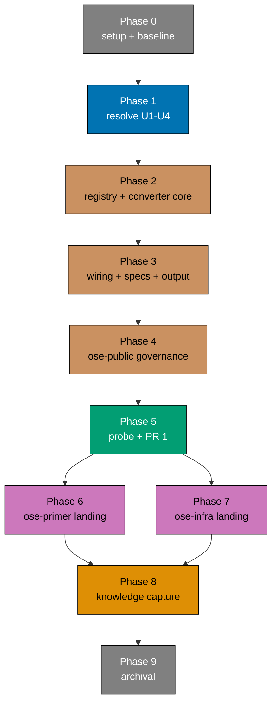

# Delivery Checklist — Adopt a Cursor Platform Binding

> **Legend** — `[AI]`: an agent performs the step (the default; unmarked steps are `[AI]`).
> `[HUMAN]`: only a human can do it (physical action, out-of-band approval, real-secret or
> privileged-credential handling). `[AI+HUMAN]`: agent prepares, human approves or finishes.
>
> **Phase Gate** — every phase ends with a `### Phase N Gate` (must-pass verification) plus a
> `> **Pause Safety**:` note (the safe-to-stop state and the single command to resume). A phase
> is not complete until its gate is green; do not start phase N+1 while any gate check fails.
>
> **Three repositories.** This plan lands the same outcome in `ose-public`, `ose-primer`, and
> `ose-infra`. Unless a step names a repository explicitly, it runs in the repository named by its
> phase heading. Paths are always repo-relative.
>
> **Important**: Fix ALL failures found during quality gates, not just those caused by your
> changes. This follows the root cause orientation principle — proactively fix preexisting errors
> encountered during work. Do not defer or skip existing issues. Commit preexisting fixes
> separately with appropriate conventional commit messages.

## Worktree

Worktree path: `worktrees/adopt-cursor-platform-binding/`

Optional manual pre-provisioning (run from repo root):

```bash
claude --worktree adopt-cursor-platform-binding
```

The plan-execution Step 0 gate enters this worktree by default: it auto-provisions from the latest
`origin/main` when missing, syncs with `origin/main` before implementing, and prompts before
deleting the worktree after the plan is archived and pushed.

See [Worktree Path Convention](../../../repo-governance/conventions/structure/worktree-path.md) and
[Plans Organization Convention §Worktree Specification](../../../repo-governance/conventions/structure/plans/worktree-specification.md#worktree-specification).

### Additional worktrees (sibling repositories)

The declared worktree above belongs to `ose-public` and carries delivery unit D1 (Phases 2-5). The
two sibling landings each get their own worktree, in their own repository, so the strict
1 worktree ↔ 1 branch ↔ 1 PR ↔ 1 delivery unit mapping holds:

| Repository   | Worktree                                                | Branch                          | Unit |
| ------------ | ------------------------------------------------------- | ------------------------------- | ---- |
| `ose-public` | `worktrees/adopt-cursor-platform-binding/`              | `adopt-cursor-platform-binding` | D1   |
| `ose-primer` | `<ose-primer>/worktrees/adopt-cursor-platform-binding/` | `adopt-cursor-platform-binding` | D2   |
| `ose-infra`  | `<ose-infra>/worktrees/adopt-cursor-platform-binding/`  | `adopt-cursor-platform-binding` | D3   |

`<ose-primer>` and `<ose-infra>` resolve to whatever those repositories' roots are on the executing
machine. **Their git topology is detected, never assumed** — see the topology-detection step at the
head of Phases 6 and 7 and `tech-docs.md` DD-13.

## Delivery Mode: worktree-to-pr

Work happens in the worktree declared above, and in each sibling repository's own worktree. Each
delivery unit integrates through a draft PR against that repository's `main`, runs the
[PR-Review Maker→Fixer Cycle](../../../repo-governance/workflows/pr/pr-review-quality-gate.md)
(3 sequential CI-gated cycles), and is merged by `[AI]` once the hardened preconditions hold.

**Plan-docs-only carve-out.** Phases 1, 8, and 9 touch only `plans/**` in `ose-public` and therefore
push direct to `origin main` from the primary checkout, opening no PR, per the
[plan-planning workflow](../../../repo-governance/workflows/plan/plan-planning.md). That is a
deliberate exception recorded in `tech-docs.md` DD-8, not an oversight.

**Archival-in-PR exception (DD-8 extension).** Under `worktree-to-pr`, archival (`git mv` to
`plans/done/`, README index updates) normally lands inside the delivery PR. This plan **defers**
archival to Phase 9 (plan-docs-only direct push) because PR 1 is a prerequisite for PRs 2 and 3 —
archiving inside PR 1 would declare the plan complete while two-thirds of its delivery units remain
unopened. See `tech-docs.md` DD-8 for the full rationale and the
[PR Review Quality Gate workflow §Done-Definition, Three-repo nuance](../../../repo-governance/workflows/pr/pr-review-quality-gate.md#done-definition-for--to-pr-modes).

See [Plans Organization Convention §Delivery Mode](../../../repo-governance/conventions/structure/plans/delivery-mode-the-four-modes.md#delivery-mode).

## Parallelization Model



**DAG in `blocks` / `blockedBy` terms**: `P0 → P1 → P2 → P3 → P4 → P5 → {P6 ‖ P7} → P8 → P9`.

**Concurrency is 2, not the default N=3.** Phases 6 and 7 are the only genuinely independent nodes —
different repositories, different git object stores, no shared file. Every other edge is a hard
dependency, because the shared `rhino-cli` emitter must exist and be merged before any sibling can
generate output. Declaring N=3 would misdescribe the DAG; there is no third node available to fill
the slot. Phase 9 (archival plus worktree removal) is the terminal cleanup node.

**Same-machine assumption.** All three repositories live on one shared disk under one home
directory, and other agents may operate concurrently. Never run a git-mutating agent in a primary
checkout that is not this plan's; stage explicit paths rather than `git add -A`.

### Delivery Boundaries

Every change-producing phase appears exactly once below with a declared route to `main`.
PR-creation, PR-Review-Cycle, `gh pr ready`, merge, and post-push CI-verification steps appear
**only** in the boundary phases (5, 6, 7).

| Phase(s) | Delivery unit                    | Repository   | Worktree / branch                                                            | PR opens                     |
| -------- | -------------------------------- | ------------ | ---------------------------------------------------------------------------- | ---------------------------- |
| 0        | — (local setup and baseline)     | all three    | primary checkouts; siblings read-only                                        | **no** — Phase 0 opens no PR |
| 1        | D0 — verification record         | `ose-public` | primary checkout on `main`                                                   | **no** — plan-docs carve-out |
| 2-5      | D1 — `ose-public` landing        | `ose-public` | `worktrees/adopt-cursor-platform-binding/` / `adopt-cursor-platform-binding` | **yes — PR 1, at Phase 5**   |
| 6        | D2 — `ose-primer` landing        | `ose-primer` | `<ose-primer>/worktrees/adopt-cursor-platform-binding/` / same branch name   | **yes — PR 2, at Phase 6**   |
| 7        | D3 — `ose-infra` landing         | `ose-infra`  | `<ose-infra>/worktrees/adopt-cursor-platform-binding/` / same branch name    | **yes — PR 3, at Phase 7**   |
| 8-9      | D4 — knowledge capture, archival | `ose-public` | primary checkout on `main`                                                   | **no** — plan-docs carve-out |

**Three PRs in total: exactly one per repository.** Phases 2-5 form one contiguous dependency chain
inside one repository, so grouping them into a single unit is permitted. Phases 6 and 7 are
independent and are **never** folded together to reduce the PR count — that would re-serialise work
the DAG declared independent.

## Standing Sections

These blocks are referenced by name from the phase gates below. Run them wherever a gate names them.

### Local Quality Gates (Before Push)

- [x] [AI] Run affected typecheck: `npx nx affected -t typecheck` — acceptance: exits 0
- [x] [AI] Run affected linting: `npx nx affected -t lint` — acceptance: exits 0
- [x] [AI] Run affected quick tests: `npx nx affected -t test:quick` — acceptance: exits 0
      (for `rhino-cli` this chains `typecheck`, `lint`, `test:unit`, `test:coverage`, `test:specs`)
- [x] [AI] Run `npx nx run rhino-cli:test:specs` — acceptance: exits 0 (chains
      `specs:structure-validation` then `specs:behavior:coverage`; this repo has no `specs:coverage`
      target on `rhino-cli`, so naming the real target avoids a vacuous pass)
- [x] [AI] Run `npx nx run rhino-cli:test:integration` — acceptance: exits 0 (this is the target that
      compiles and runs the cucumber suites under `tests/`)
- [x] [AI] Run `npx nx run rhino-cli:specs:gherkin-cardinality-validation` — acceptance: exits 0
- [x] [AI] Run `npx nx run rhino-cli:naming:harness-validation` — acceptance: exits 0
- [x] [AI] Fix ALL failures — including preexisting issues not caused by these changes
- [x] [AI] Re-run every failing check to confirm resolution — acceptance: zero failures

### Post-Push CI Verification

- [x] [AI] Push to this delivery unit's PR branch — acceptance: `git push` exits 0
- [x] [AI] Monitor the PR's check run, polling every **2 minutes** with a single
      `gh run view --json status,conclusion` per wakeup — never `gh run watch`, never a tight loop
      (see [CI Monitoring](../../../repo-governance/development/workflow/ci-monitoring.md))
- [x] [AI] Verify ALL CI checks pass — acceptance: every check's `conclusion` is `success`
- [x] [AI] If any CI check fails, fix the root cause and push a follow-up commit — never bypass
- [x] [AI] Repeat until ALL checks pass with zero failures
- [x] [AI] Do NOT proceed to the next phase until CI is fully green

### Commit Guidelines

- [x] [AI] Commit changes thematically — group related changes into logically cohesive commits
- [x] [AI] Follow Conventional Commits: `<type>(<scope>): <description>`, imperative, no period
- [x] [AI] Split domains into separate commits: Rust source, specs, governance docs, generated
      `.cursor/` output
- [x] [AI] Preexisting fixes get their own commits, separate from plan work
- [x] [AI] Do NOT bundle unrelated changes into a single commit

### Surface-Conditional Gates — declared not applicable

- **Rule-15 three-tester retest (web UI)**: **NOT APPLICABLE.** This plan adds no user-facing screen
  or component under `apps/` or `libs/`. `web-exploratory-tester`, `web-usability-tester`, and
  `web-design-tester` do not run.
- **Rule-16 API exploratory retest**: **NOT APPLICABLE.** No REST or GraphQL endpoint is added or
  changed. `api-exploratory-tester` does not run.
- **UI design funnel**: **NOT APPLICABLE.** Not a UI-bearing plan.
- **Syllabus record**: **NOT APPLICABLE.** Not a learning-bearing plan.
- **Substitute manual assertion**: the CLI evidence contract and the live Cursor subagent probe,
  specified in `tech-docs.md` and executed in Phases 3, 5, 6, and 7 with evidence committed under
  the plan's `evidence/` folder.

## Phase 0: Environment Setup and Baseline

> _Executor: repo-setup-manager_
>
> **No PR for this phase.** Phase 0 is local setup and baseline only: it opens no PR, pushes no
> branch, runs no PR-Review Maker→Fixer Cycle, and merges nothing — under every Delivery Mode. The
> earliest phase that may open a PR is **Phase 5** (the first delivery boundary, PR 1); any evidence
> file written here rides the Phase 1 direct push (plan-docs carve-out), not a PR.

- [x] [AI] Install dependencies in the `ose-public` root worktree: `npm install`
      — acceptance: exits 0, `node_modules/` synchronized
- [x] [AI] Converge the full polyglot toolchain in the `ose-public` root worktree:
      `npm run doctor -- --fix` — acceptance: exits 0 with no unresolved drift
- [x] [AI] Confirm the Rust toolchain builds every target:
      `cargo check --manifest-path apps/rhino-cli/Cargo.toml --all-targets`
      — acceptance: exits 0
- [x] [AI] Record the `ose-public` unit baseline: `npx nx run rhino-cli:test:quick`
      — acceptance: exits 0; if it does not, record every preexisting failure verbatim in this
      checklist before proceeding
- [x] [AI] Record the `ose-public` integration baseline: `npx nx run rhino-cli:test:integration`
      — acceptance: exits 0; preexisting failures recorded verbatim
- [x] [AI] Resolve all preexisting failures before proceeding
      — acceptance: both commands above exit 0 with zero unresolved failures
- [x] [AI] Create the evidence folder:
      `mkdir -p plans/in-progress/adopt-cursor-platform-binding/evidence`
      — acceptance: `test -d plans/in-progress/adopt-cursor-platform-binding/evidence` returns 0
      (returned non-zero before this step)
- [x] [AI] Record the three-repo baseline into
      `plans/in-progress/adopt-cursor-platform-binding/evidence/phase-0-baseline.txt`, capturing for
      **each** of `ose-public`, `ose-primer`, `ose-infra`: the absolute repository root, the full
      output of `git worktree list` (the topology marker), the non-README agent count under
      `.claude/agents/`, and the output of `test -e .cursor; echo $?`
      — acceptance: the file names all three repositories; the agent counts read 90, 64, 53; every
      `test -e .cursor` line reads `1` (absent). A count that differs from 90/64/53 means the roster
      moved since authoring — record the new number and carry it forward instead of the old one.
- [x] [AI] Record the per-repository registry baseline into the same evidence file, running in each
      repository: `grep -c "tier: generated" repo-config.yml` and
      `grep -c "tier: native" repo-config.yml`
      — acceptance: each repository reads `2` generated and `7` native. Falsifiable in both
      directions: after the Phase 2 / 6 / 7 flip the same commands read `3` and `6`.
- [x] [AI] Record the harness feature-file baseline in each repository:
      `/bin/ls -1 specs/apps/rhino/behavior/rhino-cli/gherkin/harness/*.feature | wc -l`
      — acceptance: each reads `10`. This is a whole-plan invariant, not a phase-scoped one:
      `harness/` is never written to by this plan (Phase 0 through Phase 9, all three repos) and
      must still read `10` at the plan's final gate. Use `/bin/ls`, not the shell's `ls` alias,
      whose OSC-8 hyperlinks corrupt piped output.
- [x] [AI] Record the dedicated `cursor-binding/` directory baseline in each repository:
      `test -d specs/apps/rhino/behavior/rhino-cli/gherkin/cursor-binding; echo $?`
      — acceptance: each reads `1` (directory does not exist yet). This directory is created in
      Phase 3 and becomes the sole home for `cursor-binding.feature` — never `harness/`.
- [x] [AI] Confirm the shared-source byte-identity starting point across the three repositories by
      comparing checksums of `apps/rhino-cli/src/application/agents/bindings.rs`,
      `apps/rhino-cli/src/application/agents/converter.rs`, and
      `specs/apps/rhino/behavior/rhino-cli/gherkin/harness/agents-bindings.feature`
      — acceptance: each file's checksum is identical across all three repositories; any mismatch is
      a pre-existing byte-identity break that must be recorded and resolved before Phase 2
- [x] [AI] Confirm `learnings.md` carries its mandatory H1:
      `grep -c "^# Learnings: adopt-cursor-platform-binding" plans/in-progress/adopt-cursor-platform-binding/learnings.md`
      — acceptance: returns `1`. Falsifiable: returns `0` if the H1 is lost, which would fail
      markdownlint MD041 on the plan's first commit.

### Phase 0 Gate

> All checks below must pass before starting Phase 1.

- [x] [AI] `npm install` exited 0 and `npm run doctor -- --fix` reports no unresolved drift
- [x] [AI] `npx nx run rhino-cli:test:quick` and `npx nx run rhino-cli:test:integration` both exit 0
      in `ose-public`, with zero unresolved preexisting failures
- [x] [AI] `evidence/phase-0-baseline.txt` exists and records all three repositories' roots,
      topologies, agent counts, `.cursor` absence, registry counts, and feature-file counts
- [x] [AI] The three shared-source checksums match across all three repositories
- [x] [AI] Nothing was pushed and no PR exists for this branch — run both, reading the printed
      number (never `&&`-chaining, since `grep -c` exits 1 on a zero count):
      `git ls-remote --heads origin "$(git branch --show-current)" | grep -c .` returns `0`, and
      `gh pr list --head "$(git branch --show-current)" --json number --jq 'length'` returns `0`.
      Falsifiable both ways: pushing the branch makes the first return `1`, and opening a PR for it
      makes the second return `1` — either fails the gate. Local commits are allowed (evidence
      artifacts ride the Phase 1 push); what is forbidden is a push and a PR.

> **Pause Safety**: only the local toolchain was verified and the three-repo baseline recorded — no
> feature work exists, nothing is pushed, and no PR exists. Safe to stop indefinitely. To resume:
> re-run `npx nx run rhino-cli:test:quick` and confirm it is still clean.

## Phase 1: Resolve the Four Unknowns

> _Repository: `ose-public`, primary checkout on `main` (plan-docs-only carve-out)._
>
> **No PR for this phase.** It writes only inside the plan folder and pushes direct to `origin main`.
> No emitter code is written until every unknown below is either verified or explicitly recorded as
> having fallen back to its stated fallback.

- [x] [AI] Create `plans/in-progress/adopt-cursor-platform-binding/verification.md` _New file_ with
      an H1 `# Cursor Verification Record` and one `## U1` … `## U4` section per unknown, each
      carrying **Question**, **Method**, **Finding**, **Confidence label**, **Source URL + access
      date**, and **Fallback taken? yes/no**
      — acceptance: `grep -c "^## U[1-4]" plans/in-progress/adopt-cursor-platform-binding/verification.md`
      returns `4`. Falsifiable: the file does not exist before this step, so the same command errors
      or returns `0`.
  - _Suggested executor: `web-researcher` for the research itself_
- [x] [AI] Resolve **U1 — the canonical Cursor model-ID slug for Composer 2.5** by delegating to
      `web-researcher` against Cursor's model and subagent documentation, requiring two
      corroborating first-party sources
      — acceptance: `## U1` records either a `[Web-cited]` slug with both URLs and access dates, or
      the fallback slug explicitly labelled `[Unverified]`
- [x] [AI] Resolve **U2 — whether a bracket parameter suffix is accepted inside an agent file's
      `model:` field** in the same research pass
      — acceptance: `## U2` records a `[Web-cited]` answer, or records the fallback "emit the bare
      slug" together with one sentence naming the residual fast-toggle exposure that fallback leaves
- [x] [AI] Resolve **U3 — what Cursor does with an unrecognised `model:` value such as `sonnet`**
      via `web-researcher` documentation survey only (the empirical scratch-agent probe described in
      `tech-docs.md` is **deferred to Phase 5** — the live subagent session there is the authoritative
      runtime check)
      — acceptance: `## U3` records a `[Web-cited]` answer or an explicit `[Unverified]` label, plus
      a **Deferred to Phase 5** line naming the empirical probe; a guess presented as fact fails this
      step
- [x] [AI] Resolve **U4 — whether the two staff-confirmed defects are fixed in the installed Cursor
      version** by re-checking the Cursor changelog and recording the installed version string
      — acceptance: `## U4` records the changelog verdict, the installed version string, and the
      access date
- [x] [AI] Write the two decided model literals into `tech-docs.md` DD-4's mapping table, replacing
      the placeholder sentence `The exact literals are set in Phase 1, not here.`
      — acceptance: `grep -c "The exact literals are set in Phase 1" tech-docs.md` returns `0`.
      Falsifiable: it returns `1` before this step.
- [x] [AI] If any unknown landed on its fallback, attach an `[Unverified]` label beside the
      corresponding claim in `README.md`, `brd.md`, and `tech-docs.md`
      — acceptance: every fallback-derived claim carries a visible `[Unverified]` label; if no
      fallback was taken, `verification.md` records the sentence `No fallback taken` instead
- [x] [AI] Run the markdown gates over the plan folder: `npm run lint:md:fix`
      — acceptance: exits 0 and leaves the plan folder clean
- [x] [AI] Commit and push to `origin main` from the primary checkout, staging only
      `plans/in-progress/adopt-cursor-platform-binding/` (never `git add -A`; sibling repositories
      and other plan folders carry unrelated WIP)
      — acceptance: `git push` exits 0; `git status --short plans/in-progress/adopt-cursor-platform-binding/`
      prints nothing

### Phase 1 Gate

> All checks below must pass before starting Phase 2.

- [x] [AI] `grep -c "^## U[1-4]" plans/in-progress/adopt-cursor-platform-binding/verification.md`
      returns `4`
- [x] [AI] Every `## U` section contains a **Confidence label** line reading exactly one of
      `[Web-cited]`, `[Unverified]`, or `[Judgment call]` — a section with no label fails the gate
- [x] [AI] `grep -c "The exact literals are set in Phase 1" tech-docs.md` returns `0`
- [x] [AI] `npm run lint:md:fix` exits 0 and leaves no unstaged changes in the plan folder
- [x] [AI] No PR was opened for this work —
      `gh pr list --head "$(git branch --show-current)" --json number --jq 'length'` returns `0`

> **Pause Safety**: the plan folder now carries a verification record and the decided model
> literals; no file outside `plans/` has changed and no worktree exists yet. Safe to stop
> indefinitely. To resume: re-read `verification.md` and confirm all four unknowns are terminal.

## Phase 2: Registry Flip and Converter Core (`ose-public`)

> _Repository: `ose-public`, in `worktrees/adopt-cursor-platform-binding/`. Start of delivery unit D1._
>
> **No PR here.** D1's PR opens at Phase 5. This phase is a pure Rust unit layer: it authors no
> `.feature` file and adds no cucumber target, so `rhino-cli:specs:behavior:coverage` stays at its
> Phase 0 value throughout and the phase can end with every gate green.
>
> **Why unit tests live in `src/`, not `tests/`**: `rhino-cli:test:unit` runs
> `cargo test … --lib --test repo_governance --test env_contract --test repo_config_data_driven`
> [Repo-grounded — `apps/rhino-cli/project.json`]. A new file under `tests/` would **not** be
> compiled by that target, so a RED step pointing there could never go red. Cycles A, C, and D
> therefore place their tests in a `#[cfg(test)] mod tests` block inside the new `cursor.rs`, which
> `--lib` does compile; Cycle B extends `repo_config_data_driven.rs`, which the target names
> explicitly.

- [x] [AI] Provision the worktree from the latest `origin/main`:
      `git worktree add worktrees/adopt-cursor-platform-binding -b adopt-cursor-platform-binding origin/main`
      — acceptance: `test -d worktrees/adopt-cursor-platform-binding` returns 0 (returned non-zero
      before), and `git -C worktrees/adopt-cursor-platform-binding branch --show-current` prints
      `adopt-cursor-platform-binding`
- [x] [AI] Initialise the toolchain for the new worktree: `npm install && npm run doctor -- --fix`
      — acceptance: both exit 0 (see
      [Worktree Toolchain Initialization](../../../repo-governance/development/workflow/worktree-setup.md))

### TDD Cycle A — the Cursor model-tier mapping

- [x] [AI] **RED**: create `apps/rhino-cli/src/application/agents/cursor.rs` _New file_ (sibling of
      `converter.rs`) holding only a `#[cfg(test)] mod tests` block with four tests _New tests_ —
      `cursor_model_maps_opus`, `cursor_model_maps_sonnet`, `cursor_model_maps_omitted`,
      `cursor_model_maps_haiku` — each calling `convert_cursor_model` and asserting the literals
      decided in Phase 1; declare the module by adding `pub mod cursor;` to
      `apps/rhino-cli/src/application/agents/mod.rs`
      — command: `cargo test --manifest-path apps/rhino-cli/Cargo.toml --lib cursor_model`
      — acceptance: compilation fails, reporting cannot find function `convert_cursor_model`. This
      cannot vacuously pass: `--lib` compiles the crate, so a missing symbol is a hard compile
      error, not a zero-test success.
  - _Suggested executor: `swe-rust-dev`_

  **Gherkin (underpins) →** "A thinking-grade agent pins Composer 2.5 with fast disabled",
  "An execution-grade agent pins Composer 2.5 with fast disabled", "An agent that omits the model
  field pins Composer 2.5 with fast disabled", "A fast-grade agent pins Composer 2.5 with fast disabled"

  ```gherkin
  Scenario: A thinking-grade agent pins Composer 2.5 with fast disabled
    Given a Claude agent whose frontmatter declares the thinking-grade model alias
    When the developer runs harness bindings generate
    Then the emitted Cursor agent frontmatter declares the non-fast Composer 2.5 model identifier
    And the emitted frontmatter carries no other model field
  ```

  ```gherkin
  Scenario: An execution-grade agent pins Composer 2.5 with fast disabled
    Given a Claude agent whose frontmatter declares the execution-grade model alias
    When the developer runs harness bindings generate
    Then the emitted Cursor agent frontmatter declares the non-fast Composer 2.5 model identifier
    And the emitted identifier is byte-identical to the thinking-grade agent's identifier
  ```

  ```gherkin
  Scenario: An agent that omits the model field pins Composer 2.5 with fast disabled
    Given a Claude agent whose frontmatter carries no model field
    When the developer runs harness bindings generate
    Then the emitted Cursor agent frontmatter declares the non-fast Composer 2.5 model identifier
    And no conversion warning is emitted for the absent model field
  ```

  ```gherkin
  Scenario: A fast-grade agent pins Composer 2.5 with fast disabled
    Given a Claude agent whose frontmatter declares the fast-grade model alias
    When the developer runs harness bindings generate
    Then the emitted Cursor agent frontmatter declares the non-fast Composer 2.5 model identifier
    And the emitted identifier is byte-identical to the thinking-grade agent's identifier
  ```

- [x] [AI] **GREEN**: implement `pub fn convert_cursor_model(claude_model: &str) -> String` in
      `apps/rhino-cli/src/application/agents/cursor.rs` as three explicit branches (`haiku` /
      `opus` / everything-else-including-absent), mirroring the shape of `convert_model` in
      `converter.rs`
      — command: `cargo test --manifest-path apps/rhino-cli/Cargo.toml --lib cursor_model`
      — acceptance: all four tests pass, and
      `cargo test --manifest-path apps/rhino-cli/Cargo.toml --lib` reports no newly failing test
- [x] [AI] **REFACTOR**: hoist the non-fast Composer 2.5 model-ID literal into a named `const` at the
      top of `cursor.rs` so a future model change edits one line, and document the full tier collapse
      in a `///` comment
      — command: `cargo test --manifest-path apps/rhino-cli/Cargo.toml --lib`
      — acceptance: all tests still pass and `npx nx run rhino-cli:lint` exits 0

### TDD Cycle B — the registry entry

- [x] [AI] **RED**: `apps/rhino-cli/tests/repo_config_data_driven.rs` is a cucumber binary
      (`harness = false` in `Cargo.toml`; its only entry point is
      `RepoConfigDataWorld::cucumber().fail_on_skipped().run_and_exit(feature_dir())`), so a plain
      `#[test]`-annotated function added to this file would never execute — libtest discovery is
      disabled and nothing else calls it. Do NOT add one. Instead: append AC-15's scenario verbatim
      to the existing single-scenario
      `specs/apps/rhino/behavior/rhino-cli/gherkin/repo-config/data-driven.feature` (do not create a
      second file in this directory), and add the matching `#[given]`/`#[when]`/`#[then]` step
      definitions `cursor_entry_declares_generated_tier` _New steps_ to
      `apps/rhino-cli/tests/repo_config_data_driven.rs`, asserting that the `cursor` entry in this
      repository's own `repo-config.yml` reports `tier == "generated"`, an agent directory of
      `.cursor/agents`, and a mirror source of `.claude/agents`
      — command: `cargo test --manifest-path apps/rhino-cli/Cargo.toml --test repo_config_data_driven`
      — acceptance: the new scenario fails (reported by cucumber, not skipped) against the current
      `tier: native` entry. Falsifiable both ways: with the flip applied it passes; reverting the
      flip makes it fail again.
  - _Suggested executor: `swe-rust-dev`_

  **Gherkin (underpins) →** "The cursor registry entry declares the generated tier and its mirror
  source" — this cycle establishes the fact at the unit level only; Phase 3 Cycle T adds the actual
  `cursor_binding.rs` binding that lets the aggregate suite report this scenario as passing

  ```gherkin
  Scenario: The cursor registry entry declares the generated tier and its mirror source
    Given the harness registry section of repo-config.yml
    When the cursor entry is read
    Then the entry declares the generated tier
    And the entry declares .cursor/agents as its agent directory
    And the entry declares .claude/agents as the source it mirrors
  ```

- [x] [AI] **GREEN**: rewrite the `cursor` entry in `repo-config.yml`, anchoring on the literal text
      `name: cursor` inside the `harness:` block (do not anchor on a line number), to:

  ```yaml
  - name: cursor
    tier: generated
    agent-dir: .cursor/agents
    mirrors: .claude/agents
    shadow: .cursor/rules
    instruction: [AGENTS.md, .cursor/rules]
  ```

  — command: `cargo test --manifest-path apps/rhino-cli/Cargo.toml --test repo_config_data_driven`
  — acceptance: the new test passes; `grep -c "tier: generated" repo-config.yml` returns `3` (it
  returned `2` at the Phase 0 baseline) and `grep -c "tier: native" repo-config.yml` returns `6`
  (it returned `7`)

- [x] [AI] **RED (specs_tree.rs regression)**: `apps/rhino-cli/tests/specs_tree.rs` is the sole
      other test file that loads this repository's own `repo-config.yml` via `find_root_from(None)`
      plus `repo_config::load` (confirmed the only hit via `grep -rn "find_root_from(None)\|repo_config::load" apps/rhino-cli/tests/*.rs`). Its
      `then_hb_generated_tier` and `then_hb_native_tier` step definitions hardcode the pre-flip tier
      counts and membership, so the registry rewrite in the GREEN step above breaks them
      — command: `cargo test --manifest-path apps/rhino-cli/Cargo.toml --test specs_tree`
      — acceptance: the run now fails with three assertion failures — `generated.len()` reports `3`
      against the hardcoded expectation of `2`, `native.len()` reports `6` against the hardcoded
      expectation of `7`, and the `native_names` loop panics on the missing `"cursor"` entry. This
      confirms the registry flip is a real regression against this second hardcoded test file, not
      only against `repo_config_data_driven.rs`.

- [x] [AI] **GREEN (specs_tree.rs regression)**: update the two hardcoded assertions in
      `apps/rhino-cli/tests/specs_tree.rs` to match the post-flip registry: in
      `then_hb_generated_tier`, change `assert_eq!(generated.len(), 2, ...)` to
      `assert_eq!(generated.len(), 3, ...)` and add `assert!(generated.contains(&"cursor"));`
      alongside the existing `opencode`/`amazonq` assertions; in `then_hb_native_tier`, change
      `assert_eq!(native.len(), 7, ...)` to `assert_eq!(native.len(), 6, ...)` and remove `"cursor"`
      from the expected-names array (`["copilot", "cursor", "windsurf", "junie", "antigravity", "pi", "aider"]` drops `"cursor"`)
      — command: `cargo test --manifest-path apps/rhino-cli/Cargo.toml --test specs_tree`
      — acceptance: all `specs_tree` scenarios pass, including `then_hb_all_11_listed` (unaffected —
      Cursor still appears among the 11 harness names regardless of tier)

- [x] [AI] **REFACTOR**: confirm no other registry entry was disturbed by diffing the `harness:`
      block against the Phase 0 baseline record
      — command: `npx nx run rhino-cli:test:unit`
      — acceptance: exits 0, and the number of entries under `harness:` is unchanged at 11
      — additional command: `cargo test --manifest-path apps/rhino-cli/Cargo.toml --test specs_tree`
      — additional acceptance: exits 0. `test:unit` does not compile or run `specs_tree.rs`
      [Repo-grounded — `apps/rhino-cli/project.json` `test:unit`'s command is `cargo test --lib
      --test repo_governance --test env_contract --test repo_config_data_driven`, no `specs_tree`
      target], so this second check is the only gate in this cycle that would catch a regression in
      that file.

### TDD Cycle C — the Cursor field policy

- [x] [AI] **RED**: add tests `cursor_policy_preserves_name`, `cursor_policy_drops_color_with_warning`
      and `cursor_policy_drops_tools_with_warning` _New tests_ to the `#[cfg(test)] mod tests` block
      in `apps/rhino-cli/src/application/agents/cursor.rs`, asserting a `CURSOR_FIELD_POLICY_TABLE`
      maps `name` to preserve, and `color` and `tools` to drop-with-warning
      — command: `cargo test --manifest-path apps/rhino-cli/Cargo.toml --lib cursor_policy`
      — acceptance: compilation fails with `cannot find value \`CURSOR_FIELD_POLICY_TABLE\``
  - _Suggested executor: `swe-rust-dev`_

  **Gherkin (underpins) →** "The Claude color field is dropped from the Cursor frontmatter",
  "The Claude name field is preserved in the Cursor frontmatter"

  ```gherkin
  Scenario: The Claude color field is dropped from the Cursor frontmatter
    Given a Claude agent whose frontmatter declares a named color
    When the developer runs harness bindings generate
    Then the emitted Cursor agent frontmatter contains no color field
    And a conversion warning records that color has no Cursor equivalent
  ```

  ```gherkin
  Scenario: The Claude name field is preserved in the Cursor frontmatter
    Given a Claude agent whose frontmatter declares a name
    When the developer runs harness bindings generate
    Then the emitted Cursor agent frontmatter declares the same name value
    And the emitted frontmatter declares the same description value
  ```

- [x] [AI] **GREEN**: define `CURSOR_FIELD_POLICY_TABLE` in
      `apps/rhino-cli/src/application/agents/cursor.rs`, reusing the field-action enum already used
      by `FIELD_POLICY_TABLE` in `converter.rs`, with `name` and `description` preserved, `model`
      translated, and `color`, `tools`, `skills`, `maxTurns` dropped with a warning
      — command: `cargo test --manifest-path apps/rhino-cli/Cargo.toml --lib cursor_policy`
      — acceptance: all three tests pass
- [x] [AI] **REFACTOR**: if the field-action enum is private to `converter.rs`, promote it into the
      shared `agents` module rather than duplicating it; leave `FIELD_POLICY_TABLE` itself untouched
      — command: `cargo test --manifest-path apps/rhino-cli/Cargo.toml --lib`
      — acceptance: all tests pass, `npx nx run rhino-cli:lint` exits 0, and the OpenCode policy
      table is byte-unchanged in `git diff`

### TDD Cycle D — the frontmatter encoder byte-shape

- [x] [AI] **RED**: add a test `cursor_encoder_emits_single_delimiter_and_verbatim_body` _New test_
      to the `#[cfg(test)] mod tests` block in
      `apps/rhino-cli/src/application/agents/cursor.rs`, feeding a fixture agent whose body holds a
      markdown heading and a fenced code block, and asserting the encoder output opens with `---`,
      carries exactly one closing `---` delimiter line, and reproduces the body byte-for-byte
      — command: `cargo test --manifest-path apps/rhino-cli/Cargo.toml --lib cursor_encoder`
      — acceptance: compilation fails with `cannot find function \`encode_cursor_agent\``
  - _Suggested executor: `swe-rust-dev`_

  **Gherkin (underpins) →** "The agent body is copied unchanged below the frontmatter"

  ```gherkin
  Scenario: The agent body is copied unchanged below the frontmatter
    Given a Claude agent whose body holds markdown headings and fenced code
    When the developer runs harness bindings generate
    Then the emitted Cursor agent body is byte-identical to the Claude agent body
    And the emitted file separates frontmatter from body with a single delimiter line
  ```

- [x] [AI] **GREEN**: implement `encode_cursor_agent` in
      `apps/rhino-cli/src/application/agents/cursor.rs`, emitting `name`, `description`, and `model`
      in that fixed order and omitting `readonly` and `is_background` per `tech-docs.md` DD-6
      — command: `cargo test --manifest-path apps/rhino-cli/Cargo.toml --lib cursor_encoder`
      — acceptance: the test passes
- [x] [AI] **REFACTOR**: extract the delimiter and field-order constants, and add `///` docs naming
      the three emitted fields and the two deliberately-omitted ones
      — command: `cargo test --manifest-path apps/rhino-cli/Cargo.toml --lib`
      — acceptance: all tests pass and `npx nx run rhino-cli:lint` exits 0

### Phase 2 Gate

> All checks below must pass before starting Phase 3.

- [x] [AI] `cargo test --manifest-path apps/rhino-cli/Cargo.toml --lib` exits 0 with the eight new
      `cursor.rs` unit tests passing
- [x] [AI] `npx nx run rhino-cli:test:unit` exits 0 — this target compiles `--lib` plus
      `repo_config_data_driven`, covering Cycles A, C, D and Cycle B respectively
- [x] [AI] `npx nx run rhino-cli:test:coverage` exits 0 — `application/agents/` is **not** in that
      target's `--ignore-filename-regex`, so the new `cursor.rs` must clear the
      `--fail-under-lines 90` threshold on its own unit tests
      [Repo-grounded — `apps/rhino-cli/project.json` `test:coverage`]
- [x] [AI] `npx nx run rhino-cli:typecheck` and `npx nx run rhino-cli:lint` both exit 0
- [x] [AI] `npx nx run rhino-cli:test:specs` exits 0, and
      `/bin/ls -1 specs/apps/rhino/behavior/rhino-cli/gherkin/harness/*.feature | wc -l` still reads
      `10` — no `.feature` file was added in this phase, so behavior coverage must not have moved.
      This invariant now holds for the whole plan, not just this phase: `harness/` is a fixed,
      untouched directory for the plan's full lifetime — the new `cursor-binding.feature` lands in
      its own dedicated `cursor-binding/` directory instead (see Phase 3)
- [x] [AI] `grep -c "tier: generated" repo-config.yml` returns `3` and
      `grep -c "tier: native" repo-config.yml` returns `6`
- [x] [AI] `test -e .cursor; echo $?` still prints `1` — no generated output exists yet, because the
      emitter is not wired into `harness bindings generate` until Phase 3
- [x] [AI] No PR exists for this branch —
      `gh pr list --head adopt-cursor-platform-binding --json number --jq 'length'` returns `0`

> **Pause Safety**: the worktree holds a compiling, fully unit-tested Cursor converter core and a
> flipped registry entry, but nothing emits or validates `.cursor/` yet, so the tree is
> self-consistent and every gate is green. Safe to stop indefinitely. To resume:
> `npx nx run rhino-cli:test:quick` in the worktree.

## Phase 3: Wiring, Specs, and Generated Output (`ose-public`)

> _Repository: `ose-public`, in `worktrees/adopt-cursor-platform-binding/`. Continues delivery unit D1._
>
> **No PR here.** D1's PR opens at Phase 5.
>
> **Why cucumber tests run under a different target**: `rhino-cli:test:integration` runs
> `cargo test --manifest-path apps/rhino-cli/Cargo.toml --tests`
> [Repo-grounded — `apps/rhino-cli/project.json`], and `Cargo.toml` declares each cucumber suite as
> an explicit `[[test]]` block with `harness = false`. A new `tests/cursor_binding.rs` without its
> own `[[test]]` block would be auto-discovered under the **default** libtest harness, where
> cucumber's async `main` never runs and the file would report zero tests and exit 0 — a vacuous
> pass. The `[[test]]` block below is therefore load-bearing, not boilerplate.

### Phase 3 setup — the cucumber target and its falsifiability check

- [x] [AI] Add the cucumber test target to `apps/rhino-cli/Cargo.toml`, beside the existing
      `[[test]]` blocks:

  ```toml
  [[test]]
  name = "cursor_binding"
  harness = false
  ```

  — command: `cargo test --manifest-path apps/rhino-cli/Cargo.toml --test cursor_binding --no-run`
  — acceptance: the command reports `error: no test target named \`cursor_binding\`` **before** this
  step and progresses past target resolution after it

- [x] [AI] Create `apps/rhino-cli/tests/cursor_binding.rs` _New file_ with a `CursorWorld` struct
      reusing the TempDir-rooted git-fixture pattern already used by the existing harness-binding
      cucumber suite under `apps/rhino-cli/tests/`, a `main` that runs the feature directory with
      `.fail_on_skipped()` enabled, and a dedicated `feature_dir()` function mirroring
      `apps/rhino-cli/tests/agents.rs`'s own `feature_dir()` exactly, with only the path segment
      changed:

  ```rust
  fn feature_dir() -> PathBuf {
      let manifest = PathBuf::from(env!("CARGO_MANIFEST_DIR"));
      manifest
          .join("../../specs/apps/rhino/behavior/rhino-cli/gherkin/cursor-binding")
          .canonicalize()
          .expect("feature dir resolvable")
  }
  ```

  This gives `cursor_binding.rs` its own **dedicated** leaf directory
  (`specs/apps/rhino/behavior/rhino-cli/gherkin/cursor-binding/`, sibling to `harness/`, never
  nested inside it) — required because `agents.rs`'s `feature_dir()` above resolves to the entire
  `harness/` directory and cucumber-rs 0.23.0's directory-mode loading recursively discovers every
  `.feature` file under it; a `cursor-binding.feature` placed inside `harness/` would be
  auto-discovered by `agents.rs`'s own `.fail_on_skipped()` run with zero matching step
  definitions, permanently failing `npx nx run rhino-cli:test:integration`. The shared
  model-tier scaffolding every generate-based
  scenario in Cycles E1 through E4 (below) reuses: a `build_model_tier_agent` helper that writes
  a fixture Claude agent whose frontmatter carries a caller-supplied model-tier alias (or omits
  `model:` entirely when none is supplied), the
  `Given a Claude agent whose frontmatter declares the <tier> model alias` step, the
  `Given a Claude agent whose frontmatter carries no model field` step, and the single
  `When the developer runs harness bindings generate` step. This scaffolding is
  non-Gherkin-tagged per the
  [Gherkin-Tagged Delivery Steps rule](../../../repo-governance/development/workflow/test-driven-development.md#gherkin-tagged-delivery-steps)
  — it defines no `Then`/`And` bodies and binds no scenario by itself; Cycles E1 through E4 each
  add their own single scenario's `Then`/`And` steps on top of it
  — command: `cargo test --manifest-path apps/rhino-cli/Cargo.toml --test cursor_binding --no-run`
  — acceptance: compiles with the new `Given`/`When` steps registered. `.fail_on_skipped()` is
  mandatory: without it an unimplemented step is reported as skipped and the suite still exits
  0, which would make every RED step below vacuous.
  - _Suggested executor: `swe-rust-dev`_

- [x] [AI] Author `specs/apps/rhino/behavior/rhino-cli/gherkin/cursor-binding/cursor-binding.feature`
      _New file_ (create the new dedicated `cursor-binding/` directory first — sibling to
      `harness/`, never nested inside it) containing all **19** scenarios from
      `prd.md §Acceptance Criteria`, verbatim, under a single `Feature:` heading
      — command: `/bin/ls -1 specs/apps/rhino/behavior/rhino-cli/gherkin/cursor-binding/*.feature | wc -l`
      — acceptance: reads `1` (the directory did not exist at the Phase 0 baseline; `harness/`'s own
      `*.feature` count stays pinned at `10`, unaffected by this step — see Phase 0 baseline); and
      `grep -c "^  Scenario:" specs/apps/rhino/behavior/rhino-cli/gherkin/cursor-binding/cursor-binding.feature`
      returns `19`
- [x] [AI] Confirm the new feature file passes the cardinality gate:
      `npx nx run rhino-cli:specs:gherkin-cardinality-validation`
      — acceptance: exits 0. Falsifiable: adding a second primary `Given` to any scenario makes it
      exit non-zero.
- [x] [AI] Confirm the aggregate binder is genuinely red before any step definition exists:
      `npx nx run rhino-cli:specs:behavior:coverage`
      — acceptance: exits **non-zero**, naming `cursor-binding.feature` scenarios as uncovered.
      Falsifiable in both directions: it exited 0 at the Phase 0 baseline and must exit 0 again at
      this phase's gate.
- [x] [AI] Verify the per-scenario name filter used by every cycle below actually discriminates, by
      running it against a scenario that has no step definitions yet:
      `cargo test --manifest-path apps/rhino-cli/Cargo.toml --test cursor_binding -- --name "Generating twice is byte-identical"`
      — acceptance: exits non-zero. If it exits 0 at this point the filter or `.fail_on_skipped()`
      is misconfigured and every RED step below would be vacuous — stop and fix before proceeding.

### TDD Cycle E1 — a thinking-grade agent pins Composer 2.5 with fast disabled

- [x] [AI] **RED**: add this scenario's `Then`/`And` step definitions to
      `apps/rhino-cli/tests/cursor_binding.rs`, reusing the shared fixture builder and `Given`/`When`
      steps added above, leaving each body as `todo!("bind in GREEN")`
      — command: `cargo test --manifest-path apps/rhino-cli/Cargo.toml --test cursor_binding -- --name "A thinking-grade agent pins Composer 2.5 with fast disabled"`
      — acceptance: exits non-zero with a panic from `todo!`

  **Gherkin (binds) →** "A thinking-grade agent pins Composer 2.5 with fast disabled"

  ```gherkin
  Scenario: A thinking-grade agent pins Composer 2.5 with fast disabled
    Given a Claude agent whose frontmatter declares the thinking-grade model alias
    When the developer runs harness bindings generate
    Then the emitted Cursor agent frontmatter declares the non-fast Composer 2.5 model identifier
    And the emitted frontmatter carries no other model field
  ```

- [x] [AI] **GREEN**: implement the step bodies by invoking the real binary path through the same
      in-process entry point the existing harness-binding suite uses, and add the Cursor branch to
      `generate_bindings` in `apps/rhino-cli/src/commands/harness_generate_bindings.rs` — extend
      `GenerateBindingsArgs` with a `--cursor` flag, accept `"cursor"` in the `--harness` value
      parser (which today accepts only `"opencode"` and `"amazonq"`), and include Cursor in the
      default all-harnesses path. This is the cycle that wires the CLI plumbing Cycles E2 through E4
      (below) depend on.
      — command: `cargo test --manifest-path apps/rhino-cli/Cargo.toml --test cursor_binding -- --name "A thinking-grade agent pins Composer 2.5 with fast disabled"`
      — acceptance: exits 0
  - _Suggested executor: `swe-rust-dev`_
- [x] [AI] **REFACTOR**: align the new `--cursor` flag and value-parser branch with the existing
      `--opencode`/`--amazonq` code shape (same argument ordering, same match-arm style), and
      confirm nothing regressed
      — command: `cargo test --manifest-path apps/rhino-cli/Cargo.toml --test cursor_binding`
      — acceptance: no regression; `npx nx run rhino-cli:lint` exits 0

### TDD Cycle E2 — an execution-grade agent pins Composer 2.5 with fast disabled

- [x] [AI] **RED**: add this scenario's `Then`/`And` step definitions to
      `apps/rhino-cli/tests/cursor_binding.rs`, reusing the shared fixture builder and `Given`/`When`
      steps, leaving each body as `todo!("bind in GREEN")`
      — command: `cargo test --manifest-path apps/rhino-cli/Cargo.toml --test cursor_binding -- --name "An execution-grade agent pins Composer 2.5 with fast disabled"`
      — acceptance: exits non-zero with a panic from `todo!`

  **Gherkin (binds) →** "An execution-grade agent pins Composer 2.5 with fast disabled"

  ```gherkin
  Scenario: An execution-grade agent pins Composer 2.5 with fast disabled
    Given a Claude agent whose frontmatter declares the execution-grade model alias
    When the developer runs harness bindings generate
    Then the emitted Cursor agent frontmatter declares the non-fast Composer 2.5 model identifier
    And the emitted identifier is byte-identical to the thinking-grade agent's identifier
  ```

- [x] [AI] **GREEN**: assert the emitted identifier equals the thinking-grade agent's identifier
      from Cycle E1 — no new production branch is expected here, since `convert_cursor_model`'s tier
      collapse (Cycle A) already resolves both aliases to the same literal; this scenario proves that
      collapse holds end-to-end through the CLI path Cycle E1 wired
      — command: `cargo test --manifest-path apps/rhino-cli/Cargo.toml --test cursor_binding -- --name "An execution-grade agent pins Composer 2.5 with fast disabled"`
      — acceptance: exits 0
- [x] [AI] **REFACTOR**: confirm no duplicate fixture-agent construction crept in between the two
      scenarios' step bodies
      — command: `cargo test --manifest-path apps/rhino-cli/Cargo.toml --test cursor_binding`
      — acceptance: no regression

### TDD Cycle E3 — an agent that omits the model field pins Composer 2.5 with fast disabled

- [x] [AI] **RED**: add this scenario's `Then`/`And` step definitions to
      `apps/rhino-cli/tests/cursor_binding.rs`, reusing the shared fixture builder (called with no
      tier alias) and the `Given a Claude agent whose frontmatter carries no model field` /
      `When the developer runs harness bindings generate` steps, leaving each body as
      `todo!("bind in GREEN")`
      — command: `cargo test --manifest-path apps/rhino-cli/Cargo.toml --test cursor_binding -- --name "An agent that omits the model field pins Composer 2.5 with fast disabled"`
      — acceptance: exits non-zero with a panic from `todo!`

  **Gherkin (binds) →** "An agent that omits the model field pins Composer 2.5 with fast disabled"

  ```gherkin
  Scenario: An agent that omits the model field pins Composer 2.5 with fast disabled
    Given a Claude agent whose frontmatter carries no model field
    When the developer runs harness bindings generate
    Then the emitted Cursor agent frontmatter declares the non-fast Composer 2.5 model identifier
    And no conversion warning is emitted for the absent model field
  ```

- [x] [AI] **GREEN**: confirm the omitted-field branch of `convert_cursor_model` (Cycle A) reaches
      the CLI path without emitting a warning
      — command: `cargo test --manifest-path apps/rhino-cli/Cargo.toml --test cursor_binding -- --name "An agent that omits the model field pins Composer 2.5 with fast disabled"`
      — acceptance: exits 0
- [x] [AI] **REFACTOR**: confirm the conversion-report assertion helper used here matches the one
      Cycle G will reuse for its own warning check, rather than diverging
      — command: `cargo test --manifest-path apps/rhino-cli/Cargo.toml --test cursor_binding`
      — acceptance: no regression

### TDD Cycle E4 — a fast-grade agent pins Composer 2.5 with fast disabled

- [x] [AI] **RED**: add this scenario's `Then`/`And` step definitions to
      `apps/rhino-cli/tests/cursor_binding.rs`, reusing the shared fixture builder and `Given`/`When`
      steps, leaving each body as `todo!("bind in GREEN")`
      — command: `cargo test --manifest-path apps/rhino-cli/Cargo.toml --test cursor_binding -- --name "A fast-grade agent pins Composer 2.5 with fast disabled"`
      — acceptance: exits non-zero with a panic from `todo!`

  **Gherkin (binds) →** "A fast-grade agent pins Composer 2.5 with fast disabled"

  ```gherkin
  Scenario: A fast-grade agent pins Composer 2.5 with fast disabled
    Given a Claude agent whose frontmatter declares the fast-grade model alias
    When the developer runs harness bindings generate
    Then the emitted Cursor agent frontmatter declares the non-fast Composer 2.5 model identifier
    And the emitted identifier is byte-identical to the thinking-grade agent's identifier
  ```

- [x] [AI] **GREEN**: confirm the fast-grade branch of `convert_cursor_model` (Cycle A) reaches the
      CLI path and emits the same non-fast literal as every other tier
      — command: `cargo test --manifest-path apps/rhino-cli/Cargo.toml --test cursor_binding -- --name "A fast-grade agent pins Composer 2.5 with fast disabled"`
      — acceptance: exits 0
- [x] [AI] **REFACTOR**: run all four model-tier scenarios together and confirm none regressed
      — command: `cargo test --manifest-path apps/rhino-cli/Cargo.toml --test cursor_binding -- --name "pins"`
      — acceptance: exits 0 reporting `4` scenarios passed

### TDD Cycle F — one emitted file per Claude agent

- [x] [AI] **RED**: add the step definitions for this scenario to
      `apps/rhino-cli/tests/cursor_binding.rs` with `todo!` bodies
      — command: `cargo test --manifest-path apps/rhino-cli/Cargo.toml --test cursor_binding -- --name "Generating emits one Cursor agent file per Claude agent"`
      — acceptance: exits non-zero

  **Gherkin (binds) →** "Generating emits one Cursor agent file per Claude agent"

  ```gherkin
  Scenario: Generating emits one Cursor agent file per Claude agent
    Given a repository whose .claude/agents/ directory holds three agent definitions and a README
    When the developer runs harness bindings generate
    Then the command exits successfully
    And .cursor/agents/ holds exactly three agent files
    And each emitted filename matches its Claude source filename
  ```

- [x] [AI] **GREEN**: implement the directory walk in the Cursor emitter so it writes one
      `.cursor/agents/<name>.md` per `.claude/agents/<name>.md`
      — command: `cargo test --manifest-path apps/rhino-cli/Cargo.toml --test cursor_binding -- --name "Generating emits one Cursor agent file per Claude agent"`
      — acceptance: exits 0
- [x] [AI] **REFACTOR**: reuse the existing directory-walk helper rather than adding a second one
      — command: `cargo test --manifest-path apps/rhino-cli/Cargo.toml --test cursor_binding`
      — acceptance: no previously-passing scenario regressed

### TDD Cycle G — the color field is dropped

- [x] [AI] **RED**: add this scenario's step definitions with `todo!` bodies
      — command: `cargo test --manifest-path apps/rhino-cli/Cargo.toml --test cursor_binding -- --name "The Claude color field is dropped from the Cursor frontmatter"`
      — acceptance: exits non-zero

  **Gherkin (binds) →** "The Claude color field is dropped from the Cursor frontmatter"

  ```gherkin
  Scenario: The Claude color field is dropped from the Cursor frontmatter
    Given a Claude agent whose frontmatter declares a named color
    When the developer runs harness bindings generate
    Then the emitted Cursor agent frontmatter contains no color field
    And a conversion warning records that color has no Cursor equivalent
  ```

- [x] [AI] **GREEN**: wire `CURSOR_FIELD_POLICY_TABLE` into the emitter so `color` is dropped and a
      warning is recorded on the conversion report
      — command: `cargo test --manifest-path apps/rhino-cli/Cargo.toml --test cursor_binding -- --name "The Claude color field is dropped from the Cursor frontmatter"`
      — acceptance: exits 0
- [x] [AI] **REFACTOR**: confirm the warning text names Cursor, not OpenCode, and carries the agent
      filename
      — command: `cargo test --manifest-path apps/rhino-cli/Cargo.toml --test cursor_binding`
      — acceptance: no regression

### TDD Cycle H — the name and description are preserved

- [x] [AI] **RED**: add this scenario's step definitions with `todo!` bodies
      — command: `cargo test --manifest-path apps/rhino-cli/Cargo.toml --test cursor_binding -- --name "The Claude name field is preserved in the Cursor frontmatter"`
      — acceptance: exits non-zero

  **Gherkin (binds) →** "The Claude name field is preserved in the Cursor frontmatter"

  ```gherkin
  Scenario: The Claude name field is preserved in the Cursor frontmatter
    Given a Claude agent whose frontmatter declares a name
    When the developer runs harness bindings generate
    Then the emitted Cursor agent frontmatter declares the same name value
    And the emitted frontmatter declares the same description value
  ```

- [x] [AI] **GREEN**: emit `name` and `description` verbatim through the preserve policy
      — command: `cargo test --manifest-path apps/rhino-cli/Cargo.toml --test cursor_binding -- --name "The Claude name field is preserved in the Cursor frontmatter"`
      — acceptance: exits 0
- [x] [AI] **REFACTOR**: confirm a description containing a colon or a quote round-trips unchanged by
      extending the fixture, not by adding a second scenario
      — command: `cargo test --manifest-path apps/rhino-cli/Cargo.toml --test cursor_binding`
      — acceptance: no regression

### TDD Cycle I — the body is copied unchanged

- [x] [AI] **RED**: add this scenario's step definitions with `todo!` bodies
      — command: `cargo test --manifest-path apps/rhino-cli/Cargo.toml --test cursor_binding -- --name "The agent body is copied unchanged below the frontmatter"`
      — acceptance: exits non-zero

  **Gherkin (binds) →** "The agent body is copied unchanged below the frontmatter"

  ```gherkin
  Scenario: The agent body is copied unchanged below the frontmatter
    Given a Claude agent whose body holds markdown headings and fenced code
    When the developer runs harness bindings generate
    Then the emitted Cursor agent body is byte-identical to the Claude agent body
    And the emitted file separates frontmatter from body with a single delimiter line
  ```

- [x] [AI] **GREEN**: route the body through `encode_cursor_agent` from Cycle D without
      re-serialising it
      — command: `cargo test --manifest-path apps/rhino-cli/Cargo.toml --test cursor_binding -- --name "The agent body is copied unchanged below the frontmatter"`
      — acceptance: exits 0
- [x] [AI] **REFACTOR**: assert byte equality with a checksum rather than a string compare so a
      trailing-newline difference cannot slip through
      — command: `cargo test --manifest-path apps/rhino-cli/Cargo.toml --test cursor_binding`
      — acceptance: no regression

### TDD Cycle J — generation is idempotent

- [x] [AI] **RED**: add this scenario's step definitions with `todo!` bodies
      — command: `cargo test --manifest-path apps/rhino-cli/Cargo.toml --test cursor_binding -- --name "Generating twice is byte-identical"`
      — acceptance: exits non-zero

  **Gherkin (binds) →** "Generating twice is byte-identical"

  ```gherkin
  Scenario: Generating twice is byte-identical
    Given a repository whose Cursor mirror was already generated once
    When the developer runs harness bindings generate a second time
    Then the command exits successfully
    And every emitted Cursor agent file is byte-for-byte identical to the first emission
  ```

- [x] [AI] **GREEN**: make the emitter deterministic — sort the directory listing before writing and
      emit frontmatter fields in the fixed order set in Cycle D
      — command: `cargo test --manifest-path apps/rhino-cli/Cargo.toml --test cursor_binding -- --name "Generating twice is byte-identical"`
      — acceptance: exits 0
- [x] [AI] **REFACTOR**: confirm determinism holds when the source directory is enumerated in a
      different order by shuffling the fixture's creation order
      — command: `cargo test --manifest-path apps/rhino-cli/Cargo.toml --test cursor_binding`
      — acceptance: no regression

### TDD Cycle K — the README is not mirrored

- [x] [AI] **RED**: add this scenario's step definitions with `todo!` bodies
      — command: `cargo test --manifest-path apps/rhino-cli/Cargo.toml --test cursor_binding -- --name "The Claude agents README is not mirrored into the Cursor binding"`
      — acceptance: exits non-zero

  **Gherkin (binds) →** "The Claude agents README is not mirrored into the Cursor binding"

  ```gherkin
  Scenario: The Claude agents README is not mirrored into the Cursor binding
    Given a repository whose .claude/agents/ directory holds a README alongside its agent definitions
    When the developer runs harness bindings generate
    Then .cursor/agents/ holds no README file
    And every other Claude agent filename has a Cursor counterpart
  ```

- [x] [AI] **GREEN**: skip `README.md` in the emitter's directory walk, matching the existing
      `count_markdown_files` behaviour in `apps/rhino-cli/src/application/agents/sync_validator.rs`
      — command: `cargo test --manifest-path apps/rhino-cli/Cargo.toml --test cursor_binding -- --name "The Claude agents README is not mirrored into the Cursor binding"`
      — acceptance: exits 0
- [x] [AI] **REFACTOR**: extract the skip predicate into one shared helper so the emitter and the
      validator cannot drift apart on which filenames are ignored
      — command: `cargo test --manifest-path apps/rhino-cli/Cargo.toml --test cursor_binding`
      — acceptance: no regression

### TDD Cycle L — the emitter is roster-agnostic

- [x] [AI] **RED**: add this scenario's step definitions with `todo!` bodies
      — command: `cargo test --manifest-path apps/rhino-cli/Cargo.toml --test cursor_binding -- --name "The emitter mirrors whatever roster the repository holds"`
      — acceptance: exits non-zero

  **Gherkin (binds) →** "The emitter mirrors whatever roster the repository holds"

  ```gherkin
  Scenario: The emitter mirrors whatever roster the repository holds
    Given a repository whose .claude/agents/ directory holds a different number of agents than another repository
    When the developer runs harness bindings generate in that repository
    Then .cursor/agents/ holds exactly as many agent files as that repository's .claude/agents/ directory
    And no roster size is hard-coded in the emitter
  ```

- [x] [AI] **GREEN**: implement the step by building two fixtures of different sizes in one scenario
      and asserting each mirror matches its own source count; satisfy the second `And` with a
      source assertion that no integer literal appears in the emitter's count path
      — command: `cargo test --manifest-path apps/rhino-cli/Cargo.toml --test cursor_binding -- --name "The emitter mirrors whatever roster the repository holds"`
      — acceptance: exits 0. This is the scenario that lets the same feature file pass unchanged in
      a 90-agent, a 64-agent, and a 53-agent tree.
- [x] [AI] **REFACTOR**: name the two fixture sizes as constants in the test so the intent is legible
      — command: `cargo test --manifest-path apps/rhino-cli/Cargo.toml --test cursor_binding`
      — acceptance: no regression

### TDD Cycle M — a matching mirror passes validation

- [x] [AI] **RED**: add this scenario's step definitions with `todo!` bodies
      — command: `cargo test --manifest-path apps/rhino-cli/Cargo.toml --test cursor_binding -- --name "A Cursor mirror matching the generator passes validation"`
      — acceptance: exits non-zero

  **Gherkin (binds) →** "A Cursor mirror matching the generator passes validation"

  ```gherkin
  Scenario: A Cursor mirror matching the generator passes validation
    Given a repository whose Cursor mirror matches the generated content
    When the developer runs harness bindings validate
    Then the command exits successfully
    And the output reports the Cursor mirror checks as passing
  ```

- [x] [AI] **GREEN**: add the Cursor content-parity branch to `validate_bindings` in
      `apps/rhino-cli/src/application/agents/bindings.rs`, regenerating each agent in memory and
      comparing it against the on-disk `.cursor/agents/` file
      — command: `cargo test --manifest-path apps/rhino-cli/Cargo.toml --test cursor_binding -- --name "A Cursor mirror matching the generator passes validation"`
      — acceptance: exits 0
  - _Suggested executor: `swe-rust-dev`_
- [x] [AI] **REFACTOR**: reuse the emitter itself as the oracle rather than re-deriving expected
      content in the validator, so the two cannot drift
      — command: `cargo test --manifest-path apps/rhino-cli/Cargo.toml --test cursor_binding`
      — acceptance: no regression

### TDD Cycle N — a hand-edited mirror fails validation

- [x] [AI] **RED**: add this scenario's step definitions with `todo!` bodies
      — command: `cargo test --manifest-path apps/rhino-cli/Cargo.toml --test cursor_binding -- --name "A hand-edited Cursor agent file fails validation"`
      — acceptance: exits non-zero

  **Gherkin (binds) →** "A hand-edited Cursor agent file fails validation"

  ```gherkin
  Scenario: A hand-edited Cursor agent file fails validation
    Given a repository where one Cursor agent file has been hand-edited away from the generated content
    When the developer runs harness bindings validate
    Then the command exits with a failure code
    And the output names the drifted Cursor agent file
    And the output advises re-running the binding generator
  ```

- [x] [AI] **GREEN**: emit a drift violation naming the file and carrying the remediation sentence
      that names `harness bindings generate`
      — command: `cargo test --manifest-path apps/rhino-cli/Cargo.toml --test cursor_binding -- --name "A hand-edited Cursor agent file fails validation"`
      — acceptance: exits 0. Falsifiable in both directions: the scenario mutates a byte and expects
      failure, while Cycle M's untouched mirror expects success.
- [x] [AI] **REFACTOR**: make the remediation sentence a shared constant with the OpenCode drift
      message rather than a second hand-written string
      — command: `cargo test --manifest-path apps/rhino-cli/Cargo.toml --test cursor_binding`
      — acceptance: no regression

### TDD Cycle O — a stale mirror file fails validation

- [x] [AI] **RED**: add this scenario's step definitions with `todo!` bodies
      — command: `cargo test --manifest-path apps/rhino-cli/Cargo.toml --test cursor_binding -- --name "A Cursor agent file with no Claude counterpart fails validation"`
      — acceptance: exits non-zero

  **Gherkin (binds) →** "A Cursor agent file with no Claude counterpart fails validation"

  ```gherkin
  Scenario: A Cursor agent file with no Claude counterpart fails validation
    Given a repository whose Cursor mirror holds an agent file that no longer exists under .claude/agents/
    When the developer runs harness bindings validate
    Then the command exits with a failure code
    And the output names the stale Cursor agent file
  ```

- [x] [AI] **GREEN**: walk the mirror as well as the source so an orphan file is detected, not just
      a drifted one
      — command: `cargo test --manifest-path apps/rhino-cli/Cargo.toml --test cursor_binding -- --name "A Cursor agent file with no Claude counterpart fails validation"`
      — acceptance: exits 0
- [x] [AI] **REFACTOR**: express the check as a set difference in both directions rather than two
      separate loops
      — command: `cargo test --manifest-path apps/rhino-cli/Cargo.toml --test cursor_binding`
      — acceptance: no regression

### TDD Cycle P — a missing mirror file fails validation

- [x] [AI] **RED**: add this scenario's step definitions with `todo!` bodies
      — command: `cargo test --manifest-path apps/rhino-cli/Cargo.toml --test cursor_binding -- --name "A missing Cursor agent file fails validation"`
      — acceptance: exits non-zero

  **Gherkin (binds) →** "A missing Cursor agent file fails validation"

  ```gherkin
  Scenario: A missing Cursor agent file fails validation
    Given a repository whose Cursor mirror is missing one agent file present under .claude/agents/
    When the developer runs harness bindings validate
    Then the command exits with a failure code
    And the output names the missing Cursor agent file
  ```

- [x] [AI] **GREEN**: report the missing-file case with its own violation kind, distinct from drift
      and from the orphan case
      — command: `cargo test --manifest-path apps/rhino-cli/Cargo.toml --test cursor_binding -- --name "A missing Cursor agent file fails validation"`
      — acceptance: exits 0
- [x] [AI] **REFACTOR**: confirm the three violation kinds (drift, orphan, missing) each carry a
      distinct message prefix so a reader can tell them apart
      — command: `cargo test --manifest-path apps/rhino-cli/Cargo.toml --test cursor_binding`
      — acceptance: no regression

### TDD Cycle Q — a mirror absent from the catalog fails validation

- [x] [AI] **RED**: add this scenario's step definitions with `todo!` bodies
      — command: `cargo test --manifest-path apps/rhino-cli/Cargo.toml --test cursor_binding -- --name "A present Cursor directory absent from the catalog fails validation"`
      — acceptance: exits non-zero

  **Gherkin (binds) →** "A present Cursor directory absent from the catalog fails validation"

  ```gherkin
  Scenario: A present Cursor directory absent from the catalog fails validation
    Given a repository with a generated Cursor mirror and a platform-bindings catalog that omits it
    When the developer runs harness bindings validate
    Then the command exits with a failure code
    And the output identifies the Cursor directory as missing a catalog row
  ```

- [x] [AI] **GREEN**: exercise `validate_catalog_coverage` against a fixture whose catalog text omits
      `.cursor`, confirming the existing `KNOWN_BINDING_DIRS` entry produces the violation
      — command: `cargo test --manifest-path apps/rhino-cli/Cargo.toml --test cursor_binding -- --name "A present Cursor directory absent from the catalog fails validation"`
      — acceptance: exits 0
- [x] [AI] **REFACTOR**: annotate the step definition with the honest limitation recorded in
      `tech-docs.md` — `validate_catalog_coverage` is a coarse substring match, so this guard is real
      inside a fixture whose catalog omits the string, and **vacuous** in the real tree where all
      three catalogs already contain `.cursor` for the rules-shim row. Cycles R and S below are the
      guard that actually bites in the real tree.
      — command: `cargo test --manifest-path apps/rhino-cli/Cargo.toml --test cursor_binding`
      — acceptance: no regression, and the limitation comment is present in the step-definition file

### TDD Cycle R — the naming validator catches a deleted mirror file

- [x] [AI] **RED**: add this scenario's step definitions with `todo!` bodies
      — command: `cargo test --manifest-path apps/rhino-cli/Cargo.toml --test cursor_binding -- --name "The naming validator reports mirror drift for a deleted Cursor agent file"`
      — acceptance: exits non-zero

  **Gherkin (binds) →** "The naming validator reports mirror drift for a deleted Cursor agent file"

  ```gherkin
  Scenario: The naming validator reports mirror drift for a deleted Cursor agent file
    Given a repository whose registry declares the cursor entry as a generated tier mirroring .claude/agents
    When the developer deletes one Cursor agent file and runs harness naming validate
    Then the command reports a mirror-drift violation
    And the violation names the deleted agent as present in the source but absent from the Cursor mirror
  ```

- [x] [AI] **GREEN**: assert the violation comes from the existing registry-driven path — no new
      Rust branch should be needed, because `harness naming validate` filters registry entries by
      `is_generated_with_agents()` and the Phase 2 flip already qualifies the `cursor` entry
      — command: `cargo test --manifest-path apps/rhino-cli/Cargo.toml --test cursor_binding -- --name "The naming validator reports mirror drift for a deleted Cursor agent file"`
      — acceptance: exits 0. If a new branch **is** required, record why in `learnings.md` — the
      registry-reach table in `tech-docs.md` would then be wrong and must be corrected.
- [x] [AI] **REFACTOR**: confirm the hardcoded skip list in
      `apps/rhino-cli/src/commands/harness_validate_naming.rs` (`README.md` and
      `ci-monitor-subagent.md`) applies to the Cursor mirror identically, so a legitimately absent
      file is not reported as drift
      — command: `cargo test --manifest-path apps/rhino-cli/Cargo.toml --test cursor_binding`
      — acceptance: no regression

### TDD Cycle S — the naming validator catches an unsourced mirror file

- [x] [AI] **RED**: add this scenario's step definitions with `todo!` bodies
      — command: `cargo test --manifest-path apps/rhino-cli/Cargo.toml --test cursor_binding -- --name "The naming validator reports mirror drift for an unsourced Cursor agent file"`
      — acceptance: exits non-zero

  **Gherkin (binds) →** "The naming validator reports mirror drift for an unsourced Cursor agent file"

  ```gherkin
  Scenario: The naming validator reports mirror drift for an unsourced Cursor agent file
    Given a repository whose registry declares the cursor entry as a generated tier mirroring .claude/agents
    When the developer adds a Cursor agent file with no Claude counterpart and runs harness naming validate
    Then the command reports a mirror-drift violation
    And the violation names the added agent as present in the Cursor mirror but absent from the source
  ```

- [x] [AI] **GREEN**: assert the reverse direction of `validate_mirror_with_dirs` fires — the
      function is already bidirectional, so this scenario proves the registry flip bought both
      directions, not just one
      — command: `cargo test --manifest-path apps/rhino-cli/Cargo.toml --test cursor_binding -- --name "The naming validator reports mirror drift for an unsourced Cursor agent file"`
      — acceptance: exits 0
- [x] [AI] **REFACTOR**: run the whole suite once with no name filter and confirm no
      previously-bound scenario regressed. Only **eighteen** of nineteen scenarios are bound at this
      point — the Registry scenario (AC-15) does not bind into this suite until Cycle T below; Cycle
      T's own REFACTOR is where the count reaches nineteen
      — command: `cargo test --manifest-path apps/rhino-cli/Cargo.toml --test cursor_binding`
      — acceptance: exits 0 reporting `18` scenarios passed

### TDD Cycle T — the registry entry binds into the aggregate suite

> AC-15 ("The cursor registry entry declares the generated tier and its mirror source") was proven
> once, at the unit level, by Phase 2 Cycle B against `repo_config_data_driven.rs` — a different test
> binary from `cursor_binding.rs`. Cycle B's Gherkin annotation is corrected to `(underpins)` to
> match this: it establishes the underlying fact but does not add step definitions to
> `cursor_binding.rs`, so the scenario was never actually bound into the aggregate suite that Cycle
> S's REFACTOR (above) and the Phase 3 Gate (below) both assert reports nineteen passing scenarios.
> This cycle adds that missing binding, mirroring the same underpins/binds split already used for
> the four model-tier scenarios (Cycle A underpins, Cycles E1-E4 binds) and for Cycle C/D (underpins)
> against Cycles G/H/I (binds). The duplication between Cycle B and this cycle is deliberate, not
> redundant: Cycle B proves the registry flip in isolation at the pure-data layer; this cycle proves
> the identical fact holds from the aggregate feature file's perspective.

- [x] [AI] **RED**: add the `Given the harness registry section of repo-config.yml`,
      `When the cursor entry is read`, and the three `Then`/`And` step definitions for this scenario
      to `apps/rhino-cli/tests/cursor_binding.rs`, leaving each body as `todo!("bind in GREEN")`
      — command: `cargo test --manifest-path apps/rhino-cli/Cargo.toml --test cursor_binding -- --name "The cursor registry entry declares the generated tier and its mirror source"`
      — acceptance: exits non-zero with a panic from `todo!`

  **Gherkin (binds) →** "The cursor registry entry declares the generated tier and its mirror source"

  ```gherkin
  Scenario: The cursor registry entry declares the generated tier and its mirror source
    Given the harness registry section of repo-config.yml
    When the cursor entry is read
    Then the entry declares the generated tier
    And the entry declares .cursor/agents as its agent directory
    And the entry declares .claude/agents as the source it mirrors
  ```

- [x] [AI] **GREEN**: implement the step bodies against the `CursorWorld` fixture's own
      `repo-config.yml` (already carrying the Cycle-B-shaped `cursor` entry as part of the shared
      fixture bootstrap established in Phase 3 setup, since every generate-based scenario from
      Cycle E1 onward depends on the fixture registry declaring Cursor as generated tier). The
      `Given` step confirms the fixture's `repo-config.yml` exists and contains the `cursor:` block;
      the `When` step runs `harness bindings generate` against the fixture through the same
      real-binary path Cycle E1's GREEN step wired into `generate_bindings` — a second step-text
      binding to the identical underlying action, since this scenario's canonical wording ("the
      cursor entry is read") differs from the shared scaffolding's "the developer runs harness
      bindings generate"; the three `Then`/`And` assertions read the registry entry back as
      observable behaviour rather than re-deserialising `repo-config.yml` a second time — the
      command emits `.cursor/agents/` files at all (proving the generated tier), the emitted files
      land under `.cursor/agents/` (proving the agent directory), and they correspond 1:1 with the
      fixture's `.claude/agents/` roster (proving the mirror source)
      — command: `cargo test --manifest-path apps/rhino-cli/Cargo.toml --test cursor_binding -- --name "The cursor registry entry declares the generated tier and its mirror source"`
      — acceptance: exits 0
  - _Suggested executor: `swe-rust-dev`_
- [x] [AI] **REFACTOR**: run the whole suite once with no name filter and confirm all nineteen
      scenarios pass together
      — command: `cargo test --manifest-path apps/rhino-cli/Cargo.toml --test cursor_binding`
      — acceptance: exits 0 reporting `19` scenarios passed

### Generate the real `ose-public` output and close the loop

- [x] [AI] Add `.cursor/agents/**/*.md` to the `inputs` array of the `naming:harness-validation`
      target in `apps/rhino-cli/project.json` (it currently lists only `.claude/agents/**/*.md` and
      `.opencode/agents/**/*.md`), so Nx does not serve a stale cached result when only the Cursor
      mirror changes
      — acceptance: `grep -c "cursor/agents" apps/rhino-cli/project.json` returns `1` (returned `0`
      before this step)
- [x] [AI] Add the Cursor catalog row to `docs/reference/platform-bindings.md`, describing
      `.cursor/agents/` as a generated binding mirrored from `.claude/agents/`, and stating in one
      sentence that the pin governs delegated subagents only — not the interactive session, not the
      `cursor-agent` CLI default, and not Auto/Router mode
      — acceptance: `grep -ci "generated binding mirrored from" docs/reference/platform-bindings.md`
      returns at least `1` (returned `0` before this step — confirmed baseline). Do NOT use
      `grep -c "\.cursor/agents"` as the signal here: that substring already reads `1`, not `0`,
      before this step — the Custom-agent surface column already documents Cursor's own native
      agent-resolution order (`.cursor/agents/*.md` also reads `.claude/agents/`, `.codex/agents/`),
      which is unrelated to whether this repository has generated the directory.
  - _Suggested executor: `docs-maker`_
- [x] [AI] Generate the real mirror: `npx nx run rhino-cli:run -- harness bindings generate`
      — acceptance: exits 0 and
      `/bin/ls -1 .cursor/agents/*.md | wc -l` reads `90`, matching the `ose-public` roster count
      recorded in `evidence/phase-0-baseline.txt`. Use the recorded baseline number rather than the
      literal 90 if the roster moved.
- [x] [AI] Verify the pin actually landed in the generated output:
      `/usr/bin/grep -l "<the Phase 1 non-fast literal>" .cursor/agents/*.md | wc -l`
      — acceptance: reads `90` — every agent file in the roster. Also confirm the fast slug never
      appears: `/usr/bin/grep -r "composer-2.5-fast" .cursor/agents/` exits non-zero (no matches).
      Never use `grep -L` here; in this shell `-L` means
      files-without-match and exits 0, silently reading as a pass. Never use `grep -lc` either (same
      hazard class): `-l` and `-c` are contradictory output modes that different implementations
      resolve differently — `grep -lc "foo" *.md | wc -l` on a 3-file/2-match fixture returns `2`
      under this shell's ugrep-backed function but `5` under `/usr/bin/grep` (BSD); at this roster's
      real scale (`90` files, `90` matches), `/usr/bin/grep -lc … | wc -l` would read `169`, not `90`.
      Plain `-l` (no `-c`) is unambiguous under every implementation — use it, pinned to
      `/usr/bin/grep` for consistency with the phase gates elsewhere in this file.
- [x] [AI] Confirm the generated tree carries no README:
      `test -e .cursor/agents/README.md; echo $?` — acceptance: prints `1`
- [x] [AI] Decide the Prettier disposition for `.cursor/agents/**` by running
      `npx prettier --check ".cursor/agents/**/*.md"` — if it reports differences, add
      `.cursor/agents/` to `.prettierignore` exactly as `.amazonq/` is handled, because a pre-commit
      Prettier pass over generated output breaks byte-equality on the next `harness bindings validate`
      — acceptance: either `npx prettier --check ".cursor/agents/**/*.md"` exits 0 with no changes,
      or `grep -c "cursor/agents" .prettierignore` returns `1`; record which branch was taken in
      `learnings.md`
- [x] [AI] Decide the markdownlint disposition for `.cursor/agents/**` — the same hazard class as
      the Prettier step above, since six-plus delivery steps in this plan invoke `npm run lint:md:fix`
      (`markdownlint-cli2 --fix "**/*.md"`), and `.markdownlint-cli2.jsonc`'s `ignores` array has no
      `.cursor/` entry today. Run `npx markdownlint-cli2 ".cursor/agents/*.md"` — if it reports errors,
      add a `.cursor/agents/**/*.md` entry to `.markdownlint-cli2.jsonc`'s `ignores` array (see
      `tech-docs.md §Markdownlint Interaction`)
      — acceptance: either `npx markdownlint-cli2 ".cursor/agents/*.md"` exits 0 with no errors, or
      `grep -c "cursor/agents" .markdownlint-cli2.jsonc` returns `1`; record which branch was taken in
      `learnings.md`
- [x] [AI] Prove idempotency on the real tree: run
      `npx nx run rhino-cli:run -- harness bindings generate` a second time
      — acceptance: `git status --short .cursor/` prints nothing after the second run
- [x] [AI] Honour `--dry-run` in the Cursor branch. The flag exists today and its doc comment scopes
      it to the OpenCode sync
      (`/// Preview changes without modifying files (applies to OpenCode sync)`)
      [Repo-grounded — `apps/rhino-cli/src/commands/harness_generate_bindings.rs`], so the new
      branch must be wired to respect it rather than inheriting it
      — command: `npx nx run rhino-cli:run -- harness bindings generate --harness cursor --dry-run`
      — acceptance: exits 0, prints what it would write, and `git status --short .cursor/` prints
      nothing afterwards. Falsifiable: dropping `--dry-run` makes the same command write files.
- [x] [AI] Capture the full **CLI evidence contract** (all nine rows of the table in
      `tech-docs.md §CLI evidence contract`) for `ose-public` into
      `evidence/phase-3-ose-public-cli.txt`, plus the JSON verdict into
      `evidence/phase-3-bindings-validate.json`. The nine rows are:
      `harness bindings generate --harness cursor --dry-run`; `harness bindings generate`;
      `harness bindings generate` a second time; `harness bindings validate --output json`;
      `harness bindings validate` after a deliberate single-byte edit (then revert);
      `harness naming validate`; `harness naming validate` after deleting one mirrored file (then
      restore); `harness sync validate`; and `npx nx run rhino-cli:specs:behavior:coverage`
      — acceptance: `evidence/phase-3-ose-public-cli.txt` contains all nine command/output pairs,
      `evidence/phase-3-bindings-validate.json` exists and parses as JSON, and the two
      falsifiability rows each record a **non-zero** exit followed by a restored clean tree
      (`git status --short .cursor/` prints nothing at the end)

### Phase 3 Gate

> All checks below must pass before starting Phase 4.

- [x] [AI] `cargo test --manifest-path apps/rhino-cli/Cargo.toml --test cursor_binding` exits 0
      reporting `19` scenarios passed
- [x] [AI] `npx nx run rhino-cli:test:integration` exits 0
- [x] [AI] `npx nx run rhino-cli:specs:behavior:coverage` exits 0 — it exited non-zero at the start
      of this phase, so this check is falsifiable in both directions
- [x] [AI] `npx nx run rhino-cli:specs:gherkin-cardinality-validation` exits 0
- [x] [AI] `npx nx run rhino-cli:naming:harness-validation` exits 0 against the real 90-file mirror
- [x] [AI] `npx nx run rhino-cli:test:quick` exits 0 (chains typecheck, lint, test:unit,
      test:coverage, test:specs)
- [x] [AI] `/bin/ls -1 .cursor/agents/*.md | wc -l` reads `90` and
      `test -e .cursor/agents/README.md; echo $?` prints `1`
- [x] [AI] Re-running `harness bindings generate` leaves `git status --short .cursor/` empty
- [x] [AI] `evidence/phase-3-ose-public-cli.txt` exists with all nine command/output pairs, and
      `evidence/phase-3-bindings-validate.json` exists and parses as JSON
- [x] [AI] Both falsifiability rows of the CLI evidence contract recorded a **non-zero** exit and the
      tree was restored — `git status --short .cursor/` prints nothing
- [x] [AI] No PR exists yet for this branch —
      `gh pr list --head adopt-cursor-platform-binding --json number --jq 'length'` returns `0`

> **Pause Safety**: the emitter, validator, feature file, and real generated mirror all exist and
> every gate is green; the branch is committed locally but unpushed and unreviewed. Safe to stop
> indefinitely. To resume: `npx nx run rhino-cli:test:quick && npx nx run rhino-cli:test:integration`
> in the worktree.

## Phase 4: `ose-public` Governance Sweep

> _Repository: `ose-public`, in `worktrees/adopt-cursor-platform-binding/`. Continues delivery unit D1._
>
> **No PR here.** D1's PR opens at Phase 5.
>
> Work the verdict tables in `tech-docs.md §Governance Surface Verdict Tables (Per Repo)`. The
> **shared rows S1-S10** are byte-identical in all three repositories and are re-applied verbatim in
> Phases 6 and 7. The **P-rows** below are `ose-public`-only. Rows marked **NO CHANGE** still need a
> recorded verdict — a row silently skipped is indistinguishable from a row forgotten.

### Shared rows (S1-S10) — applied here, repeated verbatim in Phases 6 and 7

- [x] [AI] **S1** — already done in Phase 2 Cycle B; confirm only:
      `grep -c "tier: generated" repo-config.yml` returns `3`
- [x] [AI] **S2** — record **NO CHANGE** for the `instruction-size` glob `.cursor/rules/*.mdc` in
      `repo-config.yml`: this plan adds no instruction surface
      — acceptance: `git diff --stat repo-config.yml` shows only the `harness:` entry changed
- [x] [AI] **S3** — reclassify Cursor from native to generated in the doc comments of
      `apps/rhino-cli/src/application/agents/bindings.rs`, leaving the `KNOWN_BINDING_DIRS` entry
      itself untouched
      — acceptance: `grep -c "cursor" apps/rhino-cli/src/application/agents/bindings.rs` is unchanged
      in count while `git diff` shows only comment lines altered
- [x] [AI] **S4** — move Cursor out of the native-tier clause in
      `specs/apps/rhino/behavior/rhino-cli/gherkin/specs/harness-bindings.feature` (the clause naming
      "the native tier (Copilot, Cursor, Windsurf, …)") into the generated-tier clause, so the
      generated-tier clause reads "the generated tier (OpenCode, Amazon Q, Cursor) is regenerated and
      byte-parity-validated" and the native-tier clause drops Cursor from its parenthetical list. In
      the SAME step, update the two `#[then("...")]` literal-string matchers in
      `apps/rhino-cli/tests/specs_tree.rs` (currently at the lines matching `the generated tier (OpenCode, Amazon Q) is regenerated...`
      and `the native tier (Copilot, Cursor, Windsurf, Junie, Antigravity, Pi, Aider) is validated...`)
      so both literal strings are byte-identical,
      word for word, to the rewritten feature-file clauses — `specs_tree.rs`'s `main` runs
      `.fail_on_skipped()`, so a feature-text edit with no matching step-matcher edit makes the whole
      `specs_tree` binary fail on an unmatched step
      — acceptance: `grep -c 'the generated tier (OpenCode, Amazon Q, Cursor)' specs/apps/rhino/behavior/rhino-cli/gherkin/specs/harness-bindings.feature`
      returns `1` (returns `0` before this step); the identical literal string
      `the generated tier (OpenCode, Amazon Q, Cursor) is regenerated and byte-parity-validated`
      appears exactly once inside a `#[then("...")]` attribute in `apps/rhino-cli/tests/specs_tree.rs`
      (proving the feature text and the step matcher are in sync); and
      `cargo test --manifest-path apps/rhino-cli/Cargo.toml --test specs_tree` exits `0` after this
      edit (falsifiable: it exits non-zero — an unmatched-step failure, not an assertion failure — if
      the feature text is edited without updating the matcher, or vice versa)
- [x] [AI] **S5** — create `specs/apps/rhino/behavior/rhino-cli/gherkin/cursor-binding/README.md`
      _New file_ indexing the new directory's sole `cursor-binding.feature` file, following the
      shape of an existing sibling topic README (e.g.
      `specs/apps/rhino/behavior/rhino-cli/gherkin/system/README.md`). `harness/README.md` is
      **NOT** touched — nothing lands in `harness/` under this plan
      — acceptance: `grep -c "cursor-binding.feature" specs/apps/rhino/behavior/rhino-cli/gherkin/cursor-binding/README.md`
      returns `1` (returned `0` before, since the file did not exist); and
      `grep -c "cursor-binding.feature" specs/apps/rhino/behavior/rhino-cli/gherkin/harness/README.md`
      returns `0` both before and after (harness/README.md is never touched by this plan)
- [x] [AI] **S6** — update the Cursor row in `docs/reference/rhino-cli-command-triage.md`: tier
      becomes generated and the artifact column names `.cursor/agents/`
      — acceptance: `grep -c "\.cursor/agents" docs/reference/rhino-cli-command-triage.md` returns at
      least `1` (returned `0` before)
- [x] [AI] **S7** — change only the native-tier list occurrence in
      `docs/reference/rhino-cli-command-triage.md`; record **NO CHANGE** for the three
      instruction/no-shadowing occurrences
      — acceptance: `git diff docs/reference/rhino-cli-command-triage.md` touches exactly two lines
      (S6's row and S7's list entry)
- [x] [AI] **S8** — record **NO CHANGE** for the instruction-size surface list in
      `docs/reference/sdlc-gate-standard.md`
      — acceptance: `git diff --stat docs/reference/sdlc-gate-standard.md` prints nothing
- [x] [AI] **S9** — record **NO CHANGE** for
      `repo-governance/conventions/structure/instruction-file-size-budget.md`
      — acceptance: `git diff --stat repo-governance/conventions/structure/instruction-file-size-budget.md`
      prints nothing
- [x] [AI] **S10** — record **NO CHANGE** for `.husky/pre-commit` and `.husky/pre-push`: both already
      run bindings generate and validate, so the Cursor mirror is already covered
      — acceptance: `git diff --stat .husky/` prints nothing, and a deliberate hand-edit to one
      `.cursor/agents/*.md` file makes a local `npx nx run rhino-cli:run -- harness bindings validate`
      exit non-zero (revert the edit afterwards)

### `ose-public` rows (P1-P13)

- [x] [AI] **P1** — in `docs/reference/platform-bindings.md`, change the Cursor row's `Status`
      column from `Reserved` to the generated tier for the agent surface
      — acceptance: `grep -c "Reserved" docs/reference/platform-bindings.md` decreases by exactly 1
  - _Suggested executor: `docs-maker`_
- [x] [AI] **P2** — append a dated amendment note under `### Optional thin pointers` in
      `docs/reference/platform-bindings.md`, using the sentinel phrase "Amended for the agent
      surface only" verbatim, recording that the standing "no thin pointer files" decision is
      amended for the agent surface only and unchanged for the instruction surface (DD-2)
      — acceptance: `grep -ci "amended for the agent surface only" docs/reference/platform-bindings.md`
      returns at least `1` (returned `0` before this step — confirmed baseline). Do NOT use
      `grep -c "2026-07"` as the signal here: this file already contains an unrelated pre-existing
      "Verified 2026-07-20 against AWS and Kiro primary sources" note (Amazon Q → Kiro succession
      section), so that bare date substring already reads `1`, not `0`, before this step.
- [x] [AI] **P3** — add a Cursor model-translation subsection under `## Translation Artifacts` in
      `docs/reference/platform-bindings.md`, in the same shape as the existing
      `### … (Claude Code → OpenCode)` subsections
      — acceptance: `grep -c "Claude Code → Cursor" docs/reference/platform-bindings.md` returns `1`
- [x] [AI] **P4** — in `## Adding a New Platform Binding`, repoint the worked example (which used
      `.cursor/rules/`, now a real binding) and add the registry-entry step
      — acceptance: the five-step procedure names `repo-config.yml` and no longer uses
      `.cursor/rules/` as its hypothetical example
- [x] [AI] **P5** — add the out-of-reach onboarding note to `docs/reference/platform-bindings.md`,
      stating in plain words that the pin governs delegated subagents launched from
      `.cursor/agents/` only, and does **not** govern the interactive Cursor session's model, the
      `cursor-agent` CLI default, or anything under Auto/Router mode
      — acceptance: `grep -ci "does not govern" docs/reference/platform-bindings.md` returns at
      least `1`. This is the honesty framing; a version of this note must exist in all three repos.
- [x] [AI] **P6** — rewrite the Cursor bullet under `### Active Tier-1 bindings` in
      `repo-governance/conventions/structure/multi-harness-binding.md` so "reads `AGENTS.md`
      natively" is scoped to instructions and the generated agent surface is named
      — acceptance: the bullet mentions both `AGENTS.md` and `.cursor/agents/`
  - _Suggested executor: `repo-rules-maker`_
- [x] [AI] **P7** — update the Cursor row in
      `repo-governance/conventions/structure/governance-vendor-independence.md` to reflect the
      generated agent surface
      — acceptance: `grep -c "\.cursor/agents" repo-governance/conventions/structure/governance-vendor-independence.md`
      returns at least `1`
- [x] [AI] **P8** — add the Cursor full-tier-collapse mapping to `### Model ID Mapping` in
      `repo-governance/development/agents/model-selection.md`, including the explicit prohibition
      against emitting `composer-2.5-fast`
      — acceptance: `grep -c "Composer" repo-governance/development/agents/model-selection.md`
      returns at least `1` (returned `0` before)
- [x] [AI] **P9** — amend the `AGENTS.md` line that groups Cursor with tools that "read root
      `AGENTS.md` natively … no per-tool instruction file", so it still says Cursor reads
      `AGENTS.md` but now also carries a generated agent binding. **Byte-budget constraint —
      verify before writing, do not assume it fits**: `wc -c AGENTS.md` measures `29978` bytes
      today against `repo-config.yml`'s `instruction-size.surfaces` `AGENTS.md` (and `**/AGENTS.md`)
      `fail: 30000` threshold — only `22` bytes of headroom. Word the added Cursor-exception clause
      as tightly as possible; if it still doesn't net to `<= 22` added bytes (likely — even a short
      clause such as ", but also emits a generated Cursor agent binding" exceeds 22 bytes), trim an
      equal or greater number of bytes from adjacent wording in the same paragraph or another
      low-value sentence nearby, in this SAME step, so the file nets to zero or negative growth. Do
      not defer the trim to a later step or leave the file over budget.
      — acceptance: `grep -c "Cursor" AGENTS.md` is unchanged while `git diff AGENTS.md` shows the
      grouping line rewritten; `wc -c AGENTS.md` returns a value `<= 30000` (hard falsifiable
      ceiling — the pre-edit value is `29978`, record the post-edit value and the net byte delta in
      this step's completion notes); and `npx nx run rhino-cli:instruction-size:validation` exits
      `0`. FYI (not a separate acceptance clause, only 439 bytes of slack so watch it on any future
      CLAUDE.md edit): the `resolved_tree` composite (`CLAUDE.md` + its `@AGENTS.md` import) measures
      `37561` bytes against a `fail: 38000` threshold in the same `repo-config.yml` section.
- [x] [AI] **P10** — in `CLAUDE.md`, add `.cursor/` to the secondary generated-artifact set under
      `### Multi-harness configuration (Claude Code + OpenCode + Amazon Q)` and extend the heading to
      name Cursor
      — acceptance: `grep -c "\.cursor/" CLAUDE.md` returns at least `1` (returned `0` before)
- [x] [AI] **P11** — add a model-pin drift dimension to
      `.claude/agents/repo-harness-compatibility-checker.md`, so a Cursor agent file whose `model:`
      no longer matches the pinned literal is reported
      — acceptance: `grep -ci "model-pin\|model pin" .claude/agents/repo-harness-compatibility-checker.md`
      returns at least `1`
  - _Suggested executor: `agent-maker`_
- [x] [AI] **P12** — **VERIFY THEN DECIDE**: read
      `.claude/agents/repo-harness-compatibility-fixer.md` and change it only if it enumerates tiers
      or bindings independently of the catalog
      — acceptance: either the file is changed and `git diff` shows the enumeration updated, or the
      verdict "no independent enumeration — NO CHANGE" is recorded in this checklist
- [x] [AI] **P13** — **VERIFY THEN DECIDE**: apply whichever Prettier branch Phase 3 selected, and
      the same for the markdownlint check (`tech-docs.md §Markdownlint Interaction`)
      — acceptance: matches the Phase 3 Prettier decision exactly (if `.prettierignore` gained a
      `.cursor/agents/` line, `grep -c "cursor/agents" .prettierignore` returns `1`) and matches the
      Phase 3 markdownlint decision exactly (if `.markdownlint-cli2.jsonc` gained a
      `.cursor/agents/**/*.md` entry, `grep -c "cursor/agents" .markdownlint-cli2.jsonc` returns `1`)
- [x] [AI] Re-sync the platform bindings after touching `.claude/agents/`:
      `npm run generate:bindings`
      — acceptance: exits 0 and `git status --short .opencode/ .amazonq/` reflects only the expected
      re-sync of the agents edited in P11/P12 (or prints nothing if neither was edited)
- [x] [AI] Run the markdown gates: `npm run lint:md:fix`
      — acceptance: exits 0 and leaves no unstaged changes
- [x] [AI] Commit the governance sweep separately from the Rust and generated-output commits, per
      the Commit Guidelines standing section
      — acceptance: `git log --oneline -n 1` shows a `docs(...)` or `chore(governance)` subject, not
      a mixed one

### Phase 4 Gate

> All checks below must pass before starting Phase 5.

- [x] [AI] Every row S1-S10 and P1-P13 has a recorded verdict in this checklist — applied, or
      explicitly **NO CHANGE** with its reason.
      `/usr/bin/grep -c '^- \[x\] \[AI\] \*\*[SP][0-9]' plans/in-progress/adopt-cursor-platform-binding/delivery.md`
      equals `23`. The `[SP][0-9]` marker is phase-unique — every occurrence in the whole file is
      this phase's (S1-S10, P1-P13) — so a whole-file grep gives the exact phase-scoped count.
      Falsifiable: a skipped row leaves the count below 23.
- [x] [AI] `npx nx run rhino-cli:test:quick` exits 0
- [x] [AI] `npx nx run rhino-cli:test:integration` exits 0
- [x] [AI] `npx nx run rhino-cli:naming:harness-validation` exits 0
- [x] [AI] `npx nx run rhino-cli:governance:vendor-audit-validation` exits 0 — the governance edits
      must not introduce vendor-specific content outside a `## Platform Binding Examples` heading
- [x] [AI] `npx nx run rhino-cli:instruction-size:validation` exits 0 — no instruction surface grew
- [x] [AI] `npm run generate:bindings` is idempotent: running it twice leaves
      `git status --short .opencode/ .amazonq/ .cursor/` empty
- [x] [AI] The honesty note exists: `grep -ci "does not govern" docs/reference/platform-bindings.md`
      returns at least `1`
- [x] [AI] No PR exists yet —
      `gh pr list --head adopt-cursor-platform-binding --json number --jq 'length'` returns `0`

> **Pause Safety**: `ose-public` now holds the complete change — emitter, validator, specs,
> generated mirror, and every governance surface — with all gates green locally and nothing pushed.
> Safe to stop indefinitely. To resume: `npx nx run rhino-cli:test:quick` in the worktree.

## Phase 5: Live Probe and PR 1 (`ose-public`) — DELIVERY BOUNDARY

> _Repository: `ose-public`, in `worktrees/adopt-cursor-platform-binding/`. **Closes delivery unit D1.**_
>
> This is the first delivery boundary. The accumulated work of Phases 2-5 is an independently
> shippable increment: the shared emitter, its specs, `ose-public`'s own generated mirror, and
> `ose-public`'s governance. It opens PR 1, runs the PR-Review Maker→Fixer Cycle, and merges.
>
> **The probe runs once, here, not per repository** (DD-12). It answers a question about _Cursor_,
> not about a repository: does a delegated subagent launched from a `.cursor/agents/` definition
> actually run on the pinned model? Re-running it in Phases 6 and 7 would re-measure the same
> external fact. Each sibling landing instead makes two cheap repo-local assertions in its own
> gate.

### Manual behavioral verification — the live subagent probe

- [x] [HUMAN] Launch Cursor against this worktree and delegate a task to any agent from
      `.cursor/agents/` (for example `web-researcher`), then read the model actually reported for
      that subagent run in the Cursor UI
      — **why `[HUMAN]`**: this requires an interactive Cursor session with the user's own
      authenticated account; no agent-runnable command reads another harness's live session state.
      — **observable resume signal**: a screenshot saved to
      `evidence/phase-5-cursor-subagent-model.png` showing the delegated subagent and its reported
      model. The `[AI]` executor resumes as soon as that file exists.
- [x] [AI] Record the probe verdict in `evidence/phase-5-probe.md` with three fields: the model the
      subagent reported, whether it matched the pinned literal, and — if it did not — which of the
      two staff-confirmed Cursor defects the mismatch is consistent with
      — acceptance: the file exists and names all three fields
- [x] [AI] If the probe shows a mismatch, do **not** revert the plan. Amend `brd.md` and
      `docs/reference/platform-bindings.md` so the reach claim reads "best-effort, defeated by a
      known Cursor defect in version `<recorded version>`" and add the evidence link
      — acceptance: the amended sentence exists, or the checklist records "probe matched — no
      amendment needed". Both branches are recorded; silence is not acceptable.
- [x] [AI] Assert the two cheap repo-local facts for `ose-public`:
      `/usr/bin/grep -l "<the Phase 1 non-fast literal>" .cursor/agents/*.md | wc -l` reads `90`, and
      `/usr/bin/grep -r "composer-2.5-fast" .cursor/agents/` returns no matches, and
      `test -e .cursor/cli.json; echo $?` prints `1`
      — acceptance: both hold. The second confirms this plan did not silently take on the CLI
      surface, which it explicitly does not govern.

### Local quality gates and integration

- [x] [AI] Run the **Local Quality Gates (Before Push)** standing section in full
      — acceptance: every listed command exits 0
- [x] [AI] Commit and push to `origin adopt-cursor-platform-binding`
      — acceptance: `git push` exits 0 and
      `git ls-remote --heads origin adopt-cursor-platform-binding | grep -c .` returns `1` (returned
      `0` before)
- [x] [AI] Open a draft PR against `main`:
      `gh pr create --draft --base main --head adopt-cursor-platform-binding --title "feat(rhino-cli): emit a generated Cursor platform binding"`
      with a body that states the honest reach boundary in its first paragraph
      — acceptance: `gh pr list --head adopt-cursor-platform-binding --json number --jq 'length'`
      returns `1` (returned `0` before)
- [x] [AI] Run the **Post-Push CI Verification** standing section
      — acceptance: every check's `conclusion` is `success`
- [x] [AI] Run the **PR-Review Maker→Fixer Cycle**, three strictly sequential cycles, each gated by
      a green CI run: fan out the eight discipline `pr-review-*-maker` agents, hand their findings to
      `pr-review-synthesis-maker` (the sole poster of record), then let `pr-review-fixer` push fixes
      to the PR branch
      — acceptance: three completed cycles are visible in the PR's review history and the final
      cycle's CI run is green. See the
      [PR Review Quality Gate workflow](../../../repo-governance/workflows/pr/pr-review-quality-gate.md).
- [x] [AI] Mark the PR ready: `gh pr ready` — acceptance: the PR is no longer in draft state
- [x] [AI] Merge PR 1 once all five hardened preconditions hold
      — acceptance: `gh pr view --json state --jq '.state'` returns `MERGED`. Per the
      [PR Merge Protocol](../../../repo-governance/development/workflow/pr-merge-protocol.md), `[AI]`
      is the default merge actor here; no `[HUMAN]` merge gate is declared for this plan.
- [x] [AI] Fast-forward the primary checkout's local `main` after the merge — a side-worktree push
      advances `origin/main` but leaves local `main` silently behind
      — acceptance: `git -C <ose-public root> rev-parse main` equals `git rev-parse origin/main`

### Phase 5 Gate

> All checks below must pass before starting Phases 6 and 7 (which may then run concurrently).

- [x] [AI] `evidence/phase-5-cursor-subagent-model.png` and `evidence/phase-5-probe.md` both exist
- [x] [AI] The probe verdict is recorded in one of its two branches — matched, or amended-with-caveat
- [x] [AI] PR 1 is merged: `gh pr view --json state --jq '.state'` returns `MERGED`
- [x] [AI] CI is green on `origin/main` after the merge
- [x] [AI] The shared source is now on `main` and available to be propagated: the sibling landings
      in Phases 6 and 7 pull `apps/rhino-cli/**` and
      `specs/apps/rhino/behavior/rhino-cli/gherkin/**` from this merged state, preserving the
      byte-identity boundary
- [x] [AI] Local `main` in the primary checkout equals `origin/main`

> **Pause Safety**: `ose-public` is fully delivered and merged; the two sibling repositories are
> untouched and still emit no `.cursor/` output, which is a consistent state because their
> `apps/rhino-cli` has not moved yet. Safe to stop indefinitely. To resume:
> `gh pr view <PR 1> --json state` and confirm `MERGED`, then start Phase 6 or Phase 7.

## Phase 6: `ose-primer` Landing — DELIVERY BOUNDARY

> _Repository: `ose-primer`. **Delivery unit D2, one PR.** Runs concurrently with Phase 7 — different
> repository, different git object store, no shared file._
>
> **Roster: 64 agents.** Every file carries the non-fast pin; `composer-2.5-fast` appears in none.
> Never reuse `ose-public`'s roster count without re-measuring.
>
> **Byte-identity boundary.** `apps/rhino-cli/**` and
> `specs/apps/rhino/behavior/rhino-cli/gherkin/**` must end this phase byte-identical to
> `ose-public`'s merged state, with zero carve-outs, per the
> [SDLC Gate Standard](../../../docs/reference/sdlc-gate-standard.md#rhino-cli-byte-identity-boundary).

### Topology detection and worktree provisioning

- [x] [AI] Detect this repository's git topology before any git operation: run `git worktree list`
      in the `ose-primer` root and read whether the first entry is annotated `(bare)`
      — acceptance: the topology is recorded in this checklist. **Do NOT use
      `git rev-parse --is-bare-repository`**: it reports the property of the current worktree's
      configuration, not the repository layout, and has previously produced the wrong answer here.
      At authoring time this repository was observed with `bare = false` and a `.git/` directory, but
      that has changed before and the runtime detection above is authoritative — see
      `tech-docs.md` DD-13.
- [x] [AI] If the detected topology is bare, use the bare-repo method for every git command in this
      phase: `git -c core.bare=false --work-tree=<worktree> …`, and set `GIT_DIR` / `GIT_WORK_TREE`
      for `rhino-cli` and binding-sync invocations
      — acceptance: the chosen method is recorded; a topology-mismatched command that errors is a
      detection failure, not a plan defect
- [x] [AI] Provision the worktree:
      `git worktree add worktrees/adopt-cursor-platform-binding -b adopt-cursor-platform-binding origin/main`
      — acceptance: `test -d worktrees/adopt-cursor-platform-binding` returns 0 (returned non-zero
      before) and the branch name matches
- [x] [AI] Initialise the toolchain in the new worktree: `npm install && npm run doctor -- --fix`
      — acceptance: both exit 0
- [x] [AI] Fetch the polyglot dependencies this repository's demo apps need before the first push —
      `ose-primer` carries `crud-*` demo apps that depend on `rhino-cli`, so a fresh worktree's
      pre-push hook fails until the F# and Elixir dependencies are fetched
      — acceptance: `npm run doctor -- --fix` exits 0 and a dry `npx nx affected -t typecheck` run
      completes without a missing-toolchain error

### Propagate the shared source

- [x] [AI] Copy the merged `apps/rhino-cli/**` and
      `specs/apps/rhino/behavior/rhino-cli/gherkin/**` from `ose-public`'s post-Phase-5 `main` into
      this worktree
      — acceptance: checksums of `apps/rhino-cli/src/application/agents/cursor.rs`,
      `apps/rhino-cli/tests/cursor_binding.rs`, `apps/rhino-cli/Cargo.toml`, and
      `specs/apps/rhino/behavior/rhino-cli/gherkin/cursor-binding/cursor-binding.feature` are
      identical to `ose-public`'s. Falsifiable: any differing checksum fails the byte-identity
      boundary.
- [x] [AI] Apply the same `naming:harness-validation` inputs change to
      `apps/rhino-cli/project.json` (it is part of the byte-identical surface)
      — acceptance: `grep -c "cursor/agents" apps/rhino-cli/project.json` returns `1`
- [x] [AI] Confirm the propagated source builds and passes here:
      `npx nx run rhino-cli:test:quick && cargo test --manifest-path apps/rhino-cli/Cargo.toml --test cursor_binding`
      — acceptance: both exit 0, with `cargo test … --test cursor_binding` reporting `19` scenarios
      passed. Deliberately NOT `test:integration` here: that target runs `cargo test --tests` (every
      binary, including `specs_tree.rs`), and `specs_tree.rs`'s post-flip tier assertions (fixed in
      Phase 2 Cycle B) require this repository's own `repo-config.yml` to already carry the
      registry flip below — which has not happened yet at this point in the checklist. Running the
      full integration suite here would fail for a reason unrelated to a bad propagation.

### Registry flip and generated output

- [x] [AI] Apply row **S1** — flip this repository's own `repo-config.yml` `cursor` entry to the
      block form from Phase 2 Cycle B
      — acceptance: `grep -c "tier: generated" repo-config.yml` returns `3` and
      `grep -c "tier: native" repo-config.yml` returns `6`, matching the transition recorded for
      this repository in `evidence/phase-0-baseline.txt`
- [x] [AI] Generate the mirror: `npx nx run rhino-cli:run -- harness bindings generate`
      — acceptance: exits 0 and `/bin/ls -1 .cursor/agents/*.md | wc -l` reads `64`, matching this
      repository's roster count in `evidence/phase-0-baseline.txt`
- [x] [AI] Assert this repository's own pin counts (DD-12):
      `/usr/bin/grep -l "<the Phase 1 non-fast literal>" .cursor/agents/*.md | wc -l` reads `64`, and
      `/usr/bin/grep -r "composer-2.5-fast" .cursor/agents/` returns no matches
      — acceptance: every agent file carries the non-fast literal and none carries the fast slug.
      Falsifiable in both directions and specific to this roster; the `ose-public` numbers would fail
      here.
- [x] [AI] Assert the emitter's own README-skip and CLI-absence facts (the live probe from Phase 5
      is not repeated here):
      `test -e .cursor/agents/README.md; echo $?` prints `1`, and
      `test -e .cursor/cli.json; echo $?` prints `1`
      — acceptance: both hold
- [x] [AI] Prove idempotency: run `harness bindings generate` twice
      — acceptance: `git status --short .cursor/` prints nothing after the second run
- [x] [AI] Re-run the **CLI evidence contract** in this tree and record it in
      `evidence/phase-6-ose-primer-cli.txt` plus `evidence/phase-6-bindings-validate.json`.
      `ose-public`'s green run is not evidence here: different roster, different file count,
      different `.prettierignore`.
      — acceptance: all nine rows present, both falsifiability rows recording a non-zero exit
      followed by a restored clean tree
- [x] [AI] Confirm the full test suite passes now that this repository's own registry flip has
      landed: `npx nx run rhino-cli:test:integration`
      — acceptance: exits 0. This target runs `cargo test --tests` (every binary, including
      `specs_tree.rs`), whose post-flip tier assertions (fixed in Phase 2 Cycle B) now match this
      repository's own `repo-config.yml` — running it any earlier, before the registry-flip step
      above, would have failed for a reason unrelated to propagation.

### Governance sweep — shared rows plus `ose-primer`'s own

- [x] [AI] Apply shared rows **S2-S10** exactly as in Phase 4, against this repository's copies
      — acceptance: each row has a recorded verdict; the S4/S5/S6/S7 edits are byte-identical to
      `ose-public`'s because those files are part of the shared surface
- [x] [AI] **R1** — update the Cursor row in this repository's `docs/reference/platform-bindings.md`
      "Platform Binding Directories" table (real column name is **"Binding status"** — this table has
      no column literally named "shadow"; "shadow" is a different, already-used term elsewhere in
      this same document, the No-Shadowing Note); leave the Binding status column reading `Absent`
      and stop the row implying "no binding"
      — acceptance: the row names `.cursor/agents/` while the Binding status cell still reads `Absent`
  - _Suggested executor: `docs-maker`_
- [x] [AI] **R2** — update the Cursor row in this repository's capability matrix. **This table has no
      `Status` column**; edit the agent-directory cell instead. A step written against `ose-public`'s
      `Reserved` literal would not match here. The cell already reads
      `.cursor/agents/*.md (also reads .claude/agents/, .codex/agents/)` before this edit — remove or
      rewrite the `(also reads .claude/agents/, .codex/agents/)` fallback clause, since it becomes
      stale once this repository's own `.cursor/agents/` is populated by the generated binding
      — acceptance: `grep -c "cursor/agents/\*\.md.*codex/agents" docs/reference/platform-bindings.md`
      returns `0` after this row (returned `1` before this row — the pre-existing fallback clause is
      not, by itself, evidence this row was ever touched)
- [x] [AI] **R3** — append the dated amendment note under this repository's `## Optional Thin Pointers`
      heading (note the `##` level and title case, both different from `ose-public`'s
      `### Optional thin pointers`), using the sentinel phrase "Amended for the agent surface only"
      verbatim
      — acceptance: `grep -ci "amended for the agent surface only" docs/reference/platform-bindings.md`
      returns at least `1` (returned `0` before this step) and the note sits under the correct
      heading in this repo's own casing
- [x] [AI] **R4** — add the Cursor model-translation subsection under `## Translation Artifacts`
      — acceptance: `grep -c "Claude Code → Cursor" docs/reference/platform-bindings.md` returns `1`
- [x] [AI] **R5** — repoint the `## Adding a New Platform Binding` worked example and add the
      registry step
      — acceptance: the procedure names `repo-config.yml` and no longer uses `.cursor/rules/` as its
      hypothetical example
- [x] [AI] **R6** — add the out-of-reach onboarding note, carrying the same honesty framing as P5
      — acceptance: `grep -ci "does not govern" docs/reference/platform-bindings.md` returns at
      least `1`
- [x] [AI] **R7** — rewrite the Cursor bullet under `### Tier 1 — Native AGENTS.md Readers` in this
      repository's `multi-harness-binding.md`. **The heading and bullet wording differ from
      `ose-public`'s** (`### Active Tier-1 bindings`); anchor on this repo's own text.
      — acceptance: the bullet mentions both `AGENTS.md` and `.cursor/agents/`
- [x] [AI] **R8** — update the Cursor row in this repository's
      `governance-vendor-independence.md`
      — acceptance: `grep -c "\.cursor/agents" repo-governance/conventions/structure/governance-vendor-independence.md`
      returns at least `1`
- [x] [AI] **R9** — add the Cursor full-tier-collapse mapping to this repository's `model-selection.md`,
      including the `composer-2.5-fast` prohibition. **This copy has
      no `### Model ID Mapping` subsection** — the mapping lives inline under
      `## Platform Binding Examples`. Add it in this repo's own shape; do not assume P8's anchor.
      — acceptance: `grep -c "Composer" repo-governance/development/agents/model-selection.md`
      returns at least `1` (returned `0` before)
- [x] [AI] **R10** — record **NO CHANGE** for `AGENTS.md`: this repository's copy does not mention
      Cursor at all, so nothing here states the old rule, and adding a mention is out of scope
      — acceptance: `grep -ci "cursor" AGENTS.md` returns `0` both before and after; and
      `git diff --stat AGENTS.md` prints nothing
- [x] [AI] **R11** — in `CLAUDE.md`, fix the now-wrong "**dual** compatibility" framing under
      `### Dual-mode configuration (Claude Code + OpenCode)` and add `.cursor/`. **Do not add
      `.amazonq/`** — this repository does not list it, and inventing it is out of scope.
      — acceptance: `grep -c "\.cursor/" CLAUDE.md` returns at least `1`, and
      `grep -c "amazonq" CLAUDE.md` is unchanged
- [x] [AI] **R12** — add the model-pin drift dimension to this repository's
      `.claude/agents/repo-harness-compatibility-checker.md`, in its own wording (the file's content
      differs from `ose-public`'s copy)
      — acceptance: `grep -ci "model-pin\|model pin" .claude/agents/repo-harness-compatibility-checker.md`
      returns at least `1`
  - _Suggested executor: `agent-maker`_
- [x] [AI] **R13** — **VERIFY THEN DECIDE**: run the P12 check against this repository's
      `.claude/agents/repo-harness-compatibility-fixer.md`
      — acceptance: changed, or the verdict "no independent enumeration — NO CHANGE" recorded here
- [x] [AI] **R14** — **VERIFY THEN DECIDE**: run this repository's own
      `npx prettier --check ".cursor/agents/**/*.md"`. Its `.prettierignore` differs from
      `ose-public`'s, so the Phase 3 decision does not transfer automatically. Also run this
      repository's own `npx markdownlint-cli2 ".cursor/agents/*.md"` — its `.markdownlint-cli2.jsonc`
      is an independent copy, so the Phase 3 markdownlint decision does not transfer automatically
      either (`tech-docs.md §Markdownlint Interaction`)
      — acceptance: either the Prettier check exits 0 with no changes, or
      `grep -c "cursor/agents" .prettierignore` returns `1`; AND either the markdownlint check exits
      0 with no errors, or `grep -c "cursor/agents" .markdownlint-cli2.jsonc` returns `1`
- [x] [AI] Re-sync platform bindings: `npm run generate:bindings`
      — acceptance: exits 0; running it twice leaves `git status --short .opencode/ .cursor/` empty
- [x] [AI] Run the markdown gates: `npm run lint:md:fix` — acceptance: exits 0

### Integration

- [x] [AI] Run the **Local Quality Gates (Before Push)** standing section, using this repository's
      own governance target name. **The Nx target name is identical to `ose-public`'s**
      (`governance:vendor-audit-validation`, confirmed by reading `apps/rhino-cli/project.json` in
      this repository) — there is no target-naming divergence to detect. The real, narrower
      divergence is in this repository's own governance **prose**, not the Nx target: Migration
      Guidance step 1 in `governance-vendor-independence.md` (line 217) still names the subcommand
      `repo-governance vendor-audit`, but the CLI's actual subcommand — the one the Nx target
      invokes — is `repo-governance vendor validate`. That is a pre-existing documentation drift to
      be aware of while running this step, not a reason to look for a differently-named target.
      — acceptance: every command exits 0, invoked as `nx run rhino-cli:governance:vendor-audit-validation`
      (the same target name as `ose-public`)
- [x] [AI] Commit and push to `origin adopt-cursor-platform-binding`, staging explicit paths only
      — acceptance: `git push` exits 0
- [x] [AI] Open a draft PR against `main` with the honest reach boundary in its first paragraph
      — acceptance: `gh pr list --head adopt-cursor-platform-binding --json number --jq 'length'`
      returns `1` in **this** repository (returned `0` before)
- [x] [AI] Run the **Post-Push CI Verification** standing section
      — acceptance: every check's `conclusion` is `success`
- [x] [AI] Run the **PR-Review Maker→Fixer Cycle** (three sequential CI-gated cycles)
      — acceptance: three completed cycles in the PR's review history, final CI green
- [x] [AI] Mark ready and merge PR 2 once the hardened preconditions hold
      — acceptance: `gh pr view --json state --jq '.state'` returns `MERGED`
- [x] [AI] Fast-forward this repository's local `main` after the merge
      — acceptance: local `main` equals `origin/main`
- [x] [AI] Remove the worktree: `git worktree remove worktrees/adopt-cursor-platform-binding`
      — acceptance: `test -d worktrees/adopt-cursor-platform-binding` returns non-zero. Before
      removing, read the worktree's `git status --short` — a merged PR does not guarantee an empty
      working tree, and uncommitted evidence must be recovered first.

### Phase 6 Gate

> All checks below must pass before Phase 8. Phase 7 may run concurrently and has its own gate.

- [x] [AI] Every `ose-primer` row has a recorded verdict — applied, or explicitly **NO CHANGE** with
      its reason.
      `/usr/bin/grep -c '^- \[x\] \[AI\] \*\*R[0-9]' plans/in-progress/adopt-cursor-platform-binding/delivery.md`
      equals `14`. The `R[0-9]` marker is phase-unique — every occurrence in the whole file is this
      phase's — so a whole-file grep gives the exact phase-scoped count. Falsifiable: a skipped row
      leaves the count below 14.
- [x] [AI] Both shared-row steps in this phase are ticked — the `Apply row **S1**` step and the
      `Apply shared rows **S2-S10**` step — so all ten shared rows have a verdict here too
- [x] [AI] `/bin/ls -1 .cursor/agents/*.md | wc -l` reads `64`, every file carries the non-fast
      literal, and `/usr/bin/grep -r "composer-2.5-fast" .cursor/agents/` returns no matches
- [x] [AI] `evidence/phase-6-ose-primer-cli.txt` and `evidence/phase-6-bindings-validate.json` exist
      with all nine contract rows recorded in this repository's own tree
- [x] [AI] The byte-identity boundary holds: `apps/rhino-cli/**` and
      `specs/apps/rhino/behavior/rhino-cli/gherkin/**` checksums match `ose-public`'s merged `main`
      with zero carve-outs
- [x] [AI] PR 2 is merged and CI is green on this repository's `origin/main`
- [x] [AI] The honesty note exists here too:
      `grep -ci "does not govern" docs/reference/platform-bindings.md` returns at least `1`
- [x] [AI] This repository's worktree is removed and its local `main` equals `origin/main`

> **Pause Safety**: `ose-primer` is fully delivered and merged; `ose-infra` may still be untouched,
> which is consistent because each repository's binding is independent. Safe to stop indefinitely.
> To resume: confirm PR 2 is `MERGED`, then start or continue Phase 7.

## Phase 7: `ose-infra` Landing — DELIVERY BOUNDARY

> _Repository: `ose-infra`. **Delivery unit D3, one PR.** Runs concurrently with Phase 6._
>
> **Roster: 53 agents.** Every file carries the non-fast pin; `composer-2.5-fast` appears in none.
>
> **This repository is private and proprietary**, with a different app set (`coralpolyp`, the runner
> stack). It does **not** participate in the `ose-public` ↔ `ose-primer` content-parity loop. Its
> `apps/rhino-cli` still sits inside the byte-identity boundary.

### Topology detection and worktree provisioning

- [x] [AI] Detect this repository's git topology: run `git worktree list` in the `ose-infra` root and
      read whether the first entry is annotated `(bare)`
      — acceptance: recorded in this checklist. **Do NOT use
      `git rev-parse --is-bare-repository`** — same reasoning as Phase 6. At authoring time this
      repository was observed with `bare = false` and a `.git/` directory; the runtime detection is
      authoritative.
- [x] [AI] If bare, use the bare-repo method (`git -c core.bare=false --work-tree=…`, plus `GIT_DIR`
      / `GIT_WORK_TREE` for `rhino-cli` and binding-sync invocations)
      — acceptance: the chosen method is recorded
- [x] [AI] Provision the worktree:
      `git worktree add worktrees/adopt-cursor-platform-binding -b adopt-cursor-platform-binding origin/main`
      — acceptance: `test -d worktrees/adopt-cursor-platform-binding` returns 0
- [x] [AI] Initialise the toolchain: `npm install && npm run doctor -- --fix`
      — acceptance: both exit 0

### Propagate the shared source

- [x] [AI] Copy the merged `apps/rhino-cli/**` and
      `specs/apps/rhino/behavior/rhino-cli/gherkin/**` from `ose-public`'s post-Phase-5 `main`
      — acceptance: checksums of `cursor.rs`, `tests/cursor_binding.rs`, `Cargo.toml`, and
      `cursor-binding.feature` are identical to `ose-public`'s
- [x] [AI] Confirm it builds and passes here:
      `npx nx run rhino-cli:test:quick && cargo test --manifest-path apps/rhino-cli/Cargo.toml --test cursor_binding`
      — acceptance: both exit 0 with `19` cucumber scenarios passed. Deliberately NOT
      `test:integration` here: that target runs `cargo test --tests` (every binary, including
      `specs_tree.rs`), and `specs_tree.rs`'s post-flip tier assertions (fixed in Phase 2 Cycle B)
      require this repository's own `repo-config.yml` to already carry the registry flip below —
      which has not happened yet at this point in the checklist. Running the full integration suite
      here would fail for a reason unrelated to a bad propagation.

### Registry flip and generated output

- [x] [AI] Apply row **S1** — flip this repository's `repo-config.yml` `cursor` entry
      — acceptance: `grep -c "tier: generated" repo-config.yml` returns `3` and
      `grep -c "tier: native" repo-config.yml` returns `6`
- [x] [AI] Generate the mirror: `npx nx run rhino-cli:run -- harness bindings generate`
      — acceptance: exits 0 and `/bin/ls -1 .cursor/agents/*.md | wc -l` reads `53`
- [x] [AI] Assert this repository's own pin counts (DD-12):
      `/usr/bin/grep -l "<the Phase 1 non-fast literal>" .cursor/agents/*.md | wc -l` reads `53`, and
      `/usr/bin/grep -r "composer-2.5-fast" .cursor/agents/` returns no matches
      — acceptance: every agent file carries the non-fast literal and none carries the fast slug
- [x] [AI] Assert the emitter's own README-skip and CLI-absence facts (the live probe from Phase 5
      is not repeated here):
      `test -e .cursor/agents/README.md; echo $?` prints `1`, and
      `test -e .cursor/cli.json; echo $?` prints `1`
      — acceptance: both hold
- [x] [AI] Prove idempotency: run `harness bindings generate` twice
      — acceptance: `git status --short .cursor/` prints nothing after the second run
- [x] [AI] Re-run the **CLI evidence contract** in this tree and record it in
      `evidence/phase-7-ose-infra-cli.txt` plus `evidence/phase-7-bindings-validate.json`,
      sanitizing any private hostname or path to a `<placeholder>` before the file is written —
      this repository is proprietary and its evidence lands in a public plan folder
      — acceptance: all nine rows present, both falsifiability rows recording a non-zero exit
      followed by a restored clean tree, and no raw private hostname or inventory in the file
- [x] [AI] Confirm the full test suite passes now that this repository's own registry flip has
      landed: `npx nx run rhino-cli:test:integration`
      — acceptance: exits 0. This target runs `cargo test --tests` (every binary, including
      `specs_tree.rs`), whose post-flip tier assertions (fixed in Phase 2 Cycle B) now match this
      repository's own `repo-config.yml` — running it any earlier, before the registry-flip step
      above, would have failed for a reason unrelated to propagation.

### Governance sweep — shared rows plus `ose-infra`'s own

- [x] [AI] Apply shared rows **S2-S10** exactly as in Phase 4, against this repository's copies.
      **Exception — S10's `.husky/pre-push` half does NOT hold "NO CHANGE" in this repository**:
      record S10's `.husky/pre-commit` half as NO CHANGE as usual, but for `.husky/pre-push` record
      that a real change is required here (unlike `ose-public`/`ose-primer`, where NO CHANGE truly
      holds) — see the dedicated fix step below, which makes that change
      — acceptance: each row has a recorded verdict; S10's `.husky/pre-push` verdict explicitly
      points at the dedicated fix step rather than asserting NO CHANGE
- [x] [AI] **I1** — update the Cursor row in this repository's capability table. **Its real column
      name is "Current ose-infra state" (not "Status")**, and that column reads `Absent`, not
      `Reserved` — a step written against the literal `Reserved`, or against a column named
      `Status`, would not match here.
      — acceptance: the `Current ose-infra state` cell no longer reads `Absent` and names the
      generated tier
  - _Suggested executor: `docs-maker`_
- [x] [AI] **I2** — append the dated amendment note under this repository's
      `### Optional thin pointers` heading, matching its own opening phrasing ("**this repo** ships
      no optional thin pointer files …"), using the sentinel phrase "Amended for the agent surface
      only" verbatim
      — acceptance: `grep -ci "amended for the agent surface only" docs/reference/platform-bindings.md`
      returns at least `1` (returned `0` before this step) and the note is appended under the
      correct heading in this repo's phrasing
- [x] [AI] **I3** — add the Cursor model-translation subsection under `## Translation Artifacts`,
      using **this repository's "to" spelling** (`Claude Code to OpenCode`), not the `→` arrow the
      other two use
      — acceptance: `grep -c "Claude Code to Cursor" docs/reference/platform-bindings.md` returns `1`
- [x] [AI] **I4** — repoint the `## Adding a New Platform Binding` worked example and add the
      registry step
      — acceptance: the procedure names `repo-config.yml` and no longer uses `.cursor/rules/` as its
      hypothetical example
- [x] [AI] **I5** — add the out-of-reach onboarding note with the same honesty framing as P5 and R6
      — acceptance: `grep -ci "does not govern" docs/reference/platform-bindings.md` returns at
      least `1`
- [x] [AI] **I6** — rewrite the Cursor bullet under `### Active Tier-1 bindings` in this
      repository's `multi-harness-binding.md`; the surrounding list also documents Copilot's tooling
      directories, so anchor on the Cursor bullet text itself
      — acceptance: the bullet mentions both `AGENTS.md` and `.cursor/agents/`
- [x] [AI] **I7** — record **NO CHANGE** for this repository's
      `governance-vendor-independence.md`: it carries **no binding-catalog table at all**, only
      vendor-lexicon mentions, so no row here states the old rule
      — acceptance:
      `git diff --stat repo-governance/conventions/structure/governance-vendor-independence.md`
      prints nothing
- [x] [AI] **I8** — add the Cursor full-tier-collapse mapping to this repository's `model-selection.md`,
      including the `composer-2.5-fast` prohibition, which has no
      `### Model ID Mapping` subsection and is shorter than the other two copies; add it in this
      repo's own shape
      — acceptance: `grep -c "Composer" repo-governance/development/agents/model-selection.md`
      returns at least `1` (returned `0` before)
- [x] [AI] **I9** — record **NO CHANGE** for `AGENTS.md`: this copy does not mention Cursor at all
      — acceptance: `grep -ci "cursor" AGENTS.md` returns `0` before and after, and
      `git diff --stat AGENTS.md` prints nothing
- [x] [AI] **I10** — in `CLAUDE.md`, fix the "**dual** compatibility" framing under
      `### Multi-harness configuration (Claude Code + OpenCode)` — **a heading that differs from both
      other repositories** — and add `.cursor/` without inventing `.amazonq/`
      — acceptance: `grep -c "\.cursor/" CLAUDE.md` returns at least `1`, and
      `grep -c "amazonq" CLAUDE.md` is unchanged
- [x] [AI] **I11** — add the model-pin drift dimension to this repository's
      `.claude/agents/repo-harness-compatibility-checker.md`, in its own wording (its content differs
      from both other copies)
      — acceptance: `grep -ci "model-pin\|model pin" .claude/agents/repo-harness-compatibility-checker.md`
      returns at least `1`
  - _Suggested executor: `agent-maker`_
- [x] [AI] **I12** — **VERIFY THEN DECIDE**: run the P12 check against this repository's
      `.claude/agents/repo-harness-compatibility-fixer.md`
      — acceptance: changed, or the verdict "no independent enumeration — NO CHANGE" recorded here
- [x] [AI] **I13** — **VERIFY THEN DECIDE**: run this repository's own
      `npx prettier --check ".cursor/agents/**/*.md"`; its `.prettierignore` differs from both other
      copies. Also run this repository's own `npx markdownlint-cli2 ".cursor/agents/*.md"`; its
      `.markdownlint-cli2.jsonc` is an independent copy too (`tech-docs.md §Markdownlint Interaction`)
      — acceptance: either the Prettier check exits 0, or `grep -c "cursor/agents" .prettierignore`
      returns `1`; AND either the markdownlint check exits 0, or
      `grep -c "cursor/agents" .markdownlint-cli2.jsonc` returns `1`
- [x] [AI] **I14** — record **NO CHANGE** for the orphan `.opencode/agents/ci-monitor-subagent.md`,
      which has no `.claude/agents/` source and survives only via the hardcoded skip in
      `harness_validate_naming.rs`. It is pre-existing, out of this plan's scope, and routed to a
      `plans/backlog/` follow-up during Knowledge Capture — **not** fixed here.
      — acceptance: `git diff --stat .opencode/agents/ci-monitor-subagent.md` prints nothing, and a
      `learnings.md` entry records the orphan for Phase 8 triage
- [x] [AI] Fix a pre-existing, plan-independent gap in this repository's own `.husky/pre-push`: its
      `harness bindings validate` trigger regex (the `if echo "$CHANGED" | grep -qE` line guarding
      that command) is missing `\.cursor/`, unlike `ose-public`'s and `ose-primer`'s equivalent
      regex lines, which both already include it — add `\.cursor/` to this repository's regex so it
      matches the other two repositories' pattern exactly. This is independent of whether this plan
      ever executes: the gap exists in `ose-infra` today regardless.
      — acceptance: `grep -n 'harness bindings validate' -B1 .husky/pre-push` shows the trigger
      regex containing `\.cursor/` after this edit; `grep -c '\.cursor/'` on that specific regex
      line returns a value `>= 1` (returns `0` today, confirmed as the before-value)
- [x] [AI] Re-sync platform bindings: `npm run generate:bindings`
      — acceptance: exits 0; running it twice leaves `git status --short .opencode/ .cursor/` empty
- [x] [AI] Run the markdown gates: `npm run lint:md:fix` — acceptance: exits 0

### Integration

- [x] [AI] Run the **Local Quality Gates (Before Push)** standing section, substituting this
      repository's own governance target names as declared in its `apps/rhino-cli/project.json`
      — acceptance: every command exits 0
- [x] [AI] Commit and push to `origin adopt-cursor-platform-binding`, staging explicit paths only
      — acceptance: `git push` exits 0
- [x] [AI] Open a draft PR against `main` with the honest reach boundary in its first paragraph
      — acceptance: `gh pr list --head adopt-cursor-platform-binding --json number --jq 'length'`
      returns `1` in **this** repository
- [x] [AI] Run the **Post-Push CI Verification** standing section
      — acceptance: every check's `conclusion` is `success`
- [x] [AI] Run the **PR-Review Maker→Fixer Cycle** (three sequential CI-gated cycles)
      — acceptance: three completed cycles, final CI green
- [x] [AI] Mark ready and merge PR 3 once the hardened preconditions hold
      — acceptance: `gh pr view --json state --jq '.state'` returns `MERGED`
- [x] [AI] Fast-forward this repository's local `main` after the merge
      — acceptance: local `main` equals `origin/main`
- [x] [AI] Remove the worktree after reading its `git status --short` and recovering any uncommitted
      evidence: `git worktree remove worktrees/adopt-cursor-platform-binding`
      — acceptance: `test -d worktrees/adopt-cursor-platform-binding` returns non-zero

### Phase 7 Gate

> All checks below must pass before Phase 8.

- [x] [AI] Every `ose-infra` row has a recorded verdict — applied, or explicitly **NO CHANGE** with
      its reason.
      `/usr/bin/grep -c '^- \[x\] \[AI\] \*\*I[0-9]' plans/in-progress/adopt-cursor-platform-binding/delivery.md`
      equals `14`. The `I[0-9]` marker is phase-unique — every occurrence in the whole file is this
      phase's — so a whole-file grep gives the exact phase-scoped count. Falsifiable: a skipped row
      leaves the count below 14.
- [x] [AI] Both shared-row steps in this phase are ticked — the `Apply row **S1**` step and the
      `Apply shared rows **S2-S10**` step — so all ten shared rows have a verdict here too
- [x] [AI] `/bin/ls -1 .cursor/agents/*.md | wc -l` reads `53`, every file carries the non-fast
      literal, and `/usr/bin/grep -r "composer-2.5-fast" .cursor/agents/` returns no matches
- [x] [AI] `evidence/phase-7-ose-infra-cli.txt` and `evidence/phase-7-bindings-validate.json` exist,
      carry all nine contract rows, and contain no raw private hostname, inventory, or absolute
      home path
- [x] [AI] The byte-identity boundary holds against `ose-public`'s merged `main`, zero carve-outs
- [x] [AI] PR 3 is merged and CI is green on this repository's `origin/main`
- [x] [AI] The honesty note exists here too:
      `grep -ci "does not govern" docs/reference/platform-bindings.md` returns at least `1`
- [x] [AI] No infra-private content (real hostnames, inventories, Terraform or k3s specifics) was
      copied into any file destined for `ose-public` or `ose-primer` — this repository does not
      participate in the parity loop
- [x] [AI] This repository's worktree is removed and its local `main` equals `origin/main`

> **Pause Safety**: `ose-infra` is fully delivered and merged. If Phase 6 is also complete, all three
> repositories are consistent; if not, the remaining one is untouched, which is still a consistent
> state. Safe to stop indefinitely. To resume: confirm PR 3 is `MERGED`, then start Phase 8 once
> both Phase 6 and Phase 7 gates are green.

## Phase 8: Knowledge Capture

> _Repository: `ose-public`, primary checkout on `main` (plan-docs-only carve-out). **No PR.**_
>
> Triage every surviving `learnings.md` entry before archival. See the
> [Knowledge Capture Convention](../../../repo-governance/development/quality/knowledge-capture.md).

- [x] [AI] Apply the litmus test to every `learnings.md` entry — keep only if a durable surface would
      catch this automatically next time; discard the rest with a one-line reason
      — acceptance: every entry has either a route or a discard reason
- [x] [AI] Apply the **secret/sensitivity gate** to every surviving entry — sanitize any secret,
      credential, token, or private hostname to a `<placeholder>` token, or discard if unsanitizable
      — acceptance: `learnings.md` contains no raw secret. This plan touched `ose-infra`, so this
      gate is load-bearing, not ceremonial.
- [x] [AI] Apply the **repo-relevance gate** to every surviving entry — infra-private content
      (Terraform, k3s, Proxmox, real hostnames or inventories) stays in `ose-infra` only and is NEVER
      cross-routed into `ose-public` or `ose-primer`; public-governance content may propagate via the
      existing parity loop
      — acceptance: no infra-private content appears in this repository's routed output
- [x] [AI] Route each surviving learning to exactly one durable home per the open-ended routing
      matrix — non-code homes may land inline (small edit) or as a `plans/backlog/` follow-up
      (large); code homes (`apps/`, `libs/`, tests) are ALWAYS filed as a separate
      `plans/backlog/<slug>/` plan and NEVER landed inline
      — acceptance: every `learnings.md` entry records its terminal routing state
- [x] [AI] File the `ose-infra` `.opencode/agents/ci-monitor-subagent.md` orphan (row I14) as its own
      `plans/backlog/<slug>/` plan — it is a code-and-config home, so it is never landed inline in
      this plan's commits
      — acceptance: the backlog plan folder exists and `learnings.md` records the routing
- [x] [AI] File the `ose-primer` governance-target naming divergence (`vendor-audit` versus
      `vendor validate`) as either an inline governance note or a `plans/backlog/` follow-up,
      whichever the routing matrix indicates
      — acceptance: `learnings.md` records the routing decision with its reason
- [x] [AI] Route the Phase 3 Prettier decision (which branch each repository took) into whichever
      durable surface owns generated-output formatting, so the next generated binding does not
      re-derive it
      — acceptance: `learnings.md` records the route or the discard reason
- [x] [AI] Route the `validate_catalog_coverage` limitation (a coarse substring match, so AC-14 is
      real in a fixture and vacuous in the real tree) — this is exactly the kind of finding a durable
      surface should catch next time
      — acceptance: `learnings.md` records the route or the discard reason
- [x] [AI] If no generalizable learning survived, record the explicit escape in `learnings.md`:
      `No generalizable learnings — <one-line reason>`
      — acceptance: `learnings.md` is never silently empty
- [x] [AI] Commit and push the plan-docs changes to `origin main`, staging only
      `plans/` paths — acceptance: `git push` exits 0

### Phase 8 Gate

> All checks below must pass before Plan Archival.

- [x] [AI] Every `learnings.md` entry is in a terminal state (routed inline, filed as backlog, or
      discarded with reason), or the file records the explicit "none" escape
- [x] [AI] No code-homed learning landed inline in any of this plan's three PRs
- [x] [AI] Both safety gates were applied to every surviving entry, and no infra-private content
      crossed into `ose-public` or `ose-primer`
- [x] [AI] `npm run lint:md:fix` exits 0 and leaves no unstaged changes

> **Pause Safety**: `learnings.md` is fully triaged (or explicitly recorded as empty); no future
> process depends on querying it later. Safe to stop indefinitely. To resume: re-read `learnings.md`
> and confirm every entry is terminal.

## Phase 9: Plan Archival

> _Repository: `ose-public`, primary checkout on `main` (plan-docs-only carve-out). **No PR.**
> Terminal cleanup node of the DAG. Archival waits here — after all three PRs merge — rather than
> landing inside PR 1; see `tech-docs.md` DD-8 for why the Three-repo nuance does not apply
> literally when PR 1 is a prerequisite for PR 2 and PR 3._

- [x] [AI] Verify ALL delivery checklist items above are ticked
      — acceptance: no unticked `- [ ]` remains outside this Plan Archival section
- [x] [AI] Verify the Knowledge Capture phase is complete — every `learnings.md` entry reached a
      terminal state (routed inline, filed as a `plans/backlog/` plan, or discarded with reason) or
      the file records the explicit `No generalizable learnings — <reason>` escape; both the
      secret/sensitivity gate and the repo-relevance gate were applied to every surviving entry
- [x] [AI] Verify ALL quality gates pass in all three repositories (local + CI)
- [x] [AI] Verify all three PRs are merged: PR 1 in `ose-public`, PR 2 in `ose-primer`, PR 3 in
      `ose-infra` — acceptance: each `gh pr view --json state --jq '.state'` returns `MERGED`
- [x] [AI] Verify the manual assertions pass with committed evidence in `evidence/`: the live
      subagent probe artifacts from Phase 5 and the CLI evidence contract file from Phase 3
      — acceptance: all nine evidence artifacts exist — `evidence/phase-0-baseline.txt`,
      `evidence/phase-3-ose-public-cli.txt`, `evidence/phase-3-bindings-validate.json`,
      `evidence/phase-5-cursor-subagent-model.png`, `evidence/phase-5-probe.md`,
      `evidence/phase-6-ose-primer-cli.txt`, `evidence/phase-6-bindings-validate.json`,
      `evidence/phase-7-ose-infra-cli.txt`, and `evidence/phase-7-bindings-validate.json`
- [x] [AI] Locale coverage: **NOT APPLICABLE** — this plan ships no user-facing localized surface.
      Record the declaration rather than leaving it silent.
- [x] [AI] Rule-15 EWT/UWT/DWT retest: **NOT APPLICABLE** — no web UI. Rule-16 AET retest: **NOT
      APPLICABLE** — no API endpoint. Both declared in the Surface-Conditional Gates standing
      section.
- [x] [AI] Remove the `ose-public` worktree after reading its `git status --short` and recovering
      any uncommitted evidence: `git worktree remove worktrees/adopt-cursor-platform-binding`
      — acceptance: `test -d worktrees/adopt-cursor-platform-binding` returns non-zero. The sibling
      worktrees were already removed in Phases 6 and 7.
- [x] [AI] Rename and move using **today's** date as the completion date (not the creation date):
      `git mv plans/in-progress/adopt-cursor-platform-binding/ plans/done/YYYY-MM-DD__adopt-cursor-platform-binding/`
      — acceptance: `test -d plans/in-progress/adopt-cursor-platform-binding` returns non-zero and
      the `plans/done/` path exists
- [x] [AI] Update `plans/in-progress/README.md` — remove the plan entry
- [x] [AI] Update `plans/done/README.md` — add the plan entry with its completion date
- [x] [AI] Update any other README that references this plan (for example `plans/README.md`)
      — acceptance: `grep -rl "adopt-cursor-platform-binding" plans/*.md plans/*/README.md` names no
      file still pointing at the `in-progress` path
- [x] [AI] Commit the archival (the `evidence/` subfolder moves with the plan):
      `chore(plans): move adopt-cursor-platform-binding to done`
- [x] [AI] Push to `origin main` — acceptance: `git push` exits 0

### Phase 9 Gate

> The plan is complete when every check below passes.

- [x] [AI] The plan folder lives under `plans/done/YYYY-MM-DD__adopt-cursor-platform-binding/` with
      its `evidence/` subfolder intact
- [x] [AI] All three README indexes are consistent — no index still lists the plan as in-progress
- [x] [AI] All three repositories have a merged PR, green CI on `main`, and a generated
      `.cursor/agents/` mirror matching their own roster (90 / 64 / 53)
- [x] [AI] No worktree named `adopt-cursor-platform-binding` remains in any of the three
      repositories — acceptance: `git worktree list` in each names none
- [x] [AI] `npm run lint:md:fix` exits 0 and `git status --short` is clean

> **Pause Safety**: the plan is archived, all three PRs are merged, and every worktree is removed.
> This is the terminal state — nothing is left to resume.

## Related

- [`README.md`](./README.md) — plan overview, reachability table, and navigation
- [`brd.md`](./brd.md) — business rationale, per-repository roster counts, success signals
- [`prd.md`](./prd.md) — user stories and the 19 Gherkin acceptance scenarios
- [`tech-docs.md`](./tech-docs.md) — architecture, the four unknowns, DD-1 to DD-15, per-repository
  governance verdict tables, testing strategy, file impact analysis
- [`learnings.md`](./learnings.md) — running log triaged in Phase 8
