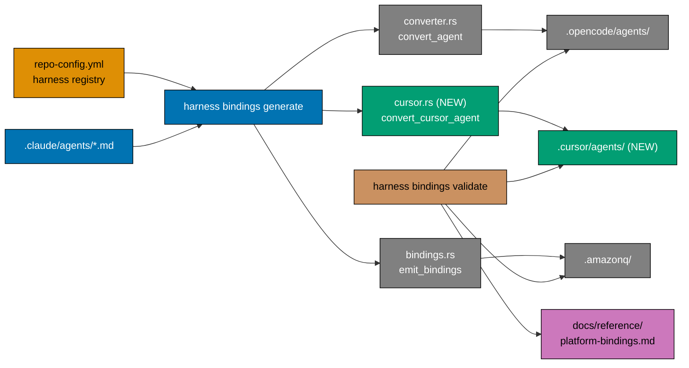
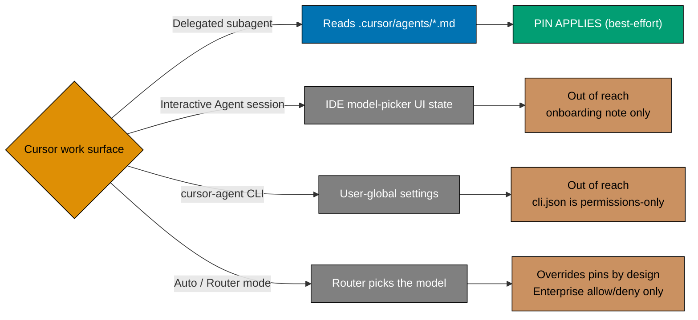
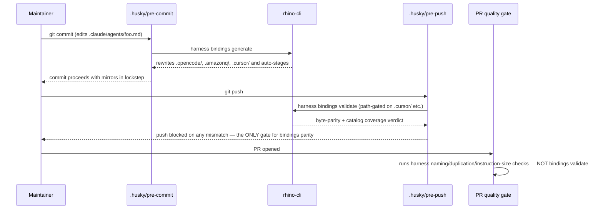
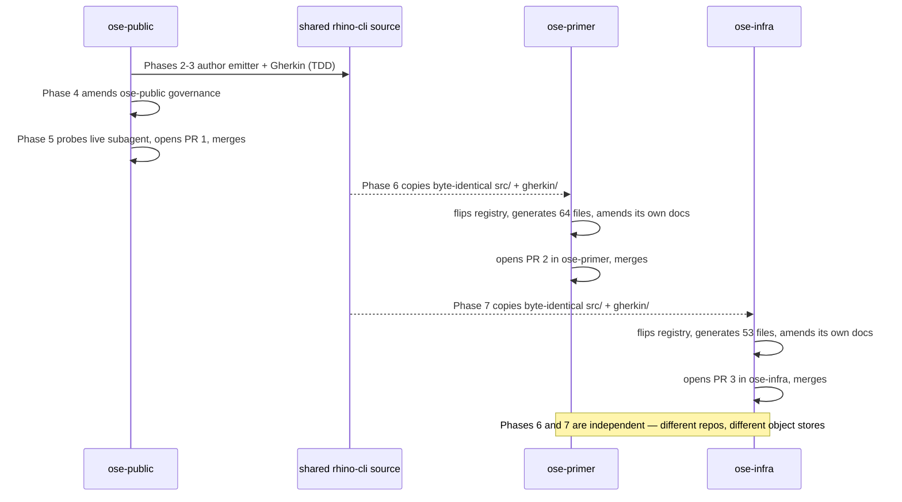
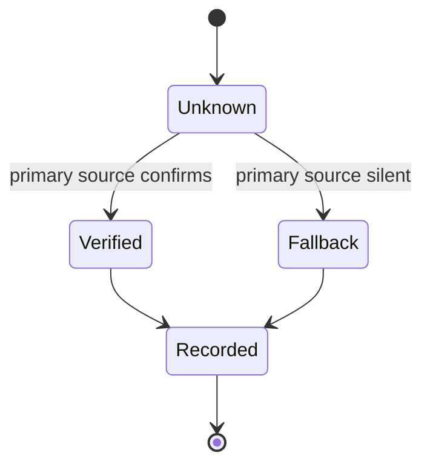
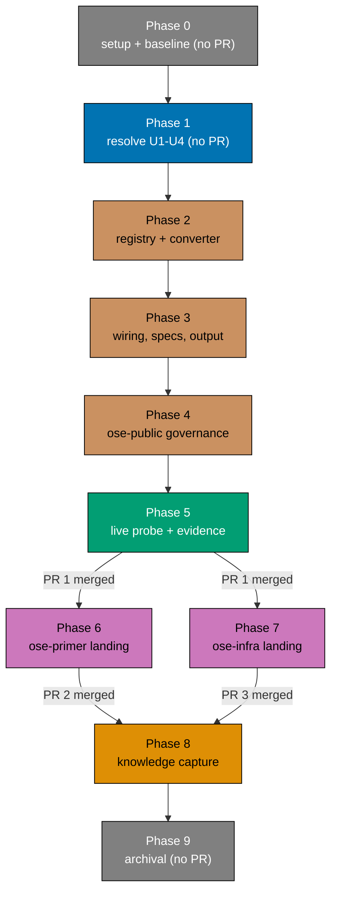
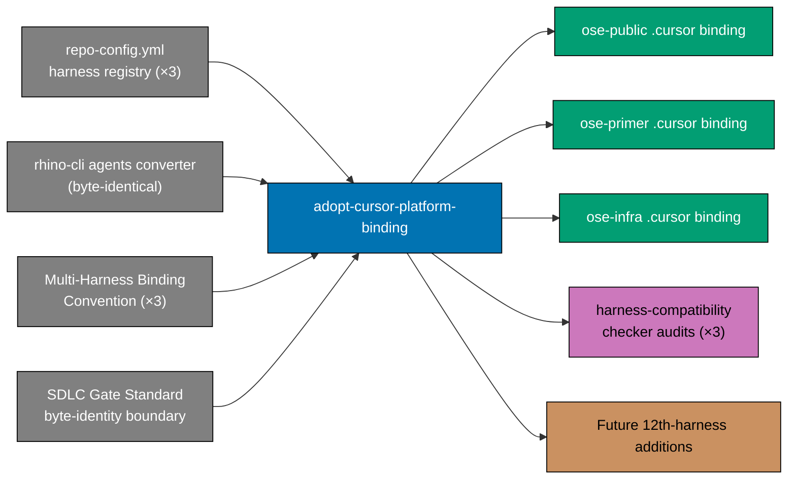

# Technical Documentation — Adopt a Cursor Platform Binding

## Architecture

### Where the new code sits

Each repository's binding machinery is **partly** registry-driven. `repo-config.yml` carries a
`harness:` section whose own comment states: "Adding a 12th harness = one entry here; every harness
command picks it up automatically" [Repo-grounded — the `harness:` block, textually identical in all
three repos]. Cursor is already an entry there, at `tier: native`. This plan flips that entry to
`tier: generated` and adds the converter that the generated tier implies.

**How far the registry actually reaches — verified, not assumed.** The comment overstates the case,
and the difference decides how much Rust this plan writes:

| Command                     | Registry-driven?                                                                | Consequence for this plan                              |
| --------------------------- | ------------------------------------------------------------------------------- | ------------------------------------------------------ |
| `harness naming validate`   | **Yes** — iterates `is_generated_with_agents()` and does N-way mirror parity    | The mirror guard comes **free** with the registry flip |
| `harness bindings generate` | **No** — hardcoded `--opencode` / `--amazonq` booleans, `--harness` accepts two | Needs an explicit `cursor` branch                      |
| `harness bindings validate` | **No** — `validate_sync` is hardcoded to `OPENCODE_AGENT_DIR`                   | Needs an explicit Cursor content-parity check          |

[Repo-grounded — `apps/rhino-cli/src/commands/harness_validate_naming.rs` lines 100-140;
`apps/rhino-cli/src/commands/harness_generate_bindings.rs` lines 20-76;
`apps/rhino-cli/src/application/agents/sync_validator.rs` lines 16-32.]

`harness naming validate` uses `validate_mirror_with_dirs`, which is **bidirectional**: it reports a
`mirror-drift` violation both for a source file with no mirror counterpart and for a mirror file with
no source [Repo-grounded — `apps/rhino-cli/src/application/naming/mod.rs` lines 134-170]. That is
where AC-18 and AC-19 land, and it is the strongest single argument for expressing this binding as a
registry entry rather than as another hardcoded directory.



**Path correction, recorded deliberately**: the converter this plan siblings lives at
`apps/rhino-cli/src/application/agents/converter.rs`, **not** at `src/internal/agents/converter.rs`
[Repo-grounded]. `src/internal/agents.rs` exists but is a three-line backward-compatibility shim
(`wc -l` confirms `3`: two `//!` doc-comment lines plus the single `pub use` line below) whose
entire body is `pub use crate::application::agents::*;`, which is why command files still import
`crate::internal::agents::…` and why the older path keeps surfacing in prose. Every delivery step
below names the real filesystem path; the shim needs no edit.

### What the emitter reads and writes

| Aspect               | OpenCode mirror (existing)               | Cursor mirror (this plan)                                    |
| -------------------- | ---------------------------------------- | ------------------------------------------------------------ |
| Source               | `.claude/agents/*.md`                    | `.claude/agents/*.md` (same source)                          |
| Sink                 | `.opencode/agents/*.md`                  | `.cursor/agents/*.md`                                        |
| `name`               | Dropped ("filename carries name")        | **Preserved** — Cursor documents `name` in its schema        |
| `description`        | Preserved                                | Preserved                                                    |
| `model`              | `convert_model` → GLM / MiniMax IDs      | `convert_cursor_model` → non-fast Composer 2.5 only          |
| `color`              | `convert_color` → theme token            | **Dropped with a warning** — Cursor documents no color field |
| `tools`              | `convert_permission` → `permission:` map | Dropped with a warning — Cursor documents no tools field     |
| `readonly`           | n/a                                      | **Omitted** — see DD-6                                       |
| `is_background`      | n/a                                      | **Omitted** — see DD-6                                       |
| `skills`, `maxTurns` | Preserved / translated to `steps`        | Dropped with a warning                                       |
| Body                 | Copied unchanged                         | Copied unchanged                                             |

### Enforcement reach — the honest boundary



### Gate sequence



`harness bindings validate` runs **only** in the client-side `.husky/pre-push` hook
[Repo-grounded — `grep -rn "bindings" .github/workflows/` returns zero hits across all of
`ose-public`'s workflow files]. No GitHub Actions workflow re-runs it server-side; `pr-quality-gate.yml`
runs sibling `rhino-cli` checks (`harness naming validate`, `harness duplication validate`,
`instruction-size validate`, and others) but never `harness bindings validate` itself. A push made
with `--no-verify` (bypassing the pre-push hook) would therefore reach the PR with no independent
CI re-check of binding parity.

Every repository's pre-commit hook already runs `harness bindings generate` and auto-stages its
output — step 3 in `ose-public` and `ose-primer`, step 5 in `ose-infra` [Repo-grounded — the three
`.husky/pre-commit` files]. `ose-public`'s and `ose-primer`'s pre-push hooks already trigger
`harness bindings validate` on any `.cursor/` change [Repo-grounded — the two `.husky/pre-push`
files]. **`ose-infra`'s pre-push hook is the one exception**: its `harness bindings validate`
trigger regex omits `\.cursor/` [Repo-grounded — `ose-infra`'s `.husky/pre-push`], so Phase 7 makes
one hook edit there to add it, matching the other two repositories' pattern exactly. No other hook
or workflow file needs editing in any repo.

## The Three-Repo Landing Model

### Why propagation alone is not enough

`apps/rhino-cli` is byte-identical across `ose-public`, `ose-primer`, and `ose-infra`, with zero
carve-outs, and so is `specs/apps/rhino/behavior/rhino-cli/gherkin/`
[Repo-grounded — checksums of `bindings.rs`, `converter.rs`, and `agents-bindings.feature` match
exactly across all three trees; boundary declared in the
[SDLC Gate Standard](../../../docs/reference/sdlc-gate-standard.md#rhino-cli-byte-identity-boundary)].

Combine that with pre-commit generation and a forcing function appears: **the emitter cannot arrive
in a repository without that repository beginning to emit `.cursor/agents/` on its next commit.**
There is no propagation-without-adoption option. Landing the shared source and deferring the
governance record would mean two repositories carrying an undocumented, uncatalogued generated
directory — and, because `harness naming validate` becomes registry-driven for `.cursor/agents/` the
moment the flip lands, a repository whose registry says `generated` but whose mirror is missing would
fail its own pre-push gate.

Each repository therefore lands **one** coherent change: shared emitter + registry flip + generated
output + that repo's governance amendments, in a single PR.



### What is genuinely shared, and what genuinely differs

Verified by checksum comparison across the three trees at authoring time [Repo-grounded]:

| Artefact                                                         | `ose-public` vs `ose-primer` vs `ose-infra`   | Consequence                              |
| ---------------------------------------------------------------- | --------------------------------------------- | ---------------------------------------- |
| `apps/rhino-cli/src/application/agents/bindings.rs`              | **Identical** (same checksum)                 | One implementation, copied verbatim      |
| `apps/rhino-cli/src/application/agents/converter.rs`             | **Identical**                                 | One implementation, copied verbatim      |
| `specs/…/gherkin/harness/agents-bindings.feature`                | **Identical**                                 | One feature file, copied verbatim        |
| `repo-config.yml` `harness:` block                               | **Textually identical** (line offsets differ) | Same three-field edit, applied per repo  |
| `docs/reference/platform-bindings.md`                            | **Different** — different table structures    | Three different catalog edits            |
| `repo-governance/conventions/structure/multi-harness-binding.md` | **Different** — different headings            | Three different tier reclassifications   |
| `repo-governance/development/agents/model-selection.md`          | **Different**                                 | Three different mapping-table insertions |
| `.prettierignore`                                                | **Different**                                 | Three independent Prettier checks        |
| `.claude/agents/repo-harness-compatibility-checker.md`           | **Different**                                 | Three independent agent-definition edits |
| `.claude/agents/` roster                                         | 90 / 64 / 53 agents                           | Three different generated output sizes   |

The catalog documents differ **structurally**, not just textually:

- **`ose-public`** — one capability table; Cursor's `Status` column reads `Reserved`.
- **`ose-primer`** — **two** tables: a Tier-1-native-readers table and a capability table that has
  no `Status` column at all. A step written as "change the Status cell to X" is unexecutable here.
- **`ose-infra`** — one capability table; Cursor's `Current ose-infra state` column reads `Absent`,
  not `Reserved`.

Likewise `multi-harness-binding.md` names its sections "Active Tier-1 bindings" in `ose-public` and
`ose-infra` but "Tier 1 — Native AGENTS.md Readers" in `ose-primer`, and `ose-infra`'s Cursor bullet
sits in a list that also documents Copilot's tooling-provided directories.

**Do not write one shared governance step and apply it three times.** Each repository gets its own
verdict table below and its own delivery steps.

### Pre-existing divergence this plan observes but does not fix

- `ose-infra` carries `.opencode/agents/ci-monitor-subagent.md` with **no** `.claude/agents/`
  counterpart [Repo-grounded — set difference of the two directory listings]. It survives
  `harness naming validate` only because `list_agent_files` hardcodes a skip for that exact filename
  [Repo-grounded — `harness_validate_naming.rs` line 157]. Because the Cursor emitter reads
  `.claude/agents/`, the Cursor mirror will simply not contain it, and the same hardcoded skip keeps
  the mirror check quiet. **No action, deliberately** — but the Knowledge Capture phase routes it as
  a backlog candidate rather than leaving it unrecorded.
- `.opencode/agents/README.md` exists in `ose-public` but not in `ose-primer` or `ose-infra`
  [Repo-grounded]. Both `count_markdown_files` and `list_agent_files` skip `README.md`, so the
  inconsistency is invisible to every guard. The Cursor emitter therefore **also** skips it (DD-14),
  matching the more common of the two shapes and keeping the guards indifferent.

## The Four Unknowns — Resolved Before Any Emitter Code

The research pass of 2026-07-28 explicitly refused to certify four claims. Each becomes a Phase 1
verification task with a stated fallback. None is assumed.



| ID  | Unknown                                                                           | How Phase 1 resolves it                                                                                                                                                             | Fallback if unresolved                                                                                                        |
| --- | --------------------------------------------------------------------------------- | ----------------------------------------------------------------------------------------------------------------------------------------------------------------------------------- | ----------------------------------------------------------------------------------------------------------------------------- |
| U1  | The canonical Cursor model-ID slug for Composer 2.5                               | Delegate to `web-researcher` against Cursor's model docs and subagent docs; corroborate with two first-party sources                                                                | Emit `composer-2.5` (the slug both first-party sources use in literal examples) and label it `[Unverified]` in the catalog    |
| U2  | Whether the bracket parameter syntax is accepted in an agent-file `model:` field  | Same research pass plus a live emit-and-launch probe in Phase 5                                                                                                                     | Emit the bare slug without brackets and record the residual fast-toggle exposure in the catalog                               |
| U3  | What Cursor does with an unrecognised `model:` value such as `sonnet`             | Phase 1: `web-researcher` documentation survey only. Empirical probe (scratch agent with invalid `model:`, launch, read served model) **deferred to Phase 5** live subagent session | Record as `[Unverified]` in Phase 1 if docs are silent; Phase 5 probe is the authoritative runtime check for alias resolution |
| U4  | Whether the two staff-confirmed defects are fixed in the installed Cursor version | Re-check the Cursor changelog via `web-researcher` at execution time; record the installed version alongside the verdict                                                            | Ship anyway with the defect documented; Phase 5's empirical check is the real gate, not the changelog                         |

**Refuse-on-uncertainty applies.** No emitted governance prose may state U1 or U2 as fact until
Phase 1 records a verified answer. Where Phase 1 lands on a fallback, the catalog row and the
mapping table carry an explicit `[Unverified]` label rather than a confident assertion.

## Design Decisions

### DD-1 — Generated Tier-2 binding, not a hand-written directory

`.cursor/agents/` is emitted by `rhino-cli`, never hand-authored. Rule 4 of the
[Multi-Harness Binding Convention](../../../repo-governance/conventions/structure/multi-harness-binding.md)
mandates mechanical generation for any binding file that must exist, and Rule 5 mandates the
byte-parity guard. Hand-maintaining 90 agent files across a third harness guarantees drift.

**Consequence**: Cursor's catalog tier changes from "Reserved" (Tier-1 native reader, no committed
file) to a Tier-2 generated binding **for its agent surface only**. Cursor continues to read the root
`AGENTS.md` natively for instructions — the tier change is scoped to agents, and the catalog row must
say so rather than implying Cursor stopped reading `AGENTS.md`.

### DD-2 — The standing "no thin pointer files" decision is amended, not deleted

All three repositories record this standing decision, in three slightly different forms
[Repo-grounded]: `ose-public` at line 174 under `### Optional thin pointers` ("**Decision: the repo
ships no optional thin pointer files** …"), `ose-infra` at line 189 under the same heading but
phrased "**this repo** ships no optional thin pointer files", and `ose-primer` under a `##`-level
`## Optional Thin Pointers` heading at line 179 with different body text again. That decision stays
true in all three and is **not** contradicted by this plan: `.cursor/rules/` is still not shipped
anywhere.

What changes is a different thing — an **agent-definition** surface, not an instruction surface. The
amendment note must make that distinction explicit rather than quietly rewriting the paragraph. The
delivery step therefore appends a dated amendment note under that heading, preserving the original
decision text.

### DD-3 — Registry entry flips to `generated`; `shadow` is retained

The Cursor entry becomes:

```yaml
- name: cursor
  tier: generated
  agent-dir: .cursor/agents
  mirrors: .claude/agents
  shadow: .cursor/rules
  instruction: [AGENTS.md, .cursor/rules]
```

`shadow` and `instruction` are retained because the no-shadowing rule and the instruction-size budget
still apply to `.cursor/rules` should it ever appear. `HarnessEntry` already deserialises all six
fields [Repo-grounded — `apps/rhino-cli/src/application/repo_config/mod.rs` lines 56-96], and
`is_generated_with_agents()` already keys on `tier == "generated" && agent_dir.is_some()`, so the
registry side needs no schema change.

**What the flip buys, precisely.** It is not "every harness command picks it up automatically" — the
architecture table above records that only `harness naming validate` consumes the registry. The flip
buys exactly one thing, and it is worth having: bidirectional mirror-parity checking of
`.cursor/agents/` against `.claude/agents/` with **zero new Rust**. `harness bindings generate` and
`harness bindings validate` still need explicit Cursor branches.

**The same edit, three times.** The `harness:` block is textually identical in all three repos
[Repo-grounded], so this is the one governance-adjacent change that really is uniform. Line offsets
differ (the entry sits at line 49 in `ose-public` and `ose-infra`, line 50 in `ose-primer`), so the
delivery steps anchor on the entry text rather than a line number.

### DD-4 — Model mapping mirrors the OpenCode tier-collapse shape

| Claude alias                 | Cursor model ID            | Tier      |
| ---------------------------- | -------------------------- | --------- |
| `opus`                       | `composer-2.5[fast=false]` | Thinking  |
| `sonnet` / omitted (inherit) | `composer-2.5[fast=false]` | Execution |
| `haiku`                      | `composer-2.5[fast=false]` | Fast      |

All three branches resolve to the **same identifier** — full tier collapse. The emitter must never
write `composer-2.5-fast`; that slug is the 6x-priced toggle this plan exists to avoid. The identical
**tier collapse** shape the OpenCode mapping already documents and defends [Repo-grounded —
`repo-governance/development/agents/model-selection.md` "Tier Collapse"]. `convert_cursor_model` keeps
three explicit branches (`haiku` / `opus` / else) so a future per-tier split needs only one literal
changed per branch.

**The exact literals are set in Phase 1, not here.** This table names the intent; the delivery step
writes the verified slug.

### DD-5 — `composer-2.5-fast` is never emitted

The binding writes exactly one model identifier for every agent. A negative assertion — no emitted
file contains the substring `composer-2.5-fast` — is part of the Phase 3 pin-count gate and the Phase
5 live probe acceptance criteria. Cursor's own defects can still auto-switch a running subagent to
`composer-2.5-fast` despite the pin; that is why the empirical verification phase exists, not why the
emitter should ever write the fast slug.

### DD-6 — `readonly` and `is_background` are omitted

Cursor documents five frontmatter fields: `name`, `description`, `model`, `readonly`,
`is_background` [Web-cited — <https://cursor.com/docs/subagents>, accessed 2026-07-28]. This emitter
writes the first three and omits the last two.

`readonly` could plausibly be derived from a Claude agent's `tools:` array (no `Write` / `Edit` /
`NotebookEdit` implies read-only). That derivation is an **inference**, not a translation: it invents
a semantic the source never declared, and getting it wrong either breaks a fixer agent or silently
grants write access to a checker. Shipping an unverified semantic alongside the verified model pin
would dilute the one thing this plan is trying to make trustworthy.

Omitting both fields lets Cursor apply its own documented defaults. This is recorded as a Non-Goal in
[`brd.md`](./brd.md), revisitable on concrete need.

### DD-7 — `color` and `tools` are dropped with warnings, not silently

The OpenCode converter's `FieldPolicy` table already distinguishes `Drop` (silent) from `DropWarn`
(discard and warn) [Repo-grounded — `converter.rs` lines 53-104]. Cursor documents no `color` field
and no `tools` field. Both are therefore `DropWarn` for the Cursor policy table: a maintainer who
adds a colour and sees nothing in `.cursor/` should be told why, not left to guess.

`name` moves the other way — `Drop` for OpenCode ("filename carries name"), `Preserve` for Cursor
(Cursor documents it).

### DD-8 — Three PRs, one per repository; the plan-docs phases take the carve-out

The plan opens **exactly three PRs — one per repository** — and no more. Every other
change-producing phase touches only `plans/**` and therefore lands via the **plan-docs-only
carve-out** stated in
[plan-planning §The Plan-Docs-Only Carve-Out](../../../repo-governance/workflows/plan/plan-planning.md),
pushing direct to `origin main` from the primary checkout.

| Phase(s) | What it produces                                   | Route                                |
| -------- | -------------------------------------------------- | ------------------------------------ |
| 0        | Nothing committed                                  | No PR, no push (Phase 0 opens no PR) |
| 1        | The verification record, inside the plan folder    | Plan-docs carve-out, direct push     |
| 2-5      | `ose-public` emitter, output, governance, evidence | **PR 1**, in `ose-public`            |
| 6        | `ose-primer` landing                               | **PR 2**, in `ose-primer`            |
| 7        | `ose-infra` landing                                | **PR 3**, in `ose-infra`             |
| 8-9      | Knowledge Capture triage and archival              | Plan-docs carve-out, direct push     |

Phase 1 produces a research record and nothing else, so routing it through a discipline-specialist
fan-out and three CI-gated review cycles would spend the review budget on prose. Phases 8-9 are a
folder move and a set of ticked checkboxes; same reasoning.

**Not folded, not inflated.** Phases 2-5 are one contiguous dependency chain in one repository, so
grouping them into one delivery unit is permitted — they are not independent DAG nodes being
re-serialised. Phases 6 and 7 are genuinely independent (different repositories, different object
stores, different governance documents) and are therefore **never** merged into a single unit to save
a PR, which the delivery-boundary rule forbids.

**Why archival (Phase 9) is not folded into PR 1, despite the Three-repo nuance.** The
[PR Review Quality Gate workflow's Done-Definition, Three-repo nuance](../../../repo-governance/workflows/pr/pr-review-quality-gate.md#done-definition-for--to-pr-modes)
addresses exactly this plan's shape — "a `plans/` folder that exists only in `ose-public`" — and
states that item 4 (archival-in-PR) "applies only to the PR in the repo that actually carries the
plan folder," with sibling-repo PRs using items 1-3 as their complete done-definition. Read
literally, that places archival inside PR 1 (`ose-public`, the repo carrying this plan's folder,
merging at the end of Phase 5) and requires no archival step at all from PR 2 (`ose-primer`) or
PR 3 (`ose-infra`).

This plan **extends** that nuance for a case its text does not cover: PR 1 is not the _last_ of the
plan's three PRs to merge — it is a **prerequisite** that must merge first, because PR 2 and PR 3
each propagate the byte-identical `apps/rhino-cli` source from `ose-public`'s **post-PR-1-merge**
`main` (DD-10, DD-11). Archiving inside PR 1, per the literal reading, would move
`plans/in-progress/adopt-cursor-platform-binding/` to `plans/done/` — declaring the plan complete —
while two of its three delivery units (the `ose-primer` and `ose-infra` landings) are still
unopened. That is a false "done" declaration for two-thirds of the plan's scope, which the nuance's
authors did not anticipate: their example assumes no ordering dependency between the plan-folder
repo's PR and the others.

**The rule this plan actually follows**: archival is deferred to
[Phase 9](./delivery.md#phase-9-plan-archival), executed only after all three PRs (1, 2, 3) are
confirmed merged, as a plan-docs-only direct push to `origin main` — never bundled into any of the
three PRs. Phase 9's own gate re-verifies all three merges before archiving.

### DD-9 — Empirical verification gates the merge, not the frontmatter

Cursor staff have confirmed that subagent `model:` frontmatter "can currently be ignored under
certain conditions", and that CLI subagents have been observed auto-switching to
`composer-2.5-fast` on their own [Web-cited — Cursor Community Forum, accessed 2026-07-28]:

- **Frontmatter ignored**: Dean Rie (Cursor staff), 2026-07-15 —
  <https://forum.cursor.com/t/subagent-model-choice-not-respected/163645> — _"The `model` in
  frontmatter can sometimes be ignored and the subagent inherits the parent model. That's a separate
  known bug."_
- **CLI auto-switch to fast**: Dean Rie (Cursor staff), 2026-06-19 —
  <https://forum.cursor.com/t/cli-subagents-changing-model-to-composer-2-5-fast-mode-by-itself/162752>
  — _"This is a known bug. In some cases, subagents resolve to the fast variant `composer-2.5-fast`
  instead of the regular `composer-2.5` when the model isn't explicitly set in the subagent
  frontmatter."_

A plan that ships the frontmatter and declares victory would be asserting something the vendor has
already said may not hold.

Phase 5 therefore launches a real subagent from a `.cursor/agents/` definition and reads back which
model actually served it, committing the record under `evidence/`. That phase is the delivery
boundary for the `ose-public` unit — its PR does not open until the evidence exists, and Phases 6
and 7 do not begin until that PR merges.

### DD-10 — The full outcome lands in all three repositories, not just the shared source

`apps/rhino-cli`'s `src/`, `Cargo.toml`, `Cargo.lock`, `project.json`, `LICENSE`, and the Gherkin
tree at `specs/apps/rhino/behavior/rhino-cli/gherkin/` (all `.feature` files and all `README.md`
files) are byte-identical across `ose-public`, `ose-primer`, and `ose-infra` [Repo-grounded —
[SDLC Gate Standard, rhino-cli Byte-Identity Boundary](../../../docs/reference/sdlc-gate-standard.md),
corroborated by checksum comparison at authoring time]. This plan touches both the source and the
Gherkin tree, so it **cannot** leave propagation to a follow-up without knowingly breaking that
boundary.

It also cannot stop at propagation. Per the Three-Repo Landing Model above, pre-commit generation in
every repo turns the arrival of the emitter into the arrival of `.cursor/agents/`. Phases 6 and 7
therefore carry **complete landings** — shared source, registry flip, generated output, and that
repo's own governance amendments — as two independent delivery units, one per sibling repo, each with
its own worktree and its own PR in that repo.

`repo-config.yml` is **not** inside the byte-identity boundary (values may differ per repo), but its
`harness:` block happens to be textually identical in all three today, and this plan changes no keys —
only the `cursor` entry's values. Each sibling repo therefore needs the same value change, applied in
its own PR. Topology detection for each landing is covered by DD-13.

### DD-11 — Each repository's landing is one PR carrying code, output, and governance together

A landing PR that carried only the shared `rhino-cli` source would leave its repository in a state
where the next commit generates `.cursor/agents/` with no catalog row, no tier reclassification, and
no out-of-reach note. A landing PR that carried only governance prose would describe a directory that
does not exist. Neither half passes the four-part boundary test on its own.

Each repository's PR therefore carries, together:

1. the byte-identical `apps/rhino-cli/src/` and `specs/apps/rhino/behavior/rhino-cli/gherkin/`;
2. the `repo-config.yml` registry flip;
3. the generated `.cursor/agents/` output for that repo's own roster;
4. that repo's governance amendments, from that repo's own verdict table;
5. that repo's Prettier decision.

### DD-12 — The live probe runs once; each repository asserts its own emitted literal

The probe answers "does Cursor honour `model:` in an agent file?" That is a fact about **Cursor**,
determined by Cursor's own resolution logic and by the two staff-confirmed defects. It is not a fact
about a repository: the emitted frontmatter is produced by byte-identical code from the same mapping
function, so `ose-primer`'s file and `ose-infra`'s file differ from `ose-public`'s only in which agent
they describe. Running the same probe three times would produce the same evidence three times and
would not falsify anything the first run left open.

The plan therefore splits the question in two:

| Question                                             | Scope                               | Where it is answered                              |
| ---------------------------------------------------- | ----------------------------------- | ------------------------------------------------- |
| Does Cursor honour the pin in a real subagent?       | About Cursor — **once**             | Phase 5, live probe, evidence committed           |
| Does **this** repo's generated output carry the pin? | About the repository — **per repo** | Each landing phase, by counting the emitted files |

The per-repo assertion is cheap and genuinely falsifiable: count how many `.cursor/agents/*.md` files
carry the pinned literal and compare against that repo's agent count (90 / 64 / 53). Each landing
phase also confirms that no `.cursor/cli.json` exists in that tree that could
interpose a different default — a repo-specific condition the shared probe genuinely cannot cover.

### DD-13 — Sibling-repo topology is detected per landing, never assumed

The sibling repositories have historically been **bare** repositories worked only through linked
worktrees. At authoring time both `ose-primer` and `ose-infra` present as **normal working trees**
(`core.bare = false`, with `.git/` as a directory containing `index` and `HEAD`) [Repo-grounded —
read of each `.git/config` and directory listing]. **That observation is recorded as of today and is
explicitly not a licence to hardcode it** — this topology has changed before and the plan must
survive it changing again.

Each landing phase therefore begins by determining topology with `git worktree list` and branching on
the presence of the `(bare)` marker. `git rev-parse --is-bare-repository` is **forbidden** in this
plan: it answers a different question and returns `false` from inside any linked worktree by design,
which makes it a silent false negative exactly where the distinction matters
[Repo-grounded — [SDLC Gate Standard §Worktree-Agnostic Execution](../../../docs/reference/sdlc-gate-standard.md)].
Where the marker appears, the
[Bare-Repo Base-Worktree Landing Method](../../../repo-governance/development/workflow/bare-repo-landing-method.md)
applies; where it does not, ordinary worktree provisioning applies.

### DD-14 — The emitter skips `README.md`, matching every existing guard

`.claude/agents/README.md` exists in all three repositories; `.opencode/agents/README.md` exists only
in `ose-public` [Repo-grounded]. Both `count_markdown_files` and `list_agent_files` skip `README.md`
unconditionally, so no guard has an opinion either way.

The Cursor emitter skips it. A `README.md` in `.cursor/agents/` would be a file Cursor tries to parse
as an agent definition — it has a `name`-less frontmatter or none at all — for no benefit. Skipping
also keeps `.cursor/agents/` file counts exactly equal to the roster counts the acceptance criteria
assert, which makes the per-repo checks arithmetic rather than off-by-one-prone.

### DD-15 — `cursor-binding.feature` gets its own dedicated `cursor-binding/` directory, not `harness/`

The obvious placement for this plan's 19 new acceptance scenarios is
`specs/apps/rhino/behavior/rhino-cli/gherkin/harness/`, alongside the existing
`agents-bindings.feature` — after all, both cover the same `harness bindings generate` command
surface. This plan deliberately does **not** do that.

**Why not `harness/`.** `apps/rhino-cli/tests/agents.rs` already owns `harness/` as its sole feature
directory: its `main` runs
`AgentsWorld::cucumber().fail_on_skipped().run_and_exit(feature_dir())`, where `feature_dir()`
resolves to the whole `harness/` directory [Repo-grounded — read directly from
`apps/rhino-cli/tests/agents.rs`]. cucumber-rs 0.23.0's directory-mode loading recursively
discovers every `.feature` file under a given directory path — it does not filter by which cucumber
binary "intends" to own a given file. The moment `cursor-binding.feature` (19 scenarios, none of
which have a matching step definition in `AgentsWorld`'s registry) existed on disk inside
`harness/`, `agents.rs`'s existing, unmodified run would discover it too, find zero matching steps
for every scenario, and — because `.fail_on_skipped()` is set — fail the entire `agents` test
binary. That makes `npx nx run rhino-cli:test:integration` permanently red from Phase 3 onward, for
the rest of this plan's life, across all three repositories (Phase 6 and Phase 7 replicate the same
file into the same shared directory).

**The established convention: no two binaries directory-scan the same leaf.** Every other topic
under `specs/apps/rhino/behavior/rhino-cli/gherkin/` follows a shape consistent with this invariant
— `agent-naming`, `contracts`, `convention`, `ddd`, `env`, `env-contract`, `git`, `java`, `md`,
`repo-config`, `repo-config-validate`, `repo-governance`, `spec-coverage`, `specs`, `test-coverage`,
and `workflows` are each consumed by exactly one binary via a directory-mode `feature_dir()`
[Repo-grounded — read each directory's owning `tests/*.rs`'s `feature_dir()` directly; a directory
listing alone cannot establish which binary consumes which file, only reading each binary's own
`feature_dir()` or `feature_file()` can].
`system/` is the lone exception: it holds **two** feature files, `cargo-target-share.feature` and
`doctor.feature`, each bound file-by-file (not directory-mode) to its own dedicated binary —
`apps/rhino-cli/tests/cargo_target_share.rs` and `apps/rhino-cli/tests/doctor.rs` respectively, each
of which defines its own `feature_file()` — not `feature_dir()` — pointed at the single named
`.feature` file rather than the parent `system/` directory, with an explicit comment in both files
noting the sibling file its own binary does not consume [Repo-grounded — read
`apps/rhino-cli/tests/cargo_target_share.rs` lines 981-991 and
`apps/rhino-cli/tests/doctor.rs` lines 449-460 directly]. This is an equally safe shape, since the
actual invariant this plan relies on is "no two binaries directory-scan the same leaf," not "one
binary per directory." `harness/` was never meant to be a shared directory; it is simply
`agents.rs`'s existing, dedicated home, and the risk it poses is the same directory-mode
recursive-discovery hazard that `system/`'s file-by-file binding safely avoids.

**The fix**: `cursor_binding.rs` gets its own `feature_dir()`, pointed at a new, dedicated
`specs/apps/rhino/behavior/rhino-cli/gherkin/cursor-binding/` directory — sibling to `harness/`,
never nested inside it — mirroring every other topic's shape. `harness/`'s file count stays pinned
at exactly `10` for the plan's entire lifetime (Phase 0 through Phase 9, all three repositories);
see the Phase 0 baseline and Phase 2 gate in `delivery.md`.

**No registry update needed.** Both spec-coverage Nx targets
(`rhino-cli:specs:gherkin-cardinality-validation` and `rhino-cli:specs:behavior:coverage`) are
implemented with a `walkdir` traversal of the whole `specs/` tree
[Repo-grounded — `apps/rhino-cli/src/application/behavior_coverage/extract.rs` and
`apps/rhino-cli/src/application/speccoverage/checker.rs`] — there is no hardcoded directory
registry to update. The new `cursor-binding/` leaf directory is auto-discovered by both validators
with zero extra wiring.

## Governance Surface Verdict Tables (Per Repo)

Every surface **in each repository** that states the current Cursor binding rule, with an explicit
verdict. A "no change" verdict is a decision, not an omission — the failure mode these tables exist
to prevent is fixing only the two obvious files, in only the one obvious repo.

**Three tables, because the surfaces genuinely differ.** A row present in `ose-public` may be absent
in `ose-infra`, and the same logical row may need a different edit in `ose-primer` because the
document is structured differently. Line numbers are given only where they were verified at authoring
time; delivery steps anchor on **text**, not line numbers, because the offsets drift.

### Shared rows — identical in all three repositories

These sit inside the byte-identity boundary or are textually identical across the three trees
[Repo-grounded — checksum or literal comparison], so the same edit applies in each repo's own PR.

| #   | Surface                                                                 | What it says today                                                               | Verdict                                                                                                                                                                     |
| --- | ----------------------------------------------------------------------- | -------------------------------------------------------------------------------- | --------------------------------------------------------------------------------------------------------------------------------------------------------------------------- |
| S1  | `repo-config.yml` `harness:` registry, `cursor` entry                   | `tier: native, shadow: .cursor/rules`                                            | **CHANGE** — per DD-3. Entry text identical in all three; line 49 / 50 / 49                                                                                                 |
| S2  | `repo-config.yml` `instruction-size` glob `.cursor/rules/*.mdc`         | Byte thresholds for an instruction surface                                       | **NO CHANGE** — this plan adds no instruction surface                                                                                                                       |
| S3  | `apps/rhino-cli/src/application/agents/bindings.rs` doc comments        | Classify Cursor as native tier; `KNOWN_BINDING_DIRS` lists `.cursor`             | **CHANGE** — reclassify in the comments; the `KNOWN_BINDING_DIRS` entry itself stays                                                                                        |
| S4  | `specs/…/gherkin/specs/harness-bindings.feature` lines 13-14            | Cursor named in "the native tier (Copilot, Cursor, Windsurf, …)"                 | **CHANGE** — move Cursor into the generated-tier clause on line 13; byte-identical in all three                                                                             |
| S5  | `specs/…/gherkin/cursor-binding/README.md`                              | Does not exist yet — new dedicated topic directory, sibling to `harness/`        | **NEW FILE** — index the new `cursor-binding.feature`; `harness/README.md` stays untouched; byte-identical in all three                                                     |
| S6  | `docs/reference/rhino-cli-command-triage.md` line 213                   | Cursor row: tier **native**, "none (reads `AGENTS.md`); `.cursor/mcp.json` only" | **CHANGE** — tier and artifact columns; line 213 in all three [Repo-grounded]                                                                                               |
| S7  | `docs/reference/rhino-cli-command-triage.md` lines 228, 241, 243, 272   | `.cursor/rules` named as an instruction / no-shadowing surface                   | **NO CHANGE** at 228/243/272; **CHANGE** at 241 (native-tier list); same lines in all three                                                                                 |
| S8  | `docs/reference/sdlc-gate-standard.md` instruction-size surface list    | Includes `.cursor/rules`                                                         | **NO CHANGE** — same reason as S2                                                                                                                                           |
| S9  | `repo-governance/conventions/structure/instruction-file-size-budget.md` | `.cursor/rules/*.mdc` byte thresholds                                            | **NO CHANGE** — same reason as S2                                                                                                                                           |
| S10 | `.husky/pre-push` and `.husky/pre-commit`                               | `.cursor/` already triggers bindings validate; generate already runs pre-commit  | **NO CHANGE** for `ose-public` and `ose-primer`; **CHANGE** for `ose-infra` pre-push (add `\.cursor/` to the trigger regex) — see `tech-docs.md` §Gate sequence and Phase 7 |

### `ose-public` — repo-specific rows

| #   | Surface                                                                           | What it says today                                                                  | Verdict                                                                                        |
| --- | --------------------------------------------------------------------------------- | ----------------------------------------------------------------------------------- | ---------------------------------------------------------------------------------------------- |
| P1  | `docs/reference/platform-bindings.md` line 33 (single capability table)           | Cursor row, `Status` column reads `Reserved`                                        | **CHANGE** — `Status` becomes the generated tier for the agent surface                         |
| P2  | `docs/reference/platform-bindings.md` `### Optional thin pointers` (line 168)     | "the repo ships no optional thin pointer files … `.cursor/rules/*.mdc`"             | **AMEND** — append a dated note; the instruction-surface decision is unchanged (DD-2)          |
| P3  | `docs/reference/platform-bindings.md` `## Translation Artifacts` (line 181)       | `### Color / Model ID / Tool Translation (Claude Code → OpenCode)` subsections      | **CHANGE** — add a Cursor model-translation subsection in the same shape                       |
| P4  | `docs/reference/platform-bindings.md` `## Adding a New Platform Binding` (236)    | Five-step procedure whose worked example is `.cursor/rules/`                        | **CHANGE** — the example is now a real binding; repoint it and add the registry step           |
| P5  | `docs/reference/platform-bindings.md` — new section                               | (absent)                                                                            | **ADD** — the out-of-reach onboarding note (US-5)                                              |
| P6  | `multi-harness-binding.md` `### Active Tier-1 bindings`, Cursor bullet (line 258) | "**Cursor** — reads `AGENTS.md` natively."                                          | **CHANGE** — scope to instructions and add the generated agent surface                         |
| P7  | `governance-vendor-independence.md` line 206                                      | Cursor row: `.cursor/rules/`, `AGENTS.md` (also reads `.cursor/rules/`)             | **CHANGE** — reflect the generated agent surface                                               |
| P8  | `model-selection.md` `### Model ID Mapping` (line 279) + `### Tier Collapse`      | Claude → OpenCode mapping with a tier-collapse rationale                            | **CHANGE** — add the Cursor full-tier-collapse mapping and the `composer-2.5-fast` prohibition |
| P9  | `AGENTS.md` line 492                                                              | Cursor grouped with "read root `AGENTS.md` natively … no per-tool instruction file" | **CHANGE** — still reads `AGENTS.md`, now also carries a generated agent binding               |
| P10 | `CLAUDE.md` `### Multi-harness configuration (Claude Code + OpenCode + Amazon Q)` | Names `.claude/`, `.opencode/`, `.amazonq/` as the binding set                      | **CHANGE** — add `.cursor/` as a secondary generated artifact; heading gains Cursor            |
| P11 | `.claude/agents/repo-harness-compatibility-checker.md`                            | Table-driven from the catalog; no model-pin drift axis                              | **CHANGE** — add the model-pin drift dimension                                                 |
| P12 | `.claude/agents/repo-harness-compatibility-fixer.md`                              | Companion fixer                                                                     | **VERIFY THEN DECIDE** — change only if it enumerates tiers or bindings independently          |
| P13 | `.prettierignore`                                                                 | `.amazonq/` ignored; `.opencode/` not                                               | **VERIFY THEN DECIDE** — see the Prettier section below                                        |

### `ose-primer` — repo-specific rows

| #   | Surface                                                                                 | What it says today                                                                             | Verdict                                                                                          |
| --- | --------------------------------------------------------------------------------------- | ---------------------------------------------------------------------------------------------- | ------------------------------------------------------------------------------------------------ |
| R1  | `docs/reference/platform-bindings.md` line 36 (Tier-1 native-readers table)             | Cursor row: `.cursor/rules/*.mdc`, Binding status `Absent`                                     | **CHANGE** — the `Binding status` column stays `Absent`; the row must stop implying "no binding" |
| R2  | `docs/reference/platform-bindings.md` line 63 (capability matrix)                       | Cursor row with **no `Status` column at all**                                                  | **CHANGE** — update the agent-directory cell; **do not** look for a `Status` cell                |
| R3  | `docs/reference/platform-bindings.md` `## Optional Thin Pointers` (179)                 | Same standing decision, different heading case and `##` level                                  | **AMEND** — append the dated note under this repo's own heading                                  |
| R4  | `docs/reference/platform-bindings.md` `## Translation Artifacts` (189)                  | `### … (Claude Code → OpenCode)` subsections at line 194 / 217 / 234                           | **CHANGE** — add the Cursor model-translation subsection                                         |
| R5  | `docs/reference/platform-bindings.md` `## Adding a New Platform Binding` (243)          | Five-step procedure, `.cursor/rules/` example                                                  | **CHANGE** — repoint the example, add the registry step                                          |
| R6  | `docs/reference/platform-bindings.md` — new section                                     | (absent)                                                                                       | **ADD** — the out-of-reach onboarding note                                                       |
| R7  | `multi-harness-binding.md` `### Tier 1 — Native AGENTS.md Readers`, Cursor bullet (149) | "**Cursor** — reads `AGENTS.md` natively; additional rules may live in `.cursor/rules/*.mdc`." | **CHANGE** — different heading and different bullet wording from `ose-public`                    |
| R8  | `governance-vendor-independence.md` line 205                                            | Cursor row: `.cursor/rules/`, `AGENTS.md` (also reads `.cursor/rules/`)                        | **CHANGE** — same intent as P7, one line earlier                                                 |
| R9  | `model-selection.md` `## Platform Binding Examples` (line 261)                          | **No `### Model ID Mapping` subsection** — the mapping lives inline                            | **CHANGE** — add the Cursor mapping in this repo's own shape; do not assume P8's anchor          |
| R10 | `AGENTS.md`                                                                             | **Does not mention Cursor at all** (0 occurrences) [Repo-grounded]                             | **NO CHANGE** — nothing here states the old rule; adding a mention is out of scope               |
| R11 | `CLAUDE.md` `### Dual-mode configuration (Claude Code + OpenCode)`                      | "**dual** compatibility"; `.amazonq/` **not** listed                                           | **CHANGE** — the "dual" framing is now wrong; add `.cursor/` without inventing Amazon Q          |
| R12 | `.claude/agents/repo-harness-compatibility-checker.md`                                  | Present, different content from `ose-public`'s copy                                            | **CHANGE** — add the model-pin drift dimension in this repo's own wording                        |
| R13 | `.claude/agents/repo-harness-compatibility-fixer.md`                                    | Present                                                                                        | **VERIFY THEN DECIDE** — same check as P12, run against this repo's copy                         |
| R14 | `.prettierignore`                                                                       | Different from `ose-public`'s copy                                                             | **VERIFY THEN DECIDE** — run this repo's own Prettier check                                      |

### `ose-infra` — repo-specific rows

| #   | Surface                                                                           | What it says today                                                                              | Verdict                                                                                                              |
| --- | --------------------------------------------------------------------------------- | ----------------------------------------------------------------------------------------------- | -------------------------------------------------------------------------------------------------------------------- |
| I1  | `docs/reference/platform-bindings.md` line 36 (single capability table)           | Cursor row, `Current ose-infra state` column reads **`Absent`**, not `Reserved`                 | **CHANGE** — a step written against the literal `Reserved`, or against a column named `Status`, would not match here |
| I2  | `docs/reference/platform-bindings.md` `### Optional thin pointers` (183)          | "**this repo** ships no optional thin pointer files …" — different opening wording              | **AMEND** — append the dated note; match this repo's phrasing                                                        |
| I3  | `docs/reference/platform-bindings.md` `## Translation Artifacts` (196)            | `### … (Claude Code **to** OpenCode)` — spelled "to", not "→"                                   | **CHANGE** — add the Cursor subsection using this repo's "to" spelling                                               |
| I4  | `docs/reference/platform-bindings.md` `## Adding a New Platform Binding` (256)    | Five-step procedure, `.cursor/rules/` example                                                   | **CHANGE** — repoint the example, add the registry step                                                              |
| I5  | `docs/reference/platform-bindings.md` — new section                               | (absent)                                                                                        | **ADD** — the out-of-reach onboarding note                                                                           |
| I6  | `multi-harness-binding.md` `### Active Tier-1 bindings`, Cursor bullet (line 325) | "**Cursor** — reads `AGENTS.md` natively." in a list that also documents Copilot's tooling dirs | **CHANGE** — same intent as P6, different surrounding list                                                           |
| I7  | `governance-vendor-independence.md`                                               | **No binding-catalog table at all** — only four Cursor mentions, all vendor-lexicon             | **NO CHANGE** — this repo's copy has no row stating the binding rule [Repo-grounded]                                 |
| I8  | `model-selection.md` `## Platform Binding Examples` (line 255)                    | No `### Model ID Mapping` subsection; shorter document than the other two                       | **CHANGE** — add the Cursor mapping in this repo's own shape                                                         |
| I9  | `AGENTS.md`                                                                       | **Does not mention Cursor at all** (0 occurrences) [Repo-grounded]                              | **NO CHANGE** — same reasoning as R10                                                                                |
| I10 | `CLAUDE.md` `### Multi-harness configuration (Claude Code + OpenCode)`            | "**dual** compatibility"; `.amazonq/` **not** listed; heading differs from primer's             | **CHANGE** — add `.cursor/`; heading text differs from both other repos                                              |
| I11 | `.claude/agents/repo-harness-compatibility-checker.md`                            | Present, different content from both other copies                                               | **CHANGE** — add the model-pin drift dimension in this repo's own wording                                            |
| I12 | `.claude/agents/repo-harness-compatibility-fixer.md`                              | Present                                                                                         | **VERIFY THEN DECIDE** — run against this repo's copy                                                                |
| I13 | `.prettierignore`                                                                 | Different from both other copies                                                                | **VERIFY THEN DECIDE** — run this repo's own Prettier check                                                          |
| I14 | `.opencode/agents/ci-monitor-subagent.md`                                         | Orphan with no `.claude/agents/` source; survives via a hardcoded skip                          | **NO CHANGE, RECORD** — pre-existing; routed to backlog in Knowledge Capture, not fixed here                         |

Every **VERIFY THEN DECIDE** verdict names a falsifiable check whose outcome the delivery step
records in `delivery.md`. That is deliberate — asserting a verdict for a file this plan has not
inspected line-by-line, in a repository it has not inspected line-by-line, would be exactly the
failure these tables exist to prevent.

**A `NO CHANGE` row is still a delivery step.** R10, I7, and I9 must be re-confirmed at execution
time with a count, not skipped: a zero count before the edit and a zero count after is the evidence
that nothing was missed, and a non-zero count means the surface changed since authoring and the
verdict needs revisiting.

## Prettier Interaction — Verify, Do Not Assume

`.prettierignore` currently ignores `.amazonq/` with the comment "Generated harness bindings … must
stay byte-stable for the parity guard", but does **not** ignore `.opencode/` [Repo-grounded —
`.prettierignore` lines 1-10]. The precedent is therefore ambiguous: the JSON bridge is ignored, the
markdown mirror is not.

The likely reason `.opencode/` survives: pre-commit runs `lint-staged` (which formats) at step 2 and
`harness bindings generate` at step 3, so generated files are re-written **after** formatting and
auto-staged. That ordering makes the OpenCode mirror incidentally safe, but it is an ordering
accident, not a guarantee.

The delivery step therefore runs an explicit, falsifiable check:

```bash
npx prettier --check ".cursor/agents/**/*.md"
```

- **Exit 0** → Prettier considers the generated output already canonical; record "no
  `.prettierignore` entry needed" with the command output pasted into `delivery.md`.
- **Non-zero** → add `.cursor/agents/` (with the same explanatory comment as `.amazonq/`) to
  `.prettierignore`, re-run, and confirm exit 0.

Both outcomes are acceptable; guessing between them is not.

**Run the check three times, once per repository.** The three `.prettierignore` files have three
different checksums [Repo-grounded], all three lack any `cursor` entry (count 0 in each), and all
three already ignore `.amazonq/` (count 1 in each). The starting position is therefore the same but
the surrounding rules are not, so `ose-public`'s exit code is not evidence for the other two. Each
landing phase records its own exit code and its own decision.

## Markdownlint Interaction — Verify, Do Not Assume

The Prettier hazard above has an identical sibling hazard in markdownlint. `.markdownlint-cli2.jsonc`'s
`ignores` array contains no `.cursor/` entry [Repo-grounded — `.markdownlint-cli2.jsonc`'s `ignores`
list], and `npm run lint:md:fix` (`markdownlint-cli2 --fix "**/*.md"`) is invoked by several of this
plan's own delivery/gate steps across all three landing phases. Since `.cursor/agents/*.md` files are
markdown and not excluded, a `markdownlint --fix` run during this plan's own execution could silently
rewrite the generated `.cursor/agents/*.md` files, breaking the same byte-identity and idempotency
assumptions (`harness bindings generate` run twice leaves `git status --short .cursor/` empty) the
Prettier section above already reasoned through.

**Baseline evidence, not a substitute for the real check**: the structurally-analogous existing
generated tier, `.opencode/agents/*.md` (91 files, same generator, no explicit
`.markdownlint-cli2.jsonc` exclusion), passes `npx markdownlint-cli2 ".opencode/agents/*.md"` today
with **0 errors** [Repo-grounded — command run against the live tree]. This is evidence the
generator's output shape is markdownlint-clean by default, but it is Cursor-specific frontmatter
(the model-pin encoding, the field-dropping rules) that could differ from OpenCode's, so the
conclusion is not assumed to transfer automatically — the delivery step runs the same falsifiable
check against the actual `.cursor/agents/*.md` output:

```bash
npx markdownlint-cli2 ".cursor/agents/*.md"
```

- **Exit 0** → markdownlint considers the generated output already clean; record "no
  `.markdownlint-cli2.jsonc` exclusion needed" (matching the `.opencode/` precedent) with the command
  output pasted into `delivery.md`.
- **Non-zero** → add a `.cursor/agents/**/*.md` entry to `.markdownlint-cli2.jsonc`'s `ignores` array
  (with the same explanatory comment style as its existing entries), re-run, and confirm exit 0.

Both outcomes are acceptable; guessing between them is not. **Run the check three times, once per
repository**, for the same reason as the Prettier check: the three `.markdownlint-cli2.jsonc` files
are independent copies and a decision in one repository is not evidence for the other two.

## Testing Strategy

### Levels

| Level                     | Covers                                                                       | Command                                                                                    |
| ------------------------- | ---------------------------------------------------------------------------- | ------------------------------------------------------------------------------------------ |
| Unit (Rust)               | `convert_cursor_model` mapping, frontmatter field policy, encoder byte-shape | `cargo test --manifest-path apps/rhino-cli/Cargo.toml`                                     |
| Integration (cucumber-rs) | AC-1 through AC-19 against a temp-dir fixture driving the compiled binary    | `cargo test --manifest-path apps/rhino-cli/Cargo.toml --test cursor_binding`               |
| Specs coverage            | Every Gherkin step has a step definition                                     | `npx nx run rhino-cli:specs:behavior:coverage`                                             |
| Repo gate (content)       | Real-tree byte-parity and catalog coverage                                   | `cargo run --quiet --manifest-path apps/rhino-cli/Cargo.toml -- harness bindings validate` |
| Repo gate (names)         | Real-tree bidirectional mirror parity, registry-driven                       | `cargo run --quiet --manifest-path apps/rhino-cli/Cargo.toml -- harness naming validate`   |
| Empirical (manual)        | The pin actually governs a live Cursor subagent                              | Phase 5 — see the Surface-Conditional Gate section below                                   |

### Acceptance-criterion to test-level map

| Scenarios          | Level                         | Rationale                                                                                                                                                                                                                                                                                                                                                                                                                                                             |
| ------------------ | ----------------------------- | --------------------------------------------------------------------------------------------------------------------------------------------------------------------------------------------------------------------------------------------------------------------------------------------------------------------------------------------------------------------------------------------------------------------------------------------------------------------- |
| AC-2 to AC-5       | Unit (pure-core)              | A pure mapping function; a cucumber round-trip adds no signal over a table test                                                                                                                                                                                                                                                                                                                                                                                       |
| AC-1, AC-6 to AC-9 | Integration (cucumber)        | Filesystem emission behaviour; needs a real fixture and a real binary invocation                                                                                                                                                                                                                                                                                                                                                                                      |
| AC-10 to AC-14     | Integration (cucumber)        | `harness bindings validate` exit codes and message content                                                                                                                                                                                                                                                                                                                                                                                                            |
| AC-15              | Unit + Integration (cucumber) | Registry deserialisation proven twice, deliberately: `delivery.md` Phase 2 Cycle B (Unit, `repo_config_data_driven`) establishes the fact against a fixture `repo-config.yml`, and Phase 3 Cycle T (Integration, `cursor_binding`) re-proves the identical fact from the aggregate feature file's perspective through the compiled binary's actual behaviour — the same Unit+Integration split AC-2 to AC-5 receive from Cycle A (underpins) and Cycles E1-E4 (binds) |
| AC-16, AC-17       | Integration (cucumber)        | README exclusion and roster-size independence; both are filesystem facts                                                                                                                                                                                                                                                                                                                                                                                              |
| AC-18, AC-19       | Integration (cucumber)        | `harness naming validate` mirror-drift reporting in both directions                                                                                                                                                                                                                                                                                                                                                                                                   |

The existing cucumber step definitions for the `harness` feature directory live in
`apps/rhino-cli/tests/agents.rs` [Repo-grounded — 1406 lines, `#[given]` / `#[when]` / `#[then]`
attributes, `AgentsWorld` fixture]. This plan adds a **new** sibling file
`apps/rhino-cli/tests/cursor_binding.rs` rather than growing that file further, so the new suite can
be run in isolation during TDD.

### An honest note on what the catalog-coverage guard actually checks

`validate_catalog_coverage` tests `catalog.contains(dir)` — a plain substring match of the literal
`.cursor` against the whole of `docs/reference/platform-bindings.md` [Repo-grounded —
`bindings.rs` lines 334-365]. Every one of the three catalogs already contains that substring today,
because each already discusses `.cursor/rules`.

Two consequences, both stated rather than glossed:

1. **AC-14 is true in a fixture and vacuous in the real tree.** The scenario is genuinely correct
   against a synthetic catalog that omits `.cursor` entirely, and it is worth keeping as a guard
   against the check being deleted. It will not, however, catch a real repository that mentions
   `.cursor/rules` but forgets the agent-binding row.
2. **The catalog row is not machine-enforced, so it is enforced by the checklist.** Each repository's
   landing phase carries an explicit, falsifiable catalog-row step with a before-and-after count, and
   `repo-harness-compatibility-checker` gains the drift axis. Do not rely on
   `harness bindings validate` to notice a missing row.

The **real** machine guard for this binding is `harness naming validate`'s bidirectional mirror check
(AC-18, AC-19), which is exact, registry-driven, and fails in both directions.

### Specs and Gherkin completeness

This plan ships code under `apps/`, so it is **not exempt** from the two-path rule in the
[Feature Change Completeness Convention](../../../repo-governance/development/quality/feature-change-completeness.md).
The companion Gherkin at
`specs/apps/rhino/behavior/rhino-cli/gherkin/cursor-binding/cursor-binding.feature` lands in the
same PR as the emitter, in its own **dedicated** `cursor-binding/` topic directory (sibling to
`harness/`, never nested inside it — see DD-15 above), and its own new `cursor-binding/README.md`
indexes it. `harness/README.md` is not touched. Both new files sit inside the byte-identity
boundary and are carried verbatim into `ose-primer` in Phase 6 and `ose-infra` in Phase 7.

## Surface-Conditional Gate Declaration

Per [plan-planning §Surface-Conditional Tester Gates](../../../repo-governance/workflows/plan/plan-planning.md):

- **UI-bearing?** No. This plan adds no user-facing screen or component under `apps/` or `libs/`.
  The UI design funnel and the EWT/UWT/DWT tester triad **do not apply**, and rule 15 of the
  User-Facing Delivery Hardening Convention does not apply. Exemption stated explicitly.
- **API-bearing?** No. No REST or GraphQL endpoint is added or changed. `api-exploratory-tester` and
  rule 16 **do not apply**. Exemption stated explicitly.
- **Learning-bearing?** No. No course, tutorial, or curriculum content is authored or restructured.
  No `syllabus/` folder and no `## Corpus Disposition` declaration is required.
- **CLI / tooling-bearing?** **Yes — and explicitly not exempt.** The changed behaviour is reachable
  through `rhino-cli`'s own interface, so the plan names below which subcommands are invoked as
  evidence and what output is recorded.

### CLI evidence contract

| Subcommand invoked                                              | Purpose                                                 | Output recorded                                                              |
| --------------------------------------------------------------- | ------------------------------------------------------- | ---------------------------------------------------------------------------- |
| `harness bindings generate --harness cursor --dry-run`          | Prove the Cursor branch is reachable without writing    | stdout pasted inline into `delivery.md`                                      |
| `harness bindings generate`                                     | Emit all three mirrors                                  | file count plus `git status --short .cursor/` pasted inline                  |
| `harness bindings generate` (second run)                        | Prove idempotence                                       | `git status --short .cursor/` showing no change, pasted inline               |
| `harness bindings validate --output json`                       | The parity verdict                                      | JSON saved to `evidence/phase-3-bindings-validate.json`                      |
| `harness bindings validate` after a deliberate single-byte edit | Prove the guard is falsifiable in the failing direction | Non-zero exit and the drift message pasted inline; the edit is then reverted |
| `harness naming validate`                                       | The registry-driven mirror verdict                      | stdout pasted inline                                                         |
| `harness naming validate` after deleting one mirrored file      | Prove the mirror guard fails in the failing direction   | Non-zero exit and the `mirror-drift` message pasted inline; file restored    |
| `harness sync validate`                                         | Confirm the OpenCode mirror is unaffected               | stdout pasted inline                                                         |
| `npx nx run rhino-cli:specs:behavior:coverage`                  | Every new Gherkin step has a definition                 | stdout pasted inline                                                         |

**The contract is per repository.** Each landing phase re-runs the generate, validate, naming, and
falsifiability rows in its own tree and records that tree's own output. `ose-public`'s green run is
not evidence for `ose-primer` or `ose-infra`: different rosters, different file counts, different
`.prettierignore` files. Only the `--dry-run` and specs-coverage rows are genuinely repo-independent,
and even those are cheap enough to re-run.

## Manual Behavioral Verification — the live subagent probe

The [Manual Behavioral Verification Convention](../../../repo-governance/development/quality/manual-behavioral-verification.md)
requires behaviour to be exercised, not assumed. There is no UI and no API here, so the manual
assertion is the live Cursor subagent probe, with evidence committed under `evidence/` per the
[Evidence Capture Convention](../../../repo-governance/development/quality/evidence-capture.md).

**The probe is `[HUMAN]`-only.** Cursor ships a `cursor-agent` CLI whose session records were the
very artifact that exposed the auto-switch defect (session logs showing
`"model":"composer-2.5-fast"`), which is useful context for why the probe's evidence is credible.
This plan's own research never turned up a verified, concrete `cursor-agent` invocation for
launching a subagent non-interactively and reading its served model back from the session record —
only the conceptual fact that the CLI exists and that its logs were useful once. Per the
[Executor Tagging Convention](../../../repo-governance/conventions/structure/plans/executor-tagging-tags-and-bias.md#executor-tagging--ai-vs-human-hard-rule),
automation replaces a human step only when a real, agent-runnable command is known to exist; absent
one here, the delivery checklist implements the probe as a single `[HUMAN]` step, with no
CLI-detection branch. _Future improvement (deferred, not part of this plan): if a concrete, tested
`cursor-agent` invocation for a non-interactive subagent launch plus session-record readback becomes
available, a later revision could add an `[AI]` CLI-probe path ahead of the `[HUMAN]` fallback._

**No real credential handling.** The probe uses whatever Cursor session the maintainer's machine
already holds. No token is read, written, printed, or committed, and no `.env*` file is touched. Any
captured session record is sanitised before it lands under `evidence/` — see the secret gate in the
Knowledge Capture phase.

**Run once, assert three times** (DD-12). The probe itself runs in Phase 5, in `ose-public`. Each
landing phase then makes the two repo-local assertions the shared probe cannot make:

1. that this repository's generated files actually carry the pinned literal, by counting them against
   that repo's agent count (90 / 64 / 53), and that `grep -r composer-2.5-fast .cursor/agents/`
   returns no matches;
2. that this repository holds no `.cursor/cli.json` that could interpose a different default —
   `test -e .cursor/cli.json` must return non-zero, which it does in all three trees today
   [Repo-grounded — `.cursor` does not exist in any of them].

## File Impact Analysis

Paths below are **repo-relative** and apply in each of the three repositories unless a row says
otherwise.

### New files — shared (byte-identical in all three repos)

| Path                                                                                           | Purpose                                                                                                      |
| ---------------------------------------------------------------------------------------------- | ------------------------------------------------------------------------------------------------------------ |
| `apps/rhino-cli/src/application/agents/cursor.rs` _New file_                                   | Cursor converter: field policy, model mapping, encoder                                                       |
| `apps/rhino-cli/tests/cursor_binding.rs` _New file_                                            | cucumber-rs step definitions for AC-1 to AC-19                                                               |
| `specs/apps/rhino/behavior/rhino-cli/gherkin/cursor-binding/cursor-binding.feature` _New file_ | The 19 acceptance scenarios, verbatim from `prd.md`, in its own dedicated topic directory (never `harness/`) |
| `specs/apps/rhino/behavior/rhino-cli/gherkin/cursor-binding/README.md` _New file_              | Index of the new directory's sole feature file (verdict row S5)                                              |

### New files — per repository

| Path                                                                   | `ose-public` | `ose-primer` | `ose-infra` |
| ---------------------------------------------------------------------- | ------------ | ------------ | ----------- |
| `.cursor/agents/<agent>.md` _New generated files_                      | 90 files     | 64 files     | 53 files    |
| A new out-of-reach onboarding section in that repo's platform-bindings | 1 section    | 1 section    | 1 section   |

`plans/in-progress/adopt-cursor-platform-binding/evidence/` _New folder_ exists in `ose-public` only
— it is part of the plan folder, and the plan folder lives in `ose-public`.

### Modified files — shared (byte-identical in all three repos)

| Path                                                                          | Change                                                                                                                                   |
| ----------------------------------------------------------------------------- | ---------------------------------------------------------------------------------------------------------------------------------------- |
| `apps/rhino-cli/src/application/agents/mod.rs`                                | Declare the new `cursor` module                                                                                                          |
| `apps/rhino-cli/src/application/agents/bindings.rs`                           | Wire Cursor mirror checks into `validate_bindings`; update comments                                                                      |
| `apps/rhino-cli/src/application/agents/sync.rs`                               | Emit the Cursor mirror alongside the OpenCode mirror                                                                                     |
| `apps/rhino-cli/src/commands/harness_generate_bindings.rs`                    | Accept `--harness cursor`; include Cursor in the default path                                                                            |
| `specs/apps/rhino/behavior/rhino-cli/gherkin/specs/harness-bindings.feature`  | Move Cursor from the native-tier clause to the generated-tier clause                                                                     |
| `apps/rhino-cli/Cargo.toml`                                                   | Phase 3 setup: new `[[test]] name = "cursor_binding"` cucumber target block                                                              |
| `apps/rhino-cli/project.json`                                                 | Phase 3: add `.cursor/agents/**/*.md` to the `naming:harness-validation` target's inputs                                                 |
| `apps/rhino-cli/tests/repo_config_data_driven.rs`                             | Phase 2 Cycle B: new `#[given]`/`#[when]`/`#[then]` step definitions for AC-15                                                           |
| `specs/apps/rhino/behavior/rhino-cli/gherkin/repo-config/data-driven.feature` | Phase 2 Cycle B: append AC-15's scenario to the existing single-scenario feature file                                                    |
| `apps/rhino-cli/tests/specs_tree.rs`                                          | Phase 2 Cycle B: update `then_hb_generated_tier`/`then_hb_native_tier`'s hardcoded tier counts and membership to match the registry flip |

> `harness/README.md` is **NOT** in this table — nothing lands in `harness/` under this plan. The
> new index row (verdict row S5) lives in the new `cursor-binding/README.md` file instead (see
> "New files — shared" above).

### Modified files — same edit, applied independently per repo

| Path                                         | Change                                                                            |
| -------------------------------------------- | --------------------------------------------------------------------------------- |
| `repo-config.yml`                            | Cursor registry entry: `native` → `generated` plus two fields (verdict row S1)    |
| `docs/reference/rhino-cli-command-triage.md` | Cursor row at line 213 and the native-tier list at line 241 (verdict rows S6, S7) |

### Modified files — genuinely different edit per repo

| Path                                                                      | `ose-public`  | `ose-primer`               | `ose-infra`        |
| ------------------------------------------------------------------------- | ------------- | -------------------------- | ------------------ |
| `docs/reference/platform-bindings.md`                                     | Rows P1 to P5 | Rows R1 to R6 (two tables) | Rows I1 to I5      |
| `repo-governance/conventions/structure/multi-harness-binding.md`          | Row P6        | Row R7 (different heading) | Row I6             |
| `repo-governance/conventions/structure/governance-vendor-independence.md` | Row P7        | Row R8                     | **No change** (I7) |
| `repo-governance/development/agents/model-selection.md`                   | Row P8        | Row R9 (no subsection)     | Row I8             |
| `AGENTS.md`                                                               | Row P9        | **No change** (R10)        | **No change** (I9) |
| `CLAUDE.md`                                                               | Row P10       | Row R11 ("dual" framing)   | Row I10            |
| `.claude/agents/repo-harness-compatibility-checker.md`                    | Row P11       | Row R12                    | Row I11            |
| `.prettierignore`                                                         | Row P13       | Row R14                    | Row I13            |
| `.markdownlint-cli2.jsonc`                                                | Row P13       | Row R14                    | Row I13            |

### Files deliberately untouched, in every repo

`.husky/pre-commit`, `.github/workflows/*`, `docs/reference/sdlc-gate-standard.md`,
`repo-governance/conventions/structure/instruction-file-size-budget.md`, the `instruction-size`
section of `repo-config.yml`, and `apps/rhino-cli/src/internal/agents.rs` (a re-export shim) — all
already correct for this change, per verdict rows S2, S8, S9, S10 and the path-correction note in the
Architecture section. **`.husky/pre-push` is untouched in `ose-public` and `ose-primer` only** — both
already trigger `harness bindings validate` on `.cursor/` changes. `ose-infra`'s copy is the one
exception: Phase 7 edits it to add the missing `\.cursor/` trigger (see
`tech-docs.md §Gate sequence` above).

`ose-infra`'s `.opencode/agents/ci-monitor-subagent.md` is also deliberately untouched (verdict row
I14) — pre-existing, recorded, routed to backlog rather than fixed inside this plan.

## Dependencies

- No new Rust crate. The converter reuses `serde_norway`, `std::fs`, and the existing
  `extract_frontmatter` helper.
- No new npm package. `generate:bindings` and `harness:bindings-validation` already exist in
  `package.json` [Repo-grounded — lines 30 and 38] and gain the Cursor target transparently.
- `web-researcher` for U1, U2, and U4.
- `cursor-agent` CLI — optional background context only; its session records once exposed the
  auto-switch defect, but this plan's checklist has no verified invocation for it and does not
  depend on it. The Phase 5 probe is `[HUMAN]`-only; see Manual Behavioral Verification above.

## Phase and Delivery Flow



Phases 6 and 7 are the only concurrent pair: different repositories, different git object stores,
different governance documents, no shared file. Everything else is a strict chain, so the plan's real
maximum concurrency is **2**, not the default N=3. Claiming 3 would misdescribe the DAG.

## Dependency Position



## Rollback

The change is reversible at three granularities, in increasing order of effort. Each granularity
applies **per repository** — reverting `ose-public` does not revert `ose-primer` or `ose-infra`, and
a partial revert must not be left in place, because it would break the byte-identity boundary.

1. **Revert the pin only** — change the two literals in `convert_cursor_model` and re-run
   `npm run generate:bindings`. The binding stays; the model target changes. Must be applied in all
   three repos to preserve byte-identity.
2. **Revert the binding** — flip the `repo-config.yml` entry back to `tier: native`, delete
   `.cursor/agents/`, revert that repo's catalog row, and re-run `harness bindings validate` and
   `harness naming validate`. Cursor falls back to reading `.claude/agents/` natively, which is
   exactly today's behaviour.
3. **Revert the PR** — `git revert` the merge commit in that repository. Because the parity guard
   reads the same `expected` source as the emitter, a clean revert leaves the guard passing.

**Reverting only one repository is not a stable state.** If granularity 1 or 3 is applied to a
repository whose siblings keep the change, `apps/rhino-cli` is no longer byte-identical and the SDLC
Gate Standard boundary is broken. A revert decision is a three-repo decision.

No data migration, no persisted state, no deploy target. The binding is a set of generated files.

## Harness Neutrality

This plan touches `repo-governance/**` prose **in all three repositories**, so the vendor-audit rule
applies three times. Concrete vendor names (`Cursor`, `.cursor/`, `composer-2.5`) belong only under a
`## Platform Binding Examples` heading or inside a `binding-example` fence, per the
[Governance Vendor-Independence Convention](../../../repo-governance/conventions/structure/governance-vendor-independence.md).

Each repo has a `## Platform Binding Examples` section in `model-selection.md` — at line 273 in
`ose-public`, 261 in `ose-primer`, 255 in `ose-infra` [Repo-grounded] — so the Cursor mapping table
routes into that already-allowlisted section in each. `multi-harness-binding.md`'s Rule prose stays
vendor-neutral in every repo, with the concrete Cursor entry placed in that file's own allowlisted
region.

`cargo run … -- repo-governance vendor validate` is the falsifiable check, and it is run **in each
repository** as part of that repository's landing gate. `ose-primer` invokes the scanner as
`repo-governance vendor-audit` rather than `vendor validate` in its own governance prose
[Repo-grounded — `governance-vendor-independence.md` line 217] — a naming divergence to confirm at
execution time rather than assume away.

## Related

- [`README.md`](./README.md) — scope framing and the honest boundary of "always"
- [`brd.md`](./brd.md) — business rationale, Non-Goals, risks
- [`prd.md`](./prd.md) — the 19 acceptance scenarios bound by the delivery TDD cycles
- [`delivery.md`](./delivery.md) — the executable checklist
- [SDLC Gate Standard](../../../docs/reference/sdlc-gate-standard.md)
- [Bare-Repo Base-Worktree Landing Method](../../../repo-governance/development/workflow/bare-repo-landing-method.md)
- [Test-Driven Development Convention](../../../repo-governance/development/workflow/test-driven-development.md)
- [Plan Anti-Hallucination Convention](../../../repo-governance/development/quality/plan-anti-hallucination.md)
