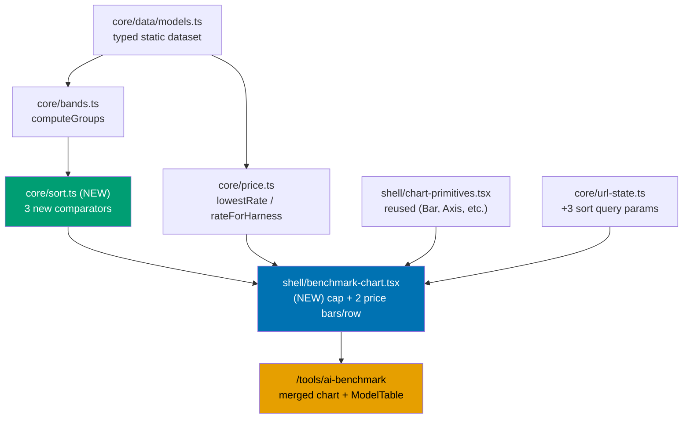

# AI Benchmark Merged Chart — `/[locale]/tools/ai-benchmark`

Replaces the AI Benchmark tool's two stacked full-width charts (capability index, token price) with
**one merged chart**: one row per model, a capability bar and its two price bars (input, output)
stacked together in that same row — plus a **per-band sort control** (Capability default / Price
low→high / Price high→low), independent per capability band.

## Context

The AI Benchmark tool at [ayokoding.com/en/tools/ai-benchmark](https://ayokoding.com/en/tools/ai-benchmark)
(built by the prior plan
[`ayokoding-www-tools-ai-benchmark`](../../done/2026-07-30__ayokoding-www-tools-ai-benchmark/README.md))
renders a capability-index chart, then a token-price chart, stacked full-width beneath each other.
Comparing one model's capability against its price today requires scrolling between two separate
chart sections — precisely the pain point this plan addresses. The always-visible `ModelTable`
below both charts, and the harness/class filter bar above them, are unaffected and stay exactly as
they are.

Notably, the prior plan's own UI-design-funnel already evaluated and **rejected** a closely related
idea — its "Option C — Aligned Side-by-Side Comparison Grid" — specifically because a columnar
side-by-side layout "degenerates into Option A [today's stacked layout] below 768px," costing a
second layout path for a benefit that vanished on mobile (see
[`tech-docs.md` §Prior-Plan Rejection Precedent](./tech-docs.md#prior-plan-rejection-precedent)).
This plan's selected design is **not** that rejected layout — it stacks the capability bar and both
price bars **vertically within one model row**, so the same DOM structure renders at every
breakpoint (mobile, tablet, desktop) with no layout switch, avoiding Option C's exact failure mode.

## Scope

**In scope**

- A new merged chart component (`shell/benchmark-chart.tsx`) replacing `capability-chart.tsx` and
  `price-chart.tsx`, which are deleted.
- Three bars per rated (opus/sonnet/light) model row: capability, price-in, price-out — reusing
  `core/price.ts` and `chart-primitives.tsx` unchanged.
- A per-band sort control (`FilterSelect`-styled native `<select>`) for each of the three RATED
  bands (opus/sonnet/light — the `unrated` band has no composite index to sort by and never had a
  control), three options: Capability (default, descending), Price low→high, Price high→low —
  sorting by the **output rate**, tie-broken by input rate.
- New pure comparator module `core/sort.ts` (`byCapabilityDesc`, `byPriceAsc`, `byPriceDesc`).
- URL-encoded per-band sort state (`sortOpus`, `sortSonnet`, `sortLight` query params), extending
  `core/url-state.ts`. (A `sortUnrated` param existed briefly and round-tripped despite having no
  rendering effect — removed as dead code in the PR #125 fixer cycle.)
- A new Design Decision (DD-1) for how a **rated** model billed only by subscription (no metered
  rate) renders inline within its own row — see
  [`tech-docs.md` §DD-1](./tech-docs.md#dd-1--rated--subscription-only-model-rendering).
- Rewriting the now-obsolete "two charts" Gherkin scenarios in the existing
  `specs/apps/ayokoding/behavior/ayokoding-www/gherkin/tools/ai-benchmark.feature`, plus new sort
  scenarios, in place (no new sibling feature file).

**Out of scope**

- `model-table.tsx` (the accessible full-data table) — untouched.
- `benchmark-filters.tsx` (harness/class filter bar) — no behavioral change to its own filter
  bar, other than the backward-compatible `allLabel?` widening of the shared `FilterSelect`
  required by the PR #125 cycle-1 sort-dropdown fix.
- Any new benchmark, price, or model data — the dataset (`core/data/models.ts`) is unchanged.
- Any runtime data fetch — the dataset stays static, per the prior plan's own scope.
- A backend, API, or database.

## Approach summary

The merged chart follows the same **functional core / imperative shell** split as every other
`ai-benchmark` module: `core/sort.ts` is pure, `shell/benchmark-chart.tsx` only renders and reads
URL state, exactly mirroring `src/features/cost-of-living-calculator/`.

## Documents

| Document                         | Contains                                                                           |
| -------------------------------- | ---------------------------------------------------------------------------------- |
| [`brd.md`](./brd.md)             | Why this merge exists, affected roles, business risks, success signals             |
| [`prd.md`](./prd.md)             | Personas, user stories, the complete UI design funnel, Gherkin acceptance criteria |
| [`tech-docs.md`](./tech-docs.md) | Architecture, DD-1, file impact, prior-plan rejection precedent, rollback          |
| [`delivery.md`](./delivery.md)   | Phased, TDD-shaped delivery checklist with phase gates and delivery boundaries     |
| [`learnings.md`](./learnings.md) | Knowledge Capture running log, triaged before archival                             |

## Delivery at a glance

- **Delivery Mode**: `worktree-to-pr` — see [`delivery.md`](./delivery.md#delivery-mode-worktree-to-pr).
- **Worktree**: `worktrees/ayokoding-www-ai-benchmark-merged-chart/` — see [`delivery.md`](./delivery.md#worktree).
- **Target app**: `apps/ayokoding-www` (port 3101, prod branch `prod-ayokoding-www`).

## Related

- [`plans/done/2026-07-30__ayokoding-www-tools-ai-benchmark/`](../../done/2026-07-30__ayokoding-www-tools-ai-benchmark/README.md) —
  the plan that built this page; this plan modifies its output.
- [Cost-of-living calculator feature](../../../apps/ayokoding-www/src/features/cost-of-living-calculator/) —
  the FCIS precedent both plans follow.
