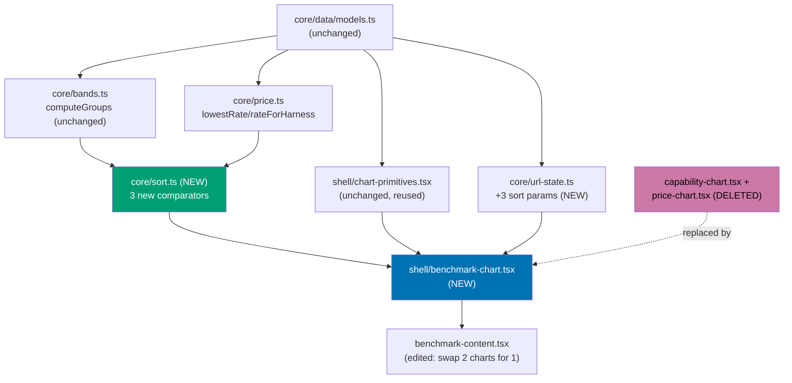
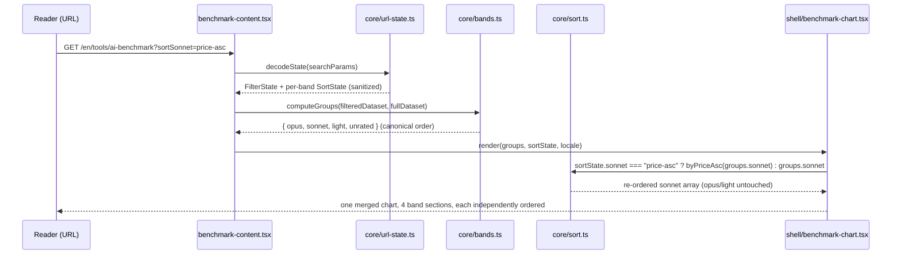
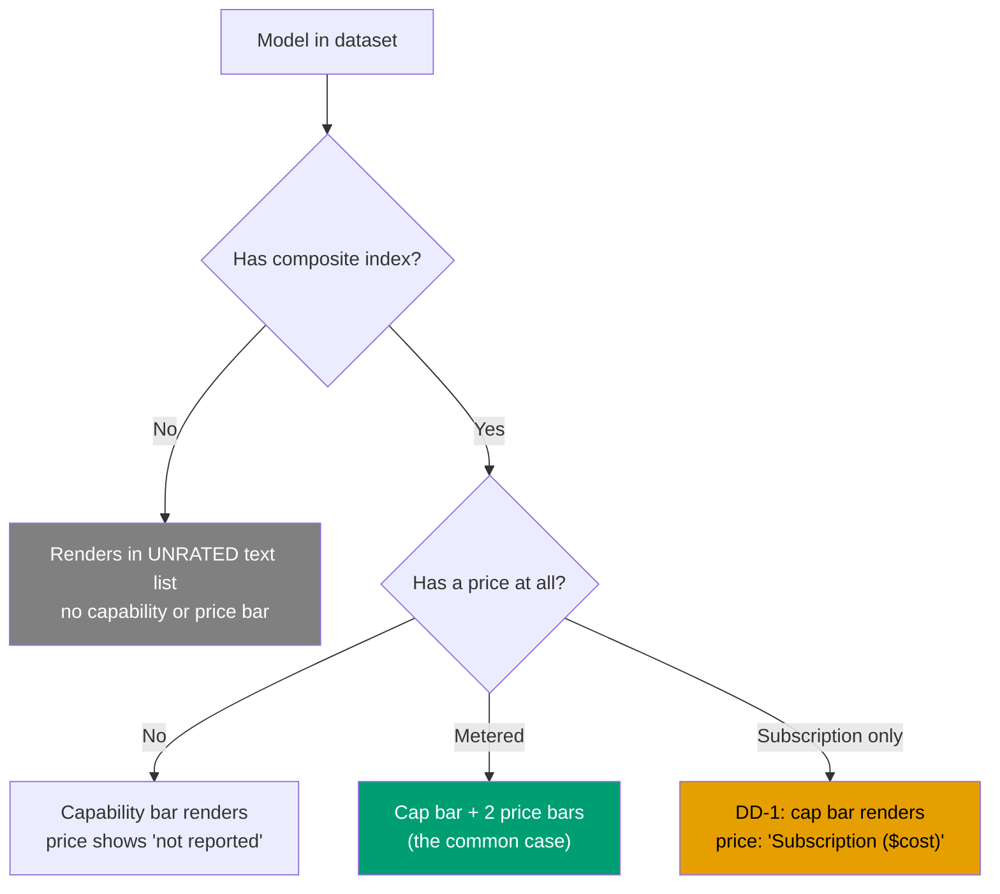

# Technical Documentation — AI Benchmark Merged Chart

## Architecture

## Prior-Plan Rejection Precedent

The prior plan `[Repo-grounded — plans/done/2026-07-30__ayokoding-www-tools-ai-benchmark/prd.md
lines 243-322, accessed 2026-07-30]` drafted an "Option C — Aligned Side-by-Side Comparison Grid"
during its own UI-design-funnel — capability and price columns side by side, sharing one row per
model, so a model's capability bar and price bars sit on the same row. It was carried to hi-fi
(`plans/done/2026-07-30__ayokoding-www-tools-ai-benchmark/assets/ai-benchmark-option-c-side-by-side.png`)
and explicitly **rejected**, with this reasoning quoted verbatim:

> "Option C's single virtue — reading capability and price on one row — only exists at `lg`. Below
> `768px` it must stack, becoming Option A with an extra layout path to test and maintain."

This plan's user-requested merge is **not a re-litigation of that decision** — it targets the same
underlying goal (capability and price on one row) via a genuinely different layout that does not
share Option C's failure mode:

| Property                     | Prior plan's rejected Option C                            | This plan's selected Option A                                        |
| ---------------------------- | --------------------------------------------------------- | -------------------------------------------------------------------- |
| Row layout                   | Three side-by-side **columns** (model \| cap \| price)    | One column, three **vertically stacked bars** beneath the model name |
| Below `768px`                | Columns cannot survive — must reflow into a second layout | Same stacked-bar structure survives unchanged at every width         |
| Number of DOM layouts needed | 2 (desktop grid + collapsed mobile fallback)              | 1 (identical structure everywhere, only bar pixel widths scale)      |

This is why the user's own follow-up question (Q10 in the pre-write grill) — "same structure at ALL
breakpoints — stacked bars per model row, full width, bar length scales with viewport, no layout
switch at any breakpoint" — is not merely a preference but the specific property that avoids
repeating the prior plan's own documented rejection reasoning.

## DD-1 — Rated + subscription-only model rendering

**Decision**: a model that has a composite capability index (i.e., belongs to the opus, sonnet, or
light band) but whose ONLY price is a flat-rate subscription (no metered per-token rate on any
harness) renders its capability bar normally in its band, and shows `Subscription ($cost)` text
(reusing `model-table.tsx`'s existing subscription-cell text pattern, not a new component) in place
of its two price bars, within that same row.

**Why this needed a documented decision rather than a direct carry-over**: today's TWO SEPARATE
charts handle this case differently from each other. `capability-chart.tsx` never looks at price at
all — a subscription-only-but-rated model gets a normal capability bar with no special case.
`price-chart.tsx` pulls EVERY subscription-only model, rated or not, out of its band's bar group and
into one global cross-band "subscription" text list at the bottom of the price chart, regardless of
whether it has a capability bar elsewhere. Once the two charts merge into one row-per-model view,
literally reproducing `price-chart.tsx`'s old behavior would mean a rated model's row shows a
capability bar with an empty gap where its price bars would be, while its price appears again,
disconnected, in a list at the bottom — defeating the entire point of the merge for exactly the
models where a subscription is common (Claude-family harness bundles).

**Resolution**: reuse `model-table.tsx`'s already-shipped, already-tested inline text cell
(`${t(locale, "aiBenchSubscription")} (${formatPriceUsd(rate.planCostUsd, locale)})`) as the row's
price-area content for this case — this is not new UI invention (Q3's constraint), it is reusing a
pattern that already exists elsewhere in this same feature, just not yet inside a chart component.
The GLOBAL cross-band subscription-only text list from the old `price-chart.tsx` is retained ONLY
for models that are ALSO unrated (no composite index at all, so they have no row to attach the
subscription text to) — this is the unrated case Q3 already covered, unchanged.

**Flagged for the post-write grill**: this decision resolves a case the user's Q3 answer did not
literally anticipate (Q3 named the two existing GLOBAL list treatments; a rated-but-subscription-only
model is a THIRD case those lists don't cleanly cover). The reasoning above is offered as the most
conservative, zero-new-invention resolution, but it is explicitly re-surfaced for confirmation
before execution begins.

## DD-8 — Harness-specific price display is preserved unchanged

**Decision**: the merged chart threads an optional `harness?: HarnessId` prop through to its price
bars, mirroring `price-chart.tsx`'s existing behavior exactly: with no harness filter active, both
price bars use each model's lowest available harness rate (`lowestRate`, AC-17); with a harness
filter active, both price bars switch to that harness's own rate (`rateForHarness`, AC-18).

**Why this needed a documented decision rather than a silent carry-over**: `price-chart.tsx`
currently receives `harness={filterState.harness}` from `benchmark-content.tsx` (line 100 there
today), and this behavior is covered by two existing, currently-passing Gherkin scenarios (AC-17,
AC-18). Neither this plan's Diverge/Narrow/Select/Justify funnel above, nor any of the eleven new
Acceptance Criteria scenarios, mentioned harness-specific pricing at all — an easy silent omission
once the two charts collapse into one, since none of the merge's own stated goals (capability +
price together, per-band sort) individually requires touching the harness prop. Wiring the merged
chart without it would regress a currently-shipped, currently-tested behavior with no record of the
decision anywhere in this plan.

**Resolution**: this is not a new design choice weighed against alternatives — `brd.md`'s Business
Scope Non-Goals already state "no change to the harness/class filter bar's own behavior" as
out-of-scope (OOS-4 in `prd.md`), which implies the harness-driven price display must carry over
unchanged, not merely that the URL param mechanics stay the same. DD-8 makes that implication
explicit and traceable: `BenchmarkChart` accepts `harness`, `benchmark-content.tsx` passes
`filterState.harness` to it exactly as it does to `price-chart.tsx` today, and the RED/GREEN cycle
in Phase 2 and the wiring step in Phase 3 both name it directly (see `delivery.md`).

## Design decisions (from the pre-write grill)

| #    | Decision                                                                                             | Rationale                                                                                                                                                                                                                                                                                                                                                                                                                                                                                                                 |
| ---- | ---------------------------------------------------------------------------------------------------- | ------------------------------------------------------------------------------------------------------------------------------------------------------------------------------------------------------------------------------------------------------------------------------------------------------------------------------------------------------------------------------------------------------------------------------------------------------------------------------------------------------------------------- |
| DD-2 | Two price bars (input, output) per rated model row — not one combined bar                            | Preserves the full price-detail precision `price-chart.tsx` already shows in production                                                                                                                                                                                                                                                                                                                                                                                                                                   |
| DD-3 | Sort by output rate, input as tie-break                                                              | Output tokens dominate real task cost; keeps sort and plotted value consistent (Q1/Q2)                                                                                                                                                                                                                                                                                                                                                                                                                                    |
| DD-4 | Per-band sort state lives in the URL for the three RATED bands (`sortOpus`/`sortSonnet`/`sortLight`) | Matches the page's existing "URL is the single source of truth for view state" architecture. **Correction (pr-review-synthesis-maker MEDIUM finding, PR #125 fixer cycle):** an earlier `sortUnrated` param round-tripped through `SORT_PARAM_KEYS` despite the `unrated` band never being sorted (no composite index, no dropdown) — removed as dead code rather than wired up, since implementing real per-band sorting for the unrated list would be a new feature requiring its own design, not a fix to this defect. |
| DD-5 | New comparators live in `core/sort.ts`, not `core/bands.ts`                                          | `bands.ts`'s docstring scopes it to class-band decision logic; sort-for-display is a separate concern                                                                                                                                                                                                                                                                                                                                                                                                                     |
| DD-6 | `chart-primitives.tsx` is reused fully, unmodified                                                   | Preserves the WCAG-AA-audited, token-driven colour system; avoids duplicated SVG code                                                                                                                                                                                                                                                                                                                                                                                                                                     |
| DD-7 | The existing `ai-benchmark.feature` is extended in place, not forked into a sibling file             | Same Feature under test; a second file would invite scenario drift and leave demonstrably false scenarios in the original                                                                                                                                                                                                                                                                                                                                                                                                 |
| DD-8 | `BenchmarkChart` threads an optional `harness` prop, preserving AC-17/AC-18 unchanged                | `price-chart.tsx` already receives `filterState.harness`; dropping it silently regresses a currently-shipped behavior — see the dedicated DD-8 section above                                                                                                                                                                                                                                                                                                                                                              |

## File impact

| File                                                                                | Change                                                                                                                                                                                                                                                         |
| ----------------------------------------------------------------------------------- | -------------------------------------------------------------------------------------------------------------------------------------------------------------------------------------------------------------------------------------------------------------- |
| `apps/ayokoding-www/src/features/ai-benchmark/shell/capability-chart.tsx`           | **Deleted**                                                                                                                                                                                                                                                    |
| `apps/ayokoding-www/src/features/ai-benchmark/shell/capability-chart.test.tsx`      | **Deleted**                                                                                                                                                                                                                                                    |
| `apps/ayokoding-www/src/features/ai-benchmark/shell/price-chart.tsx`                | **Deleted**                                                                                                                                                                                                                                                    |
| `apps/ayokoding-www/src/features/ai-benchmark/shell/price-chart.test.tsx`           | **Deleted**                                                                                                                                                                                                                                                    |
| `apps/ayokoding-www/src/features/ai-benchmark/shell/chart-order-parity.test.tsx`    | **Rewritten** — asserts the merged chart's own internal row order matches `computeGroups`, per band, per sort mode                                                                                                                                             |
| `apps/ayokoding-www/src/features/ai-benchmark/shell/benchmark-chart.tsx`            | **New file** — the merged chart component; accepts an optional `harness` prop (DD-8)                                                                                                                                                                           |
| `apps/ayokoding-www/src/features/ai-benchmark/shell/benchmark-chart.test.tsx`       | **New file**                                                                                                                                                                                                                                                   |
| `apps/ayokoding-www/src/features/ai-benchmark/core/sort.ts`                         | **New file** — `byCapabilityDesc`, `byPriceAsc`, `byPriceDesc`                                                                                                                                                                                                 |
| `apps/ayokoding-www/src/features/ai-benchmark/core/sort.unit.test.ts`               | **New file**                                                                                                                                                                                                                                                   |
| `apps/ayokoding-www/src/features/ai-benchmark/core/url-state.ts`                    | **Edited** — adds `sortOpus`/`sortSonnet`/`sortLight` params + sanitizers (a `sortUnrated` param existed briefly and was removed as dead code — see DD-4's correction)                                                                                         |
| `apps/ayokoding-www/src/features/ai-benchmark/core/url-state.unit.test.ts`          | **Edited** — new sort-param encode/decode/sanitize cases                                                                                                                                                                                                       |
| `apps/ayokoding-www/src/features/ai-benchmark/core/filter.ts`                       | **Unchanged** — `HARNESS_IDS`/`BANDS` stay the single source of truth                                                                                                                                                                                          |
| `apps/ayokoding-www/src/app/[locale]/tools/ai-benchmark/benchmark-content.tsx`      | **Edited** — replaces `<CapabilityChart>` + `<PriceChart>` with `<BenchmarkChart>`, threading `harness={filterState.harness}` (DD-8)                                                                                                                           |
| `apps/ayokoding-www/src/app/[locale]/tools/ai-benchmark/benchmark-content.test.tsx` | **Edited** — updated render assertions                                                                                                                                                                                                                         |
| `apps/ayokoding-www/test/unit/fe-steps/ai-benchmark.steps.tsx`                      | **Edited** — every `CapabilityChart`/`PriceChart` direct-render and container-query binding re-pointed at `BenchmarkChart`                                                                                                                                     |
| `apps/ayokoding-www/src/features/i18n/core/translations.ts`                         | **Edited** — new `aiBenchSortLabel`/`aiBenchSortCapability`/`aiBenchSortPriceAsc`/`aiBenchSortPriceDesc` keys, both locales                                                                                                                                    |
| `specs/apps/ayokoding/behavior/ayokoding-www/gherkin/tools/ai-benchmark.feature`    | **Edited** — rewrite every scenario naming "capability chart"/"price chart"/"both charts"; add merged-row + per-band-sort scenarios                                                                                                                            |
| `apps/ayokoding-www/src/features/ai-benchmark/shell/benchmark-filters.tsx`          | **Edited (PR #125 cycle-1 fix)** — no behavioral change to its own filter bar; widens `FilterSelectProps.allLabel` from required to optional (backward-compatible) and guards the empty-option render, to support reusing `FilterSelect` for the sort dropdown |

No change to: `core/data/models.ts`, `core/data/benchmarks.ts`, `core/data/operators.ts`,
`core/bands.ts`, `core/price.ts`, `core/score.ts`, `shell/model-table.tsx`,
`shell/how-to-read.tsx`, `shell/evidence-badge.tsx`,
`shell/figure-cell.tsx`, `shell/format.ts`, `shell/band-tokens.unit.test.ts`.

## UI-design-funnel exemption

Not applicable — this plan is UI-bearing (it changes a rendered screen under `apps/`). The full
funnel (Diverge/Narrow/Select/Justify, R5 grounding, R7 prior art, responsive strategy) is authored
in `prd.md` per the [UI Mockups in Plan Docs convention](../../../repo-governance/conventions/formatting/diagrams/ui-mockups-principles-and-scope.md#ui-mockups-in-plan-docs-principles-in-practice-and-scope).

## Dependencies

No new package dependency `[Repo-grounded — apps/ayokoding-www/package.json has no charting library;
`mermaid@11`is a content renderer, not a data-viz primitive, same finding the prior plan already
made and re-verified here]`. The merged chart is hand-rolled inline SVG, exactly like the two
components it replaces.

## Testing strategy

| Acceptance criterion (prd.md)                                            | Test level                                                                                                               |
| ------------------------------------------------------------------------ | ------------------------------------------------------------------------------------------------------------------------ |
| A rated model's row carries capability + both price bars together        | Unit (`benchmark-chart.test.tsx`, React Testing Library, jsdom)                                                          |
| Bar length is proportional to its own value                              | Unit (`benchmark-chart.test.tsx`, asserting `width` attributes)                                                          |
| A band's sort control reorders only that band                            | Unit (`benchmark-chart.test.tsx`) + Unit (`sort.unit.test.ts` for the comparators)                                       |
| A band's sort choice is encoded in the URL                               | Unit (`url-state.unit.test.ts`)                                                                                          |
| An unknown sort value in the URL falls back to the default               | Unit (`url-state.unit.test.ts`, sanitizer edge case)                                                                     |
| A rated model billed only by subscription shows inline subscription text | Unit (`benchmark-chart.test.tsx`, DD-1 fixture)                                                                          |
| An unrated model still renders in the existing text-only list            | Unit (`benchmark-chart.test.tsx`)                                                                                        |
| The merged chart keeps its accessible name and text alternative          | Unit (`benchmark-chart.test.tsx`, `role="img"` + `<title>` assertion) + manual Playwright (`browser_snapshot`)           |
| The merged chart uses the identical DOM structure at every breakpoint    | Manual Playwright (`browser_resize` at 375/768/1280px + `browser_snapshot` diff) — jsdom cannot assert real viewport CSS |
| Models are ordered identically before and after a sort change            | Unit (`sort.unit.test.ts`, set-equality assertion pre/post sort)                                                         |

Every scenario above maps to Gherkin steps bound via the existing `vitest-cucumber` harness this
feature already uses (`ai-benchmark.steps.tsx`, if present, or the pattern
`bands.ts`'s Phase 4 binding established) — `delivery.md`'s RED steps name the exact spec file.

## Rollback

Reverting this plan's PR restores `capability-chart.tsx` and `price-chart.tsx` verbatim (git
revert), which is a clean rollback since no dataset or scoring-core file is touched. The Gherkin
feature file's rewritten scenarios revert along with the same PR.
