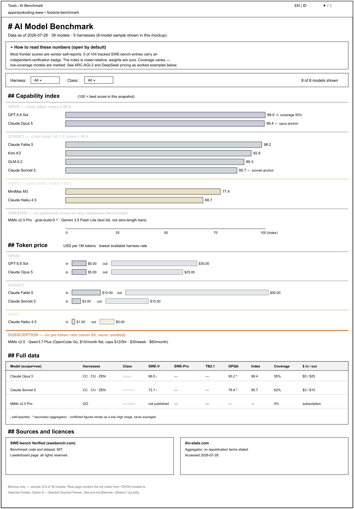

# Product Requirements — AI Benchmark Tool

> **WHAT gets built.** The business reasoning behind it lives in [`brd.md`](./brd.md); the method and
> the cited data snapshot live in [`tech-docs.md`](./tech-docs.md).

## Product overview

A single public page at `/[locale]/tools/ai-benchmark` on `apps/ayokoding-www` that renders, from a
static versioned dataset:

1. A **capability chart** — one horizontal bar per model, length proportional to a composite
   capability index, grouped into three named capability classes plus an `unrated` group.
2. A **price chart** — per model, a labelled input-token bar and a labelled output-token bar in
   USD per 1M tokens, grouped into the same classes.
3. An **always-visible data table** carrying every figure both charts encode, plus the evidence grade
   and source for each.
4. **Harness and class filters** whose state lives in the URL, so a filtered view is linkable.
5. An **honesty surface** — a "How to read these numbers" disclosure, per-figure evidence grades, and
   a Sources and Licences section.

The three capability classes are named after the models that define their boundaries:

| Class     | Definition                                                                   |
| --------- | ---------------------------------------------------------------------------- |
| `opus`    | Composite capability index at or above Claude Opus 5's index                 |
| `sonnet`  | At or above Claude Sonnet 5's index, and below Claude Opus 5's               |
| `light`   | Below Claude Sonnet 5's index                                                |
| `unrated` | No published score on any of the four composite benchmarks — index undefined |

`unrated` is a fourth **group**, not a fourth class. It exists because a model with no published
score is not "below" anything, and suppressing such models would violate the plan's no-dropping
rule. It is always labelled in text.

## Personas

Solo-maintainer repository — the first three are hats the maintainer wears; the last is the audience.

| Persona                      | Goal                                                                          | Frustration this page removes                                         |
| ---------------------------- | ----------------------------------------------------------------------------- | --------------------------------------------------------------------- |
| **Harness user** (public)    | Pick a model inside Codex / Claude Code / Cursor / OpenCode and know its cost | No cross-harness view; each roster is a vendor silo                   |
| **Budget-conscious builder** | Find the cheapest model that still clears a capability bar                    | Capability tables and pricing tables are never the same table         |
| **Repo governance owner**    | Set agent model tiers in `model-selection.md` from current data               | The backing reference doc drifts and is hand-maintained               |
| **Sceptical reader**         | Know how much to trust each number before acting on it                        | Leaderboards present self-reported figures with no provenance marking |

## User stories

- **US-1** — As a **harness user**, I want to see every model I can select in my harness on one
  chart, so that I do not have to open five vendor rosters.
- **US-2** — As a **harness user**, I want models grouped into three named capability classes, so
  that I can shortlist without reading forty numbers.
- **US-3** — As a **budget-conscious builder**, I want input and output token prices beside the
  capability ranking, so that I can see the capability-per-dollar trade-off in one place.
- **US-4** — As a **budget-conscious builder**, I want to filter to a single harness, so that the
  prices shown are the ones I will actually be charged.
- **US-5** — As a **sceptical reader**, I want every figure marked with how well it is evidenced and
  linked to its source, so that I can discount a vendor self-report appropriately.
- **US-6** — As a **sceptical reader**, I want the page to tell me what it cannot tell me — which
  scores are missing, which are contested, which benchmark was reportedly gamed — so that I am not
  misled by a confident-looking chart.
- **US-7** — As a **screen-reader or low-vision user**, I want every figure the charts encode to be
  available as text in a table, so that the page is fully usable without perceiving colour or length.
- **US-8** — As an **Indonesian-speaking reader**, I want the whole page in Bahasa Indonesia, so that
  the tool is as usable to me as to an English reader.
- **US-9** — As a **repo governance owner**, I want `docs/reference/ai-model-benchmarks.md` generated
  from the same dataset, so that the public page and the governance doc cannot disagree.
- **US-10** — As a **content maintainer**, I want a refresh runbook, so that updating the snapshot is
  a bounded, repeatable task rather than a research project.

## UI design funnel

> **Scope note** — this plan is **UI-bearing**: it adds a user-facing screen under `apps/`. The full
> diverge → narrow → select → justify funnel is therefore mandatory and is recorded below in this
> file, per the
> [UI Mockups in Plan Docs convention](../../../repo-governance/conventions/formatting/diagrams/ui-mockups-principles-and-scope.md#ui-mockups-in-plan-docs-principles-in-practice-and-scope).

### R5 grounding note — what already exists

Surveyed before drafting any alternative `[Repo-grounded]`:

| Surface                                                     | What it gives this page                                                                                                                                                                                                                       |
| ----------------------------------------------------------- | --------------------------------------------------------------------------------------------------------------------------------------------------------------------------------------------------------------------------------------------- |
| `libs/web-ui` (`@open-sharia-enterprise/web-ui`)            | `Tabs`, `TabsList`, `TabsTrigger`, `TabsContent`, `cn` — already consumed by `calculator-content.tsx`; also `Table` (primitive — base for `model-table.tsx`), `Badge` (component + primitive — base for `evidence-badge.tsx`)                 |
| `libs/web-ui-token/src/ayokoding.css`                       | Six semantic hues (`--hue-terracotta/honey/sage/teal/sky/plum`), each with an `-ink` (text-on-wash) and `-wash` (tinted background) variant, defined for **both** light and dark themes; a `--warm-*` neutral scale; radius and shadow scales |
| `apps/ayokoding-www/src/app/globals.css`                    | The app's `@theme` brand overrides — where app-local tokens would go if they did not need a dark-mode twin                                                                                                                                    |
| `src/features/cost-of-living-calculator/shell/`             | The table, filter-bar, and controls patterns this page mirrors: plain semantic `<table>`, filter components taking value + `onChange`                                                                                                         |
| `src/features/cost-of-living-calculator/core/url-state.ts`  | The pure encode/decode/sanitize URL-state pattern, defaults omitted from the query string                                                                                                                                                     |
| `src/app/[locale]/tools/cost-of-living-calculator/page.tsx` | The route shape: a thin server page with `generateMetadata`, wrapping a `"use client"` content component in `<Suspense>`                                                                                                                      |

**Net-new components** (named explicitly, per R5):

- `shell/capability-chart.tsx` — banded horizontal-bar inline SVG
- `shell/price-chart.tsx` — banded grouped-bar inline SVG (input + output)
- `shell/chart-primitives.tsx` — shared axis, bar, band-group, and legend SVG parts
- `shell/model-table.tsx` — the accessible data table
- `shell/benchmark-filters.tsx` — harness + class filter bar
- `shell/evidence-badge.tsx` — the per-figure evidence-grade marker
- `shell/how-to-read.tsx` — the honesty disclosure block

No chart library is added `[Repo-grounded — no charting dependency in apps/ayokoding-www/package.json;
`mermaid@11`is present but is a client-side content renderer, not a data-viz primitive]`.

### R7 prior-art citation

Prior art consulted for how comparable tools present a capability-versus-price comparison
`[Web-cited — see tech-docs.md §Appendix A for the full digest, accessed 2026-07-28]`:

| Prior art                                                                         | What it does well                                                                                                                                           | What this page does differently                                                       |
| --------------------------------------------------------------------------------- | ----------------------------------------------------------------------------------------------------------------------------------------------------------- | ------------------------------------------------------------------------------------- |
| Artificial Analysis Intelligence Index                                            | Pairs a capability index with a cost-per-task axis on one scatter                                                                                           | Their ToU restrict copying the site, and their weighting is theirs — we publish ours  |
| [llm-stats.com](https://llm-stats.com/benchmarks/swe-bench-verified) leaderboards | Per-entry verification badges, which is where the "0 of 104" finding came from (cited source: [tech-docs.md §DD-19](./tech-docs.md#dd-19--evidence-grades)) | We surface the evidence grade inline on every figure rather than as a separate column |
| ARC Prize leaderboard                                                             | Shows only independently-verified scores, refusing to display press claims                                                                                  | We show self-reports but grade them, because refusing them would empty the roster     |
| Vendor pricing pages (Anthropic, OpenAI, Google…)                                 | Authoritative per-model rates                                                                                                                               | We show the **harness's** rate, because that is what the reader is charged            |

The divergent alternatives below are informed by this survey: the scatter-plot idea comes from
Artificial Analysis, the inline evidence badge from llm-stats, and the refusal to average conflicted
figures from ARC Prize's display policy.

### Diverge — three named low-fidelity alternatives

#### Option A — Banded Stacked Panels

Two full-width chart panels stacked vertically; each panel is internally grouped into the three
class bands plus `unrated`. The literal reading of "two diagrams split into three classes".

```text
DESKTOP (lg ≥ 1024px)
┌──────────────────────────────────────────────────────────────────────────┐
│ Tools › AI Benchmark                                     [EN|ID] [☀/🌙] │
├──────────────────────────────────────────────────────────────────────────┤
│ # AI Model Benchmark                                                     │
│ Data as of 2026-07-28 · 39 models · 5 harnesses                          │
│                                                                          │
│ ▸ How to read these numbers  (open by default)                           │
│   Most frontier scores are vendor self-reports. 0 of 104 tracked         │
│   SWE-bench entries carry an independent-verification badge. …           │
├──────────────────────────────────────────────────────────────────────────┤
│ Harness: [ All ▾ ]   Class: [ All ▾ ]           39 of 39 models shown    │
├──────────────────────────────────────────────────────────────────────────┤
│ ## Capability index        (100 = best score in this snapshot)           │
│                                                                          │
│ ── OPUS ── index ≥ 99.4 ────────────────────────────────────────────────  │
│ GPT-5.6 Sol      ███████████████████████████████████████ 99.9  ⚠ 50%     │
│ Claude Opus 5    ███████████████████████████████████████ 99.4  ⚠ 55%     │
│                                                                          │
│ ── SONNET ── 85.7 ≤ index < 99.4 ───────────────────────────────────────  │
│ Claude Fable 5   ██████████████████████████████████████  98.2            │
│ Kimi K3          ████████████████████████████████████    92.8            │
│ GLM-5.2          ██████████████████████████████████      89.3            │
│ Claude Sonnet 5  ████████████████████████████████        85.7  ⟵ anchor  │
│                                                                          │
│ ── LIGHT ── index < 85.7 ───────────────────────────────────────────────  │
│ MiniMax M3       ████████████████████████████            77.4            │
│ Claude Haiku 4.5 ██████████████████████████              68.7            │
│                                                                          │
│ ── UNRATED ── no published score on any composite benchmark ────────────  │
│ MiMo v2.5 Pro · grok-build-0.1 · Gemini 3.5 Flash Lite                   │
│                                                                          │
│ 0        20        40        60        80       100 (index)              │
├──────────────────────────────────────────────────────────────────────────┤
│ ## Token price          USD per 1M tokens · lowest harness rate          │
│                                                                          │
│ ── OPUS ─────────────────────────────────────────────────────────────────│
│ GPT-5.6 Sol     in  █████ $5.00      out ██████████████████████ $30.00   │
│ Claude Opus 5   in  █████ $5.00      out ██████████████████ $25.00       │
│ ── SONNET ───────────────────────────────────────────────────────────────│
│ Claude Fable 5  in  ██████████ $10.00 out ████████████████████████ $50.00│
│ Claude Sonnet 5 in  ███ $3.00        out ███████████ $15.00              │
│ ── LIGHT ────────────────────────────────────────────────────────────────│
│ Claude Haiku 4.5 in █ $1.00          out ████ $5.00                      │
│ ── SUBSCRIPTION — no per-token rate ─────────────────────────────────────│
│ MiMo v2.5 · Qwen3.7 Plus  (OpenCode Go, $10/month flat)                  │
├──────────────────────────────────────────────────────────────────────────┤
│ ## Full data                                                             │
│ ┌────────────┬──────────┬───────┬──────┬──────┬──────┬──────┬────┬─────┐ │
│ │ Model      │ Harnesses│ Class │SWE-V │SWE-P │TB2.1 │GPQA  │Idx │ $   │ │
│ ├────────────┼──────────┼───────┼──────┼──────┼──────┼──────┼────┼─────┤ │
│ │ Opus 5     │ CC·Cu·Z  │ opus  │96.0ˢ │  —   │  —   │93.2ᶜ │99.4│5/25 │ │
│ └────────────┴──────────┴───────┴──────┴──────┴──────┴──────┴────┴─────┘ │
│ ˢ self-reported · ᶜ conflicted (range shown on hover + in the cell)       │
├──────────────────────────────────────────────────────────────────────────┤
│ ## Sources and licences                                                  │
└──────────────────────────────────────────────────────────────────────────┘
```

```text
MOBILE (< 768px)  — same order, one column, labels ABOVE bars
┌───────────────────────────────┐
│ AI Model Benchmark            │
│ Data as of 2026-07-28         │
│ ▸ How to read these numbers   │
├───────────────────────────────┤
│ ▸ Filters (2 active)          │  ← collapsed disclosure, sticky
├───────────────────────────────┤
│ Capability index              │
│ ── OPUS ─────────────────────  │
│ GPT-5.6 Sol            99.9   │  ← label + value ABOVE the bar
│ ███████████████████████████   │
│ Claude Opus 5   99.4  ⚠ 55%   │
│ ██████████████████████████    │
│ ── SONNET ───────────────────  │
│ Claude Fable 5         98.2   │
│ ██████████████████████████    │
│ 0     25    50    75   100    │
├───────────────────────────────┤
│ Token price (USD/1M)          │
│ ── OPUS ─────────────────────  │
│ GPT-5.6 Sol                   │
│  in  $5.00   █████            │
│  out $30.00  ██████████████   │
├───────────────────────────────┤
│ Full data  (stacked cards)    │
│ ┌───────────────────────────┐ │
│ │ Claude Opus 5      opus   │ │
│ │ Harnesses  CC · Cursor · Z│ │
│ │ SWE-V      96.0 self-rep. │ │
│ │ SWE-Pro    not published  │ │
│ │ Index      99.4 (cov 55%) │ │
│ │ Price      $5 / $25       │ │
│ └───────────────────────────┘ │
└───────────────────────────────┘
```

#### Option B — Class-Tabbed Dual Chart

Three tabs (`opus` / `sonnet` / `light`); the selected tab shows both charts for that class only.

```text
┌──────────────────────────────────────────────────────────────────────────┐
│ # AI Model Benchmark      Data as of 2026-07-28                          │
│ ┌────────┬──────────┬─────────┬───────────┐                              │
│ │ OPUS 2 │ SONNET 14│ LIGHT 19│ UNRATED 4 │   ← tabs, one class visible  │
│ └────────┴──────────┴─────────┴───────────┘                              │
│ Harness: [ All ▾ ]                                                       │
│ ## Capability — opus class                                               │
│ GPT-5.6 Sol      ███████████████████████████████████████ 99.9            │
│ Claude Opus 5    ███████████████████████████████████████ 99.4            │
│ ## Price — opus class                                                    │
│ GPT-5.6 Sol      in █████ $5   out ██████████████████████ $30            │
│ ## Full data — opus class only                                           │
└──────────────────────────────────────────────────────────────────────────┘
```

#### Option C — Aligned Side-by-Side Comparison Grid

Capability and price charts side by side on desktop, sharing one vertical model axis so a model's
capability bar and price bars sit on the same row — the trade-off is read horizontally.

```text
DESKTOP
┌───────────────────┬────────────────────────┬───────────────────────────────┐
│ Model             │ Capability index       │ Price USD/1M   in ▏ out       │
├───────────────────┼────────────────────────┼───────────────────────────────┤
│ ── OPUS ──────────┼────────────────────────┼───────────────────────────────│
│ GPT-5.6 Sol       │ ███████████████ 99.9   │ ▏█████ 5.00  ▏██████████ 30.00│
│ Claude Opus 5     │ ███████████████ 99.4   │ ▏█████ 5.00  ▏████████ 25.00  │
│ ── SONNET ────────┼────────────────────────┼───────────────────────────────│
│ Claude Fable 5    │ ██████████████  98.2   │ ▏██████████ 10.0 ▏████████ 50 │
│ Claude Sonnet 5   │ ███████████     85.7   │ ▏███ 3.00    ▏██████ 15.00    │
└───────────────────┴────────────────────────┴───────────────────────────────┘
MOBILE — the two chart columns cannot survive < 768px; they stack, which
         degenerates into Option A with extra layout machinery.
```

### Narrow — the two hi-fidelity finalists

| Alternative                       | Carried to hi-fi? | Reason                                                                                                                                                                            |
| --------------------------------- | ----------------- | --------------------------------------------------------------------------------------------------------------------------------------------------------------------------------- |
| **A — Banded Stacked Panels**     | **Yes**           | Literal match to the requested "two diagrams split into three classes"; every datum is on the page with no interaction, which is what the accessibility requirement needs         |
| **B — Class-Tabbed Dual Chart**   | No — dropped      | Hides two thirds of the roster behind a tab, so the page has no complete view; fights US-7 (everything reachable without interaction) and makes cross-class comparison impossible |
| **C — Aligned Side-by-Side Grid** | **Yes**           | Best expression of the capability-versus-price trade-off, which is the page's real thesis                                                                                         |

Hi-fi finalists:



_Option A — Banded Stacked Panels (winner). See [Select](#select) and [Justify](#justify--decision-record) below._


_Option C — Aligned Side-by-Side Comparison Grid (runner-up). See [Justify](#justify--decision-record) below for why it lost._

> **Authoring note** — both tiers are now complete and binding as authored: the low-fidelity ASCII
> wireframes above, and the two hi-fidelity finalists, each committed as a hand-authored `.svg`
> source (`assets/ai-benchmark-option-a-banded-panels.svg`,
> `assets/ai-benchmark-option-c-side-by-side.svg`) rendered via `rsvg-convert` to the `.png` files
> embedded above. Per the
> [UI Mockups in Plan Docs §Both-Tiers Rule](../../../repo-governance/conventions/formatting/diagrams/ui-mockups-both-tiers-rule.md#ui-mockups-in-plan-docs-the-both-tiers-rule),
> "Plain `.png` screenshot is the high-fidelity fallback once a design is final and no longer
> iterating — it renders everywhere but is binary and must be replaced on every change"; the
> embedded `.png` satisfies this named format, and the `.svg` is kept alongside it purely as the
> editable, diffable source used to regenerate the `.png` whenever the mockup changes (rather than
> being the artefact `prd.md` embeds). Colours use the verified colour-blind-friendly palette,
> approximating the eventual `--chart-band-opus` (`#CC78BC`), `--chart-band-sonnet` (`#029E73`),
> `--chart-band-light` (`#DE8F05`), and `--chart-band-unrated` (`#808080`) tokens Phase 1 defines —
> a static image cannot reference a CSS custom property directly, so the literal hex values stand in
> for the tokens by name. Phase 1's D-1/D-2 steps no longer produce these assets from nothing — they
> **refine** the committed SVG sources against the real design tokens once Phase 1 defines them, then
> re-render the `.png` artifacts so the mockup and the shipped page cannot drift.

### Select

**Selected: Option A — Banded Stacked Panels.**

### Justify — decision record

| Criterion                                             | A — Banded Stacked Panels                            | B — Class-Tabbed               | C — Side-by-Side Grid                                                                                                             |
| ----------------------------------------------------- | ---------------------------------------------------- | ------------------------------ | --------------------------------------------------------------------------------------------------------------------------------- |
| Matches the stated requirement (2 charts × 3 classes) | **Exact**                                            | Partial — one class at a time  | Partial — one merged grid, not two diagrams                                                                                       |
| Complete view without interaction (US-7)              | **Yes**                                              | No — 3 of 4 groups hidden      | Yes on desktop only                                                                                                               |
| Cross-class comparison                                | **Yes**                                              | No                             | Yes                                                                                                                               |
| Capability-vs-price trade-off legibility              | Good — vertical scan between two panels              | Poor                           | **Best** — same row                                                                                                               |
| Mobile behaviour                                      | **Native** — horizontal bars already reflow          | Native                         | Degenerates to A below 768px, having paid for two layouts                                                                         |
| Implementation surface                                | **Smallest** — one banded-bar primitive reused twice | Medium — plus tab state in URL | Largest — a shared axis across two differently-scaled charts                                                                      |
| SSR without client JS                                 | **Full**                                             | Partial — needs JS for tabs    | Full                                                                                                                              |
| **Verdict**                                           | **Winner**                                           | Dropped — hides data           | Runner-up — its trade-off legibility is real but only on desktop, and it costs a second layout for a gain that vanishes on mobile |

**Why the runner-up lost**: Option C's single virtue — reading capability and price on one row — only
exists at `lg`. Below `768px` it must stack, becoming Option A with an extra layout path to test and
maintain. Option A recovers most of C's benefit for free by keeping the two panels in the same
vertical order with identical model ordering inside each band, so a reader scanning down finds the
same model at the same position in both panels. That ordering guarantee is a product requirement
(see AC-11) rather than an accident of layout.

### Responsive strategy — mobile-first, per breakpoint

The page is authored **mobile-first**, and responsive behaviour is a selection criterion rather than a
finishing touch: Option C lost precisely because its responsive story collapsed below `768px`. Every
element below names its responsive behaviour at each of the three breakpoints.

| Element              | Mobile (`< 768px`)                                                                             | Tablet (`md ≥ 768px`)                                           | Desktop (`lg ≥ 1024px`)                                           |
| -------------------- | ---------------------------------------------------------------------------------------------- | --------------------------------------------------------------- | ----------------------------------------------------------------- |
| Page shell           | Single column, full-bleed with `px-4`                                                          | Single column, `max-w-4xl`                                      | Single column, `max-w-6xl` (matches the tools index shell)        |
| Filters              | Collapsed `<details>` disclosure, sticky under the header, showing an active-filter count      | Inline filter bar, wraps to two rows                            | Inline filter bar, single row, with the result count on the right |
| Capability chart     | Model name and index value stacked **above** each bar (no truncation); band headers full width | Name in a left gutter, value at the bar end                     | Left gutter widened; axis ticks every 20 units; legend inline     |
| Price chart          | Each model becomes a two-line block — `in` line then `out` line, value beside each bar         | Two bars share a row with a shared model label                  | Same as tablet with a wider plot area and axis ticks              |
| Band grouping        | Band header as a full-width labelled rule; band colour as a left border on each bar            | Same                                                            | Same, plus a band summary count on the right of the rule          |
| Data table           | Reflows to stacked definition cards (one card per model, label/value rows)                     | Real `<table>` with horizontal scroll and a sticky first column | Full-width `<table>`, sticky header row and sticky first column   |
| Honesty disclosure   | `<details>` **open by default**, never collapsed away silently                                 | Same                                                            | Same, rendered as a bordered callout                              |
| Sources and licences | Stacked list                                                                                   | Two-column list                                                 | Two-column list                                                   |

**Neither chart ever becomes horizontally scrollable.** Horizontal bars are chosen precisely because
their long axis is the viewport's wide axis at every breakpoint; the model count grows the chart
downward, which mobile handles natively. This is what makes the selected design responsive by
construction rather than by media-query patching.

Each finalist was judged on this responsive behaviour, not on its desktop appearance: Option A is
responsive natively, Option C is desktop-only and reflows into Option A anyway, and Option B (dropped
earlier) was responsive but hid data at every breakpoint.

## Product scope

### In scope

| #    | Feature                                                                                                         |
| ---- | --------------------------------------------------------------------------------------------------------------- |
| F-1  | Route `/[locale]/tools/ai-benchmark` for both `en` and `id`, with localized metadata                            |
| F-2  | Tools-index entry and footer Tools-column link (added at the reveal step, see delivery Phase 10)                |
| F-3  | Typed static dataset with `snapshotDate`, per-field source URL, per-field evidence grade, per-harness price set |
| F-4  | Pure core: per-benchmark normalization, coverage-renormalized composite index, band assignment, anchor pinning  |
| F-5  | Capability chart — banded horizontal bars, axis maximum stated, value in text on every bar                      |
| F-6  | Price chart — banded grouped input/output bars, plus an explicit subscription group                             |
| F-7  | Always-visible data table with caption, header scope, and every displayed figure                                |
| F-8  | Harness and class filters with pure URL-state encode/decode/sanitize                                            |
| F-9  | Honesty surface — "How to read these numbers", per-figure evidence grades, conflicted-figure ranges             |
| F-10 | Sources and licences section naming each benchmark operator and its terms                                       |
| F-11 | Three band design tokens (light + dark), colour-blind safe and WCAG AA                                          |
| F-12 | Refresh runbook `apps/ayokoding-www/docs/ai-benchmark/data-sourcing-prompt.md`                                  |
| F-13 | `docs/reference/ai-model-benchmarks.md` data tables generated from `models.ts`, prose preserved                 |
| F-14 | Gherkin scenarios plus vitest-cucumber unit steps and `playwright-bdd` e2e steps                                |

### Out of scope

| #     | Excluded                                   | Why                                                                                         |
| ----- | ------------------------------------------ | ------------------------------------------------------------------------------------------- |
| OOS-1 | Runtime fetch of prices or scores          | The repo's proven pattern is a curated static dataset with a visible snapshot date          |
| OOS-2 | Cache / batch / long-context price tiers   | Standard tier only; tiering is recorded per row as a condition, never averaged in           |
| OOS-3 | Running any benchmark ourselves            | The page republishes with attribution; it produces no original measurement                  |
| OOS-4 | A model-recommendation engine              | The page presents data; the reader decides                                                  |
| OOS-5 | Invitation-only or preview-gated models    | Not selectable by a reader (e.g. Claude Mythos 5 is invitation-only)                        |
| OOS-6 | Models with no identifiable vendor         | Three OpenCode Zen free-tier entries have no vendor, no price and no benchmark              |
| OOS-7 | A scatter plot of capability against price | The two requested diagrams are bar charts; a scatter is a possible future refinement        |
| OOS-8 | Historical time series of scores or prices | The dataset holds one snapshot; history would need a storage design this plan does not have |

## Acceptance criteria

> Feature file: `specs/apps/ayokoding/behavior/ayokoding-www/gherkin/tools/ai-benchmark.feature`
> (AC-3 lands in the existing `tools/tools-index.feature`).
>
> Tag routing — `@unit` binds a vitest-cucumber step in
> `apps/ayokoding-www/test/unit/fe-steps/ai-benchmark.steps.tsx`; `@e2e` binds a `playwright-bdd`
> step in `apps/ayokoding-www-fe-e2e/src/steps/ai-benchmark.steps.ts`. Every scenario needs a
> `@covers` annotation in its step implementation or `specs:behavior:coverage` fails.
>
> Scenarios are authored **incrementally, phase by phase**, alongside the step definitions that
> satisfy them — never all at once — because `specs:behavior:coverage` fails on any scenario without
> a step implementation, which would red every intervening phase gate. The phase that owns each
> scenario is named in [`delivery.md`](./delivery.md).
>
> **No scenario asserts a specific model's band membership.** Band assignment is a property of the
> dataset, which is refreshed; the scenarios assert the **rules**, exercised against a fixed test
> fixture, so a data refresh cannot red the suite.

```gherkin
Feature: AI model benchmark tool

  Background:
    Given the AI benchmark dataset is loaded
```

### Routing and page shell

```gherkin
  # AC-1
  @unit @e2e
  Scenario: The English page renders its localized heading
    Given the locale is "en"
    When the AI benchmark page renders
    Then the page shows a level-one heading in English
    And the document language attribute is "en"

  # AC-2
  @unit @e2e
  Scenario: The Indonesian page renders its localized heading
    Given the locale is "id"
    When the AI benchmark page renders
    Then the page shows a level-one heading in Indonesian
    And the document language attribute is "id"

  # AC-3 — lands in tools/tools-index.feature
  @unit @e2e
  Scenario: The AI benchmark entry shows a description distinct from its link text
    Given I am on the tools index page
    When the AI benchmark entry renders
    Then the AI benchmark entry shows a description distinct from its link text
```

### Capability class bands

```gherkin
  # AC-4
  @unit
  Scenario: A model reaching the opus anchor renders in the opus band
    Given a fixture model whose composite index equals the opus anchor index
    When the capability groups are computed
    Then that model belongs to the "opus" band

  # AC-5
  @unit
  Scenario: A model between the two anchors renders in the sonnet band
    Given a fixture model whose composite index is above the sonnet anchor index
    And that model's composite index is below the opus anchor index
    When the capability groups are computed
    Then that model belongs to the "sonnet" band

  # AC-6
  @unit
  Scenario: A model below the sonnet anchor renders in the light band
    Given a fixture model whose composite index is below the sonnet anchor index
    When the capability groups are computed
    Then that model belongs to the "light" band

  # AC-7
  @unit
  Scenario: Each anchor model occupies the band it defines
    Given the two anchor models are present in the roster
    When the capability groups are computed
    Then the opus anchor belongs to the "opus" band
    And the sonnet anchor belongs to the "sonnet" band

  # AC-8
  @unit
  Scenario: A model with no published benchmark score renders in the unrated group
    Given a fixture model with no score on any composite benchmark
    When the capability groups are computed
    Then that model belongs to the "unrated" group
    And that model has no composite index

  # AC-9
  @unit
  Scenario: Every roster model belongs to exactly one capability group
    Given the full roster is loaded
    When the capability groups are computed
    Then each model appears in exactly one of "opus", "sonnet", "light", or "unrated"
```

### Composite index and coverage

```gherkin
  # AC-10
  @unit
  Scenario: A model missing a benchmark is scored over the benchmarks it has
    Given a fixture model with a score on two of the four composite benchmarks
    When its composite index is computed
    Then the index equals the weight-renormalized mean of those two normalized scores
    And its coverage ratio equals the summed weight of those two benchmarks divided by one hundred

  # AC-11
  @unit
  Scenario: Models are ordered identically in both charts within a band
    Given the full roster is loaded
    When both charts are rendered
    Then each band lists its models in the same order in the capability chart and the price chart

  # AC-12
  @unit
  Scenario: A low-coverage model is marked as low coverage
    Given a fixture model whose coverage ratio is below the low-coverage threshold
    When the capability chart is rendered
    Then that model's row carries a low-coverage marker
    And the marker states the model's coverage ratio in text
```

### Capability chart

```gherkin
  # AC-13
  @unit
  Scenario: Bar length is proportional to the composite index
    Given two fixture models whose composite indices differ
    When the capability chart is rendered
    Then the ratio of their bar lengths equals the ratio of their composite indices
    And the chart states its axis maximum

  # AC-14
  @unit
  Scenario: Every capability bar carries its model name and index in text
    Given the full roster is loaded
    When the capability chart is rendered
    Then every bar has a text label carrying the model name
    And every bar has a text label carrying its numeric composite index
```

### Price chart

```gherkin
  # AC-15
  @unit
  Scenario: A metered model shows separate labelled input and output bars
    Given a fixture model with a per-token input rate and output rate
    When the price chart is rendered
    Then that model has one bar labelled as the input rate
    And that model has one bar labelled as the output rate

  # AC-16
  @unit
  Scenario: A subscription-only model renders in the subscription group
    Given a fixture model available only under a flat-rate subscription
    When the price chart is rendered
    Then that model appears in the subscription group
    But that model renders no per-token bar and no zero value

  # AC-17
  @unit
  Scenario: An unfiltered price chart shows the lowest harness rate
    Given a fixture model priced differently by two harnesses
    When the price chart is rendered without a harness filter
    Then that model's bars use the lower of the two harness rates
    And the chart states that it shows the lowest available harness rate

  # AC-18
  @unit @e2e
  Scenario: A harness filter switches the price chart to that harness's rate
    Given a fixture model priced differently by two harnesses
    When the harness filter selects the more expensive harness
    Then that model's bars use that harness's rate
```

### Data table

```gherkin
  # AC-19
  @unit
  Scenario: The data table is present without any interaction
    Given the full roster is loaded
    When the page first renders
    Then a data table is present in the document
    And the table has a caption
    And every table header cell declares a scope

  # AC-20
  @unit
  Scenario: The table carries every figure the charts encode
    Given the full roster is loaded
    When the data table is rendered
    Then each model row lists its harnesses, class, every benchmark score, composite index, coverage ratio, input price, and output price

  # AC-21
  @unit
  Scenario: Every figure in the table carries an evidence grade
    Given the full roster is loaded
    When the data table is rendered
    Then every benchmark score cell carries an evidence grade marker
    And every price cell carries an evidence grade marker
```

### Filters and URL state

```gherkin
  # AC-22
  @unit @e2e
  Scenario: The page with no query parameters shows the whole roster
    Given the URL carries no query parameters
    When the page renders
    Then every roster model is shown in the data table

  # AC-23
  @unit @e2e
  Scenario: A harness parameter narrows both charts and the table
    Given the URL carries a harness parameter naming a known harness
    When the page renders
    Then only models that harness exposes are shown in the capability chart
    And only models that harness exposes are shown in the price chart
    And only models that harness exposes are shown in the data table

  # AC-24
  @unit
  Scenario: A class parameter narrows both charts and the table
    Given the URL carries a class parameter naming a known band
    When the page renders
    Then only models in that band are shown in the capability chart
    And only models in that band are shown in the price chart
    And only models in that band are shown in the data table

  # AC-25
  @unit
  Scenario: Harness and class parameters intersect
    Given the URL carries both a harness parameter and a class parameter
    When the page renders
    Then only models satisfying both filters are shown

  # AC-26
  @unit
  Scenario: An unrecognized filter value falls back to the unfiltered view
    Given the URL carries a harness parameter with an unknown value
    When the page renders
    Then every roster model is shown
    But no error is surfaced to the reader

  # AC-27
  @e2e
  Scenario: A reloaded filtered URL reproduces the same view
    Given the reader has applied a harness filter and a class filter
    When the reader reloads the resulting URL
    Then the same filtered set of models is shown

  # AC-28
  @unit @e2e
  Scenario: A filter combination matching no model renders an explicit empty state
    Given the URL carries a filter combination that matches no model
    When the page renders
    Then an explicit empty-state message is shown
    But neither chart renders an empty plot area
```

### Provenance, freshness, and honesty

```gherkin
  # AC-29
  @unit
  Scenario: The page displays the dataset snapshot date
    Given the dataset carries a snapshot date
    When the page renders
    Then the snapshot date is shown in text

  # AC-30
  @unit
  Scenario: Every benchmark figure links to the source it came from
    Given the full roster is loaded
    When the data table is rendered
    Then every benchmark score cell resolves to a source link
    And every price cell resolves to a source link

  # AC-31
  @unit
  Scenario: A conflicted figure renders as a range rather than a single number
    Given a fixture model whose benchmark figure has conflicting published values
    When the data table is rendered
    Then that cell shows the lowest and highest published values
    But that cell shows no averaged value

  # AC-32
  @unit
  Scenario: The page discloses that frontier scores are overwhelmingly vendor-reported
    Given the page carries a how-to-read disclosure
    When the page renders
    Then the disclosure states that most frontier benchmark scores are vendor self-reported
    And the disclosure is visible without interaction

  # AC-33
  @unit
  Scenario: The page names a known benchmark-integrity finding beside the model it concerns
    Given the dataset records a benchmark-integrity note for a model
    When that model is rendered in the data table
    Then the integrity note is reachable from that model's row

  # AC-34
  @unit
  Scenario: The page carries a sources and licences section
    Given the dataset names its benchmark operators
    When the page renders
    Then a sources and licences section lists every named operator
    And each operator entry states its republication terms or records that none are stated
```

### Bilingual completeness

```gherkin
  # AC-35
  @unit
  Scenario Outline: No raw translation key leaks on either locale
    Given the locale is "<locale>"
    When the AI benchmark page renders
    Then no rendered text matches a raw translation key

    Examples:
      | locale |
      | en     |
      | id     |
```

### Accessibility

```gherkin
  # AC-36
  @unit @e2e
  Scenario: Each chart exposes an accessible name
    Given the full roster is loaded
    When the page renders
    Then the capability chart exposes an accessible name
    And the price chart exposes an accessible name

  # AC-37
  @unit
  Scenario: The capability class is carried textually, not by colour alone
    Given the full roster is loaded
    When the capability chart is rendered
    Then every band group carries its class name as text
    And every model row carries its class as text in the data table

  # AC-38 — jsdom cannot resolve `oklch()` custom properties through a cascade (see tech-docs.md
  # §Band design tokens), so the REAL WCAG contrast assertion runs only at the e2e layer
  # (apps/ayokoding-www-fe-e2e/src/steps/ai-benchmark.steps.ts). The unit-layer binding
  # (test/unit/fe-steps/ai-benchmark.steps.tsx) uses the same `expect(true).toBe(true)` placeholder
  # convention `course-rehome-redirects.steps.tsx`'s raw-HTTP-redirect scenario already uses for its
  # own jsdom-incapable assertions — present only so `specs:behavior:coverage` (which scans
  # `apps/ayokoding-www` but not the sibling `ayokoding-www-fe-e2e` project) finds a `@covers`
  # annotation for this scenario.
  @e2e
  Scenario Outline: Band colours meet contrast in both themes
    Given the page is rendered in the "<theme>" theme
    When the computed styles of the band tokens are read from the live page
    Then every band token meets the WCAG AA contrast ratio against its background
    And every rated band's bar fill meets the WCAG non-text contrast ratio against the page background

    Examples:
      | theme |
      | light |
      | dark  |
```

## Product risks

| Risk                                                                                       | Likelihood | Impact | Mitigation                                                                                                                              |
| ------------------------------------------------------------------------------------------ | ---------- | ------ | --------------------------------------------------------------------------------------------------------------------------------------- |
| The composite index is read as an authoritative measurement rather than an editorial blend | High       | High   | The axis is labelled as an index, the weights are stated on the page, and the how-to-read disclosure names the method as ours           |
| Sparse coverage makes a narrow-coverage model look artificially strong                     | High       | Medium | Coverage ratio shown per model, low coverage marked visually **and** textually, and named as a limitation in the disclosure             |
| The anchor intersection is thin, making the class boundary hinge on few benchmarks         | High       | Medium | tech-docs §Scoring records the exact anchor arithmetic; the page states which benchmarks the boundary rests on for the current snapshot |
| Forty bars in two charts overwhelm a mobile reader                                         | Medium     | Medium | Band grouping chunks the list; filters narrow it; band headers act as scroll anchors                                                    |
| A price shown is not the price the reader is charged                                       | Medium     | High   | Prices are per harness, the rule is stated on the page, and the harness filter switches the displayed rate                              |
| The reader cannot tell a conflicted figure from a firm one                                 | Medium     | High   | Evidence grade on every figure, conflicted figures shown as a range, never averaged                                                     |
| The `id` translation lags the `en` copy on a refresh                                       | Medium     | Low    | Both locales are covered by AC-35 and by the manual verification step, which exercises every locale at every breakpoint                 |

## Cross-references

- Business reasoning and risk ownership: [`brd.md`](./brd.md).
- The scoring method, the honesty surface, and the cited snapshot: [`tech-docs.md`](./tech-docs.md).
- Phase-by-phase scenario ownership: [`delivery.md`](./delivery.md).
