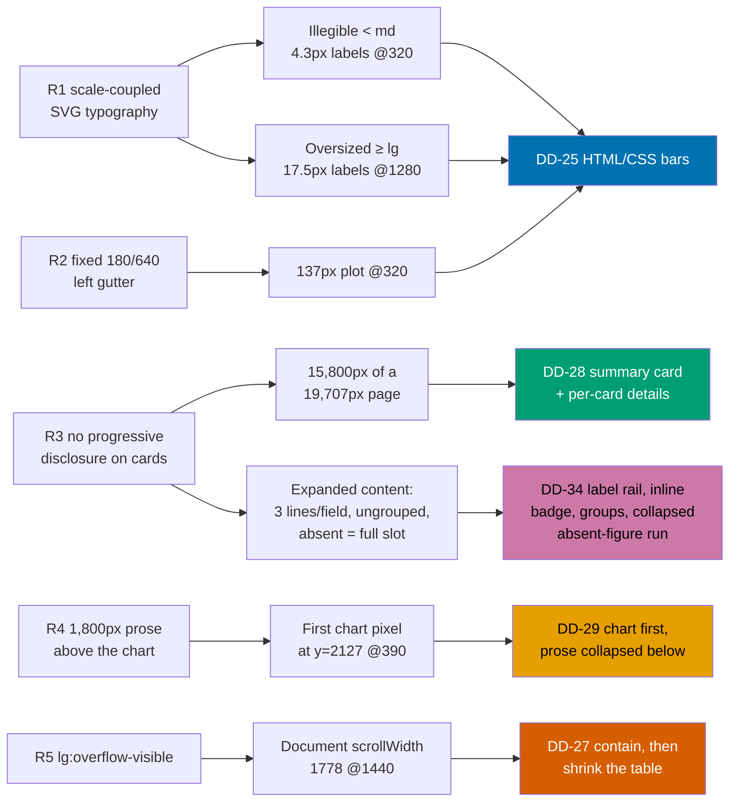

# AI Benchmark Responsive Overhaul — `/[locale]/tools/ai-benchmark`

A **full responsive re-look** of the AI Model Benchmark page in `apps/ayokoding-www`: the chart
stops being an SVG whose typography scales with the viewport, the 38-model roster stops rendering
all eleven fields for every model unconditionally, the ~1,800px prose preamble stops standing
between the reader and the chart, and the desktop table stops making the whole document scroll
horizontally.

## Context

The page at [ayokoding.com/en/tools/ai-benchmark](https://www.ayokoding.com/en/tools/ai-benchmark)
was built by [`ayokoding-www-tools-ai-benchmark`](../../done/2026-07-30__ayokoding-www-tools-ai-benchmark/README.md)
and reshaped by [`ayokoding-www-ai-benchmark-merged-chart`](../../done/2026-07-30__ayokoding-www-ai-benchmark-merged-chart/README.md).
The user's report was short: **"the chart view is too small, and it looks like a wall of text"** on
mobile. Live Playwright diagnosis (2026-07-31, `en` locale) found five distinct root causes, four of
which are visible below `md` and one of which is a previously unreported **desktop** defect.

The measured evidence is in [`brd.md` §Measured evidence](./brd.md#measured-evidence-live-2026-07-31-playwright-en-locale),
with the four diagnosis screenshots in [`assets/`](./assets/).

This plan **explicitly reverses** a prior, signed-off design decision — the merged-chart plan's
"identical DOM structure at every breakpoint" responsive strategy. That property is precisely what
couples typography to viewport width. See
[`tech-docs.md` §DD-26](./tech-docs.md#dd-26--reversing-the-identical-dom-responsive-strategy).

## Scope

**In scope**

- **Chart** — replace the `viewBox`-scaled SVG with real DOM bars whose text is real text at real
  font sizes, at every breakpoint (settled decision D1, extended by
  [DD-25](./tech-docs.md#dd-25--htmlcss-bars-replace-the-svg-chart-at-every-breakpoint)).
- **Roster** — a summary card (name, class, composite index, price) plus a per-card `
`
  holding the remaining fields, below `md`; a reduced-column table with the same disclosure at `md`
  and up (settled decision D2).
- **Expanded-card density** — what that disclosure _reveals_ also changes
  ([DD-34](./tech-docs.md#dd-34--the-expanded-cards-field-density)): the value out-ranks its own
  label on size, weight and colour; the evidence badge flows inline beside the value on a shared
  label rail; the fields chunk into two labelled groups; and unpublished figures collapse into one
  trailing run of terms sharing a single "Not reported" description, without leaving the DOM.
- **Page composition** — chart first, directly under the page header; the honesty prose collapses
  below it, with one always-visible honesty line preserved; legend and Sources become `
`
  placed below the roster (settled decision D3). This **rewords the AC-32 Gherkin scenario**.
- **R5** — the fix-caused desktop horizontal-overflow regression, with a reproducing regression
  test at the real e2e layer per the
  [Regression Test Mandate](../../../repo-governance/development/quality/regression-test-mandate.md).
- **Tap targets** — the `(Source)` evidence links reach WCAG 2.5.8's 24x24 CSS px minimum.
- **Capability-class rename** — the third rated class becomes `haiku`, so the rated vocabulary reads
  **opus / sonnet / haiku** rather than two model-tier names plus one weight adjective
  ([DD-35](./tech-docs.md#dd-35--the-capability-class-rename-light-to-haiku)). The rename reaches the
  `core/` types, the `class`/`sort-haiku` URL parameters, the `--chart-band-haiku*` design tokens in
  `libs/web-ui-token/src/ayokoding.css`, both i18n keys, and both step-binding layers. `unrated` is
  untouched, no model changes class, and the label reads "Haiku" in **both** locales because it is a
  proper noun.
- Companion Gherkin in
  `specs/apps/ayokoding/behavior/ayokoding-www/gherkin/tools/ai-benchmark.feature` (nine rewordings
  plus new scenarios AC-49..AC-67).

**Out of scope**

- Any new benchmark, price, model, or operator entering `core/data/models.ts` — the dataset is
  untouched.
- Any change to harness/class filter or sort **semantics** — which models a class contains and how
  rows order are unchanged. The class and sort **identifiers** change under DD-35.
- Any back-compatibility alias for the retired `class=light` / `sortLight` query values — DD-35
  records that decision and its reversibility.
- Any runtime data fetch, backend, API, or database.
- Any change to `libs/web-ui`'s `Table` primitive itself (the plan changes only how
  `model-table.tsx` **uses** it). The one library edit is three renamed custom properties in
  `libs/web-ui-token/src/ayokoding.css`, with no colour value changed.
- Any other AyoKoding page or tool.

## Approach summary

The capability-class rename (DD-35) is deliberately **absent** from the map above: it answers none
of R1-R5 and fixes no measured defect. It is a vocabulary correction that rides along because it
touches the same files Phases 4-6 rewrite, and it lands first (Phase 3) so every later phase writes
the final name once. Its own reasoning is in
[`brd.md` §Why the capability taxonomy is renamed at the same time](./brd.md#why-the-capability-taxonomy-is-renamed-at-the-same-time).

Every change stays inside the feature's existing **functional core / imperative shell** split:
`features/ai-benchmark/core/` keeps every number and threshold; `features/ai-benchmark/shell/`
keeps every element, class, and breakpoint.

## Documents

| Document                         | Contains                                                                                |
| -------------------------------- | --------------------------------------------------------------------------------------- |
| [`brd.md`](./brd.md)             | Why this exists, the measured evidence, affected roles, business risks, success signals |
| [`prd.md`](./prd.md)             | Personas, user stories, the complete UI design funnel, Gherkin acceptance criteria      |
| [`tech-docs.md`](./tech-docs.md) | Architecture, DD-25..DD-35, the prior-decision reversal record, file impact, rollback   |
| [`delivery.md`](./delivery.md)   | Phased, TDD-shaped delivery checklist with phase gates and two delivery boundaries      |
| [`learnings.md`](./learnings.md) | Knowledge Capture running log, triaged before archival                                  |

## Delivery at a glance

- **Delivery Mode**: `worktree-to-pr` — see [`delivery.md`](./delivery.md#delivery-mode-worktree-to-pr).
- **Worktree**: `worktrees/ayokoding-www-ai-benchmark-responsive-overhaul/` — see [`delivery.md`](./delivery.md#worktree).
- **Delivery units**: two — Unit 1 ships the R5 containment fix early as a small PR; Unit 2 ships
  the capability-class rename and the overhaul. See
  [`delivery.md` §Delivery Boundaries](./delivery.md#delivery-boundaries), which also records why
  the rename is **not** a third boundary.
- **Phases**: fifteen (0-14). Phase 0 sets up and opens no PR; Phase 1 is Unit 1's boundary;
  Phase 3 is the capability-class rename, placed at the head of Unit 2 because every later phase
  consumes the renamed `core/` type; Phase 14 is Unit 2's boundary.
- **Target app**: `apps/ayokoding-www` (port 3101, prod branch `prod-ayokoding-www`). One library
  file is touched: `libs/web-ui-token/src/ayokoding.css` (DD-35 token rename).
- **Real gates**: `test:unit`, `test:coverage`, `test:quick`, `lint`, `typecheck` on
  `ayokoding-www`; `test:e2e` on the sibling **`ayokoding-www-fe-e2e`** project; live Playwright
  verification. `ayokoding-www`'s own `test:e2e` and `test:integration` are `echo` no-ops and are
  never cited as gates — see [`tech-docs.md` §Which gates are real](./tech-docs.md#which-gates-are-real).

## Related

- [`plans/done/2026-07-30__ayokoding-www-tools-ai-benchmark/`](../../done/2026-07-30__ayokoding-www-tools-ai-benchmark/README.md) —
  built the page (AC-1..AC-38, DD-1..DD-24, W-1..W-27).
- [`plans/done/2026-07-30__ayokoding-www-ai-benchmark-merged-chart/`](../../done/2026-07-30__ayokoding-www-ai-benchmark-merged-chart/README.md) —
  merged the two charts (AC-39..AC-48); this plan reverses its responsive strategy.
- [Cost-of-living calculator feature](../../../apps/ayokoding-www/src/features/cost-of-living-calculator/) —
  the FCIS precedent, and the source of the `document.documentElement.scrollWidth` e2e assertion
  pattern this plan reuses for R5.
