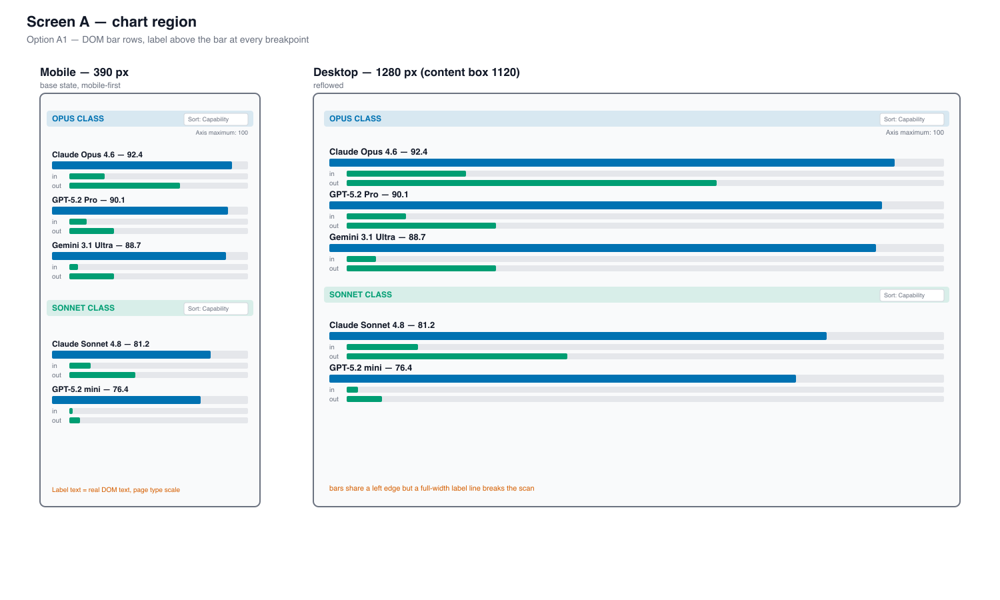
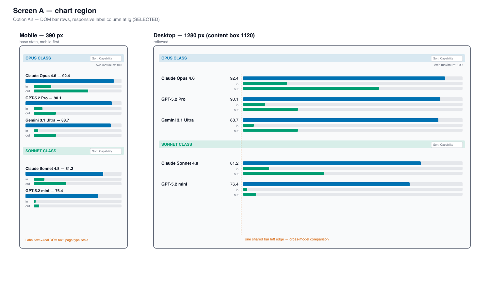
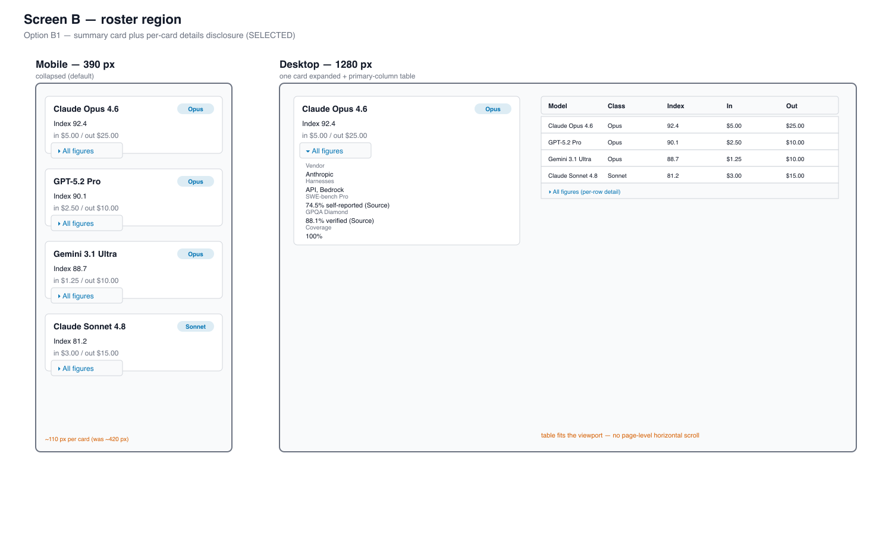
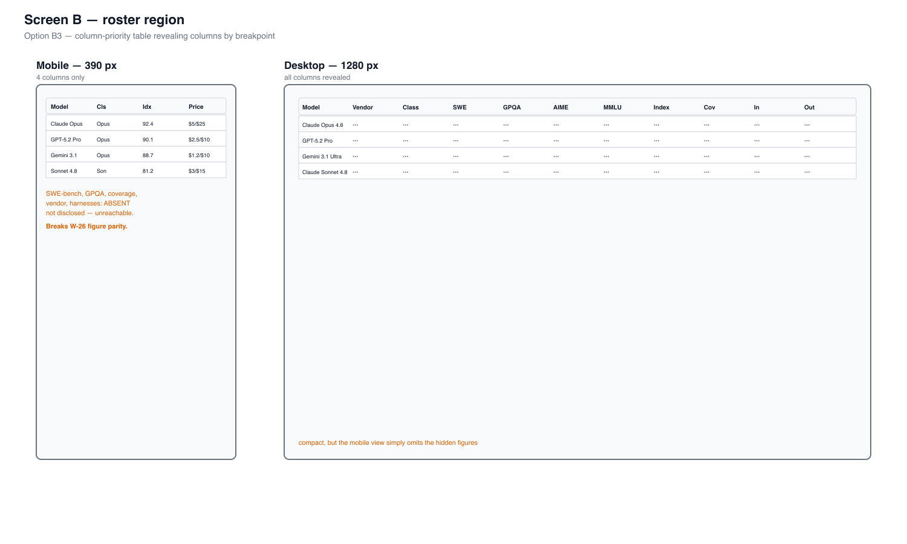
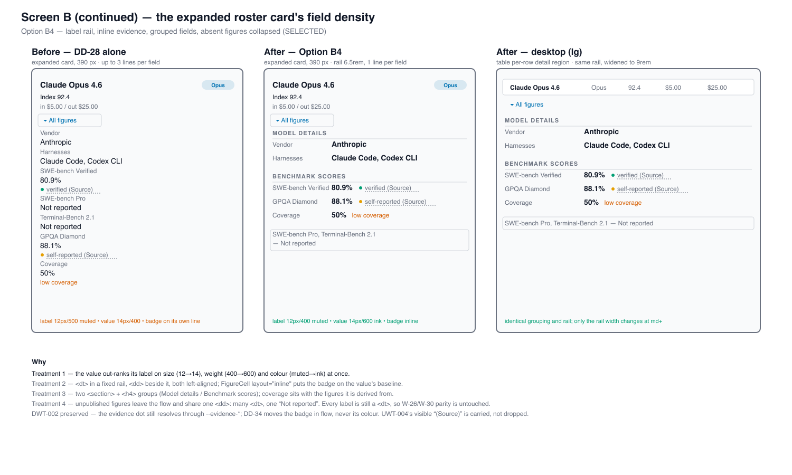
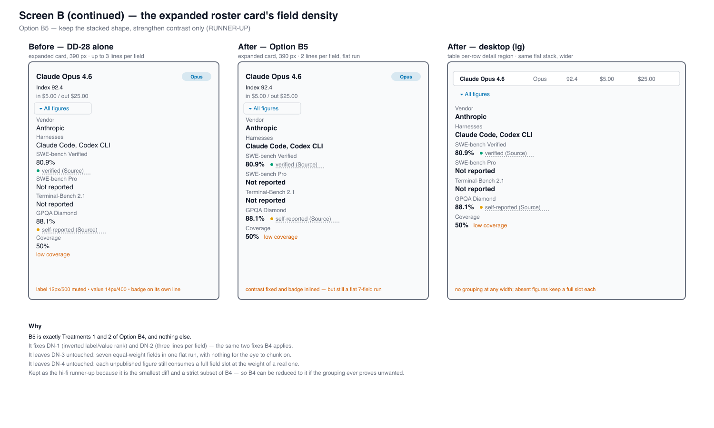
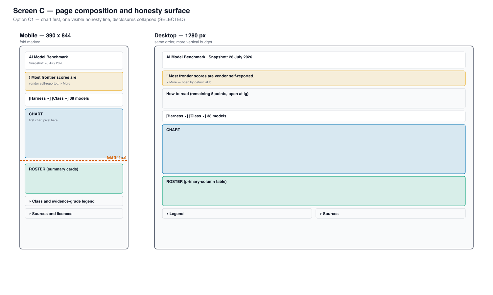
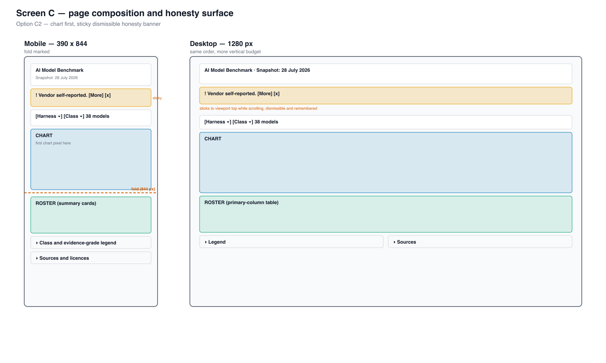

# Product Requirements — AI Benchmark Responsive Overhaul

## Product overview

The AI Model Benchmark page presents three regions in sequence: an **honesty surface** (snapshot
date, how-to-read disclosure, class/grade legend, sources), a **chart** (one row per rated model
carrying a capability bar and two price bars), and a **roster** (every model's full figure set with
evidence grades and source links). This plan re-looks all three across mobile, tablet, and desktop.

Nothing about _what_ the page claims changes. What changes is how much of it a reader is forced to
consume before reaching the comparison, how large that comparison renders, and how a reader drills
into one model's detail.

## Personas

Solo-maintainer repository — "personas" are reader archetypes and the agents that consume the
output, not organisational stakeholders.

| Persona                     | Context                                                                                                      |
| --------------------------- | ------------------------------------------------------------------------------------------------------------ |
| **Rina, phone reader**      | Reaches the page from a shared link on a 390px phone. Wants to know which model is strong and what it costs. |
| **Adi, tablet reader**      | Reads on a 768px tablet in landscape. Wants the chart and enough roster columns to compare two models.       |
| **Wahid, desktop reviewer** | The maintainer, reviewing at 1440px. Notices type-hierarchy inversion and page-level horizontal scroll.      |
| **A touch reader**          | Any of the above using touch rather than a pointer; needs 24x24 targets on the evidence links.               |
| **A screen-reader reader**  | Needs the chart's figures reachable in text, and the roster's disclosure state announced correctly.          |
| **`web-design-tester`**     | Runs the Rule-15 retest against the live result across both locales and all breakpoints.                     |

## User stories

| #     | Story                                                                                                                                                               |
| ----- | ------------------------------------------------------------------------------------------------------------------------------------------------------------------- |
| US-1  | As Rina, I want the chart's model names and numbers to be readable on my phone, so that the chart is useful rather than decorative.                                 |
| US-2  | As Rina, I want the chart to appear near the top of the page, so that I do not scroll 2.5 screens of prose to reach the thing I came for.                           |
| US-3  | As Rina, I want each model in the roster to show a short summary I can scan, so that I can find one model without scrolling past ten fields of every other model.   |
| US-4  | As Rina, I want to expand exactly the model I care about, so that I still get every figure when I want it.                                                          |
| US-5  | As Adi, I want the tablet chart to use the width my device actually has, so that the plot is not squeezed by a gutter sized for a desktop label column.             |
| US-6  | As Wahid, I want chart text to sit inside the page's own type scale, so that the least important text is not the largest text on the page.                          |
| US-7  | As Wahid, I want the page to never scroll horizontally, so that it does not read as broken.                                                                         |
| US-8  | As a touch reader, I want the evidence source links to be large enough to hit, so that the page's honesty surface is actually operable.                             |
| US-9  | As a screen-reader reader, I want the chart's figures to remain reachable as text, so that replacing the SVG does not remove my access to them.                     |
| US-10 | As a reader in either locale, I want all of the above in Indonesian too, so that the `id` page is not a second-class rendering.                                     |
| US-11 | As Rina, I want an expanded model's figures to read as a grouped, evenly-ranked list rather than a cramped block, so that expanding a card is worth the tap.        |
| US-12 | As Rina, I want the figures a model never published summarised in one line, so that absent data does not cost me the same scrolling as real data.                   |
| US-13 | As Rina, I want the three capability classes to read as one consistent set of tier names, so that I do not have to work out whether "Light" means a tier or a size. |

---

## UI design funnel

This is a **UI-bearing** plan — it changes user-facing screens under `apps/ayokoding-www`. The
funnel below runs diverge → narrow → select → justify for each of the three screens, per the
[UI Mockups in Plan Docs convention](../../../repo-governance/conventions/formatting/diagrams/ui-mockups-principles-and-scope.md#ui-mockups-in-plan-docs-principles-in-practice-and-scope).

### R5 grounding note (diagrams.md's grounding rule, not `brd.md`'s R5 defect) — survey before drafting

Before drafting either tier, the following existing surfaces were surveyed so the alternatives
reuse what exists rather than invent:

- **`libs/web-ui` primitives** — `Table`, `TableHeader`, `TableBody`, `TableRow`, `TableHead`,
  `TableCell`, `TableCaption` are already consumed by `model-table.tsx` `[Repo-grounded]`. The
  `Table` primitive exposes `wrapperClassName` specifically so a consumer can override the
  wrapper's `overflow` for `position: sticky` descendants — documented in
  `libs/web-ui/src/primitives/table/table.tsx` lines 6-14 `[Repo-grounded]`.
- **The feature's own shell modules** — `chart-primitives.tsx` (`scaleLinear`, `Bar`, `Axis`,
  `BandGroup`, `Legend`, `evenTicks`, `TickRow`), `figure-cell.tsx`, `evidence-badge.tsx`,
  `format.ts`, `benchmark-filters.tsx` (`FilterSelect`) `[Repo-grounded]`.
- **The sibling tool** — `features/cost-of-living-calculator/shell/min-role.tsx` uses the same
  `libs/web-ui` table primitives and is the FCIS precedent both prior plans followed
  `[Repo-grounded]`.
- **App shell** — `apps/ayokoding-www` uses Tailwind's default breakpoints; the page container is
  `mx-auto max-w-6xl px-4` (`benchmark-content.tsx` line 86) `[Repo-grounded]`, giving a 1120px
  content box at `lg` and above.

**Net-new components named**: `shell/bar-row.tsx` (an HTML/CSS bar row replacing the SVG
`BenchmarkRow`), and `shell/model-card.tsx` (a summary-plus-`<details>` roster card). No other new
component. `scaleLinear` is **reused verbatim** — called with a `pixelWidth` of `100` so it yields
a percentage rather than an SVG user-unit offset.

Reference the `swe-developing-frontend-ui` skill during execution.

### R7 prior-art citation

The alternatives and finalists below are drafted from the repo's own existing patterns and from the
live measurement in `brd.md`. Prior art on how comparable public model-comparison tools handle small
viewports is gathered by the `web-researcher` agent as an explicit delivery step (see `delivery.md`
Phase 2), covering at minimum: how leaderboard tools reflow wide comparison tables on phones, and
whether they render bars as SVG or as DOM.

The research step exists to **challenge** the drafted alternatives before implementation begins, not
to retroactively justify them. Findings are recorded inline in this subsection during Phase 2 with
excerpt + URL + access date; any alternative they invalidate is dropped with a one-line reason, and
any selection they overturn is re-decided in the relevant decision table rather than defended.

**Prior-art findings** — recorded by the Phase 2 `web-researcher` step (accessed 2026-07-31 unless
noted otherwise):

1. **DOM/CSS bars over SVG for responsive reflow** — "SVG does not have layout techniques like
   Flexbox, Grid or even Normal Flow. In SVG, all shapes are absolutely positioned", and on
   container resize "the JavaScript needs to compute all SVG positions and sizes from scratch...
   a page with 20 charts freezes the browser for 1-2 seconds" — [Responsive bar charts in HTML and
   CSS](https://9elements.com/blog/responsive-bar-charts-in-html-and-css/), 9elements engineering
   blog, accessed 2026-07-31. Directly validates Screen A's DOM-bar-row direction as the
   lower-risk choice for a page with many per-model bar rows.
2. **Accordion disclosure for mobile comparison rows** — "use accordions to allow mobile users to:
   See an overview of the type of data that's available" and "the leftmost column... should be
   locked in place, so users can see the necessary labels at all times" —
   [Mobile Tables: Comparisons and Other Data Tables](https://www.nngroup.com/articles/mobile-tables/),
   Nielsen Norman Group, accessed 2026-07-31. Directly validates Screen B's summary-card-plus-`<details>`
   direction.
3. **Column-priority/hide-and-reveal as an "advanced" tier, not the baseline** — "Simple interaction
   techniques can help, but you may need to offer users more advanced features for information
   hiding and column reordering" —
   [How to Fit Big Tables on Small Screens](https://www.nngroup.com/videos/big-tables-small-screens/),
   Nielsen Norman Group, 2021-08-20, accessed 2026-07-31. Read alongside Finding 4 below, this
   frames a hidden-column table as a heavier, less-proven pattern than a card/accordion disclosure.
4. **Card View avoids horizontal scroll entirely; frozen-column scroll is the named alternative** —
   "Card View: A collapsed table keeps all the data but rolls each row into a card... no horizontal
   scrolling with a card view" and "Horizontal Scroll with Frozen Columns: locks the first column
   and allows the rest of the columns to scroll horizontally" —
   [Data Table Pattern](https://uxpatterns.dev/patterns/data-display/table), uxpatterns.dev,
   accessed 2026-07-31 (community reference, cross-checked against Findings 2-3 above, which it
   agrees with directionally).
5. **Grouped fields with subheads, and a warning against unexplained missing data** — "organized...
   with subheads for major categories, such as size, hardware compatibility, and performance" and,
   on inconsistent missing-value treatment across four compared products: "the first product has no
   speed given... users cannot tell whether an absent value means 'not applicable' or 'simply
   unreported'" —
   [Specification Lists Have Terrible Usability](https://jakobnielsenphd.substack.com/p/specification-lists),
   Jakob Nielsen, accessed 2026-07-31. Validates Screen B (continued)'s semantic grouping (DN-3) and
   its explicit shared `"Not reported"` `<dd>` run (DN-4) over silently omitting the field.
6. **A live per-model detail page's own grouping and typography** — Artificial Analysis's per-model
   page organizes fields into named sections ("Model summary", "Technical specifications",
   "Detailed breakdowns") and, for an undisclosed metric, "simply omits the field... and separately
   explains the gap in FAQ prose" rather than a dash —
   [artificialanalysis.ai/models](https://artificialanalysis.ai/models), accessed 2026-07-31. This
   is the one finding that runs the other way on missing-data treatment (omission vs. Option B4's
   shared "Not reported" row) — see Reconcile below for why B4 is kept over this precedent.
7. **A competing leaderboard's plain-dash convention** — Vellum's LLM leaderboard renders missing
   benchmark data as a plain `-`, observed across multiple models and fields, with no documented
   mobile-specific table transformation —
   [vellum.ai/llm-leaderboard](https://www.vellum.ai/llm-leaderboard), accessed 2026-07-31. A
   useful negative finding: not every public comparison tool has solved narrow-viewport disclosure.
8. **An explicit density-mode toggle as a third pattern** — OpenRouter's models page exposes a
   "List" vs. "Table" view-mode toggle alongside filtering, rather than relying on horizontal
   scroll or automatic column hiding —
   [openrouter.ai/models](https://openrouter.ai/models), accessed 2026-07-31.
9. **Comparison-table scanning techniques** — grouping attributes by category, sticking column
   headings during scroll, and horizontal (row-based) styling to aid left-to-right scanning —
   [4 Ways to Optimize the Comparison Feature for Scanning](https://baymard.com/blog/user-friendly-comparison-tools),
   Baymard Institute, accessed 2026-07-31. Corroborates Finding 5's grouping guidance and Screen B's
   sticky-header restoration once the table fits (DD-27).

**Confirmable-but-not-confirmed**: the exact SVG-vs-DOM rendering technology used by LMSYS Chatbot
Arena, Artificial Analysis, and OpenRouter specifically could not be determined — the
`web-researcher` agent's read-only tooling converts pages to markdown, which strips chart markup
from these JS-rendered sites. Finding 1 above (an engineering deep-dive on the general SVG-vs-DOM
tradeoff, not a claim about any specific site) stands on its own technical merits regardless. A
browser-capable spot-check (Playwright MCP, already scheduled for Phase 10's live manual
verification) can confirm the specific-site claim if ever needed; it is not a blocker for this
plan's own DOM-bar-row decision, which Finding 1 already grounds independently.

**Reconcile** — each of the 12 alternatives across the 4 screens against Findings 1-9 above. No
alternative below is invalidated by the research; none of the four named selections changes.

- **A1** (DOM bars, label above) — supported by Finding 1 (DOM/CSS avoids SVG's absolute-position
  reflow cost); not chosen because A2's responsive label column reads better at `lg`, per this
  plan's own AC-32-adjacent visual-hierarchy criteria, not because A1 is technically unsound.
- **A2** (DOM bars, responsive label column) — **Selected**, reinforced by Finding 1 directly.
- **A3** (SVG) — reinforced-as-dropped by Finding 1 (the 9elements deep-dive independently confirms
  the same reflow-cost concern that failed A3 at the `md` breakpoint in this plan's own R1 check).
- **B1** (summary card + `<details>`) — **Selected**, directly supported by Finding 2 (NN/g:
  accordion disclosure for mobile comparison rows) and Finding 4 (Card View avoids horizontal
  scroll entirely).
- **B2** (per-model detail route) — no finding challenges or supports a route-based split; stays
  dropped on this plan's own W-26 figure-parity/shareability grounds, unchanged.
- **B3** (column-priority table) — supported-as-dropped by Finding 3 (NN/g: column-hiding is an
  "advanced" tier, not the baseline) and Finding 4 (frozen-column scroll named as the alternative
  to card view, not the default).
- **B4** (label rail, grouped fields, shared "Not reported" row) — **Selected**, directly supported
  by Finding 5 (Jakob Nielsen: grouped subheads, and inconsistent missing-value treatment across
  compared products actively harms usability) and Finding 9 (Baymard: category grouping aids
  scanning). Finding 6 (Artificial Analysis omits undisclosed fields silently, explained in FAQ
  prose instead) points the other way, but Nielsen's finding is the more directly on-point source —
  it evaluates exactly this failure mode (silent omission across a _compared_ list) and finds it
  harmful, whereas Finding 6 describes a single-model detail page with no comparison context. B4's
  explicit shared row stays selected.
- **B5** (contrast-only) — kept as documented runner-up/reducible-fallback; no finding changes that
  status.
- **B6** (mini-table) — stays dropped on this plan's own DN-2/`<dl>`-semantics grounds; Finding 3
  independently reinforces that a table-shaped sub-pattern is the heavier "advanced" tier this
  screen was avoiding.
- **C1** (chart first, one visible honesty line) — **Selected**; no finding addresses page-honesty
  banner composition directly, so this decision rests on the plan's own AC-32 requirement,
  unchanged.
- **C2** (sticky dismissible banner) — stays dropped on this plan's own AC-32 long-term-visibility
  grounds; unaffected by the research.
- **C3** (prose moved unchanged) — stays dropped on this plan's own above-the-fold grounds;
  unaffected.

Findings 7 (Vellum's plain-dash convention) and 8 (OpenRouter's List/Table toggle) are recorded as
useful negative/alternative-pattern evidence but do not bear on any of the 12 alternatives above —
neither a dash-only convention nor a density-mode toggle was ever a candidate in this funnel.

No mockup regeneration needed: all 8 finalist mockups (2 per screen × 4 screens, confirmed present
under `assets/`) remain accurate to the still-current selections above.

---

### Screen A — the chart region

#### Diverge (low-fidelity)

##### Option A1 — DOM bar rows, label above the bar (full-width plot)

```text
MOBILE (< md, 390px)                        DESKTOP (lg, 1120px)
┌────────────────────────────────────┐      ┌──────────────────────────────────────────────────────┐
│ OPUS CLASS            [Sort: Cap ▾]│      │ OPUS CLASS                          [Sort: Cap ▾]    │
│                                    │      │                            Axis maximum: 100          │
│ Claude Opus 4.6 — 92.4             │      │ Claude Opus 4.6 — 92.4                                │
│ ████████████████████████░░░░       │      │ ██████████████████████████████████████████░░░░░░░░    │
│  in  $5.00  ███████░░░░░░░░░░░░    │      │  in  $5.00   ████████░░░░░░░░░░░░░░░░░░░░░░░░░░░░░    │
│  out $25.00 ████████████████░░░    │      │  out $25.00  ███████████████████████████████░░░░░░    │
│                                    │      │                                                       │
│ GPT-5.2 Pro — 90.1                 │      │ GPT-5.2 Pro — 90.1                                    │
│ ███████████████████████░░░░░       │      │ █████████████████████████████████████████░░░░░░░░░    │
│  in  $2.50  ███░░░░░░░░░░░░░░░░    │      │  in  $2.50   ████░░░░░░░░░░░░░░░░░░░░░░░░░░░░░░░░░    │
│  out $10.00 ██████░░░░░░░░░░░░░    │      │  out $10.00  ████████████░░░░░░░░░░░░░░░░░░░░░░░░░    │
└────────────────────────────────────┘      └──────────────────────────────────────────────────────┘
   Label ABOVE its bar at every width.        Same structure; the plot simply gets wider.
   Price label INLINE at the bar's left.      No left gutter is reserved at any width.
```

Every bar is a `div` whose `style={{ width: "NN%" }}` comes from `scaleLinear(max, 100)`. All text
is ordinary DOM text at ordinary Tailwind sizes, so it never scales with the viewport. The plot
occupies the full container width at every breakpoint — R2's fixed 180/640 gutter disappears
entirely because no right-anchored label column exists.

##### Option A2 — DOM bar rows with a responsive two-column grid (label column at `lg`)

```text
MOBILE (< md, 390px)                        DESKTOP (lg, 1120px)
┌────────────────────────────────────┐      ┌──────────────────────────────────────────────────────┐
│ OPUS CLASS            [Sort: Cap ▾]│      │ OPUS CLASS                          [Sort: Cap ▾]    │
│ Claude Opus 4.6 — 92.4             │      │ Claude Opus 4.6  92.4 │████████████████████████░░░░  │
│ ████████████████████████░░░░       │      │        in   $5.00     │██████░░░░░░░░░░░░░░░░░░░░░░  │
│  in  $5.00  ███████░░░░░░░░░░░░    │      │        out  $25.00    │████████████████████░░░░░░░░  │
│  out $25.00 ████████████████░░░    │      │───────────────────────┼──────────────────────────────│
│                                    │      │ GPT-5.2 Pro      90.1 │███████████████████████░░░░░  │
│ GPT-5.2 Pro — 90.1                 │      │        in   $2.50     │███░░░░░░░░░░░░░░░░░░░░░░░░░  │
│ ███████████████████████░░░░░       │      │        out  $10.00    │██████░░░░░░░░░░░░░░░░░░░░░░  │
└────────────────────────────────────┘      └──────────────────────────────────────────────────────┘
   Stacked: label above bar (as A1).           Two-column CSS grid: labels left, bars right,
                                               bars share one aligned left edge for comparison.
```

Identical to A1 below `lg`; at `lg` a CSS grid (`lg:grid-cols-[minmax(0,18rem)_1fr]`) restores an
aligned label column so every bar starts at the same x, which makes cross-model bar comparison
easier at desktop width. The gutter is a **CSS fraction**, not a fixed 180-of-640 user-unit
constant, so it can never eat mobile plot width.

##### Option A3 — keep SVG, right-size the `viewBox`, HTML bars below `md` only

```text
MOBILE (< md)                                DESKTOP (lg)
  HTML/CSS bars (as A1)                        <svg viewBox="0 0 1120 h">
                                               scale = 1120/1120 = 1.00 → 10px text renders 10px
TABLET (md, 721px)
  <svg viewBox="0 0 1120 h"> → scale 0.64
  10px text still renders at 6.4px  ← unresolved
```

Two parallel DOM paths: HTML bars below `md`, SVG at `md` and above with `SVG_WIDTH` raised from
640 to 1120 so desktop lands at scale 1.0.

#### Narrow (high-fidelity finalists)

The two strongest alternatives carried forward as hi-fi mockups. **Both finalists are drawn at
mobile width first**, then at desktop width, per the mobile-first requirement.

- 
- 

> Each finalist `.png` ships with its `.svg` source under this plan's `assets/`, matching the
> naming precedent of `plans/done/2026-07-30__ayokoding-www-ai-benchmark-merged-chart/assets/`.
> Colours are indicative (Okabe-Ito palette); the implementation resolves every colour through the
> live `--chart-band-*` tokens. These finalists use the plain-`.png` fallback per
> [diagrams.md §The Both-Tiers Rule](../../../repo-governance/conventions/formatting/diagrams/ui-mockups-both-tiers-rule.md#ui-mockups-in-plan-docs-the-both-tiers-rule):
> the design is finalized as of this plan's Select stage below, matching the identical precedent in
> `plans/done/2026-07-30__ayokoding-www-ai-benchmark-merged-chart/assets/`.

**Dropped**: Option A3 — it leaves R1 unresolved at the `md` breakpoint (721px / 1120px = 0.64
scale, so a 10px label still renders at 6.4px on a tablet), and it commits the codebase to
maintaining two parallel chart implementations forever.

#### Select

**Selected: Option A2 — DOM bar rows with a responsive label column at `lg`.**

#### Justify — decision record

| Criterion                                  | A1 — label above bar                                        | A2 — responsive label column (**winner**)                                    | A3 — right-sized SVG at md+                             |
| ------------------------------------------ | ----------------------------------------------------------- | ---------------------------------------------------------------------------- | ------------------------------------------------------- |
| Resolves R1 below `md`                     | Yes                                                         | **Yes**                                                                      | Yes                                                     |
| Resolves R1 at `md`                        | Yes                                                         | **Yes**                                                                      | **No** — 0.64 scale, 6.4px text                         |
| Resolves R1 at `lg`+                       | Yes                                                         | **Yes**                                                                      | Yes (scale 1.0 only at exactly the container width)     |
| Resolves R2 (gutter)                       | Yes — no gutter at all                                      | **Yes** — gutter is a CSS fraction, only at `lg`                             | Partially — gutter shrinks proportionally but stays 28% |
| Cross-model bar comparison at desktop      | Weaker — bars start at the same x but labels break the flow | **Strongest** — every bar shares one aligned left edge                       | Strong                                                  |
| Rendering paths to maintain                | One                                                         | **One** (one DOM tree, CSS-grid reflow — not two branches)                   | Two, permanently                                        |
| Reuses `scaleLinear` verbatim              | Yes                                                         | **Yes**                                                                      | Yes                                                     |
| Retires SVG-geometry constants and defects | Yes                                                         | **Yes** — `SVG_WIDTH`/`PLOT_X`/`MARKER_MIN_MARGIN`/`BAND_HEADER_HEIGHT` gone | No — keeps every one of them                            |
| Spec churn                                 | AC-36, AC-46, AC-47 reworded                                | **AC-36, AC-46, AC-47 reworded**                                             | Lowest — no SVG-related AC changes                      |
| **Verdict**                                | Runner-up                                                   | **Winner**                                                                   | Dropped                                                 |

**Why the runner-up lost**: A1 is genuinely fine on mobile and is in fact exactly what A2 renders
below `lg`. It loses only at desktop width, where 1120px of horizontal space is available and A1
spends it on a bar that starts immediately under a full-width text label — so a reader comparing
two models' bars must visually re-find the shared left edge past an intervening line of text. A2
costs one CSS grid declaration to fix that, and costs nothing on mobile because it _is_ A1 there.

**Why A3 lost**: it is the smallest-diff option and it was seriously considered, because it
preserves AC-36/AC-46 verbatim and keeps every existing SVG regression guard. It was dropped on
one measured fact: at the `md` breakpoint the SVG renders at 0.64 scale, so tablet typography stays
broken. An option that fixes a defect at two of three breakpoints is not a full responsive re-look,
which is what the user chose (D4).

#### Responsive strategy — mobile-first, per breakpoint (Screen A)

| Element      | Mobile (`< md`, < 768px)                                                     | Tablet (`md` >= 768px)                                | Desktop (`lg` >= 1024px)                                                |
| ------------ | ---------------------------------------------------------------------------- | ----------------------------------------------------- | ----------------------------------------------------------------------- |
| Model row    | Label line above a full-width bar; price bars each with an inline left label | Same as mobile; container is wider so bars are longer | **Reflows** to a two-column CSS grid: label column + aligned bar column |
| Band header  | Stacks above the band's rows, full width                                     | Inline with the sort control on one row               | Inline, with the axis maximum right-aligned on the same line            |
| Sort control | Full-width `<select>` under the band header                                  | Inline right of the band header                       | Inline right of the band header                                         |
| Axis maximum | Rendered as text above the first row                                         | Same                                                  | Same, plus the existing `lg`-only tick row from `chart-primitives.tsx`  |
| Unrated list | Wrapped text list, unchanged                                                 | Same                                                  | Same                                                                    |
| Typography   | Page type scale (`text-sm` / `text-xs`) — **never viewport-coupled**         | Same sizes                                            | Same sizes                                                              |

**The chart never scrolls horizontally and never scales its own typography at any breakpoint.** The
only thing that changes across breakpoints is the CSS grid template and the resulting bar length.

---

### Screen B — the roster region

#### Diverge (low-fidelity)

##### Option B1 — summary card plus per-card `<details>` (settled decision D2)

```text
MOBILE (< md, 390px) — COLLAPSED            MOBILE — ONE CARD EXPANDED
┌────────────────────────────────────┐      ┌────────────────────────────────────┐
│ Claude Opus 4.6            Opus    │      │ Claude Opus 4.6            Opus    │
│ Index 92.4      in $5 / out $25    │      │ Index 92.4      in $5 / out $25    │
│ ▸ All figures                      │      │ ▾ All figures                      │
├────────────────────────────────────┤      │   Vendor        Anthropic          │
│ GPT-5.2 Pro                Opus    │      │   Harnesses     API, Bedrock       │
│ Index 90.1      in $2.5 / out $10  │      │   SWE-bench Pro 74.5%  self-rep(S) │
│ ▸ All figures                      │      │   GPQA Diamond  88.1%  verified(S) │
├────────────────────────────────────┤      │   ...                              │
│ Gemini 3.1 Ultra           Opus    │      │   Coverage      100%               │
│ Index 88.7      in $1.25 / out $10 │      ├────────────────────────────────────┤
│ ▸ All figures                      │      │ GPT-5.2 Pro                Opus    │
└────────────────────────────────────┘      └────────────────────────────────────┘
   ~110px per card x 38 ≈ 4,200px             Only the opened card grows.
   (vs. today's ~415px x 38 ≈ 15,800px)
```

##### Option B2 — summary card plus a per-model detail route

```text
┌────────────────────────────────────┐      /en/tools/ai-benchmark/claude-opus-4-6
│ Claude Opus 4.6            Opus  › │  →   ┌────────────────────────────────────┐
│ Index 92.4      in $5 / out $25    │      │ ← Back to benchmark                │
├────────────────────────────────────┤      │ Claude Opus 4.6 — every figure     │
│ GPT-5.2 Pro                Opus  › │      │ ...                                │
└────────────────────────────────────┘      └────────────────────────────────────┘
```

Shortest possible list, but every figure moves off the page onto 38 new routes.

##### Option B3 — column-priority table at every breakpoint

```text
MOBILE (< md, 390px)                        DESKTOP (lg)
┌────────────────────────────────────┐      ┌──────────────────────────────────────────────┐
│ Model        │Class│Index│  Price  │      │ Model │Vendor│Class│SWE│GPQA│...│Index│In│Out│
│ Claude Opus  │Opus │92.4 │ $5/$25  │      │ ...                                          │
│ GPT-5.2 Pro  │Opus │90.1 │$2.5/$10 │      └──────────────────────────────────────────────┘
└────────────────────────────────────┘        More columns appear as width allows.
```

One table at all widths, columns revealed progressively by breakpoint. Compact, but the hidden
columns are unreachable on a phone at all, breaking the W-26 figure-parity invariant outright.

#### Narrow (high-fidelity finalists)

- 
- 

> Each finalist `.png` ships with its `.svg` source under this plan's `assets/`. Colours are
> indicative; the implementation resolves every colour through the live design tokens. These
> finalists use the plain-`.png` fallback per
> [diagrams.md §The Both-Tiers Rule](../../../repo-governance/conventions/formatting/diagrams/ui-mockups-both-tiers-rule.md#ui-mockups-in-plan-docs-the-both-tiers-rule):
> the design is finalized as of this plan's Select stage below, matching the identical precedent in
> `plans/done/2026-07-30__ayokoding-www-ai-benchmark-merged-chart/assets/`.

**Dropped**: Option B2 — 38 new routes for a static dataset, each needing its own metadata, i18n,
and prerender cost, to solve a problem a `<details>` element solves inline. It also breaks the
page's single-URL shareability, which the existing `harness`/`class`/`sort*` URL-state design
(AC-42, AC-27) is built around.

#### Select

**Selected: Option B1 — summary card plus per-card `<details>`** (the user's settled decision D2,
confirmed against the alternatives above rather than assumed).

#### Justify — decision record

| Criterion                          | B1 — summary + `<details>` (**winner**)           | B2 — detail route                         | B3 — column-priority table                  |
| ---------------------------------- | ------------------------------------------------- | ----------------------------------------- | ------------------------------------------- |
| Resolves R3 (wall of text)         | **Yes** — collapsed cards only                    | Yes                                       | Yes                                         |
| Preserves W-26 figure parity       | **Yes** — every figure still in the DOM           | No — figures move to a different document | **No** — hidden columns are absent on phone |
| Preserves single-URL shareability  | **Yes**                                           | No — 38 new URLs                          | Yes                                         |
| Works without client JS            | **Yes** — native `<details>`                      | Yes                                       | Yes                                         |
| Screen-reader disclosure semantics | **Native** — `<details>`/`<summary>` are built-in | N/A                                       | None — content simply absent                |
| Prerender cost                     | **Zero new pages**                                | 38 x 2 locales = 76 new prerendered pages | Zero                                        |
| Reuses existing components         | **Yes** — `FigureCell`, `EvidenceBadge` verbatim  | Yes                                       | Yes                                         |
| **Verdict**                        | **Winner**                                        | Dropped                                   | Dropped                                     |

**Why the runner-up lost**: B3 produces the shortest, most scannable mobile list of the three and
is genuinely attractive on that axis alone. It fails on the invariant the prior plan established
and this plan is bound to preserve: W-26 requires the mobile and desktop representations to render
an identical set of figures. B3's hidden columns are not disclosed, they are absent — a phone
reader could never reach a model's SWE-bench figure at all, which is a straight regression of
AC-20.

#### Responsive strategy — mobile-first, per breakpoint (Screen B)

| Element             | Mobile (`< md`)                                                                  | Tablet (`md` >= 768px)                                                    | Desktop (`lg` >= 1024px)                                    |
| ------------------- | -------------------------------------------------------------------------------- | ------------------------------------------------------------------------- | ----------------------------------------------------------- |
| Representation      | Stacked summary cards, one `<details>` each                                      | **Reflows** to a table with the primary columns only                      | Same table, wider columns                                   |
| Primary columns     | Name, class, index, price (in the card's always-visible summary)                 | Model, class, index, input price, output price                            | Model, vendor, class, index, input price, output price      |
| Secondary figures   | Inside each card's `<details>`                                                   | Inside a per-row expandable detail row                                    | Inside the same per-row expandable detail row               |
| Summary line layout | Two lines: name + class, then index + price — **all left-aligned**               | One row                                                                   | One row                                                     |
| Horizontal scroll   | **None**                                                                         | **None** — the table fits because secondary columns are disclosed         | **None** — R5 resolved at the root                          |
| Sticky `<thead>`    | N/A                                                                              | Not sticky (wrapper is a scroll container, but never actually scrolls)    | Sticky — restored once the table genuinely fits (see DD-27) |
| Tap targets         | Every `<summary>` and every `(Source)` link at least 24x24                       | Same                                                                      | Same                                                        |
| Expanded field rows | Label rail `grid-cols-[6.5rem_1fr]`; value and badge on one baseline row (DD-34) | **Rail widens** to `md:grid-cols-[9rem_1fr]` in the per-row detail region | Same widened rail; grouping and order identical to mobile   |
| Expanded grouping   | Two `<h4>` groups — Model details, then Benchmark scores incl. coverage (DD-34)  | Same two groups, same order                                               | Same two groups, same order                                 |
| Absent figures      | One trailing wrapped run: many `<dt>`, one shared `<dd>` (DD-34)                 | Same run, wider so it wraps less                                          | Same run, typically one line                                |

**Note on the zig-zag scan pattern**: today's card uses left-aligned `<dt>` with right-aligned
`<dd>` inside a two-column grid (`model-table.tsx` lines 353-359) `[Repo-grounded]`. The selected
design left-aligns both, so the eye follows one vertical rule down the card.

**The revealed content's own density is a separate decision** — see
[Screen B (continued)](#screen-b-continued--the-expanded-cards-field-density-dd-34) immediately
below. Option B1 decides what is hidden; it does not decide how what is revealed reads.

---

### Screen B (continued) — the expanded card's field density (DD-34)

A sub-funnel of Screen B, run over the state Option B1 reveals rather than the state it hides. The
option letters continue Screen B's own series (B1-B3 are taken above), so **Options B4-B6 below are
funnel alternatives, unrelated to the user's settled decisions D1-D4 cited elsewhere in this plan.**

**The defect under design** — reported by the user against the live card as "too cramped" and "hard
to read", decomposed into DN-1..DN-4 in
[`brd.md` §R3b](./brd.md#r3b--the-density-of-the-cards-own-field-content): the label out-weights its
own value; every graded field costs three stacked lines; the fields are one flat run with no
semantic chunking; and an unpublished figure occupies a full field slot at the weight of a real one.

#### Diverge (low-fidelity)

##### Option B4 — label rail, inline evidence, grouped fields, absent figures collapsed

```text
MOBILE (< md, 390px) — EXPANDED             DESKTOP (lg) — table per-row detail region
┌────────────────────────────────────┐      ┌──────────────────────────────────────────────┐
│ Claude Opus 4.6            Opus    │      │ Claude Opus 4.6  Opus  92.4  $5.00  $25.00   │
│ Index 92.4      in $5 / out $25    │      │ ▾ All figures                                 │
│ ▾ All figures                      │      │ MODEL DETAILS ─────────────────────────────── │
│ MODEL DETAILS ──────────────────── │      │ Vendor           Anthropic                    │
│ Vendor      Anthropic              │      │ Harnesses        Claude Code, Codex CLI       │
│ Harnesses   Claude Code, Codex CLI │      │ BENCHMARK SCORES ──────────────────────────── │
│ BENCHMARK SCORES ────────────────  │      │ SWE-bench Verif. 80.9% ● verified (Source)    │
│ SWE-bench   80.9% ● verified (Src) │      │ GPQA Diamond     88.1% ● self-reported (Src)  │
│ GPQA Dia.   88.1% ● self-rep (Src) │      │ Coverage         50%  low coverage            │
│ Coverage    50%  low coverage      │      │ ┌──────────────────────────────────────────┐  │
│ ┌────────────────────────────────┐ │      │ │ SWE-bench Pro, Terminal-Bench 2.1        │  │
│ │ SWE-bench Pro, Terminal-Bench  │ │      │ │ — Not reported                           │  │
│ │ 2.1 — Not reported             │ │      │ └──────────────────────────────────────────┘  │
│ └────────────────────────────────┘ │      └──────────────────────────────────────────────┘
└────────────────────────────────────┘        Identical structure; only the rail widens
   Rail 6.5rem, both columns LEFT.             from 6.5rem to 9rem at md and above.
   One line per field where it fits.
```

Label in a fixed left rail at 12px/400 muted; value beside it at 14px/600 ink, with the evidence
badge inline on the same baseline; two `<h4>`-headed groups; every unpublished figure pulled into
one trailing wrapped run of `<dt>`s sharing a single `"Not reported"` `<dd>`.

##### Option B5 — keep the stacked shape; strengthen contrast only

```text
MOBILE (< md, 390px) — EXPANDED
┌────────────────────────────────────┐
│ Vendor                             │   Label stays ABOVE its value.
│ Anthropic                          │   Value promoted to 14px/600 ink,
│ SWE-bench Verified                 │   badge pulled inline beside it.
│ 80.9% ● verified (Source)          │   Two lines per field instead of three.
│ SWE-bench Pro                      │
│ Not reported                       │   ← still a full field slot
│ Terminal-Bench 2.1                 │
│ Not reported                       │   ← still a full field slot
│ GPQA Diamond                       │
│ 88.1% ● self-reported (Source)     │   No group headings at any width.
└────────────────────────────────────┘
```

Exactly Treatments 1 and 2 of Option B4 and nothing else — the smallest diff that addresses DN-1
and DN-2, leaving DN-3 and DN-4 untouched.

##### Option B6 — a compact two-column mini-table inside the disclosure

```text
MOBILE (< md, 390px) — EXPANDED
┌────────────────────────────────────┐
│ ┌──────────────────┬─────────────┐ │   A real <table> inside <details>:
│ │ Field            │ Value       │ │   densest of the three, aligned columns
│ ├──────────────────┼─────────────┤ │   for free from the table algorithm.
│ │ Vendor           │ Anthropic   │ │
│ │ SWE-bench Verif. │ 80.9% ●     │ │   Value column narrow → the badge wraps
│ │ SWE-bench Pro    │ Not reported│ │   under nearly every figure at 390px.
│ └──────────────────┴─────────────┘ │
└────────────────────────────────────┘
```

#### Narrow (high-fidelity finalists)

The two strongest alternatives carried forward as hi-fi mockups, each drawn **before beside after at
390px first**, then at desktop width, per the mobile-first requirement.

- 
- 

> Each finalist `.png` ships with its `.svg` source under this plan's `assets/`. Colours are
> indicative; the implementation resolves every colour through the live design tokens. These
> finalists use the plain-`.png` fallback per
> [diagrams.md §The Both-Tiers Rule](../../../repo-governance/conventions/formatting/diagrams/ui-mockups-both-tiers-rule.md#ui-mockups-in-plan-docs-the-both-tiers-rule):
> the design is finalized as of this sub-funnel's Select stage below, matching the identical
> precedent in `plans/done/2026-07-30__ayokoding-www-ai-benchmark-merged-chart/assets/`.

**Dropped**: Option B6 — a `<table>` gives aligned columns for free, but at 390px the value column
is too narrow to hold `88.1% ● self-reported (Source)` on one line, so the badge wraps under nearly
every figure and the row count returns to today's. It also puts a horizontally-constrained table
back on a phone, which is the exact shape R5 and DD-27 exist to remove, and it discards the
`<dl>` semantics that make the absent-figure collapse in B4 expressible at all.

#### Select

**Selected: Option B4 — label rail, inline evidence, grouped fields, absent figures collapsed.**

#### Justify — decision record

| Criterion                                       | B4 — rail + groups + collapse (**winner**)                          | B5 — contrast only                   | B6 — mini-table                                |
| ----------------------------------------------- | ------------------------------------------------------------------- | ------------------------------------ | ---------------------------------------------- |
| Fixes DN-1 (label out-weights value)            | **Yes** — size, weight, and colour all move together                | Yes — same treatment                 | Yes — header/cell ranking is implicit          |
| Fixes DN-2 (three lines per field)              | **Yes** — one line where it fits, two when the run wraps            | Partly — two lines per field, always | **No** — badge wraps under the value at 390px  |
| Fixes DN-3 (no grouping)                        | **Yes** — two `<h4>` groups                                         | **No** — one flat 7-field run        | **No** — one flat table body                   |
| Fixes DN-4 (absent figures at full weight)      | **Yes** — one shared-`<dd>` run                                     | **No** — a full slot each            | **No** — a full row each                       |
| Preserves W-26 / W-30 figure parity             | **Yes** — every label is still a `<dt>`, every value still a `<dd>` | Yes                                  | Yes                                            |
| Preserves DWT-002 (`--evidence-*` routing)      | **Yes** — position changes, colour does not                         | Yes                                  | Yes                                            |
| Preserves UWT-004 (visible `(Source)`)          | **Yes** — carried inline                                            | Yes                                  | Yes, but usually on its own wrapped line       |
| Reuses existing components                      | **Yes** — `FigureCell` gains one `layout` prop                      | **Yes** — same prop                  | No — a new table region inside a card          |
| New i18n keys                                   | Two group headings                                                  | **Zero**                             | At least two (`Field`, `Value` column headers) |
| Works at `md`+ inside the table's detail region | **Yes** — same markup, wider rail                                   | Yes                                  | Poor — a table nested inside a table row       |
| **Verdict**                                     | **Winner**                                                          | Runner-up                            | Dropped                                        |

**Why the runner-up lost**: B5 is a strict subset of B4 — it applies the same two typographic fixes
and needs no new i18n key, which makes it genuinely the cheaper change. It loses because the user's
report named four things, and B5 answers two of them: after B5 the reader still faces seven
equal-weight fields in one undifferentiated run, two of which say nothing at the same visual weight
as the ones that do. Keeping it as the hi-fi runner-up is deliberate: because it is a subset, B4 can
be reduced to it later without redesign if the grouping ever proves unwanted.

**Why B6 lost**: it is the densest option on paper and the alignment comes free from the table
layout algorithm. It was dropped on one measured constraint — at 390px the card's content box is
about 334 CSS px (390 minus the page's `px-4` and the card's `p-3`), so a `Field`/`Value` split
leaves under 200px for `88.1% ● self-reported (Source)`, and under 170px for the Indonesian
`88,1% ● dilaporkan sendiri (Sumber)`. The badge wraps on nearly every row, which reproduces DN-2
in a new shape. `[Judgment call]` on the exact pixel widths — they are derived from the container
arithmetic above, not measured; the wrapping behaviour is re-checked live in Phase 10.

---

### Screen C — the page composition and honesty surface

#### Diverge (low-fidelity)

##### Option C1 — chart first, honesty collapsed below, legend and sources at the foot (settled decision D3)

```text
MOBILE (< md, 390px)                        DESKTOP (lg)
┌────────────────────────────────────┐      ┌──────────────────────────────────────────────┐
│ AI Model Benchmark                 │      │ AI Model Benchmark                            │
│ Compare capability against price   │      │ Compare capability against price              │
│ Snapshot: 28 July 2026             │      │ Snapshot: 28 July 2026                        │
│ ⚠ Most frontier scores are         │      │ ⚠ Most frontier scores are vendor             │
│   vendor self-reported.  ▸ More    │      │   self-reported.               ▸ More         │
│ [Harness ▾] [Class ▾]  38 models   │      │ [Harness ▾] [Class ▾]          38 models      │
├────────────────────────────────────┤      ├──────────────────────────────────────────────┤
│ CHART  ← first chart pixel here    │      │ CHART                                         │
│ ...                                │      │ ...                                           │
├────────────────────────────────────┤      ├──────────────────────────────────────────────┤
│ ROSTER (summary cards)             │      │ ROSTER (table)                                │
├────────────────────────────────────┤      ├──────────────────────────────────────────────┤
│ ▸ Class and evidence-grade legend  │      │ ▸ Class and evidence-grade legend             │
│ ▸ Sources and licences             │      │ ▸ Sources and licences                        │
└────────────────────────────────────┘      └──────────────────────────────────────────────┘
```

##### Option C2 — chart first, honesty as a sticky dismissible banner

```text
┌────────────────────────────────────┐
│ ⚠ Most frontier scores are vendor  │  ← sticks to the viewport top while scrolling,
│   self-reported.     [More] [×]    │     dismissible, remembered in localStorage
├────────────────────────────────────┤
│ CHART / ROSTER / ...               │
└────────────────────────────────────┘
```

##### Option C3 — chart first, honesty prose entirely unchanged and simply moved below the roster

```text
┌────────────────────────────────────┐
│ Header · Filters · CHART · ROSTER  │
├────────────────────────────────────┤
│ How to read (open, ~774px)         │  ← no honesty text above the fold at all
│ Legend (open, ~1000px)             │
│ Sources                            │
└────────────────────────────────────┘
```

#### Narrow (high-fidelity finalists)

- 
- 

> Each finalist `.png` ships with its `.svg` source under this plan's `assets/`. Colours are
> indicative; the implementation resolves every colour through the live design tokens. These
> finalists use the plain-`.png` fallback per
> [diagrams.md §The Both-Tiers Rule](../../../repo-governance/conventions/formatting/diagrams/ui-mockups-both-tiers-rule.md#ui-mockups-in-plan-docs-the-both-tiers-rule):
> the design is finalized as of this plan's Select stage below, matching the identical precedent in
> `plans/done/2026-07-30__ayokoding-www-ai-benchmark-merged-chart/assets/`.

**Dropped**: Option C3 — it moves the prose without collapsing it, so the page's total height barely
changes and, worse, it leaves **no** honesty text above the fold, which would fail AC-32 outright
rather than requiring a careful rewording.

#### Select

**Selected: Option C1 — chart first, one visible honesty line, everything else collapsed** (the
user's settled decision D3).

#### Justify — decision record

| Criterion                                   | C1 — collapsed disclosures (**winner**)                 | C2 — sticky banner                                         | C3 — moved but unchanged        |
| ------------------------------------------- | ------------------------------------------------------- | ---------------------------------------------------------- | ------------------------------- |
| Chart above the fold at 390px               | **Yes**                                                 | Yes                                                        | Yes                             |
| Honesty visible without interaction (AC-32) | **Yes** — one always-visible line                       | Yes, until dismissed                                       | **No** — nothing above the fold |
| Honesty survives across sessions            | **Yes** — never dismissible                             | No — `localStorage` dismissal is permanent per browser     | Yes                             |
| Works without client JS                     | **Yes** — native `<details>`                            | No — dismissal and persistence both need JS                | Yes                             |
| New i18n keys required                      | **Zero** — reuses `aiBenchHowToVendorReported` verbatim | At least two (banner dismiss label, restore affordance)    | Zero                            |
| Occupies viewport during scroll             | **No**                                                  | Yes — permanently consumes vertical space on a small phone | No                              |
| **Verdict**                                 | **Winner**                                              | Dropped                                                    | Dropped                         |

**Why the runner-up lost**: C2's sticky banner keeps the honesty claim visible longer, which is a
real benefit for a page whose whole premise is evidence honesty. It loses on two hard points: a
dismissible disclosure can be permanently dismissed, which makes AC-32's "visible without
interaction" false for that reader forever; and a persistently sticky band costs scarce vertical
space on exactly the 390px viewport this plan exists to fix.

#### Responsive strategy — mobile-first, per breakpoint (Screen C)

| Element                       | Mobile (`< md`)                                            | Tablet (`md` >= 768px)                | Desktop (`lg` >= 1024px)                |
| ----------------------------- | ---------------------------------------------------------- | ------------------------------------- | --------------------------------------- |
| Order                         | Header → honesty line → filters → chart → roster → details | Same order                            | Same order                              |
| Honesty line                  | Two lines, wraps; `▸ More` on its own line                 | One line with `▸ More` inline         | One line with `▸ More` inline           |
| How-to-read remaining bullets | Inside `<details>`, closed by default                      | Inside `<details>`, closed by default | Inside `<details>`, **open by default** |
| Legend                        | `<details>` below the roster, closed                       | `<details>` below the roster, closed  | `<details>` below the roster, closed    |
| Sources                       | `<details>` below the roster, closed                       | `<details>` below the roster, closed  | `<details>` below the roster, closed    |
| Snapshot date                 | Always visible in the header block                         | Same                                  | Same                                    |

The `lg`-only open state for the remaining how-to-read bullets is deliberate: desktop has the
vertical budget to show them without pushing the chart below the fold, and doing so preserves as
much of the prior plan's disclosure prominence as the viewport allows.

---

## Product scope

### In scope

| #     | Feature                                                                                                                                                                                                                                                                                    |
| ----- | ------------------------------------------------------------------------------------------------------------------------------------------------------------------------------------------------------------------------------------------------------------------------------------------ |
| PS-1  | `shell/bar-row.tsx` — a new HTML/CSS bar row component replacing the SVG `BenchmarkRow`                                                                                                                                                                                                    |
| PS-2  | `shell/benchmark-chart.tsx` rewritten to render DOM rows; every SVG layout constant removed                                                                                                                                                                                                |
| PS-3  | Responsive label column at `lg` via CSS grid (Screen A, Option A2)                                                                                                                                                                                                                         |
| PS-4  | `shell/model-card.tsx` — a new summary-plus-`<details>` roster card                                                                                                                                                                                                                        |
| PS-5  | `shell/model-table.tsx` reduced to primary columns with a per-row expandable detail row                                                                                                                                                                                                    |
| PS-6  | R5 fix: Unit 1 contains the overflow; Unit 2 shrinks the table so `lg:overflow-visible` becomes safe again                                                                                                                                                                                 |
| PS-7  | Page composition reorder in `app/[locale]/tools/ai-benchmark/benchmark-content.tsx`                                                                                                                                                                                                        |
| PS-8  | `shell/how-to-read.tsx` split: one always-visible honesty line; the rest, the legend, and Sources collapse                                                                                                                                                                                 |
| PS-9  | `shell/evidence-badge.tsx` tap-target enlargement to 24x24 CSS px minimum                                                                                                                                                                                                                  |
| PS-10 | Gherkin: reword AC-32, AC-36, AC-46, AC-47 (overhaul) and AC-6, AC-9, AC-41, AC-44, AC-48 (DD-35 taxonomy); add AC-49..AC-67 in the existing `ai-benchmark.feature`                                                                                                                        |
| PS-11 | A real e2e regression test for R5 in `apps/ayokoding-www-fe-e2e/src/steps/ai-benchmark.steps.ts`                                                                                                                                                                                           |
| PS-12 | Any new i18n keys required, in **both** `en` and `id`                                                                                                                                                                                                                                      |
| PS-13 | Expanded-card density (DD-34): label rail, `FigureCell` `layout` prop, two `<h4>` groups, and the collapsed absent-figure run — in the card and in the table's per-row detail region alike                                                                                                 |
| PS-14 | Capability-class rename (DD-35): the third rated class becomes `haiku` everywhere it is named — `core/` types, the `class`/`sort-haiku` URL parameters, the `--chart-band-haiku*` design tokens, both i18n keys, the per-band testids, the Gherkin step text, and both step-binding layers |

### Out of scope

| #      | Feature                                                                                                                                                                                           |
| ------ | ------------------------------------------------------------------------------------------------------------------------------------------------------------------------------------------------- |
| OOS-1  | Any new benchmark, price, model, or operator in `core/data/models.ts`                                                                                                                             |
| OOS-2  | Any change to filter or sort **semantics** — which models a class contains, how a band is assigned, or how a sort mode orders rows. The class and sort **identifiers** are in scope through PS-14 |
| OOS-2b | Any back-compatibility alias for the retired `class=light` / `sortLight` query values — DD-35 records the no-alias decision and its reversibility                                                 |
| OOS-3  | Any runtime data fetch, backend, API, or database                                                                                                                                                 |
| OOS-4  | Any change to `libs/web-ui`'s `Table` primitive source                                                                                                                                            |
| OOS-5  | Any other AyoKoding page, tool, or the app shell's own responsive behaviour                                                                                                                       |
| OOS-6  | Dark-mode token **values** — the existing `--chart-band-*` and `--evidence-*` colours are reused as-is; PS-14 renames three of those token **names** without changing a single colour             |

### Product-level risks

- Rewording nine existing scenarios in place — four by the overhaul (AC-32, AC-36, AC-46, AC-47)
  and five by the DD-35 taxonomy rename (AC-6, AC-9, AC-41, AC-44, AC-48) — risks a silent coverage
  gap if one is deleted without a replacement, mitigated by an explicit scenario-count audit step
  in `delivery.md`.
- The word `light` names the **light theme** as well as the retired capability class, and the
  feature file's "Band colours meet contrast in both themes" scenario carries a `| light |` row in
  its `| theme |` Examples table. A blind global substitution would rename that row and silently
  drop light-theme contrast coverage while every other check still passed. The delivery sweeps are
  therefore written in both directions: the band-sense sweeps must print `0` **and** the theme-sense
  checks must still print their expected non-zero counts.
- AC-6's rename changes a scenario **title**, and the unit step bindings are title-coupled
  (`Scenario("…")` plus a verbatim `@covers` comment). Changing the title without both bindings
  leaves `specs:behavior:coverage` reporting an orphan rather than a test failure, which is the
  quieter of the two signals. Delivery cycle 3.1's RED step exists specifically to observe that
  failure before it is fixed.
- DD-35's design-token rename and its identifier rename must land together: `chart-primitives.tsx`
  holds literal `fill-[var(--chart-band-<band>)]` strings that Tailwind's scanner reads verbatim, so
  renaming one half leaves the haiku band's bars uncoloured. The existing e2e contrast scenario
  fails in that case rather than passing quietly, which is why the two halves share one GREEN step.
- Renaming the URL parameters without an alias makes every previously shared `class=light` or
  `sortLight` link resolve to the unfiltered default rather than the state it captured. This is
  accepted deliberately (DD-35) on the grounds that the page shipped one day before this plan, and
  it is recorded here so a reviewer can challenge the trade rather than discover it.
- AC-47 ("the merged chart uses the identical DOM structure at every breakpoint") is not reworded
  but **inverted** — the plan's whole premise is that identical-DOM was the defect. Its replacement
  must assert the _new_ property positively rather than merely deleting the old one, or the
  behaviour becomes unprotected.
- DD-34's absent-figure run relies on the `<dl>` "multiple terms, single description" shape. If an
  implementer flattens it back to one `<dt>`/`<dd>` pair per absent figure "for clarity", the visual
  defect returns silently while AC-54's parity test still passes — parity is insensitive to
  grouping. AC-64 exists precisely to make that regression fail, and asserts the shared-`<dd>`
  arity directly rather than inferring it from the label set.
- DD-34 changes `figure-cell.tsx`, which the desktop table also consumes. Flipping its **default**
  from `stacked` to `inline` would widen every table cell and could push the table's intrinsic width
  back past the `lg` viewport, reintroducing R5 after DD-27's second step declared it resolved. The
  default therefore stays `stacked`, and AC-52 is re-run in the same phase gate as the density work.
- The `lg`-only open state for the remaining how-to-read bullets means the `en`/`id` pages render
  different default disclosure states at different widths — a Rule-15 tester may reasonably flag
  this as inconsistent. It is deliberate and recorded here so the finding can be triaged against a
  stated intent rather than rediscovered as a defect.

---

## Acceptance criteria (Gherkin)

Numbering continues the series established by the two prior plans (which reached AC-48).

### Reworded existing scenarios

#### AC-32 (reworded) — the honesty line survives the collapse

The existing scenario's final step, `And the disclosure is visible without interaction`, no longer
holds once D3 collapses the how-to-read block. The replacement binds to the exact claim that stays
visible:

```gherkin
  # AC-32 — reworded (this plan, D3): the how-to-read block collapses below the chart, so the
  # always-visible surface is now a single honesty line carrying the vendor-self-reported claim.
  # The claim itself is unchanged; only what is guaranteed visible without interaction narrowed
  # from the whole disclosure to this one line.
  @unit
  Scenario: The page discloses that frontier scores are overwhelmingly vendor-reported
    Given the page carries a how-to-read disclosure
    When the page renders
    Then a single honesty line stating that most frontier benchmark scores are vendor self-reported is visible without interaction
    And the remaining how-to-read points are reachable from that line's disclosure control
```

#### AC-36 (reworded) — accessible name without an `<svg>`

```gherkin
  # AC-36 — reworded (this plan, DD-25): the chart is no longer an <svg role="img">, so its
  # accessible name now comes from a labelled region rather than an <svg> <title>.
  @unit @e2e
  Scenario: The merged chart exposes an accessible name
    Given the full roster is loaded
    When the page renders
    Then each rated band's chart region exposes a localized accessible name
```

#### AC-46 (reworded) — text alternative without an `<svg>`

```gherkin
  # AC-46 — reworded (this plan, DD-25): "each rated band renders its own svg with role image"
  # became false when the SVG was replaced by DOM bars. The property being protected — every band
  # independently reachable to assistive tech, every figure still doubled up in the roster — is
  # unchanged.
  @unit
  Scenario: The merged chart keeps its accessible name and text alternative
    Given the merged chart has replaced the two former charts
    When a screen reader encounters the chart
    Then each rated band renders its own labelled region carrying its localized band name as its accessible name
    And every figure the chart encodes is still reachable via the roster below
```

#### AC-47 (inverted) — the identical-DOM property is replaced, not merely deleted

```gherkin
  # AC-47 — INVERTED (this plan, DD-26). The prior plan asserted the chart uses "the identical DOM
  # structure at every breakpoint", which is exactly the property that coupled typography to
  # viewport width. Its replacement asserts the new property positively so the behaviour stays
  # protected rather than becoming unowned.
  @unit
  Scenario: The chart reflows its layout without rescaling its typography
    Given the merged chart is rendered at a mobile, a tablet, and a desktop viewport width
    When the DOM structure and the declared text sizes at each width are inspected
    Then the declared text size of every chart label is identical at all three widths
    And the row layout changes from stacked to a label column only at the desktop width
```

### New scenarios

```gherkin
  # AC-49 — R1, the core defect. The chart's rendered typography must not be a function of
  # viewport width.
  @e2e
  Scenario Outline: Chart label text renders at a fixed size across viewports
    Given the AI benchmark page is loaded at a "<width>" px viewport
    When the computed font size of a chart model label is read from the live page
    Then that computed font size equals the computed font size of the same label at every other tested width
    And that computed font size is at least 12 CSS pixels

    Examples:
      | width |
      | 320   |
      | 390   |
      | 768   |
      | 1280  |
      | 1440  |

  # AC-50 — R1's upper half. The chart is subordinate content; it must never out-type the page body.
  @e2e
  Scenario: Chart label text never exceeds the page's own body text size
    Given the AI benchmark page is loaded at a 1440 px viewport
    When the computed font sizes of a chart model label and the page body text are read from the live page
    Then the chart label's computed font size is no larger than the page body text's computed font size

  # AC-51 — R2. No fixed gutter may consume mobile plot width.
  @e2e
  Scenario: The chart plot occupies the full container width on a phone
    Given the AI benchmark page is loaded at a 320 px viewport
    When the width of a capability bar's track is compared with the width of its containing chart region
    Then the bar track spans the full width of that region
    And no reserved label column is present at that width

  # AC-52 — R5, the regression test the Regression Test Mandate requires.
  @e2e
  Scenario Outline: The document never scrolls horizontally
    Given the AI benchmark page is loaded at a "<width>" px viewport in the "<locale>" locale
    When the document's scroll width is compared with its client width
    Then the document scroll width does not exceed the document client width

    Examples:
      | width | locale |
      | 320   | en     |
      | 390   | en     |
      | 768   | en     |
      | 1280  | en     |
      | 1440  | en     |
      | 320   | id     |
      | 1440  | id     |

  # AC-53 — R3. The roster's collapsed state is what makes the page scannable.
  @unit
  Scenario: A roster card shows only its summary until it is expanded
    Given the full roster is rendered below the md breakpoint
    When a model's card is inspected before any interaction
    Then the card shows the model name, its class, its composite index, and its price
    But the card's remaining figures are inside a closed disclosure

  # AC-54 — W-30, extending the prior plan's W-26 figure-parity invariant.
  @unit
  Scenario: An expanded roster card carries every figure the desktop table carries
    Given a model is rendered in both the roster card and the desktop table
    When that model's card disclosure is expanded
    Then the card's summary and expanded content together carry every figure that model's table row carries

  # AC-55 — R4. The page's primary artefact must be reachable without a prose crawl.
  @e2e
  Scenario: The chart is visible above the fold on a phone
    Given the AI benchmark page is loaded at a 390 px wide, 844 px tall viewport
    When the vertical offset of the first chart element is read from the live page
    Then that offset is less than the viewport height

  # AC-56 — D3's composition contract, asserted structurally rather than by pixel offset.
  @unit
  Scenario: The chart precedes the roster and both precede the collapsed reference sections
    Given the page renders with no filters applied
    When the document order of the page's regions is inspected
    Then the chart region precedes the roster region
    And the legend and sources disclosures both follow the roster region

  # AC-57 — the legend and sources survive the move as reachable, not deleted, content.
  @unit
  Scenario: The legend and sources remain reachable after collapsing
    Given the legend and sources are rendered as disclosures below the roster
    When each disclosure is expanded
    Then the legend defines each of the four classes and each of the five evidence grades
    And the sources section lists every named operator

  # AC-58 — WCAG 2.5.8 Target Size (Minimum).
  @e2e
  Scenario Outline: Every interactive target meets the minimum target size
    Given the AI benchmark page is loaded at a "<width>" px viewport
    When the bounding box of every link and every disclosure control is measured
    Then every measured target is at least 24 CSS pixels wide and at least 24 CSS pixels tall

    Examples:
      | width |
      | 390   |
      | 1280  |

  # AC-59 — the sticky-thead behaviour DD-27 restores in Unit 2, so the trade made in Unit 1 is
  # not silently forgotten.
  @e2e
  Scenario: The roster table header stays visible while the page scrolls at desktop width
    Given the AI benchmark page is loaded at a 1440 px viewport
    When the page is scrolled until the roster table's last row is in view
    Then the table's header row is still visible

  # AC-60 — locale parity for the whole overhaul, per the multi-locale verification rule.
  @e2e
  Scenario Outline: The overhauled page behaves identically in both locales
    Given the AI benchmark page is loaded in the "<locale>" locale at a 390 px viewport
    When the page renders
    Then the chart is present above the fold
    And every roster card is collapsed
    And no raw translation key is rendered

    Examples:
      | locale |
      | en     |
      | id     |

  # AC-61 — DD-34 / DN-1. The value must out-rank its own label, measured rather than asserted from
  # a class name: jsdom resolves no Tailwind class, so this is @e2e.
  @e2e
  Scenario: An expanded card's figure value out-ranks its own field label
    Given the AI benchmark page is loaded at a 390 px viewport with one roster card expanded
    When the computed font size and font weight of a field label and of its own value are read from the live page
    Then the value's computed font size is larger than the label's computed font size
    And the value's computed font weight is greater than the label's computed font weight

  # AC-62 — DD-34 / DN-2. The evidence badge flows beside the value it qualifies rather than on a
  # line of its own, and the label shares the value's vertical band.
  @e2e
  Scenario: An expanded card's figure value and its evidence badge flow on one row
    Given the AI benchmark page is loaded at a 390 px viewport with one roster card expanded
    When the computed flex direction of a graded figure cell is read from the live page
    Then that computed flex direction is row rather than column
    And the field label's vertical band overlaps the vertical band of its own value

  # AC-63 — DD-34 / DN-3. The disclosure's fields are chunked into labelled semantic groups.
  @unit
  Scenario: An expanded card groups its fields under labelled headings
    Given a model's roster card is rendered with its disclosure expanded
    When the structure of the disclosure's content is inspected
    Then every field belongs to exactly one labelled group
    And each group's heading is one level below the card's own model-name heading

  # AC-64 — DD-34 / DN-4. Unpublished figures collapse into one shared value WITHOUT leaving the
  # DOM, so the W-26/W-30 parity invariant is preserved by construction.
  @unit
  Scenario: Unpublished figures share one value instead of occupying a field each
    Given a model with more than one unpublished benchmark figure is rendered with its disclosure expanded
    When the disclosure's name-value groups are inspected
    Then every unpublished figure's label is a term in one single group sharing one "not reported" description
    And no unpublished figure occupies a name-value group of its own

  # AC-65 — DD-35. The rated capability vocabulary becomes opus / sonnet / haiku. The threshold
  # logic is unchanged; only the third class's NAME changes. `unrated` is untouched.
  @unit
  Scenario: The rated capability classes are named opus, sonnet, and haiku
    Given the full roster is loaded
    When the set of known capability class identifiers is inspected
    Then the identifiers are exactly "opus", "sonnet", "haiku", and "unrated"
    And no identifier is "light"

  # AC-66 — DD-35. "Haiku" is a model-tier proper noun, so it is byte-identical in both locales,
  # exactly as `aiBenchBandOpus`/`aiBenchBandSonnet` already are. The retired Indonesian "Ringan"
  # rendered the common-noun sense of `light` and is dropped deliberately.
  @unit
  Scenario Outline: The haiku class label is identical in both locales
    Given the class legend is rendered in the "<locale>" locale
    When the haiku class label is read
    Then that label is "Haiku"
    And that label is identical to the label the other locale renders

    Examples:
      | locale |
      | en     |
      | id     |

  # AC-67 — DD-35. The wire format renames with the identifier, and NO decode-side alias is kept
  # for the retired values — a stale link degrades to the unfiltered default, which is
  # `sanitizeState`'s existing AC-26 contract rather than a new behaviour.
  @unit
  Scenario: A shared benchmark URL carries the renamed capability-class parameters
    Given a query string of "class=haiku&sort-haiku=price-asc"
    When that query string is decoded and then re-encoded
    Then the re-encoded query string is identical to the original
    And a query string carrying the retired "class=light" or "sortLight" decodes to the default unfiltered, capability-sorted state
```

## Related

- [`brd.md`](./brd.md) — the measured evidence and business claims these scenarios test.
- [`tech-docs.md`](./tech-docs.md) — DD-25..DD-35, including the prior-decision reversal record and
  the capability-class rename.
- [`delivery.md`](./delivery.md) — the TDD cycles that bind to these scenarios one at a time.
