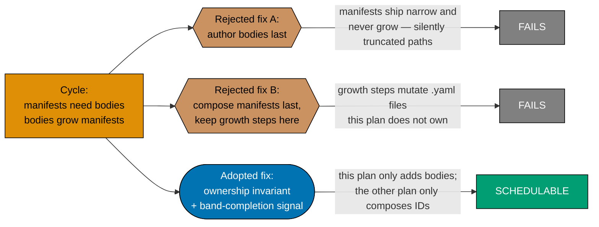
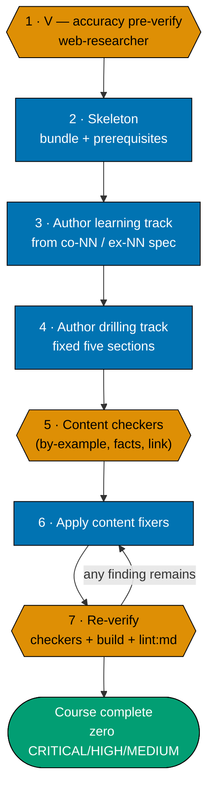
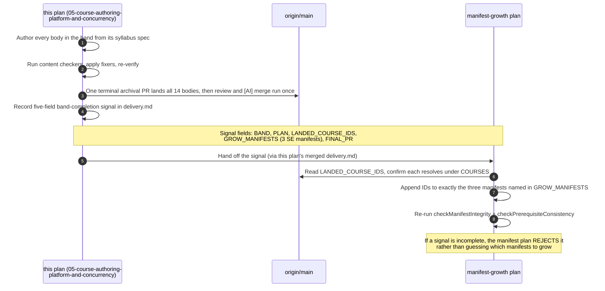
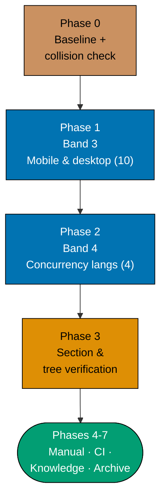

# Technical Docs — Course Authoring: Platform & Concurrency Languages

## Corpus Custody

`custodied-by:ayokoding-learning-path-02-schema-and-prerequisite-dag` — this plan **reads** the shared
course corpus custodied by that plan but never edits, copies, or forks any file under it. Any needed
change to that corpus is routed to its own `delivery.md` as a change request, per the
[Learning-Plan Syllabus Convention §Custody Rule](../../../repo-governance/conventions/structure/learning-plan-syllabus/custody-rule.md#custody-rule).

## Overview

This plan produces **content artefacts only**: 14 page bundles under
`apps/ayokoding-www/content/en/learn/courses/<course-id>/`. It writes no TypeScript, no YAML data
file, no route, no component, and no redirect rule. Its "architecture" is therefore an **authoring
architecture** — where each body's authoritative spec lives, what shape the produced bundle takes, and
how a landed band is handed to the manifest-growth plan — inherited from plan04 and narrowed to this
plan's 14 IDs.

## Programme decisions (inherited, cited by id)

Reused from plan04's `tech-docs.md §Programme decisions`, which itself folded these from the retired
shared programme file. These are **programme-scope decisions, not repo-governance rule ids** — they
bind only this programme's plans.

| Id  | Decision                                                                                                                                          |
| --- | ------------------------------------------------------------------------------------------------------------------------------------------------- |
| A8  | **Strict clean-room licensing, programme-wide** — nothing copyrighted is reproduced, every concept restated in original words with a citation.    |
| A9  | Both corpora expand past 20 courses as the domain requires; every derived count follows.                                                          |
| A12 | Every syllabus is independently authored, then externally confirmed — a published curriculum may corroborate coverage but never supply structure. |

### A8 — the six hazards this plan's authoring pipeline catches

Identical to plan04's own posture, restated for this plan's 14 bodies: code examples authored
originally (never copied from a framework's docs, a tutorial, a blog post, or Stack Overflow —
CC-BY-SA content course material generally cannot satisfy); documentation prose restated in this
course's own words with a citation; any diagram authored as Mermaid, never a lifted screenshot;
module/example progression authored from the `syllabus/courses/<course-id>.md` spec's `co-NN` order,
never a well-known book's chapter progression or a paid course's module sequence; language, framework,
and vendor names (Kotlin, Swift, Dart/Flutter, C#/.NET, Go, Elixir, Android, iOS, Windows) used
nominatively only; any dataset a worked example touches authored for the example, never lifted.

## The manifest ownership invariant (binding)

> **This plan never edits a manifest file.** Every file under
> `apps/ayokoding-www/src/features/course-paths/manifests/` is owned by the manifest-growth plan
> (`ayokoding-learning-path-12-careers-se-manifests` — the successor to plan04's original,
> since-renamed/split `ayokoding-learning-path-05-manifests` name). A step here that creates, appends to,
> reorders, or re-verifies a `.yaml` manifest is a **boundary violation**, not a convenience.



**Accessibility note.** Verdict is carried by node **shape** (hexagon = rejected, stadium = adopted)
and by literal terminal labels (`FAILS` / `SCHEDULABLE`), never by fill colour alone. Fills use the
verified accessible palette per the
[Color Accessibility Convention](../../../repo-governance/conventions/formatting/color-accessibility.md).

### What the invariant permits and forbids, concretely

| Action                                                              | Permitted here?                                                 |
| ------------------------------------------------------------------- | --------------------------------------------------------------- |
| Create `<COURSES><course-id>/` and author its bundle                | **Yes**                                                         |
| Declare `prerequisites` in a course's own `_index.md`               | **Yes**                                                         |
| Add a course's row to the Course Library Catalog in this file       | **Yes**                                                         |
| List a course in `<COURSES>_index.md`                               | **Yes**                                                         |
| Record a band-completion signal in this plan's `delivery.md`        | **Yes**                                                         |
| Read a `.yaml` manifest to check what a path expects                | **Yes** (read-only)                                             |
| Append a course ID to any `<MANIFESTS>**/*.yaml`                    | **No**                                                          |
| Re-order any `courseOrder`                                          | **No**                                                          |
| Re-run manifest integrity / prerequisite-consistency as a gate here | **No** — the manifest-growth plan re-verifies its own artefacts |
| Assert any catalog total beyond this plan's own 14                  | **No** — this plan asserts its own **14**, nothing broader      |

## Cross-plan `syllabus/` reference rule (binding)

The 122-file `syllabus/` detail layer lives **only** in
[`ayokoding-learning-path-02-schema-and-prerequisite-dag`](../../done/2026-07-24__ayokoding-learning-path-02-schema-and-prerequisite-dag/README.md).
This plan is a small consumer of it and **never copies it**.

- Every reference uses the **full cross-plan relative path**:
  `../../done/2026-07-24__ayokoding-learning-path-02-schema-and-prerequisite-dag/syllabus/<rest>`.
- **Copying is forbidden.** A copy forks the source of truth for 122 course specs, so a later spec
  correction lands in one copy only.
- The schema plan is already `done/`, so the reference above is stable at this plan's authoring time —
  unlike plan04, which authored against the schema plan while it was still `in-progress/`, this plan
  never needs a reciprocal-repoint step for that specific plan.

**Link-validation mechanics** (identical binary behaviour plan04 already verified — reused verbatim):
`md links validate` accepts **no positional path** and cannot be scoped by `cd`-ing into a folder.
Use the repo-wide form with the pre-push hook's own excludes and filter to this plan's own paths:

```bash
cargo run --release --quiet --manifest-path apps/rhino-cli/Cargo.toml -- md links validate \
  --quiet \
  --exclude plans/done \
  --exclude apps/ayokoding-www/content \
  --exclude apps/ose-www/content 2>&1 | grep -F "ayokoding-learning-path-05-course-authoring-platform-and-concurrency"
```

Acceptance: the `grep` finds **no** matching line (exits 1). Falsifiable the other way too —
introduce one bad `../../done/2026-07-24__ayokoding-learning-path-02-schema-and-prerequisite-dag/syllabus/`
link and the same command prints that file and exits 0.

## Authoring architecture

### The course page bundle (inherited from plan04 unchanged)

Every authored course is a page bundle at `<COURSES><course-id>/` with a fixed anatomy:

```text
<COURSES><course-id>/
├── _index.md                 declares `prerequisites: [course-id, ...]` (contracted shape)
├── overview.md               purpose + `## Prerequisites` (earlier library courses only)
│                             + register + the explicit scope boundary against confusable siblings
├── learning/
│   ├── _index.md
│   ├── <concept + example pages, exhaustive `co-NN` / `ex-NN` coverage>
│   ├── code/                 colocated runnable examples (code-bearing courses only)
│   └── capstone/             the course's own intra-course capstone
└── drilling/
    ├── _index.md              lists the drilling sections, links to `overview.md`
    └── overview.md            the fixed five-section drilling order
```

The `course-id` slug, the prerequisite chain, the concept-coverage floor, and the worked-example
volume are all **settled** in the matching `syllabus/courses/<course-id>.md` spec. Authoring
transcribes them; it does not re-decide them.

### The per-course authoring convention (maker-checker-fixer, not code TDD)



**Accessibility note.** Stage kind is carried by node **shape** (hexagon = verify, rectangle =
produce, stadium = terminal) and by the numbered step labels; the retry edge carries an explicit
label. Colour is redundant throughout.

**This is deliberately not a Red→Green→Refactor cycle.** Content authoring is a maker-checker-fixer
workflow — there is no failing test to write first, because the artefact under production is prose
and worked examples validated by domain checkers, not application behaviour validated by assertions.
Plan04 states this explicitly and this plan preserves the ruling verbatim; see
[§TDD exemption](#tdd-exemption-this-plan-ships-no-application-code) below.

### The `prerequisites` frontmatter contract (consumed, not owned)

Every authored `_index.md` declares:

```yaml
prerequisites: [course-id, course-id, ...]
```

The canonical statement of this field's shape is owned by
[`ayokoding-learning-path-02-schema-and-prerequisite-dag`](../../done/2026-07-24__ayokoding-learning-path-02-schema-and-prerequisite-dag/tech-docs.md).
This plan **consumes** it. The list's contents are transcribed from the course's own spec file, never
re-derived.

### Band-completion signal (the handoff to the manifest-growth plan)



Two signals are recorded in this plan's `delivery.md` — one per band (Band 3, Band 4) — each with all
five fields, `GROW_MANIFESTS` naming exactly the three software-engineer-role manifests, and
`FINAL_PR: #133, reverted by direct-push commit 919863f07 same day, restored by #136` — downstream
consumption requires verifying #136 is merged, not merely that #133 was, since `gh pr view 133`
permanently reports `MERGED` regardless of the revert.

### Delivery flow across the two bands



**Ordering rationale.** Band 3 before Band 4 mirrors plan04's own listing order and its numbering
(Band 3 then Band 4), but the two bands are, per plan04's own finding, mutually content-independent —
neither prerequisites the other. This plan's phase order is therefore a convenience, not a
constraint; both bands could pipeline concurrently if the concurrency cap allowed it, but are
sequenced here to keep each phase's review scope small and each PR reviewable as one coherent unit
(see [README §Delivery Mode](./README.md#delivery-mode-worktree-to-pr) for the grouped-cohort
reasoning).

## Design Decisions

This plan owns **zero** new design decisions — it is a narrow authoring slice of plan04's already-
settled architecture. It cites the following plan04 decisions by id, verbatim in effect, without
renumbering:

- **DD-8 · Variant policy — separate course only when pedagogy must differ.** None of the 14 courses
  here is a variant; each is a distinct course-id for a distinct language/platform pairing, not a
  pedagogy-variant of an existing course. Cited for completeness — no variant decision is made in
  this plan.
- **DD-17 / DL-12 · FS-SE hard dependency removed.** All 14 courses are transferred FS-SE topics
  (`T(64)`–`T(77)` in plan04's numbering) absorbed as native backfill; the prior "FS-SE plan must be
  DONE first" gate does not apply — that plan is closed.
- **DD-18 · Proof-of-transfer outcome-anchor (principles, not repo-specifics).** Every course here
  teaches durable principles (Kotlin/Swift/Dart/C#/Go/Elixir syntax and idioms; native platform
  development patterns; concurrency paradigms); no target codebase is the subject matter itself.
- **DD-28 · Course surgery permitted programme-wide (cited, not exercised).** No surgery is performed
  in this plan — all 14 bodies are net-new authoring against a genuine gap (transferred topics with no
  existing body), not an edit to an existing course.
- **DD-15 / DD-27 · Build order (cited for context, not re-decided).** Plan04's locked build order
  places Bands 3 and 4 after Group A (architecture + UI), the `interview-ready` MVP, and the AI path's
  authoring-priority-#1 courses. This plan does not reorder that sequence; it narrows plan04's already
  -scoped Bands 3 and 4 into an independently deliverable slice, unblocked the moment plan04's own
  Phase 0 baseline and populated `courses/` namespace exist (this plan's own hard `blockedBy`).
- **DN-11 · `[AI]` auto-merge (repo default).** `[AI]` merges the sole terminal archival PR once the
  3-cycle PR-Review Maker→Fixer Cycle and all quality gates are green; no `[HUMAN]` merge gate exists.

### Referenced but owned elsewhere

| Subject                                                                                | Owner plan                                                               |
| -------------------------------------------------------------------------------------- | ------------------------------------------------------------------------ |
| One canonical body + URL per course; re-home with redirects                            | `ayokoding-learning-path-01-url-restructure`                             |
| Every course declares `prerequisites` → a prerequisite DAG                             | `ayokoding-learning-path-02-schema-and-prerequisite-dag`                 |
| Omit-or-create; per-path framing is a callout, never a body fork                       | manifest-growth plan (`ayokoding-learning-path-12-careers-se-manifests`) |
| Prerequisite-consistency is the audited smoothness property                            | `ayokoding-learning-path-02-schema-and-prerequisite-dag`                 |
| Growing the three software-engineer-role manifests from this plan's two signals        | manifest-growth plan (`ayokoding-learning-path-12-careers-se-manifests`) |
| `build-your-own-raft` consuming `just-enough-go` (Band 4) as its declared prerequisite | `ayokoding-learning-path-10-course-authoring-jvm-and-build-your-own`     |

## Course Library Catalog

This plan authors exactly the **14 rows** below, drawn verbatim from plan04's own catalog table
(`tech-docs.md §Course Library Catalog`, sections "Mobile & desktop platforms" and "CS foundations,
paradigms & concurrency"). **Origin `T(n)`** = transferred FS-SE topic n, authored here for the first
time. This plan does **not** assert plan04's 90-body or the manifest plan's eventual 127-course
catalog total — only these 14.

### Mobile & desktop platforms (Band 3)

| Course ID                       | Origin | Format     | Primary language | Prerequisites                        | One-line scope                         |
| ------------------------------- | ------ | ---------- | ---------------- | ------------------------------------ | -------------------------------------- |
| `just-enough-kotlin`            | T(68)  | Primer     | Kotlin           | —                                    | Kotlin syntax, null-safety, coroutines |
| `android-app-development`       | T(69)  | By Example | Kotlin           | `just-enough-kotlin`                 | Native Android with the SDK            |
| `just-enough-swift`             | T(70)  | Primer     | Swift            | —                                    | Swift syntax, optionals                |
| `ios-app-development`           | T(71)  | By Example | Swift            | `just-enough-swift`                  | Native iOS with the SDK                |
| `just-enough-dart`              | T(72)  | Primer     | Dart             | —                                    | Dart syntax, async, Flutter idioms     |
| `hybrid-app-development`        | T(73)  | By Example | Dart             | `just-enough-dart`                   | Cross-platform from one Dart codebase  |
| `just-enough-csharp`            | T(74)  | Primer     | C#               | —                                    | C# syntax, LINQ, async, .NET           |
| `windows-app-development`       | T(75)  | By Example | C#               | `just-enough-csharp`                 | Native Windows desktop                 |
| `linux-app-development`         | T(76)  | By Example | Python           | `just-enough-python`                 | Native Linux desktop, packaging        |
| `building-production-cli-tools` | T(77)  | By Example | Go + Rust        | `just-enough-go`, `just-enough-rust` | Distributable CLI tools                |

### Concurrency languages (Band 4)

| Course ID                 | Origin | Format     | Primary language | Prerequisites                                       | One-line scope                  |
| ------------------------- | ------ | ---------- | ---------------- | --------------------------------------------------- | ------------------------------- |
| `just-enough-go`          | T(64)  | Primer     | Go               | —                                                   | Go syntax, goroutines           |
| `csp-style-concurrency`   | T(65)  | By Example | Go               | `just-enough-go`, `concurrency-and-parallelism`     | Channels, CSP concurrency       |
| `just-enough-elixir`      | T(66)  | Primer     | Elixir           | —                                                   | Elixir syntax, pattern matching |
| `actor-model-concurrency` | T(67)  | By Example | Elixir           | `just-enough-elixir`, `concurrency-and-parallelism` | Actors, supervision trees       |

**Cross-band note.** `just-enough-go` (Band 4) is also a prerequisite of `building-production-cli-tools`
(Band 3) — the only intra-plan edge crossing the two bands. `concurrency-and-parallelism` and
`just-enough-python` / `just-enough-rust` are library courses authored elsewhere in plan04's other
bands (already merged or scheduled independently); their presence as a prerequisite ID here is a
forward/lateral reference the course-library resolver tolerates (a lookup miss is never a build
failure), consistent with plan04's own tolerance model for such references.

## Productive in Target Codebases (proof-of-transfer outcome-anchor, cited)

Reused from plan04's own philosophy statement (DD-18): the library teaches durable **principles**;
target codebases are evidence the principles transfer, never subject matter. None of this plan's 14
courses names a specific target codebase as its subject — each teaches a language or platform's own
idioms and patterns (Kotlin/Android, Swift/iOS, Dart/Flutter, C#/.NET/Windows, Python/Linux, Go+Rust
CLI packaging, Go CSP channels, Elixir actors/OTP supervision).

## UI-gate and API-gate posture (R9)

### UI gate — exempt

`swe-ui-checker` validates component **source** — it globs for `.tsx` files. This plan writes no
TypeScript, no YAML, no route, no component. Its entire output is 14 markdown page bundles. A checker
run scoped to this plan's diff would scan **zero** `.tsx` files and return zero findings — recorded as
an exemption rather than a claimed one. The components that render these bodies are owned by
`ayokoding-learning-path-03-navigation-ui`. Because this plan ships 14 user-visible pages, manual
behavioural verification via Playwright MCP is mandatory and performed (Phase 4).

### API gate — exempt

This plan never edits a manifest file, ships no code, no YAML, no route. Its one piece of structured
data, the `prerequisites` frontmatter this plan writes into each of the 14 `_index.md` files, is inert
until a downstream consumer reads it. This plan has no reachable behavioural delta of its own for
`api-quality-gate` to exercise. **Rule-16 API exploratory retest — not applicable.**

## Exemptions (stated explicitly, not silently taken)

### UI-design-funnel exemption (not UI-bearing)

This plan adds no user-facing screen or component under `apps/` or `libs/`. Every artefact is a
markdown page bundle rendered by components this plan does not touch. The complete UI-design-funnel
is owned by `ayokoding-learning-path-03-navigation-ui` and `ayokoding-learning-path-01-url-restructure`.
**This plan carries no `assets/` folder and produces no render.**

### Specs & Gherkin (app-code) exemption

The [Feature Change Completeness Convention](../../../repo-governance/development/quality/feature-change-completeness.md)
binds app/lib code changes to companion `specs/` Gherkin. This plan changes **no app or lib code** —
it adds content under `apps/ayokoding-www/content/`, classified as "largely content (exempt from
`specs:coverage`)". The eight Gherkin scenarios in [`prd.md`](./prd.md#acceptance-criteria-gherkin)
are **content-level acceptance criteria**, verified by grep-checkable assertions and the ayokoding
content checkers — not by `specs:behavior:coverage`. The plan still runs
`npx nx affected -t specs:behavior:coverage` in its verification phase to prove no regression.

### TDD exemption (this plan ships no application code)

Identical reasoning to plan04's own exemption: this plan's delivery steps produce prose, worked
examples, and colocated runnable `code/` samples that are course material, not application code — no
importable module, no test target, no runtime behaviour the app depends on. Correctness is
established by the maker-checker-fixer pipeline. **If any step in this plan ever needs to touch app or
lib code, that step is out of scope and must be routed to the owning plan.**

### Rule-15 three-tester retest exemption

Recorded with reasons in [README §Rule-15](./README.md#rule-15-three-tester-retest--exemption-recorded).
Narrow: manual Playwright MCP verification remains mandatory and performed with committed screenshot
evidence. Only the `web-exploratory-tester` / `web-usability-tester` / `web-design-tester` triad is
waived.

### Rule-16 API exploratory retest — not applicable

This plan changes no REST or GraphQL endpoint and ships no API contract.

## File Impact

Every artefact this plan writes is additive under `apps/ayokoding-www/content/en/learn/courses/`
(the `<COURSES>` shorthand defined in [delivery.md §Parallelization Model](./delivery.md#parallelization-model));
nothing under `<FEAT>` or `<MANIFESTS>` is ever touched.

**New directories created** (14 total, one per authored body, zero overlap with any pre-existing
bundle):

- `apps/ayokoding-www/content/en/learn/courses/<course-id>/` — the fixed course-page bundle anatomy,
  one per slug in `evidence/authored-body-slugs.txt`.

**Existing files modified per band** (this plan edits these; it never creates them):

| File                                                                            | Change                                                                                                   |
| ------------------------------------------------------------------------------- | -------------------------------------------------------------------------------------------------------- |
| `apps/ayokoding-www/content/en/learn/courses/_index.md` (`<COURSES>_index.md`)  | one new list entry per landed course ID, appended per band                                               |
| `tech-docs.md` (this file) — [§Course Library Catalog](#course-library-catalog) | catalog rows already present at authoring time; no further edit needed at execution unless a spec drifts |
| `delivery.md` (this plan's own file)                                            | the five-field band-completion signal block appended at the end of each band phase                       |

**Never touched, by construction** (verified by a zero-diff gate check at every phase):

- `<FEAT>` (`apps/ayokoding-www/src/features/course-paths/`) — no application code.
- `<MANIFESTS>` (`<FEAT>manifests/`) — every `.yaml` manifest is read-only from this plan.
- `<PATHS>` and `<SE_OLD>` — read-only reference paths.
- `<SYLLABUS>` — the cross-plan authoring source; consumed, never copied or edited.

**No package-manifest changes**: this plan adds no entry to `package.json`, `go.mod`, `Cargo.toml`, or
any other dependency manifest.

## Dependencies

| Dependency                                                      | Kind       | Note                                                                           |
| --------------------------------------------------------------- | ---------- | ------------------------------------------------------------------------------ |
| `ayokoding-learning-path-01-url-restructure` merged             | hard, plan | populated flat `courses/` namespace + `courses/_index.md`                      |
| `ayokoding-learning-path-02-schema-and-prerequisite-dag` merged | hard, plan | `syllabus/courses/` specs + the `prerequisites` frontmatter contract           |
| `ayokoding-learning-path-04-course-authoring` Phase 0 baseline  | hard, plan | populated `courses/` namespace + converged toolchain, not Band 2 specifically  |
| `vercel-function-cost-reduction` merged                         | hard, plan | root layout + middleware fix landed (same `apps/ayokoding-www` app/route tree) |
| `apps-ayokoding-www-primer-maker` and its checker               | agent      | the six `just-enough-*` primer bodies                                          |
| `apps-ayokoding-www-by-example-maker` and its checker           | agent      | the eight By-Example bodies                                                    |
| `apps-ayokoding-www-facts-checker`                              | agent      | version-pinned / market fact verification                                      |
| `apps-ayokoding-www-link-checker`                               | agent      | intra-course and cross-course link integrity                                   |
| `web-researcher`                                                | agent      | the per-course accuracy pre-verify (`V`) step                                  |
| `apps-ayokoding-www-deployer`                                   | agent      | post-merge deploy to `prod-ayokoding-www`                                      |
| `nx run ayokoding-www:build`                                    | Nx target  | renders the authored tree                                                      |
| `rhino-cli md links validate` / `md heading-hierarchy validate` | CLI        | run as raw `cargo run`, not Nx targets                                         |
| `npm run lint:md`                                               | npm script | markdownlint over the authored tree                                            |

**No new package dependency.**

## Rollback

Every artefact this plan produces is an **additive** new directory under `<COURSES>`. Nothing is
moved, renamed, or deleted, so rollback is subtractive and total:

- **Per band**: revert that band's merge commit. The bodies disappear; no other course is affected
  because bodies are content-independent. The corresponding band-completion signal is reverted with
  it, so the manifest-growth plan sees no stale signal.
- **Per course**: `git rm -r <COURSES><course-id>/` plus removing its row from the catalog and its
  entry from `<COURSES>_index.md`. Safe **only** if no manifest already references the ID.
- **Whole plan**: revert both band merges in reverse order. `building-production-cli-tools` (Band 3)
  should be reverted before `just-enough-go` (Band 4) if both are being torn down, since it declares
  `just-enough-go` as a prerequisite.

**The one-way door**: once a manifest references a course ID, deleting that body breaks
`checkManifestIntegrity` downstream.

## Testing / Verification Strategy

| Level                     | What it verifies                                                                 | Mechanism                                                              |
| ------------------------- | -------------------------------------------------------------------------------- | ---------------------------------------------------------------------- |
| Per-course content checks | concept coverage, register, format, worked-example volume, scope boundary        | matching `apps-ayokoding-www-{primer,by-example}-checker`              |
| Per-course fact checks    | version-pinned / market facts                                                    | `apps-ayokoding-www-facts-checker`                                     |
| Per-course link checks    | intra-course and cross-course links resolve                                      | `apps-ayokoding-www-link-checker`                                      |
| Contract assertions       | primer/platform pairing declares the correct prerequisite slug                   | grep-checkable acceptance clauses on the authoring steps               |
| Structural                | bundle anatomy present; `prerequisites` declared                                 | `test -d` / `test -f` + frontmatter grep                               |
| Section build             | the authored tree renders                                                        | `npx nx run ayokoding-www:build`                                       |
| Markdown quality          | markdownlint, link validation, heading hierarchy                                 | `npm run lint:md` + the two `rhino-cli md` subcommands                 |
| Regression                | no existing project's gates broke                                                | `npx nx affected -t typecheck lint test:quick specs:behavior:coverage` |
| Manual behavioural        | a sample of authored course pages renders correctly at three breakpoints in `en` | Playwright MCP + committed `evidence/` screenshots                     |

**Deliberately absent**: unit, integration, and e2e tests for this plan's own artefacts. There is no
application code here to test.
