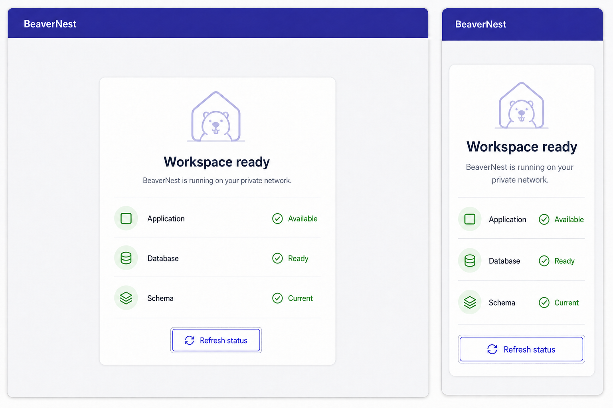
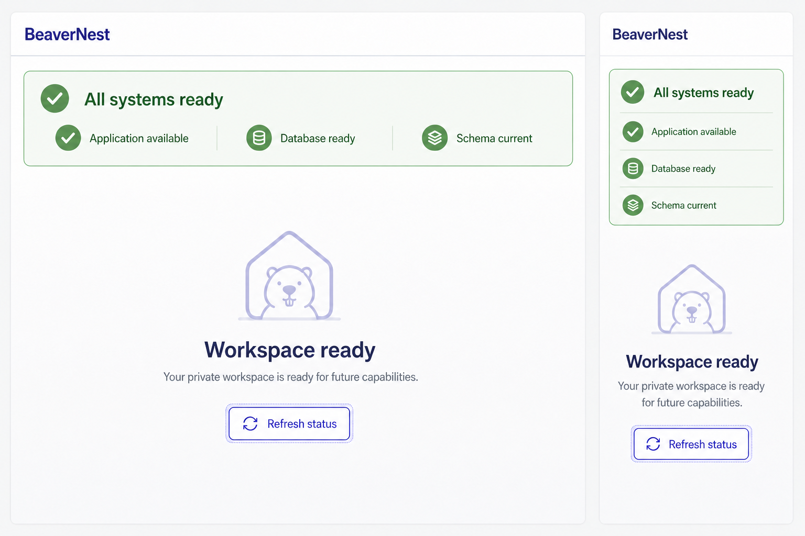

# Product Requirements Document — BeaverNest App Setup

## Product Overview

[Judgment call] This increment is a private, shared, local-first application foundation. The browser
loads a static Vite/React shell from the BeaverNest backend, then requests readiness from a relative
same-origin API path. The backend owns one SQLite database directory per runtime environment and
applies explicit SQL migrations before accepting traffic. Local development and production use
distinct, explicitly configured directories.

No assistant or content feature is introduced. The normative page title is “Foundation status” and
the empty-state copy is “No workspace features yet.” A ready state means only that the application,
database, and schema foundation are available for a later product slice.

## Personas

| Persona                  | Context                                       | Need                                                                         |
| ------------------------ | --------------------------------------------- | ---------------------------------------------------------------------------- |
| Individual operator-user | Runs BeaverNest on a VPN-connected local host | Simple startup, visible readiness, durable data, and recoverable backup      |
| Trusted group member     | Has already been admitted to the same VPN     | One responsive shared application endpoint without a login flow              |
| Executor/reviewer agent  | Implements or checks the plan                 | Testable scenarios and explicit constraints without inferred domain behavior |

## User Stories

### US1 — Open the private CSR workspace

**As an** admitted VPN peer,
**I want** the application shell to render immediately and check readiness from my browser,
**So that** I can tell whether the shared workspace is usable without server-generated page data.

```gherkin
Feature: Private client-rendered workspace

  Scenario: Browser renders the workspace and obtains readiness
    Given BeaverNest is reachable through its configured VPN address
    When I navigate to "/" in a new browser session
    Then the application shell renders before the readiness request completes
    And the browser sends a same-origin GET request to "/api/v1/readiness"
    And the page reports Application Available, Database Ready and Schema Current

  Scenario: Workspace shows readiness loading state
    Given the readiness response is intentionally delayed
    When I navigate to "/"
    Then the readiness region reports that status is being checked
    And the region does not falsely report the database as ready

  Scenario: Workspace recovers from readiness failure
    Given the readiness endpoint returns an unavailable response
    When I navigate to "/" and activate "Refresh status" after service recovery
    Then the readiness request is retried without a full page navigation
    And the region changes from Unavailable to Ready using a polite live announcement
```

### US2 — Distinguish liveness from readiness

**As an** operator,
**I want** separate process-liveness and database-readiness endpoints,
**So that** monitoring can distinguish a running process from a usable workspace.

```gherkin
Feature: Service health boundaries

  Scenario: Live process reports liveness without database details
    Given the BeaverNest process is accepting HTTP requests
    When I send a GET request to "/api/v1/health"
    Then the response status is 200
    And the JSON response reports status "ok"
    And the response reveals no database path or migration detail

  Scenario: Ready workspace reports database and schema state
    Given startup migrations completed and SQLite accepts queries
    When I send a GET request to "/api/v1/readiness"
    Then the response status is 200
    And the JSON response reports status "ready", database "ready" and schema "current"
    And the response sends "Cache-Control: no-store" without a cache validator

  Scenario: Unready workspace returns a safe response
    Given SQLite cannot complete the readiness query
    When I send a GET request to "/api/v1/readiness"
    Then the response status is 503
    And the JSON response reports status "not-ready"
    And the response reveals no database path, SQL text or exception detail
    And the response sends "Cache-Control: no-store" without a cache validator
```

### US3 — Start with an explicit SQLite schema boundary

**As an** operator,
**I want** deterministic explicit SQL migrations before HTTP startup,
**So that** the local schema is reproducible and the application never serves against an unknown
database state.

```gherkin
Feature: SQLite migration lifecycle

  Scenario: Fresh database is migrated before serving
    Given the configured durable database directory is writable and contains no database
    When the BeaverNest application starts
    Then DbUp creates its migration journal before the HTTP endpoint begins listening
    And no product or domain table is created

  Scenario: Restart does not reapply completed migrations
    Given the database contains a completed DbUp migration journal
    When the BeaverNest application restarts against the same mounted directory
    Then every completed migration remains recorded exactly once
    And readiness reports schema "current"

  Scenario: Broken migration prevents partial startup
    Given the migration set contains an intentionally invalid SQL script in an isolated test fixture
    When the BeaverNest application starts against a disposable database
    Then startup exits non-zero before publishing the HTTP endpoint
    And the migration failure is logged without exposing sensitive configuration

  Scenario: Development uses a separate SQLite directory
    Given the local development command receives an explicit developer-owned data directory
    When it starts the backend on the local development port
    Then the database resolves only within that development directory
    And the command neither reads nor inherits the production host data-bind source
```

### US4 — Use SQLite safely for the intended concurrency

**As an** operator of a small shared workspace,
**I want** explicit SQLite concurrency and integrity settings,
**So that** ordinary concurrent access behaves predictably on one host.

```gherkin
Feature: SQLite operating settings

  Scenario: Database enables required safety settings
    Given a migrated BeaverNest database is open
    When the SQLite operating settings are inspected
    Then foreign key enforcement is enabled
    And journal mode is WAL
    And a finite busy timeout is configured

  Scenario: Brief writer contention respects the busy timeout
    Given one disposable SQLite connection holds a short write transaction
    When a second connection attempts a write through the configured data boundary
    Then the second operation retries only until the configured busy timeout
    And the result is returned as a controlled database-busy error rather than an unbounded hang
```

### US5 — Preserve and recover the infrastructure database

**As an** operator,
**I want** durable storage plus verified manual backup and restore,
**So that** restarts and recoverable failures do not erase the application foundation.

```gherkin
Feature: SQLite durability and recovery

  Scenario: Database survives application-container restart
    Given BeaverNest is ready and its migration journal exists in the mounted host directory
    When I recreate only the application container without deleting the host directory
    Then the same migration journal is present after restart
    And the application returns to ready state

  Scenario: Online backup produces a valid database
    Given BeaverNest is ready with WAL enabled
    When I run the manual backup command while the application remains online
    Then the backup completes through the SQLite backup API
    And integrity_check returns "ok" for the backup
    And foreign_key_check returns no rows for the backup

  Scenario: Verified restore returns the application to ready state
    Given a validated backup and the application is stopped
    When I run the restore command against the configured durable directory
    Then the replaced database is preserved at a recoverable path
    And the restored migration journal is current
    And the restarted application reports ready
```

### US6 — Preserve API and SPA routing boundaries

**As a** client or operator,
**I want** API failures to remain JSON while client routes use SPA fallback,
**So that** a mistyped API request never receives the application HTML.

```gherkin
Feature: Same-origin API and SPA routing

  Scenario: Unknown API path returns JSON not SPA HTML
    Given the combined BeaverNest endpoint is running
    When I send a GET request to "/api/v1/does-not-exist"
    Then the response status is 404
    And the content type is "application/json"
    And the response body contains a non-empty error message

  Scenario: Unknown client route receives the SPA shell
    Given the combined BeaverNest endpoint is running
    When I navigate to "/future-client-route"
    Then the response status is 200
    And the returned document is the Vite application shell

  Scenario: Unknown static asset is not replaced by the SPA shell
    Given the combined BeaverNest endpoint is running
    When I send a GET request to "/assets/missing.js"
    Then the response status is 404
    And the response is not the Vite application shell
```

### US7 — Publish one address-scoped shared endpoint

**As an** operator,
**I want** Compose to publish BeaverNest only on the existing VPN host address,
**So that** BeaverNest does not also listen on wildcard, public, LAN, or loopback host addresses.

```gherkin
Feature: Address-scoped application exposure

  Scenario: VPN peer can reach the shared workspace
    Given the operator configured an address present on the host VPN interface
    When an admitted VPN peer opens the published BeaverNest port
    Then the workspace shell loads successfully
    And no separate backend port is reachable

  Scenario: Other host addresses do not publish BeaverNest
    Given BeaverNest is published on the configured VPN host address
    When connection attempts target the host public, LAN and loopback addresses on the same port
    Then BeaverNest is not listening on those host addresses
    And socket inspection shows no wildcard host publication
```

### US8 — Remove obsolete hello-world behavior

**As a** maintainer,
**I want** the greeting endpoint and promotional landing behavior removed,
**So that** active specifications describe the application foundation rather than an old demo.

```gherkin
Feature: Hello-world surface retirement

  Scenario: Greeting route is no longer part of the API
    Given the BeaverNest foundation has been delivered
    When I send a GET request to "/api/v1/hello"
    Then the response status is 404
    And the content type is "application/json"

  Scenario: Workspace contains no promotional call to action
    Given I am viewing the rendered workspace home
    When I inspect the visible page content and accessible links
    Then no promotional product description is present
    And no external GitHub call to action is present
```

## Acceptance Notes

- `Ready`, `Loading`, and `Unavailable` are visible text, not color-only states.
- Readiness status combines text, icon, and semantic color.
- Readiness changes use `aria-live="polite"`; persistent critical failure is not dismissible.
- The application reveals no database path, host path, SQL, stack trace, or migration filename in
  HTTP responses.
- All VPN peers are intentionally trusted equally in this increment.
- Exact host-IP binding proves address-scoped publication only. VPN/firewall source-peer isolation
  remains external infrastructure and is not claimed as application authorization.
- Security headers apply consistently to HTML, static assets, API success, API errors, and SPA
  fallback responses; client-side rendering does not weaken the current anti-framing/content-type,
  referrer, permissions, or CSP posture.

## UI Design Funnel

### Existing-UI Grounding (R5)

[Repo-grounded] The current `AppFrame` uses the shared `AppHeader`, a centered main region, a simple
bordered footer, and the BeaverNest token files. The selected direction preserves the compact header,
centered hierarchy, typography, radius language, and brand tokens while replacing promotional copy,
the external GitHub CTA, and server-supplied greeting with application readiness.

### Shared-Primitive Decisions

| Element       | Decision                                                                                         |
| ------------- | ------------------------------------------------------------------------------------------------ |
| `AppHeader`   | Reuse from `@open-sharia-enterprise/web-ui` with title/home link; no trailing navigation         |
| `Card` family | Reuse for the readiness panel, title, description, content, and action region                    |
| `Button`      | Reuse for `Refresh status`; retain its focus, disabled, and pointer-target behavior              |
| `Icon`        | Reuse per status row as decorative support (`aria-hidden`) because adjacent text carries meaning |
| Status row    | Add one local semantic `<dl>`-based component; existing `StatCard` is for metrics, not health    |

No local clone of a shared primitive is introduced. Compatibility changes belong in `web-ui`, not
inside the app, and must preserve all existing consumers.

### Prior Art (R7)

- [Web-cited] PatternFly's official status guidance says status should use a “combination of text,
  color, and an icon.” Its status-card examples support the chosen compact component hierarchy.
  Source: [PatternFly status and severity](https://www.patternfly.org/patterns/status-and-severity/),
  accessed 2026-08-02.
- [Web-cited] Primer's banner guidance favors one concise status region near relevant content, and
  Primer Blankslate explains why content is absent. Exact excerpts: [Primer Banner guidelines](https://primer.style/product/components/banner/guidelines/)
  say “Do not display more than one banner” and “Place Banners near the relevant section”; [Primer
  Blankslate](https://primer.style/product/components/blankslate/) says it is “used as placeholder
  to tell users why content is missing.” These patterns support one readiness region plus a neutral
  workspace empty state. Accessed 2026-08-02.

### Diverge — Alternative A: Focused Readiness Card

Desktop:

```text
┌──────────────────────────────────────────────────────────────────┐
│ BeaverNest                                                       │
├──────────────────────────────────────────────────────────────────┤
│                                                                  │
│             ┌────────────────────────────────────┐               │
│             │ Foundation status                  │               │
│             │ Private-network status             │               │
│             ├────────────────────────────────────┤               │
│             │ ✓ Application           Available │               │
│             │ ✓ Database                    Ready │               │
│             │ ✓ Schema                    Current │               │
│             │            [ Refresh status ]       │               │
│             └────────────────────────────────────┘               │
│                                                                  │
└──────────────────────────────────────────────────────────────────┘
```

Mobile:

```text
┌───────────────────────┐
│ BeaverNest            │
├───────────────────────┤
│ ┌───────────────────┐ │
│ │ Foundation status │ │
│ │ ✓ Application    │ │
│ │   Available       │ │
│ │ ✓ Database Ready │ │
│ │ ✓ Schema Current │ │
│ │ [Refresh status] │ │
│ └───────────────────┘ │
└───────────────────────┘
```

### Diverge — Alternative B: Readiness Banner and Blankslate

Desktop:

```text
┌──────────────────────────────────────────────────────────────────┐
│ BeaverNest                                                       │
├──────────────────────────────────────────────────────────────────┤
│ ┌──────────────────────────────────────────────────────────────┐ │
│ │ ✓ All systems ready  ✓ App  ✓ Database  ✓ Schema           │ │
│ └──────────────────────────────────────────────────────────────┘ │
│                                                                  │
│                        Foundation status                         │
│                    No workspace features yet                     │
│                       [ Refresh status ]                         │
│                                                                  │
└──────────────────────────────────────────────────────────────────┘
```

Mobile:

```text
┌───────────────────────┐
│ BeaverNest            │
├───────────────────────┤
│ ┌───────────────────┐ │
│ │ All systems ready │ │
│ │ ✓ App             │ │
│ │ ✓ Database        │ │
│ │ ✓ Schema          │ │
│ └───────────────────┘ │
│   Foundation status   │
│ No workspace features │
│          yet          │
│  [ Refresh status ]   │
└───────────────────────┘
```

### Narrow — High-Fidelity Finalists

Finalist A — focused centered readiness panel:



Finalist B — full-width readiness summary and blankslate:



### Select

**Selected implementation direction: Finalist A — Focused Readiness Card.**

[Judgment call] The user selected the textual “compact header plus one readiness panel” direction
and rejected speculative navigation. The terminal could not display raster previews, so the focused
centered raster is treated as an illustrative implementation reference rather than a separately
user-approved picture. It is the direct high-fidelity continuation of the selected low-fidelity
direction; token and state tables below are normative when raster colors/copy differ.

### Justify

| Criterion                              | Finalist A                              | Finalist B                                                   |
| -------------------------------------- | --------------------------------------- | ------------------------------------------------------------ |
| Minimum viable hierarchy               | One panel contains all current behavior | Adds a second large empty-state region                       |
| Avoids speculative product UI          | Yes                                     | Mostly, but gives future capability space more visual weight |
| Continuity with current centered frame | Strong                                  | Moderate                                                     |
| Small-screen scan                      | One vertical component                  | Two stacked regions                                          |
| Status accessibility                   | Text + icon + color per row             | Text + icon + color in summary                               |
| Decision                               | **Keep**                                | Drop: extra hierarchy has no current product behavior        |

### Responsive Strategy

- `<640px`: single-column card, full-width action, status labels and values wrap without truncation.
- `640px–1023px`: constrained centered card with comfortable side padding.
- `≥1024px`: retain the same card; increase whitespace rather than invent dashboard columns.
- At every width, maintain logical DOM order, visible keyboard focus, no horizontal scrolling at
  320 CSS pixels, and minimum 44-by-44 CSS-pixel pointer targets for the refresh action.

| Verification width | Normative behavior                                                                    |
| ------------------ | ------------------------------------------------------------------------------------- |
| `320` and `375`    | One full-width panel/action; row labels/values wrap; no clipping or horizontal scroll |
| `768`              | Panel remains centered and single-column with bounded width and tablet side padding   |
| `1280`             | Panel stays constrained; added space becomes whitespace, not speculative columns      |

Component RED tests assert these classes/semantics before implementation; Playwright GREEN evidence
checks Loading, Unavailable/retry, and Ready at the listed mobile, tablet, and desktop widths.

### Theme and Accessibility

- Reuse `libs/web-ui-token/src/tokens.css` and `beaver-nest.css`.
- In a bundled external `src/theme.ts` module imported by `src/main.tsx` before `createRoot`, read
  `matchMedia("(prefers-color-scheme: dark)")` and set
  `document.documentElement.dataset.theme` to `dark` or `light`; subscribe to system changes and
  dispose the prior listener during HMR cleanup. The current tokens do not activate dark values from
  media alone, so this bootstrap is mandatory and tested. `index.html` contains no inline script,
  and there is no theme switcher in this increment.
- Meet WCAG 2.2 AA contrast, landmarks, heading order, reduced-motion preference, focus visibility,
  and color-independent status communication.

### Normative Token Reconciliation

The raster colors are illustrative. Implementation uses these existing BeaverNest semantic tokens:

| UI role                 | Required token(s)                                             |
| ----------------------- | ------------------------------------------------------------- |
| Page/header background  | `--color-background`                                          |
| Panel surface           | `--color-card` and `--color-card-foreground`                  |
| Header/body text        | `--color-foreground`                                          |
| Supporting text         | `--color-muted-foreground`                                    |
| Borders/dividers        | `--color-border`                                              |
| Ready icon well         | `--hue-sage-wash` and `--hue-sage-ink`                        |
| Loading icon well       | `--color-muted` and `--color-muted-foreground`                |
| Unavailable icon well   | `--hue-terracotta-wash` and `--hue-terracotta-ink`            |
| Refresh action          | `--color-primary` and `--color-primary-foreground`            |
| Keyboard focus          | `--color-ring`, visible two-pixel outline, and nonzero offset |
| Panel radius and shadow | `--radius-lg` and `--shadow-sm`                               |

### Normative State and Copy Matrix

| State       | Heading             | Supporting copy                                | Action           |
| ----------- | ------------------- | ---------------------------------------------- | ---------------- |
| Loading     | `Foundation status` | `Checking application, database, and schema…`  | Disabled refresh |
| Ready       | `Foundation status` | `No workspace features yet.`                   | `Refresh status` |
| Unavailable | `Foundation status` | `Foundation status is unavailable. Try again.` | `Refresh status` |

Rows always retain the labels `Application`, `Database`, and `Schema`; their values change by
state. No state says that product workspace capabilities are ready.

## Product Scope

### In scope

- One shared application home at `/`.
- Loading, ready, unavailable, and retry readiness states.
- Health/readiness API behaviors and strict API/SPA routing.
- Infrastructure-only SQLite initialization, restart durability, and recovery operations.
- Exact-VPN-host-address publication and one-origin browser/API flow.

### Out of scope

- Any editable workspace content.
- User identity, personalization, permissions, and private per-person state.
- Navigation to unfinished assistant/content/posting/workflow modules.
- Administrative database UI or backup UI.

## Product Risks

| Risk                                             | Product effect                           | Mitigation                                                                              |
| ------------------------------------------------ | ---------------------------------------- | --------------------------------------------------------------------------------------- |
| Ready status implies features already exist      | User expects functionality beyond status | Use explicit foundation/empty-state copy and no feature navigation                      |
| Readiness briefly flashes Ready from stale state | False confidence                         | Initialize as Loading; derive Ready only from current response                          |
| Status color is inaccessible                     | Meaning is lost                          | Pair every state with icon and explicit text; automated and manual accessibility checks |
| SPA fallback masks API errors                    | Client receives HTML for API typo        | Register JSON API catch-all before fallback and test all three routing classes          |
| Shared workspace trust is unclear                | VPN peer expects private data partition  | State shared trust in operator/product docs; do not imply user accounts                 |
