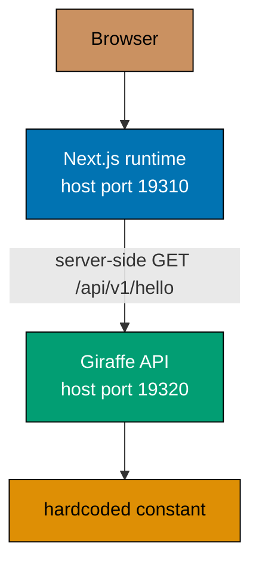
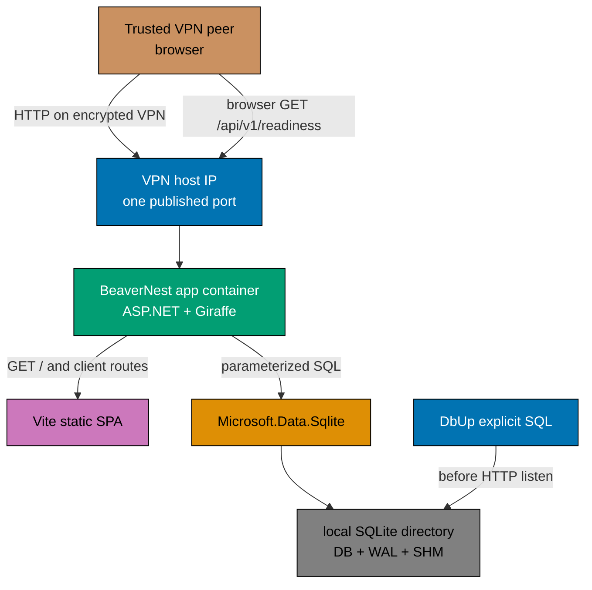
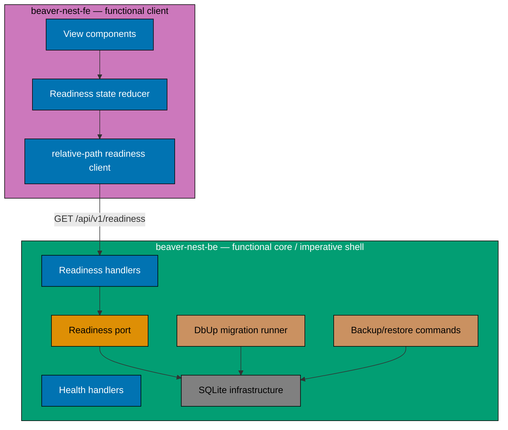

# Technical Documentation — BeaverNest App Setup

## Current Architecture

[Repo-grounded] The current frontend is a Next.js 16 App Router application. Its root page is an
async Server Component with `dynamic = "force-dynamic"`; `fetchGreeting()` runs in the Node process
against a server-only Docker hostname. The browser therefore does not perform the API request.

[Repo-grounded] The F#/Giraffe backend registers only Giraffe, serves liveness and greeting GET
routes, binds all container interfaces, and has no persistence dependency. Its README advertises a
CORS variable that the program does not consume.

[Repo-grounded] The development Compose stack publishes both services to all host interfaces when
no host IP is supplied. Its destructive restart command uses `docker compose down -v`, which is not
acceptable once durable personal data exists.



## Target Architecture

[Judgment call] Build `beaver-nest-fe` as a Vite/React SPA. During production image construction, copy
its immutable build output into a dedicated static-content directory in the backend image.
ASP.NET/Giraffe serves static files, API endpoints, an API-specific JSON catch-all, and finally the
SPA fallback from one process and one origin.

[Judgment call] One SQLite file has one long-running writable BeaverNest application process on one
host. Narrowly scoped backup, restore, and integrity one-shot processes on that same host are the
only exception. Its entire directory is bind-mounted from an operator-owned path outside the
repository. VPN clients never open the database and no network filesystem is supported.



### Request Routing Order

1. Apply one global security-header middleware before API, static-file, error, and fallback routes.
2. Map known `/api/v1/*` endpoints.
3. Map `/api/{**path}` to the existing JSON error envelope.
4. Serve only the dedicated Vite static directory; directory browsing stays disabled.
5. Return a real 404 for missing `/assets/*` files.
6. Register `index.html` fallback last for GET/HEAD non-file client routes.

[Repo-grounded] Implement this with the existing Giraffe seam, not `MapFallbackToFile` or ASP.NET
endpoint routing. `Program.fs` configures `UseStaticFiles` for only the Vite static directory before
calling `UseGiraffe webApp`. `WebApp.fs` retains its existing ordered `choose` handler: known API
routes, then the `/api/{**path}` JSON error handler, then an `/assets/` missing-file 404 handler,
then a final `spaFallbackHandler`. That handler accepts only GET/HEAD paths whose final segment has
no `.` and returns the configured `index.html`; it rejects `/api/` and `/assets/`. The Phase 5
route-boundary test must assert this `UseStaticFiles` + final Giraffe `spaFallbackHandler` path,
rather than any `MapFallbackToFile` call.

## Component Boundaries



## Decision Log

### Decision 1 — Vite SPA, not Next.js

[Judgment call] Replace Next.js with Vite + the official React plugin. Keep the Nx project name
`beaver-nest-fe`; no `beaver-nest-www` exists because there is no promotional site.

[Web-cited] Vite's production build uses `index.html` as its default entry and emits a bundle suited
to static hosting. Exact excerpts: the [Vite build guide](https://vite.dev/guide/build) says
“uses `<root>/index.html` as the build entry point” and “produces an application bundle” suitable
for static hosting; the [Vite proxy reference](https://vite.dev/config/server-options.html#server-proxy)
says it configures proxy rules “for the dev server.” Production therefore uses a relative
same-origin `/api` path. Accessed 2026-08-02.

Consequences:

- Delete Next-only config, server env validation, Server Components, `.next` outputs, and Node
  production start target.
- Add root `index.html`, `src/main.tsx`, Vite config, React entry/styles, and deterministic `dist/`.
- Keep the Vite dev server on loopback and proxy `/api` to local port `19320` only in development.
- Cache fingerprinted assets; send `Cache-Control: no-cache` for `index.html`.

### Decision 2 — One ASP.NET/Giraffe runtime process

[Judgment call] The backend production image serves both static SPA assets and API routes. This avoids a
second proxy/static-server container while preserving independent frontend source/build/test
projects.

Consequences:

- Backend build/image depends on the frontend production build.
- Development keeps independent Vite and dotnet-watch processes for feedback speed. Host
  development and tests bind the backend to `127.0.0.1` by default; only the container manifest
  explicitly supplies `0.0.0.0`, whose port is then published on the exact configured host address.
  Configuration/unit and rendered-Compose tests prove both manifestations.
- E2E tests exercise the combined production-like endpoint, not Docker service DNS from a browser.
- The backend applies `X-Content-Type-Options: nosniff`,
  `Referrer-Policy: strict-origin-when-cross-origin`, `X-Frame-Options: DENY`, a
  `Permissions-Policy: camera=(), microphone=(), geolocation=()`, and
  `Content-Security-Policy: default-src 'self'; base-uri 'self'; object-src 'none'; frame-ancestors
'none'; script-src 'self'; style-src 'self'; img-src 'self' data:; font-src 'self'; connect-src
'self'` to HTML, assets, successful API responses, JSON errors, and SPA fallback responses.
  Existing Kestrel fingerprint suppression (`AddServerHeader <- false`) remains binding, so no
  response emits `Server`. Automated tests cover every response class and that negative invariant.

### Decision 3 — SQLite for one host and one writer

[Judgment call] SQLite is the production database for this local foundation. It is not a temporary test
substitute for PostgreSQL.

[Web-cited] SQLite WAL supports concurrent readers and one writer and expects all database users on
the same machine. Exact excerpts: [SQLite WAL](https://www.sqlite.org/wal.html) says “there can
only be one writer at a time” and “all processes using a database must be on the same host
computer”; [Microsoft's error guidance](https://learn.microsoft.com/en-us/dotnet/standard/data/sqlite/database-errors)
says `DefaultTimeout` sets “the default timeout of all commands on this connection”; and the
[connection-string reference](https://learn.microsoft.com/en-us/dotnet/standard/data/sqlite/connection-strings)
says `Foreign Keys=True` sends `PRAGMA foreign_keys = 1`. Accessed 2026-08-02.

Required settings:

- The database filename is fixed as `beaver-nest.sqlite3`. The backend derives it from the canonical
  in-process data directory. Production always resolves to
  `/var/lib/beaver-nest/beaver-nest.sqlite3`; local development resolves within its separately
  supplied development directory. It accepts no arbitrary database-file path.
- Configuration validation resolves the data directory without following a symlink, rejects root,
  home, repository, directory-as-file, and alias paths, and refuses a database file outside that
  directory. Tests use only disposable directories.
- Connection string sets `Foreign Keys=True` and a finite `Default Timeout`.
- Startup executes and verifies `PRAGMA journal_mode=WAL`.
- Do not set `Cache=Shared` with WAL.
- Open one connection per operation and keep write transactions brief.
- Readiness uses a cheap read-only query and migration-journal check; it does not mutate state.
- Busy/locked errors are mapped to a controlled internal result; HTTP exposes no SQL/paths.

### Decision 4 — Infrastructure migration only

[Judgment call] Use `dbup-sqlite` to execute an ordered no-op initialization SQL script and create its
journal. Create no domain table. DbUp runs before the web host accepts requests and aborts startup
on failure.

[Web-cited] DbUp officially provides SQLite support through `dbup-sqlite`; its umbrella `dbup`
package is legacy and is not selected. Exact excerpts: the [provider repository](https://github.com/DbUp/dbup-sqlite)
describes itself as “SQLite provider for DbUp”; the [supported-databases page](https://dbup.readthedocs.io/en/latest/supported-databases/)
lists “SQLite”; and [NuGet](https://www.nuget.org/packages/dbup-sqlite/) says “This package adds
SQLite support.” Accessed 2026-08-02.

The migration file follows the repository's timestamp naming convention under
`apps/beaver-nest-be/src/BeaverNestBe/Migrations/` and is embedded/copied deterministically into
build and image outputs. Nx inputs include SQL files so migration changes invalidate cache.

### Decision 5 — No ORM and no premature query builder

[Judgment call] Do not add EF Core, Dapper, or another ORM/micro-ORM. Use `Microsoft.Data.Sqlite` commands
with named parameters at the imperative boundary. A future feature may select a query builder only
when its concrete query composition requires one.

The canonical audit-trail pattern is generalized so its six audit columns and soft-delete
discipline remain binding for future domain tables, while EF Core becomes one optional mapping
manifestation rather than a BeaverNest requirement. SQLite equivalents use UTC ISO-8601 text or
integer epoch only after a concrete domain plan chooses and tests one representation; this
foundation has no audit columns because it has no domain tables.

### Decision 6 — Durable external host directory

[Judgment call] Compose uses a long-form bind mount from an operator-created directory outside the repo
to `/var/lib/beaver-nest`, with `bind.create_host_path: false`. The mount includes the database,
`-wal`, and `-shm` files.

[Web-cited] Docker documents that short bind syntax can create a missing host directory and that
long syntax can disable that behavior. Exact excerpt: the [Compose services reference](https://docs.docker.com/reference/compose-file/services/)
says short syntax “creates a directory at the source path” and that long syntax with
`create_host_path` set to `false` prevents it. Accessed 2026-08-02.

The production image creates a stable unprivileged account with UID/GID `10001`, assigns only its
static and application files to that account, sets `USER 10001:10001`, and starts with `umask 0077`.
The operator prepares the data directory for that identity. Startup fails clearly if the directory
is absent, is a symlink, is not writable, or has unsafe ownership/permissions. The database and
backup files are mode `0600`; writable directories are mode `0700`. Ordinary restart/recreate
commands never delete the host directory. Test and E2E databases always use unique disposable
directories and can never point at the operator path.

The host bind source and the in-process data directory are deliberately distinct. Compose reads
`BEAVER_NEST_BE_HOST_DATA_DIRECTORY` on the host and mounts it at the fixed container path
`/var/lib/beaver-nest`; it does not inject the host path into the container. The backend reads only
the container-visible `BEAVER_NEST_BE_DATA_DIRECTORY`, whose production value is the fixed mount
target. This prevents a container process from being configured to access an arbitrary host path.

Local development has an equally explicit but separate path. The canonical `npm run dev` command
uses `apps/beaver-nest-be/scripts/start-development.sh`, which requires
`BEAVER_NEST_BE_DEVELOPMENT_DATA_DIRECTORY`, validates that developer-owned directory, exports it as
the backend's `BEAVER_NEST_BE_DATA_DIRECTORY`, and starts the loopback Vite/backend pair. The wrapper
does not load a Compose or operator env file and clears any inherited production host-bind input. It
therefore cannot select the production data directory by default. Production Compose neither reads,
interpolates, nor injects the development-only variable. Both directories must be outside the
repository, canonical, non-symlinked, and distinct; test/E2E runs continue to use unique `mktemp`
directories. There is no environment-name switch or automatic fallback: each launch contract names
its own data source.

### Decision 7 — Provider-aware manual backup and recoverable restore

[Judgment call] Add explicit binary subcommands invoked through Compose one-shot profiles. The
long-running service receives only the data bind at `/var/lib/beaver-nest`. Backup and restore
one-shot services additionally receive a distinct operator-owned backup bind at
`/var/backups/beaver-nest`; the long-running service cannot write that separately writable path.

- `backup --name <new-file-name>` opens source and destination SQLite connections and calls
  `BackupDatabase` while the application remains online. It rejects paths, symlinks, an existing
  destination, and any source/destination identity collision.
- `restore --name <existing-file-name>` is parsed and executed before migration or web-host startup;
  it never opens an HTTP listener. The operations wrapper refuses to run it while the long-running
  application service is active, validates the backup-only source, rejects symlinks and
  source/destination identity collisions,
  checkpoints/removes stale WAL companions safely, and moves the replaced database to a timestamped
  recoverable sibling before installing the restored copy.
- Validation runs both `PRAGMA integrity_check` and `PRAGMA foreign_key_check`.
- The wrapper owns an atomic operation lock under the data directory: backup and integrity acquire it
  before starting; restore acquires it only after proving the service is stopped. A concurrent
  one-shot or an active-service restore fails closed rather than relying on operator timing.

[Web-cited] Microsoft supports online backup with `SqliteConnection.BackupDatabase`; it briefly
blocks writers. SQLite warns that copying only the main database while WAL is active can omit
committed transactions. Exact excerpts: [Microsoft's backup guidance](https://learn.microsoft.com/en-us/dotnet/standard/data/sqlite/backup)
says `BackupDatabase` “blocks other connections from writing to the database”; [SQLite WAL](https://www.sqlite.org/wal.html)
says the WAL “is part of the persistent state” and must be kept with the database during a copy or
move. Accessed 2026-08-02.

No automatic scheduler or retention policy is included. A second directory on the same disk does
not protect against host/disk loss. The operator procedure therefore requires copying or directly
placing a validated backup on operator-designated independent/off-host storage and records that
attestation; BeaverNest cannot infer that two paths are independent storage.

### Decision 8 — VPN-bound HTTP publication

[Judgment call] Kestrel listens on all interfaces inside the container. Compose publishes the one
application port only on `${BEAVER_NEST_BE_VPN_HOST_IP}`. The operator must supply a host address
that exists on an already configured encrypted VPN interface.

[Web-cited] Compose binds all host interfaces when `host_ip` is omitted; Kestrel `0.0.0.0` means all
container IPv4 interfaces. Exact excerpts: the [Compose ports reference](https://docs.docker.com/reference/compose-file/services/#ports)
says an unset `host_ip` “binds to all network interfaces (`0.0.0.0`)”; the [Kestrel endpoints
reference](https://learn.microsoft.com/en-us/aspnet/core/fundamentals/servers/kestrel?view=aspnetcore-10.0)
says `0.0.0.0` “binds to all IPv4 addresses.” Accessed 2026-08-02.

[Judgment call] Support Linux Docker Engine and macOS Docker Desktop only when the disposable Phase
0 publication probe proves the exact supplied address (not a wildcard) is retained by the selected
runtime. Docker host networking is not used to achieve this. This conditional behavior is an
implementation acceptance rule, not a claim about either runtime's undocumented forwarding path.

Required controls:

- A preflight command rejects a missing or non-local host IP.
- Phase 0 runs an address-publication capability probe against a disposable loopback fixture. Linux
  uses a host socket inspection adapter and macOS uses Docker Desktop's host-backend inspection plus
  connection probes. If the selected runtime cannot retain an exact bind, the executor stops before
  implementation and records the unsupported runtime rather than weakening to wildcard publication.
- Compose uses required interpolation for the host IP, so missing/blank input fails during config
  rendering rather than degrading to Docker's wildcard default. A checked-in host wrapper that runs
  preflight before Compose is the only documented production start path.
- No separate backend port is published.
- Socket and rendered-Compose inspection proves no wildcard publication.
- `[AI+HUMAN]` manual verification has the AI provide exact commands and a human run them from an
  actual VPN peer, returning a sanitized reachability attestation.
- Operator docs explain Docker-aware firewall rules because published traffic can bypass ordinary
  host firewall paths.
- Binding an exact host address proves address-scoped publication, not source-peer isolation. Any
  VPN/firewall source ACL remains external infrastructure and is attested separately when present;
  BeaverNest does not claim to provision or verify it.
- HTTP responses disclose no secret, database path, SQL, or exception detail.

### Decision 9 — Shared workspace, no authentication

[Judgment call] Every VPN-admitted peer has equal access. The backend does not trust forwarded identity,
create user records, or attach per-person ownership. This remains consistent with BeaverNest as a
single-tenant personal product while allowing a small trusted group to share one workspace.

Authentication/authorization must be introduced by a later plan before admitting untrusted peers
or storing data requiring peer-to-peer confidentiality.

### Decision 10 — Canonical tests require the real production database

[Judgment call] Replace PostgreSQL-only normative wording in general testing docs with “the app's real
configured production database.” Preserve explicit PostgreSQL and SQLite manifestations rather
than weakening integration tests to mocks or in-memory substitutes.

For BeaverNest:

- Unit: pure logic and ports, no real database.
- Backend integration: unique real SQLite file, direct infrastructure/service calls for migration,
  settings, contention, backup, and restore, plus narrowly scoped in-process real-HTTP readiness
  boundary tests for provider failure/redaction/cache behavior; non-cacheable and no Docker network.
- Frontend integration: in-process MSW contract/error tests, non-cacheable where repository rules
  prescribe.
- E2E: real combined HTTP process plus unique disposable real SQLite directory.

## API Contract

### Retained liveness response

```json
{
  "status": "ok"
}
```

### New readiness success response (`200`)

```json
{
  "status": "ready",
  "components": {
    "database": "ready",
    "schema": "current"
  }
}
```

### New readiness unavailable response (`503`)

```json
{
  "status": "not-ready",
  "components": {
    "database": "unavailable",
    "schema": "unknown"
  }
}
```

Both readiness responses send `Cache-Control: no-store`, emit no `ETag` or `Last-Modified`
validator, and never contain paths, migration names, SQL, driver codes, or exception text.

## Configuration Contract

Committed examples contain placeholders/defaults only; real operator values stay uncommitted and
must not be read or written by agents.

| Name                                              | Purpose                                  | Example/default                                              |
| ------------------------------------------------- | ---------------------------------------- | ------------------------------------------------------------ |
| `BEAVER_NEST_BE_VPN_HOST_IP`                      | Compose host publication address         | placeholder in `.env.example`; no unsafe default             |
| `BEAVER_NEST_BE_PUBLIC_PORT`                      | Production-facing host port              | `19300`                                                      |
| `BEAVER_NEST_BE_HTTP_LISTEN_PORT`                 | Kestrel listen port                      | `19300`; local dev explicitly sets `19320`                   |
| `BEAVER_NEST_BE_HTTP_LISTEN_ADDRESS`              | Kestrel listen address                   | `127.0.0.1`; container explicitly sets `0.0.0.0`             |
| `BEAVER_NEST_BE_SQLITE_BUSY_TIMEOUT_MILLISECONDS` | Finite lock wait                         | `1000`                                                       |
| `BEAVER_NEST_BE_DEVELOPMENT_DATA_DIRECTORY`       | Local-dev wrapper source                 | required developer-owned directory; never Compose            |
| `BEAVER_NEST_BE_DATA_DIRECTORY`                   | In-process SQLite directory              | development wrapper value; production `/var/lib/beaver-nest` |
| `BEAVER_NEST_BE_HOST_DATA_DIRECTORY`              | Production Compose host data-bind source | placeholder in `.env.example`; never injected                |
| `BEAVER_NEST_BE_BACKUP_DIRECTORY`                 | Separate host backup-bind source         | placeholder in `.env.example`; no repo-local default         |

The committed owner is `apps/beaver-nest-be/.env.example`. CI and automated tests export explicit
sanitized values and unique `mktemp` directories without loading any real `.env*` file. The runtime
documentation assigns actual VPN values and peer execution to the human operator.

Local development deliberately does not consume the production public-port or data-bind defaults:
Vite serves on loopback `19310`, proxies to the loopback backend on `19320`, and receives an explicit
development SQLite directory. The combined production-like stack publishes its one exact-address
endpoint on `19300`, runs Kestrel internally on `19300`, and obtains data only from its production
host bind. Tests assert that one mode cannot silently inherit the other mode's listen/public ports or
SQLite data source.

Remove the unused wildcard CORS variable. The SPA uses relative URLs and no production CORS policy
is needed.

## File-Impact Analysis

Legend: **[E]** edit, **[N]** new file/pattern, **[D]** delete, **[G]** generated or regenerated.
Paths with `*` are a bounded file family; their exact members are discovered and recorded before the
relevant delivery step changes them.

```text
.
├── AGENTS.md [E] — current BeaverNest topology, apps, ports, and local-first runtime guidance
├── README.md [E] — repository-facing BeaverNest runtime description
├── ROADMAP.md [E] — remove the obsolete planned/stateless/landing-page description
├── .dockerignore [E] — root-context inputs for the combined production image
├── package-lock.json [E] — exact frontend/Vite dependency lock changes
├── repo-config.yml [E] — sole backend env owner; Compose, preflight, and dev-data registrations
├── .github/
│   └── workflows/
│       ├── beaver-nest-app-test-local-deploy-stag.yml [E] — one image/port and affected propagation
│       ├── _reusable-app-test-local-deploy-stag.yml [E] — same combined-runtime contract
│       ├── beaver-nest-app-test-stag.yml [E] — honest unprovisioned staging state
│       ├── beaver-nest-be-build-deploy-stag.yml [E] — combined backend/frontend image path
│       ├── publish-images.yml [E] — combined image publication inputs
│       └── README.md [E] — current workflow topology
├── .claude/
│   ├── agents/
│   │   ├── apps-beaver-nest-fe-content-{maker,checker,fixer}.md [E] — Vite CSR/status-only role
│   │   └── README.md [E] — active BeaverNest agent index
│   └── skills/
│       ├── apps-beaver-nest-fe-developing-content/SKILL.md [E] — Vite client workflow
│       └── swe-developing-frontend-ui/reference/brand-context.md [E] — selected workspace UI context
├── .opencode/, .cursor/, .amazonq/ [G] — generated harness mirrors; never hand-edit
├── apps/
│   ├── beaver-nest-be/
│   │   ├── .env.example [E] — explicit dev/production SQLite and network placeholders only
│   │   ├── README.md [E] — local development, production, backup, and restore instructions
│   │   ├── project.json [E] — local loopback target and combined-image dependencies
│   │   ├── Dockerfile [E] — serve Vite output with the API as UID/GID 10001
│   │   ├── Dockerfile.integration [E] — disposable real-SQLite integration runtime
│   │   ├── docker-compose.integration.yml [E] — supplied disposable data directory only
│   │   ├── scripts/
│   │   │   ├── start-development.sh [N] — explicit local data-directory handoff and loopback start
│   │   │   └── run-e2e.sh [E] — one disposable local stack, no independently booted backend
│   │   ├── src/BeaverNestBe/
│   │   │   ├── BeaverNestBe.fsproj [E] — package/content/compile order
│   │   │   ├── Program.fs [E] — validated startup, migration-before-listen, command dispatch
│   │   │   ├── WebApp.fs [E] — API/static/error/SPA-fallback order
│   │   │   ├── Domain/
│   │   │   │   ├── Readiness.fs [E] — repurpose existing readiness domain seam
│   │   │   │   ├── HttpConfiguration.fs [N] — validated listen address and port
│   │   │   │   ├── DatabaseConfiguration.fs [N] — canonical fixed-name SQLite directory
│   │   │   │   └── Greeting.fs [D] — retired greeting contract
│   │   │   ├── Application/ReadinessPort.fs [N] — readiness application boundary
│   │   │   ├── Api/
│   │   │   │   ├── ReadinessHandlers.fs [N] — safe readiness response mapping
│   │   │   │   └── GreetingHandlers.fs [D] — retired greeting route
│   │   │   ├── Infrastructure/
│   │   │   │   ├── Migrations.fs [N] — DbUp startup runner
│   │   │   │   └── Sqlite/*.fs [N] — connection, settings, and provider-error boundary
│   │   │   ├── Operations/Database.fs [N] — validated backup, restore, and integrity commands
│   │   │   └── Migrations/{timestamp}_Initialize.sql [N] — journal-only initialization migration
│   │   └── tests/
│   │       ├── unit/ [E] — configuration, health, readiness, and TickSpec bindings/compile lists
│   │       └── integration/ [E] — direct real-SQLite migration/settings/recovery fixtures
│   ├── beaver-nest-be-e2e/
│   │   ├── steps/{routing,persistence,network}.steps.ts [E] — combined-runtime BDD coverage
│   │   ├── playwright.config.ts [E] — wrapper-owned API base URL
│   │   ├── e2e-coverage-baseline.json [G] — regenerated coverage baseline
│   │   └── README.md [E] — current E2E runtime contract
│   └── beaver-nest-fe/
│       ├── .env.example [D] — frontend runtime env source is retired
│       ├── README.md [E] — Vite CSR client operation
│       ├── package.json [E] — Vite/React/MSW dependency manifest
│       ├── project.json [E] — `platform:vite`, dev/build/test targets
│       ├── tsconfig.json [E] — Vite TypeScript graph
│       ├── Dockerfile [E] — build-only frontend stage for the backend image
│       ├── .dockerignore [E] — Vite build context
│       ├── postcss.config.mjs [E] — Vite build graph
│       ├── vitest.config.ts [E] — Vite test graph
│       ├── oxlint.json [E] — Vite source layout
│       ├── next.config.ts [D] — Next.js runtime retired
│       ├── src/
│       │   ├── env.ts [D] — Next/server env path retired
│       │   ├── app/{page,page.test,layout,error,error.test,not-found,not-found.test,icon}.tsx [D]
│       │   ├── app/globals.css [D] — replaced by the Vite client stylesheet
│       │   ├── components/{AppFrame,AppShell}.tsx [D/E] — remove or replace in the Vite transition
│       │   ├── lib/{greeting-client,greeting-client.test}.ts [D] — greeting client retired
│       │   ├── test/{landing.steps,setup}.ts [D/E] — landing setup replaced by client test support
│       │   ├── theme.ts [N] — external theme bootstrap
│       │   ├── main.tsx [N] — client entry
│       │   ├── App.tsx [N] — workspace/readiness shell
│       │   ├── lib/{readiness-client,readiness-state}.ts [N] — relative API and state reducer
│       │   └── test/msw/* [N] — integration mock support
│       ├── index.html [N] — Vite entry document
│       └── tests/* [N/E] — CSR/readiness/loading/failure/retry/routing component and E2E coverage
├── docs/
│   ├── how-to/add-new-app.md [E] — real configured database, not PostgreSQL-only wording
│   └── reference/
│       ├── {code-coverage,monorepo-structure,nx-configuration,sdlc-gate-standard}.md [E]
│       ├── project-dependency-graph.md [E]
│       └── system-architecture/*.md [E] — combined Vite/Giraffe/SQLite topology
├── infra/dev/beaver-nest-app/
│   ├── docker-compose.yml [E] — one service, production data bind, exact VPN publication
│   ├── docker-compose.ci.yml [E] — loopback/mktemp CI exception only
│   ├── Dockerfile.be.dev [E] — backend development image support
│   ├── Dockerfile.fe.dev [E] — frontend development image support
│   ├── README.md [E] — production-like runtime, separate data/backup paths, failure-domain limits
│   ├── .gitignore [E] — local/disposable artifacts remain untracked
│   ├── scripts/{start,preflight,operations}.sh [N] — fail-closed startup and database operations
│   └── tests/* [N/E] — ports, data isolation, env contract, topology, permissions, persistence, E2E
├── libs/web-ui-token/
│   ├── src/beaver-nest.css [E] — remove `next/font` assumption; Vite stylesheet entry
│   └── README.md [E] — concrete token import path
├── plans/
│   ├── in-progress/beaver-nest-app-setup/
│   │   ├── execution-state.md [N] — append-only phase/task/file/result/evidence ledger
│   │   └── evidence/* [N] — sanitized verification evidence retained with the plan
│   └── ideas/
│       ├── beaver-nest-persistence-layer.md [E] — preserve as the next stateful product slice
│       └── beaver-nest-first-deploy.md [E] — combined-image/Vite/status-only prerequisites
├── repo-governance/
│   ├── conventions/security/secrets-and-env-standards.md [E] — backend-only runtime env ownership
│   ├── development/
│   │   ├── README.md [E] — generalized real-database guidance
│   │   ├── quality/{README,three-level-testing-standard}.md [E] — configured real DB requirement
│   │   ├── infra/{bdd-spec-test-mapping,ci-conventions,nx-targets,vercel-deployment}.md [E]
│   │   └── pattern/database-audit-trail.md [E] — explicit SQL with optional ORM mapping
│   └── vision/beaver-nest.md [E] — private combined runtime, not a public landing site
└── specs/apps/beaver-nest/
    ├── {README.md,product/README.md,system-context/README.md} [E] — current product/context boundary
    ├── containers/
    │   ├── {README.md,container.md} [E] — replace stale C4 runtime stubs
    │   ├── components/{README.md,overview.md} [E] — Vite/Giraffe/SQLite components
    │   └── contracts/
    │       ├── openapi.yaml [E] — health/readiness and retired greeting contract
    │       ├── bundled/* [G] — regenerated OpenAPI bundle
    │       └── tests/readiness-contract.sh [N] — shell-level readiness contract guard
    └── behavior/
        ├── beaver-nest-be/gherkin/ [E] — retire greeting; add readiness/persistence/routing behavior
        └── beaver-nest-fe/gherkin/ [E] — CSR workspace/readiness behavior and README indexes
```

### More Detail

When archiving this plan, update the two prerequisite links in
`plans/ideas/beaver-nest-persistence-layer.md` to the actual-date `plans/done/` location in the same
final PR. Reconcile any stale documented Volta version encountered in the listed files with the
pinned package manifest. The canonical app-naming rule is also an edit target: retain
`[domain]-fe` for a product client whose domain has no marketing site, discovering and recording its
authoritative source before changing it.

## Dependency Adoption

[Web-cited] Registry snapshots observed on 2026-08-02 include `dbup-sqlite` `6.0.4` and
`Microsoft.Data.Sqlite` `10.0.10`. These are evidence of package availability, not automatic
recommendations. Exact excerpts: [NuGet `dbup-sqlite`](https://www.nuget.org/packages/dbup-sqlite/)
shows “dbup-sqlite 6.0.4,” and [NuGet `Microsoft.Data.Sqlite`](https://www.nuget.org/packages/Microsoft.Data.Sqlite/10.0.10)
shows “Microsoft.Data.Sqlite 10.0.10.” Accessed 2026-08-02.

Before manifest edits, execution applies the repository dependency-bump stability/safety policy,
checks exact compatible versions across required advisory sources, records the selected path and
evidence, and pins exact versions. Use `dbup-sqlite`, not legacy umbrella `dbup`; use the bundled
`Microsoft.Data.Sqlite` package unless container-native binary tests justify another provider.

## Security Clearance Status

This is the execution-time decision register required by the
[Dependency Bump Stability & Safety Policy](../../../repo-governance/development/workflow/dependency-bump-policy.md).
It deliberately does not claim that a planned version is CVE-clean before the phase that selects it.
Before an external package or image is introduced, retained in a rewritten Dockerfile, or merged, its
evidence file and this table must record the selection date; the `today - 60 days`
cutoff; release date; Path A, B, or C classification; Rule 5a selection; Rule 5b registry and
release-blocker result; NVD, GitHub Advisories, Snyk, vendor-security-page, and CISA KEV results;
and EPSS score/percentile for every CVSS >= 7.0 CVE. The final status must be one of the policy's
`CLEAR`, `CLEAR (patch-of)`, `WAIVER`, or `FUNCTIONAL-HOLD` values, with required KEV details when
applicable. A pending row is a stop condition, not clearance.

| Item                              | Planned change surface                                                                                                                                | Required exact pin                                                                           | Selection route                                                                   | Clearance status at plan authoring                                                                                                                                                    | Execution evidence and table update                                                                                                                                                                                                                             |
| --------------------------------- | ----------------------------------------------------------------------------------------------------------------------------------------------------- | -------------------------------------------------------------------------------------------- | --------------------------------------------------------------------------------- | ------------------------------------------------------------------------------------------------------------------------------------------------------------------------------------- | --------------------------------------------------------------------------------------------------------------------------------------------------------------------------------------------------------------------------------------------------------------- |
| Local scratch publication probe   | Phase 0 `local-temp/` capability fixture only; never a production image or dependency                                                                 | No external image or package; compiled from a local standard-library-only Rust source        | Excluded: no manifest, registry package, or remote `FROM` reference is introduced | **N/A — local artifact.** The existing Rust toolchain is used without a manifest change; the probe must remain `FROM scratch` and have no network pull.                               | Phase 0 retains results only in `local-temp/beaver-nest-publication-probe/executor-state.md`. If Phase 1 proceeds and sanitized retention is safe and appropriate, it creates `evidence/phase-0-dependency-adoption.md`; no clearance-table update is required. |
| `dbup-sqlite`                     | Phase 2 backend project file                                                                                                                          | `6.0.4`                                                                                      | **Path B** — 60-day soak; released 2025-11-06, before the 2026-06-04 cutoff       | **CLEAR** — NVD/GitHub Advisories zero matches; Snyk/vendor/CISA KEV reviewed; EPSS N/A; Rule 5a/5b pass                                                                              | `evidence/phase-2-dependency-adoption.md` records the complete sanitized audit before the project-file edit.                                                                                                                                                    |
| `Microsoft.Data.Sqlite`           | Phase 2 backend project file                                                                                                                          | `10.0.10`                                                                                    | **Path A** — latest .NET 10 LTS-line patch; released 2026-07-14                   | **CLEAR (patch-of)** — its vulnerable native transitive is overridden by the approved Path C pin below; Rule 5a/5b pass                                                               | `evidence/phase-2-dependency-adoption.md` records the complete sanitized audit before the project-file edit.                                                                                                                                                    |
| `SQLitePCLRaw.lib.e_sqlite3`      | Phase 2 direct security override for `Microsoft.Data.Sqlite`                                                                                          | `2.1.12`                                                                                     | **Path C** — patched compatible release after 2026-06-04 cutoff                   | **WAIVER** — CVE-2025-6965 / GHSA-2m69-gcr7-jv3q High 7.7; EPSS 0.7439; not KEV-listed; Rule 5a/5b pass                                                                               | `evidence/phase-2-dependency-adoption.md` and `docs/reference/security-waivers.md` record the waiver before the project-file edit.                                                                                                                              |
| `vite`                            | Phase 4 frontend package manifest                                                                                                                     | `8.0.16`                                                                                     | **Path B** — released 2026-06-01, before the 2026-06-04 cutoff                    | **FUNCTIONAL-HOLD** — later-published 6.4.3 is peer-incompatible with the selected React plugin; 8.0.16 patches CVE-2026-39365, is not KEV-listed; EPSS 0.00914 / 56.636th percentile | `evidence/phase-4-dependency-adoption.md` records the peer-graph hold plus NVD, GitHub Advisories, Snyk, vendor, CISA KEV, and EPSS evidence before the manifest edit.                                                                                          |
| `@vitejs/plugin-react`            | Phase 4 frontend package manifest                                                                                                                     | `6.0.2`                                                                                      | **Path B** — released 2026-05-14, before the 2026-06-04 cutoff                    | **CLEAR** — direct NVD/GitHub/Snyk/vendor/CISA KEV review clean; RSC advisories are a different package; Rule 5a/5b pass                                                              | `evidence/phase-4-dependency-adoption.md` records the complete clearance before the manifest edit.                                                                                                                                                              |
| `msw`                             | Phase 4 frontend package manifest                                                                                                                     | `2.14.6`                                                                                     | **Path B** — released 2026-05-11, before the 2026-06-04 cutoff                    | **CLEAR** — direct NVD/GitHub/Snyk/vendor/CISA KEV review clean; Rule 5a/5b pass                                                                                                      | `evidence/phase-4-dependency-adoption.md` records the complete clearance before the manifest edit.                                                                                                                                                              |
| `docker.io/library/node`          | Phase 4 `apps/beaver-nest-fe/Dockerfile`; Phase 5 `apps/beaver-nest-be/Dockerfile` build stage and `infra/dev/beaver-nest-app/Dockerfile.fe.dev`      | `24.16.0-alpine3.23@sha256:2bdb65ed1dab192432bc31c95f94155ca5ad7fc1392fb7eb7526ab682fa5bf14` | **Path A** — Node 24 Krypton LTS, released 2026-05-21                             | **CLEAR** — NVD/GitHub/Snyk/vendor/CISA KEV review clean; Rule 5a/5b pass                                                                                                             | `evidence/phase-4-dependency-adoption.md` and `evidence/phase-5-container-base-images.md` record every retained and rewritten `FROM` occurrence.                                                                                                                |
| `mcr.microsoft.com/dotnet/sdk`    | Phase 5 `apps/beaver-nest-be/Dockerfile` build stage, `apps/beaver-nest-be/Dockerfile.integration`, and `infra/dev/beaver-nest-app/Dockerfile.be.dev` | `10.0.302-noble@sha256:72dd743782f2ae7e5476fd64f6a460045e3998dc862218b80e6944cba79a01b0`     | **Path A** — .NET 10 LTS SDK feature band, released 2026-07-14                    | **CLEAR** — NVD/GitHub/Snyk/vendor/CISA KEV review clean; no EPSS-applicable CVE; Rule 5a/5b pass                                                                                     | `evidence/phase-5-container-base-images.md` records exact inspection and all three consuming `FROM` occurrences before Dockerfile rewrite.                                                                                                                      |
| `mcr.microsoft.com/dotnet/aspnet` | Phase 5 combined-image runtime stage                                                                                                                  | `10.0.10-noble@sha256:f1126d438ccc359f51cc6d4701a8deae513856cf10f5fe645d29ea6403dcac6b`      | **Path A** — .NET 10 LTS servicing patch, released 2026-07-14                     | **CLEAR** — NVD/GitHub/Snyk/vendor/CISA KEV review clean; no EPSS-applicable CVE; Rule 5a/5b pass                                                                                     | `evidence/phase-5-container-base-images.md` records exact inspection and the runtime `FROM` occurrence before Dockerfile rewrite.                                                                                                                               |

| `@stoplight/spectral-cli` | Phase 4 root audit remediation | `6.16.0` | **Path B** — released 2026-05-12, before the 2026-06-04 cutoff | **CLEAR** — removes the vulnerable 6.15.0 lodash graph; all required sources clean; Rule 5a/5b pass | `evidence/phase-4-dependency-adoption.md` records the complete clearance before the root manifest edit. |
| `playwright-bdd` | Phase 4 backend and frontend E2E package manifests | `9.0.0` | **Path B** — released 2026-06-02, before the 2026-06-04 cutoff | **CLEAR (patch-of)** — removes the vulnerable 8.x Cucumber/UUID graph; all required sources clean; Rule 5a/5b pass | `evidence/phase-4-dependency-adoption.md` records the complete clearance before both E2E manifest edits. |
| Storybook Vite set | Phase 4 shared UI package manifest | `10.5.5` | **Path C** — 10.4.2 retains a vulnerable esbuild peer cap; security-compatible release after cutoff | **WAIVER** — aligned React/Vite set accepts patched esbuild 0.28.1; no CVE/EPSS or KEV entry; Rule 5b pass | `evidence/phase-4-dependency-adoption.md` and `docs/reference/security-waivers.md` record the waiver before the shared UI manifest edit. |
| Vitest family | Phase 4 UI test tooling and Phase 6 root-resolution repair | `4.1.8` | **Path B** — released 2026-06-01, before the 2026-06-04 cutoff | **CLEAR (patch-of)** — patches critical CVE-2026-53633; NVD, GitHub Advisories via zero-result `npm audit`, Snyk, upstream release, and CISA KEV reviewed. CISA has no match; EPSS 0.00578/44.334th percentile; Rule 5b passes the shared-instance test. | `evidence/phase-4-dependency-adoption.md` records the updated clearance and root-resolution evidence. |
| `@amiceli/vitest-cucumber` | Phase 4 shared UI test tooling | `7.0.0` | **Path C** — 6.3.0 retains vulnerable brace-expansion; patched release after cutoff | **WAIVER** — upgraded ts-morph graph removes the vulnerable exact transitive; no CVE/EPSS or KEV entry; Rule 5b pass | `evidence/phase-4-dependency-adoption.md` and `docs/reference/security-waivers.md` record the waiver before the shared UI manifest edit. |
| `@tailwindcss/vite` | Phase 4 shared UI package manifest | `4.3.0` | **Path B** — released 2026-05-08, before the 2026-06-04 cutoff | **CLEAR** — selected Vite 8-compatible release; all required sources clean; Rule 5a/5b pass | `evidence/phase-4-dependency-adoption.md` records the complete clearance before the shared UI manifest edit. |
| `@hey-api/openapi-ts` | Phase 4 root audit remediation | `0.97.3` | **Path B** — released 2026-05-25, before the 2026-06-04 cutoff | **CLEAR (patch-of)** — latest audit-clean generated-client line; all required sources clean; Rule 5a/5b pass | `evidence/phase-4-dependency-adoption.md` records the complete clearance before the root manifest edit. |
| Transitive audit overrides | Phase 4 root lock graph | Exact `@babel/core`, `vite`, `brace-expansion`, `fast-uri`, `js-yaml`, `postcss`, `esbuild`, `ws`, and `undici` pins | **Path B/C** — see per-item evidence | **CLEAR / WAIVER** — direct, exact audit remediation; each named target has required-source review and Rule 5b pass | `evidence/phase-4-dependency-adoption.md` records the selection, waiver status where needed, and post-install audit result before implementation continues. |
| `@openapitools/openapi-generator-cli` | Phase 4 root audit remediation | `2.40.1` | **Path C** — 2.34.0 is vulnerable; patched release is after the cutoff | **WAIVER** — vulnerable Nest/concurrently graph; no CVE/EPSS or KEV entry; Rule 5b pass | `evidence/phase-4-dependency-adoption.md` and `docs/reference/security-waivers.md` record the waiver before the root manifest edit. |
| `@redocly/cli` | Phase 4 root audit remediation | `2.43.3` | **Path C** — 2.31.6 is vulnerable; patched release is after the cutoff | **WAIVER** — vulnerable OpenTelemetry/PostCSS graph; no CVE/EPSS or KEV entry; Rule 5b pass | `evidence/phase-4-dependency-adoption.md` and `docs/reference/security-waivers.md` record the waiver before the root manifest edit. |
| `markdownlint-cli2` | Phase 4 root audit remediation | `0.23.2` | **Path C** — 0.22.1 is vulnerable; patched release is after the cutoff | **WAIVER** — vulnerable js-yaml/markdown-it graph; no CVE/EPSS or KEV entry; Rule 5b pass | `evidence/phase-4-dependency-adoption.md` and `docs/reference/security-waivers.md` record the waiver before the root manifest edit. |
| `nx` | Phase 4 root audit remediation | `22.7.8` | **Path C** — versions through 22.7.1 are vulnerable; patched release after cutoff | **WAIVER** — GHSA-g2r8-wvmj-jf5w; no CVE/EPSS or KEV entry; Rule 5b pass | `evidence/phase-4-dependency-adoption.md` and `docs/reference/security-waivers.md` record the waiver before the root manifest edit. |

### Security Waivers

#### SQLitePCLRaw native-library override

- Package and exact pin: `SQLitePCLRaw.lib.e_sqlite3` `2.1.12`
- CVE and advisory: [CVE-2025-6965](https://nvd.nist.gov/vuln/detail/CVE-2025-6965) / [GHSA-2m69-gcr7-jv3q](https://github.com/advisories/GHSA-2m69-gcr7-jv3q)
- Severity: High (CVSS 7.7); EPSS 0.7439 (99.442 percentile); not CISA KEV-listed
- Release date: 2026-07-14
- Justification: `Microsoft.Data.Sqlite` `10.0.10` transitively resolves the vulnerable and deprecated native `2.1.11`; the exact direct override is the compatible patched release.
- Sign-off: Codex (AI executor)

This waiver is recorded in [the long-lived security-waiver register](../../../docs/reference/security-waivers.md). It is not CISA KEV-listed; therefore KEV `dateAdded` and `knownRansomwareCampaignUse` fields do not apply. The qualifying EPSS score and percentile are recorded above.

## Testing Strategy

- RED/GREEN/REFACTOR per single Gherkin behavior in `delivery.md`.
- Unit coverage remains at project thresholds.
- Backend integration uses unique real SQLite files. Most tests call infrastructure directly; only
  readiness failure coverage boots an in-process HTTP boundary over the real provider. Writer-
  contention coverage uses an integration-only fixture table and direct provider/classifier calls,
  never a production write endpoint, production migration, or test hook.
- Frontend integration uses MSW and generated contract types.
- E2E uses one combined container and disposable mounted SQLite directory.
- Manual curl covers health, readiness success/unavailable, retired hello, unknown API, missing
  asset, and client route fallback.
- Browser verification covers request origin, loading, unavailable, retry, accessible names/live
  status, keyboard order/focus, system light/dark, 320/375/768/1280 widths, console, and network.
- Near-end user-facing hardening runs Rule-15 EWT/UWT/DWT and Rule-16 API exploratory testing.
- VPN verification includes positive peer access and negative public/LAN/loopback access.
- Backup/restore proof is captured in committed `evidence/` with paths/hostnames sanitized.

## Failure and Recovery

- Missing/unsafe data directory: fail before migrations or HTTP listen.
- Migration failure: log safe summary and exit non-zero; never serve partial schema.
- SQLite unavailable after startup: liveness may remain `200`; readiness returns safe `503`.
- Disk full/corruption: readiness degrades; operator stops app and follows validated restore.
- Busy timeout: return controlled internal failure, never retry indefinitely.
- Missing SPA asset: real `404`, never `index.html`.
- Backup failure: leave source untouched and delete/rename incomplete destination recoverably.

## Rollback

Each merged delivery unit is rolled back only by a forward `git revert` PR; never reset, force-push,
or destructively rewrite history. Database migrations are forward-only. Because this foundation has
no domain table, code rollback leaves only the DbUp journal/initialization script record. If a
later binary cannot understand that journal, ship a forward compatibility migration or restore a
validated pre-change backup with the app stopped.

Frontend rollback restores the prior Next runtime and separate container only together with its
Compose/API URL wiring. Backend rollback restores the greeting contract/specs only in the same
revert unit. Personal data directories are never deleted as part of source rollback.
