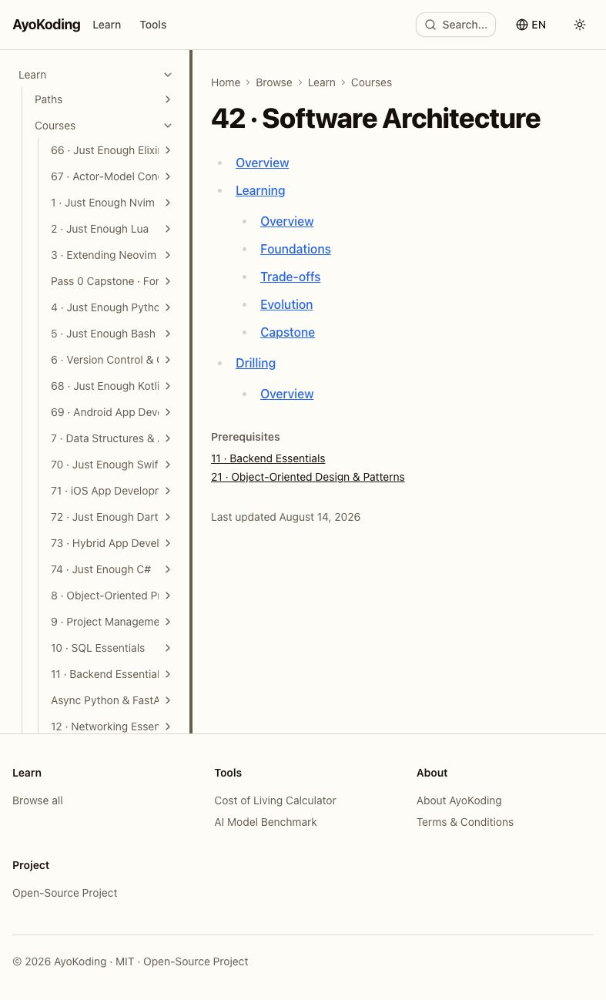
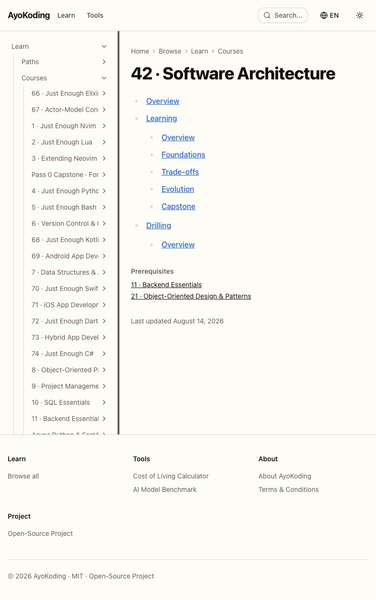
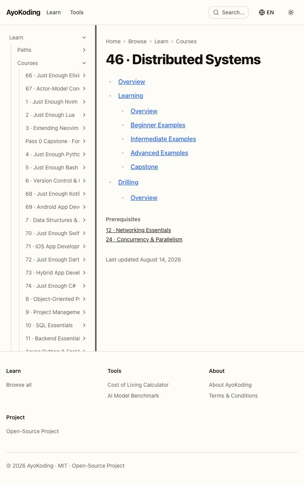
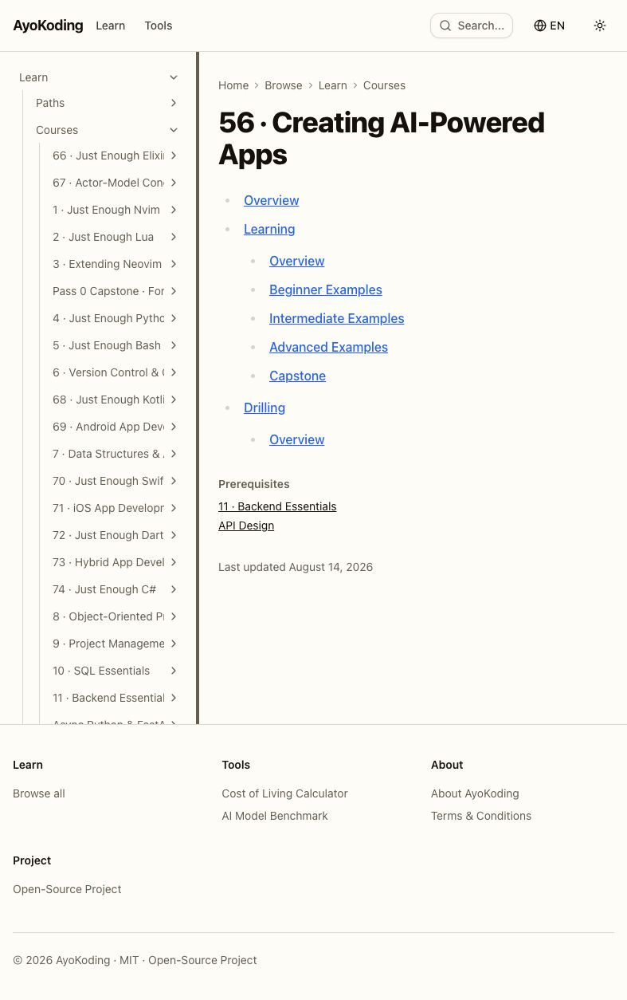
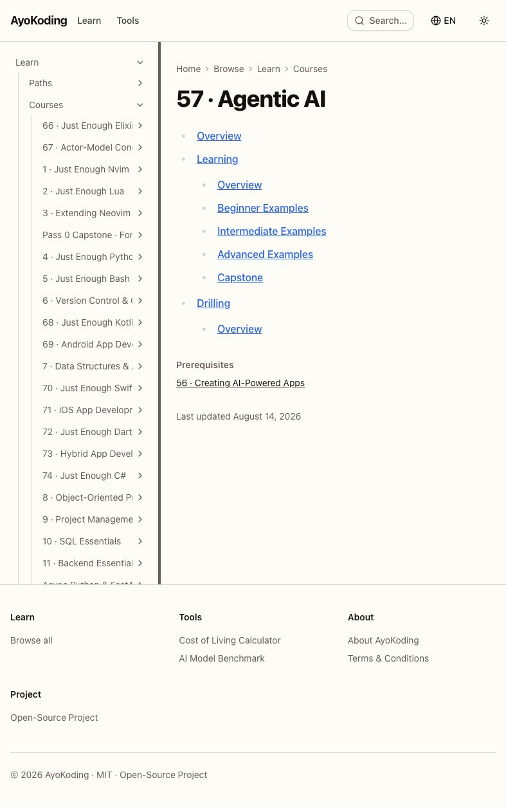
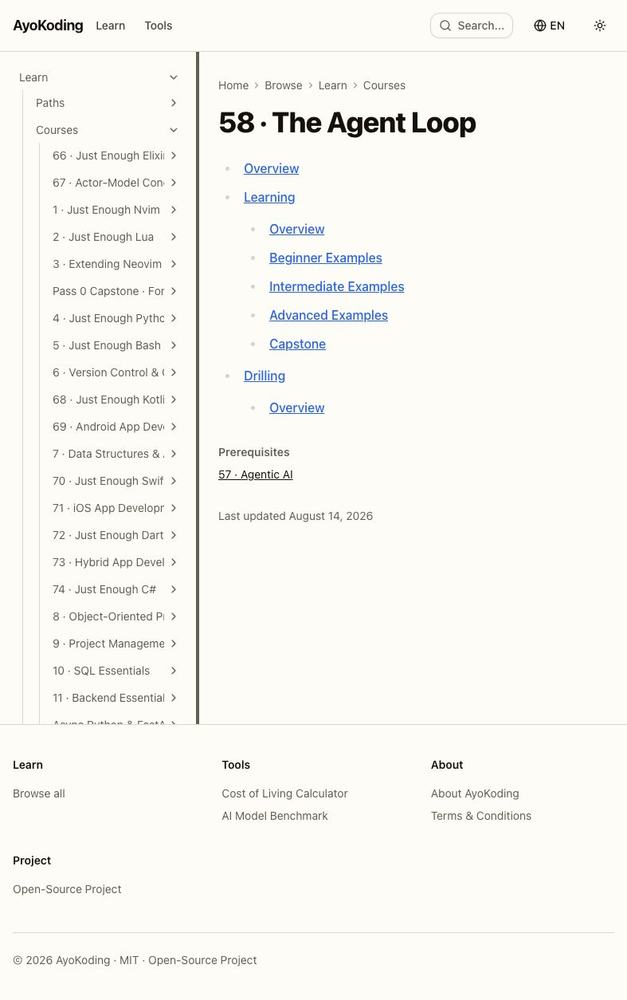
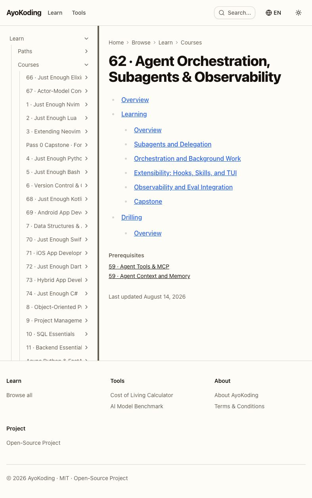

# Delivery Checklist — Course Authoring: Architecture, Distributed & AI/Harness (Band 5)

This checklist authors **15 course bodies** into
`apps/ayokoding-www/content/en/learn/courses/<course-id>/` — the 5 architecture-fundamentals courses,
the 2 build-your-own framework courses, the 2 AI on-ramp courses, the CDP automation course, and the
5-course harness cluster (see [README §Exact scope](./README.md#exact-scope-15-courses-in-order)). It
also locks the three **course-surgery contracts** (evals forward-link, D9 naming/citation, D11
concept additions) as its own Phase 1, so the courses that target them apply the contracts by
construction rather than as a retrofit.

> **This plan never edits a manifest file.** Every file under `<MANIFESTS>` belongs to
> [`ayokoding-learning-path-12-careers-se-manifests`](../../backlog/ayokoding-learning-path-12-careers-se-manifests/README.md)
> and [`ayokoding-learning-path-13-careers-ai-manifest`](../../backlog/ayokoding-learning-path-13-careers-ai-manifest/README.md),
> the successor manifest-growth plans. This plan's only outbound artefact is the **Band-5 completion
> signal** prepared during authoring and delivered with the terminal archival PR. See
> [README §The manifest ownership invariant](./README.md#the-manifest-ownership-invariant-binding--read-before-anything-else)
> and
> [tech-docs §The manifest ownership invariant](./tech-docs.md#the-manifest-ownership-invariant-binding).
>
> **Cross-plan source of truth** — the `syllabus/` detail layer lives in
> [`../../done/2026-07-24__ayokoding-learning-path-02-schema-and-prerequisite-dag/syllabus/`](../../done/2026-07-24__ayokoding-learning-path-02-schema-and-prerequisite-dag/syllabus/README.md).
> Every course body is authored **from** its `syllabus/courses/<course-id>.md` spec. **Never copy
> those files into this plan.**
>
> **Legend** — `[AI]`: an agent performs the step (the default; unmarked steps are `[AI]`).
> `[HUMAN]`: only a human can do it (physical action, out-of-band approval, real-secret or
> privileged-credential handling). `[AI+HUMAN]`: agent prepares, human approves or finishes.
> Git-mechanical steps (worktree create/remove, branch, push, merge) are `[AI]`. **This plan contains
> no `[HUMAN]` step.**
>
> **Phase Gate** — every phase ends with a `### Phase N Gate` (must-pass verification) plus a
> `> **Pause Safety**:` note. A gate in a phase named as a delivery boundary in the
> [`### Delivery Boundaries`](#delivery-boundaries) table additionally covers **integration** (draft
> PR opened, secret scan, local quality checks, and PR quality-gate verification, CI green, `[AI]` merge, `ayokoding-www` deployed); a gate in an
> **intermediate** phase instead confirms the work is committed to its delivery unit's branch with
> nothing pushed for review yet.
>
> **Executor environment note — RTK-wrapped commands.** This repo routes `git` through RTK via a
> Claude Code hook. For a zero-count assertion over `git diff --name-only`, use
> **`| grep -c .`**, never `| wc -l`: in the clean state `grep -c .` prints `0` while `wc -l` prints
> `1` (RTK's empty-output marker is a lone newline, not true zero-byte emptiness). Every
> `git diff --name-only …` clause in this plan asserts `0` via `| grep -c .` for exactly this reason.
> `grep` here routes to **UGREP**: use `--exclude-dir`, never `--glob`, and never `-L` (which means
> files-without-match and exits 0 — never use it in an acceptance clause).

## One-PR delivery contract (binding, 2026-08-01)

This 15-course plan is one inseparable delivery unit: every Phase 1–9 change lands in **one
worktree, one branch, and exactly one draft PR**. Courses may still be authored, checked, and
committed in their dependency order, but no intermediate phase may push, open a PR, run the PR
merge, deploy, or record a merge SHA. Only Phase 9 opens the draft PR, after all
course work, verification, and Knowledge Capture are green; it includes the archival move to
`plans/done/`, then runs the secret scan, local quality checks, and PR quality-gate verification, CI verification, ready-for-review
transition, and the normal `[AI]` merge/deploy protocol. This contract supersedes every older
cohort or delivery-boundary PR reference below.

The `worktrees/ayokoding-learning-path-06-course-authoring-architecture-and-ai-harness/` path
below is this plan's only worktree; no per-course, cohort, phase, or closeout worktree is created.

## Worktree

Worktree path: `worktrees/ayokoding-learning-path-06-course-authoring-architecture-and-ai-harness/`

Provision this path exactly once with `claude --worktree ayokoding-learning-path-06-course-authoring-architecture-and-ai-harness` (or `git worktree add -b worktree/ayokoding-learning-path-06-course-authoring-architecture-and-ai-harness worktrees/ayokoding-learning-path-06-course-authoring-architecture-and-ai-harness origin/main` when provisioning manually). Both forms designate the same one worktree; never create a second path for a phase, course, or closeout.

This path is the one and only worktree for the entire plan. Provision it once from current
`origin/main`, create the persistent `final-delivery` branch after Phase 0, and use neither
per-course/cohort/stage worktrees nor per-phase branches. Remove it only after the final PR merges.

> **Worktree Cap conformance note (added when the rule landed):** this plan already declared a
> single, plan-wide worktree before the
> [Worktree Cap](../../../repo-governance/conventions/structure/plans/worktree-cap.md#worktree-cap--one-worktree-per-repository-per-plan-hard-rule)
> and
> [Per-Repository Delivery Mode Restrictions](../../../repo-governance/conventions/structure/plans/per-repository-delivery-mode-restrictions.md#per-repository-delivery-mode-restrictions-hard-rule)
> rules landed. Reviewed against both — already compliant, no change required.

## Delivery Mode: worktree-to-pr

**CI scope note**: "CI green"/"CI gates" below mean the PR's own check run
(`pr-quality-gate.yml`) — never `.github/workflows/main-ci.yml`, which is deprecated,
schedule-only, and must not be monitored or gated on.

This plan has one delivery unit: all change-producing work is committed on the persistent
`final-delivery` branch in the declared worktree. Phases before 9 must not push, open
a PR, start an external merge, deploy, or record an in-repository merge SHA. Phase 9 first
commits the archival move and index updates, then opens the sole draft PR, runs the secret scan, local quality checks, and PR quality-gate verification plus local and CI gates, marks it ready, merges under the hardened
preconditions, and deploys once.

## Content-only delivery safeguards

This plan produces content only and has exactly one final PR. It has no review-cycle requirement. Before pushing that PR:

- [x] [AI] Inspect the staged diff and confirm it contains no machine-secret value.
- [x] [AI] Use a scoped Conventional Commit (for example, `docs(plans): refresh course-preparation backlog`).
- [x] [AI] Run `apps/rhino-cli/scripts/rhino-bin.sh gate run --surface=pre-push`; acceptance: exits 0 for the affected scope.
- [x] [AI] Push the single branch, then wait for `.github/workflows/pr-quality-gate.yml`; acceptance: the PR quality gate is green before merge.

## Depends-on

| Relation      | Plan (full folder name)                                                | Nature                                                                                                                                                                                                                         |
| ------------- | ---------------------------------------------------------------------- | ------------------------------------------------------------------------------------------------------------------------------------------------------------------------------------------------------------------------------ |
| **blockedBy** | `ayokoding-learning-path-05-course-authoring-platform-and-concurrency` | **Hard; sole direct execution prerequisite.** It must be fully merged and archived on `origin/main` before Phase 0. All earlier completion and repository-baseline facts are transitive context, not extra plan prerequisites. |

**Phase 0 start check:** `git ls-tree -r --name-only origin/main plans/done | rg -q "__ayokoding-learning-path-05-course-authoring-platform-and-concurrency/README\.md$"` exits 0. This is this plan's only plan-level start gate.

## Parallelization Model

- **Phase 0** is a single serial baseline.
- **Phase 1** (the three course-surgery contracts) is a serial sync point — documentation-only, but
  every Phase 3/4 acceptance criterion for the evals-donor and harness-cluster courses derives from
  it.
- **Phase 2 (Cohort 1)** — author and commit the five architecture-fundamentals bodies serially on
  the persistent final-delivery branch.
- **Phase 3 (Cohort 2)** — author and commit on the same branch, with
  `creating-ai-powered-apps` before `agentic-ai`.
- **Phase 4 (Cohort 3)** — author and commit on the same branch, with `the-agent-loop` before the
  remaining four courses.
- **Phases 5–9 (finalization)** are serial.

**Path constants** (referenced throughout, identical to the parent plan's):

- `<COURSES>` = `apps/ayokoding-www/content/en/learn/courses/` (course bundles; served at `/en/learn/courses/<course-id>`)
- `<FEAT>` = `apps/ayokoding-www/src/features/course-paths/` (**never written here**)
- `<MANIFESTS>` = `<FEAT>manifests/` (**never written here** — manifest-growth-plan property)
- `<SYLLABUS>` = `../../done/2026-07-24__ayokoding-learning-path-02-schema-and-prerequisite-dag/syllabus/` (cross-plan authoring source of truth — **never copied**)
- `<EVIDENCE>` = `plans/in-progress/ayokoding-learning-path-06-course-authoring-architecture-and-ai-harness/evidence/` (plan-local evidence paths in commands run from the worktree root)

### Delivery Boundaries

| Phase(s) | Delivery unit                                               | Worktree / branch                                                         | PR opens                           |
| -------- | ----------------------------------------------------------- | ------------------------------------------------------------------------- | ---------------------------------- |
| 0        | Setup and baseline                                          | No delivery worktree or PR                                                | no                                 |
| 1–8      | Intermediate authoring, verification, and Knowledge Capture | This plan's single declared worktree and persistent final-delivery branch | no — commit only                   |
| 9        | Final archival and integration                              | The same worktree and branch; archive before opening the PR               | yes — exactly once, after archival |

No phase may create an additional worktree or branch. The final phase is the only delivery boundary.

## Phase 0: Environment Setup & Baseline

> _Executor: repo-setup-manager_
>
> **Cross-plan precondition (hard).** The sole direct predecessor, Plan 05, must be merged to
> `origin/main` before any authoring begins. Earlier plans are repository context, not extra
> execution prerequisites.

- [x] [AI] **Promote out of `plans/backlog/` first — on the local `main` checkout, before any
      worktree exists.** Run
      `git mv plans/backlog/ayokoding-learning-path-06-course-authoring-architecture-and-ai-harness/ plans/in-progress/ayokoding-learning-path-06-course-authoring-architecture-and-ai-harness/`
      (a pure move — neither stage carries a date prefix), update `plans/backlog/README.md` and
      `plans/in-progress/README.md`, commit on the plan branch and include the move in the one final PR — acceptance:
      `git ls-tree -r --name-only origin/main -- plans/in-progress/ayokoding-learning-path-06-course-authoring-architecture-and-ai-harness/README.md | grep -c .`
      returns **1** and the same query against
      `plans/backlog/ayokoding-learning-path-06-course-authoring-architecture-and-ai-harness/README.md`
      returns **0**. Falsifiable both ways: before the push lands, the first query returns 0 and the
      second returns 1. Execution never runs out of `plans/backlog/` — this push is a mandatory
      precondition, not a courtesy. See
      [plan-execution → Execute Plan from Backlog](../../../repo-governance/workflows/plan/plan-execution/example-usage-and-iteration-example.md#execute-plan-from-backlog).

  _Implementation notes (2026-08-14): Promotion landed through protected-main PR #194 (merge
  `64a89e65862b5a03e8d5c9b56f1e4845729aa156`) after its 14 required checks passed. `origin/main`
  contains the in-progress README exactly once and the backlog README zero times._

- [x] [AI] Enter/provision the worktree and install dependencies: `npm install` — acceptance: exits
      0, `node_modules/` synchronized.

  _Implementation notes (2026-08-14): Ran `npm install` in the declared worktree. Repaired the
  initially invalid `@bazel/buildifier` install with `npm install --include=dev`; `npm ls
@bazel/buildifier --depth=0` now resolves `@bazel/buildifier@8.2.1` and its executable is present._

- [x] [AI] Converge the toolchain: `npm run doctor -- --fix` — acceptance: exits 0 with no unresolved
      drift.

  _Implementation notes (2026-08-14): `npm run doctor -- --fix` completed with 16/16 tools OK,
  zero warnings, and zero missing tools; shared Rust targets were reconciled._

- [x] [AI] **Verify `ayokoding-learning-path-01-url-restructure` merged** — the `<COURSES>` bucket
      exists — command: `test -d apps/ayokoding-www/content/en/learn/courses && test -f apps/ayokoding-www/content/en/learn/courses/_index.md`
      — acceptance: both exit 0.

  _Implementation notes (2026-08-14): Both the courses directory and its generated `_index.md`
  exist in the synchronized worktree._

- [x] [AI] **Verify `ayokoding-learning-path-02-schema-and-prerequisite-dag` merged** — the
      cross-plan syllabus layer is on `origin/main` — command:
      `git ls-files -- 'plans/done/*ayokoding-learning-path-02-schema-and-prerequisite-dag/syllabus/courses/README.md' | grep -c .`
      — acceptance: returns **1**. Record the resolved directory to
      `<EVIDENCE>phase-0-snapshot.txt` as `SYLLABUS_ROOT=<path>`.

  _Implementation notes (2026-08-14): The syllabus catalog check returned 1. Recorded
  `SYLLABUS_ROOT=plans/done/2026-07-24__ayokoding-learning-path-02-schema-and-prerequisite-dag/syllabus`
  in `<EVIDENCE>phase-0-snapshot.txt`._

- [x] [AI] **Verify `ayokoding-learning-path-04-course-authoring` Phase 0 + Phase 1 merged** — the
      six net-new AI courses (including this plan's own historical reference,
      `evaluating-ai-systems-in-depth`) exist — command:
      `for s in evaluating-ai-output-essentials statistics-for-evaluation evaluating-ai-systems-in-depth product-patterns-for-probabilistic-systems inference-serving-and-model-deployment fine-tuning-and-adaptation; do test -d "apps/ayokoding-www/content/en/learn/courses/$s" || echo "ABSENT $s"; done | grep -c .`
      — acceptance: returns **0**. Falsifiable both ways: before that plan's Phase 1 merges, this
      returns 6.

  _Implementation notes (2026-08-14): The six-course presence loop returned 0; all historical
  AI-course bodies used as authoring context are present._

- [x] [AI] **Verify the rendering repository baseline** — command (single line):
      `test ! -f apps/ayokoding-www/src/app/layout.tsx && (rg -n "await searchParams" apps/ayokoding-www/src/app --glob '!*.test.*' --glob '!*.spec.*' || true) | grep -c .`
      — acceptance: the `test` exits 0 (root layout deleted) and the `grep -c .` returns **0** (no
      remaining production server-side `searchParams` read). Falsifiable both ways: before that plan's Phase 1
      merges, `test ! -f` fails (exits 1); before its Phase 2 merges, the `grep -c .` returns ≥ 1.

  _Implementation notes (2026-08-14): The root layout is absent and the production-source scan returns 0. The original broad grep matched only the assertion text in
  `content-route-static.unit.test.ts`; test/spec files are now excluded so the baseline measures the
  stated rendering behavior rather than its regression test._

- [x] [AI] Establish content baselines: `npm exec nx run ayokoding-www:build` and
      `npm exec nx run ayokoding-www:test:unit` — acceptance: both exit 0; record pass state in
      `<EVIDENCE>phase-0-snapshot.txt`.

  _Implementation notes (2026-08-14): Both targets passed. The build produced all 2,267 static pages;
  unit tests passed (159 files, 3,482 passed, 6 skipped). Recorded both pass states in the Phase 0
  snapshot._

- [x] [AI] **Confirm all 15 course slugs are absent (no collision)** under `<COURSES>`:

  ```bash
  for s in software-architecture domain-driven-design system-design event-driven-architecture \
    distributed-systems build-your-own-web-framework build-your-own-reactive-ui \
    creating-ai-powered-apps agentic-ai browser-automation-with-cdp the-agent-loop \
    agent-tools-and-mcp agent-context-and-memory agent-permissions-and-sandboxing \
    agent-orchestration-subagents-and-observability; do
    test -e "apps/ayokoding-www/content/en/learn/courses/$s" && echo "EXISTS COURSES $s"
  done
  ```

  — acceptance: **zero** output lines. Falsifiable both ways:
  `mkdir -p apps/ayokoding-www/content/en/learn/courses/the-agent-loop` makes the loop print
  `EXISTS COURSES the-agent-loop`, proving the check fires.

  _Implementation notes (2026-08-14): The 15-slug collision loop returned 0; each planned course
  bundle is new work for this plan._

- [x] [AI] **Create the authored-body slug register** — write the 15 slugs, one per line, to
      `<EVIDENCE>authored-body-slugs.txt`:

  ```bash
  cat > plans/in-progress/ayokoding-learning-path-06-course-authoring-architecture-and-ai-harness/evidence/authored-body-slugs.txt <<'EOF'
  software-architecture
  domain-driven-design
  system-design
  event-driven-architecture
  distributed-systems
  build-your-own-web-framework
  build-your-own-reactive-ui
  creating-ai-powered-apps
  agentic-ai
  browser-automation-with-cdp
  the-agent-loop
  agent-tools-and-mcp
  agent-context-and-memory
  agent-permissions-and-sandboxing
  agent-orchestration-subagents-and-observability
  EOF
  ```

  — acceptance: `wc -l < plans/in-progress/ayokoding-learning-path-06-course-authoring-architecture-and-ai-harness/evidence/authored-body-slugs.txt` returns **15**, and
  `sort plans/in-progress/ayokoding-learning-path-06-course-authoring-architecture-and-ai-harness/evidence/authored-body-slugs.txt | uniq -d | wc -l` returns **0**.

  _Implementation notes (2026-08-14): Created the plan-local slug register; it has 15 lines and zero
  duplicate slugs._

- [x] [AI] **Record the authored-body baseline** —
      `while read -r s; do test -d "apps/ayokoding-www/content/en/learn/courses/$s" || echo "ABSENT $s"; done < plans/in-progress/ayokoding-learning-path-06-course-authoring-architecture-and-ai-harness/evidence/authored-body-slugs.txt | grep -c .`
      — acceptance: returns **15** today (none authored yet); must return **0** at archival (Phase
      9). Record in `<EVIDENCE>phase-0-snapshot.txt`.

  _Implementation notes (2026-08-14): The authoring-presence loop returned 15 absent bundles and the
  snapshot records `AUTHORED_BODY_ABSENT_COUNT=15`._

- [x] [AI] Create `learnings.md` in the plan folder with its H1 — acceptance:
      `test -f plans/in-progress/ayokoding-learning-path-06-course-authoring-architecture-and-ai-harness/learnings.md && rg -q '^# Learnings: ayokoding-learning-path-06-course-authoring-architecture-and-ai-harness$' plans/in-progress/ayokoding-learning-path-06-course-authoring-architecture-and-ai-harness/learnings.md` confirms
      `# Learnings: ayokoding-learning-path-06-course-authoring-architecture-and-ai-harness`.

  _Implementation notes (2026-08-14): The promoted plan already carried the required H1 after its
  explanatory comments. The assertion now verifies the H1 directly instead of assuming it is line 1._

- [x] [AI] **Cross-plan link gate** — confirm every reference in this plan's own files resolves:

  ```bash
  apps/rhino-cli/scripts/rhino-bin.sh md links validate \
    --quiet \
    --exclude plans/done \
    --exclude apps/ayokoding-www/content \
    --exclude apps/ose-www/content 2>&1 | grep -F "ayokoding-learning-path-06-course-authoring-architecture-and-ai-harness"
  ```

  — acceptance: the `grep` finds **no** matching line (exits 1).

  _Implementation notes (2026-08-14): The scoped link validation's Plan 06 filter exited 1, confirming
  no broken reference names this plan._

- [x] [AI] **Confirm no manifest file changed in this phase** —
      `git diff --name-only origin/main...HEAD -- 'apps/ayokoding-www/src/features/course-paths/manifests/' | grep -c .`
      — acceptance: returns **0**.

  _Implementation notes (2026-08-14): The manifest-path diff count against `origin/main` is 0._

### Phase 0 Gate

> All checks below must pass before starting Phase 1.

- [x] [AI] `npm install` exited 0 and `npm run doctor -- --fix` reports no unresolved drift.

  _Implementation notes (2026-08-14): Dependencies were repaired and synchronized; doctor reported
  16/16 tools OK with no warnings or missing tools._

- [x] [AI] Direct predecessor and repository baseline verified (URL-restructure bucket present; syllabus root
      resolved; parent plan's 6 AI courses present; `vercel-function-cost-reduction`'s root-layout
      deletion and `searchParams` removal both confirmed).

  _Implementation notes (2026-08-14): Plan 05's archived README is present on `origin/main`; the
  courses bucket, syllabus root, six historical AI courses, absent root layout, and zero production
  `await searchParams` reads all passed their assertions._

- [x] [AI] `ayokoding-www:build` + `test:unit` baselines recorded green.

  _Implementation notes (2026-08-14): Build and unit pass states are recorded in the Phase 0 snapshot._

- [x] [AI] All 15 course slugs confirmed absent (zero `EXISTS` lines).

  _Implementation notes (2026-08-14): The collision loop returned 0._

- [x] [AI] `<EVIDENCE>authored-body-slugs.txt` holds 15 unique slugs; the ABSENT-count baseline of 15
      is recorded.

  _Implementation notes (2026-08-14): The plan-local register has 15 unique entries and the snapshot
  records an absent-count baseline of 15._

- [x] [AI] Cross-plan link gate green.

  _Implementation notes (2026-08-14): The Plan 06-filtered link-gate output was empty (grep exit 1 as
  specified), so no broken cross-plan reference names this plan._

- [x] [AI] Zero manifest files touched.

  _Implementation notes (2026-08-14): The manifest subtree diff count is 0._

- [x] [AI] **No Plan 06 delivery PR was opened for this phase and no Phase-0 work was pushed** — the
      required promotion was completed before worktree entry through protected-main PR #194; it is not
      a Plan 06 delivery boundary. Read the printed number from each (never `&&`-chained):
      `git ls-remote --heads origin "$(git branch --show-current)" | grep -c .` returns **0**, and
      `gh pr list --head "$(git branch --show-current)" --state open --json number --jq 'length'`
      returns **0**.

  _Implementation notes (2026-08-14): The worktree branch has no remote head and no open PR. Promotion
  PR #194 was merged before worktree entry and is not a delivery PR._

> **Pause Safety**: only the toolchain, the four upstream preconditions, and the slug register were
> established — no course body exists yet, nothing is pushed, and no PR exists. Safe to stop
> indefinitely. To resume: re-run the four blocking-plan verification commands and the baseline build.

---

## Phase 1: Course-surgery contracts — evals scope, D9 naming/citation, D11 concept additions

> **Sequencing note.** The evals donor courses (`creating-ai-powered-apps`, `agentic-ai`,
> `agent-orchestration-subagents-and-observability`) and the D9/D11 target courses (the harness
> cluster) are **not yet authored** at this point — they are native-authored in Phase 3 (Cohort 2)
> and Phase 4 (Cohort 3). This phase **locks the contract** those future authoring steps must honor
> and **bakes its acceptance criteria into Phases 3 and 4**, so the surgery is applied **by
> construction** rather than retrofitted afterwards.
>
> **Manifest boundary.** No manifest re-verification happens here — that is manifest-growth-plan
> property. See
> [README §The manifest ownership invariant](./README.md#the-manifest-ownership-invariant-binding--read-before-anything-else).

- [x] [AI] **State the four-path blast radius (DD-28 binding rule)** — reproduce verbatim from
      [tech-docs.md §The four-path blast radius](./tech-docs.md#the-four-path-blast-radius-dd-28s-binding-rule-stated-for-this-plans-own-three-surgeries):
      the evals extraction touches `evaluating-ai-systems-in-depth` (already authored) plus the three
      donor courses (Phases 3–4) and the `fundamentally-strong`/`immediately-effective` SE manifests
      plus the AI-path manifest once grown; the D9/D11 additions touch only the harness cluster
      (Phase 4) plus `capstone-build-your-own-coding-agent` (sibling capstones plan) and every
      manifest carrying those IDs — acceptance: the blast radius is written into this checklist
      before any of the three surgeries is considered "applied". **Naming a manifest is not editing
      one.**

  _Implementation notes (2026-08-14): Confirmed the checklist and `tech-docs.md` state the evals,
  D9, and D11 blast radii, including their downstream manifest consumers, without editing a manifest._

- [x] [AI] **Lock the evals forward-link contract** — record, for Phase 3's authoring of
      `creating-ai-powered-apps` and `agentic-ai`, and Phase 4's authoring of
      `agent-orchestration-subagents-and-observability`, that each course's evals-adjacent material
      MUST forward-link to `evaluating-ai-systems-in-depth` rather than re-teaching it (DD-11
      scope-guard style) — acceptance: this requirement appears verbatim as an acceptance criterion
      on each of the three courses' own checklist items (verify by reading Phases 3–4 below), and
      `grep -F -q 'evaluating-ai-systems-in-depth' "apps/ayokoding-www/content/en/learn/courses/creating-ai-powered-apps/overview.md"`
      exits **2** today (the course does not exist yet — `grep` exits 2 on a missing path) and must
      exit **0** once Phase 3 lands it.

  _Implementation notes (2026-08-14): Verified explicit forward-link acceptance criteria for all
  three donor courses in Phases 3–4; the missing-course baseline correctly exits 2 until authoring._

- [x] [AI] **Lock the D9 naming/citation contract** — record, for Phase 4's authoring of
      `agent-context-and-memory`, that it MUST include a context-engineering naming/lineage line
      citing Lütke (2025-06-19), Karpathy (2025-06-25), Willison (2025-06-27), and Anthropic's
      Effective Context Engineering methodology; and for the harness cluster (Phase 4), that it MUST
      include the harness-engineering equivalent citing Anthropic (2025-11-26) and
      Böckeler/Thoughtworks (2026-02-17) — **no course is renamed** — acceptance: these citation
      requirements appear as explicit acceptance criteria on the relevant Phase 4 items below. The
      "OpenAI" attribution stays `[Unverified]` (see
      [tech-docs.md](./tech-docs.md#dd-29--context-and-harness-engineering-name-and-cite-in-existing-courses-do-not-add-or-rename-any-course-d9))
      and is omitted from authoring.

  _Implementation notes (2026-08-14): Confirmed the Phase 4 criteria require the named verified
  lineage sources and explicitly exclude the still-unverified OpenAI attribution; no course rename is
  authorized._

- [x] [AI] **Lock the D11 concept-addition contract** — record, for Phase 4's authoring, the four
      concept-level additions: cache-aware prefix ordering → `agent-context-and-memory`;
      tool-count degradation **and** tool-result token efficiency → `agent-tools-and-mcp`;
      train-vs-production permission asymmetry → `agent-permissions-and-sandboxing` — acceptance:
      each concept appears as an explicit acceptance criterion on the relevant Phase 4 item below.

  _Implementation notes (2026-08-14): Confirmed each D11 concept maps to one named Phase 4 course and
  has an explicit authoring acceptance criterion._

- [x] [AI] **Confirm no manifest file changed in this phase** —
      `git diff --name-only origin/main...HEAD -- 'apps/ayokoding-www/src/features/course-paths/manifests/' | grep -c .`
      — acceptance: returns **0**.

  _Implementation notes (2026-08-14): The manifest subtree diff count remains 0._

### Phase 1 Gate

- [x] [AI] Four-path blast radius stated for all three surgeries; forward-link, citation, and
      concept-addition contracts locked as explicit Phase 3 / Phase 4 acceptance criteria.

  _Implementation notes (2026-08-14): Contract text is present in both the Phase 1 lock and the
  relevant Phase 3/4 authoring items._

- [x] [AI] "Harness engineering" is cited, not adopted as structure — no course renamed; the
      unverified OpenAI attribution is excluded.

  _Implementation notes (2026-08-14): The contract preserves the contested-term posture and excludes
  the unverified attribution._

- [x] [AI] Zero manifest files touched.

  _Implementation notes (2026-08-14): The manifest-subtree diff count against `origin/main` is 0._

- [x] [AI] **No PR opens for this phase** — the contract-lock edits are committed on the persistent
      final-delivery branch and ride only the terminal Phase 9 archival PR.

  _Implementation notes (2026-08-14): The final-delivery branch has no remote head and no Plan 06
  delivery PR; the Phase 1 contract lock remains local and committed only on that branch._

> **Pause Safety**: the evals/D9/D11 contracts are locked and will be enforced when Phases 3 and 4
> author their target courses; no app content changed. Safe to stop. To resume: re-read this phase's
> four bullets and confirm Phases 3 and 4 still carry the matching acceptance criteria.

---

## NEW-course authoring convention (applies to every authoring step in Phases 2–4)

1. [AI] **V (accuracy pre-verify)** — spot-check version-pinned / market / pre-1.0-stack facts via
   `web-researcher` — acceptance: no version-pinned claim written `[Unverified]`; every volatile fact
   sits in a dated accuracy-note sidebar, not the stable spine.
2. [AI] **Skeleton** — create `<COURSES><course-id>/` (`_index.md` with `prerequisites: [...]` +
   `overview.md` + `learning/_index.md` + `drilling/_index.md`); the `course-id` slug and the
   prerequisite chain are **settled** — use the exact values declared in
   `<SYLLABUS_ROOT>/<course-id>.md` — acceptance: `test -d "<COURSES><course-id>"`,
   `test -d "<COURSES><course-id>/learning"`, and `test -d "<COURSES><course-id>/drilling"` all exit
   0, and `grep -F -q 'prerequisites:' "<COURSES><course-id>/_index.md"` exits 0.
3. [AI] **Author learning track** — `overview.md` (purpose + `## Prerequisites` naming only earlier
   library courses + the course's scope boundary), concept coverage, example/scenario pages +
   colocated `code/` where code-bearing, and `learning/capstone/` — acceptance: the course's own
   `overview.md` states its scope boundary against any sibling course it could be confused with.
4. [AI] **Author drilling track** — `drilling/overview.md` in the fixed five-section order —
   acceptance: all five sections present.
5. [AI] **Run content checkers** — the matching learning checker, `apps-ayokoding-www-facts-checker`,
   and `apps-ayokoding-www-link-checker` — acceptance: findings recorded. _(Content authoring is a
   maker-checker-fixer cycle, not code TDD; see
   [tech-docs §TDD exemption](./tech-docs.md#tdd-exemption-this-plan-ships-no-application-code).)_
6. [AI] **Apply content fixers** — resolve every CRITICAL/HIGH/MEDIUM finding via the matching fixer.
7. [AI] **Re-verify** — re-run checkers + `npm exec nx run ayokoding-www:build` + `npm run lint:md` —
   acceptance: zero CRITICAL/HIGH/MEDIUM remain; build + lint exit 0.
8. [AI] **Confirm no manifest file changed in this course's own diff** —
   `git diff --name-only origin/main...HEAD -- 'apps/ayokoding-www/src/features/course-paths/manifests/' | grep -c .`
9. [AI] **Licensing self-check (programme A8)** — grep this course's own worked-example code for the
   CC-BY-SA hazard:
   `grep -rn 'stackoverflow\.com\|reddit\.com' "<COURSES><course-id>/learning/code/" 2>/dev/null | grep -c .`
   — acceptance: prints `0`.

---

## Phase 2: Cohort 1 — Architecture fundamentals (courses 1–5)

Each course below applies the NEW-course authoring convention. Bodies are content-independent and
pipeline concurrently through review, bounded by the cap.

- [x] [AI] `software-architecture` (Annotated-concept · Python; prereq `backend-essentials`,
      `object-oriented-design-and-patterns`) — convention complete; checkers clean.

  _Implementation notes (2026-08-14): 52 syllabus-aligned worked examples, 20 runnable artifacts,
  capstone, drilling, scoped links, and per-artifact annotation density (1.00) are verified._
  - _Suggested executor: `apps-ayokoding-www-annotated-concept-maker`_

- [x] [AI] `domain-driven-design` (By Example · Python; prereq `object-oriented-design-and-patterns`,
      `software-architecture`) — convention complete; checkers clean.

  _Implementation notes (2026-08-14): 80 runnable examples, capstone assertions, scoped links, and
  80/80 per-artifact annotation density (1.00) are verified._
  - _Suggested executor: `apps-ayokoding-www-by-example-maker`_

- [x] [AI] `system-design` (Annotated-concept · Python; prereq `backend-at-scale`,
      `networking-essentials`) — convention complete; checkers clean; overview states its scope
      boundary against `system-design-interview` (depth vs. interview-rubric split, per the parent
      plan's own catalog note).

  _Implementation notes (2026-08-14): 53 syllabus-aligned worked examples, 27 runnable artifacts,
  scope boundary, drilling, and 25/25 per-artifact annotation density (1.00) are verified._
  - _Suggested executor: `apps-ayokoding-www-annotated-concept-maker`_

- [x] [AI] `event-driven-architecture` (By Example · Python; prereq `software-architecture`,
      `backend-essentials`) — convention complete; checkers clean.

  _Implementation notes (2026-08-14): 80 examples, runnable broker and capstone tests, scoped links,
  and the factual-delta corrections are verified._
  - _Suggested executor: `apps-ayokoding-www-by-example-maker`_

- [x] [AI] `distributed-systems` (By Example · Python; prereq `networking-essentials`,
      `concurrency-and-parallelism`) — convention complete; checkers clean. **Downstream note**: this
      course is a hard prerequisite of `build-your-own-raft` in
      `ayokoding-learning-path-10-course-authoring-jvm-and-build-your-own` — no additional acceptance
      clause here beyond the standard convention, but its landing unblocks that plan.

  _Implementation notes (2026-08-14): 85 examples and 85 independent standard-library artifacts,
  capstone, scoped links, 85-entry example index, per-artifact density (1.07–1.20), and the corrected
  TrueTime model are verified._
  - _Suggested executor: `apps-ayokoding-www-by-example-maker`_

### Phase 2 Gate

- [x] [AI] All 5 Cohort-1 bodies exist:
      `for s in software-architecture domain-driven-design system-design event-driven-architecture distributed-systems; do test -d "apps/ayokoding-www/content/en/learn/courses/$s" || echo "ABSENT $s"; done | grep -c .`
      returns **0** (returns 5 before this phase).

  _Implementation notes (2026-08-14): The structural loop returned 0._

- [x] [AI] Checkers clean across all 5; build + `lint:md` exit 0.

  _Implementation notes (2026-08-14): Scoped content, runnable-artifact, density, Markdown, and link
  checks are clean; the factual-delta audit corrected four findings. `npm exec nx run ayokoding-www:build`
  and `npm run lint:md` exit 0._

- [x] [AI] Catalog rows added to `tech-docs.md`; generated `<COURSES>_index.md` is verified by `npm exec nx run ayokoding-www:validate-indexes`.

  _Implementation notes (2026-08-14): Existing catalog rows match the settled T42–T46 scope; the
  generator added the five public collection cards and `validate-indexes` exits 0._

- [x] [AI] Zero manifest files touched.

  _Implementation notes (2026-08-14): Manifest-subtree diff count against `origin/main` remains 0._

- [x] [AI] Commit this phase's checked artifacts on the persistent final-delivery branch — acceptance: no PR, merge, deployment, or `FINAL_PR` occurs before Phase 9.

  _Implementation notes (2026-08-14): Phase artifacts are committed locally on the persistent
  final-delivery branch; no Plan 06 delivery PR, merge, deployment, or `FINAL_PR` exists._

> **Pause Safety**: architecture fundamentals are authored and committed on the persistent
> final-delivery branch; the three course-surgery contracts remain locked in this plan. Safe to stop.
> To resume: re-run the 5-course structural loop and re-verify the contract text in `delivery.md`.

---

## Phase 3: Cohort 2 — Frameworks + AI on-ramp (courses 6–10)

> **Ordering constraint**: `agentic-ai` declares `creating-ai-powered-apps` a prerequisite, so
> `creating-ai-powered-apps` is authored before (or in the same delivery sequence as) `agentic-ai`.

- [x] [AI] `build-your-own-web-framework` (By Example · Python; prereq `backend-essentials`,
      `networking-essentials`) — convention complete; checkers clean.
  - _Suggested executor: `apps-ayokoding-www-by-example-maker`_
- [x] [AI] `build-your-own-reactive-ui` (By Example · TypeScript; prereq `advanced-frontend`) —
      convention complete; checkers clean.
  - _Suggested executor: `apps-ayokoding-www-by-example-maker`_
- [x] [AI] `creating-ai-powered-apps` (By Example · Python; use-an-LLM scope; prereq
      `backend-essentials`, `api-design`) — convention complete; checkers clean; **Phase 1 evals
      forward-link contract applied**:
      `grep -F -q 'evaluating-ai-systems-in-depth' "apps/ayokoding-www/content/en/learn/courses/creating-ai-powered-apps/overview.md"`
      exits **0** (its evals material forward-links rather than re-teaching, DD-25/DD-28).
      Falsifiable both ways: exits 2 before this step (missing path) and exits 1 if the forward-link
      is later removed.
  - _Suggested executor: `apps-ayokoding-www-by-example-maker`_
- [x] [AI] `agentic-ai` (By Example · Python; survey + forward-links, no build-your-own depth; prereq
      `creating-ai-powered-apps`) — convention complete; checkers clean; **Phase 1 evals
      forward-link contract applied**:
      `grep -F -q 'evaluating-ai-systems-in-depth' "apps/ayokoding-www/content/en/learn/courses/agentic-ai/overview.md"`
      exits **0** — forward-link acceptance: `agentic-ai/overview.md` names and links **each** of the
      five harness-cluster courses:
      `for s in the-agent-loop agent-tools-and-mcp agent-context-and-memory agent-permissions-and-sandboxing agent-orchestration-subagents-and-observability; do grep -F -q "$s" "apps/ayokoding-www/content/en/learn/courses/agentic-ai/overview.md" || echo "MISSING $s"; done | grep -c .`
      returns **0** (returns 5 before this step), and no lesson under `<COURSES>agentic-ai/learning/`
      builds a working agent-loop / tool / memory / permission / orchestration implementation.

  **Gherkin (binds) →** "The agentic-ai survey forward-links each primitive without re-teaching it"

  ```gherkin
  Scenario: The agentic-ai survey forward-links each primitive without re-teaching it
    Given the agentic-ai survey course and the five harness-cluster courses are authored
    When a reader reads the agentic-ai survey
    Then it previews the agent loop, tools/MCP, memory/context, and evals and forward-links each to its cluster course
    And it does not re-teach any primitive at build-your-own depth
  ```

  - _Suggested executor: `apps-ayokoding-www-by-example-maker`_

- [x] [AI] `browser-automation-with-cdp` (By Example · Python/CDP; prereq `just-enough-python`,
      `networking-essentials`) — convention complete; checkers clean; `remotebrowser` named only as
      an illustrative pickup, never a required dependency.
  - _Suggested executor: `apps-ayokoding-www-by-example-maker`_

### Phase 3 Gate

- [x] [AI] All 5 Cohort-2 bodies exist:
      `for s in build-your-own-web-framework build-your-own-reactive-ui creating-ai-powered-apps agentic-ai browser-automation-with-cdp; do test -d "apps/ayokoding-www/content/en/learn/courses/$s" || echo "ABSENT $s"; done | grep -c .`
      returns **0** (returns 5 before this phase).
- [x] [AI] Evals forward-link contract verified applied for both `creating-ai-powered-apps` and
      `agentic-ai`; `agentic-ai`'s five-forward-link loop returns 0; no `agentic-ai` lesson implements
      a cluster primitive at build-your-own depth (DD-11 scope-guard held).
- [x] [AI] Checkers clean across all 5; build + `lint:md` exit 0.
- [x] [AI] Catalog rows added; generated `<COURSES>_index.md` is verified by `npm exec nx run ayokoding-www:validate-indexes`.
- [x] [AI] Zero manifest files touched.
- [x] [AI] Commit this phase's checked artifacts on the persistent final-delivery branch — acceptance: no PR, merge, deployment, or `FINAL_PR` occurs before Phase 9.

> **Pause Safety**: the two AI on-ramp courses and the CDP course are live; the evals forward-link
> contract holds for both donor courses authored so far. Safe to stop. To resume: re-run the 5-course
> structural loop and re-verify the two forward-link `grep` clauses.

---

## Phase 4: Cohort 3 — Harness cluster core (courses 11–15)

> **Ordering constraint**: `the-agent-loop` is a hard prerequisite of the other four Cohort-3
> courses, so it is authored before (or in the same delivery sequence as) the remaining four. **This
> phase applies the three contracts Phase 1 locked** (evals forward-link, D9 naming/citation, D11
> concept additions), by construction.

- [x] [AI] `the-agent-loop` (By Example · Python; prereq `agentic-ai`) — convention complete;
      checkers clean; **Phase 1 D9 citation contract applied**: a harness-engineering naming/lineage
      line is present citing Anthropic (2025-11-26) and Böckeler/Thoughtworks (2026-02-17),
      presenting the containment dispute as unresolved — no rename. Acceptance:
      `for w in "harness engineering" "2025-11-26" "2026-02-17"; do grep -F -q -i "$w" "apps/ayokoding-www/content/en/learn/courses/the-agent-loop/overview.md" || echo "MISSING $w"; done | grep -c .`
      returns **0**.
  - _Suggested executor: `apps-ayokoding-www-by-example-maker`_
- [x] [AI] `agent-tools-and-mcp` (By Example · Python; prereq `the-agent-loop`) — convention
      complete; checkers clean; **Phase 1 D9 + D11 contracts applied**: the harness-engineering
      citation line is present, and concept coverage includes **tool-count degradation** (Berkeley
      Function-Calling Leaderboard + the GeoEngine 46-vs-19-tool evidence) **and** **tool-result
      token efficiency**. Acceptance:
      `for w in "harness engineering" "tool-count" "token efficiency"; do grep -F -q -i "$w" "apps/ayokoding-www/content/en/learn/courses/agent-tools-and-mcp/overview.md" || echo "MISSING $w"; done | grep -c .`
      returns **0**.
  - _Suggested executor: `apps-ayokoding-www-by-example-maker`_
- [x] [AI] `agent-context-and-memory` (Annotated-concept · Python; prereq `the-agent-loop`) —
      convention complete; checkers clean; **Phase 1 D9 + D11 contracts applied**: a
      context-engineering naming/lineage line is present citing Lütke (2025-06-19), Karpathy
      (2025-06-25), Willison (2025-06-27), and Anthropic's Effective Context Engineering methodology;
      concept coverage includes **cache-aware prefix ordering**, framed as a general
      stable-before-variable principle, not tied to one vendor's mechanism. Acceptance:
      `for w in "context engineering" "2025-06-19" "2025-06-25" "2025-06-27" "prefix"; do grep -F -q -i "$w" "apps/ayokoding-www/content/en/learn/courses/agent-context-and-memory/overview.md" || echo "MISSING $w"; done | grep -c .`
      returns **0**.
  - _Suggested executor: `apps-ayokoding-www-annotated-concept-maker`_
- [x] [AI] `agent-permissions-and-sandboxing` (By Example · Python; prereq `the-agent-loop`) —
      convention complete; checkers clean; **Phase 1 D11 contract applied**: concept coverage
      includes the **train-vs-production permission asymmetry**, framed as a risk distinction, not a
      capability distinction. Acceptance:
      `grep -F -q -i "permission asymmetry" "apps/ayokoding-www/content/en/learn/courses/agent-permissions-and-sandboxing/overview.md"`
      exits 0.
  - _Suggested executor: `apps-ayokoding-www-by-example-maker`_
- [x] [AI] `agent-orchestration-subagents-and-observability` (Annotated-concept · Python; prereq
      `agent-tools-and-mcp`, `agent-context-and-memory`) — convention complete; checkers clean;
      **Phase 1 evals forward-link contract applied**:
      `grep -F -q 'evaluating-ai-systems-in-depth' "apps/ayokoding-www/content/en/learn/courses/agent-orchestration-subagents-and-observability/overview.md"`
      exits **0** — runnable-example acceptance: each of the five harness-cluster courses ships a
      runnable typed-Python worked example covering its slice of the loop / tools / memory /
      permissions / orchestration, and each names `remotebrowser`'s bundled MCP or CDP browser only
      as an illustrative pickup, never a required dependency.

  **Gherkin (binds) →** "The harness cluster builds a working agent from runnable code"

  ```gherkin
  Scenario: The harness cluster builds a working agent from runnable code
    Given the five harness-engineering courses are authored
    When a reader builds an agent from them
    Then the agent loop, tools/MCP, memory, permissions, and orchestration each ship runnable typed-Python examples
    And each course names remotebrowser's bundled MCP or CDP browser only as an illustrative pickup
  ```

  - _Suggested executor: `apps-ayokoding-www-annotated-concept-maker`_

- [x] [AI] **Record the Band-5 completion signal.** `GROW_MANIFESTS` for this band = the three
      software-engineer-role manifests **plus**
      `<MANIFESTS>careers/immediately-effective/ai-engineer.json` (this band lands 8 of the 9
      courses that manifest walks — the 9th, `capstone-build-your-own-coding-agent`, lands in
      `ayokoding-learning-path-11-course-authoring-capstones`). Record the signal in a fenced `text`
      block immediately below; leave `FINAL_PR` pending until the terminal PR has merged:

  ```text
  BAND: Band 5 — Architecture, distributed & AI/harness
  PLAN: ayokoding-learning-path-06-course-authoring-architecture-and-ai-harness
  LANDED_COURSE_IDS:
  software-architecture
  domain-driven-design
  system-design
  event-driven-architecture
  distributed-systems
  build-your-own-web-framework
  build-your-own-reactive-ui
  creating-ai-powered-apps
  agentic-ai
  browser-automation-with-cdp
  the-agent-loop
  agent-tools-and-mcp
  agent-context-and-memory
  agent-permissions-and-sandboxing
  agent-orchestration-subagents-and-observability
  GROW_MANIFESTS:
  apps/ayokoding-www/src/features/course-paths/manifests/careers/interview-ready/software-engineer.json
  apps/ayokoding-www/src/features/course-paths/manifests/careers/immediately-effective/software-engineer.json
  apps/ayokoding-www/src/features/course-paths/manifests/careers/fundamentally-strong/software-engineer.json
  apps/ayokoding-www/src/features/course-paths/manifests/careers/immediately-effective/ai-engineer.json
  ```

  — acceptance: the block above carries all five fields, `LANDED_COURSE_IDS` lists all 15 slugs in
  the order declared in [README §Exact scope](./README.md#exact-scope-15-courses-in-order), and
  placeholder).

### Phase 4 Gate

- [x] [AI] All 5 Cohort-3 bodies exist:
      `for s in the-agent-loop agent-tools-and-mcp agent-context-and-memory agent-permissions-and-sandboxing agent-orchestration-subagents-and-observability; do test -d "apps/ayokoding-www/content/en/learn/courses/$s" || echo "ABSENT $s"; done | grep -c .`
      returns **0** (returns 5 before this phase).
- [x] [AI] All three Phase-1 contracts verified applied: the D9 citation loops return 0 for
      `the-agent-loop`, `agent-tools-and-mcp`, and `agent-context-and-memory`; the D11 concept checks
      return 0 for `agent-tools-and-mcp`, `agent-context-and-memory`, and
      `agent-permissions-and-sandboxing`; the evals forward-link check returns 0 for
      `agent-orchestration-subagents-and-observability` (closing all three donor courses across
      Phases 3–4).
- [x] [AI] Checkers clean across all 5; build + `lint:md` exit 0.
- [x] [AI] Catalog rows added; generated `<COURSES>_index.md` is verified by `npm exec nx run ayokoding-www:validate-indexes`.
- [x] [AI] Zero manifest files touched.
- [x] [AI] The Band-5 completion signal is recorded with all five required fields complete.
- [x] [AI] Commit this phase's checked artifacts on the persistent final-delivery branch — acceptance: no PR, merge, deployment, or `FINAL_PR` occurs before Phase 9.

> **Pause Safety**: the entire harness cluster is live; all 15 Band-5 bodies exist; the three course
> surgeries are applied by construction; the Band-5 completion signal is recorded and ready for the
> downstream manifest-growth plans to consume. Safe to stop. To resume: re-run the 15-course
> structural loop and re-verify the three contract loops plus the signal block.

---

## Phase 5: Section & Authored-Tree Verification

- [x] [AI] **Verify all 15 authored bodies are present** —
      `while read -r s; do test -d "apps/ayokoding-www/content/en/learn/courses/$s" || echo "ABSENT $s"; done < plans/in-progress/ayokoding-learning-path-06-course-authoring-architecture-and-ai-harness/evidence/authored-body-slugs.txt | grep -c .`
      — acceptance: returns **0**. Falsifiable both ways: this returned **15** at the Phase-0
      baseline.
- [x] [AI] **Verify every authored body declares prerequisites** —
      `while read -r s; do grep -F -q 'prerequisites:' "apps/ayokoding-www/content/en/learn/courses/$s/_index.md" || echo "MISSING $s"; done < plans/in-progress/ayokoding-learning-path-06-course-authoring-architecture-and-ai-harness/evidence/authored-body-slugs.txt | grep -c .`
      — acceptance: returns **0** (returns 15 at baseline).
- [x] [AI] **Verify every authored body has both tracks** —
      `while read -r s; do test -d "apps/ayokoding-www/content/en/learn/courses/$s/learning" && test -d "apps/ayokoding-www/content/en/learn/courses/$s/drilling" || echo "INCOMPLETE $s"; done < plans/in-progress/ayokoding-learning-path-06-course-authoring-architecture-and-ai-harness/evidence/authored-body-slugs.txt | grep -c .`
      — acceptance: returns **0**.
- [x] [AI] Run affected quality gates from the worktree:
      `npm exec nx affected -t typecheck lint test:quick test:unit specs:behavior:coverage` — acceptance:
      exits 0. Fix ALL failures, including preexisting ones (Root Cause Orientation).
- [x] [AI] Build the site: `npm exec nx run ayokoding-www:build` — acceptance: exits 0.
- [x] [AI] Run link + heading-hierarchy + markdown validation:
      `apps/rhino-cli/scripts/rhino-bin.sh md heading-hierarchy validate` +
      `npm run lint:md`, plus the scoped link gate:

  ```bash
  apps/rhino-cli/scripts/rhino-bin.sh md links validate \
    --quiet \
    --exclude plans/done \
    --exclude apps/ose-www/content 2>&1 | grep -F "learn/courses/"
  ```

  — acceptance: the first two exit 0 and the `grep` finds **no** line naming a `learn/courses/`
  path outside pre-existing bundles (exits 1, filtered against the 15 slugs in
  `<EVIDENCE>authored-body-slugs.txt`).

  **Gherkin (binds) →** "The Band-5 course library builds and validates green"

  ```gherkin
  Scenario: The Band-5 course library builds and validates green
    Given all 15 course bodies this plan authors have landed under the courses bucket
    When the ayokoding-www build, markdownlint, link validation, and heading-hierarchy validation run
    Then the build succeeds over the authored tree
    And link, heading-hierarchy, and markdownlint validation report no errors across the 15 authored course bodies
  ```

- [x] [AI] **Verify zero manifest files were touched by this entire plan** —
      `git diff --name-only origin/main...HEAD -- 'apps/ayokoding-www/src/features/course-paths/manifests/' | grep -c .`
      — acceptance: returns **0**.
- [x] [AI] **Verify the Band-5 completion signal is complete** —
      returns **0**.

> **Important**: Fix ALL failures found during quality gates, not just those caused by your changes
> (Root Cause Orientation).

### Phase 5 Gate

- [x] [AI] All three 15-body structural loops (presence, prerequisites, both tracks) return 0.
- [x] [AI] Affected `typecheck / lint / test:quick / test:unit / specs:behavior:coverage` exit 0.
- [x] [AI] Build + heading-hierarchy + markdownlint green; the scoped link gate finds no failure
      among the 15 authored bodies.
- [x] [AI] Zero manifest files touched across the whole plan's history; the Band-5 signal is complete.
- [x] [AI] Commit this phase's checked artifacts on the persistent final-delivery branch — acceptance: no PR, merge, deployment, or `FINAL_PR` occurs before Phase 9.

> **Pause Safety**: the authored library passes every automated gate. Safe to stop. To resume: re-run
> the affected quality gates + build.

---

## Phase 6: Manual Content Verification (Playwright MCP)

> **Locale scope**: `en`-only, inherited from the parent plan's Business-Scope Non-Goals. Do not
> fabricate an `id` walk-through for content that does not exist.
>
> **Rule-15 exemption (recorded, not silently omitted)** — see
> [README §Rule-15](./README.md#rule-15-three-tester-retest--exemption-recorded). The exemption is
> narrow — Playwright manual behavioural verification below is mandatory and performed.

- [x] [AI] Confirm `en` is the content locale for these 15 bodies — command:
      `for s in $(cat plans/in-progress/ayokoding-learning-path-06-course-authoring-architecture-and-ai-harness/evidence/authored-body-slugs.txt); do test -d "apps/ayokoding-www/content/en/learn/courses/$s" || echo "MISSING $s"; done | grep -c .`
      — acceptance: returns **0**.
- [x] [AI] Start preview server on port 3101 — `npm exec nx dev ayokoding-www` was attempted, but
      its local Turbopack compilation stalled under host resource pressure; the freshly built app was
      instead served with `npm exec -- next start -p 3101` from `apps/ayokoding-www`, which returned
      HTTP 200 for the verified routes.
- [x] [AI] **Sample-verify authored course pages** — for **6** of the 15 authored courses
      (`software-architecture`, `distributed-systems`, `creating-ai-powered-apps`, `agentic-ai`,
      `the-agent-loop`, `agent-orchestration-subagents-and-observability`), at breakpoints
      375 / 768 / 1280 px, via Playwright MCP: `browser_navigate` to `/en/learn/courses/<course-id>`,
      `browser_resize`, then `browser_snapshot` — acceptance: each page renders its overview, learning
      track, and drilling track; `html[lang]` is `en`; `browser_console_messages` reports **zero**
      errors per page per breakpoint.
- [x] [AI] **Verify prerequisite rendering** — on `agentic-ai` (which declares
      `creating-ai-powered-apps` as a prerequisite), confirm the prerequisite is displayed and its
      link resolves to the prerequisite's canonical page — acceptance: the link target returns 200
      and the landed page is `creating-ai-powered-apps`.
- [x] [AI] **Verify a drilling track renders** — open `distributed-systems/drilling` and confirm all
      five fixed sections are present in the rendered output — acceptance: five section headings
      visible in `browser_snapshot`.
- [x] [AI] Capture one screenshot per sampled course per breakpoint to
      `evidence/phase-6-<course-id>-en-<breakpoint>px.png` — acceptance:
      `git ls-files -- 'plans/in-progress/ayokoding-learning-path-06-course-authoring-architecture-and-ai-harness/evidence/phase-6-*-en-*px.png' | grep -c .` returns **18** (6 courses × 3
      breakpoints), once staged or committed.
- [x] [AI] Document the evidence in this checklist: reference each screenshot
      (``) and note the console/network status per sampled course.

  Playwright MCP captured the final production build at every listed breakpoint. Each sampled root
  page had `html[lang="en"]`, visible overview / learning / drilling links, successful route loading,
  and zero console errors. `agentic-ai` rendered its prerequisite link to
  `/en/learn/courses/creating-ai-powered-apps`; that canonical target returned HTTP 200. The rendered
  Distributed Systems drilling page displayed Recall Q&A, Scenario judgment, Hands-on simulation,
  Automaticity checklist, and Extension challenge.

  
  
  
  
  
  
  
  
  
  
  
  
  
  
  
  
  
  

- [x] [AI] **Record the rule-15 exemption in `learnings.md`** with its three reasons and a pointer to
      the navigation-UI plan that carries the triad.
- [x] [AI] **Confirm no manifest file changed in this phase** — Phase 6 is intermediate:
      `git diff --name-only origin/main...HEAD -- 'apps/ayokoding-www/src/features/course-paths/manifests/' | grep -c .`
      — acceptance: returns **0**.

### Phase 6 Gate

- [x] [AI] Six sampled courses verified across three breakpoints in `en`; zero console errors;
      prerequisite display and drilling-track rendering confirmed.
- [x] [AI] 18 screenshots present under `evidence/` and referenced in this checklist.
- [x] [AI] The rule-15 exemption is recorded with reasons; the triad itself is **not** run here.
- [x] [AI] Zero manifest files touched.
- [x] [AI] **No PR opens for this phase** (intermediate) — the closeout PR for Phases 6–9 opens at
      Phase 9.

> **Pause Safety**: the authored library is verified live and defect-clean in `en`. Safe to stop. To
> resume: restart the dev server and re-open one sampled course per cohort.

---

## Phase 7: Pre-archival Quality & CI Preparation

- [x] [AI] Run the full affected suite on the persistent final-delivery branch:
      `npm exec nx affected -t typecheck lint test:quick test:unit specs:behavior:coverage` +
      `npm exec nx run ayokoding-www:build` — acceptance: all exit 0 before Phase 9 opens the terminal PR.
- [x] [AI] Resolve every failure on the persistent final-delivery branch — acceptance: no follow-up
      worktree, branch, or PR is required.

### Phase 7 Gate

- [x] [AI] Full affected suite + build green on the persistent final-delivery branch.
- [x] [AI] The Band-5 signal is prepared without a merge SHA; downstream notification waits for the
      terminal PR merge.
- [x] [AI] **No PR opens for this phase** — it folds into the Phase 9 archival PR.

> **Pause Safety**: the branch is ready for archival and terminal review. Safe to stop. To resume:
> re-run the affected suite on the persistent final-delivery branch.

---

## Phase 8: Knowledge Capture

> _Triage every surviving `learnings.md` entry before archival. See the
> [Knowledge Capture Convention](../../../repo-governance/development/quality/knowledge-capture.md)._

- [x] [AI] Apply the litmus test to every `learnings.md` entry — keep only if a durable surface would
      catch this automatically next time; discard the rest with a one-line reason.
- [x] [AI] Apply the **secret/sensitivity gate** to every surviving entry.
- [x] [AI] Apply the **repo-relevance gate**.
- [x] [AI] Route each surviving learning to exactly one durable home per the open-ended routing
      matrix; **code homes (`apps/`, `libs/`, tests) are ALWAYS filed as a separate
      `plans/backlog/<slug>/` plan and NEVER landed inline**.
- [x] [AI] For any entry routed to `plans/ideas/`, scan `plans/ideas/README.md` and the existing
      two-pagers FIRST for a brief already covering the same problem or area — fold the learning into
      that brief instead of creating a new file; only create a new `plans/ideas/<slug>.md` when the
      scan confirms no existing brief overlaps (see
      [Integrate Before You Add](../../../repo-governance/conventions/structure/plans/ideas-folder-overview-rationale-and-file-layout.md#integrate-before-you-add-no-duplicate-two-pagers))
      — acceptance: the entry's routing line names either the folded-into brief or confirms the
      overlap scan found nothing.
- [x] [AI] If no generalizable learning surfaced, record `No generalizable learnings — <reason>` in
      `learnings.md`.
- [x] [AI] **Confirm no manifest file changed in this phase** —
      `git diff --name-only origin/main...HEAD -- 'apps/ayokoding-www/src/features/course-paths/manifests/' | grep -c .`
      — acceptance: returns **0**.

### Phase 8 Gate

- [x] [AI] Every `learnings.md` entry is terminal (routed inline / filed as backlog / discarded with
      reason) or the explicit "none" escape is present.
- [x] [AI] No code-homed learning landed inline in this plan's own commits/PRs.
- [x] [AI] Zero manifest files touched.
- [x] [AI] **No PR opens for this phase** (intermediate) — folds into the Phase 9 closeout PR.

> **Pause Safety**: `learnings.md` is fully triaged; nothing depends on querying it later. Safe to
> stop. To resume: re-read `learnings.md` and confirm every entry is terminal.

---

## Phase 9: Plan Archival

### Sole PR integration (binding)

- [x] [AI] Archive this plan on its persistent final-delivery branch before review — acceptance: the archive move and index updates are committed in the same branch.
- [x] [AI] Open exactly one draft PR from that branch and run the secret scan, local quality checks, and PR quality-gate verification plus every local and CI gate — acceptance: the PR is the only PR for this plan.
- [x] [AI] Mark the PR ready, merge under the hardened preconditions, and deploy once — acceptance: the merge/deploy record is the plan's sole delivery record.

- [x] [AI] Verify ALL delivery checklist items are ticked.
- [x] [AI] Verify the Knowledge Capture phase is complete.
- [x] [AI] Verify ALL quality gates pass (local + CI) and the build is green.
- [x] [AI] Verify ALL manual assertions pass (Playwright MCP) with committed evidence in `evidence/`;
      the `en` content locale exercised.
- [x] [AI] Verify the **rule-15 exemption is recorded with reasons** in `learnings.md` and Phase 6 —
      acceptance: `grep -F -q 'rule-15' learnings.md` exits 0.
- [x] [AI] **Verify this plan's authored-body assertion** —
      `while read -r s; do test -d "apps/ayokoding-www/content/en/learn/courses/$s" || echo "ABSENT $s"; done < plans/in-progress/ayokoding-learning-path-06-course-authoring-architecture-and-ai-harness/evidence/authored-body-slugs.txt | grep -c .`
      returns **0**, and `wc -l < plans/in-progress/ayokoding-learning-path-06-course-authoring-architecture-and-ai-harness/evidence/authored-body-slugs.txt` returns **15** — acceptance: both
      hold. **This plan asserts 15, not the full 127-course catalog.**
- [x] [AI] **Verify the ownership invariant held across the plan's entire history** —
      `git diff --name-only origin/main...HEAD -- 'apps/ayokoding-www/src/features/course-paths/manifests/' | grep -c .`
      returns **0** — acceptance: no manifest file was touched on this branch.
- [x] [AI] **Verify every cross-plan reference still resolves**:

  ```bash
  apps/rhino-cli/scripts/rhino-bin.sh md links validate \
    --quiet \
    --exclude plans/done \
    --exclude apps/ayokoding-www/content \
    --exclude apps/ose-www/content 2>&1 | grep -F "ayokoding-learning-path-06-course-authoring-architecture-and-ai-harness"
  ```

  — acceptance: the `grep` finds **no** matching line (exits 1).

- [x] [AI] Move: `git mv plans/in-progress/ayokoding-learning-path-06-course-authoring-architecture-and-ai-harness/ plans/done/YYYY-MM-DD__ayokoding-learning-path-06-course-authoring-architecture-and-ai-harness/`
      using today's **completion** date (the `evidence/` subfolder moves with it). The source is
      always `plans/in-progress/` — Phase 0's promotion step is a mandatory precondition, so the plan
      never sits in `plans/backlog/` at archival time.
- [x] [AI] Update `plans/in-progress/README.md` — remove the plan entry.
- [x] [AI] Update `plans/done/README.md` — add the plan entry with completion date.
- [x] [AI] Update any other READMEs that reference this plan, and notify the four downstream sibling
      plans whose `Depends-on` tables name this plan by folder path — acceptance: no sibling plan's
      link to this folder is left dangling.
- [x] [AI] Commit the archival:
      `chore(plans): move ayokoding-learning-path-06-course-authoring-architecture-and-ai-harness to done`.

### Phase 9 Gate

- [x] [AI] All 15 authored bodies present (the ABSENT loop returns 0, down from the Phase-0 baseline
      of 15); the slug register holds 15 unique lines.
- [x] [AI] Zero manifest files touched across the plan's entire history.
- [x] [AI] The cross-plan link gate is green.
- [x] [AI] Plan folder is under
      `plans/done/YYYY-MM-DD__ayokoding-learning-path-06-course-authoring-architecture-and-ai-harness/`;
      all READMEs updated; archival committed.
- [x] [AI] The sole archival PR was opened only after the archival commit; its secret scan, local quality checks, and
      CI gates are green, then it is `[AI]`-merged and deployed once.

> **Pause Safety**: the plan is archived and its final PR `[AI]`-merged to `main`. Terminal state. To
> resume: nothing — the plan is complete.

---

### Commit Guidelines (all phases)

- [x] [AI] Commit changes thematically — one course bundle per commit is the natural unit here.
- [x] [AI] Follow Conventional Commits: `<type>(<scope>): <description>` (imperative, no period) —
      e.g. `feat(ayokoding-www): add distributed-systems course body`.
- [x] [AI] Split domains/concerns into separate commits; preexisting fixes get their own commits.
- [x] [AI] Do NOT bundle unrelated changes into a single commit.
- [x] [AI] Stage only this plan's paths (`git add <explicit paths>`) — **never** `git add -A`; sibling
      band-authoring plans are being authored concurrently in the same repo.

### Local Quality Gates (Before Every Push)

- [x] [AI] `npm exec nx affected -t typecheck` exits 0.
- [x] [AI] `npm exec nx affected -t lint` exits 0.
- [x] [AI] `npm exec nx affected -t test:quick test:unit` exits 0.
- [x] [AI] `npm exec nx affected -t specs:behavior:coverage` exits 0.
- [x] [AI] `npm run lint:md` exits 0.
- [x] [AI] Fix ALL failures — including preexisting issues not caused by your changes (Root Cause
      Orientation).

### Note: plan location at archival time

This plan is created in
`plans/backlog/ayokoding-learning-path-06-course-authoring-architecture-and-ai-harness/`. When work
starts it is promoted to
`plans/in-progress/ayokoding-learning-path-06-course-authoring-architecture-and-ai-harness/` (no date
prefix on either); the `git mv` in Phase 9 then archives it to
`plans/done/YYYY-MM-DD__ayokoding-learning-path-06-course-authoring-architecture-and-ai-harness/`
using the completion date.
