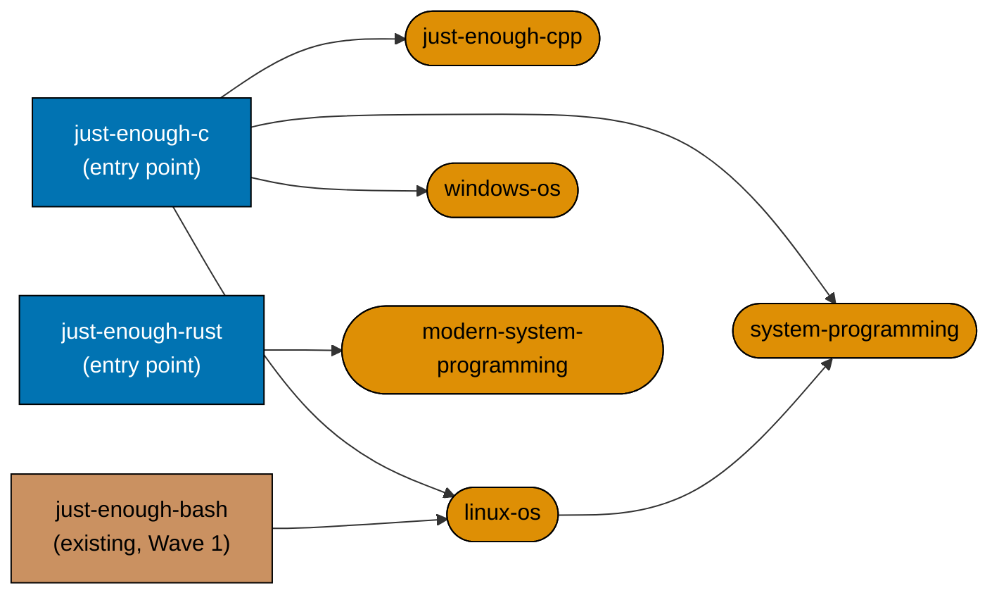

# Technical Docs — Course Authoring: Low-Level Systems & Native Languages

## Corpus Custody

`custodied-by:ayokoding-learning-path-02-schema-and-prerequisite-dag` — this plan **reads** the
shared course corpus custodied by that plan but never edits, copies, or forks any file under it. Any
needed change to that corpus is routed to its own `delivery.md` as a change request, per the
[Learning-Plan Syllabus Convention §Custody Rule](../../../repo-governance/conventions/structure/learning-plan-syllabus/custody-rule.md#custody-rule).

## Overview

This plan produces **content artefacts only**: 7 page bundles under
`apps/ayokoding-www/content/en/learn/courses/<course-id>/`. It writes no TypeScript, no JSON manifest data
file, no route, no component, and no redirect rule. It is one of **two plans splitting a single
band** (the original Band 6, "Low-level systems, JVM & languages, internals builds", 16 courses) that
was too large for one plan under the 5–15-course-per-plan rule. Its "architecture" is therefore an
**authoring architecture**, inherited near-verbatim from
[`ayokoding-learning-path-04-course-authoring`](../../done/2026-08-02__ayokoding-learning-path-04-course-authoring/tech-docs.md):
where each body's authoritative spec lives, what shape the produced bundle takes, and how a landed
band is handed to the plan that composes it.

## Programme decisions cited by this plan

Only the ids this plan's 7 courses actually invoke are reproduced here (folded from the same source
`ayokoding-learning-path-04-course-authoring` already folds them from); the full programme decision
table (`R9`, `A6`, `A8`, `A9`, `A12`) lives in that plan's
[tech-docs.md §Programme decisions](../../done/2026-08-02__ayokoding-learning-path-04-course-authoring/tech-docs.md#programme-decisions).

- **`R9`** — every plan declares its UI-gate and API-gate posture explicitly; see
  [§UI-gate and API-gate posture](#ui-gate-and-api-gate-posture-r9) below.
- **`A8`** — strict clean-room licensing, programme-wide: nothing copyrighted is reproduced, every
  concept restated in original words with a citation. Binds this plan's C/C++/Rust worked examples and
  the `linux-os`/`windows-os` API-surface material identically to every other plan in the programme.
- **`A9`** — both corpora expand past 20 courses as the domain requires; this plan's 7 courses are
  part of that expansion, not an exception to it.

## The manifest ownership invariant (binding)

> **This plan never edits a manifest file.** Every file under
> `apps/ayokoding-www/src/features/course-paths/manifests/` is owned by
> [`ayokoding-learning-path-12-careers-se-manifests`](../../backlog/ayokoding-learning-path-12-careers-se-manifests/README.md).
> A step here that creates, appends to, reorders, or re-verifies a `.json` manifest is a **boundary
> violation**, not a convenience.

The rationale for why this is an ownership rule rather than a scheduling problem is worked through in
full in
[`ayokoding-learning-path-04-course-authoring`'s tech-docs.md §Why the invariant exists](../../done/2026-08-02__ayokoding-learning-path-04-course-authoring/tech-docs.md#why-the-invariant-exists-and-why-no-wave-ordering-replaces-it) —
reproduced there rather than here to avoid drift between two copies of the same argument. This
plan's own copy of the invariant is the **table** below, which is what an executor actually checks:

| Action                                                              | Permitted here?                                                                        |
| ------------------------------------------------------------------- | -------------------------------------------------------------------------------------- |
| Create `<COURSES><course-id>/` and author its bundle (7 IDs)        | **Yes**                                                                                |
| Declare `prerequisites` in a course's own `_index.md`               | **Yes**                                                                                |
| Add a course's row to this file's Course Library Catalog            | **Yes**                                                                                |
| List a course in `<COURSES>_index.md`                               | **Yes**                                                                                |
| Record the band-completion signal in this plan's `delivery.md`      | **Yes** (exactly one signal)                                                           |
| Read a `.json` manifest to check what a path expects                | **Yes** (read-only)                                                                    |
| Append a course ID to any `<MANIFESTS>**/*.json`                    | **No**                                                                                 |
| Re-order any `courseOrder`                                          | **No**                                                                                 |
| Re-run manifest integrity / prerequisite-consistency as a gate here | **No** — the manifest plan re-verifies its own artefacts                               |
| Author any of the sibling plan's 9 course IDs                       | **No** — owned by `ayokoding-learning-path-10-course-authoring-jvm-and-build-your-own` |

## Cross-plan `syllabus/` reference rule (binding)

Identical rule to every plan in this programme: the 128-file `syllabus/` detail layer lives **only**
in
[`ayokoding-learning-path-02-schema-and-prerequisite-dag`](../../done/2026-07-24__ayokoding-learning-path-02-schema-and-prerequisite-dag/README.md).
This plan is a small consumer (7 spec files) and **never copies it**.

- Every reference uses the **full cross-plan relative path**:
  `../../done/2026-07-24__ayokoding-learning-path-02-schema-and-prerequisite-dag/syllabus/<rest>`.
- **Copying is forbidden.** A copy forks the source of truth for these specs, so a later correction
  lands in one copy only.
- The link-validation mechanics, RTK-diff-trailer notes, and `grep -c` sanctioned-emptiness-assertion
  rules that `ayokoding-learning-path-04-course-authoring`'s delivery.md documents at length apply
  verbatim here; they are not re-derived, only cited (see `delivery.md`'s own preamble in this plan for
  the operative commands).

## Authoring architecture

### The course page bundle

Every authored course is a page bundle at `<COURSES><course-id>/` with the fixed anatomy every course
in this programme uses:

```text
<COURSES><course-id>/
├── _index.md                 declares `prerequisites: [course-id, ...]` (contracted shape)
├── overview.md               purpose + `## Prerequisites` (earlier library courses only)
│                             + register + the explicit scope boundary against confusable siblings
├── learning/
│   ├── _index.md
│   ├── <concept + example pages, exhaustive `co-NN` / `ex-NN` coverage>
│   ├── code/                 colocated runnable examples (all 7 of this plan's courses are code-bearing)
│   └── capstone/             the course's own intra-course capstone, where its spec calls for one
└── drilling/
    ├── _index.md              lists the drilling sections, links to `overview.md`
    └── overview.md            the fixed five-section drilling order
```

The `course-id` slug, the prerequisite chain, the concept-coverage floor, and the worked-example
volume are all **settled** in the matching `syllabus/courses/<course-id>.md` spec. Authoring
transcribes them; it does not re-decide them.

### The per-course authoring convention (maker-checker-fixer, not code TDD)

Identical seven-step pipeline to every course in this programme (see
[`ayokoding-learning-path-04-course-authoring`'s tech-docs.md §The per-course authoring
convention](../../done/2026-08-02__ayokoding-learning-path-04-course-authoring/tech-docs.md#the-per-course-authoring-convention-maker-checker-fixer-not-code-tdd)
for the full diagram); reproduced here as the numbered convention `delivery.md` applies to each of
the 7 courses:

1. **V (accuracy pre-verify)** — spot-check version-pinned facts via `web-researcher` (relevant here:
   current C/C++ standard-library and Rust-edition specifics; syscall/API surface details for
   `linux-os`/`windows-os`).
2. **Skeleton** — create `<COURSES><course-id>/` with the fixed anatomy; the slug and prerequisite
   chain are settled in the spec, not decided fresh.
3. **Author learning track** — `overview.md`, concept coverage, worked examples + colocated `code/`,
   and `learning/capstone/` where the spec calls for one.
4. **Author drilling track** — `drilling/overview.md` in the fixed five-section order.
5. **Run content checkers** — the matching maker's checker (`primer` or `by-example`),
   `apps-ayokoding-www-facts-checker`, and `apps-ayokoding-www-link-checker`.
6. **Apply content fixers** — resolve every CRITICAL/HIGH/MEDIUM finding.
7. **Re-verify** — re-run checkers + `npm exec nx run ayokoding-www:build` + `npm run lint:md`.

Plus the same two closing per-course checks every course in this programme runs on the persistent
final-delivery branch before the terminal PR opens:

**8. Confirm no manifest file changed in this course's own diff.**

**9. Licensing self-check (`A8`)** — grep the course's worked-example code for the CC-BY-SA
Stack-Overflow/Reddit hazard.

**This is deliberately not a Red→Green→Refactor cycle** — see
[§TDD exemption](#tdd-exemption-this-plan-ships-no-application-code) below.

### Licensing posture (programme A8)

`A8` binds this plan's 7 course bodies identically to every other plan in the programme. Three
hazards are concretely live in this plan's own scope:

- **Vendor API-reference prose** (`linux-os`'s syscall surface, `windows-os`'s Win32/PowerShell
  surface) — restated in this course's own words with a citation, never a paraphrase-by-substitution
  of the man page or MSDN's own sentences.
- **Code examples** — every `learning/code/` C/C++/Rust worked example is authored originally, never
  copied from a tutorial, a Stack Overflow answer (CC-BY-SA, share-alike a course cannot satisfy), or
  a compiler/stdlib vendor's own sample code.
- **Trademarks** — "Linux", "Windows", "C++", "Rust" and any library/toolchain name (glibc, MSVC,
  Cargo) appear nominatively only, never implying endorsement.

### The `prerequisites` frontmatter contract (consumed, not owned)

Every authored `_index.md` declares `prerequisites: [course-id, ...]`. The canonical statement of this
field's shape is owned by
[`ayokoding-learning-path-02-schema-and-prerequisite-dag`](../../done/2026-07-24__ayokoding-learning-path-02-schema-and-prerequisite-dag/tech-docs.md).
This plan **consumes** it. The list's contents are transcribed from the course's own spec file, never
re-derived — an invented edge adds a false edge to the library DAG whose failure surfaces far
downstream in the manifest plan with no trace back to the authoring pass that caused it.

**This plan's own DAG chain** (the only non-trivial one inside its 7-course scope):



**Accessibility note.** Course kind is carried by node **shape** (rectangle = entry point, stadium =
has a prerequisite) and explicit label text, never by fill colour alone. The externally-owned
prerequisite (`just-enough-bash`, already live from Wave 1) is tan-filled and labelled `existing`.

### Band-completion signal (the handoff to the manifest plan)

This plan lands **one** band-completion signal after its terminal archival PR merges (see
`delivery.md` Phase 2). The signal's five fields and rejection rule are specified in
[README §Band-completion signal contract](./README.md#band-completion-signal-contract); this plan
carries no per-band routing table because it authors exactly one band.

## Why two cohorts, not one

This plan's 7 courses already sit under the repo's 5–15-course-per-plan sizing rule. It uses a
**five-course authoring phase (1–5) plus a two-course tail phase (6–7)** for two concrete reasons:

1. **It keeps authoring bounded.** Five courses is a practical unit for the authoring/checker loop;
   a two-course tail avoids splitting the C-family chain while retaining one terminal delivery unit.
2. **The natural DAG seam already falls there.** Courses 1–5 (`just-enough-c` through
   `system-programming`) are the complete C-family chain — every dependency among them resolves
   within the phase. Courses 6–7 (`just-enough-rust`, `modern-system-programming`) are the complete
   Rust chain, similarly self-contained. Splitting anywhere else (e.g., 4+3) would cut through the
   C-family chain and leave an authoring phase with an unresolved external prerequisite reference
   until the next cohort lands — not a build failure (the course-library resolver tolerates an
   unresolved prerequisite ID), but a less coherent review unit.

## Dependency-edge investigation against plan 10

> **Scope note.** This investigation is scoped to the direct sibling (`10`, the other half of the
> original Band 6) because it is the only plan sharing this plan's own source band. The same method
> was re-applied against the five further-split siblings discovered during this plan's authoring
> session (`05-course-authoring-platform-and-concurrency`, `06-course-authoring-architecture-and-ai-harness`,
> `08-course-authoring-security-and-ops`, `09-course-authoring-interview-technique`,
> `11-course-authoring-capstones`) — see
> [README §Verified independence from the other course-authoring split plans](./README.md#verified-independence-from-the-other-course-authoring-split-plans)
> for that broader result: **zero** of this plan's 7 courses' prerequisites references anything
> outside this plan's own 7 IDs plus the already-shipped `just-enough-bash`, so none of those five
> plans is a historical source context edge for this plan either (unlike the sibling `10`, whose
> `build-your-own-raft` genuinely needs bodies from two of them).

**Question**: does `ayokoding-learning-path-10-course-authoring-jvm-and-build-your-own`'s scope (9
courses: `just-enough-java`, `enterprise-java-and-the-jvm`, `lisp`, `just-enough-fsharp`,
`type-systems`, `compilers-parsers-and-transpilers`, `build-your-own-git`, `build-your-own-database`,
`build-your-own-raft`) declare a prerequisite on any of this plan's 7 course IDs?

**Method**: read every one of the 9 courses' `Prerequisites` cell verbatim from
`ayokoding-learning-path-04-course-authoring`'s tech-docs.md §Course Library Catalog, §"Low-level
systems, JVM & languages, internals builds" (the same table this plan's own catalog rows below are
drawn from — one shared source, not two independent reads):

| Sibling course (Band 6b)            | Declared prerequisites                                            | References any of this plan's 7 IDs? |
| ----------------------------------- | ----------------------------------------------------------------- | ------------------------------------ |
| `just-enough-java`                  | —                                                                 | No                                   |
| `enterprise-java-and-the-jvm`       | `just-enough-java`                                                | No                                   |
| `lisp`                              | —                                                                 | No                                   |
| `just-enough-fsharp`                | —                                                                 | No                                   |
| `type-systems`                      | `just-enough-fsharp`, `functional-programming`                    | No                                   |
| `compilers-parsers-and-transpilers` | `just-enough-fsharp`, `data-structures-and-algorithms-essentials` | No                                   |
| `build-your-own-git`                | `just-enough-python`, `version-control-and-git`                   | No                                   |
| `build-your-own-database`           | `just-enough-python`, `database-internals-and-storage-engines`    | No                                   |
| `build-your-own-raft`               | `just-enough-go`, `distributed-systems`                           | No                                   |

**Note on `ayokoding-learning-path-04-course-authoring`'s own Phase 8 Pause Safety text.** That
plan's delivery.md states: _"`build-your-own-raft`'s and `build-your-own-database`'s prerequisite
bodies (Bands 4 and 1) are already present, so no dangling edge exists"_ — this refers to
`just-enough-go`/`distributed-systems` (Band 4/5) and `just-enough-python`/
`database-internals-and-storage-engines` (Band 1), **none of which is one of this plan's 7 course
IDs**. That note is evidence **for**, not against, this investigation's finding: it independently
confirms `build-your-own-database` and `build-your-own-raft`'s real prerequisite bodies sit outside
Band 6 entirely (Bands 1, 4, and 5), never inside this plan's C-family/Rust half.

**Finding**: **zero** of the sibling plan's 9 courses declares a prerequisite on any of this plan's 7
course IDs. **This plan has no blocking edge to
`ayokoding-learning-path-10-course-authoring-jvm-and-build-your-own` in either direction.** The two
plans run **fully in parallel** once their shared upstream (`04`, trimmed of Band 6) and
`vercel-function-cost-reduction` are both merged. This is a checked finding, not an assumption: if a
future spec correction adds such an edge, this table becomes stale and must be re-verified against
the live `syllabus/courses/` files before either plan's Phase 0 proceeds.

## Course Library Catalog

This plan authors **7** of the original Band 6's 16 courses. **Origin codes** (copied verbatim from
`ayokoding-learning-path-04-course-authoring`'s catalog legend): `T(n)` = transferred FS-SE topic `n`
(authored here, native, no legacy home); `N` = net-new (no prior spec anywhere in the library).
`prerequisites` are the course's own DAG edges (`—` = entry point).

| Course ID                   | Origin | Format     | Primary language | Prerequisites                       | One-line scope                                             |
| --------------------------- | ------ | ---------- | ---------------- | ----------------------------------- | ---------------------------------------------------------- |
| `just-enough-c`             | T(78)  | Primer     | C                | —                                   | Minimal C for the OS/systems topics                        |
| `just-enough-cpp`           | N      | Primer     | C++              | `just-enough-c`                     | RAII, templates, STL, smart pointers (no FS-SE C++ course) |
| `linux-os`                  | T(79)  | By Example | C + shell        | `just-enough-c`, `just-enough-bash` | Processes, syscalls, filesystems                           |
| `windows-os`                | T(80)  | By Example | C + PowerShell   | `just-enough-c`                     | Windows internals, the API                                 |
| `system-programming`        | T(81)  | By Example | C                | `just-enough-c`, `linux-os`         | Close-to-metal C: memory model, manual RM                  |
| `just-enough-rust`          | T(82)  | Primer     | Rust             | —                                   | Ownership, borrowing, type system                          |
| `modern-system-programming` | T(83)  | By Example | Rust             | `just-enough-rust`                  | Safe systems programming (Rust counterpart of 81)          |

**Count check**: 6 transferred (T) + 1 net-new (N) = **7** total, this plan's entire share of Band 6.
The sibling plan's 9 courses (Band 6b) complete the original band's 16. Full per-course concept /
example / capstone detail lives in the cross-plan
[`syllabus/courses/` catalog](../../done/2026-07-24__ayokoding-learning-path-02-schema-and-prerequisite-dag/syllabus/courses/README.md).

## Design Decisions

This plan owns a small local decision set, prefixed `DD-LLS-` (Low-Level Systems) to avoid any risk of
colliding with the shared `DD-1`…`DD-40` pool the source plan and its other split siblings draw from,
and carries two decisions **by reference** rather than by re-derivation.

### Owned by this plan

- **DD-LLS-1 · Two-cohort delivery split (5 + 2), not a single seven-course cohort.** See
  [§Why two cohorts, not one](#why-two-cohorts-not-one) above for the full reasoning. **Decided.**
- **DD-LLS-2 · `system-programming` and `modern-system-programming` are counterparts, never
  duplicates.** Both teach the identical close-to-metal-memory-management principle set; the C course
  owns manual resource management, the Rust course owns the ownership/borrowing answer to the same
  problem. Each course's `overview.md` names the other explicitly as its counterpart, so a reader
  never mistakes intentional parallel depth for accidental repetition. **Decided.**
- **DD-LLS-3 · `linux-os` and `windows-os` stay keep-distinct by OS family, never merged.** Mirrors
  the source plan's own keep-distinct discipline (its DL-6/DD-20 pattern) applied to this plan's own
  pair: no course teaches both OS families; each states its own family boundary explicitly.
  **Decided.**

### Carried by reference (owned elsewhere, cited here because this plan's scope invokes them)

| DD      | Subject                                                                                                                  | Owner plan                                    |
| ------- | ------------------------------------------------------------------------------------------------------------------------ | --------------------------------------------- |
| `DD-14` | Two-altitude splits + gap-closers, including the dedicated `just-enough-cpp` on-ramp (prereq `just-enough-c`)            | `ayokoding-learning-path-04-course-authoring` |
| `DD-18` | Proof-of-transfer outcome-anchor — courses teach durable principles; target codebases are evidence, never subject matter | `ayokoding-learning-path-04-course-authoring` |

`DD-14` is the direct authority for this plan's one hard authored-on-ramp requirement
(`just-enough-cpp` → `just-enough-c`); this plan does not re-decide it, only implements it. `DD-18`
justifies this plan's principle-first framing in [prd.md](./prd.md#new-course--transferred-topic-specifications)
identically to every other course in the library.

## Productive in Target Codebases (proof-of-transfer outcome-anchor, inherited)

Per `DD-18`, courses teach durable principles; target codebases are evidence the principles transfer,
never subject matter. `just-enough-cpp` is the one course in this plan's scope with a named target
illustration [Repo-grounded, cited by `ayokoding-learning-path-04-course-authoring`'s tech-docs.md]:
**`wazuh/wazuh`** — <https://github.com/wazuh/wazuh> (accessed 2026-07-18) — a C/C++ manager/agent
core, C++-dominant in active development. `just-enough-cpp`'s worked examples are original, authored
for the course, never lifted from that or any other codebase; the target is cited as an illustration
of where the principle applies, per `A8`.

## UI-gate and API-gate posture (R9)

### UI gate — **exempt**

This plan's entire output is 7 markdown page bundles under
`apps/ayokoding-www/content/en/learn/courses/<course-id>/`. `swe-ui-checker` globs `.tsx` files; this
plan's diff contains zero. A checker run scoped to this plan would be a vacuous pass, recorded here as
an exemption rather than a claimed one. The components that render these bodies are owned by
`ayokoding-learning-path-03-navigation-ui` (already done). **The exemption is narrow**: manual
behavioural verification via Playwright MCP is mandatory and performed (`delivery.md` Phase 4). The
**Rule-15 three-tester retest is separately exempted** with its own reasons in
[README §Rule-15](./README.md#rule-15-three-tester-retest--exemption-recorded).

### API gate — **exempt**

This plan never edits a manifest and ships no code, JSON manifest data, or route. Its one structured-data output —
the `prerequisites` frontmatter in each `_index.md` — is inert until
`ayokoding-learning-path-12-careers-se-manifests` reads it; this plan's own structural check verifies only
presence and well-formedness, never resolution. **Rule-16 API exploratory retest — not applicable**:
no REST or GraphQL endpoint changes.

## Exemptions (stated explicitly, not silently taken)

### UI-design-funnel exemption (not UI-bearing)

This plan adds or changes no screen or component; the full funnel is owned by the navigation-UI and
URL-restructure plans. This plan carries no `assets/` folder.

### Specs & Gherkin (app-code) exemption

This plan changes no app or lib code; its content is exempt from `specs:coverage` per the source
plan's own classification. The 5 Gherkin scenarios in
[`prd.md`](./prd.md#acceptance-criteria-gherkin) are content-level acceptance criteria, verified by
grep-checkable assertions and the ayokoding content checkers.

### TDD exemption (this plan ships no application code)

The delivery steps produce prose and colocated runnable `code/` samples that are course material, not
application code: no importable module, no test target, no runtime behaviour the app depends on.
Correctness is established by the maker-checker-fixer pipeline, not RED→GREEN→REFACTOR. If any step
ever needs to touch app or lib code, that step is out of scope and routes to the owning plan.

### Rule-15 three-tester retest exemption

Recorded with reasons in
[README §Rule-15](./README.md#rule-15-three-tester-retest--exemption-recorded). Manual Playwright MCP
verification remains mandatory.

### Rule-16 API exploratory retest — not applicable

No endpoint changes.

## File-Impact Analysis

Root-relative annotated tree — the scan-first source of truth for this plan's scope. **[E]** edit,
**[N]** new file/pattern, **[D]** delete, **[G]** generated/regenerated.

```text
.
├── apps/ayokoding-www/content/en/learn/courses/
│   ├── _index.md [E] — append one catalog row per landed course ID
│   └── <course-id>/ [N] — 7 bundles; bounded family, members enumerated verbatim in
│       │                  evidence/authored-body-slugs.txt (written in Phase 0), never by glob
│       ├── _index.md [N] — declares `prerequisites: [course-id, ...]`
│       ├── overview.md [N] — purpose, prerequisites, register, scope boundary
│       ├── learning/ [N] — `_index.md`, co-NN/ex-NN pages, `code/`, `capstone/`
│       └── drilling/ [N] — `_index.md` + `overview.md` (fixed five-section order)
├── plans/in-progress/ayokoding-learning-path-07-course-authoring-low-level-systems/
│   ├── tech-docs.md [E] — this file; the Course Library Catalog rows
│   ├── delivery.md [E] — checkbox ticks + the five-field band-completion signal
│   ├── learnings.md [E] — running log, drained by the Knowledge Capture phase
│   └── evidence/ [N] — phase-0 snapshot, authored-body-slugs.txt, Playwright screenshots
└── apps/ayokoding-www/src/features/course-paths/ — NOT TOUCHED (zero-diff gate every phase)
```

### More Detail

The `<course-id>/` bundles are the only `*`-shaped family in the tree, and they are bounded by
construction: the exact member list is written to `evidence/authored-body-slugs.txt` during Phase 0,
and every later assertion reads that register rather than globbing the directory — so a slug that
drifted into the tree from a sibling band plan can never be silently adopted as this plan's work.

`apps/ayokoding-www/content/en/learn/courses/_index.md` is generated from course directories; this plan does not edit it manually outside
its own plan folder. It is **appended to**, never rewritten, so a concurrent sibling band plan adding
its own rows produces a mergeable diff rather than a conflict.

Nothing under `apps/ayokoding-www/src/` carries an action annotation because this plan writes no
application code at all. That absence is **asserted** by the zero-diff manifest gate in every phase,
not merely assumed — the manifest subtree is named separately below because reading it is permitted
and writing it is a boundary violation, a distinction the tree alone cannot carry.

**New directories created** (7 total, one per authored body, zero overlap with any existing
`<COURSES>` bundle):

- `apps/ayokoding-www/content/en/learn/courses/<course-id>/` — the fixed bundle anatomy, one per slug
  in `evidence/authored-body-slugs.txt`.

**Existing files modified** (this plan edits these; it never creates them):

| File                                                                            | Change                                                                           |
| ------------------------------------------------------------------------------- | -------------------------------------------------------------------------------- |
| `apps/ayokoding-www/content/en/learn/courses/_index.md` (`<COURSES>_index.md`)  | 7 new list entries, one per landed course ID                                     |
| `tech-docs.md` (this file) — [§Course Library Catalog](#course-library-catalog) | the 7 rows above (already present at authoring time)                             |
| `delivery.md` (this plan's own file)                                            | the five-field band-completion signal block, appended once at the end of Phase 2 |

**Never touched, by construction** (verified by a zero-diff gate check every phase, not merely
asserted):

- `<FEAT>` (`apps/ayokoding-www/src/features/course-paths/`) — no application code.
- `<MANIFESTS>` (`<FEAT>manifests/`) — confirmed every phase via the sanctioned
  `git diff --name-only … -- 'apps/ayokoding-www/src/features/course-paths/manifests/' | grep -c .`
  zero-assertion, identical mechanics to every plan in this programme.
- `<PATHS>` and `<SE_OLD>` — read-only reference paths.
- `<SYLLABUS>` (`../../done/2026-07-24__ayokoding-learning-path-02-schema-and-prerequisite-dag/syllabus/`) —
  consumed, never copied.
- Any of the sibling plan's 9 course-ID subtrees.

**No package-manifest changes.**

## Execution dependency

This plan has one direct execution prerequisite: `ayokoding-learning-path-06-course-authoring-architecture-and-ai-harness`, fully merged and archived on `origin/main`. Course-level source citations and repository facts are implementation context, not extra plan dependencies.

## Rollback

Every artefact this plan produces is an **additive** new directory under `<COURSES>`. Nothing is
moved, renamed, or deleted, so rollback is subtractive and total:

- **Per course**: `git rm -r <COURSES><course-id>/` plus removing its catalog row and its
  `<COURSES>_index.md` entry. Safe **only** if no manifest already references the ID.
- **Whole plan**: revert the sole terminal merge commit. The `courses/` bucket returns to its
  pre-this-plan state.

**The one-way door**: once a manifest references one of these 7 course IDs, deleting that body breaks
`checkManifestIntegrity` downstream — bodies-first, manifests-after, and this plan may never grow a
manifest itself.

## Testing / Verification Strategy

| Level                     | What it verifies                                                                       | Mechanism                                                                   |
| ------------------------- | -------------------------------------------------------------------------------------- | --------------------------------------------------------------------------- |
| Per-course content checks | concept coverage, register, format, worked-example volume, scope boundary              | matching `apps-ayokoding-www-{primer,by-example}-checker`                   |
| Per-course fact checks    | version-pinned facts; volatile facts confined to dated sidebars where applicable       | `apps-ayokoding-www-facts-checker`                                          |
| Per-course link checks    | intra-course and cross-course links resolve                                            | `apps-ayokoding-www-link-checker`                                           |
| Contract assertions       | counterpart / scope-boundary statements are present in the body                        | grep-checkable acceptance clauses on the authoring steps                    |
| Structural                | bundle anatomy present; `prerequisites` declared                                       | `test -d` / `test -f` + frontmatter grep                                    |
| Section build             | the authored tree renders                                                              | `npm exec nx run ayokoding-www:build`                                       |
| Markdown quality          | markdownlint, link validation, heading hierarchy                                       | `npm run lint:md` + the two `rhino-cli md` subcommands                      |
| Regression                | no existing project's gates broke                                                      | `npm exec nx affected -t typecheck lint test:quick specs:behavior:coverage` |
| Manual behavioural        | a sample of the 7 authored course pages renders correctly at three breakpoints in `en` | Playwright MCP + committed `evidence/` screenshots                          |

**Deliberately absent**: unit, integration, and e2e tests for this plan's own artefacts — there is no
application code here to test, identical reasoning to every plan in this programme.
