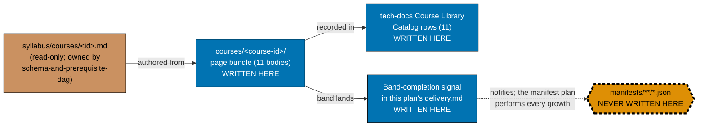
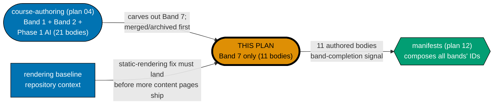

# Learning Path — Course Authoring: Security, Ops & Delivery (Band 7)

## Status

In progress.

## Delivery amendment — one final PR

All 11 courses remain within one plan branch and one delivery unit. The sole draft PR opens only in
Phase 7, after verification and Knowledge Capture, and carries the archival move, CI,
merge, and deploy. Earlier cohort or delivery-boundary PR wording is superseded.

Author the **eleven course bodies** of Band 7 — "Security, ops, quality & delivery" — of the shared
course library: `it-and-application-security`, `offensive-security`, `defensive-security`,
`detection-engineering-and-siem-operations`, `vulnerability-management-and-assessment`,
`it-governance-grc`, `bare-metal-virtualization`, `self-managed-kubernetes-and-gitops`,
`platform-engineering-and-devex`, `site-reliability-engineering`, and
`analytics-and-experimentation`. **Eleven authored course bundles** in total, landing under
`apps/ayokoding-www/content/en/learn/courses/`.

This plan is a **further split of Band 7 out of**
[`ayokoding-learning-path-04-course-authoring`](../../done/2026-08-02__ayokoding-learning-path-04-course-authoring/README.md)
(itself Wave 2 of the five-way split of the closed
[`shared-course-library-and-learning-paths`](../../done/2026-07-21__shared-course-library-and-learning-paths/README.md)
plan). Band 7 held eleven course bodies as a former phase of plan 04's own delivery checklist — plan
04's delivery.md has since been trimmed and no longer carries that phase heading; the carve-out is now
documented in
[plan 04's own Successor plans table](../../done/2026-08-02__ayokoding-learning-path-04-course-authoring/README.md#successor-plans);
that phase's scope is carved out into this standalone folder so the band can be delivered, reviewed,
and archived independently of plan 04's remaining bands. **Eleven courses fits the repo's 5-15-course
plan-sizing rule as-is** — no further merging or splitting is needed within this band.

> **Cross-plan source of truth** — the authoritative per-course specs live in
> `plans/done/2026-07-24__ayokoding-learning-path-02-schema-and-prerequisite-dag/syllabus/courses/`. Do
> not copy them; do not author from any other source. Every course body in this plan is authored
> **from** its
> [`syllabus/courses/<course-id>.md`](../../done/2026-07-24__ayokoding-learning-path-02-schema-and-prerequisite-dag/syllabus/courses/README.md)
> spec file — never from a fresh judgment call.
>
> **Provenance note — this plan authors while its immediate ancestor is still `in-progress`.** At the
> time this plan was authored, `ayokoding-learning-path-04-course-authoring` had not yet archived to
> `plans/done/YYYY-MM-DD__…`. Every cross-plan link to it in this plan's own files therefore currently
> points at
> `../../done/2026-08-02__ayokoding-learning-path-04-course-authoring/`. [delivery.md Phase 0](./delivery.md#phase-0-environment-setup--baseline)
> resolves the actual path at execution time (the same `git ls-files`-based pattern plan 04 itself used
> for its own upstream schema-plan reference) and re-points every reference in this plan's own files
> before authoring begins, rather than guessing a completion date now.

## The manifest ownership invariant (binding — read before anything else)

> **This plan never edits a manifest file.** Every file under
> `apps/ayokoding-www/src/features/course-paths/manifests/` is owned by
> [`ayokoding-learning-path-12-careers-se-manifests`](../../backlog/ayokoding-learning-path-12-careers-se-manifests/README.md). A step
> in this plan that creates, appends to, reorders, or re-verifies a `.json` manifest is a **boundary
> violation**, not a convenience. This is the identical invariant plan 04 carries, reproduced here
> because this plan is now the one authoring Band 7's bodies.

When Band 7 lands, this plan records **one band-completion signal** in its own
[`delivery.md`](./delivery.md) and the manifest plan performs the growth. The signal is the entire
handoff contract; see [Band-completion signal contract](#band-completion-signal-contract) below.

**Accessibility note.** Write permission is carried by node **shape** and by explicit label text
(`WRITTEN HERE` / `NEVER WRITTEN HERE` / `read-only`), and edge kind by **line style** plus edge
labels — never by fill colour alone. The forbidden node additionally carries a dashed thick border.
Fills use the verified accessible palette per the
[Color Accessibility Convention](../../../repo-governance/conventions/formatting/color-accessibility.md).

## Position in the split

**Accessibility note.** Role is carried by node **shape** (rectangle = upstream, stadium = this plan,
hexagon = downstream) and by explicit `THIS PLAN` label text; colour is redundant. Fills use the
verified accessible palette.

## Band-completion signal contract

The manifest plan cannot act on a vague signal. This plan's single band-completion signal, recorded
in [`delivery.md`](./delivery.md) at the close of Phase 2, MUST carry all five fields below, verbatim,
in a fenced `text` block:

| Field               | Content                                                                                 |
| ------------------- | --------------------------------------------------------------------------------------- |
| `BAND`              | `Band 7 — Security, ops, quality & delivery`                                            |
| `PLAN`              | `ayokoding-learning-path-08-course-authoring-security-and-ops`                          |
| `LANDED_COURSE_IDS` | all eleven course IDs, one per line, in this plan's own listing order                   |
| `GROW_MANIFESTS`    | every manifest the manifest plan must grow, by **full path** under `<MANIFESTS>`        |
| `FINAL_PR`          | the number of this plan's sole terminal archival PR, verified merged before consumption |

`GROW_MANIFESTS` is the load-bearing field, and for this band it is fixed: derived by elimination from
plan 04's own routing notes (Band 9 grows two manifests; Bands 5 and 8 grow four), every other band,
including Band 7, defaults to three. **Band 7 grows exactly the three `software-engineer`-role
manifests**:

- `<MANIFESTS>careers/interview-ready/software-engineer.json`
- `<MANIFESTS>careers/immediately-effective/software-engineer.json`
- `<MANIFESTS>careers/fundamentally-strong/software-engineer.json`

The fourth manifest, `<MANIFESTS>careers/immediately-effective/ai-engineer.json`, is **not** grown by
this band — it grows only for Bands 5 and 8 (the AI/harness cluster and the capstones that assemble
it), neither of which is this plan's scope.

**Delivery note — one terminal signal.** The eleven bodies are authored in two prerequisite-oriented
authoring phases, but they remain on one persistent branch. The plan emits one band-completion signal
only after its sole terminal archival PR merges; `LANDED_COURSE_IDS` lists all eleven IDs and
`FINAL_PR` names that one terminal delivery. Receiving plans must not consume a provisional signal.

## Delivery Mode: worktree-to-pr

This plan has exactly one dedicated worktree, one persistent final-delivery branch, and one PR.
All authoring, verification, and Knowledge Capture phases commit on that branch without a push, PR, merge, or deployment. In Phase 7, the executor commits the archival move and
any index updates, opens the sole draft PR, completes the secret scan, local quality checks, and PR quality-gate verification and CI gates,
marks it ready, and performs the normal AI merge/deploy after the hardened preconditions hold.
No per-course, cohort, stage, or phase worktree/branch/PR is permitted.

## Depends-on

| Relation      | Plan (full folder name)                                         | Nature                                                                                                                                                                                                                         |
| ------------- | --------------------------------------------------------------- | ------------------------------------------------------------------------------------------------------------------------------------------------------------------------------------------------------------------------------ |
| **blockedBy** | `ayokoding-learning-path-07-course-authoring-low-level-systems` | **Hard; sole direct execution prerequisite.** It must be fully merged and archived on `origin/main` before Phase 0. All earlier completion and repository-baseline facts are transitive context, not extra plan prerequisites. |

**Phase 0 start check:** `git ls-tree -r --name-only origin/main plans/done | rg -q "__ayokoding-learning-path-07-course-authoring-low-level-systems/README\.md$"` exits 0. This is this plan's only plan-level start gate.

## Rule-15 three-tester retest — exemption recorded

**Exempt, with reasons stated (not silently omitted)**, for the identical reasons plan 04 already
recorded for its own 90 bodies. The
[User-Facing Delivery Hardening Convention](../../../repo-governance/development/quality/user-facing-delivery-hardening.md)
Rule 15 mandates a near-end `web-exploratory-tester` + `web-usability-tester` + `web-design-tester`
round for **web-UI feature-change** plans. This plan is not one:

1. **It ships no screen and no component.** Every artefact is a markdown page bundle under
   `apps/ayokoding-www/content/en/learn/courses/`. The screens that render those pages (`PathRail`,
   `PathLanding`, `PathCard`, the paths hub) are owned by
   `ayokoding-learning-path-03-navigation-ui`, which already carried the mandatory retest.
2. **Its output surface is already covered by dedicated checkers.** Every authored body passes
   `apps-ayokoding-www-{by-example,annotated-concept,primer,general}-checker`,
   `apps-ayokoding-www-facts-checker`, and `apps-ayokoding-www-link-checker` — content-domain checkers
   strictly stronger, for prose correctness, than a generalist live-site UX triad.
3. **The retest would test the other plan's surface.** Pointing the triad at a course page exercises
   the navigation plan's rendering layer, producing findings this plan cannot act on.

**This is an exemption, not an omission**, and it is **narrow**: manual behavioural verification via
Playwright MCP is **still mandatory and still performed** (see [delivery.md](./delivery.md) Phase 4) —
a sample of this plan's own eleven authored course pages is opened at all three breakpoints in the
`en` content locale, with committed screenshot evidence. Only the three-tester triad is waived.

## Locale scope

This plan's content is authored **`en`-only**. Per plan 04's own Business-Scope Non-Goals (inherited),
an Indonesian mirror of the section content is explicitly **deferred**, and the deferral is a recorded
decision rather than an omission. Every manual-verification step in this plan exercises `en` and
states the deferral inline; fabricating an `id` walk-through for content that does not exist is
forbidden.

## Navigation

- [Business Requirements (brd.md)](./brd.md) — WHY these 11 bodies exist, who they serve, the business
  risks of authoring them, and what "done" means in business terms.
- [Product Requirements (prd.md)](./prd.md) — personas, user stories, the Gherkin acceptance criteria
  this plan owns, and product scope.
- [Technical Docs (tech-docs.md)](./tech-docs.md) — the authoring architecture, the reproduced
  cross-cutting design decisions that directly govern this band, the Course Library Catalog rows for
  all eleven bodies, and the manifest-ownership diagram.
- [Delivery Checklist (delivery.md)](./delivery.md) — the phased, executable checklist.
- [Learnings (learnings.md)](./learnings.md) — knowledge-capture running log.
- **Cross-plan**:
  [`syllabus/` source of truth](../../done/2026-07-24__ayokoding-learning-path-02-schema-and-prerequisite-dag/syllabus/README.md)
  ·
  [`syllabus/courses/` catalog](../../done/2026-07-24__ayokoding-learning-path-02-schema-and-prerequisite-dag/syllabus/courses/README.md)
  · [`ayokoding-learning-path-04-course-authoring` (baseline)](../../done/2026-08-02__ayokoding-learning-path-04-course-authoring/README.md)
  · [`ayokoding-learning-path-12-careers-se-manifests` (downstream)](../../backlog/ayokoding-learning-path-12-careers-se-manifests/README.md)
  · [`vercel-function-cost-reduction` (historical reference)](../../done/2026-08-02__vercel-function-cost-reduction/README.md)

## Provenance

This plan carves **Phase 9 (Band 7 — Security, ops, quality & delivery, 11 bodies)** out of what was,
at authoring time, a phase of
[`ayokoding-learning-path-04-course-authoring`'s own delivery checklist](../../done/2026-08-02__ayokoding-learning-path-04-course-authoring/delivery.md).
Plan 04's `delivery.md` was trimmed during its completed closeout and that phase heading no longer exists there; the
carve-out is now documented in
[plan 04's own Successor plans table](../../done/2026-08-02__ayokoding-learning-path-04-course-authoring/README.md#successor-plans),
which is itself Wave 2 of the five-way split of the closed
`plans/done/2026-07-21__shared-course-library-and-learning-paths/` plan. Plan 04's completed closeout
trimmed its own `README.md`, `tech-docs.md`, and `delivery.md` to remove Band 7's scope and hand it to
this folder.

**The `DD-34` / `DD-35` / `DD-39` tokens are not this split's decisions**, exactly as plan 04 notes for
itself: they are FS-SE-inherited tokens carrying unrelated meanings in `syllabus/courses/**`, and travel
with `syllabus/` into the schema plan. `DD-36`, `DD-37`, and `DD-38` are unused. **Do not renumber to
close the apparent gap.**
