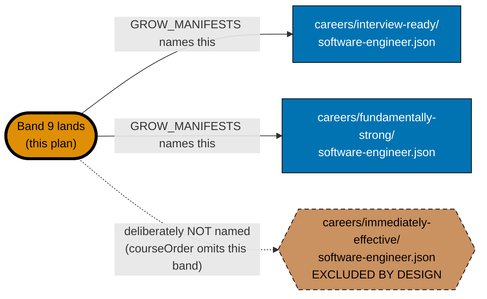
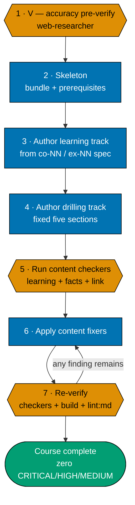

# Technical Docs — Course Authoring: Interview-Technique Courses (Band 9)

## Corpus Custody

`custodied-by:ayokoding-learning-path-02-schema-and-prerequisite-dag` — this plan **reads** the shared
course corpus custodied by plan 02 but never edits, copies, or forks any file under it. Any needed
change to that corpus is routed to plan 02's own `delivery.md` as a change request, per the
[Learning-Plan Syllabus Convention §Custody Rule](../../../repo-governance/conventions/structure/learning-plan-syllabus/custody-rule.md#custody-rule).
This plan is a **consumer**, not the owner, of that corpus — exactly as the parent plan
(`ayokoding-learning-path-04-course-authoring`) states of itself — and is therefore exempt from the
`## Corpus Disposition` declaration that binds a learning-bearing plan which **owns** a corpus.

## Overview

This plan produces **content artefacts only**: 5 page bundles under
`apps/ayokoding-www/content/en/learn/courses/<course-id>/`. It writes no TypeScript, no JSON manifest data
file, no route, no component, and no redirect rule. It is a narrow, single-band slice of the authoring
architecture the parent plan established; this document restates only what a reader needs to execute
this plan's own delivery checklist, and cross-links the parent plan for everything not restated.

## Programme decisions consumed

Consumed verbatim from the parent plan's own tech-docs — this plan makes no new programme-scope
decision. Only the ids this plan's own authoring touches are reproduced:

| Id  | Decision                                                                                                                                                   |
| --- | ---------------------------------------------------------------------------------------------------------------------------------------------------------- |
| R9  | Every plan declares its **UI-gate and API-gate posture explicitly**; see [§UI-gate and API-gate posture](#ui-gate-and-api-gate-posture-r9) below           |
| A8  | **Strict clean-room licensing, programme-wide** — nothing copyrighted is reproduced; every concept is restated in original words with a citation           |
| A12 | Every syllabus is **independently authored, then externally confirmed** — a published curriculum may corroborate coverage but never supplies the structure |

### DD-10 — Interview technique is NEW content; fundamentals are shared courses (consumed)

The four interview modules teach **technique**; DS&A/OOP/system-design **depth** are library courses
every path can use. This cleanly separates "technique" (refresh register, `interview-ready`-owned)
from "subject depth" (shared, already-live library courses). This is the design decision that makes
`system-design-interview` forward-link `system-design` rather than duplicate it, and the same
principle applies to `coding-interview`'s relationship with `data-structures-and-algorithms-essentials`
and `advanced-algorithms`.

## The manifest ownership invariant (binding)

> **This plan never edits a manifest file.** Every file under
> `apps/ayokoding-www/src/features/course-paths/manifests/` is owned by a downstream manifest-growth
> plan. A step here that creates, appends to, reorders, or re-verifies a `.json` manifest is a
> **boundary violation**, not a convenience.

### What the invariant permits and forbids, concretely

| Action                                                                    | Permitted here?                                                      |
| ------------------------------------------------------------------------- | -------------------------------------------------------------------- |
| Create `<COURSES><course-id>/` and author its bundle for the 5 Band-9 IDs | **Yes**                                                              |
| Declare `prerequisites` in a course's own `_index.md`                     | **Yes**                                                              |
| Add a course's row to the Course Library Catalog in this file             | **Yes**                                                              |
| List a course in `<COURSES>_index.md`                                     | **Yes**                                                              |
| Record the one band-completion signal in this plan's `delivery.md`        | **Yes**                                                              |
| Read a `.json` manifest to check what a path expects                      | **Yes** (read-only)                                                  |
| Append a course ID to any `<MANIFESTS>**/*.json`                          | **No**                                                               |
| Re-order any `courseOrder`                                                | **No**                                                               |
| Re-run manifest integrity / prerequisite-consistency as a gate here       | **No** — the downstream manifest plan re-verifies its own artefacts  |
| Assert any catalog total beyond this plan's own 5                         | **No** — this plan asserts its own **5**, never the 127-course total |

## The two-of-three manifest asymmetry (Band 9's special case)

Every other band in the shared-library split grows the same three `software-engineer`-role manifests
(`interview-ready`, `immediately-effective`, `fundamentally-strong`). Band 9 is the one exception, and
this section exists so a reader of this plan alone never generalizes the exception back into the rule.



**Accessibility note.** Manifest membership is carried by node **shape** (rectangle = grows,
hexagon = excluded) and by the literal `EXCLUDED BY DESIGN` label, plus edge **style** (solid = grows,
dotted = deliberately not named) — never by fill colour alone. Fills use the verified accessible
palette per the
[Color Accessibility Convention](../../../repo-governance/conventions/formatting/color-accessibility.md).

| Manifest                                               | Grows from this band's signal? | Why                                                                                                                              |
| ------------------------------------------------------ | ------------------------------ | -------------------------------------------------------------------------------------------------------------------------------- |
| `careers/interview-ready/software-engineer.json`       | **Yes**                        | This band is that path's own namesake content — its entire reason for existing                                                   |
| `careers/fundamentally-strong/software-engineer.json`  | **Yes**                        | Carries this band as an optional deepening tail, per the courses' own `syllabus/` "In which paths" sections                      |
| `careers/immediately-effective/software-engineer.json` | **No — excluded by design**    | That path's reader reaches these 5 courses (if at all) via their canonical course pages, never via that path's own `courseOrder` |
| `careers/immediately-effective/ai-engineer.json`       | **No — no dependency at all**  | The AI-engineer path never references any interview-technique course in any capacity                                             |

Contrast with every other band's default 3-of-3 growth (Bands 1–4, 6, 7 grow all three
`software-engineer` manifests; Bands 5 and 8 additionally grow the AI-engineer manifest) — Band 9 is
the library's **one 2-of-3 case**, and it is 2-of-3, never 2-of-4: the AI-engineer manifest was never
in scope for this band under any circumstance.

## Baseline precondition on plan 04

This plan's repository baseline context on `ayokoding-learning-path-04-course-authoring` is a **baseline**
dependency, not a full-completion one. Concretely, this plan's Phase 0 needs:

1. **The parent plan's own Phase 0 baseline established** — toolchain converged
   (`npm run doctor -- --fix` clean), and its own upstream plans (`01-url-restructure`,
   `02-schema-and-prerequisite-dag`) verified merged to `origin/main`.
2. **The `<COURSES>` bucket regenerated** — `apps/ayokoding-www/content/en/learn/courses/_index.md`
   exists, and the namespace holds at minimum the 37 re-homed bundles the URL-restructure plan created.

**It does NOT need**: the parent plan's other 85 non-Band-9 bodies (AI courses + Bands 1–8) merged.
Per the parent plan's own stated ordering rationale, "Bands 1–4, 6, and 7 are mutually
content-independent and their relative order is a convenience, not a constraint" — and Band 9 is
explicitly named alongside them in that same independence list. This plan's own Phase 0 re-verifies
the upstream chain directly (see [delivery.md](./delivery.md) Phase 0) rather than trusting an
unverified claim about how much of the parent plan's remaining scope has landed.

**[Repo-grounded, 2026-08-01]** As of this plan's authoring date, `git ls-files` confirms **58** course
directories exist under `<COURSES>` against **37** re-homed bundles — **21** net-new bodies authored so
far (the six AI-engineering courses plus Bands 1 and 2), with Bands 3–9 now carved into sibling plans
(`05-course-authoring-platform-and-concurrency`, `06-course-authoring-architecture-and-ai-harness`,
`07-course-authoring-low-level-systems`, `08-course-authoring-security-and-ops`,
`09-course-authoring-interview-technique` — this plan, `10-course-authoring-jvm-and-build-your-own`).

## The the rendering repository baseline

This is a **new** repository baseline context this plan carries that the parent plan's own dependency list never
had, because it did not exist when the parent plan was authored.

**Why authoring 5 more content pages is gated on a cost-reduction plan.**
[`vercel-function-cost-reduction`](../../done/2026-08-02__vercel-function-cost-reduction/README.md)
(read in full for this plan's authoring) found that `apps/ayokoding-www` **prerenders zero of its
~2,068 content pages** — every page view executes a serverless function rather than being served from
the CDN, because of two structural causes: (Cause A) the root layout calls `await headers()` purely to
compute `<html lang>`, and (Cause B) the content catch-all route reads `?path=` via a server-side
`await searchParams`. Both causes are **structural**, not content-volume-dependent: any new page
authored under `apps/ayokoding-www/content/en/learn/courses/` — including all 5 of this plan's bodies —
inherits the same dynamic-rendering penalty until those two causes are fixed, compounding a cost
problem the maintainer is actively trying to shrink from ~$57/month gross toward the $20/month Pro
plan's included credit.

**Treated as already merged/done, per explicit task instruction.** This plan's own Phase 0 states the
precondition as a hard gate rather than assuming it — the checkable signal below is grounded in that
plan's own Phase 1–4 changes (read directly from its `delivery.md`), not invented:

| Phase (of `vercel-function-cost-reduction`)  | Concrete file-level change                                                                                            | This plan's checkable signal                                                                                                         |
| -------------------------------------------- | --------------------------------------------------------------------------------------------------------------------- | ------------------------------------------------------------------------------------------------------------------------------------ |
| Phase 1 — Cause A, promote the locale layout | `apps/ayokoding-www/src/app/layout.tsx` deleted; contents moved into `apps/ayokoding-www/src/app/[locale]/layout.tsx` | `test ! -f apps/ayokoding-www/src/app/layout.tsx` exits 0 **and** `test -f "apps/ayokoding-www/src/app/[locale]/layout.tsx"` exits 0 |
| Phase 2 — Cause B, move `?path=` client-side | the `searchParams` prop dropped from `apps/ayokoding-www/src/app/[locale]/(content)/[...slug]/page.tsx`               | `grep -c "await searchParams" "apps/ayokoding-www/src/app/[locale]/(content)/[...slug]/page.tsx"` returns `0`                        |
| Phase 3 — eliminate the middleware           | `apps/ayokoding-www/src/middleware.ts` deleted (or migrated to `proxy.ts`)                                            | `test ! -f apps/ayokoding-www/src/middleware.ts` exits 0                                                                             |
| Phase 4 — bundle/cold-start hygiene          | `outputFileTracingIncludes` scoped per route in `apps/ayokoding-www/next.config.ts`                                   | not independently re-verified here — Phases 1–3's signals are sufficient to confirm the structural fix landed                        |

All three checks above compose into this plan's own Phase 0 precondition gate — see
[delivery.md](./delivery.md) Phase 0. If any check fails, this plan does not begin authoring: doing so
would knowingly add 5 more dynamically-rendered pages to a site the maintainer is actively working to
de-cost.

## The course page bundle (consumed from plan 04)

Every authored course is a page bundle at `<COURSES><course-id>/` with a fixed anatomy, unchanged from
the parent plan's own convention:

```text
<COURSES><course-id>/
├── _index.md                 declares `prerequisites: [course-id, ...]` (contracted shape)
├── overview.md               purpose + `## Prerequisites` (earlier library courses only)
│                             + register + the explicit scope boundary against confusable siblings
├── learning/
│   ├── _index.md
│   ├── <concept + example pages, exhaustive `co-NN` / `ex-NN` coverage>
│   ├── code/                 colocated runnable examples (code-bearing courses only)
│   └── capstone/              the course's own intra-course capstone (n/a for the interview-milestone capstone body itself)
└── drilling/
    ├── _index.md              lists the drilling sections, links to `overview.md`
    └── overview.md            the fixed five-section drilling order
```

The `course-id` slug, prerequisite chain, concept-coverage floor, and worked-example volume are all
**settled** in the matching `syllabus/courses/<course-id>.md` spec (see
[prd.md §Course Specifications](./prd.md#course-specifications) for the per-course figures this plan
authors from). Authoring transcribes them; it does not re-decide them.

## NEW-course authoring convention (applies to every authoring step in Phase 1)

Consumed verbatim from the parent plan — this is a maker-checker-fixer pipeline, not a Red→Green→Refactor
cycle (see [§TDD exemption](#tdd-exemption-this-plan-ships-no-application-code) below):



**Accessibility note.** Stage kind is carried by node **shape** (hexagon = verify, rectangle = produce,
stadium = terminal) and by the numbered step labels; the retry edge carries an explicit label. Colour
is redundant throughout.

### Licensing posture (programme A8, consumed)

**Describe, cite, and link; never reproduce.** Concretely for this band:

- **Code examples** (`coding-interview`, `take-home-and-live-coding`) are authored originally, never
  copied from LeetCode discussion threads, a tutorial, a blog post, or Stack Overflow (CC-BY-SA —
  attribution + share-alike, a licence course material generally cannot satisfy).
- **Interview rubrics and rounds** (`system-design-interview`, `behavioral-and-leadership-interviews`)
  restate technique in this course's own words, never transcribing a named company's actual published
  interview guide or a paid interview-prep course's own module structure.
- **Trademarks** — any named company appears nominatively only (e.g., citing that a rubric resembles
  practice reported at a named company), never implying endorsement or affiliation.
- **The Phase 1 licensing self-check** (grep for `stackoverflow.com`/`reddit.com` under each course's
  `learning/code/`) runs identically to the parent plan's own step 9 — see
  [delivery.md](./delivery.md) Phase 1.

### The `prerequisites` frontmatter contract (consumed, not owned)

Every authored `_index.md` declares:

```yaml
prerequisites: [course-id, course-id, ...]
```

The canonical statement of this field's shape is owned by
[`ayokoding-learning-path-02-schema-and-prerequisite-dag`](../../done/2026-07-24__ayokoding-learning-path-02-schema-and-prerequisite-dag/tech-docs.md).
This plan **consumes** it. The list's contents are transcribed from each course's own spec file, never
re-derived.

## Cross-plan `syllabus/` reference rule (binding)

The `syllabus/` detail layer lives **only** in
[`ayokoding-learning-path-02-schema-and-prerequisite-dag`](../../done/2026-07-24__ayokoding-learning-path-02-schema-and-prerequisite-dag/README.md).
This plan authors from 5 of its files and **never copies it**. Every reference uses the **full
cross-plan relative path**:
`../../done/2026-07-24__ayokoding-learning-path-02-schema-and-prerequisite-dag/syllabus/<rest>`.

**Link-validation mechanics (verified against the binary; consumed from the parent plan's own note —
do not substitute a simpler form).** `md links validate` accepts **no positional path** and cannot be
scoped by `cd`-ing into a folder. Use the repo-wide form with excludes, filtered to this plan's own
paths:

```bash
apps/rhino-cli/scripts/rhino-bin.sh md links validate \
  --quiet \
  --exclude plans/done \
  --exclude apps/ayokoding-www/content \
  --exclude apps/ose-www/content 2>&1 | grep -F "ayokoding-learning-path-09-course-authoring-interview-technique"
```

Acceptance: the `grep` finds **no** matching line (exits 1).

## Course Library Catalog (Band 9 rows)

This plan authors **5 of the shared library's 127 courses**. **Origin `N`** = new (authored here).
`prerequisites` are the course's own DAG edges (`—` = entry point). Full per-course detail is the
cross-plan
[`syllabus/courses/` catalog](../../done/2026-07-24__ayokoding-learning-path-02-schema-and-prerequisite-dag/syllabus/courses/README.md).

| Course ID                              | Origin | Format              | Primary language  | Prerequisites                                                                                                      | One-line scope                                                     |
| -------------------------------------- | ------ | ------------------- | ----------------- | ------------------------------------------------------------------------------------------------------------------ | ------------------------------------------------------------------ |
| `coding-interview`                     | N      | By Example          | Python (agnostic) | `data-structures-and-algorithms-essentials`, `advanced-algorithms`                                                 | LeetCode-pattern recognition + narration                           |
| `take-home-and-live-coding`            | N      | By Example          | Python            | `data-structures-and-algorithms-essentials`                                                                        | Take-home + live/pair technique                                    |
| `system-design-interview`              | N      | Annotated-concept   | none              | `backend-essentials`, `networking-essentials`, `sql-essentials`                                                    | Interview rubric + whiteboard flow (forward-links `system-design`) |
| `behavioral-and-leadership-interviews` | N      | Annotated-concept   | none              | —                                                                                                                  | STAR, senior rounds, layoff/gap narrative                          |
| `capstone-interview-loop`              | N      | Interview milestone | Python + prose    | `coding-interview`, `take-home-and-live-coding`, `system-design-interview`, `behavioral-and-leadership-interviews` | Full mock loop: coding + system-design + behavioral                |

> **This plan asserts only its own 5.** The 127-course catalog total, and the 90-body total the
> parent plan asserts, are neither confirmed nor denied here — this plan's own terminal assertion is
> its **5** authored bodies (see [delivery.md](./delivery.md) Phase 6).

## Design Decisions Consumed

This plan makes **no new design decision** — it consumes the parent plan's DD-10 (see
[§Programme decisions consumed](#programme-decisions-consumed) above) and restates the one
cross-cutting decision most relevant to why this band exists as a separate, later-landing plan:

- **DD-27 (consumed) · Build order amended — the fourth path is authoring priority #1, behind an
  architecture-smoke-test-only MVP.** This is the decision that deferred Band 9 out of the
  `interview-ready` MVP gate in the first place, so that authoring effort could go to the AI-engineer
  path first. Reproduced in full in the parent plan's `README.md` §Build order (inherited) — not
  re-litigated here. This plan's own existence is DD-27's deferral finally being closed, not a reversal
  of it.

## UI-gate and API-gate posture (R9)

Per programme decision `R9`, every plan states its UI-gate and API-gate posture explicitly rather than
being silently exempt:

- **UI-gate**: **not UI-bearing.** This plan ships no screen and no component; see
  [README.md §Not UI-bearing](./README.md#not-ui-bearing-rule-15-exemption-reused-reasoning) for the
  full reasoning (reused from the parent plan) and the narrow scope of what remains mandatory (manual
  Playwright verification, screenshot evidence).
- **API-gate**: **not applicable.** This plan changes no REST or GraphQL endpoint and ships no API
  contract.

### TDD exemption (this plan ships no application code)

The [Test-Driven Development Convention](../../../repo-governance/development/workflow/test-driven-development.md)
mandates an explicit RED → GREEN → REFACTOR shape for every **code**-delivery step. This plan has
none. Its delivery steps produce prose, worked examples, and colocated runnable `code/` samples that
are **course material**, not application code: no importable module, no test target, no runtime
behaviour the app depends on. Correctness is established by the maker-checker-fixer pipeline above,
consumed verbatim from the parent plan:

> _Content authoring is a maker-checker-fixer cycle, not code TDD — no RED/GREEN/REFACTOR labels._

If any step in this plan ever needs to touch app or lib code, that step is out of scope and must be
routed to the owning plan — the exemption does not extend to smuggling code changes into a content
phase.

### Rule-16 API exploratory retest — not applicable

This plan changes no REST or GraphQL endpoint and ships no API contract.

## File-Impact Analysis

Root-relative annotated tree — the scan-first source of truth for this plan's scope. **[E]** edit,
**[N]** new file/pattern, **[D]** delete, **[G]** generated/regenerated.

```text
.
├── apps/ayokoding-www/content/en/learn/courses/
│   ├── _index.md [E] — append one catalog row per landed course ID
│   └── <course-id>/ [N] — 5 bundles; bounded family, members enumerated verbatim in
│       │                  evidence/authored-body-slugs.txt (written in Phase 0), never by glob
│       ├── _index.md [N] — declares `prerequisites: [course-id, ...]`
│       ├── overview.md [N] — purpose, prerequisites, register, scope boundary
│       ├── learning/ [N] — `_index.md`, co-NN/ex-NN pages, `code/`, `capstone/`
│       └── drilling/ [N] — `_index.md` + `overview.md` (fixed five-section order)
├── plans/in-progress/ayokoding-learning-path-09-course-authoring-interview-technique/
│   ├── tech-docs.md [E] — this file; the Course Library Catalog rows
│   ├── delivery.md [E] — checkbox ticks + the five-field band-completion signal
│   ├── learnings.md [E] — running log, drained by the Knowledge Capture phase
│   └── evidence/ [N] — phase-0 snapshot, authored-body-slugs.txt, Playwright screenshots
└── apps/ayokoding-www/src/features/course-paths/ — NOT TOUCHED (zero-diff gate every phase)
```

### More Detail

The `<course-id>/` bundles are the only `*`-shaped family in the tree, and they are bounded by
construction: the exact member list is written to `evidence/authored-body-slugs.txt` during Phase 0,
and every later assertion reads that register rather than globbing the directory — so a slug that
drifted into the tree from a sibling band plan can never be silently adopted as this plan's work.

`apps/ayokoding-www/content/en/learn/courses/_index.md` is generated from course directories; this plan does not edit it manually outside
its own plan folder. It is **appended to**, never rewritten, so a concurrent sibling band plan adding
its own rows produces a mergeable diff rather than a conflict.

Nothing under `apps/ayokoding-www/src/` carries an action annotation because this plan writes no
application code at all. That absence is **asserted** by the zero-diff manifest gate in every phase,
not merely assumed — the manifest subtree is named separately below because reading it is permitted
and writing it is a boundary violation, a distinction the tree alone cannot carry.

**New directories created** (5 total, one per authored body, zero overlap with the 58 pre-existing
directories confirmed above):

- `apps/ayokoding-www/content/en/learn/courses/<course-id>/` — the fixed course-page bundle anatomy,
  one per slug in `evidence/authored-body-slugs.txt`.

**Existing files modified** (this plan edits these; it never creates them):

| File                                                                                        | Change                                                                                                                                                         |
| ------------------------------------------------------------------------------------------- | -------------------------------------------------------------------------------------------------------------------------------------------------------------- |
| `apps/ayokoding-www/content/en/learn/courses/_index.md` (`<COURSES>_index.md`)              | 5 new list entries, one per landed course ID                                                                                                                   |
| `tech-docs.md` (this file) — [§Course Library Catalog](#course-library-catalog-band-9-rows) | already carries all 5 rows at authoring time (this is a small enough band to author all 5 rows up front, unlike the parent plan's per-band incremental append) |
| `delivery.md` (this plan's own file)                                                        | the five-field band-completion signal block, appended once, at the end of Phase 1                                                                              |

**Never touched, by construction** (verified by a zero-diff gate check at every phase):

- `apps/ayokoding-www/src/features/course-paths/` (`<FEAT>`) — no application code
- `apps/ayokoding-www/src/features/course-paths/manifests/` (`<MANIFESTS>`) — every `.json` manifest is
  read-only from this plan
- `apps/ayokoding-www/content/en/learn/paths/` (`<PATHS>`) and
  `apps/ayokoding-www/content/en/learn/fundamentally-strong/software-engineer/` (`<SE_OLD>`) —
  read-only reference paths
- `../../done/2026-07-24__ayokoding-learning-path-02-schema-and-prerequisite-dag/syllabus/` (`<SYLLABUS>`) —
  consumed, never copied or edited
- `plans/done/2026-08-02__ayokoding-learning-path-04-course-authoring/` — read-only cross-reference; the
  parent plan's own files are never edited by this plan

**No package-manifest changes**: this plan adds no entry to `package.json`, `go.mod`, `Cargo.toml`, or
any other dependency manifest.

## Execution dependency

This plan has one direct execution prerequisite: `ayokoding-learning-path-08-course-authoring-security-and-ops`, fully merged and archived on `origin/main`. Course-level source citations and repository facts are implementation context, not extra plan dependencies.

## Rollback

Each authored body is additive-only under its own `<course-id>/` subtree. Rolling back is a single
`git revert` of this plan's merge commit — no migration, no data change, and no manifest to unwind
(this plan never touched one). The band-completion signal is invalidated by the same revert (its
terminal archival PR no longer resolves as merged), and the downstream manifest plan's own gate would
catch a reverted final delivery before growing either manifest.
