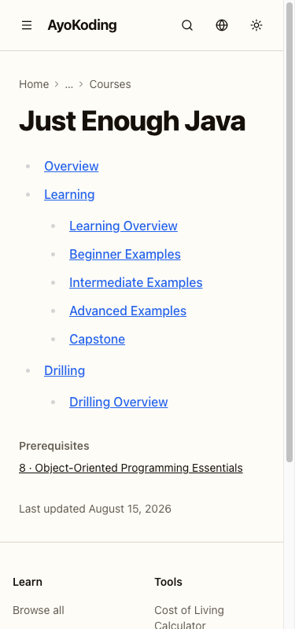
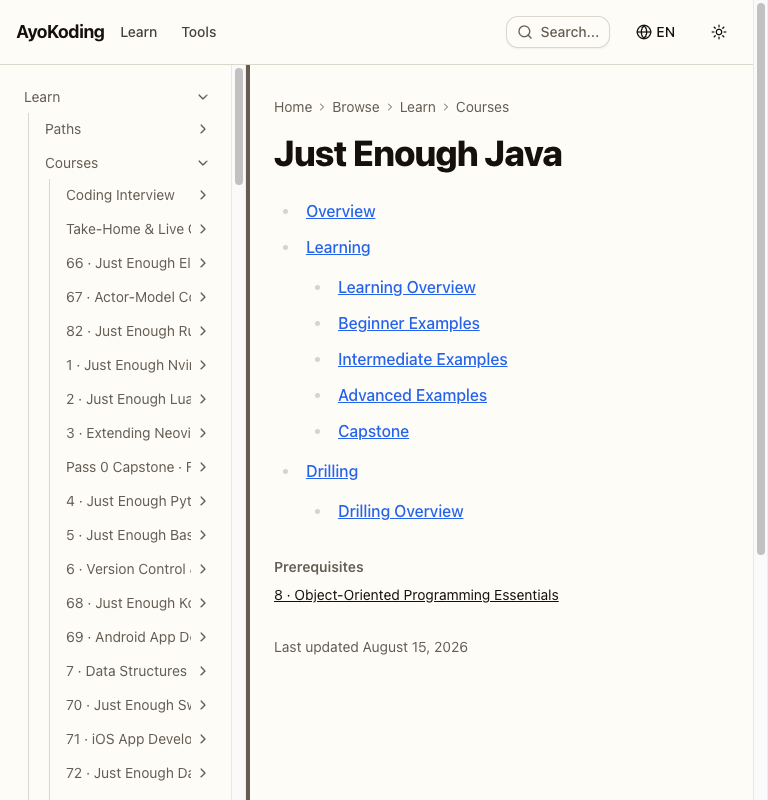
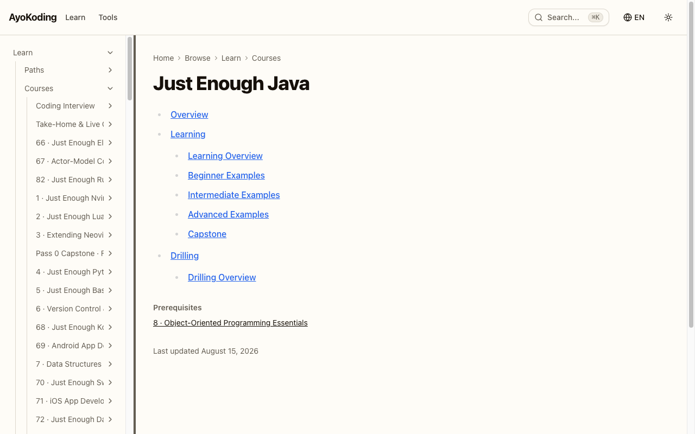
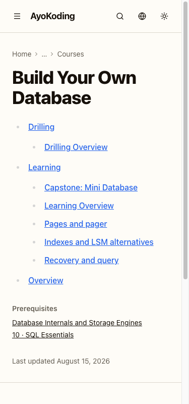
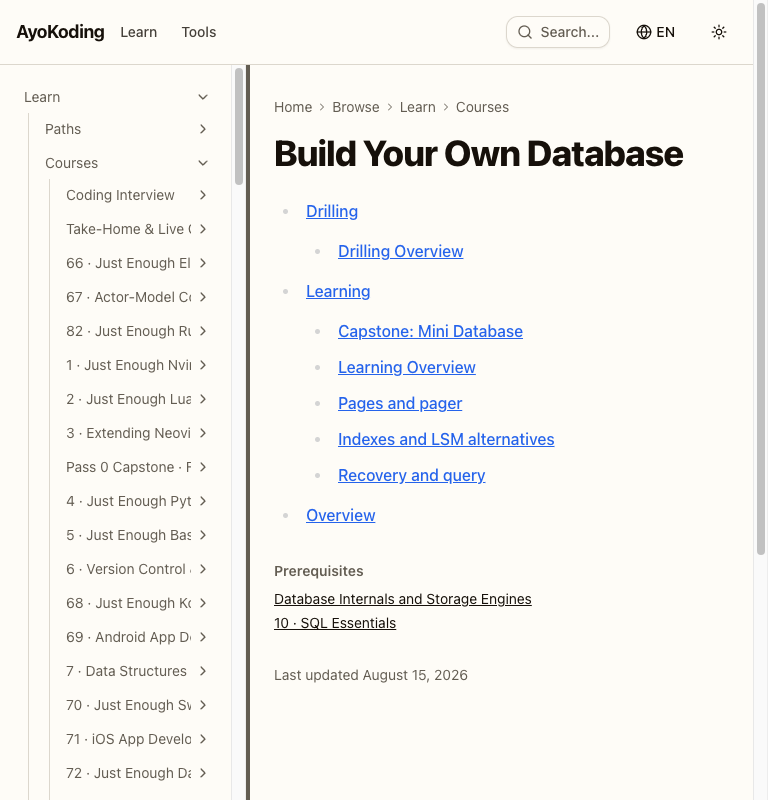
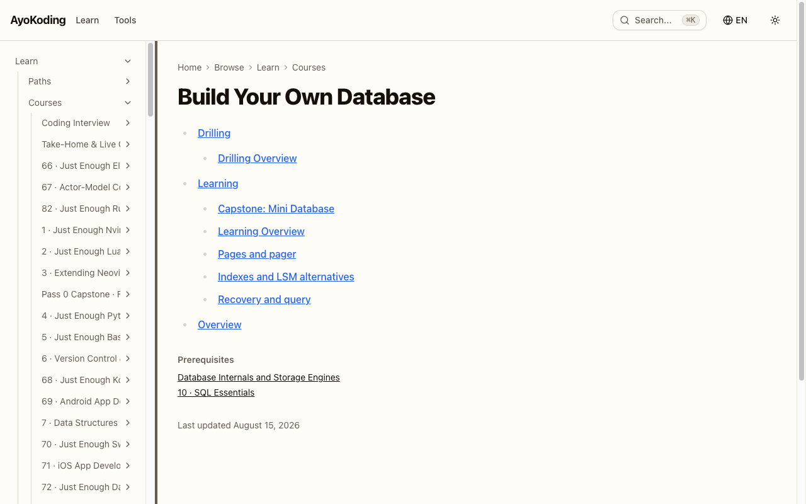
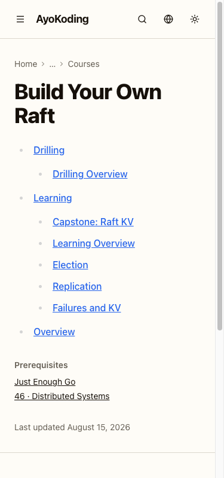
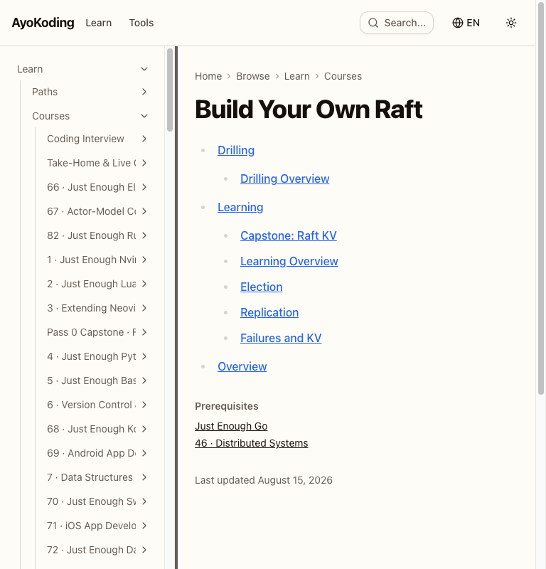
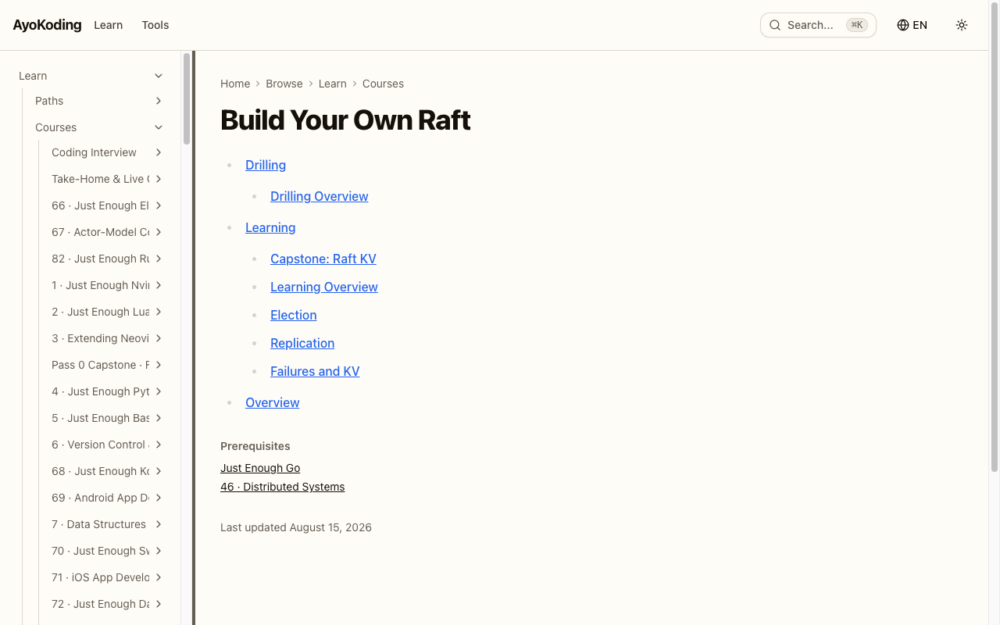

# Phase 4 Playwright MCP Evidence

Direct Playwright MCP verification used the production build at `http://127.0.0.1:3020`.
Each sampled English course page rendered at 375px, 768px, and 1280px with `html[lang]="en"`, its
prerequisites visible, and zero browser-console errors.

## Just Enough Java

## Build Your Own Database

## Build Your Own Raft

