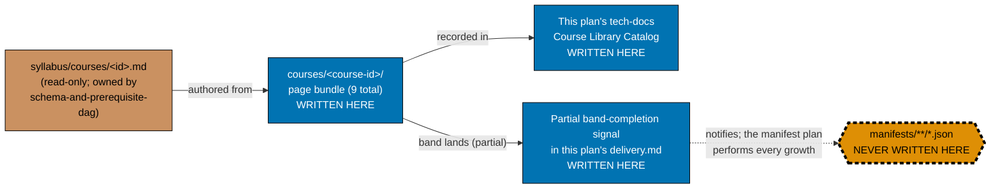
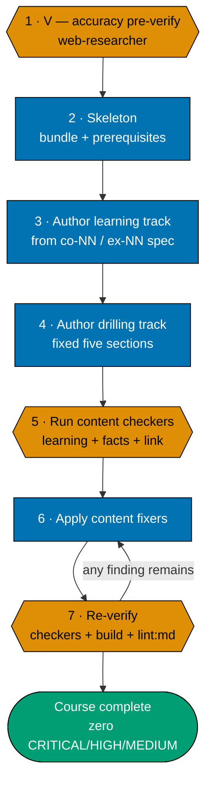

# Technical Docs — Course Authoring: JVM, Advanced Languages & Build-Your-Own Internals

## Corpus Custody

`custodied-by:ayokoding-learning-path-02-schema-and-prerequisite-dag` — this plan **reads** the shared
course corpus custodied by plan 02 but never edits, copies, or forks any file under it, per the
[Learning-Plan Syllabus Convention §Custody Rule](../../../repo-governance/conventions/structure/learning-plan-syllabus/custody-rule.md#custody-rule).
This mirrors `ayokoding-learning-path-04-course-authoring`'s own Corpus Custody declaration exactly —
this plan owns no `syllabus/` folder of its own; any needed change to the shared corpus is routed to
plan 02's own `delivery.md` as a change request, never authored here.

## Overview

This plan produces **content artefacts only**: 9 page bundles under
`apps/ayokoding-www/content/en/learn/courses/<course-id>/`. It writes no TypeScript, no JSON manifest data
file, no route, no component, and no redirect rule. Its "architecture" is therefore the same
**authoring architecture**
[`ayokoding-learning-path-04-course-authoring/tech-docs.md`](../../done/2026-08-02__ayokoding-learning-path-04-course-authoring/tech-docs.md#authoring-architecture)
defines, applied to this plan's 9-course slice.

## Programme decisions (inherited verbatim)

This plan cites the same shared programme decision ids `ayokoding-learning-path-04-course-authoring`
folds in from the retired shared programme file — `A6`, `A8`, `A12` are the ones this plan's own
content touches most directly:

- **`A6`** — build-founding depth, not build-a-system: the `build-your-own-*` trio teaches
  implementation depth (Git's object model, a storage engine's indexing/transaction mechanics, Raft
  consensus) as domain knowledge with a runnable artefact — this is explicitly **inside** `A6`'s scope
  (the four courses `A6` excludes are ERP/ledger capstones in a different domain entirely, not this
  plan's courses).
- **`A8`** — strict clean-room licensing, programme-wide. Binds every worked example, concept
  explanation, and diagram this plan authors; see [Licensing posture](#licensing-posture-programme-a8)
  below.
- **`A12`** — every syllabus is independently authored, then externally confirmed. This plan authors
  **from** the already-independently-authored `syllabus/courses/<id>.md` specs (plan 02's corpus); it
  performs no further syllabus authoring of its own.

Full prose for these ids is not re-derived here — see
[`ayokoding-learning-path-04-course-authoring/tech-docs.md`'s Programme decisions section](../../done/2026-08-02__ayokoding-learning-path-04-course-authoring/tech-docs.md#programme-decisions)
for the authoritative text.

## The manifest ownership invariant (binding)

> **This plan never edits a manifest file.** Every file under
> `apps/ayokoding-www/src/features/course-paths/manifests/` is owned by
> [`ayokoding-learning-path-12-careers-se-manifests`](../../backlog/ayokoding-learning-path-12-careers-se-manifests/README.md)
> (successor to the retired `ayokoding-learning-path-05-manifests`). A step
> here that creates, appends to, reorders, or re-verifies a `.json` manifest is a **boundary
> violation**, not a convenience.



**Accessibility note.** Write permission is carried by node **shape** and explicit label text
(`WRITTEN HERE` / `NEVER WRITTEN HERE` / `read-only`), and edge kind by **line style** plus edge
labels — never by fill colour alone, per the
[Color Accessibility Convention](../../../repo-governance/conventions/formatting/color-accessibility.md).

## Course Library Catalog

The 9 course bodies this plan authors, in the order presented by
`ayokoding-learning-path-04-course-authoring/tech-docs.md`'s own "Low-level systems, JVM & languages,
internals builds" catalog section, filtered to this plan's half. **Origin `T(n)`** = transferred FS-SE
topic `n` (authored here); **Origin `N`** = net-new. `prerequisites` are transcribed verbatim from that
catalog table `[Repo-grounded]`. Concept (`co-NN`) and example (`ex-NN`) counts are the highest-numbered
entry found in each course's settled spec file, confirmed by direct file read
``[Repo-grounded — measured against `plans/done/2026-07-24__ayokoding-learning-path-02-schema-and-prerequisite-dag/syllabus/courses/<id>.md`]``.

| Course ID                           | Origin | Format     | Primary language     | Prerequisites                                                               | Concepts (`co-NN`) | Examples (`ex-NN`) | Syllabus spec (relative to this file)                                                                                                 |
| ----------------------------------- | ------ | ---------- | -------------------- | --------------------------------------------------------------------------- | ------------------ | ------------------ | ------------------------------------------------------------------------------------------------------------------------------------- |
| `just-enough-java`                  | T(84)  | Primer     | Java                 | `object-oriented-programming-essentials`                                    | 28                 | 80                 | `../../done/2026-07-24__ayokoding-learning-path-02-schema-and-prerequisite-dag/syllabus/courses/just-enough-java.md`                  |
| `enterprise-java-and-the-jvm`       | T(85)  | By Example | Java                 | `just-enough-java`, `software-architecture`                                 | 30                 | 78                 | `../../done/2026-07-24__ayokoding-learning-path-02-schema-and-prerequisite-dag/syllabus/courses/enterprise-java-and-the-jvm.md`       |
| `lisp`                              | T(86)  | By Example | Scheme + Clojure     | `functional-programming`, `programming-paradigms`                           | 30                 | 78                 | `../../done/2026-07-24__ayokoding-learning-path-02-schema-and-prerequisite-dag/syllabus/courses/lisp.md`                              |
| `just-enough-fsharp`                | T(87)  | Primer     | F#                   | `functional-programming`, `object-oriented-programming-essentials`          | 26                 | 78                 | `../../done/2026-07-24__ayokoding-learning-path-02-schema-and-prerequisite-dag/syllabus/courses/just-enough-fsharp.md`                |
| `type-systems`                      | T(88)  | By Example | OCaml + Haskell + F# | `functional-programming`, `programming-paradigms`, `just-enough-typescript` | 30                 | 78                 | `../../done/2026-07-24__ayokoding-learning-path-02-schema-and-prerequisite-dag/syllabus/courses/type-systems.md`                      |
| `compilers-parsers-and-transpilers` | T(89)  | By Example | F#                   | `just-enough-fsharp`, `computer-science-foundations`, `type-systems`        | 30                 | 78                 | `../../done/2026-07-24__ayokoding-learning-path-02-schema-and-prerequisite-dag/syllabus/courses/compilers-parsers-and-transpilers.md` |
| `build-your-own-git`                | T(90)  | By Example | Python               | `just-enough-python`, `version-control-and-git`                             | 30                 | 78                 | `../../done/2026-07-24__ayokoding-learning-path-02-schema-and-prerequisite-dag/syllabus/courses/build-your-own-git.md`                |
| `build-your-own-database`           | T(91)  | By Example | Python               | `database-internals-and-storage-engines`, `sql-essentials`                  | 30                 | 78                 | `../../done/2026-07-24__ayokoding-learning-path-02-schema-and-prerequisite-dag/syllabus/courses/build-your-own-database.md`           |
| `build-your-own-raft`               | T(92)  | By Example | Go                   | `just-enough-go`, `distributed-systems`                                     | 30                 | 78                 | `../../done/2026-07-24__ayokoding-learning-path-02-schema-and-prerequisite-dag/syllabus/courses/build-your-own-raft.md`               |

**Prerequisite correction note** `[Repo-grounded]`: every cell above is re-transcribed verbatim from
each course's own settled `syllabus/courses/<course-id>.md` "Prior topics" line (re-verified by direct
file read). This replaces an earlier language-heuristic-derived version of this table (e.g. "this
course uses F#, so `just-enough-fsharp` must be a prerequisite") that disagreed with the syllabus for
7 of 9 rows — `just-enough-java`, `enterprise-java-and-the-jvm`, `lisp`, `just-enough-fsharp`,
`type-systems`, `compilers-parsers-and-transpilers`, and `build-your-own-database`; `build-your-own-git`
and `build-your-own-raft` were already correct. Two consequences of the correction are load-bearing for
the rest of this plan:

- `enterprise-java-and-the-jvm`'s second prerequisite, `software-architecture`, does **not** exist yet
  under `apps/ayokoding-www/content/en/learn/courses/` — see the
  [Dependency verification record](#dependency-verification-record) below and
  [delivery.md's Phase 1 hard gate](./delivery.md#phase-1-cohort-1--5-bodies-java-lisp-f-type-systems).
- `type-systems` does **not** list `just-enough-fsharp` as a prerequisite (the earlier catalog had this
  backwards) — its actual prerequisites are `functional-programming`, `programming-paradigms`, and
  `just-enough-typescript`, all already-shipped library courses, so this correction changes no gating
  outcome for `type-systems` itself.

**Formats used**: only **Primer** (`just-enough-java`, `just-enough-fsharp`) and **By Example** (the
remaining 7) appear in this plan's 9 courses — no Annotated-concept or general-content body. This
narrows the Rule-15-adjacent checker set to exactly two maker/checker families (see
[README.md's Rule-15 exemption](./README.md#rule-15-three-tester-retest--exemption-recorded)).

**Total scope**: 9 courses = the full 16-course Band 6 minus the 7 courses in
`ayokoding-learning-path-07-course-authoring-low-level-systems` (`just-enough-c`, `just-enough-cpp`,
`linux-os`, `windows-os`, `system-programming`, `just-enough-rust`, `modern-system-programming`).
9 + 7 = 16, matching plan04's Band 6 total `[Repo-grounded]`.

## Independence from plan 07 (verified)

Every one of this plan's 9 `prerequisites` cells above (re-verified against the corrected
[Course Library Catalog](#course-library-catalog)) was checked against plan 07's 7 course IDs.
Zero matches. Concretely, the union of prerequisite tokens across all 9 rows is:
`object-oriented-programming-essentials` (already-shipped), `just-enough-java` (in-plan),
`software-architecture` (Band 5, plan 06 — not yet on disk), `functional-programming`
(already-shipped), `programming-paradigms` (already-shipped), `just-enough-typescript`
(already-shipped), `just-enough-fsharp` (in-plan), `computer-science-foundations` (already-shipped),
`type-systems` (in-plan), `version-control-and-git` (already-shipped), `just-enough-python`
(already-shipped), `database-internals-and-storage-engines` (Band 1, plan04), `sql-essentials`
(already-shipped), `just-enough-go` (Band 4, plan 05), `distributed-systems` (Band 5, plan 06). None of
`just-enough-c`, `just-enough-cpp`, `linux-os`, `windows-os`, `system-programming`, `just-enough-rust`,
or `modern-system-programming` appears. **This plan and plan 07 run in parallel with no shared-file or
content-prerequisite edge in either direction**, as far as this plan's own catalog rows can attest — see
[README.md's "What I could NOT confirm"](./README.md#depends-on) for the one direction
this plan cannot check (whether plan 07's own not-yet-authored courses might reference one of this
plan's 9 IDs).

## Dependency verification record

This section states, for every cross-plan fact this plan's delivery checklist relies on, exactly what
was verified from source text versus what is asserted on the commissioning instruction's authority
alone.

| Claim                                                                                                                                                                         | Status                                                                                                                                                                                                                                                                                                                                                                                                                                                                                                                                                                                                                                                                                                                                                                                                                                                                                                           |
| ----------------------------------------------------------------------------------------------------------------------------------------------------------------------------- | ---------------------------------------------------------------------------------------------------------------------------------------------------------------------------------------------------------------------------------------------------------------------------------------------------------------------------------------------------------------------------------------------------------------------------------------------------------------------------------------------------------------------------------------------------------------------------------------------------------------------------------------------------------------------------------------------------------------------------------------------------------------------------------------------------------------------------------------------------------------------------------------------------------------- |
| `build-your-own-database`'s prerequisite `database-internals-and-storage-engines` (Band 1) is present                                                                         | `[Repo-grounded]` — confirmed directly via `test -d apps/ayokoding-www/content/en/learn/courses/database-internals-and-storage-engines` (exits 0) and plan04's own Course Library Catalog, which lists `database-internals-and-storage-engines` as a Band 1 (`T(36)`) authored body inside plan04's own already-merged scope. (Note: plan04's `delivery.md` Phase 8 is titled "Knowledge Capture" and its Pause Safety note reads only "`learnings.md` is fully triaged; nothing depends on querying it later" — it contains no prose about `build-your-own-raft` or `build-your-own-database`; an earlier version of this row fabricated a quotation attributed to that note and has been corrected here.) The settled syllabus spec's other prerequisite for this course is `sql-essentials`, not `just-enough-python` — corrected in this plan's own [Course Library Catalog](#course-library-catalog) above. |
| `build-your-own-raft`'s prerequisites are `just-enough-go` (Band 4) and `distributed-systems` (Band 5)                                                                        | `[Repo-grounded]` — plan04's Course Library Catalog row lists exactly these two, verbatim. `just-enough-go` appears under the catalog's "CS foundations, paradigms & concurrency" section header (= Band 4); `distributed-systems` appears under "Architecture, distributed & AI / harness" (= Band 5).                                                                                                                                                                                                                                                                                                                                                                                                                                                                                                                                                                                                          |
| `just-enough-go` now lives in `ayokoding-learning-path-05-course-authoring-platform-and-concurrency`                                                                          | `[Repo-grounded]` — this plan's dated archive exists under `plans/done/2026-08-04__ayokoding-learning-path-05-course-authoring-platform-and-concurrency/` and its `tech-docs.md:315` lists `just-enough-go` (`T(64)`, Primer, Go, prerequisites `—`). It remains a repository baseline context precondition: execution must verify terminal PR #133 is merged and then confirm the course directory exists on the checked-out integration branch.                                                                                                                                                                                                                                                                                                                                                                                                                                                                |
| `distributed-systems` now lives in `ayokoding-learning-path-06-course-authoring-architecture-and-ai-harness`                                                                  | `[Repo-grounded]` — this plan's folder now exists on disk under `plans/backlog/` and was read directly: `ayokoding-learning-path-06-course-authoring-architecture-and-ai-harness/tech-docs.md:434` lists `distributed-systems` (`T(46)`, By Example, Python, prerequisites `networking-essentials`, `concurrency-and-parallelism`). The same file's line 430 confirms the same plan also owns `software-architecture` (`T(42)`, Annotated-concept, Python) — `enterprise-java-and-the-jvm`'s corrected second prerequisite (see [Course Library Catalog](#course-library-catalog) above) — a genuine hard-gate discovery this plan's dependency picture previously missed entirely. Re-checked by course-directory existence at execution time — the plan folder existing does not mean either body has merged yet.                                                                                              |
| `build-your-own-raft` needs "Band 4 concurrency primitives (`csp-style-concurrency`, `actor-model-concurrency`)" as literally stated in this plan's commissioning instruction | **Could not confirm as a direct prerequisite.** The catalog row's literal `prerequisites` cell for `build-your-own-raft` is `just-enough-go`, `distributed-systems` — it does **not** list `csp-style-concurrency` or `actor-model-concurrency`. `just-enough-go` is the actual Band-4 course `build-your-own-raft` directly needs (both `just-enough-go` and `csp-style-concurrency`/`actor-model-concurrency` share the same "CS foundations, paradigms & concurrency" catalog section, i.e. the same Band 4, so the plan-level historical source context edge to whichever plan owns Band 4 is correct regardless), but the specific two named courses are not themselves declared prerequisites of `build-your-own-raft`. This plan's own gate therefore checks for `just-enough-go`'s existence, not for the two named concurrency courses'.                                                                |
| The `-05-`/`-06-` folder-name prefix is already in use by an unrelated existing plan pair                                                                                     | `[Repo-grounded]` — confirmed via directory listing: `plans/backlog/ayokoding-learning-path-05-manifests/` does **not** exist (it was retired and split into `ayokoding-learning-path-12-careers-se-manifests` and `ayokoding-learning-path-13-careers-ai-manifest`, both confirmed present under `plans/backlog/`); `ayokoding-learning-path-05-course-authoring-platform-and-concurrency` is archived under its dated `plans/done/` path and `ayokoding-learning-path-06-course-authoring-architecture-and-ai-harness` remains under `plans/backlog/`, each with a full five-file plan structure — the `-05-`/`-06-` prefix collision is confirmed real and current (each numeral now in use by exactly one plan), not merely anticipated.                                                                                                                                                                     |
| `vercel-function-cost-reduction`'s root cause and fix location                                                                                                                | `[Repo-grounded]` — read in full from `plans/done/2026-08-02__vercel-function-cost-reduction/README.md` and `tech-docs.md`: zero of ~2,068 pages prerendered, `.next/prerender-manifest.json` shows `routes` length 4, fix lands in that plan's Phases 1–3 (root-layout promotion, client-side `?path=`, middleware deletion).                                                                                                                                                                                                                                                                                                                                                                                                                                                                                                                                                                                   |
| This plan has "more inbound edges than any other new sibling plan"                                                                                                            | `[Judgment call]` — this plan cannot read the other new sibling plans' own dependency tables, since they are being authored concurrently and are not yet on disk. The claim is scoped to what this plan can observe: five repository baseline context edges (01, 02, 04, 05, 06) plus the new `vercel-function-cost-reduction` edge is more than the two-plus-baseline a dependency-light band would carry.                                                                                                                                                                                                                                                                                                                                                                                                                                                                                                      |

## Authoring architecture

### The course page bundle (inherited)

Every authored course is a page bundle at `<COURSES><course-id>/` with the fixed anatomy plan04's
tech-docs.md defines:

```text
<COURSES><course-id>/
├── _index.md                 declares `prerequisites: [course-id, ...]` (contracted shape)
├── overview.md               purpose + `## Prerequisites` (earlier library courses only)
│                             + register + the explicit scope boundary against confusable siblings
├── learning/
│   ├── _index.md
│   ├── <concept + example pages, exhaustive `co-NN` / `ex-NN` coverage>
│   ├── code/                 colocated runnable examples (code-bearing courses only)
│   └── capstone/             the course's own intra-course capstone
└── drilling/
    ├── _index.md              lists the drilling sections, links to `overview.md`
    └── overview.md            the fixed five-section drilling order
```

The `course-id` slug, the prerequisite chain, the concept-coverage floor, and the worked-example volume
are all **settled** in the matching `syllabus/courses/<course-id>.md` spec (see the catalog table
above for each). Authoring transcribes them; it does not re-decide them.

### The per-course authoring convention (maker-checker-fixer, not code TDD)



**Accessibility note.** Stage kind is carried by node **shape** (hexagon = verify, rectangle = produce,
stadium = terminal) and by the numbered step labels; the retry edge carries an explicit label. Colour
is redundant throughout.

**This is deliberately not a Red→Green→Refactor cycle.** Content authoring is a maker-checker-fixer
workflow, not code TDD — there is no failing test to write first, because the artefact under
production is prose and worked examples validated by domain checkers, not application behaviour
validated by assertions, exactly as
[`ayokoding-learning-path-04-course-authoring/tech-docs.md`'s TDD exemption](../../done/2026-08-02__ayokoding-learning-path-04-course-authoring/tech-docs.md#the-per-course-authoring-convention-maker-checker-fixer-not-code-tdd)
states for the whole library.

### Licensing posture (programme A8)

Same six hazards `ayokoding-learning-path-04-course-authoring/tech-docs.md` names, applied to this
plan's 9 bodies:

- **Code examples** — `build-your-own-git`'s, `build-your-own-database`'s, and `build-your-own-raft`'s
  worked implementations are authored originally, never copied from a tutorial or Stack Overflow
  (CC-BY-SA — attribution and share-alike, a licence course material generally cannot satisfy).
- **Documentation prose** — `enterprise-java-and-the-jvm`'s Spring/JVM-ecosystem explanations restate
  ideas in this course's own words with a citation, never a paraphrase-by-substitution of Spring's or
  Oracle's own docs.
- **Figures/diagrams** — any diagram in these 9 bodies is authored Mermaid, never a lifted screenshot.
- **Book/course structure** — `compilers-parsers-and-transpilers`'s lexer→parser→AST progression is
  authored from its own spec's `co-NN` order, never from reproducing a well-known compilers textbook's
  chapter sequence.
- **Trademarks** — "Java", "Clojure", "F#", "Go" appear nominatively only.
- **Datasets** — any sample data a worked example touches (e.g. a small Raft test cluster's simulated
  workload) is authored for the example.

### The `prerequisites` frontmatter contract (consumed, not owned)

Same contract plan04's tech-docs.md defines, owned by plan 02: this plan transcribes the
`prerequisites: [course-id, ...]` list from each course's own spec, never re-derives it. If this
document and the schema plan's ever disagree, the schema plan's wins.

## Cross-plan `syllabus/` reference rule (binding)

Identical rule to plan04's own: every reference to the shared `syllabus/` detail layer uses the full
cross-plan relative path
`../../done/2026-07-24__ayokoding-learning-path-02-schema-and-prerequisite-dag/syllabus/<rest>`, never
a `./syllabus/...` form (which resolves to nothing, since this plan owns no `syllabus/` folder), and is
never copied.

**Link-validation mechanics** — identical invocation to plan04's, filtered to this plan's own folder
name:

```bash
apps/rhino-cli/scripts/rhino-bin.sh md links validate \
  --quiet \
  --exclude plans/done \
  --exclude apps/ayokoding-www/content \
  --exclude apps/ose-www/content 2>&1 | grep -F "ayokoding-learning-path-10-course-authoring-jvm-and-build-your-own"
```

Acceptance: the `grep` finds **no** matching line (exits 1). Falsifiable the other way too — introduce
one bad `../../done/2026-07-24__ayokoding-learning-path-02-schema-and-prerequisite-dag/syllabus/` link
and the same command prints that file and exits 0.

## TDD exemption — this plan ships no application code

Same exemption plan04 states: this plan authors zero TypeScript, zero application logic, and zero
tests in the code-TDD sense. Every "test" here is a content checker (learning/facts/link) or a
grep-checkable acceptance clause on the authored markdown, per the
[Test-Driven Development Convention](../../../repo-governance/development/workflow/test-driven-development.md)'s
own carve-out for content-only plans.

## File-Impact Analysis

Root-relative annotated tree — the scan-first source of truth for this plan's scope. **[E]** edit,
**[N]** new file/pattern, **[D]** delete, **[G]** generated/regenerated.

```text
.
├── apps/ayokoding-www/content/en/learn/courses/
│   ├── _index.md [E] — append one catalog row per landed course ID
│   └── <course-id>/ [N] — 9 bundles; bounded family, members enumerated verbatim in
│       │                  evidence/authored-body-slugs.txt (written in Phase 0), never by glob
│       ├── _index.md [N] — declares `prerequisites: [course-id, ...]`
│       ├── overview.md [N] — purpose, prerequisites, register, scope boundary
│       ├── learning/ [N] — `_index.md`, co-NN/ex-NN pages, `code/`, `capstone/`
│       └── drilling/ [N] — `_index.md` + `overview.md` (fixed five-section order)
├── plans/in-progress/ayokoding-learning-path-10-course-authoring-jvm-and-build-your-own/
│   ├── tech-docs.md [E] — this file; the Course Library Catalog rows
│   ├── delivery.md [E] — checkbox ticks + the five-field band-completion signal
│   ├── learnings.md [E] — running log, drained by the Knowledge Capture phase
│   └── evidence/ [N] — phase-0 snapshot, authored-body-slugs.txt, Playwright screenshots
└── apps/ayokoding-www/src/features/course-paths/ — NOT TOUCHED (zero-diff gate every phase)
```

### More Detail

The `<course-id>/` bundles are the only `*`-shaped family in the tree, and they are bounded by
construction: the exact member list is written to `evidence/authored-body-slugs.txt` during Phase 0,
and every later assertion reads that register rather than globbing the directory — so a slug that
drifted into the tree from a sibling band plan can never be silently adopted as this plan's work.

`apps/ayokoding-www/content/en/learn/courses/_index.md` is generated from course directories; this plan does not edit it manually outside
its own plan folder. It is **appended to**, never rewritten, so a concurrent sibling band plan adding
its own rows produces a mergeable diff rather than a conflict.

Nothing under `apps/ayokoding-www/src/` carries an action annotation because this plan writes no
application code at all. That absence is **asserted** by the zero-diff manifest gate in every phase,
not merely assumed — the manifest subtree is named separately below because reading it is permitted
and writing it is a boundary violation, a distinction the tree alone cannot carry.

## Rollback

Every artefact this plan produces is an **additive** new directory under `<COURSES>`. Nothing is
moved, renamed, or deleted, so rollback is subtractive and total, mirroring
[`ayokoding-learning-path-04-course-authoring/tech-docs.md`'s own Rollback section](../../done/2026-08-02__ayokoding-learning-path-04-course-authoring/tech-docs.md#rollback),
adapted to this plan's two delivery boundaries (Cohort 1, Cohort 2):

- **Per delivery boundary (Cohort)**: revert that cohort's merge commit. The cohort's course bodies
  disappear with no cross-cohort blast radius — bodies are content-independent, each writing only its
  own subtree under `<COURSES>`. If the reverted boundary is Cohort 2 (the boundary that records the
  partial band-completion signal), the signal is reverted with it, so the manifest plan
  (`ayokoding-learning-path-12-careers-se-manifests`) sees no stale signal. Reverting Cohort 1 alone
  leaves Cohort 2 unaffected only if Cohort 2 has not yet merged; once Cohort 2 has merged, Cohort 1's
  courses are prerequisites of some Cohort 2 courses (`compilers-parsers-and-transpilers` needs
  `just-enough-fsharp` and `type-systems`), so reverting Cohort 1 after Cohort 2 has landed requires
  reverting Cohort 2 first.
- **Per course**: `git rm -r <COURSES><course-id>/` plus removing its row from this plan's own
  Course Library Catalog and its entry from `<COURSES>_index.md`. Safe **only** if no manifest already
  references the ID — check with the manifest plan first, since the reference direction is
  manifest → body.
- **Whole plan**: revert both cohort merges in reverse order (Cohort 2 first, then Cohort 1). The
  `courses/` bucket returns to its state before this plan's first merge; no other course-authoring
  sibling plan's bodies are affected, since bodies are content-independent.

**The one-way door**: once a manifest references one of this plan's 9 course IDs, deleting that body
breaks `checkManifestIntegrity` downstream. That is why the ordering is bodies-first,
manifest-growth-after — and why this plan may never grow a manifest itself (see
[The manifest ownership invariant](#the-manifest-ownership-invariant-binding) above).
